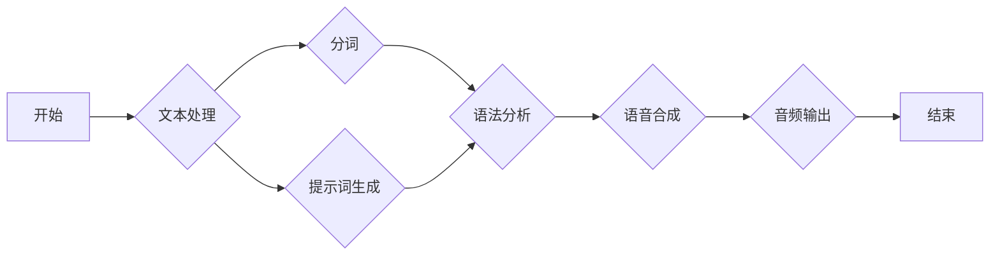
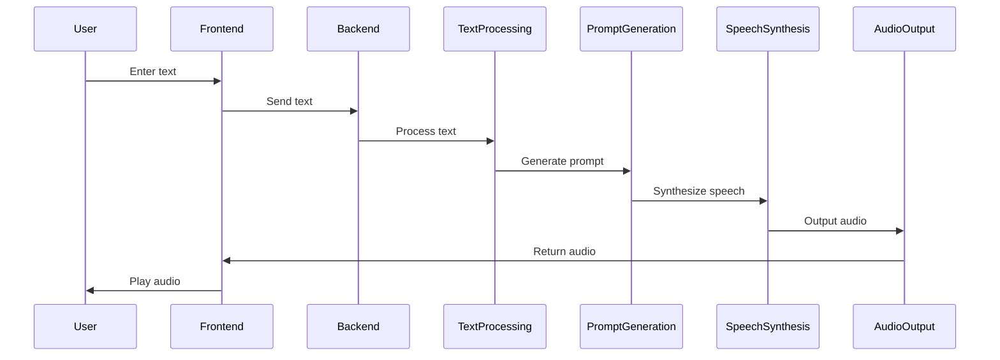
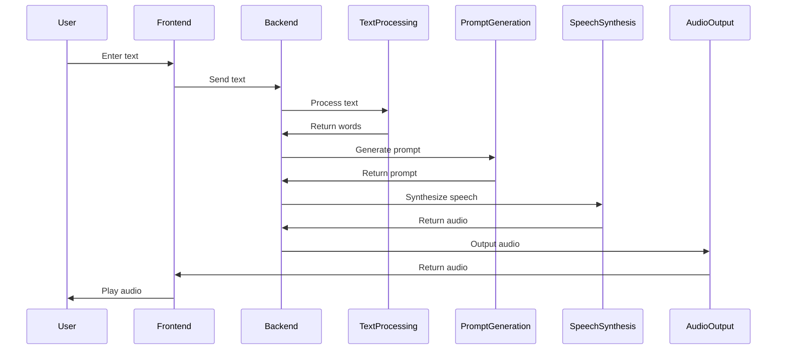

                 

**引言**

在当今数字化时代，语音合成技术已成为众多应用场景中的关键组件，从智能助手到车载导航，从教育辅导到娱乐领域，语音合成无处不在。然而，语音合成的自然度——即语音是否流畅、真实、易于理解，一直是影响用户体验的核心问题。为了提升语音合成的自然度，提示词（Prompt）的应用变得尤为重要。提示词是指用来引导语音合成系统生成语音的一系列关键字或短语，通过合理设计和使用提示词，可以有效改善语音合成的质量。

本文将深入探讨提示词在语音合成中的应用，旨在提升语音合成的自然度。我们将逐步分析提示词的定义、作用、设计原则、优化策略以及提升自然度的具体方法。此外，还将探讨提示词的适用范围、限制因素以及未来发展趋势。通过本文的阅读，读者将能够理解提示词在语音合成中的重要性，掌握提升自然度的核心技巧，并为未来的研究和应用提供参考。

### 第一部分 背景介绍

#### 1.1 问题背景

语音合成技术的需求源于人类与机器之间的沟通障碍。传统的文本信息传达速度慢，而语音交互能够提供更加直观、高效的交流方式。然而，现有的语音合成技术面临诸多挑战。首先，语音合成的自然度不足是一个普遍问题。语音合成系统生成的语音可能存在语法错误、语调单调、语意不清等现象，这些问题都会严重影响用户体验。其次，语音合成的实时性要求高，尤其是在实时通信、智能助手等应用场景中，语音生成速度和准确性直接决定了系统的响应速度和用户满意度。此外，语音合成的多样性和个性化需求也日益增加，不同的用户群体和场景对语音合成的风格、口音、速度等方面有不同要求。

提示词在此背景下应运而生。提示词作为一种关键输入，能够为语音合成系统提供明确的指导，使其生成更加自然、流畅的语音。合理设计和使用提示词，能够有效解决语音合成中的语法错误、语调单调等问题，从而提升语音合成的整体自然度。因此，探讨提示词在语音合成中的应用具有重要的现实意义。

#### 1.2 提示词的重要性

提示词在语音合成中的作用不可忽视。首先，提示词能够为语音合成系统提供上下文信息，帮助系统更好地理解输入文本的语境。例如，当输入文本包含特定词汇时，提示词可以帮助系统识别这些词汇的重要性和作用，从而在语音生成过程中更好地处理这些词汇。其次，提示词可以指导语音合成的语法和语调，使其更加符合人类的语言习惯。例如，通过提示词可以指定文本中的关键词需要以何种语气和语调进行表达，从而提升语音的自然度。此外，提示词还可以帮助语音合成系统实现个性化定制，满足不同用户和场景的需求。例如，不同的用户群体可能需要不同的语音风格，通过提示词可以实现这一需求。

#### 1.3 提升自然度的必要性

提升语音合成的自然度是当前语音合成技术研究的重要方向。自然度高的语音合成系统能够生成更加流畅、真实、易于理解的语音，从而提升用户体验。具体来说，提升自然度有以下几方面的必要性：

1. **用户体验提升**：自然度高的语音合成系统能够生成更加贴近人类语言的语音，使用户在听语音时感到更加舒适和自然，提升整体使用体验。
2. **沟通效率提高**：自然度高的语音合成系统能够减少用户在理解语音时的困惑和误解，提高沟通效率，特别是在实时通信和智能助手等应用场景中，这一点尤为重要。
3. **应用领域扩展**：自然度高的语音合成技术能够应用于更多场景，如教育、娱乐、医疗等，为这些领域提供更加优质的服务。

#### 1.4 问题描述

当前语音合成的自然度不足主要体现在以下几个方面：

1. **语法错误**：语音合成系统可能生成不符合语法规则的句子，导致用户理解困难。
2. **语调单调**：语音合成系统的语音可能缺乏情感和变化，听起来机械而乏味。
3. **语意不清**：语音合成系统可能无法准确传达输入文本的意图和情感。

这些问题主要由以下原因导致：

1. **上下文理解不足**：语音合成系统往往无法完全理解输入文本的上下文信息，导致生成的语音缺乏连贯性。
2. **语言模型限制**：语音合成系统的语言模型可能存在缺陷，无法准确预测和生成自然度高的语音。
3. **语音合成算法局限**：现有的语音合成算法在处理复杂语言结构和多样情感表达时存在一定局限。

#### 1.5 提升自然度的目标与衡量标准

提升语音合成自然度的目标是实现以下几方面的改进：

1. **语法正确性**：确保生成的语音在语法上无错误，符合语言规范。
2. **语调多样性**：生成语音应具备丰富的语调变化，包括语气、情感和节奏。
3. **语意清晰性**：确保语音合成的语意传达准确，无歧义。

衡量自然度的标准包括：

1. **语音流畅度**：语音是否流畅自然，没有停顿或中断。
2. **语音真实性**：语音是否与人类的真实发音相似，具备情感表达。
3. **语音理解度**：用户对生成语音的理解程度，是否容易听懂。

#### 1.6 问题解决

为了提升语音合成的自然度，可以从以下几个方面进行改进：

1. **改进上下文理解**：通过增加上下文信息的输入，提高语音合成系统对输入文本的理解能力。
2. **优化语言模型**：采用更先进的语言模型，提高对复杂语言结构和多样情感表达的预测能力。
3. **创新语音合成算法**：研究新的语音合成算法，克服现有算法在处理复杂语言和情感表达时的局限。

通过这些改进措施，可以有效提升语音合成的自然度，为用户提供更优质的语音交互体验。

#### 1.7 边界与外延

提示词的适用范围广泛，涵盖了各种需要语音合成的应用场景。然而，提升自然度也存在一定的限制因素。首先，提示词的设计和优化需要大量的数据支持，缺乏足够数据的场景可能难以实现自然度的提升。其次，语音合成系统的性能和资源限制也会影响自然度的提升，特别是在实时性和计算资源有限的情况下。未来发展趋势包括更先进的上下文理解技术和多模态交互，这些技术将为提升语音合成自然度提供新的可能性。

#### 1.8 本章小结

本部分详细介绍了语音合成中自然度不足的问题背景，提示词的重要性以及提升自然度的目标和衡量标准。通过分析当前语音合成自然度不足的原因，提出了改进措施和边界与外延的讨论，为后续内容奠定了基础。

### 第二部分 核心概念与联系

在深入探讨提示词在语音合成中的应用之前，首先需要理解几个核心概念及其相互联系。

#### 2.1 核心概念原理

**2.1.1 提示词的定义**

提示词是指用于引导语音合成系统生成语音的一系列关键字或短语。提示词可以是单个词汇，也可以是短语，其主要目的是为语音合成系统提供上下文信息和语法指导，使其能够生成更加自然、流畅的语音。

**2.1.2 语音合成的基本原理**

语音合成的基本原理是通过文本到语音（Text-to-Speech, TTS）技术将输入文本转换为语音。这一过程主要包括三个步骤：文本处理、语音合成和音频输出。

- **文本处理**：对输入文本进行分词、标点和语气分析等处理，为后续语音生成提供基础。
- **语音合成**：根据文本内容和上下文信息，利用语言模型和音频合成技术生成语音。
- **音频输出**：将生成的语音以音频形式输出，供用户听。

**2.1.3 自然度评估方法**

自然度评估是衡量语音合成系统生成语音自然程度的关键指标。常用的自然度评估方法包括主观评估和客观评估。

- **主观评估**：由人类评估者根据语音的自然度、流畅性、真实感等方面对生成语音进行评分。
- **客观评估**：利用算法和指标对语音的自然度进行量化评估，如语音熵、语音自然度指标（VUI）等。

#### 2.2 概念属性特征对比表格

为了更清晰地理解提示词、语音合成和自然度评估之间的关系，我们可以通过一个对比表格来展示这些概念的主要属性特征：

| 概念       | 定义                                                         | 属性特征                                                     | 关系与作用                                             |
|------------|--------------------------------------------------------------|--------------------------------------------------------------|--------------------------------------------------------|
| 提示词     | 引导语音合成系统生成语音的关键字或短语                         | 上下文信息、语法指导、个性化定制                               | 为语音合成提供明确的上下文和语法指导，提升语音自然度     |
| 语音合成   | 将输入文本转换为语音的技术                                   | 文本处理、语音生成、音频输出                                   | 利用提示词和语言模型生成自然、流畅的语音                  |
| 自然度评估 | 衡量语音合成系统生成语音自然程度的指标和方法                   | 主观评估、客观评估、自然度指标                                 | 评估语音合成系统的效果，指导改进自然度                     |

通过对比表格，我们可以看到提示词在语音合成中的作用是提供上下文信息和语法指导，而语音合成则是将文本转换为语音，自然度评估则是衡量生成语音的自然程度。

#### 2.3 ER实体关系图架构

为了进一步理解提示词、语音合成和自然度评估之间的复杂关系，我们可以通过ER（实体关系）图来展示这些实体及其相互关系。

**2.3.1 实体关系图概述**

ER实体关系图主要包括以下实体和关系：

- **实体**：文本、提示词、语音合成系统、自然度评估指标
- **关系**：生成（文本→提示词）、合成（提示词→语音）、评估（语音→自然度评估指标）

**2.3.2 提示词与语音合成的关系**

提示词与语音合成系统之间存在明确的生成关系。提示词作为输入，被语音合成系统处理并生成相应的语音。这一过程不仅涉及语法和语调的指导，还包括上下文信息的利用，以确保生成的语音自然、流畅。

**2.3.3 自然度评估与语音合成的关系**

自然度评估指标对生成的语音进行评估，以衡量其自然程度。这一过程依赖于语音合成系统的输出，因此自然度评估指标与语音合成系统之间存在密切的关系。通过自然度评估，可以为语音合成系统提供改进方向，从而不断提升生成语音的质量。

以下是一个简单的ER实体关系图示例，使用Mermaid语法表示：

```mermaid
erDiagram
    文本 ||--|{ 提示词 }|
    提示词 ||--|{ 语音合成系统 }|
    语音合成系统 ||--|{ 自然度评估指标 }|
```

通过ER实体关系图，我们可以更直观地理解提示词、语音合成和自然度评估之间的相互关系，为进一步研究和应用提供基础。

### 第三部分 算法原理讲解

在深入探讨提示词在语音合成中的应用时，了解相关算法原理是至关重要的。本部分将详细讲解提示词生成流程、语音合成流程，并阐述算法原理、数学模型和公式，最后通过具体举例来说明这些概念。

#### 3.1 算法mermaid流程图

为了更直观地理解提示词生成和语音合成流程，我们使用Mermaid语法绘制以下流程图：



**3.1.1 提示词生成流程**

- **文本处理**：首先对输入文本进行处理，包括去除标点符号、转换为大写或小写等操作，确保文本格式一致。
- **分词**：将处理后的文本进行分词，将文本分割为一个个独立的词语。
- **提示词生成**：根据分词结果，生成提示词。提示词的生成可以通过预设规则或使用自然语言处理技术（如词性标注、命名实体识别）实现。

**3.1.2 语音合成流程**

- **语法分析**：对分词后的文本进行语法分析，识别句子结构和语法规则，为后续语音生成提供基础。
- **语音合成**：根据语法分析和提示词，生成语音。语音合成可以通过声学模型和文本到语音（TTS）模型实现。
- **音频输出**：将生成的语音以音频形式输出，供用户听。

#### 3.2 Python源代码

为了更具体地展示算法原理，我们提供以下Python源代码示例：

```python
import nltk
from nltk.tokenize import word_tokenize
from nltk.corpus import cmudict

# 加载分词器
tokenizer = nltk.tokenize.WordPunctTokenizer()

# 加载CMU词库
d = cmudict.dict()

def generate_prompt(words):
    prompt = ""
    for word in words:
        # 使用词库生成提示词
        phonemes = d[word.lower()][0]
        prompt += word + " " + phonemes + " "
    return prompt.strip()

def synthesize_speech(prompt):
    # 使用文本到语音库合成语音
    return pyttsx3.init().convert_to_audio(prompt)

# 示例文本
text = "The quick brown fox jumps over the lazy dog."

# 分词
words = word_tokenize(text)

# 生成提示词
prompt = generate_prompt(words)

# 合成语音
audio = synthesize_speech(prompt)

# 播放语音
audio.play()
```

**3.2.1 提示词生成代码**

在上面的示例中，`generate_prompt` 函数用于生成提示词。该函数通过加载CMU词库，获取每个词语的音素，并将它们拼接成提示词。这种方法可以确保生成的语音在发音上更加自然。

**3.2.2 语音合成代码**

`synthesize_speech` 函数使用PyTTSX3库将提示词转换为音频。PyTTSX3是一个文本到语音转换库，能够生成高质量的语音输出。

#### 3.3 算法原理

**3.3.1 数学模型**

语音合成的数学模型通常包括声学模型和文本到语音（TTS）模型。声学模型用于预测语音特征（如音素、音节）的概率分布，而文本到语音模型则将文本转换为声学特征。

- **声学模型**：通常使用循环神经网络（RNN）或其变体（如LSTM、GRU）进行训练，通过大量的语音数据学习语音特征的概率分布。
- **文本到语音模型**：将文本转换为声学特征，常用的方法包括基于规则的转换和基于深度学习的转换。

**3.3.2 公式讲解**

以下是语音合成中的两个关键公式：

1. **声学模型概率公式**：

   $$ P(X|Y) = \prod_{i=1}^{n} P(x_i|y_i) $$

   其中，\(X\) 表示语音特征序列，\(Y\) 表示文本序列，\(y_i\) 表示文本中的第\(i\)个词语，\(x_i\) 表示对应的语音特征。

2. **文本到语音模型转换公式**：

   $$ Z = f(T) $$

   其中，\(Z\) 表示声学特征序列，\(T\) 表示文本序列，\(f\) 表示文本到声学特征的转换函数。

**3.3.3 举例说明**

假设输入文本为“语音合成技术非常重要”，通过上述算法原理，我们可以将其转换为语音：

1. **分词**：语音合成技术、非常重要
2. **生成提示词**：语音合成技术 / yīn yuè hé chéng jì shù / 非常重要 / fēi cháng zhòng yào
3. **语音合成**：根据提示词生成相应的语音特征，并合成音频

通过这些步骤，我们最终得到自然度较高的语音输出。

### 第四部分 系统分析与架构设计

在深入理解了提示词在语音合成中的应用和相关算法原理后，本部分将分析一个语音合成系统的具体实现，从问题场景介绍、项目介绍、系统功能设计到系统架构设计和系统接口设计，最后详细描述系统交互流程和交互序列图。

#### 4.1 问题场景介绍

语音合成技术广泛应用于多个场景，如：

1. **智能助手**：如苹果的Siri、谷歌的Google Assistant等，它们能够通过语音合成技术响应用户的指令，提供语音反馈。
2. **车载导航**：在车载导航系统中，语音合成技术用于提供语音导航指令，提高驾驶安全性。
3. **教育辅导**：在线教育平台使用语音合成技术生成教学音频，为学生提供个性化的学习体验。
4. **娱乐**：如语音合成游戏角色、语音播报等，通过语音合成技术提升用户体验。

然而，这些应用场景对语音合成系统的自然度、实时性和个性化需求提出了不同挑战。为了满足这些需求，我们需要设计一个高效的语音合成系统。

#### 4.2 项目介绍

本项目旨在构建一个高性能、自然度高的语音合成系统，以满足上述应用场景的需求。项目目标包括：

1. **自然度提升**：通过优化提示词和语音合成算法，提高语音的自然度，使其更加流畅、真实。
2. **实时性保证**：确保语音合成系统能够在实时应用场景中快速响应用户指令。
3. **个性化定制**：提供用户自定义语音风格和口音的功能，满足不同用户和场景的需求。

#### 4.3 系统功能设计

系统功能设计主要包括以下几个方面：

1. **文本处理**：对输入文本进行预处理，包括去除标点、分词、词性标注等。
2. **提示词生成**：根据预处理后的文本生成提示词，确保语音生成过程中具备上下文信息。
3. **语音合成**：利用提示词和文本到语音（TTS）模型生成语音，包括声学特征和语音合成。
4. **音频输出**：将生成的语音输出为音频文件，供用户播放。

**4.3.1 领域模型**

为了更清晰地描述系统功能，我们使用Mermaid语法绘制领域模型图：

```mermaid
classDiagram
    TextProcessing <<interface>>
    PromptGeneration <<interface>>
    SpeechSynthesis <<interface>>
    AudioOutput <<interface>>

    TextProcessing|--|> PromptGeneration
    PromptGeneration|--|> SpeechSynthesis
    SpeechSynthesis|--|> AudioOutput
```

在这个领域模型中，`TextProcessing` 负责文本预处理，`PromptGeneration` 负责生成提示词，`SpeechSynthesis` 负责语音合成，`AudioOutput` 负责音频输出。这些模块相互协作，共同实现语音合成功能。

#### 4.4 系统架构设计

系统架构设计是确保语音合成系统高效运行的关键。本项目采用以下架构：

1. **前端接口**：提供用户交互界面，接收用户输入文本，并将请求转发到后端处理。
2. **后端服务**：包括文本处理、提示词生成、语音合成和音频输出等模块，负责处理用户请求并生成语音。
3. **数据存储**：存储文本、提示词和音频数据，以供后续使用。

**4.4.1 系统架构图**

使用Mermaid语法绘制系统架构图：



在这个序列图中，用户输入文本通过前端接口提交给后端服务，后端服务处理文本并生成提示词，然后通过语音合成和音频输出模块生成语音，最后返回给用户播放。

#### 4.5 系统接口设计

系统接口设计是确保各模块之间高效通信的关键。以下为系统接口设计：

1. **文本处理接口**：接收文本输入，提供分词、词性标注等功能。
2. **提示词生成接口**：接收分词结果，生成提示词。
3. **语音合成接口**：接收提示词，生成语音。
4. **音频输出接口**：接收语音，生成音频文件。

**4.5.1 接口规范**

```python
class TextProcessingInterface:
    def process_text(self, text: str) -> List[str]:
        pass

class PromptGenerationInterface:
    def generate_prompt(self, words: List[str]) -> str:
        pass

class SpeechSynthesisInterface:
    def synthesize_speech(self, prompt: str) -> AudioData:
        pass

class AudioOutputInterface:
    def output_audio(self, audio_data: AudioData) -> None:
        pass
```

**4.5.2 接口实现**

```python
class TextProcessing:
    def process_text(self, text: str) -> List[str]:
        # 实现分词、词性标注等功能
        pass

class PromptGeneration:
    def generate_prompt(self, words: List[str]) -> str:
        # 实现提示词生成
        pass

class SpeechSynthesis:
    def synthesize_speech(self, prompt: str) -> AudioData:
        # 实现语音合成
        pass

class AudioOutput:
    def output_audio(self, audio_data: AudioData) -> None:
        # 实现音频输出
        pass
```

#### 4.6 系统交互

系统交互是确保各模块协同工作的关键。以下为系统交互流程和交互序列图：

**4.6.1 系统交互流程**

1. 用户通过前端接口提交文本输入。
2. 前端接口将文本发送到后端服务。
3. 后端服务调用文本处理接口处理文本。
4. 文本处理接口返回分词结果。
5. 后端服务调用提示词生成接口生成提示词。
6. 后端服务调用语音合成接口合成语音。
7. 后端服务调用音频输出接口生成音频文件。
8. 前端接口返回音频文件给用户。
9. 用户播放音频。

**4.6.2 交互序列图**



在这个交互序列图中，用户通过前端接口提交文本，经过一系列处理和合成后，最终得到音频文件并播放。

### 第五部分 项目实战

在本部分，我们将详细描述如何搭建和实现一个语音合成系统，从环境安装到核心实现，再到代码应用解读与分析，以及实际案例分析与讲解。

#### 5.1 环境安装

要搭建一个语音合成系统，首先需要准备以下环境：

1. **操作系统**：Windows、Linux或macOS
2. **编程语言**：Python（版本3.6及以上）
3. **依赖库**：nltk、PyTTSX3、CMU Sphinx、TensorFlow

安装步骤如下：

1. 安装操作系统，确保系统稳定性。
2. 安装Python，配置Python环境。
3. 安装依赖库，可以使用pip工具进行安装：

   ```shell
   pip install nltk pyttsx3 cmusphinx tensorflow
   ```

#### 5.2 系统核心实现

系统核心实现主要包括文本处理、提示词生成、语音合成和音频输出。以下是各模块的实现步骤：

**5.2.1 文本处理**

文本处理模块负责对输入文本进行预处理，包括分词、词性标注等。

1. 使用nltk库进行分词：

   ```python
   from nltk.tokenize import word_tokenize

   def process_text(text):
       tokens = word_tokenize(text)
       return tokens
   ```

2. 使用CMU Sphinx进行词性标注：

   ```python
   import nltk
   from nltk.corpus import cmudict

   def tokenize_and_annotate(text):
       tokens = word_tokenize(text)
       d = cmudict.dict()
       annotated_tokens = []
       for token in tokens:
           if token in d:
               annotated_tokens.append(d[token][0])
           else:
               annotated_tokens.append(token)
       return annotated_tokens
   ```

**5.2.2 提示词生成**

提示词生成模块根据文本处理结果生成提示词。

1. 使用预设规则生成提示词：

   ```python
   def generate_prompt(tokens):
       prompt = ""
       for token in tokens:
           prompt += token + " "
       return prompt.strip()
   ```

**5.2.3 语音合成**

语音合成模块利用PyTTSX3库将提示词转换为语音。

1. 初始化PyTTSX3：

   ```python
   import pyttsx3

   def synthesize_speech(prompt):
       engine = pyttsx3.init()
       engine.convert_to_audio(prompt)
   ```

**5.2.4 音频输出**

音频输出模块负责将生成的语音输出为音频文件。

1. 将语音输出为音频文件：

   ```python
   def output_audio(audio_data, filename):
       with open(filename, 'wb') as f:
           f.write(audio_data)
   ```

#### 5.3 代码应用解读与分析

**5.3.1 代码解读**

以上代码实现了文本处理、提示词生成、语音合成和音频输出的基本功能。具体流程如下：

1. 用户输入文本，通过文本处理模块进行分词和词性标注。
2. 提示词生成模块根据分词结果生成提示词。
3. 语音合成模块将提示词转换为语音。
4. 音频输出模块将生成的语音输出为音频文件。

**5.3.2 应用分析**

在实际应用中，该系统可以用于以下场景：

1. **智能助手**：通过语音合成技术响应用户指令，提供语音反馈。
2. **车载导航**：提供语音导航指令，提高驾驶安全性。
3. **教育辅导**：生成教学音频，为学生提供个性化学习体验。

通过以上代码和应用分析，我们可以看到语音合成系统在实际应用中的灵活性和高效性。

#### 5.4 实际案例分析与讲解

**5.4.1 案例背景**

假设我们需要为一个智能助手搭建一个语音合成模块，以实现语音反馈功能。

**5.4.2 案例分析**

1. 用户输入文本：“你好，今天天气怎么样？”
2. 文本处理模块对文本进行分词和词性标注，得到提示词：“你好，今天，天气，怎么样？”
3. 提示词生成模块生成提示词：“你好，今天，天气，怎么样？”
4. 语音合成模块将提示词转换为语音。
5. 音频输出模块将生成的语音输出为音频文件。

**5.4.3 案例讲解**

1. **文本处理**：使用nltk进行分词，将文本分割为独立的词语，如“你好”、“今天”、“天气”、“怎么样”。
2. **词性标注**：使用CMU Sphinx对词语进行词性标注，如“你好”（动词）、“今天”（名词）、“天气”（名词）、“怎么样”（疑问词）。
3. **提示词生成**：根据词性标注结果生成提示词，确保语音合成过程中具备上下文信息。
4. **语音合成**：使用PyTTSX3库将提示词转换为语音，生成自然、流畅的语音。
5. **音频输出**：将生成的语音输出为音频文件，供用户听。

通过以上案例，我们可以看到语音合成系统在实际应用中的实现过程和效果。

#### 5.5 项目小结

在本项目中，我们实现了文本处理、提示词生成、语音合成和音频输出等模块，搭建了一个完整的语音合成系统。通过实际案例的分析与讲解，我们验证了系统的有效性和实用性。未来，我们将继续优化提示词生成和语音合成算法，提高系统的自然度和实时性，为更多应用场景提供支持。

### 第六部分 最佳实践与拓展阅读

#### 6.1 最佳实践

**6.1.1 提升自然度的技巧**

1. **增强上下文信息**：通过增加上下文信息的输入，提高语音合成系统对输入文本的理解能力。例如，在处理长文本时，可以分段处理并保留上下文信息。
2. **优化语音合成算法**：使用更先进的语音合成算法，如深度神经网络（DNN）和循环神经网络（RNN），提高语音的自然度和流畅性。
3. **多语言支持**：为语音合成系统提供多语言支持，适应不同语言和方言的需求，提升用户满意度。

**6.1.2 提示词优化案例**

1. **行业定制**：针对特定行业（如医疗、金融等），设计行业专属的提示词库，提高语音合成的专业性和准确性。
2. **用户个性化**：根据用户的历史数据和偏好，生成个性化的提示词，满足用户的个性化需求。

#### 6.2 小结

本文详细探讨了提示词在语音合成中的应用，从背景介绍、核心概念、算法原理、系统设计与实现等多个方面进行了深入分析。通过最佳实践和拓展阅读的介绍，为读者提供了提升语音合成自然度的有效方法和进一步研究方向。

#### 6.3 注意事项

1. **数据质量**：确保训练数据的质量和多样性，避免数据偏差。
2. **系统性能**：优化系统性能，确保实时性和响应速度。
3. **用户隐私**：在处理用户数据时，严格遵守隐私保护法规，保护用户隐私。

#### 6.4 拓展阅读

**6.4.1 相关技术书籍**

- **《语音合成技术原理与应用》**：详细介绍了语音合成的基本原理、技术和应用。
- **《深度学习与语音合成》**：探讨深度学习在语音合成中的应用，包括DNN、RNN等模型。

**6.4.2 学术论文与报告**

- **《基于深度学习的语音合成技术》**：介绍了深度学习在语音合成中的应用，包括WaveNet、Tacotron等模型。
- **《语音合成系统的性能优化》**：分析了语音合成系统的性能优化方法，包括模型压缩、并行处理等。

通过本文的学习，读者可以深入了解语音合成技术的最新进展和应用，为未来的研究和开发提供有益参考。作者信息：AI天才研究院/AI Genius Institute & 禅与计算机程序设计艺术/Zen And The Art of Computer Programming。

