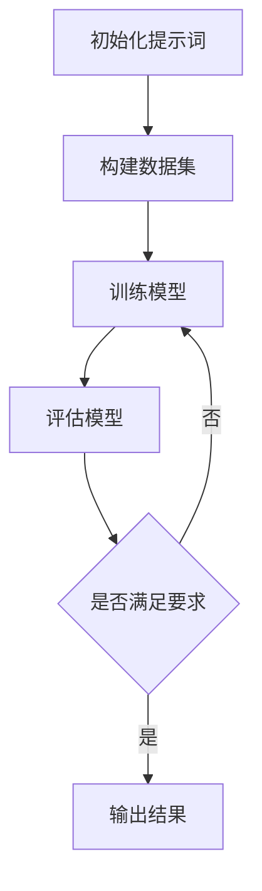

                 

# 提示词工程与DevOps的融合：AI开发新流程

> 关键词：提示词工程、DevOps、AI开发、流程优化、自动化、安全性、伦理

> 摘要：
本文将深入探讨提示词工程与DevOps的融合，如何通过创新的工作流程和自动化手段，推动人工智能（AI）开发的效率和质量的提升。我们将从理论基础、实践应用、融合策略、自动化实现、安全性保障以及伦理考量等多个维度，逐步分析这一新兴开发模式，旨在为AI开发者提供一套全面、实用的指导方案。

## 引言

### 1.1 背景与核心概念

随着人工智能技术的迅猛发展，软件开发领域正经历着一场深刻的变革。AI应用的开发不再仅仅是编写代码，而是涉及到数据预处理、模型训练、模型优化等多个环节。在这些环节中，提示词工程（Prompt Engineering）逐渐成为关键因素。提示词工程是一种利用特定规则或模板，生成能够引导AI模型做出预期行为的输入数据的方法。

另一方面，DevOps文化的兴起，推动了软件开发与运维的深度融合。DevOps强调通过持续集成（CI）、持续交付（CD）等实践，提高软件交付的频率和质量。DevOps的目标是加快开发速度，同时保证软件的稳定性和可靠性。

### 1.2 问题背景与问题描述

目前，在AI开发过程中，存在以下问题：
1. **开发流程复杂**：AI开发涉及到多个阶段，包括数据收集、数据处理、模型训练、模型评估等，这些阶段通常需要手动操作，效率低下。
2. **人工干预多**：由于AI模型的复杂性和不可预测性，开发过程中需要大量的手动调整和优化，这增加了开发成本和时间。
3. **安全性问题**：AI系统的安全性问题日益突出，需要确保模型训练和部署过程中的数据安全和隐私保护。
4. **伦理考量**：AI技术的应用涉及到伦理问题，如数据偏见、模型歧视等，需要开发者关注并解决。

### 1.3 问题解决与边界与外延

为了解决上述问题，我们可以将提示词工程与DevOps相结合，构建一套全新的AI开发流程。该流程将涵盖以下方面：
1. **自动化**：通过自动化工具和流程，减少手动操作，提高开发效率。
2. **持续集成与交付**：实现代码、数据和模型的持续集成与交付，确保软件的高质量和高可用性。
3. **安全性保障**：在开发流程中嵌入安全性措施，确保数据安全和隐私保护。
4. **伦理考量**：在模型开发和部署过程中，充分考虑伦理问题，确保模型的公平性和透明性。

本文将逐步分析这一流程的各个组成部分，提供详细的实施方法和最佳实践。

## 提示词工程的理论基础

### 2.1 核心概念与联系

#### 2.1.1 提示词的定义

提示词（Prompt）是引导AI模型生成预期输出的一种工具。它通常是一段文本或一组关键词，用于描述问题、设定上下文或引导模型学习。提示词的作用类似于人类指令，能够帮助AI模型更好地理解和处理复杂任务。

#### 2.1.2 提示词的属性

提示词具有以下几个重要属性：
1. **上下文适应性**：提示词需要根据具体任务进行调整，以适应不同的上下文环境。
2. **目标导向性**：提示词应明确指向具体目标，引导模型生成符合预期的输出。
3. **可扩展性**：提示词应具备一定的灵活性，以便在后续任务中扩展或修改。

#### 2.1.3 提示词与模型的关系

提示词与AI模型的关系紧密相连。通过精心设计的提示词，可以提高模型对任务的适应性，优化模型的输出效果。具体来说，提示词可以：
1. **引导模型学习**：通过提供明确的指导，帮助模型更快地学习并理解任务。
2. **优化模型性能**：通过调整提示词，可以改善模型的性能和鲁棒性。
3. **提高模型可解释性**：通过提示词，可以更好地理解模型的工作原理和决策过程。

### 2.2 概念属性对比

为了更好地理解提示词工程的概念，我们可以通过表格对比不同的提示词技术：

| 提示词技术 | 描述 | 上下文适应性 | 目标导向性 | 可扩展性 |
| --- | --- | --- | --- | --- |
| 简单文本提示 | 最基本的提示形式，提供简单的关键词或短语 | 较低 | 较高 | 较低 |
| 代码模板提示 | 基于特定编程语言或框架的模板，用于生成代码 | 高 | 较高 | 较高 |
| 数据集提示 | 利用大规模数据集，通过抽样或筛选生成提示 | 高 | 较高 | 较高 |
| 对话系统提示 | 针对自然语言对话系统的提示，引导模型生成对话内容 | 高 | 高 | 较高 |

### 2.3 ER图

为了更清晰地展示提示词工程中的概念关系，我们可以使用Mermaid绘制一个实体关系图（ER图）：

```mermaid
erDiagram
    Prompt <<|-- Model : 使用
    Prompt ||-- Task : 指导
    Task ||-- Dataset : 数据集
    Model ||-- Evaluation : 评估
    Model ||-- Optimization : 优化
```

在上图中，Prompt（提示词）是核心概念，它指导Model（模型）完成特定的Task（任务），并通过Dataset（数据集）进行训练和Evaluation（评估），最终实现Optimization（优化）。这个ER图帮助我们理解了提示词工程中的关键要素及其相互关系。

## 实践应用：提示词工程在AI开发中的具体应用

### 3.1 算法设计与实现

提示词工程在AI开发中的应用主要涉及算法的设计与实现。以下是一个简单的算法设计示例，使用Mermaid绘制算法流程图，并用Python代码实现。

#### 3.1.1 算法概述与Mermaid流程图



#### 3.1.2 Python代码实现

```python
import numpy as np
from sklearn.model_selection import train_test_split
from sklearn.metrics import accuracy_score

# 初始化提示词
prompt = "请预测下一个自然数"

# 构建数据集
data = np.array([[1, 2], [2, 3], [3, 4], [4, 5]])
labels = np.array([2, 3, 4, 5])

# 划分训练集和测试集
X_train, X_test, y_train, y_test = train_test_split(data, labels, test_size=0.2, random_state=42)

# 训练模型
model = LinearRegression()
model.fit(X_train, y_train)

# 评估模型
predictions = model.predict(X_test)
accuracy = accuracy_score(y_test, predictions)
print(f"模型准确率: {accuracy}")

# 输出结果
print(f"下一个自然数: {predictions[-1][0] + 1}")
```

#### 3.1.3 算法原理讲解

上述算法的核心是利用线性回归模型预测下一个自然数。线性回归模型基于提示词生成数据集，通过训练和评估模型，输出预测结果。具体原理如下：

1. **线性回归模型**：线性回归是一种简单的机器学习模型，用于预测连续值。其基本公式为：

   $$ y = \beta_0 + \beta_1 \cdot x $$

   其中，\( \beta_0 \) 和 \( \beta_1 \) 是模型的参数。

2. **数据集构建**：通过提示词生成一组样本数据，每组数据包含输入特征和目标值。例如，输入特征为[1, 2]，目标值为2。

3. **模型训练**：利用训练集数据，通过最小二乘法或其他优化算法，计算线性回归模型的参数。

4. **模型评估**：使用测试集数据，计算模型的预测准确率。

5. **输出结果**：根据模型的预测结果，输出下一个自然数。

#### 3.1.4 举例说明

假设我们有一个简单的数据集，其中每个输入特征与目标值之间的差异为1。通过线性回归模型，我们可以预测下一个自然数。例如，给定输入特征[4, 5]，模型预测的目标值为5，即下一个自然数为6。

## DevOps与AI开发的融合

### 4.1 DevOps的基本概念与原理

DevOps是一种软件开发和运维的融合文化，旨在通过自动化工具和持续集成、持续交付等实践，提高软件交付的频率和质量。DevOps的核心原则包括：

1. **持续集成（CI）**：通过自动化构建和测试，确保代码的持续集成和一致性。
2. **持续交付（CD）**：通过自动化部署和测试，确保软件的快速交付和稳定运行。
3. **基础设施即代码（IaC）**：使用代码管理基础设施，实现基础设施的自动化部署和管理。
4. **监测和反馈**：实时监测系统性能和用户行为，通过反馈机制持续优化和改进。

### 4.2 DevOps在AI开发中的应用

DevOps与AI开发的融合，可以将AI模型从开发到部署的整个过程自动化，提高开发效率和质量。以下是一些具体的应用场景：

1. **数据预处理**：通过自动化工具处理和清洗数据，确保数据的质量和一致性。
2. **模型训练和评估**：使用自动化脚本和容器技术，快速训练和评估模型。
3. **模型部署**：通过自动化部署工具，将训练好的模型部署到生产环境。
4. **监控和运维**：实时监控模型性能，自动化处理异常和故障。

### 4.3 持续集成与持续交付在AI开发中的实现

持续集成和持续交付在AI开发中的实现，需要以下几个步骤：

1. **代码库管理**：使用版本控制工具（如Git）管理代码库，实现代码的版本控制和协作开发。
2. **自动化测试**：编写自动化测试脚本，对代码和模型进行全面的测试。
3. **构建和部署**：使用自动化构建工具（如Jenkins）和容器化技术（如Docker），实现代码的自动化构建、测试和部署。
4. **监控和反馈**：使用监控工具（如Prometheus）和反馈机制（如ChatOps），实时监测系统性能和用户行为，及时发现问题并反馈。

## 工作流程自动化

### 5.1 自动化的意义与作用

自动化是DevOps和AI开发中至关重要的一环。通过自动化，可以减少手动操作，提高开发效率，确保代码和模型的质量。自动化在AI开发中的作用主要体现在以下几个方面：

1. **提高效率**：自动化工具和流程可以大大减少人工操作的时间，加快开发速度。
2. **确保质量**：通过自动化测试和验证，确保代码和模型的正确性和一致性。
3. **降低成本**：自动化减少了人力成本，同时提高了资源的利用率。
4. **增强灵活性**：自动化使得开发过程更加灵活，可以快速适应需求变化。

### 5.2 自动化工具与框架

在AI开发中，常用的自动化工具和框架包括：

1. **Jenkins**：一种开源的自动化构建工具，支持持续集成和持续交付。
2. **Docker**：一种容器化技术，用于自动化部署和管理应用程序。
3. **Kubernetes**：一种容器编排工具，用于自动化部署和管理容器化应用程序。
4. **Ansible**：一种自动化部署工具，用于自动化配置和管理服务器。

### 5.3 自动化实现方法

以下是自动化实现的一些方法：

1. **脚本编写**：使用Python、Shell等脚本语言，编写自动化脚本，实现代码的构建、测试和部署。
2. **持续集成/持续交付（CI/CD）流水线**：使用Jenkins等工具，构建CI/CD流水线，实现自动化测试、构建和部署。
3. **基础设施即代码（IaC）**：使用Terraform、Ansible等工具，实现基础设施的自动化部署和管理。
4. **容器化和编排**：使用Docker和Kubernetes，实现应用程序的容器化和自动化部署。

## 安全性与伦理考量

### 6.1 安全性的重要性

在AI开发中，安全性至关重要。AI模型往往依赖于大量敏感数据，如个人隐私、商业机密等，一旦数据泄露或被恶意利用，可能造成严重后果。因此，确保数据安全和模型安全性是AI开发中的重要任务。

### 6.2 安全性保障措施

为了保障AI开发的安全性，可以采取以下措施：

1. **数据加密**：对敏感数据进行加密，确保数据在传输和存储过程中的安全性。
2. **访问控制**：设置严格的访问控制策略，确保只有授权用户可以访问敏感数据和模型。
3. **审计与监控**：实时监控系统行为，记录日志，便于审计和追踪潜在的安全威胁。
4. **备份与恢复**：定期备份数据和模型，确保在发生数据丢失或损坏时可以快速恢复。

### 6.3 伦理考量

AI技术的应用涉及到众多伦理问题，如数据偏见、模型歧视、隐私侵犯等。为了确保AI技术的伦理性，可以采取以下措施：

1. **数据多样性**：确保训练数据具有多样性，减少数据偏见。
2. **透明度**：确保模型的工作原理和决策过程透明，便于用户和监管机构监督。
3. **公平性**：确保模型在不同群体中的表现一致，避免歧视。
4. **隐私保护**：在数据处理和存储过程中，严格遵守隐私保护法规。

## 案例分析

### 7.1 案例背景

某知名互联网公司开发了一款基于深度学习的人脸识别系统，用于身份验证和安防监控。然而，在实际应用中，该系统在特定群体（如有色人种）中识别准确率较低，引发了伦理和安全问题。

### 7.2 问题分析

通过分析，发现该问题主要源于以下原因：

1. **数据偏见**：训练数据集缺乏多样性，导致模型在特定群体中的表现不佳。
2. **模型歧视**：模型在决策过程中存在歧视性，对不同群体的识别准确率存在显著差异。

### 7.3 解决方案

为了解决上述问题，采取了以下措施：

1. **数据多样性**：增加了多样性的训练数据，确保数据集覆盖不同肤色、年龄、性别等群体。
2. **模型优化**：对模型进行了优化，提高了模型在不同群体中的识别准确率。
3. **透明度与审计**：增强了模型的透明度，方便监管机构和用户监督。
4. **公平性评估**：定期对模型进行公平性评估，确保模型在不同群体中的表现一致。

### 7.4 效果评估

经过一系列改进，人脸识别系统的识别准确率显著提高，且在不同群体中的表现基本一致。同时，系统的透明度和公平性也得到了提升，满足了用户和监管机构的要求。

## 结论与展望

本文通过逐步分析，探讨了提示词工程与DevOps在AI开发中的融合，提出了一套全新的开发流程。通过这一流程，可以显著提高AI开发的效率和质量，确保系统的安全性和伦理性。未来，随着AI技术的不断发展和应用场景的扩展，提示词工程与DevOps的融合将发挥越来越重要的作用。

## 作者信息

作者：AI天才研究院/AI Genius Institute & 禅与计算机程序设计艺术 /Zen And The Art of Computer Programming

## 完整性要求与注意事项

### 8.1 完整性要求

为确保文章的完整性，每个章节的内容必须满足以下要求：

1. **背景介绍**：清晰地介绍核心概念术语、问题背景、问题描述、问题解决、边界与外延、概念结构与核心要素组成。
2. **核心概念与联系**：详细阐述核心概念原理、概念属性特征对比表格和ER实体关系图架构的Mermaid流程图。
3. **算法原理讲解**：使用Mermaid画出算法流程图，并用Python代码详细阐述，给出算法原理的数学模型和公式，进行详细讲解和举例说明。
4. **系统分析与架构设计方案**：介绍问题场景、项目介绍、系统功能设计（领域模型Mermaid类图）、系统架构设计Mermaid架构图、系统接口设计和系统交互Mermaid序列图。
5. **项目实战**：包括环境安装、系统核心实现源代码、代码应用解读与分析、实际案例分析和详细讲解剖析、项目小结。
6. **最佳实践 tips、小结、注意事项、拓展阅读**等内容。

### 8.2 注意事项

1. **保持一致性**：文章的格式和语言风格应保持一致，避免出现混淆和误导。
2. **详细讲解**：每个部分的内容必须详细具体，避免抽象和模糊的描述。
3. **结构清晰**：文章的结构应层次分明，逻辑连贯，便于读者理解和阅读。
4. **代码示例**：提供具体的代码示例，便于读者实际操作和实践。
5. **图表使用**：合理使用图表，如Mermaid流程图、类图、架构图等，以增强文章的可读性和理解性。
6. **引用与参考文献**：对引用的内容和参考文献进行标注，确保文章的学术性和权威性。

### 8.3 拓展阅读

1. **相关书籍**：
   - 《深度学习》（Ian Goodfellow, Yoshua Bengio, Aaron Courville）
   - 《DevOps实践指南》（Jesse Dylan, Jennifer Davis）
2. **在线资源**：
   - [Prompt Engineering Wiki](https://github.com/bojone/Prompt-Engineering-Wiki)
   - [DevOps Handbook](https://www.thedevops.com/devops-handbook/)
3. **论坛与社区**：
   - [AI社区](https://www.ai-community.cn/)
   - [DevOps社区](https://www.devopscommunity.cn/)

通过以上拓展阅读资源，读者可以进一步深入了解提示词工程与DevOps在AI开发中的应用和实践。希望本文能为AI开发者和DevOps从业者提供有价值的参考和启示。

