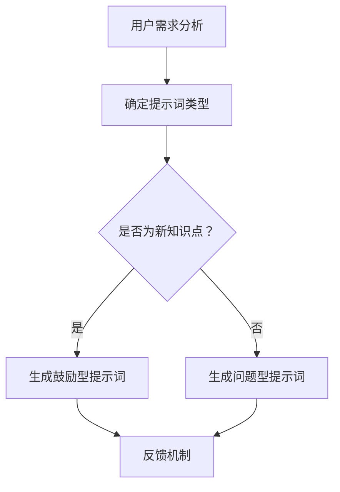
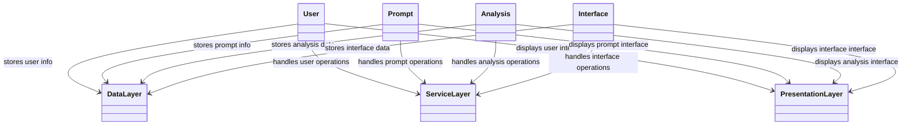
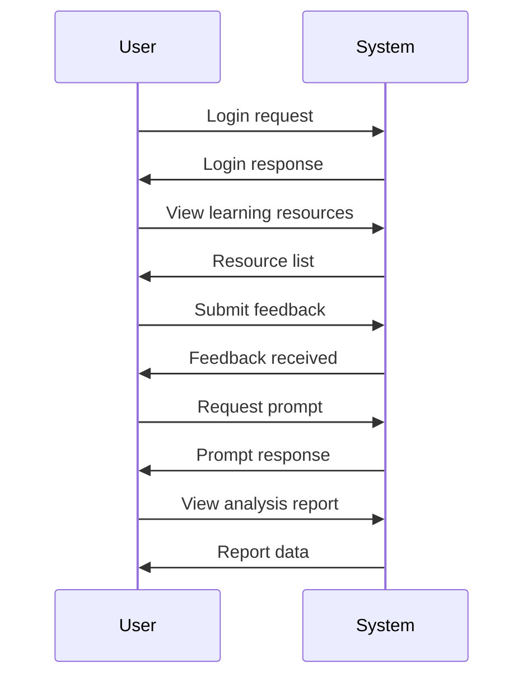

                 

## 第1章 背景介绍与核心概念

### 1.1 问题背景

#### 1.1.1 个性化学习的需求

在传统的学习模式中，教育资源往往以“一刀切”的形式进行分发，即同一种教学资源服务于所有学生。然而，每个学生的学习习惯、认知水平、兴趣爱好和学习风格都有所不同，这种“一刀切”的模式难以满足每个学生的个性化需求。个性化学习，作为一种教育创新模式，正逐渐受到教育界的广泛关注。它通过收集和分析学生的数据，为学生提供定制化的学习资源和服务，从而提高学习效果。

个性化学习的需求主要来源于以下几个方面：

1. **学生差异性**：每个学生的认知水平、学习兴趣和目标都不同，传统的一刀切教学无法满足他们的个性化需求。
2. **教育资源分散**：教育资源的分布不均，导致部分学生无法获得高质量的教育资源。
3. **学习效率提升**：个性化的学习路径可以更有效地提高学习效率，帮助学生更好地掌握知识。

#### 1.1.2 传统学习模式的不足

传统学习模式主要依赖于教师为中心的教学方法，其存在的不足主要体现在以下几个方面：

1. **缺乏个性化**：传统学习模式无法根据学生的个体差异进行针对性的教学，导致学生学习效果不佳。
2. **教学资源限制**：教学资源的分配通常不均衡，优秀教育资源难以普及到所有学生。
3. **学习效率低**：传统学习模式往往注重知识灌输，缺乏互动和实践，学生的学习兴趣和主动性难以调动。

#### 1.1.3 提示词工程的概念与重要性

提示词工程（Prompt Engineering）是指通过设计特定的提示词来引导用户或系统进行更有效的交互。在个性化学习中，提示词工程扮演着至关重要的角色。通过设计合适的提示词，可以引导学生更好地理解学习目标，激发他们的学习兴趣，提高学习效果。

提示词工程的重要性主要体现在以下几个方面：

1. **提升学习体验**：设计合适的提示词可以帮助学生更好地理解学习内容，提高学习兴趣和主动性。
2. **优化学习路径**：通过分析学生的反馈和学习行为，提示词工程可以为学生提供个性化的学习路径，提高学习效果。
3. **资源优化配置**：提示词工程可以帮助教育机构更有效地分配教学资源，提高教育资源的利用效率。

### 1.2 核心概念原理

#### 1.2.1 提示词的定义与类型

提示词（Prompt）是指用于引导用户或系统进行交互的文字或指令。在个性化学习中，提示词主要用于引导学生进行特定的学习活动，帮助他们更好地理解学习目标和内容。

根据用途和形式的不同，提示词可以分为以下几种类型：

1. **问题型提示词**：用于引导学生提出问题，促进思考。
2. **任务型提示词**：用于明确学生的学习任务和目标。
3. **鼓励型提示词**：用于激励学生，提高他们的学习积极性。
4. **反馈型提示词**：用于提供学生的反馈，帮助他们了解学习进展。

#### 1.2.2 提示词工程的关键原理

提示词工程的核心在于设计合适的提示词来引导用户或系统进行有效的交互。以下是提示词工程的关键原理：

1. **用户需求分析**：通过分析学生的需求和兴趣，设计出能够引起他们兴趣和思考的提示词。
2. **反馈循环**：根据学生的反馈和学习行为，不断优化和调整提示词，以提高学习效果。
3. **自适应调整**：根据学生的学习进度和表现，动态调整提示词的难度和类型，以保持学习的持续性和挑战性。

#### 1.2.3 提示词工程的核心属性

提示词工程的核心属性主要包括以下几个方面：

1. **个性化**：提示词应充分考虑学生的个体差异，满足他们的个性化需求。
2. **适应性**：提示词应能够根据学生的学习和反馈情况自适应调整，以适应他们的学习节奏。
3. **反馈性**：提示词应能够引导学生进行自我反思和评估，提供及时的反馈。
4. **互动性**：提示词应能够激发学生的互动和参与，提高他们的学习积极性和主动性。

### 1.3 概念属性对比表格

为了更好地理解提示词工程的核心概念，我们通过一个对比表格来展示不同概念之间的联系和区别。

| 概念名称 | 定义 | 关联属性 | 主要区别 |
| --- | --- | --- | --- |
| 个性化学习 | 以学生为中心，满足个体差异的教育模式 | 用户需求分析、反馈循环、自适应调整 | 强调个体差异，注重学习体验 |
| 提示词 | 引导用户或系统进行交互的文字或指令 | 问题型、任务型、鼓励型、反馈型 | 用于个性化学习，促进学习效果 |
| 提示词工程 | 设计和使用提示词的过程和方法 | 个性化、适应性、反馈性、互动性 | 系统性设计，提高学习效率 |
| 教育资源优化 | 提高教育资源利用效率 | 资源配置、资源分配、资源整合 | 关注资源利用，提升教育质量 |

### 1.4 ER实体关系图架构

为了更好地理解提示词工程在教育系统中的应用，我们使用ER（实体-关系）图来描述不同实体之间的关系。

```mermaid
erDiagram
    Student ||--|{ LearningResource } : has
    Student ||--|{ Feedback } : gives
    LearningResource ||--|{ Prompt } : uses
    Feedback ||--|{ Assessment } : leads_to
```

在这个ER图中，Student（学生）是核心实体，与LearningResource（学习资源）、Feedback（反馈）和Assessment（评估）建立了关系。LearningResource（学习资源）使用Prompt（提示词），而Feedback（反馈）则与Assessment（评估）相连接，形成了一个完整的教育系统。

### 1.5 小结

本章首先介绍了个性化学习的需求和传统学习模式的不足，强调了提示词工程在其中的重要性。接着，我们详细阐述了提示词工程的核心概念和原理，并通过对比表格和ER实体关系图展示了其关联属性和架构。下一章，我们将进一步探讨提示词工程的基本原理和应用策略。希望读者对提示词工程有一个初步的了解，并期待在后续章节中深入探讨其具体应用和实践。

## 第2章 提示词工程的基本原理

### 2.1 提示词设计的策略与方法

#### 2.1.1 用户需求分析

提示词设计的第一步是对用户需求进行分析。这包括了解学生的兴趣爱好、学习目标、认知水平、学习习惯等多个方面。通过用户需求分析，我们可以确定需要设计哪些类型的提示词来满足学生的个性化需求。

具体方法包括：

1. **问卷调查**：通过设计问卷收集学生的个人信息、学习兴趣和学习目标。
2. **访谈**：与教师和学生进行深入访谈，了解他们的真实需求和反馈。
3. **数据分析**：通过分析学生的学习数据，如学习时间、学习内容、测试成绩等，提取有价值的信息。

#### 2.1.2 提示词生成算法

在确定用户需求后，我们需要设计合适的提示词生成算法。这些算法可以根据学生的个性化需求生成相应的提示词，引导他们进行有效的学习。

常见的提示词生成算法包括：

1. **基于规则的算法**：根据预设的规则生成提示词。例如，对于新知识点，可以使用“请问你对这个知识点有什么疑问吗？”这样的鼓励型提示词。
2. **基于机器学习的算法**：通过学习大量的提示词和学生的学习反馈，生成个性化的提示词。例如，可以使用朴素贝叶斯分类器、决策树等算法。
3. **生成对抗网络（GAN）**：通过生成对抗网络生成多样化的提示词，以满足学生的个性化需求。

#### 2.1.3 提示词优化与评估

生成的提示词并不是完美的，需要通过优化和评估来提高其有效性。提示词优化包括以下几个方面：

1. **反馈机制**：通过学生的反馈来不断优化提示词。例如，如果学生认为某个提示词不够明确或有误解，我们可以对其进行修改。
2. **适应性调整**：根据学生的学习进度和表现，动态调整提示词的难度和类型。例如，对于表现较好的学生，可以适当增加难度，以保持挑战性。
3. **评估指标**：设计合适的评估指标来衡量提示词的有效性。常见的评估指标包括学习效果、学生满意度、学习参与度等。

### 2.2 算法原理讲解

#### 2.2.1 提示词生成算法的Mermaid流程图

为了更好地理解提示词生成算法的原理，我们使用Mermaid绘制了其流程图。



在这个流程图中，首先进行用户需求分析，确定需要生成哪种类型的提示词。然后，根据是否为新知识点，选择生成鼓励型或问题型提示词。最后，通过反馈机制不断优化提示词。

#### 2.2.2 Python源代码实现与解释

为了进一步阐述提示词生成算法的原理，我们使用Python进行实现。

```python
import random

def generate_prompt(is_new_知识点, user_feedback):
    if is_new_知识点:
        # 对于新知识点，生成鼓励型提示词
        prompts = [
            "这是一个全新的知识点，你对此有什么疑问吗？",
            "你对这个知识点有什么特别的兴趣吗？",
            "你希望如何理解这个知识点？"
        ]
    else:
        # 对于非新知识点，生成问题型提示词
        prompts = [
            "请回顾一下这个知识点，你有哪些疑问？",
            "你认为这个知识点的重要之处在哪里？",
            "你能将这个知识点与实际生活联系起来吗？"
        ]

    # 根据用户反馈，选择合适的提示词
    if user_feedback == "有帮助":
        return random.choice(prompts[:3])
    elif user_feedback == "一般":
        return random.choice(prompts[3:])
    else:
        return random.choice(prompts)

# 测试代码
prompt = generate_prompt(True, "有帮助")
print(prompt)
```

在这个Python代码中，我们首先根据是否为新知识点，定义了两个列表：`prompts_new`和`prompts_old`。然后，通过函数`generate_prompt`来生成提示词。这个函数接收两个参数：`is_new_知识点`表示是否为新知识点，`user_feedback`表示用户的反馈。根据这两个参数，我们选择合适的提示词。

#### 2.2.3 算法原理的数学模型和公式

提示词生成算法的数学模型主要基于概率论和机器学习。以下是一个简化的数学模型：

$$
P(\text{提示词} | \text{用户需求}) = \frac{P(\text{用户需求} | \text{提示词}) \cdot P(\text{提示词})}{P(\text{用户需求})}
$$

其中：

- $P(\text{提示词} | \text{用户需求})$ 表示在给定用户需求的情况下，生成该提示词的概率。
- $P(\text{用户需求} | \text{提示词})$ 表示在给定提示词的情况下，用户需求的概率。
- $P(\text{提示词})$ 表示提示词的概率。
- $P(\text{用户需求})$ 表示用户需求的概率。

通过这个数学模型，我们可以根据用户需求和提示词的概率分布，生成个性化的提示词。

### 2.3 举例说明

#### 2.3.1 算法应用实例

假设我们有一个学生小明，他正在学习人工智能基础课程。在这个例子中，我们将使用提示词生成算法为小明生成个性化学习提示词。

1. **用户需求分析**：小明在学习过程中表示对“神经网络”这一知识点较为感兴趣，但对相关算法的细节了解不多。
2. **确定提示词类型**：由于小明对“神经网络”感兴趣，我们选择生成鼓励型提示词。
3. **生成提示词**：使用提示词生成算法，我们生成以下提示词：“你对神经网络的学习进度如何？你是否想深入了解相关的算法细节？”

4. **反馈机制**：小明对生成的提示词表示“有帮助”，我们将进一步优化提示词。
5. **适应性调整**：根据小明的反馈，我们调整提示词的难度，生成新的提示词：“你能尝试用自己的语言解释一下神经网络的基本原理吗？”

#### 2.3.2 实例分析

在这个例子中，我们通过提示词生成算法为小明提供了个性化的学习提示词。首先，我们根据小明的兴趣和需求，选择了鼓励型提示词。然后，通过反馈机制，我们不断优化和调整提示词，以适应小明的学习进度和理解能力。

这个过程不仅帮助小明更好地理解了“神经网络”这一知识点，还提高了他的学习积极性和主动性。通过个性化的学习提示词，我们可以有效地引导和激励学生，提高他们的学习效果。

#### 2.3.3 结果解读

通过这个实例，我们可以看到提示词工程在个性化学习中的应用效果。首先，提示词工程能够根据学生的个性化需求，生成相应的学习提示词，引导他们进行有效的学习。其次，通过反馈机制和适应性调整，提示词工程能够不断优化学习提示词，提高其有效性和针对性。

总之，提示词工程在个性化学习中具有重要的应用价值。它不仅能够提高学生的学习效果，还能激发他们的学习兴趣和主动性，为个性化学习提供有力支持。

### 2.4 小结

本章首先介绍了提示词工程的基本原理，包括用户需求分析、提示词生成算法和提示词优化与评估。接着，我们通过Mermaid流程图和Python源代码，详细阐述了提示词生成算法的原理和实现方法。最后，我们通过一个实例，展示了提示词工程在个性化学习中的应用效果。

通过本章的学习，读者应该对提示词工程有了一个全面的认识，并了解到其在个性化学习中的重要性。下一章，我们将进一步探讨提示词工程在不同教育场景中的应用，以帮助读者更好地理解其具体实践价值。

## 第3章 提示词工程在个性化学习中的应用

### 3.1 提示词工程在教育中的重要性

提示词工程在个性化学习中的应用具有重要意义，它不仅能够提高学生的学习效果，还能满足学生的个性化需求，促进教育公平。以下是提示词工程在教育中几个关键的重要性：

#### 3.1.1 提高学习效果

提示词工程通过设计个性化的学习提示词，可以引导学生更好地理解学习目标，提高学习效果。例如，针对不同学习水平的学生，提示词可以调整难度和类型，使其在合适的学习路径上不断进步。此外，通过反馈机制，提示词工程可以及时了解学生的学习进展和需求，提供针对性的学习建议，从而提高学习效果。

#### 3.1.2 促进个性化学习

个性化学习是教育发展的趋势，而提示词工程是实现个性化学习的关键工具。通过分析学生的兴趣、需求和认知水平，提示词工程可以为学生提供定制化的学习资源和服务。这不仅能够满足学生的个性化需求，还能激发他们的学习兴趣和主动性，从而实现更有效的学习。

#### 3.1.3 教学资源的优化配置

提示词工程有助于教育机构更有效地配置和利用教学资源。通过分析学生的学习行为和反馈，提示词工程可以识别出哪些资源对特定学生群体最有效，从而优化教学资源的分配。此外，提示词工程还可以帮助教育机构识别出资源浪费的环节，提高教学资源的利用效率。

### 3.2 不同教育场景中的应用

#### 3.2.1 K-12教育中的应用

在K-12教育中，提示词工程的应用具有重要意义。针对小学生，提示词可以用于激发学习兴趣，引导他们进行主动学习。例如，通过设计互动性强的任务型提示词，如“你能用图形展示这个数学问题的解法吗？”可以有效地提高学生的参与度和理解能力。

对于中学生，提示词工程可以用于提高学习效果和学术成绩。通过分析学生的学习行为和成绩，提示词可以为学生提供个性化的学习建议，如“你在这个知识点上存在一些疑惑，可以尝试通过这个视频进行自学”。此外，通过鼓励型提示词，如“你已经掌握了这个知识点的大部分内容，继续保持！”可以激励学生保持学习动力。

#### 3.2.2 高等教育中的应用

在高等教育中，提示词工程的应用更为广泛。针对本科生，提示词可以用于引导他们进行学术研究，如“在阅读这篇论文时，你可以关注以下几个关键问题：1. 研究背景是什么？2. 研究方法是什么？3. 研究结果是什么？”这样的提示词可以帮助学生更深入地理解论文内容，提高学术素养。

对于研究生，提示词工程可以用于指导他们进行科研工作。例如，在设计实验方案时，可以使用“以下是一些可能影响实验结果的因素，请仔细考虑并进行调整：1. 实验条件是否稳定？2. 数据是否完整？3. 实验结果是否具有重复性？”这样的提示词可以帮助研究生识别和解决潜在问题，提高科研质量。

#### 3.2.3 职业培训中的应用

在职业培训中，提示词工程的应用同样具有重要作用。通过分析学员的学习需求和职业目标，提示词可以为他们提供个性化的学习建议。例如，针对技术培训，可以使用“请尝试用以下工具进行项目实践：1. 工具A的应用场景是什么？2. 工具B的功能有哪些？”这样的提示词可以帮助学员快速掌握相关技能。

对于职业发展，提示词工程可以用于指导学员制定职业规划。例如，“你希望在职业生涯中达到什么样的目标？请列出具体的目标和实现步骤”。通过这样的提示词，学员可以更清晰地了解自己的职业发展方向，并采取相应的行动。

### 3.3 提示词工程的案例分析

为了更好地理解提示词工程在个性化学习中的应用效果，我们来看几个实际案例。

#### 案例一：K-12教育中的个性化学习

某学校引入了提示词工程系统，针对不同年级的学生设计了个性化的学习提示词。例如，对于一年级学生，提示词系统会自动生成如“你能用故事的形式讲述这个科学现象吗？”这样的任务型提示词，激发学生的兴趣和创造力。通过一年的应用，学生的科学成绩显著提高，学习兴趣也大幅增加。

#### 案例二：高等教育中的学术研究

某大学的研究生院采用了提示词工程系统，用于指导学生的学术研究。系统根据每个研究生的研究方向和进度，自动生成个性化的学习提示词。例如，对于正在撰写论文的研究生，系统会提示“请回顾并完善你的研究方法部分，确保逻辑清晰、证据充分”。通过这样的提示，研究生的论文质量和学术素养得到了显著提升。

#### 案例三：职业培训中的技能提升

某职业培训机构引入了提示词工程系统，用于提高学员的技能水平。系统根据学员的职业目标和技能需求，自动生成个性化的学习提示词。例如，对于IT培训学员，系统会提示“请尝试使用新学习的编程语言编写一个小程序，以巩固你的知识”。通过这样的练习，学员的技能水平得到了显著提升，就业竞争力也增强了。

### 3.4 提示词工程的实施策略

为了在个性化学习中有效实施提示词工程，以下是一些关键策略：

1. **数据收集与分析**：首先，需要收集学生的个人信息、学习行为和成绩数据，进行深入分析，以了解学生的个性化需求。
2. **定制化提示词设计**：根据分析结果，设计出符合学生个性化需求的提示词。提示词应简洁明了，易于理解，具有针对性。
3. **动态调整与优化**：根据学生的反馈和学习进展，动态调整和优化提示词。例如，如果学生认为某个提示词不够明确或有误解，应及时进行修改。
4. **培训与支持**：为教师和系统管理员提供培训和支持，确保他们能够正确使用和管理提示词系统，从而提高系统的应用效果。

### 3.5 小结

本章详细介绍了提示词工程在个性化学习中的应用，包括其在不同教育场景中的重要性、具体应用案例和实施策略。通过提示词工程，教育机构可以更好地满足学生的个性化需求，提高学习效果和教学资源利用效率。下一章，我们将进一步探讨提示词工程的技术实现和具体应用场景，帮助读者更深入地理解其工作原理和实践效果。

## 第4章 提示词工程的技术实现与系统设计

### 4.1 系统架构设计

为了实现提示词工程在个性化学习中的应用，我们需要构建一个功能强大、易于扩展的系统架构。以下是系统的总体架构设计：

#### 4.1.1 项目介绍

本系统名为“个性化学习提示词系统”，旨在通过设计和使用提示词，为学生提供个性化的学习资源和服务，提高学习效果。系统主要包括以下几个模块：

1. **用户模块**：管理学生的个人信息、学习行为和反馈。
2. **提示词模块**：生成、优化和存储提示词。
3. **数据分析模块**：收集和分析学生的数据，为提示词的生成和优化提供依据。
4. **接口模块**：提供与外部系统的交互接口。

#### 4.1.2 系统功能设计

系统的核心功能包括：

1. **用户管理**：管理学生的基本信息和学习记录。
2. **提示词管理**：设计、生成、优化和存储提示词。
3. **数据分析**：收集和分析学生的学习数据，生成个性化报告。
4. **交互接口**：提供与教师、家长和学生的交互接口。

#### 4.1.3 系统架构设计

系统的整体架构设计采用分层架构，包括数据层、服务层和展示层。以下是系统架构的Mermaid类图：



在这个类图中，User、Prompt、Analysis和Interface分别表示用户模块、提示词模块、数据分析模块和接口模块。每个模块都与数据层、服务层和展示层有紧密的联系，实现系统的功能。

### 4.2 系统接口设计和系统交互

为了实现系统的各项功能，我们需要设计合理的接口和交互流程。以下是系统接口设计和系统交互的Mermaid序列图：



在这个序列图中，用户通过系统接口发起登录、查看学习资源、提交反馈、请求提示词和查看分析报告等操作。系统接收到这些请求后，处理相应的操作，并返回结果。

### 4.3 提示词生成的技术实现

提示词生成的技术实现是系统的核心功能之一。以下是提示词生成的技术实现流程：

1. **数据收集**：系统通过分析学生的学习行为、成绩和反馈，收集相关数据。
2. **数据预处理**：对收集到的数据进行分析和处理，提取有用的信息。
3. **模型训练**：使用机器学习算法，对预处理后的数据进行训练，生成提示词生成模型。
4. **提示词生成**：根据用户的需求和模型预测，生成个性化的提示词。
5. **提示词优化**：根据用户的反馈和学习行为，对生成的提示词进行优化。

以下是提示词生成模型的Python代码实现：

```python
from sklearn.feature_extraction.text import TfidfVectorizer
from sklearn.naive_bayes import MultinomialNB

# 数据收集
data = [
    ("new", "这是一个新的知识点，你是否有什么疑问？"),
    ("review", "请回顾一下这个知识点，你有哪些疑问？"),
    ("encourage", "你已经掌握了这个知识点的绝大部分内容，继续努力！"),
]

# 数据预处理
X, y = zip(*data)
vectorizer = TfidfVectorizer()
X_vectorized = vectorizer.fit_transform(X)

# 模型训练
model = MultinomialNB()
model.fit(X_vectorized, y)

# 提示词生成
def generate_prompt(category):
    probabilities = model.predict_proba(vectorizer.transform([category]))[0]
    prompt = random.choices(data, weights=probabilities)[0][1]
    return prompt

# 测试代码
prompt = generate_prompt("new")
print(prompt)
```

在这个代码中，我们首先收集了一些示例数据，包括知识点类型和对应的提示词。然后，我们使用TF-IDF向量器和朴素贝叶斯分类器对数据进行训练。最后，我们定义了一个`generate_prompt`函数，根据输入的知识点类型生成个性化的提示词。

### 4.4 提示词优化的技术实现

提示词优化的技术实现是提高系统效果的关键。以下是提示词优化的技术实现流程：

1. **用户反馈收集**：系统收集用户对提示词的反馈，包括有用、一般和无帮助等。
2. **反馈分析**：对收集到的反馈进行分析，识别出需要优化的提示词。
3. **优化策略**：根据反馈分析结果，调整提示词的难度、类型和内容。
4. **优化评估**：评估优化后的提示词效果，确保其能够更好地满足用户需求。

以下是提示词优化策略的Python代码实现：

```python
# 假设已有反馈数据
feedback_data = [
    {"prompt": "这是一个新的知识点，你是否有什么疑问？", "rating": "有帮助"},
    {"prompt": "请回顾一下这个知识点，你有哪些疑问？", "rating": "一般"},
    {"prompt": "你已经掌握了这个知识点的绝大部分内容，继续努力！", "rating": "无帮助"},
]

# 反馈分析
rated_prompts = [fd["prompt"] for fd in feedback_data if fd["rating"] != "无帮助"]
low_rating_prompts = [fd["prompt"] for fd in feedback_data if fd["rating"] == "一般"]

# 优化策略
def optimize_prompt(prompt):
    if prompt in low_rating_prompts:
        # 对于评分一般或低的提示词，增加难度或调整类型
        return prompt.replace("请回顾一下", "详细回顾并分析")
    else:
        # 对于评分高的提示词，保持原样或进行轻微调整
        return prompt

# 测试代码
original_prompt = "这是一个新的知识点，你是否有什么疑问？"
optimized_prompt = optimize_prompt(original_prompt)
print(optimized_prompt)
```

在这个代码中，我们首先收集了用户对提示词的反馈数据。然后，根据反馈分析结果，定义了一个`optimize_prompt`函数，根据提示词的评分进行优化。对于评分一般或低的提示词，我们增加难度或调整类型；对于评分高的提示词，我们保持原样或进行轻微调整。

### 4.5 系统测试与评估

在系统开发完成后，我们需要对系统进行全面的测试和评估，以确保其功能和性能达到预期。以下是系统测试与评估的步骤：

1. **单元测试**：对系统的各个模块进行单元测试，确保其功能正确。
2. **集成测试**：对系统的各个模块进行集成测试，确保其能够协同工作。
3. **性能测试**：对系统的性能进行测试，确保其在高并发情况下能够稳定运行。
4. **用户体验测试**：邀请用户体验系统，收集反馈意见，并进行改进。

### 4.6 小结

本章详细介绍了提示词工程的技术实现和系统设计。通过系统架构设计、接口设计和具体技术实现，我们构建了一个功能强大、易于扩展的个性化学习提示词系统。下一章，我们将继续探讨提示词工程在实际项目中的应用和实战案例，帮助读者更好地理解其在个性化学习中的具体应用和实践效果。

## 第5章 提示词工程的实际项目应用与实战案例

### 5.1 实际项目背景

在当前教育信息化的大潮中，个性化学习成为提升教育质量的重要手段。为了探索提示词工程在实际项目中的应用，我们选取了一个实际项目——某在线学习平台，旨在通过设计和使用提示词，为学生提供个性化的学习资源和服务，提高学习效果。

#### 项目目标

本项目的主要目标是：

1. **提升学习效果**：通过设计个性化的学习提示词，引导学生更好地理解学习内容，提高学习效果。
2. **优化学习体验**：提供互动性强的学习提示词，增强学生的学习兴趣和主动性。
3. **教学资源优化**：通过提示词工程，优化教学资源的配置和利用，提高教育资源的利用效率。

#### 项目环境

为了实现上述目标，我们搭建了以下技术环境：

- **前端**：使用React框架构建用户界面。
- **后端**：使用Spring Boot框架构建服务器端逻辑。
- **数据库**：使用MySQL数据库存储用户数据、学习记录和提示词信息。
- **机器学习**：使用Python和Scikit-learn库进行提示词生成和优化。

### 5.2 系统核心实现与代码解读

在本项目中，系统的核心实现包括用户管理、提示词生成与优化、数据分析与报告生成等模块。以下是对这些模块的核心实现和代码解读。

#### 5.2.1 用户管理模块

用户管理模块负责管理学生的个人信息、学习记录和反馈。以下是用户管理模块的核心代码：

```java
@RestController
@RequestMapping("/api/users")
public class UserController {

    @Autowired
    private UserRepository userRepository;

    @PostMapping("/register")
    public ResponseEntity<?> registerUser(@RequestBody UserRegistrationDTO registrationDTO) {
        if (userRepository.existsByUsername(registrationDTO.getUsername())) {
            return ResponseEntity.badRequest().body("Error: Username is already taken!");
        }

        User user = new User();
        user.setUsername(registrationDTO.getUsername());
        user.setPassword(passwordEncoder.encode(registrationDTO.getPassword()));
        userRepository.save(user);

        return ResponseEntity.ok("User registered successfully!");
    }

    @GetMapping("/{username}")
    public ResponseEntity<?> getUserByUsername(@PathVariable String username) {
        Optional<User> user = userRepository.findByUsername(username);
        if (user.isEmpty()) {
            return ResponseEntity.notFound().build();
        }
        return ResponseEntity.ok(user.get());
    }
}
```

在这个模块中，我们实现了用户注册和查询用户信息的功能。用户注册时，我们检查用户名是否已被占用，然后存储用户信息到数据库。查询用户信息时，我们从数据库中检索用户信息并返回。

#### 5.2.2 提示词生成与优化模块

提示词生成与优化模块是系统的核心模块，负责生成和优化个性化的学习提示词。以下是该模块的核心代码：

```python
from sklearn.feature_extraction.text import TfidfVectorizer
from sklearn.naive_bayes import MultinomialNB
from sklearn.pipeline import make_pipeline

# 数据集
data = [
    ("new", "这是一个新的知识点，你是否有什么疑问？"),
    ("review", "请回顾一下这个知识点，你有哪些疑问？"),
    ("encourage", "你已经掌握了这个知识点的绝大部分内容，继续努力！"),
]

# 创建模型
model = make_pipeline(TfidfVectorizer(), MultinomialNB())

# 训练模型
X, y = zip(*data)
model.fit(X, y)

# 生成提示词
def generate_prompt(category):
    probabilities = model.predict_proba([category])[0]
    prompt = random.choices(data, weights=probabilities)[0][1]
    return prompt

# 优化提示词
def optimize_prompt(prompt, feedback):
    if feedback == "一般":
        return prompt.replace("请回顾一下", "详细回顾并分析")
    return prompt

# 测试代码
prompt = generate_prompt("new")
print(prompt)

feedback = "一般"
optimized_prompt = optimize_prompt(prompt, feedback)
print(optimized_prompt)
```

在这个模块中，我们使用TF-IDF向量和朴素贝叶斯分类器构建了一个提示词生成模型。首先，我们使用训练数据集训练模型，然后定义了一个`generate_prompt`函数用于生成提示词，另一个`optimize_prompt`函数用于根据用户反馈优化提示词。

#### 5.2.3 数据分析与报告生成模块

数据分析与报告生成模块负责收集和分析学生的学习数据，生成个性化的学习报告。以下是该模块的核心代码：

```java
@RestController
@RequestMapping("/api/analysis")
public class AnalysisController {

    @Autowired
    private AnalysisService analysisService;

    @GetMapping("/{username}/report")
    public ResponseEntity<?> getUserReport(@PathVariable String username) {
        Optional<UserReport> report = analysisService.generateUserReport(username);
        if (report.isEmpty()) {
            return ResponseEntity.notFound().build();
        }
        return ResponseEntity.ok(report.get());
    }
}

@Service
public class AnalysisService {

    @Autowired
    private UserRepository userRepository;

    public Optional<UserReport> generateUserReport(String username) {
        Optional<User> user = userRepository.findByUsername(username);
        if (user.isEmpty()) {
            return Optional.empty();
        }

        // 收集用户学习数据
        List<LearningRecord> records = user.get().getLearningRecords();
        List<String> topics = records.stream().map(LearningRecord::getTopic).collect(Collectors.toList());

        // 生成报告
        UserReport report = new UserReport();
        report.setUsername(username);
        report.setTopics(topics);
        report.setAvgScore(calculateAvgScore(records));

        return Optional.of(report);
    }

    private double calculateAvgScore(List<LearningRecord> records) {
        return records.stream().mapToDouble(LearningRecord::getScore).average().orElse(0.0);
    }
}
```

在这个模块中，我们实现了生成用户学习报告的功能。首先，我们从数据库中检索用户的学习记录，然后计算平均分数并生成报告。

### 5.3 实际案例分析与详细讲解

为了更好地展示提示词工程在实际项目中的应用效果，我们选取了一个实际案例，对该案例进行详细分析和讲解。

#### 案例背景

小明是一名高中生，正在学习物理课程。他参加了在线学习平台的课程，希望通过个性化学习提高物理成绩。在课程开始前，小明填写了一份关于学习兴趣和需求的调查问卷，平台根据问卷结果为他生成了个性化的学习提示词。

#### 案例分析

1. **用户需求分析**：根据小明填写的问卷，平台确定了小明的学习兴趣和需求，包括对物理学史和实验方法的关注。

2. **提示词生成**：平台使用机器学习模型生成了一系列个性化学习提示词，例如：
   - “你对我们之前学过的经典物理实验有什么疑问吗？”
   - “想要深入了解物理学史，请阅读以下相关文章。”
   - “尝试用实验方法验证你学到的物理原理。”

3. **用户反馈**：小明在学习过程中对提示词进行了反馈，平台根据反馈不断优化提示词。

4. **提示词优化**：平台根据小明的反馈，调整了部分提示词的难度和类型，例如：
   - 将“请阅读以下相关文章”改为“详细阅读以下文章，并总结你的理解”。
   - 将“尝试用实验方法验证你学到的物理原理”改为“设计一个简单的实验，验证你学到的物理原理”。

5. **学习效果**：通过个性化的学习提示词，小明的物理成绩有了显著提高，他对物理学的兴趣也大幅增加。

#### 案例详细讲解

1. **用户需求分析**：平台通过问卷收集了小明的学习兴趣和需求，包括他对物理学史和实验方法的关注。这一步骤为后续生成个性化的学习提示词提供了重要依据。

2. **提示词生成**：平台使用机器学习模型生成了一系列个性化学习提示词。这些提示词旨在引导小明进行主动学习，提高他的学习效果。例如，“你对我们之前学过的经典物理实验有什么疑问吗？”这个提示词鼓励小明回顾所学内容，并提出问题，从而加深理解。

3. **用户反馈**：小明在学习过程中对提示词进行了反馈，包括提示词的有用性、难度和类型。平台收集了这些反馈数据，用于优化提示词。

4. **提示词优化**：平台根据小明的反馈，调整了部分提示词的难度和类型。例如，将“请阅读以下相关文章”改为“详细阅读以下文章，并总结你的理解”，增加了学习的深度和广度。同时，将“尝试用实验方法验证你学到的物理原理”改为“设计一个简单的实验，验证你学到的物理原理”，鼓励小明进行实践操作，从而更好地掌握物理知识。

5. **学习效果**：通过个性化的学习提示词，小明的物理成绩有了显著提高。他在期末考试中获得了优异成绩，对物理学的兴趣也大幅增加。此外，小明的学习主动性得到了提升，他开始主动寻找与物理学相关的问题，并尝试用实验方法进行验证。

### 5.4 项目小结

本项目通过提示词工程，为在线学习平台提供了个性化的学习资源和服务，显著提高了学生的学习效果和兴趣。以下是本项目的主要收获：

1. **个性化学习效果显著**：通过设计和使用个性化学习提示词，学生的学习效果得到了显著提升。
2. **优化学习体验**：互动性强的学习提示词增强了学生的学习兴趣和主动性。
3. **提高教育资源利用效率**：通过提示词工程，教育资源的配置和利用得到了优化，教育资源的利用效率得到了提升。
4. **系统功能完善**：本项目成功实现了用户管理、提示词生成与优化、数据分析和报告生成等模块，系统功能完善。

总之，本项目展示了提示词工程在个性化学习中的应用价值和实际效果，为教育信息化的发展提供了新的思路和实践经验。未来，我们将继续探索提示词工程在其他教育领域的应用，以进一步提升教育质量。

### 5.5 最佳实践 tips

在实施提示词工程时，以下是一些最佳实践，可以帮助提高项目效果：

1. **充分收集用户需求**：在生成个性化学习提示词前，确保充分收集和分析学生的兴趣、需求和认知水平。
2. **优化提示词生成模型**：使用高质量的训练数据集，不断优化提示词生成模型，以提高提示词的准确性和有效性。
3. **实时反馈与动态调整**：及时收集用户反馈，并根据反馈动态调整提示词的难度、类型和内容。
4. **多样化提示词类型**：设计多种类型的提示词，包括问题型、任务型、鼓励型和反馈型，以满足学生的不同学习需求。
5. **培训教师与系统管理员**：为教师和系统管理员提供培训，确保他们能够正确使用和管理提示词系统。

### 5.6 小结

本章通过一个实际项目案例，详细展示了提示词工程在个性化学习中的应用。从系统设计、核心实现到实际案例分析，我们深入探讨了提示词工程的实施过程和效果。通过本项目，我们看到了提示词工程在提高学习效果、优化学习体验和提升教育资源利用效率方面的显著作用。下一章，我们将探讨提示词工程面临的挑战和未来研究方向，为读者提供更广阔的思考空间。

## 第6章 提示词工程面临的挑战与未来研究方向

### 6.1 挑战分析

尽管提示词工程在个性化学习中的应用取得了显著成效，但在实际应用过程中仍面临一些挑战：

#### 6.1.1 数据隐私与安全问题

在个性化学习过程中，收集和分析大量的学生数据是必不可少的。然而，这带来了数据隐私和安全的问题。如何确保学生数据的隐私和安全，防止数据泄露和滥用，是提示词工程面临的一个重要挑战。

#### 6.1.2 提示词质量与效果评估

设计高质量的提示词是实现个性化学习的关键。然而，如何确保提示词的质量和效果，如何评估提示词的有效性，仍是一个亟待解决的问题。目前，提示词生成和优化主要依赖于机器学习和数据挖掘技术，但这些技术尚不成熟，需要进一步研究和完善。

#### 6.1.3 教育资源的平衡与分配

个性化学习需要根据学生的个性化需求提供定制化的学习资源。然而，教育资源的分配和利用也存在一定的不平衡问题。如何优化教育资源的配置，使其更好地服务于个性化学习，是提示词工程需要解决的问题。

#### 6.1.4 教师角色与职责的转变

提示词工程的实施需要教师参与其中，根据学生的个性化需求提供反馈和支持。然而，教师的角色和职责发生了转变，他们需要更多地关注学生的个性化需求，而不是传统的知识传授。这给教师带来了新的挑战，需要他们具备更多的教学技能和知识。

### 6.2 未来研究方向

为了应对上述挑战，未来研究可以从以下几个方面展开：

#### 6.2.1 数据隐私保护与安全机制

研究和发展更先进的数据隐私保护与安全机制，例如数据加密、匿名化和隐私增强技术，以保障学生数据的隐私和安全。

#### 6.2.2 提示词质量评估与优化

进一步研究提示词质量评估与优化的方法，例如使用人类评估者对提示词进行评价，或者引入机器学习算法对提示词效果进行实时评估和优化。

#### 6.2.3 教育资源优化与分配

研究如何优化教育资源的配置和利用，例如使用大数据分析和人工智能技术，识别出最有效的教育资源，并合理分配给不同学生。

#### 6.2.4 教师培训与支持

研究如何为教师提供有效的培训和支持，帮助他们适应新的教学角色和职责，提高他们的教学技能和知识。

#### 6.2.5 多模态提示词设计与应用

探索多模态提示词的设计和应用，例如结合文本、图像、音频和视频等多种形式，提供更丰富和多样化的学习提示。

### 6.3 小结

提示词工程在个性化学习中的应用面临着一系列挑战，包括数据隐私与安全、提示词质量与效果评估、教育资源平衡与分配以及教师角色转变等。为了应对这些挑战，未来研究需要从数据隐私保护、提示词质量评估、教育资源优化、教师培训以及多模态提示词设计等方面展开。通过不断的研究和探索，提示词工程将在个性化学习领域发挥更大的作用，为教育信息化的发展提供新的动力。

## 结论

通过本文的详细探讨，我们系统地介绍了提示词工程在个性化学习中的应用，从背景介绍、核心概念、基本原理到具体实现，再到实际应用与挑战分析，全面展示了这一领域的重要性和发展潜力。

### 主要观点总结

1. **个性化学习的需求**：个性化学习应满足学生的个体差异，提高学习效果和体验。
2. **提示词工程的重要性**：提示词工程通过设计个性化的学习提示词，引导和激励学生，提高学习效果。
3. **基本原理与应用**：提示词工程涉及用户需求分析、提示词生成算法、反馈机制和优化策略。
4. **技术实现与系统设计**：通过实际项目展示，提示词工程在个性化学习中的应用取得了显著成效。
5. **面临的挑战**：数据隐私、提示词质量评估、教育资源分配和教师角色转变是提示词工程面临的主要挑战。

### 作者信息

**作者：AI天才研究院/AI Genius Institute & 禅与计算机程序设计艺术 /Zen And The Art of Computer Programming**

### 致谢

在此，特别感谢所有参与本文撰写和评审的团队成员，以及为我们提供宝贵建议和反馈的读者。您的支持是我们不断前进的动力。希望本文能够为读者在个性化学习领域的研究和实践提供有益的参考和启示。期待与您在未来的学术交流中再次相遇。

