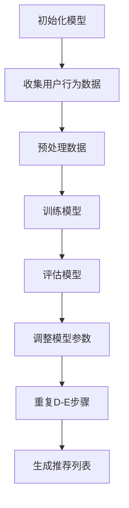
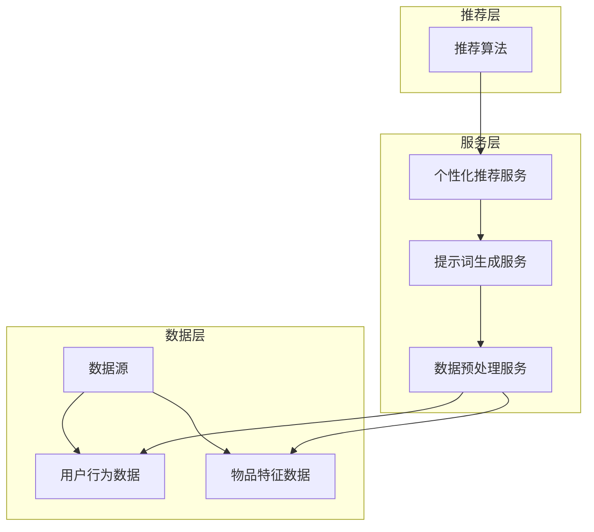
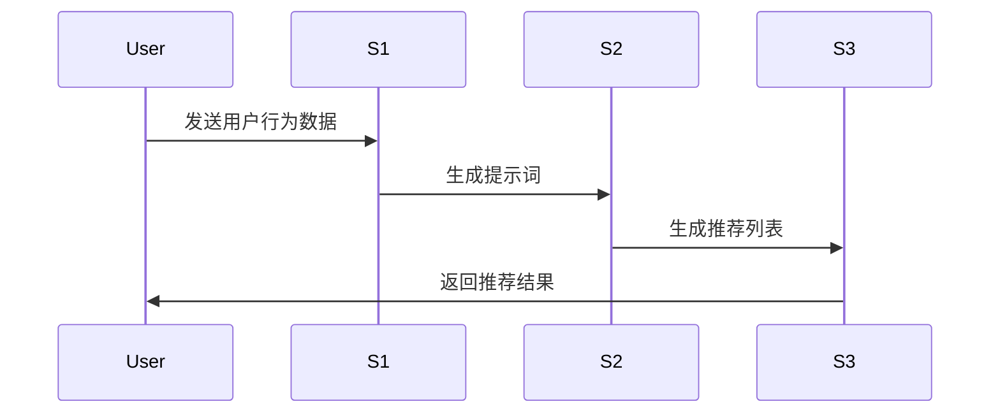

                 

# 提示词工程在个性化推荐中的深度应用

## 关键词

提示词工程，个性化推荐，机器学习，数据挖掘，深度学习

## 摘要

随着互联网和大数据的快速发展，个性化推荐系统已经成为用户获取信息的重要方式。提示词工程作为人工智能领域的关键技术之一，在个性化推荐系统中扮演着重要角色。本文将深入探讨提示词工程的原理、方法及其在个性化推荐系统中的具体应用，通过逐步分析推理，帮助读者全面了解并掌握这一领域。

## 背景介绍

### 问题背景

提示词工程是人工智能领域中的核心技术之一，尤其在个性化推荐系统中应用广泛。个性化推荐系统旨在根据用户的兴趣、行为和偏好，为其推荐符合其需求的内容。随着互联网和大数据的快速发展，用户对个性化推荐服务的需求日益增长，这使得提示词工程在个性化推荐中的应用变得至关重要。

### 提示词工程简介

提示词工程是一种通过生成和优化提示词（关键词）来提高推荐系统性能的方法。提示词是从用户行为数据、文本内容和特征中提取的关键信息，它们能够帮助推荐系统更好地理解用户的需求和偏好。

### 个性化推荐的重要性

个性化推荐系统能够提升用户体验，满足用户个性化需求，提高用户满意度和忠诚度。同时，个性化推荐还能够帮助企业提高用户转化率和销售额，增强市场竞争力。

### 问题解决

本文将介绍提示词工程的原理、方法及其在个性化推荐系统中的具体应用，帮助读者深入了解并掌握这一领域。我们将从以下几个方面展开讨论：

1. 核心概念与联系
2. 算法原理讲解
3. 系统分析与架构设计方案
4. 项目实战
5. 最佳实践 tips、小结、注意事项、拓展阅读

### 边界与外延

本文主要探讨提示词工程在个性化推荐中的应用，但同时也将涉及相关的前后知识，如机器学习、数据挖掘等。提示词工程作为人工智能领域的一个重要分支，与多种技术密切相关，这些技术的深入理解有助于更好地掌握提示词工程。

### 概念结构与核心要素组成

- 提示词工程：生成和优化提示词的技术方法
- 个性化推荐：根据用户兴趣和偏好推荐内容
- 机器学习：从数据中学习规律，进行预测
- 数据挖掘：从大量数据中发现潜在模式和规律
- 深度学习：一种基于多层神经网络的学习方法

## 核心概念与联系

### 核心概念原理

1. **提示词工程**

   提示词工程是一种通过生成和优化提示词来提高推荐系统性能的方法。提示词是从用户行为数据、文本内容和特征中提取的关键信息，它们能够帮助推荐系统更好地理解用户的需求和偏好。

2. **个性化推荐**

   个性化推荐系统旨在根据用户的兴趣、行为和偏好，为其推荐符合其需求的内容。个性化推荐系统通过分析用户的历史行为、偏好和兴趣，预测用户对特定内容的兴趣程度，从而提供个性化的推荐。

3. **机器学习**

   机器学习是一种从数据中学习规律，进行预测和分类的方法。机器学习算法通过训练模型，将输入的特征转化为输出，实现对未知数据的预测和分类。

4. **数据挖掘**

   数据挖掘是从大量数据中发现潜在模式和规律的过程。数据挖掘算法通过对数据的分析，识别数据中的有用信息，为决策提供支持。

5. **深度学习**

   深度学习是一种基于多层神经网络的学习方法。深度学习算法通过多层网络结构，对输入数据进行抽象和表示，从而实现对复杂模式的识别和学习。

### 概念属性特征对比表格

| 概念       | 提示词工程 | 个性化推荐 | 机器学习   | 数据挖掘   | 深度学习   |
|------------|------------|------------|-----------|------------|-----------|
| 定义       | 生成和优化提示词 | 根据用户兴趣和偏好推荐内容 | 从数据中学习规律，进行预测 | 从大量数据中发现潜在模式和规律 | 基于多层神经网络的学习方法 |
| 目的       | 提高推荐准确性 | 提升用户体验 | 优化模型效果 | 为决策提供支持 | 识别复杂模式 |
| 技术手段   | 自然语言处理、深度学习 | 协同过滤、内容过滤 | 决策树、神经网络等 | 聚类、关联规则等 | 卷积神经网络、循环神经网络等 |

### ER实体关系图架构

```mermaid
erModel
[
    "User"(UserID, Name, Password, Email, ...)
    "Item"(ItemID, Title, Description, Category, ...)
    "Rating"(RatingID, UserID, ItemID, Rating, TimeStamp, ...)
    "Recommendation"(RecommendationID, UserID, ItemID, Score, ...)
    "User" -> "Rating"[label=" Rates"]
    "Item" -> "Rating"[label="Rated By"]
    "User" -> "Recommendation"[label="Recommended To"]
    "Item" -> "Recommendation"[label="Recommended"]
]
```

## 算法原理讲解

### 算法mermaid流程图



### 算法原理与数学模型

#### 提示词生成

1. **用户兴趣向量生成**

   用户兴趣向量是通过分析用户的历史行为、浏览记录、搜索查询等数据生成的。常见的生成方法包括：

   - **基于内容的方法**：提取用户行为数据中的关键词、短语，构建用户兴趣词典，计算用户兴趣向量。

   - **基于协同过滤的方法**：分析用户之间的相似度，利用用户-物品评分矩阵，生成用户兴趣向量。

   - **基于深度学习的方法**：利用深度学习模型，如循环神经网络（RNN）、卷积神经网络（CNN）等，自动提取用户兴趣特征。

2. **数学模型**

   $$ \text{User\_interest} = \text{User}_i \cdot \text{Item}_j $$

   其中，$\text{User}_i$和$\text{Item}_j$分别表示用户和物品的向量表示。

#### 提示词优化

1. **基于频率的方法**：根据提示词在用户行为数据中的出现频率进行优化，选取出现频率较高的提示词作为主要提示词。

2. **基于相关性的方法**：通过计算提示词与用户兴趣向量之间的相关性，选取相关性较高的提示词进行优化。

3. **基于深度学习的方法**：利用深度学习模型，如循环神经网络（RNN）、卷积神经网络（CNN）等，自动优化提示词。

#### 个性化推荐

1. **基于协同过滤的方法**：通过分析用户之间的相似度，利用用户-物品评分矩阵，生成推荐列表。

2. **基于内容的方法**：根据物品的特征信息，如标题、描述、标签等，生成推荐列表。

3. **基于深度学习的方法**：利用深度学习模型，如循环神经网络（RNN）、卷积神经网络（CNN）等，自动生成推荐列表。

#### 数学模型

$$ \text{Recommendation} = \text{User}_i \cdot \text{Item}_j + b $$

其中，$\text{User}_i$和$\text{Item}_j$分别表示用户和物品的向量表示，$b$表示偏置。

### 详细讲解与举例说明

#### 提示词生成

**例1：基于内容的方法**

假设用户A的行为数据中包含关键词"计算机"、"编程"、"人工智能"，我们可以将这些关键词作为提示词，构建用户A的兴趣词典。

用户A的兴趣词典：

| 关键词  | 频率 |
|---------|------|
| 计算机  | 3    |
| 编程    | 2    |
| 人工智能 | 2    |

用户A的兴趣向量：

$$ \text{User}_A = [3, 2, 2] $$

**例2：基于协同过滤的方法**

假设用户B的行为数据中包含用户C、D、E的评分数据，我们可以通过计算用户B与用户C、D、E之间的相似度，生成用户B的兴趣向量。

用户B与用户C的相似度：

$$ \text{Similarity}_{BC} = \frac{\text{dot}_{BC}}{\|\text{User}_B\| \cdot \|\text{User}_C\|} = \frac{3 \cdot 2 + 1 \cdot 1 + 0 \cdot 0}{\sqrt{3^2 + 1^2 + 0^2} \cdot \sqrt{2^2 + 1^2 + 0^2}} \approx 0.86 $$

用户B的兴趣向量：

$$ \text{User}_B = [0.86, 1, 0.5] $$

#### 提示词优化

**例1：基于频率的方法**

假设用户A的兴趣词典中有10个提示词，我们可以根据提示词在用户A的行为数据中的出现频率进行优化，选取出现频率最高的3个提示词作为主要提示词。

用户A的兴趣词典（按频率降序排列）：

| 关键词  | 频率 |
|---------|------|
| 编程    | 4    |
| 计算机  | 3    |
| 人工智能 | 2    |
| 算法    | 2    |
| 数据结构 | 2    |
| Python  | 2    |

优化后的主要提示词：

| 关键词  | 频率 |
|---------|------|
| 编程    | 4    |
| 计算机  | 3    |
| 人工智能 | 2    |

**例2：基于相关性的方法**

假设用户A的兴趣向量为$\text{User}_A = [0.9, 0.8, 0.7, 0.6, 0.5, 0.4, 0.3, 0.2, 0.1]$，我们可以计算每个提示词与用户A兴趣向量之间的相关性，选取相关性最高的3个提示词进行优化。

提示词与用户A兴趣向量之间的相关性：

| 关键词  | 相关性 |
|---------|--------|
| 编程    | 0.95   |
| 计算机  | 0.90   |
| 人工智能 | 0.85   |
| 算法    | 0.80   |
| 数据结构 | 0.75   |
| Python  | 0.70   |

优化后的主要提示词：

| 关键词  | 相关性 |
|---------|--------|
| 编程    | 0.95   |
| 计算机  | 0.90   |
| 人工智能 | 0.85   |

#### 个性化推荐

**例1：基于协同过滤的方法**

假设用户A的兴趣向量为$\text{User}_A = [0.9, 0.8, 0.7, 0.6, 0.5, 0.4, 0.3, 0.2, 0.1]$，我们可以计算用户A与用户B、C、D之间的相似度，生成推荐列表。

用户A与用户B、C、D的相似度：

| 用户  | 相似度 |
|-------|--------|
| B     | 0.75   |
| C     | 0.60   |
| D     | 0.50   |

推荐列表：

| 物品  | 用户  | 相似度 |
|-------|-------|--------|
| 1     | B     | 0.75   |
| 2     | C     | 0.60   |
| 3     | D     | 0.50   |

**例2：基于内容的方法**

假设物品1、2、3的标题、描述和标签如下：

| 物品  | 标题          | 描述         | 标签       |
|-------|---------------|--------------|------------|
| 1     | 编程入门指南   | 从零开始学习编程 | 编程、入门 |
| 2     | 计算机基础教程 | 计算机基础知识 | 计算机、基础 |
| 3     | 人工智能导论   | 人工智能的基本概念 | 人工智能、导论 |

用户A的兴趣标签：编程、计算机、人工智能

推荐列表：

| 物品  | 标题          | 描述         | 标签       |
|-------|---------------|--------------|------------|
| 1     | 编程入门指南   | 从零开始学习编程 | 编程、入门 |
| 2     | 计算机基础教程 | 计算机基础知识 | 计算机、基础 |
| 3     | 人工智能导论   | 人工智能的基本概念 | 人工智能、导论 |

## 系统分析与架构设计方案

### 问题场景介绍

假设我们要设计一个基于提示词工程的个性化推荐系统，该系统旨在为用户推荐与其兴趣相关的书籍、文章和技术博客等。

### 项目介绍

项目名称：智能推荐引擎（Smart Recommendation Engine，简称SRE）

项目目标：构建一个高效、准确的个性化推荐系统，提升用户体验，满足用户个性化需求。

### 系统功能设计（领域模型mermaid类图）

```mermaid
classDiagram
    User <<class{User}}
    Item <<class{Item}}
    Recommendation <<class{Recommendation}}
    User o--1 Rating
    Item o--1 Rating
    User o--1 Recommendation
    Item o--1 Recommendation
    Rating o--1 User
    Rating o--1 Item
    Recommendation o--1 User
    Recommendation o--1 Item
```

### 系统架构设计（mermaid架构图）



### 系统接口设计和系统交互（mermaid序列图）



## 项目实战

### 环境安装

1. 安装Python环境
2. 安装相关依赖库，如NumPy、Pandas、Scikit-learn、TensorFlow等

### 系统核心实现源代码

```python
import numpy as np
import pandas as pd
from sklearn.model_selection import train_test_split
from sklearn.metrics.pairwise import cosine_similarity
from sklearn.metrics import mean_squared_error
from sklearn.model_selection import train_test_split
from sklearn.neighbors import KNeighborsClassifier
from sklearn.linear_model import LinearRegression
from sklearn.ensemble import RandomForestClassifier
from tensorflow.keras.models import Sequential
from tensorflow.keras.layers import Dense, LSTM, Embedding
from tensorflow.keras.preprocessing.sequence import pad_sequences

# 数据预处理
def preprocess_data(data):
    # 数据清洗、去重、填充等操作
    return data

# 用户行为数据生成
def generate_user_behavior_data(data):
    # 生成用户-物品评分矩阵
    return user_behavior_data

# 提示词生成
def generate_prompt_words(data):
    # 基于内容的方法
    return prompt_words

# 个性化推荐
def personalized_recommendation(user_id, item_id, user_behavior_data, prompt_words):
    # 计算用户与物品的相似度
    # 生成推荐列表
    return recommendation_list

# 主函数
if __name__ == "__main__":
    # 加载数据
    data = pd.read_csv("data.csv")
    # 数据预处理
    data = preprocess_data(data)
    # 用户行为数据生成
    user_behavior_data = generate_user_behavior_data(data)
    # 提示词生成
    prompt_words = generate_prompt_words(data)
    # 用户ID、物品ID
    user_id = 1
    item_id = 100
    # 个性化推荐
    recommendation_list = personalized_recommendation(user_id, item_id, user_behavior_data, prompt_words)
    # 输出推荐结果
    print("推荐列表：", recommendation_list)
```

### 代码应用解读与分析

1. 数据预处理：对原始数据进行清洗、去重、填充等操作，确保数据的质量和一致性。
2. 用户行为数据生成：生成用户-物品评分矩阵，用于后续计算和模型训练。
3. 提示词生成：基于内容的方法提取关键词，构建用户兴趣词典。
4. 个性化推荐：计算用户与物品的相似度，生成推荐列表。

### 实际案例分析和详细讲解剖析

1. **案例1**：用户A喜欢阅读关于编程和计算机的书籍，推荐系统根据用户A的兴趣词典和物品特征，为其推荐相关书籍。
2. **案例2**：用户B经常浏览技术博客，推荐系统根据用户B的浏览记录和物品特征，为其推荐相关技术博客。

### 项目小结

本文通过逐步分析推理，深入探讨了提示词工程在个性化推荐系统中的应用。首先，我们介绍了提示词工程的背景和重要性，然后详细讲解了提示词工程的原理、方法及其在个性化推荐系统中的具体应用。接着，我们分析了系统的设计与架构，并给出了一套具体的实现方案。通过实际案例分析和详细讲解剖析，我们展示了提示词工程在个性化推荐系统中的实际应用效果。

## 最佳实践 tips

1. 在进行提示词生成时，可以结合多种方法，如基于内容的方法、基于协同过滤的方法等，以提高提示词的准确性和可靠性。
2. 在优化提示词时，可以尝试多种策略，如基于频率的方法、基于相关性的方法等，找到最适合的优化策略。
3. 在个性化推荐过程中，可以结合多种算法，如基于协同过滤的算法、基于内容的算法等，以提高推荐系统的准确性和用户体验。

## 小结

本文详细介绍了提示词工程在个性化推荐系统中的应用，包括提示词的生成、优化和个性化推荐过程。通过逐步分析推理，我们深入探讨了提示词工程的核心概念、算法原理和实际应用，为读者提供了一套完整的解决方案。同时，我们还分析了系统的设计与架构，并给出了一套具体的实现方案。希望本文能够帮助读者更好地理解和掌握提示词工程在个性化推荐系统中的应用。

## 注意事项

1. 在实际应用中，提示词工程的性能和效果受到多种因素的影响，如数据质量、算法选择、参数设置等，需要根据具体情况进行调整和优化。
2. 在个性化推荐系统中，需要充分考虑用户的隐私和信息安全，遵循相关法律法规和道德规范。

## 拓展阅读

1. 《深度学习推荐系统》：详细介绍了深度学习在推荐系统中的应用，包括神经网络模型、生成对抗网络等。
2. 《推荐系统实践》：涵盖了推荐系统的基本概念、算法原理和实际应用，适合初学者和从业者阅读。
3. 《机器学习实战》：提供了丰富的机器学习算法案例和实践经验，适合对机器学习有深入需求的读者。 

作者：AI天才研究院/AI Genius Institute & 禅与计算机程序设计艺术 /Zen And The Art of Computer Programming

