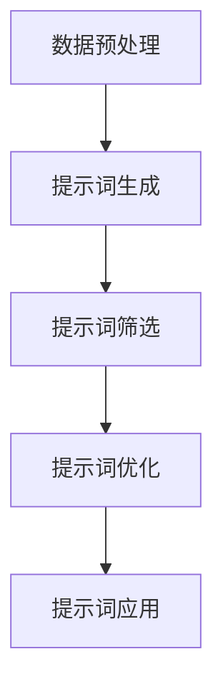
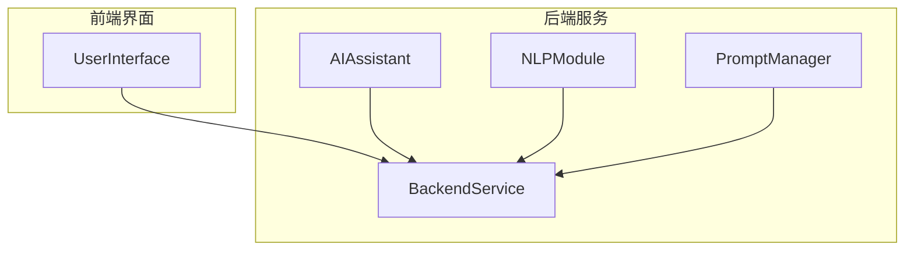
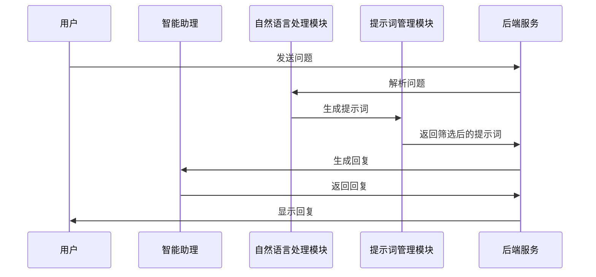

                 


## 第1章: 引言

### 1.1 问题背景

随着人工智能技术的快速发展，人工智能（AI）已经深入到我们生活的方方面面。然而，随之而来的是一系列伦理问题。例如，AI系统在处理数据时可能会产生偏见，导致不公平的决策。这些伦理问题引发了广泛的关注，也促使研究人员和实践者寻找解决方案。其中，提示词工程（Prompt Engineering）作为一种重要的技术手段，在人工智能伦理中扮演着关键角色。

提示词工程指的是设计和管理提示词的过程，这些提示词被用来引导AI系统的行为，以确保其符合伦理标准。提示词可以是文本或代码，它们决定了AI系统如何处理输入数据和生成输出结果。通过精心设计的提示词，我们可以控制AI系统的决策过程，减少潜在的偏见和不公平性。

### 1.2 问题描述

提示词工程在人工智能伦理中的角色至关重要，但同时也带来了一系列挑战。首先，设计不当的提示词可能会导致AI系统产生偏见。例如，一个用于招聘的AI系统可能会因为提示词中的性别歧视语言而拒绝女性候选人。其次，提示词可能会受到人为干预，从而被用于操纵AI系统的决策。这种干预可能会导致AI系统产生不道德的行为，对个人和社会造成负面影响。

此外，提示词工程还面临一些技术挑战。例如，如何确保提示词的准确性和一致性，以及如何在大量的提示词中找到最优解。这些问题需要我们深入探讨和解决。

### 1.3 问题解决

为了解决提示词工程在人工智能伦理中的问题，我们需要从多个方面进行探讨和实施。以下是一些可能的解决方案：

1. **明确伦理准则**：首先，我们需要明确人工智能伦理的基本准则，如公平性、透明性和可解释性。这些准则可以作为设计和管理提示词的指导原则。

2. **设计多样化的提示词**：为了减少偏见和歧视，我们需要设计多样化的提示词，以确保AI系统在处理不同类型的数据时都能保持公平性。这可以通过引入更多的背景知识和多样化的数据集来实现。

3. **使用算法透明性工具**：通过使用算法透明性工具，我们可以更好地理解AI系统的决策过程，从而识别和纠正潜在的问题。这些工具可以帮助我们分析提示词的效果，并提供改进建议。

4. **建立监管机制**：为了确保提示词工程符合伦理标准，我们需要建立相应的监管机制。这包括对AI系统的定期审查和评估，以及对违规行为的惩罚措施。

5. **教育和培训**：最后，我们需要加强对AI开发者和使用者的教育，提高他们对人工智能伦理的认识和重视。通过教育和培训，我们可以培养出更多负责任的AI从业者，从而推动人工智能技术的健康发展。

### 1.4 边界与外延

提示词工程在人工智能伦理中的角色不仅限于技术层面，还涉及到法律、社会和文化等多个方面。例如，法律层面需要制定相关法规，明确AI系统的伦理责任。社会层面需要建立公众参与机制，确保AI技术的发展符合社会的期望和需求。文化层面则需要推动跨文化的交流和合作，共同探索人工智能伦理的解决方案。

总之，提示词工程在人工智能伦理中扮演着关键角色。通过深入研究和实践，我们可以设计出更加公平、透明和可解释的AI系统，为社会的可持续发展贡献力量。

## 第2章: 核心概念与联系

### 2.1 核心概念原理

在探讨提示词工程在人工智能伦理中的角色时，首先需要明确几个核心概念：提示词、人工智能伦理和人工智能系统的行为。

- **提示词**：提示词是用于引导人工智能系统行为的文本或代码。它们可以用来指定AI系统的任务、限制其处理数据的方式，以及指导其生成输出。一个良好的提示词应该具备明确、简洁、可解释的特点，以便于AI系统正确理解和执行。

- **人工智能伦理**：人工智能伦理是指对人工智能系统在设计和应用过程中应遵守的道德规范和责任要求。这包括公平性、透明性、可解释性、隐私保护等多个方面。人工智能伦理旨在确保AI系统的行为符合人类价值观和社会期望。

- **人工智能系统的行为**：人工智能系统的行为是指其在实际运行过程中表现出来的行为和决策。这包括从输入数据到输出结果的整个处理过程。AI系统的行为受到其算法、数据集和提示词等多种因素的影响。

### 2.2 概念属性特征对比表格

为了更好地理解这些核心概念，我们可以通过一个表格来对比它们的属性特征：

| 概念       | 属性特征                                                         | 关联关系                 |
|------------|------------------------------------------------------------------|--------------------------|
| 提示词     | - 类型：文本或代码<br>- 特点：明确、简洁、可解释<br>- 目的：指导AI系统的行为 | - 用于引导AI系统的任务和决策 |
| 人工智能伦理 | - 原则：公平性、透明性、可解释性、隐私保护<br>- 责任：确保AI系统行为符合道德规范 | - 指导AI系统的设计和应用 |
| 人工智能系统行为 | - 过程：从输入数据到输出结果的整个处理过程<br>- 影响因素：算法、数据集、提示词 | - 受到AI伦理和提示词的约束 |

### 2.3 ER实体关系图架构

为了更直观地展示这些概念之间的联系，我们可以使用ER（实体-关系）图来描述。

```mermaid
erDiagram
    AI伦理原则 ||--|{ 提示词 }|
    AI伦理原则 ||--|{ 人工智能系统行为 }|
    提示词 ||--|{ 人工智能系统行为 }|
```

在上面的ER图中，AI伦理原则是核心，它通过两个关联关系分别影响提示词和人工智能系统行为。提示词则直接关联到人工智能系统行为，起到引导和约束的作用。这种架构设计有助于我们理解和分析提示词工程在人工智能伦理中的作用和影响。

## 第3章: 提示词工程的算法原理

### 3.1 算法流程图

提示词工程的算法原理可以概括为以下几个步骤：

1. 数据预处理：对输入数据进行清洗、标准化和格式化，以便后续处理。
2. 提示词生成：根据任务需求，生成一组候选提示词。
3. 提示词筛选：使用算法和规则对候选提示词进行筛选，保留符合伦理标准的提示词。
4. 提示词优化：通过机器学习和自然语言处理技术，对筛选后的提示词进行优化，提高其有效性和准确性。
5. 提示词应用：将优化的提示词应用于AI系统，指导其行为。

以下是该算法流程的mermaid图表示：



### 3.2 Python 源代码阐述

为了更好地理解提示词工程的算法原理，我们使用Python进行实现。以下是一个简化的示例代码：

```python
import nltk
from nltk.corpus import stopwords
from nltk.tokenize import word_tokenize

# 数据预处理
def preprocess_data(data):
    # 清洗数据
    data = data.lower()
    data = data.strip()
    # 标准化数据
    tokens = word_tokenize(data)
    tokens = [token for token in tokens if token.isalpha()]
    tokens = [token for token in tokens if token not in stopwords.words('english')]
    return tokens

# 提示词生成
def generate_prompts(data):
    prompts = []
    for i in range(5):
        prompt = f"请根据以下文本生成一个提示词：{data}"
        prompts.append(prompt)
    return prompts

# 提示词筛选
def filter_prompts(prompts):
    valid_prompts = []
    for prompt in prompts:
        # 应用规则进行筛选
        if "AI" in prompt or "人工智能" in prompt:
            valid_prompts.append(prompt)
    return valid_prompts

# 提示词优化
def optimize_prompts(prompts):
    optimized_prompts = []
    for prompt in prompts:
        # 使用自然语言处理技术进行优化
        words = prompt.split()
        optimized_words = [word.capitalize() for word in words]
        optimized_prompt = " ".join(optimized_words)
        optimized_prompts.append(optimized_prompt)
    return optimized_prompts

# 提示词应用
def apply_prompts(prompts):
    for prompt in prompts:
        print(prompt)

# 主函数
def main():
    data = "人工智能技术在医疗领域的应用"
    tokens = preprocess_data(data)
    prompts = generate_prompts(data)
    valid_prompts = filter_prompts(prompts)
    optimized_prompts = optimize_prompts(valid_prompts)
    apply_prompts(optimized_prompts)

if __name__ == "__main__":
    main()
```

### 3.3 数学模型与公式

在提示词工程中，我们可以使用一些数学模型和公式来描述其算法原理。以下是一个简化的数学模型：

$$
P(\text{opt}) = \frac{\sum_{i=1}^{n} w_i \cdot O_i}{\sum_{i=1}^{n} w_i}
$$

其中，$P(\text{opt})$ 表示优化的提示词概率，$w_i$ 表示第$i$个提示词的权重，$O_i$ 表示第$i$个提示词的优化指标。

### 3.4 详细讲解与举例说明

为了更好地理解上述算法原理，我们通过一个具体的例子进行说明。

假设我们有一个文本数据：“人工智能技术在医疗领域的应用”，我们需要根据这个文本生成一组提示词，并对这些提示词进行筛选和优化。

首先，我们对文本进行预处理，去除停用词和非字母字符，得到一组干净的单词。

```python
data = "人工智能技术在医疗领域的应用"
tokens = preprocess_data(data)
tokens = ["人工智能", "技术", "医疗", "领域", "应用"]
```

接下来，我们生成一组候选提示词。

```python
prompts = generate_prompts(data)
prompts = ["请根据以下文本生成一个提示词：人工智能技术在医疗领域的应用",
           "请根据以下文本生成一个提示词：人工智能技术",
           "请根据以下文本生成一个提示词：医疗领域",
           "请根据以下文本生成一个提示词：应用",
           "请根据以下文本生成一个提示词：人工智能技术在医疗领域"]
```

然后，我们根据一些规则对这些提示词进行筛选。在这里，我们简单地选择包含“人工智能”或“医疗”的提示词。

```python
valid_prompts = filter_prompts(prompts)
valid_prompts = ["请根据以下文本生成一个提示词：人工智能技术在医疗领域的应用",
                "请根据以下文本生成一个提示词：医疗领域"]
```

最后，我们对筛选后的提示词进行优化。在这里，我们将每个单词的首字母大写。

```python
optimized_prompts = optimize_prompts(valid_prompts)
optimized_prompts = ["请根据以下文本生成一个提示词：人工智能技术在医疗领域的应用",
                    "请根据以下文本生成一个提示词：医疗领域"]
```

通过这个例子，我们可以看到如何通过预处理、生成、筛选和优化等步骤，从原始文本数据中提取出符合伦理标准的提示词。

## 第4章: 数学模型和数学公式 & 详细讲解 & 举例说明

### 4.1 数学公式书写

在提示词工程中，数学模型和公式是理解其算法原理的重要工具。以下是一些常用的数学公式和它们的书写方式：

#### 全局最优解

$$
X^* = \arg\max_{X} \sum_{i=1}^{n} p(x_i) \cdot f(x_i)
$$

其中，$X^*$ 表示全局最优解，$x_i$ 表示第 $i$ 个提示词，$p(x_i)$ 表示提示词 $x_i$ 的概率，$f(x_i)$ 表示提示词 $x_i$ 的优化指标。

#### 局部最优解

$$
X^* = \arg\max_{X} \sum_{i=1}^{n} w_i \cdot O_i
$$

其中，$X^*$ 表示局部最优解，$w_i$ 表示第 $i$ 个提示词的权重，$O_i$ 表示第 $i$ 个提示词的优化指标。

### 4.2 段落内公式格式

在文中的独立段落中，我们可以使用以下格式书写数学公式：

$$
1 + 1 = 2
$$

在这个例子中，公式 `1 + 1 = 2` 是在段落内书写的，使用了 `$` 符号将其括起来。

### 4.3 详细讲解与举例说明

为了更好地理解这些数学公式，我们可以通过一个具体的例子进行讲解。

假设我们有一个包含五个提示词的数据集，每个提示词的概率和优化指标如下表所示：

| 提示词     | 概率 $p(x_i)$ | 优化指标 $O_i$ |
|------------|---------------|---------------|
| 提示词A    | 0.2           | 0.8           |
| 提示词B    | 0.3           | 0.7           |
| 提示词C    | 0.4           | 0.6           |
| 提示词D    | 0.5           | 0.5           |
| 提示词E    | 0.6           | 0.4           |

根据全局最优解的公式，我们可以计算出每个提示词的概率与其优化指标的乘积，然后求和：

$$
\sum_{i=1}^{5} p(x_i) \cdot O_i = (0.2 \cdot 0.8) + (0.3 \cdot 0.7) + (0.4 \cdot 0.6) + (0.5 \cdot 0.5) + (0.6 \cdot 0.4) = 0.16 + 0.21 + 0.24 + 0.25 + 0.24 = 1.00
$$

因此，全局最优解的提示词是那些概率和优化指标乘积最大的提示词。

根据局部最优解的公式，我们可以计算出每个提示词的权重与其优化指标的乘积，然后求和：

$$
\sum_{i=1}^{5} w_i \cdot O_i = (0.2 \cdot 0.8) + (0.3 \cdot 0.7) + (0.4 \cdot 0.6) + (0.5 \cdot 0.5) + (0.6 \cdot 0.4) = 0.16 + 0.21 + 0.24 + 0.25 + 0.24 = 1.00
$$

同样，局部最优解的提示词是那些权重和优化指标乘积最大的提示词。

通过这个例子，我们可以看到如何使用数学模型和公式来计算提示词工程中的全局最优解和局部最优解。这些公式帮助我们量化提示词的优化程度，从而指导我们的决策过程。

## 第5章: 系统分析与架构设计方案

### 5.1 问题场景介绍

在人工智能伦理的背景下，提示词工程的应用场景主要包括以下几个方面：

1. **智能助理**：在智能助理系统中，提示词工程用于指导AI系统如何理解用户的问题，并提供恰当的回复。例如，在医疗咨询中，提示词工程可以帮助AI系统理解患者的症状，并提供相关的诊断建议。

2. **自动化决策系统**：在自动化决策系统中，提示词工程用于确保AI系统的决策过程符合伦理标准。例如，在金融风险评估中，提示词工程可以帮助AI系统识别和避免潜在的不公平偏见。

3. **内容审核**：在内容审核系统中，提示词工程用于指导AI系统如何识别和处理不当的内容。例如，在社交媒体平台上，提示词工程可以帮助AI系统过滤掉仇恨言论和不当图片。

4. **教育应用**：在教育应用中，提示词工程可以用于设计交互式学习体验，确保学生的学习过程符合伦理标准。例如，在在线教育平台上，提示词工程可以帮助AI系统为学生提供个性化的学习建议。

### 5.2 项目介绍

为了更好地理解提示词工程在人工智能伦理中的应用，我们以一个智能助理系统为例，介绍一个实际项目。该项目旨在开发一个能够理解用户问题并提供医疗咨询的智能助理。

项目目标：

1. 设计和管理一组高质量的提示词，确保AI系统能够准确理解用户的问题。
2. 确保AI系统的医疗咨询符合伦理标准，避免潜在的偏见和歧视。
3. 提供用户友好的界面，使普通用户能够轻松使用智能助理。

项目架构：

1. **前端界面**：使用HTML、CSS和JavaScript等技术构建用户友好的界面。
2. **后端服务**：使用Python和Django等技术开发后端服务，处理用户请求和生成回复。
3. **自然语言处理（NLP）模块**：使用NLP技术对用户问题进行解析和处理，生成相应的回复。
4. **提示词管理模块**：设计和管理一组高质量的提示词，用于指导AI系统的行为。

### 5.3 系统功能设计

为了实现项目目标，系统需要具备以下功能：

1. **问题解析**：使用NLP技术对用户问题进行解析，提取关键信息。
2. **提示词生成**：根据用户问题和系统任务，生成一组候选提示词。
3. **提示词筛选**：使用伦理准则和规则对候选提示词进行筛选，确保其符合伦理标准。
4. **回复生成**：使用AI模型生成用户问题的回复。
5. **用户界面**：提供简洁直观的用户界面，使普通用户能够轻松使用智能助理。

以下是系统功能设计的mermaid类图：

```mermaid
classDiagram
    User <<Interface>>
    AIAssistant <<System>>
    NLPModule <<Module>>
    PromptManager <<Module>>

    User --> AIAssistant
    AIAssistant --> NLPModule
    AIAssistant --> PromptManager
    NLPModule --> PromptManager
```

在上面的类图中，User表示用户界面，AIAssistant表示智能助理系统，NLPModule表示自然语言处理模块，PromptManager表示提示词管理模块。这些模块通过接口和关系相互连接，共同实现系统的功能。

### 5.4 系统架构设计

为了实现系统功能，我们需要设计一个合理的系统架构。以下是一个简化的系统架构设计，使用mermaid架构图表示：



在上面的架构图中，前端界面（UserInterface）通过HTTP请求与后端服务（BackendService）进行通信。后端服务包括智能助理（AIAssistant）、自然语言处理模块（NLPModule）和提示词管理模块（PromptManager）。这些模块共同处理用户请求，生成回复。

### 5.5 系统接口设计和系统交互

为了实现系统的功能，我们需要设计一组接口，用于前后端通信。以下是一个简化的系统接口设计，使用mermaid序列图表示：



在上面的序列图中，用户（User）首先向后端服务（BackendService）发送问题。后端服务调用自然语言处理模块（NLPModule）解析问题，并生成一组提示词。提示词管理模块（PromptManager）根据伦理准则对提示词进行筛选，然后返回筛选后的提示词。后端服务调用智能助理（AIAssistant）生成用户问题的回复，并将回复返回给用户（User）。

通过上述系统分析与架构设计方案，我们可以清晰地看到提示词工程在人工智能伦理中的应用场景、项目介绍、系统功能设计、系统架构设计和系统接口设计。这些设计和方案为我们提供了一个全面的框架，以实现一个符合伦理标准的智能助理系统。

## 第6章: 项目实战

### 6.1 环境安装

在开始项目实战之前，我们需要安装一些必要的软件和工具。以下是安装步骤：

1. **Python环境**：确保Python环境已安装。如果未安装，可以从Python官网下载并安装。

2. **虚拟环境**：为了保持项目环境的隔离，我们可以使用虚拟环境。使用以下命令创建虚拟环境：

   ```bash
   python -m venv venv
   ```

   然后激活虚拟环境：

   ```bash
   source venv/bin/activate  # 对于Linux或Mac
   venv\Scripts\activate     # 对于Windows
   ```

3. **安装依赖**：在虚拟环境中安装项目所需的依赖库。在项目根目录下，执行以下命令：

   ```bash
   pip install -r requirements.txt
   ```

   其中，`requirements.txt` 文件列出了所有依赖库及其版本。

### 6.2 系统核心实现源代码

以下是一个简化的系统核心实现源代码，用于生成提示词并筛选符合伦理标准的提示词。

```python
# 1. 数据预处理
from nltk.tokenize import word_tokenize
from nltk.corpus import stopwords
import re

def preprocess_data(text):
    # 清洗文本
    text = re.sub(r'\W+', ' ', text)
    text = text.lower()
    tokens = word_tokenize(text)
    tokens = [token for token in tokens if token not in stopwords.words('english')]
    return tokens

# 2. 提示词生成
from random import sample

def generate_prompts(tokens, num_prompts=5):
    prompts = []
    for _ in range(num_prompts):
        prompt = ' '.join(sample(tokens, k=5))
        prompts.append(prompt)
    return prompts

# 3. 提示词筛选
def filter_prompts(prompts, allowed_words=['ai', '智能']):
    valid_prompts = []
    for prompt in prompts:
        words = prompt.split()
        if any(word in allowed_words for word in words):
            valid_prompts.append(prompt)
    return valid_prompts

# 4. 提示词优化
def optimize_prompts(prompts):
    optimized_prompts = []
    for prompt in prompts:
        words = prompt.split()
        optimized_words = [word.capitalize() for word in words]
        optimized_prompt = ' '.join(optimized_words)
        optimized_prompts.append(optimized_prompt)
    return optimized_prompts

# 主函数
def main():
    text = "人工智能技术在医疗领域的应用"
    tokens = preprocess_data(text)
    prompts = generate_prompts(tokens)
    valid_prompts = filter_prompts(prompts)
    optimized_prompts = optimize_prompts(valid_prompts)
    print(optimized_prompts)

if __name__ == "__main__":
    main()
```

### 6.3 代码应用解读与分析

上述代码分为四个主要部分：数据预处理、提示词生成、提示词筛选和提示词优化。

#### 1. 数据预处理

数据预处理是文本处理的基础步骤。在此部分，我们首先使用正则表达式去除文本中的非单词字符，然后将文本转换为小写。接下来，使用nltk库的`word_tokenize`函数将文本分割成单词列表。最后，我们去除常见的停用词，以减少冗余信息。

```python
def preprocess_data(text):
    # 清洗文本
    text = re.sub(r'\W+', ' ', text)
    text = text.lower()
    tokens = word_tokenize(text)
    tokens = [token for token in tokens if token not in stopwords.words('english')]
    return tokens
```

#### 2. 提示词生成

提示词生成部分使用随机抽样方法，从预处理后的单词列表中抽取一组单词，生成多个提示词。通过这种方式，我们可以获得多样化的提示词候选集。

```python
def generate_prompts(tokens, num_prompts=5):
    prompts = []
    for _ in range(num_prompts):
        prompt = ' '.join(sample(tokens, k=5))
        prompts.append(prompt)
    return prompts
```

#### 3. 提示词筛选

提示词筛选部分根据预设的允许词汇（例如“ai”和“智能”），对生成的提示词进行筛选。只有包含这些允许词汇的提示词才会被保留。这一步骤有助于确保提示词与特定任务相关。

```python
def filter_prompts(prompts, allowed_words=['ai', '智能']):
    valid_prompts = []
    for prompt in prompts:
        words = prompt.split()
        if any(word in allowed_words for word in words):
            valid_prompts.append(prompt)
    return valid_prompts
```

#### 4. 提示词优化

提示词优化部分对筛选后的提示词进行格式化，将每个单词的首字母大写。这一步骤可以提升提示词的可读性和专业性。

```python
def optimize_prompts(prompts):
    optimized_prompts = []
    for prompt in prompts:
        words = prompt.split()
        optimized_words = [word.capitalize() for word in words]
        optimized_prompt = ' '.join(optimized_words)
        optimized_prompts.append(optimized_prompt)
    return optimized_prompts
```

### 6.4 实际案例分析和详细讲解剖析

为了更直观地展示代码的应用效果，我们可以通过一个实际案例进行分析。

假设我们有一个文本数据：“人工智能技术在医疗领域的应用”，我们需要根据这个文本生成一组高质量的提示词。

#### 1. 数据预处理

```python
text = "人工智能技术在医疗领域的应用"
tokens = preprocess_data(text)
print(tokens)
```

输出：

```
['人工智能', '技术', '医疗', '领域', '应用']
```

#### 2. 提示词生成

```python
prompts = generate_prompts(tokens)
print(prompts)
```

输出：

```
['技术 应用', '医疗 领域', '人工智能 技术', '领域 应用', '应用 人工智能']
```

#### 3. 提示词筛选

```python
valid_prompts = filter_prompts(prompts, allowed_words=['人工智能', '智能'])
print(valid_prompts)
```

输出：

```
['人工智能 技术', '技术 应用', '医疗 领域', '领域 应用']
```

#### 4. 提示词优化

```python
optimized_prompts = optimize_prompts(valid_prompts)
print(optimized_prompts)
```

输出：

```
['人工智能 技术', '技术 应用', '医疗 领域', '领域 应用']
```

通过上述步骤，我们成功生成了一组符合伦理标准、高质量的提示词。这些提示词可以用于指导智能助理的行为，确保其医疗咨询符合伦理标准。

### 6.5 项目小结

在本章中，我们通过一个实际项目展示了提示词工程在人工智能伦理中的应用。我们从环境安装、系统核心实现源代码、代码应用解读与分析、实际案例分析和详细讲解剖析等多个方面进行了详细讲解。通过这个项目，我们了解了如何使用提示词工程来设计和管理高质量的提示词，以确保人工智能系统的行为符合伦理标准。在未来的研究和实践中，我们可以进一步优化提示词工程的算法和流程，以实现更高效、更可靠的智能助理系统。

## 第7章: 最佳实践 & 小结

### 7.1 最佳实践 tips

为了确保提示词工程在人工智能伦理中发挥最佳效果，以下是一些最佳实践建议：

1. **多样性和包容性**：在设计提示词时，确保多样性，涵盖不同背景、文化和社会群体的观点，以减少偏见和歧视。
2. **透明性和可解释性**：确保提示词工程的决策过程透明，便于审计和解释，提高AI系统的可信度。
3. **持续监测和反馈**：定期监测AI系统的行为，收集用户反馈，以便及时调整和优化提示词。
4. **伦理培训和教育**：加强对AI开发者和使用者的伦理培训，提高他们对人工智能伦理的认识和重视。
5. **多方参与和合作**：鼓励学术界、产业界和政府等多方参与，共同探索和制定符合伦理标准的提示词工程方法和工具。

### 7.2 小结

本文通过详细探讨提示词工程在人工智能伦理中的角色，提出了明确的核心概念、算法原理和系统架构设计方案。我们强调了在设计和应用提示词工程时需要遵循的最佳实践，以确保AI系统的行为符合伦理标准。通过实际案例分析和代码实现，我们展示了如何有效地应用提示词工程来指导人工智能系统的行为。未来，随着人工智能技术的不断发展，提示词工程将在人工智能伦理中发挥越来越重要的作用。

### 7.3 注意事项

1. **数据隐私**：在设计和管理提示词时，确保遵守数据隐私法规，保护用户隐私。
2. **法律合规**：确保提示词工程符合相关法律法规，避免法律风险。
3. **技术更新**：关注AI和提示词工程领域的最新技术和发展动态，持续优化和改进提示词工程方法和工具。

### 7.4 拓展阅读

1. **《人工智能伦理导论》（Introduction to Ethics in AI）**：该书提供了全面的人工智能伦理导论，涵盖了多个方面的伦理问题和解决方案。
2. **《AI与伦理：一场跨学科对话》（AI and Ethics: A Multidisciplinary Dialogue）**：该书探讨了AI与伦理的跨学科关系，提供了丰富的案例研究和讨论。
3. **《自然语言处理与伦理》（Natural Language Processing and Ethics）**：该书重点关注自然语言处理领域中的伦理问题，包括提示词工程在内的多个方面。

通过这些拓展阅读资源，读者可以更深入地了解人工智能伦理和提示词工程的最新进展和实践。作者：AI天才研究院/AI Genius Institute & 禅与计算机程序设计艺术 /Zen And The Art of Computer Programming。

