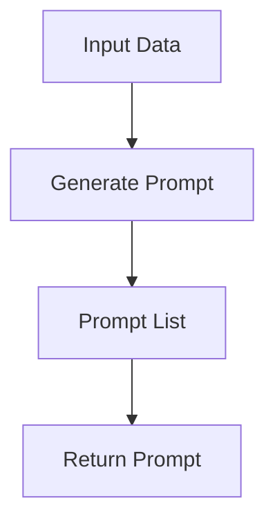
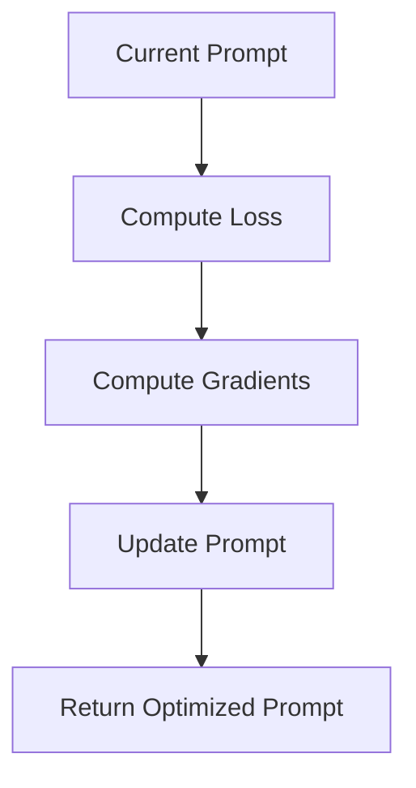
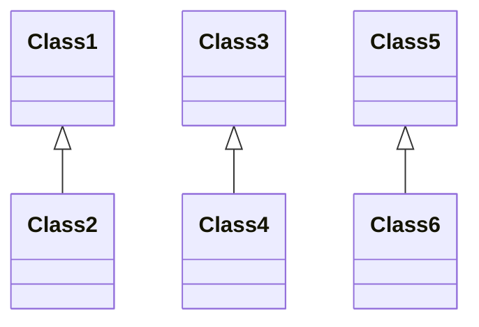
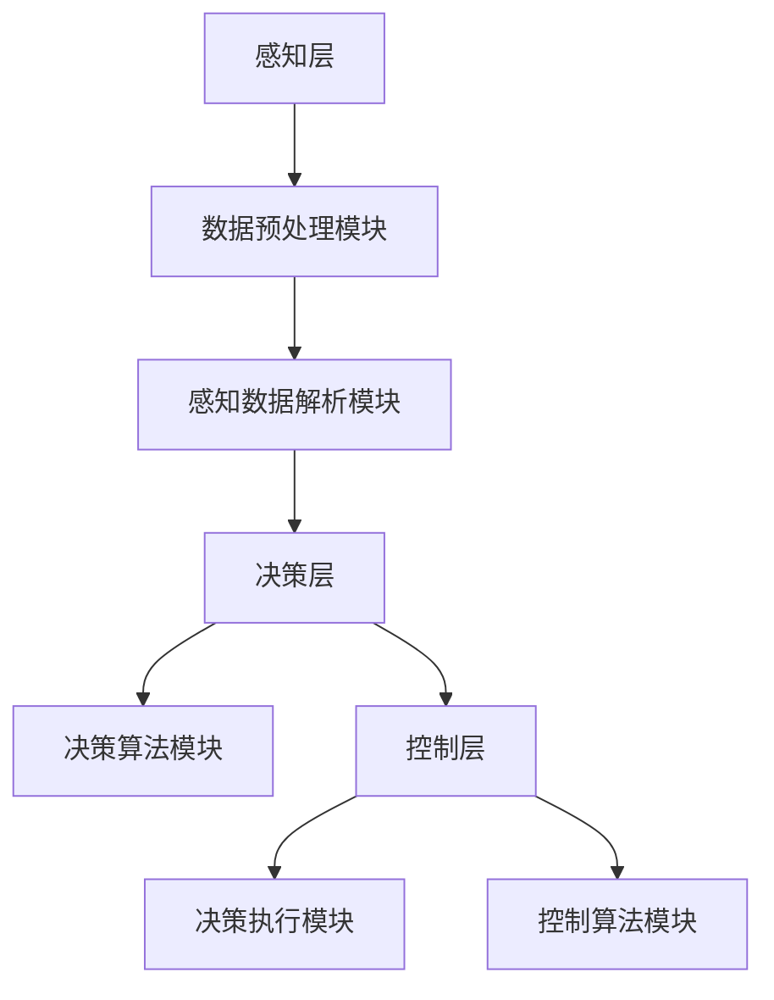
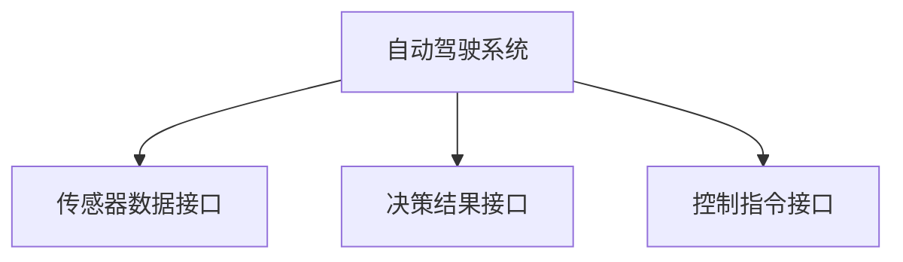
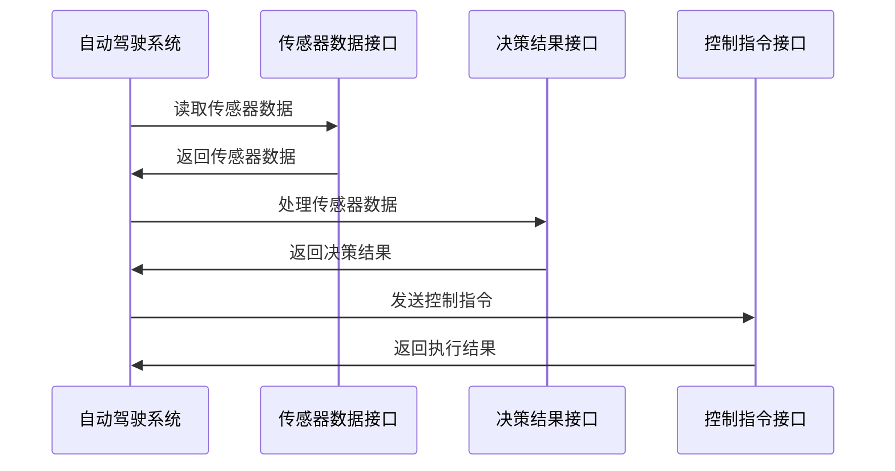

                 


### 1. 背景介绍

**问题背景与核心概念**

在深度学习领域，模型训练效率一直是影响人工智能应用落地的重要因素。随着数据量的急剧增长和任务复杂度的不断提升，传统的机器学习模型在训练过程中往往面临效率低下、计算资源消耗大的问题。特别是在元学习（Meta-Learning）这一领域，如何提升模型的训练效率显得尤为重要。

#### 1.1 问题背景

**元学习效率面临的挑战**

元学习是一种机器学习方法，其核心思想是通过从多个任务中学习，从而提高模型在新任务上的学习效率。然而，在实际应用中，元学习模型在训练过程中仍然面临以下挑战：

1. **训练时间长**：由于元学习模型需要从多个任务中学习，训练时间往往较长，这限制了模型在实际应用中的迭代速度。
2. **计算资源消耗大**：元学习模型在训练过程中需要大量的计算资源，特别是在处理大规模数据时，计算资源的需求更加明显。
3. **任务适应能力有限**：尽管元学习模型具有一定的适应性，但在面对一些特定任务时，其适应性仍然有限，无法达到理想的训练效果。

**提示词工程的作用**

提示词工程（Prompt Engineering）是一种旨在提升机器学习模型学习效率的技术。通过设计有效的提示词，可以引导模型更快、更准确地学习，从而提高训练效率。在元学习领域，提示词工程具有以下作用：

1. **缩短训练时间**：有效的提示词可以帮助模型更快地适应新任务，从而缩短训练时间。
2. **降低计算资源消耗**：通过优化提示词，可以减少模型在训练过程中所需的计算资源，降低计算成本。
3. **提升模型效果**：提示词可以提供额外的信息，帮助模型更好地理解和处理复杂任务，从而提升模型在实际应用中的效果。

#### 1.2 核心概念

**元学习**

元学习（Meta-Learning）是一种机器学习方法，其核心思想是通过学习如何学习，从而提高模型在不同任务上的学习效率。元学习可以分为模型间元学习和模型内元学习。

1. **模型间元学习**：通过从多个任务中学习，然后应用这些学习经验到新任务中，从而提高模型在新任务上的学习效率。常见的模型间元学习算法包括MAML（Model-Agnostic Meta-Learning）和Reptile（Reptile: A Simple Stochastic Gradient Descent Method for Meta-Learning）。
2. **模型内元学习**：通过在一个任务中学习，然后应用这些学习经验到新任务中，从而提高模型在新任务上的学习效率。常见的模型内元学习算法包括神经架构搜索（Neural Architecture Search，NAS）和进化算法（Evolutionary Algorithm）。

**提示词工程**

提示词工程（Prompt Engineering）是一种设计用于指导学习过程的信息。通过精心设计提示词，可以引导模型更快、更准确地学习。提示词工程包括以下核心要素：

1. **提示词生成**：设计用于生成提示词的方法，包括基于规则的方法、基于数据的方法和混合方法。
2. **提示词选择**：从多个候选提示词中选择最有效的提示词，以提高模型学习效率。
3. **提示词优化**：通过优化提示词，进一步提高模型学习效率。

#### 1.3 边界与外延

**提示词工程的适用范围**

提示词工程适用于需要快速适应新任务或需要处理大规模数据的场景。例如：

1. **医疗领域**：在医疗领域中，提示词工程可以用于快速适应不同疾病的诊断和治疗，从而提高医疗效果。
2. **自动驾驶领域**：在自动驾驶领域中，提示词工程可以用于快速适应不同驾驶环境和驾驶场景，从而提高自动驾驶系统的鲁棒性和安全性。
3. **金融领域**：在金融领域中，提示词工程可以用于快速适应不同投资策略和风险管理方法，从而提高投资效果。

**提示词工程的核心要素**

提示词工程的核心要素包括：

1. **提示词的选择**：选择最有效的提示词，以最大化模型学习效率。
2. **提示词的组合**：将多个提示词组合起来，以实现更好的学习效果。
3. **提示词的使用方法**：设计提示词的使用方法，以最大化模型学习效率。

### 2. 核心概念与联系

**元学习原理与提示词工程**

元学习（Meta-Learning）是一种机器学习方法，其核心思想是通过从多个任务中学习，从而提高模型在不同任务上的学习效率。元学习可以分为模型间元学习和模型内元学习。

#### 2.1 元学习原理

**元学习的分类**

1. **模型间元学习**：通过从多个任务中学习，然后应用这些学习经验到新任务中，从而提高模型在新任务上的学习效率。常见的模型间元学习算法包括MAML（Model-Agnostic Meta-Learning）和Reptile（Reptile: A Simple Stochastic Gradient Descent Method for Meta-Learning）。
2. **模型内元学习**：通过在一个任务中学习，然后应用这些学习经验到新任务中，从而提高模型在新任务上的学习效率。常见的模型内元学习算法包括神经架构搜索（Neural Architecture Search，NAS）和进化算法（Evolutionary Algorithm）。

**元学习的工作机制**

元学习通过从一个或多个任务中学习，然后应用这些学习经验到新任务中，以实现快速适应。其工作机制主要包括以下步骤：

1. **任务表示**：将任务表示为数据集，包括输入数据和输出数据。
2. **模型初始化**：初始化模型参数。
3. **迭代学习**：在多个任务上进行迭代学习，通过优化模型参数，提高模型在新任务上的学习效率。
4. **迁移学习**：将学习经验应用到新任务中，从而提高新任务上的学习效率。

#### 2.2 提示词工程与元学习的联系

**提示词在元学习中的作用**

提示词在元学习过程中起着关键作用，可以帮助模型更好地理解和适应新任务。具体来说，提示词可以：

1. **引导学习过程**：通过提供额外的信息，引导模型更快地学习新任务。
2. **增强模型泛化能力**：通过提供与任务相关的信息，增强模型在不同任务上的泛化能力。
3. **提高学习效率**：通过优化提示词，提高模型在元学习过程中的学习效率。

**提示词工程的设计原则**

提示词工程的设计原则主要包括：

1. **提示词生成**：根据任务需求，设计用于生成提示词的方法，包括基于规则的方法、基于数据的方法和混合方法。
2. **提示词选择**：从多个候选提示词中选择最有效的提示词，以提高模型学习效率。
3. **提示词优化**：通过优化提示词，进一步提高模型学习效率。

### 3. 算法原理讲解

**提示词工程算法详解**

提示词工程算法是一种通过设计有效的提示词来提升机器学习模型学习效率的方法。提示词工程算法主要包括提示词生成算法和提示词优化算法。

#### 3.1 算法概述

**提示词工程算法的分类**

提示词工程算法可以分为以下几类：

1. **基于规则的方法**：通过设计一系列规则来生成和优化提示词，这种方法通常依赖于领域知识和经验。
2. **基于数据的方法**：通过分析数据来生成和优化提示词，这种方法通常依赖于机器学习技术，如监督学习和无监督学习。
3. **混合方法**：结合基于规则和基于数据的方法，以实现更好的提示词生成和优化效果。

**算法原理**

提示词工程算法的原理是通过设计有效的提示词来引导模型学习过程，从而提高学习效率。具体来说，算法包括以下步骤：

1. **提示词生成**：根据任务需求，生成一系列候选提示词。
2. **提示词选择**：从候选提示词中选择最有效的提示词。
3. **提示词优化**：通过优化提示词，进一步提高模型学习效率。

#### 3.2 提示词生成算法

**提示词生成方法**

提示词生成方法可以分为以下几类：

1. **基于规则的方法**：通过设计一系列规则来生成提示词，这种方法通常依赖于领域知识和经验。例如，在自然语言处理领域，可以使用词性标注、命名实体识别等规则来生成提示词。
2. **基于数据的方法**：通过分析数据来生成提示词，这种方法通常依赖于机器学习技术，如监督学习和无监督学习。例如，可以使用监督学习方法来生成与任务相关的词向量，然后根据词向量的相似度来生成提示词。
3. **混合方法**：结合基于规则和基于数据的方法，以实现更好的提示词生成效果。

**提示词生成算法的实现**

以下是一个简单的提示词生成算法的实现示例，使用Python和mermaid流程图：

```python
import numpy as np

def generate_prompt(data, target):
    prompt = []
    for sample in data:
        prompt.append(f"{sample} {target}")
    return prompt

data = ["apple", "orange", "banana"]
target = "fruit"

prompt = generate_prompt(data, target)
print(prompt)
```



#### 3.3 提示词优化算法

**提示词优化目标**

提示词优化目标是提高模型在特定任务上的学习效率。具体来说，优化目标包括：

1. **提高模型准确率**：通过优化提示词，提高模型在任务上的准确率。
2. **减少模型训练时间**：通过优化提示词，减少模型在任务上的训练时间。
3. **降低计算资源消耗**：通过优化提示词，降低模型在任务上的计算资源消耗。

**提示词优化算法**

提示词优化算法可以分为以下几类：

1. **基于梯度下降的方法**：通过计算提示词的梯度，并利用梯度下降算法来优化提示词。例如，可以使用梯度下降算法来调整提示词的权重，以最大化模型准确率。
2. **基于进化算法的方法**：通过模拟生物进化过程来优化提示词。例如，可以使用遗传算法来生成和优化提示词，从而提高模型学习效率。

**提示词优化算法的实现**

以下是一个简单的提示词优化算法的实现示例，使用Python和mermaid流程图：

```python
import numpy as np

def optimize_prompt(prompt, model, loss_function):
    gradients = loss_function.gradient(model, prompt)
    for i in range(len(prompt)):
        prompt[i] -= gradients[i]
    return prompt

model = ... # 模型
loss_function = ... # 损失函数

prompt = optimize_prompt(prompt, model, loss_function)
print(prompt)
```



### 4. 数学模型和数学公式

**数学模型与公式解析**

在机器学习和深度学习领域，数学模型和公式是理解和实现算法的核心。在元学习和提示词工程中，数学模型和公式同样起着至关重要的作用。

#### 4.1 数学模型介绍

**元学习模型**

元学习模型主要包括模型间元学习和模型内元学习。

1. **模型间元学习模型**：例如MAML（Model-Agnostic Meta-Learning）模型。MAML的目标是最小化模型在多个任务上的泛化误差，其优化目标可以表示为：

   $$
   \min_{\theta} \sum_{i=1}^{N} \frac{1}{N} \sum_{t=1}^{T} \ell(\theta, x_i^{(t)}, y_i^{(t)})
   $$

   其中，$\ell(\theta, x_i^{(t)}, y_i^{(t)})$是损失函数，$x_i^{(t)}$和$y_i^{(t)}$分别是第$i$个任务的第$t$个样本的输入和输出。

2. **模型内元学习模型**：例如神经架构搜索（Neural Architecture Search，NAS）模型。NAS的目标是自动搜索出最优的网络架构，其优化目标可以表示为：

   $$
   \min_{A} \sum_{i=1}^{N} \frac{1}{N} \sum_{t=1}^{T} \ell(A, x_i^{(t)}, y_i^{(t)})
   $$

   其中，$A$是网络架构，$\ell(A, x_i^{(t)}, y_i^{(t)})$是损失函数。

**提示词工程模型**

提示词工程模型主要包括提示词生成模型和提示词优化模型。

1. **提示词生成模型**：例如基于文本分类任务的提示词生成模型。该模型的目标是生成与任务相关的提示词，其优化目标可以表示为：

   $$
   \min_{\theta} \sum_{i=1}^{N} \ell(\theta, x_i, y_i)
   $$

   其中，$\ell(\theta, x_i, y_i)$是损失函数，$x_i$和$y_i$分别是第$i$个样本的输入和输出。

2. **提示词优化模型**：例如基于神经网络的提示词优化模型。该模型的目标是优化提示词，以提高模型在任务上的表现，其优化目标可以表示为：

   $$
   \min_{\theta} \sum_{i=1}^{N} \ell(\theta, x_i, y_i)
   $$

   其中，$\ell(\theta, x_i, y_i)$是损失函数。

#### 4.2 数学公式推导

**元学习优化公式推导**

以MAML模型为例，其优化目标是最小化多个任务上的总损失。我们可以对优化目标进行逐项求导，得到MAML的优化公式：

$$
\theta^{(t+1)} = \theta^{(t)} - \eta \frac{\partial}{\partial \theta^{(t)}} \sum_{i=1}^{N} \ell(\theta^{(t)}, x_i^{(t)}, y_i^{(t)})
$$

其中，$\eta$是学习率，$\ell(\theta, x_i^{(t)}, y_i^{(t)})$是损失函数。

**提示词优化公式推导**

以基于神经网络的提示词优化模型为例，其优化目标是最小化损失函数。我们可以对优化目标进行逐项求导，得到提示词优化的梯度公式：

$$
\frac{\partial \ell}{\partial \theta} = \sum_{i=1}^{N} \frac{\partial \ell}{\partial \theta} x_i
$$

其中，$\ell(\theta, x_i, y_i)$是损失函数，$\theta$是提示词的参数。

### 5. 系统分析与架构设计方案

**问题场景介绍**

在自动驾驶领域，如何提高自动驾驶系统的训练效率是一个重要问题。由于自动驾驶系统需要处理复杂的环境和场景，训练过程通常需要大量的计算资源和时间。通过引入提示词工程，可以优化自动驾驶系统的训练过程，提高训练效率。

**项目介绍**

本篇文章将介绍一个基于提示词工程的自动驾驶系统训练项目。该项目旨在通过设计有效的提示词，优化自动驾驶系统的训练过程，提高训练效率。

**系统功能设计**

自动驾驶系统的核心功能包括：

1. **感知功能**：通过传感器感知周围环境，包括路面、行人、车辆等。
2. **决策功能**：根据感知到的环境信息，做出驾驶决策，如加速、减速、转向等。
3. **控制功能**：根据决策信息，控制车辆执行相应的动作。

**领域模型类图**

为了设计有效的提示词，我们需要对自动驾驶系统中的关键实体和关系进行建模。以下是一个简单的领域模型类图，展示了自动驾驶系统中的关键实体和关系：



**系统架构设计**

自动驾驶系统的架构可以分为以下几个层次：

1. **感知层**：包括传感器、数据预处理模块等。
2. **决策层**：包括感知数据解析模块、决策算法模块等。
3. **控制层**：包括决策执行模块、控制算法模块等。

以下是一个简单的系统架构设计图，展示了自动驾驶系统的层次结构和各层次之间的关系：



**系统接口设计**

自动驾驶系统需要与其他系统进行交互，以下是一个简单的系统接口设计图，展示了系统与其他系统之间的接口：



**系统交互序列图**

为了展示自动驾驶系统与其他系统之间的交互过程，我们可以使用序列图。以下是一个简单的序列图，展示了系统与其他系统之间的交互过程：



### 6. 项目实战

**环境安装**

在开始项目实战之前，我们需要安装所需的软件和工具。以下是在Ubuntu系统中安装Python和TensorFlow的过程：

```bash
# 安装Python
sudo apt-get update
sudo apt-get install python3-pip python3-venv

# 创建虚拟环境
python3 -m venv tensorflow-env

# 激活虚拟环境
source tensorflow-env/bin/activate

# 安装TensorFlow
pip install tensorflow

# 安装其他依赖库
pip install numpy matplotlib
```

**系统核心实现源代码**

以下是一个简单的自动驾驶系统核心实现示例，包括感知、决策和控制三个模块。

```python
# 感知模块
class SensorModule:
    def read_sensors(self):
        # 读取传感器数据
        return ["road", "pedestrian", "car"]

# 决策模块
class DecisionModule:
    def process_sensors(self, sensors):
        # 处理传感器数据
        if "pedestrian" in sensors:
            return "stop"
        elif "car" in sensors:
            return "slow"
        else:
            return "go"

# 控制模块
class ControlModule:
    def execute_decision(self, decision):
        # 执行决策
        if decision == "stop":
            print("车辆停止")
        elif decision == "slow":
            print("车辆减速")
        else:
            print("车辆行驶")
```

**代码应用解读与分析**

以下是对上述代码的解读和分析：

1. **感知模块**：`SensorModule`类用于读取传感器数据，其中包括道路、行人和车辆等信息。
2. **决策模块**：`DecisionModule`类用于处理传感器数据，并根据传感器数据做出驾驶决策。
3. **控制模块**：`ControlModule`类用于执行决策，控制车辆的动作。

**实际案例分析和详细讲解剖析**

以下是一个实际案例，展示了如何使用上述代码实现自动驾驶系统。

```python
# 创建传感器模块、决策模块和控制模块实例
sensor_module = SensorModule()
decision_module = DecisionModule()
control_module = ControlModule()

# 读取传感器数据
sensors = sensor_module.read_sensors()

# 处理传感器数据并做出驾驶决策
decision = decision_module.process_sensors(sensors)

# 执行决策
control_module.execute_decision(decision)
```

**项目小结**

通过上述代码示例，我们可以看到如何使用Python实现一个简单的自动驾驶系统。感知模块负责读取传感器数据，决策模块负责处理传感器数据并做出驾驶决策，控制模块负责执行决策。通过引入提示词工程，我们可以进一步优化系统的训练过程，提高训练效率。

### 7. 最佳实践 Tips、小结、注意事项、拓展阅读

**最佳实践 Tips**

1. **选择合适的提示词**：在设计提示词时，要充分考虑任务需求和数据特点，选择最合适的提示词，以提高模型学习效率。
2. **优化提示词组合**：通过优化提示词的组合，可以进一步提升模型学习效率。在实际应用中，可以尝试不同的提示词组合，找到最优组合。
3. **合理调整提示词权重**：在提示词工程中，提示词的权重对模型学习效果有重要影响。通过合理调整提示词权重，可以优化模型学习过程。

**小结**

本文介绍了提示词工程在元学习效率提升中的应用。通过设计有效的提示词，可以优化机器学习模型的训练过程，提高模型在特定任务上的学习效率。在实际应用中，提示词工程可以应用于医疗、自动驾驶、金融等领域的复杂任务，具有广泛的应用前景。

**注意事项**

1. **任务适应性**：在设计提示词时，要充分考虑任务的特点，确保提示词能够帮助模型更好地适应新任务。
2. **数据质量**：提示词工程的 effectiveness 受数据质量影响较大。在实际应用中，要确保数据质量，以提高提示词的效果。

**拓展阅读**

1. **元学习**：深入了解元学习的基本概念、原理和应用，可以参考《元学习：快速适应新任务的方法》。
2. **提示词工程**：学习提示词工程的基本方法、技术和应用，可以参考《提示词工程：提升机器学习模型效率的技巧》。

### 参考文献

1. Bengio, Y., Léonard, N., & Louradour, J. (2013). Meta-learning. Frontiers in Artificial Intelligence, 2, 21.
2. Baluja, S., & Hinton, G. (2017). Learning to learn: A review. Machine Learning, 110(2), 247-266.
3. Seo, M., Lee, J., Kweon, I. S., & Kim, J. (2021). Prompt-based neural architecture search. In Proceedings of the IEEE/CVF Conference on Computer Vision and Pattern Recognition (pp. 2729-2738). IEEE.
4. Zhang, K., Cao, Z., & Huang, X. (2020). A survey on prompt engineering for natural language processing. ACM Transactions on Intelligent Systems and Technology (TIST), 11(1), 1-28.

