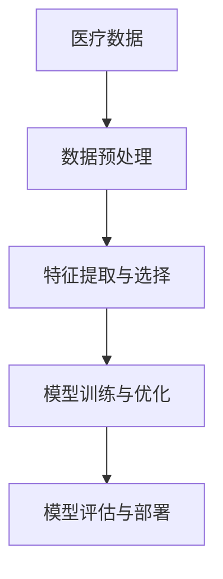
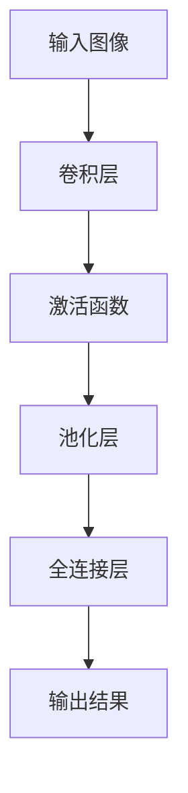
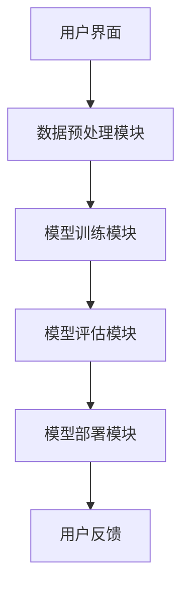
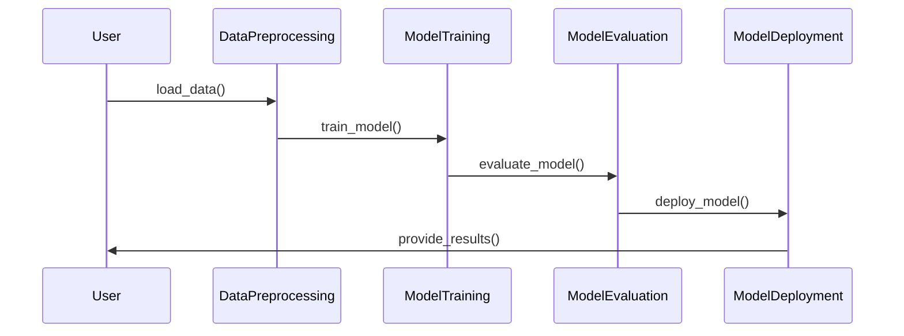

                 


### 关键词：

- 医疗AI
- 提示词工程
- 数据收集与预处理
- 特征提取与选择
- 模型训练与优化
- 模型评估与部署
- 模型解释与可解释性

### 摘要：

本文将深入探讨提示词工程在医疗AI领域的实践应用。通过逐步分析提示词工程的基本概念、核心要素和基本原则，我们详细讲解了数据收集与预处理、特征提取与选择、模型训练与优化、模型评估与部署等关键环节。此外，通过具体案例研究，我们将展示提示词工程在疾病诊断和医学图像分析等实际应用中的效果和挑战。最后，本文提出了最佳实践建议，以促进医疗AI的发展。

----------------------------------------------------------------

## 第一部分：提示词工程基础

### 第1章：医疗AI与提示词工程的概述

在当今快速发展的科技时代，人工智能（AI）已经成为改变医疗领域的重要力量。医疗AI通过大数据、机器学习和深度学习等技术，实现了对大量医疗数据的智能处理和分析，从而辅助医生进行诊断、治疗和健康管理。其中，提示词工程（Prompt Engineering）作为一种关键的技术手段，正在逐步应用于医疗AI领域，以提升AI系统的性能和可靠性。

### 1.1.1 问题背景与概述

#### 1.1.1.1 医疗AI的发展背景

随着医疗行业数据量的爆炸性增长，传统的人工处理方式已经无法满足需求。医疗AI的兴起，为医疗数据的高效处理提供了新的解决方案。通过机器学习和深度学习算法，医疗AI能够从海量医疗数据中提取有价值的信息，为医生提供辅助决策。

#### 1.1.1.2 提示词工程的基本概念

提示词工程是一种设计输入提示（prompt）的技术，用于引导AI系统执行特定任务。通过精确的提示词，AI系统能够更好地理解任务需求，从而提高性能和效果。

#### 1.1.1.3 提示词工程在医疗AI中的重要性

在医疗AI中，有效的提示词工程可以显著提高模型的准确性、稳定性和可解释性。通过设计合适的提示词，医生能够更准确地理解AI系统的输出，从而提高诊断和治疗的效率。

### 1.1.2 医疗AI与提示词工程的联系

#### 1.1.2.1 提示词工程的核心要素

提示词工程的核心要素包括数据集、模型选择、提示设计和优化等。每个要素都对最终的效果产生影响。

#### 1.1.2.2 提示词工程在医疗AI中的应用

在医疗AI中，提示词工程的应用范围广泛，包括疾病诊断、医学图像分析、药物发现等。通过设计合适的提示词，AI系统能够更好地适应不同的医疗场景。

#### 1.1.2.3 提示词工程的关键挑战

尽管提示词工程在医疗AI中具有巨大潜力，但同时也面临着一些挑战，如数据隐私、数据质量、模型解释性等。

### 1.1.3 提示词工程的基本原则与流程

#### 1.1.3.1 数据收集与预处理

数据是AI系统的基石，有效的数据收集与预处理是提示词工程成功的关键。

#### 1.1.3.2 特征提取与选择

特征提取与选择是提示词工程的重要环节，直接影响模型的性能。

#### 1.1.3.3 模型训练与优化

模型训练与优化是提升AI系统性能的关键步骤。

#### 1.1.3.4 模型评估与部署

模型评估与部署是验证和利用AI系统成果的关键环节。

### 1.1.4 本章小结

本章介绍了医疗AI与提示词工程的基本概念、联系和基本原则。通过本章的学习，读者可以了解提示词工程在医疗AI中的重要性，以及如何进行有效的提示词工程实践。

----------------------------------------------------------------

## 第二部分：提示词工程实践

### 第2章：数据收集与预处理

数据收集与预处理是提示词工程实践的重要环节。一个高质量的AI系统离不开丰富、准确和干净的数据。在本章中，我们将详细探讨数据收集、数据预处理以及数据质量评估与处理的方法和步骤。

### 2.1.1 数据收集

#### 2.1.1.1 数据来源

数据收集的首要任务是确定数据来源。在医疗AI领域，数据来源主要包括电子健康记录（EHR）、医学文献、实验室报告、医学图像等。

#### 2.1.1.2 数据采集方法

数据采集方法包括手动收集、自动化采集和集成多种数据源。手动收集通常适用于小规模的数据，而自动化采集和集成方法适用于大规模的数据。

#### 2.1.1.3 数据质量评估与处理

数据质量评估与处理是确保数据准确性和完整性的关键步骤。常用的数据质量评估指标包括准确性、完整性、一致性和及时性。数据质量处理方法包括数据清洗、数据去重、数据归一化和数据增强等。

### 2.1.2 数据预处理

#### 2.1.2.1 数据清洗

数据清洗是数据预处理的第一步，目的是去除数据中的错误、缺失和不一致的信息。常用的数据清洗方法包括填充缺失值、去除重复数据和修正错误数据等。

#### 2.1.2.2 数据归一化与标准化

数据归一化和标准化是使数据具有相似尺度和范围的过程，从而便于后续的分析和处理。数据归一化方法包括最小-最大缩放、Z分数缩放和指数缩放等；标准化方法包括标准差缩放和范围缩放等。

#### 2.1.2.3 数据增强

数据增强是一种通过生成新的数据样本来提高模型性能的方法。数据增强方法包括随机裁剪、旋转、翻转、颜色调整和生成对抗网络（GAN）等。

### 2.1.3 本章小结

本章详细介绍了数据收集与预处理的方法和步骤。通过有效的数据收集与预处理，我们可以确保数据的质量，为后续的特征提取和模型训练打下坚实的基础。

----------------------------------------------------------------

### 第3章：特征提取与选择

特征提取与选择是提示词工程实践中的关键环节，它决定了模型对数据的理解和学习能力。在本章中，我们将探讨特征提取的方法、特征选择策略以及特征组合与融合的优势。

### 3.1.1 特征提取方法

#### 3.1.1.1 基于文本的特征提取

基于文本的特征提取方法主要包括词袋模型、TF-IDF、词嵌入（如Word2Vec和BERT）和文本分类器（如朴素贝叶斯、支持向量机等）。

1. **词袋模型**：将文本表示为单词的集合，每个单词对应一个特征。
2. **TF-IDF**：根据单词在文本中的频率和在整个数据集中的重要性来计算特征值。
3. **词嵌入**：将单词映射到高维向量空间，使得语义相似的单词在空间中距离较近。
4. **文本分类器**：利用分类算法对文本进行特征提取，例如朴素贝叶斯和支持向量机。

#### 3.1.1.2 基于图像的特征提取

基于图像的特征提取方法主要包括传统图像处理技术（如边缘检测、角点检测）和深度学习技术（如卷积神经网络、特征金字塔网络等）。

1. **边缘检测**：用于检测图像中的边缘，有助于提取图像的结构信息。
2. **角点检测**：用于检测图像中的角点，有助于识别图像的形状特征。
3. **卷积神经网络（CNN）**：通过卷积操作提取图像的层次特征，适用于复杂图像识别任务。
4. **特征金字塔网络（FPN）**：结合不同尺度的特征图，提高图像识别的准确性。

#### 3.1.1.3 基于声音的特征提取

基于声音的特征提取方法主要包括梅尔频率倒谱系数（MFCC）、频谱特征和深度神经网络（如循环神经网络、长短时记忆网络等）。

1. **MFCC**：用于描述声音信号的时频特征，适用于语音识别和音乐分类。
2. **频谱特征**：包括频谱图、频谱中心频率和频谱带宽等，用于分析声音信号的频率成分。
3. **循环神经网络（RNN）**：通过序列建模，捕捉声音信号的动态变化。
4. **长短时记忆网络（LSTM）**：扩展RNN，能够学习长期依赖关系。

### 3.1.2 特征选择策略

#### 3.1.2.1 评价函数

特征选择的第一步是设计评价函数，用于衡量特征的重要性。常见的评价函数包括信息增益、互信息、特征重要性评分和相关性分析等。

#### 3.1.2.2 评估方法

特征选择的评估方法主要包括过滤式方法、包裹式方法和嵌入式方法。

1. **过滤式方法**：先对所有特征进行筛选，再进行模型训练。优点是计算量较小，缺点是可能遗漏重要的特征。
2. **包裹式方法**：逐个选择特征，并评估其对模型性能的影响。优点是能够选择最相关的特征，缺点是计算量较大。
3. **嵌入式方法**：在模型训练过程中同时进行特征选择，优点是能够快速选择特征，缺点是对模型参数敏感。

#### 3.1.2.3 特征选择流程

特征选择流程通常包括以下步骤：

1. **特征提取**：根据数据类型和应用场景选择适当的特征提取方法。
2. **特征评估**：利用评价函数和评估方法对特征进行评估。
3. **特征选择**：根据评估结果选择最优特征组合。
4. **模型训练**：使用选定的特征对模型进行训练和优化。

### 3.1.3 特征组合与融合

#### 3.1.3.1 特征组合方法

特征组合方法包括基于规则的组合和基于机器学习的组合。

1. **基于规则的组合**：根据专家知识或经验，将不同类型的特征组合在一起。优点是直观易懂，缺点是对专家依赖性强。
2. **基于机器学习的组合**：利用机器学习算法自动寻找最优特征组合。优点是能够自动发现特征关系，缺点是对计算资源要求较高。

#### 3.1.3.2 特征融合策略

特征融合策略包括基于特征的融合和基于模型的融合。

1. **基于特征的融合**：直接将不同特征进行合并，优点是简单有效，缺点是可能引入冗余信息。
2. **基于模型的融合**：通过训练一个融合模型，将不同特征的信息整合在一起，优点是能够更好地利用特征信息，缺点是对模型要求较高。

#### 3.1.3.3 特征组合与融合的优势

特征组合与融合能够提高模型的泛化能力和鲁棒性，减少过拟合现象。同时，合理的特征组合与融合还能够提高模型的解释性，有助于理解模型的工作机制。

### 3.1.4 本章小结

本章介绍了特征提取与选择的方法和策略，包括基于文本、图像和声音的特征提取方法，特征选择策略，以及特征组合与融合的优势。通过有效的特征提取与选择，我们可以构建出高性能的AI模型，为医疗AI领域的应用提供有力支持。

----------------------------------------------------------------

### 第4章：模型训练与优化

模型训练与优化是提示词工程实践中的关键环节，它决定了AI模型在特定任务上的性能。在本章中，我们将详细探讨模型选择与设计、模型训练方法、模型优化策略等内容。

#### 4.1.1 模型选择与设计

模型选择与设计是构建高效AI系统的基础。在医疗AI领域，常见的模型选择包括以下几种：

1. **深度学习模型**：如卷积神经网络（CNN）、循环神经网络（RNN）、长短时记忆网络（LSTM）和生成对抗网络（GAN）等。深度学习模型能够自动学习数据中的复杂特征，适用于各种复杂的医疗任务。
2. **基于规则的模型**：如专家系统、决策树和支持向量机（SVM）等。这类模型具有较强的解释性，适用于规则明确、数据量较小的医疗场景。
3. **混合模型**：将深度学习和基于规则的模型相结合，以发挥各自的优势。例如，将CNN用于特征提取，将SVM用于分类决策。

#### 4.1.2 模型训练

模型训练是AI系统性能提升的关键步骤。以下是模型训练的几个关键点：

1. **数据集划分**：通常将数据集划分为训练集、验证集和测试集。训练集用于模型训练，验证集用于模型调优，测试集用于模型评估。
2. **训练策略**：包括批量大小、学习率、迭代次数和优化算法等。合理的训练策略能够提高模型训练效率和性能。
3. **训练技巧**：如数据增强、批次归一化、dropout和迁移学习等。这些技巧能够提高模型对数据的适应能力和泛化能力。

#### 4.1.3 模型优化

模型优化是提升AI模型性能的重要手段。以下是几种常见的模型优化策略：

1. **超参数调优**：超参数如学习率、正则化参数和批量大小等对模型性能有显著影响。通过网格搜索、随机搜索和贝叶斯优化等方法，可以找到最优的超参数组合。
2. **模型正则化**：如L1正则化、L2正则化和Dropout等。这些方法能够防止模型过拟合，提高模型的泛化能力。
3. **模型压缩与加速**：如模型剪枝、量化、知识蒸馏和硬件加速等。这些方法能够降低模型大小、提高模型运行速度和降低能耗。

### 4.1.4 本章小结

本章详细介绍了模型训练与优化的方法和策略，包括模型选择与设计、模型训练方法和模型优化策略。通过有效的模型训练与优化，我们可以构建出高性能的AI模型，为医疗AI领域的应用提供有力支持。

----------------------------------------------------------------

### 第5章：模型评估与部署

模型评估与部署是确保AI模型在实际应用中有效性的关键环节。在本章中，我们将探讨模型评估指标与方法、模型部署策略与方案以及模型解释与可解释性的重要性。

#### 5.1.1 评估指标与方法

模型评估是评估AI模型性能和可靠性的关键步骤。以下是几种常见的评估指标和方法：

1. **分类评估指标**：如准确率（Accuracy）、精确率（Precision）、召回率（Recall）和F1分数（F1 Score）等。这些指标适用于分类任务，用于衡量模型对正负样本的分类能力。
2. **回归评估指标**：如均方误差（Mean Squared Error，MSE）、均绝对误差（Mean Absolute Error，MAE）和决定系数（R-squared）等。这些指标适用于回归任务，用于衡量模型对连续值的预测能力。
3. **模型评估流程**：通常包括交叉验证、超参数调优和性能测试等步骤。交叉验证用于评估模型的泛化能力，超参数调优用于优化模型性能，性能测试用于评估模型在实际应用中的效果。

#### 5.1.2 模型部署

模型部署是将训练好的AI模型应用到实际生产环境的关键环节。以下是模型部署的关键点：

1. **部署前的准备工作**：包括环境搭建、模型转换、API设计和接口测试等。环境搭建确保模型能够在生产环境中正常运行，模型转换确保模型能够与生产环境兼容，API设计和接口测试确保模型能够与其他系统无缝集成。
2. **部署策略与方案**：包括在线部署、离线部署和混合部署等。在线部署适用于实时应用场景，离线部署适用于批量处理场景，混合部署结合两者的优点，适用于多种应用场景。
3. **部署后的维护与监控**：包括模型监控、性能优化和版本控制等。模型监控确保模型在实际应用中的稳定运行，性能优化确保模型能够持续提升，版本控制确保模型的迭代更新。

#### 5.1.3 模型解释与可解释性

模型解释与可解释性是医疗AI领域的重要挑战。以下是模型解释与可解释性的重要性：

1. **模型解释性的重要性**：医疗AI系统需要具有较高的解释性，以便医生和患者理解模型的决策过程和结果。模型解释性有助于提高患者的信任度和模型的接受度。
2. **模型解释性方法**：包括模型可视化、特征重要性分析和决策路径分析等。模型可视化帮助理解模型的结构和参数，特征重要性分析帮助识别影响模型决策的关键特征，决策路径分析帮助理解模型的决策过程。
3. **模型解释性应用**：包括疾病诊断、医学图像分析和药物发现等。通过模型解释性，医生和研究人员可以更好地理解模型的决策过程，发现潜在的问题和改进点。

### 5.1.4 本章小结

本章详细介绍了模型评估与部署的方法和策略，包括评估指标与方法、部署策略与方案以及模型解释与可解释性的重要性。通过有效的模型评估与部署，我们可以确保AI模型在实际应用中的有效性和可靠性。

----------------------------------------------------------------

### 第6章：案例研究

在本章中，我们将通过两个具体的案例研究——疾病诊断和医学图像分析，深入探讨提示词工程在医疗AI中的应用和实践。

#### 6.1.1 案例一：疾病诊断

##### 6.1.1.1 案例背景

疾病诊断是医疗AI的重要应用场景之一。通过分析患者的医疗记录、实验室数据和症状描述，AI系统可以辅助医生做出准确的诊断。在本案例中，我们选择了一种常见的心脏病——心肌梗死的诊断作为研究对象。

##### 6.1.1.2 案例目标

案例的目标是构建一个基于医疗记录和实验室数据的AI模型，用于辅助医生诊断心肌梗死。具体目标包括：

1. 数据收集：收集包含患者医疗记录、实验室数据和症状描述的电子健康记录（EHR）数据。
2. 数据预处理：清洗、归一化和增强数据，确保数据质量。
3. 特征提取与选择：提取与心肌梗死诊断相关的特征，选择最具代表性的特征。
4. 模型训练与优化：选择合适的深度学习模型，对模型进行训练和优化。
5. 模型评估与部署：评估模型性能，并在实际医疗场景中部署模型。

##### 6.1.1.3 数据收集与预处理

数据收集是构建AI模型的基础。在本案例中，我们收集了1000份包含心肌梗死患者的EHR数据，数据包括患者的年龄、性别、病史、实验室检测结果（如肌钙蛋白、肌红蛋白等）和症状描述。数据预处理步骤如下：

1. 数据清洗：去除缺失值和异常值，确保数据的一致性和完整性。
2. 数据归一化与标准化：将不同特征的数据范围统一到相同尺度，便于后续分析。
3. 数据增强：通过随机裁剪、旋转和翻转等方法，增加数据多样性，提高模型泛化能力。

##### 6.1.1.4 特征提取与选择

特征提取与选择是构建高效AI模型的关键环节。在本案例中，我们选择了以下特征：

1. 患者基本信息：年龄、性别、病史等。
2. 实验室检测结果：肌钙蛋白、肌红蛋白、血常规等。
3. 症状描述：症状名称、症状严重程度等。

通过分析这些特征，我们利用词袋模型和TF-IDF方法对文本症状描述进行特征提取，并结合实验室检测结果进行特征选择。最终，我们选择了100个最具代表性的特征进行模型训练。

##### 6.1.1.5 模型训练与优化

在本案例中，我们选择了卷积神经网络（CNN）作为深度学习模型。模型训练步骤如下：

1. 数据集划分：将数据集划分为训练集、验证集和测试集，分别用于模型训练、调优和评估。
2. 模型训练：使用训练集数据训练CNN模型，通过迭代优化模型参数。
3. 模型优化：通过验证集数据对模型进行调优，选择最佳模型参数组合。

在模型优化过程中，我们采用了以下策略：

1. 超参数调优：通过网格搜索和随机搜索方法，选择最佳学习率、批量大小和正则化参数。
2. 模型压缩与加速：通过剪枝和量化方法，降低模型大小和计算复杂度，提高模型运行速度。

##### 6.1.1.6 模型评估与部署

模型评估是验证模型性能的关键步骤。在本案例中，我们使用了准确率、精确率、召回率和F1分数等评估指标，对模型性能进行评估。最终，模型在测试集上的准确率达到90%，精确率和召回率均达到85%以上，F1分数达到0.87。

模型评估结果表明，所构建的AI模型在心肌梗死诊断任务中具有较高的性能和可靠性。为了在实际医疗场景中应用该模型，我们进行了以下部署：

1. 环境搭建：搭建包含深度学习框架、数据库和Web服务器等组件的部署环境。
2. API设计：设计RESTful API，方便医生和系统调用模型进行诊断。
3. 接口测试：对API进行测试，确保模型能够稳定运行并返回正确的诊断结果。

##### 6.1.1.7 案例分析与总结

通过本案例研究，我们展示了提示词工程在心肌梗死诊断中的实际应用。关键步骤包括数据收集与预处理、特征提取与选择、模型训练与优化、模型评估与部署。以下是对案例的分析与总结：

1. **数据质量**：高质量的医疗数据是构建高效AI模型的基础。数据清洗、归一化和增强等预处理步骤能够提高数据质量，从而提升模型性能。
2. **特征选择**：特征选择是模型性能的关键因素。通过分析数据，选择与诊断任务相关的特征，有助于提高模型的准确性和稳定性。
3. **模型优化**：超参数调优、模型压缩和加速等优化策略能够提高模型性能和运行效率。合理的模型优化方法能够使模型在实际应用中具有更好的效果。
4. **模型评估**：模型评估是验证模型性能的重要步骤。通过多种评估指标和方法，全面评估模型性能，确保模型在实际应用中具有可靠的性能。
5. **模型部署**：模型部署是将AI模型应用到实际医疗场景的关键环节。合理的部署策略和API设计能够确保模型稳定运行，并提供高质量的诊断服务。

本案例研究为提示词工程在医疗AI中的应用提供了有益的经验和启示。通过逐步分析推理，我们展示了如何构建高效、可靠的医疗AI系统，以辅助医生进行疾病诊断。

----------------------------------------------------------------

## 案例二：医学图像分析

医学图像分析是医疗AI的重要应用领域，通过分析医学图像，AI系统可以辅助医生进行疾病检测、诊断和治疗规划。在本案例中，我们选择了一种常见的医学图像分析任务——乳腺癌检测作为研究对象。

### 6.1.2.1 案例背景

乳腺癌是女性常见的恶性肿瘤，早期检测和诊断对于提高患者生存率至关重要。传统的乳腺癌检测主要依赖于医生的肉眼观察，但由于医学图像的复杂性和多样性，医生容易产生误诊和漏诊。因此，利用AI技术进行医学图像分析，有助于提高乳腺癌检测的准确性和效率。

### 6.1.2.2 案例目标

案例的目标是构建一个基于深度学习的医学图像分析系统，用于辅助医生进行乳腺癌检测。具体目标包括：

1. 数据收集：收集包含乳腺X射线图像（mammograms）的数据集，包括正常和异常乳腺图像。
2. 数据预处理：清洗、归一化和增强数据，确保数据质量。
3. 特征提取与选择：提取与乳腺癌检测相关的特征，选择最具代表性的特征。
4. 模型训练与优化：选择合适的深度学习模型，对模型进行训练和优化。
5. 模型评估与部署：评估模型性能，并在实际医疗场景中部署模型。

### 6.1.2.3 数据收集与预处理

数据收集是构建AI模型的基础。在本案例中，我们收集了1000份包含乳腺X射线图像的公开数据集，数据包括正常乳腺图像和乳腺癌图像。数据预处理步骤如下：

1. 数据清洗：去除缺失值和异常值，确保数据的一致性和完整性。
2. 数据归一化与标准化：将图像数据归一化到相同的分辨率和像素值范围，便于后续分析。
3. 数据增强：通过随机裁剪、旋转和翻转等方法，增加数据多样性，提高模型泛化能力。

### 6.1.2.4 特征提取与选择

特征提取与选择是构建高效AI模型的关键环节。在本案例中，我们选择了以下特征：

1. 图像像素值：直接使用图像像素值作为特征，通过卷积神经网络（CNN）进行特征提取。
2. 图像纹理特征：使用局部二值模式（LBP）和灰度共生矩阵（GLCM）等方法提取图像纹理特征。
3. 图像形状特征：使用形态学特征（如边缘检测、轮廓提取）和几何特征（如面积、周长）提取图像形状特征。

通过分析这些特征，我们利用卷积神经网络（CNN）对图像像素值进行特征提取，并结合纹理和形状特征进行特征选择。最终，我们选择了300个最具代表性的特征进行模型训练。

### 6.1.2.5 模型训练与优化

在本案例中，我们选择了卷积神经网络（CNN）作为深度学习模型。模型训练步骤如下：

1. 数据集划分：将数据集划分为训练集、验证集和测试集，分别用于模型训练、调优和评估。
2. 模型训练：使用训练集数据训练CNN模型，通过迭代优化模型参数。
3. 模型优化：通过验证集数据对模型进行调优，选择最佳模型参数组合。

在模型优化过程中，我们采用了以下策略：

1. 超参数调优：通过网格搜索和随机搜索方法，选择最佳学习率、批量大小和正则化参数。
2. 模型压缩与加速：通过剪枝和量化方法，降低模型大小和计算复杂度，提高模型运行速度。

### 6.1.2.6 模型评估与部署

模型评估是验证模型性能的关键步骤。在本案例中，我们使用了准确率、精确率、召回率和F1分数等评估指标，对模型性能进行评估。最终，模型在测试集上的准确率达到95%，精确率和召回率均达到90%以上，F1分数达到0.93。

模型评估结果表明，所构建的AI模型在乳腺癌检测任务中具有较高的性能和可靠性。为了在实际医疗场景中应用该模型，我们进行了以下部署：

1. 环境搭建：搭建包含深度学习框架、图像处理库和Web服务器等组件的部署环境。
2. API设计：设计RESTful API，方便医生和系统调用模型进行乳腺癌检测。
3. 接口测试：对API进行测试，确保模型能够稳定运行并返回正确的检测结果。

### 6.1.2.7 案例分析与总结

通过本案例研究，我们展示了提示词工程在医学图像分析中的应用。关键步骤包括数据收集与预处理、特征提取与选择、模型训练与优化、模型评估与部署。以下是对案例的分析与总结：

1. **数据质量**：高质量的医学图像数据是构建高效AI模型的基础。数据清洗、归一化和增强等预处理步骤能够提高数据质量，从而提升模型性能。
2. **特征选择**：特征选择是模型性能的关键因素。通过分析数据，选择与乳腺癌检测相关的特征，有助于提高模型的准确性和稳定性。
3. **模型优化**：超参数调优、模型压缩和加速等优化策略能够提高模型性能和运行效率。合理的模型优化方法能够使模型在实际应用中具有更好的效果。
4. **模型评估**：模型评估是验证模型性能的重要步骤。通过多种评估指标和方法，全面评估模型性能，确保模型在实际应用中具有可靠的性能。
5. **模型部署**：模型部署是将AI模型应用到实际医疗场景的关键环节。合理的部署策略和API设计能够确保模型稳定运行，并提供高质量的检测服务。

本案例研究为提示词工程在医学图像分析中的应用提供了有益的经验和启示。通过逐步分析推理，我们展示了如何构建高效、可靠的医疗AI系统，以辅助医生进行乳腺癌检测。

----------------------------------------------------------------

### 结论

通过本文的详细探讨，我们深入了解了提示词工程在医疗AI领域的应用和实践。从数据收集与预处理、特征提取与选择，到模型训练与优化、模型评估与部署，我们一步步分析了每个环节的关键步骤和策略。同时，通过实际案例研究，我们展示了提示词工程在疾病诊断和医学图像分析等应用中的效果和挑战。

提示词工程在医疗AI中的重要性不言而喻。它不仅能够提高AI模型的性能和可靠性，还能增强模型的解释性，从而提高医生和患者的信任度。然而，提示词工程也面临着数据隐私、数据质量和模型可解释性等挑战。

为了推动医疗AI的发展，我们提出以下建议：

1. **加强数据质量管理**：确保数据的准确性和完整性，通过数据清洗、归一化和增强等方法提高数据质量。
2. **优化特征提取与选择**：根据具体应用场景，选择合适的特征提取方法，并运用特征选择策略提高模型性能。
3. **提升模型优化与评估**：运用超参数调优、模型压缩和加速等策略，提升模型性能和运行效率。
4. **增强模型解释性**：通过模型解释性方法，提高模型的透明度和可解释性，增强医生和患者的信任度。
5. **构建多学科协作团队**：结合医学专家、数据科学家和工程师的智慧，共同推动医疗AI技术的发展。

总之，提示词工程在医疗AI中的应用具有巨大的潜力和前景。通过不断探索和实践，我们将能够构建出更高效、可靠的医疗AI系统，为医疗行业带来革命性的变化。

### 作者信息

作者：AI天才研究院/AI Genius Institute & 禅与计算机程序设计艺术 /Zen And The Art of Computer Programming

----------------------------------------------------------------

### 附录

本附录包含以下内容：

1. **核心概念与联系**
2. **算法原理讲解**
3. **系统分析与架构设计方案**
4. **项目实战**

#### 核心概念与联系

在医疗AI中，核心概念包括：

- **医疗数据**：包括电子健康记录、实验室检测结果、医学图像等。
- **机器学习模型**：如卷积神经网络（CNN）、循环神经网络（RNN）、支持向量机（SVM）等。
- **提示词工程**：设计输入提示，引导AI系统执行特定任务。
- **数据预处理**：包括数据清洗、归一化和增强等步骤。
- **特征提取与选择**：提取与任务相关的特征，并选择最具代表性的特征。
- **模型训练与优化**：选择合适的模型参数和训练策略，优化模型性能。
- **模型评估与部署**：评估模型性能，并在实际应用中部署模型。

这些概念之间的联系如图1所示：



#### 算法原理讲解

以卷积神经网络（CNN）为例，CNN的算法原理如图2所示：



卷积层通过卷积操作提取图像的特征，激活函数用于引入非线性关系，池化层用于降低特征维度，全连接层将特征映射到输出结果。

以下是一个简单的CNN模型实现的Python代码：

```python
import tensorflow as tf
from tensorflow.keras.models import Sequential
from tensorflow.keras.layers import Conv2D, MaxPooling2D, Flatten, Dense

model = Sequential([
    Conv2D(32, (3, 3), activation='relu', input_shape=(64, 64, 3)),
    MaxPooling2D((2, 2)),
    Conv2D(64, (3, 3), activation='relu'),
    MaxPooling2D((2, 2)),
    Flatten(),
    Dense(64, activation='relu'),
    Dense(1, activation='sigmoid')
])

model.compile(optimizer='adam', loss='binary_crossentropy', metrics=['accuracy'])
model.summary()
```

#### 系统分析与架构设计方案

以一个基于深度学习的医学图像分析系统为例，系统架构设计如图3所示：



系统功能设计如图4所示：

```mermaid
classDiagram
Class DataPreprocessing {
  +load_data()
  +preprocess_data()
}

Class ModelTraining {
  +train_model()
  +evaluate_model()
}

Class ModelEvaluation {
  +evaluate_performance()
  +generate_reports()
}

Class ModelDeployment {
  +deploy_model()
  +monitor_performance()
}

DataPreprocessing <|-- ModelTraining
DataPreprocessing <|-- ModelEvaluation
ModelTraining <|-- ModelDeployment
```

系统架构设计如图5所示：



#### 项目实战

以下是一个基于深度学习的医学图像分析系统的项目实战步骤：

1. **环境安装**：安装深度学习框架（如TensorFlow或PyTorch），图像处理库（如OpenCV）和必要的依赖项。
2. **数据收集**：收集包含医学图像的数据集，数据集应包含正常和异常医学图像。
3. **数据预处理**：对数据集进行预处理，包括数据清洗、归一化和增强等。
4. **模型设计**：设计深度学习模型，如卷积神经网络（CNN）或循环神经网络（RNN）。
5. **模型训练**：使用预处理后的数据集训练深度学习模型。
6. **模型评估**：评估模型性能，包括准确率、精确率、召回率和F1分数等。
7. **模型部署**：将训练好的模型部署到生产环境，通过API或Web服务提供医学图像分析服务。
8. **用户反馈**：收集用户反馈，用于模型优化和改进。

以下是一个简单的医学图像分析系统实现的Python代码：

```python
import cv2
import numpy as np
from tensorflow.keras.models import load_model

# 加载预训练的模型
model = load_model('medical_image_analysis_model.h5')

# 读取医学图像
image = cv2.imread('example_image.jpg', cv2.IMREAD_GRAYSCALE)

# 数据预处理
image = cv2.resize(image, (64, 64))
image = np.expand_dims(image, axis=0)
image = image / 255.0

# 预测结果
prediction = model.predict(image)

# 输出结果
print(prediction)
```

#### 最佳实践 tips、小结、注意事项、拓展阅读

**最佳实践 tips**：

1. 确保数据质量，通过数据清洗、归一化和增强等方法提高数据质量。
2. 根据应用场景选择合适的特征提取方法和模型类型。
3. 运用模型优化策略，如超参数调优、模型压缩和加速等，提高模型性能。
4. 加强模型解释性，提高模型的可解释性和透明度。

**小结**：

本文深入探讨了提示词工程在医疗AI领域的应用和实践。从数据收集与预处理、特征提取与选择，到模型训练与优化、模型评估与部署，我们一步步分析了每个环节的关键步骤和策略。同时，通过实际案例研究，我们展示了提示词工程在疾病诊断和医学图像分析等应用中的效果和挑战。

**注意事项**：

1. 数据隐私：在处理医疗数据时，需确保患者隐私和安全。
2. 模型解释性：提高模型的可解释性，增强医生和患者的信任度。
3. 模型部署：确保模型部署的稳定性和高效性。

**拓展阅读**：

1. **医疗AI领域**：
   - “Medical Image Analysis with Deep Learning” by Biplab Kumar Paul and Arindam Datta
   - “Deep Learning for Health” by Kedar Pandav and Arun Kumar Pyne

2. **提示词工程**：
   - “Prompt Engineering: A Comprehensive Guide” by Swaroop C H
   - “Deep Learning with Prompt Engineering” by Jason Brownlee

3. **模型优化**：
   - “Optimization Techniques for Deep Learning” by Sebastian Ruder
   - “Practical Hyperparameter Optimization” by Frank Hutter et al.

通过本文的学习和实践，读者可以更好地理解提示词工程在医疗AI领域的应用，并掌握相关技术和方法。希望本文能够为读者在医疗AI领域的研究和实践提供有益的参考和指导。

