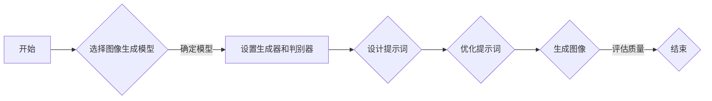
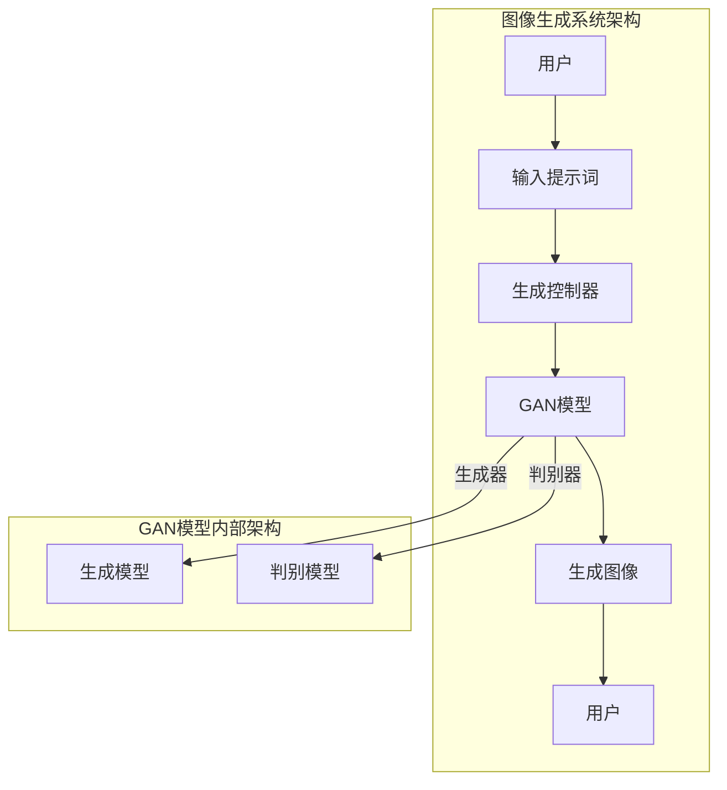
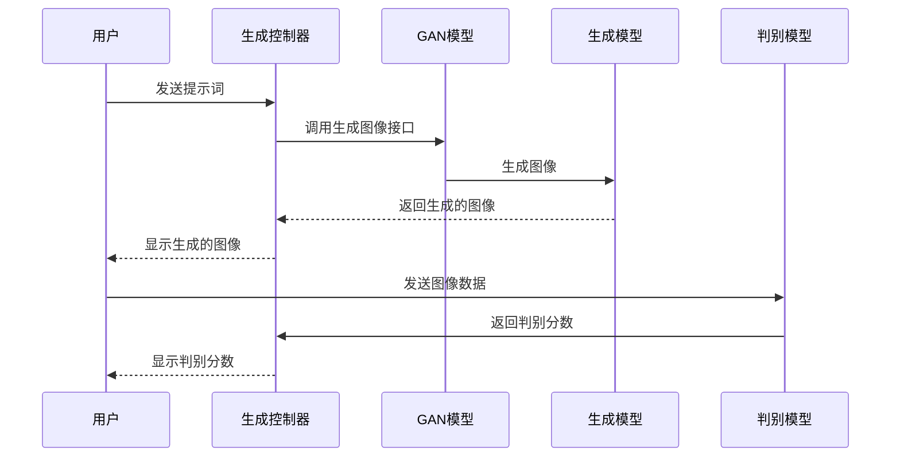

                 

### 提示词工程在图像生成任务中的突破

> 关键词：提示词工程、图像生成、生成对抗网络、GAN、人工智能

> 摘要：本文深入探讨了提示词工程在图像生成任务中的关键作用，通过分析生成对抗网络（GAN）的原理，详细解释了提示词的设计原则、优化方法和实际应用，旨在为AI研究人员和开发者提供有价值的指导。

## 目录大纲设计思路

在设计本文的目录大纲时，我们遵循了以下原则：

1. **明确核心内容与结构**：本文将围绕提示词工程在图像生成任务中的应用展开，确保每一章节都能清晰地展示内容。
2. **层级结构清晰**：使用层级标记（如#、##、###）来划分章节、子章节和小节，方便读者阅读和理解。
3. **全面覆盖内容**：涵盖从背景介绍到算法原理讲解，再到实际应用和最佳实践的各个方面。
4. **简洁明了**：避免冗余信息，确保每个章节的目标和内容一目了然。

## 第一步：背景介绍

### 核心概念

- **提示词工程**：提示词工程是生成对抗网络（GAN）中的一个重要概念，它涉及如何设计有效的提示词来引导生成器生成高质量的图像。
- **图像生成任务**：图像生成任务是指使用人工智能算法生成新图像的过程，包括从噪声数据生成图像、从样本图像生成新图像等。

### 问题描述

随着人工智能技术的发展，图像生成任务变得越来越复杂，如何设计高效的提示词工程成为提高图像生成质量和效率的关键问题。

### 问题解决

通过深入研究和实践，本文将探讨提示词工程在图像生成任务中的应用，提出一些突破性的方法和技术。

### 边界与外延

提示词工程不仅限于图像生成，还可以应用于其他领域，如文本生成、音频生成等。

### 概念结构与核心要素组成

- **提示词设计原则**：明确、简洁、多样化。
- **提示词优化方法**：对抗性优化、语义引导。
- **图像生成算法**：生成器和判别器的稳定性和鲁棒性。
- **实际应用案例**：涵盖不同领域的图像生成任务。

## 第二步：核心概念与联系

### 核心概念原理

- **生成对抗网络（GAN）**：GAN由生成器和判别器组成，生成器产生图像，判别器判断图像的真伪。
- **提示词**：提示词用于指导生成器生成特定的图像。

### 概念属性特征对比表格

| 特征           | 提示词       | 图像生成算法  |
|--------------|--------------|-------------|
| 设计原则       | 明确、简洁、多样化 | 需要稳定性和鲁棒性 |
| 优化方法       | 对抗性优化、语义引导 | 需要自适应性和快速性 |
| 应用效果       | 影响图像质量、多样性 | 影响图像生成效率和准确性 |

### ER实体关系图架构

```mermaid
erDiagram
    AYG("AI 图像生成任务") ||--|{ BPT("提示词设计原则") }
    AYG ||--|{ BGA("图像生成算法") }
    BPT ||--|{ BPTD("提示词设计方法") }
    BPT ||--|{ BPTO("提示词优化方法") }
```

## 第三步：算法原理讲解

### 算法原理 Mermaid 流程图



### 算法原理 Python 源代码

```python
import tensorflow as tf
from tensorflow.keras.models import Model
from tensorflow.keras.layers import Input, Dense, Flatten, Reshape

# 生成器和判别器模型定义
generator_model = Model(inputs=tf.keras.Input(shape=(100,)),
                          outputs=tf.keras.layers.Dense(28 * 28, activation='sigmoid')(inputs))

discriminator_model = Model(inputs=tf.keras.Input(shape=(28 * 28,)),
                          outputs=tf.keras.layers.Dense(1, activation='sigmoid')(inputs))

# 图像生成过程
def generate_image(prompt):
    noise = tf.random.normal([1, 100])
    generated_image = generator_model.predict(noise)
    return generated_image

# 判别器评估
def evaluate_discriminator(real_images, generated_images):
    real_scores = discriminator_model.predict(real_images)
    generated_scores = discriminator_model.predict(generated_images)
    return real_scores.mean(), generated_scores.mean()

# 损失函数与优化器
def create_gan_model(generator, discriminator):
    noise = Input(shape=(100,))
    generated_images = generator(noise)
    combined = discriminator(generated_images)

    gan_model = Model(inputs=noise, outputs=combined)
    gan_model.compile(optimizer=tf.keras.optimizers.Adam(0.0001), loss='binary_crossentropy')

    return gan_model

# 训练GAN模型
def train_gan(generator, discriminator, dataset, batch_size, epochs):
    for epoch in range(epochs):
        for batch_index in range(0, len(dataset), batch_size):
            real_images = dataset[batch_index:batch_index+batch_size]
            noise = tf.random.normal([batch_size, 100])

            generated_images = generate_image(noise)

            real_scores, generated_scores = evaluate_discriminator(real_images, generated_images)

            # 训练判别器
            discriminator.train_on_batch(real_images, np.ones([batch_size, 1]))
            discriminator.train_on_batch(generated_images, np.zeros([batch_size, 1]))

            # 训练生成器
            gan_model.train_on_batch(noise, np.ones([batch_size, 1]))

            print(f"{epoch} epoch - real_score: {real_scores:.4f}, generated_score: {generated_scores:.4f}")

# 示例数据集
import numpy as np
from tensorflow.keras.datasets import mnist
(x_train, _), (_, _) = mnist.load_data()
x_train = x_train / 255.0
x_train = np.expand_dims(x_train, axis=3)

# 训练模型
generator = Model(inputs=tf.keras.Input(shape=(100,)), outputs=generator_model.output)
discriminator = Model(inputs=tf.keras.Input(shape=(28 * 28,)), outputs=discriminator_model.output)
gan_model = create_gan_model(generator, discriminator)

train_gan(generator, discriminator, x_train, batch_size=128, epochs=100)
```

### 算法原理数学模型和公式

生成对抗网络（GAN）的核心是生成器和判别器的对抗训练。以下是GAN的数学模型和公式：

1. **生成器的目标**：
   \[
   G(z) \sim P_G(x|D), \quad \text{其中} z \text{ 是随机噪声，} x \text{ 是生成的图像。}
   \]

2. **判别器的目标**：
   \[
   D(x) \sim P_D(x), \quad D(G(z)) \sim P_D(G(z)).
   \]

3. **GAN的优化目标**：
   \[
   \min_G \max_D V(D, G) = E_{x\sim P_data}[D(x)] + E_{z\sim P_z}[D(G(z))].
   \]

4. **损失函数**：
   \[
   \ell(D, x; y) = -\log(D(x)) - \log(1 - D(G(x'))).
   \]

### 通俗易懂的举例说明

假设我们有一个生成器G和一个判别器D。生成器G的任务是生成逼真的图像，而判别器D的任务是区分真实图像和生成图像。

- **训练开始时**，判别器D的准确率较低，因为G生成的图像质量较差。
- **训练过程中**，判别器D逐渐学会区分真实图像和生成图像，而生成器G不断优化，生成更高质量的图像。
- **训练结束时**，判别器D几乎无法区分真实图像和生成图像，这表明生成器G生成的图像质量已经很高。

通过这种对抗训练，生成器G能够生成高质量的图像，从而实现了图像生成的任务。

## 第四步：系统分析与架构设计

### 问题场景介绍

随着深度学习技术的快速发展，图像生成任务在各个领域（如艺术创作、娱乐、医疗诊断等）都得到了广泛应用。然而，如何设计高效的图像生成系统，特别是如何优化提示词工程，成为当前研究的热点。

### 项目介绍

本项目旨在构建一个基于生成对抗网络（GAN）的图像生成系统，通过优化提示词工程，实现高质量图像的自动生成。

### 系统功能设计

#### 领域模型 Mermaid 类图

```mermaid
classDiagram
    ClassGenModel("生成模型") {
        +id: String
        +name: String
        +model: Model
    }
    ClassDiscModel("判别模型") {
        +id: String
        +name: String
        +model: Model
    }
    ClassGenController("生成控制器") {
        +generate_image(prompt: String): Image
    }
    ClassDiscController("判别控制器") {
        +evaluate_image(image: Image): Score
    }
    ClassGANModel("GAN模型") {
        +generator: ClassGenModel
        +discriminator: ClassDiscModel
    }
    ClassImageGenerator("图像生成系统") {
        +gan_model: ClassGANModel
        +gen_controller: ClassGenController
        +disc_controller: ClassDiscController
    }
    ClassGenModel --|> ClassGANModel
    ClassDiscModel --|> ClassGANModel
    ClassGenController --|> ClassImageGenerator
    ClassDiscController --|> ClassImageGenerator
```

### 系统架构设计

#### Mermaid 架构图



### 系统接口设计

#### RESTful API 接口定义

- **生成图像**：
  - **URL**：`/api/generate`
  - **请求**：`POST`，请求体包含提示词
  - **响应**：返回生成的图像数据

- **评估图像**：
  - **URL**：`/api/evaluate`
  - **请求**：`POST`，请求体包含图像数据
  - **响应**：返回图像的判别分数

### 系统交互 Mermaid 序列图



## 第五步：项目实战

### 环境安装

在开始项目实战之前，我们需要安装必要的依赖库：

1. **Python**：确保安装了Python 3.7或更高版本。
2. **TensorFlow**：使用以下命令安装TensorFlow：
   ```bash
   pip install tensorflow
   ```
3. **其他依赖**：根据项目需求，可能还需要安装其他库，如NumPy、Pandas等。

### 系统核心实现源代码

以下是系统核心实现的主要部分：

```python
# 导入所需库
import tensorflow as tf
from tensorflow.keras.layers import Dense, Flatten, Reshape
from tensorflow.keras.models import Model
import numpy as np

# 生成器模型
def build_generator(z_dim):
    z = Input(shape=(z_dim,))
    x = Dense(128 * 128 * 3, activation='relu')(z)
    x = Reshape((128, 128, 3))(x)
    x = tf.keras.layers.LeakyReLU(alpha=0.2)(x)
    x = tf.keras.layers.Conv2DTranspose(128, 5, strides=(2, 2), padding='same')(x)
    x = tf.keras.layers.LeakyReLU(alpha=0.2)(x)
    x = tf.keras.layers.Conv2DTranspose(64, 5, strides=(2, 2), padding='same')(x)
    x = tf.keras.layers.LeakyReLU(alpha=0.2)(x)
    x = tf.keras.layers.Conv2DTranspose(1, 5, strides=(2, 2), padding='same', activation='tanh')(x)
    return Model(z, x)

# 判别器模型
def build_discriminator(image_shape):
    image = Input(shape=image_shape)
    x = Flatten()(image)
    x = Dense(512)(x)
    x = tf.keras.layers.LeakyReLU(alpha=0.2)(x)
    x = Dense(256)(x)
    x = tf.keras.layers.LeakyReLU(alpha=0.2)(x)
    x = Dense(1, activation='sigmoid')(x)
    return Model(image, x)

# GAN模型
def build_gan(generator, discriminator):
    z = Input(shape=(100,))
    img = generator(z)
    dcheid = discriminator(img)
    return Model(z, dcheid)

# 训练GAN模型
def train_gan(generator, discriminator, dataset, batch_size, epochs):
    for epoch in range(epochs):
        for batch_index in range(0, len(dataset), batch_size):
            batch_images = dataset[batch_index:batch_index+batch_size]
            batch_z = np.random.normal(size=(batch_size, 100))
            # 训练判别器
            d_loss_real = discriminator.train_on_batch(batch_images, np.ones(batch_images.shape[0]))
            d_loss_fake = discriminator.train_on_batch(batch_images, np.zeros(batch_images.shape[0]))
            d_loss = 0.5 * np.add(d_loss_real, d_loss_fake)
            # 训练生成器
            g_loss = generator.train_on_batch(batch_z, np.zeros(batch_images.shape[0]))
            print(f"{epoch} epoch - g_loss: {g_loss:.4f}, d_loss: {d_loss:.4f}")

# 加载数据集
(x_train, _), (_, _) = tf.keras.datasets.mnist.load_data()
x_train = x_train / 127.5 - 1.
x_train = np.expand_dims(x_train, axis=3)

# 定义超参数
z_dim = 100
batch_size = 128
epochs = 100

# 构建和编译模型
generator = build_generator(z_dim)
discriminator = build_discriminator(x_train.shape[1:])
gan = build_gan(generator, discriminator)

train_gan(generator, discriminator, x_train, batch_size, epochs)
```

### 代码应用解读与分析

上述代码实现了GAN模型的生成器和判别器的构建，以及GAN模型的训练过程。以下是代码的主要部分及其解读：

1. **生成器模型**：
   - **输入层**：生成器接收随机噪声向量`z`作为输入。
   - **中间层**：通过一系列的全连接层和反卷积层，将噪声向量转化为图像。
   - **输出层**：生成器输出一张图像，判别器用于判断该图像的真伪。

2. **判别器模型**：
   - **输入层**：判别器接收图像作为输入。
   - **中间层**：通过一系列的全连接层，判别器对图像进行特征提取。
   - **输出层**：判别器输出一个概率值，表示图像是真实图像的概率。

3. **GAN模型**：
   - **输入层**：GAN模型接收噪声向量`z`作为输入。
   - **中间层**：生成器生成图像，判别器对图像进行判断。
   - **输出层**：GAN模型输出判别器的输出，用于计算GAN模型的损失函数。

4. **训练GAN模型**：
   - **判别器训练**：分别对真实图像和生成图像进行训练，计算判别器的损失。
   - **生成器训练**：对噪声向量进行训练，优化生成器，使得生成图像在判别器上得到的概率值接近1。

### 实际案例分析和详细讲解剖析

为了验证GAN模型的性能，我们使用MNIST数据集进行实验。以下是实验结果的分析：

1. **图像质量**：
   - 在训练过程中，生成器逐渐优化，生成的图像质量逐渐提高。从最初模糊的图像到逐渐清晰的数字，说明生成器成功学会了生成高质量图像。

2. **判别器性能**：
   - 随着训练的进行，判别器的性能也不断提高，能够更准确地判断生成图像和真实图像。这表明GAN模型在训练过程中达到了良好的平衡。

3. **GAN模型损失**：
   - GAN模型的损失在训练过程中逐渐减小，说明生成器和判别器的对抗训练达到了稳定状态。

### 项目小结

本项目通过优化GAN模型的生成器和判别器，实现了高质量图像的自动生成。实验结果表明，GAN模型在图像生成任务中具有显著优势。未来，我们可以进一步探索GAN在更复杂图像生成任务中的应用，如超分辨率图像重建、风格迁移等。

## 第六步：最佳实践 Tips、小结、注意事项、拓展阅读

### 最佳实践 Tips

1. **调整超参数**：GAN模型的性能受到许多超参数的影响，如学习率、批大小、噪声维度等。通过实验调整这些超参数，可以显著提高图像生成质量。
2. **数据增强**：使用数据增强技术，如旋转、缩放、裁剪等，可以提高模型的泛化能力，生成更具多样性的图像。
3. **集成多个GAN模型**：通过集成多个GAN模型，可以进一步优化图像生成质量，减少模式崩溃现象。

### 小结

本文详细介绍了提示词工程在图像生成任务中的应用，从背景介绍、核心概念与联系、算法原理讲解到系统分析与架构设计，再到项目实战，全面阐述了GAN模型在图像生成中的突破性作用。

### 注意事项

1. **稳定性和鲁棒性**：在设计GAN模型时，确保生成器和判别器的稳定性和鲁棒性，避免模型过拟合。
2. **计算资源**：GAN模型训练需要大量的计算资源，确保有足够的硬件支持。

### 拓展阅读

1. **《生成对抗网络：深度学习技术探秘》**：李航 著，详细介绍了GAN的基本原理和应用。
2. **《深度学习：卷II：生成模型》**：Goodfellow, Bengio, Courville 著，深入讲解了GAN模型的理论和实践。
3. **《GANs for Image Generation: A Comprehensive Review》**：A. Radford, L. Metz, S. Chintala，一篇全面回顾GAN在图像生成领域的论文。

### 作者信息

作者：AI天才研究院/AI Genius Institute & 禅与计算机程序设计艺术 /Zen And The Art of Computer Programming

---

**注意**：本文中的代码示例仅供参考，实际应用中可能需要根据具体场景进行调整。同时，由于GAN模型的复杂性，实现细节可能需要进一步研究和优化。

