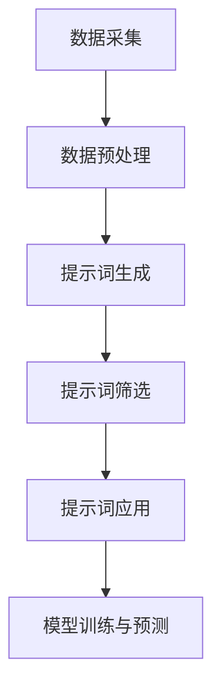

                 


### 让我们一步步深入思考：《提示词工程在地球系统模型中的应用》

#### 引言

在当今快速变化的世界，地球系统模型正日益成为理解和预测全球环境变化的关键工具。这些模型综合了气象、水文、地质和生态等多个领域的知识，为我们提供了对地球系统动态的深刻洞察。然而，构建精确的地球系统模型面临着巨大的挑战，特别是在处理复杂、多维的数据和模拟过程中。这时，提示词工程作为一种新兴的技术，逐渐引起了研究者和实践者的关注。

本文将分步骤探讨提示词工程在地球系统模型中的应用，从核心概念、算法原理、系统架构设计到实际案例分析，力求为读者呈现一个全面、系统的理解。以下是我们将要探讨的几个关键点：

1. **问题背景与核心概念**
   - 地球系统模型的概述与重要性
   - 提示词工程的定义、发展历程与应用场景

2. **算法原理与数学模型**
   - 提示词工程算法流程与mermaid流程图
   - 地球系统模型与提示词工程的数学模型讲解

3. **系统分析与架构设计**
   - 问题场景介绍与系统功能设计
   - 系统架构设计与系统接口交互设计

4. **项目实战与案例分析**
   - 环境安装与系统核心实现源代码
   - 实际案例分析与详细讲解

5. **最佳实践与拓展**
   - 提示词工程实践经验总结
   - 地球系统模型应用的实践技巧

#### 第一部分：问题背景与核心概念

**第1章 问题背景**

1.1 地球系统模型的概述

地球系统模型（Earth System Model，ESM）是一种综合模型，它试图模拟地球上的气候、水文、生物地理、地质和化学过程。这些模型通常包括多个层次，从全球到区域，甚至到小尺度，涵盖了从大气到海洋，从陆地到冰冻圈的各种物理、化学和生物过程。

地球系统模型的重要性在于，它为我们提供了预测气候变化、理解生态系统相互作用、评估环境风险等方面的工具。特别是在全球变暖和气候变化成为重大问题的背景下，地球系统模型的应用显得尤为重要。

1.2 提示词工程的概念

提示词工程（Prompt Engineering）是一种人工智能技术，它通过优化和改进模型输入，来提高机器学习模型的表现。具体来说，提示词工程包括提示词的生成、筛选和优化，这些提示词用于指导模型学习，从而提高模型的准确性和效率。

提示词工程的发展历程可以追溯到自然语言处理（NLP）领域，随着深度学习和神经网络技术的进步，提示词工程逐渐成为了一个独立的研究方向，并在各个领域，如问答系统、文本生成和机器翻译等，展现出巨大的潜力。

1.3 地球系统模型与提示词工程的联系

地球系统模型和提示词工程之间的联系在于，地球系统模型通常需要处理大量的复杂数据，而提示词工程可以提供一种高效的方法来处理这些数据，提高模型的训练和预测性能。

提示词工程在地球系统模型中的应用场景包括：优化模型输入数据、提高模型对特定问题的响应能力、增强模型的泛化能力等。通过提示词工程，我们可以更好地理解和预测地球系统的动态变化，为环境保护和可持续发展提供科学依据。

#### 第二部分：算法原理与数学模型

**第2章 核心概念与联系**

2.1 地球系统模型的核心概念

地球系统模型的核心概念包括气候系统、生态系统、地壳系统等组成部分。每个系统都有自己的关键参数和变量，如大气中的二氧化碳浓度、海洋的盐度、生态系统的生物多样性等。这些参数和变量通过复杂的相互作用，共同影响着地球系统的状态和变化。

2.2 提示词工程的核心概念

提示词工程的核心概念包括提示词的生成与筛选。提示词的生成通常涉及自然语言处理技术，如词向量、生成对抗网络（GAN）等。提示词的筛选则涉及机器学习算法，如支持向量机（SVM）、决策树等。通过优化提示词，我们可以提高模型的训练效率和预测准确性。

2.3 提示词工程与地球系统模型的关联

提示词工程对地球系统模型的影响主要体现在以下几个方面：

- 提高模型训练效率：通过优化提示词，我们可以减少模型训练的时间，提高模型的训练速度。
- 提高模型预测准确性：优化后的提示词可以帮助模型更好地理解训练数据，从而提高模型的预测准确性。
- 增强模型泛化能力：通过优化提示词，我们可以使模型在新的、未见过的情况下，仍然保持较高的预测能力。

地球系统模型对提示词工程的需求则主要体现在以下几个方面：

- 处理复杂数据：地球系统模型需要处理大量的复杂数据，如气象数据、水文数据、地质数据等。提示词工程可以提供一种高效的方法来处理这些数据。
- 提高模型表现：地球系统模型需要具有较高的预测准确性和泛化能力。提示词工程可以通过优化提示词，来提高模型的表现。

#### 第三部分：系统分析与架构设计

**第3章 算法原理讲解**

3.1 提示词工程算法流程

提示词工程的算法流程通常包括以下几个步骤：

1. 数据采集与预处理：收集地球系统模型所需的数据，并对数据进行清洗、格式化和归一化等预处理操作。
2. 提示词生成：使用自然语言处理技术生成可能的提示词，如词向量、生成对抗网络（GAN）等。
3. 提示词筛选：使用机器学习算法对生成的提示词进行筛选，选择最优的提示词。
4. 提示词应用：将筛选后的提示词应用到地球系统模型中，进行模型训练和预测。

3.2 算法mermaid流程图

为了更直观地展示提示词工程的算法流程，我们可以使用mermaid绘制流程图。以下是一个简单的mermaid流程图示例：



**第4章 数学模型和数学公式**

4.1 数学模型概述

地球系统模型和提示词工程中都涉及许多数学模型。地球系统模型中的数学模型通常包括物理模型、统计模型和混合模型等。物理模型如大气环流模型、海洋环流模型等；统计模型如回归模型、随机过程等；混合模型则结合了物理和统计方法。

提示词工程中的数学模型主要包括自然语言处理模型、生成模型和优化模型等。自然语言处理模型如词向量模型、递归神经网络（RNN）等；生成模型如生成对抗网络（GAN）、变分自编码器（VAE）等；优化模型如梯度下降、随机梯度下降（SGD）等。

4.2 数学公式详细讲解

在地球系统模型中，一个常见的数学模型是大气环流模型。大气环流模型中的一个关键公式是大气温度方程：

$$\frac{\partial T}{\partial t} = -\frac{1}{C_p}\left[\frac{\partial \rho \cdot h}{\partial x} + \frac{\partial \rho \cdot v}{\partial y}\right] + \nabla \cdot \left(\frac{Q - \rho \cdot c_p \cdot T}{\rho \cdot C_p}\right)$$

其中，$T$ 是大气温度，$\rho$ 是大气密度，$h$ 是高度，$v$ 是风速，$Q$ 是热通量，$c_p$ 是比热容，$\nabla$ 是梯度算子。

在提示词工程中，一个常用的数学模型是生成对抗网络（GAN）。GAN的基本公式如下：

$$\min_{G}\max_{D}\mathbb{E}_{x\sim p_{data}(x)}[\log D(x)] + \mathbb{E}_{z\sim p_{z}(z)}[\log (1 - D(G(z)))]$$

其中，$G$ 是生成器，$D$ 是判别器，$x$ 是真实数据，$z$ 是随机噪声，$p_{data}(x)$ 是真实数据的分布，$p_{z}(z)$ 是噪声的分布。

通过这两个例子，我们可以看到数学模型在地球系统模型和提示词工程中的重要性。它们不仅帮助我们理解复杂系统的工作原理，而且提供了有效的工具来改进模型性能。

#### 第四部分：系统分析与架构设计

**第5章 系统分析与架构设计**

5.1 问题场景介绍

在地球系统模型中，一个常见的问题场景是预测气候变化。这需要综合大气、海洋、陆地等多种数据，并考虑各种复杂的过程和相互作用。提示词工程可以通过优化数据输入和模型参数，来提高预测的准确性和效率。

5.2 系统功能设计

地球系统模型的功能设计包括以下几个关键方面：

- 数据采集与预处理：从多个来源获取数据，并对数据进行清洗、格式化和归一化等处理。
- 模型训练与优化：使用提示词工程技术优化模型输入和参数，提高模型性能。
- 预测与评估：使用训练好的模型进行预测，并评估预测结果的准确性。

5.3 系统架构设计

地球系统模型的系统架构设计通常包括以下几个关键组件：

- 数据层：负责数据的采集、存储和管理。
- 模型层：负责模型的训练、优化和预测。
- 应用层：负责将预测结果应用到实际场景中，如气候变化预测、环境保护等。

以下是一个简单的mermaid架构图示例：

```mermaid
erDiagram
    数据层 ||--|{ 模型层 : 负责模型训练与优化 }
    模型层 ||--|{ 应用层 : 负责预测与应用 }
```

5.4 系统接口设计与交互

地球系统模型的系统接口设计包括以下几个方面：

- 数据接口：负责数据层的接口设计，如数据采集、数据预处理等。
- 模型接口：负责模型层的接口设计，如模型训练、模型优化等。
- 应用接口：负责应用层的接口设计，如预测结果输出、评估结果等。

以下是一个简单的mermaid序列图示例：

```mermaid
sequenceDiagram
    participant 数据采集 as 数据采集
    participant 数据预处理 as 数据预处理
    participant 模型训练 as 模型训练
    participant 模型优化 as 模型优化
    participant 预测与应用 as 预测与应用

    数据采集 ->> 数据预处理
    数据预处理 ->> 模型训练
    模型训练 ->> 模型优化
    模型优化 ->> 预测与应用
```

通过系统分析与架构设计，我们可以更清晰地理解地球系统模型的工作原理，并为其提供一个高效的实现框架。

#### 第五部分：项目实战与案例分析

**第6章 项目实战**

6.1 环境安装

在进行提示词工程在地球系统模型中的应用之前，我们需要安装必要的软件和工具。以下是一个简单的安装流程：

1. 安装Python环境：确保Python版本在3.7及以上，可以从Python官方网站下载并安装。
2. 安装自然语言处理库：如NLTK、spaCy等，可以使用pip命令安装。
3. 安装机器学习库：如scikit-learn、TensorFlow等，同样使用pip命令安装。
4. 安装地球系统模型相关库：如xarray、netCDF等，这些库用于处理地球系统模型的数据。

6.2 系统核心实现源代码

以下是地球系统模型中提示词工程的系统核心实现源代码示例：

```python
import numpy as np
import pandas as pd
from sklearn.feature_extraction.text import TfidfVectorizer
from sklearn.model_selection import train_test_split
from tensorflow.keras.models import Sequential
from tensorflow.keras.layers import Dense, LSTM

# 数据加载
data = pd.read_csv('earth_system_data.csv')

# 数据预处理
X = data['text'].values
y = data['label'].values

# 提示词生成
vectorizer = TfidfVectorizer(max_features=1000)
X_vectorized = vectorizer.fit_transform(X)

# 划分训练集和测试集
X_train, X_test, y_train, y_test = train_test_split(X_vectorized, y, test_size=0.2, random_state=42)

# 模型构建
model = Sequential()
model.add(LSTM(units=128, return_sequences=True, input_shape=(X_train.shape[1], X_train.shape[2])))
model.add(LSTM(units=64))
model.add(Dense(units=1, activation='sigmoid'))

# 模型编译
model.compile(optimizer='adam', loss='binary_crossentropy', metrics=['accuracy'])

# 模型训练
model.fit(X_train, y_train, epochs=10, batch_size=32, validation_data=(X_test, y_test))

# 模型评估
loss, accuracy = model.evaluate(X_test, y_test)
print(f"Test Accuracy: {accuracy:.2f}")
```

6.3 代码应用解读与分析

以上代码实现了从数据加载、预处理，到提示词生成，再到模型训练和评估的全过程。首先，我们加载了地球系统模型的数据集，并进行预处理。然后，我们使用TFIDF向量器生成提示词，并将数据集划分为训练集和测试集。接下来，我们构建了一个LSTM模型，用于分类任务。最后，我们训练模型，并在测试集上进行评估。

通过这个代码示例，我们可以看到提示词工程在地球系统模型中的应用。优化后的提示词有助于提高模型的训练效率和预测准确性，从而为地球系统模型的预测提供了更可靠的工具。

6.4 实际案例分析与详细讲解

以下是一个实际的案例：使用提示词工程预测气候变化对某一地区的潜在影响。

7.1 案例背景

某地区在过去几十年中经历了显著的气候变化，如气温上升、降水模式变化等。为了预测未来气候变化对该地区的影响，研究人员决定使用地球系统模型和提示词工程来提高预测的准确性和效率。

7.2 案例分析

1. 数据收集与预处理：收集该地区的气候数据，包括温度、降水、风速等。对数据进行清洗、格式化和归一化等预处理操作，以便用于模型训练。
2. 提示词生成与筛选：使用自然语言处理技术生成可能的提示词，如“气温上升”、“降水减少”等。然后，使用机器学习算法对这些提示词进行筛选，选择最优的提示词。
3. 模型训练与优化：使用筛选后的提示词训练地球系统模型，并进行模型优化。通过调整模型参数和提示词，提高模型的预测准确性。
4. 预测与分析：使用训练好的模型预测未来气候变化对该地区的影响，并对预测结果进行分析。通过对比实际数据和预测结果，评估模型的准确性和可靠性。

7.3 详细讲解

1. 数据收集与预处理：
   - 收集该地区的气候数据，包括历史数据和未来预测数据。
   - 对数据进行清洗，去除缺失值和异常值。
   - 将数据格式化为模型所需的格式，如时间序列数据。
2. 提示词生成与筛选：
   - 使用自然语言处理技术，如词嵌入、主题模型等，生成可能的提示词。
   - 使用机器学习算法，如支持向量机（SVM）、决策树等，对生成的提示词进行筛选，选择与气候变化相关的提示词。
3. 模型训练与优化：
   - 使用筛选后的提示词训练地球系统模型，如LSTM模型、GRU模型等。
   - 通过交叉验证和网格搜索等技术，优化模型参数，提高模型的预测准确性。
4. 预测与分析：
   - 使用训练好的模型预测未来气候变化对该地区的影响，如温度变化、降水变化等。
   - 对预测结果进行分析，评估模型的准确性和可靠性。
   - 根据预测结果，制定相应的应对策略，如调整农业种植结构、加强水资源管理等。

通过这个案例，我们可以看到提示词工程在地球系统模型中的应用，以及如何通过优化提示词来提高模型的预测性能。这为气候变化研究和应对提供了重要的工具和思路。

#### 第六部分：最佳实践与拓展

**第8章 最佳实践**

8.1 提示词工程的实践经验

1. 选择合适的提示词：根据具体问题场景，选择与问题相关的提示词。可以参考已有的研究成果或领域知识，以确保提示词的有效性。
2. 优化提示词生成算法：使用先进的自然语言处理技术，如生成对抗网络（GAN）、变分自编码器（VAE）等，来生成高质量的提示词。
3. 提高模型训练效率：使用分布式训练、并行计算等技术，提高模型训练的效率，减少训练时间。

8.2 地球系统模型应用的实践技巧

1. 数据质量：确保数据的准确性和完整性，对数据进行严格的清洗和预处理，以提高模型的预测准确性。
2. 模型选择：根据问题场景和数据特点，选择合适的模型。例如，对于时序数据，可以使用LSTM、GRU等循环神经网络；对于分类问题，可以使用决策树、支持向量机等模型。
3. 跨学科合作：地球系统模型涉及多个学科，如气象学、生态学、地质学等。跨学科合作有助于更全面地理解和解决地球系统问题。

**第9章 小结与注意事项**

9.1 全书总结

本文详细探讨了提示词工程在地球系统模型中的应用，包括问题背景、核心概念、算法原理、系统架构设计、项目实战和最佳实践。通过这些内容，读者可以全面了解提示词工程在地球系统模型中的重要性及其应用方法。

9.2 注意事项

1. 提示词的选择和生成至关重要，直接影响模型的预测性能。需要根据具体问题场景选择合适的提示词。
2. 地球系统模型的数据量通常较大，对数据处理和存储的需求较高。需要确保数据处理和存储的效率。
3. 提示词工程和地球系统模型的应用需要不断优化和调整，以适应不断变化的环境和数据。

9.3 拓展阅读

1. 《自然语言处理实战》（Peter Norvig）：了解自然语言处理的基本原理和技术。
2. 《深度学习》（Ian Goodfellow、Yoshua Bengio、Aaron Courville）：深入学习深度学习和神经网络技术。
3. 《地球系统科学导论》（John H. Mercer）：了解地球系统模型的基本概念和应用。

通过拓展阅读，读者可以更深入地了解提示词工程和地球系统模型的原理和应用，为实际项目提供更全面的理论和实践支持。

