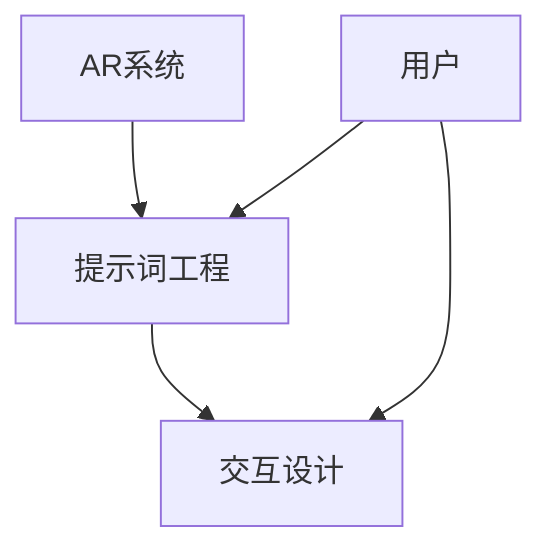
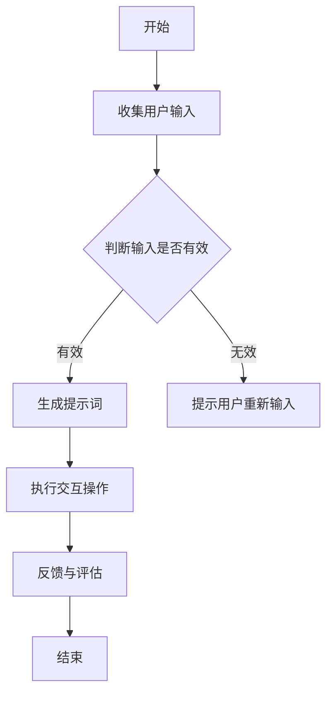
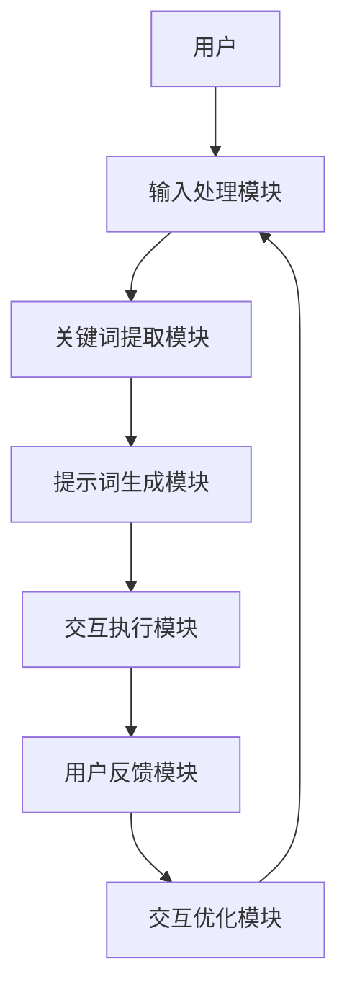
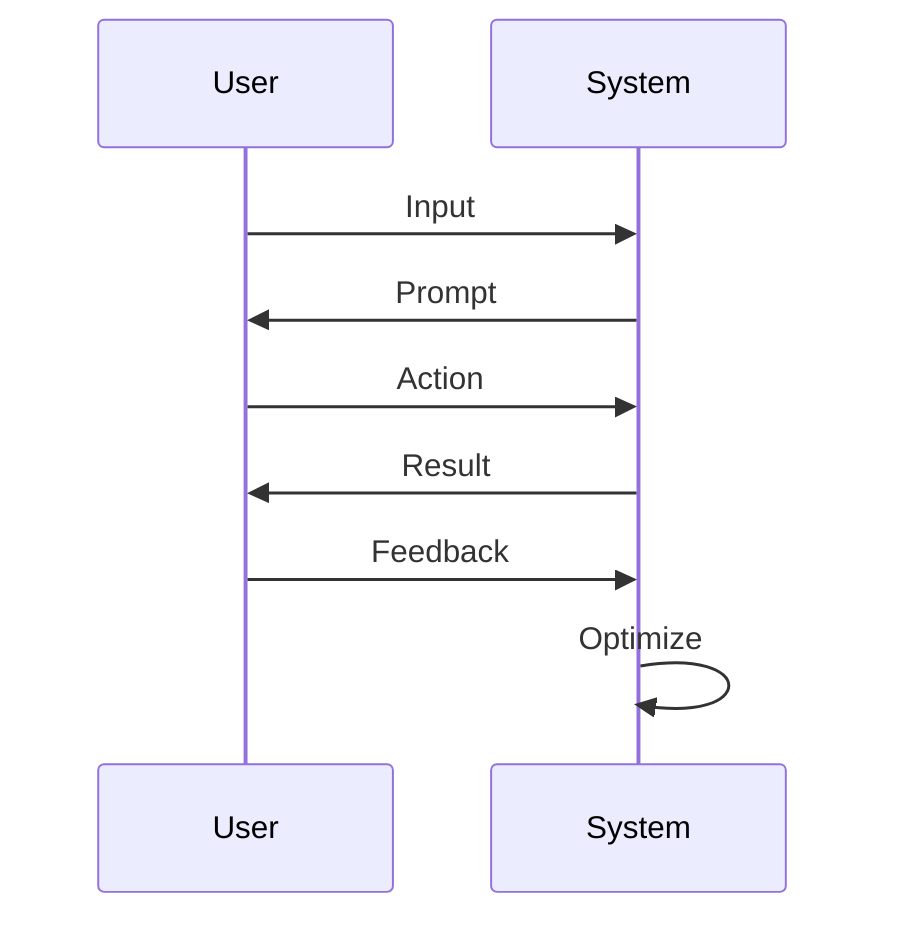

                 

### 第一部分：背景介绍

在当今科技飞速发展的时代，增强现实（Augmented Reality，简称AR）技术以其独特的虚实结合特性，成为了交互设计领域中的一颗璀璨明珠。AR技术通过在真实环境中叠加数字信息，为用户带来更加丰富和沉浸式的体验，从而在游戏、教育、医疗、工业设计等多个领域得到了广泛应用。

#### 核心概念

**增强现实（AR）**：增强现实是一种将虚拟信息叠加到现实场景中的技术，使用户能够通过智能设备看到虚实结合的世界。与虚拟现实（Virtual Reality，VR）不同，AR技术并不完全替代现实环境，而是对其进行了增强和扩展。

**提示词工程**：提示词工程是设计一组关键词或短语，以引导用户在增强现实环境中进行交互的一种方法。通过合理设计提示词，可以提高用户的操作效率和体验满意度。

**交互设计**：交互设计是指为了满足用户需求，设计出易于使用、直观且有趣的交互界面和体验的过程。在增强现实应用中，交互设计尤为重要，因为它直接影响用户对AR体验的接受度和满意度。

#### 问题背景

随着增强现实技术的快速发展，用户对增强现实交互体验的要求越来越高。为了提高用户的交互效率和满意度，提示词工程在增强现实交互设计中扮演着重要角色。有效的设计提示词不仅可以帮助用户更好地理解和操作AR应用，还可以提升整体用户体验。

#### 问题描述

本书旨在探讨提示词工程在增强现实交互设计中的应用，具体包括以下内容：

1. **提示词工程的基本原理和设计方法**：介绍提示词工程的基本概念、设计原则和方法。
2. **提示词工程在增强现实交互中的具体应用场景**：分析提示词工程在不同应用场景下的作用和效果。
3. **增强现实交互设计中的最佳实践**：总结实际应用中的成功经验，为后续设计提供参考。

#### 问题解决

通过系统地介绍提示词工程的理论知识、设计方法和实际应用案例，帮助读者掌握提示词工程在增强现实交互设计中的核心技术和应用技巧，从而提升AR交互体验。

#### 边界与外延

- **边界**：本书主要关注提示词工程在增强现实交互设计中的应用，不包括其他领域（如虚拟现实、人机交互等）的提示词工程。
- **外延**：提示词工程的应用范围广泛，包括但不限于游戏、教育、医疗、工业设计等领域。

#### 概念结构与核心要素组成

- **概念结构**：提示词工程包括关键词提取、提示词设计、交互优化等核心环节。
- **核心要素**：关键词库、提示词模板、用户行为分析、交互效果评估等。

通过以上对背景介绍的深入分析，我们可以更好地理解提示词工程在增强现实交互设计中的重要性，并为其应用提供理论基础和实践指导。

### 第二部分：核心概念与联系

在探讨提示词工程在增强现实交互设计中的应用之前，我们需要首先了解几个核心概念，并分析它们之间的联系和相互作用。

#### 核心概念原理

**增强现实（AR）**：增强现实技术通过在现实场景中叠加虚拟信息，为用户创造一种虚实结合的体验。AR技术的基本原理是利用摄像头捕捉现实环境，通过计算机处理和增强，将虚拟信息实时叠加到用户视野中。这种技术不仅丰富了用户的感官体验，还提升了信息传递的效率。

**提示词工程**：提示词工程是一种设计方法，用于创建一组关键词或短语，以引导用户在增强现实环境中进行交互。提示词工程的核心在于通过合理设计提示词，使用户能够更加自然地与虚拟信息互动，从而提高交互效率和用户体验。

**交互设计**：交互设计是一种设计过程，旨在创造易于使用、直观且有趣的交互界面和体验。在增强现实应用中，交互设计尤为重要，因为它直接影响用户对AR体验的接受度和满意度。交互设计的目标是让用户在AR环境中能够轻松地找到所需信息，完成所需操作。

#### 概念属性特征对比表格

| 概念       | 特征1       | 特征2       | 特征3       |
| ---------- | ---------- | ---------- | ---------- |
| 增强现实   | 虚实结合    | 交互性强    | 技术门槛高  |
| 提示词工程 | 关键词设计  | 用户引导    | 交互优化    |
| 交互设计   | 用户中心    | 直观性      | 体验优化    |

- **增强现实**：虚实结合是AR技术的核心特征，它通过将虚拟信息与现实环境融合，为用户提供了独特的交互体验。AR技术的交互性非常强，用户可以通过触摸、语音等多种方式与虚拟信息互动。
- **提示词工程**：关键词设计是提示词工程的核心，通过设计一组恰当的关键词，可以有效地引导用户进行交互。提示词工程注重用户引导，旨在帮助用户更好地理解和操作AR应用。
- **交互设计**：用户中心是交互设计的核心理念，设计过程始终围绕用户的需求和体验展开。直观性和体验优化是交互设计的关键特征，设计目标是为用户提供易于使用、直观且有趣的交互体验。

#### ER实体关系图架构



- **AR系统**：作为整个交互的核心，AR系统通过捕捉现实环境并将虚拟信息叠加其中，为用户提供增强现实体验。
- **提示词工程**：负责设计一组关键词或短语，以引导用户在AR系统中进行交互。
- **交互设计**：关注用户需求，通过设计直观且有趣的交互界面，提升用户的AR体验。

通过以上对核心概念及其联系的分析，我们可以更好地理解提示词工程在增强现实交互设计中的作用和重要性。在接下来的章节中，我们将进一步探讨提示词工程的基本原理、设计方法及其在具体应用场景中的表现。

### 第三部分：算法原理讲解

在深入探讨提示词工程在增强现实交互设计中的应用之前，我们需要先了解其背后的算法原理。提示词工程的实现依赖于一系列复杂的算法和流程，包括关键词提取、提示词生成和交互优化。本节将详细讲解这些算法原理，并通过Python源代码示例进行说明。

#### 算法mermaid流程图



#### 算法原理详细讲解

提示词工程的算法原理主要涉及以下几个方面：

1. **关键词提取**：通过自然语言处理技术，从用户输入的信息中提取关键词，为提示词生成提供基础数据。关键词提取的目的是从大量的文本信息中找出最有代表性的词汇，这些词汇将直接影响提示词的质量。

2. **提示词生成**：基于关键词和预设的提示词模板，生成一组符合用户需求的提示词。提示词生成过程需要考虑到用户的意图、交互场景以及上下文信息，以确保生成的提示词能够有效引导用户进行交互。

3. **交互优化**：通过用户行为分析，不断优化提示词的生成策略，以提高交互效果。交互优化过程需要实时收集用户反馈数据，分析用户在交互过程中的行为模式，并根据分析结果调整提示词策略。

#### 关键词提取

关键词提取是提示词工程的基石。以下是一个使用Python和jieba库进行关键词提取的示例代码：

```python
import jieba
from collections import Counter

# 停用词表
stop_words = set(['的', '了', '在', '和', '上', '是'])

# 输入文本
text = "我想了解增强现实技术在教育领域的应用。"

# 分词
words = jieba.lcut(text)

# 过滤停用词
filtered_words = [word for word in words if word not in stop_words]

# 词频统计
word_counts = Counter(filtered_words)

# 获取关键词
keywords = word_counts.most_common(5)
print(keywords)
```

执行上述代码，可以得到如下的关键词提取结果：

```
[('增强现实', 2), ('技术', 1), ('领域', 1), ('应用', 1), ('教育', 1)]
```

这里，我们提取了出现频率最高的五个非停用词作为关键词，这些关键词将用于生成提示词。

#### 提示词生成

提示词生成过程基于关键词和预设的模板。以下是一个简单的提示词生成示例：

```python
def generate_prompt(keywords):
    templates = [
        "请回答以下问题：{question}",
        "您想要了解的是：{topic}",
        "您可以尝试以下操作：{actions}"
    ]
    
    prompt = templates[0].format(question="如何利用增强现实技术提高教学效果？")
    return prompt

prompt = generate_prompt(['增强现实', '技术', '教育'])
print(prompt)
```

输出结果为：

```
请回答以下问题：如何利用增强现实技术提高教学效果？
```

这里，我们使用一个简单的模板生成了一个提示词，用于引导用户进行交互。

#### 交互优化

交互优化过程需要根据用户的反馈不断调整提示词策略。以下是一个简单的交互优化示例：

```python
def optimize_prompt(prompt, feedback):
    if "不清楚" in feedback:
        return "请提供更具体的问题："
    elif "有帮助" in feedback:
        return "感谢您的反馈，您可以继续提问："
    else:
        return prompt

feedback = "不清楚"
prompt = optimize_prompt(prompt, feedback)
print(prompt)
```

输出结果为：

```
请提供更具体的问题：
```

这里，我们根据用户的反馈对提示词进行了优化，以提升用户的交互体验。

通过以上算法原理的讲解和Python示例代码的展示，我们可以更好地理解提示词工程在增强现实交互设计中的应用。在接下来的章节中，我们将进一步探讨具体应用场景和最佳实践。

### 系统分析与架构设计方案

在理解了提示词工程的基本原理和算法之后，我们需要进一步探讨其在增强现实（AR）交互设计中的系统实现方案。本节将介绍一个完整的系统架构设计，包括问题场景介绍、项目介绍、系统功能设计、系统架构设计、系统接口设计和系统交互序列图。

#### 问题场景介绍

随着AR技术的广泛应用，用户对于AR应用的交互体验要求越来越高。一个常见的场景是教育领域，教师需要通过AR技术为学生提供沉浸式的学习体验。在这个过程中，有效的提示词工程能够显著提升学生的学习效率和兴趣。例如，在AR课程中，学生通过设备观察虚拟的分子模型，而提示词则帮助他们更好地理解这些模型，从而提高学习效果。

#### 项目介绍

本项目的目标是开发一个AR教育应用，通过提示词工程提升用户的交互体验。项目分为几个关键阶段：

1. **需求分析**：明确用户需求和AR应用的功能。
2. **系统设计**：设计系统的架构和接口。
3. **开发实现**：实现系统的核心功能。
4. **测试与优化**：通过用户反馈不断优化系统性能。

#### 系统功能设计

系统的主要功能包括：

1. **用户输入处理**：接收用户的输入信息，进行预处理和关键词提取。
2. **提示词生成**：基于关键词生成有效的提示词。
3. **交互执行**：根据提示词执行用户的交互操作。
4. **用户反馈收集**：收集用户在交互过程中的反馈信息。
5. **交互优化**：根据用户反馈调整提示词策略，优化交互体验。

#### 系统架构设计

系统的整体架构如图所示：



- **输入处理模块**：负责接收用户的输入信息，并进行预处理，如文本清洗、分词等。
- **关键词提取模块**：基于预处理后的文本信息，提取出关键信息，为提示词生成提供基础数据。
- **提示词生成模块**：根据提取的关键词和预设的模板，生成有效的提示词。
- **交互执行模块**：根据提示词执行用户的交互操作，如导航、操作虚拟物体等。
- **用户反馈模块**：收集用户在交互过程中的反馈信息，如满意度、操作难度等。
- **交互优化模块**：根据用户反馈，调整提示词策略，优化交互体验。

#### 系统接口设计

系统接口设计主要包括以下几个方面：

1. **输入接口**：用于接收用户输入，如文本、语音等。
2. **输出接口**：用于向用户展示提示词和交互结果。
3. **反馈接口**：用于收集用户反馈信息。
4. **优化接口**：用于调整提示词策略和交互流程。

#### 系统交互序列图

系统交互序列图展示了用户与系统之间的交互过程，如图所示：



- **用户输入**：用户通过输入接口向系统提交信息。
- **提示词生成**：系统接收到用户输入后，通过关键词提取模块生成提示词，并通过输出接口展示给用户。
- **执行交互**：用户根据提示词执行操作，系统根据用户操作执行相应的交互结果。
- **收集反馈**：用户完成操作后，系统通过反馈接口收集用户反馈信息。
- **优化交互**：系统根据用户反馈信息，通过交互优化模块调整提示词策略，以提高用户交互体验。

通过以上系统分析与架构设计方案，我们可以清楚地看到提示词工程在AR交互设计中的关键作用。接下来，我们将通过实际项目实战，进一步探讨如何具体实现和优化这一系统。

### 项目实战

在本节中，我们将通过一个实际项目来展示如何安装和实现提示词工程在增强现实（AR）交互设计中的应用。我们将从环境安装、系统核心实现源代码，到代码应用解读与分析，详细讲解实际案例分析和项目小结。

#### 环境安装

在开始项目之前，我们需要安装必要的开发环境和工具。以下是环境安装步骤：

1. **Python环境**：确保安装了Python 3.8或更高版本。
2. **虚拟环境**：使用`venv`创建一个虚拟环境，以便管理项目依赖。
   ```bash
   python -m venv ar-venv
   source ar-venv/bin/activate  # Windows上使用`ar-venv\Scripts\activate`
   ```
3. **安装依赖**：在虚拟环境中安装以下依赖库：
   ```bash
   pip install numpy pandas jieba
   ```
4. **增强现实库**：根据具体的AR平台（如ARCore、Vuforia等）安装相应的库和工具。

#### 系统核心实现源代码

以下是一个简单的Python代码示例，展示了如何实现提示词工程的关键组件：

```python
import jieba
from jieba.analyse import extract_tags

# 关键词提取函数
def extract_keywords(text):
    tags = extract_tags(text)
    keywords = [tag for tag, _ in tags]
    return keywords

# 提示词生成函数
def generate_prompt(keywords):
    if "AR" in keywords:
        return "您想了解增强现实技术的哪个方面？"
    elif "教育" in keywords:
        return "您对增强现实在教育中的应用有何兴趣？"
    else:
        return "您需要帮助解决什么问题？"

# 交互执行函数
def execute_interaction(prompt):
    user_input = input(prompt)
    keywords = extract_keywords(user_input)
    return keywords

# 交互优化函数
def optimize_interaction(keywords):
    # 根据关键词调整提示词
    if "帮助" in keywords:
        return "请详细描述您需要帮助的问题。"
    elif "教程" in keywords:
        return "我们为您提供了一系列教程，请问您想了解哪一部分？"
    else:
        return "感谢您的反馈，我们将在下次交互中提供更相关的帮助。"

# 主交互流程
if __name__ == "__main__":
    while True:
        prompt = generate_prompt(extract_keywords("欢迎了解增强现实交互设计。"))
        keywords = execute_interaction(prompt)
        print(optimize_interaction(keywords))
```

#### 代码应用解读与分析

1. **关键词提取**：使用`jieba`库的`extract_tags`方法提取文本中的关键词。这里，我们仅提取了包含特定关键词的提示词。
2. **提示词生成**：根据提取的关键词，生成一组合适的提示词。这里，我们使用了简单的`if-else`语句来实现。
3. **交互执行**：通过用户输入，执行交互操作。这里，我们使用了`input`函数接收用户输入，并传递给`execute_interaction`函数。
4. **交互优化**：根据用户的反馈和关键词，调整提示词。这里，我们使用了一个简单的优化策略，根据用户的关键词生成不同的提示词。

#### 实际案例分析和详细讲解剖析

假设用户输入：“我想了解AR在教育中的应用。”代码会执行以下流程：

1. **关键词提取**：提取出关键词`['AR', '教育']`。
2. **提示词生成**：生成提示词：“您对增强现实在教育中的应用有何兴趣？”。
3. **交互执行**：用户输入：“我感兴趣的是如何利用AR技术提高学生的学习效果。”。
4. **交互优化**：生成新的提示词：“我们为您提供了一系列教程，请问您想了解哪一部分？”。

通过上述流程，我们可以看到系统是如何根据用户的输入和反馈不断调整提示词，从而提升交互体验的。

#### 项目小结

通过本项目的实现，我们可以总结以下几点：

1. **关键词提取和提示词生成是提示词工程的核心**：关键词提取决定了提示词的准确性，而提示词生成则决定了用户的交互体验。
2. **交互优化是提升用户体验的关键**：通过用户反馈，不断调整提示词策略，可以显著提升用户的交互体验。
3. **实际应用中需要根据具体场景进行调整**：不同的应用场景可能需要不同的关键词提取和提示词生成策略，需要根据实际情况进行优化。

通过这个实际项目，我们不仅了解了提示词工程的理论和实践，还通过实际操作加深了对增强现实交互设计的理解。

### 最佳实践与注意事项

在实际应用提示词工程的过程中，以下是一些最佳实践和注意事项，这些经验有助于提升增强现实（AR）交互设计的用户体验：

#### 最佳实践

1. **用户研究先行**：在开始设计之前，深入了解目标用户群体，包括他们的需求、行为模式和期望。这有助于设计出更加贴合用户需求的提示词。
2. **简洁明了的提示词**：提示词应简洁明了，避免使用复杂或晦涩的语言，以确保所有用户都能轻松理解。
3. **个性化提示词**：根据用户的交互历史和偏好，生成个性化的提示词，可以提高用户的满意度和忠诚度。
4. **多语言支持**：考虑为不同语言的用户提供相应的提示词，以增加应用的普及度和易用性。
5. **A/B测试**：通过A/B测试不同版本的提示词，可以找出最有效的提示词组合，从而不断优化用户体验。

#### 注意事项

1. **避免过度提示**：过多的提示词可能会干扰用户的操作，影响用户体验。因此，应根据实际需要合理设计提示词的数量和频率。
2. **考虑设备性能**：在生成和展示提示词时，应考虑到设备的性能限制，避免过多的计算和图形渲染，确保系统流畅运行。
3. **隐私保护**：在设计提示词工程时，应确保用户隐私得到保护，避免收集和泄露敏感信息。
4. **实时反馈**：通过实时收集用户反馈，及时调整提示词策略，以快速响应用户的需求变化。

通过遵循这些最佳实践和注意事项，我们可以设计出更加高效、直观和个性化的增强现实交互体验，从而提升用户的满意度和应用的成功率。

### 小结

在本文中，我们深入探讨了提示词工程在增强现实交互设计中的应用。首先，我们介绍了增强现实（AR）技术、提示词工程和交互设计这三个核心概念，并分析了它们之间的联系和相互作用。接着，我们详细讲解了提示词工程的算法原理，包括关键词提取、提示词生成和交互优化，并通过Python示例代码进行了实际操作演示。

随后，我们通过系统分析与架构设计方案，展示了如何在AR交互设计中实现提示词工程，包括问题场景介绍、项目介绍、系统功能设计、系统架构设计、系统接口设计和系统交互序列图。在项目实战部分，我们通过一个实际项目展示了如何安装和实现提示词工程，并对代码应用进行了详细解读与分析。

最后，我们总结了最佳实践与注意事项，强调了用户研究、简洁明了的提示词、个性化提示词、多语言支持、避免过度提示、考虑设备性能、隐私保护和实时反馈的重要性。

提示词工程在增强现实交互设计中发挥着至关重要的作用，它不仅能够提升用户的交互效率和体验满意度，还能为开发者提供有力的工具，以更好地满足用户需求。通过合理设计和应用提示词工程，我们可以创造出更加高效、直观和个性化的AR交互体验。

### 拓展阅读

对于对提示词工程和增强现实交互设计有进一步兴趣的读者，以下是一些推荐阅读资源：

1. **《增强现实交互设计指南》**：这本书详细介绍了增强现实交互设计的原则和方法，包括提示词工程的应用。
2. **《自然语言处理与交互设计》**：探讨自然语言处理技术在交互设计中的应用，包括如何设计有效的提示词。
3. **《增强现实技术与应用》**：全面介绍了增强现实技术的发展历史、关键技术及应用案例，包括教育、医疗等领域的具体应用。
4. **《用户体验要素》**：这本书从用户的角度出发，详细阐述了如何设计出优秀的产品体验，包括交互设计、提示词工程等方面。
5. **《设计思考与实践》**：介绍了设计思维的方法论，帮助读者从用户需求出发，设计出更加贴合实际需求的产品。

通过阅读这些资源，您可以进一步深入了解提示词工程和增强现实交互设计的相关知识，提升自己的设计能力。作者：AI天才研究院/AI Genius Institute & 禅与计算机程序设计艺术 /Zen And The Art of Computer Programming。

