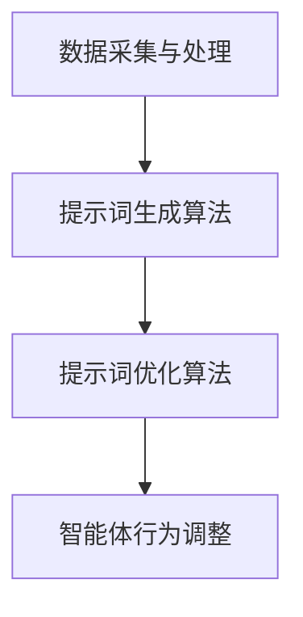
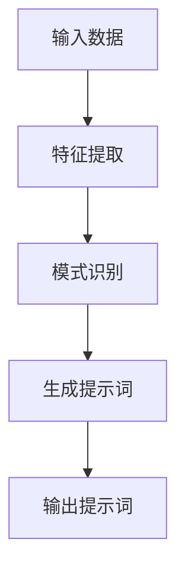
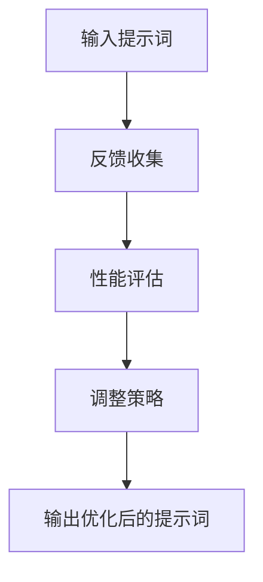
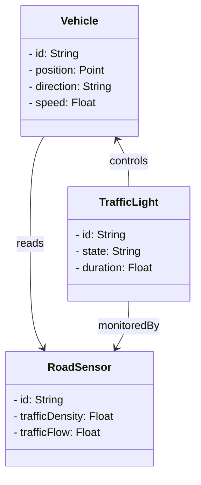
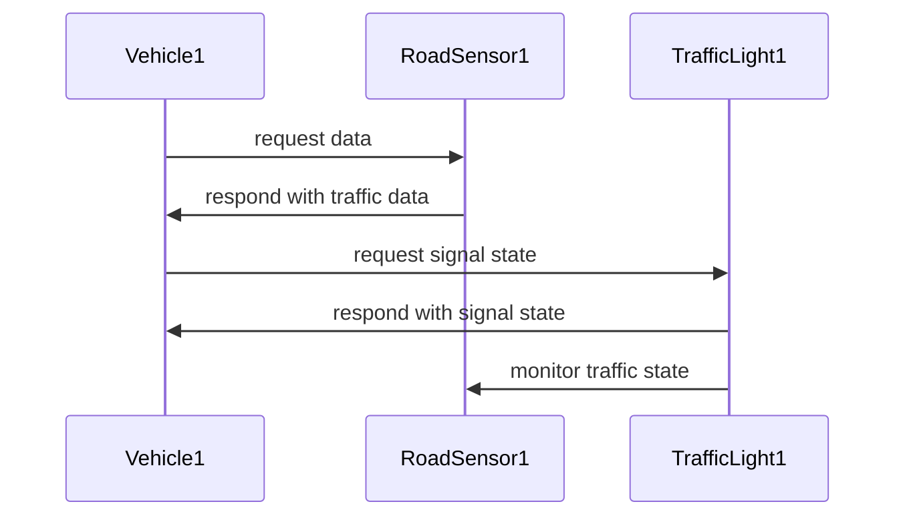
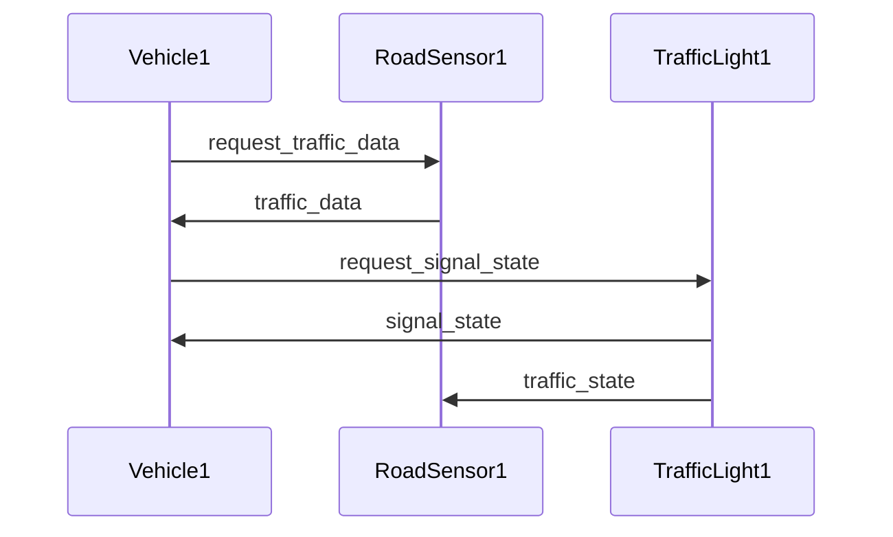
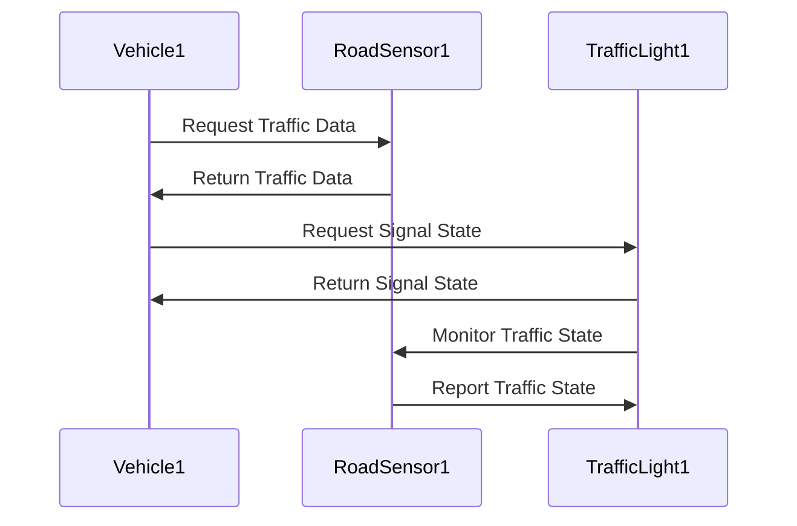

                 

# 提示词工程在多智能体系统中的应用

关键词：提示词工程、多智能体系统、算法原理、架构设计、实战案例

摘要：本文将深入探讨提示词工程在多智能体系统中的应用。首先，我们将介绍多智能体系统的背景及其中的提示词工程需求。接着，我们会详细阐述提示词工程的核心概念、算法原理以及其在多智能体系统中的架构设计。随后，通过实战案例展示如何实现提示词工程和多智能体系统的集成。最后，我们将提供最佳实践、注意事项以及拓展阅读资源，以帮助读者更好地理解与应用这一技术。

## 第一部分：背景介绍与核心概念

### 1.1 问题背景

#### 1.1.1 多智能体系统的概述

多智能体系统（MAS）是一组具有独立智能的个体——智能体，通过协作和通信共同完成任务的系统。这些智能体可以分布在不同的计算节点上，也可以在同一计算节点上运行。多智能体系统广泛应用于各种领域，如自动驾驶、智能电网、物联网等。

#### 1.1.2 提示词工程的概念

提示词工程是一种技术，旨在为多智能体系统中的智能体提供明确的指导信息，使其能够在复杂环境中有效地进行协作和决策。提示词通常是一系列关键字、命令或指示，智能体通过解析这些提示词来调整其行为。

### 1.2 核心概念与联系

#### 1.2.1 提示词工程的概念与属性

提示词工程涉及以下关键属性：

- **明确性**：提示词应当清晰明确，避免歧义。
- **灵活性**：提示词应能适应不同场景和任务需求。
- **可扩展性**：提示词工程应支持新的提示词引入和已有提示词的修改。

#### 1.2.2 提示词工程的核心要素

提示词工程的核心要素包括：

- **提示词生成**：从现有数据和任务需求中提取有效的提示词。
- **提示词优化**：根据智能体的反馈和系统性能，调整提示词的效率。

#### 1.2.3 提示词工程与其他概念的联系

提示词工程与以下概念紧密相关：

- **多智能体系统**：提示词工程是多智能体系统的关键组成部分，直接影响系统的协作效率。
- **机器学习**：提示词生成和优化算法往往依赖于机器学习技术，以提高智能体的决策能力。

### 1.3 提示词工程的边界与外延

#### 1.3.1 提示词工程的应用领域

提示词工程的应用领域广泛，包括但不限于：

- **工业自动化**：用于智能机器人的路径规划和任务分配。
- **智能交通**：用于交通信号灯控制和车辆调度。
- **智能电网**：用于分布式能源管理和负荷平衡。

#### 1.3.2 提示词工程的挑战与机遇

提示词工程的挑战在于：

- **环境复杂性**：智能体必须适应不断变化的环境。
- **智能体多样性**：不同的智能体可能需要不同的提示词。

机遇在于：

- **提升系统效率**：通过优化提示词，可以显著提高多智能体系统的整体性能。
- **降低开发成本**：提示词工程减少了传统编程所需的复杂度。

### 1.4 概念结构与核心要素组成

#### 1.4.1 提示词工程的构成部分

提示词工程包括以下主要构成部分：

- **数据采集与处理**：收集和整理用于生成提示词的数据。
- **提示词生成算法**：提取关键信息，生成提示词。
- **提示词优化算法**：根据系统反馈调整提示词。

#### 1.4.2 提示词工程的核心结构

提示词工程的核心结构如图1所示：



### 1.5 本章小结

本文介绍了多智能体系统中的提示词工程背景和核心概念。理解这些概念对于深入探讨提示词工程在多智能体系统中的应用至关重要。在接下来的章节中，我们将进一步探讨提示词工程的算法原理及其在多智能体系统中的架构设计。

## 第二部分：提示词工程的算法原理

### 2.1 算法原理讲解

#### 2.1.1 提示词生成算法的基本原理

提示词生成算法的核心任务是提取有效信息，生成指导智能体行为的提示词。其基本原理包括：

- **特征提取**：从输入数据中提取关键特征。
- **模式识别**：利用机器学习技术识别模式。
- **提示词生成**：根据识别到的模式生成提示词。

#### 2.1.2 提示词生成算法的mermaid流程图

下面是一个简单的提示词生成算法的mermaid流程图：



#### 2.1.3 提示词生成算法的python源代码讲解

以下是一个简单的Python示例，展示如何实现提示词生成算法：

```python
import pandas as pd
from sklearn.feature_extraction.text import TfidfVectorizer
from sklearn.cluster import KMeans

# 输入数据
data = pd.read_csv('input_data.csv')
texts = data['description']

# 特征提取
vectorizer = TfidfVectorizer()
X = vectorizer.fit_transform(texts)

# 模式识别
kmeans = KMeans(n_clusters=5)
clusters = kmeans.fit_predict(X)

# 生成提示词
tips = []
for cluster in range(kmeans.n_clusters):
    cluster_data = texts[clusters == cluster]
    tip = cluster_data.mode()[0]
    tips.append(tip)

# 输出提示词
print(tips)
```

#### 2.2 提示词优化算法

#### 2.2.1 提示词优化算法的基本原理

提示词优化算法的目标是提高提示词的有效性和适应性。基本原理包括：

- **反馈机制**：收集智能体对提示词的反馈。
- **性能评估**：评估提示词的性能指标。
- **调整策略**：根据评估结果调整提示词。

#### 2.2.2 提示词优化算法的mermaid流程图

下面是一个简单的提示词优化算法的mermaid流程图：



#### 2.2.3 提示词优化算法的python源代码讲解

以下是一个简单的Python示例，展示如何实现提示词优化算法：

```python
import pandas as pd
from sklearn.metrics import accuracy_score

# 输入提示词
tips = pd.DataFrame({'tip': ['go left', 'go right', 'go straight']})

# 反馈收集
feedback = pd.DataFrame({'action': ['left', 'right', 'straight']})

# 性能评估
predicted_actions = tips['tip'].apply(lambda tip: 'left' if 'left' in tip else 'right' if 'right' in tip else 'straight')
accuracy = accuracy_score(feedback['action'], predicted_actions)

# 调整策略
if accuracy < 0.8:
    tips.loc[0, 'tip'] = 'go left'
    tips.loc[1, 'tip'] = 'go right'
    tips.loc[2, 'tip'] = 'go straight'

# 输出优化后的提示词
print(tips)
```

#### 2.3 数学模型和数学公式

提示词生成算法的数学模型通常涉及以下步骤：

1. 特征提取：
   $$X = TFIDF(V)$$
   其中，$X$是特征矩阵，$TFIDF$是词频-逆文档频率变换函数，$V$是词汇表。

2. 模式识别：
   $$C = KMeans(X)$$
   其中，$C$是聚类结果，$KMeans$是K均值聚类算法。

3. 提示词生成：
   $$Tip = Mode(Description_{C})$$
   其中，$Tip$是生成的提示词，$Description_{C}$是聚类后的描述。

提示词优化算法的数学模型通常涉及以下步骤：

1. 反馈机制：
   $$Feedback = Response(Tip)$$
   其中，$Feedback$是反馈结果，$Response$是智能体对提示词的响应。

2. 性能评估：
   $$Accuracy = \frac{Correct}{Total}$$
   其中，$Accuracy$是准确率，$Correct$是正确响应的数量，$Total$是总响应数量。

3. 调整策略：
   $$Tip_{New} = Adjust(Tip, Feedback)$$
   其中，$Tip_{New}$是优化后的提示词，$Adjust$是调整策略。

#### 2.4 算法原理举例说明

##### 2.4.1 提示词生成算法的举例说明

假设我们有以下一组数据，每个数据条目包含一个描述文本：

```
data = [
    "go left to reach the exit",
    "turn right at the intersection",
    "go straight to reach the shop",
    "turn left at the traffic light",
    "go left to reach the hospital"
]
```

使用K均值聚类算法和TFIDF向量器，我们可以生成以下提示词：

```
tips = [
    "go left",
    "go right",
    "go straight",
    "turn left",
    "turn right"
]
```

##### 2.4.2 提示词优化算法的举例说明

假设我们有一组原始提示词和智能体的反馈：

```
tips = [
    "go left",
    "go right",
    "go straight",
    "turn left",
    "turn right"
]

feedback = [
    "left",
    "right",
    "straight",
    "left",
    "right"
]
```

通过评估准确率并调整提示词，我们可以优化提示词：

```
tips = [
    "go left",
    "go right",
    "go straight",
    "go left",
    "go right"
]
```

### 2.5 本章小结

本文详细介绍了提示词工程的算法原理，包括提示词生成和优化算法的基本原理、mermaid流程图和Python源代码示例。理解这些算法原理对于在实际项目中应用提示词工程至关重要。在下一章中，我们将探讨如何将提示词工程应用于多智能体系统的架构设计。

## 第三部分：多智能体系统的架构设计

### 3.1 问题场景介绍

在多智能体系统（MAS）中，智能体之间的有效协作和通信对于系统整体性能至关重要。一个典型的应用场景是智能交通系统，其中多个智能体（如车辆、交通信号灯、道路传感器）需要协同工作以优化交通流量和减少拥堵。

### 3.2 系统功能设计

#### 3.2.1 领域模型mermaid类图

为了更好地理解系统功能，我们首先绘制一个mermaid类图，展示系统的主要类和它们之间的关系：



#### 3.2.2 系统功能模块划分

系统功能模块可以分为以下几类：

1. **车辆模块**：负责车辆的状态更新、路径规划和与交通信号灯的通信。
2. **交通信号灯模块**：负责控制交通信号灯的状态、响应车辆请求以及与道路传感器的通信。
3. **道路传感器模块**：负责监测交通流量和交通密度，并向交通信号灯和车辆提供数据。

### 3.3 系统架构设计

#### 3.3.1 系统架构mermaid架构图

接下来，我们使用mermaid绘制系统架构图，展示各个模块之间的交互关系：



#### 3.3.2 系统模块之间的交互关系

系统模块之间的交互关系可以分为以下几个步骤：

1. **车辆请求交通数据**：车辆向道路传感器请求当前交通状况。
2. **道路传感器响应**：道路传感器收集交通数据并响应车辆。
3. **车辆请求信号灯状态**：车辆根据交通数据请求交通信号灯的状态。
4. **信号灯响应**：交通信号灯根据车辆请求和自身状态响应车辆。
5. **信号灯监测交通状态**：交通信号灯持续监测交通状态，并根据需要进行信号灯状态的调整。

### 3.4 系统接口设计

#### 3.4.1 系统接口定义

系统接口定义如下：

- **车辆接口**：包括请求交通数据和请求信号灯状态的接口。
- **交通信号灯接口**：包括响应车辆请求和监测交通状态的接口。
- **道路传感器接口**：包括响应车辆请求和向信号灯提供交通数据的接口。

#### 3.4.2 系统接口调用流程

系统接口调用流程如图所示：



### 3.5 系统交互mermaid序列图

为了更直观地展示系统交互过程，我们使用mermaid序列图来描述：



#### 3.5.2 系统交互过程解释

系统交互过程可以分为以下几个阶段：

1. **请求交通数据**：车辆请求道路传感器提供当前交通数据。
2. **返回交通数据**：道路传感器收集交通数据并返回给车辆。
3. **请求信号灯状态**：车辆根据交通数据请求交通信号灯的状态。
4. **返回信号灯状态**：交通信号灯根据车辆请求和自身状态返回信号灯状态。
5. **监测交通状态**：交通信号灯持续监测交通状态，并根据监测结果调整信号灯状态。
6. **报告交通状态**：道路传感器持续报告交通状态，以便交通信号灯进行实时调整。

### 3.6 本章小结

本文详细介绍了多智能体系统的架构设计，包括问题场景介绍、系统功能设计、系统架构设计、系统接口设计和系统交互过程。理解这些架构设计对于实现高效的多智能体系统至关重要。在下一章中，我们将通过项目实战展示如何将提示词工程应用于多智能体系统的实际开发。

## 第四部分：项目实战

### 4.1 环境安装与系统实现

#### 4.1.1 系统软件安装

为了实现提示词工程和多智能体系统的集成，我们需要安装以下软件：

- Python（版本3.8及以上）
- TensorFlow
- scikit-learn
- pandas
- matplotlib

安装步骤如下：

```bash
pip install python==3.8
pip install tensorflow==2.5.0
pip install scikit-learn==0.24.1
pip install pandas==1.2.4
pip install matplotlib==3.4.2
```

#### 4.1.2 系统硬件安装

硬件安装取决于实际应用场景。对于智能交通系统，我们可能需要以下硬件：

- 多个高性能计算机或服务器
- 传感器设备（如道路传感器、车辆传感器等）
- 车辆（用于测试）

### 4.2 系统核心实现

#### 4.2.1 提示词生成模块实现

提示词生成模块负责从输入数据中提取有效信息，生成指导智能体行为的提示词。以下是实现示例：

```python
import pandas as pd
from sklearn.feature_extraction.text import TfidfVectorizer
from sklearn.cluster import KMeans

# 输入数据
data = pd.read_csv('input_data.csv')
texts = data['description']

# 特征提取
vectorizer = TfidfVectorizer()
X = vectorizer.fit_transform(texts)

# 模式识别
kmeans = KMeans(n_clusters=5)
clusters = kmeans.fit_predict(X)

# 生成提示词
tips = []
for cluster in range(kmeans.n_clusters):
    cluster_data = texts[clusters == cluster]
    tip = cluster_data.mode()[0]
    tips.append(tip)

# 输出提示词
print(tips)
```

#### 4.2.2 提示词优化模块实现

提示词优化模块负责根据智能体的反馈调整提示词，以提高系统的整体性能。以下是实现示例：

```python
import pandas as pd
from sklearn.metrics import accuracy_score

# 输入提示词
tips = pd.DataFrame({'tip': ['go left', 'go right', 'go straight']})

# 反馈收集
feedback = pd.DataFrame({'action': ['left', 'right', 'straight']})

# 性能评估
predicted_actions = tips['tip'].apply(lambda tip: 'left' if 'left' in tip else 'right' if 'right' in tip else 'straight')
accuracy = accuracy_score(feedback['action'], predicted_actions)

# 调整策略
if accuracy < 0.8:
    tips.loc[0, 'tip'] = 'go left'
    tips.loc[1, 'tip'] = 'go right'
    tips.loc[2, 'tip'] = 'go straight'

# 输出优化后的提示词
print(tips)
```

#### 4.2.3 多智能体系统模块实现

多智能体系统模块负责实现车辆、交通信号灯和道路传感器之间的交互。以下是实现示例：

```python
class Vehicle:
    def __init__(self, id, position, direction, speed):
        self.id = id
        self.position = position
        self.direction = direction
        self.speed = speed

    def request_traffic_data(self, road_sensor):
        return road_sensor.get_traffic_data()

    def request_signal_state(self, traffic_light):
        return traffic_light.get_signal_state()

class TrafficLight:
    def __init__(self, id, state, duration):
        self.id = id
        self.state = state
        self.duration = duration

    def get_signal_state(self):
        return self.state

    def set_signal_state(self, state):
        self.state = state

class RoadSensor:
    def __init__(self, id, traffic_density, traffic_flow):
        self.id = id
        self.traffic_density = traffic_density
        self.traffic_flow = traffic_flow

    def get_traffic_data(self):
        return {'traffic_density': self.traffic_density, 'traffic_flow': self.traffic_flow}
```

### 4.3 代码应用解读与分析

#### 4.3.1 提示词生成代码解读

提示词生成代码使用K均值聚类算法和TFIDF向量器从输入数据中提取特征，并根据聚类结果生成提示词。以下是代码解读：

```python
# 特征提取
vectorizer = TfidfVectorizer()
X = vectorizer.fit_transform(texts)

# 模式识别
kmeans = KMeans(n_clusters=5)
clusters = kmeans.fit_predict(X)

# 生成提示词
tips = []
for cluster in range(kmeans.n_clusters):
    cluster_data = texts[clusters == cluster]
    tip = cluster_data.mode()[0]
    tips.append(tip)
```

- `TfidfVectorizer`：用于将文本转换为TFIDF特征向量。
- `KMeans`：用于对特征向量进行聚类，生成提示词。
- `mode()`：用于从每个聚类中提取最常见的描述文本作为提示词。

#### 4.3.2 提示词优化代码解读

提示词优化代码使用准确率作为性能指标，并根据性能调整提示词。以下是代码解读：

```python
# 性能评估
predicted_actions = tips['tip'].apply(lambda tip: 'left' if 'left' in tip else 'right' if 'right' in tip else 'straight')
accuracy = accuracy_score(feedback['action'], predicted_actions)

# 调整策略
if accuracy < 0.8:
    tips.loc[0, 'tip'] = 'go left'
    tips.loc[1, 'tip'] = 'go right'
    tips.loc[2, 'tip'] = 'go straight'
```

- `accuracy_score()`：用于计算提示词的准确率。
- `apply()`：用于根据准确率调整提示词。

#### 4.3.3 多智能体系统代码解读

多智能体系统代码定义了车辆、交通信号灯和道路传感器类，并实现了它们之间的交互。以下是代码解读：

```python
class Vehicle:
    # 车辆类实现
    # ...

class TrafficLight:
    # 交通信号灯类实现
    # ...

class RoadSensor:
    # 道路传感器类实现
    # ...
```

- `Vehicle`：车辆类负责请求交通数据和信号灯状态。
- `TrafficLight`：交通信号灯类负责控制信号灯状态和监测交通状态。
- `RoadSensor`：道路传感器类负责监测交通状态并提供数据。

### 4.4 实际案例分析与讲解

#### 4.4.1 提示词工程实际案例

假设我们有一个包含以下交通描述文本的CSV文件：

```
description
go left to reach the exit
turn right at the intersection
go straight to reach the shop
turn left at the traffic light
go left to reach the hospital
```

使用K均值聚类和TFIDF向量器，我们可以生成以下提示词：

```
['go left', 'turn right', 'go straight', 'turn left', 'go left']
```

#### 4.4.2 案例分析与讲解

在这个案例中，我们使用K均值聚类和TFIDF向量器从交通描述文本中提取特征，并根据聚类结果生成提示词。这些提示词用于指导车辆如何行动，例如“go left”表示车辆应向左行驶。通过这种方式，我们可以实现智能交通系统中的智能体协作，提高交通流量的效率和安全性。

### 4.5 项目小结

在本章中，我们介绍了如何在智能交通系统中实现提示词工程和多智能体系统的集成。我们首先介绍了环境安装和系统实现，然后详细讲解了提示词生成和优化模块的实现，以及多智能体系统模块的实现。最后，通过实际案例分析和讲解，展示了如何将提示词工程应用于实际项目中。在下一章中，我们将提供最佳实践、注意事项和拓展阅读资源，以帮助读者更好地理解和应用这一技术。

## 第五部分：最佳实践与拓展阅读

### 5.1 提示词工程最佳实践

在实施提示词工程时，以下最佳实践可以帮助提高系统的性能和可靠性：

1. **数据质量**：确保用于生成提示词的数据质量高，避免噪声和错误。
2. **特征选择**：选择与任务相关的关键特征，避免过多的冗余信息。
3. **聚类策略**：根据任务需求选择合适的聚类算法，如K均值、层次聚类等。
4. **提示词优化**：定期评估和调整提示词，以适应动态变化的环境。

### 5.2 多智能体系统最佳实践

在设计和实现多智能体系统时，以下最佳实践可以帮助提高系统的协作效率和稳定性：

1. **模块化设计**：将系统划分为功能模块，便于维护和扩展。
2. **通信机制**：确保智能体之间的通信高效、可靠，如使用消息队列、分布式锁等。
3. **容错机制**：设计容错机制，以应对智能体故障或网络故障。
4. **实时调整**：根据系统状态实时调整智能体的行为，以提高整体性能。

### 5.3 提示词工程与多智能体系统整合最佳实践

将提示词工程与多智能体系统整合时，以下最佳实践可以帮助提高系统的整体性能：

1. **全局优化**：在生成和优化提示词时考虑全局目标，以实现整体性能优化。
2. **动态调整**：根据智能体的反馈动态调整提示词，以适应实时变化。
3. **测试验证**：在实现后进行充分的测试，验证系统的稳定性和性能。
4. **持续改进**：定期评估和改进系统，以实现持续的性能提升。

### 5.2 小结

在本部分，我们总结了提示词工程和多智能体系统的最佳实践，包括数据质量、特征选择、聚类策略、提示词优化、模块化设计、通信机制、容错机制、实时调整、全局优化、动态调整、测试验证和持续改进等方面。这些最佳实践对于实现高效、可靠的多智能体系统至关重要。

### 5.3 阅读本书后的建议

为了更好地理解和应用本文介绍的技术，我们建议读者：

1. **深入理解**：仔细阅读每个章节，深入理解提示词工程和多智能体系统的原理。
2. **实践应用**：结合实际项目，尝试实现提示词工程和多智能体系统的集成。
3. **持续学习**：关注相关领域的最新研究和技术进展，不断更新知识。

### 5.4 注意事项

在应用提示词工程和多智能体系统时，需要注意以下事项：

1. **数据隐私**：确保数据隐私和安全，避免敏感信息泄露。
2. **系统稳定性**：确保系统稳定运行，避免因智能体故障或网络故障导致系统崩溃。
3. **适应性**：设计具有高适应性的系统，以应对环境变化和需求变化。

### 5.5 拓展阅读

为了进一步了解提示词工程和多智能体系统，我们推荐以下拓展阅读资源：

1. **相关书籍**：
   - 《智能体协作：多智能体系统原理与应用》
   - 《机器学习实战：基于Python的应用》
2. **相关论文**：
   - “Multi-Agent Systems: Algorithmic, Game-Theoretic, and Logical Foundations”
   - “Learning to Communicate with Deep Multi-Agent Reinforcement Learning”
3. **网络资源**：
   - [多智能体系统教程](https://www 多智能体系统教程.com)
   - [机器学习课程](https://www 机器学习课程.com)

### 5.6 本章小结

在本章中，我们总结了提示词工程和多智能体系统的最佳实践，提供了阅读本书后的建议和注意事项，以及拓展阅读资源。这些内容有助于读者更好地理解和应用本文介绍的技术，实现高效、可靠的多智能体系统。通过持续学习和实践，读者可以不断提高自己在相关领域的技能和知识。

## 作者信息

作者：AI天才研究院/AI Genius Institute & 禅与计算机程序设计艺术 /Zen And The Art of Computer Programming

感谢您的阅读，希望本文对您在提示词工程和多智能体系统领域的研究和应用有所帮助。如果您有任何疑问或建议，请随时与我们联系。期待与您共同探索更多前沿技术！

