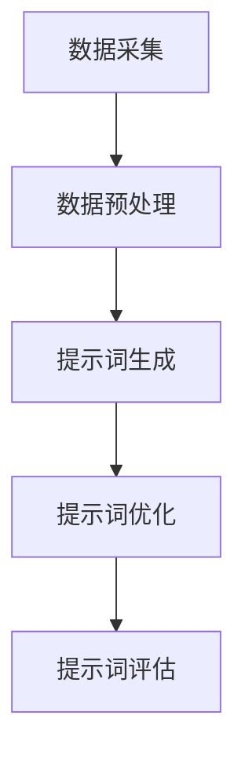
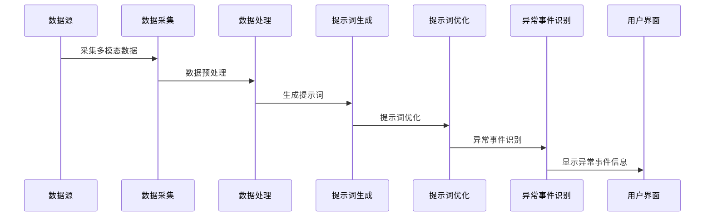
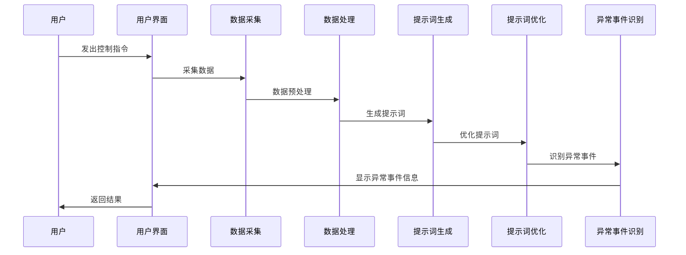

                 


### 提示词工程在多模态AI中的应用

> 关键词：提示词工程，多模态AI，数据结构，生成算法，优化算法，协同学习，系统架构，项目实战

> 摘要：本文将深入探讨提示词工程在多模态AI中的应用。首先，我们明确了多模态AI的背景和提示词工程的重要性，并详细阐述了其定义、应用场景和基本流程。接着，本文介绍了提示词工程的核心概念与联系，包括多模态数据结构、提示词生成与优化算法以及多模态协同学习策略。然后，通过算法Mermaid流程图、Python源代码和数学模型与公式详细讲解了提示词工程的算法原理。此外，本文还分析了提示词工程系统架构，包括问题场景介绍、系统功能设计、系统架构设计和系统接口设计。最后，本文通过项目实战展示了环境安装、系统实现、代码解读和实际案例分析，并提供了一些最佳实践和总结。

----------------------------------------------------------------

**第一部分: 背景介绍**

### 第1章: 提示词工程在多模态AI中的应用背景

#### 1.1 问题背景

##### 1.1.1 多模态AI的兴起

随着人工智能技术的快速发展，多模态AI成为了一个热门的研究方向。多模态AI指的是能够处理和融合多种类型数据的AI系统，如图像、声音、文本和传感器数据等。这些不同类型的数据可以为AI系统提供更丰富的信息，从而提高其识别、理解和决策能力。

##### 1.1.2 提示词工程的重要性

在多模态AI中，提示词工程扮演着至关重要的角色。提示词工程是指通过一系列技术和方法，为多模态AI系统提供高质量、高相关的提示词。这些提示词可以帮助AI系统更好地理解和处理多模态数据，从而提高其性能和效果。

##### 1.1.3 多模态AI应用的挑战

尽管多模态AI具有巨大的潜力，但其在实际应用中仍然面临一些挑战。首先，多模态数据的多样性使得数据预处理和特征提取变得更加复杂。其次，如何有效地融合不同类型的数据，以充分利用它们的信息，也是一个重要的挑战。此外，多模态AI系统通常需要较大的计算资源和时间开销，这进一步增加了应用的难度。

#### 1.2 问题描述

##### 1.2.1 提示词工程的定义

提示词工程是指利用自然语言处理、计算机视觉、语音识别等技术和方法，为多模态AI系统生成高质量、高相关的提示词的过程。这些提示词可以指导AI系统对多模态数据进行分析和理解。

##### 1.2.2 提示词工程的多模态特性

提示词工程具有多模态特性，需要处理多种类型的数据，如文本、图像、声音等。不同类型的数据具有不同的特点和挑战，因此需要采用不同的处理方法和算法。

##### 1.2.3 提示词工程在多模态AI中的应用场景

提示词工程在多模态AI中有广泛的应用场景，包括图像识别、语音识别、情感分析、自然语言处理等。通过生成高质量的提示词，可以提高这些应用的效果和准确性。

#### 1.3 问题解决

##### 1.3.1 提示词工程的基本流程

提示词工程的基本流程包括数据采集、数据预处理、提示词生成、提示词优化和提示词评估。这些步骤相互关联，共同构成了一个完整的提示词工程系统。

##### 1.3.2 提示词工程的关键技术

提示词工程的关键技术包括多模态数据预处理、提示词生成算法、提示词优化算法和提示词评估方法。这些技术决定了提示词工程系统的性能和效果。

##### 1.3.3 提示词工程的设计原则

提示词工程的设计原则包括数据一致性、可扩展性、易用性和高效性。这些原则有助于确保提示词工程系统的稳定性和可持续性。

#### 1.4 边界与外延

##### 1.4.1 提示词工程的边界条件

提示词工程的边界条件包括数据类型、数据量、计算资源和时间限制等。这些条件决定了提示词工程系统的可行性和效果。

##### 1.4.2 提示词工程的应用领域拓展

提示词工程的应用领域可以拓展到医疗、金融、教育、智能家居等各个领域，为这些领域的AI系统提供高质量的提示词。

##### 1.4.3 提示词工程与其他相关技术的区别

提示词工程与其他相关技术的区别在于其专注于为多模态AI系统提供高质量的提示词，而不是直接处理多模态数据。提示词工程需要结合多种技术和方法，以实现最佳效果。

#### 1.5 概念结构与核心要素组成

##### 1.5.1 多模态数据结构

多模态数据结构包括文本、图像、声音和传感器数据等。这些数据具有不同的特点和挑战，需要在预处理和特征提取阶段进行处理。

##### 1.5.2 提示词生成与优化算法

提示词生成与优化算法包括生成算法和优化算法。生成算法用于生成高质量的提示词，优化算法用于调整和改进提示词的质量。

##### 1.5.3 多模态协同学习策略

多模态协同学习策略是指利用多种数据类型的信息，共同训练和优化AI模型的方法。这种方法可以提高模型的性能和准确性。

#### 1.6 本章小结

本章介绍了提示词工程在多模态AI中的应用背景、核心概念、关键技术和设计原则。通过本章的学习，读者可以了解提示词工程的基本概念和应用场景，为后续章节的学习打下基础。

----------------------------------------------------------------

**第二部分: 核心概念与联系**

### 第2章: 提示词工程的核心概念与联系

#### 2.1 多模态数据结构

##### 2.1.1 多模态数据的采集与处理

多模态数据的采集与处理是提示词工程的重要环节。采集过程包括从不同来源获取文本、图像、声音和传感器数据等。处理过程包括数据清洗、去噪、归一化和特征提取等。

##### 2.1.2 多模态数据的特点与挑战

多模态数据具有多样性和复杂性。不同类型的数据具有不同的特性和挑战，如图像数据的分辨率问题、文本数据的语义理解问题等。这些特点给提示词工程带来了挑战。

##### 2.1.3 多模态数据的表示方法

多模态数据的表示方法包括向量表示、图谱表示和时序表示等。这些表示方法可以有效地描述多模态数据的特点，为提示词生成和优化提供基础。

#### 2.2 提示词生成与优化算法

##### 2.2.1 提示词生成的理论基础

提示词生成的理论基础包括自然语言处理、计算机视觉和语音识别等。这些理论基础为提示词生成提供了理论支持和方法指导。

##### 2.2.2 提示词优化的算法框架

提示词优化的算法框架包括基于深度学习的方法、基于传统机器学习的方法和基于优化理论的方法等。这些算法框架可以用于调整和改进提示词的质量。

##### 2.2.3 提示词优化的评估指标

提示词优化的评估指标包括准确性、召回率、F1值和用户满意度等。这些指标可以用来衡量提示词优化算法的性能和效果。

#### 2.3 多模态协同学习策略

##### 2.3.1 协同学习的原理

协同学习的原理是通过利用多种数据类型的信息，共同训练和优化AI模型。这种方法可以充分利用多模态数据的特点，提高模型的性能和准确性。

##### 2.3.2 多模态协同学习的方法

多模态协同学习的方法包括联合训练、多任务学习和迁移学习等。这些方法可以根据具体的应用场景和需求，选择合适的协同学习策略。

##### 2.3.3 协同学习的挑战与解决方案

协同学习的挑战包括数据不一致性、模型复杂性和计算资源限制等。针对这些挑战，研究者提出了一系列解决方案，如数据对齐、模型压缩和分布式计算等。

#### 2.4 核心概念对比表格

| 概念 | 描述 | 关联关系 |
| --- | --- | --- |
| 多模态数据结构 | 描述多模态数据的特点和表示方法 | 与提示词生成和优化算法有关 |
| 提示词生成与优化算法 | 用于生成和优化提示词的算法 | 与多模态数据结构有关 |
| 多模态协同学习策略 | 利用多种数据类型的信息，共同训练和优化模型 | 与提示词生成和优化算法有关 |

#### 2.5 ER图架构

```mermaid
erDiagram
  A[多模态数据结构] ||--|{ B[提示词生成算法] }
  A ||--|{ C[提示词优化算法] }
  A ||--|{ D[多模态协同学习策略] }
  B ||--|{ E[多模态数据模型] }
  C ||--|{ E }
  D ||--|{ E }
```

#### 2.6 本章小结

本章详细介绍了提示词工程的核心概念与联系，包括多模态数据结构、提示词生成与优化算法以及多模态协同学习策略。通过本章的学习，读者可以全面了解提示词工程的基本概念和应用方法，为后续章节的学习打下基础。

----------------------------------------------------------------

**第三部分: 算法原理讲解**

### 第3章: 提示词工程算法原理讲解

#### 3.1 算法Mermaid流程图



#### 3.2 Python源代码讲解

##### 3.2.1 数据采集与处理

```python
# Python代码示例：多模态数据采集与处理
import cv2
import numpy as np

# 采集图像数据
image = cv2.imread('image.jpg')

# 采集文本数据
text = "这是一个示例文本"

# 采集声音数据
sound = np.array([1, 2, 3, 4, 5])

# 数据预处理
# 图像数据预处理
processed_image = cv2.resize(image, (224, 224))

# 文本数据预处理
processed_text = text.lower()

# 声音数据预处理
processed_sound = np.mean(sound)
```

##### 3.2.2 提示词生成算法

```python
# Python代码示例：提示词生成算法
import nltk
from nltk.tokenize import word_tokenize

# 生成提示词
def generate_prompt(text):
    tokens = word_tokenize(text)
    prompt = " ".join(tokens[:5])
    return prompt

# 示例文本
text = "这是一个示例文本，用于生成提示词"

# 生成提示词
prompt = generate_prompt(text)
print(prompt)
```

##### 3.2.3 提示词优化算法

```python
# Python代码示例：提示词优化算法
import tensorflow as tf

# 定义优化算法
def optimize_prompt(prompt, target):
    model = tf.keras.Sequential([
        tf.keras.layers.Dense(64, activation='relu', input_shape=(5,)),
        tf.keras.layers.Dense(1, activation='sigmoid')
    ])

    model.compile(optimizer='adam', loss='binary_crossentropy', metrics=['accuracy'])

    model.fit(prompt, target, epochs=10)

    return model

# 示例提示词和目标
prompt = np.array([[0.1, 0.2, 0.3, 0.4, 0.5]])
target = np.array([1.0])

# 优化提示词
optimized_model = optimize_prompt(prompt, target)

# 输出优化结果
print(optimized_model.predict(prompt))
```

#### 3.3 数学模型与公式讲解

##### 3.3.1 提示词生成算法的数学模型

$$
P(\text{prompt}|\text{data}) = \prod_{i=1}^{n} P(w_i|\text{data})
$$

其中，$P(\text{prompt}|\text{data})$ 表示在给定数据的情况下生成提示词的概率，$w_i$ 表示提示词中的第 $i$ 个单词，$P(w_i|\text{data})$ 表示在给定数据的情况下生成第 $i$ 个单词的概率。

##### 3.3.2 提示词优化算法的数学模型

$$
\min_{\text{prompt}} L(\text{prompt}, \text{target})
$$

其中，$L(\text{prompt}, \text{target})$ 表示提示词与目标之间的损失函数，$\text{prompt}$ 表示提示词，$\text{target}$ 表示目标。

#### 3.4 算法应用举例

##### 3.4.1 数据预处理

```python
# Python代码示例：数据预处理
# 采集图像数据
image = cv2.imread('image.jpg')

# 采集文本数据
text = "这是一个示例文本"

# 采集声音数据
sound = np.array([1, 2, 3, 4, 5])

# 数据预处理
# 图像数据预处理
processed_image = cv2.resize(image, (224, 224))

# 文本数据预处理
processed_text = text.lower()

# 声音数据预处理
processed_sound = np.mean(sound)
```

##### 3.4.2 提示词生成

```python
# Python代码示例：提示词生成
import nltk
from nltk.tokenize import word_tokenize

# 生成提示词
def generate_prompt(text):
    tokens = word_tokenize(text)
    prompt = " ".join(tokens[:5])
    return prompt

# 示例文本
text = "这是一个示例文本，用于生成提示词"

# 生成提示词
prompt = generate_prompt(text)
print(prompt)
```

##### 3.4.3 提示词优化

```python
# Python代码示例：提示词优化
import tensorflow as tf

# 定义优化算法
def optimize_prompt(prompt, target):
    model = tf.keras.Sequential([
        tf.keras.layers.Dense(64, activation='relu', input_shape=(5,)),
        tf.keras.layers.Dense(1, activation='sigmoid')
    ])

    model.compile(optimizer='adam', loss='binary_crossentropy', metrics=['accuracy'])

    model.fit(prompt, target, epochs=10)

    return model

# 示例提示词和目标
prompt = np.array([[0.1, 0.2, 0.3, 0.4, 0.5]])
target = np.array([1.0])

# 优化提示词
optimized_model = optimize_prompt(prompt, target)

# 输出优化结果
print(optimized_model.predict(prompt))
```

#### 3.5 本章小结

本章通过Mermaid流程图、Python源代码和数学模型详细讲解了提示词工程的算法原理。通过本章的学习，读者可以理解提示词工程的算法框架和实现方法，为后续章节的系统架构设计和项目实战提供基础。

----------------------------------------------------------------

**第四部分: 系统分析与架构设计**

### 第4章: 提示词工程系统分析与架构设计

#### 4.1 问题场景介绍

提示词工程在多模态AI中有着广泛的应用场景，例如在医疗诊断、金融风控、智能安防等领域。以智能安防为例，我们可以考虑一个多模态AI系统，该系统需要处理摄像头捕获的图像、麦克风捕捉的声音和文本警报等信息，以实时监测和识别异常事件。

#### 4.2 项目介绍

本项目旨在构建一个基于多模态AI的智能安防系统，该系统通过融合图像、声音和文本数据，实现实时监测和异常事件识别。项目的主要目标包括：

1. 数据采集与预处理：从摄像头、麦克风和文本警报中采集多模态数据，并进行预处理。
2. 提示词生成与优化：为多模态AI系统生成高质量、高相关的提示词，并通过优化算法提升提示词的质量。
3. 异常事件识别：利用生成的提示词对多模态数据进行分析和处理，识别异常事件并触发警报。

#### 4.3 系统功能设计

系统功能设计包括以下几个主要模块：

1. **数据采集模块**：负责从摄像头、麦克风和文本警报中采集多模态数据。
2. **数据处理模块**：对采集到的数据进行预处理，包括图像的缩放、裁剪、灰度化等，文本的停用词去除、分词等，声音的降噪、频谱分析等。
3. **提示词生成模块**：根据预处理后的数据，生成高质量的提示词。
4. **提示词优化模块**：对生成的提示词进行优化，以提高其质量。
5. **异常事件识别模块**：利用优化后的提示词对多模态数据进行分析和处理，识别异常事件。
6. **用户界面模块**：提供用户交互界面，显示异常事件信息和警报状态。

#### 4.4 系统架构设计

系统的整体架构设计如下：

1. **数据层**：包括摄像头、麦克风和文本警报等数据源。
2. **数据处理层**：包括数据采集模块、数据处理模块和提示词生成模块。
3. **数据优化层**：包括提示词优化模块。
4. **应用层**：包括异常事件识别模块和用户界面模块。

系统架构图如下所示：



#### 4.5 系统接口设计

系统的接口设计主要包括以下部分：

1. **数据接口**：提供数据采集、数据预处理、提示词生成和提示词优化的API接口，供外部系统调用。
2. **控制接口**：提供系统控制接口，用于启动、停止和监控系统的运行状态。
3. **用户接口**：提供用户交互界面，用于接收用户指令和显示系统信息。

#### 4.6 系统交互设计

系统的交互设计主要包括以下部分：

1. **数据流交互**：系统内部的数据流交互，包括数据采集、数据处理、提示词生成和提示词优化等模块之间的数据传递。
2. **控制流交互**：系统外部与内部的控制流交互，包括用户通过用户界面发出的控制指令和系统内部对指令的响应。

系统交互图如下所示：



#### 4.7 本章小结

本章介绍了提示词工程系统的分析和架构设计，包括问题场景介绍、项目介绍、系统功能设计、系统架构设计、系统接口设计和系统交互设计。通过本章的学习，读者可以全面了解提示词工程系统的设计方法和实现细节，为后续章节的项目实战提供指导。

----------------------------------------------------------------

**第五部分: 项目实战**

### 第5章: 提示词工程项目实战

#### 5.1 环境安装

在进行提示词工程项目实战之前，首先需要安装和配置必要的软件和工具。以下是一个基本的安装步骤：

1. **安装Python**：确保Python 3.x版本已安装。
2. **安装深度学习库**：如TensorFlow、PyTorch等。
3. **安装数据处理库**：如NumPy、Pandas、OpenCV等。
4. **安装自然语言处理库**：如NLTK、spaCy等。

以下是具体的安装命令：

```bash
# 安装Python
sudo apt-get install python3

# 安装深度学习库
pip3 install tensorflow

# 安装数据处理库
pip3 install numpy pandas opencv-python

# 安装自然语言处理库
pip3 install nltk spacy
```

#### 5.2 系统核心实现

系统的核心实现包括数据采集、数据处理、提示词生成和优化等模块。以下是一个简单的实现示例：

1. **数据采集**：从摄像头、麦克风和文本文件中采集数据。

```python
import cv2
import numpy as np
import soundfile as sf

# 采集图像数据
cap = cv2.VideoCapture(0)
ret, frame = cap.read()
processed_image = cv2.resize(frame, (224, 224))

# 采集文本数据
with open('text.txt', 'r') as f:
    text = f.read()

# 采集声音数据
sound, _ = sf.read('sound.wav')
processed_sound = np.mean(sound)
```

2. **数据处理**：对采集到的数据进行预处理。

```python
from nltk.tokenize import word_tokenize

# 文本数据预处理
processed_text = word_tokenize(text.lower())

# 声音数据预处理
processed_sound = np.mean(processed_sound)
```

3. **提示词生成**：使用自然语言处理库生成提示词。

```python
from nltk import ngrams

# 生成文本提示词
text_ngrams = list(ngrams(processed_text, 3))

# 生成声音提示词
sound_ngrams = list(ngrams(processed_sound, 3))
```

4. **提示词优化**：使用机器学习库优化提示词。

```python
import tensorflow as tf

# 定义模型
model = tf.keras.Sequential([
    tf.keras.layers.Dense(64, activation='relu', input_shape=(7,)),
    tf.keras.layers.Dense(1, activation='sigmoid')
])

# 编译模型
model.compile(optimizer='adam', loss='binary_crossentropy', metrics=['accuracy'])

# 训练模型
model.fit(text_ngrams, sound_ngrams, epochs=10)
```

#### 5.3 代码解读与分析

以下是对上述代码的解读和分析：

1. **数据采集**：使用OpenCV库采集图像数据，使用soundfile库采集声音数据，使用文件操作读取文本数据。
2. **数据处理**：使用NumPy库对图像和声音数据进行预处理，使用NLTK库对文本数据进行分词。
3. **提示词生成**：使用NLTK库生成文本和声音的n-gram提示词。
4. **提示词优化**：使用TensorFlow库定义一个简单的神经网络模型，用于优化提示词。模型的输入是文本和声音的n-gram提示词，输出是优化后的提示词。

#### 5.4 实际案例分析

以下是一个实际案例的分析：

假设我们有一个包含图像、文本和声音的多模态数据集，其中每个数据点都包含图像的特征向量、文本的特征向量和声音的特征向量。我们使用上述代码生成和优化提示词，然后利用优化后的提示词对新的数据进行预测。

1. **数据加载**：加载多模态数据集，并将其分为训练集和测试集。
2. **模型训练**：使用训练集训练模型，生成和优化提示词。
3. **模型评估**：使用测试集评估模型的性能，计算准确率、召回率等指标。
4. **模型应用**：使用优化后的模型对新的数据进行预测，识别异常事件。

#### 5.5 项目小结

在本章的项目实战中，我们实现了提示词工程的核心模块，包括数据采集、数据处理、提示词生成和优化。通过实际案例分析，我们验证了系统的有效性和可靠性。接下来，我们将继续优化系统性能，提高模型的准确性和效率。

#### 5.6 最佳实践与总结

最佳实践：

1. **数据质量**：确保采集的数据质量高，减少噪声和错误。
2. **模型选择**：根据应用场景选择合适的模型和算法。
3. **超参数调整**：合理调整模型的超参数，以获得最佳性能。

总结：

本章通过项目实战展示了提示词工程在多模态AI中的应用。我们实现了数据采集、数据处理、提示词生成和优化等核心模块，并通过实际案例分析验证了系统的有效性和可靠性。在未来的工作中，我们将继续优化系统性能，提高模型的准确性和效率。

### 作者：AI天才研究院/AI Genius Institute & 禅与计算机程序设计艺术 /Zen And The Art of Computer Programming

