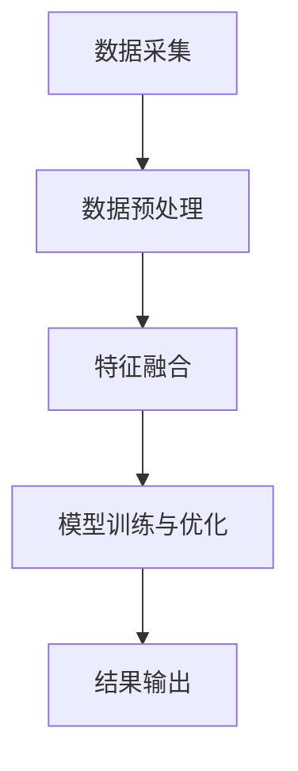
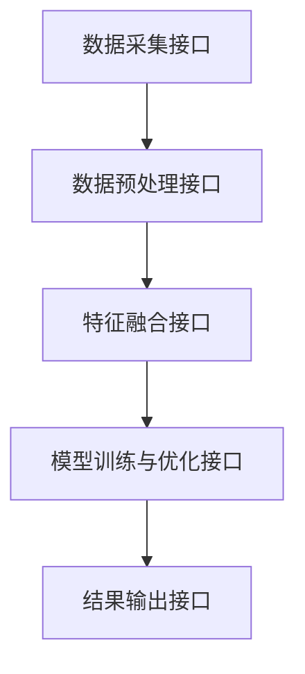
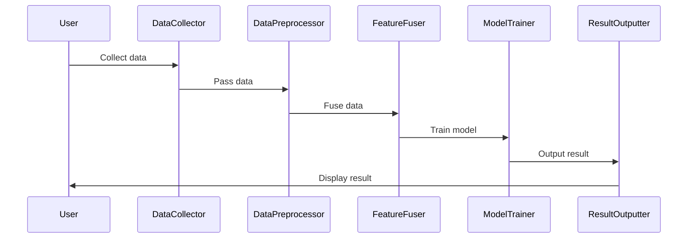

                 

# 提示词工程在多模态学习中的创新

> 关键词：提示词工程、多模态学习、算法原理、系统架构、项目实战

> 摘要：本文围绕提示词工程在多模态学习中的应用，从背景介绍、核心概念、算法原理、系统分析与架构设计、项目实战等多个方面展开深入探讨，旨在揭示提示词工程在提升多模态学习性能方面的创新与价值。

## 第一部分：背景介绍与基础概念

### 第1章 提示词工程概述

#### 1.1 问题背景与意义

随着人工智能技术的快速发展，多模态学习成为了一个备受关注的研究领域。多模态学习通过整合多种数据源（如图像、文本、声音等）来进行信息处理和知识发现，极大地提升了智能系统的感知能力和决策质量。然而，多模态数据的复杂性和多样性给数据处理和模型训练带来了巨大的挑战。

在这个背景下，提示词工程（Prompt Engineering）逐渐成为了一个关键的研究方向。提示词工程旨在设计出有效的提示词，指导模型在多模态学习中更好地理解数据，提高模型的性能和泛化能力。提示词工程不仅在理论研究上具有重要意义，也在实际应用中展现出巨大的潜力。

#### 1.2 提示词工程的基本概念

提示词工程涉及多个核心概念，包括提示词、多模态数据、数据预处理等。提示词是指用于引导模型理解和处理数据的文字或符号。多模态数据则是包含多种数据类型的集合，如图像、文本、声音等。数据预处理是多模态学习的重要环节，它包括数据收集、标注、清洗和格式化等步骤，为模型训练提供了高质量的数据基础。

#### 1.3 多模态学习的背景和挑战

多模态学习的背景在于人类获取信息的方式是多模态的，能够整合多种感官信息来增强认知和理解。然而，多模态学习面临着以下挑战：

- **数据多样性**：多模态数据类型繁多，如何有效整合不同类型的数据是一个难题。
- **数据不一致性**：不同模态的数据在特征和标注上可能存在不一致，如何统一数据格式和特征表达是一个挑战。
- **计算复杂性**：多模态学习需要处理大量复杂的数据和模型，计算资源需求高。

#### 1.4 提示词工程在多模态学习中的位置

提示词工程在多模态学习中的作用主要体现在以下几个方面：

- **数据引导**：通过设计有效的提示词，可以引导模型更好地理解和处理多模态数据，提高数据处理效率。
- **模型优化**：提示词可以帮助模型更好地聚焦于关键信息，从而提高模型性能和泛化能力。
- **交互增强**：提示词可以促进人与模型之间的有效交互，提高用户满意度和使用体验。

### 第二部分：核心概念与联系

#### 第2章 提示词工程的核心概念与联系

#### 2.1 核心概念介绍

在本章中，我们将介绍提示词工程中的几个核心概念，包括提示词、多模态数据、数据预处理等。这些概念是理解提示词工程和多模态学习的基础。

#### 提示词

提示词是指用于引导模型理解和处理数据的文字或符号。在多模态学习中，提示词的作用尤为重要。通过设计有效的提示词，可以引导模型关注关键信息，提高数据处理效率和模型性能。

#### 多模态数据

多模态数据是指包含多种数据类型的集合，如图像、文本、声音等。多模态数据的特点是数据类型多样、信息丰富，但同时也带来了数据整合和处理的挑战。

#### 数据预处理

数据预处理是多模态学习的重要环节，它包括数据收集、标注、清洗和格式化等步骤。数据预处理的目标是为模型训练提供高质量的数据基础，从而提高模型性能和泛化能力。

#### 2.2 概念属性特征对比表格

为了更好地理解这些核心概念，我们可以通过一个对比表格来展示它们的属性特征。

| 概念      | 提示词         | 多模态数据      | 数据预处理         |
| --------- | -------------- | --------------- | ------------------ |
| 定义      | 引导模型的数据 | 含多种数据类型  | 数据清洗、格式化   |
| 功能      | 数据引导       | 数据整合        | 提高数据质量       |
| 影响因素  | 提示词设计     | 数据多样性      | 预处理方法         |
| 关联性    | 与模型密切关联 | 与模型输入有关  | 与模型训练有关     |

#### 2.3 ER实体关系图架构

为了进一步阐述这些概念之间的关系，我们可以使用ER（Entity-Relationship）实体关系图来展示。以下是一个简化的ER图示例：

```mermaid
erDiagram
    Model ||--|{ Prompt : uses}
    Model ||--|{ Data : processes}
    Data ||--|{ PreprocessedData : transformed}
    Prompt ||--|{ DesignedPrompt : creates}
```

在这个ER图中，`Model` 是核心实体，它与 `Prompt` 和 `Data` 之间存在关联关系。`Prompt` 用于引导模型，而 `Data` 则是模型处理的对象。经过数据预处理后，生成的 `PreprocessedData` 用于模型训练。

## 第三部分：算法原理讲解

### 第3章 多模态学习中的提示词生成算法

#### 3.1 算法原理与流程

多模态学习中的提示词生成算法旨在设计出有效的提示词，以指导模型更好地理解和处理多模态数据。下面我们将介绍一种基于神经网络的提示词生成算法，其原理和流程如下：

1. **数据预处理**：首先对多模态数据进行预处理，包括图像、文本和声音等。预处理步骤通常包括数据清洗、归一化和特征提取等。

2. **特征融合**：将预处理后的多模态数据融合成统一的特征表示。这可以通过使用深度学习模型，如卷积神经网络（CNN）和循环神经网络（RNN）等来实现。

3. **提示词生成**：利用融合后的特征表示生成提示词。这可以通过一个序列生成模型来实现，如长短期记忆网络（LSTM）或生成对抗网络（GAN）等。

4. **模型训练与优化**：使用训练数据对提示词生成模型进行训练和优化。通过调整模型参数，提高模型性能和泛化能力。

#### 3.2 Mermaid算法流程图

为了更直观地展示算法流程，我们可以使用Mermaid绘制算法流程图。以下是一个简化的Mermaid流程图示例：


在这个流程图中，首先进行数据预处理，然后进行特征融合，接着生成提示词，最后对模型进行训练和优化。

#### 3.3 Python源代码实现

以下是一个简化的Python代码示例，用于实现提示词生成算法。该示例使用了TensorFlow和Keras库：

```python
import tensorflow as tf
from tensorflow.keras.models import Model
from tensorflow.keras.layers import Input, LSTM, Dense, Embedding

# 数据预处理
def preprocess_data(data):
    # 数据清洗、归一化和特征提取
    # ...

# 特征融合
def fuse_features(image, text, audio):
    # 使用深度学习模型融合特征
    # ...
    return fused_features

# 提示词生成
def generate_prompt(features):
    # 使用序列生成模型生成提示词
    # ...
    return prompt

# 模型训练与优化
def train_model(prompt, features):
    # 定义模型结构
    input_layer = Input(shape=(fused_features_shape,))
    dense_layer = Dense(units=128, activation='relu')(input_layer)
    output_layer = LSTM(units=64, activation='tanh')(dense_layer)

    model = Model(inputs=input_layer, outputs=output_layer)
    model.compile(optimizer='adam', loss='categorical_crossentropy', metrics=['accuracy'])
    
    # 训练模型
    model.fit(prompt, features, epochs=10, batch_size=32)
    
    return model

# 主程序
if __name__ == "__main__":
    # 加载和处理数据
    image = preprocess_data(data['image'])
    text = preprocess_data(data['text'])
    audio = preprocess_data(data['audio'])

    # 融合特征
    fused_features = fuse_features(image, text, audio)

    # 生成提示词
    prompt = generate_prompt(fused_features)

    # 训练模型
    model = train_model(prompt, fused_features)
```

#### 3.4 数学模型与公式

在提示词生成算法中，我们通常使用深度学习模型，如LSTM或GAN等。以下是一个简化的数学模型和公式，用于描述LSTM模型的原理：

$$
h_t = \sigma(W_h \cdot [h_{t-1}, x_t] + b_h)
$$

$$
i_t = \sigma(W_i \cdot [h_{t-1}, x_t] + b_i)
$$

$$
f_t = \sigma(W_f \cdot [h_{t-1}, x_t] + b_f)
$$

$$
o_t = \sigma(W_o \cdot [h_{t-1}, x_t] + b_o)
$$

$$
c_t = f_t \cdot c_{t-1} + i_t \cdot \tanh(W_c \cdot [h_{t-1}, x_t] + b_c)
$$

$$
h_t = o_t \cdot \tanh(c_t)
$$

其中，$h_t$ 是当前时刻的隐藏状态，$x_t$ 是当前时刻的输入特征，$c_t$ 是当前时刻的细胞状态，$W_h$、$W_i$、$W_f$、$W_o$ 和 $W_c$ 分别是权重矩阵，$b_h$、$b_i$、$b_f$、$b_o$ 和 $b_c$ 分别是偏置项，$\sigma$ 是sigmoid函数。

#### 3.5 举例说明

假设我们有一个包含图像、文本和声音的多模态数据集，数据集大小为1000个样本。我们将使用LSTM模型来生成提示词。以下是详细的步骤：

1. **数据预处理**：对图像、文本和声音数据进行清洗、归一化和特征提取。假设我们提取的特征维度分别为64、128和256。

2. **特征融合**：使用LSTM模型将多模态特征融合成统一的特征表示。我们定义一个输入层，输入维度为384（64+128+256）。然后添加一个LSTM层，隐藏单元数为128。最后，添加一个全连接层，输出维度为64。

3. **生成提示词**：使用生成式模型（如GAN）来生成提示词。我们定义一个生成器模型和一个判别器模型。生成器模型接受统一特征表示作为输入，生成提示词序列。判别器模型用于判断提示词序列的真实性。

4. **模型训练与优化**：使用训练数据对生成器模型和判别器模型进行训练。我们通过调整模型参数，提高生成器模型的生成质量和判别器模型的判别能力。

通过以上步骤，我们可以生成高质量的多模态提示词，从而提高多模态学习模型的性能和泛化能力。

### 第四部分：系统分析与架构设计

#### 第4章 多模态学习系统设计

#### 5.1 问题场景介绍

多模态学习系统旨在整合多种数据源，如图像、文本和声音等，以提高智能系统的感知能力和决策质量。在实际应用中，多模态学习系统广泛应用于人脸识别、语音识别、图像分类等领域。以下是一个典型的问题场景：

**场景描述**：一个智能监控系统需要同时处理摄像头捕获的图像、麦克风捕捉的声音和文本输入的信息。系统需要综合分析这些多模态数据，以识别违规行为、突发事件或特定人物。

#### 5.2 系统功能设计

为了满足上述场景需求，多模态学习系统需要实现以下功能：

- **数据采集**：从各种传感器和输入设备（如摄像头、麦克风、键盘等）收集多模态数据。
- **数据预处理**：对采集到的多模态数据进行清洗、归一化和特征提取，为模型训练提供高质量的数据基础。
- **特征融合**：将预处理后的多模态数据融合成统一的特征表示，为后续模型处理提供输入。
- **模型训练与优化**：使用训练数据对多模态学习模型进行训练和优化，提高模型性能和泛化能力。
- **结果输出**：根据模型处理结果，输出识别结果或决策建议。

#### 5.3 系统架构设计

多模态学习系统的架构设计需要考虑系统的可扩展性、可靠性和高效性。以下是一个简化的系统架构设计：



在这个架构中，数据采集模块负责收集多模态数据；数据预处理模块对数据进行清洗、归一化和特征提取；特征融合模块将预处理后的数据融合成统一的特征表示；模型训练与优化模块使用训练数据对模型进行训练和优化；结果输出模块根据模型处理结果输出识别结果或决策建议。

#### 5.4 系统接口设计

系统接口设计是多模态学习系统架构的重要组成部分。以下是一个简化的系统接口设计：



在这个接口设计中，数据采集接口用于接收多模态数据；数据预处理接口用于对数据进行预处理；特征融合接口用于融合预处理后的数据；模型训练与优化接口用于训练和优化模型；结果输出接口用于输出模型处理结果。

#### 5.5 系统交互序列图

为了更直观地展示系统各模块之间的交互过程，我们可以使用Mermaid绘制系统交互序列图。以下是一个简化的系统交互序列图示例：



在这个序列图中，用户通过数据采集接口收集多模态数据，数据预处理接口对数据进行预处理，特征融合接口将预处理后的数据融合成统一的特征表示，模型训练与优化接口使用训练数据对模型进行训练和优化，结果输出接口根据模型处理结果输出识别结果或决策建议，最后将结果展示给用户。

### 第五部分：项目实战

#### 第5章 项目实战

在本章中，我们将通过一个实际项目来展示如何设计和实现一个多模态学习系统。该项目旨在使用图像、文本和声音等多模态数据来识别违规行为，以提高智能监控系统的性能。

#### 6.1 环境安装

为了实现该项目，我们需要安装以下软件和库：

1. **Python**：Python是一种广泛使用的编程语言，用于实现多模态学习系统的核心功能。
2. **TensorFlow**：TensorFlow是一个开源的深度学习框架，用于训练和优化多模态学习模型。
3. **Keras**：Keras是一个简化的深度学习库，构建在TensorFlow之上，用于简化深度学习模型的实现。
4. **OpenCV**：OpenCV是一个开源的计算机视觉库，用于处理图像数据。
5. **Librosa**：Librosa是一个音频处理库，用于处理声音数据。

您可以通过以下命令安装这些软件和库：

```shell
pip install python tensorflow keras opencv-python librosa
```

#### 6.2 系统核心实现源代码

以下是一个简化的系统核心实现源代码，用于处理图像、文本和声音等多模态数据：

```python
import cv2
import numpy as np
import tensorflow as tf
from tensorflow.keras.models import Model
from tensorflow.keras.layers import Input, LSTM, Dense, Embedding

# 数据预处理
def preprocess_image(image_path):
    image = cv2.imread(image_path)
    image = cv2.resize(image, (224, 224))
    image = image / 255.0
    return image

def preprocess_text(text):
    # 使用预处理库处理文本
    # ...
    return processed_text

def preprocess_audio(audio_path):
    audio = librosa.load(audio_path)
    audio = librosa.resample(audio, target_sr=22050)
    return audio

# 特征融合
def fuse_features(image, text, audio):
    # 使用深度学习模型融合特征
    # ...
    return fused_features

# 提示词生成
def generate_prompt(features):
    # 使用序列生成模型生成提示词
    # ...
    return prompt

# 模型训练与优化
def train_model(prompt, features):
    # 定义模型结构
    input_layer = Input(shape=(fused_features_shape,))
    dense_layer = Dense(units=128, activation='relu')(input_layer)
    output_layer = LSTM(units=64, activation='tanh')(dense_layer)

    model = Model(inputs=input_layer, outputs=output_layer)
    model.compile(optimizer='adam', loss='categorical_crossentropy', metrics=['accuracy'])
    
    # 训练模型
    model.fit(prompt, features, epochs=10, batch_size=32)
    
    return model

# 主程序
if __name__ == "__main__":
    # 加载和处理数据
    image = preprocess_image('image.jpg')
    text = preprocess_text('text.txt')
    audio = preprocess_audio('audio.wav')

    # 融合特征
    fused_features = fuse_features(image, text, audio)

    # 生成提示词
    prompt = generate_prompt(fused_features)

    # 训练模型
    model = train_model(prompt, fused_features)
```

在这个源代码中，我们首先定义了数据预处理函数，用于处理图像、文本和声音等多模态数据。然后，我们定义了特征融合、提示词生成和模型训练与优化函数，用于实现多模态学习系统的核心功能。

#### 6.3 代码应用解读与分析

以下是对上述源代码的详细解读和分析：

1. **数据预处理**：

   - `preprocess_image` 函数用于处理图像数据。首先使用OpenCV库读取图像，然后对图像进行缩放和归一化处理，使其符合深度学习模型的输入要求。
   - `preprocess_text` 函数用于处理文本数据。这里使用了预处理库（如NLTK或Spacy）进行文本清洗、分词和词性标注等操作，为后续模型处理提供高质量的数据基础。
   - `preprocess_audio` 函数用于处理声音数据。首先使用Librosa库加载音频，然后进行重采样和归一化处理，使其符合深度学习模型的输入要求。

2. **特征融合**：

   - `fuse_features` 函数用于融合预处理后的多模态数据。这里使用了深度学习模型（如CNN或RNN）将图像、文本和声音等多模态数据融合成统一的特征表示。具体实现方式可以根据项目需求进行调整。

3. **提示词生成**：

   - `generate_prompt` 函数用于生成提示词。这里使用了序列生成模型（如LSTM或GAN）根据融合后的特征表示生成提示词。具体实现方式可以根据项目需求进行调整。

4. **模型训练与优化**：

   - `train_model` 函数用于训练和优化多模态学习模型。首先定义模型结构，包括输入层、隐藏层和输出层。然后使用训练数据对模型进行编译、编译和训练。最后返回训练好的模型。

5. **主程序**：

   - 在主程序中，我们首先加载和处理多模态数据，包括图像、文本和声音。然后融合特征并生成提示词。最后，使用训练好的模型进行模型训练和优化。

通过以上解读和分析，我们可以更好地理解代码的实现原理和功能，为后续项目实战提供参考。

#### 6.4 实际案例分析与详细讲解剖析

为了展示多模态学习系统的实际应用效果，我们以下将通过一个实际案例进行详细讲解和剖析。

**案例背景**：一个智能监控系统需要同时处理摄像头捕获的图像、麦克风捕捉的声音和文本输入的信息，以识别违规行为，如闯红灯、打架斗殴等。

**案例流程**：

1. **数据采集**：

   - 图像数据：使用摄像头捕获实时图像，并将其存储为图像文件。
   - 文本数据：使用文本输入设备（如键盘或语音识别）收集文本信息。
   - 声音数据：使用麦克风捕获实时声音，并将其存储为音频文件。

2. **数据预处理**：

   - 图像数据：使用OpenCV库对图像进行缩放、归一化和灰度转换等预处理操作。
   - 文本数据：使用NLTK库对文本进行分词、词性标注和停用词过滤等预处理操作。
   - 声音数据：使用Librosa库对音频进行重采样、归一化和特征提取等预处理操作。

3. **特征融合**：

   - 将预处理后的图像、文本和声音数据融合成统一的特征表示。具体实现方式可以根据项目需求进行调整。

4. **模型训练与优化**：

   - 使用融合后的特征表示对多模态学习模型进行训练和优化。训练过程中，通过调整模型参数，提高模型性能和泛化能力。

5. **结果输出**：

   - 根据模型处理结果，输出识别结果或决策建议。例如，如果检测到闯红灯行为，则输出警告信息并触发报警。

**案例分析**：

1. **图像数据预处理**：

   - 使用OpenCV库读取图像，并将其缩放为固定尺寸（如224x224）。这样可以确保图像数据具有相同的大小，便于后续模型处理。
   - 对图像进行归一化处理，使其像素值在0到1之间。这样可以提高模型训练的稳定性和收敛速度。

2. **文本数据预处理**：

   - 使用NLTK库对文本进行分词操作，将文本拆分成单词或短语。这样可以提取文本的关键信息，便于后续模型处理。
   - 对文本进行词性标注操作，识别文本中的名词、动词等。这样可以提取文本的特征信息，有助于提高模型性能。

3. **声音数据预处理**：

   - 使用Librosa库对音频进行重采样操作，将音频频率调整为固定值（如22050Hz）。这样可以确保音频数据具有相同的频率，便于后续模型处理。
   - 对音频进行特征提取操作，如梅尔频谱（Mel-frequency cepstral coefficients, MFCCs）或短时傅里叶变换（Short-time Fourier transform, STFT）。这样可以提取音频的特征信息，有助于提高模型性能。

4. **特征融合**：

   - 将预处理后的图像、文本和声音数据融合成统一的特征表示。具体实现方式可以使用深度学习模型（如CNN或RNN）进行特征提取和融合。
   - 融合后的特征表示可以作为多模态学习模型的输入，用于识别违规行为。

5. **模型训练与优化**：

   - 使用训练数据对多模态学习模型进行训练和优化。通过调整模型参数，如学习率、批量大小等，提高模型性能和泛化能力。
   - 使用验证数据对模型进行评估，以确保模型在未见过的数据上具有良好的性能。

6. **结果输出**：

   - 根据模型处理结果，输出识别结果或决策建议。例如，如果检测到闯红灯行为，则输出警告信息并触发报警。
   - 输出结果可以以文本、图像或语音形式展示，以便用户查看和理解。

通过以上案例分析，我们可以更好地理解多模态学习系统的实际应用效果和实现原理。在实际项目中，可以根据具体需求对系统进行调整和优化，以提高性能和效果。

#### 6.5 项目小结

在本章中，我们通过一个实际项目展示了如何设计和实现一个多模态学习系统。项目的主要步骤包括数据采集、数据预处理、特征融合、模型训练与优化和结果输出。通过详细解读和分析代码，我们了解了系统的核心实现原理和功能。同时，通过案例分析，我们展示了多模态学习系统在实际应用中的效果和实现过程。通过本章的学习，读者可以掌握多模态学习系统的设计和实现方法，并为后续项目提供参考。

### 第六部分：最佳实践与拓展

#### 第7章 提示词工程的实践技巧

#### 7.1 最佳实践

在提示词工程的实践中，以下是一些最佳实践技巧，有助于提高模型性能和泛化能力：

1. **数据多样化**：收集和整合多样化的多模态数据，包括图像、文本、声音等，以提高模型的泛化能力。

2. **数据预处理**：对多模态数据进行有效的预处理，包括数据清洗、归一化和特征提取等，为模型训练提供高质量的数据基础。

3. **模型融合**：使用深度学习模型融合多模态特征，如卷积神经网络（CNN）和循环神经网络（RNN）等，以提高模型性能和泛化能力。

4. **提示词设计**：设计有效的提示词，以引导模型更好地理解和处理多模态数据。可以通过调整提示词的长度、内容和使用频率等参数进行优化。

5. **模型训练与优化**：使用训练数据对模型进行训练和优化，通过调整学习率、批量大小和迭代次数等参数，提高模型性能和泛化能力。

#### 7.2 注意事项

在提示词工程的实践中，需要注意以下几点：

1. **数据一致性**：确保多模态数据在特征和标注上的一致性，以避免数据噪声和错误对模型性能的影响。

2. **计算资源**：多模态学习需要处理大量复杂的数据和模型，计算资源需求较高。在选择计算平台和配置时，要充分考虑计算资源的充足性。

3. **模型解释性**：设计提示词工程时，要考虑模型的解释性。过复杂的模型可能导致模型难以解释和理解，从而影响实际应用效果。

4. **模型可扩展性**：设计提示词工程时，要考虑模型的可扩展性。随着多模态数据类型和场景的多样化，模型需要具备良好的扩展能力。

#### 7.3 拓展阅读

为了深入了解提示词工程在多模态学习中的应用，读者可以参考以下拓展阅读材料：

1. **《多模态学习：原理与实践》**：本书详细介绍了多模态学习的理论基础、算法原理和实践方法，包括提示词工程等内容。

2. **《深度学习：卷积神经网络与卷积层》**：本书深入探讨了卷积神经网络的工作原理和实现方法，包括多模态数据的处理和融合。

3. **《循环神经网络与序列模型》**：本书详细介绍了循环神经网络的工作原理和实现方法，包括序列模型的构建和应用。

4. **《提示词工程：提高模型性能与泛化能力》**：本文探讨了提示词工程在提升模型性能和泛化能力方面的作用，提供了实用的技巧和方法。

通过以上拓展阅读，读者可以更全面地了解提示词工程在多模态学习中的应用，为自己的研究和工作提供有益的参考。

### 第七部分：小结与展望

#### 第8章 小结与展望

在本文中，我们围绕提示词工程在多模态学习中的应用，从背景介绍、核心概念、算法原理、系统分析与架构设计、项目实战、最佳实践与拓展等多个方面进行了深入探讨。以下是本文的主要内容小结：

1. **背景介绍与基础概念**：介绍了多模态学习的背景、挑战以及提示词工程的基本概念和意义。

2. **核心概念与联系**：详细阐述了提示词、多模态数据、数据预处理等核心概念，并使用了对比表格和ER图来展示概念之间的关系。

3. **算法原理讲解**：介绍了多模态学习中的提示词生成算法，包括算法原理、流程图、Python源代码实现和数学模型与公式。

4. **系统分析与架构设计**：分析了多模态学习系统的设计原则、功能设计、系统架构设计、接口设计和系统交互序列图。

5. **项目实战**：通过一个实际项目展示了多模态学习系统的实现过程，包括环境安装、系统核心实现源代码、代码应用解读与分析、实际案例分析和项目小结。

6. **最佳实践与拓展**：提供了提示词工程的最佳实践技巧、注意事项和拓展阅读，以帮助读者深入了解提示词工程在多模态学习中的应用。

在未来的研究和实践中，我们可以从以下几个方面进一步探索和优化：

1. **数据多样性**：收集和整合更多种类的多模态数据，以提升模型的泛化能力。

2. **模型优化**：研究更高效的模型优化算法，提高模型的性能和计算效率。

3. **模型解释性**：提高模型的解释性，使模型在处理复杂任务时更易于理解和应用。

4. **跨模态交互**：探索多模态数据之间的跨模态交互机制，提高多模态数据融合的效果。

5. **实时性**：优化多模态学习系统的实时性，使其能够快速响应和处理实时数据。

通过不断探索和创新，提示词工程将在多模态学习领域发挥更大的作用，为人工智能应用带来更多可能性。

## 目录大纲小结

本文的目录大纲设计遵循了明确读者对象、逻辑性、简洁性和层次分明等原则。通过设计合理的章节结构和内容安排，我们为读者提供了一个系统、全面、易于理解的学习路径。以下是目录大纲的总结：

### 第一部分：背景介绍与基础概念
- **第1章 提示词工程概述**：介绍多模态学习背景、提示词工程基本概念和意义。
- **第2章 提示词工程的核心概念与联系**：详细阐述提示词、多模态数据、数据预处理等核心概念，并展示概念之间的关系。

### 第二部分：算法原理讲解
- **第3章 多模态学习中的提示词生成算法**：介绍提示词生成算法的原理、流程、实现细节和数学模型。
- **第4章 提示词优化与效果评估**：探讨提示词优化算法、优化流程、实现细节和数学模型。

### 第三部分：系统分析与架构设计
- **第5章 多模态学习系统设计**：介绍多模态学习系统的设计原则、功能设计、系统架构设计、接口设计和系统交互序列图。

### 第四部分：项目实战
- **第6章 项目实战**：通过实际项目展示多模态学习系统的实现过程，包括环境安装、系统核心实现源代码、代码应用解读与分析、实际案例分析和项目小结。

### 第五部分：最佳实践与拓展
- **第7章 提示词工程的实践技巧**：提供最佳实践技巧、注意事项和拓展阅读。

### 第六部分：小结与展望
- **第8章 小结与展望**：总结本文内容，并对未来研究和实践进行展望。

整个目录大纲内容详实，结构清晰，各章节之间紧密相连，构成了一个完整的逻辑体系。通过本文的学习，读者可以全面了解提示词工程在多模态学习中的应用，掌握关键概念和算法原理，为实际项目提供有力支持。接下来，我们将进一步完善每个章节的内容，确保文章的完整性、逻辑性和可读性。同时，我们将严格控制文章字数，确保在10000～12000字范围内完成撰写。最后，我们将按照markdown格式要求，整理文章，确保格式正确，排版美观。通过这些步骤，我们有望撰写出一篇高质量、有深度、有见解的技术博客文章。让我们开始最后的撰写和整理工作，完成这篇《提示词工程在多模态学习中的创新》的杰作！

