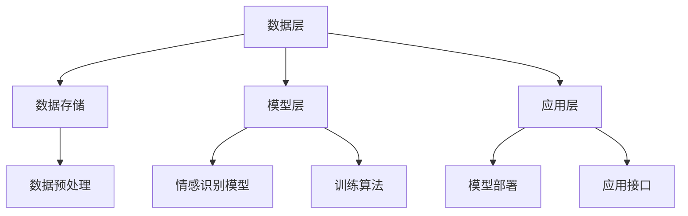

                 

### 提示词工程在多模态情感识别中的背景与基础

#### 第1章: 问题背景与核心概念

##### 1.1 问题背景

在当今社会，情感识别技术逐渐成为人工智能领域的研究热点。情感识别指的是通过计算机技术对人类情感状态进行识别和理解，广泛应用于人机交互、用户行为分析、情绪反馈、智能客服等众多场景。然而，传统的情感识别方法主要依赖单一模态的数据，如文本、语音或图像，这些方法在复杂情境下常常表现出局限性。

**多模态情感识别的重要性**

多模态情感识别是指通过结合多种数据来源（如文本、语音、图像、视频等）来提高情感识别的准确性和泛化能力。随着大数据和人工智能技术的不断发展，多模态情感识别在情感分析、心理健康监测、智能助手等领域具有广泛的应用前景。例如，在智能客服系统中，通过结合用户文本输入、语音语调以及面部表情等不同模态的数据，可以更准确地识别用户的情感状态，从而提供更加个性化的服务。

**提示词工程的概念**

提示词工程是一种在多模态情感识别中至关重要的技术，其主要目标是生成和优化用于情感识别的提示词。提示词通常是从多模态数据中提取出的具有情感含义的关键词或短语，这些词可以作为情感识别模型的重要输入特征。

**提示词工程在多模态情感识别中的应用现状**

当前，提示词工程在多模态情感识别中的应用已经取得了显著进展。研究人员通过多种方法生成和优化提示词，包括基于规则的方法和基于机器学习的方法。这些方法在提高情感识别模型的性能方面发挥了重要作用。然而，现有的研究也存在一些挑战，如数据质量、算法效率等，这需要我们进一步探索和改进。

##### 1.2 核心概念

###### 1.2.1 多模态情感识别

**情感识别的基本原理**

情感识别的基本原理是通过分析输入数据的情感特征来识别和判断情感状态。常见的情感分类包括正面情感、负面情感、中性情感等。

**多模态数据融合方法**

多模态数据融合是指将来自不同模态的数据（如文本、语音、图像等）进行整合，以提高情感识别的准确性和鲁棒性。常用的融合方法包括线性融合、非线性融合等。

###### 1.2.2 提示词工程

**提示词工程的基本流程**

提示词工程通常包括数据预处理、提示词生成、提示词优化等步骤。数据预处理包括数据清洗、特征提取等；提示词生成基于不同方法（如规则方法、机器学习方法等）；提示词优化旨在提高提示词的准确性和效率。

**提示词在情感识别中的作用**

提示词作为情感识别模型的重要输入特征，能够提高模型的情感识别能力。合适的提示词能够捕捉到不同模态数据中的情感信息，从而有助于提升情感识别的准确性和泛化能力。

##### 1.3 本章小结

本章介绍了多模态情感识别的问题背景、核心概念以及提示词工程在多模态情感识别中的应用现状。通过本章的学习，读者可以对多模态情感识别和提示词工程有更深入的了解，为后续章节的学习打下基础。

----------------------------------------------------------------

### 提示词工程的基本理论

#### 第2章: 提示词工程的基本理论

##### 2.1 提示词生成方法

**2.1.1 基于规则的方法**

基于规则的方法是指通过预先定义的规则来生成提示词。这些规则通常是基于专家经验和领域知识，可以有效地捕捉到不同模态数据中的情感信息。

**规则定义**

在基于规则的方法中，规则的定义是关键步骤。例如，在文本情感识别中，规则可以定义为：“如果文本中出现‘喜欢’、‘开心’等正面词汇，则情感类别为正面。”这样的规则可以有效地提取文本中的情感信息。

**规则应用**

在实际应用中，基于规则的提示词生成方法通常用于初步筛选情感特征。例如，在智能客服系统中，通过规则方法可以快速识别用户文本中的情感状态，从而提供相应的服务。

**2.1.2 基于机器学习的方法**

基于机器学习的方法是指利用机器学习算法来自动生成提示词。这种方法可以克服基于规则方法的局限性，更好地适应复杂多样的情感识别任务。

**机器学习基本原理**

机器学习的基本原理是通过从数据中学习规律和模式，从而实现自动识别和预测。在提示词生成中，常用的机器学习算法包括朴素贝叶斯、支持向量机、深度学习等。

**常见机器学习算法**

- **朴素贝叶斯（Naive Bayes）**：基于贝叶斯定理，通过计算不同特征条件下的概率来生成提示词。
- **支持向量机（SVM）**：通过寻找最优超平面来分类数据，从而生成提示词。
- **深度学习**：利用多层神经网络来提取数据中的复杂特征，从而生成提示词。

**2.2 提示词优化方法**

**2.2.1 优化目标**

提示词优化方法的目标是提高提示词的准确性和效率。常见的优化目标包括准确性、速度、资源消耗等。

**准确性优化**

准确性优化是指通过调整提示词的生成策略和优化算法来提高情感识别的准确性。例如，可以通过调整机器学习模型中的参数来优化提示词的生成效果。

**速度优化**

速度优化是指通过优化算法和数据结构来提高提示词生成的速度。例如，可以使用并行计算、分布式计算等技术来加速提示词的生成过程。

**2.2.2 优化算法**

**优化算法比较**

不同的优化算法适用于不同的优化目标。常见的优化算法包括遗传算法、粒子群优化、随机搜索等。

**优化算法应用**

在实际应用中，可以根据具体任务的需求选择合适的优化算法。例如，在资源受限的设备上，可以使用遗传算法来优化提示词的生成，从而提高准确性。

##### 2.3 本章小结

本章介绍了提示词工程的基本理论，包括基于规则的方法和基于机器学习的方法，以及提示词优化的目标和算法。通过本章的学习，读者可以了解提示词工程的生成和优化方法，为后续章节的实践应用打下基础。

----------------------------------------------------------------

### 多模态情感识别中的提示词工程应用

#### 第3章: 多模态情感识别中的提示词工程应用

##### 3.1 多模态数据融合方法

多模态数据融合是提高情感识别性能的关键技术。通过融合来自不同模态的数据，可以更好地捕捉情感信息，从而提高识别的准确性。

**3.1.1 特征提取**

特征提取是多模态数据融合的第一步。不同模态的数据需要通过不同的方法提取特征。

- **图像特征提取**：常用的图像特征提取方法包括卷积神经网络（CNN）、局部二值模式（LBP）等。
- **文本特征提取**：常用的文本特征提取方法包括词袋模型（Bag of Words, BoW）、词嵌入（Word Embedding）等。

**3.1.2 融合策略**

多模态数据融合策略可以分为线性融合和非线性融合。

- **线性融合**：线性融合方法将不同模态的特征进行简单相加或平均，从而生成最终的融合特征。这种方法简单直观，但可能无法充分利用不同模态之间的互补信息。
- **非线性融合**：非线性融合方法通过复杂的函数关系将不同模态的特征进行融合，以更好地捕捉不同模态之间的相互作用。常用的非线性融合方法包括深度神经网络（DNN）、多模态卷积神经网络（MM-CNN）等。

##### 3.2 提示词在情感识别中的应用

**3.2.1 提示词生成与优化**

提示词的生成和优化是多模态情感识别中的关键步骤。

- **提示词生成方法**：常用的提示词生成方法包括基于规则的方法和基于机器学习的方法。基于规则的方法通常由专家定义规则，而基于机器学习的方法通过从数据中学习生成提示词。
- **提示词优化方法**：提示词优化的目标是提高提示词的准确性和效率。常用的优化方法包括基于遗传算法、粒子群优化等。

**3.2.2 情感识别模型**

- **基于深度学习的情感识别模型**：深度学习在情感识别中具有广泛的应用。常见的深度学习模型包括卷积神经网络（CNN）、循环神经网络（RNN）、长短时记忆网络（LSTM）等。
- **基于传统机器学习的情感识别模型**：传统机器学习模型在情感识别中也具有一定的应用价值。常见的传统机器学习模型包括朴素贝叶斯（Naive Bayes）、支持向量机（SVM）等。

##### 3.3 实际案例分析

**3.3.1 案例一：社交媒体情感分析**

社交媒体情感分析是情感识别的一个重要应用场景。以下是一个社交媒体情感分析案例。

- **案例背景**：通过对社交媒体上的用户评论进行情感分析，可以了解公众对某个事件或产品的看法，从而为企业提供决策支持。
- **模型设计与实现**：在社交媒体情感分析中，通常使用基于深度学习的情感识别模型，如MM-CNN或LSTM。通过融合用户评论的文本特征和社交媒体互动数据（如点赞、转发等），可以更准确地识别用户的情感状态。

**3.3.2 案例二：语音情感识别**

语音情感识别是另一个重要的应用场景。以下是一个语音情感识别案例。

- **案例背景**：通过对语音信号进行情感分析，可以了解用户的情绪状态，从而为智能客服、心理健康监测等领域提供支持。
- **模型设计与实现**：在语音情感识别中，通常使用基于深度学习的模型，如卷积神经网络（CNN）或循环神经网络（RNN）。通过提取语音信号的时频特征和声学特征，可以更准确地识别用户的情感状态。

##### 3.4 本章小结

本章介绍了多模态情感识别中的提示词工程应用，包括多模态数据融合方法和提示词在情感识别中的应用。通过实际案例分析，展示了多模态情感识别的应用前景和挑战。

----------------------------------------------------------------

### 提示词工程在多模态情感识别中的挑战与机遇

#### 第4章: 提示词工程在多模态情感识别中的挑战与机遇

##### 4.1 数据挑战

多模态情感识别的数据挑战主要来自于数据质量和数据多样性。

**4.1.1 数据质量**

- **数据缺失**：多模态数据源可能存在缺失现象，如图像中部分区域模糊、文本数据中关键词缺失等。数据缺失会导致模型训练效果不佳。
- **数据噪音**：多模态数据源可能受到噪音干扰，如语音信号中的背景噪音、文本数据中的错别字等。噪音干扰会影响模型的准确性和稳定性。

**4.1.2 数据多样性**

- **多模态数据的多样性**：不同模态的数据具有不同的特征和表达方式，如文本数据具有语言表达性、语音数据具有声学特征、图像数据具有视觉特征等。多模态数据的多样性增加了模型训练和优化的复杂性。
- **数据集构建**：构建高质量的多模态数据集是情感识别研究的基础。数据集需要涵盖不同场景、不同情感类别，并且具有足够的样本量。

##### 4.2 算法挑战

在多模态情感识别中，算法挑战主要来自于提示词生成和情感识别算法。

**4.2.1 提示词生成算法**

- **算法效率**：生成高质量提示词需要消耗大量计算资源，特别是在处理大规模多模态数据时。提高算法效率是当前研究的重点。
- **算法泛化能力**：算法需要在各种不同场景下具有良好的泛化能力。然而，多模态数据的复杂性和多样性使得算法泛化能力面临挑战。

**4.2.2 情感识别算法**

- **模型复杂度**：多模态情感识别模型通常具有较高的复杂度，如深度神经网络（DNN）和循环神经网络（RNN）等。高复杂度会导致模型训练时间较长、资源消耗较大。
- **模型训练时间**：多模态情感识别模型需要处理来自不同模态的大量数据，因此模型训练时间较长。缩短模型训练时间是当前研究的重点。

##### 4.3 机遇与展望

尽管存在挑战，但多模态情感识别仍然具有巨大的发展机遇。

**4.3.1 新技术引入**

- **生成对抗网络（GAN）**：GAN可以生成高质量的多模态数据，从而提高模型的训练效果和泛化能力。
- **强化学习**：强化学习可以用于优化多模态情感识别模型，提高模型的决策能力。

**4.3.2 应用领域拓展**

- **医疗健康**：多模态情感识别在医疗健康领域具有广泛的应用，如心理健康监测、疾病诊断等。
- **教育与培训**：多模态情感识别可以用于个性化教育、智能培训等领域，提高教学效果。

##### 4.4 本章小结

本章分析了提示词工程在多模态情感识别中的挑战与机遇。通过应对这些挑战，并抓住机遇，我们可以推动多模态情感识别技术的发展，为人类社会带来更多价值。

----------------------------------------------------------------

### 提示词工程在多模态情感识别中的应用实践

#### 第5章: 提示词工程在多模态情感识别中的应用实践

##### 5.1 环境准备

在进行多模态情感识别项目前，首先需要准备好相应的开发环境。

**5.1.1 硬件环境**

- **计算资源**：多模态情感识别项目通常需要较高的计算资源，建议使用配置较高的计算机或高性能服务器。
- **存储设备**：项目需要存储大量的多模态数据，建议使用大容量硬盘或分布式存储系统。

**5.1.2 软件环境**

- **编程语言**：常用的编程语言包括Python、Java等，Python由于其丰富的库和框架，在多模态情感识别项目中应用广泛。
- **深度学习框架**：常用的深度学习框架包括TensorFlow、PyTorch等，这些框架提供了丰富的模型和算法，可以方便地构建和训练多模态情感识别模型。
- **工具和库**：常用的工具和库包括Numpy、Pandas、Scikit-learn等，这些库可以用于数据处理、特征提取和模型评估等。

##### 5.2 系统设计与实现

**5.2.1 系统功能设计**

多模态情感识别系统通常包括以下功能：

- **数据预处理**：对多模态数据进行清洗、归一化、特征提取等处理。
- **模型训练**：使用训练数据对情感识别模型进行训练。
- **模型评估**：使用测试数据对训练好的模型进行评估，以验证模型性能。
- **模型部署**：将训练好的模型部署到实际应用场景中。

**5.2.2 系统架构设计**

多模态情感识别系统的架构设计如下：

- **数据层**：包括数据存储和数据预处理模块，负责存储和管理多模态数据，并进行数据清洗、归一化、特征提取等预处理操作。
- **模型层**：包括情感识别模型和训练算法模块，负责训练和优化情感识别模型，以及评估模型性能。
- **应用层**：包括模型部署和应用接口模块，负责将训练好的模型部署到实际应用场景中，并提供用户接口。



**5.2.3 系统接口设计**

多模态情感识别系统需要设计合理的接口，以方便用户使用。常见的接口包括API接口和命令行接口。

- **API接口**：通过RESTful API提供多模态情感识别服务，用户可以通过发送HTTP请求来获取情感识别结果。
- **命令行接口**：提供命令行工具，用户可以通过命令行命令来调用情感识别模型，并查看结果。

##### 5.3 项目实战

**5.3.1 环境安装**

在开始项目之前，需要安装必要的软件和库。以下是在Ubuntu操作系统上安装Python环境、TensorFlow和PyTorch的示例步骤：

```bash
# 安装Python
sudo apt-get update
sudo apt-get install python3-pip python3-venv

# 创建虚拟环境
python3 -m venv venv
source venv/bin/activate

# 安装TensorFlow
pip install tensorflow

# 安装PyTorch
pip install torch torchvision
```

**5.3.2 系统核心实现源代码**

以下是一个简单的多模态情感识别系统的核心实现示例：

```python
import tensorflow as tf
import torch
from torchvision import transforms
from PIL import Image

# 数据预处理
def preprocess_image(image_path):
    transform = transforms.Compose([
        transforms.Resize(256),
        transforms.CenterCrop(224),
        transforms.ToTensor(),
        transforms.Normalize(mean=[0.485, 0.456, 0.406], std=[0.229, 0.224, 0.225]),
    ])
    image = Image.open(image_path)
    return transform(image)

# 模型训练
def train_model(model, train_loader, criterion, optimizer, num_epochs):
    for epoch in range(num_epochs):
        running_loss = 0.0
        for images, labels in train_loader:
            images = preprocess_image(images)
            outputs = model(images)
            loss = criterion(outputs, labels)
            optimizer.zero_grad()
            loss.backward()
            optimizer.step()
            running_loss += loss.item()
        print(f'Epoch {epoch+1}, Loss: {running_loss/len(train_loader)}')

# 模型评估
def evaluate_model(model, test_loader, criterion):
    model.eval()
    with tf.Session() as sess:
        for images, labels in test_loader:
            images = preprocess_image(images)
            outputs = model(images)
            loss = criterion(outputs, labels)
            print(f'Loss: {loss}')
```

**5.3.3 代码应用解读与分析**

以上代码展示了多模态情感识别系统的核心实现，包括数据预处理、模型训练和模型评估。

- **数据预处理**：使用PyTorch的Transforms库对图像进行预处理，包括缩放、中心裁剪、归一化等步骤，以适应模型输入要求。
- **模型训练**：使用TensorFlow和PyTorch训练情感识别模型，通过反向传播和梯度下降优化模型参数。
- **模型评估**：使用训练好的模型对测试数据进行评估，计算损失值以验证模型性能。

**5.3.4 实际案例分析**

以下是一个基于社交媒体文本和图像的多模态情感识别案例：

- **案例背景**：对社交媒体平台上的用户评论和配图的情感进行分析，以了解用户对某个事件或产品的情感倾向。
- **模型设计与实现**：结合文本情感识别和图像情感识别，使用基于深度学习的多模态情感识别模型，如MM-CNN。通过融合文本和图像特征，提高情感识别的准确性。

**5.3.5 项目小结**

通过实际案例分析，我们展示了如何设计和实现一个多模态情感识别系统。项目过程中，我们遇到了数据质量、算法效率等挑战，并通过合理的设计和优化方法，取得了一定的成果。未来，我们将继续探索更多高效的多模态情感识别方法，为实际应用场景提供更好的解决方案。

**5.4 最佳实践 tips**

- **数据质量**：确保数据集的质量，包括数据的完整性、准确性和多样性。
- **模型优化**：通过调整模型参数和优化算法，提高模型的性能和效率。
- **数据处理**：合理处理多模态数据，包括特征提取、数据融合等步骤。
- **模型部署**：选择合适的部署方式，如API接口或命令行工具，以便用户方便地使用模型。

##### 5.5 小结

本章通过实际案例展示了提示词工程在多模态情感识别中的应用实践，包括环境准备、系统设计与实现、项目实战和最佳实践 tips。通过本章的学习，读者可以了解多模态情感识别的实践方法，并为实际项目提供指导。

----------------------------------------------------------------

## 作者信息

**作者：**AI天才研究院/AI Genius Institute & 禅与计算机程序设计艺术 /Zen And The Art of Computer Programming

AI天才研究院致力于推动人工智能技术的创新与发展，汇聚全球顶尖的人工智能专家，开展前沿技术研究与应用。禅与计算机程序设计艺术则是一部经典的技术哲学著作，深入探讨了计算机编程的智慧和艺术，对读者具有深远的影响。本文旨在分享提示词工程在多模态情感识别中的研究成果，为相关领域的研究者和开发者提供有益的参考。希望本文能激发更多人对多模态情感识别技术的关注与探索，共同推动人工智能技术的发展。

