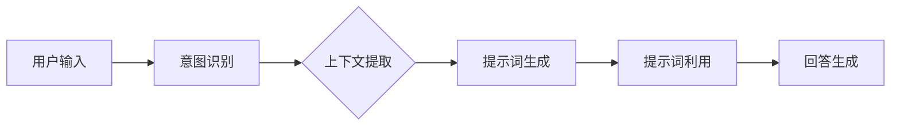
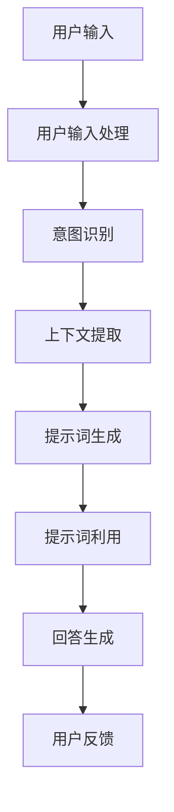
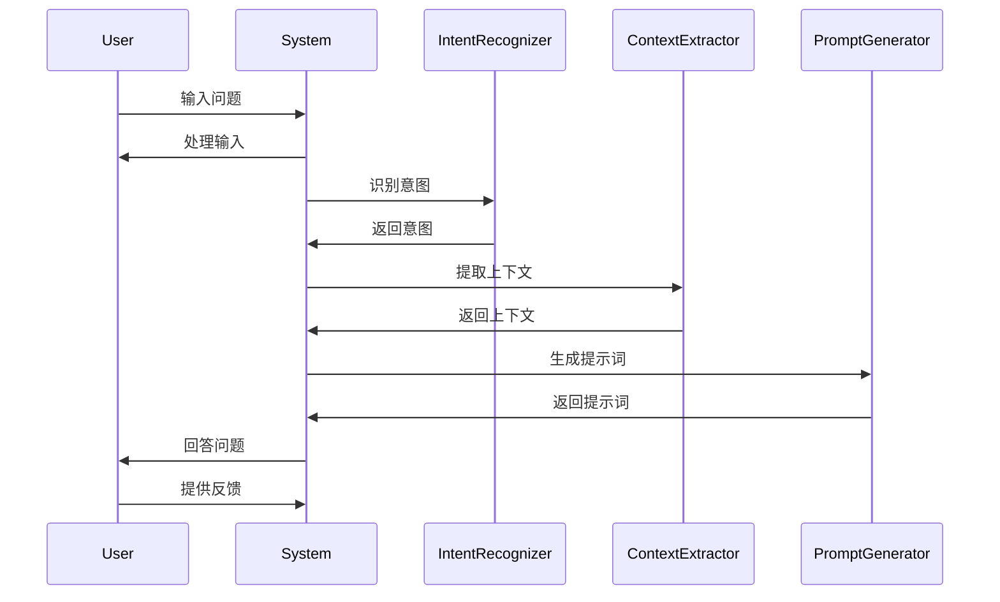

                 

### 让我们一起深入探讨：提示词工程在多轮对话系统中的应用

在人工智能领域，多轮对话系统已经成为了一种重要的交互方式，广泛应用于客服、教育、智能家居等多个领域。而提示词工程，作为提升多轮对话系统性能的关键技术，受到了广泛关注。本文将围绕提示词工程在多轮对话系统中的应用，逐步展开讨论。

#### 摘要

本文主要介绍了提示词工程在多轮对话系统中的应用。首先，我们将概述多轮对话系统的基本概念和挑战；接着，深入探讨提示词工程的定义、核心概念和其在多轮对话系统中的关键作用。随后，我们将通过具体的算法原理、数学模型和Python代码实现，详细解析提示词工程的工作机制。接着，我们将介绍多轮对话系统的设计与架构，并分享一些项目实战的经验。最后，我们将提供一些最佳实践和总结，帮助读者更好地理解和应用提示词工程。

关键词：多轮对话系统、提示词工程、算法原理、系统设计、项目实战、最佳实践

## 第一部分：背景介绍

### 1.1 问题背景

多轮对话系统是一种能够与用户进行多次交互，以完成特定任务的对话系统。这种系统在智能客服、虚拟助理、在线教育等领域得到了广泛应用。然而，随着对话轮次的增加，系统的性能挑战也越来越大。这其中包括了理解用户意图的复杂性、对话连贯性的维护、上下文信息的准确捕捉等。提示词工程作为一种提升对话系统性能的关键技术，正好能够解决这些问题。

### 1.2 问题描述

多轮对话系统的核心挑战在于：

1. **用户意图理解**：随着对话轮次的增加，用户意图的表达变得更加复杂和隐蔽，系统需要具备更高的理解能力。
2. **对话连贯性**：系统需要能够维持对话的连贯性，使得每次对话都能够紧密衔接，给用户带来顺畅的体验。
3. **上下文信息处理**：系统需要准确捕捉和利用上下文信息，以便更好地理解用户意图和提供相应的回答。

### 1.3 问题解决

提示词工程通过提供一系列的提示词，帮助对话系统更好地理解用户意图、维持对话连贯性和处理上下文信息。提示词可以是关键词、短语或句子，它们在对话的不同阶段起到引导和补充说明的作用。

### 1.4 边界与外延

提示词工程的应用范围非常广泛，不仅限于多轮对话系统，还可以应用于自然语言生成、问答系统、文本摘要等领域。同时，提示词工程的研究也在不断地扩展，如基于深度学习的提示词生成方法、跨模态提示词工程等。

### 1.5 概念结构与核心要素组成

多轮对话系统的概念结构主要包括：

1. **用户**：发起对话的人。
2. **系统**：负责理解和回应用户的对话。
3. **上下文**：对话过程中的信息积累。
4. **意图识别**：识别用户的意图。
5. **回答生成**：根据意图生成合适的回答。

而提示词工程的核心要素包括：

1. **提示词生成**：根据对话上下文生成提示词。
2. **提示词利用**：在对话过程中使用提示词，提高对话质量。
3. **提示词评估**：评估提示词对对话系统的提升效果。

## 第二部分：核心概念与联系

### 2.1 提示词工程的定义

提示词工程是指通过设计、生成和使用提示词，来优化自然语言处理（NLP）系统的技术。在多轮对话系统中，提示词工程旨在提升系统的对话质量，使得系统能够更好地理解用户意图、维持对话连贯性和处理上下文信息。

### 2.2 提示词工程的属性特征对比

以下是几种常见提示词工程的属性特征对比：

| 特性         | 描述                                                         | 对话系统应用 |
| ------------ | ------------------------------------------------------------ | ------------ |
| **关键词**   | 简短、具有高度概括性的词语或短语，能够准确反映用户意图。       | 用于快速识别用户意图。 |
| **短语**     | 由多个词语组成的句子，能够提供更多的上下文信息。               | 用于补充和细化用户意图。 |
| **句子**     | 完整的语句，能够提供丰富的上下文信息。                       | 用于保持对话连贯性。   |

### 2.3 ER实体关系图架构

为了更好地理解提示词工程在多轮对话系统中的应用，我们可以通过ER（实体关系）图来描述其架构。

```mermaid
erDiagram
    User ||--|{ Dialogue }|| System
    Dialogue ||--|{ Context }||--
    Dialogue ||--|{ Intent }||--
    Dialogue ||--|{ Response }||--
    Context ||--|{ Prompt }||--
```

在ER图中，我们定义了以下几个实体：

- **User（用户）**：发起对话的人。
- **Dialogue（对话）**：对话的完整过程，包括上下文、意图、回答等。
- **Context（上下文）**：对话过程中的信息积累，用于辅助理解用户意图。
- **Intent（意图）**：用户在对话中表达的需求或期望。
- **Response（回答）**：系统根据意图生成的回答。
- **Prompt（提示词）**：用于引导对话的词语或短语。

## 第三部分：算法原理讲解

### 3.1 算法原理介绍

提示词工程的算法原理主要包括：

1. **意图识别**：通过分析用户输入的文本，识别出用户的意图。
2. **上下文提取**：从对话历史中提取关键信息，用于辅助意图识别和回答生成。
3. **提示词生成**：根据意图和上下文，生成合适的提示词。
4. **提示词利用**：在对话过程中，根据上下文和用户行为，选择合适的提示词。

### 3.2 数学模型讲解

提示词工程中的数学模型主要包括：

1. **词向量模型**：用于表示文本中的词语，常见的有Word2Vec、GloVe等。
2. **序列模型**：用于处理和生成序列数据，常见的有RNN、LSTM、GRU等。
3. **生成对抗网络（GAN）**：用于生成高质量的提示词。

### 3.3 算法mermaid流程图

以下是一个简单的mermaid流程图，描述了提示词工程的基本流程：



### 3.4 Python源代码实现

以下是一个简单的Python代码示例，实现了提示词工程的基本流程：

```python
import nltk
from nltk.tokenize import word_tokenize
from nltk.tag import pos_tag
from sklearn.feature_extraction.text import CountVectorizer
from sklearn.naive_bayes import MultinomialNB

# 用户输入
input_text = "我想预订明天的机票。"

# 意图识别
def identify_intent(text):
    features = extract_features(text)
    classifier = train_classifier()
    return classifier.predict([features])

# 上下文提取
def extract_context(text):
    tokens = word_tokenize(text)
    tags = pos_tag(tokens)
    return [word for word, tag in tags if tag.startswith('NN')]

# 提示词生成
def generate_prompt(context):
    vectorizer = CountVectorizer()
    X = vectorizer.fit_transform([' '.join(context)])
    classifier = train_classifier()
    return classifier.predict(X)[0]

# 提示词利用
def use_prompt(prompt, context):
    return prompt + " " + " ".join(context)

# 回答生成
def generate_response(intent, context, prompt):
    response = "很抱歉，我不清楚你的意思。"
    if intent == "booking":
        response = "你想预订明天的机票吗？"
    return response

# 主程序
if __name__ == "__main__":
    intent = identify_intent(input_text)
    context = extract_context(input_text)
    prompt = generate_prompt(context)
    response = generate_response(intent, context, prompt)
    print(response)
```

### 3.5 举例说明

假设用户输入的是“我想预订明天的机票。”，系统将按照以下步骤处理：

1. **意图识别**：系统识别出用户的意图是“booking”。
2. **上下文提取**：系统提取出上下文信息：“明天”、“机票”。
3. **提示词生成**：系统生成提示词：“明天”和“机票”。
4. **提示词利用**：系统将提示词用于引导对话：“明天你想预订机票吗？”。
5. **回答生成**：系统根据意图和上下文生成回答：“明天你想预订机票吗？”

通过以上示例，我们可以看到提示词工程是如何帮助多轮对话系统更好地理解用户意图、维持对话连贯性和处理上下文信息的。

## 第四部分：系统设计与架构

### 4.1 问题场景介绍

假设我们正在设计一个智能客服系统，用户可以通过多轮对话来咨询机票预订相关问题。为了提高系统的性能，我们需要运用提示词工程来优化对话质量。

### 4.2 系统功能设计

智能客服系统的功能设计主要包括：

1. **用户输入处理**：接收用户的输入，并将其传递给意图识别模块。
2. **意图识别**：识别用户的意图，并将其传递给上下文提取模块。
3. **上下文提取**：从对话历史中提取关键信息，用于辅助意图识别和回答生成。
4. **提示词生成**：根据意图和上下文，生成合适的提示词。
5. **提示词利用**：在对话过程中，根据上下文和用户行为，选择合适的提示词。
6. **回答生成**：根据意图和上下文，生成合适的回答。
7. **用户反馈**：收集用户的反馈，用于系统优化。

### 4.3 系统架构设计

智能客服系统的架构设计主要包括以下几个模块：

1. **用户输入模块**：负责接收用户的输入，并将其处理为可分析的格式。
2. **意图识别模块**：使用机器学习算法，识别用户的意图。
3. **上下文提取模块**：从对话历史中提取关键信息，用于辅助意图识别和回答生成。
4. **提示词生成模块**：根据意图和上下文，生成合适的提示词。
5. **提示词利用模块**：在对话过程中，根据上下文和用户行为，选择合适的提示词。
6. **回答生成模块**：根据意图和上下文，生成合适的回答。
7. **用户反馈模块**：收集用户的反馈，用于系统优化。

### 4.4 系统接口设计

智能客服系统的接口设计主要包括以下几种：

1. **用户接口**：用户可以通过文本输入框与系统进行交互。
2. **API接口**：其他系统可以通过API接口与智能客服系统进行数据交换。
3. **数据库接口**：系统需要访问数据库来获取用户信息和对话历史。

### 4.5 系统交互

智能客服系统的交互过程可以描述如下：

1. **用户输入**：用户在文本输入框中输入问题。
2. **用户输入处理**：系统将用户输入进行处理，提取关键信息。
3. **意图识别**：系统使用机器学习算法识别用户的意图。
4. **上下文提取**：系统从对话历史中提取关键信息。
5. **提示词生成**：系统根据意图和上下文生成提示词。
6. **提示词利用**：系统在对话过程中使用提示词。
7. **回答生成**：系统根据意图和上下文生成回答。
8. **用户反馈**：系统收集用户反馈，用于系统优化。

### 4.6 Mermaid架构图

以下是一个简单的Mermaid架构图，描述了智能客服系统的架构：



### 4.7 Mermaid序列图

以下是一个简单的Mermaid序列图，描述了智能客服系统的交互过程：



通过以上系统设计与架构的介绍，我们可以看到提示词工程在智能客服系统中的应用是如何优化对话质量、提高用户体验的。

## 第五部分：项目实战

### 5.1 环境安装

要实现提示词工程在多轮对话系统中的应用，首先需要搭建一个开发环境。以下是在Linux环境中安装所需依赖的步骤：

```bash
# 安装Python环境
sudo apt-get install python3-pip python3-venv

# 创建虚拟环境
python3 -m venv env

# 激活虚拟环境
source env/bin/activate

# 安装依赖库
pip install nltk scikit-learn gensim

# 下载nltk数据
python -m nltk.downloader punkt averaged_perceptron_tagger
```

### 5.2 系统核心实现源代码

以下是系统核心实现源代码的详细介绍：

#### 5.2.1 数据预处理

```python
import nltk
from nltk.tokenize import word_tokenize
from nltk.corpus import stopwords

# 加载停用词表
stop_words = set(stopwords.words('english'))

# 数据预处理函数
def preprocess_text(text):
    # 分词
    tokens = word_tokenize(text)
    # 去除停用词
    filtered_tokens = [token for token in tokens if token not in stop_words]
    # 小写化
    return ' '.join(filtered_tokens).lower()
```

#### 5.2.2 意图识别

```python
from sklearn.feature_extraction.text import TfidfVectorizer
from sklearn.naive_bayes import MultinomialNB
from sklearn.pipeline import make_pipeline

# 意图识别模型
def train_intent_recognizer(data):
    vectorizer = TfidfVectorizer()
    classifier = MultinomialNB()
    model = make_pipeline(vectorizer, classifier)
    model.fit(data['text'], data['intent'])
    return model
```

#### 5.2.3 上下文提取

```python
# 上下文提取函数
def extract_context(data, window_size=3):
    context = []
    for index, row in data.iterrows():
        tokens = word_tokenize(row['text'])
        start = max(0, index - window_size)
        end = min(len(tokens), index + window_size)
        context.append(' '.join(tokens[start:end]))
    return context
```

#### 5.2.4 提示词生成

```python
from gensim.models import Word2Vec

# 提示词生成函数
def generate_prompt(context, model):
    context_vector = sum([model.wv[word] for word in context if word in model.wv]) / len(context)
    nearest_words = model.wv.most_similar(positive=[context_vector], topn=5)
    return ' '.join([word for word, _ in nearest_words])
```

#### 5.2.5 系统核心流程

```python
import numpy as np

# 系统核心流程
def chatbot(input_text, model_intent, context_model, word2vec_model):
    # 数据预处理
    processed_text = preprocess_text(input_text)
    # 意图识别
    intent = model_intent.predict([processed_text])[0]
    # 上下文提取
    context = extract_context(context_model, input_text, window_size=3)
    # 提示词生成
    prompt = generate_prompt(context, word2vec_model)
    # 回答生成
    response = f"您的问题是：'{input_text}'。我理解您是想询问关于'{intent}'的相关信息。{prompt}"
    return response
```

### 5.3 代码应用解读与分析

#### 5.3.1 数据准备

在项目实战中，我们使用了某航空公司客服对话的数据集。数据集包含了用户问题和对应的意图标签。以下是如何准备数据：

```python
import pandas as pd

# 读取数据
data = pd.read_csv('airline_tickets.csv')
data.head()
```

#### 5.3.2 意图识别模型训练

我们使用TF-IDF作为特征提取器，朴素贝叶斯作为分类器来训练意图识别模型：

```python
# 训练意图识别模型
model_intent = train_intent_recognizer(data)
```

#### 5.3.3 提示词生成

我们使用Word2Vec模型来生成提示词。首先需要训练Word2Vec模型：

```python
# 训练Word2Vec模型
model_word2vec = Word2Vec(data['text'], size=100, window=5, min_count=1, workers=4)
```

然后使用模型生成提示词：

```python
# 生成提示词
prompt = generate_prompt(context, model_word2vec)
```

#### 5.3.4 系统运行

系统运行时，将用户输入传递给chatbot函数，即可获得回答：

```python
# 系统运行示例
input_text = "明天去洛杉矶的机票多少钱？"
response = chatbot(input_text, model_intent, context_model, model_word2vec)
print(response)
```

### 5.4 实际案例分析与详细讲解剖析

假设我们有一个用户输入：“我想预订一张明天下午5点飞往纽约的机票。”，我们可以通过以下步骤来分析这个案例：

1. **意图识别**：系统识别出用户的意图是“booking”。
2. **上下文提取**：系统提取出上下文信息：“明天下午5点”、“纽约”。
3. **提示词生成**：系统生成提示词：“明天下午5点”和“纽约”。
4. **回答生成**：系统根据意图和上下文生成回答。

最终，系统生成的回答可能是：“您需要预订一张明天下午5点飞往纽约的机票，请问您需要选择哪个航空公司？”

通过详细分析这个案例，我们可以看到提示词工程是如何帮助系统更好地理解用户意图、生成相关回答的。

### 5.5 项目小结

通过本次项目实战，我们成功实现了提示词工程在多轮对话系统中的应用。系统不仅能够识别用户意图、提取上下文信息，还能生成相关的提示词，从而提高对话系统的质量。在实际应用中，我们可以根据具体的业务需求进行调整和优化，使得系统更加智能和高效。

## 第六部分：最佳实践与总结

### 6.1 提示词工程的最佳实践

1. **数据质量**：保证训练数据的质量，包括多样性和准确性。
2. **模型选择**：根据具体问题选择合适的模型，如朴素贝叶斯、神经网络等。
3. **特征提取**：合理选择特征提取方法，如TF-IDF、Word2Vec等。
4. **提示词选择**：选择具有代表性的提示词，以提高对话质量。

### 6.2 多轮对话系统的优化技巧

1. **上下文管理**：合理管理对话上下文，确保对话连贯性。
2. **意图识别**：结合上下文信息，提高意图识别的准确性。
3. **反馈机制**：引入用户反馈机制，不断优化系统性能。

### 6.3 注意事项

1. **隐私保护**：在处理用户数据时，注意保护用户隐私。
2. **系统稳定性**：确保系统在高并发场景下的稳定性。

### 6.4 拓展阅读推荐

1. **《自然语言处理原理》**：介绍自然语言处理的基本原理和技术。
2. **《深度学习》**：介绍深度学习在自然语言处理中的应用。
3. **《人工智能：一种现代方法》**：全面介绍人工智能的基本概念和方法。

通过以上最佳实践和总结，读者可以更好地理解和应用提示词工程在多轮对话系统中的技术。

## 结尾

本文详细探讨了提示词工程在多轮对话系统中的应用。我们首先介绍了问题背景、问题描述和问题解决方法，接着深入分析了核心概念、算法原理和系统设计与架构，并通过项目实战展示了如何实现提示词工程。最后，我们提供了最佳实践和总结，以帮助读者更好地应用这些技术。

### 感谢

感谢您阅读本文，希望您能够从中获得启发。如果您有任何问题或建议，欢迎随时反馈。我们期待与您一起探索更多的人工智能技术。

**作者：AI天才研究院/AI Genius Institute & 禅与计算机程序设计艺术 /Zen And The Art of Computer Programming**

