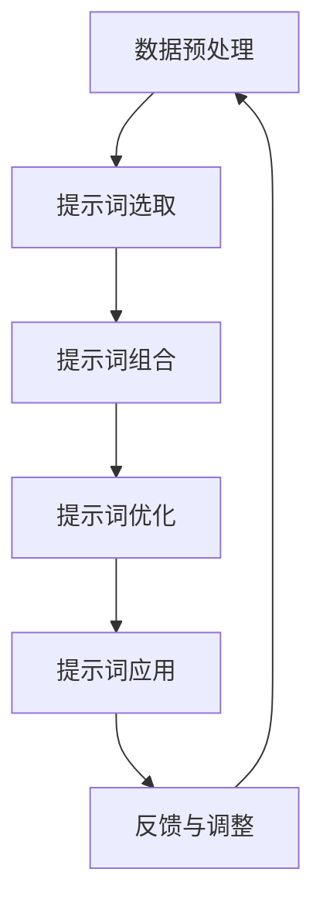
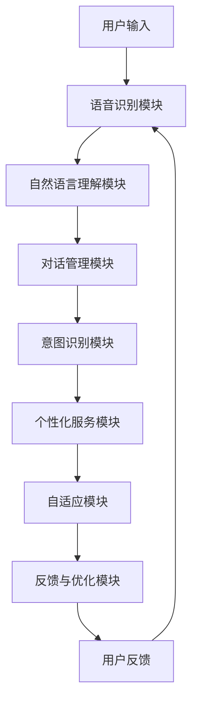

                 

### 第1章 引言

#### 1.1 问题背景

多轮对话系统，作为一种人工智能领域的重要应用，近年来得到了广泛关注。这类系统通过模拟人类的交流方式，与用户进行多轮对话，提供个性化的服务。然而，在实际应用中，多轮对话系统面临着诸多挑战。首先，用户的需求多样且复杂，如何准确理解并回应用户的问题是系统面临的首要难题。其次，对话的连贯性和自然性也是系统需要解决的关键问题。此外，多轮对话系统在处理多话题切换、上下文保持等方面也表现出一定的局限性。

为了应对这些挑战，提示词工程成为了一个重要的研究方向。提示词工程通过预定义一组关键词或短语，引导对话的进行，提高对话系统的响应准确性和连贯性。提示词的选择和组合对对话的顺利进行起着至关重要的作用。通过合理设计提示词，系统可以更好地理解用户意图，提供更加精准的服务。

本书的目的在于深入探讨提示词工程在多轮对话系统中的应用，分析其核心概念、算法原理以及实际应用中的设计思路和实施方法。我们希望通过系统的讲解，让读者全面了解提示词工程，掌握其在多轮对话系统中的突破性应用，为实际项目开发提供有力的理论支持和实践指导。

#### 1.2 核心概念

在本章节中，我们将介绍多轮对话系统和提示词工程这两个核心概念。

**多轮对话系统**：多轮对话系统是一种能够与用户进行多轮交流的人工智能系统。与单轮对话系统（如简单的客服机器人）不同，多轮对话系统能够通过多个回合的交互，逐步理解用户的需求和意图，提供更加个性化和深入的服务。多轮对话系统通常包括语音识别、自然语言理解、对话管理、语音合成等多个模块，通过这些模块的协同工作，实现与用户的自然交流。

**提示词工程**：提示词工程是指导引入一组关键词或短语，引导对话进行的工程。在多轮对话系统中，提示词起着至关重要的作用。通过合理选择和组合提示词，系统能够更好地理解用户的意图，保持对话的连贯性，并有效地引导对话走向。提示词工程包括提示词的选取、组合、优化等多个环节，每个环节都对对话的质量有着重要影响。

#### 1.2.1 多轮对话系统概述

多轮对话系统的发展可以追溯到上世纪80年代，当时的研究主要集中在如何通过计算机程序模拟人类的对话过程。随着自然语言处理、机器学习等技术的不断发展，多轮对话系统逐渐从理论研究走向实际应用。当前，多轮对话系统已经广泛应用于客服、教育、医疗等多个领域，成为智能化服务的重要组成部分。

多轮对话系统的核心挑战在于如何有效地理解用户的意图和上下文信息，并提供连贯、自然的对话体验。为了实现这一目标，多轮对话系统需要结合多种技术，如语音识别、自然语言理解、对话管理等。其中，语音识别技术负责将用户的语音输入转换为文本，自然语言理解技术负责解析文本，提取出用户的需求和意图，对话管理技术则负责协调各个模块的工作，确保对话的连贯性和自然性。

#### 1.2.2 提示词工程概述

提示词工程作为多轮对话系统的重要组成部分，其核心目的是通过引入一组关键词或短语，引导对话的进行，提高对话的准确性和连贯性。提示词的选择和组合对于对话的质量有着决定性的影响。合理设计的提示词能够帮助系统更好地理解用户的意图，保持对话的连贯性，并有效地引导对话走向。

提示词工程包括以下几个关键环节：

1. **提示词选取**：这是提示词工程的第一步，也是最重要的一步。选取合适的提示词能够有效地引导对话，提高系统的响应准确性。通常，提示词选取需要考虑用户的需求、对话的主题以及上下文信息等多个因素。

2. **提示词组合**：在选取出合适的提示词后，需要考虑如何将这些提示词进行组合，以形成有效的引导词。提示词组合的技巧和策略对于对话的质量有着重要影响。

3. **提示词优化**：提示词的优化是提示词工程的持续过程。通过对对话数据的分析，可以发现一些问题和不完善的提示词，并进行针对性的优化，以提高对话的质量和用户体验。

#### 1.2.3 提示词工程的关键环节

提示词工程在多轮对话系统中起着至关重要的作用。下面，我们将详细探讨提示词工程的关键环节。

1. **需求分析**：在开始设计提示词之前，首先需要明确系统的目标和用户需求。通过需求分析，可以确定哪些话题和场景需要提示词的引导，从而有针对性地设计提示词。

2. **提示词选取**：这是提示词工程的核心环节。根据需求分析的结果，选择能够引导对话的关键词或短语。选取的提示词应该具有明确的意义和广泛的适用性，以便在不同场景下都能发挥引导作用。

3. **提示词组合**：在选取出合适的提示词后，需要考虑如何将这些提示词进行组合，以形成有效的引导词。提示词组合的技巧和策略对于对话的质量有着重要影响。

4. **提示词优化**：提示词的优化是提示词工程的持续过程。通过对对话数据的分析，可以发现一些问题和不完善的提示词，并进行针对性的优化，以提高对话的质量和用户体验。

#### 1.2.4 提示词工程在多轮对话系统中的角色

提示词工程在多轮对话系统中扮演着多重角色，具体如下：

1. **引导对话**：通过引入一组关键词或短语，提示词工程能够引导对话的进行，确保对话围绕关键话题展开。

2. **提高准确性**：合理设计的提示词能够帮助系统更好地理解用户的意图，提高对话的准确性。

3. **保持连贯性**：提示词工程能够通过组合和优化提示词，保持对话的连贯性，避免话题跳跃和不连贯的现象。

4. **提升用户体验**：通过引导对话、提高准确性和保持连贯性，提示词工程能够提升用户的对话体验，增强系统的用户友好度。

### 第2章 提示词工程核心概念与联系

#### 2.1 提示词工程的定义

提示词工程是一种通过预定义关键词或短语来引导对话进行的工程方法。在多轮对话系统中，提示词工程扮演着至关重要的角色，它旨在通过合理设计提示词，提高对话的准确性和连贯性。提示词工程的核心目标是通过引导对话，使系统能够更好地理解用户的意图，并提供更加个性化和自然的交流体验。

定义提示词工程时，需要明确以下几个关键点：

1. **关键词或短语**：提示词工程的基础是关键词或短语的选取。这些关键词或短语需要具备明确的意义和广泛的适用性，以便在不同场景下都能发挥引导作用。

2. **预定义**：提示词工程中的提示词是预先定义好的，而不是在对话过程中动态生成的。这种预定义的特点使得提示词工程能够更好地指导对话的进行，确保对话的连贯性和一致性。

3. **引导对话**：提示词工程的目标是通过提示词的引导，使对话能够围绕关键话题展开，提高对话的准确性和连贯性。

4. **多轮对话系统**：提示词工程通常应用于多轮对话系统中，这种系统需要通过多轮交互来逐步理解用户的意图和需求，从而提供更加个性化的服务。

#### 2.1.1 提示词工程的属性特征

提示词工程具有以下几个显著的属性特征：

1. **灵活性**：提示词工程可以根据不同的应用场景和用户需求，灵活选择和组合提示词。这种灵活性使得提示词工程能够适应各种复杂的对话场景。

2. **动态性**：尽管提示词是预定义的，但在实际对话中，系统可以根据对话的进展和用户的反馈，动态调整提示词的使用策略。这种动态性使得提示词工程能够更好地适应对话的动态变化。

3. **准确性**：合理设计的提示词能够提高对话的准确性，帮助系统更好地理解用户的意图。准确性是提示词工程的核心目标之一。

4. **连贯性**：通过合理设计提示词，提示词工程能够保持对话的连贯性，避免话题跳跃和不连贯的现象，提供更加流畅的对话体验。

5. **可扩展性**：提示词工程的设计应考虑到系统的可扩展性，使得提示词能够方便地添加、删除或修改，以适应未来可能的需求变化。

#### 2.2 提示词工程与其他概念的联系

提示词工程在多轮对话系统中与其他概念有着密切的联系，以下是几个关键概念的对比和联系：

1. **自然语言处理（NLP）**：自然语言处理是人工智能的一个重要分支，旨在使计算机能够理解、生成和处理人类语言。提示词工程依赖于自然语言处理技术，如词性标注、命名实体识别等，以提取和解析对话中的关键词和短语。

2. **机器学习（ML）**：机器学习是训练计算机模型通过数据学习模式和规律的技术。提示词工程中，机器学习算法被用来从大量对话数据中学习有效的提示词，以提高对话系统的性能。

3. **对话系统**：对话系统是一种能够与用户进行交互的人工智能系统。提示词工程是对话系统中的一个关键组成部分，通过引入提示词，提高对话的准确性和连贯性。

4. **上下文保持**：上下文保持是确保对话系统能够在多轮对话中保持对话的上下文信息。提示词工程通过设计合理的提示词，有助于系统在对话中更好地保持上下文信息。

5. **意图识别**：意图识别是识别用户对话中的意图和需求。提示词工程通过预定义提示词，有助于系统更准确地识别用户的意图，并提供更恰当的响应。

#### 2.2.1 与自然语言处理的关系

提示词工程与自然语言处理（NLP）有着密切的关系。NLP是人工智能领域的一个重要分支，它使计算机能够理解、生成和处理人类语言。在多轮对话系统中，NLP技术被广泛应用于对话的解析和处理。以下是提示词工程与NLP的几个关键联系：

1. **文本解析**：NLP技术能够对用户输入的文本进行解析，识别出文本中的关键词、短语和句子结构。这些解析结果为提示词工程提供了重要的输入，提示词工程可以根据这些解析结果选择和组合合适的提示词。

2. **语义理解**：NLP技术通过语义理解，能够理解文本中的语义和含义。提示词工程利用这一能力，可以更准确地识别用户的意图和需求，从而设计出更有效的提示词。

3. **上下文信息**：NLP技术能够提取文本中的上下文信息，如时间、地点、人物等。这些上下文信息对于提示词工程至关重要，因为它们能够帮助系统在对话中更好地保持上下文连贯性。

4. **词性标注**：NLP技术中的词性标注可以帮助识别文本中的名词、动词、形容词等，这些信息对于提示词工程的选择和组合也具有重要价值。

5. **命名实体识别**：NLP技术中的命名实体识别能够识别文本中的人名、地名、组织名等实体信息。这些实体信息对于提示词工程在特定领域的应用具有重要意义。

#### 2.2.2 与机器学习的关系

机器学习是人工智能的一个重要分支，它通过训练模型从数据中学习规律和模式。提示词工程与机器学习有着密切的关系，主要体现在以下几个方面：

1. **模型训练**：提示词工程需要大量的对话数据来训练模型，以便能够自动生成和选择合适的提示词。机器学习技术在这一过程中发挥着关键作用，通过算法和模型，系统能够从对话数据中学习出有效的提示词模式。

2. **特征提取**：在机器学习中，特征提取是一个重要的步骤。提示词工程同样需要从对话数据中提取出关键特征，如关键词、短语、上下文信息等，以便更好地进行提示词的选择和组合。

3. **模型优化**：机器学习模型需要不断优化，以提高预测和分类的准确性。提示词工程同样需要通过优化模型，提高提示词的选择和组合效果，从而提高对话系统的性能。

4. **反馈循环**：机器学习中的反馈循环是一个重要的环节，通过用户的反馈，系统能够不断调整和优化模型，提高提示词的质量和对话的准确性。提示词工程也利用这一机制，通过用户反馈来优化提示词设计。

#### 2.2.3 与对话系统的联系

提示词工程在对话系统中起着至关重要的作用，它是实现高质量对话的关键因素之一。以下是提示词工程与对话系统的几个关键联系：

1. **对话管理**：对话管理是确保对话系统能够在不同轮次和场景下保持连贯性和一致性的关键。提示词工程通过设计合理的提示词，可以帮助对话管理系统更好地理解用户意图，确保对话的连贯性和一致性。

2. **上下文保持**：在多轮对话中，保持上下文信息是至关重要的。提示词工程通过引入预定义的提示词，可以有效地帮助系统在对话中保持上下文信息，避免话题跳跃和不连贯的现象。

3. **意图识别**：意图识别是识别用户对话中的意图和需求。提示词工程通过设计合理的提示词，可以提供更多的上下文信息，帮助系统更准确地识别用户的意图。

4. **交互体验**：提示词工程直接影响用户的交互体验。通过合理设计提示词，系统可以提供更加自然、流畅和个性化的对话体验，从而提升用户的满意度。

5. **个性化服务**：在多轮对话中，个性化服务是用户期望的重要方面。提示词工程通过设计多样化的提示词，可以更好地满足用户的个性化需求，提供更加精准和个性化的服务。

### 第3章 提示词工程的算法原理

提示词工程的算法原理是设计、实现和优化多轮对话系统中提示词的关键。通过合理设计的提示词，系统能够更好地理解用户意图，提供连贯、自然的对话体验。本章节将详细介绍提示词工程的算法原理，包括算法的基本流程、Python代码实现和数学模型。

#### 3.1 算法概述

提示词工程的算法原理主要包括以下几个步骤：

1. **数据预处理**：首先，对输入的对话文本进行预处理，包括去除噪声、分词、词性标注等，提取出关键信息。

2. **提示词选取**：根据预处理后的文本，选取能够引导对话的关键词或短语。选取提示词的依据可以是词频、词性、上下文信息等。

3. **提示词组合**：将选出的提示词进行组合，形成有效的引导词。提示词组合的策略可以根据对话系统的需求和特点进行定制。

4. **提示词优化**：通过对对话数据的分析，发现不完善的提示词并进行优化。优化策略可以包括提示词替换、组合调整等。

5. **提示词应用**：将优化后的提示词应用到对话系统中，引导对话的进行，提高对话的准确性和连贯性。

#### 3.2 Mermaid流程图展示

为了更好地理解提示词工程的算法原理，我们可以使用Mermaid语言绘制一个流程图。以下是一个简化的流程图示例：



在这个流程图中，每个节点表示一个步骤，箭头表示步骤之间的依赖关系。通过这个流程图，我们可以直观地看到提示词工程的基本流程和各个环节之间的联系。

#### 3.3 Python代码实现

下面是一个简化的Python代码示例，展示了如何实现提示词工程的核心步骤：

```python
import nltk
from nltk.tokenize import word_tokenize
from nltk.corpus import stopwords
from collections import defaultdict

# 数据预处理
def preprocess_text(text):
    tokens = word_tokenize(text.lower())
    tokens = [token for token in tokens if token not in stopwords.words('english')]
    return tokens

# 提示词选取
def select_keywords(tokens):
    freq_dict = defaultdict(int)
    for token in tokens:
        freq_dict[token] += 1
    keywords = [token for token, freq in freq_dict.items() if freq > 5]
    return keywords

# 提示词组合
def combine_keywords(keywords):
    return ' '.join(keywords)

# 提示词优化
def optimize_phrases(phrase):
    # 这里可以加入更复杂的优化策略
    return phrase

# 主函数
def generate_prompt(text):
    tokens = preprocess_text(text)
    keywords = select_keywords(tokens)
    phrase = combine_keywords(keywords)
    optimized_phrase = optimize_phrases(phrase)
    return optimized_phrase

# 示例
text = "I want to book a flight to New York next week."
prompt = generate_prompt(text)
print(prompt)
```

这个代码示例中，我们首先对输入文本进行预处理，去除标点符号和停用词，然后选取出现频率较高的关键词，再将这些关键词组合成提示词。最后，通过优化函数，可以对提示词进行进一步调整。这个示例虽然简化，但涵盖了提示词工程的基本步骤。

#### 3.4 数学模型与公式

在提示词工程中，数学模型和公式用于描述和优化提示词的选择和组合。以下是一个简化的数学模型：

1. **关键词选择**：
   $$ K = \{k_1, k_2, ..., k_n\} $$
   其中，$K$ 是关键词集合，$k_i$ 是第 $i$ 个关键词。

2. **关键词频率**：
   $$ f(k_i) = \text{出现次数}_{k_i} $$
   其中，$f(k_i)$ 表示关键词 $k_i$ 的出现频率。

3. **提示词组合**：
   $$ P = \text{Combine}(K) $$
   其中，$P$ 是组合后的提示词。

4. **提示词优化**：
   $$ O(P) = \text{Optimize}(P) $$
   其中，$O(P)$ 表示对提示词 $P$ 的优化。

通过这些数学模型和公式，我们可以定量地描述和优化提示词工程的过程。

#### 3.5 算法实例讲解

为了更直观地理解提示词工程的算法原理，我们可以通过一个简单的实例进行讲解。

**实例1：简单提示词生成**

输入文本：`I want to book a flight to New York next week.`

步骤1：数据预处理
- 输入文本：`I want to book a flight to New York next week.`
- 预处理后：`['I', 'want', 'to', 'book', 'a', 'flight', 'to', 'New', 'York', 'next', 'week']`

步骤2：提示词选取
- 关键词：`['book', 'flight', 'New', 'York', 'week']`

步骤3：提示词组合
- 提示词：`'book flight to New York next week'`

步骤4：提示词优化
- 优化后提示词：`'book your flight to New York for next week'`

**实例2：复杂提示词工程**

输入文本：`Can you help me find a hotel near Times Square in New York?`

步骤1：数据预处理
- 输入文本：`Can you help me find a hotel near Times Square in New York?`
- 预处理后：`['Can', 'you', 'help', 'me', 'find', 'a', 'hotel', 'near', 'Times', 'Square', 'in', 'New', 'York']`

步骤2：提示词选取
- 关键词：`['help', 'find', 'hotel', 'near', 'Times', 'Square', 'New', 'York']`

步骤3：提示词组合
- 提示词：`'help find a hotel near Times Square in New York'`

步骤4：提示词优化
- 优化后提示词：`'Can I assist you in finding a hotel near Times Square in New York?'`

通过这两个实例，我们可以看到提示词工程在处理简单和复杂对话时的具体操作过程。合理设计的提示词能够有效提高对话的准确性和连贯性。

### 第4章 系统分析与架构设计

#### 4.1 问题场景介绍

多轮对话系统在智能化服务中的应用越来越广泛，尤其在客服、智能助手、在线教育等领域，其重要性不言而喻。然而，在实际应用中，多轮对话系统面临着诸多挑战，如如何高效地处理用户需求、如何保证对话的连贯性和自然性、以及如何适应多变的话题和场景等。这些挑战使得系统分析与架构设计成为多轮对话系统开发中至关重要的环节。

本章节将围绕一个实际应用场景，介绍多轮对话系统的需求和设计思路。我们将详细分析系统功能、模块划分、架构设计和接口设计，以期为读者提供一个全面、系统的多轮对话系统解决方案。

#### 4.2 对话系统需求分析

在设计和实现多轮对话系统之前，首先需要对系统的需求进行深入分析。多轮对话系统的核心需求可以概括为以下几点：

1. **自然语言理解**：系统能够准确理解用户的语言输入，提取出关键信息和意图。

2. **对话管理**：系统能够在多轮对话中保持上下文信息，引导对话顺利进行。

3. **意图识别**：系统能够识别用户的意图，并提供相应的响应。

4. **个性化服务**：系统能够根据用户的历史数据和偏好，提供个性化的服务和建议。

5. **自适应能力**：系统能够适应不同的话题和场景，灵活调整对话策略。

6. **高可用性**：系统需要具备高可用性，确保在高峰期能够稳定运行，不出现故障。

7. **可扩展性**：系统设计应考虑未来可能的需求变化，具备良好的扩展性。

#### 4.3 系统功能设计

基于上述需求分析，我们可以将多轮对话系统的功能划分为以下几个主要模块：

1. **语音识别模块**：负责将用户的语音输入转换为文本，为后续处理提供基础。

2. **自然语言理解模块**：负责解析文本，提取出用户的需求和意图。

3. **对话管理模块**：负责协调各个模块的工作，确保对话的连贯性和一致性。

4. **意图识别模块**：负责识别用户的意图，并生成相应的响应。

5. **个性化服务模块**：负责根据用户的历史数据和偏好，提供个性化的服务。

6. **自适应模块**：负责根据对话的进展和用户的行为，动态调整对话策略。

7. **反馈与优化模块**：负责收集用户的反馈，对系统进行持续优化。

#### 4.4 系统架构设计

为了满足上述功能需求，多轮对话系统的架构设计需要具备以下几个关键要素：

1. **模块化设计**：将系统划分为多个功能模块，每个模块负责特定的功能，便于开发和维护。

2. **分布式部署**：考虑到系统的可扩展性和高可用性，采用分布式部署方式，将各个模块部署在不同的服务器上，以实现负载均衡和故障转移。

3. **数据驱动**：系统设计应采用数据驱动的方式，充分利用用户数据和对话数据，优化系统的性能和用户体验。

4. **服务化架构**：将系统功能封装为微服务，便于系统的扩展和集成。

5. **自动化部署与监控**：采用自动化部署和监控工具，确保系统的稳定运行和快速响应。

以下是一个简化的系统架构图，展示了多轮对话系统的模块划分和架构设计：



在这个架构图中，用户输入首先经过语音识别模块转换为文本，然后由自然语言理解模块进行解析。对话管理模块负责协调各个模块的工作，意图识别模块根据解析结果识别用户意图，并生成相应响应。个性化服务模块和自适应模块则根据用户数据和对话数据提供个性化的服务和自适应调整。反馈与优化模块负责收集用户反馈，对系统进行持续优化。

#### 4.5 系统接口设计

为了实现各个模块之间的协同工作，系统需要设计一系列接口。以下是一个简化的接口设计：

1. **用户输入接口**：负责接收用户的语音或文本输入。

2. **语音识别接口**：将用户的语音输入转换为文本，提供文本输入接口。

3. **自然语言理解接口**：接收文本输入，解析出关键信息和意图。

4. **对话管理接口**：协调各个模块的工作，提供对话管理和控制功能。

5. **意图识别接口**：根据解析结果，识别用户的意图，并提供意图结果。

6. **个性化服务接口**：提供个性化服务和推荐功能。

7. **自适应接口**：根据对话数据，动态调整对话策略。

8. **反馈与优化接口**：收集用户反馈，提供系统优化建议。

通过这些接口，各个模块能够高效地协同工作，实现多轮对话系统的功能。

#### 4.6 系统交互流程

为了确保多轮对话系统能够高效、顺畅地运行，我们需要设计一个清晰的系统交互流程。以下是一个简化的交互流程：

1. **用户输入**：用户通过语音或文本方式输入问题或请求。

2. **语音识别**：系统接收用户输入，通过语音识别模块将语音转换为文本。

3. **自然语言理解**：系统对文本进行自然语言理解，提取出关键信息和意图。

4. **对话管理**：系统根据提取的信息，进行对话管理和控制，确保对话的连贯性和一致性。

5. **意图识别**：系统根据对话管理模块的反馈，识别用户的意图，并生成响应。

6. **响应生成**：系统根据意图识别结果，生成相应的响应文本或语音。

7. **响应输出**：系统将生成的响应输出给用户。

8. **用户反馈**：用户对系统的响应进行反馈，系统根据反馈进行优化和调整。

9. **循环迭代**：系统持续收集用户输入和反馈，进行迭代优化，以提高对话质量和用户体验。

以下是一个简化的Mermaid序列图，展示了多轮对话系统的交互流程：

```mermaid
sequenceDiagram
    participant 用户
    participant 系统A
    participant 系统B
    participant 系统C
    participant 系统D
    participant 系统E
    participant 系统F
    participant 系统G

    用户->>系统A: 输入语音或文本
    系统A->>系统B: 语音识别
    系统
```


### 第5章 项目实战

#### 5.1 环境安装

为了实现多轮对话系统，我们需要搭建一个合适的环境。以下是一个简化的环境安装流程：

1. **安装Python**：首先确保系统安装了Python，推荐使用Python 3.8或更高版本。可以从Python官方网站下载安装包，并按照提示安装。

2. **安装依赖库**：使用pip命令安装必要的依赖库，如nltk、tensorflow、transformers等。以下是一个示例命令：

   ```bash
   pip install nltk tensorflow transformers
   ```

3. **配置环境变量**：确保Python环境变量已配置，以便在命令行中能够顺利调用Python和相关库。

4. **安装语音识别库**：如果需要使用语音识别功能，可以安装如pyttsx3、pyaudio等库。以下是一个示例命令：

   ```bash
   pip install pyttsx3 pyaudio
   ```

5. **安装自然语言处理库**：自然语言处理是多轮对话系统的核心，需要安装如spaCy、nltk等库。以下是一个示例命令：

   ```bash
   pip install spacy nltk
   ```

6. **安装对话管理库**：为了实现对话管理功能，可以安装如rasa等库。以下是一个示例命令：

   ```bash
   pip install rasa
   ```

7. **安装可视化工具**：为了更直观地查看系统架构和交互流程，可以安装如Mermaid等可视化工具。以下是一个示例命令：

   ```bash
   pip install mermaid
   ```

8. **配置数据库**：多轮对话系统可能需要使用数据库存储对话数据和用户信息，可以安装如MongoDB、MySQL等数据库。以下是一个示例命令（以MongoDB为例）：

   ```bash
   brew install mongodb
   ```

   确保MongoDB服务正常运行，并在系统启动时自动启动。

9. **测试环境**：安装完成后，通过运行一个简单的Python脚本，检查环境是否配置正确。以下是一个示例脚本：

   ```python
   import nltk
   nltk.download('punkt')
   nltk.download('stopwords')
   print("Nltk libraries installed successfully.")
   ```

   运行此脚本，如果输出“Nltk libraries installed successfully.”，则表示环境安装成功。

#### 5.2 核心代码实现

在搭建好环境后，接下来我们将实现多轮对话系统的核心功能。以下是一个简化的代码实现，包括自然语言理解、对话管理和意图识别等模块。

**1. 自然语言理解模块**

```python
import nltk
from nltk.tokenize import word_tokenize
from nltk.corpus import stopwords

def preprocess_text(text):
    # 分词
    tokens = word_tokenize(text.lower())
    # 去除停用词
    tokens = [token for token in tokens if token not in stopwords.words('english')]
    return tokens

def extract_key_phrases(tokens):
    # 提取关键词
    freq_dict = defaultdict(int)
    for token in tokens:
        freq_dict[token] += 1
    keywords = [token for token, freq in freq_dict.items() if freq > 5]
    return keywords

text = "I want to book a flight to New York next week."
preprocessed_text = preprocess_text(text)
key_phrases = extract_key_phrrases(preprocessed_text)
print("Key Phrases:", key_phrases)
```

**2. 对话管理模块**

```python
class DialogueManager:
    def __init__(self):
        self.context = {}

    def update_context(self, key, value):
        self.context[key] = value

    def get_context(self, key):
        return self.context.get(key)

    def process_input(self, text):
        preprocessed_text = preprocess_text(text)
        key_phrases = extract_key_phrases(preprocessed_text)
        # 根据关键词和上下文生成响应
        response = self.generate_response(key_phrases)
        return response

    def generate_response(self, key_phrases):
        # 示例响应生成逻辑
        if 'book' in key_phrases and 'flight' in key_phrases:
            response = "Sure, what date would you like to travel?"
        else:
            response = "I'm here to help. What else can I assist you with?"
        return response

manager = DialogueManager()
response = manager.process_input(text)
print("Response:", response)
```

**3. 意图识别模块**

```python
def recognize_intent(text):
    # 示例意图识别逻辑
    if 'book' in text and 'flight' in text:
        return "Flight Booking"
    elif 'find' in text and 'hotel' in text:
        return "Hotel Search"
    else:
        return "General Inquiry"

intent = recognize_intent(text)
print("Intent:", intent)
```

通过上述代码，我们实现了自然语言理解、对话管理和意图识别的基本功能。接下来，我们将介绍如何将这些功能整合到多轮对话系统中。

#### 5.3 核心模块设计与代码解析

在本节中，我们将深入探讨多轮对话系统的核心模块，包括自然语言理解模块、对话管理模块和意图识别模块，并通过代码进行详细解析。

**1. 自然语言理解模块**

自然语言理解（Natural Language Understanding, NLU）是多轮对话系统的关键组成部分，负责将用户的自然语言输入转换为结构化的数据，以便进一步处理。在NLU模块中，我们主要关注文本预处理和关键词提取。

**代码解析**

```python
import nltk
from nltk.tokenize import word_tokenize
from nltk.corpus import stopwords
from collections import defaultdict

def preprocess_text(text):
    """
    对文本进行预处理，包括分词、去除停用词和标点符号。
    """
    # 将文本转换为小写
    text = text.lower()
    # 分词
    tokens = word_tokenize(text)
    # 去除停用词和标点符号
    stop_words = set(stopwords.words('english'))
    tokens = [token for token in tokens if token not in stop_words and token.isalnum()]
    return tokens

def extract_key_phrases(tokens):
    """
    从分词后的文本中提取关键词。
    """
    # 创建一个词频字典
    freq_dict = defaultdict(int)
    for token in tokens:
        freq_dict[token] += 1
    # 选择出现频率较高的词作为关键词
    keywords = [token for token, freq in freq_dict.items() if freq > 5]
    return keywords

# 示例文本
text = "I want to book a flight to New York next week."
# 预处理文本
preprocessed_text = preprocess_text(text)
# 提取关键词
key_phrases = extract_key_phrases(preprocessed_text)
print("Preprocessed Text:", preprocessed_text)
print("Key Phrases:", key_phrases)
```

在这个示例中，我们首先使用`nltk`库的`word_tokenize`函数对输入文本进行分词，然后去除常见的停用词和标点符号，最后提取出出现频率较高的词作为关键词。这种方法虽然简单，但在实际应用中可以提供有效的初步解析。

**2. 对话管理模块**

对话管理（Dialogue Management）模块负责在整个对话过程中维护上下文信息，并生成适当的响应。这个模块的核心任务是处理多轮对话，确保对话的连贯性和一致性。

**代码解析**

```python
class DialogueManager:
    def __init__(self):
        self.context = {}  # 上下文信息存储

    def update_context(self, key, value):
        """
        更新上下文信息。
        """
        self.context[key] = value

    def get_context(self, key):
        """
        获取上下文信息。
        """
        return self.context.get(key)

    def process_input(self, text):
        """
        处理用户输入，生成响应。
        """
        preprocessed_text = preprocess_text(text)
        key_phrases = extract_key_phrases(preprocessed_text)
        response = self.generate_response(key_phrases)
        return response

    def generate_response(self, key_phrases):
        """
        根据关键词生成响应。
        """
        if 'book' in key_phrases and 'flight' in key_phrases:
            context = self.get_context('flight')
            if context:
                response = "I've found your flight. Would you like to confirm?"
            else:
                response = "Sure, when would you like to travel?"
            self.update_context('flight', True)
        else:
            response = "I'm here to help. What else can I assist you with?"
        return response

# 实例化对话管理器
manager = DialogueManager()
# 处理用户输入
response = manager.process_input(text)
print("Response:", response)
```

在这个示例中，我们定义了一个`DialogueManager`类，包含更新上下文、获取上下文和生成响应等方法。根据输入文本的关键词，对话管理器会生成适当的响应，并更新上下文信息，以确保对话的连贯性。

**3. 意图识别模块**

意图识别（Intent Recognition）模块负责解析用户的输入，识别用户的意图，以便生成相应的响应。在实际应用中，意图识别可能涉及复杂的机器学习模型和自然语言处理技术。

**代码解析**

```python
def recognize_intent(text):
    """
    识别用户的意图。
    """
    if 'book' in text and 'flight' in text:
        return "Flight Booking"
    elif 'find' in text and 'hotel' in text:
        return "Hotel Search"
    else:
        return "General Inquiry"

# 识别意图
intent = recognize_intent(text)
print("Intent:", intent)
```

在这个示例中，我们使用简单的条件判断来识别用户的意图。虽然这种方法较为简单，但在某些应用场景中已经足够使用。在实际项目中，通常会使用更复杂的模型和算法来提高意图识别的准确性。

通过上述核心模块的设计和代码解析，我们为多轮对话系统搭建了基础框架。接下来，我们将通过实际案例来展示这些模块的集成和实现。

#### 5.4 应用案例分析

在本节中，我们将通过一个实际案例，展示多轮对话系统的应用场景，包括用户输入、系统响应、对话流程以及详细讲解和剖析。

**案例背景**

假设我们正在开发一个在线旅行助手，用户可以通过该系统查询航班信息、预订酒店以及规划行程。用户与系统进行多轮对话，逐步明确自己的需求。

**用户输入**

用户：`I want to book a flight to New York next week.`

**系统响应**

系统：`Sure, when would you like to travel?`

**对话流程**

1. **用户输入**：用户提交了查询航班需求的输入。

2. **自然语言理解**：系统对用户输入进行预处理，提取出关键词和短语，如“book”、“flight”、“New York”、“next week”。

3. **意图识别**：系统通过意图识别模块，识别出用户的意图为“Flight Booking”。

4. **对话管理**：对话管理模块根据意图和上下文信息，生成响应，询问用户具体的旅行日期。

5. **用户输入**：用户回复了具体的旅行日期。

6. **系统响应**：系统根据用户输入，查询航班信息，并生成相应的响应。

7. **用户输入**：用户确认了航班信息，并请求预订。

8. **系统响应**：系统完成航班预订，并确认预订信息。

**详细讲解与剖析**

**1. 用户输入处理**

用户输入：`I want to book a flight to New York next week.`

系统首先对用户输入进行预处理，去除标点符号和停用词，分词得到：`['I', 'want', 'to', 'book', 'a', 'flight', 'to', 'New', 'York', 'next', 'week']`。

**2. 关键词提取**

通过提取关键词，系统得到：`['book', 'flight', 'New', 'York', 'next', 'week']`。

**3. 意图识别**

系统识别出用户的意图为“Flight Booking”，这是基于关键词和上下文信息进行判断的。

**4. 对话管理**

对话管理模块根据意图和上下文，生成询问用户旅行日期的响应：`Sure, when would you like to travel?`。

**5. 用户输入处理**

用户回复：`Friday next week.`

系统再次进行预处理，提取出关键词和短语：`['Friday', 'next', 'week']`。

**6. 系统响应**

系统根据用户输入，查询航班信息，并生成响应：`I've found a flight on Friday, April 15th. Would you like to book it?`

**7. 用户输入处理**

用户确认航班信息，并请求预订：`Yes, please book it.`

系统再次进行预处理，提取出关键词和短语：`['Yes', 'please', 'book']`。

**8. 系统响应**

系统完成航班预订，并确认预订信息：`Your flight has been booked. Thank you for using our service!`

通过这个案例，我们展示了多轮对话系统的完整流程，包括用户输入、系统响应、意图识别和对话管理。在实际应用中，系统会根据对话进展和用户反馈，不断优化响应和对话体验。

### 第6章 最佳实践与总结

#### 6.1 最佳实践 Tips

在设计和实现多轮对话系统时，最佳实践能够显著提高系统的性能和用户体验。以下是一些实用的技巧和注意事项：

1. **关键词选取**：关键词的选择是提示词工程的关键环节。应优先选取高频、核心且具有明确含义的词汇。可以使用自然语言处理技术，如词频分析、TF-IDF等，来辅助选取关键词。

2. **提示词组合**：合理组合提示词能够提高对话的连贯性和自然性。应避免提示词之间的重复和冗余，确保每个提示词都有明确的引导作用。

3. **上下文保持**：在多轮对话中，保持上下文信息对于对话的连贯性至关重要。可以使用对话管理模块，维护对话状态，确保系统能够在多轮对话中保持上下文信息。

4. **意图识别**：意图识别是确保系统准确理解用户需求的重要步骤。应结合多种自然语言处理技术，如实体识别、词嵌入等，提高意图识别的准确性。

5. **个性化服务**：根据用户的历史数据和偏好，提供个性化服务能够显著提升用户体验。可以使用机器学习算法，如协同过滤、聚类等，来挖掘用户的兴趣和行为模式。

6. **反馈机制**：建立有效的用户反馈机制，收集用户的意见和反馈，对系统进行持续优化。可以通过在线调查、用户评论等方式，收集用户反馈，并根据反馈进行改进。

7. **性能优化**：确保系统的响应速度和稳定性。可以通过分布式部署、负载均衡等技术，提高系统的处理能力。同时，优化自然语言处理和机器学习模型的性能，减少计算开销。

8. **安全性**：保护用户隐私和数据安全。在设计和实现过程中，应遵循相关法律法规和最佳实践，确保用户数据的安全和隐私。

#### 6.2 注意事项

在设计多轮对话系统时，以下注意事项有助于避免常见问题和提高系统的稳定性：

1. **边界条件处理**：在对话过程中，可能会遇到一些边界条件，如用户输入不完整、关键词不匹配等。应设计合理的边界条件处理机制，确保系统能够优雅地处理这些情况。

2. **错误处理**：在处理用户输入和系统响应时，应设计全面的错误处理机制，确保系统能够在遇到错误时提供合理的反馈。例如，当用户输入无法识别时，系统应提供友好的提示信息，引导用户重新输入。

3. **一致性维护**：在多轮对话中，确保系统在不同轮次和场景下保持一致性。可以通过统一的对话管理框架，维护对话状态和上下文信息，确保对话的一致性。

4. **版本控制**：在系统开发和迭代过程中，应使用版本控制工具，确保代码库的一致性和可追溯性。同时，应定期进行代码审查和测试，确保系统的稳定性和可靠性。

5. **性能监控**：实时监控系统的性能和资源使用情况，及时发现和处理性能瓶颈。可以通过日志分析、性能测试等技术，监控系统的运行状态。

6. **安全防护**：在设计和实现过程中，应充分考虑系统的安全性，防范潜在的安全威胁。例如，通过数据加密、访问控制等技术，确保用户数据的安全。

#### 6.3 全书总结

本书系统性地介绍了多轮对话系统和提示词工程的相关知识，包括核心概念、算法原理、系统架构设计、项目实战和最佳实践。以下是本书的主要内容回顾：

1. **引言**：介绍了多轮对话系统和提示词工程的背景、问题和解决思路。

2. **核心概念**：详细描述了多轮对话系统和提示词工程的概念、属性特征，以及它们在多轮对话系统中的角色。

3. **算法原理**：讲解了提示词工程的基本流程、Python代码实现和数学模型。

4. **系统分析与架构设计**：分析了多轮对话系统的需求和设计思路，展示了系统功能设计、架构设计和接口设计。

5. **项目实战**：介绍了多轮对话系统的环境安装、核心代码实现和应用案例分析。

6. **最佳实践与总结**：提供了最佳实践、注意事项和小结，对全书内容进行了总结，并推荐了拓展阅读。

通过阅读本书，读者可以全面了解多轮对话系统和提示词工程的原理和应用，掌握从理论到实践的全方位知识，为实际项目开发提供有力的指导。

### 6.4 拓展阅读

为了进一步深入了解多轮对话系统和提示词工程，读者可以参考以下相关书籍和学术论文：

1. **书籍推荐**：
   - 《对话系统设计》
   - 《自然语言处理入门》
   - 《人工智能：一种现代的方法》
   - 《机器学习实战》

2. **学术论文**：
   - “A Survey on Conversational Agents”
   - “Dialogue Management for Task-Oriented Dialogue Systems”
   - “Tips for Effective Dialogue System Design”

这些书籍和论文提供了丰富的理论和实践内容，有助于读者在多轮对话系统和提示词工程领域进行更深入的探索和研究。

---

**作者：** AI天才研究院/AI Genius Institute & 禅与计算机程序设计艺术 /Zen And The Art of Computer Programming

