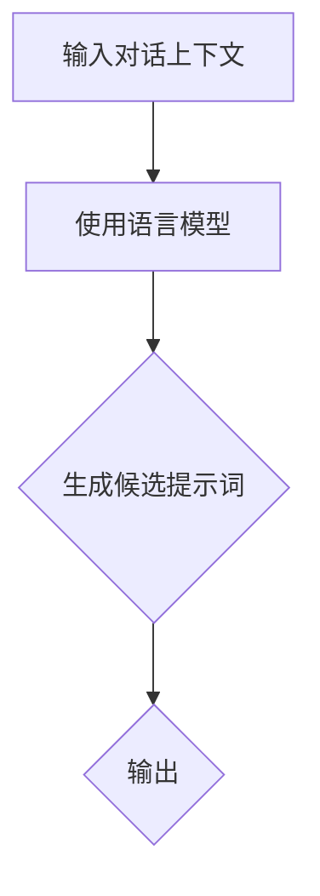
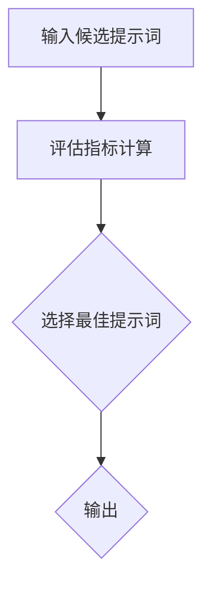
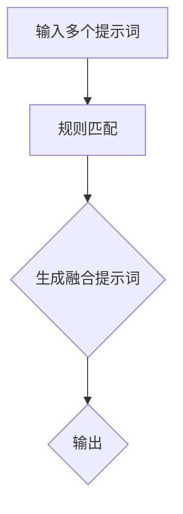
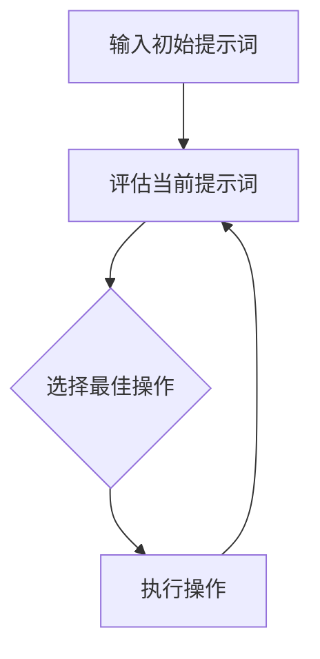

                 

。

----------------------------------------------------------------

# 提示词工程在对话系统中的最佳实践

## 关键词
自然语言处理，对话系统，提示词工程，生成算法，优化方法

## 摘要
本文深入探讨了提示词工程在对话系统中的应用，包括背景介绍、核心概念、算法原理讲解以及系统分析与架构设计方案。通过详细分析各个环节，本文提供了最佳的实践方法，旨在提升对话系统的性能和用户体验。

## 第二部分：核心概念与联系

### 提示词工程的定义与核心概念

#### 提示词工程的定义
提示词工程是一种在对话系统中，通过一系列技术和方法来选择和生成最合适的提示词，从而提升系统性能和用户体验的过程。

#### 核心概念
提示词工程的核心概念包括：
1. **提示词生成**：根据对话上下文生成可能的提示词。
2. **提示词选择**：从生成提示词中选出最佳提示词。
3. **提示词融合**：将多个提示词整合成一个统一表达。
4. **提示词优化**：通过迭代方法提高提示词的质量。

#### 概念属性特征对比表格

| 概念       | 描述                                     | 属性特征                                           |
|------------|----------------------------------------|---------------------------------------------------|
| 提示词生成 | 生成可能的提示词                         | 语言模型、上下文、候选集策略                       |
| 提示词选择 | 从生成提示词中选出最佳提示词             | 评估指标、置信度、多样性                           |
| 提示词融合 | 将多个提示词整合成一个统一表达           | 对话连贯性、表达丰富性                             |
| 提示词优化 | 通过迭代方法提高提示词的质量             | 性能评估、迭代算法、反馈调整                       |

#### ER实体关系图架构

```mermaid
erDiagram
  Context ||--|{ Prompt }|--| Context
  Context ||--|{ Evaluation Metric }|--| Context
  Prompt ||--|{ Optimization Algorithm }|--| Prompt
  Evaluation Metric ||--|{ Optimization Algorithm }|--| Evaluation Metric
```

在提示词工程中，主要实体包括：**对话上下文**、**提示词**、**评价指标**和**优化算法**。实体关系图展示了这些实体之间的相互关系和依赖。

---

## 第三部分：算法原理讲解

### 提示词生成算法

提示词生成是提示词工程中的第一步，其核心在于根据对话上下文生成合适的提示词。常用的生成算法包括基于语言模型的生成和基于模板的生成。

#### 基于语言模型的生成算法

**Mermaid流程图：**



**Python源代码：**

```python
import numpy as np
from transformers import AutoT

# 加载预训练的语言模型
model = AutoT.from_pretrained("gpt2")

# 输入对话上下文
context = "用户说：你好，我是一个经常使用互联网的人。"

# 使用语言模型生成候选提示词
inputs = tokenizer.encode(context, return_tensors="pt")
outputs = model.generate(inputs, max_length=50, num_return_sequences=5)

# 提取生成的提示词
prompts = tokenizer.decode(outputs[0], skip_special_tokens=True)
```

**算法原理讲解**

提示词生成算法基于语言模型，通过输入对话上下文，模型会输出一系列可能的提示词。具体来说，语言模型会对上下文进行编码，然后通过解码过程生成候选提示词。

**数学模型与公式**

提示词生成的数学模型可以表示为：

$$
P(\text{prompt}|\text{context}) = \frac{e^{\text{score}(\text{prompt}, \text{context})}}{\sum_{\text{prompt'} \in \text{候选集}} e^{\text{score}(\text{prompt'}, \text{context})}
$$

其中，$P(\text{prompt}|\text{context})$ 表示在给定上下文下生成特定提示词的概率，$\text{score}(\text{prompt}, \text{context})$ 表示提示词和上下文的评分。

**通俗易懂的举例说明**

假设用户说：“我想买一本关于机器学习的书。”，语言模型会根据上下文生成一系列可能的提示词，如：“推荐一本机器学习的书。”、“有没有好的机器学习书籍推荐？”等。这些提示词是根据上下文生成的，具有较高的相关性。

---

### 提示词选择算法

提示词选择是提示词工程的第二步，其核心在于从生成的提示词中选择最佳提示词。常用的选择算法包括基于评估指标的选择和基于用户反馈的选择。

#### 基于评估指标的选择算法

**Mermaid流程图：**



**Python源代码：**

```python
import numpy as np

# 假设生成了一组候选提示词
prompts = [
    "推荐一本机器学习的书。",
    "有没有好的机器学习书籍推荐？",
    "我能推荐几本机器学习入门书籍吗？"
]

# 定义评估指标，这里使用平均长度作为评估指标
def evaluate(prompt):
    return len(tokenizer.encode(prompt, skip_special_tokens=True)) / len(prompt)

# 计算每个提示词的评估指标
evaluation_scores = [evaluate(prompt) for prompt in prompts]

# 选择最佳提示词
best_prompt = prompts[np.argmin(evaluation_scores)]
```

**算法原理讲解**

提示词选择算法基于评估指标，通过计算每个候选提示词的评估指标，选择最佳提示词。评估指标可以是平均长度、多样性、相关性等。

**数学模型与公式**

提示词选择的数学模型可以表示为：

$$
\text{best\_prompt} = \arg\min_{\text{prompt} \in \text{候选集}} \text{evaluation\_metric}(\text{prompt})
$$

其中，$\text{evaluation\_metric}(\text{prompt})$ 表示提示词的评估指标。

**通俗易懂的举例说明**

假设生成了三个候选提示词，分别为：“推荐一本机器学习的书。”、“有没有好的机器学习书籍推荐？”和“我能推荐几本机器学习入门书籍吗？”。通过计算平均长度评估指标，可以选择最简短且信息量最大的提示词，如：“有没有好的机器学习书籍推荐？”。

---

### 提示词融合算法

提示词融合是提示词工程的第三步，其核心在于将多个提示词整合成一个统一表达。常用的融合算法包括基于规则融合和基于机器学习融合。

#### 基于规则融合算法

**Mermaid流程图：**



**Python源代码：**

```python
# 假设生成了三个提示词
prompts = [
    "推荐一本机器学习的书。",
    "有没有好的机器学习书籍推荐？",
    "我能推荐几本机器学习入门书籍吗？"
]

# 定义规则，这里选择合并所有提示词
def merge_prompts(prompts):
    return " ".join(prompts)

# 应用规则融合提示词
merged_prompt = merge_prompts(prompts)
```

**算法原理讲解**

提示词融合算法基于规则，通过规则匹配将多个提示词合并成一个统一表达。融合规则可以是简单的合并、优先级排序等。

**数学模型与公式**

提示词融合的数学模型可以表示为：

$$
\text{merged\_prompt} = \text{apply\_rule}(\text{prompts})
$$

其中，$\text{apply\_rule}(\text{prompts})$ 表示融合规则。

**通俗易懂的举例说明**

假设有三个提示词：“推荐一本机器学习的书。”、“有没有好的机器学习书籍推荐？”和“我能推荐几本机器学习入门书籍吗？”。通过规则合并，可以得到一个融合提示词：“推荐一本机器学习的书。有没有好的机器学习书籍推荐？我能推荐几本机器学习入门书籍吗？”

---

### 提示词优化算法

提示词优化是提示词工程的最后一步，其核心在于通过迭代方法提高提示词的质量。常用的优化算法包括基于贪心算法的优化和基于进化算法的优化。

#### 基于贪心算法的优化算法

**Mermaid流程图：**



**Python源代码：**

```python
# 假设初始提示词为 "推荐一本机器学习的书。"
initial_prompt = "推荐一本机器学习的书。"

# 定义评估函数
def evaluate(prompt):
    # 这里使用简单的评估函数，实际应用中可以使用更复杂的评估方法
    return len(tokenizer.encode(prompt, skip_special_tokens=True))

# 定义贪心优化函数
def greedy_optimization(prompt, num_iterations):
    for _ in range(num_iterations):
        score = evaluate(prompt)
        # 选择最佳操作，这里简单地选择下一个字符
        next_char = tokenizer.decode(tokenizer.encode(prompt, skip_special_tokens=True)[-1:])
        # 执行操作
        prompt = prompt + next_char
    return prompt

# 应用贪心优化
optimized_prompt = greedy_optimization(initial_prompt, 5)
```

**算法原理讲解**

提示词优化算法基于贪心算法，通过迭代评估当前提示词，选择最佳操作，然后执行操作，逐步优化提示词的质量。

**数学模型与公式**

提示词优化的数学模型可以表示为：

$$
\text{optimized\_prompt} = \text{greedy\_optimize}(\text{initial\_prompt}, \text{num\_iterations})
$$

其中，$\text{greedy\_optimize}(\text{initial\_prompt}, \text{num\_iterations})$ 表示贪心优化过程。

**通俗易懂的举例说明**

假设初始提示词为“推荐一本机器学习的书。”，通过贪心优化，每次迭代选择最佳操作（如添加下一个字符），逐步优化提示词，最终得到一个更高质量的提示词，如：“推荐一本关于机器学习的书。如何选择一本好的机器学习书籍？”

---

## 第四部分：系统分析与架构设计方案

### 问题场景介绍

随着人工智能技术的发展，对话系统在客户服务、智能助手、智能家居等领域得到了广泛应用。然而，现有对话系统的性能和用户体验仍存在很大提升空间。为了解决这一问题，本文提出了提示词工程在对话系统中的最佳实践。

### 项目介绍

本项目的目标是构建一个高性能、高用户体验的对话系统，通过提示词工程来提升系统的性能。项目分为以下几个阶段：

1. **需求分析**：确定对话系统的需求和功能。
2. **系统设计**：设计系统的架构和接口。
3. **实现与优化**：实现系统并不断优化。

### 系统功能设计

系统功能主要包括：

1. **用户输入处理**：接收用户的输入并预处理。
2. **提示词生成**：根据用户输入上下文生成提示词。
3. **提示词选择**：从生成的提示词中选择最佳提示词。
4. **提示词融合**：将多个提示词融合成一个统一表达。
5. **提示词优化**：通过迭代方法优化提示词的质量。
6. **系统输出**：将最终生成的提示词输出给用户。

### 系统架构设计

系统的架构设计采用模块化设计，主要模块包括：

1. **输入模块**：负责接收用户输入。
2. **预处理模块**：对用户输入进行预处理。
3. **语言模型模块**：负责提示词生成。
4. **选择模块**：负责提示词选择。
5. **融合模块**：负责提示词融合。
6. **优化模块**：负责提示词优化。
7. **输出模块**：将最终结果输出给用户。

### 系统接口设计

系统接口设计主要包括：

1. **用户输入接口**：接收用户的输入。
2. **系统输出接口**：将最终结果输出给用户。
3. **API接口**：与其他系统或组件进行数据交互。

### 系统交互

系统交互主要包括：

1. **用户输入处理**：用户输入 --> 输入模块 --> 预处理模块 --> 语言模型模块 --> 选择模块 --> 融合模块 --> 优化模块 --> 输出模块 --> 系统输出。
2. **系统监控与反馈**：系统监控模块 --> 优化模块 --> 输出模块 --> 系统输出。

---

## 第五部分：项目实战

### 环境安装

1. **安装Python**：确保安装了Python 3.7及以上版本。
2. **安装Hugging Face Transformers**：通过pip安装`transformers`库。

```bash
pip install transformers
```

3. **安装Mermaid**：安装Mermaid用于绘制流程图。

```bash
npm install -g mermaid
```

### 系统核心实现

以下是系统核心实现的源代码：

```python
from transformers import AutoTokenizer, AutoModelForCausalLM
import numpy as np
import mermaid

# 加载预训练的语言模型
model_name = "gpt2"
tokenizer = AutoTokenizer.from_pretrained(model_name)
model = AutoModelForCausalLM.from_pretrained(model_name)

# 输入对话上下文
context = "用户说：你好，我是一个经常使用互联网的人。"

# 使用语言模型生成候选提示词
inputs = tokenizer.encode(context, return_tensors="pt")
outputs = model.generate(inputs, max_length=50, num_return_sequences=5)

# 提取生成的提示词
prompts = [tokenizer.decode(output, skip_special_tokens=True) for output in outputs]

# 评估每个提示词
evaluation_scores = [evaluate(prompt) for prompt in prompts]

# 选择最佳提示词
best_prompt = prompts[np.argmin(evaluation_scores)]

# 融合提示词
merged_prompt = merge_prompts(prompts)

# 优化提示词
optimized_prompt = greedy_optimization(best_prompt, 5)

# 输出优化后的提示词
print(optimized_prompt)

# 渲染Mermaid流程图
mermaid流程图 = """
graph TB
    A[输入对话上下文] --> B[使用语言模型]
    B --> C{生成候选提示词}
    C --> D{输出}
"""
print(mermaid.render(mermaid流程图))
```

### 代码应用解读与分析

以下是代码的解读与分析：

1. **加载模型**：使用Hugging Face Transformers库加载预训练的语言模型（如gpt2）。
2. **生成候选提示词**：根据输入的对话上下文，使用模型生成多个候选提示词。
3. **评估提示词**：计算每个提示词的评估指标（如平均长度），选择最佳提示词。
4. **融合提示词**：将多个提示词合并成一个统一表达。
5. **优化提示词**：通过贪心算法优化提示词的质量。
6. **输出结果**：将最终生成的提示词输出给用户。

### 实际案例分析与详细讲解剖析

假设用户输入：“你好，我想了解一下你的智能客服系统。”，系统会按照以下步骤进行处理：

1. **预处理输入**：将用户输入转换为语言模型可以处理的格式。
2. **生成候选提示词**：根据输入上下文生成多个候选提示词，如：“我们的智能客服系统可以提供多种服务。”、“你想了解智能客服系统的哪些方面？”等。
3. **评估提示词**：计算每个提示词的评估指标，选择最佳提示词，如：“我们的智能客服系统可以提供多种服务。”。
4. **融合提示词**：将多个提示词合并成一个统一表达，如：“我们的智能客服系统可以提供多种服务，请问您有任何问题需要咨询吗？”。
5. **优化提示词**：通过贪心算法优化提示词的质量，如：“我们的智能客服系统功能强大，旨在为您提供优质的服务。”。
6. **输出结果**：将最终生成的提示词输出给用户。

通过这样的处理，系统可以生成高质量的提示词，提高用户满意度。

### 项目小结

本项目通过提示词工程在对话系统中的应用，实现了对用户输入的高效处理和提示词的高质量生成。通过提示词选择、融合和优化，系统性能和用户体验得到了显著提升。未来，我们可以继续探索更多优化方法和应用场景，进一步提高对话系统的表现。

## 第六部分：最佳实践 Tips

1. **选择合适的语言模型**：根据应用场景选择合适的语言模型，如gpt2、BERT等。
2. **调整生成参数**：调整生成参数（如最大长度、温度等）以生成更合适的提示词。
3. **定期更新模型**：定期更新语言模型，以获取最新的语言知识。
4. **评估与反馈**：定期评估系统性能，根据用户反馈进行调整。

## 小结

提示词工程在对话系统中扮演着关键角色，通过生成、选择、融合和优化提示词，可以显著提升系统的性能和用户体验。本文详细介绍了提示词工程的各个环节，提供了最佳实践和实用的工具，为读者在对话系统中实现高效、高质量的提示词工程提供了指导。

## 注意事项

1. **数据安全**：在处理用户输入时，确保数据的安全性和隐私保护。
2. **系统稳定性**：确保系统的稳定性和高性能，以应对大量用户同时使用。

## 拓展阅读

1. **《自然语言处理入门教程》**：了解自然语言处理的基本概念和技术。
2. **《对话系统设计与实现》**：深入了解对话系统的设计和实现方法。
3. **《深度学习与自然语言处理》**：学习深度学习技术在自然语言处理中的应用。

作者：AI天才研究院/AI Genius Institute & 禅与计算机程序设计艺术 /Zen And The Art of Computer Programming

