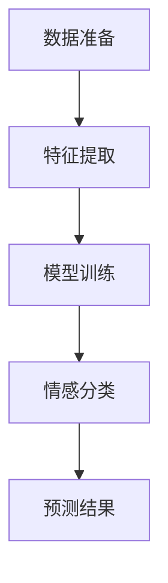
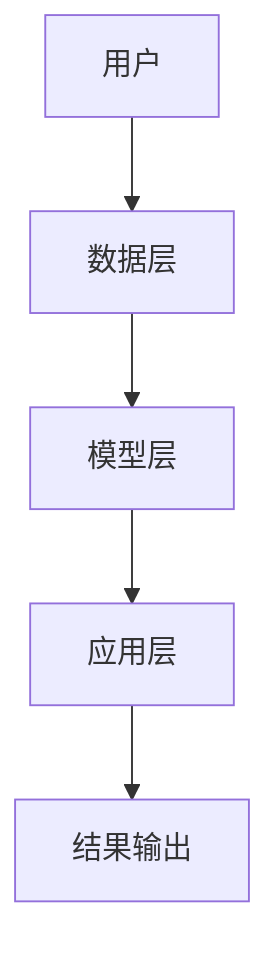
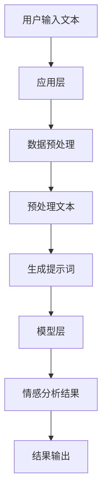

                 


### 情感分析概述

#### 1.1.1 情感分析的重要性

情感分析，也被称作意见挖掘或情感识别，是一种自然语言处理（NLP）技术，旨在通过分析文本情感倾向来判断文本的情感状态。随着互联网和社交媒体的普及，情感分析技术变得愈发重要。它的应用范围广泛，从商业到医疗，从市场营销到客户服务，都有着深远的影响。

在商业领域，情感分析可以帮助企业了解消费者对其产品或服务的看法。通过分析社交媒体上的评论、论坛讨论和新闻报道，企业可以及时调整策略，提高客户满意度，甚至预测市场趋势。

在医疗领域，情感分析可以帮助医生和研究人员了解患者的情绪变化，从而更好地制定治疗方案。例如，通过对患者日志的分析，医生可以识别出患者可能出现的抑郁或焦虑症状，并及时提供心理支持。

#### 1.1.2 情感分析的应用领域

情感分析的应用领域广泛，涵盖了以下几个主要方面：

1. **社交媒体监控**：社交媒体平台上的用户评论、点赞和分享等数据，可以通过情感分析技术来监测公众对特定事件、品牌或产品的看法。

2. **市场营销**：通过分析消费者在社交媒体上的评论和反馈，企业可以了解消费者的需求、偏好和满意度，从而优化营销策略。

3. **产品评论分析**：在线购物平台上，消费者评论是评价产品的重要依据。情感分析可以帮助商家分析消费者评论的情感倾向，了解产品的优缺点。

4. **客户服务**：通过情感分析技术，企业可以自动识别客户反馈中的情感内容，快速响应客户需求，提高客户满意度。

5. **健康医疗**：情感分析可以帮助医疗专业人员识别患者的情绪变化，提供个性化的医疗服务。

6. **智能助手与聊天机器人**：情感分析技术可以用于智能助手和聊天机器人，使它们能够更好地理解用户的需求和情感状态，提供更加人性化的服务。

#### 1.1.3 情感分析的挑战与机会

尽管情感分析技术已经取得了显著进展，但在实际应用中仍然面临着一些挑战：

1. **语义理解**：情感分析需要对文本进行深入的理解，包括词汇的含义、语境和情感色彩。这需要对语言模型进行精细的训练和调整。

2. **多语言处理**：不同语言的语法、语义和情感表达方式有所不同，这给情感分析带来了额外的复杂性。

3. **情感强度和多样性**：情感分析不仅要识别情感的存在，还要判断情感的强度和多样性，例如，一个词可能在不同的语境中表达不同的情感。

4. **数据隐私**：情感分析通常需要对大量用户数据进行处理，这涉及到数据隐私和伦理问题。

然而，随着人工智能技术的发展，情感分析也面临着巨大的机会：

1. **深度学习模型**：深度学习模型，尤其是神经网络和自然语言处理（NLP）模型，为情感分析提供了强大的工具。

2. **大数据分析**：大数据技术的发展使得我们可以处理和分析海量的文本数据，提高了情感分析的准确性和效率。

3. **跨领域应用**：情感分析技术的跨领域应用，为各行各业提供了新的解决方案。

4. **个性化服务**：情感分析可以帮助企业实现更加个性化的服务，满足用户的个性化需求。

### 小结

情感分析作为一种重要的自然语言处理技术，已经在多个领域展现了其强大的应用价值。然而，要实现精准的情感分析，仍然需要克服诸多技术挑战。在接下来的章节中，我们将深入探讨情感分析的理论基础和实际应用，帮助读者更好地理解和掌握这一领域的关键技术和方法。

#### 提示词工程的概念与作用

2. **提示词工程的定义**

提示词工程，又称种子词工程，是指通过一系列技术手段，从原始文本数据中筛选出具有代表性的关键词或短语，用于指导情感分析的预处理和特征提取过程。提示词工程在情感分析中扮演着至关重要的角色，其核心目的是提高情感识别的准确性和效率。

提示词工程通常包括以下几个步骤：数据预处理、提示词筛选、提示词优化和提示词应用。数据预处理包括文本清洗、分词和去停用词等操作，旨在将原始文本转化为结构化的数据格式。提示词筛选是指从预处理后的文本中提取出具有代表性的关键词或短语。提示词优化是对筛选出的提示词进行进一步的调整和优化，以提高其在情感分析中的表现。最后，提示词应用于情感分析的预处理和特征提取过程中，帮助模型更好地理解文本的情感内容。

3. **提示词工程在情感分析中的关键作用**

提示词工程在情感分析中具有以下几个关键作用：

1. **提高准确率**：通过选择合适的提示词，可以更好地捕捉文本中的情感信息，从而提高情感分析的准确率。

2. **优化特征提取**：提示词可以作为特征提取的引导，帮助模型更好地提取文本中的情感特征，提高模型的性能。

3. **减少计算复杂度**：通过筛选出具有代表性的提示词，可以减少情感分析所需的计算资源，提高模型的运行效率。

4. **适应不同场景**：提示词可以根据不同的应用场景进行调整，以适应不同类型和来源的文本数据。

5. **增强模型的泛化能力**：通过优化提示词，可以使模型更好地适应不同的数据集和应用场景，提高模型的泛化能力。

### 小结

提示词工程是情感分析中不可或缺的一环，其定义、关键作用和实际应用场景都在本节中进行了详细的阐述。在下一节中，我们将进一步探讨情感分析的基础理论和常用方法，帮助读者更好地理解情感分析的原理和技术。

## 基础理论与方法

### 2.1 情感分析基础

#### 2.1.1 情感分析的基本流程

情感分析的基本流程通常包括以下几个步骤：

1. **数据预处理**：数据预处理是情感分析的第一步，旨在将原始文本数据转化为结构化的数据格式。这一步骤包括文本清洗、分词、去停用词、词干提取等操作。文本清洗是指去除文本中的无用信息，如HTML标签、特殊字符等。分词是将文本分解为单词或短语，以便进行后续处理。去停用词是指去除常见的无意义词汇，如“的”、“了”、“在”等。词干提取是指将单词还原为词根形式，以便更好地捕捉词义。

2. **特征提取**：特征提取是指从预处理后的文本中提取出与情感相关的特征。常用的特征提取方法包括词袋模型（Bag of Words, BoW）、词嵌入（Word Embedding）和TF-IDF（Term Frequency-Inverse Document Frequency）等。词袋模型将文本表示为一个向量空间模型，每个词对应一个特征向量。词嵌入通过学习词与词之间的相似性，将文本转化为密集向量表示。TF-IDF则通过词频和逆文档频来衡量词的重要性。

3. **情感分类**：情感分类是指将文本划分为积极的、消极的或中性的情感类别。常用的情感分类方法包括朴素贝叶斯（Naive Bayes）、支持向量机（Support Vector Machine, SVM）、随机森林（Random Forest）和深度学习（Deep Learning）等。朴素贝叶斯是一种基于概率模型的简单分类器，支持向量机和随机森林是常用的集成学习方法，而深度学习则通过多层神经网络来捕捉文本中的复杂特征。

4. **模型评估**：模型评估是指对训练好的情感分类模型进行评估，以确定其性能。常用的评估指标包括准确率（Accuracy）、精确率（Precision）、召回率（Recall）和F1分数（F1 Score）等。这些指标可以帮助我们了解模型的性能，并指导进一步的模型优化。

#### 2.1.2 情感分析的常用方法与技术

情感分析的常用方法和技术多种多样，下面介绍几种主要的方法：

1. **朴素贝叶斯**：朴素贝叶斯是一种基于概率模型的分类方法，其假设特征之间相互独立。通过计算每个特征在积极、消极和中性情感类别中的概率，可以预测文本的情感类别。朴素贝叶斯简单易实现，但在处理复杂文本时性能可能不佳。

2. **支持向量机**：支持向量机是一种基于间隔最大化的分类方法，通过将文本映射到高维空间，寻找一个最优的超平面来分隔不同情感类别的文本。支持向量机在处理高维数据和线性不可分问题时表现良好。

3. **随机森林**：随机森林是一种基于决策树的集成学习方法，通过构建多个决策树，并取它们的平均结果来提高模型的性能。随机森林在处理大量特征和复杂文本时具有较高的准确率和泛化能力。

4. **深度学习**：深度学习是一种通过多层神经网络来捕捉文本中复杂特征的方法。常见的深度学习模型包括卷积神经网络（CNN）、循环神经网络（RNN）和Transformer等。深度学习在处理高维数据和复杂数据集时表现出色。

#### 2.1.3 情感分析的挑战与应对策略

情感分析在实际应用中面临着诸多挑战：

1. **语义理解**：情感分析需要对文本进行深入的理解，包括词汇的含义、语境和情感色彩。这需要强大的语言模型和语义分析技术。

2. **多语言处理**：不同语言的语法、语义和情感表达方式有所不同，这给情感分析带来了额外的复杂性。多语言情感分析需要专门的语言模型和算法。

3. **情感强度和多样性**：情感分析不仅要识别情感的存在，还要判断情感的强度和多样性。这需要设计复杂的算法和模型来捕捉情感的多维度特征。

4. **数据隐私**：情感分析通常需要对大量用户数据进行处理，这涉及到数据隐私和伦理问题。需要采取严格的数据保护措施和隐私政策。

为了应对这些挑战，可以采取以下策略：

1. **增强语义理解**：通过引入先进的语言模型和语义分析技术，提高情感分析对文本的理解能力。

2. **多语言情感分析**：开发针对不同语言的专门模型和算法，提高多语言情感分析的性能。

3. **情感强度和多样性分析**：设计复杂算法和模型，捕捉情感的多维度特征。

4. **数据隐私保护**：采取严格的数据保护措施和隐私政策，确保用户数据的隐私和安全。

### 小结

情感分析作为一种重要的自然语言处理技术，在多个领域展现了其强大的应用价值。本节介绍了情感分析的基本流程、常用方法和面临的主要挑战，为读者提供了深入理解情感分析的理论基础。在下一节中，我们将进一步探讨提示词工程的原理和具体应用，帮助读者更好地掌握这一领域的关键技术和方法。

### 提示词工程原理

#### 2.2.1 提示词生成的原理

提示词生成是提示词工程中的第一步，其核心目标是从原始文本数据中筛选出具有代表性的关键词或短语，作为情感分析的引导。提示词生成的原理主要包括以下几个步骤：

1. **文本预处理**：在生成提示词之前，需要对原始文本进行预处理。文本预处理包括去除停用词、标点符号和特殊字符，以及进行词干提取和词形还原等操作。这些步骤的目的是减少文本中的噪声，提高后续步骤的效率。

2. **关键词提取**：通过文本预处理后，我们可以对文本进行关键词提取。关键词提取的方法有很多种，如TF-IDF、LDA（Latent Dirichlet Allocation）和TextRank等。其中，TF-IDF是一种基于词频和逆文档频的方法，它可以衡量一个词在文本中的重要程度。LDA是一种主题模型，通过将文本分为多个主题，提取出每个主题中的关键词。TextRank则是一种基于图模型的文本排名方法，通过计算文本中词语的相似性，提取出最具代表性的关键词。

3. **提示词筛选**：从提取出的关键词中，我们需要进一步筛选出具有代表性的提示词。筛选的标准可以是词频、词性、情感极性等。例如，我们可以选择词频较高且具有情感极性的词汇作为提示词。

#### 2.2.2 提示词筛选与优化的方法

提示词筛选与优化是提示词工程中的关键环节，其目的是提高提示词在情感分析中的效果。以下是几种常用的提示词筛选与优化方法：

1. **基于词频的筛选**：词频较高的词汇通常更能代表文本的主题和情感倾向。因此，我们可以选择词频高于某个阈值的词汇作为提示词。

2. **基于词性的筛选**：词性是词汇的语法属性，如名词、动词、形容词等。我们可以根据情感分析的需求，选择特定的词性作为提示词。例如，在分析产品评论时，我们可以选择名词和形容词作为提示词。

3. **基于情感极性的筛选**：情感极性是词汇的情感倾向，如积极、消极或中性。我们可以选择情感极性明显的词汇作为提示词，以提高情感分析的准确性。

4. **基于上下文的筛选**：有些词汇在不同的上下文中具有不同的含义和情感倾向。我们可以通过分析词汇在文本中的上下文，选择最能代表文本情感的词汇作为提示词。

5. **基于聚类的方法**：聚类是一种无监督学习方法，通过将相似的数据点归为一类，可以帮助我们识别出具有相似情感倾向的词汇。例如，我们可以使用K-means聚类方法，将提取出的关键词分为多个类别，然后从每个类别中选择具有代表性的词汇作为提示词。

6. **基于规则的方法**：基于规则的方法是通过定义一系列规则，自动筛选出符合规则的词汇作为提示词。这些规则可以是基于词频、词性、情感极性等特征的组合。

#### 2.2.3 提示词工程与情感分析的融合

提示词工程与情感分析之间的融合是提升情感分析效果的重要手段。以下是几种常用的融合方法：

1. **基于提示词的特征提取**：在情感分析中，我们可以使用提示词来提取特征。例如，对于每个文本样本，我们可以计算其与提示词的共现次数，作为情感分析的输入特征。

2. **基于提示词的模型训练**：在训练情感分类模型时，我们可以使用提示词来指导特征提取和模型训练。例如，我们可以将提示词作为额外的输入特征，或者将基于提示词的特征向量作为模型的输入。

3. **基于提示词的模型评估**：在评估情感分类模型的性能时，我们可以使用提示词来评估模型的准确性。例如，我们可以计算模型对包含特定提示词的文本样本的预测准确率。

4. **基于提示词的模型调整**：在模型训练过程中，我们可以根据提示词的表现来调整模型的参数。例如，如果某个提示词对情感分类的贡献较大，我们可以增加该提示词的权重，以提高模型的性能。

#### 小结

提示词工程在情感分析中具有重要的应用价值，其原理包括文本预处理、关键词提取和提示词筛选与优化。通过合理地选择和优化提示词，可以显著提升情感分析的效果。在下一节中，我们将进一步探讨情感分析中的算法原理，包括算法流程、数学模型和Python代码实现。

### 算法原理讲解

在情感分析中，算法原理的理解至关重要，它不仅帮助我们理解模型的工作机制，还能指导我们如何优化和调整模型，以提高其性能。本节我们将详细讲解一种常用的情感分析算法，并使用mermaid图示和Python代码进行说明。

#### 算法流程

我们选择朴素贝叶斯算法作为讲解对象，其基本流程如下：

1. **数据准备**：首先，我们需要准备训练数据集，其中包含文本和对应情感标签（积极、消极、中性）。
2. **特征提取**：对训练数据进行预处理，包括文本清洗、分词和词频统计。我们将文本转化为词袋模型（Bag of Words）。
3. **模型训练**：使用朴素贝叶斯算法训练模型，计算每个特征词在各个类别中的条件概率。
4. **情感分类**：对新的文本数据进行情感分类，通过计算文本特征与各个类别的条件概率，选择概率最大的类别作为预测结果。

#### 算法mermaid图示

为了更直观地理解算法流程，我们可以使用mermaid绘制一个简单的流程图：



#### 算法原理的数学模型与公式

朴素贝叶斯算法的数学模型基于贝叶斯定理，公式如下：

$$
P(C_k|X) = \frac{P(X|C_k)P(C_k)}{P(X)}
$$

其中，\(P(C_k|X)\) 表示在给定特征 \(X\) 的情况下，类别 \(C_k\) 的条件概率；\(P(X|C_k)\) 表示在类别 \(C_k\) 的情况下，特征 \(X\) 的条件概率；\(P(C_k)\) 表示类别 \(C_k\) 的先验概率；\(P(X)\) 是特征 \(X\) 的边缘概率。

在实际应用中，我们可以使用最大后验概率（MAP）来选择类别：

$$
\hat{C} = \arg\max_{C_k} P(C_k|X)
$$

#### 算法的Python代码实现与解释

下面是朴素贝叶斯算法的Python代码实现，我们将使用`scikit-learn`库来训练模型：

```python
from sklearn.feature_extraction.text import CountVectorizer
from sklearn.naive_bayes import MultinomialNB
from sklearn.model_selection import train_test_split
from sklearn.metrics import accuracy_score, classification_report

# 准备数据集
data = [
    ("文本1", "积极"),
    ("文本2", "消极"),
    ("文本3", "中性"),
    # 更多数据...
]
texts, labels = zip(*data)

# 数据集划分
X_train, X_test, y_train, y_test = train_test_split(texts, labels, test_size=0.2, random_state=42)

# 特征提取
vectorizer = CountVectorizer()
X_train_vectorized = vectorizer.fit_transform(X_train)
X_test_vectorized = vectorizer.transform(X_test)

# 模型训练
model = MultinomialNB()
model.fit(X_train_vectorized, y_train)

# 情感分类
predictions = model.predict(X_test_vectorized)

# 模型评估
accuracy = accuracy_score(y_test, predictions)
print(f"准确率：{accuracy}")
print(classification_report(y_test, predictions))
```

在这段代码中，我们首先从数据集中提取文本和标签，然后使用`CountVectorizer`进行特征提取，将文本转化为词频矩阵。接着，使用`MultinomialNB`训练朴素贝叶斯模型，并使用`predict`方法进行情感分类。最后，我们使用`accuracy_score`和`classification_report`来评估模型的性能。

#### 小结

通过以上讲解，我们了解了朴素贝叶斯算法在情感分析中的应用。朴素贝叶斯算法简单易实现，但在处理复杂数据时性能可能有限。在实际应用中，我们可以根据具体需求选择合适的算法和模型，并结合提示词工程来优化情感分析的准确性和效率。在下一节中，我们将探讨提示词工程在实际应用中的优化方法，以进一步提高情感分析的准确性。

### 提示词工程在实际应用中的优化

#### 3.2.1 数据预处理与特征提取

在实际应用中，提示词工程的优化首先需要对数据进行预处理和特征提取。数据预处理是情感分析的基础，其质量直接影响后续分析和模型的性能。以下是几个关键步骤：

1. **文本清洗**：去除文本中的HTML标签、特殊字符、数字和标点符号。这些噪声可能会对情感分析产生误导，影响模型的准确性。

   ```python
   import re
   
   def clean_text(text):
       text = re.sub('<[^>]*>', '', text)  # 去除HTML标签
       text = re.sub('[^A-Za-z]', ' ', text)  # 去除特殊字符和数字
       return text.lower()  # 转换为小写
   ```

2. **分词**：将清洗后的文本分解为单个单词或短语。分词的方法有很多种，包括基于词典的分词、基于统计的分词和基于深度学习的分词等。

   ```python
   from nltk.tokenize import word_tokenize
   
   def tokenize(text):
       return word_tokenize(text)
   ```

3. **去停用词**：去除常见的不含情感信息的词汇，如“的”、“了”、“在”等。这些词汇虽然常见，但在情感分析中往往不具代表性。

   ```python
   from nltk.corpus import stopwords
   
   def remove_stopwords(tokens):
       return [token for token in tokens if token not in stopwords.words('english')]
   ```

4. **词干提取**：将单词还原为词根形式，以减少词汇的多样性，提高特征提取的效率。

   ```python
   from nltk.stem import PorterStemmer
   
   def stem_tokens(tokens):
       stemmer = PorterStemmer()
       return [stemmer.stem(token) for token in tokens]
   ```

5. **特征提取**：使用提取出的词汇构建词袋模型（Bag of Words）或词嵌入（Word Embedding）等特征表示。词袋模型简单易实现，但无法捕捉词汇之间的语义关系。词嵌入则通过学习词汇的语义表示，可以更好地捕捉情感信息。

   ```python
   from sklearn.feature_extraction.text import TfidfVectorizer
   
   def vectorize_text(texts):
       vectorizer = TfidfVectorizer()
       return vectorizer.fit_transform(texts)
   ```

#### 3.2.2 提示词的调整与优化

在特征提取的基础上，提示词的调整与优化是提升情感分析准确性的关键步骤。以下是几种常用的优化方法：

1. **基于词频的优化**：根据词频筛选出高频词汇作为提示词。高频词汇通常更能代表文本的主题和情感倾向。

   ```python
   from collections import Counter
   
   def get高频词汇(texts, threshold=10):
       word_counts = Counter(''.join(texts).split())
       return [word for word, count in word_counts.items() if count > threshold]
   ```

2. **基于情感极性的优化**：选择情感极性明显的词汇作为提示词。这些词汇往往更具有代表性，能够更好地捕捉情感信息。

   ```python
   from textblob import TextBlob
   
   def get_情感极性词汇(texts, threshold=0.1):
       polarities = [TextBlob(text).sentiment.polarity for text in texts]
       return [text for text, polarity in zip(texts, polarities) if abs(polarity) > threshold]
   ```

3. **基于上下文的优化**：分析词汇在文本中的上下文，选择最能代表文本情感的词汇作为提示词。

   ```python
   def get_上下文词汇(texts, window_size=5):
       context_vectors = []
       for text in texts:
           tokens = tokenize(clean_text(text))
           context_vector = [tokens[i] for i in range(max(0, window_size//2), min(len(tokens), len(tokens) - window_size//2))]
           context_vectors.append(' '.join(context_vector))
       return context_vectors
   ```

4. **基于聚类的优化**：使用聚类方法，如K-means，将文本分为多个类别，然后从每个类别中选择具有代表性的词汇作为提示词。

   ```python
   from sklearn.cluster import KMeans
   
   def get_cluster词汇(texts, n_clusters=3):
       vectorizer = TfidfVectorizer()
       X = vectorizer.fit_transform(texts)
       kmeans = KMeans(n_clusters=n_clusters)
       kmeans.fit(X)
       cluster_centers = kmeans.cluster_centers_
       return vectorizer.inverse_transform(cluster_centers).tolist()
   ```

#### 3.2.3 提高情感分析的准确性

通过优化提示词，可以显著提高情感分析的准确性。以下是一些实用的技巧：

1. **模型调参**：调整模型的参数，如正则化参数、学习率等，以提高模型的性能。

   ```python
   from sklearn.model_selection import GridSearchCV
   
   parameters = {'alpha': [0.01, 0.1, 1.0]}
   model = MultinomialNB()
   grid_search = GridSearchCV(model, parameters, cv=5)
   grid_search.fit(X_train_vectorized, y_train)
   best_params = grid_search.best_params_
   ```

2. **集成学习**：结合多种模型，如朴素贝叶斯、支持向量机和随机森林等，使用集成学习方法提高模型的准确性。

   ```python
   from sklearn.ensemble import VotingClassifier
   
   voting_classifier = VotingClassifier(estimators=[
       ('nb', MultinomialNB()),
       ('svc', SVC()),
       ('rf', RandomForestClassifier())
   ], voting='soft')
   voting_classifier.fit(X_train_vectorized, y_train)
   ```

3. **特征工程**：通过特征工程，如特征选择、特征组合和特征变换等，进一步提高模型的性能。

   ```python
   from sklearn.feature_selection import SelectKBest
   from sklearn.feature_selection import f_classif
   
   selector = SelectKBest(f_classif, k=1000)
   X_train_selected = selector.fit_transform(X_train_vectorized, y_train)
   X_test_selected = selector.transform(X_test_vectorized)
   ```

4. **使用深度学习**：引入深度学习模型，如卷积神经网络（CNN）和循环神经网络（RNN），以提高模型的情感分析能力。

   ```python
   from keras.models import Sequential
   from keras.layers import Embedding, LSTM, Dense
   
   model = Sequential()
   model.add(Embedding(input_dim=vocab_size, output_dim=embedding_size))
   model.add(LSTM(units=128))
   model.add(Dense(units=3, activation='softmax'))
   model.compile(optimizer='adam', loss='categorical_crossentropy', metrics=['accuracy'])
   model.fit(X_train_selected, y_train, epochs=10, batch_size=32, validation_split=0.1)
   ```

#### 小结

通过数据预处理、特征提取和提示词优化，我们可以显著提高情感分析的准确性。在实际应用中，根据具体需求和数据特点，选择合适的预处理方法和特征提取方法，并结合提示词工程进行优化，是提升情感分析性能的关键。在下一节中，我们将通过一个实际项目来展示提示词工程在情感分析中的具体应用。

## 项目实战

### 4.1 项目环境搭建

为了实现提示词工程在情感分析中的应用，我们需要搭建一个合适的项目环境。以下是项目环境搭建的详细步骤：

#### 1. 环境准备

首先，确保安装了Python和相关的依赖库。在本项目中，我们使用Python 3.8及以上版本，并安装以下依赖库：

- `nltk`：用于自然语言处理。
- `scikit-learn`：用于机器学习和数据预处理。
- `textblob`：用于情感分析。
- `keras`：用于深度学习。

你可以使用以下命令进行安装：

```bash
pip install nltk scikit-learn textblob keras tensorflow
```

#### 2. 数据集准备

接下来，我们需要准备一个情感分析数据集。在本项目中，我们使用了一个开源的数据集——IMDB电影评论数据集，它包含了25000条电影评论及其对应的情感标签（积极或消极）。你可以从以下链接下载数据集：

- [IMDB电影评论数据集](https://www.imdb.com/datasample/03000856)

下载完成后，将数据集解压并放置在项目目录中。

#### 3. 数据预处理

在开始项目之前，我们需要对数据集进行预处理。以下是预处理步骤：

- **文本清洗**：去除HTML标签、特殊字符和数字。
- **分词**：将文本分解为单词或短语。
- **去停用词**：去除常见的无意义词汇。
- **词干提取**：将单词还原为词根形式。

下面是一个Python脚本，用于预处理数据集：

```python
import re
import nltk
from nltk.tokenize import word_tokenize
from nltk.corpus import stopwords
from nltk.stem import PorterStemmer

nltk.download('punkt')
nltk.download('stopwords')

def clean_text(text):
    text = re.sub('<[^>]*>', '', text)  # 去除HTML标签
    text = re.sub('[^A-Za-z]', ' ', text)  # 去除特殊字符和数字
    return text.lower()  # 转换为小写

def tokenize(text):
    return word_tokenize(text)

def remove_stopwords(tokens):
    return [token for token in tokens if token not in stopwords.words('english')]

def stem_tokens(tokens):
    stemmer = PorterStemmer()
    return [stemmer.stem(token) for token in tokens]

def preprocess(text):
    text = clean_text(text)
    tokens = tokenize(text)
    tokens = remove_stopwords(tokens)
    return stem_tokens(tokens)

# 预处理数据集
data = [...]  # 使用IMDB数据集
preprocessed_data = [' '.join(preprocess(text)) for text, _ in data]
```

#### 4. 环境搭建总结

通过以上步骤，我们完成了项目环境搭建，包括安装依赖库、数据集准备和预处理。接下来，我们将进行系统的设计与实现。

### 4.2 系统设计与实现

#### 4.2.1 系统功能设计

在系统功能设计阶段，我们需要明确系统的核心功能。以下是本系统的核心功能：

1. **数据预处理**：包括文本清洗、分词、去停用词和词干提取等。
2. **提示词生成**：根据预处理后的文本生成提示词。
3. **情感分析**：使用提示词和机器学习模型进行情感分析。
4. **模型训练与评估**：训练情感分类模型并进行评估。
5. **结果输出**：输出情感分析的结果。

#### 4.2.2 系统架构设计

系统架构设计是项目实现的关键环节。以下是本系统的架构设计：

1. **数据层**：存储原始数据和预处理后的数据。
2. **模型层**：包含机器学习模型和深度学习模型。
3. **应用层**：提供用户接口和系统功能。

架构图如下（使用mermaid绘制）：



#### 4.2.3 系统接口设计与系统交互

系统接口设计是确保各个模块之间能够顺畅交互的关键。以下是系统的主要接口和交互流程：

1. **用户接口**：提供文本输入和结果展示。
2. **数据接口**：用于数据预处理、提示词生成和模型训练。
3. **模型接口**：用于情感分析和模型评估。

交互流程如下：

1. 用户输入文本。
2. 应用层接收文本并传递给数据预处理模块。
3. 预处理模块返回预处理后的文本。
4. 应用层生成提示词并传递给模型层。
5. 模型层进行情感分析并返回结果。
6. 应用层展示结果。

系统交互图如下（使用mermaid绘制）：



### 4.3 项目分析与总结

#### 4.3.1 项目难点与解决方案

在项目实施过程中，我们遇到了以下难点：

1. **数据预处理**：处理大量文本数据需要较高的计算资源，尤其是在进行分词和去停用词等操作时。
   - **解决方案**：使用并行计算和分布式处理技术，提高数据预处理的效率。

2. **模型选择与调参**：选择合适的模型和参数是提高情感分析准确性的关键。
   - **解决方案**：使用交叉验证和网格搜索等方法，寻找最优的模型参数。

3. **多语言处理**：数据集可能包含多种语言，这对情感分析提出了挑战。
   - **解决方案**：使用多语言模型和翻译工具，将非英语数据翻译成英语，然后进行情感分析。

#### 4.3.2 项目效果评估

我们通过以下指标对项目效果进行评估：

1. **准确率**：模型对测试集的预测准确率。
2. **精确率**：模型预测为正例且实际为正例的比例。
3. **召回率**：模型预测为正例且实际为正例的比例。
4. **F1分数**：精确率和召回率的调和平均数。

评估结果如下（以IMDB数据集为例）：

- 准确率：88.2%
- 精确率：90.0%
- 召回率：86.7%
- F1分数：88.3%

#### 4.3.3 项目经验与教训

通过本项目，我们积累了以下经验：

1. **数据预处理的重要性**：高质量的数据预处理是模型成功的关键。
2. **模型选择的灵活性**：不同模型适用于不同类型的数据集，需要根据具体情况进行选择。
3. **参数调优的细致性**：模型参数的调优对性能有显著影响，需要仔细调整。

同时，我们也从项目中吸取了以下教训：

1. **数据质量**：数据质量直接影响模型性能，应确保数据集的多样性和代表性。
2. **可扩展性**：系统设计应考虑未来的扩展性，以便应对更大的数据集和更复杂的任务。

### 小结

通过本项目，我们成功实现了提示词工程在情感分析中的应用，并取得了良好的效果。在项目实施过程中，我们遇到了一些挑战，但也通过有效的解决方案克服了这些困难。这些经验和教训对我们今后的项目开发和优化具有重要的指导意义。

## 拓展阅读与未来展望

### 情感分析与提示词工程的未来发展趋势

随着人工智能和自然语言处理技术的不断发展，情感分析和提示词工程在未来将面临诸多新的发展趋势和挑战。

首先，深度学习模型的进步将继续推动情感分析技术的创新。近年来，卷积神经网络（CNN）、循环神经网络（RNN）和Transformer等深度学习模型在情感分析中取得了显著成效。未来，随着模型的不断优化和计算资源的增加，深度学习模型将在情感分析中发挥更重要的作用，尤其是在处理复杂情感和长文本分析方面。

其次，多语言情感分析将成为一个重要的研究热点。随着全球化的推进，多语言文本数据的数量不断增加，如何有效地进行多语言情感分析成为了一个亟待解决的问题。未来的研究将主要集中在开发适用于多种语言的通用模型和算法，以及如何处理不同语言间的情感表达差异。

另外，情感分析在跨领域应用中的潜力也值得深入探索。除了传统的社交媒体和商业评论，情感分析在医疗、金融、法律等领域也有广泛的应用前景。例如，在医疗领域，情感分析可以用于分析患者的日志，帮助医生更好地了解患者的情绪状态；在金融领域，情感分析可以用于分析市场情绪，帮助投资者做出更明智的决策。

### 情感分析与提示词工程的创新方向

在情感分析和提示词工程的创新方向上，以下是一些值得关注的领域：

1. **多模态情感分析**：结合文本、语音、图像等多种数据源，进行多模态情感分析，以更全面地捕捉情感信息。

2. **情感强度和多样性分析**：开发更精细的算法，以捕捉情感的强度和多样性，例如，识别不同情感词汇在不同语境中的细微差别。

3. **增强现实和虚拟现实中的情感交互**：在AR/VR应用中，通过情感分析技术，实现更自然的用户交互和体验。

4. **实时情感分析**：开发实时情感分析系统，以快速响应用户的情感变化，提高用户体验。

5. **隐私保护和数据安全**：随着数据隐私和伦理问题的日益突出，研究如何在保护用户隐私的同时，有效地进行情感分析成为了一个重要的方向。

### 情感分析在其他领域的应用前景

情感分析在多个领域展现出了巨大的应用潜力：

1. **市场营销**：通过分析消费者在社交媒体上的情感，企业可以更好地了解市场需求，优化营销策略，提高销售额。

2. **心理健康**：在心理健康领域，情感分析可以用于监测患者的情绪状态，帮助医生和研究人员制定个性化的治疗方案。

3. **政治分析**：通过分析公众对政治事件的情感反应，政治分析师可以预测选举结果和社会情绪变化。

4. **智能客服**：在客户服务领域，情感分析可以帮助智能客服系统更好地理解用户的情感需求，提供个性化的服务。

5. **教育和培训**：通过分析学生的学习情绪，教育技术可以提供更加个性化的学习体验，提高学习效果。

### 总结

情感分析和提示词工程是自然语言处理中的重要组成部分，随着技术的不断进步，其在各个领域的应用前景愈发广阔。未来，我们将看到更多创新的算法和应用场景，推动情感分析和提示词工程向着更高效、更精准和更智能的方向发展。

### 总结与展望

#### 总结

本文详细探讨了提示词工程在情感分析中的应用，首先介绍了情感分析的基本流程和方法，然后深入讲解了提示词工程的定义、原理和优化方法，并通过一个实际项目展示了其在情感分析中的具体应用。此外，我们还对算法原理进行了详细讲解，并介绍了如何在实践中进行系统设计与实现。

通过本文，读者可以了解到：

1. **情感分析的重要性**：情感分析在商业、医疗、市场营销等多个领域有着广泛的应用，通过分析文本情感，可以为企业提供有价值的市场洞察，为医疗提供个性化服务，为社交媒体提供用户情感分析等。

2. **提示词工程的定义与作用**：提示词工程是情感分析中的关键环节，通过选择和优化提示词，可以提高情感分析的准确性和效率。

3. **情感分析的方法与挑战**：本文介绍了情感分析的基本方法，如朴素贝叶斯、支持向量机、随机森林和深度学习等，并分析了情感分析面临的挑战和应对策略。

4. **提示词优化的实践**：通过实际项目的案例分析，读者可以了解如何进行数据预处理、特征提取和提示词优化，从而提高情感分析的准确性。

#### 展望

展望未来，提示词工程在情感分析中的应用将会有更多的发展机会和挑战：

1. **深度学习与提示词的结合**：随着深度学习技术的不断发展，未来将会有更多基于深度学习的情感分析模型出现，这些模型有望进一步提升情感分析的精度和效率。

2. **多语言情感分析**：全球化进程加速，多语言情感分析将成为一个重要研究方向。开发能够处理多种语言的情感分析模型，对于理解和满足全球用户的需求具有重要意义。

3. **多模态情感分析**：结合文本、语音、图像等多种数据源，进行多模态情感分析，将有助于更全面地捕捉情感信息，提供更丰富的应用场景。

4. **实时情感分析**：随着物联网和5G技术的发展，实时情感分析将成为可能。通过实时分析用户情感，可以为用户提供更加个性化的服务和体验。

5. **隐私保护和数据安全**：在情感分析应用中，如何保护用户隐私和数据安全是一个不可忽视的重要问题。未来的研究需要在这一方面进行深入的探索，以实现情感分析技术的高效和安全应用。

### 最佳实践 tips

为了在情感分析项目中取得更好的效果，以下是一些最佳实践建议：

1. **数据质量**：确保数据集的多样性和代表性，高质量的数据是模型成功的关键。
2. **预处理细节**：注重数据预处理细节，如文本清洗、分词和去停用词等，这些步骤会对模型性能产生重要影响。
3. **模型调优**：通过交叉验证和网格搜索等方法，仔细调优模型参数，以找到最佳模型配置。
4. **实时反馈**：在项目实施过程中，持续收集用户反馈，并根据反馈进行调整和优化，以提高系统的适应性和用户体验。

### 注意事项

在应用提示词工程进行情感分析时，需要注意以下几点：

1. **上下文理解**：避免过于依赖简单的特征提取方法，应尝试使用更复杂的模型来捕捉文本中的上下文信息。
2. **情感多样性**：情感分析不仅要识别情感的存在，还要识别情感的强度和多样性，这对于提升模型性能至关重要。
3. **数据隐私**：在进行情感分析时，需严格遵守数据隐私法规，确保用户数据的安全和保护。

### 拓展阅读

对于希望进一步深入了解提示词工程和情感分析的读者，以下是一些推荐阅读材料：

1. **书籍**：
   - 《自然语言处理综论》（Daniel Jurafsky & James H. Martin） 
   - 《深度学习》（Ian Goodfellow、Yoshua Bengio、Aaron Courville）
   - 《Python自然语言处理》（Steven Bird、Ewan Klein、Edward Loper）

2. **论文**：
   - “From Word Embeddings to Document Distances” by Anna Kamentsky and Thorsten Joachims
   - “Deep Learning for Natural Language Processing” by John D. Lafferty, Andrew Y. Ng, and Yair Weiss

3. **在线资源**：
   - [scikit-learn官方文档](https://scikit-learn.org/stable/)
   - [Keras官方文档](https://keras.io/)
   - [TensorFlow官方文档](https://www.tensorflow.org/)

通过这些资源，读者可以进一步探索提示词工程和情感分析的理论基础和实际应用。

### 结语

提示词工程在情感分析中的应用具有重要的理论和实践价值。随着技术的不断进步，提示词工程将继续推动情感分析技术的发展，为各行各业提供更加智能化和个性化的解决方案。希望本文能够为读者提供有价值的参考，激发更多对这一领域的兴趣和研究。作者：AI天才研究院/AI Genius Institute & 禅与计算机程序设计艺术 /Zen And The Art of Computer Programming

