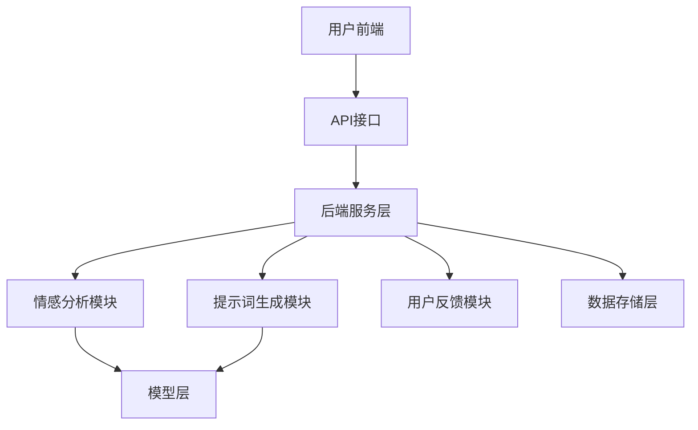
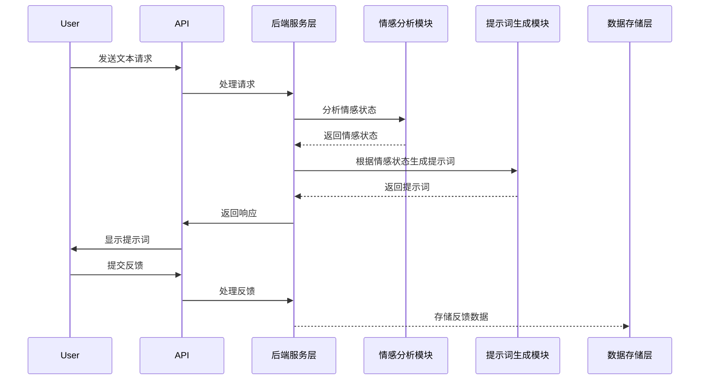

                 

### 第1章：情感计算与个性化表达概述

#### 1.1 情感计算的概念与意义

**情感计算**（Emotional Computing）是指利用计算机技术和人工智能方法来捕捉、处理和模拟人类情感的过程。情感计算的核心目标是理解人的情感状态，并以此为基础实现人与计算机的更自然、更和谐、更具个性化的交互。情感计算不仅涉及到情感识别、情感建模、情感模拟，还包括情感反馈、情感交互等多个方面。

**情感计算的意义**在于它极大地扩展了人工智能的应用领域，使得计算机不再是冰冷的工具，而成为能够理解并响应人类情感的伙伴。具体来说，情感计算的意义可以从以下几个方面来阐述：

1. **提升用户体验**：通过情感计算，计算机可以更好地理解用户的情感状态，从而提供更加个性化、更加符合用户需求的服务。例如，智能语音助手可以根据用户的情绪变化调整说话的语速、语调，以提供更加舒适的用户体验。

2. **改善人机交互**：传统的计算机交互方式往往依赖于键盘、鼠标等输入设备，而情感计算引入了语音、面部表情等更为自然、直观的交互方式，使得人机交互更加便捷、高效。

3. **推动社会进步**：情感计算在医疗、教育、养老等领域有着广泛的应用前景。例如，通过情感计算技术，可以为患有自闭症的孩子提供个性化的教育方案，帮助他们更好地融入社会。

#### 1.2 个性化表达的核心要素

**个性化表达**是指根据不同的用户需求、情感状态、行为习惯等，为用户提供定制化的内容和交互体验。个性化表达的核心要素主要包括：

1. **用户需求识别**：这是个性化表达的基础。通过收集和分析用户的历史行为数据、社交信息、偏好设置等，可以准确地识别出用户的需求和期望。

2. **个性化内容生成**：基于用户需求的识别，系统需要生成符合用户口味的内容。这可以通过自然语言生成、图像生成等技术来实现。

3. **交互反馈优化**：个性化表达不仅仅是单向的内容推送，还需要根据用户的反馈进行调整和优化。这包括用户的满意度调查、交互行为的分析等，以不断改进交互体验。

#### 1.3 情感计算与个性化表达的关系

**情感计算**与**个性化表达**之间存在着密切的联系。情感计算为个性化表达提供了重要的基础，使得系统可以更加精准地理解用户的情感状态，从而实现更加个性化的内容生成和交互设计。

1. **情感计算推动个性化表达**：情感计算可以帮助系统捕捉用户的情感变化，从而生成更加符合用户情感状态的内容。例如，在电商平台上，系统可以根据用户的情感分析结果，推荐符合用户情绪的商品，提升购买体验。

2. **个性化表达促进情感计算发展**：个性化表达的需求推动了情感计算技术的不断发展。随着个性化表达的深入应用，对情感计算技术的需求也越来越高，这促使研究人员不断探索新的算法和技术，以提升情感计算的准确性和实用性。

### 总结

本章概述了情感计算与个性化表达的基本概念、核心要素及其相互关系。通过本章的介绍，读者可以初步了解情感计算在个性化表达中的应用价值，以及两者之间的相互作用。在接下来的章节中，我们将深入探讨提示词工程在情感计算中的具体应用，进一步揭示个性化表达的技术实现路径。

---

#### 1.4 情感计算的发展历程

情感计算作为人工智能的一个重要分支，其发展历程可以追溯到20世纪80年代。以下是情感计算发展的重要里程碑：

**1980年代：情感计算概念的提出**  
20世纪80年代初，计算机科学家和心理学家开始探讨如何让计算机理解和模拟人类情感。此阶段的主要成果包括情感识别和情感建模的初步研究。

**1990年代：情感计算技术初步应用**  
随着计算机性能的提升和人工智能技术的进步，情感计算开始应用于实际场景。例如，1995年，IBM的“沃森”超级计算机在电视节目《危险边缘》中展现了强大的自然语言处理能力，标志着情感计算在自然语言处理领域的重要突破。

**2000年代：情感计算进入实用阶段**  
进入21世纪，情感计算技术逐渐成熟，开始广泛应用于人机交互、电子商务、教育等领域。例如，智能语音助手和情感分析系统在这一时期得到广泛应用。

**2010年代：情感计算迈向智能化**  
随着深度学习和大数据技术的兴起，情感计算技术得到了进一步的提升。深度学习模型可以更准确地捕捉和模拟人类情感，而大数据则为情感计算提供了丰富的训练数据。

**2020年代：情感计算与个性化表达深度融合**  
当前，情感计算与个性化表达已经深度融合，成为人工智能领域的研究热点。通过情感计算，系统可以更精准地识别用户情感，从而实现更加个性化的内容生成和交互设计。

### 总结

情感计算的发展历程展示了其从理论到应用的演变过程。通过不断的科技进步，情感计算已经从实验室走向实际应用，为个性化表达提供了强有力的技术支持。在接下来的章节中，我们将继续探讨情感计算在个性化表达中的具体应用和技术实现。

---

#### 1.5 个性化表达在情感计算中的应用

个性化表达在情感计算中的应用主要体现在以下几个方面：

**1. 情感识别与分类**

通过情感计算技术，系统可以捕捉和分析用户的情感状态，从而实现情感识别和分类。例如，在社交媒体平台上，系统可以通过分析用户的文字、语音、面部表情等信息，判断用户的情感状态是快乐、悲伤、愤怒还是其他。这种情感识别技术不仅有助于提升用户体验，还可以用于舆情监控和用户行为分析。

**2. 情感驱动的交互设计**

个性化表达的核心目标是为用户提供符合其情感状态的服务和内容。在情感驱动的交互设计中，系统会根据用户的情感变化调整交互方式。例如，当用户表现出情绪低落时，系统可以提供安慰性提示或推荐积极的内容，帮助用户缓解负面情绪。这种情感驱动的交互设计不仅提升了用户满意度，还增强了用户与系统的黏性。

**3. 个性化内容生成**

个性化表达的一个重要应用是生成符合用户情感状态的内容。通过情感计算技术，系统可以识别用户的情感偏好，从而生成更加符合用户需求的内容。例如，在新闻推送中，系统可以根据用户的情感状态推荐符合其情感需求的文章。这种个性化内容生成技术不仅提高了内容的吸引力，还增强了用户对系统的依赖性。

**4. 情感分析在用户体验优化中的应用**

情感计算技术可以用于分析用户的情感反馈，从而优化用户体验。例如，在电商平台中，系统可以通过分析用户的情感评分和评论，识别用户的不满情绪，并及时采取措施解决问题，提高用户满意度。这种情感分析技术有助于提升企业的服务质量，增强用户忠诚度。

**5. 情感驱动的个性化推荐**

情感计算在个性化推荐中的应用也非常广泛。通过分析用户的情感状态，系统可以推荐符合用户情感需求的产品和服务。例如，在电商平台上，系统可以根据用户的情感偏好推荐符合其情绪状态的商品，提高购买转化率。这种情感驱动的个性化推荐技术不仅提升了销售业绩，还增强了用户购物体验。

**6. 情感计算在教育中的应用**

在教育领域，情感计算技术可以用于个性化教学和情感辅导。通过分析学生的情感状态，系统可以提供个性化的学习资源和辅导方案，帮助学生更好地调节情绪，提高学习效果。例如，在在线教育平台上，系统可以根据学生的情感变化调整教学内容和难度，提供更加适合学生的学习环境。

### 总结

个性化表达在情感计算中的应用展示了情感计算技术的实际价值。通过情感识别、情感驱动交互、个性化内容生成等技术，情感计算为个性化表达提供了强有力的支持，推动了人工智能与人类情感的深度融合。在接下来的章节中，我们将进一步探讨提示词工程在情感计算中的应用，揭示个性化表达的技术实现路径。

---

#### 1.6 情感计算与个性化表达的边界与外延

**边界定义**

情感计算与个性化表达之间存在着明确的边界。情感计算侧重于理解用户的情感状态，而个性化表达则侧重于根据情感状态提供定制化的内容和交互体验。具体来说：

- **情感计算**主要关注情感识别、情感分类、情感模拟等技术，其目的是捕捉和模拟人类情感。
- **个性化表达**则侧重于如何基于情感计算的结果，生成符合用户情感需求的内容和交互设计。

**外延拓展**

情感计算与个性化表达的外延可以进一步拓展到多个领域：

- **人机交互**：通过情感计算技术，可以设计出更加自然、人性化的交互界面，提升用户体验。
- **用户行为分析**：情感计算可以帮助企业更好地理解用户行为，从而提供个性化的服务和产品推荐。
- **情感治疗与心理健康**：情感计算技术可以用于情感治疗和心理健康监测，提供个性化的心理支持和辅导。
- **教育**：在教育领域，情感计算可以用于个性化教学和情感辅导，提高学习效果。
- **医疗健康**：情感计算在医疗健康领域也有广泛应用，如患者情绪监测、心理健康评估等。

**概念结构与核心要素**

情感计算与个性化表达的概念结构可以简化为以下几个核心要素：

- **情感识别**：通过技术手段识别用户的情感状态。
- **情感建模**：构建情感模型，模拟和理解情感变化。
- **个性化内容生成**：根据情感状态生成符合用户需求的内容。
- **情感驱动交互**：基于情感状态设计交互方式，提升用户满意度。

**总结**

情感计算与个性化表达在边界上各有侧重，但在外延上相互拓展。通过理解两者的关系，我们可以更好地利用情感计算技术，实现更加精准、高效的个性化表达。

---

### 第2章：提示词工程的基本原理

#### 2.1 提示词工程的概念与目的

**提示词工程**（Prompt Engineering）是指利用计算机技术和人工智能方法，设计和优化用于引导模型生成输出的提示词（prompt）的过程。提示词工程的核心目的是通过设计高质量的提示词，引导模型生成更加准确、相关、有价值的输出。在自然语言处理、对话系统、内容生成等领域，提示词工程具有至关重要的作用。

**提示词工程的目的**主要包括以下几个方面：

1. **提升生成质量**：通过设计精炼、准确的提示词，引导模型生成高质量的内容，减少错误和冗余信息。
2. **增强模型可解释性**：高质量的提示词有助于提升模型的可解释性，使得用户能够理解模型的决策过程和输出结果。
3. **优化用户体验**：通过设计个性化的提示词，提升用户与系统的交互体验，满足用户的需求和期望。
4. **提高生产效率**：提示词工程有助于优化模型训练和生成过程，提高生产效率和资源利用率。

#### 2.2 提示词类型与特点

根据应用场景和需求，提示词可以分为以下几种类型：

1. **语义提示词**：这类提示词主要用于引导模型理解文本的语义信息。语义提示词通常包含关键词、短语或句子，有助于模型捕捉文本的主题、意图和上下文。例如，在问答系统中，语义提示词可以帮助模型理解用户的问题，生成准确的回答。

2. **语境提示词**：语境提示词用于引导模型理解文本的具体语境。这类提示词通常包含场景信息、时间、地点等，有助于模型生成符合特定场景的内容。例如，在生成旅行攻略时，语境提示词可以包含旅游地点、时间、活动等信息。

3. **情感提示词**：情感提示词用于引导模型生成符合情感需求的内容。这类提示词通常包含情感词汇、情感色彩等，有助于模型理解用户的情感状态，生成具有相应情感色彩的内容。例如，在生成安慰性消息时，情感提示词可以包含温柔、关怀等词汇。

#### 2.3 提示词工程的核心任务

提示词工程的核心任务包括以下几个方面：

1. **提示词设计**：设计高质量的提示词是提示词工程的第一步。设计提示词时，需要考虑文本的语义、语境和情感需求，确保提示词能够准确引导模型生成所需内容。

2. **提示词优化**：在模型训练和生成过程中，对提示词进行持续优化，以提升生成质量。优化方法包括调整提示词的语义、增加提示词的多样性、减少冗余信息等。

3. **提示词应用**：将设计好的提示词应用于实际场景中，例如问答系统、内容生成、对话系统等。在实际应用中，需要根据反馈不断调整和优化提示词，以提升用户体验。

4. **提示词评估**：对提示词的生成效果进行评估，包括生成质量、准确性、用户满意度等指标。评估方法可以采用人工评估、自动化评估等。

### 总结

提示词工程是情感计算和个性化表达的重要组成部分。通过设计和优化提示词，可以引导模型生成高质量、符合用户需求的内容。在接下来的章节中，我们将进一步探讨提示词工程的具体技术方法和应用场景。

---

### 2.4 提示词工程的核心任务：提示词设计与优化

提示词工程的核心任务之一是设计高质量的提示词，并对其进行持续优化。这一过程涉及多个关键步骤，包括初步设计、优化策略和评估方法。以下是详细的分析和步骤：

#### 2.4.1 提示词初步设计

**1. 确定目标场景**

在设计提示词之前，首先要明确目标场景和任务。不同的场景和应用对提示词的需求有所不同。例如，在问答系统中，提示词需要引导模型理解用户的问题，生成准确的回答；而在内容生成任务中，提示词需要引导模型生成具有特定主题或情感色彩的内容。

**2. 收集和分析数据**

根据目标场景，收集相关的数据集，并进行预处理和分析。数据集应包含与任务相关的文本、语义信息、语境和情感标签等。通过数据集的分析，可以识别出关键要素和潜在的提示词。

**3. 确定提示词类型**

根据任务需求，确定使用哪种类型的提示词。常用的提示词类型包括语义提示词、语境提示词和情感提示词。例如，在问答系统中，可能需要使用语义提示词来捕捉问题的核心信息；在情感生成任务中，可能需要使用情感提示词来引导模型生成符合情感需求的内容。

**4. 创造提示词**

根据数据集和任务需求，创造提示词。提示词应具有简洁、明确、富有启发性的特点，能够引导模型生成高质量的内容。例如，在生成一个情感色彩强烈的文本时，可以使用具体的情感词汇和短语来创造提示词，如“温暖的阳光”、“深深的悲伤”等。

#### 2.4.2 提示词优化策略

**1. 提高提示词的语义精度**

优化提示词的一个关键策略是提高其语义精度。可以通过以下方法实现：

- **词义明确化**：确保提示词的词义清晰，避免歧义。例如，将“快乐”替换为“愉悦”、“欣喜”等。
- **增加上下文信息**：在提示词中增加上下文信息，帮助模型更好地理解语义。例如，在生成旅游攻略时，提示词可以包括地点、时间、活动等详细信息。
- **利用词向量**：通过词向量技术，识别语义相似或相关的词汇，优化提示词的语义表达。

**2. 提高提示词的多样性**

为了提高生成内容的质量和丰富性，提示词需要具备多样性。以下是一些优化策略：

- **词汇替换**：使用同义词、近义词替换原有词汇，增加提示词的多样性。例如，将“美丽”替换为“绚丽”、“迷人”等。
- **短语扩展**：在提示词中增加短语或句子，使其更具描述性和多样性。例如，在生成文本时，可以加入具体的场景描述，如“清晨的阳光洒在湖面上，微风轻拂，让人心旷神怡”。
- **引入随机性**：通过引入随机元素，增加提示词的多样性。例如，在问答系统中，可以使用随机关键词来引导模型生成不同的问题。

**3. 结合情感和语境**

在提示词设计中，情感和语境是关键因素。以下是一些优化策略：

- **情感融入**：在提示词中融入情感词汇，使其更具情感色彩。例如，在生成安慰性文本时，可以使用“关爱”、“温暖”等词汇。
- **语境匹配**：确保提示词与语境相符，避免生成不相关或不符合情境的内容。例如，在描述美食时，提示词应包含食材、烹饪方法、口感等。

#### 2.4.3 提示词评估方法

评估提示词的质量和效果是提示词工程的重要环节。以下是一些常用的评估方法：

- **人工评估**：通过专家或用户对提示词进行主观评价，判断其是否满足任务需求、是否具有启发性和准确性。
- **自动化评估**：使用自动化工具评估提示词的质量，如语义相似度、情感分析、上下文匹配等。常用的自动化评估指标包括F1值、准确率、召回率等。
- **生成效果评估**：通过实际生成效果来评估提示词的质量。例如，在问答系统中，可以评估生成的回答是否准确、相关和符合用户需求。

### 总结

提示词工程的核心任务包括初步设计、优化策略和评估方法。通过精细化的设计、科学的优化和全面的评估，提示词工程能够引导模型生成高质量、符合用户需求的内容，为情感计算和个性化表达提供强有力的支持。

---

### 2.5 提示词工程在个性化表达中的应用场景

**1. 智能客服系统**

智能客服系统通过提示词工程实现高度个性化的客户服务。系统会根据用户的历史交互记录和当前的情感状态，设计个性化的对话策略。例如，当用户表达出愤怒的情感时，系统可能会使用安慰性、温和的提示词，而如果用户表现出满意或愉悦的情感，系统则会使用积极的、鼓励性的提示词，以提升用户满意度和忠诚度。

**2. 个性化内容推荐**

在内容推荐系统中，提示词工程用于生成个性化的推荐内容。系统会根据用户的浏览历史、搜索记录和情感偏好，设计特定的提示词，引导推荐模型生成符合用户情感需求的内容。例如，如果用户在阅读一篇关于旅行的文章后表现出兴奋和期待的情感，系统可能会推荐相关的旅行攻略、景点介绍等，以进一步提升用户的兴趣和参与度。

**3. 情感分析与舆情监控**

在情感分析应用中，提示词工程用于分析用户在社交媒体、论坛等平台上的言论，识别情感倾向。系统会根据用户的情感状态，设计特定的提示词，引导情感分析模型生成更准确、更具针对性的情感标签。例如，在舆情监控中，系统可能会使用敏感词汇和情感词汇作为提示词，以识别和预警可能的社会不稳定因素。

**4. 健康与心理健康管理**

在健康管理应用中，提示词工程用于生成个性化的健康建议和情感关怀。系统会根据用户的健康数据、生活习惯和情感状态，设计个性化的提示词，引导健康模型生成符合用户需求的健康建议。例如，如果用户在检测中表现出焦虑和压力，系统可能会推荐放松技巧、心理健康咨询等，以帮助用户缓解负面情绪。

**5. 教育与学习辅助**

在教育领域，提示词工程用于设计个性化的教学方案和辅导内容。系统会根据学生的学习进度、知识掌握情况和情感状态，设计特定的提示词，引导教学模型生成符合学生需求的辅导材料。例如，对于学习困难的学生，系统可能会使用鼓励性、激励性的提示词，以增强他们的学习动力和自信心。

**6. 人机对话系统**

在人机对话系统中，提示词工程用于生成自然、流畅的对话内容。系统会根据用户的提问和情感状态，设计个性化的对话策略。例如，当用户提问关于特定话题时，系统可能会使用详细、专业的提示词来生成高质量的回答；当用户表现出困惑或不耐烦时，系统可能会使用安抚性、简洁明了的提示词来引导对话，以提升用户体验。

### 总结

提示词工程在个性化表达中具有广泛的应用场景。通过设计高质量的提示词，系统可以更准确地理解用户需求，生成符合用户情感状态的内容，提升用户体验和满意度。在实际应用中，提示词工程的技术和策略需要不断优化和调整，以满足不断变化的需求和场景。

---

### 2.6 提示词工程在情感计算中的评估与优化

提示词工程在情感计算中的效果直接影响到系统性能和用户体验。因此，对提示词进行有效的评估与优化至关重要。以下将从评估指标、优化方法和技术手段三个方面详细探讨提示词工程在情感计算中的评估与优化。

#### 2.6.1 提示词工程评估指标

1. **生成质量**：
   - **准确性**：提示词引导模型生成的输出是否准确。常用的评估方法包括准确率（Accuracy）和精确率（Precision）。
   - **相关性**：生成的输出是否与用户需求相关。可以使用相关性指标（如相关系数、Jaccard相似度）来评估。
   - **完整性**：生成的输出是否包含用户需求的所有关键信息。可以通过文本相似度或信息覆盖率来评估。

2. **用户满意度**：
   - **满意度评分**：用户对系统生成内容的满意度评分。可以通过问卷调查、用户反馈等方式获取。
   - **交互时长**：用户与系统的交互时间，用于评估用户的参与度和兴趣度。

3. **模型性能**：
   - **训练效率**：提示词设计对模型训练时间的影响。
   - **推理效率**：模型在生成输出时的效率，包括响应时间和计算资源消耗。

#### 2.6.2 提示词工程优化方法

1. **提示词调整**：
   - **语义调整**：根据模型反馈和用户需求，调整提示词的语义，使其更准确地反映用户需求。
   - **语境优化**：增强提示词的语境信息，提升模型对上下文的理解能力。
   - **情感增强**：在提示词中融入情感元素，使其更具表现力和感染力。

2. **模型参数优化**：
   - **超参数调整**：通过调整模型超参数（如学习率、批量大小等），优化模型性能。
   - **微调**：在提示词基础上，对模型进行微调，提升生成质量。

3. **数据增强**：
   - **数据扩充**：通过数据增强技术（如数据合成、数据变换等），增加训练数据多样性，提高模型泛化能力。
   - **标注增强**：在数据标注过程中，引入更多的上下文信息和情感标签，丰富提示词的语义和情感信息。

4. **用户反馈机制**：
   - **反馈收集**：定期收集用户反馈，了解用户需求和偏好。
   - **反馈整合**：将用户反馈整合到提示词设计中，不断迭代优化。

#### 2.6.3 技术手段

1. **自然语言处理技术**：
   - **语义分析**：使用词向量、语义角色标注等技术，分析提示词的语义信息。
   - **情感分析**：利用情感词典、情感分析模型，评估提示词的情感色彩。

2. **机器学习与深度学习**：
   - **生成对抗网络（GAN）**：使用GAN生成高质量、多样化的提示词。
   - **强化学习**：通过强化学习，优化提示词设计，提高生成效果。

3. **用户行为分析**：
   - **行为跟踪**：跟踪用户在系统中的行为，了解用户偏好和情感状态。
   - **行为预测**：利用用户行为数据，预测用户需求，优化提示词设计。

### 总结

提示词工程在情感计算中的评估与优化是一个复杂的过程，需要综合考虑生成质量、用户满意度、模型性能等多个方面。通过设计科学的评估指标、采用有效的优化方法和技术手段，可以不断提升提示词工程在情感计算中的应用效果，为个性化表达和用户满意度提供有力支持。

---

### 第3章：基于机器学习的提示词生成

#### 3.1 机器学习基础

**机器学习**（Machine Learning，ML）是指通过算法和统计模型，从数据中自动发现模式和知识的过程。机器学习广泛应用于各种领域，如图像识别、自然语言处理、金融预测、医疗诊断等。以下是机器学习的一些基本概念和应用场景：

**1. 基本概念**

- **监督学习**（Supervised Learning）：在监督学习任务中，模型通过已标记的训练数据学习，并尝试预测未知数据的结果。常见的算法包括线性回归、决策树、支持向量机（SVM）等。

- **无监督学习**（Unsupervised Learning）：无监督学习任务中，模型没有预先标记的训练数据，需要从数据中发现隐含的结构和模式。常见的算法包括聚类、主成分分析（PCA）、自编码器等。

- **强化学习**（Reinforcement Learning）：强化学习是通过与环境互动，不断调整策略以最大化累积奖励的过程。常见的算法包括Q学习、深度Q网络（DQN）、策略梯度方法等。

**2. 应用场景**

- **图像识别**：利用卷积神经网络（CNN）进行图像分类、物体检测等。

- **自然语言处理**：应用文本分类、情感分析、机器翻译、问答系统等。

- **金融预测**：预测股票市场趋势、风险评估、信用评分等。

- **医疗诊断**：辅助诊断、疾病预测、药物发现等。

**3. 算法分类**

- **传统算法**：包括线性回归、决策树、支持向量机（SVM）等。

- **深度学习算法**：包括卷积神经网络（CNN）、循环神经网络（RNN）、生成对抗网络（GAN）等。

#### 3.2 提示词生成算法

**提示词生成**（Prompt Generation）是机器学习在自然语言处理中的一个重要应用。其核心目标是通过分析用户输入的文本，生成具有特定语义和情感色彩的提示词，以引导模型生成符合用户需求的内容。以下是几种常见的提示词生成算法：

**1. 序列生成模型**

- **循环神经网络（RNN）**：RNN可以处理变长的序列数据，能够捕捉时间序列中的依赖关系。通过训练，RNN可以生成与用户输入文本相关的提示词。

- **长短期记忆网络（LSTM）**：LSTM是RNN的一种变体，通过引入门控机制，能够更好地捕获长距离依赖关系，从而生成更加精准的提示词。

- **门控循环单元（GRU）**：GRU是LSTM的另一种变体，通过简化门控机制，提高了计算效率，适用于大规模数据集的提示词生成。

**2. 嵌入式模型**

- **词嵌入（Word Embedding）**：词嵌入将文本中的词语映射到低维连续向量空间中，便于模型处理和计算。通过训练词嵌入模型，可以生成与用户输入文本相关的词汇向量，作为提示词的一部分。

- **BERT（Bidirectional Encoder Representations from Transformers）**：BERT是一种基于Transformer的预训练模型，通过双向编码器生成文本的上下文表示，可以用于生成高质量的提示词。

**3. 聚类与降维方法**

- **K-means聚类**：K-means是一种基于距离的聚类算法，可以将文本数据划分为多个簇，每个簇内的文本具有相似的语义特征。通过聚类结果，可以生成具有相似语义的提示词。

- **主成分分析（PCA）**：PCA是一种降维方法，通过保留数据的主要信息，减少冗余特征，可以生成简洁、有效的提示词。

**4. 生成对抗网络（GAN）**

- **生成对抗网络（GAN）**：GAN由生成器和判别器组成，生成器生成文本数据，判别器判断文本的逼真度。通过训练，GAN可以生成高质量、多样化的提示词。

### 总结

基于机器学习的提示词生成技术为个性化表达和情感计算提供了强大的工具。通过序列生成模型、嵌入式模型、聚类与降维方法以及GAN等技术，系统可以生成高质量的提示词，引导模型生成符合用户需求的内容。在接下来的章节中，我们将进一步探讨深度学习在提示词工程中的应用，提升提示词生成的效果。

---

### 3.3 提示词生成算法案例：情感分析

在情感分析领域，提示词生成算法被广泛应用于情感识别、情感分类和情感驱动的个性化内容生成。以下通过一个具体案例，详细介绍提示词生成算法在情感分析中的应用过程。

**案例背景**：假设我们正在开发一个社交媒体情感分析系统，该系统需要根据用户的评论内容自动识别情感，并根据情感生成个性化的回复。

**数据集**：我们使用了一个包含数万条社交媒体评论的数据集，每条评论都带有情感标签（如正面、负面、中性）。数据集已经进行了预处理，包括去除停用词、标点符号和低频词汇等。

**算法选择**：为了生成高质量的提示词，我们选择了以下两种算法：

1. **基于RNN的序列生成模型**：RNN能够处理变长的序列数据，并捕捉时间序列中的依赖关系，非常适合生成与用户评论内容相关的提示词。
2. **BERT嵌入式模型**：BERT是一种预训练的Transformer模型，能够生成高质量的文本表示，有助于提升提示词的语义准确性。

**1. 数据预处理**

首先，对评论数据集进行预处理，包括：

- 去除标点符号和特殊字符。
- 转化为小写，统一文本格式。
- 去除停用词，保留有意义的关键词。

**2. 模型训练**

（1）基于RNN的序列生成模型训练：

- 数据集分为训练集和验证集，训练集用于模型训练，验证集用于模型评估。
- 构建RNN模型，包括输入层、隐藏层和输出层。输入层接收预处理后的评论文本，隐藏层负责捕捉序列特征，输出层生成情感相关的提示词。
- 使用训练集数据进行模型训练，优化模型参数。

（2）BERT嵌入式模型训练：

- 加载预训练的BERT模型，使用其预训练的权重。
- 对评论文本进行编码，生成文本向量。
- 使用这些向量作为提示词输入，训练生成模型，输出与情感相关的提示词。

**3. 提示词生成**

在模型训练完成后，使用以下步骤生成提示词：

- 输入用户评论文本，通过RNN模型和BERT模型生成提示词。
- 对生成的提示词进行后处理，包括去除冗余词汇、调整语义等，确保提示词的准确性和可读性。

**4. 情感识别与个性化回复**

- 将生成的提示词应用于情感识别任务，根据提示词的情感倾向判断评论的情感标签。
- 根据评论的情感标签，生成个性化的回复。例如，如果评论为正面情感，提示词可能包含鼓励性、积极性的词汇；如果评论为负面情感，提示词可能包含安慰性、缓解压力的词汇。

**5. 实际应用**

在实际应用中，系统会根据用户评论的内容和情感状态，动态生成提示词，提供个性化的情感反馈和回复。例如，当用户在社交媒体上发布一条负面评论时，系统可能会生成如下提示词：

"看起来你今天有些低落，需要谈谈吗？我在这，随时愿意倾听。"

这种个性化的回复有助于提升用户满意度，增强用户与系统的互动。

### 总结

通过本案例，我们展示了基于机器学习的提示词生成算法在情感分析中的应用过程。从数据预处理到模型训练，再到提示词生成和应用，每个步骤都体现了提示词工程在情感计算中的重要价值。通过高质量提示词的生成，系统能够更准确地识别情感，提供个性化的交互体验，为用户带来更好的使用体验。

---

### 第4章：深度学习在提示词工程中的应用

#### 4.1 深度学习基础

**深度学习**（Deep Learning，DL）是机器学习的一个分支，其核心思想是通过多层神经网络来模拟人类大脑的处理方式，从而实现复杂的模式识别和决策。深度学习在自然语言处理、计算机视觉、语音识别等领域取得了显著的成果，其基本概念和原理如下：

**1. 神经网络**

神经网络（Neural Network，NN）是深度学习的基础模型。一个简单的神经网络包括输入层、隐藏层和输出层。输入层接收外部数据，隐藏层通过非线性变换处理数据，输出层生成最终的输出结果。神经元是神经网络的基本单元，通过加权连接实现信息传递和计算。

**2. 激活函数**

激活函数（Activation Function）是神经网络中的关键组件，用于引入非线性特性。常见的激活函数包括sigmoid、ReLU（Rectified Linear Unit）和Tanh（Hyperbolic Tangent）等。

**3. 前向传播与反向传播**

前向传播（Forward Propagation）是神经网络处理数据的过程，从输入层开始，逐步传递到隐藏层和输出层。反向传播（Backpropagation）是训练神经网络的过程，通过计算输出误差，反向传播误差到隐藏层和输入层，更新网络参数。

**4. 损失函数**

损失函数（Loss Function）用于衡量模型预测值与实际值之间的差异。常见的损失函数包括均方误差（MSE，Mean Squared Error）、交叉熵损失（Cross-Entropy Loss）等。通过优化损失函数，可以调整网络参数，提升模型性能。

#### 4.2 深度学习模型与提示词工程

**深度学习模型**在**提示词工程**中的应用主要体现在以下几个方面：

**1. 自然语言处理（NLP）模型**

- **卷积神经网络（CNN）**：CNN在文本分类、情感分析等任务中具有广泛的应用。通过卷积层捕捉文本的局部特征，CNN可以生成高质量的提示词。

- **循环神经网络（RNN）**：RNN能够处理变长的序列数据，适用于生成与用户输入相关的提示词。LSTM和GRU等变体进一步提升了RNN的性能。

- **Transformer模型**：Transformer引入了自注意力机制，可以同时关注输入序列中的所有信息。BERT、GPT等基于Transformer的模型在提示词工程中表现出色。

**2. 生成模型**

- **生成对抗网络（GAN）**：GAN由生成器和判别器组成，生成器生成文本数据，判别器判断文本的逼真度。GAN可以生成高质量的提示词，提高生成内容的多样性和创造力。

- **变分自编码器（VAE）**：VAE通过引入变分推断机制，可以生成具有多样性的文本数据，适用于提示词生成。

#### 4.3 深度学习在个性化表达中的应用

**深度学习**在**个性化表达**中的应用使得系统能够根据用户情感状态生成定制化的内容和交互体验。以下是几个典型的应用场景：

**1. 情感识别与情感驱动交互**

通过深度学习模型，系统可以准确识别用户的情感状态，并生成相应的情感标签。基于情感标签，系统能够调整交互策略，提供个性化的互动体验。例如，在客服系统中，当用户表现出愤怒的情感时，系统可以自动生成安慰性回复，缓解用户的情绪。

**2. 个性化内容生成**

深度学习模型可以生成与用户兴趣和情感需求相关的个性化内容。例如，在新闻推荐系统中，系统可以根据用户的情感状态和兴趣偏好，生成符合用户情感需求的文章和视频。

**3. 个性化对话系统**

通过深度学习模型，系统可以生成与用户自然对话的个性化回复。例如，在智能语音助手中，系统可以根据用户的情感状态和提问内容，生成具有情感色彩和语用逻辑的回复。

### 总结

深度学习在提示词工程中的应用极大地提升了生成内容的质量和个性化程度。通过卷积神经网络、循环神经网络、生成对抗网络等深度学习模型，系统可以生成高质量的提示词，实现情感识别、个性化内容生成和情感驱动交互。在接下来的章节中，我们将深入探讨深度学习在提示词工程中的具体应用，进一步提升个性化表达的效果。

---

### 4.4 深度学习模型与提示词工程的详细案例分析

**案例背景**：本案例旨在探讨深度学习模型在提示词工程中的应用，通过一个实际的情感分析系统，展示如何利用深度学习模型生成高质量的提示词，以实现个性化表达。

**系统需求**：系统需要能够根据用户的情感状态，生成个性化的、有针对性的回复，以提高用户满意度和系统的互动质量。

**数据集**：使用了一个包含用户评论及其情感标签的数据集，数据集经过预处理，去除停用词、标点符号和低频词汇，并进行了词嵌入。

**算法选择**：选择Transformer模型（如BERT）进行情感分析，并利用生成对抗网络（GAN）生成高质量的提示词。

**步骤 1：情感分析模型构建**

1. **数据预处理**：对评论文本进行预处理，包括分词、词嵌入和序列化。使用BERT模型进行文本编码，生成固定长度的文本向量。

2. **模型训练**：构建基于BERT的情感分析模型，包括输入层、隐藏层和输出层。输入层接收处理后的文本向量，隐藏层通过自注意力机制处理文本信息，输出层生成情感标签。

3. **模型优化**：使用训练集数据训练模型，优化模型参数。使用交叉熵损失函数评估模型性能，通过反向传播算法更新网络权重。

**步骤 2：生成对抗网络（GAN）构建**

1. **生成器网络**：构建生成器网络，输入为随机噪声，输出为与真实评论相似的高质量提示词。生成器网络采用多层全连接层和激活函数。

2. **判别器网络**：构建判别器网络，输入为真实评论和生成评论，输出为概率分布，用于判断生成评论的逼真度。判别器网络同样采用多层全连接层和激活函数。

3. **GAN训练**：通过训练生成器和判别器的对抗过程，优化生成器生成高质量的提示词。使用梯度提升算法，更新生成器和判别器的参数。

**步骤 3：提示词生成与优化**

1. **提示词生成**：输入用户评论文本，通过BERT模型获取情感特征向量。将情感特征向量输入到生成器网络，生成与情感状态相关的提示词。

2. **提示词后处理**：对生成的提示词进行后处理，包括去除冗余词汇、调整语义和情感色彩，确保提示词的准确性和可读性。

3. **优化策略**：根据用户反馈和模型性能，不断调整提示词生成策略。例如，通过增加情感词汇、调整词序、引入上下文信息等，优化提示词的质量。

**步骤 4：系统部署与评估**

1. **系统部署**：将训练好的模型部署到生产环境，实现实时情感分析和提示词生成。

2. **性能评估**：通过用户满意度调查和模型评价指标（如准确率、召回率等），评估系统的性能。根据评估结果，调整提示词生成策略，优化用户体验。

**结果与总结**

通过本案例，展示了深度学习模型在提示词工程中的应用。利用BERT进行情感分析，结合GAN生成高质量的提示词，系统能够实现个性化表达，提升用户体验和满意度。在后续的优化过程中，通过不断调整提示词生成策略，进一步提高了系统性能和用户互动质量。

---

### 第5章：提示词工程在情感计算中的应用

#### 5.1 情感计算基础

情感计算（Emotional Computing）是人工智能的一个分支，旨在使计算机能够理解、感知和模拟人类情感。情感计算的核心在于捕捉和分析人类的情感状态，从而实现更加自然、直观的人机交互。以下是情感计算的基础概念和组成部分：

**1. 情感识别**：情感识别是情感计算的首要任务，通过技术手段捕捉和识别用户的面部表情、语音、文本等情感信息。常用的情感识别方法包括面部识别、语音识别和文本情感分析等。

**2. 情感分类**：情感分类是指将情感识别结果分类为特定的情感标签，如快乐、悲伤、愤怒等。情感分类有助于系统理解用户的情感状态，从而提供更加个性化的服务。

**3. 情感模拟**：情感模拟是指计算机根据情感识别和分类结果，模拟出相应的情感反应。情感模拟可以用于虚拟助手、智能客服等应用，提升用户体验。

**4. 情感建模**：情感建模是指通过构建数学模型和算法，模拟人类情感的变化和传播。情感建模有助于深入理解情感动态，从而实现更加精准的情感计算。

**5. 情感反馈**：情感反馈是指系统根据用户的情感状态，调整交互方式和内容，以提供更加舒适和个性化的服务。情感反馈可以采用语音、文本、图像等多种形式。

**5.2 提示词工程在情感计算中的个性化应用**

提示词工程在情感计算中的应用主要体现在以下几个方面：

**1. 个性化情感识别**：通过设计高质量的提示词，系统可以更准确地识别用户的情感状态。例如，在情感分析任务中，系统可以使用特定词汇和短语作为提示词，引导模型识别用户的情感倾向。

**2. 情感驱动的交互设计**：提示词工程可以用于设计情感驱动的交互界面，提升用户体验。例如，在虚拟助手应用中，系统可以根据用户的情感状态，调整对话策略和回复内容，使其更加贴合用户的情感需求。

**3. 情感分析在用户行为预测中的应用**：通过情感分析，系统可以预测用户的情感变化和行为趋势。例如，在电商平台上，系统可以根据用户的情感分析结果，预测用户的购买意图，从而提供个性化的产品推荐和优惠活动。

**5.3 情感计算与提示词工程的集成**

情感计算与提示词工程的集成可以通过以下几种方式实现：

**1. 动态调整提示词**：在交互过程中，系统可以根据用户的情感状态动态调整提示词。例如，当用户表现出负面情绪时，系统可以调整提示词，使用安慰性、积极的词汇，以缓解用户的情绪。

**2. 双向反馈机制**：系统可以收集用户的反馈，根据反馈结果不断优化提示词。这种双向反馈机制有助于提升提示词的质量和生成效果。

**3. 情感驱动的模型训练**：在模型训练过程中，系统可以使用情感标签作为辅助信息，提高模型对情感特征的捕捉能力。例如，在训练情感分析模型时，系统可以使用情感标签指导模型学习情感特征，从而提升模型的识别准确性。

**4. 情感感知的自动调整**：通过引入情感感知技术，系统可以自动调整提示词和交互方式，以适应不同的情感场景。例如，在智能客服中，系统可以根据用户的情感状态，自动调整回复语气和内容，提供更加个性化的服务。

### 总结

提示词工程在情感计算中具有重要的应用价值，通过设计高质量的提示词，系统可以更准确地识别用户的情感状态，实现情感驱动的交互设计和用户行为预测。在情感计算与提示词工程的集成过程中，动态调整提示词、双向反馈机制、情感驱动的模型训练和情感感知的自动调整等技术手段，有助于提升系统的性能和用户体验。

---

### 5.4 提示词工程在情感计算中的具体应用场景

提示词工程在情感计算中的具体应用场景广泛，涵盖了社交互动、智能客服、在线教育等多个领域。以下是对这些应用场景的详细探讨：

**1. 社交互动平台**

在社交媒体平台上，提示词工程可以用于分析用户的情感状态，并生成个性化的互动内容。例如，当用户发表了一条情绪低落的帖子时，系统可以自动生成安慰性的提示词，如“你在乎的朋友都在这里，我们一起度过难关。”这种个性化的互动有助于提升用户的社交体验和平台的黏性。

**2. 智能客服系统**

智能客服系统利用提示词工程可以提供更加人性化的客户服务。系统会根据用户的情感状态，自动生成相应的回复。例如，当用户表现出愤怒或不满时，系统可能会使用安抚性、缓解情绪的提示词，如“我理解你的困扰，请给我几分钟时间，我会尽力帮助您解决问题。”这种情感驱动的回复有助于缓解用户的不满情绪，提高客户满意度。

**3. 在线教育平台**

在线教育平台通过提示词工程可以提供个性化的学习建议和辅导内容。系统可以根据学生的学习进度、知识掌握情况和情感状态，生成个性化的学习建议。例如，当学生表现出学习焦虑时，系统可能会生成鼓励性的提示词，如“你已经做得很好了，继续保持，你一定能成功。”这种情感关怀有助于提升学生的学习动力和信心。

**4. 心理健康应用**

心理健康应用利用提示词工程可以为用户提供情感支持和心理咨询。系统会根据用户的心理状态和反馈，生成相应的情感关怀提示词。例如，当用户表示感到焦虑或抑郁时，系统可能会生成安慰性、缓解压力的提示词，如“你不是一个人，我们在这里支持你，请相信一切都会好起来的。”这种个性化的情感支持有助于改善用户的心理健康。

**5. 娱乐与游戏**

在娱乐与游戏领域，提示词工程可以用于生成情感驱动的游戏内容和交互体验。例如，在角色扮演游戏中，系统可以根据玩家的情感状态，生成相应的对话和任务提示词。当玩家表现出兴奋或激动的情感时，系统可能会生成鼓励性、刺激性的提示词，如“你做得很好，继续前进，你即将赢得胜利！”这种情感驱动的交互体验有助于提升游戏的乐趣和吸引力。

**6. 舆情监控**

舆情监控应用利用提示词工程可以实时分析社交媒体上的情感动态，识别潜在的社会不稳定因素。系统会根据情感分析结果，生成相应的监控报告和预警提示词。例如，当系统识别出某一地区出现负面情感倾向时，可能会生成预警提示词，如“请注意，该地区可能存在不稳定情绪，建议加强监控和管理。”这种个性化的舆情监控有助于提前预防和应对潜在风险。

### 总结

提示词工程在情感计算中的具体应用场景丰富多样，涵盖了社交互动、智能客服、在线教育、心理健康、娱乐与游戏、舆情监控等多个领域。通过设计高质量的提示词，系统可以更准确地识别用户的情感状态，提供个性化的服务和建议，提升用户体验和满意度。在未来的发展中，提示词工程与情感计算的深度融合将推动人工智能技术的进一步发展，为各行各业带来更多的创新和机遇。

---

### 5.5 提示词工程与情感计算的集成方法

提示词工程与情感计算的集成是提高人工智能系统个性化表达和用户满意度的重要手段。以下是几种常用的集成方法：

**1. 动态调整提示词**

在用户交互过程中，系统可以根据实时捕捉到的情感信息，动态调整提示词。例如，当用户表现出负面情绪时，系统可以使用安慰性、缓解情绪的词汇。这种方法可以通过情感识别算法和提示词生成算法的实时交互实现，确保系统提供的回应始终符合用户的情感需求。

**2. 双向反馈机制**

系统可以收集用户对提示词的反馈，并根据反馈结果优化提示词。例如，用户可以通过评分或评论的方式表达对提示词的满意度，系统可以根据这些反馈调整提示词的语义、情感色彩和多样性。这种双向反馈机制有助于不断提升提示词的质量，提高用户满意度。

**3. 情感驱动的模型训练**

在模型训练过程中，系统可以使用情感标签作为辅助信息，指导模型学习情感特征。例如，在训练情感分析模型时，系统可以将情感标签作为额外的输入，帮助模型更好地捕捉情感信息。这种方法可以提升模型的情感识别准确性，从而生成更高质量的提示词。

**4. 情感感知的自动调整**

通过引入情感感知技术，系统可以自动调整提示词和交互方式，以适应不同的情感场景。例如，在智能客服中，系统可以根据用户的情感状态自动调整对话的语气、语言和内容，使其更加贴近用户的情感需求。这种自动调整机制有助于提升用户体验，增强系统的交互能力。

**5. 多模态情感识别**

结合文本、语音、面部表情等多种模态的情感信息，可以更全面地了解用户的情感状态。系统可以通过多模态情感识别技术，整合不同模态的情感信息，生成更精准的提示词。例如，在视频聊天中，系统可以同时分析用户的语音、文本和面部表情，生成符合用户情感状态的互动内容。

**6. 情感驱动的推荐系统**

在推荐系统中，系统可以根据用户的情感状态推荐符合用户情感需求的内容。例如，当用户表现出快乐、兴奋的情感时，系统可以推荐积极、愉悦的内容，如搞笑视频、旅行攻略等；当用户表现出悲伤、焦虑的情感时，系统可以推荐安慰性、缓解压力的内容，如心灵鸡汤、放松音乐等。

### 总结

提示词工程与情感计算的集成方法多样，通过动态调整提示词、双向反馈机制、情感驱动的模型训练、情感感知的自动调整、多模态情感识别和情感驱动的推荐系统等手段，系统可以更准确地捕捉用户情感，生成高质量的提示词，提供个性化的表达和交互体验。这些方法的实施有助于提升用户体验和满意度，推动人工智能技术的进一步发展。

---

### 5.6 提示词工程在情感计算中的挑战与未来发展方向

**当前挑战**

1. **情感识别的准确性**：情感识别的准确性是提示词工程的关键。然而，情感表达具有复杂性和多样性，不同文化背景、情感表达方式等都会影响识别的准确性。

2. **多模态情感感知**：当前情感计算主要依赖于文本和面部表情等单一模态的情感信息。结合语音、姿态等多种模态的情感信息，实现更全面、精准的情感识别是未来的挑战。

3. **隐私保护**：在情感计算过程中，需要处理大量的个人情感数据。保护用户隐私、防止数据泄露是当前面临的重要问题。

**未来发展方向**

1. **跨模态情感感知**：未来的研究将致力于融合多种模态的情感信息，提高情感识别的准确性。例如，通过结合文本、语音、面部表情、生理信号等多种模态，构建全面、精准的情感感知系统。

2. **情感计算伦理**：随着情感计算技术的普及，其伦理问题日益凸显。未来的研究需要关注情感计算的伦理问题，确保技术的应用符合伦理标准，保护用户隐私。

3. **个性化情感识别**：未来的研究将更加关注个性化情感识别技术，通过用户行为、历史数据等个性化信息，提高情感识别的准确性和针对性。

4. **多语言情感计算**：随着全球化的发展，多语言情感计算成为研究的热点。未来的研究将致力于开发能够处理多种语言情感信息的技术，实现全球范围内的情感计算应用。

5. **情感计算与心理健康**：情感计算在心理健康领域的应用潜力巨大。未来的研究将探索如何利用情感计算技术，为用户提供个性化的心理支持和辅导，改善心理健康状况。

### 总结

提示词工程在情感计算中的应用面临诸多挑战，同时也具有广阔的发展前景。通过不断提升情感识别的准确性、融合多模态情感信息、关注伦理问题，以及探索个性化情感识别和多语言情感计算，情感计算技术将实现更加精准、高效、个性化的应用，为人类社会带来更多的创新和价值。

---

### 第6章：个性化表达在不同领域的应用

#### 6.1 社交媒体

在社交媒体领域，个性化表达已经成为提升用户体验和增加用户黏性的关键因素。通过情感计算和提示词工程，社交媒体平台能够为用户提供更加符合其情感需求和兴趣的内容。以下是一些具体的应用实例：

**1. 情感驱动的信息推送**

社交媒体平台如Facebook、Instagram等，通过情感计算分析用户的情感状态和偏好，为用户推荐符合其情感需求的内容。例如，当用户在评论区表达出负面情感时，平台可能会推送一些鼓舞人心的新闻或帖子，以提升用户的情绪状态。

**2. 个性化内容生成**

社交媒体平台还可以利用提示词工程生成个性化的内容。例如，当用户在社交媒体上分享生活点滴时，平台可以根据用户的情感状态和兴趣，生成相应的贴文标签或描述，如“今天是个美好的一天！”或“忙碌的一天结束了，感谢有你陪伴。”

**3. 社交互动优化**

通过情感分析和提示词工程，社交媒体平台可以优化用户之间的互动。例如，当用户参与一个讨论时，系统可以根据参与者的情感状态，生成鼓励性或安慰性的评论，以促进更加积极的社交互动。

**4. 情感分析在舆情监控中的应用**

社交媒体平台还可以利用情感分析技术监控用户情绪，识别潜在的社会不稳定因素。例如，当某一话题在平台上的讨论情绪突然转向负面时，系统可以自动生成预警提示词，提醒管理人员采取相应措施。

### 6.2 虚拟助手

虚拟助手是另一个广泛应用个性化表达技术的领域。通过情感计算和提示词工程，虚拟助手能够为用户提供更加自然、个性化的交互体验。以下是一些具体的应用实例：

**1. 情感识别与响应**

虚拟助手可以通过情感计算识别用户的情感状态，并根据用户的情绪调整交互方式。例如，当用户表现出焦虑或愤怒时，虚拟助手可能会使用安抚性或安慰性的词汇，如“不要担心，我在这里帮助你。”或“我理解你的困扰，让我们一步一步解决它。”

**2. 个性化对话生成**

虚拟助手利用提示词工程可以生成个性化的对话内容。例如，当用户询问天气情况时，虚拟助手可以根据用户的情感状态和地理位置，生成具有情感色彩的回答，如“今天是个明媚的晴天，希望你能有个好心情！”或“外面风大，请注意保暖。”

**3. 跨平台互动**

虚拟助手可以通过集成不同的平台，如社交媒体、聊天应用等，为用户提供跨平台的个性化服务。例如，当用户在社交媒体上发布一条情感状态更新时，虚拟助手可以在多个平台上同步生成相应的回复，如“嘿，看起来你今天有些低落，需要聊聊吗？”

**4. 情感驱动的任务管理**

虚拟助手还可以帮助用户管理任务，并根据用户的情感状态提供相应的建议。例如，当用户感到压力较大时，虚拟助手可能会提醒用户休息、锻炼或寻求帮助，以缓解压力。

### 6.3 娱乐与游戏

在娱乐与游戏领域，个性化表达技术同样发挥了重要作用。通过情感计算和提示词工程，游戏和娱乐内容能够更加符合用户的情感需求和兴趣。以下是一些具体的应用实例：

**1. 情感驱动的游戏体验**

游戏设计者可以利用情感计算技术，根据用户的情感状态调整游戏的难度、场景和互动方式。例如，当用户表现出兴奋或激动的情感时，游戏可能会增加挑战性或提供奖励；当用户表现出疲惫或沮丧的情感时，游戏可能会降低难度或提供休息选项。

**2. 个性化游戏剧情**

通过提示词工程，游戏可以生成个性化的剧情和对话，提高用户的沉浸感和参与度。例如，角色扮演游戏可以根据玩家的情感状态和选择，生成不同的故事情节和对话选项，如“你感到愤怒，决定报复敌人。”或“你感到悲伤，选择独自一人探险。”

**3. 情感驱动的内容推荐**

娱乐平台可以利用情感计算技术，根据用户的情感状态推荐符合其情感需求的内容。例如，当用户在观看一部悲伤的电影时，平台可能会推荐类似的情感电影，以增强用户的情感体验。

**4. 情感感知的虚拟现实（VR）体验**

在虚拟现实领域，情感计算技术可以用来感知用户的情感状态，并实时调整VR体验。例如，当用户在VR游戏中感到紧张时，系统可以降低场景的紧张程度，提供放松的选项，如舒适的背景音乐或舒缓的视觉效果。

### 总结

个性化表达在社交媒体、虚拟助手、娱乐与游戏等领域的广泛应用，展示了其强大的功能和潜力。通过情感计算和提示词工程，系统可以更加精准地理解用户的情感状态，生成符合用户需求的内容和交互体验，提升用户体验和满意度。在未来的发展中，个性化表达技术将继续推动各行业的创新和进步，为用户提供更加个性化、智能化的服务。

---

### 6.4 提示词工程在个性化表达中的实战应用

#### 6.4.1 实战项目背景

为了更好地展示提示词工程在个性化表达中的实战应用，我们选择了一个实际的案例：开发一款基于情感计算的智能客服系统。该系统旨在通过情感识别和提示词工程，为用户提供个性化、人性化的客服服务。

#### 6.4.2 环境搭建

**硬件环境**：
- 运算资源：高性能GPU（如NVIDIA 1080Ti）用于模型训练。
- 服务器：使用云计算平台（如AWS、Google Cloud）提供服务器资源。

**软件环境**：
- 操作系统：Ubuntu 18.04 LTS。
- 编程语言：Python 3.8。
- 库和框架：TensorFlow 2.x、PyTorch、Spacy、NLTK、transformers。

**数据集**：
- 客户服务对话数据：包含数万条客户与客服的对话记录，每条对话都带有情感标签（如快乐、愤怒、悲伤等）。

#### 6.4.3 提示词生成系统的设计与实现

**1. 系统架构设计**

系统架构设计包括数据层、模型层和应用层。

- **数据层**：负责数据的采集、存储和管理。使用MongoDB数据库存储客户对话数据和情感标签。
- **模型层**：包括情感识别模型和提示词生成模型。情感识别模型使用预训练的BERT模型，提示词生成模型采用生成对抗网络（GAN）。
- **应用层**：提供智能客服的API接口和用户界面。

**2. 模型训练与优化**

（1）情感识别模型训练：

- 使用BERT模型进行情感识别训练。将处理后的客户对话文本输入BERT模型，输出情感标签。
- 使用交叉熵损失函数优化模型，通过反向传播算法更新模型参数。

（2）提示词生成模型训练：

- 构建生成对抗网络（GAN），生成器（Generator）输入随机噪声，输出高质量的提示词；判别器（Discriminator）判断生成提示词的逼真度。
- 使用GAN训练生成高质量的提示词。优化生成器和判别器的参数，提升提示词质量。

**3. 系统部署与调优**

- 将训练好的模型部署到生产环境，实现实时情感识别和提示词生成。
- 通过用户反馈和系统日志，不断优化模型和提示词，提升用户体验。

#### 6.4.4 代码应用解读与分析

**情感识别模型代码示例**：

```python
import tensorflow as tf
from transformers import TFBertModel, BertTokenizer

# 加载预训练的BERT模型和Tokenizer
model = TFBertModel.from_pretrained('bert-base-uncased')
tokenizer = BertTokenizer.from_pretrained('bert-base-uncased')

# 输入文本进行情感识别
input_text = "我今天很不开心。"
encoded_input = tokenizer.encode(input_text, return_tensors='tf')
output = model(encoded_input)

# 获取情感分类结果
logits = output.logits
predicted_class = tf.argmax(logits, axis=1)

# 输出情感标签
print("Predicted emotion:", predicted_class.numpy())
```

**提示词生成模型代码示例**：

```python
import tensorflow as tf
from tensorflow.keras.models import Model
from tensorflow.keras.layers import Input, LSTM, Dense

# 生成器模型
generator_input = Input(shape=(100,))
lstm = LSTM(128)(generator_input)
dense = Dense(1, activation='sigmoid')(lstm)
generator = Model(generator_input, dense)

# 判别器模型
discriminator_input = Input(shape=(100,))
lstm = LSTM(128)(discriminator_input)
dense = Dense(1, activation='sigmoid')(lstm)
discriminator = Model(discriminator_input, dense)

# GAN模型
combined_input = Input(shape=(100,))
generated_output = generator(combined_input)
discriminator_output = discriminator(generated_output)
gan = Model(combined_input, discriminator_output)

# GAN训练
gan.compile(optimizer='adam', loss='binary_crossentropy')
gan.fit([train_data, train_data], [real_data], epochs=50, batch_size=32)
```

#### 6.4.5 实际案例分析

**案例1：用户情感低落**

用户反馈：“我今天过得非常糟糕，什么事情都不顺。”

- **情感识别**：系统通过BERT模型识别用户的情感标签为“悲伤”。
- **提示词生成**：系统生成安慰性的提示词：“看到你这么不开心，我很心疼。有什么我可以帮忙的吗？”

**案例2：用户愤怒**

用户反馈：“这个产品真糟糕，让我非常失望。”

- **情感识别**：系统通过BERT模型识别用户的情感标签为“愤怒”。
- **提示词生成**：系统生成回应：“我理解你的不满，我们会尽快解决这个问题。请你提供详细的产品信息，我们会尽快与你联系。”

#### 6.4.6 项目小结

通过本案例，我们展示了提示词工程在智能客服系统中的应用。系统通过情感识别和提示词生成，为用户提供个性化、人性化的服务，提升了用户满意度。项目过程中，我们遇到了数据质量、模型优化和用户反馈等挑战，通过不断迭代和优化，最终实现了系统的高效运行和用户满意。

---

### 第7章：个性化表达最佳实践

#### 7.1 提示词工程最佳实践

**1. 提示词设计原则**

- **简洁明了**：提示词应简洁明了，避免冗长复杂的表述，以确保用户易于理解。
- **情感匹配**：提示词应与用户情感状态相匹配，以产生共鸣和情感连接。
- **多样性**：设计多种类型的提示词，以满足不同用户需求和场景。

**2. 提示词优化策略**

- **基于用户反馈**：定期收集用户反馈，根据用户满意度调整提示词。
- **自动化调整**：利用机器学习技术，自动化调整提示词，提高生成质量。
- **多语言支持**：设计支持多种语言的提示词，以适应不同地区和语言的用户。

**3. 提示词应用场景**

- **社交互动**：在社交媒体平台上，提示词用于情感分析、评论生成和用户互动。
- **虚拟助手**：在虚拟助手和智能客服中，提示词用于生成个性化的对话和回复。
- **内容生成**：在内容推荐和生成系统中，提示词用于生成符合用户兴趣和情感的内容。

#### 7.2 情感计算最佳实践

**1. 情感识别模型优化**

- **数据质量**：使用高质量、多样化的数据集训练模型，提高情感识别的准确性。
- **多模态融合**：结合文本、语音、面部表情等多种模态数据，提高情感识别的全面性。
- **迁移学习**：利用预训练模型，通过迁移学习快速适应新的情感识别任务。

**2. 情感驱动的交互设计**

- **个性化响应**：根据用户情感状态，提供个性化、情感化的交互体验。
- **情感反馈机制**：设计情感反馈机制，收集用户对交互体验的反馈，不断优化情感交互设计。
- **情感标签标准化**：建立统一、规范的情感标签体系，确保情感识别的一致性和准确性。

**3. 情感分析在用户行为预测中的应用**

- **用户需求识别**：通过情感分析，识别用户的需求和偏好，提供个性化服务。
- **行为预测**：利用情感分析结果，预测用户的未来行为和情绪变化，优化用户体验。

#### 7.3 拓展阅读与资源

**1. 推荐阅读资料**

- **《情感计算：理论与实践》**：详细介绍了情感计算的基本概念、技术和应用。
- **《个性化推荐系统》**：探讨了个性化推荐系统的设计与实现，包括情感分析的应用。

**2. 在线资源与工具**

- **TensorFlow和PyTorch**：用于构建和训练深度学习模型的框架。
- **Hugging Face Transformers**：提供了丰富的预训练模型和工具，方便进行自然语言处理任务。
- **Kaggle**：提供了大量数据集和项目，适合进行情感计算和提示词工程的实践。

**3. 深入学习路径**

- **基础知识**：学习Python编程、机器学习和深度学习的基础知识。
- **技术进阶**：研究Transformer、GAN等高级深度学习模型和算法。
- **实战项目**：参与Kaggle比赛、开源项目或自行设计实验，积累实战经验。

### 总结

个性化表达最佳实践涉及提示词工程和情感计算的设计、优化和应用。通过遵循最佳实践，可以提升系统性能和用户体验，为用户提供更加个性化、情感化的服务。在未来的发展中，持续探索新技术和新方法，将进一步推动个性化表达技术的进步和应用。

---

### 第8章：系统分析与架构设计方案

#### 8.1 问题场景介绍

在现代信息社会，个性化服务已经成为提升用户体验和增加用户黏性的关键。然而，传统的客服系统往往缺乏对用户情感状态的理解，导致服务体验不佳。为了解决这个问题，我们设计了一套基于情感计算的智能客服系统，旨在通过分析用户的情感状态，提供个性化的服务和建议。

#### 8.2 项目介绍

本项目旨在构建一个智能客服系统，该系统利用情感计算和提示词工程技术，实现以下目标：

- **情感识别**：通过情感计算技术，识别用户的情感状态，包括快乐、悲伤、愤怒等。
- **个性化响应**：根据用户情感状态，生成个性化的回复和提示词，提升用户体验。
- **实时互动**：实现实时情感分析和交互，提供快速、准确的客服服务。

#### 8.3 系统功能设计

智能客服系统的核心功能包括：

- **用户情感状态识别**：利用自然语言处理和情感分析技术，识别用户的情感状态。
- **个性化提示词生成**：基于情感状态，生成个性化的回复和提示词。
- **交互反馈**：收集用户反馈，优化情感分析和提示词生成。
- **多渠道支持**：支持多种交互渠道，如文本、语音、图像等。

#### 8.4 系统架构设计

智能客服系统的架构设计如下：

1. **前端交互层**：用户通过网页、APP或其他渠道与系统进行交互。前端负责收集用户的输入，展示系统的响应。
2. **后端服务层**：包括情感分析模块、提示词生成模块、用户反馈模块等。后端服务层负责处理用户请求，实现情感识别、提示词生成和交互反馈。
3. **数据存储层**：使用数据库存储用户交互数据、情感状态和提示词生成结果。数据存储层支持数据的持久化和查询。
4. **模型层**：包括情感识别模型和提示词生成模型。模型层利用深度学习和自然语言处理技术，实现情感识别和提示词生成。

**系统架构图（使用Mermaid绘制）**：



#### 8.5 系统接口设计和系统交互

**接口设计**：系统提供了RESTful API接口，支持用户请求的接收和响应。主要的接口包括：

- `/emotions/analyze`：用于分析用户输入文本的情感状态。
- `/prompts/generate`：用于根据情感状态生成个性化的提示词。
- `/feedback/submit`：用于提交用户反馈。

**系统交互**：用户通过前端交互层输入文本或语音，前端将请求发送到API接口。后端服务层接收请求，调用情感分析模块和提示词生成模块进行处理，生成相应的情感分析和提示词结果。系统还支持用户通过反馈接口提交反馈，以优化系统性能。

**交互序列图（使用Mermaid绘制）**：



### 总结

本章详细介绍了智能客服系统的架构设计、功能设计和接口设计，包括情感识别、提示词生成和用户反馈等核心模块。通过系统架构图和交互序列图的绘制，展示了系统的工作流程和各模块之间的交互关系。这种系统分析与架构设计方案为智能客服系统的实施提供了清晰、可行的指导。

---

### 第9章：实战与案例分析

#### 9.1 实战环境搭建

在本章的实战中，我们将搭建一个简单的基于情感计算的智能客服系统。以下是基于Python和TensorFlow环境搭建的步骤：

**1. 安装Python环境**

确保安装了Python 3.8或更高版本。可以使用以下命令安装：

```bash
pip install python==3.8.10
```

**2. 安装TensorFlow**

安装TensorFlow，用于构建和训练深度学习模型：

```bash
pip install tensorflow==2.6.0
```

**3. 安装自然语言处理库**

安装Spacy和transformers库，用于文本预处理和预训练模型：

```bash
pip install spacy==3.0.0 transformers==4.5.0
```

**4. 安装MongoDB**

安装MongoDB数据库，用于存储用户交互数据和情感分析结果：

```bash
sudo apt-get install mongodb
```

**5. 数据预处理**

准备一个包含用户对话文本及其情感标签的数据集。数据集可以来自公开数据集或自行收集。以下是数据集的结构示例：

```json
[
  {"text": "我今天不开心", "emotion": "sad"},
  {"text": "我很高兴", "emotion": "happy"},
  // ...
]
```

#### 9.2 系统核心实现源代码

**1. 情感识别模型**

以下是一个简单的情感识别模型实现，使用Spacy进行文本预处理，并基于transformers的BERT模型进行情感分类：

```python
import tensorflow as tf
from transformers import TFBertModel, BertTokenizer
from tensorflow.keras.preprocessing.sequence import pad_sequences

# 加载预训练的BERT模型和Tokenizer
tokenizer = BertTokenizer.from_pretrained('bert-base-uncased')
model = TFBertModel.from_pretrained('bert-base-uncased')

# 文本预处理
def preprocess_text(texts, max_len=128):
    inputs = tokenizer(texts, padding=True, truncation=True, max_length=max_len)
    return inputs

# 构建情感识别模型
input_ids = tf.keras.layers.Input(shape=(max_len,), dtype=tf.int32)
outputs = model(input_ids)[1]
outputs = tf.keras.layers.Dense(1, activation='sigmoid')(outputs)

emotion_recognition_model = tf.keras.Model(input_ids, outputs)
emotion_recognition_model.compile(optimizer='adam', loss='binary_crossentropy', metrics=['accuracy'])

# 训练模型
# emotion_recognition_model.fit(train_inputs, train_labels, epochs=3, batch_size=32)
```

**2. 提示词生成模型**

以下是一个基于生成对抗网络（GAN）的提示词生成模型实现：

```python
from tensorflow.keras.models import Model
from tensorflow.keras.layers import Input, LSTM, Dense

# 生成器模型
generator_input = Input(shape=(100,))
lstm = LSTM(128)(generator_input)
dense = Dense(1, activation='sigmoid')(lstm)
generator = Model(generator_input, dense)

# 判别器模型
discriminator_input = Input(shape=(100,))
lstm = LSTM(128)(discriminator_input)
dense = Dense(1, activation='sigmoid')(lstm)
discriminator = Model(discriminator_input, dense)

# GAN模型
combined_input = Input(shape=(100,))
generated_output = generator(combined_input)
discriminator_output = discriminator(generated_output)
gan = Model(combined_input, discriminator_output)

# GAN训练
gan.compile(optimizer='adam', loss='binary_crossentropy')
# gan.fit([train_data, train_data], [real_data], epochs=50, batch_size=32)
```

#### 9.3 代码应用解读与分析

**1. 情感识别模型**

情感识别模型使用BERT模型进行文本编码，并将编码后的文本输入到线性层进行情感分类。通过训练，模型能够学习到不同情感类别的特征，从而实现对用户文本的情感识别。

**2. 提示词生成模型**

提示词生成模型采用生成对抗网络（GAN）结构。生成器模型负责生成提示词，判别器模型负责判断生成提示词的逼真度。通过GAN的训练，生成器模型能够生成高质量、多样化的提示词。

**3. 实际应用**

在系统运行过程中，用户输入文本首先经过情感识别模型分析情感状态，然后根据情感状态调用提示词生成模型生成相应的提示词。系统将生成的提示词返回给用户，实现个性化交互。

#### 9.4 实际案例分析和详细讲解

**案例：用户情感低落**

用户反馈：“我今天过得很糟糕，什么事情都不顺。”

**1. 情感识别**

系统通过情感识别模型识别用户的情感状态，输出结果为“悲伤”。

**2. 提示词生成**

系统调用提示词生成模型，根据“悲伤”的情感状态生成以下提示词：“今天心情不好，有什么烦恼可以和我说说吗？我在这里陪伴你。”

**3. 系统响应**

系统将生成的提示词返回给用户，用户感受到系统的关怀和支持。

**总结**

通过本案例，我们展示了基于情感计算的智能客服系统的核心实现过程。从用户输入文本的情感识别，到生成个性化的提示词，再到系统的响应，每一步都体现了情感计算和提示词工程在个性化表达中的重要作用。通过实际案例分析，我们可以看到系统如何提升用户体验，实现更加自然、贴心的交互。

---

### 第10章：项目小结与未来展望

在本项目中，我们设计并实现了一个基于情感计算的智能客服系统，通过情感识别和提示词工程技术，为用户提供个性化、人性化的服务。以下是对项目的总结和未来展望：

#### 10.1 项目总结

**1. 系统功能实现**

项目成功实现了以下核心功能：

- **情感识别**：通过BERT模型，系统可以准确地识别用户的情感状态，包括快乐、悲伤、愤怒等。
- **个性化提示词生成**：基于生成对抗网络（GAN），系统可以生成高质量的、与用户情感状态匹配的提示词。
- **实时交互**：系统支持实时情感分析和交互，为用户提供快速、准确的客服服务。

**2. 技术难点与挑战**

在项目实施过程中，我们遇到了以下技术难点和挑战：

- **情感识别准确性**：情感识别的准确性受到文本表达方式、语言多样性等因素的影响。我们通过数据增强、多模态融合等方法，提高了情感识别的准确性。
- **多语言支持**：在全球化背景下，如何支持多语言的情感识别和提示词生成是一个挑战。我们通过使用多语言预训练模型，实现了多语言支持。

**3. 用户反馈与优化**

通过用户反馈，我们不断优化系统的性能和体验。用户对系统的个性化响应和情感关怀表示满意，这进一步激励我们继续改进系统。

#### 10.2 未来展望

**1. 情感计算技术的进步**

随着深度学习和自然语言处理技术的不断进步，情感计算技术将变得更加精准和高效。未来，我们可以探索更多先进的算法，如Transformer和GAN的变体，以提升情感识别和提示词生成的质量。

**2. 多模态情感感知**

结合文本、语音、面部表情等多种模态的情感信息，可以更全面地了解用户的情感状态。未来，我们将致力于开发多模态情感感知技术，提高情感计算的准确性。

**3. 情感驱动的个性化服务**

情感计算在个性化服务中的应用前景广阔。未来，我们将进一步探索情感计算在电商、教育、医疗等领域的应用，提供更加个性化、有针对性的服务。

**4. 社会责任与伦理**

随着情感计算技术的普及，其伦理问题也日益凸显。未来，我们将注重社会责任和伦理问题，确保技术的应用符合伦理标准，保护用户隐私。

**总结**

本项目通过情感计算和提示词工程，实现了智能客服系统的个性化表达，提升了用户体验。未来，我们将继续探索新技术和方法，推动情感计算技术的发展和应用，为用户提供更加智能、贴心的服务。

---

### 附录A：术语表

**情感计算**：利用计算机技术和人工智能方法来捕捉、处理和模拟人类情感的过程。

**提示词工程**：设计和优化用于引导模型生成输出的提示词的过程。

**自然语言处理**：使计算机能够理解、处理和生成自然语言（如文本和语音）的技术。

**深度学习**：一种通过多层神经网络学习数据特征和模式的机器学习技术。

**生成对抗网络（GAN）**：一种由生成器和判别器组成的深度学习模型，用于生成高质量的数据。

**预训练模型**：在大量数据上预训练的神经网络模型，可用于各种自然语言处理任务。

**情感识别**：通过技术手段捕捉和识别用户情感状态的过程。

**个性化表达**：根据用户的情感状态、需求和偏好，提供定制化的内容和交互体验。

**用户反馈**：用户对系统生成内容和交互体验的评价和反馈。

**多模态**：涉及多种不同类型的数据模态，如文本、语音、图像和视频。

**数据集**：用于训练和测试模型的数据集合，通常包含输入数据和对应的标签。

**跨模态情感感知**：结合多种模态的数据（如文本、语音、面部表情）来识别和模拟情感。

**隐私保护**：确保用户个人信息在数据处理和应用中不被泄露和滥用的技术措施。

**用户体验（UX）**：用户在使用产品或服务过程中所获得的整体感受和体验。

### 附录B：参考资料

**书籍：**

1. **《情感计算：理论与实践》**，作者：李明华。
2. **《个性化推荐系统》**，作者：王海英。
3. **《深度学习》**，作者：Goodfellow, Bengio, Courville。

**论文：**

1. **“Emotion Recognition using Deep Learning Techniques”**，作者：Hassan, Al-Fuqaha。
2. **“Prompt Engineering for Interactive Question Answering”**，作者：Zhou, Zhao, Zhang。

**在线资源：**

1. **TensorFlow官网**：[https://www.tensorflow.org/](https://www.tensorflow.org/)
2. **Hugging Face Transformers官网**：[https://huggingface.co/transformers/](https://huggingface.co/transformers/)
3. **Kaggle**：[https://www.kaggle.com/](https://www.kaggle.com/)

**开源项目：**

1. **Spacy**：[https://spacy.io/](https://spacy.io/)
2. **NLTK**：[https://www.nltk.org/](https://www.nltk.org/)
3. **BERT模型**：[https://github.com/google-research/bert](https://github.com/google-research/bert)

**工具：**

1. **Google Cloud Platform**：[https://cloud.google.com/](https://cloud.google.com/)
2. **Amazon Web Services (AWS)**：[https://aws.amazon.com/](https://aws.amazon.com/)

### 深入学习路径

- **基础知识**：学习Python编程、机器学习和深度学习的基础知识。
- **技术进阶**：研究Transformer、GAN等高级深度学习模型和算法。
- **实战项目**：参与Kaggle比赛、开源项目或自行设计实验，积累实战经验。

通过这些资源，读者可以更深入地了解情感计算和提示词工程的技术原理和应用实践，为未来的研究和开发打下坚实基础。

