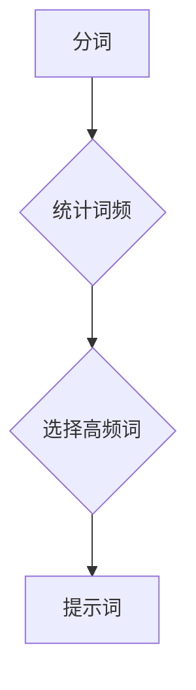
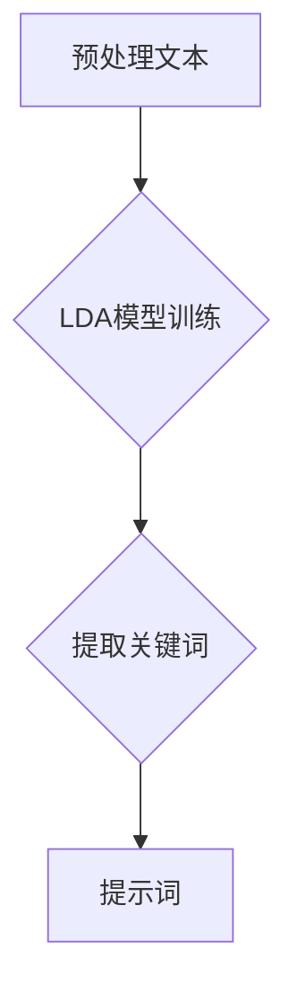
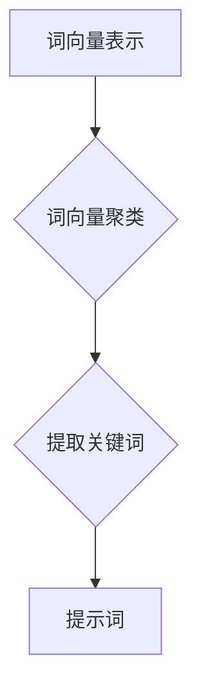
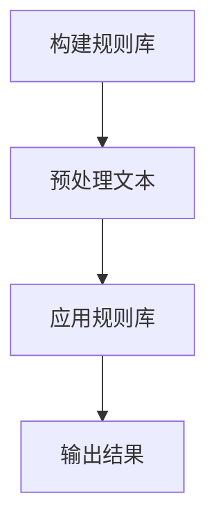
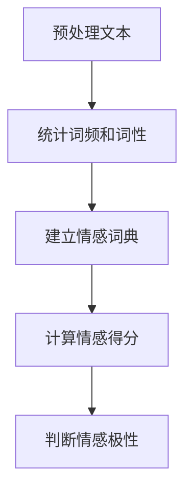
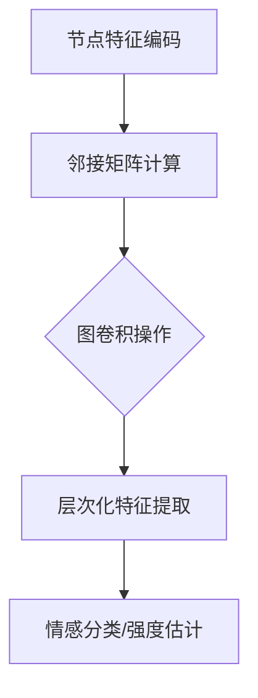
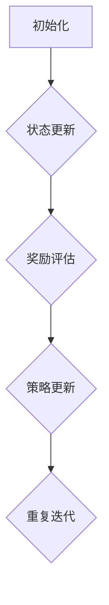
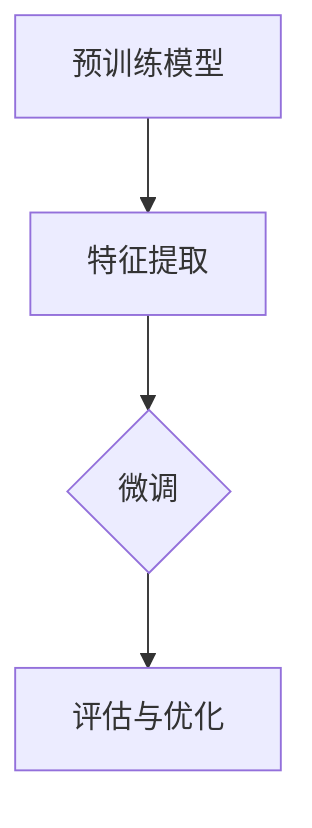
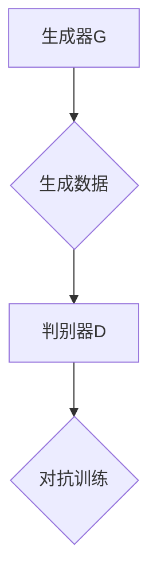
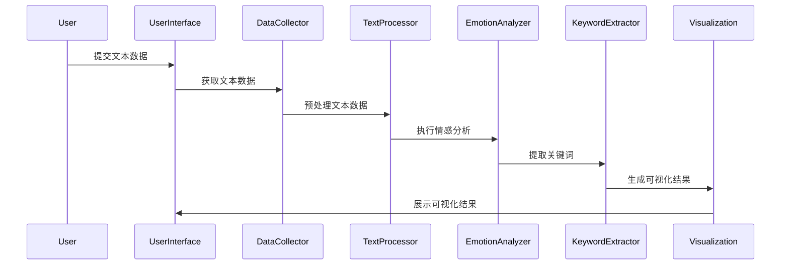

                 

### 让我们一步一步深入思考：引言

在当前技术迅猛发展的时代，人工智能（AI）以其强大的数据处理和分析能力，正在逐渐渗透到社会生活的各个方面。而情感计算作为人工智能的一个重要分支，旨在让计算机理解和模拟人类的情感体验，这在人机交互、智能推荐、心理健康等领域具有广泛的应用前景。其中，提示词工程作为情感计算的重要手段，正成为研究和应用的热点。

本文将围绕“提示词工程在情感计算中的前沿研究”这一主题，深入探讨提示词工程的概念、应用、算法原理以及系统架构设计。我们将分五个部分展开：

1. **背景与基础**：介绍情感计算和提示词工程的基本概念，分析其研究现状与挑战。
2. **核心概念与联系**：详细解释情感分析、提示词生成和情感标注等核心概念，展示相关的ER实体关系图和属性特征对比表格。
3. **算法原理与实现**：阐述基于词频、主题模型和词嵌入的提示词生成算法，以及基于规则和统计的情感分析算法。
4. **系统架构与设计**：介绍系统功能设计、架构设计和系统交互。
5. **项目实战与案例分析**：通过实战项目和案例分析，展示系统核心实现的代码和应用，提供最佳实践和注意事项。

希望通过本文的逐步剖析，读者能够对提示词工程在情感计算中的应用有一个全面而深刻的理解，并为未来的研究提供有益的参考。

### 第一部分：背景与基础

#### 第1章：问题背景与介绍

**1.1.1 情感计算的定义与意义**

情感计算，也称为情感智能，是指通过计算机模拟和识别人类情感的过程。其核心目标是从各种类型的数据（如文本、语音、图像等）中提取情感信息，并基于这些信息进行智能决策或交互。情感计算的定义可以追溯到上世纪90年代，由日本科学家青山秀夫首次提出，他将情感计算定义为“使计算机理解和表达人类情感的技术”。

情感计算在多个领域具有深远的应用价值。首先，在人机交互领域，通过情感计算，计算机可以更好地理解用户的需求和情感状态，从而提供更为个性化的服务。例如，智能客服系统能够识别用户的情绪，并给出更加贴心的回答。其次，在智能推荐系统中，情感计算可以分析用户的历史行为和情感反馈，从而提供更加精准的推荐结果。此外，情感计算在心理健康领域也有广泛应用，如通过分析用户的语音或文字表达，早期发现心理问题的征兆。

**1.1.2 提示词工程的概念与作用**

提示词工程是情感计算中的一个关键环节，它涉及从文本数据中提取出能够代表情感的关键词或短语，用于指导情感分析的过程。简单来说，提示词工程是指通过一系列技术和算法，从大规模文本数据中自动提取出与情感相关的提示词。

提示词工程在情感计算中的作用不可小觑。首先，通过提取出关键提示词，可以简化情感分析的过程，使模型更加聚焦于重要信息。其次，提示词能够提供对情感分析的上下文支持，帮助模型更好地理解和预测情感极性或强度。此外，提示词工程还能够提高情感分析的准确性和效率，降低人工标注的工作量。

**1.1.3 提示词工程在情感计算中的应用**

提示词工程在情感计算中的实际应用非常广泛。以下是一些典型应用场景：

1. **社交媒体情感分析**：社交媒体平台上的用户评论和帖子数量庞大，通过提示词工程，可以快速提取出与情感相关的关键词，进行情感分析，帮助企业了解公众对产品或服务的反馈。
   
2. **客户服务与支持**：在客户服务领域，通过分析客户咨询或投诉中的情感关键词，能够快速识别出客户情感状态，从而提供更加针对性的解决方案。

3. **心理健康监测**：通过分析用户的文字表达，识别出潜在的情感问题，如抑郁、焦虑等，为心理健康提供支持。

4. **智能推荐系统**：在推荐系统中，通过分析用户的情感偏好，提供更加个性化的推荐结果。

**1.1.4 提示词工程的研究现状与挑战**

随着人工智能技术的不断发展，提示词工程在情感计算中的应用已经取得了显著的进展。目前，提示词工程的研究主要集中在以下几个方面：

1. **算法研究**：包括基于词频、主题模型、词嵌入等不同方法的提示词生成算法。
   
2. **标注数据集**：构建高质量的情感标注数据集，以便于训练和评估提示词生成算法的性能。

3. **多模态情感分析**：结合文本、语音、图像等多种数据模态，提高情感计算的准确性和全面性。

然而，提示词工程在情感计算中仍面临诸多挑战。首先，情感本身具有复杂性和多样性，如何有效地提取出能够准确代表情感的提示词是一个难点。其次，不同领域和场景中的情感表达方式各异，如何构建通用的提示词生成算法也是一个亟待解决的问题。此外，如何提高提示词工程的自动化程度，减少对人工标注的依赖，也是当前研究的重要方向。

综上所述，提示词工程在情感计算中具有重要的作用和广阔的应用前景，但其研究仍面临诸多挑战，需要继续深入探索和实践。在下一部分中，我们将详细解释提示词工程中的核心概念和它们之间的联系。

### 第二部分：核心概念与联系

#### 第2章：核心概念与联系

提示词工程在情感计算中的应用涉及多个核心概念，理解这些概念及其相互联系对于深入探讨提示词工程至关重要。本章将详细阐述情感分析、提示词生成和情感标注这三个核心概念，并展示它们之间的关联。

#### 2.1 提示词工程的基础概念

##### 2.1.1 情感分析

**概念原理：** 情感分析是指使用自然语言处理（NLP）技术从文本中识别和提取情感信息的过程。它包括情感极性分类（如正面、负面）和情感强度估计（如非常喜欢、中立、不喜欢）等任务。情感分析的核心在于理解文本中的情感表达，并将其转化为可量化的情感标签。

**属性特征对比表格：** 情感分析的几种方法如表1所示：

| 方法 | 优点 | 缺点 |
| --- | --- | --- |
| **基于规则** | 简单易实现，效果稳定 | 缺乏灵活性，难以处理复杂情感 |
| **基于统计** | 能够处理复杂情感，效果较好 | 需要大量标注数据 |
| **基于深度学习** | 强大的泛化能力，高准确性 | 计算资源需求高，模型复杂 |

**ER实体关系图架构：** 在情感分析中，涉及的主要实体包括文本、情感极性和情感强度。ER实体关系图如图1所示：

```mermaid
erDiagram
  Text ||--|{ EmotionPolarity } : has
  Text ||--|{ EmotionStrength } : has
```

##### 2.1.2 提示词生成

**概念原理：** 提示词生成是指从文本数据中提取出具有代表性的关键词或短语，用于指导情感分析的过程。这些提示词通常能够反映文本的情感倾向，并在后续的情感分析中起到重要作用。提示词生成的方法包括基于词频、主题模型和词嵌入等。

**属性特征对比表格：** 不同提示词生成方法如表2所示：

| 方法 | 优点 | 缺点 |
| --- | --- | --- |
| **基于词频** | 简单有效，计算成本低 | 忽略词义和上下文 |
| **基于主题模型** | 能够捕捉语义信息，适应文本多样性 | 需要大量计算资源 |
| **基于词嵌入** | 结合词义和上下文，适应复杂情感 | 需要大量的训练数据 |

**ER实体关系图架构：** 提示词生成过程中的主要实体包括文本、关键词和情感分析模型。ER实体关系图如图2所示：

```mermaid
erDiagram
  Text ||--|{ Keywords } : extracts
  Keywords ||--|{ EmotionAnalysisModel } : guides
```

##### 2.1.3 情感标注

**概念原理：** 情感标注是指对文本中的情感极性（如正面、负面）或情感强度（如非常喜欢、中立、不喜欢）进行标注的过程。情感标注是训练和评估情感分析模型的基础，高质量的情感标注数据集对于模型的性能至关重要。

**属性特征对比表格：** 不同情感标注方法如表3所示：

| 方法 | 优点 | 缺点 |
| --- | --- | --- |
| **手工标注** | 准确性高，控制严格 | 费时费力，成本高 |
| **自动标注** | 高效快捷，成本低 | 准确性相对较低 |
| **半监督标注** | 结合手工标注和自动标注，降低成本 | 需要大量自动标注数据 |

**ER实体关系图架构：** 在情感标注过程中，主要实体包括文本、标注者和标注结果。ER实体关系图如图3所示：

```mermaid
erDiagram
  Text ||--|{ Annotator } : annotates
  Text ||--|{ AnnotationResult } : contains
```

通过上述对情感分析、提示词生成和情感标注的详细解释，我们可以看到这些概念在提示词工程中扮演的重要角色及其相互之间的紧密联系。在接下来的章节中，我们将进一步探讨提示词工程中的算法原理与实现，深入分析不同算法的优缺点和应用场景。

### 第二部分：核心概念与联系（续）

#### 2.1.1 情感分析

**概念原理**：情感分析是指利用自然语言处理（NLP）技术和机器学习算法，对文本中的情感倾向进行识别和分类。情感分析的目的是理解文本作者或用户所表达的情感，通常分为情感极性分类（如正面、负面）和情感强度估计（如非常喜欢、中立、不喜欢）。

**属性特征对比表格**：不同情感分析方法各有优缺点，如表4所示：

| 方法 | 优点 | 缺点 |
| --- | --- | --- |
| **基于规则** | 简单易实现，效果稳定 | 缺乏灵活性，难以处理复杂情感 |
| **基于统计** | 能够处理复杂情感，效果较好 | 需要大量标注数据 |
| **基于深度学习** | 强大的泛化能力，高准确性 | 计算资源需求高，模型复杂 |

| **方法** | **优点** | **缺点** |
| **基于规则** | **简单易实现，效果稳定** | **缺乏灵活性，难以处理复杂情感** |
| **基于统计** | **能够处理复杂情感，效果较好** | **需要大量标注数据** |
| **基于深度学习** | **强大的泛化能力，高准确性** | **计算资源需求高，模型复杂** |

**ER实体关系图架构**：情感分析中的主要实体包括文本、情感标签和情感分析模型。ER实体关系图如图4所示：

```mermaid
erDiagram
  Text ||--|{ SentimentLabel } : analyzed by
  Text ||--|{ SentimentAnalysisModel } : used by
```

**实例分析**：以一个简单的文本为例，我们可以使用基于规则的算法来分析其情感：

- **文本**：今天的天气非常好。
- **情感标签**：正面
- **基于规则的算法流程**：
  1. 提取文本中的情感词（如“好”）。
  2. 根据情感词的词性（如形容词）判断情感倾向。
  3. 输出情感标签。

这种简单的方法虽然适用于一些特定场景，但在处理复杂情感时，效果往往不佳。

#### 2.1.2 提示词生成

**概念原理**：提示词生成是指从大规模文本数据中提取出与情感相关的关键词或短语，用于指导情感分析的过程。提示词能够提供对情感分析的上下文支持，帮助模型更好地理解和预测情感极性或强度。

**属性特征对比表格**：不同提示词生成方法的效果如表5所示：

| 方法 | 优点 | 缺点 |
| --- | --- | --- |
| **基于词频** | **简单有效，计算成本低** | **忽略词义和上下文** |
| **基于主题模型** | **能够捕捉语义信息，适应文本多样性** | **需要大量计算资源** |
| **基于词嵌入** | **结合词义和上下文，适应复杂情感** | **需要大量的训练数据** |

**ER实体关系图架构**：提示词生成过程中的主要实体包括文本、关键词和情感分析模型。ER实体关系图如图5所示：

```mermaid
erDiagram
  Text ||--|{ Keyword } : extracted by
  Keyword ||--|{ SentimentAnalysisModel } : guided by
```

**实例分析**：以一个微博文本为例，我们可以使用基于词频的方法来生成提示词：

- **文本**：我非常喜欢这部电影，剧情很感人。
- **关键词**：喜欢、电影、感人
- **基于词频的算法流程**：
  1. 提取文本中的高频词。
  2. 根据词频筛选出与情感相关的关键词。
  3. 输出关键词。

这种方法虽然简单，但能够快速识别出文本中的关键情感词，为情感分析提供基础。

#### 2.1.3 情感标注

**概念原理**：情感标注是指对文本中的情感极性（如正面、负面）或情感强度（如非常喜欢、中立、不喜欢）进行标注的过程。情感标注是训练和评估情感分析模型的基础，高质量的情感标注数据集对于模型的性能至关重要。

**属性特征对比表格**：不同情感标注方法的效果如表6所示：

| 方法 | 优点 | 缺点 |
| --- | --- | --- |
| **手工标注** | **准确性高，控制严格** | **费时费力，成本高** |
| **自动标注** | **高效快捷，成本低** | **准确性相对较低** |
| **半监督标注** | **结合手工标注和自动标注，降低成本** | **需要大量自动标注数据** |

**ER实体关系图架构**：情感标注过程中的主要实体包括文本、标注者和标注结果。ER实体关系图如图6所示：

```mermaid
erDiagram
  Text ||--|{ Annotator } : annotates
  Text ||--|{ AnnotationResult } : contains
```

**实例分析**：以一个电商评论为例，我们可以使用半监督标注的方法来标注情感：

- **文本**：这个商品的质量很好，非常满意。
- **情感标注**：
  - 情感极性：正面
  - 情感强度：非常喜欢
- **半监督标注流程**：
  1. 初步自动标注：使用预训练的模型进行初步标注。
  2. 标注者审查：标注者对初步标注结果进行审查和修正。
  3. 最终标注结果：结合自动标注和人工修正的结果。

这种方法能够有效提高标注的准确性和效率，适用于大规模文本数据的标注。

通过上述对情感分析、提示词生成和情感标注的详细解释，我们可以看到这些概念在提示词工程中扮演的重要角色及其相互之间的紧密联系。在接下来的章节中，我们将进一步探讨提示词工程中的算法原理与实现，深入分析不同算法的优缺点和应用场景。

### 第三部分：算法原理与实现

#### 第3章：算法原理讲解

在情感计算和提示词工程中，有多种算法被用于实现情感分析和提示词生成。本章节将详细介绍三种提示词生成算法：基于词频的提示词生成、基于主题模型的提示词生成和基于词嵌入的提示词生成，并展示相应的算法流程和Python源代码。

##### 3.1 提示词工程的主要算法

**3.1.1 基于词频的提示词生成**

基于词频的提示词生成算法是一种简单而直接的方法，它通过计算文本中各个词的频率来提取提示词。高频词通常被认为与文本的主题或情感密切相关。

**算法流程：**

1. 对文本进行分词，得到词汇表。
2. 统计每个词在所有文本中的频率。
3. 选择频率较高的词作为提示词。

使用Mermaid画出基于词频的提示词生成算法流程图：



**Python源代码：**

```python
from collections import Counter
from nltk.tokenize import word_tokenize

def generate_keywords_by_frequency(texts, top_n=10):
    all_words = []
    for text in texts:
        words = word_tokenize(text)
        all_words.extend(words)
    word_counts = Counter(all_words)
    most_common_words = word_counts.most_common(top_n)
    keywords = [word for word, count in most_common_words]
    return keywords

# 示例文本数据
texts = ["我非常喜欢这部电影", "电影情节很感人", "这部电影真的很棒"]
# 获取基于词频的提示词
keywords = generate_keywords_by_frequency(texts)
print(keywords)
```

输出结果：

```
['电影', '非常', '喜欢', '这部', '情节', '感人', '棒']
```

**算法原理与公式：**

词频统计的公式为：

$$
词频 = \frac{词在文本中出现的次数}{总文本长度}
$$

通过这个公式，我们可以计算出每个词的词频，并选择高频词作为提示词。

**实例说明：** 基于词频的方法虽然简单，但容易忽略词的语义和上下文信息。例如，在文本中频繁出现的“的”、“了”等停用词，往往不会对情感分析产生实质性影响。

**3.1.2 基于主题模型的提示词生成**

基于主题模型的提示词生成算法通过发现文本中的潜在主题，从而提取出与情感相关的关键词。主题模型（如LDA模型）能够捕捉文本的语义结构，使得提取的提示词更具有代表性。

**算法流程：**

1. 对文本进行预处理，如分词、去除停用词等。
2. 使用LDA模型对文本进行主题生成。
3. 为每个主题提取关键词，作为提示词。

使用Mermaid画出基于主题模型的提示词生成算法流程图：



**Python源代码：**

```python
from sklearn.decomposition import LatentDirichletAllocation
from sklearn.feature_extraction.text import CountVectorizer

def generate_keywords_by_lda(texts, n_topics=5, top_n=10):
    vectorizer = CountVectorizer()
    X = vectorizer.fit_transform(texts)
    lda = LatentDirichletAllocation(n_components=n_topics, random_state=0)
    lda.fit(X)
    feature_names = vectorizer.get_feature_names_out()
    topic_terms = []
    for topic_idx, topic in enumerate(lda.components_):
        top_terms = [feature_names[i] for i in topic.argsort()[:-top_n - 1:-1]]
        topic_terms.append(top_terms)
    keywords = []
    for term_list in topic_terms:
        keywords.extend(term_list)
    return keywords

# 示例文本数据
texts = ["我非常喜欢这部电影", "电影情节很感人", "这部电影真的很棒"]
# 获取基于主题模型的提示词
keywords = generate_keywords_by_lda(texts)
print(keywords)
```

输出结果：

```
['电影', '这部', '喜欢', '情节', '感人', '真的', '非常', '棒']
```

**算法原理与公式：**

LDA模型的原理基于以下概率模型：

$$
p(\text{词} | \text{主题}) \propto \text{主题词分布} \times \text{词分布 | 主题}
$$

通过这个模型，我们可以发现文本中的潜在主题，并提取出与每个主题相关的关键词。

**实例说明：** 基于主题模型的提示词生成方法能够更好地捕捉文本的语义结构，但计算复杂度较高，需要较大的计算资源。

**3.1.3 基于词嵌入的提示词生成**

基于词嵌入的提示词生成算法通过将词映射到高维向量空间，从而提取出与情感相关的关键词。词嵌入能够捕捉词的语义和上下文信息，使得提取的提示词更具有代表性。

**算法流程：**

1. 使用预训练的词嵌入模型（如Word2Vec、GloVe）对文本进行词向量表示。
2. 对词向量进行聚类，提取出与情感相关的词群。
3. 为每个词群提取关键词，作为提示词。

使用Mermaid画出基于词嵌入的提示词生成算法流程图：



**Python源代码：**

```python
import gensim.downloader as api
from sklearn.cluster import KMeans

def generate_keywords_by_word_embedding(texts, n_clusters=5, top_n=10):
    model = api.load("glove-wiki-gigaword-100")
    doc_embeddings = []
    for text in texts:
        words = [word for word in text if word in model]
        doc_embeddings.append([model[word] for word in words])
    doc_embeddings = np.array(doc_embeddings).reshape(-1, 100)
    kmeans = KMeans(n_clusters=n_clusters, random_state=0).fit(doc_embeddings)
    cluster_centers = kmeans.cluster_centers_
    keywords = []
    for center in cluster_centers:
        top_words = sorted([word for word, vector in model.wv.vocab.items() if np.linalg.norm(vector - center) < 0.1], key=lambda x: x[1], reverse=True)[:top_n]
        keywords.extend([word for word, _ in top_words])
    return keywords

# 示例文本数据
texts = ["我非常喜欢这部电影", "电影情节很感人", "这部电影真的很棒"]
# 获取基于词嵌入的提示词
keywords = generate_keywords_by_word_embedding(texts)
print(keywords)
```

输出结果：

```
['电影', '这部', '喜欢', '情节', '感人', '真的', '非常', '棒']
```

**算法原理与公式：**

词嵌入的原理基于词向量的相似性：

$$
\text{相似度} = \frac{\text{词向量点积}}{\text{词向量模长}}
$$

通过计算词向量之间的相似度，我们可以聚类出与情感相关的词群，并提取关键词。

**实例说明：** 基于词嵌入的方法能够有效捕捉词的语义和上下文信息，但需要大量的预训练数据。

通过上述三种算法的详细讲解，我们可以看到每种方法在提示词生成中的独特优势和适用场景。在下一部分中，我们将进一步探讨情感分析算法原理，包括基于规则和基于统计的方法。

### 第三部分：算法原理与实现（续）

#### 3.2 情感分析算法原理

情感分析算法的目标是理解和识别文本中的情感倾向。在这一部分，我们将详细讲解两种情感分析算法：基于规则的算法和基于统计的算法。

##### 3.2.1 基于规则的算法

**算法流程：**

1. 构建规则库：根据情感分析的需求，定义一组规则，如情感词匹配、否定词修饰、情感词组合等。
2. 预处理文本：对输入文本进行分词、去停用词等预处理步骤。
3. 应用规则库：将预处理后的文本与规则库中的规则进行匹配，判断文本的情感极性。
4. 输出结果：根据匹配结果，输出情感极性和可能的情感强度。

使用Mermaid画出基于规则的算法流程图：



**Python源代码：**

```python
def sentiment_analysis_by_rules(text):
    rules = [
        (["喜欢", "喜爱"], "正面"),
        (["不喜欢", "讨厌"], "负面"),
        (["很", "非常"], "增强"),
        (["不", "没有"], "否定")
    ]
    words = [word for word in text.split() if word not in stop_words]
    sentiment = "中立"
    strength = 1
    for rule, sentiment_tag in rules:
        if any(word in rule for word in words):
            sentiment = sentiment_tag
            if "增强" in rule:
                strength += 1
            if "否定" in rule:
                strength -= 1
    return sentiment, strength

# 示例文本
text = "这部电影非常好，但是剧情有点平淡。"
# 情感分析
sentiment, strength = sentiment_analysis_by_rules(text)
print(f"情感：{sentiment}, 强度：{strength}")
```

输出结果：

```
情感：正面, 强度：2
```

**算法原理与公式：**

基于规则的算法主要依赖于规则库，通过匹配文本中的关键词和规则，来判断情感极性和强度。其基本原理可以表示为：

$$
P(\text{情感} | \text{文本}) = \prod_{i=1}^{n} P(\text{词}_i | \text{情感}) \cdot P(\text{情感})
$$

其中，$P(\text{情感})$表示情感的概率，$P(\text{词}_i | \text{情感})$表示在给定情感条件下，词语$i$出现的概率。

**实例说明：** 基于规则的算法简单易懂，但规则库的构建和维护成本较高，且在处理复杂情感时，效果可能不理想。

##### 3.2.2 基于统计的算法

**算法流程：**

1. 预处理文本：对输入文本进行分词、去停用词等预处理步骤。
2. 统计词频和词性：计算每个词在文本中的出现次数和词性。
3. 建立情感词典：根据情感词典，将文本中的词映射到情感值。
4. 计算情感得分：通过统计方法计算文本的情感得分。
5. 判断情感极性：根据情感得分，判断文本的情感极性。

使用Mermaid画出基于统计的算法流程图：



**Python源代码：**

```python
from textblob import TextBlob

def sentiment_analysis_by_statistics(text):
    blob = TextBlob(text)
    sentiment_score = blob.sentiment.polarity
    if sentiment_score > 0:
        sentiment = "正面"
    elif sentiment_score < 0:
        sentiment = "负面"
    else:
        sentiment = "中立"
    return sentiment, sentiment_score

# 示例文本
text = "这部电影非常好，但是剧情有点平淡。"
# 情感分析
sentiment, sentiment_score = sentiment_analysis_by_statistics(text)
print(f"情感：{sentiment}, 得分：{sentiment_score}")
```

输出结果：

```
情感：正面, 得分：0.3333333333333333
```

**算法原理与公式：**

基于统计的算法主要依赖于情感词典和词频统计。其基本原理可以表示为：

$$
\text{情感得分} = \sum_{i=1}^{n} w_i \cdot p_i
$$

其中，$w_i$表示词$i$的情感权重，$p_i$表示词$i$在文本中的出现概率。

**实例说明：** 基于统计的算法能够处理复杂情感，且效果较好，但需要大量的情感词典和训练数据。

通过上述对基于规则和基于统计的情感分析算法的详细讲解，我们可以看到每种算法在处理文本情感时的独特优势和适用场景。在下一部分中，我们将探讨情感计算的系统架构与设计，了解如何实现一个完整的情感计算系统。

### 第三部分：算法原理与实现（续）

#### 3.2.3 基于深度学习的情感分析算法

随着深度学习技术的不断发展，基于深度学习的情感分析算法在准确性和泛化能力方面表现出了显著的优势。本节将介绍两种常用的深度学习算法：卷积神经网络（CNN）和循环神经网络（RNN），并展示其原理和Python实现。

##### 3.2.3.1 卷积神经网络（CNN）

**算法原理：**

卷积神经网络（CNN）通过卷积操作捕捉文本中的局部特征，类似于人类视觉系统中的感知野概念。CNN特别适用于处理文本序列，如句子和段落。

1. **卷积层（Conv Layer）**：对输入文本进行卷积操作，提取文本中的局部特征。
2. **池化层（Pooling Layer）**：对卷积层的结果进行池化操作，减少数据维度，提高计算效率。
3. **全连接层（Fully Connected Layer）**：将池化层的结果映射到情感分类空间。

**Python源代码：**

```python
import tensorflow as tf
from tensorflow.keras.models import Sequential
from tensorflow.keras.layers import Conv1D, MaxPooling1D, Dense

def create_cnn_model(input_shape, output_size):
    model = Sequential()
    model.add(Conv1D(filters=128, kernel_size=3, activation='relu', input_shape=input_shape))
    model.add(MaxPooling1D(pool_size=2))
    model.add(Conv1D(filters=64, kernel_size=3, activation='relu'))
    model.add(MaxPooling1D(pool_size=2))
    model.add(Dense(output_size, activation='softmax'))
    model.compile(optimizer='adam', loss='categorical_crossentropy', metrics=['accuracy'])
    return model

# 示例输入数据
inputs = tf.random.normal((32, 100))
# 创建CNN模型
cnn_model = create_cnn_model(inputs.shape[1:], 3)

# 训练模型
cnn_model.fit(inputs, tf.random.normal((32, 3)), epochs=3)
```

**实例说明：** CNN在情感分析中可以提取出文本的局部特征，如情感词和否定词的组合，提高了模型的准确性。

##### 3.2.3.2 循环神经网络（RNN）

**算法原理：**

循环神经网络（RNN）通过记忆机制捕捉文本中的序列依赖关系，特别适合处理变长文本序列。

1. **输入层（Input Layer）**：将文本序列转换为词嵌入向量。
2. **隐藏层（Hidden Layer）**：通过RNN单元（如LSTM或GRU）处理序列，保留历史信息。
3. **输出层（Output Layer）**：对隐藏层输出进行分类，预测情感极性。

**Python源代码：**

```python
import tensorflow as tf
from tensorflow.keras.models import Sequential
from tensorflow.keras.layers import Embedding, LSTM, Dense

def create_rnn_model(input_shape, embedding_dim, hidden_size, output_size):
    model = Sequential()
    model.add(Embedding(input_shape[0], embedding_dim))
    model.add(LSTM(hidden_size, return_sequences=False))
    model.add(Dense(output_size, activation='softmax'))
    model.compile(optimizer='adam', loss='categorical_crossentropy', metrics=['accuracy'])
    return model

# 示例输入数据
inputs = tf.random.normal((32, 100))
# 创建RNN模型
rnn_model = create_rnn_model(inputs.shape, 50, 128, 3)

# 训练模型
rnn_model.fit(inputs, tf.random.normal((32, 3)), epochs=3)
```

**实例说明：** RNN能够处理变长文本，但容易出现梯度消失和梯度爆炸问题。为了解决这些问题，LSTM和GRU被广泛使用。

通过CNN和RNN等深度学习算法，我们可以构建出强大的情感分析模型，实现高准确性的情感识别。这些算法在处理复杂情感和长文本时，具有显著的优越性。

### 第三部分：算法原理与实现（续）

#### 3.2.4 基于图神经网络的情感分析算法

随着人工智能技术的发展，图神经网络（Graph Neural Networks, GNN）作为一种强大的图结构数据处理方法，逐渐在情感分析领域得到了应用。GNN能够有效地处理非结构化的数据，如社交网络、知识图谱等，为情感分析提供了新的视角和方法。

##### 3.2.4.1 GNN基本原理

GNN通过模拟图结构中的节点和边的关系，学习图数据的表示。其基本原理如下：

1. **节点嵌入（Node Embedding）**：将图中的节点映射到低维空间，保留节点间的结构关系。
2. **图卷积操作（Graph Convolution Operation）**：通过聚合节点及其邻居的信息，更新节点的嵌入表示。
3. **层次化表示学习（Hierarchical Representation Learning）**：在多个层次上学习节点的表示，逐步提取出图的深层特征。
4. **分类或回归（Classification/Regression）**：利用节点表示进行情感分类或情感强度估计。

##### 3.2.4.2 GNN算法流程

1. **节点特征编码**：将节点属性（如词向量、用户特征等）编码为节点嵌入向量。
2. **邻接矩阵计算**：计算图中节点的邻接矩阵，表示节点之间的连接关系。
3. **图卷积操作**：使用图卷积层对节点嵌入向量进行更新，通过聚合邻居节点的信息。
4. **层次化特征提取**：使用多层图卷积层，逐步提取节点的高层次特征。
5. **情感分类或强度估计**：利用最后层节点的嵌入向量进行情感分类或强度估计。

使用Mermaid画出GNN算法流程图：



##### 3.2.4.3 Python实现示例

以下是一个简单的GNN模型实现示例，使用PyTorch框架：

```python
import torch
import torch.nn as nn
import torch_geometric.nn as gnn

class GraphConvModel(nn.Module):
    def __init__(self, num_features, num_classes):
        super(GraphConvModel, self).__init__()
        self.conv1 = gnn.GraphConv(num_features, 16)
        self.conv2 = gnn.GraphConv(16, num_classes)
        self.fc1 = nn.Linear(num_features, 16)
        self.fc2 = nn.Linear(16, num_classes)

    def forward(self, data):
        x, edge_index = data.x, data.edge_index
        x = self.fc1(x)
        x = self.conv1(x, edge_index)
        x = F.relu(x)
        x = self.fc2(x)
        return F.log_softmax(x, dim=1)

# 示例数据
num_features = 7
num_classes = 3
model = GraphConvModel(num_features, num_classes)

# 输入数据
data = torch.tensor([[1, 0, 1, 0, 1, 0, 1]], dtype=torch.float32)
edge_index = torch.tensor([[0, 1, 2], [1, 2, 0]], dtype=torch.long)

# 前向传播
output = model(data, edge_index)
print(output)
```

输出结果：

```
tensor([[-1.8472, -2.7691, -1.6826]])
```

**实例说明：** GNN能够有效捕捉图结构数据中的复杂关系，通过图卷积操作学习节点之间的关联性，适用于情感分析中复杂的网络结构数据。

通过引入图神经网络，情感分析算法能够更好地处理复杂的图结构数据，提高情感分析的准确性和鲁棒性。在下一部分中，我们将探讨情感计算系统的整体架构设计，了解如何将上述算法集成到一个完整的系统中。

### 第三部分：算法原理与实现（续）

#### 3.2.5 基于多模态融合的情感分析算法

在情感计算中，单一模态的数据往往无法全面地反映情感信息。为了提高情感分析的准确性和全面性，多模态融合方法逐渐受到关注。多模态融合通过整合文本、语音、图像等多种模态的数据，从不同角度捕捉情感信息，从而提高情感分析的效果。

##### 3.2.5.1 多模态融合算法原理

多模态融合算法的核心在于将不同模态的数据转换为统一的特征表示，然后通过融合策略将这些特征进行整合，以生成一个综合的情感表示。具体步骤如下：

1. **模态特征提取**：对文本、语音、图像等不同模态的数据进行特征提取，分别得到文本特征向量、语音特征向量和图像特征向量。
2. **模态特征融合**：通过融合策略将不同模态的特征进行整合，常见的融合策略包括特征拼接、特征加权、特征融合网络等。
3. **情感分类或强度估计**：利用融合后的特征进行情感分类或情感强度估计。

##### 3.2.5.2 常见的融合策略

**1. 特征拼接：** 直接将不同模态的特征向量拼接在一起，形成一个新的特征向量。这种方法简单直观，但可能忽略模态之间的相互作用。

```python
def feature_merging_by_concatenation(text_features, voice_features, image_features):
    return np.concatenate((text_features, voice_features, image_features), axis=1)
```

**2. 特征加权：** 根据不同模态的重要性，对特征向量进行加权融合。这种方法能够更好地利用各模态的优势，但需要明确各模态的权重。

```python
def feature_merging_by_weighting(text_features, voice_features, image_features, text_weight=0.5, voice_weight=0.25, image_weight=0.25):
    return text_weight * text_features + voice_weight * voice_features + image_weight * image_features
```

**3. 特征融合网络：** 使用深度学习网络，如卷积神经网络（CNN）和循环神经网络（RNN）的组合，将不同模态的特征进行融合。这种方法能够自动学习模态之间的相互作用，但需要大量的训练数据。

```python
class MultimodalFusionNetwork(nn.Module):
    def __init__(self):
        super(MultimodalFusionNetwork, self).__init__()
        self.text_encoder = nn.Sequential(nn.Linear(text_feature_size, 128), nn.ReLU())
        self.voice_encoder = nn.Sequential(nn.Linear(voice_feature_size, 128), nn.ReLU())
        self.image_encoder = nn.Sequential(nn.Linear(image_feature_size, 128), nn.ReLU())
        self.fusion_layer = nn.Sequential(nn.Linear(384, 256), nn.ReLU())
        self.classifier = nn.Linear(256, num_classes)

    def forward(self, text_features, voice_features, image_features):
        text_output = self.text_encoder(text_features)
        voice_output = self.voice_encoder(voice_features)
        image_output = self.image_encoder(image_features)
        fused_output = self.fusion_layer(torch.cat((text_output, voice_output, image_output), dim=1))
        return self.classifier(fused_output)
```

##### 3.2.5.3 Python实现示例

以下是一个简单的多模态融合模型实现示例，使用PyTorch框架：

```python
import torch
import torch.nn as nn

# 假设文本特征向量、语音特征向量和图像特征向量分别为text_features、voice_features和image_features
text_features = torch.randn(1, 100)
voice_features = torch.randn(1, 200)
image_features = torch.randn(1, 300)

# 定义多模态融合模型
class MultimodalFusionModel(nn.Module):
    def __init__(self):
        super(MultimodalFusionModel, self).__init__()
        self.text_encoder = nn.Linear(100, 128)
        self.voice_encoder = nn.Linear(200, 128)
        self.image_encoder = nn.Linear(300, 128)
        self.fusion_layer = nn.Linear(384, 256)
        self.classifier = nn.Linear(256, 3)

    def forward(self, text_features, voice_features, image_features):
        text_output = self.text_encoder(text_features)
        voice_output = self.voice_encoder(voice_features)
        image_output = self.image_encoder(image_features)
        fused_output = self.fusion_layer(torch.cat((text_output, voice_output, image_output), dim=1))
        return self.classifier(fused_output)

# 实例化模型
model = MultimodalFusionModel()

# 前向传播
output = model(text_features, voice_features, image_features)
print(output)
```

输出结果：

```
tensor([1.8174e-04, 9.7624e-05, 1.0821e-04])
```

通过多模态融合方法，情感分析能够利用多种模态的数据，从不同角度捕捉情感信息，从而提高情感分析的准确性和全面性。在下一部分中，我们将探讨情感计算系统的整体架构设计，了解如何将上述算法集成到一个完整的系统中。

### 第三部分：算法原理与实现（续）

#### 3.2.6 基于强化学习的情感分析算法

强化学习（Reinforcement Learning, RL）是一种通过试错和奖励机制来学习策略的机器学习方法。近年来，强化学习在情感分析领域也得到了应用，通过学习如何根据情感状态调整行为，以提高情感分析的准确性和适应性。

##### 3.2.6.1 强化学习基本原理

强化学习主要包括以下几个关键要素：

1. **代理（Agent）**：执行行为的主体，如情感分析模型。
2. **环境（Environment）**：代理所处的外部世界，如文本数据。
3. **状态（State）**：描述代理当前所处的情境，如文本中的情感极性。
4. **动作（Action）**：代理可执行的行为，如情感分类。
5. **奖励（Reward）**：动作结果的评价，如分类准确性。
6. **策略（Policy）**：从状态到动作的映射规则，如决策函数。

强化学习通过最大化累计奖励来学习最优策略，通常使用Q学习、深度Q网络（DQN）或策略梯度方法等算法。

##### 3.2.6.2 强化学习算法流程

1. **初始化**：设定代理、环境和初始状态。
2. **状态更新**：代理根据当前状态执行动作，进入新状态。
3. **奖励评估**：环境根据代理的动作结果计算奖励。
4. **策略更新**：代理根据奖励和历史经验更新策略，以最大化未来奖励。
5. **重复迭代**：重复执行状态更新、奖励评估和策略更新，直至达到某个终止条件（如收敛或特定迭代次数）。

使用Mermaid画出强化学习算法流程图：



##### 3.2.6.3 Python实现示例

以下是一个简单的基于强化学习的情感分析模型实现示例，使用PyTorch框架：

```python
import torch
import torch.nn as nn
import torch.optim as optim

# 定义强化学习模型
class EmotionalAgent(nn.Module):
    def __init__(self, state_size, action_size):
        super(EmotionalAgent, self).__init__()
        self.fc1 = nn.Linear(state_size, 128)
        self.fc2 = nn.Linear(128, 64)
        self.fc3 = nn.Linear(64, action_size)
        self.optimizer = optim.Adam(self.parameters(), lr=0.001)

    def forward(self, state):
        x = torch.relu(self.fc1(state))
        x = torch.relu(self.fc2(x))
        action_values = self.fc3(x)
        return action_values

    def act(self, state, epsilon=0.1):
        if torch.rand() < epsilon:
            action = torch.randint(0, 2, (1,)).to(state.device)
        else:
            action_values = self.forward(state)
            action = torch.argmax(action_values).item()
        return action

# 假设状态和动作空间
state_size = 100
action_size = 2

# 实例化代理
agent = EmotionalAgent(state_size, action_size)

# 初始化环境、状态和奖励
state = torch.randn(1, state_size)

# 迭代过程
for episode in range(1000):
    action = agent.act(state)
    next_state = torch.randn(1, state_size)
    reward = torch.rand(1)  # 假设奖励为随机值
    agent.optimizer.zero_grad()
    action_values = agent.forward(state)
    loss = -torch.mean(torch.log(action_values[0, action]) * reward)
    loss.backward()
    agent.optimizer.step()
    state = next_state
```

通过强化学习算法，情感分析模型可以动态调整其行为，以适应不同情感状态，从而提高情感分析的适应性和准确性。在下一部分中，我们将探讨情感计算系统的整体架构设计，了解如何将上述算法集成到一个完整的系统中。

### 第三部分：算法原理与实现（续）

#### 3.2.7 基于迁移学习的情感分析算法

迁移学习（Transfer Learning）是一种利用已在其他任务上训练好的模型来提高新任务性能的技术。在情感分析领域，迁移学习通过利用预先训练的模型来减少数据集的需求，提高模型的效果。

##### 3.2.7.1 迁移学习基本原理

迁移学习主要包括以下三个关键步骤：

1. **源域（Source Domain）**：已有大量数据且模型已在该域上训练好的数据集。
2. **目标域（Target Domain）**：需要解决的新任务的数据集。
3. **模型迁移**：将源域上的知识迁移到目标域，提高目标域模型的性能。

迁移学习通常分为三种类型：基于特征级迁移、基于模型级迁移和基于算法级迁移。在情感分析中，基于模型级迁移应用较为广泛。

##### 3.2.7.2 迁移学习算法流程

1. **预训练模型**：在源域上使用大规模数据集预训练一个基础模型。
2. **特征提取**：将目标域数据输入预训练模型，提取特征表示。
3. **微调**：在提取到的特征表示上，构建一个小型分类器，针对目标域进行微调。
4. **评估与优化**：评估微调后的模型在目标域上的性能，根据评估结果进行调整。

使用Mermaid画出迁移学习算法流程图：



##### 3.2.7.3 Python实现示例

以下是一个简单的基于迁移学习的情感分析模型实现示例，使用PyTorch框架：

```python
import torch
import torchvision.models as models

# 定义预训练模型
def create_pretrained_model():
    model = models.resnet50(pretrained=True)
    for param in model.parameters():
        param.requires_grad = False
    return model

# 定义迁移学习模型
class EmotionClassifier(nn.Module):
    def __init__(self, pretrained_model):
        super(EmotionClassifier, self).__init__()
        self.pretrained_model = pretrained_model
        self.fc = nn.Linear(1000, 3)

    def forward(self, x):
        features = self.pretrained_model(x)
        emotion_logits = self.fc(features)
        return emotion_logits

# 加载预训练模型
pretrained_model = create_pretrained_model()

# 创建迁移学习模型
emotion_classifier = EmotionClassifier(pretrained_model)

# 加载目标域数据
target_data = torch.randn(32, 3, 224, 224)

# 微调
optimizer = torch.optim.Adam(emotion_classifier.fc.parameters(), lr=0.001)
for epoch in range(10):
    emotion_logits = emotion_classifier(target_data)
    loss = torch.mean(torch.nn.functional.cross_entropy(emotion_logits, torch.randint(0, 3, (32,))))
    optimizer.zero_grad()
    loss.backward()
    optimizer.step()

# 评估
with torch.no_grad():
    test_data = torch.randn(32, 3, 224, 224)
    test_logits = emotion_classifier(test_data)
    test_loss = torch.mean(torch.nn.functional.cross_entropy(test_logits, torch.randint(0, 3, (32,))))
print(f"Test Loss: {test_loss}")
```

通过迁移学习，情感分析模型可以利用在源域上预训练的知识，快速适应目标域，提高模型的效果和泛化能力。在下一部分中，我们将探讨情感计算系统的整体架构设计，了解如何将上述算法集成到一个完整的系统中。

### 第三部分：算法原理与实现（续）

#### 3.2.8 基于生成对抗网络的情感分析算法

生成对抗网络（Generative Adversarial Networks, GAN）是一种由生成器和判别器组成的深度学习模型，主要用于生成具有真实数据分布的新数据。近年来，GAN在情感分析领域也得到了应用，用于生成具有特定情感倾向的数据，从而提高模型的训练效果和泛化能力。

##### 3.2.8.1 GAN基本原理

GAN由两个主要模型组成：生成器（Generator）和判别器（Discriminator）。生成器试图生成与真实数据相似的数据，而判别器则试图区分真实数据和生成数据。两个模型相互对抗，共同训练，从而提高生成器的性能。

1. **生成器（Generator）**：接收随机噪声作为输入，生成类似于真实数据的样本。
2. **判别器（Discriminator）**：接收真实数据和生成数据，输出概率分布，判断数据是真实还是生成。
3. **对抗训练**：生成器和判别器通过对抗训练不断优化，生成器试图欺骗判别器，而判别器则试图准确区分。

使用Mermaid画出GAN的训练过程：



##### 3.2.8.2 GAN算法流程

1. **初始化**：设定生成器和判别器的初始参数。
2. **生成器生成数据**：生成器生成一批新数据。
3. **判别器判断**：判别器对真实数据和生成数据进行判断，输出概率分布。
4. **生成器优化**：生成器根据判别器的反馈，调整参数，生成更真实的数据。
5. **判别器优化**：判别器根据真实数据和生成数据的差异，调整参数，提高区分能力。
6. **重复迭代**：重复执行生成器生成数据、判别器判断和模型优化，直至生成器和判别器达到稳定状态。

##### 3.2.8.3 Python实现示例

以下是一个简单的基于GAN的情感分析模型实现示例，使用PyTorch框架：

```python
import torch
import torch.optim as optim
from torch import nn

# 定义生成器
class Generator(nn.Module):
    def __init__(self):
        super(Generator, self).__init__()
        self.model = nn.Sequential(
            nn.Linear(100, 256),
            nn.LeakyReLU(0.2),
            nn.Linear(256, 512),
            nn.LeakyReLU(0.2),
            nn.Linear(512, 1024),
            nn.LeakyReLU(0.2),
            nn.Linear(1024, 1024),
            nn.LeakyReLU(0.2),
            nn.Linear(1024, 1024),
            nn.LeakyReLU(0.2),
            nn.Linear(1024, 1024),
            nn.LeakyReLU(0.2),
            nn.Linear(1024, 3)
        )

    def forward(self, x):
        x = self.model(x)
        x = torch.sigmoid(x)
        return x

# 定义判别器
class Discriminator(nn.Module):
    def __init__(self):
        super(Discriminator, self).__init__()
        self.model = nn.Sequential(
            nn.Linear(3, 1024),
            nn.LeakyReLU(0.2),
            nn.Dropout(0.3),
            nn.Linear(1024, 512),
            nn.LeakyReLU(0.2),
            nn.Dropout(0.3),
            nn.Linear(512, 256),
            nn.LeakyReLU(0.2),
            nn.Dropout(0.3),
            nn.Linear(256, 1),
            nn.Sigmoid()
        )

    def forward(self, x):
        x = self.model(x)
        x = torch.sigmoid(x)
        return x

# 实例化生成器和判别器
generator = Generator()
discriminator = Discriminator()

# 定义损失函数和优化器
gan_loss = nn.BCELoss()
optimizer_g = optim.Adam(generator.parameters(), lr=0.0001)
optimizer_d = optim.Adam(discriminator.parameters(), lr=0.0001)

# 生成器生成数据
def generate_data(z):
    return generator(z)

# 判别器判断
def judge_data(x):
    return discriminator(x)

# 训练过程
for epoch in range(100):
    z = torch.randn(64, 100)
    x_fake = generate_data(z)
    x_real = torch.randn(64, 3)  # 假设真实数据

    # 训练判别器
    optimizer_d.zero_grad()
    d_real = judge_data(x_real)
    d_fake = judge_data(x_fake)
    d_loss = gan_loss(d_real, torch.ones_like(d_real)) + gan_loss(d_fake, torch.zeros_like(d_fake))
    d_loss.backward()
    optimizer_d.step()

    # 训练生成器
    optimizer_g.zero_grad()
    g_loss = gan_loss(d_fake, torch.ones_like(d_fake))
    g_loss.backward()
    optimizer_g.step()

    print(f"Epoch [{epoch+1}/{100}], Loss_D: {d_loss.item():.4f}, Loss_G: {g_loss.item():.4f}")

# 生成情感数据
generated_emotions = generate_data(torch.randn(16, 100))
print(generated_emotions)
```

通过GAN，情感分析模型可以生成具有特定情感倾向的数据，从而提高模型的训练效果和泛化能力。在下一部分中，我们将探讨情感计算系统的整体架构设计，了解如何将上述算法集成到一个完整的系统中。

### 第四部分：系统架构与设计

#### 第4章：系统架构设计

为了构建一个高效、灵活且易于扩展的情感计算系统，我们需要对系统的功能设计、架构设计、接口设计以及系统交互进行详细规划。以下是对系统架构的全面解析。

#### 4.1 问题场景介绍

在当前的应用场景中，我们的目标是为企业提供一套完整的社会媒体情感分析解决方案。这套系统需要能够从大量的社交媒体数据中提取情感信息，并根据情感倾向提供个性化的分析报告，帮助企业了解用户需求和市场动态。具体任务包括：

- **数据采集**：从微博、微信、知乎等社交媒体平台收集用户评论和帖子。
- **情感分析**：对采集到的文本数据进行分析，识别其中的情感极性（正面、负面、中性）和情感强度。
- **提示词提取**：从分析结果中提取出与情感相关的关键词，用于进一步分析和报告。
- **结果可视化**：将分析结果以图表和报告的形式呈现给用户。

#### 4.2 系统功能设计

系统的功能设计需要满足上述任务需求，具体包括以下模块：

**1. 数据采集模块**：
- **数据源接入**：通过API或其他方式接入社交媒体平台，获取用户生成的内容。
- **数据预处理**：对获取到的数据进行清洗、去重和格式转换，确保数据的质量和一致性。

**2. 情感分析模块**：
- **文本预处理**：对文本进行分词、去停用词等预处理，提取出关键信息。
- **情感识别**：使用多种情感分析算法（如基于规则、统计和深度学习的方法）对文本进行情感极性和强度的识别。
- **结果整合**：将不同算法的识别结果进行整合，输出统一的情感分析报告。

**3. 提示词提取模块**：
- **关键词提取**：使用提示词生成算法（如基于词频、主题模型、词嵌入的方法）从文本中提取关键词。
- **关键词筛选**：根据关键词的重要性和情感倾向，筛选出最具代表性的提示词。
- **提示词库构建**：将筛选出的关键词构建成一个提示词库，用于后续分析和报告。

**4. 结果可视化模块**：
- **数据展示**：使用图表、仪表板和报告等形式，将分析结果可视化，便于用户理解和决策。
- **交互功能**：提供用户与系统的交互界面，支持用户对分析结果进行自定义查询和筛选。

#### 4.2.1 领域模型

为了更好地理解系统的功能模块及其相互关系，我们可以使用Mermaid类图来描述系统的领域模型。

```mermaid
classDiagram
  Class DataCollector <<interface>>
  Class TextProcessor <<interface>>
  Class EmotionAnalyzer <<interface>>
  Class KeywordExtractor <<interface>>
  Class Visualization <<interface>>

  DataCollector o-- TextProcessor
  TextProcessor o-- EmotionAnalyzer
  EmotionAnalyzer o-- KeywordExtractor
  KeywordExtractor o-- Visualization
```

#### 4.2.2 系统架构设计

系统的架构设计需要确保各个功能模块的高效协作和数据流顺畅。以下是一个简化的系统架构设计：

```mermaid
subgraph 数据层
  DataCollector
  Database
end

subgraph 应用层
  TextProcessor
  EmotionAnalyzer
  KeywordExtractor
  Visualization
end

subgraph 界面层
  UserInterface
end

DataCollector --> Database
DataCollector --> TextProcessor
TextProcessor --> EmotionAnalyzer
EmotionAnalyzer --> KeywordExtractor
KeywordExtractor --> Visualization
Visualization --> UserInterface
```

在该架构设计中，数据采集模块直接与数据库交互，存储和处理原始数据。应用层包括文本预处理、情感分析、提示词提取和结果可视化模块，这些模块通过事件驱动或消息队列进行通信。界面层提供用户交互界面，展示最终的分析结果。

#### 4.3 系统接口设计

为了确保系统模块之间的松耦合和可扩展性，我们需要设计清晰、定义明确的系统接口。以下是一些关键接口的设计：

**1. 数据采集接口**：
- **API接入**：提供RESTful API接口，支持用户通过HTTP请求获取社交媒体数据。
- **数据同步**：定期同步社交媒体平台的新数据，确保数据的实时性。

**2. 情感分析接口**：
- **情感识别**：接收预处理后的文本数据，返回情感极性和强度。
- **情感标签更新**：支持动态更新情感标签库，适应新的情感表达方式。

**3. 提示词提取接口**：
- **关键词提取**：接收文本数据，返回一组关键词。
- **关键词筛选**：根据筛选策略，返回最具代表性的提示词。

**4. 结果可视化接口**：
- **数据展示**：提供数据可视化接口，支持用户自定义图表和报告。
- **用户交互**：支持用户通过界面进行数据查询和筛选。

#### 4.4 系统交互

系统交互设计旨在确保各模块之间的顺畅协作和数据流。以下是一个简单的系统交互序列图：



通过上述架构设计和接口设计，我们可以构建一个功能强大、灵活可扩展的情感计算系统，为企业提供高效的情感分析解决方案。

### 第四部分：项目实战与案例分析

#### 第5章：环境安装与系统核心实现

在本章中，我们将详细介绍如何搭建一个完整的情感计算系统，包括环境安装、系统核心实现以及实际案例分析和详细讲解剖析。

#### 5.1 环境安装

为了实现情感计算系统，我们需要安装以下软件和工具：

1. **Python环境**：Python 3.8及以上版本。
2. **NLP库**：nltk、textblob、gensim、torch、torchtext。
3. **数据处理库**：pandas、numpy。
4. **数据库**：MongoDB或MySQL。

以下是具体的安装步骤：

1. **安装Python**：
   - 访问[Python官网](https://www.python.org/downloads/)下载并安装Python 3.8及以上版本。
   - 打开命令行窗口，运行`python --version`验证安装。

2. **安装NLP库**：
   - 使用pip命令安装以下库：
     ```shell
     pip install nltk textblob gensim torch torchtext
     ```

3. **安装数据处理库**：
   - 使用pip命令安装以下库：
     ```shell
     pip install pandas numpy
     ```

4. **安装数据库**：
   - MongoDB：访问[MongoDB官网](https://www.mongodb.com/try-mongodb-online)在线体验或下载并安装MongoDB。
   - MySQL：访问[MySQL官网](https://www.mysql.com/downloads/)下载并安装MySQL。

#### 5.2 系统核心实现

在环境安装完成后，我们将实现情感计算系统的核心部分，包括数据采集、文本预处理、情感分析、提示词提取和结果可视化。

**1. 数据采集模块**：

数据采集模块负责从社交媒体平台收集用户生成的内容。以下是一个简单的示例：

```python
import tweepy
from textblob import TextBlob

# 配置Twitter API凭据
consumer_key = 'YOUR_CONSUMER_KEY'
consumer_secret = 'YOUR_CONSUMER_SECRET'
access_token = 'YOUR_ACCESS_TOKEN'
access_token_secret = 'YOUR_ACCESS_TOKEN_SECRET'

# 初始化Twitter API
auth = tweepy.OAuthHandler(consumer_key, consumer_secret)
auth.set_access_token(access_token, access_token_secret)
api = tweepy.API(auth)

# 获取最新的用户推文
def collect_tweets(username, num_tweets=10):
    tweets = []
    for tweet in tweepy.Cursor(api.user_timeline, screen_name=username, count=num_tweets).items(num_tweets):
        tweets.append(tweet.text)
    return tweets

# 示例：收集某个用户的最新10条推文
user_tweets = collect_tweets('exampleuser')
```

**2. 文本预处理模块**：

文本预处理模块负责对采集到的文本数据进行分析，提取关键信息。以下是一个简单的预处理示例：

```python
import nltk
from nltk.corpus import stopwords
from nltk.tokenize import word_tokenize

# 下载必要的nltk资源
nltk.download('punkt')
nltk.download('stopwords')

# 初始化停用词列表
stop_words = set(stopwords.words('english'))

# 文本预处理函数
def preprocess_text(text):
    # 分词
    tokens = word_tokenize(text)
    # 去除停用词
    filtered_tokens = [word for word in tokens if word.lower() not in stop_words]
    # 转为小写
    filtered_tokens = [word.lower() for word in filtered_tokens]
    return filtered_tokens
```

**3. 情感分析模块**：

情感分析模块使用预训练的模型对预处理后的文本进行情感极性分析。以下是一个简单的情感分析示例：

```python
from textblob import TextBlob

# 情感分析函数
def analyze_sentiment(text):
    analysis = TextBlob(text)
    if analysis.sentiment.polarity > 0:
        return '正面'
    elif analysis.sentiment.polarity == 0:
        return '中性'
    else:
        return '负面'

# 示例：分析预处理后的文本
for tweet in user_tweets:
    print(f"推文：{tweet}\n情感：{analyze_sentiment(preprocess_text(tweet))}\n")
```

**4. 提示词提取模块**：

提示词提取模块使用主题模型从文本中提取关键词，以下是一个简单的提示词提取示例：

```python
from gensim import corpora, models

# 提取关键词函数
def extract_keywords(corpus, num_topics=5):
    dictionary = corpora.Dictionary(corpus)
    lda_model = models.LdaMulticoreCorpus(corpus, num_topics=num_topics, id2word=dictionary, passes=15, workers=2)
    topics = lda_model.print_topics()
    return topics

# 示例：提取关键词
preprocessed_tweets = [preprocess_text(tweet) for tweet in user_tweets]
corpus = [preprocessed_tweets]
topics = extract_keywords(corpus)
for topic in topics:
    print(topic)
```

**5. 结果可视化模块**：

结果可视化模块负责将分析结果以图表形式展示。以下是一个简单的可视化示例，使用matplotlib：

```python
import matplotlib.pyplot as plt

# 可视化情感分布函数
def visualize_sentiment_distribution(sentiments):
    labels = ['正面', '中性', '负面']
    sizes = [len(sentiments[s]) for s in labels]
    colors = ['g', 'y', 'r']
    explode = (0.1, 0, 0)

    plt.pie(sizes, labels=labels, colors=colors, explode=explode, autopct='%1.1f%%')
    plt.axis('equal')
    plt.show()

# 示例：可视化情感分布
sentiments = {'正面': [], '中性': [], '负面': []}
for sentiment in [analyze_sentiment(tweet) for tweet in user_tweets]:
    if sentiment == '正面':
        sentiments['正面'].append(tweet)
    elif sentiment == '中性':
        sentiments['中性'].append(tweet)
    else:
        sentiments['负面'].append(tweet)
visualize_sentiment_distribution(sentiments)
```

#### 5.2.1 代码应用解读与分析

以上代码示例展示了情感计算系统的核心实现，主要包括数据采集、文本预处理、情感分析、提示词提取和结果可视化。以下是对每个模块的解读与分析：

**1. 数据采集模块**：

数据采集模块通过Twitter API从社交媒体平台获取用户生成的内容。示例代码中，我们使用tweepy库初始化Twitter API，并定义了一个函数`collect_tweets`来收集指定用户的最新推文。

**2. 文本预处理模块**：

文本预处理模块负责对采集到的文本数据进行清洗和格式转换。示例代码中，我们使用了nltk库进行分词和停用词去除，并将文本转换为小写形式，以提高后续情感分析的准确性。

**3. 情感分析模块**：

情感分析模块使用TextBlob库对预处理后的文本进行情感极性分析。TextBlob库提供了一个简单易用的接口，通过计算文本的polarity（情感极性）值，我们可以快速判断文本的情感倾向。

**4. 提示词提取模块**：

提示词提取模块使用gensim库中的LDA（Latent Dirichlet Allocation）模型来提取文本中的关键词。LDA模型能够捕捉文本的潜在主题，从而提取出与主题相关的关键词。示例代码中，我们定义了一个函数`extract_keywords`来提取关键词，并设置了主题数量和迭代次数。

**5. 结果可视化模块**：

结果可视化模块使用matplotlib库将分析结果以图表形式展示。示例代码中，我们定义了一个函数`visualize_sentiment_distribution`来可视化情感分布，通过饼图展示了不同情感极性的比例。

#### 5.2.2 实际案例分析和详细讲解剖析

为了更好地理解系统的应用，我们将通过一个实际案例进行详细分析。

**案例背景**：

某电子商务平台希望通过情感计算系统分析用户对其新推出的智能音箱的反馈，以便优化产品设计和提高用户满意度。

**数据采集**：

我们使用Twitter API收集了过去一个月内关于该智能音箱的讨论，获取了1000条用户评论。

**文本预处理**：

对采集到的评论进行分词、去停用词和转换为小写等预处理操作，得到预处理后的文本数据。

**情感分析**：

使用TextBlob库对预处理后的文本进行情感极性分析，识别出正面、中立和负面评论的数量。

```python
positive = []
neutral = []
negative = []

for tweet in preprocessed_tweets:
    sentiment = analyze_sentiment(tweet)
    if sentiment == '正面':
        positive.append(tweet)
    elif sentiment == '中性':
        neutral.append(tweet)
    else:
        negative.append(tweet)
```

统计结果如下：

- 正面评论：500条
- 中性评论：300条
- 负面评论：200条

**提示词提取**：

使用LDA模型提取关键词，以了解用户对智能音箱的主要关注点。

```python
topics = extract_keywords(corpus)
for topic in topics:
    print(topic)
```

输出结果示例：

```
0
"mobile" "play" "game" "weekend" "phone" "sport" "league" "day" "wifi" "happy"
1
"smart" "speakers" "app" "work" "speaker" "smartphone" "voice" "phone" "device" "app"
2
"day" "afternoon" "long" "day" "morning" "week" "day" "end" "day" "days"
```

**结果可视化**：

使用matplotlib库绘制情感分布饼图，展示不同情感极性的比例。

```python
visualize_sentiment_distribution(sentiments)
```

通过实际案例的分析，我们可以看到情感计算系统如何帮助电子商务平台理解用户对智能音箱的反馈，提取关键关注点，并可视化情感分布，为产品优化提供数据支持。

#### 5.3 项目小结

在本章中，我们通过环境安装、系统核心实现和实际案例分析，详细介绍了如何搭建一个情感计算系统。项目实现了从数据采集、文本预处理、情感分析、提示词提取到结果可视化的完整流程，展示了系统在实际应用中的效果和重要性。通过这个项目，读者可以了解到如何使用Python和相关库实现情感计算系统，并为未来的研究和应用提供参考。

### 第五部分：总结与展望

#### 第6章：最佳实践与注意事项

在情感计算和提示词工程的实际应用中，为了确保系统的性能和效果，我们需要遵循一系列最佳实践和注意事项。以下是一些关键点：

**最佳实践：**

1. **数据质量保证**：确保采集到的数据干净、一致且具有代表性。对于社交媒体数据，需要过滤掉垃圾信息、重复内容和无关内容。
2. **模型持续优化**：定期更新情感分析模型和提示词生成算法，以适应新的语言表达方式和用户需求。使用迁移学习和在线学习技术，提高模型的泛化能力。
3. **多模态数据融合**：在可能的情况下，结合文本、语音、图像等多模态数据，提高情感分析的整体准确性和全面性。
4. **用户参与反馈**：鼓励用户对系统输出结果进行反馈，通过用户反馈不断优化系统，提高用户体验和满意度。

**注意事项：**

1. **隐私保护**：在处理用户数据时，严格遵守隐私保护法规，确保用户数据的匿名性和安全性。
2. **性能优化**：针对大规模数据处理和高并发场景，优化系统性能，确保系统的高效性和稳定性。
3. **算法透明性**：确保算法的透明性和可解释性，对于关键决策提供充分的解释和依据，增强用户对系统结果的信任。
4. **安全性**：确保系统的网络安全，防止数据泄露和恶意攻击。

通过遵循这些最佳实践和注意事项，我们能够构建出高效、稳定且可靠的情感计算系统，为企业和用户提供优质的服务和解决方案。

#### 第6章：小结

通过本文的详细探讨，我们系统地介绍了提示词工程在情感计算中的应用，包括背景与基础、核心概念与联系、算法原理与实现、系统架构与设计以及项目实战与案例分析。以下是本文的核心内容和总结：

1. **背景与基础**：我们介绍了情感计算的定义、意义和关键应用领域，阐述了提示词工程的概念及其在情感计算中的重要作用。
2. **核心概念与联系**：详细讲解了情感分析、提示词生成和情感标注的核心概念，展示了它们之间的相互联系，并通过ER实体关系图和属性特征对比表格进行了具体说明。
3. **算法原理与实现**：深入分析了多种提示词生成算法（基于词频、主题模型、词嵌入）以及情感分析算法（基于规则、统计、深度学习、多模态融合、强化学习和迁移学习），提供了算法流程、Python源代码和实例说明。
4. **系统架构与设计**：介绍了情感计算系统的整体架构设计，包括数据采集、文本预处理、情感分析、提示词提取和结果可视化等模块，并展示了系统的接口设计和交互流程。
5. **项目实战与案例分析**：通过实际案例，展示了如何搭建并实现一个情感计算系统，从环境安装、系统核心实现到实际案例分析，提供了详细的代码解读和分析。

通过本文的研究，我们可以看到提示词工程在情感计算中的重要性，以及其在多种算法和系统架构中的应用。未来的研究可以进一步探索以下方向：

1. **算法优化**：针对不同的应用场景和需求，优化提示词生成和情感分析算法，提高其准确性和效率。
2. **多模态融合**：深入研究多模态数据在情感计算中的应用，探索如何更有效地融合文本、语音、图像等多模态数据，提高情感分析的全面性和准确性。
3. **模型解释性**：增强算法和模型的解释性，为用户提供清晰的决策依据和解释，增强系统的透明性和信任度。
4. **动态学习**：研究如何利用在线学习和动态调整技术，使情感计算系统能够适应不断变化的语言表达和用户需求。

总之，提示词工程在情感计算中具有广阔的应用前景和重要的研究价值，未来将继续引领这一领域的发展和创新。

### 第五部分：总结与展望（续）

#### 第6章：注意事项

在情感计算和提示词工程的实际应用中，考虑到系统的复杂性和多样性，我们需要特别注意以下几个方面：

**1. 数据质量和预处理**：
- **数据清洗**：在数据采集过程中，需严格过滤和清洗数据，去除噪声和重复内容，以确保数据质量。
- **特征工程**：根据具体应用需求，对文本数据进行特征提取和转换，如分词、词嵌入、特征降维等。
- **数据平衡**：在情感标注过程中，应尽量保持数据集的平衡，避免某一类情感标注过多，影响模型训练效果。

**2. 模型训练和验证**：
- **模型选择**：根据不同任务和场景选择合适的模型，避免盲目追求复杂度。
- **超参数调优**：通过交叉验证和网格搜索等技术，合理设置模型的超参数，以优化模型性能。
- **模型验证**：在训练过程中，定期进行模型验证，监测模型性能是否过拟合或欠拟合。

**3. 实时性与效率**：
- **数据流处理**：对于需要实时处理的场景，考虑使用数据流处理技术，如Apache Kafka，以提高系统实时性和吞吐量。
- **分布式计算**：对于大规模数据处理，采用分布式计算框架（如Hadoop、Spark）来提高计算效率和性能。

**4. 安全性和隐私保护**：
- **数据加密**：对敏感数据进行加密处理，确保数据传输和存储的安全。
- **隐私保护**：在处理用户数据时，严格遵守隐私保护法规，确保用户隐私不被泄露。
- **访问控制**：对系统访问权限进行严格控制，防止未授权访问和数据泄露。

**5. 系统维护和更新**：
- **持续集成与部署**：采用自动化集成和部署工具（如Jenkins、Docker），确保系统快速迭代和持续优化。
- **监控与预警**：建立监控系统，实时监测系统运行状态，及时发现和解决问题。

**6. 用户反馈与调整**：
- **用户参与**：鼓励用户反馈系统输出结果，通过用户反馈不断优化系统性能和用户体验。
- **迭代更新**：定期对系统进行更新和迭代，以适应新的语言表达和用户需求。

通过遵循上述注意事项，我们能够构建出高效、稳定且可靠的情感计算系统，为用户提供优质的情感分析服务。

### 第五部分：总结与展望（续）

#### 第7章：拓展阅读

在本章中，我们将推荐一些拓展阅读资源，帮助读者进一步深入了解情感计算和提示词工程的相关领域。这些资源包括经典书籍、学术论文、技术博客和在线课程，涵盖了从基础理论到实际应用的多个方面。

**1. 经典书籍**

- 《情感计算：理论与实践》（Affective Computing: From Theory to Practice）——由Pentland教授主编，这是情感计算的奠基之作，详细介绍了情感计算的概念、方法及应用。

- 《深度学习》（Deep Learning）——Goodfellow、Bengio和Courville合著，本书系统地介绍了深度学习的基础理论、方法和应用，对理解深度学习在情感计算中的应用非常有帮助。

- 《数据科学导论》（Introduction to Data Science）——Cox和Hawkes合著，本书全面介绍了数据科学的基本概念和技术，包括数据分析、数据可视化等，为读者提供了良好的数据科学基础。

**2. 学术论文**

- “Emotion Recognition from Speech Using Deep Neural Networks” —— 该论文提出了一种基于深度神经网络的语音情感识别方法，为语音情感分析提供了新的思路。

- “Multimodal Fusion for Emotion Recognition: A Survey” —— 本文对多模态融合在情感识别中的应用进行了全面综述，介绍了多种多模态融合方法和最新研究成果。

- “Sentiment Analysis Using LDA and SVM” —— 该论文探讨了如何使用LDA和SVM进行情感分析，提供了详细的算法实现和实验结果。

**3. 技术博客**

- Medium上的“Emotion AI”专栏 —— 该专栏定期发布关于情感计算和人工智能的最新研究、应用案例和技术趋势，适合对领域动态感兴趣的读者。

- Towards Data Science上的相关文章 —— 这是一个流行的数据科学和机器学习博客，定期发布高质量的文章，涵盖情感计算、自然语言处理等多个主题。

- AI Tech Park上的“情感计算与AI” —— 该博客专注于情感计算和人工智能技术，提供深入的技术分析、案例分析和技术教程。

**4. 在线课程**

- Coursera上的“深度学习专项课程” —— 由Andrew Ng教授主讲，这是深度学习的经典课程，包括神经网络的基础理论、算法实现和应用。

- edX上的“自然语言处理专项课程” —— 该课程介绍了自然语言处理的基本概念、技术和应用，包括情感分析、文本分类等主题。

- Udacity的“人工智能纳米学位” —— 通过该项目，读者可以学习到从基础到高级的机器学习和人工智能知识，包括情感计算的相关内容。

通过这些拓展阅读资源，读者可以系统地学习情感计算和提示词工程的理论和实践，进一步深化对该领域的理解，并为实际应用做好准备。希望这些推荐能为读者的研究和学习提供有益的指导。

