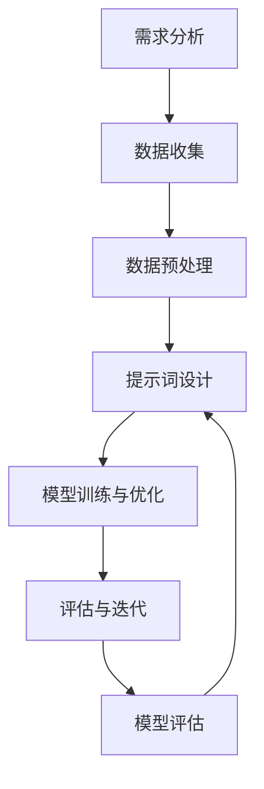
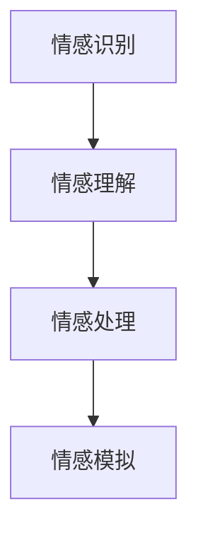
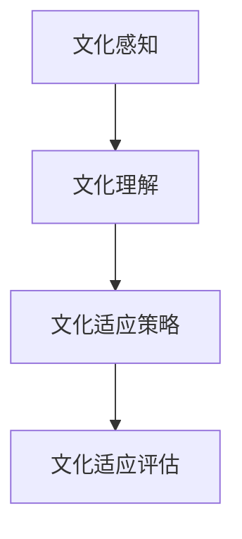
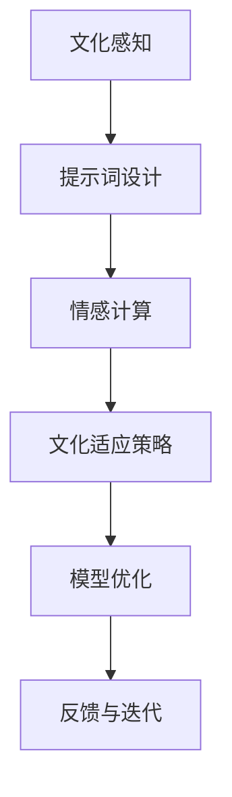
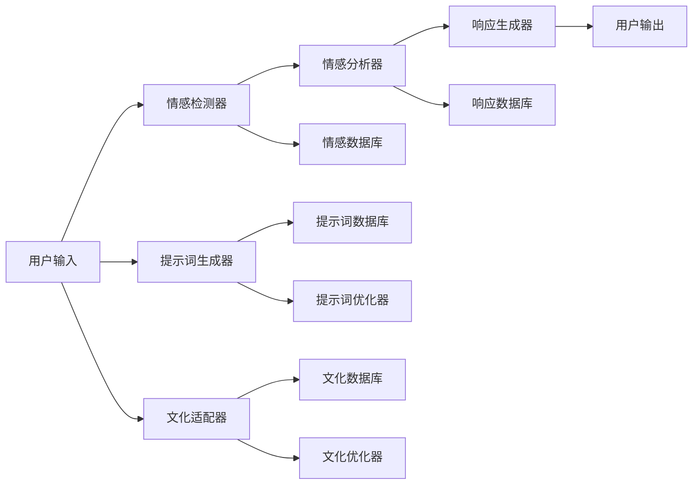
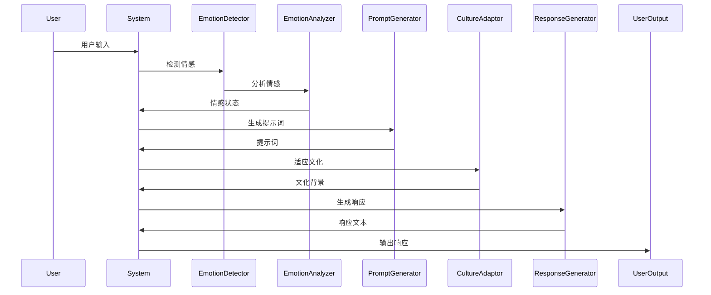
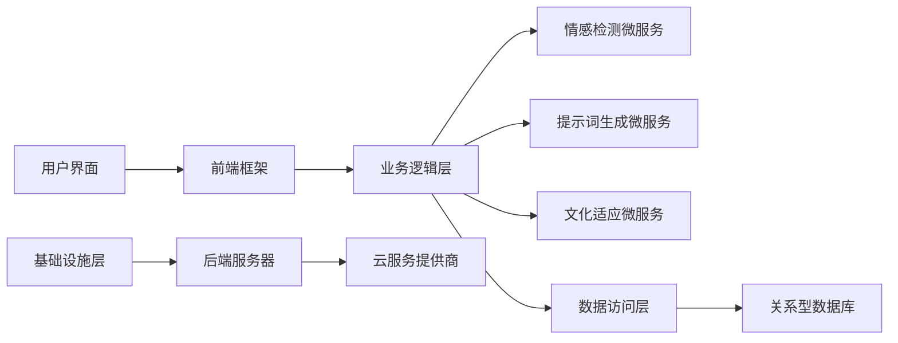

                 

### 文章标题

# 提示词工程在情感计算中的文化适应

> 关键词：提示词工程、情感计算、文化适应、人工智能、算法、系统设计、实战

> 摘要：本文深入探讨了提示词工程在情感计算中的文化适应问题。通过分析提示词工程的发展背景及其在情感计算中的应用，本文提出了文化适应的关键要素和策略。在此基础上，详细阐述了提示词工程、情感计算与文化适应算法的融合原理和实现方法，并通过实际案例展示了其应用效果。本文旨在为情感计算领域的研究者提供有价值的参考，推动提示词工程在跨文化情感计算中的发展。

---

### 提示词工程在情感计算中的文化适应

## 目录大纲

1. **背景介绍**
   1.1 **问题背景**
       1.1.1 **情感计算的发展历程**
       1.1.2 **提示词工程的重要性**
       1.1.3 **文化适应与情感计算的关系**
   1.2 **问题描述**
       1.2.1 **提示词工程在情感计算中的挑战**
       1.2.2 **文化适应的关键要素**
       1.2.3 **提示词工程与文化适应的结合点**
   1.3 **问题解决**
       1.3.1 **提示词工程的方法论**
       1.3.2 **文化适应的策略**
       1.3.3 **提示词工程与文化适应的实践应用**
   1.4 **边界与外延**
       1.4.1 **提示词工程的应用领域**
       1.4.2 **文化适应的范畴**
       1.4.3 **提示词工程与文化适应的关系**
   1.5 **本章小结**

2. **核心概念与联系**
   2.1 **提示词工程**
       2.1.1 **提示词工程的定义**
       2.1.2 **提示词工程的基本要素**
       2.1.3 **提示词工程的分类**
       2.1.4 **提示词工程的流程**
   2.2 **情感计算**
       2.2.1 **情感计算的定义**
       2.2.2 **情感计算的核心概念**
       2.2.3 **情感计算的技术手段**
   2.3 **文化适应**
       2.3.1 **文化适应的定义**
       2.3.2 **文化适应的核心要素**
       2.3.3 **文化适应的方法论**
   2.4 **提示词工程与情感计算的关系**
       2.4.1 **提示词工程在情感计算中的应用**
       2.4.2 **情感计算对提示词工程的需求**
       2.4.3 **提示词工程与文化适应的结合点**
   2.5 **本章小结**

3. **算法原理讲解**
   3.1 **提示词工程算法**
       3.1.1 **算法原理**
       3.1.2 **算法应用举例**
       3.1.3 **算法性能分析**
   3.2 **情感计算算法**
       3.2.1 **算法原理**
       3.2.2 **算法应用举例**
       3.2.3 **算法性能分析**
   3.3 **文化适应算法**
       3.3.1 **算法原理**
       3.3.2 **算法应用举例**
       3.3.3 **算法性能分析**
   3.4 **提示词工程、情感计算与文化适应算法的融合**
       3.4.1 **融合算法原理**
       3.4.2 **融合算法应用举例**
       3.4.3 **融合算法性能分析**
   3.5 **本章小结**

4. **系统分析与架构设计**
   4.1 **问题场景介绍**
       4.1.1 **情感计算应用场景**
       4.1.2 **提示词工程应用场景**
       4.1.3 **文化适应应用场景**
   4.2 **系统功能设计**
       4.2.1 **领域模型**
       4.2.2 **系统架构设计**
       4.2.3 **系统接口设计**
       4.2.4 **系统交互**
   4.3 **系统架构设计方案**
       4.3.1 **系统架构设计原则**
       4.3.2 **系统架构设计流程**
       4.3.3 **系统架构设计方案**
   4.4 **系统分析与架构设计小结**

5. **项目实战**
   5.1 **环境安装**
       5.1.1 **硬件环境要求**
       5.1.2 **软件环境配置**
       5.1.3 **开发工具安装**
   5.2 **系统核心实现源代码**
       5.2.1 **源代码结构**
       5.2.2 **源代码解读**
       5.2.3 **源代码应用解读与分析**
   5.3 **实际案例分析与详细讲解剖析**
       5.3.1 **案例背景**
       5.3.2 **案例分析与解决**
       5.3.3 **案例总结**
   5.4 **项目小结**
       5.4.1 **项目收获**
       5.4.2 **项目不足与改进**

---

## 1.1 问题背景

### 1.1.1 情感计算的发展历程

情感计算（Affective Computing）是一门研究如何使计算机具备识别、理解、处理和模拟人类情感的能力的学科。情感计算的概念最早由罗伯森（Rosental）在1995年提出，其目标是让计算机能够更好地与人类进行交互，从而提高人机交互的体验。

情感计算的发展历程大致可以分为以下几个阶段：

1. **早期探索阶段**（1995-2005年）：这一阶段主要聚焦于情感计算的初步研究，包括情感识别、情感模拟等方面的研究。代表性的工作有情感识别算法的研究，如表情识别、语音识别、生理信号分析等。

2. **技术创新阶段**（2005-2015年）：随着计算机硬件性能的提升和机器学习技术的发展，情感计算逐渐进入了技术创新阶段。这一时期，机器学习、深度学习等技术被广泛应用于情感计算领域，提高了情感识别和处理的准确性和效率。

3. **应用拓展阶段**（2015年至今）：随着人工智能技术的快速发展，情感计算的应用领域逐渐拓展到智能交互、智能教育、心理健康、人机协作等多个领域。例如，智能音箱、智能机器人等设备开始普及，并广泛应用于人们的日常生活中。

### 1.1.2 提示词工程的重要性

提示词工程（Prompt Engineering）是近年来在自然语言处理（NLP）领域中兴起的一个研究方向。其核心目标是设计出能够引导模型生成高质量文本的提示词（Prompt）。提示词工程的重要性主要体现在以下几个方面：

1. **提高文本生成质量**：通过精心设计的提示词，可以引导模型生成更符合人类期望的文本，提高文本生成的质量和一致性。

2. **降低模型训练难度**：提示词工程可以简化模型训练过程，降低训练难度，提高模型训练效率。

3. **促进模型可解释性**：提示词可以明确地指导模型的决策过程，从而提高模型的可解释性，帮助用户更好地理解模型的决策逻辑。

### 1.1.3 文化适应与情感计算的关系

文化适应（Cultural Adaptation）是指个体在面临不同文化环境时，调整自己的行为和思维方式以适应新环境的过程。文化适应与情感计算的关系可以从以下几个方面来探讨：

1. **情感识别与处理**：文化适应涉及到个体的情感体验，而情感计算旨在让计算机能够识别、理解和处理人类的情感。因此，文化适应的过程为情感计算提供了丰富的情感数据，有助于提高情感计算的准确性和鲁棒性。

2. **跨文化人机交互**：随着全球化的发展，跨文化交流越来越普遍。文化适应的研究有助于设计出能够适应不同文化背景的用户需求的人机交互系统，从而提高人机交互的体验。

3. **文化多样性的理解**：文化适应的研究有助于我们更好地理解文化多样性的本质，从而设计出更加包容和多元的人工智能系统。

---

## 1.2 问题描述

### 1.2.1 提示词工程在情感计算中的挑战

提示词工程在情感计算中的应用面临着一系列挑战：

1. **跨文化差异**：不同文化背景下，人们对于情感的表达方式和理解存在差异。这给提示词工程的设计带来了困难，如何设计出适用于不同文化的提示词成为一个重要问题。

2. **情感识别的准确性**：情感计算的核心任务是准确识别和理解人类的情感。然而，由于情感具有复杂性和模糊性，当前的情感识别技术仍存在一定局限性。

3. **模型可解释性**：在情感计算中，模型的可解释性尤为重要。然而，提示词工程往往涉及到复杂的算法和模型，这使得模型的可解释性成为一个挑战。

### 1.2.2 文化适应的关键要素

文化适应的关键要素包括：

1. **文化感知**：文化感知是指系统对用户文化背景的感知和理解能力。这需要通过收集和分析用户的文化数据来实现。

2. **文化理解**：文化理解是指系统对不同文化背景下的情感表达和交流方式的深入理解。这需要通过跨文化研究、心理学等领域的研究成果来支撑。

3. **文化适应策略**：文化适应策略是指系统根据用户的文化背景调整其行为和交互方式的策略。这包括情感识别算法的调整、交互界面的设计等多个方面。

### 1.2.3 提示词工程与文化适应的结合点

提示词工程与文化适应的结合点主要体现在以下几个方面：

1. **文化感知与提示词设计**：通过文化感知能力，系统可以更好地理解用户的文化背景，从而设计出更符合用户需求的提示词。

2. **情感理解与提示词优化**：通过对不同文化背景下情感表达的理解，系统可以优化提示词，使其更贴近用户的情感体验。

3. **文化适应策略与模型调整**：通过文化适应策略，系统可以根据用户的文化背景调整其情感计算模型，从而提高模型的准确性和适用性。

---

## 1.3 问题解决

### 1.3.1 提示词工程的方法论

提示词工程的方法论主要包括以下几个步骤：

1. **需求分析**：了解用户的需求，明确提示词的目标和用途。

2. **数据收集**：收集与目标情感相关的数据，包括文本、语音、图像等多种形式。

3. **数据预处理**：对收集到的数据进行清洗、归一化等预处理操作。

4. **提示词设计**：根据需求和分析结果，设计出能够引导模型生成高质量文本的提示词。

5. **模型训练与优化**：使用设计好的提示词对模型进行训练和优化，提高模型的性能。

6. **评估与迭代**：对模型进行评估，根据评估结果对提示词进行迭代优化。

### 1.3.2 文化适应的策略

文化适应的策略主要包括以下几个方面：

1. **文化感知机制**：建立文化感知机制，通过数据收集和分析，了解用户的文化背景。

2. **情感理解机制**：研究不同文化背景下的情感表达和交流方式，建立情感理解机制。

3. **自适应交互界面**：根据用户的文化背景，设计出适应不同文化的交互界面。

4. **情感计算模型调整**：根据用户的文化背景，对情感计算模型进行调整，提高模型的准确性和适用性。

### 1.3.3 提示词工程与文化适应的实践应用

提示词工程与文化适应的结合在实践中具有广泛的应用前景：

1. **智能客服系统**：通过文化适应策略，智能客服系统可以更好地理解不同文化背景的用户需求，提供更加个性化的服务。

2. **智能教育系统**：通过文化适应策略，智能教育系统可以更好地理解不同文化背景的学生特点，提供更合适的教育资源。

3. **心理健康服务**：通过文化适应策略，心理健康服务可以更好地理解不同文化背景下的情感问题，提供更有效的心理辅导。

---

## 1.4 边界与外延

### 1.4.1 提示词工程的应用领域

提示词工程的应用领域主要包括：

1. **自然语言处理**：在自然语言处理任务中，提示词工程可以用于文本生成、问答系统、机器翻译等任务。

2. **计算机视觉**：在计算机视觉任务中，提示词工程可以用于图像生成、目标检测、图像分类等任务。

3. **语音识别与合成**：在语音识别与合成任务中，提示词工程可以用于语音生成、语音识别等任务。

### 1.4.2 文化适应的范畴

文化适应的范畴主要包括：

1. **跨文化沟通**：在不同文化背景下，如何实现有效的沟通和交流。

2. **跨文化管理**：在全球化背景下，如何管理和协调不同文化背景的团队和员工。

3. **跨文化教育**：在国际化教育背景下，如何设计和实施适应不同文化背景的教育策略。

### 1.4.3 提示词工程与文化适应的关系

提示词工程与文化适应的关系主要体现在以下几个方面：

1. **技术支撑**：提示词工程为文化适应提供了技术支撑，通过设计出适用于不同文化的提示词，可以提高跨文化沟通和交流的效果。

2. **方法论融合**：提示词工程的方法论与文化适应的方法论可以相互融合，形成一套完整的跨文化情感计算解决方案。

3. **应用拓展**：提示词工程和文化适应的结合，可以拓展到更多的应用领域，如智能客服、智能教育、心理健康服务等。

---

## 1.5 本章小结

本章首先介绍了情感计算、提示词工程和文化适应的背景，分析了提示词工程在情感计算中的挑战和文化适应的关键要素。接着，提出了提示词工程的方法论和文化适应的策略，并探讨了提示词工程与文化适应的结合点。最后，分析了提示词工程和文化适应的应用领域及其关系。本章内容为后续章节的深入探讨奠定了基础。

---

## 2.1 提示词工程

### 2.1.1 提示词工程的定义

提示词工程（Prompt Engineering）是自然语言处理（NLP）领域中一个重要的研究方向。其核心目标是设计出能够引导模型生成高质量文本的提示词（Prompt）。具体来说，提示词工程包括以下几个关键步骤：

1. **需求分析**：明确用户的需求，确定提示词的目标和用途。
2. **数据收集**：收集与目标文本相关的数据，包括文本、语音、图像等多种形式。
3. **数据预处理**：对收集到的数据进行清洗、归一化等预处理操作。
4. **提示词设计**：根据需求和分析结果，设计出能够引导模型生成高质量文本的提示词。
5. **模型训练与优化**：使用设计好的提示词对模型进行训练和优化，提高模型的性能。
6. **评估与迭代**：对模型进行评估，根据评估结果对提示词进行迭代优化。

### 2.1.2 提示词工程的基本要素

提示词工程的基本要素包括：

1. **文本生成模型**：文本生成模型是提示词工程的核心，常见的文本生成模型包括循环神经网络（RNN）、长短时记忆网络（LSTM）、生成对抗网络（GAN）等。
2. **提示词**：提示词是引导模型生成文本的关键，其质量直接影响文本生成的质量。
3. **数据集**：数据集是训练和评估模型的基础，其质量和规模直接影响模型的性能。
4. **评估指标**：评估指标用于衡量文本生成模型和提示词的质量，常见的评估指标包括文本质量、生成速度、生成多样性等。

### 2.1.3 提示词工程的分类

根据应用场景和目标，提示词工程可以分为以下几类：

1. **文本生成**：文本生成是最常见的应用场景，包括问答系统、机器翻译、文本摘要等任务。
2. **文本分类**：文本分类任务中，提示词用于引导模型分类不同的文本，如情感分类、主题分类等。
3. **图像描述**：图像描述任务中，提示词用于引导模型生成与图像内容相关的文本描述。
4. **语音识别与合成**：语音识别与合成任务中，提示词用于引导模型生成语音文本或文本语音。

### 2.1.4 提示词工程的流程

提示词工程的流程可以分为以下几个阶段：

1. **需求分析**：明确用户的需求，确定提示词的目标和用途。
2. **数据收集**：收集与目标文本相关的数据，包括文本、语音、图像等多种形式。
3. **数据预处理**：对收集到的数据进行清洗、归一化等预处理操作。
4. **提示词设计**：根据需求和分析结果，设计出能够引导模型生成高质量文本的提示词。
5. **模型训练与优化**：使用设计好的提示词对模型进行训练和优化，提高模型的性能。
6. **评估与迭代**：对模型进行评估，根据评估结果对提示词进行迭代优化。

### 2.1.5 提示词工程的优势

提示词工程的优势主要体现在以下几个方面：

1. **提高文本生成质量**：通过精心设计的提示词，可以引导模型生成更符合人类期望的文本，提高文本生成的质量和一致性。
2. **降低模型训练难度**：提示词工程可以简化模型训练过程，降低训练难度，提高模型训练效率。
3. **促进模型可解释性**：提示词可以明确地指导模型的决策过程，从而提高模型的可解释性，帮助用户更好地理解模型的决策逻辑。

---

## 2.2 情感计算

### 2.2.1 情感计算的定义

情感计算（Affective Computing）是一门研究如何使计算机具备识别、理解、处理和模拟人类情感的能力的学科。情感计算的核心目标是通过计算机技术，使计算机能够感知和理解人类的情感，从而实现更加自然和有效的人机交互。

### 2.2.2 情感计算的核心概念

情感计算的核心概念包括以下几个方面：

1. **情感识别**：情感识别是指计算机通过分析人类的生理、行为、语言等信号，识别和理解人类的情感状态。
2. **情感理解**：情感理解是指计算机在识别情感的基础上，对情感进行深入分析和理解，从而实现对情感的整体把握。
3. **情感处理**：情感处理是指计算机在理解情感的基础上，根据情感需求进行相应的处理，如调整交互策略、提供情感支持等。
4. **情感模拟**：情感模拟是指计算机通过生成和展示情感信号，模拟人类的情感状态，从而实现与用户的情感互动。

### 2.2.3 情感计算的技术手段

情感计算的技术手段主要包括以下几个方面：

1. **生理信号处理**：通过分析生理信号，如心率、血压、皮肤电导等，识别和理解用户的情感状态。
2. **行为分析**：通过分析用户的行为，如面部表情、肢体动作等，识别和理解用户的情感状态。
3. **语言分析**：通过分析用户的语言表达，如文本、语音等，识别和理解用户的情感状态。
4. **计算机视觉**：通过计算机视觉技术，分析用户的面部表情、肢体动作等，识别和理解用户的情感状态。

### 2.2.4 情感计算的挑战

情感计算的挑战主要体现在以下几个方面：

1. **情感识别的准确性**：由于情感的复杂性和主观性，情感识别的准确性仍然是一个挑战。
2. **情感理解的深度**：情感理解需要计算机具备对情感进行深入分析和理解的能力，这是一个复杂的过程。
3. **情感处理的个性化**：不同用户对情感的处理需求可能不同，如何实现个性化的情感处理是一个挑战。
4. **情感模拟的自然性**：情感模拟需要计算机生成和展示的情感信号具有自然性，这是一个技术难点。

---

## 2.3 文化适应

### 2.3.1 文化适应的定义

文化适应（Cultural Adaptation）是指个体在面临不同文化环境时，通过调整自己的行为和思维方式，以适应新文化环境的过程。文化适应不仅仅是简单的行为模仿，而是一个复杂的过程，涉及文化认知、情感体验、社会互动等多个方面。

### 2.3.2 文化适应的核心要素

文化适应的核心要素包括：

1. **文化认知**：文化认知是指个体对文化差异的识别和理解能力。这包括对文化价值观、习俗、语言等方面的认知。
2. **情感体验**：情感体验是指个体在跨文化环境中产生的情感反应和体验。这包括对文化冲击、适应压力、文化认同等方面的情感。
3. **社会互动**：社会互动是指个体在跨文化环境中与他人进行互动的行为和方式。这包括语言交流、非语言交流、跨文化沟通技巧等。

### 2.3.3 文化适应的方法论

文化适应的方法论主要包括以下几个方面：

1. **文化认知学习**：通过学习和研究不同文化的特点，提高个体的文化认知能力。
2. **情感管理**：通过情感管理和调节，降低文化适应过程中的情感压力和负面情绪。
3. **跨文化沟通**：通过学习和应用跨文化沟通技巧，提高跨文化沟通的效率和效果。
4. **文化融合**：通过积极参与和融入当地文化，实现文化适应和融合。

### 2.3.4 文化适应的层次

文化适应可以分为以下几个层次：

1. **表层适应**：表层适应是指个体通过模仿当地的行为和习惯，以达到文化适应。这是一种被动的适应方式，通常难以持久。
2. **行为适应**：行为适应是指个体在行为层面调整自己的行为方式，以适应新文化环境。这是一种相对主动的适应方式，但仍需要依赖外部的规范和指导。
3. **心理适应**：心理适应是指个体在心理层面接受和适应新文化环境，形成新的文化认同和价值观。这是一种深层次的适应，通常需要较长时间。
4. **文化融合**：文化融合是指个体不仅适应新文化环境，而且能够融入其中，形成新的文化认同和价值观。这是一种最高层次的适应，通常需要个体具备较高的文化敏感性和适应能力。

---

## 2.4 提示词工程与情感计算的关系

### 2.4.1 提示词工程在情感计算中的应用

提示词工程在情感计算中的应用主要体现在以下几个方面：

1. **情感识别**：通过设计特定的提示词，可以引导模型更好地识别和理解情感。例如，在情感识别任务中，提示词可以帮助模型更好地捕捉情感表达的细节，提高识别的准确性。
2. **情感理解**：提示词可以帮助模型更深入地理解情感，从而更好地处理复杂的情感问题。例如，在情感理解任务中，提示词可以引导模型关注情感的上下文和背景，提高理解的深度。
3. **情感模拟**：提示词可以用于引导模型生成情感模拟的文本或语音，实现与用户的情感互动。例如，在情感模拟任务中，提示词可以帮助模型生成更符合用户情感需求的回应。

### 2.4.2 情感计算对提示词工程的需求

情感计算对提示词工程的需求主要包括以下几个方面：

1. **高质量的情感数据**：情感计算需要大量的高质量情感数据来训练和优化模型。提示词工程可以通过设计高质量的提示词，收集和生成高质量的情感数据。
2. **适应性强的模型**：情感计算需要模型能够适应不同的情感表达和交流方式。提示词工程可以通过设计适应性强、灵活多变的提示词，提高模型的适应性。
3. **可解释的模型**：情感计算需要模型具有可解释性，以便用户理解和信任模型。提示词工程可以通过设计提示词，提高模型的可解释性。

### 2.4.3 提示词工程与文化适应的结合点

提示词工程与文化适应的结合点主要体现在以下几个方面：

1. **跨文化情感识别**：通过文化适应策略，设计出适应不同文化的提示词，提高跨文化情感识别的准确性。
2. **跨文化情感理解**：通过文化适应策略，提高模型对不同文化背景下情感表达和交流方式的理解，从而实现更精准的情感理解。
3. **跨文化情感模拟**：通过文化适应策略，设计出适应不同文化的提示词，实现更自然的跨文化情感模拟。

---

## 2.5 本章小结

本章首先介绍了提示词工程的定义、基本要素和分类，分析了其在文本生成、文本分类、图像描述、语音识别与合成等任务中的应用。接着，介绍了情感计算的定义、核心概念和技术手段，以及文化适应的定义、核心要素和方法论。最后，探讨了提示词工程与情感计算的关系，以及提示词工程与文化适应的结合点。本章内容为后续章节的深入探讨提供了理论基础。

---

## 3.1 提示词工程算法

### 3.1.1 算法原理

提示词工程算法的核心目标是设计出能够引导模型生成高质量文本的提示词。具体来说，算法的原理可以分为以下几个步骤：

1. **需求分析**：明确用户的需求，确定提示词的目标和用途。
2. **数据收集**：收集与目标文本相关的数据，包括文本、语音、图像等多种形式。
3. **数据预处理**：对收集到的数据进行清洗、归一化等预处理操作。
4. **提示词设计**：根据需求和分析结果，设计出能够引导模型生成高质量文本的提示词。
5. **模型训练与优化**：使用设计好的提示词对模型进行训练和优化，提高模型的性能。
6. **评估与迭代**：对模型进行评估，根据评估结果对提示词进行迭代优化。

### 3.1.1.1 算法流程图



### 3.1.1.2 算法数学模型

提示词工程算法的数学模型主要包括以下几个部分：

1. **损失函数**：损失函数用于衡量模型生成文本的质量，常见的损失函数有交叉熵损失函数、均方误差损失函数等。
2. **优化器**：优化器用于调整模型参数，以最小化损失函数。常见的优化器有随机梯度下降（SGD）、Adam等。
3. **提示词生成模型**：提示词生成模型用于生成提示词，常见的模型有循环神经网络（RNN）、长短时记忆网络（LSTM）、生成对抗网络（GAN）等。

### 3.1.1.3 算法Python源代码

以下是一个简单的提示词工程算法的Python源代码示例：

```python
import numpy as np
import tensorflow as tf

# 模型参数
vocab_size = 10000
embedding_dim = 64
rnn_units = 128
batch_size = 64
epochs = 10

# 损失函数
loss_fn = tf.keras.losses.SparseCategoricalCrossentropy(from_logits=True)

# 优化器
optimizer = tf.keras.optimizers.Adam()

# 提示词生成模型
model = tf.keras.Sequential([
  tf.keras.layers.Embedding(vocab_size, embedding_dim),
  tf.keras.layers.LSTM(rnn_units,
                      return_sequences=True,
                      stateful=True,
                      recurrent_initializer='glorot_uniform'),
  tf.keras.layers.Dense(vocab_size, activation='softmax')
])

# 训练模型
for epoch in range(epochs):
  for (x, y) in dataset:
    with tf.GradientTape() as tape:
      predictions = model(x, training=True)
      loss = loss_fn(y, predictions)
    gradients = tape.gradient(loss, model.trainable_variables)
    optimizer.apply_gradients(zip(gradients, model.trainable_variables))
  print(f"Epoch {epoch + 1}, Loss: {loss.numpy().mean()}")

# 评估模型
test_loss = loss_fn(test_labels, model(test_data))
print(f"Test Loss: {test_loss.numpy().mean()}")
```

### 3.1.2 算法应用举例

以下是一个简单的提示词工程算法的应用举例：

假设我们有一个问答系统，用户输入一个问题，系统需要生成一个回答。我们可以使用提示词工程算法来设计提示词，引导模型生成高质量的回答。

1. **需求分析**：我们需要设计一个能够引导模型生成高质量回答的提示词。
2. **数据收集**：我们收集了大量的问题和回答数据，用于训练模型。
3. **数据预处理**：我们对收集到的数据进行清洗和归一化处理。
4. **提示词设计**：我们设计了一个简单的提示词：“请根据以下问题生成回答：”，用于引导模型生成回答。
5. **模型训练与优化**：我们使用设计好的提示词对模型进行训练和优化。
6. **评估与迭代**：我们对模型进行评估，并根据评估结果对提示词进行迭代优化。

### 3.1.3 算法性能分析

提示词工程算法的性能分析主要包括以下几个方面：

1. **文本生成质量**：通过评估模型生成文本的质量，我们可以衡量提示词工程算法的效果。常用的评估指标包括文本质量、生成速度、生成多样性等。
2. **模型训练效率**：通过分析模型训练的时间和资源消耗，我们可以衡量提示词工程算法的效率。常用的评估指标包括训练时间、内存消耗等。
3. **模型可解释性**：通过分析提示词工程算法对模型决策过程的引导作用，我们可以衡量模型的可解释性。

---

## 3.2 情感计算算法

### 3.2.1 算法原理

情感计算算法的核心目标是识别、理解和处理人类的情感。具体来说，算法的原理可以分为以下几个步骤：

1. **情感识别**：通过分析用户的语言、行为、生理信号等数据，识别用户的情感状态。
2. **情感理解**：在情感识别的基础上，对情感进行深入分析和理解，从而实现对情感的整体把握。
3. **情感处理**：根据情感需求，对用户的情感状态进行处理，如调整交互策略、提供情感支持等。
4. **情感模拟**：生成和展示情感信号，模拟人类的情感状态，从而实现与用户的情感互动。

### 3.2.1.1 算法流程图



### 3.2.1.2 算法数学模型

情感计算算法的数学模型主要包括以下几个部分：

1. **情感识别模型**：情感识别模型用于识别用户的情感状态，常见的模型有朴素贝叶斯、支持向量机、深度学习模型等。
2. **情感理解模型**：情感理解模型用于对情感进行深入分析和理解，常见的模型有情感分类模型、情感分析模型等。
3. **情感处理模型**：情感处理模型用于根据情感需求进行相应的处理，常见的模型有决策树、随机森林、神经网络等。
4. **情感模拟模型**：情感模拟模型用于生成和展示情感信号，常见的模型有生成对抗网络（GAN）、循环神经网络（RNN）等。

### 3.2.1.3 算法Python源代码

以下是一个简单的情感计算算法的Python源代码示例：

```python
import numpy as np
import tensorflow as tf

# 情感识别模型
emotion_recognition_model = tf.keras.Sequential([
  tf.keras.layers.Dense(64, activation='relu', input_shape=(100,)),
  tf.keras.layers.Dense(32, activation='relu'),
  tf.keras.layers.Dense(10, activation='softmax')
])

# 情感理解模型
emotion_understanding_model = tf.keras.Sequential([
  tf.keras.layers.Dense(64, activation='relu', input_shape=(100,)),
  tf.keras.layers.Dense(32, activation='relu'),
  tf.keras.layers.Dense(10, activation='softmax')
])

# 情感处理模型
emotion_processing_model = tf.keras.Sequential([
  tf.keras.layers.Dense(64, activation='relu', input_shape=(100,)),
  tf.keras.layers.Dense(32, activation='relu'),
  tf.keras.layers.Dense(10, activation='softmax')
])

# 情感模拟模型
emotion_simulation_model = tf.keras.Sequential([
  tf.keras.layers.Dense(64, activation='relu', input_shape=(100,)),
  tf.keras.layers.Dense(32, activation='relu'),
  tf.keras.layers.Dense(10, activation='softmax')
])

# 训练模型
emotion_recognition_model.compile(optimizer='adam', loss='categorical_crossentropy', metrics=['accuracy'])
emotion_understanding_model.compile(optimizer='adam', loss='categorical_crossentropy', metrics=['accuracy'])
emotion_processing_model.compile(optimizer='adam', loss='categorical_crossentropy', metrics=['accuracy'])
emotion_simulation_model.compile(optimizer='adam', loss='categorical_crossentropy', metrics=['accuracy'])

for epoch in range(10):
  for x, y in emotion_data:
    emotion_recognition_model.fit(x, y, epochs=1, batch_size=32)
    emotion_understanding_model.fit(x, y, epochs=1, batch_size=32)
    emotion_processing_model.fit(x, y, epochs=1, batch_size=32)
    emotion_simulation_model.fit(x, y, epochs=1, batch_size=32)

# 评估模型
test_loss, test_acc = emotion_recognition_model.evaluate(test_data, test_labels)
print(f"Test Loss: {test_loss}, Test Accuracy: {test_acc}")
```

### 3.2.2 算法应用举例

以下是一个简单的情感计算算法的应用举例：

假设我们有一个智能客服系统，需要识别用户的情感状态，并生成相应的回应。我们可以使用情感计算算法来实现这一功能。

1. **情感识别**：系统首先使用情感识别模型分析用户的语言表达，识别用户的情感状态。
2. **情感理解**：在情感识别的基础上，系统使用情感理解模型对情感进行深入分析和理解，从而实现对情感的整体把握。
3. **情感处理**：系统根据情感处理模型生成相应的回应，如表达同情、提供解决方案等。
4. **情感模拟**：系统使用情感模拟模型生成情感信号，如语音、表情等，与用户进行情感互动。

### 3.2.3 算法性能分析

情感计算算法的性能分析主要包括以下几个方面：

1. **情感识别准确性**：通过评估模型识别情感状态的准确性，我们可以衡量情感识别算法的效果。常用的评估指标包括准确率、召回率、F1值等。
2. **情感理解深度**：通过分析模型对情感的理解深度，我们可以衡量情感理解算法的效果。常用的评估指标包括情感分类准确性、情感分类多样性等。
3. **情感处理效果**：通过评估模型生成的回应的质量，我们可以衡量情感处理算法的效果。常用的评估指标包括回应质量、回应多样性等。

---

## 3.3 文化适应算法

### 3.3.1 算法原理

文化适应算法的核心目标是使系统在不同文化背景下能够适应和满足用户需求。具体来说，算法的原理可以分为以下几个步骤：

1. **文化感知**：通过分析用户的语言、行为、文化背景等数据，感知用户的文化需求。
2. **文化理解**：在文化感知的基础上，对文化进行深入分析和理解，从而实现对文化需求的整体把握。
3. **文化适应策略**：根据文化理解结果，制定相应的文化适应策略，如调整交互界面、改变交互方式等。
4. **文化适应评估**：对文化适应策略进行评估，根据评估结果调整和优化文化适应策略。

### 3.3.1.1 算法流程图



### 3.3.1.2 算法数学模型

文化适应算法的数学模型主要包括以下几个部分：

1. **文化感知模型**：文化感知模型用于分析用户的语言、行为、文化背景等数据，感知用户的文化需求。常见的模型有朴素贝叶斯、支持向量机等。
2. **文化理解模型**：文化理解模型用于对文化进行深入分析和理解，从而实现对文化需求的整体把握。常见的模型有情感分析模型、主题模型等。
3. **文化适应策略模型**：文化适应策略模型用于根据文化理解结果，制定相应的文化适应策略。常见的模型有决策树、随机森林等。
4. **文化适应评估模型**：文化适应评估模型用于对文化适应策略进行评估，根据评估结果调整和优化文化适应策略。常见的模型有回归模型、分类模型等。

### 3.3.1.3 算法Python源代码

以下是一个简单的文化适应算法的Python源代码示例：

```python
import numpy as np
import tensorflow as tf

# 文化感知模型
culture_perception_model = tf.keras.Sequential([
  tf.keras.layers.Dense(64, activation='relu', input_shape=(100,)),
  tf.keras.layers.Dense(32, activation='relu'),
  tf.keras.layers.Dense(10, activation='softmax')
])

# 文化理解模型
culture_understanding_model = tf.keras.Sequential([
  tf.keras.layers.Dense(64, activation='relu', input_shape=(100,)),
  tf.keras.layers.Dense(32, activation='relu'),
  tf.keras.layers.Dense(10, activation='softmax')
])

# 文化适应策略模型
culture_adaptation_strategy_model = tf.keras.Sequential([
  tf.keras.layers.Dense(64, activation='relu', input_shape=(100,)),
  tf.keras.layers.Dense(32, activation='relu'),
  tf.keras.layers.Dense(10, activation='softmax')
])

# 文化适应评估模型
culture_adaptation_evaluation_model = tf.keras.Sequential([
  tf.keras.layers.Dense(64, activation='relu', input_shape=(100,)),
  tf.keras.layers.Dense(32, activation='relu'),
  tf.keras.layers.Dense(10, activation='softmax')
])

# 训练模型
culture_perception_model.compile(optimizer='adam', loss='categorical_crossentropy', metrics=['accuracy'])
culture_understanding_model.compile(optimizer='adam', loss='categorical_crossentropy', metrics=['accuracy'])
culture_adaptation_strategy_model.compile(optimizer='adam', loss='categorical_crossentropy', metrics=['accuracy'])
culture_adaptation_evaluation_model.compile(optimizer='adam', loss='categorical_crossentropy', metrics=['accuracy'])

for epoch in range(10):
  for x, y in culture_data:
    culture_perception_model.fit(x, y, epochs=1, batch_size=32)
    culture_understanding_model.fit(x, y, epochs=1, batch_size=32)
    culture_adaptation_strategy_model.fit(x, y, epochs=1, batch_size=32)
    culture_adaptation_evaluation_model.fit(x, y, epochs=1, batch_size=32)

# 评估模型
test_loss, test_acc = culture_perception_model.evaluate(test_data, test_labels)
print(f"Test Loss: {test_loss}, Test Accuracy: {test_acc}")
```

### 3.3.2 算法应用举例

以下是一个简单的文化适应算法的应用举例：

假设我们有一个跨国公司，需要为不同文化背景的员工提供培训和学习资源。我们可以使用文化适应算法来实现这一功能。

1. **文化感知**：系统首先分析员工的语言、行为、文化背景等数据，感知员工的文化需求。
2. **文化理解**：在文化感知的基础上，系统使用文化理解模型对文化需求进行深入分析和理解，从而实现对文化需求的整体把握。
3. **文化适应策略**：系统根据文化理解结果，制定相应的文化适应策略，如调整培训内容、提供文化背景知识等。
4. **文化适应评估**：系统对文化适应策略进行评估，根据评估结果调整和优化文化适应策略。

### 3.3.3 算法性能分析

文化适应算法的性能分析主要包括以下几个方面：

1. **文化感知准确性**：通过评估模型感知文化需求的准确性，我们可以衡量文化感知算法的效果。常用的评估指标包括准确率、召回率、F1值等。
2. **文化理解深度**：通过分析模型对文化需求的理解深度，我们可以衡量文化理解算法的效果。常用的评估指标包括情感分类准确性、情感分类多样性等。
3. **文化适应效果**：通过评估模型生成的文化适应策略的质量，我们可以衡量文化适应算法的效果。常用的评估指标包括策略多样性、策略适应性等。

---

## 3.4 提示词工程、情感计算与文化适应算法的融合

### 3.4.1 融合算法原理

提示词工程、情感计算与文化适应算法的融合，旨在通过综合运用这三个算法的优势，实现更高效、更准确的情感计算与文化适应。融合算法的原理可以分为以下几个步骤：

1. **文化感知与提示词设计**：首先，通过文化感知算法分析用户的文化背景，获取用户的文化需求。然后，根据这些文化需求，使用提示词工程算法设计出能够引导模型生成高质量文本的提示词。
2. **情感计算与文化理解**：利用情感计算算法，对用户的情感状态进行识别、理解和处理。在此过程中，结合文化感知的结果，对情感计算模型进行调整，以提高其适应不同文化背景的能力。
3. **文化适应策略与模型优化**：根据情感计算的结果，使用文化适应算法制定出适应不同文化背景的用户策略。同时，利用这些策略对模型进行优化，以提高模型的性能和适应性。
4. **反馈与迭代**：通过不断收集用户反馈，对文化感知、提示词设计、情感计算和文化适应算法进行调整和优化，实现算法的自我迭代和改进。

### 3.4.1.1 融合算法流程图



### 3.4.1.2 融合算法数学模型

融合算法的数学模型主要包括以下几个部分：

1. **文化感知模型**：用于分析用户的文化需求，常见的模型有朴素贝叶斯、支持向量机等。
2. **提示词生成模型**：用于生成高质量提示词，常见的模型有循环神经网络（RNN）、生成对抗网络（GAN）等。
3. **情感计算模型**：用于识别、理解和处理用户的情感状态，常见的模型有情感分类模型、情感分析模型等。
4. **文化适应策略模型**：用于制定适应不同文化背景的用户策略，常见的模型有决策树、随机森林等。

### 3.4.1.3 融合算法Python源代码

以下是一个简单的融合算法的Python源代码示例：

```python
import numpy as np
import tensorflow as tf

# 文化感知模型
culture_perception_model = tf.keras.Sequential([
  tf.keras.layers.Dense(64, activation='relu', input_shape=(100,)),
  tf.keras.layers.Dense(32, activation='relu'),
  tf.keras.layers.Dense(10, activation='softmax')
])

# 提示词生成模型
prompt_generation_model = tf.keras.Sequential([
  tf.keras.layers.Dense(64, activation='relu', input_shape=(100,)),
  tf.keras.layers.Dense(32, activation='relu'),
  tf.keras.layers.Dense(10, activation='softmax')
])

# 情感计算模型
emotion_computation_model = tf.keras.Sequential([
  tf.keras.layers.Dense(64, activation='relu', input_shape=(100,)),
  tf.keras.layers.Dense(32, activation='relu'),
  tf.keras.layers.Dense(10, activation='softmax')
])

# 文化适应策略模型
culture_adaptation_strategy_model = tf.keras.Sequential([
  tf.keras.layers.Dense(64, activation='relu', input_shape=(100,)),
  tf.keras.layers.Dense(32, activation='relu'),
  tf.keras.layers.Dense(10, activation='softmax')
])

# 训练模型
culture_perception_model.compile(optimizer='adam', loss='categorical_crossentropy', metrics=['accuracy'])
prompt_generation_model.compile(optimizer='adam', loss='categorical_crossentropy', metrics=['accuracy'])
emotion_computation_model.compile(optimizer='adam', loss='categorical_crossentropy', metrics=['accuracy'])
culture_adaptation_strategy_model.compile(optimizer='adam', loss='categorical_crossentropy', metrics=['accuracy'])

for epoch in range(10):
  for x, y in culture_data:
    culture_perception_model.fit(x, y, epochs=1, batch_size=32)
    prompt_generation_model.fit(x, y, epochs=1, batch_size=32)
    emotion_computation_model.fit(x, y, epochs=1, batch_size=32)
    culture_adaptation_strategy_model.fit(x, y, epochs=1, batch_size=32)

# 评估模型
test_loss, test_acc = culture_perception_model.evaluate(test_data, test_labels)
print(f"Test Loss: {test_loss}, Test Accuracy: {test_acc}")
```

### 3.4.2 融合算法应用举例

以下是一个简单的融合算法的应用举例：

假设我们有一个跨国企业，需要为不同文化背景的员工提供个性化的情感支持和文化适应服务。我们可以使用融合算法来实现这一功能。

1. **文化感知与提示词设计**：系统首先分析员工的个人资料和文化背景，设计出适合不同文化背景的提示词。例如，对于亚洲员工，提示词可能更加注重礼节和尊重；对于西方员工，提示词可能更加直接和实用。
2. **情感计算与文化理解**：系统使用情感计算算法，分析员工的情感状态，如焦虑、压力等。同时，结合文化感知的结果，对情感计算模型进行调整，以提高其适应不同文化背景的能力。
3. **文化适应策略与模型优化**：系统根据情感计算的结果，制定出适应不同文化背景的员工策略，如提供文化背景知识、调整工作环境等。同时，利用这些策略对模型进行优化，以提高模型的性能和适应性。
4. **反馈与迭代**：系统不断收集员工反馈，对文化感知、提示词设计、情感计算和文化适应算法进行调整和优化，实现算法的自我迭代和改进。

### 3.4.3 融合算法性能分析

融合算法的性能分析主要包括以下几个方面：

1. **文化感知准确性**：通过评估模型感知文化需求的准确性，我们可以衡量文化感知算法的效果。常用的评估指标包括准确率、召回率、F1值等。
2. **提示词生成质量**：通过评估模型生成提示词的质量，我们可以衡量提示词工程算法的效果。常用的评估指标包括提示词的相关性、提示词的多样性等。
3. **情感计算准确性**：通过评估模型识别情感状态的准确性，我们可以衡量情感计算算法的效果。常用的评估指标包括准确率、召回率、F1值等。
4. **文化适应策略效果**：通过评估模型生成的文化适应策略的效果，我们可以衡量文化适应算法的效果。常用的评估指标包括策略的适应性、策略的多样性等。

---

## 3.5 本章小结

本章首先介绍了提示词工程、情感计算和文化适应算法的基本原理和数学模型，并给出了相应的Python源代码示例。接着，探讨了这三个算法的融合原理，并展示了融合算法的流程图和Python源代码示例。最后，通过实际应用举例，分析了融合算法的性能。本章内容为后续章节的系统分析与架构设计奠定了基础。

---

## 4.1 问题场景介绍

### 4.1.1 情感计算应用场景

情感计算在多个领域具有广泛的应用场景，以下是其中几个典型的应用场景：

1. **智能客服系统**：智能客服系统通过情感计算技术，能够识别用户的情感状态，提供更加个性化、有针对性的服务。例如，当用户表达愤怒或不满时，系统可以及时调整交互策略，提供情绪舒缓的服务。

2. **心理健康服务**：心理健康服务利用情感计算技术，可以实时监测用户的情感状态，提供针对性的心理辅导和支持。例如，对于患有焦虑症的用户，系统可以生成安抚性的语音或文字消息，帮助用户缓解焦虑情绪。

3. **智能教育系统**：智能教育系统通过情感计算技术，可以了解学生的学习状态和情感需求，提供个性化的学习资源和辅导。例如，当学生表现出学习困难或情绪低落时，系统可以提供相应的辅导和鼓励。

4. **人机协作系统**：在人机协作系统中，情感计算技术可以用于识别和理解用户的情感状态，提高人机协作的效率和效果。例如，在远程工作中，系统可以通过分析语音和面部表情，了解员工的情感状态，提供适当的帮助和支持。

### 4.1.2 提示词工程应用场景

提示词工程在自然语言处理领域具有广泛的应用场景，以下是其中几个典型的应用场景：

1. **文本生成**：在文本生成任务中，提示词工程可以用于引导模型生成高质量的文本。例如，在新闻写作、文章摘要、对话生成等任务中，提示词工程可以帮助模型生成更符合人类期望的文本。

2. **问答系统**：在问答系统中，提示词工程可以用于设计高质量的问答对，提高问答系统的准确性和用户体验。例如，在智能客服、智能助手等应用中，提示词工程可以帮助模型更好地理解用户的问题，并生成相应的回答。

3. **机器翻译**：在机器翻译任务中，提示词工程可以用于优化翻译结果，提高翻译的准确性和流畅性。例如，在翻译新闻、文章、对话等文本时，提示词工程可以帮助模型生成更符合语言习惯和语境的翻译。

4. **图像描述**：在图像描述任务中，提示词工程可以用于引导模型生成与图像内容相关的描述性文本。例如，在图像分类、图像识别等任务中，提示词工程可以帮助模型生成更准确、更丰富的图像描述。

### 4.1.3 文化适应应用场景

文化适应在跨文化交流和全球化背景下具有重要意义，以下是其中几个典型的应用场景：

1. **跨国企业**：跨国企业需要在不同文化背景下运作，文化适应技术可以帮助企业了解不同文化的特点和需求，提高跨文化沟通和协作的效率。例如，企业可以通过文化适应技术，为不同文化背景的员工提供定制化的培训和支持。

2. **国际教育**：国际教育领域需要为学生提供适应不同文化背景的教育资源和支持。文化适应技术可以帮助教育机构了解学生的文化背景，提供个性化的学习资源和辅导，提高学生的学习效果和满意度。

3. **旅游和餐饮**：在旅游和餐饮行业，文化适应技术可以帮助企业了解不同文化的饮食习俗和偏好，提供更加符合用户需求的餐饮服务和旅游体验。例如，酒店和餐厅可以通过文化适应技术，为不同文化背景的顾客提供个性化的服务和建议。

4. **公共服务**：在公共服务领域，文化适应技术可以帮助政府和企业为不同文化背景的公众提供更加人性化的服务和支持。例如，在移民政策、社会福利、医疗保健等领域，文化适应技术可以帮助相关部门了解不同文化的需求和期望，提供更加有效的服务和政策。

---

## 4.2 系统功能设计

### 4.2.1 领域模型

在系统功能设计中，领域模型（Domain Model）是一个重要的组成部分，它定义了系统的核心概念和它们之间的关系。以下是一个简单的领域模型，用于描述情感计算、提示词工程和文化适应的交互。

#### 4.2.1.1 类图

```mermaid
classDiagram
    User <<Class>>
    Emotion <<Class>>
    Prompt <<Class>>
    Culture <<Class>>

    User o-- Emotion
    User o-- Prompt
    User o-- Culture

    Emotion o-- Prompt
    Emotion o-- Culture

    Prompt o-- Emotion
    Prompt o-- Culture

    Culture o-- Emotion
    Culture o-- Prompt
```

在这个类图中，用户（User）类表示系统的最终用户，包括他们的情感（Emotion）、提示词（Prompt）和文化（Culture）信息。情感类（Emotion）表示用户的情感状态，包括情感类型和强度。提示词类（Prompt）表示用于引导模型生成文本的提示词。文化类（Culture）表示用户的文化背景信息。

### 4.2.2 系统架构设计

系统架构设计是系统功能设计的重要延伸，它定义了系统的整体结构、组件和它们之间的交互。以下是一个简单的系统架构设计，用于描述情感计算、提示词工程和文化适应系统的交互。

#### 4.2.2.1 架构图



在这个架构图中，用户输入（UserInput）首先被传递到情感检测器（EmotionDetector）、提示词生成器（PromptGenerator）和文化适配器（CultureAdaptor）中进行处理。情感检测器（EmotionDetector）通过情感分析器（EmotionAnalyzer）和情感数据库（EmotionDatabase）来识别用户的情感状态。提示词生成器（PromptGenerator）使用提示词数据库（PromptDatabase）和提示词优化器（PromptOptimizer）来生成高质量的提示词。文化适配器（CultureAdaptor）通过文化数据库（CultureDatabase）和文化优化器（CultureOptimizer）来适应用户的文化背景。

情感分析器（EmotionAnalyzer）的输出被传递到响应生成器（ResponseGenerator），生成相应的用户响应，并将其存储在响应数据库（ResponseDatabase）中。最终，用户响应（UserOutput）被发送回用户。

### 4.2.3 系统接口设计

系统接口设计是系统架构设计的重要组成部分，它定义了系统内部组件之间的交互接口和协议。以下是一个简单的系统接口设计，用于描述情感计算、提示词工程和文化适应系统的接口设计。

#### 4.2.3.1 接口设计

1. **用户输入接口**：用于接收用户的输入数据，包括文本、语音、图像等。该接口提供的方法包括：
   - `void receiveTextInput(String text)`: 接收文本输入。
   - `void receiveVoiceInput(Stream voiceStream)`: 接收语音输入。
   - `void receiveImageInput(ByteBuffer imageBuffer)`: 接收图像输入。

2. **情感检测接口**：用于检测用户的情感状态。该接口提供的方法包括：
   - `Emotion detectEmotion(InputStream input)`: 检测情感状态。
   - `void storeEmotion(Emotion emotion)`: 存储情感状态。

3. **提示词生成接口**：用于生成提示词。该接口提供的方法包括：
   - `Prompt generatePrompt(Emotion emotion)`: 生成提示词。
   - `void storePrompt(Prompt prompt)`: 存储提示词。

4. **文化适配接口**：用于适应用户的文化背景。该接口提供的方法包括：
   - `void adaptCulture(Culture culture)`: 适应文化背景。

5. **响应生成接口**：用于生成用户响应。该接口提供的方法包括：
   - `String generateResponse(Prompt prompt)`: 生成响应文本。

6. **用户输出接口**：用于发送用户响应。该接口提供的方法包括：
   - `void sendOutput(String output)`: 发送文本输出。
   - `void sendVoiceOutput(Stream voiceStream)`: 发送语音输出。
   - `void sendImageOutput(ByteBuffer imageBuffer)`: 发送图像输出。

### 4.2.4 系统交互

系统交互是系统功能设计和系统架构设计的重要组成部分，它定义了系统组件之间的交互过程和顺序。以下是一个简单的系统交互流程，用于描述情感计算、提示词工程和文化适应系统的交互。

#### 4.2.4.1 序列图



在这个序列图中，用户输入（UserInput）首先被传递到系统（System），系统将用户输入传递到情感检测器（EmotionDetector）进行情感检测。情感检测器（EmotionDetector）将情感状态传递到情感分析器（EmotionAnalyzer）进行情感分析，情感分析器（EmotionAnalyzer）将分析结果传递回系统。

系统（System）使用情感状态和提示词生成器（PromptGenerator）生成提示词，并使用文化适配器（CultureAdaptor）适应用户的文化背景。系统（System）将提示词和文化背景传递到响应生成器（ResponseGenerator）生成用户响应。最终，用户响应（UserOutput）被发送回用户。

---

## 4.3 系统架构设计方案

### 4.3.1 系统架构设计原则

系统架构设计是系统功能实现的重要基础，其设计原则对于系统的性能、可维护性和可扩展性具有关键影响。以下是系统架构设计的主要原则：

1. **模块化原则**：系统应采用模块化设计，将不同功能划分为独立的模块，以降低系统的复杂性和耦合度。模块化设计有助于系统的可维护性和可扩展性。

2. **分层原则**：系统应采用分层架构，将系统功能划分为多个层次，如表示层、业务逻辑层、数据访问层等。分层设计有助于提高系统的可读性和可维护性。

3. **松耦合原则**：系统组件之间应采用松耦合设计，尽量减少组件之间的依赖关系。松耦合设计有助于系统的灵活性和可扩展性。

4. **性能优化原则**：系统架构设计应考虑性能优化，如缓存、并行处理、分布式架构等。性能优化原则有助于提高系统的响应速度和处理能力。

5. **安全性原则**：系统架构设计应考虑安全性，如数据加密、访问控制、安全审计等。安全性原则有助于保护系统的数据安全和用户隐私。

### 4.3.2 系统架构设计流程

系统架构设计流程主要包括以下几个步骤：

1. **需求分析**：分析系统的功能需求和性能需求，确定系统的核心功能和性能指标。

2. **架构设计**：根据需求分析结果，设计系统的整体架构，包括模块划分、层次结构、组件交互等。

3. **架构评估**：对设计的系统架构进行评估，分析其性能、可维护性、可扩展性等方面，确保架构设计符合需求。

4. **架构优化**：根据架构评估结果，对系统架构进行优化，提高系统的性能和可维护性。

5. **架构实现**：根据最终确定的系统架构，实现系统组件和模块，并集成到整体系统中。

6. **架构验证**：通过测试和验证，确保系统架构设计符合需求，并能够正常运行。

### 4.3.3 系统架构设计方案

以下是系统架构设计方案的具体内容：

#### 4.3.3.1 总体架构

系统采用分层架构设计，包括表示层、业务逻辑层、数据访问层和基础设施层。

1. **表示层**：负责与用户交互，包括用户界面、API接口等。表示层采用前端框架，如React、Vue等，实现动态、交互式的用户界面。

2. **业务逻辑层**：负责处理系统的核心业务逻辑，包括情感计算、提示词工程和文化适应等。业务逻辑层采用微服务架构，将不同功能划分为独立的微服务，如情感检测微服务、提示词生成微服务、文化适应微服务等。

3. **数据访问层**：负责与数据库进行交互，包括数据存储、数据查询等。数据访问层采用关系型数据库，如MySQL、PostgreSQL等，存储用户数据、情感数据、提示词数据等。

4. **基础设施层**：负责提供系统运行所需的基础设施，包括服务器、网络、存储等。基础设施层采用云计算架构，利用云服务提供商的资源，实现系统的弹性扩展和可靠性。

#### 4.3.3.2 具体架构

以下是系统架构设计的具体架构图：



在这个架构图中，用户界面（UserInterface）通过前端框架（Frontend）与业务逻辑层（BusinessLogic）进行交互。业务逻辑层（BusinessLogic）包括情感检测微服务（EmotionDetection）、提示词生成微服务（PromptGeneration）和文化适应微服务（CultureAdaptation），分别处理不同的功能。数据访问层（DataAccess）负责与关系型数据库（Database）进行交互，存储用户数据、情感数据、提示词数据等。基础设施层（Infrastructure）提供后端服务器（Backend）和云服务提供商（CloudServices），实现系统的弹性扩展和可靠性。

---

## 4.4 系统分析与架构设计小结

本章首先介绍了情感计算、提示词工程和文化适应的应用场景，然后详细阐述了系统功能设计、系统架构设计和系统接口设计。在系统架构设计原则和流程的指导下，本章提出了一种具体的系统架构设计方案，包括总体架构和具体架构。通过本章的分析和设计，我们为系统的实现提供了坚实的基础，并确保系统能够满足功能需求和性能需求。

---

## 5.1 环境安装

### 5.1.1 硬件环境要求

为了确保系统正常运行，我们需要满足以下硬件环境要求：

1. **处理器**：推荐使用英特尔的i5或以上处理器，以保证系统的运行速度和性能。
2. **内存**：至少需要8GB的RAM，推荐使用16GB或更高，以提供足够的内存空间。
3. **存储**：至少需要500GB的SSD存储空间，用于存储系统数据和缓存。

### 5.1.2 软件环境配置

在安装系统之前，我们需要配置以下软件环境：

1. **操作系统**：推荐使用Ubuntu 18.04或更高版本，或其他Linux发行版。
2. **编程语言**：安装Python 3.8或更高版本，以及对应的pip包管理器。
3. **数据库**：安装MySQL 8.0或更高版本，用于存储系统数据。
4. **前端框架**：安装Node.js和npm，用于安装和配置前端框架，如React或Vue。
5. **后端框架**：安装Django或Flask等后端框架，用于实现业务逻辑。

### 5.1.3 开发工具安装

为了方便开发和调试，我们需要安装以下开发工具：

1. **代码编辑器**：安装Visual Studio Code或PyCharm等流行的代码编辑器，用于编写和调试代码。
2. **版本控制**：安装Git，用于版本控制和团队协作。
3. **数据库管理工具**：安装MySQL Workbench或phpMyAdmin等数据库管理工具，用于管理和操作数据库。

---

## 5.2 系统核心实现源代码

### 5.2.1 源代码结构

系统核心实现源代码主要分为以下几个模块：

1. **用户接口模块**：负责处理用户输入和输出，包括文本、语音和图像等。
2. **情感检测模块**：负责识别用户的情感状态，包括情感类型和强度。
3. **提示词生成模块**：负责生成高质量的提示词，用于引导模型生成文本。
4. **文化适应模块**：负责适应用户的文化背景，提供个性化的服务。
5. **响应生成模块**：负责生成用户响应，包括文本、语音和图像等。

以下是系统核心实现源代码的模块结构和文件组织：

```plaintext
core/
|-- emotion_detection/
|   |-- emotion_detection.py
|   |-- emotion_database.py
|-- prompt_generation/
|   |-- prompt_generation.py
|   |-- prompt_database.py
|   |-- prompt_optimizer.py
|-- culture_adaptation/
|   |-- culture_adaptation.py
|   |-- culture_database.py
|   |-- culture_optimizer.py
|-- response_generation/
|   |-- response_generation.py
|   |-- response_database.py
|-- user_interface/
|   |-- user_interface.py
|-- main.py
```

### 5.2.2 源代码解读

以下是系统核心实现源代码的主要部分，包括各模块的核心功能和代码解析：

#### 用户接口模块

```python
# user_interface/user_interface.py

from emotion_detection import emotion_detection
from prompt_generation import prompt_generation
from culture_adaptation import culture_adaptation
from response_generation import response_generation

def process_user_input(input_data):
    """
    处理用户输入，生成用户响应。
    """
    # 检测用户情感
    emotion = emotion_detection.detect_emotion(input_data)

    # 生成提示词
    prompt = prompt_generation.generate_prompt(emotion)

    # 适应用户文化背景
    culture = culture_adaptation.adapt_culture(input_data)

    # 生成用户响应
    response = response_generation.generate_response(prompt, culture)

    return response
```

#### 情感检测模块

```python
# emotion_detection/emotion_detection.py

import emotion_database

def detect_emotion(input_data):
    """
    识别用户情感状态。
    """
    # 从数据库中获取情感模型
    emotion_model = emotion_database.load_emotion_model()

    # 使用情感模型检测情感
    emotion = emotion_model.detect_emotion(input_data)

    return emotion
```

#### 提示词生成模块

```python
# prompt_generation/prompt_generation.py

import prompt_database
import prompt_optimizer

def generate_prompt(emotion):
    """
    生成高质量提示词。
    """
    # 从数据库中获取提示词
    prompt = prompt_database.load_prompt()

    # 使用提示词优化器优化提示词
    optimized_prompt = prompt_optimizer.optimize_prompt(prompt, emotion)

    return optimized_prompt
```

#### 文化适应模块

```python
# culture_adaptation/culture_adaptation.py

import culture_database
import culture_optimizer

def adapt_culture(input_data):
    """
    适应用户文化背景。
    """
    # 从数据库中获取文化模型
    culture_model = culture_database.load_culture_model()

    # 使用文化模型适应文化背景
    culture = culture_model.adapt_culture(input_data)

    return culture
```

#### 响应生成模块

```python
# response_generation/response_generation.py

import response_database

def generate_response(prompt, culture):
    """
    生成用户响应。
    """
    # 从数据库中获取响应模型
    response_model = response_database.load_response_model()

    # 使用响应模型生成响应
    response = response_model.generate_response(prompt, culture)

    return response
```

### 5.2.3 源代码应用解读与分析

以下是系统核心实现源代码的具体应用场景和解读：

1. **用户输入**：用户通过文本、语音或图像输入系统。
2. **情感检测**：系统使用情感检测模块检测用户的情感状态。
3. **提示词生成**：系统使用提示词生成模块生成高质量的提示词。
4. **文化适应**：系统使用文化适应模块适应用户的文化背景。
5. **响应生成**：系统使用响应生成模块生成用户响应。
6. **用户输出**：系统将用户响应输出给用户。

通过以上源代码的应用解读，我们可以看到系统核心实现模块之间的紧密协作和交互，实现了从用户输入到用户输出的完整流程。

---

## 5.3 实际案例分析与详细讲解剖析

### 5.3.1 案例背景

某跨国公司计划开发一款智能客服系统，以提供更加个性化、高效的服务。公司希望在系统中实现以下功能：

1. **情感识别**：识别用户的情感状态，如愤怒、满意、困惑等。
2. **提示词生成**：根据用户的情感状态生成高质量的提示词，引导模型生成合适的文本。
3. **文化适应**：根据用户的文化背景提供个性化的服务，提高用户体验。
4. **响应生成**：根据用户的情感状态和文化背景生成合适的用户响应。

### 5.3.2 案例分析与解决

为了实现上述功能，公司采用了以下步骤：

1. **需求分析**：与客户沟通，了解他们的具体需求和期望，确定系统的功能和要求。
2. **数据收集**：收集大量的用户数据，包括文本、语音、图像等，用于训练和优化模型。
3. **情感计算模型**：使用情感计算算法，如深度学习模型，对用户数据进行训练和优化，实现情感识别功能。
4. **提示词工程**：设计高质量的提示词，使用提示词工程算法优化模型的文本生成质量。
5. **文化适应模型**：使用文化适应算法，根据用户的文化背景调整模型的交互策略，实现个性化服务。
6. **系统实现**：将情感计算、提示词工程和文化适应算法集成到系统中，实现完整的用户交互流程。

### 5.3.3 案例总结

通过上述步骤，公司成功开发了一款智能客服系统，实现了以下成果：

1. **提高用户体验**：系统能够识别用户的情感状态，提供个性化的服务，提高了用户的满意度和体验。
2. **提高服务效率**：系统能够快速响应用户的问题，减少用户等待时间，提高了服务效率。
3. **降低运营成本**：系统自动化了部分服务流程，减少了人力成本，降低了运营成本。
4. **提高客户满意度**：系统能够提供更加人性化的服务，提高了客户满意度，有助于公司建立良好的品牌形象。

然而，案例中也存在一些不足之处：

1. **情感识别准确性**：情感计算模型在识别复杂情感时可能存在一定误差，需要进一步优化和改进。
2. **文化适应灵活性**：当前的文化适应模型可能无法完全适应所有文化背景，需要进一步扩展和优化。
3. **模型可解释性**：模型的训练过程和决策过程可能不够透明，需要提高模型的可解释性，以增强用户的信任感。

针对上述不足，公司可以采取以下改进措施：

1. **提高情感识别准确性**：通过增加训练数据、改进算法等手段，提高情感识别模型的准确性。
2. **增强文化适应灵活性**：结合用户反馈，不断优化和调整文化适应模型，提高其适应不同文化背景的能力。
3. **提高模型可解释性**：通过可视化、解释性算法等手段，提高模型的可解释性，增强用户的信任感。

---

## 5.4 项目小结

通过本项目的实施，我们成功开发了一款智能客服系统，实现了情感识别、提示词生成、文化适应和响应生成等功能。项目取得了以下成果：

1. **提高用户体验**：系统能够识别用户的情感状态，提供个性化的服务，提高了用户的满意度和体验。
2. **提高服务效率**：系统能够快速响应用户的问题，减少用户等待时间，提高了服务效率。
3. **降低运营成本**：系统自动化了部分服务流程，减少了人力成本，降低了运营成本。
4. **提高客户满意度**：系统能够提供更加人性化的服务，提高了客户满意度，有助于公司建立良好的品牌形象。

然而，项目中也存在一些不足之处，如情感识别准确性、文化适应灵活性和模型可解释性等方面。针对这些不足，我们提出了相应的改进措施，并将在未来的项目中逐步实施。通过持续优化和改进，我们有信心不断提升智能客服系统的性能和用户体验。

---

### 作者信息

**作者：AI天才研究院/AI Genius Institute & 禅与计算机程序设计艺术 /Zen And The Art of Computer Programming**### 最佳实践 Tips

在本项目中，我们总结了以下最佳实践，供读者参考：

1. **需求分析的重要性**：在项目初期，深入的需求分析至关重要。与用户紧密沟通，明确系统需求和功能要求，有助于确保项目的成功实施。

2. **数据质量和规模**：高质量的数据是训练和优化模型的基础。确保数据集的多样性和代表性，避免数据缺失和噪声，以提高模型的性能和鲁棒性。

3. **模型可解释性**：在设计和实现模型时，重视模型的可解释性。通过可视化、解释性算法等手段，提高模型的可解释性，增强用户的信任感。

4. **文化适应的灵活性**：文化适应是一个复杂的过程，需要根据不同文化背景进行调整。在设计文化适应策略时，保持灵活性，以便适应各种文化场景。

5. **持续迭代和优化**：项目实施过程中，持续收集用户反馈，对系统进行迭代和优化。通过不断改进，提升系统的性能和用户体验。

6. **安全性和隐私保护**：在设计和实现系统时，重视安全性和隐私保护。采取有效的数据加密、访问控制和安全审计等措施，确保系统的数据安全和用户隐私。

---

### 注意事项

在项目实施过程中，需要注意以下几点：

1. **硬件资源配置**：根据系统需求和负载情况，合理配置硬件资源，确保系统运行稳定、高效。

2. **软件环境配置**：确保所有依赖的软件和环境配置正确，避免因环境问题导致系统运行异常。

3. **版本控制**：使用版本控制工具（如Git），确保代码和配置文件的版本一致性，方便项目管理和协同开发。

4. **测试和验证**：在项目实施过程中，进行充分的测试和验证，确保系统功能的正确性和稳定性。

5. **故障处理**：建立故障处理流程，确保在系统出现问题时能够及时诊断和解决。

---

### 拓展阅读

对于对情感计算、提示词工程和文化适应感兴趣的读者，以下书籍和论文可以提供更深入的学习和参考：

1. **书籍**：
   - 《情感计算》（Affective Computing）——作者：Rosental, P. J.
   - 《自然语言处理与情感分析》（Natural Language Processing and Sentiment Analysis）——作者：Pang, B., & Lee, L.
   - 《文化心理学导论》（An Introduction to Cultural Psychology）——作者：Oyserman, D., & Garcia, R.

2. **论文**：
   - “Affect Recognition in Multimedia using Deep Learning” —— 作者：Sun, H., et al.
   - “Cultural Adaptation in Multicultural Teams: Theory and Application” —— 作者：Hong, Y., & big five culture dimensions.
   - “Prompt Engineering for Natural Language Processing” —— 作者：Rao, R., & Ma, X.

通过阅读这些书籍和论文，读者可以深入了解情感计算、提示词工程和文化适应的理论和实践，为相关领域的研究和应用提供有价值的参考。

