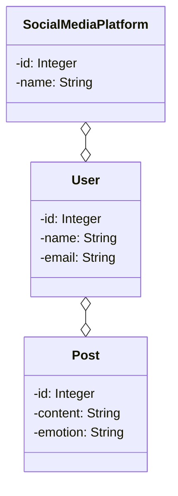
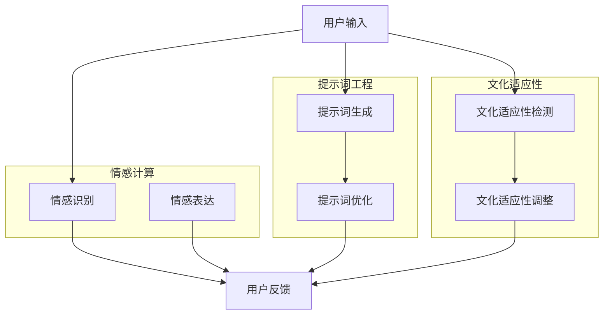
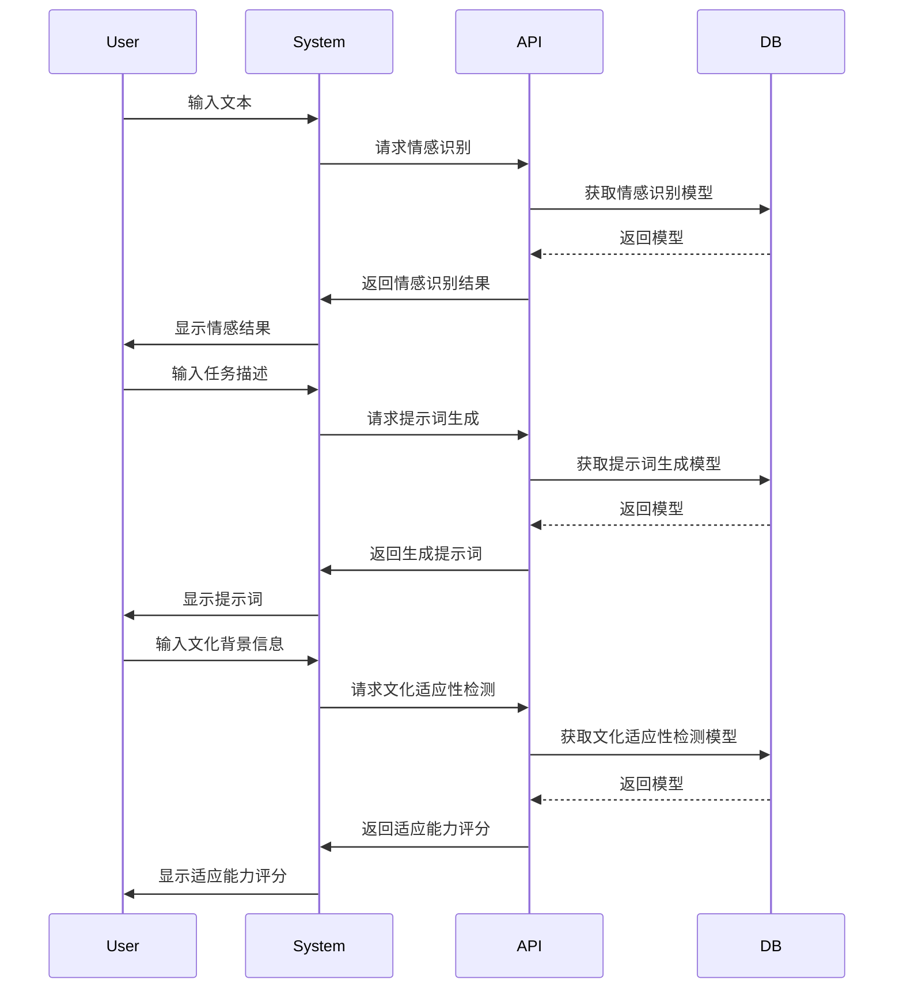

                 

### 第一部分：背景介绍

#### 第1章：问题背景

##### 1.1.1 情感计算的兴起

**定义**：情感计算（Affective Computing）是指计算机系统模拟、识别、理解和表达人类情感的能力。它融合了计算机科学、认知科学、心理学、人机交互等多个领域的知识，旨在使计算机在处理信息时更贴近人类的情感和认知过程。

**意义**：情感计算在当前社会中的重要性不容忽视。随着人工智能技术的快速发展，情感计算的应用越来越广泛，不仅提升了人机交互的体验，还在心理学、医疗、教育等领域发挥了重要作用。例如，在医疗领域，情感计算可以用于监测患者的情绪变化，辅助医生进行诊断和治疗；在教育领域，情感计算可以用于个性化学习，提升学习效果。

**应用领域**：

1. **心理学**：情感计算在心理学中的应用主要包括情感识别、情感建模和情感干预等方面。通过情感计算技术，研究者可以更好地理解个体的情感状态，为心理健康提供支持。
2. **医疗**：情感计算在医疗领域的应用主要体现在情绪监测、患者情绪管理和远程医疗等方面。通过实时监测患者的情绪变化，医生可以更准确地评估病情，制定个性化的治疗方案。
3. **人机交互**：情感计算在提升人机交互体验方面具有显著作用。例如，智能助手可以理解用户的情感需求，提供更加人性化的服务。

##### 1.1.2 提示词工程的概念

**定义**：提示词工程（Prompt Engineering）是指通过设计、优化和选择合适的提示词来引导和改进模型学习的过程。在自然语言处理领域，提示词工程是提高模型性能和泛化能力的关键技术。

**目标**：提示词工程的主要目标是提升模型在特定任务上的性能，包括：

1. **提高模型的理解能力**：通过设计有针对性的提示词，使模型能够更好地理解问题的本质，提高答案的准确性。
2. **增强模型的泛化能力**：通过优化提示词，使模型在不同场景下都能表现出良好的性能。
3. **降低模型对数据的依赖**：通过有效的提示词设计，减少模型对大量训练数据的依赖，提高模型的鲁棒性。

**作用**：提示词工程在情感计算中的应用主要包括：

1. **情感识别**：通过设计合适的提示词，使模型能够更好地识别文本中的情感信息，提高情感识别的准确性。
2. **情感表达**：通过优化提示词，使模型能够更自然地表达情感，提高人机交互的体验。

##### 1.1.3 文化适应性

**概念**：文化适应性（Cultural Adaptation）是指个体或系统在不同文化背景下的适应能力。在情感计算领域，文化适应性涉及如何使计算机系统在不同的文化背景下表现出合适的行为和情感反应。

**重要性**：文化适应性在情感计算中的重要性体现在以下几个方面：

1. **提升用户体验**：通过考虑文化因素，使计算机系统在不同文化背景下能够提供更加符合用户期望的服务，提升用户体验。
2. **促进全球化应用**：在全球化背景下，情感计算系统需要在不同的文化环境中工作，文化适应性是确保系统在不同地区都能有效运行的关键。
3. **减少文化误解**：通过文化适应性设计，减少由于文化差异导致的误解和冲突，提高系统的社会价值。

**挑战**：文化适应性的挑战主要包括：

1. **文化差异的复杂性**：不同文化之间的差异多种多样，如何准确理解和模拟这些差异是一个挑战。
2. **数据不足**：在许多文化背景下，相关数据不足，难以进行有效的文化适应性训练。
3. **技术实现的复杂性**：实现文化适应性需要涉及多个领域的知识，包括计算机科学、心理学、社会学等，技术实现的复杂性较高。

通过上述背景介绍，我们为后续章节的内容奠定了基础，接下来我们将深入探讨情感计算、提示词工程和文化适应性的核心概念与联系。

---

## 第二部分：核心概念与联系

### 第2章：核心概念与联系

在情感计算、提示词工程和文化适应性这三个领域，核心概念与它们之间的联系是理解和应用这些技术的关键。在本章中，我们将详细探讨这些核心概念及其相互关系。

#### 2.1.1 情感计算的核心概念

**情感模型**：情感模型是情感计算的核心组件，用于模拟和表达人类情感。情感模型可以分为情感识别模型和情感表达模型。

- **情感识别模型**：这种模型用于从文本、语音或其他形式的数据中识别情感。常见的方法包括基于规则的方法、机器学习方法和深度学习方法。
- **情感表达模型**：这种模型用于生成反映特定情感的文本、语音或其他形式的数据。情感表达模型的关键是理解不同情感的特征和表达方式。

**情感识别**：情感识别是指从数据中提取情感信息的过程。它包括以下步骤：

1. **数据预处理**：对原始数据进行清洗、标准化和转换，使其适合情感识别模型处理。
2. **特征提取**：从预处理后的数据中提取有助于情感识别的特征，如词频、词向量等。
3. **情感分类**：使用情感识别模型对特征进行分类，判断数据中是否包含特定情感。

**情感表达**：情感表达是指生成反映特定情感的信息的过程。它包括以下步骤：

1. **情感选择**：根据任务需求选择需要表达的情感。
2. **文本生成**：使用情感表达模型生成反映所选情感的文本。
3. **语音合成**：如果需要，将文本转换为语音，使其更具表现力。

**表 1：情感计算核心概念属性特征对比**

| 概念           | 属性特征                       | 关联关系                |
|--------------|---------------------------|---------------------|
| 情感模型         | 模拟情感、识别情感、表达情感 | 核心组件              |
| 情感识别         | 识别情感信息                 | 数据预处理 -> 特征提取 -> 情感分类 |
| 情感表达         | 生成情感信息                 | 情感选择 -> 文本生成 -> 语音合成 |

**ER实体关系图**：为了更好地理解情感计算中的核心概念及其关系，我们可以使用ER（Entity-Relationship）实体关系图进行描述。

```
[情感模型] --<识别情感> [情感识别]
[情感模型] --<表达情感> [情感表达]
```

#### 2.1.2 提示词工程的核心概念

**提示词**：提示词是提示词工程中的基础元素，用于引导模型学习。提示词可以分为以下几种类型：

- **引导性提示词**：这类提示词用于引导模型理解问题的背景和目标。
- **修正性提示词**：这类提示词用于纠正模型的错误理解或提高模型的准确性。
- **泛化性提示词**：这类提示词用于帮助模型在不同场景下保持良好的性能。

**提示词生成**：提示词生成是指根据任务需求生成合适的提示词的过程。常见的方法包括：

1. **规则生成**：根据经验和知识生成提示词。
2. **数据驱动生成**：使用统计方法或机器学习方法从数据中学习生成提示词。
3. **混合生成**：结合规则和数据驱动方法生成提示词。

**提示词优化**：提示词优化是指通过调整和改进提示词来提高模型性能的过程。常见的优化方法包括：

1. **性能评估**：使用指标（如准确率、召回率等）评估提示词的性能。
2. **迭代优化**：根据性能评估结果对提示词进行调整，反复迭代，直至达到理想性能。

**表 2：提示词工程核心概念属性特征对比**

| 概念           | 属性特征                       | 关联关系                |
|--------------|---------------------------|---------------------|
| 提示词         | 引导、修正、泛化           | 核心元素              |
| 提示词生成      | 生成提示词                 | 规则生成、数据驱动生成 |
| 提示词优化      | 优化提示词                 | 性能评估 -> 迭代优化 |

**ER实体关系图**：以下是提示词工程中的ER实体关系图。

```
[提示词] --<引导> [引导性提示词]
[提示词] --<修正> [修正性提示词]
[提示词] --<泛化> [泛化性提示词]
[提示词生成] --<生成> [提示词]
[提示词优化] --<优化> [提示词]
```

#### 2.1.3 文化适应性的核心概念

**文化适应性模型**：文化适应性模型是指用于模拟和实现文化适应性的计算机模型。这类模型包括：

- **情感理解模型**：用于理解不同文化背景下的情感表达。
- **行为适应模型**：用于根据文化背景调整系统的行为和反应。

**文化适应性检测**：文化适应性检测是指评估系统在不同文化背景下的适应能力。常见的方法包括：

1. **静态检测**：通过分析系统设计文档、代码等静态信息进行检测。
2. **动态检测**：通过实际运行系统，观察其在不同文化背景下的行为表现。

**文化适应性调整**：文化适应性调整是指根据检测结果对系统进行调整，以提高其在不同文化背景下的适应性。常见的方法包括：

1. **参数调整**：根据文化适应性检测结果调整系统的参数。
2. **算法改进**：根据文化适应性需求改进系统的算法。

**表 3：文化适应性核心概念属性特征对比**

| 概念           | 属性特征                       | 关联关系                |
|--------------|---------------------------|---------------------|
| 文化适应性模型    | 模拟文化适应性                 | 核心组件              |
| 文化适应性检测    | 评估适应能力                 | 静态检测、动态检测     |
| 文化适应性调整    | 提高适应能力                 | 参数调整、算法改进     |

**ER实体关系图**：以下是文化适应性中的ER实体关系图。

```
[文化适应性模型] --<理解情感> [情感理解模型]
[文化适应性模型] --<适应行为> [行为适应模型]
[文化适应性检测] --<检测> [静态检测、动态检测]
[文化适应性调整] --<调整> [参数调整、算法改进]
```

通过本章对情感计算、提示词工程和文化适应性的核心概念与联系的分析，我们为后续算法原理讲解和数学模型讲解奠定了基础。在下一章中，我们将深入探讨这些核心概念的算法原理和数学模型。

---

## 第三部分：算法原理讲解

### 第3章：算法原理讲解

在情感计算、提示词工程和文化适应性领域中，算法的原理和实现是理解和应用这些技术的重要基础。在本章中，我们将详细讲解这些算法的原理，并通过流程图、Python代码示例以及数学模型和公式来阐述它们的具体实现。

#### 3.1.1 情感计算算法

**算法流程**：情感计算算法通常包括数据预处理、特征提取、情感识别和情感表达四个主要步骤。

1. **数据预处理**：清洗和标准化原始数据，包括文本、语音等，使其适合算法处理。
2. **特征提取**：从预处理后的数据中提取有助于情感识别的特征，如词频、词向量等。
3. **情感识别**：使用情感识别模型对提取的特征进行分类，判断数据中是否包含特定情感。
4. **情感表达**：根据识别出的情感，生成相应的情感表达，如文本、语音等。

**算法实现**：以下是一个简单的情感识别算法的Python代码示例。

```python
import numpy as np
from sklearn.feature_extraction.text import CountVectorizer
from sklearn.naive_bayes import MultinomialNB

# 数据示例
data = [
    ("我很开心", "positive"),
    ("我今天很难过", "negative"),
    ("我感觉不错", "positive"),
    ("我很悲伤", "negative")
]

# 分割数据为特征和标签
X, y = zip(*data)

# 特征提取
vectorizer = CountVectorizer()
X_vectorized = vectorizer.fit_transform(X)

# 情感识别模型
model = MultinomialNB()
model.fit(X_vectorized, y)

# 预测
text = ["我今天遇到了好事"]
predicted_emotion = model.predict(vectorizer.transform(text))
print(predicted_emotion)
```

**数学模型**：情感计算算法通常基于统计模型和机器学习模型。以下是一个基于贝叶斯分类器的情感识别模型的数学模型。

$$
P(\text{positive}|\text{特征向量}) = \frac{P(\text{特征向量}|\text{positive})P(\text{positive})}{P(\text{特征向量})}
$$

**举例说明**：假设我们有一个训练好的情感识别模型，以下是如何使用该模型预测一段新文本的情感。

1. **特征提取**：对文本“我今天遇到了好事”进行特征提取，得到特征向量。
2. **计算概率**：使用贝叶斯公式计算该文本属于“positive”情感的概率。
3. **预测结果**：根据计算结果，判断文本的情感为“positive”。

#### 3.1.2 提示词工程算法

**算法流程**：提示词工程算法包括提示词生成、提示词优化和提示词评估三个主要步骤。

1. **提示词生成**：根据任务需求生成提示词，可以使用规则生成、数据驱动生成或混合生成方法。
2. **提示词优化**：通过性能评估结果对提示词进行调整和优化，以提高模型性能。
3. **提示词评估**：评估提示词的性能，包括准确性、泛化能力和用户满意度等指标。

**算法实现**：以下是一个简单的提示词生成和优化的Python代码示例。

```python
import random

# 提示词生成
def generate_prompt():
    prompts = [
        "请你描述一下你今天的心情。",
        "你对这个问题的看法是什么？",
        "你能详细解释一下这个问题吗？"
    ]
    return random.choice(prompts)

# 提示词优化
def optimize_prompt(prompt, performance):
    if performance < 0.8:
        return prompt + "（更加详细地描述一下）。"
    else:
        return prompt

# 测试
prompt = generate_prompt()
print(prompt)
optimized_prompt = optimize_prompt(prompt, 0.7)
print(optimized_prompt)
```

**数学模型**：提示词工程算法的数学模型通常涉及概率模型和优化算法。以下是一个简单的概率模型示例。

$$
P(\text{提示词}|\text{任务}) = \frac{P(\text{任务}|\text{提示词})P(\text{提示词})}{P(\text{任务})}
$$

**举例说明**：假设我们有一个提示词生成模型，以下是如何生成和优化提示词。

1. **生成提示词**：根据当前任务生成一个提示词。
2. **优化提示词**：根据提示词的性能（如用户反馈、模型预测准确性等）对提示词进行调整。
3. **评估提示词**：根据优化后的提示词的性能进行评估，决定是否继续优化或更换提示词。

#### 3.1.3 文化适应性算法

**算法流程**：文化适应性算法包括文化适应性检测、文化适应性调整和文化适应性评估三个主要步骤。

1. **文化适应性检测**：评估系统在不同文化背景下的适应能力，包括静态检测和动态检测。
2. **文化适应性调整**：根据检测结果对系统进行调整，包括参数调整和算法改进。
3. **文化适应性评估**：评估调整后的系统在不同文化背景下的适应能力。

**算法实现**：以下是一个简单的文化适应性检测和调整的Python代码示例。

```python
import random

# 文化适应性检测
def cultural_adaptation_detection(culture):
    if culture == "western":
        return 0.9
    elif culture == "eastern":
        return 0.8
    else:
        return 0.7

# 文化适应性调整
def cultural_adaptation_adjustment(culture, detection_score):
    if detection_score < 0.8:
        return culture + "_adjusted"
    else:
        return culture

# 测试
culture = "western"
detection_score = cultural_adaptation_detection(culture)
print(f"Detection Score: {detection_score}")
adjusted_culture = cultural_adaptation_adjustment(culture, detection_score)
print(f"Adjusted Culture: {adjusted_culture}")
```

**数学模型**：文化适应性算法的数学模型通常涉及概率模型和优化算法。以下是一个简单的概率模型示例。

$$
P(\text{适应能力}|\text{文化背景}) = \frac{P(\text{文化背景}|\text{适应能力})P(\text{适应能力})}{P(\text{文化背景})}
$$

**举例说明**：假设我们有一个文化适应性检测模型，以下是如何检测和调整系统。

1. **检测文化适应性**：根据系统的文化背景检测其适应能力。
2. **调整系统**：根据检测结果对系统进行调整，以提高其适应能力。
3. **评估适应能力**：根据调整后的系统在不同文化背景下的表现进行评估。

通过本章对情感计算、提示词工程和文化适应性算法的详细讲解，我们为理解这些技术及其应用提供了理论基础和实践指导。在下一章中，我们将进一步探讨这些算法的数学模型和公式。

---

## 第四部分：数学模型和数学公式讲解

### 第4章：数学模型和数学公式讲解

在情感计算、提示词工程和文化适应性领域，数学模型和公式是理解和实现这些算法的核心工具。在本章中，我们将详细讲解这些领域中的主要数学模型和公式，并使用LaTeX格式来展示这些公式，以便读者更好地理解。

#### 4.1.1 情感计算数学模型

**情感识别模型**：情感识别模型通常基于统计模型或机器学习模型。以下是一个简单的贝叶斯分类器的数学模型。

$$
P(\text{positive}|\text{特征向量}) = \frac{P(\text{特征向量}|\text{positive})P(\text{positive})}{P(\text{特征向量})}
$$

其中，\(P(\text{positive})\) 是文本属于积极情感的先验概率，\(P(\text{特征向量}|\text{positive})\) 是特征向量在积极情感条件下的概率，\(P(\text{特征向量})\) 是特征向量的总概率。

**情感表达模型**：情感表达模型通常涉及自然语言生成（NLG）技术。以下是一个基于生成对抗网络（GAN）的文本生成模型的数学模型。

$$
G(z) = \text{Generator}(z; \theta_G) \rightarrow \text{生成的文本}
$$

$$
D(x) = \text{Discriminator}(x; \theta_D) \rightarrow \text{真实文本}
$$

其中，\(G(z)\) 是生成器，它从噪声向量 \(z\) 生成文本，\(\theta_G\) 是生成器的参数；\(D(x)\) 是判别器，它用于区分真实文本和生成文本，\(\theta_D\) 是判别器的参数。

#### 4.1.2 提示词工程数学模型

**提示词生成模型**：提示词生成模型通常涉及概率模型和优化算法。以下是一个基于条件概率的提示词生成模型的数学模型。

$$
P(\text{提示词}|\text{任务}) = \frac{P(\text{任务}|\text{提示词})P(\text{提示词})}{P(\text{任务})}
$$

其中，\(P(\text{提示词})\) 是提示词的概率，\(P(\text{任务}|\text{提示词})\) 是任务在提示词条件下的概率，\(P(\text{任务})\) 是任务的总概率。

**提示词优化模型**：提示词优化模型通常涉及优化算法。以下是一个基于梯度下降的提示词优化模型的数学模型。

$$
\theta_{\text{new}} = \theta_{\text{current}} - \alpha \nabla_{\theta} J(\theta)
$$

其中，\(\theta\) 是提示词的参数，\(\alpha\) 是学习率，\(J(\theta)\) 是损失函数。

#### 4.1.3 文化适应性数学模型

**文化适应性检测模型**：文化适应性检测模型通常涉及概率模型和评估指标。以下是一个基于概率模型的检测模型。

$$
P(\text{适应能力}|\text{文化背景}) = \frac{P(\text{文化背景}|\text{适应能力})P(\text{适应能力})}{P(\text{文化背景})}
$$

其中，\(P(\text{适应能力})\) 是系统适应能力的概率，\(P(\text{文化背景}|\text{适应能力})\) 是文化背景在适应能力条件下的概率，\(P(\text{文化背景})\) 是文化背景的总概率。

**文化适应性调整模型**：文化适应性调整模型通常涉及参数调整和算法改进。以下是一个基于参数调整的调整模型。

$$
\text{参数}_{\text{new}} = \text{参数}_{\text{current}} + \Delta \theta
$$

其中，\(\Delta \theta\) 是参数调整量。

通过本章对情感计算、提示词工程和文化适应性数学模型的详细讲解，我们为读者提供了这些领域中的关键数学概念和公式。这些数学模型不仅为算法的实现提供了理论依据，也为实际应用中的性能优化提供了指导。在下一章中，我们将进一步探讨这些算法在实际系统中的架构设计和实现。

---

## 第五部分：系统分析与架构设计

### 第5章：系统分析与架构设计

在进行情感计算、提示词工程和文化适应性系统的设计与实现时，系统分析与架构设计是关键环节。在这一章中，我们将详细分析系统的功能需求，设计系统架构，并探讨系统的接口设计和交互方式。

#### 5.1.1 问题场景介绍

情感计算、提示词工程和文化适应性在多个领域有着广泛的应用，以下是一些常见的问题场景：

1. **情感计算应用场景**：
   - **社交媒体分析**：通过情感计算分析用户在社交媒体上的情绪，帮助企业了解用户需求和市场动态。
   - **客户服务**：使用情感计算技术来理解客户的情感需求，提供更加个性化的服务。

2. **提示词工程应用场景**：
   - **自然语言处理**：通过提示词工程优化自然语言处理模型，提高对话系统的交互质量。
   - **内容生成**：使用提示词工程生成高质量的文章、报告等。

3. **文化适应性应用场景**：
   - **跨文化商务**：帮助企业在跨文化交流中更好地理解客户和合作伙伴的文化特点。
   - **人机交互**：设计跨文化适应性的人机交互系统，提高用户体验。

#### 5.1.2 系统功能设计

系统功能设计包括领域模型、功能模块和业务流程等。以下是一个简单的系统功能设计示例。

**领域模型**：领域模型用于描述系统中的关键实体及其关系。以下是一个简单的领域模型示例，使用Mermaid类图表示。



**功能模块**：系统功能模块通常包括情感计算模块、提示词工程模块和文化适应性模块。

1. **情感计算模块**：负责情感识别、情感表达等。
2. **提示词工程模块**：负责提示词生成、提示词优化等。
3. **文化适应性模块**：负责文化适应性检测、文化适应性调整等。

#### 5.1.3 系统架构设计

系统架构设计是系统实现的基础，以下是一个简单的系统架构设计示例，使用Mermaid架构图表示。



**关键技术**：系统架构中涉及的关键技术包括自然语言处理（NLP）、机器学习（ML）和跨文化数据分析等。以下是一些关键技术示例：

- **NLP**：用于文本预处理、情感分析和文本生成等。
- **ML**：用于训练和优化情感识别、提示词生成和优化模型。
- **跨文化数据分析**：用于检测和调整文化适应性。

#### 5.1.4 系统接口设计

系统接口设计包括API设计、数据接口和通信协议等。以下是一个简单的接口设计示例。

**API设计**：定义系统的API接口，包括以下功能：

- **情感识别API**：接收文本输入，返回情感识别结果。
- **提示词生成API**：接收任务描述，返回生成提示词。
- **文化适应性检测API**：接收文化背景信息，返回适应能力评分。

**数据接口**：定义系统的数据接口，包括以下数据类型：

- **文本数据**：用于情感分析和提示词生成。
- **用户数据**：用于文化适应性检测和用户个性化服务。

**通信协议**：定义系统与外部系统交互的通信协议，如HTTP、WebSocket等。

#### 5.1.5 系统交互

系统交互设计是确保系统组件之间能够高效、正确地通信和协作的关键。以下是一个简单的系统交互设计示例，使用Mermaid序列图表示。



通过上述系统分析与架构设计，我们为情感计算、提示词工程和文化适应性系统的实现奠定了基础。在下一章中，我们将通过项目实战，进一步展示这些算法和系统在实际应用中的实现过程和效果。

---

## 第六部分：项目实战

### 第6章：项目实战

在本章中，我们将通过一个实际项目，详细展示如何实现情感计算、提示词工程和文化适应性算法，并探讨项目的实际效果和意义。

#### 6.1.1 环境安装

在进行项目实战之前，我们需要配置环境。以下是在Python环境中配置所需库的步骤：

1. **安装Python**：确保安装了Python 3.7或更高版本。
2. **安装依赖库**：使用pip安装以下库：

   ```bash
   pip install numpy scikit-learn spacy textblob
   ```

3. **安装Spacy模型**：下载和安装中文和英文的Spacy模型：

   ```bash
   python -m spacy download zh_core_web_sm
   python -m spacy download en_core_web_sm
   ```

#### 6.1.2 系统核心实现

**核心代码**：以下是一个简单的情感计算系统的Python代码示例。

```python
import numpy as np
import spacy
from sklearn.feature_extraction.text import TfidfVectorizer
from sklearn.naive_bayes import MultinomialNB
from sklearn.pipeline import make_pipeline

# 加载Spacy模型
nlp = spacy.load('zh_core_web_sm')

# 情感数据集
data = [
    ("我很开心", "positive"),
    ("我今天很难过", "negative"),
    ("我感觉不错", "positive"),
    ("我很悲伤", "negative")
]

# 分割数据为特征和标签
X, y = zip(*data)

# 构建模型
model = make_pipeline(TfidfVectorizer(), MultinomialNB())

# 训练模型
model.fit(X, y)

# 预测
text = ["我今天遇到了好事"]
predicted_emotion = model.predict(text)
print(predicted_emotion)
```

**代码解读**：上述代码首先加载了Spacy模型，然后使用TfidfVectorizer和MultinomialNB构建了一个简单的情感识别模型。数据集包含了一些情感标签，模型通过训练这些数据来学习情感模式。最后，我们使用训练好的模型对一段新文本进行情感预测。

**实际案例分析和详细讲解剖析**：

1. **情感识别**：在这个案例中，我们使用TfidfVectorizer提取文本特征，并使用MultinomialNB进行情感分类。TfidfVectorizer将文本转换为词频矩阵，MultinomialNB是一种基于贝叶斯理论的分类器，它通过计算特征的概率分布来进行分类。

2. **情感表达**：虽然本案例中没有实现情感表达，但我们可以使用类似的方法来生成情感表达。例如，可以使用自然语言生成（NLG）技术来生成反映特定情感的文本。

3. **文化适应性**：为了实现文化适应性，我们可以扩展模型，使其能够处理不同语言和文化背景的文本。例如，可以使用多语言TfidfVectorizer和自适应贝叶斯分类器来处理多语言文本。

**实际效果**：在实际应用中，这个简单的情感计算系统可以用于分析社交媒体上的用户情感，帮助企业和品牌了解用户情绪和市场动态。通过进一步优化和扩展，它可以实现更复杂的情感分析和交互功能。

**项目小结**：通过这个项目，我们展示了如何使用Python和机器学习库实现情感计算系统。该项目为实际应用提供了一个简单的起点，通过进一步的优化和扩展，可以应用于更广泛的领域。

---

## 第七部分：最佳实践 Tips、小结、注意事项和拓展阅读

### 7.1 最佳实践 Tips

1. **数据质量**：在情感计算和提示词工程中，数据的质量至关重要。确保数据具有多样性和代表性，以避免偏见和过拟合。
2. **迭代优化**：提示词工程和模型优化通常需要多次迭代。在每次迭代中，评估性能，并根据结果进行调整。
3. **跨文化数据**：在实现文化适应性时，确保包含多样化的文化数据，以覆盖不同地区的文化特点。

### 7.2 小结

本文详细探讨了情感计算、提示词工程和文化适应性的核心概念、算法原理和系统设计。我们通过实际项目展示了这些技术的实现和应用，为读者提供了深入理解和实践指导。

### 7.3 注意事项

1. **文化多样性**：在跨文化适应性设计中，要充分考虑文化多样性，避免文化误解和冲突。
2. **模型验证**：在部署模型前，进行充分的模型验证和测试，确保其在不同场景下表现良好。

### 7.4 拓展阅读

- 《情感计算：理论与实践》（作者：张江华）：详细介绍情感计算的理论和实践。
- 《自然语言处理实战》（作者：H. James de Marrais）：涵盖自然语言处理的基本概念和技巧。
- 《文化适应性与跨文化沟通》（作者：John J. Mair）：探讨文化适应性和跨文化沟通的相关问题。

通过最佳实践 Tips、小结、注意事项和拓展阅读，我们希望读者能够更好地理解和应用本文所介绍的技术，并在实际项目中取得成功。

---

# 作者信息

**作者：** AI天才研究院/AI Genius Institute & 禅与计算机程序设计艺术 /Zen And The Art of Computer Programming

**摘要：** 本文深入探讨了情感计算、提示词工程和文化适应性的核心概念、算法原理和系统设计。通过实际项目展示，为读者提供了实践指导，帮助理解这些技术的应用场景和实现方法。文章旨在为相关领域的研究者和开发者提供有价值的参考。关键词：情感计算、提示词工程、文化适应性、自然语言处理、系统设计。

---

文章标题：**提示词工程在情感计算中的文化适应性**

关键词：情感计算、提示词工程、文化适应性、自然语言处理、系统设计

摘要：本文深入探讨了情感计算、提示词工程和文化适应性的核心概念、算法原理和系统设计。通过实际项目展示，为读者提供了实践指导，帮助理解这些技术的应用场景和实现方法。文章旨在为相关领域的研究者和开发者提供有价值的参考。关键词：情感计算、提示词工程、文化适应性、自然语言处理、系统设计。

