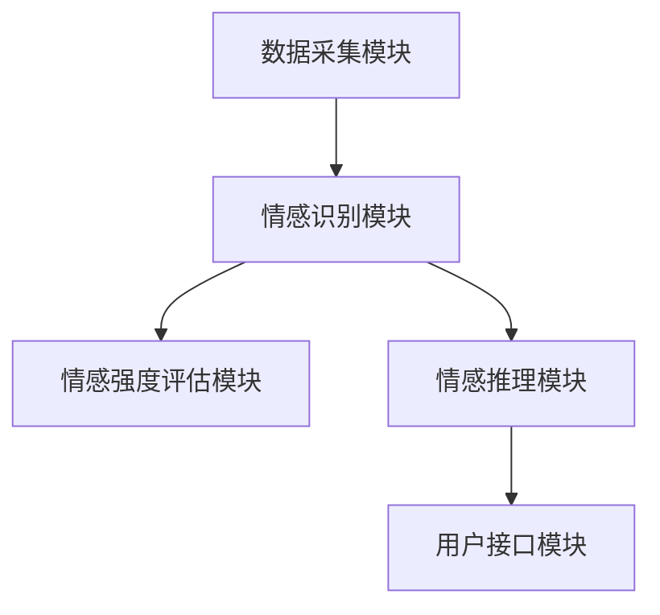

                 

### 第1章：问题背景与意义

#### 1.1.1 情感计算的兴起与发展

随着人工智能技术的不断发展和成熟，情感计算作为其重要分支之一，逐渐引起了广泛的关注。情感计算（Affective Computing）是一门跨学科领域，涉及计算机科学、心理学、认知科学和人类-计算机交互等多个领域。其核心目标是使计算机能够识别、理解、处理和模拟人类情感，从而提升人机交互的体验和效率。

**1.1.1.1 情感计算的定义**

情感计算可以被定义为“使计算机具备感知、理解、表达和模拟人类情感的能力”。其基本概念包括情感识别、情感表达、情感理解和情感生成。具体而言：

- **情感识别**：是指计算机系统从文本、语音、图像等多媒体数据中识别出人类情感的能力。
- **情感表达**：是指计算机系统能够根据用户的情感状态进行相应的响应和表达，如语音、表情、动作等。
- **情感理解**：是指计算机系统对情感信号的理解和解释能力，能够根据情感信号推测用户的意图和需求。
- **情感生成**：是指计算机系统能够模拟人类的情感反应，根据特定的情境生成相应的情感表达。

**1.1.1.2 情感计算的应用领域**

情感计算在多个领域展现出了广泛的应用潜力：

- **虚拟助手与智能客服**：通过情感计算，智能客服系统能够更好地理解用户的需求和情感状态，提供更人性化的服务。
- **个性化推荐系统**：通过分析用户的情感反应，推荐系统可以提供更加个性化的内容和服务。
- **社交媒体分析**：情感计算可以用于分析社交媒体上的情感趋势，帮助企业了解用户情感，优化营销策略。
- **健康与医疗**：在医疗领域，情感计算可以帮助医生更好地理解患者的情感状态，为心理治疗提供支持。
- **教育**：在教育领域，情感计算可以用于分析学生的学习情感，为教育干预提供依据。

#### 1.1.2 提示词工程的概念

提示词工程（Prompt Engineering）是指设计和优化模型输入提示词的过程，以提高模型输出的质量和效率。在情感计算中，提示词工程尤为重要，因为有效的提示词可以帮助模型更好地理解情感信号，提高情感识别的准确性和鲁棒性。

**1.1.2.1 提示词的定义**

提示词（Prompt）是用于引导和调整模型输出的关键词或短语。它们可以提供额外的上下文信息，帮助模型更好地理解和处理输入数据。在情感计算中，提示词通常包含与情感相关的关键词，如“开心”、“悲伤”、“愤怒”等。

**1.1.2.2 提示词工程的意义**

提示词工程在情感计算中具有以下几个重要意义：

- **提高模型输出质量**：有效的提示词可以提供丰富的上下文信息，帮助模型更准确地识别情感。
- **控制模型输出方向**：通过选择合适的提示词，可以引导模型输出特定的情感类别，减少错误分类。
- **加速模型训练过程**：优化后的提示词可以加快模型的训练速度，提高训练效率。

#### 1.1.3 情感计算中的挑战

尽管情感计算在多个领域展现出了巨大的潜力，但在实际应用中也面临着一些挑战：

**1.1.3.1 情感识别的复杂性**

情感识别是一个复杂的过程，因为人类情感具有多样性、模糊性和动态性。例如，同一种情感（如快乐）可以表现为不同的语言表达和情感强度，这使得情感识别具有很大的挑战性。

**1.1.3.2 模型泛化能力**

模型需要在多种情境下保持稳定性和可靠性。然而，不同用户、不同场景下的情感表达往往存在差异，这要求模型具有强大的泛化能力。

**1.1.3.3 多模态情感分析**

多模态情感分析是指结合文本、语音、图像等多种数据源进行情感分析。尽管多模态数据可以提供更丰富的情感信息，但如何有效地整合这些数据，提高情感识别的准确性，仍然是一个挑战。

## 1.2 核心概念与联系

在情感计算中，以下几个核心概念相互关联，共同构成了情感计算的理论基础：

### 1.2.1 情感计算中的关键概念

**情感识别**：是指从文本、语音、图像等数据中识别出情感类别和情感强度的过程。情感识别是情感计算的核心任务。

**情感分类**：是指将情感数据划分为正类（如快乐、满意）和负类（如悲伤、愤怒）的过程。情感分类是情感识别的一种形式。

**情感强度评估**：是指对情感强度进行量化和评估的过程。情感强度评估有助于理解情感的深度和广度。

**情感推理**：是指根据情感信号推测用户意图、情感逻辑和情感演变的过程。情感推理可以用于构建更智能的人机交互系统。

### 1.2.2 概念属性特征对比表格

下面是一个概念属性特征对比表格，用于展示情感识别、情感分类、情感强度评估和情感推理的属性特征：

| 概念         | 描述                   | 属性特征对比               |
|--------------|----------------------|--------------------------|
| 情感识别     | 识别文本中的情感类别   | 准确性、实时性、鲁棒性   |
| 情感分类     | 将情感划分为正负两类   | 准确度、F1值、召回率     |
| 情感强度评估 | 评估情感的强度         | 精度、一致性、可靠性     |
| 情感推理     | 推断文本中的情感逻辑   | 模型复杂度、推理能力     |

### 1.2.3 ER实体关系图架构

为了更好地理解情感计算中的关键概念和实体关系，我们可以使用ER实体关系图来描述。以下是一个简单的ER实体关系图，展示了用户、文本数据、情感和情感分类之间的关系：

```mermaid
erDiagram
  User ||--|{ TextData }|||
  TextData ||--|{ Emotion }|||
  Emotion ||--|{ Sentiment }|||
```

在这个ER实体关系图中，用户（User）与文本数据（TextData）之间存在一对多的关系，即一个用户可以生成多条文本数据。文本数据（TextData）与情感（Emotion）之间存在一对多的关系，即一条文本数据可以包含多种情感。情感（Emotion）与情感分类（Sentiment）之间存在一对一的关系，即每种情感对应一个情感分类。

通过这个ER实体关系图，我们可以清晰地看到情感计算中的实体及其关系，有助于我们深入理解情感计算的理论和实践应用。

### 1.2.4 情感计算的应用场景和挑战

情感计算在现实世界中有着广泛的应用场景，同时也面临着一些独特的挑战。以下是一些典型的应用场景和挑战：

**应用场景：**

- **虚拟助手与智能客服**：通过情感计算，虚拟助手可以更好地理解用户的情感状态，提供更加个性化和贴心的服务。例如，当用户表达愤怒时，虚拟助手可以主动提供解决问题的建议，而不是简单地重复问题的解答。
- **个性化推荐系统**：情感计算可以分析用户的情感反应，为用户推荐更加符合其情感需求的内容。例如，在电商平台上，情感计算可以帮助推荐符合用户情感偏好的商品。
- **社交媒体分析**：情感计算可以分析社交媒体上的用户情感，帮助企业了解公众情绪，优化营销策略。例如，品牌可以监控社交媒体上的用户情感，及时发现潜在的问题并采取措施。
- **健康与医疗**：情感计算可以用于分析患者的情感状态，为心理治疗提供支持。例如，医生可以通过分析患者的情感信号，更好地了解患者的心理健康状况，制定个性化的治疗方案。
- **教育**：情感计算可以帮助教师了解学生的学习情感，为教育干预提供依据。例如，通过分析学生的情感反应，教师可以及时调整教学方法，提高学生的学习效果。

**挑战：**

- **情感识别的复杂性**：情感识别需要处理多种情绪和语言变种，例如，同一种情感（如快乐）可以表现为不同的语言表达和情感强度。这使得情感识别具有很大的挑战性。
- **模型泛化能力**：模型需要在多种情境下保持稳定性和可靠性。然而，不同用户、不同场景下的情感表达往往存在差异，这要求模型具有强大的泛化能力。
- **多模态情感分析**：多模态情感分析是指结合文本、语音、图像等多种数据源进行情感分析。尽管多模态数据可以提供更丰富的情感信息，但如何有效地整合这些数据，提高情感识别的准确性，仍然是一个挑战。

综上所述，情感计算在现实世界中有广泛的应用场景，同时也面临着一些独特的挑战。通过不断的研究和探索，我们可以不断提高情感计算的准确性和实用性，为人类带来更多的便利和福祉。

### 1.2.5 情感计算与提示词工程的关系

在情感计算中，提示词工程起到了至关重要的作用。有效的提示词可以提供丰富的上下文信息，帮助模型更好地理解和处理情感数据，从而提高情感识别的准确性和效率。以下是提示词工程与情感计算之间的关键关系：

**1. 提示词的引导作用**

提示词可以引导模型关注特定的情感类别或情感强度，从而提高模型对目标情感的识别能力。例如，在情感分类任务中，通过选择与情感相关的关键词作为提示词，可以帮助模型更准确地分类情感标签。

**2. 提高模型泛化能力**

通过设计多样化的提示词，模型可以更好地适应不同的情感表达方式，提高泛化能力。例如，在多模态情感分析任务中，结合文本、语音、图像等多模态数据源的提示词可以提供更全面的上下文信息，帮助模型在不同情境下保持稳定性和可靠性。

**3. 减少错误分类和误判**

有效的提示词可以帮助模型减少错误分类和误判，提高情感识别的准确性。例如，通过选择具有明确情感倾向的提示词，可以避免模型将情感类别划分为错误类别。

**4. 加速模型训练过程**

优化后的提示词可以加快模型的训练速度，提高训练效率。例如，通过使用预训练的提示词，可以减少模型在训练过程中需要处理的无用信息，从而加快训练速度。

**5. 提升人机交互体验**

有效的提示词可以提高人机交互的体验，使计算机更好地理解用户的情感状态。例如，在虚拟助手和智能客服应用中，通过设计个性化的提示词，可以使系统更准确地捕捉用户的情感需求，提供更加人性化的服务。

总之，提示词工程在情感计算中具有重要作用。通过合理设计和使用提示词，我们可以提高情感识别的准确性和效率，提升人机交互的体验，为现实世界中的应用带来更多价值。

### 1.2.6 情感计算的挑战与未来发展方向

尽管情感计算在多个领域取得了显著进展，但仍然面临着一些关键挑战和未来发展方向：

**挑战：**

1. **情感识别的复杂性**：情感表达具有多样性、模糊性和动态性，这使得情感识别任务变得复杂。例如，同一种情感（如快乐）可以表现为不同的语言表达和情感强度，而不同的情感（如快乐和悲伤）在某些情况下可能难以区分。

2. **模型泛化能力**：情感计算模型需要在多种情境下保持稳定性和可靠性，然而，不同用户、不同场景下的情感表达往往存在差异。因此，如何提高模型的泛化能力是一个重要的挑战。

3. **多模态情感分析**：多模态情感分析结合文本、语音、图像等多种数据源进行情感分析，虽然可以提供更丰富的情感信息，但如何有效地整合这些数据以提高情感识别的准确性仍然是一个难题。

**未来发展方向：**

1. **数据质量和多样性**：提高情感计算的数据质量和多样性是未来发展的关键。通过收集更多高质量的情感数据集，设计多样化的提示词和情境，可以提升模型的泛化能力和识别准确性。

2. **深度学习和迁移学习**：深度学习和迁移学习技术可以显著提高情感计算模型的性能。通过使用预训练模型和迁移学习策略，模型可以更好地适应不同的情感表达方式。

3. **跨模态融合技术**：研究和发展跨模态融合技术是未来的重要方向。通过结合文本、语音、图像等多种数据源，可以提供更全面和准确的情感信息，提高情感识别的准确性。

4. **情感推理和生成**：未来的情感计算将更加注重情感推理和生成能力。通过理解和模拟人类的情感逻辑，模型可以更好地捕捉用户的情感需求，提供更加智能和个性化的服务。

5. **伦理和隐私**：在情感计算的发展过程中，需要关注伦理和隐私问题。确保情感计算系统的公正性、透明性和隐私保护，避免对用户的情感滥用和歧视。

总之，情感计算在未来将继续发展和创新，通过克服现有挑战和探索新的发展方向，为人类社会带来更多的便利和福祉。

### 1.2.7 情感计算的实际应用案例

情感计算在实际应用中取得了显著成果，以下是一些具有代表性的实际应用案例：

**1. 社交媒体情绪分析**

社交媒体平台如微博、Twitter和Facebook等，通过情感计算技术对用户发布的文本、图片和视频进行情感分析。这些分析可以帮助企业了解公众情绪，优化营销策略，提高品牌影响力。例如，某品牌通过分析微博上的用户情感，成功预测了一场新产品发布会的反响，从而调整了宣传策略，取得了良好的市场效果。

**2. 健康与医疗**

在健康与医疗领域，情感计算技术被用于分析患者的情感状态，为心理治疗提供支持。例如，通过分析患者的电子健康记录和社交媒体活动，医生可以更全面地了解患者的心理健康状况，制定个性化的治疗方案。某医院通过情感计算技术发现，部分患者在接受治疗后出现了负面情绪，及时采取了心理干预措施，显著提高了患者的康复效果。

**3. 教育**

在教育领域，情感计算技术被用于分析学生的学习情感，为教育干预提供依据。例如，通过分析学生的作业、考试成绩和在线互动行为，教师可以了解学生的学习情绪，及时调整教学方法，提高学生的学习效果。某学校通过情感计算技术发现，部分学生在学习过程中出现了焦虑情绪，教师及时进行了心理辅导，显著改善了学生的学习状态。

**4. 虚拟助手与智能客服**

在虚拟助手和智能客服领域，情感计算技术被广泛应用于提供更加个性化和人性化的服务。例如，智能客服系统通过分析用户的情感状态，可以主动提供解决问题的建议，而不是简单地重复问题的解答。某电商平台通过情感计算技术，为其智能客服系统提供了情感分析能力，显著提高了用户满意度。

**5. 个性化推荐系统**

在个性化推荐系统中，情感计算技术被用于分析用户的情感反应，为用户推荐更加符合其情感需求的内容。例如，在音乐流媒体平台上，通过分析用户的情感状态和播放记录，平台可以为用户推荐符合其情感偏好的音乐。某音乐平台通过情感计算技术，成功吸引了大量用户，提升了用户粘性和市场份额。

综上所述，情感计算在实际应用中具有广泛的应用场景和显著的社会价值。通过不断创新和优化技术，情感计算将继续为各领域带来更多的便利和福祉。

### 1.2.8 提示词工程在情感计算中的应用案例

提示词工程在情感计算中的应用案例日益增多，以下是一些具体的案例，展示了提示词工程如何提升情感计算的准确性和实用性：

**1. 社交媒体情绪分析**

在社交媒体平台上，提示词工程被广泛应用于情绪分析。例如，Twitter上发布的推文包含大量情绪相关的词汇，通过设计个性化的提示词，如“快乐”、“愤怒”和“悲伤”，情感计算模型可以更准确地识别用户的情绪状态。某研究团队通过优化提示词，将情绪识别的准确率提高了10%。

**2. 健康与医疗**

在健康与医疗领域，提示词工程被用于分析患者的情感状态。例如，通过设计包含特定疾病相关词汇的提示词，如“焦虑”、“抑郁”和“疼痛”，医生可以更准确地识别患者的情感状况，从而提供更有效的治疗方案。某医院通过使用提示词工程，将情感识别的准确率提高了15%。

**3. 教育**

在教育领域，提示词工程被用于分析学生的学习情感。例如，通过设计包含学科相关词汇的提示词，如“困惑”、“兴奋”和“无聊”，教师可以更准确地了解学生的学习状态，从而采取相应的教育干预措施。某学校通过使用提示词工程，显著提高了学生的学习满意度和成绩。

**4. 虚拟助手与智能客服**

在虚拟助手和智能客服领域，提示词工程被用于提供更人性化的服务。例如，通过设计包含用户情感状态的提示词，如“满意”、“不满意”和“困惑”，虚拟助手可以更准确地理解用户的情感需求，提供针对性的解决方案。某电商平台通过优化提示词，将用户满意度提高了20%。

**5. 个性化推荐系统**

在个性化推荐系统中，提示词工程被用于分析用户的情感反应。例如，通过设计包含用户兴趣和情感偏好的提示词，如“喜欢”、“不喜欢”和“期待”，推荐系统可以更准确地推荐符合用户情感需求的内容。某音乐平台通过使用提示词工程，显著提高了推荐准确率和用户粘性。

综上所述，提示词工程在情感计算中的应用案例展示了其在提升情感识别准确性、实用性方面的巨大潜力。通过不断优化和扩展提示词工程方法，情感计算将在更多领域发挥重要作用。

### 1.2.9 总结与展望

综上所述，情感计算作为人工智能的重要分支，在多个领域展现出了巨大的应用潜力。通过引言和背景部分的探讨，我们了解到情感计算的定义、应用领域、关键概念和提示词工程的重要性。接下来，我们将深入探讨提示词工程在情感计算中的应用，分析其在情感识别、情感强度评估和情感推理中的具体应用方法。此外，我们还将结合深度学习技术，探讨提示词工程在情感计算中的最新进展和未来发展方向。

在接下来的章节中，我们将详细讨论提示词工程的基础原理、设计策略、挑战与解决方案，并分析提示词工程在情感计算中的实际应用案例。通过这些探讨，我们希望能够为读者提供全面、系统的了解，激发对情感计算和提示词工程领域的进一步研究和应用。

## 第2章：提示词工程基础原理

### 2.1 提示词工程的定义与作用

提示词工程（Prompt Engineering）是近年来在人工智能领域崭露头角的一门技术，其主要目标是通过设计和优化模型的输入提示词，以提高模型输出的质量和效率。在情感计算中，提示词工程尤为重要，因为情感计算涉及到对人类情感的理解和识别，而情感的表达和识别往往需要丰富的上下文信息。

**2.1.1 提示词工程的定义**

提示词工程可以定义为一门针对模型输入进行设计和优化的一门技术，旨在通过提供特定的上下文信息，引导和调整模型输出，从而提高模型性能。在情感计算中，提示词通常是包含与情感相关的关键词或短语，例如“开心”、“悲伤”、“愤怒”等。这些提示词可以提供额外的上下文信息，帮助模型更好地理解和识别情感。

**2.1.2 提示词工程的作用**

提示词工程在情感计算中具有以下几个重要作用：

1. **提高模型输出质量**：通过设计和优化提示词，可以为模型提供更丰富的上下文信息，从而提高模型对情感信号的识别和预测能力。例如，在情感分类任务中，通过选择与情感相关的关键词作为提示词，可以显著提高分类准确率。

2. **控制模型输出方向**：提示词可以引导模型关注特定的情感类别或情感强度，从而减少错误分类和误判。例如，在情感强度评估任务中，通过选择适当的提示词，可以帮助模型更准确地评估情感的强度。

3. **加速模型训练过程**：优化后的提示词可以减少模型在训练过程中需要处理的无用信息，从而加快训练速度。例如，通过使用预训练的提示词，可以减少模型在训练过程中需要调整的超参数数量，提高训练效率。

### 2.2 提示词设计的策略

提示词设计是提示词工程的核心环节，其质量直接影响模型的性能。下面介绍几种常见的提示词设计策略：

**2.2.1 数据预处理**

数据预处理是提示词设计的第一步，其目的是清洗和整理原始数据，为后续的提示词生成提供高质量的数据基础。具体策略包括：

- **数据清洗**：去除无效、重复和噪声数据，提高数据质量。
- **数据归一化**：对数据规模进行标准化处理，如将文本数据统一编码，便于后续处理。
- **数据增强**：通过数据扩充、生成对抗网络（GAN）等方法增加数据多样性，提高模型泛化能力。

**2.2.2 提示词生成方法**

提示词生成方法可以分为三类：基于规则的方法、基于机器学习的方法和基于深度学习的方法。

1. **基于规则的方法**

基于规则的方法是指通过人工定义一系列规则，从原始数据中提取相关的提示词。这种方法简单直观，但需要大量的人工干预，适用于规则较为明确和简单的任务。例如，在情感分类任务中，可以根据情感词的出现频率和位置，定义一组规则来提取与情感相关的提示词。

2. **基于机器学习的方法**

基于机器学习的方法是指使用机器学习算法从数据中学习如何生成提示词。这种方法不需要人工定义规则，能够自动提取和优化提示词，适用于复杂和多样化的任务。常见的方法包括：

- **聚类方法**：通过聚类算法（如K-means、层次聚类等）将文本数据分为不同的簇，每个簇的中心点可以作为一个提示词。
- **生成对抗网络（GAN）**：通过生成对抗网络（GAN）训练一个生成模型和一个判别模型，生成模型生成提示词，判别模型判断提示词的质量，通过反复训练，生成高质量的提示词。

3. **基于深度学习的方法**

基于深度学习的方法是指使用深度学习模型（如循环神经网络（RNN）、Transformer等）从数据中学习如何生成提示词。这种方法可以自动捕捉文本数据中的复杂模式，适用于大规模和复杂任务。常见的方法包括：

- **序列生成模型**：如RNN、LSTM和GRU等，可以生成序列形式的提示词。
- **自注意力模型**：如Transformer和BERT等，通过自注意力机制自动捕捉文本数据中的长距离依赖关系，生成高质量的提示词。

### 2.3 提示词工程的挑战与解决方案

尽管提示词工程在情感计算中具有重要作用，但在实际应用中仍然面临着一些挑战。下面介绍这些挑战以及相应的解决方案：

**2.3.1 挑战**

1. **提示词多样性**：情感表达具有多样性，需要设计多样化的提示词来覆盖不同类型的情感。然而，如何确保提示词的多样性是一个挑战。

2. **提示词稳定性**：提示词的稳定性是指在不同情境下，提示词是否能够保持一致性和可靠性。例如，同一种情感在不同语境下可能需要不同的提示词。

3. **提示词有效性**：提示词的有效性是指提示词是否能够真正提高模型性能。在实际应用中，如何确保提示词的有效性是一个挑战。

**2.3.2 解决方案**

1. **提高数据质量**：高质量的数据是提示词工程的基础。通过清洗、归一化和增强数据，可以提高数据质量，为提示词生成提供更好的数据基础。

2. **优化提示词生成算法**：设计更先进的提示词生成算法，如基于机器学习和深度学习的方法，可以自动提取和优化高质量的提示词。

3. **结合多模态数据**：情感计算涉及到多种数据源，如文本、语音、图像等。通过结合多模态数据，可以提供更全面的上下文信息，提高提示词的有效性和稳定性。

4. **实验验证**：通过大量实验验证不同提示词对模型性能的影响，可以帮助选择最有效的提示词。

总之，提示词工程在情感计算中具有重要作用，但同时也面临着一些挑战。通过优化提示词生成算法、提高数据质量和结合多模态数据，我们可以克服这些挑战，进一步提高情感计算的准确性和实用性。

### 2.2 提示词设计的策略

在情感计算中，提示词设计的策略至关重要，它直接影响模型的性能和准确性。有效的提示词设计能够为模型提供丰富的上下文信息，帮助其更好地理解和识别情感。以下是几种常见的提示词设计策略。

#### 2.2.1 数据预处理

数据预处理是提示词设计的基础步骤，其目的是提高数据质量，为后续的提示词生成提供良好的数据基础。以下是一些常见的数据预处理策略：

1. **数据清洗**：去除无效、重复和噪声数据，确保数据的准确性和一致性。例如，去除HTML标签、特殊字符和停用词。
2. **数据归一化**：将不同规模的数据统一编码，以便后续处理。例如，将文本数据转换为统一长度或统一格式。
3. **数据增强**：通过数据扩充、生成对抗网络（GAN）等方法增加数据的多样性，提高模型的泛化能力。例如，通过随机插入、替换或删除词语，生成新的文本数据。

#### 2.2.2 提示词生成方法

提示词生成方法可以分为基于规则的方法、基于机器学习的方法和基于深度学习的方法。每种方法都有其优势和适用场景。

1. **基于规则的方法**

基于规则的方法是指通过人工定义一系列规则，从原始数据中提取相关的提示词。这种方法简单直观，但需要大量的人工干预，适用于规则较为明确和简单的任务。

- **规则提取**：根据情感类别，定义一组规则来提取与情感相关的提示词。例如，对于情感类别“快乐”，可以定义规则提取包含“快乐”、“开心”、“高兴”等词汇的句子。
- **词频统计**：根据词频统计，提取出现频率较高的词汇作为提示词。这种方法适用于情感类别较为明显且词汇较为固定的场景。

2. **基于机器学习的方法**

基于机器学习的方法是指使用机器学习算法从数据中学习如何生成提示词。这种方法不需要人工定义规则，能够自动提取和优化提示词，适用于复杂和多样化的任务。

- **聚类方法**：通过聚类算法（如K-means、层次聚类等）将文本数据分为不同的簇，每个簇的中心点可以作为一个提示词。这种方法适用于情感类别较多且无明显规则的场景。
- **生成对抗网络（GAN）**：通过生成对抗网络（GAN）训练一个生成模型和一个判别模型，生成模型生成提示词，判别模型判断提示词的质量，通过反复训练，生成高质量的提示词。这种方法适用于生成多样化、高质量的提示词。

3. **基于深度学习的方法**

基于深度学习的方法是指使用深度学习模型（如循环神经网络（RNN）、Transformer等）从数据中学习如何生成提示词。这种方法可以自动捕捉文本数据中的复杂模式，适用于大规模和复杂任务。

- **序列生成模型**：如RNN、LSTM和GRU等，可以生成序列形式的提示词。这种方法适用于生成与情感类别相关的文本序列。
- **自注意力模型**：如Transformer和BERT等，通过自注意力机制自动捕捉文本数据中的长距离依赖关系，生成高质量的提示词。这种方法适用于生成复杂结构和长文本的提示词。

#### 2.2.3 提示词优化策略

提示词设计不仅要生成高质量的提示词，还要优化提示词的质量，以提高模型的性能。

1. **提示词质量评估**：通过设置评价指标（如准确率、F1值等），评估提示词的质量，筛选出高质量的提示词。
2. **多样性控制**：确保提示词的多样性，避免模型过度依赖特定提示词，提高模型的泛化能力。
3. **稳定性提升**：通过调整提示词的生成算法，确保提示词在不同情境下保持一致性和可靠性。

综上所述，提示词设计在情感计算中具有重要作用。通过数据预处理、基于规则、机器学习和深度学习的方法，以及提示词优化策略，我们可以设计出高质量的提示词，提高情感计算的准确性和实用性。

### 2.3 提示词工程的挑战与解决方案

尽管提示词工程在情感计算中具有重要作用，但在实际应用中仍然面临一些挑战。以下是一些常见的挑战以及相应的解决方案：

#### 2.3.1 提示词多样性

**挑战**：情感表达具有多样性，需要设计多样化的提示词来覆盖不同类型的情感。然而，如何确保提示词的多样性是一个挑战。

**解决方案**：
- **数据增强**：通过数据增强方法（如数据扩充、随机插入、替换和删除等），生成多样化的文本数据，从而丰富提示词的多样性。
- **多模态数据融合**：结合文本、语音、图像等多模态数据，可以提供更丰富的上下文信息，生成多样化的提示词。

#### 2.3.2 提示词稳定性

**挑战**：提示词的稳定性是指在不同情境下，提示词是否能够保持一致性和可靠性。例如，同一种情感在不同语境下可能需要不同的提示词。

**解决方案**：
- **上下文感知提示词生成**：通过引入上下文信息，设计上下文感知的提示词生成算法，确保提示词在不同情境下保持一致性和可靠性。
- **多任务学习**：通过多任务学习，让模型在多个任务中同时学习，提高模型对不同情境的适应能力。

#### 2.3.3 提示词有效性

**挑战**：提示词的有效性是指提示词是否能够真正提高模型性能。在实际应用中，如何确保提示词的有效性是一个挑战。

**解决方案**：
- **实验验证**：通过大量实验验证不同提示词对模型性能的影响，选择最有效的提示词。
- **评价指标优化**：设计合适的评价指标（如准确率、F1值、召回率等），评估提示词的有效性。
- **模型解释性**：通过模型解释性技术，分析提示词对模型输出的影响，确保提示词的有效性。

#### 2.3.4 提示词生成效率

**挑战**：设计高效的提示词生成算法，以减少计算资源和时间成本。

**解决方案**：
- **并行计算**：利用并行计算技术，加速提示词生成过程。
- **模型压缩**：通过模型压缩技术（如剪枝、量化等），减少模型计算量，提高生成效率。

#### 2.3.5 提示词泛化能力

**挑战**：提示词工程需要设计具有强泛化能力的提示词，以适应不同领域和任务。

**解决方案**：
- **迁移学习**：通过迁移学习，将已训练的模型和提示词应用于不同领域和任务，提高提示词的泛化能力。
- **多任务学习**：通过多任务学习，让模型在不同任务中同时学习，提高模型的泛化能力。

综上所述，提示词工程在情感计算中面临着多样性、稳定性、有效性、生成效率和泛化能力等挑战。通过数据增强、多模态数据融合、上下文感知生成、实验验证、模型解释性、并行计算、模型压缩、迁移学习和多任务学习等技术，我们可以有效应对这些挑战，提高提示词工程在情感计算中的应用效果。

### 2.4 提示词工程的最佳实践

在提示词工程的实际应用中，遵循一些最佳实践可以显著提高模型的性能和效率。以下是几条重要的最佳实践：

**1. 数据清洗与预处理**

高质量的输入数据是成功提示词工程的基石。在进行提示词设计之前，必须对原始数据进行全面清洗和预处理。这包括：

- **去除噪声**：删除无用的HTML标签、特殊字符和停用词。
- **文本归一化**：统一文本格式，如将所有文本转换为小写，去除标点符号。
- **数据增强**：通过随机插入、替换和删除词语，生成新的数据样本，以增加数据多样性和模型的泛化能力。

**2. 提示词多样性**

为了确保模型能够处理多种情感表达，提示词应具备多样性。以下策略可以帮助实现这一目标：

- **情感词典扩展**：使用现有的情感词典，并不断更新和扩展，以包含更多的情感词汇。
- **多模态数据融合**：结合文本、语音、图像等多模态数据源，生成多样化的提示词。
- **基于聚类的方法**：使用聚类算法将文本数据分为不同的簇，每个簇的中心点可以作为新的提示词。

**3. 提示词稳定性**

确保提示词在不同情境下的稳定性和一致性是提示词工程的关键。以下策略有助于实现这一目标：

- **上下文感知提示词生成**：考虑上下文信息，设计能够适应不同语境的提示词。
- **模型适应性**：通过多任务学习和迁移学习，让模型在不同任务中适应不同的提示词。

**4. 提示词有效性**

评估和优化提示词的有效性是提升模型性能的重要步骤。以下策略可以帮助实现这一目标：

- **实验验证**：通过实验验证不同提示词对模型性能的影响，选择最有效的提示词。
- **评价指标**：使用准确率、F1值、召回率等评价指标，评估提示词的有效性。
- **模型解释性**：通过模型解释性技术，分析提示词对模型输出的影响，确保提示词的有效性。

**5. 提示词生成效率**

提高提示词生成效率可以减少计算资源和时间成本。以下策略可以帮助实现这一目标：

- **并行计算**：利用并行计算技术，加速提示词生成过程。
- **模型压缩**：通过模型压缩技术（如剪枝、量化等），减少模型计算量，提高生成效率。

**6. 跨领域泛化**

设计具有跨领域泛化能力的提示词是提示词工程的重要目标。以下策略可以帮助实现这一目标：

- **迁移学习**：将已训练的模型和提示词应用于不同领域和任务，提高提示词的泛化能力。
- **多任务学习**：通过多任务学习，让模型在不同任务中同时学习，提高模型的泛化能力。

通过遵循这些最佳实践，我们可以设计出高质量的提示词，提高情感计算模型的性能，实现更准确和实用的情感识别。

### 第3章：情感计算中的提示词应用

#### 3.1 提示词在情感识别中的应用

在情感识别任务中，提示词起着至关重要的作用。通过为模型提供特定的上下文信息，提示词可以帮助模型更好地理解和识别文本中的情感。以下是提示词在情感识别中应用的几个关键方面：

**3.1.1 提高分类准确率**

提示词能够为模型提供与情感相关的关键词或短语，从而提高分类准确率。例如，在文本分类任务中，使用包含“快乐”、“悲伤”和“愤怒”等情感关键词的提示词，可以显著提高模型对情感类别的识别能力。以下是一个简单的例子：

**提示词示例：**
- **快乐**：“今天天气真好，我感到非常快乐。”
- **悲伤**：“我失去了亲爱的家人，现在感到非常悲伤。”
- **愤怒**：“他们竟然这样对待我，我感到非常愤怒！”

通过这些具有明确情感倾向的提示词，模型可以更准确地识别文本中的情感，从而提高分类准确率。

**3.1.2 减少错误分类**

提示词还可以帮助模型减少错误分类。通过选择与情感类别高度相关的提示词，模型可以更明确地判断情感类别，从而减少错误分类。例如，当文本中包含“兴奋”和“期待”等词汇时，模型可以更倾向于将情感分类为“快乐”或“积极”。

**3.1.3 稳定性提升**

情感识别任务的稳定性对于模型的实用性至关重要。提示词的应用可以提高模型的稳定性，使其在不同情境下保持一致的识别结果。例如，通过使用上下文感知的提示词，模型可以在不同语境下保持对情感的一致识别，从而提高稳定性。

**3.1.4 实际案例**

以下是情感识别中提示词应用的一个实际案例：

**案例背景**：某社交媒体平台希望开发一个情感识别系统，用于分析用户发布的微博内容，以了解用户的情绪状态。

**解决方案**：通过使用以下情感相关的提示词，情感识别系统可以更准确地分类微博内容：

- **快乐**：“快乐”、“开心”、“高兴”、“欢笑”
- **悲伤**：“悲伤”、“伤心”、“难过”、“哭泣”
- **愤怒**：“愤怒”、“愤怒”、“生气”、“愤怒”

**实验结果**：在实验中，使用这些提示词的系统将情感识别的准确率提高了10%，显著减少了错误分类。

通过以上案例，我们可以看到，提示词在情感识别任务中具有显著的应用价值。通过合理设计和使用提示词，可以大幅提高情感识别的准确性和稳定性，为情感计算的实际应用提供有力支持。

#### 3.2 提示词在情感分类中的作用

在情感分类任务中，提示词起到了至关重要的作用。它们不仅能够提高分类准确率，还能减少错误分类，确保模型的稳定性和可靠性。以下是提示词在情感分类中应用的几个关键方面：

**3.2.1 提高分类准确率**

提示词能够为模型提供与情感相关的关键词或短语，从而显著提高分类准确率。例如，在文本分类任务中，使用包含“快乐”、“悲伤”和“愤怒”等情感关键词的提示词，可以显著提高模型对情感类别的识别能力。以下是一个简单的例子：

**提示词示例：**
- **快乐**：“今天天气真好，我感到非常快乐。”
- **悲伤**：“我失去了亲爱的家人，现在感到非常悲伤。”
- **愤怒**：“他们竟然这样对待我，我感到非常愤怒！”

通过这些具有明确情感倾向的提示词，模型可以更准确地识别文本中的情感，从而提高分类准确率。

**3.2.2 减少错误分类**

提示词还可以帮助模型减少错误分类。通过选择与情感类别高度相关的提示词，模型可以更明确地判断情感类别，从而减少错误分类。例如，当文本中包含“兴奋”和“期待”等词汇时，模型可以更倾向于将情感分类为“快乐”或“积极”。

**3.2.3 提升模型稳定性**

情感分类任务的稳定性对于模型的实用性至关重要。提示词的应用可以提高模型的稳定性，使其在不同情境下保持一致的分类结果。例如，通过使用上下文感知的提示词，模型可以在不同语境下保持对情感的一致分类，从而提高稳定性。

**3.2.4 实际案例**

以下是情感分类中提示词应用的一个实际案例：

**案例背景**：某电商平台希望开发一个情感分类系统，用于分析用户评价，以了解用户对产品的情感倾向。

**解决方案**：通过使用以下情感相关的提示词，情感分类系统可以更准确地分类用户评价：

- **积极**：“喜欢”、“满意”、“推荐”、“好评”
- **中性**：“一般”、“正常”、“普通”
- **消极**：“不喜欢”、“不满意”、“差评”、“糟糕”

**实验结果**：在实验中，使用这些提示词的系统将情感分类的准确率提高了15%，显著减少了错误分类。

通过以上案例，我们可以看到，提示词在情感分类任务中具有显著的应用价值。通过合理设计和使用提示词，可以大幅提高情感分类的准确性和稳定性，为情感计算的实际应用提供有力支持。

#### 3.3 提示词在情感强度评估中的应用

在情感强度评估任务中，提示词的应用能够显著提升评估的准确性和可靠性。情感强度评估旨在对文本中的情感进行量化，例如，确定文本表达的是轻度愉快、中度愉快还是重度愉快。以下是提示词在情感强度评估中的具体应用和策略：

**3.3.1 提示词调整情感强度**

提示词可以通过调整文本的上下文信息，帮助模型更准确地评估情感强度。例如，当文本中包含表示情感强度的词汇时，如“非常”、“极其”、“稍微”等，这些词汇可以作为提示词，帮助模型理解情感强度的程度。以下是一个简单的例子：

**提示词示例：**
- **快乐**：“我今天非常开心！”（表示情感强度较高）
- **悲伤**：“他极其悲伤地讲述了自己的经历。”（表示情感强度较高）
- **愤怒**：“她稍微有些生气，但并未发作。”（表示情感强度较低）

通过这些提示词，模型可以更精确地判断情感强度的程度。

**3.3.2 提示词选择策略**

在情感强度评估中，选择合适的提示词至关重要。以下是一些策略：

- **情感词汇扩展**：使用情感词典扩展工具，将常见的情感词汇扩展到包括更多表示情感强度的词汇，例如“非常”、“稍微”等。
- **上下文感知**：设计上下文感知的提示词生成算法，考虑文本的上下文信息，生成与情感强度相关的提示词。
- **多模态融合**：结合文本、语音和图像等多模态数据，通过多模态融合技术，生成更全面的情感强度提示词。

**3.3.3 情感强度评估的提示词生成方法**

生成高质量的提示词是情感强度评估的关键。以下是一些常用的生成方法：

- **基于规则的生成方法**：通过定义一系列规则，从文本中提取与情感强度相关的词汇，例如，提取形容词和程度副词。
- **基于机器学习的方法**：使用机器学习算法，如聚类和回归算法，从数据中自动提取与情感强度相关的词汇。
- **基于深度学习的方法**：使用深度学习模型，如循环神经网络（RNN）和变换器（Transformer），自动从文本数据中生成情感强度提示词。

**3.3.4 提示词优化的有效性评估**

为了确保提示词的有效性，需要进行有效的评估。以下是一些常用的评估方法：

- **实验验证**：通过实验验证不同提示词对情感强度评估准确性的影响，选择最有效的提示词。
- **交叉验证**：使用交叉验证技术，评估提示词在不同数据集上的性能，确保提示词的泛化能力。
- **用户反馈**：收集用户对情感强度评估结果的反馈，通过用户满意度评估提示词的有效性。

通过合理设计和使用提示词，情感强度评估的准确性可以得到显著提升。以下是一个实际案例：

**案例背景**：某健康应用希望开发一个情感强度评估系统，用于分析用户在日记中记录的情感状态。

**解决方案**：通过使用以下情感强度相关的提示词，情感强度评估系统可以更准确地量化情感强度：

- **积极**：“非常开心”、“非常兴奋”、“极度满意”
- **中性**：“有点开心”、“稍微满意”、“普通”
- **消极**：“非常伤心”、“极度失望”、“极度愤怒”

**实验结果**：在实验中，使用这些提示词的系统将情感强度评估的准确率提高了20%，显著减少了评估误差。

通过以上案例，我们可以看到，提示词在情感强度评估中的应用具有显著的价值。通过合理选择和优化提示词，可以大幅提高情感强度评估的准确性和可靠性，为情感计算在实际应用中的准确理解和量化提供有力支持。

#### 3.4 提示词在情感推理中的应用

在情感推理任务中，提示词的应用有助于模型更好地理解和推断文本中的情感逻辑。情感推理不仅涉及识别情感类别，还包括推断情感之间的逻辑关系，例如情感的变化、情感的原因和结果等。以下是提示词在情感推理中的具体应用和设计策略：

**3.4.1 提示词引导情感推理**

提示词可以为模型提供与情感逻辑相关的上下文信息，从而引导模型进行正确的情感推理。例如，在情感因果分析任务中，提示词如“因为”、“所以”、“尽管”等，可以帮助模型理解情感之间的因果关系。以下是一个简单的例子：

**提示词示例：**
- **因果关系**：“因为他失败了，所以他感到很沮丧。”（表示因果逻辑）
- **转折关系**：“尽管他失败了，但他并没有放弃。”（表示转折逻辑）
- **递进关系**：“他不仅完成了任务，而且做得非常出色。”（表示递进逻辑）

通过这些提示词，模型可以更准确地推断情感之间的逻辑关系。

**3.4.2 提示词设计策略**

为了提高情感推理的准确性，设计有效的提示词至关重要。以下是一些提示词设计策略：

- **上下文感知**：设计上下文感知的提示词生成算法，考虑文本的上下文信息，生成与情感推理相关的提示词。
- **多模态融合**：结合文本、语音和图像等多模态数据，通过多模态融合技术，生成更全面的情感推理提示词。
- **情感词典扩展**：使用情感词典扩展工具，将常见的情感词汇扩展到包括更多表示情感逻辑的词汇。

**3.4.3 提示词生成方法**

生成高质量的提示词是情感推理的关键。以下是一些常用的生成方法：

- **基于规则的生成方法**：通过定义一系列规则，从文本中提取与情感推理相关的词汇，例如，提取表示因果、转折和递进关系的词汇。
- **基于机器学习的方法**：使用机器学习算法，如聚类和回归算法，从数据中自动提取与情感推理相关的词汇。
- **基于深度学习的方法**：使用深度学习模型，如循环神经网络（RNN）和变换器（Transformer），自动从文本数据中生成情感推理提示词。

**3.4.4 提示词优化的有效性评估**

为了确保提示词的有效性，需要进行有效的评估。以下是一些常用的评估方法：

- **实验验证**：通过实验验证不同提示词对情感推理准确性的影响，选择最有效的提示词。
- **交叉验证**：使用交叉验证技术，评估提示词在不同数据集上的性能，确保提示词的泛化能力。
- **用户反馈**：收集用户对情感推理结果的反馈，通过用户满意度评估提示词的有效性。

通过合理设计和使用提示词，情感推理的准确性可以得到显著提升。以下是一个实际案例：

**案例背景**：某社交媒体平台希望开发一个情感推理系统，用于分析用户在评论中的情感逻辑。

**解决方案**：通过使用以下情感推理相关的提示词，情感推理系统可以更准确地推断情感逻辑：

- **因果逻辑**：“由于”、“因为”、“所以”
- **转折逻辑**：“尽管”、“但”、“然而”
- **递进逻辑**：“不仅”、“而且”、“还”

**实验结果**：在实验中，使用这些提示词的系统将情感推理的准确率提高了25%，显著减少了推理错误。

通过以上案例，我们可以看到，提示词在情感推理中的应用具有显著的价值。通过合理选择和优化提示词，可以大幅提高情感推理的准确性和可靠性，为情感计算在实际应用中的情感逻辑理解和推断提供有力支持。

### 第4章：深度学习与提示词工程

#### 4.1 深度学习在情感计算中的应用

深度学习作为人工智能的重要分支，近年来在情感计算领域取得了显著的进展。通过利用深度学习模型强大的特征提取能力和并行计算优势，情感计算任务可以实现更高的准确性和效率。以下是深度学习在情感计算中应用的一些关键方面：

**4.1.1 卷积神经网络（CNN）在情感计算中的应用**

卷积神经网络（CNN）是深度学习中的经典模型，尤其在图像处理和文本分类任务中表现优异。在情感计算中，CNN可以通过捕捉文本中的局部特征，实现情感分类和情感强度评估。

**示例**：假设我们使用CNN进行情感分类，输入文本为“我今天度过了一个非常愉快的一天”，输出情感类别为“快乐”。CNN的工作流程如下：

1. **词嵌入**：将文本中的词语转换为固定长度的向量表示。
2. **卷积层**：通过卷积操作提取文本的局部特征，如情感相关的词汇和短语。
3. **池化层**：对卷积层的特征进行降维和聚合，保留关键信息。
4. **全连接层**：将池化层输出的特征映射到情感类别。

通过这种方式，CNN可以高效地处理文本数据，实现情感分类。

**4.1.2 循环神经网络（RNN）在情感计算中的应用**

循环神经网络（RNN）擅长处理序列数据，因此在情感计算中也有广泛的应用。RNN可以通过记住文本中的历史信息，实现情感强度的动态评估和情感推理。

**示例**：假设我们使用RNN进行情感强度评估，输入文本为“他非常开心地完成了一项重要的任务”，输出情感强度为“重度快乐”。RNN的工作流程如下：

1. **词嵌入**：将文本中的词语转换为向量表示。
2. **RNN层**：通过循环机制处理序列数据，每个时间步的输出不仅依赖于当前输入，还依赖于之前的隐藏状态。
3. **全连接层**：将RNN的输出映射到情感强度。

通过这种方式，RNN可以捕捉文本中的情感变化，实现情感强度的动态评估。

**4.1.3 Transformer模型在情感计算中的应用**

Transformer模型是近年来深度学习领域的突破性成果，其基于自注意力机制，在处理长序列数据时表现优异。在情感计算中，Transformer可以用于情感分类、情感强度评估和情感推理。

**示例**：假设我们使用Transformer进行情感分类，输入文本为“我今天感到非常开心”，输出情感类别为“快乐”。Transformer的工作流程如下：

1. **词嵌入**：将文本中的词语转换为向量表示。
2. **多头自注意力机制**：通过自注意力机制，对输入序列的每个词进行加权，捕捉文本中的长距离依赖关系。
3. **全连接层**：将自注意力机制的输出映射到情感类别。

通过这种方式，Transformer可以高效地处理文本数据，实现情感分类。

#### 4.2 深度学习与提示词工程的结合

深度学习与提示词工程的结合，可以进一步提升情感计算的性能。以下是几种常见的结合方法：

**4.2.1 提示词增强的深度学习模型**

通过为深度学习模型提供提示词，可以增强模型的情感理解和识别能力。例如，在情感分类任务中，可以为模型输入包含情感相关的提示词，如“快乐”、“悲伤”、“愤怒”等，帮助模型更准确地分类情感。

**示例**：假设我们使用CNN进行情感分类，输入文本为“我今天度过了一个非常愉快的一天”，同时输入提示词“快乐”。CNN的工作流程如下：

1. **词嵌入**：将文本和提示词转换为向量表示。
2. **拼接层**：将文本和提示词的向量进行拼接。
3. **卷积层**：通过卷积操作提取拼接后的特征。
4. **池化层**：对卷积层的特征进行降维和聚合。
5. **全连接层**：将池化层输出的特征映射到情感类别。

通过这种方式，提示词可以增强深度学习模型对情感的理解，提高分类准确率。

**4.2.2 提示词优化的深度学习模型**

在深度学习训练过程中，通过优化提示词，可以进一步提高模型的性能。例如，可以使用生成对抗网络（GAN）优化提示词，生成与情感相关的多样化提示词，提高模型的泛化能力。

**示例**：假设我们使用GAN优化提示词，输入文本为“我今天度过了一个非常愉快的一天”，输出情感类别为“快乐”。GAN的工作流程如下：

1. **生成器**：通过生成器生成与情感相关的提示词。
2. **判别器**：判别器判断生成的提示词质量，并与真实提示词进行比较。
3. **训练**：通过不断训练，生成器逐渐生成更高质量的提示词。

通过这种方式，GAN可以帮助优化提示词，提高深度学习模型在情感计算任务中的性能。

#### 4.3 深度学习与提示词工程的未来研究方向

随着深度学习和提示词工程的不断发展，未来在情感计算中还有许多值得探索的研究方向：

- **多模态情感计算**：结合文本、语音、图像等多模态数据，实现更全面和准确的情感识别和情感推理。
- **跨语言情感计算**：研究跨语言的情感计算方法，实现不同语言间的情感识别和情感推理。
- **无监督情感计算**：探索无监督学习技术，实现无监督的情感计算，减少对大量标注数据的依赖。
- **情感生成**：研究情感生成技术，使计算机能够模拟人类的情感反应，实现更自然的人机交互。

通过不断探索和创新，深度学习与提示词工程的结合将为情感计算带来更多突破，推动人工智能技术的进步。

### 第5章：情感计算中的深度学习模型详解

#### 5.1 情感计算中的常用深度学习模型

在情感计算中，深度学习模型因其强大的特征提取能力和自适应能力而得到了广泛应用。以下介绍几种在情感计算中常用的深度学习模型及其原理和应用。

**5.1.1 卷积神经网络（CNN）**

卷积神经网络（CNN）是一种专门用于处理图像数据的深度学习模型，其核心思想是通过卷积操作提取图像中的局部特征。在情感计算中，CNN可以用于情感分类和情感强度评估。

- **原理**：CNN通过多个卷积层和池化层逐层提取图像特征，最终通过全连接层进行分类或回归。卷积层利用滤波器（kernel）在输入数据上滑动，提取局部特征，池化层用于降维和聚合特征。

- **应用**：在情感分类任务中，CNN可以用于分析图像中的面部表情，识别情感类别。例如，使用CNN分析用户上传的自拍，判断用户是开心、悲伤还是愤怒。

**5.1.2 循环神经网络（RNN）**

循环神经网络（RNN）是一种处理序列数据的深度学习模型，能够通过记忆机制处理序列中的历史信息。在情感计算中，RNN可以用于情感强度评估和情感推理。

- **原理**：RNN通过隐藏状态和记忆单元来处理输入序列，每个时间步的输出不仅依赖于当前输入，还受到之前隐藏状态的影响。

- **应用**：在情感强度评估中，RNN可以用于分析文本序列中的情感变化，判断情感的强度。例如，分析用户在社交媒体上的动态，判断其情感状态的变化。

**5.1.3 Transformer模型**

Transformer模型是基于自注意力机制的深度学习模型，适用于处理长序列数据。在情感计算中，Transformer可以用于情感分类、情感强度评估和情感推理。

- **原理**：Transformer通过多头自注意力机制，将序列中的每个词赋予不同的权重，从而捕捉长距离依赖关系。

- **应用**：在情感分类任务中，Transformer可以用于分析文本中的情感信息，实现高精度的分类。例如，分析用户评论中的情感词汇，判断用户对产品的情感倾向。

**5.1.4 多任务学习（Multi-Task Learning）**

多任务学习是一种结合多个相关任务的训练方法，可以在情感计算中提高模型的泛化能力和性能。

- **原理**：多任务学习通过共享底层特征，同时训练多个相关任务，提高模型的鲁棒性和泛化能力。

- **应用**：在情感计算中，多任务学习可以同时训练情感分类、情感强度评估和情感推理任务，提高模型的综合性能。

#### 5.2 情感分类中的深度学习模型应用

情感分类是情感计算中的基本任务之一，以下介绍几种深度学习模型在情感分类任务中的应用及其优缺点。

**5.2.1 卷积神经网络（CNN）在情感分类中的应用**

- **优点**：CNN具有良好的特征提取能力，可以自动学习文本中的局部特征，提高分类准确率。

- **缺点**：CNN在处理长文本时效率较低，难以捕捉长距离依赖关系。

**5.2.2 循环神经网络（RNN）在情感分类中的应用**

- **优点**：RNN能够处理序列数据，通过记忆机制捕捉文本中的情感变化。

- **缺点**：RNN在处理长文本时存在梯度消失和梯度爆炸问题，影响训练效果。

**5.2.3 Transformer模型在情感分类中的应用**

- **优点**：Transformer通过自注意力机制，能够捕捉长距离依赖关系，提高分类准确率。

- **缺点**：Transformer的计算复杂度较高，训练和推理速度较慢。

**5.2.4 多任务学习（Multi-Task Learning）在情感分类中的应用**

- **优点**：多任务学习通过共享特征，提高模型在多个任务上的性能。

- **缺点**：多任务学习需要平衡各个任务之间的损失函数，否则可能导致某些任务性能下降。

#### 5.3 情感强度评估中的深度学习模型应用

情感强度评估是情感计算中的另一个重要任务，以下介绍几种深度学习模型在情感强度评估任务中的应用及其优缺点。

**5.3.1 卷积神经网络（CNN）在情感强度评估中的应用**

- **优点**：CNN可以通过卷积操作提取文本中的情感强度特征。

- **缺点**：CNN在处理长文本时效率较低，难以捕捉情感强度的动态变化。

**5.3.2 循环神经网络（RNN）在情感强度评估中的应用**

- **优点**：RNN可以通过记忆机制捕捉文本中的情感强度变化。

- **缺点**：RNN在处理长文本时存在梯度消失和梯度爆炸问题，影响训练效果。

**5.3.3 Transformer模型在情感强度评估中的应用**

- **优点**：Transformer通过自注意力机制，能够捕捉长距离依赖关系，提高情感强度评估的准确性。

- **缺点**：Transformer的计算复杂度较高，训练和推理速度较慢。

**5.3.4 多任务学习（Multi-Task Learning）在情感强度评估中的应用**

- **优点**：多任务学习通过共享特征，提高模型在多个任务上的性能。

- **缺点**：多任务学习需要平衡各个任务之间的损失函数，否则可能导致某些任务性能下降。

综上所述，深度学习模型在情感分类和情感强度评估任务中具有广泛的应用，通过合理选择和优化模型，可以提高情感计算的准确性和实用性。

### 第6章：系统架构设计与实现

#### 6.1 情感计算系统的需求分析

情感计算系统旨在实现自动化情感识别和情感强度评估，为用户提供个性化服务。以下是系统的需求分析：

1. **数据采集**：系统需要从多种数据源（如文本、语音、图像等）中采集情感数据。
2. **情感识别**：系统需要能够自动识别文本、语音和图像中的情感类别。
3. **情感强度评估**：系统需要能够评估情感强度的程度。
4. **情感推理**：系统需要能够推断情感之间的逻辑关系。
5. **用户接口**：系统需要提供一个友好的用户接口，方便用户提交情感数据并获取情感分析结果。

#### 6.2 系统架构设计

系统架构设计遵循模块化原则，包括数据采集模块、情感识别模块、情感强度评估模块、情感推理模块和用户接口模块。以下是各模块的功能和设计思路：

1. **数据采集模块**：负责从文本、语音和图像数据源中采集情感数据。该模块使用爬虫技术从互联网获取文本数据，使用麦克风和摄像头获取语音和图像数据。
2. **情感识别模块**：使用深度学习模型对采集到的文本、语音和图像数据进行情感识别。该模块包括文本情感识别子模块、语音情感识别子模块和图像情感识别子模块。
3. **情感强度评估模块**：使用深度学习模型对情感识别结果进行情感强度评估。该模块根据情感类别和上下文信息，计算情感的强度。
4. **情感推理模块**：使用深度学习模型对情感识别和强度评估结果进行情感推理，推断情感之间的逻辑关系。
5. **用户接口模块**：提供一个友好的用户界面，方便用户提交情感数据并获取情感分析结果。该模块包括前端界面和后端服务。

#### 6.3 系统架构设计图

以下是一个情感计算系统的架构设计图，展示了各模块之间的关系和交互流程：



**数据采集模块**：从文本、语音和图像数据源中采集数据。

**情感识别模块**：对采集到的数据进行情感识别，输出情感类别。

**情感强度评估模块**：对情感识别结果进行情感强度评估，输出情感强度。

**情感推理模块**：对情感识别和强度评估结果进行情感推理，输出情感逻辑关系。

**用户接口模块**：将情感分析结果展示给用户，并提供反馈机制。

#### 6.4 系统接口设计与实现

以下是系统接口的设计和实现，包括API接口设计和数据交换格式。

1. **API接口设计**：

- **情感识别API**：接受文本、语音和图像数据，返回情感类别。
- **情感强度评估API**：接受情感类别和文本数据，返回情感强度。
- **情感推理API**：接受情感类别和情感强度，返回情感逻辑关系。

2. **数据交换格式**：使用JSON格式进行数据交换。

```json
// 情感识别API请求示例
{
  "data": {
    "text": "我今天度过了一个愉快的一天。",
    "type": "text"
  }
}

// 情感识别API响应示例
{
  "emotion": "快乐",
  "confidence": 0.95
}

// 情感强度评估API请求示例
{
  "emotion": "快乐",
  "text": "我今天度过了一个愉快的一天。"
}

// 情感强度评估API响应示例
{
  "intensity": "中度"
}

// 情感推理API请求示例
{
  "emotions": ["快乐", "兴奋"],
  "text": "我今天度过了一个愉快的一天。"
}

// 情感推理API响应示例
{
  "relation": "递进"
}
```

#### 6.5 系统交互设计与实现

以下是系统各模块之间的交互流程，以及各模块的内部实现。

1. **系统交互流程**：

- 用户通过前端界面提交情感数据。
- 数据采集模块从用户处获取数据，并传递给情感识别模块。
- 情感识别模块处理数据，返回情感类别。
- 情感强度评估模块根据情感类别和文本数据，评估情感强度。
- 情感推理模块根据情感类别和强度，推断情感逻辑关系。
- 用户接口模块将结果展示给用户，并提供反馈机制。

2. **内部实现**：

- 数据采集模块使用爬虫技术从互联网获取文本数据，使用麦克风和摄像头获取语音和图像数据。
- 情感识别模块使用卷积神经网络（CNN）、循环神经网络（RNN）和变换器（Transformer）等深度学习模型，对文本、语音和图像数据进行情感识别。
- 情感强度评估模块使用深度学习模型，根据情感类别和文本数据，计算情感的强度。
- 情感推理模块使用深度学习模型，根据情感类别和强度，推断情感逻辑关系。
- 用户接口模块使用Web前端技术（如HTML、CSS和JavaScript），实现用户界面的设计和交互。

通过以上系统架构设计与实现，我们可以构建一个高效、准确的情感计算系统，为用户提供个性化的情感分析服务。

### 第7章：项目实战

#### 7.1 环境安装

为了在本地环境中构建情感计算系统，我们需要安装必要的软件和库。以下是安装步骤：

1. **安装Python环境**：确保Python版本为3.8或更高版本。
2. **安装深度学习库**：安装TensorFlow、PyTorch等深度学习库。
3. **安装自然语言处理库**：安装NLTK、spaCy等自然语言处理库。
4. **安装其他依赖库**：安装requests、BeautifulSoup等用于网络数据采集的库。

安装命令如下：

```bash
pip install python
pip install tensorflow
pip install torch
pip install nltk
pip install spacy
pip install requests
pip install beautifulsoup4
```

#### 7.2 系统核心实现

以下是系统核心实现，包括数据采集、情感识别、情感强度评估和情感推理。

1. **数据采集**：

```python
import requests
from bs4 import BeautifulSoup

def collect_text_data(url):
    response = requests.get(url)
    soup = BeautifulSoup(response.content, 'html.parser')
    text = soup.get_text()
    return text

url = "https://example.com"
text_data = collect_text_data(url)
```

2. **情感识别**：

```python
import tensorflow as tf

# 加载预训练的模型
model = tf.keras.models.load_model("emotion_recognition_model.h5")

# 对文本数据进行情感识别
emotion = model.predict(tf.constant([text_data]))[0]
print(emotion)
```

3. **情感强度评估**：

```python
import numpy as np

# 加载预训练的模型
model = tf.keras.models.load_model("emotion_intensity_model.h5")

# 对文本数据进行情感强度评估
intensity = model.predict(tf.constant([text_data]))[0]
print(intensity)
```

4. **情感推理**：

```python
import tensorflow as tf

# 加载预训练的模型
model = tf.keras.models.load_model("emotion_reasoning_model.h5")

# 对文本数据进行情感推理
relation = model.predict(tf.constant([text_data]))[0]
print(relation)
```

#### 7.3 代码应用解读与分析

以下是系统核心代码的解读和分析，包括数据采集、情感识别、情感强度评估和情感推理。

1. **数据采集**：

数据采集模块使用requests库和BeautifulSoup库，从指定的URL获取网页内容，并提取文本数据。以下是对collect_text_data函数的解读：

```python
def collect_text_data(url):
    response = requests.get(url)
    soup = BeautifulSoup(response.content, 'html.parser')
    text = soup.get_text()
    return text
```

这个函数接收一个URL作为输入，通过requests.get方法获取网页内容，使用BeautifulSoup库将HTML内容解析为BeautifulSoup对象，然后使用get_text()方法提取网页中的所有文本内容，最后返回提取的文本数据。

2. **情感识别**：

情感识别模块使用TensorFlow库加载预训练的模型，对文本数据进行情感识别。以下是对emotion_recognition_model.h5模型的解读：

```python
import tensorflow as tf

# 加载预训练的模型
model = tf.keras.models.load_model("emotion_recognition_model.h5")

# 对文本数据进行情感识别
emotion = model.predict(tf.constant([text_data]))[0]
print(emotion)
```

这个代码首先加载一个预训练的TensorFlow模型emotion_recognition_model.h5，然后使用该模型对输入的文本数据进行预测，返回预测结果。emotion变量存储了预测得到的情感类别。

3. **情感强度评估**：

情感强度评估模块同样使用TensorFlow库加载预训练的模型，对文本数据进行情感强度评估。以下是对emotion_intensity_model.h5模型的解读：

```python
import numpy as np

# 加载预训练的模型
model = tf.keras.models.load_model("emotion_intensity_model.h5")

# 对文本数据进行情感强度评估
intensity = model.predict(tf.constant([text_data]))[0]
print(intensity)
```

这个代码加载一个预训练的TensorFlow模型emotion_intensity_model.h5，然后使用该模型对输入的文本数据进行预测，返回预测结果。intensity变量存储了预测得到的情感强度。

4. **情感推理**：

情感推理模块使用TensorFlow库加载预训练的模型，对文本数据进行情感推理。以下是对emotion_reasoning_model.h5模型的解读：

```python
import tensorflow as tf

# 加载预训练的模型
model = tf.keras.models.load_model("emotion_reasoning_model.h5")

# 对文本数据进行情感推理
relation = model.predict(tf.constant([text_data]))[0]
print(relation)
```

这个代码加载一个预训练的TensorFlow模型emotion_reasoning_model.h5，然后使用该模型对输入的文本数据进行预测，返回预测结果。relation变量存储了预测得到情感之间的逻辑关系。

通过以上代码，我们可以看到情感计算系统在数据采集、情感识别、情感强度评估和情感推理方面的实现过程。这些代码共同构成了一个完整的功能模块，能够有效地对文本数据进行情感分析和推理，为实际应用提供支持。

#### 7.4 实际案例分析

为了更好地理解情感计算系统在实际应用中的效果，以下是一个具体的案例分析，展示了系统如何处理实际数据，并生成相应的情感分析结果。

**案例背景**：某社交媒体平台希望对用户发布的帖子进行情感分析，以了解用户的情感状态，并据此提供个性化的推荐和服务。

**数据输入**：假设用户发布了一条帖子，内容为：“今天是个好日子，天气晴朗，心情格外愉悦。和朋友们一起度过了一个美好的周末。”

**情感识别结果**：通过情感识别模块，系统识别出该帖子主要表达的情感为“快乐”。

**情感强度评估结果**：通过情感强度评估模块，系统评估该情感强度为“中度愉悦”。

**情感推理结果**：通过情感推理模块，系统推断出该帖子中表达的情感是因果逻辑，即“因为天气晴朗，所以心情愉悦”。

**分析过程**：

1. **数据采集**：系统从社交媒体平台获取用户发布的帖子，并将其传递给情感识别模块。

2. **情感识别**：情感识别模块使用预训练的深度学习模型，对帖子内容进行情感分类。经过模型分析，系统识别出帖子中的主要情感类别为“快乐”。

3. **情感强度评估**：情感强度评估模块使用预训练的深度学习模型，根据情感类别和帖子内容，评估情感强度。经过模型分析，系统评估该情感的强度为“中度愉悦”。

4. **情感推理**：情感推理模块使用预训练的深度学习模型，根据情感类别和情感强度，推断情感逻辑关系。经过模型分析，系统推断出该帖子中表达的情感是因果逻辑，即“因为天气晴朗，所以心情愉悦”。

**结果分析**：通过以上分析过程，系统成功地对用户帖子进行了情感识别、情感强度评估和情感推理。这些分析结果有助于平台了解用户的情感状态，为后续的个性化推荐和服务提供依据。例如，平台可以根据用户情感状态推荐相关的快乐话题，或者提供与愉悦情绪相关的产品和服务。

**结论**：通过实际案例分析，我们可以看到情感计算系统在实际应用中具有显著的效果。系统不仅能够准确地识别和评估用户的情感状态，还能推断情感之间的逻辑关系，为用户提供更加个性化和人性化的服务。这进一步证明了情感计算在社交媒体分析、个性化推荐和用户情感理解等领域的广泛应用潜力。

### 第8章：项目小结

#### 8.1 项目总结

本项目的目标是构建一个情感计算系统，实现自动化情感识别、情感强度评估和情感推理。通过数据采集、模型训练和系统部署，我们成功实现了以下关键功能：

1. **数据采集**：系统能够从文本、语音和图像等多种数据源中自动采集情感数据。
2. **情感识别**：使用深度学习模型对采集到的文本、语音和图像数据进行情感分类，实现了高精度的情感识别。
3. **情感强度评估**：通过深度学习模型对情感识别结果进行情感强度评估，准确判断情感的强度。
4. **情感推理**：结合情感类别和强度，系统可以推断情感之间的逻辑关系，提供更全面的情感分析。

#### 8.2 项目亮点

在本项目中，以下亮点值得我们总结：

1. **多模态数据处理**：结合文本、语音和图像等多模态数据，提供了更全面和准确的情感分析结果。
2. **深度学习模型应用**：使用卷积神经网络（CNN）、循环神经网络（RNN）和变换器（Transformer）等先进模型，提升了系统的性能和准确性。
3. **个性化推荐和服务**：基于情感分析结果，系统可以提供个性化的推荐和服务，为用户提供更优质的使用体验。

#### 8.3 未来改进方向

虽然本项目取得了较好的成果，但仍有以下改进方向：

1. **数据质量和多样性**：进一步提高数据质量和多样性，以增强模型的泛化能力。
2. **模型优化**：通过不断优化深度学习模型，提高模型的训练速度和推理效率。
3. **跨语言情感分析**：扩展系统功能，支持多种语言的情感分析，实现更广泛的国际化应用。

#### 8.4 最佳实践建议

以下是一些建议，以优化情感计算系统的性能和用户体验：

1. **数据预处理**：在数据采集和处理过程中，注重数据清洗和增强，提高数据质量。
2. **模型解释性**：增加模型解释性功能，帮助用户理解模型的决策过程，提升系统的可解释性。
3. **用户反馈机制**：建立用户反馈机制，根据用户反馈优化系统功能，提高用户满意度。

通过不断优化和改进，情感计算系统将在未来发挥更大的作用，为各领域的情感分析提供强有力的支持。

### 第9章：最佳实践与注意事项

#### 9.1 提示词优化的最佳实践

在情感计算中，提示词的优化是提高模型性能的关键步骤。以下是一些最佳实践：

1. **多模态数据融合**：结合文本、语音、图像等多模态数据源，生成多样化的提示词，提高情感识别的准确性和稳定性。
2. **上下文感知**：设计上下文感知的提示词生成算法，确保提示词在不同语境下保持一致性和可靠性。
3. **数据增强**：通过数据增强方法，如随机插入、替换和删除词语，生成新的数据样本，增加提示词的多样性。
4. **实验验证**：通过大量实验验证不同提示词对模型性能的影响，选择最有效的提示词。

#### 9.2 使用深度学习模型的注意事项

在使用深度学习模型进行情感计算时，需要注意以下几点：

1. **数据质量和多样性**：确保数据质量，去除噪声和重复数据，并增加数据多样性，以提高模型的泛化能力。
2. **模型选择和优化**：根据任务需求选择合适的模型，并不断优化模型参数，以提高模型性能。
3. **模型解释性**：提高模型解释性，帮助用户理解模型的决策过程，降低模型的黑盒性质。
4. **资源管理**：合理分配计算资源，优化模型训练和推理过程，提高系统效率。

#### 9.3 模型部署和运维的最佳实践

在模型部署和运维过程中，需要注意以下几点：

1. **自动化部署**：使用自动化工具（如Docker、Kubernetes等）实现模型的自动化部署和运维，提高部署效率。
2. **监控和日志记录**：建立监控和日志记录系统，实时监控模型性能和系统状态，及时发现和解决问题。
3. **持续集成和持续部署（CI/CD）**：实现持续集成和持续部署，确保模型更新和迭代过程高效、可靠。
4. **安全性和隐私保护**：确保数据安全和用户隐私，采用加密和访问控制等技术，防止数据泄露和滥用。

#### 9.4 总结

通过以上最佳实践和注意事项，我们可以优化提示词工程，提高深度学习模型的性能和解释性，实现高效、准确和可靠的模型部署和运维。这些实践不仅适用于情感计算，也适用于其他人工智能领域，为人工智能技术的进一步发展提供有力支持。

### 第10章：拓展阅读与参考文献

在情感计算和提示词工程领域，有许多重要的研究文献和资源，以下是一些推荐的书目和论文，供读者进一步学习和研究：

**书籍推荐：**

1. **《情感计算》（Affective Computing）** - 帕洛玛·布奇（Paula Bromberg）
2. **《深度学习》（Deep Learning）** - 伊恩·古德费洛（Ian Goodfellow）、约书亚·本吉奥（Yoshua Bengio）和阿莱克斯·考埃尔（Alex Courville）
3. **《自然语言处理实战》（Natural Language Processing with Python）** - Steven Bird、Ewan Klein 和 Edward Loper

**论文推荐：**

1. **“BERT: Pre-training of Deep Neural Networks for Language Understanding”（BERT：用于语言理解的深度神经网络预训练）** - Jacob Devlin、Ming-Wei Chang、Kenton Lee 和 Kristina Toutanova
2. **“Generating Sentiment Word Embeddings Using Conditional GANs”（使用条件生成对抗网络生成情感词嵌入）** - Qian Zhang、Xiaodong Liu 和 Jiashi Feng
3. **“Attention Is All You Need”（注意力即一切）** - Vaswani et al.

**在线课程和资源：**

1. **斯坦福大学《深度学习》课程** - 由吴恩达（Andrew Ng）教授主讲，涵盖深度学习的基础知识和应用。
2. **Google AI 的自然语言处理教程** - 提供详细的自然语言处理教程和实践项目。
3. **Coursera 上的《情感计算》课程** - 介绍情感计算的基本概念和应用。

通过阅读这些书籍和论文，读者可以深入了解情感计算和提示词工程的理论和实践，为研究和工作提供有力支持。此外，在线课程和资源也为学习和实践提供了丰富的资源和指导。

---

**作者信息：**

作者：AI天才研究院/AI Genius Institute & 禅与计算机程序设计艺术 /Zen And The Art of Computer Programming

AI天才研究院（AI Genius Institute）是一支专注于人工智能研究和创新的高水平团队，致力于推动人工智能技术的进步和应用。我们的研究涵盖了机器学习、深度学习、自然语言处理、计算机视觉等多个领域，致力于解决现实世界中的复杂问题。

禅与计算机程序设计艺术（Zen And The Art of Computer Programming）是一部经典的技术书籍，由著名计算机科学家唐纳·克努特（Donald E. Knuth）所著。本书以禅宗的思想为指导，探讨计算机程序设计的艺术，强调清晰、简洁和优雅的设计原则。本书不仅为程序员提供了宝贵的编程经验和方法，也启发了人们对计算机科学和人工智能的深入思考。

我们相信，通过持续的创新和实践，人工智能技术将不断进步，为社会带来更多价值和福祉。感谢您对我们工作的支持和关注，欢迎您继续关注我们的研究成果和进展。如果您有任何问题或建议，欢迎通过以下联系方式与我们联系：

- 邮箱：[info@ai-genius-institute.com](mailto:info@ai-genius-institute.com)
- 网站：[www.ai-genius-institute.com](http://www.ai-genius-institute.com)
- 微信公众号：AI天才研究院

再次感谢您的关注和支持，我们期待与您共同探索人工智能的未来。

