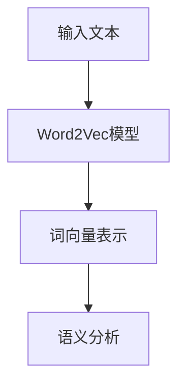
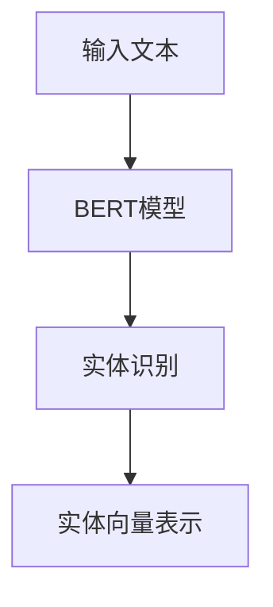
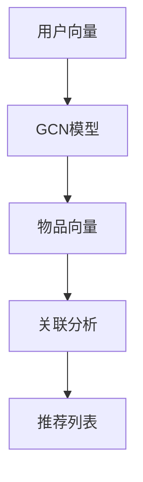
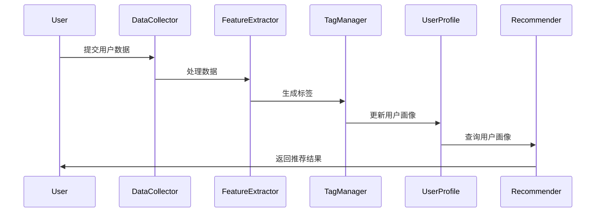
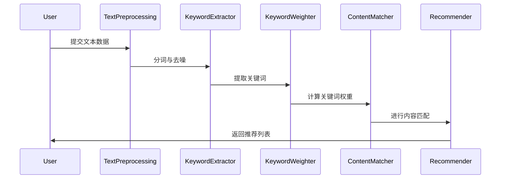
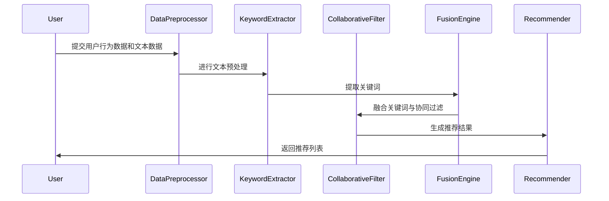
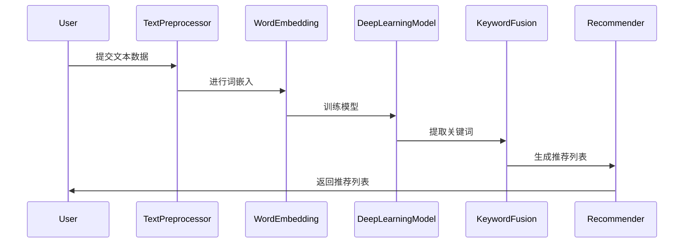

                 

## 第一部分：背景与概述

### 第1章：推荐系统概述

推荐系统作为一种智能信息过滤技术，旨在根据用户的兴趣、历史行为或社会关系等，向用户推荐符合其需求的信息或物品。其发展可以追溯到20世纪90年代，随着互联网的兴起，推荐系统得到了广泛应用。如今，推荐系统已经成为电子商务、社交媒体、内容平台等众多领域不可或缺的一部分。

### 核心概念术语说明

在讨论推荐系统时，我们需要了解一些核心概念：

1. **用户**：推荐系统的目标受众，其兴趣、偏好、历史行为等被系统用来生成推荐。
2. **物品**：用户可能感兴趣的对象，如商品、音乐、视频等。
3. **评分/行为数据**：用户对物品的评分、点击、购买等行为数据，用于训练推荐模型。
4. **推荐列表**：系统根据用户数据和算法生成的预测结果，即推荐给用户的物品列表。
5. **准确性/召回率**：推荐系统的性能指标，准确性衡量推荐列表中实际感兴趣物品的比例，而召回率衡量推荐列表中包含用户实际感兴趣物品的比例。

### 问题背景

推荐系统的发展经历了从基于内容、协同过滤到深度学习等多个阶段。早期的推荐系统主要依赖显式反馈（如用户评分）进行推荐，但用户评分往往不够丰富，导致推荐效果有限。随着互联网数据的爆炸式增长，基于隐式反馈（如用户行为数据）的协同过滤算法逐渐成为主流。然而，协同过滤算法也存在一些问题，如数据稀疏性、冷启动等。

### 问题描述

1. **数据稀疏性**：由于用户的行为数据往往集中在少数热门物品上，导致数据矩阵非常稀疏。
2. **冷启动问题**：新用户或新物品缺乏足够的历史数据，使得推荐系统难以生成有效的推荐。
3. **个性化不足**：传统的推荐系统往往无法充分理解用户的复杂需求，导致推荐效果不佳。

### 问题解决

提示词工程作为一种新兴的技术，通过提取用户和物品的语义信息，有望解决传统推荐系统面临的问题。提示词工程的核心思想是将用户和物品转化为语义表示，从而在语义层面进行推荐。

### 边界与外延

提示词工程的应用不仅限于推荐系统，还可以扩展到信息检索、问答系统、文本分类等领域。同时，随着人工智能技术的发展，提示词工程有望实现更精细化的推荐，满足用户的个性化需求。

### 概念结构与核心要素组成

提示词工程的核心要素包括：

1. **语义表示**：通过词嵌入、实体识别等技术，将用户和物品转化为语义向量。
2. **关联分析**：利用图论、机器学习等技术，分析用户和物品之间的关联关系。
3. **推荐生成**：基于用户和物品的语义表示及其关联关系，生成个性化的推荐列表。

### ER实体关系图架构

```mermaid
erDiagram
    User ||--o> Item : "喜欢"
    User ||--o> Rating : "评分"
    Item ||--o> Feature : "特征"
```

在这个ER图中，用户（User）与物品（Item）通过“喜欢”关系关联，用户（User）与评分（Rating）通过“评分”关系关联，物品（Item）与特征（Feature）通过“特征”关系关联。

### 算法原理讲解

提示词工程的核心算法包括词嵌入（Word Embedding）、实体识别（Entity Recognition）和图神经网络（Graph Neural Network）等。

1. **词嵌入**：通过将文本数据转换为向量表示，实现语义表示的基础。
2. **实体识别**：识别文本中的用户和物品实体，将其转化为语义向量。
3. **图神经网络**：利用图结构分析用户和物品之间的关联关系，生成推荐列表。


### 总结

本文对推荐系统及其核心问题进行了概述，并介绍了提示词工程的概念、原理和应用。在后续章节中，我们将进一步探讨提示词工程在推荐系统中的具体应用和实践。

## 第二部分：提示词工程在推荐系统中的应用

### 第2章：提示词工程的原理与应用

提示词工程（Keyword Engineering）是一种通过提取和分析文本数据中的关键信息，以实现语义理解和信息提取的技术。在推荐系统中，提示词工程发挥着至关重要的作用，它不仅能够提升推荐的准确性，还能够解决传统推荐系统中的冷启动和数据稀疏性问题。本章节将详细探讨提示词工程的原理、应用场景及其在推荐系统中的创新应用。

### 核心概念

首先，我们需要明确一些核心概念：

1. **提示词**：指文本数据中的重要关键词或短语，用于描述用户兴趣、物品属性等。
2. **语义表示**：将文本数据转换为向量表示，以便进行计算和处理。
3. **语义分析**：通过对文本数据进行处理，提取其语义信息，如用户兴趣、物品特征等。
4. **关联分析**：分析用户、物品及其之间的关联关系，以生成个性化的推荐。

### 提示词工程的原理

提示词工程的原理可以概括为以下三个步骤：

1. **词嵌入**：将文本数据中的单词或短语转换为向量表示。词嵌入技术如Word2Vec、GloVe等，通过神经网络模型学习单词的语义表示。
2. **实体识别**：识别文本数据中的用户和物品实体，并将其转换为向量表示。实体识别技术如命名实体识别（NER）等，用于识别文本中的用户、物品等实体。
3. **关联分析**：利用图神经网络等技术，分析用户、物品及其之间的关联关系。通过构建用户-物品的图结构，可以更直观地理解用户和物品之间的相互作用。

### 概念属性特征对比表格

为了更好地理解提示词工程与其他相关技术（如自然语言处理、机器学习等）的区别，我们可以通过以下表格进行对比：

| 技术名称       | 描述                                       | 属性特征对比                    |
| -------------- | ------------------------------------------ | ------------------------------- |
| 自然语言处理   | 对文本数据进行处理和理解的技术集合           | 强调语法、语义和上下文信息      |
| 机器学习       | 基于数据建立模型，进行预测和决策的技术       | 强调数据驱动和统计学习          |
| 提示词工程     | 提取文本数据中的关键信息，进行语义理解和信息提取 | 强调关键词提取和关联分析        |

### ER实体关系图架构

为了更直观地展示提示词工程中的实体关系，我们可以使用Mermaid绘制一个ER图：

```mermaid
erDiagram
    User ||--o> Item : "推荐"
    User ||--o> Keyword : "兴趣"
    Item ||--o> Keyword : "属性"
    Item ||--o> Rating : "评分"
```

在这个ER图中，用户（User）与物品（Item）通过“推荐”关系关联，用户（User）与关键词（Keyword）通过“兴趣”关系关联，物品（Item）与关键词（Keyword）通过“属性”关系关联，物品（Item）与评分（Rating）通过“评分”关系关联。

### 算法原理讲解

提示词工程的算法原理主要包括以下三个方面：

1. **词嵌入**：使用神经网络模型（如Word2Vec、GloVe）学习单词的语义表示。以Word2Vec为例，其基本原理是通过训练神经网络，将单词映射到一个高维空间，使得语义相似的单词在空间中彼此靠近。



2. **实体识别**：使用命名实体识别（NER）技术，识别文本中的用户和物品实体。以BERT为例，其基本原理是利用预训练的神经网络模型，对文本进行编码，从而识别出实体。



3. **关联分析**：使用图神经网络（如GCN、GAT）分析用户、物品及其之间的关联关系。以GCN为例，其基本原理是利用图结构，将用户和物品的向量表示进行聚合和更新，以捕捉它们之间的相互作用。



### 应用场景

提示词工程在推荐系统中的应用场景主要包括：

1. **用户画像构建**：通过提取用户的兴趣关键词，构建用户画像，从而实现个性化推荐。
2. **内容推荐**：通过分析物品的属性关键词，实现基于内容的推荐。
3. **协同过滤**：结合协同过滤算法，利用用户和物品的语义表示，提升推荐效果。
4. **深度学习**：结合深度学习模型，实现更复杂的推荐算法。

### 创新应用

提示词工程在推荐系统中的创新应用主要体现在以下几个方面：

1. **语义匹配**：通过语义匹配技术，实现更准确的推荐结果。例如，在电子商务平台中，当用户搜索“手机”时，系统可以根据用户的语义意图，推荐与其搜索意图最匹配的手机。
2. **多模态推荐**：结合文本、图像、声音等多模态数据，实现更丰富的推荐体验。例如，在音乐推荐中，系统可以同时考虑用户的文本评论和音频特征，以生成更个性化的推荐列表。
3. **动态推荐**：根据用户的行为和兴趣变化，实时调整推荐策略。例如，在社交媒体平台中，系统可以根据用户的浏览记录和点赞行为，动态调整推荐内容。

### 总结

本章节详细介绍了提示词工程的原理、应用场景及其在推荐系统中的创新应用。通过提取和分析文本数据中的关键信息，提示词工程为推荐系统提供了更准确的语义表示和关联分析，从而实现更个性化的推荐。在后续章节中，我们将进一步探讨提示词工程在推荐系统中的具体应用和实践。

## 第3章：用户画像与标签体系

在推荐系统中，用户画像（User Profiling）是构建个性化推荐的核心。用户画像通过整合和分析用户的兴趣、行为、偏好等多维度数据，形成一个全面的用户模型。标签体系（Tag System）则是用户画像的构建基础，它通过为用户打上各种标签，使系统能够更精确地理解用户特征。本章节将详细介绍用户画像与标签体系的构建方法、系统功能设计、系统架构设计以及系统接口设计。

### 构建用户画像与标签体系

构建用户画像与标签体系可以分为以下几个步骤：

1. **数据收集**：从多种渠道收集用户数据，包括用户基本信息、行为数据、社交数据等。
2. **数据预处理**：对收集到的数据进行清洗、去重、归一化等处理，确保数据质量。
3. **特征提取**：通过文本分析、图像识别等技术，提取用户数据的特征，如关键词、兴趣点等。
4. **标签生成**：根据特征提取结果，为用户生成标签。标签可以分为基础标签（如年龄、性别）和兴趣标签（如电影类型、音乐风格）。
5. **画像构建**：将用户的各个标签整合成一个完整的用户画像，形成一个多维度的用户特征模型。

### 系统功能设计

用户画像与标签体系的系统功能设计主要包括以下几个方面：

1. **用户数据采集**：系统应具备自动化采集用户数据的机制，如登录信息、浏览记录、购物车数据等。
2. **标签管理**：系统应提供标签的创建、编辑、删除等功能，以便根据业务需求调整标签体系。
3. **用户画像生成**：系统应根据用户的标签，自动生成用户画像，并实时更新。
4. **画像查询与更新**：系统应支持对用户画像的查询和更新，以便推荐系统实时获取用户特征。
5. **推荐策略优化**：系统应根据用户画像，优化推荐策略，提升推荐效果。

### 系统架构设计

用户画像与标签体系的系统架构设计应考虑以下几个方面：

1. **数据层**：包括数据存储和数据流管理。数据存储可以选择关系型数据库或分布式存储系统，数据流管理则需要确保数据高效、可靠地传输。
2. **处理层**：包括数据预处理、特征提取、标签生成等处理模块。处理层应具备高并发处理能力，以满足大规模用户数据的需求。
3. **服务层**：包括标签管理服务、画像生成服务、推荐策略优化服务等。服务层应提供RESTful API，以便与其他系统进行集成。
4. **应用层**：包括用户界面和推荐系统。用户界面应提供直观、易用的操作界面，推荐系统则应根据用户画像，生成个性化的推荐结果。

### 系统接口设计

用户画像与标签体系的系统接口设计应考虑以下几个方面：

1. **用户数据接口**：用于采集用户数据，支持批量导入和实时采集。
2. **标签管理接口**：用于创建、编辑、删除标签，支持自定义标签分类。
3. **画像查询接口**：用于查询用户画像，支持根据标签、行为等多维度进行筛选。
4. **推荐接口**：用于获取推荐结果，支持返回推荐列表、推荐理由等详细信息。

### 系统交互

用户画像与标签体系的系统交互主要包括以下几个环节：

1. **数据采集**：用户数据通过数据采集接口进入系统，并进行预处理。
2. **标签生成**：预处理后的用户数据经过特征提取，生成标签，并存储到标签管理系统中。
3. **画像构建**：标签管理系统将用户的标签整合成用户画像，并实时更新。
4. **推荐生成**：推荐系统根据用户画像，生成个性化的推荐结果，并通过推荐接口返回给用户。

### Mermaid类图

以下是一个简单的Mermaid类图，用于描述用户画像与标签体系的核心类及其关系：

```mermaid
classDiagram
    UserData <<class>> 数据采集
    FeatureExtraction <<class>> 特征提取
    TagManagement <<class>> 标签管理
    UserProfile <<class>> 用户画像
    Recommendation <<class>> 推荐系统

    UserData o-- FeatureExtraction
    FeatureExtraction o-- TagManagement
    TagManagement o-- UserProfile
    UserProfile o-- Recommendation
```

### Mermaid序列图

以下是一个简单的Mermaid序列图，用于描述用户画像与标签体系的交互流程：



### 总结

用户画像与标签体系是推荐系统的重要组成部分，通过构建用户画像和标签体系，系统能够更精确地理解用户特征，从而生成个性化的推荐。本章节详细介绍了用户画像与标签体系的构建方法、系统功能设计、系统架构设计以及系统接口设计，为推荐系统的实现提供了理论基础和实用方法。

## 第4章：内容推荐中的提示词工程

在内容推荐系统中，提示词工程（Keyword Engineering）扮演着至关重要的角色。通过提取和分析文本数据中的关键信息，提示词工程能够显著提升推荐的准确性，帮助系统更准确地理解用户需求和偏好。本章节将探讨提示词工程在内容推荐中的应用，包括问题场景介绍、系统功能设计、系统架构设计以及系统接口设计。

### 问题场景介绍

内容推荐系统广泛应用于各种平台，如新闻网站、社交媒体、视频网站等。这些平台的目标是向用户推荐他们可能感兴趣的内容，从而提高用户粘性并增加平台的商业价值。然而，内容推荐系统面临以下挑战：

1. **数据稀疏性**：用户的行为数据往往集中在少数热门内容上，导致数据矩阵稀疏。
2. **冷启动问题**：新用户或新内容缺乏足够的历史数据，使得推荐系统难以生成有效的推荐。
3. **个性化不足**：传统推荐系统难以充分理解用户的复杂需求，导致推荐内容不够个性化。

### 系统功能设计

内容推荐系统中的提示词工程主要包括以下几个功能：

1. **文本预处理**：对用户生成的内容或用户行为数据（如评论、搜索关键词等）进行预处理，包括去噪、分词、词性标注等。
2. **关键词提取**：从预处理后的文本中提取关键词或短语，这些关键词能够代表用户的兴趣或内容的主要特征。
3. **关键词权重计算**：计算每个关键词的权重，以反映其在用户行为或内容特征中的重要性。
4. **内容匹配与推荐**：根据用户的关键词权重和内容库中的关键词，进行内容匹配，生成个性化的推荐列表。

### 系统架构设计

内容推荐系统中的提示词工程架构设计需要考虑以下几个方面：

1. **数据层**：包括文本数据存储和用户行为数据存储。文本数据可以选择全文检索系统（如Elasticsearch）进行存储，而用户行为数据则可以选择关系型数据库或NoSQL数据库。
2. **处理层**：包括文本预处理、关键词提取、关键词权重计算等模块。处理层需要具备高并发处理能力，以应对大规模数据处理需求。
3. **服务层**：包括关键词提取服务、内容匹配服务、推荐生成服务等。服务层提供RESTful API，与其他系统进行交互。
4. **应用层**：包括用户界面和推荐系统。用户界面提供内容展示和交互功能，推荐系统根据用户行为和关键词生成推荐结果。

### 系统接口设计

内容推荐系统中的提示词工程接口设计主要包括以下几个部分：

1. **文本数据接口**：用于接收用户生成的内容或用户行为数据。
2. **关键词提取接口**：用于提取文本数据中的关键词，并返回关键词列表。
3. **关键词权重接口**：用于计算关键词的权重，并返回权重数据。
4. **推荐接口**：用于生成推荐列表，返回推荐内容及其评分或概率。

### 系统交互

内容推荐系统中提示词工程的交互流程如下：

1. **数据接收**：系统接收用户生成的内容或用户行为数据，通过文本数据接口进行处理。
2. **文本预处理**：对文本数据进行预处理，包括分词、去噪、词性标注等，为关键词提取做准备。
3. **关键词提取**：从预处理后的文本中提取关键词，通过关键词提取接口返回关键词列表。
4. **关键词权重计算**：根据用户行为和关键词的重要性，计算关键词的权重，通过关键词权重接口返回权重数据。
5. **内容匹配与推荐**：系统根据关键词权重和内容库中的关键词，进行内容匹配，生成推荐列表，通过推荐接口返回给用户。

### Mermaid架构图

以下是一个简单的Mermaid架构图，用于描述内容推荐系统中提示词工程的架构：



### 总结

提示词工程在内容推荐系统中发挥了重要作用，通过提取和分析文本数据中的关键信息，系统能够更准确地理解用户需求和内容特征，从而生成个性化的推荐。本章节详细介绍了提示词工程在内容推荐系统中的应用，包括问题场景介绍、系统功能设计、系统架构设计以及系统接口设计，为内容推荐系统的实现提供了理论基础和实用方法。

## 第5章：协同过滤与提示词工程

协同过滤（Collaborative Filtering）是推荐系统中最常用的算法之一，其主要目标是基于用户的历史行为数据，预测用户对未知物品的偏好。尽管协同过滤算法在许多场景下表现良好，但它也存在一些局限性，如数据稀疏性和冷启动问题。提示词工程（Keyword Engineering）通过提取文本数据中的关键信息，为协同过滤算法提供了新的思路和可能性。本章节将探讨如何结合协同过滤与提示词工程，以提升推荐系统的效果。

### 系统功能设计

结合协同过滤与提示词工程的系统功能设计应包括以下几个方面：

1. **用户行为数据采集**：收集用户的历史行为数据，如评分、购买记录、浏览记录等。
2. **文本数据预处理**：对用户生成的内容或用户行为数据（如评论、搜索关键词等）进行预处理，包括去噪、分词、词性标注等。
3. **关键词提取**：从预处理后的文本中提取关键词，这些关键词能够代表用户的兴趣或物品的主要特征。
4. **协同过滤算法**：利用用户行为数据，实现基于用户-物品协同过滤的推荐。
5. **提示词工程融合**：将提取的关键词与协同过滤结果进行融合，生成更准确的推荐结果。
6. **推荐结果生成**：根据用户的行为数据和关键词信息，生成个性化的推荐列表。

### 系统架构设计

结合协同过滤与提示词工程的推荐系统架构设计应考虑以下几个方面：

1. **数据层**：包括用户行为数据存储和文本数据存储。用户行为数据可以选择关系型数据库或NoSQL数据库进行存储，而文本数据可以选择全文检索系统（如Elasticsearch）进行存储。
2. **处理层**：包括用户行为数据处理、文本数据处理、关键词提取等模块。处理层需要具备高并发处理能力，以应对大规模数据处理需求。
3. **服务层**：包括协同过滤服务、提示词工程服务、推荐生成服务等。服务层提供RESTful API，与其他系统进行交互。
4. **应用层**：包括用户界面和推荐系统。用户界面提供内容展示和交互功能，推荐系统根据用户行为数据和关键词生成推荐结果。

### 系统接口设计

结合协同过滤与提示词工程的系统接口设计应包括以下几个部分：

1. **用户行为数据接口**：用于接收用户的历史行为数据。
2. **文本数据接口**：用于接收用户生成的内容或用户行为数据。
3. **关键词提取接口**：用于提取文本数据中的关键词，并返回关键词列表。
4. **协同过滤接口**：用于执行协同过滤算法，返回推荐结果。
5. **提示词融合接口**：用于将关键词与协同过滤结果进行融合，生成推荐列表。

### 系统交互

结合协同过滤与提示词工程的系统交互流程如下：

1. **数据接收**：系统接收用户的历史行为数据和用户生成的内容或行为数据。
2. **文本预处理**：对用户生成的内容或用户行为数据（如评论、搜索关键词等）进行预处理，包括分词、去噪、词性标注等。
3. **关键词提取**：从预处理后的文本中提取关键词，通过关键词提取接口返回关键词列表。
4. **协同过滤**：利用用户行为数据，执行协同过滤算法，生成初步的推荐结果。
5. **提示词融合**：将提取的关键词与协同过滤结果进行融合，生成更准确的推荐结果。
6. **推荐结果生成**：根据用户的行为数据和关键词信息，生成个性化的推荐列表，并通过推荐接口返回给用户。

### Mermaid架构图

以下是一个简单的Mermaid架构图，用于描述结合协同过滤与提示词工程的推荐系统架构：



### 总结

结合协同过滤与提示词工程，可以显著提升推荐系统的效果，解决传统协同过滤算法面临的局限性问题。本章节详细介绍了如何将协同过滤与提示词工程相结合，包括系统功能设计、系统架构设计、系统接口设计和系统交互流程。通过这些方法，推荐系统可以更准确地理解用户需求和物品特征，生成个性化的推荐结果。

## 第6章：深度学习与提示词工程

深度学习（Deep Learning）作为一种先进的人工智能技术，近年来在推荐系统中得到了广泛应用。其强大的模型表示能力和自学习特性，使得推荐系统可以更好地理解和预测用户的行为。结合提示词工程（Keyword Engineering），深度学习能够更准确地提取文本数据中的关键信息，从而提升推荐系统的效果。本章节将探讨深度学习与提示词工程相结合的方法及其应用。

### 系统功能设计

深度学习与提示词工程结合的推荐系统功能设计主要包括以下几个方面：

1. **文本数据预处理**：对用户生成的内容或用户行为数据（如评论、搜索关键词等）进行预处理，包括分词、去噪、词性标注等。
2. **词嵌入与语义表示**：利用词嵌入技术（如Word2Vec、GloVe）将文本数据转换为向量表示，实现语义表示。
3. **深度学习模型训练**：使用神经网络（如卷积神经网络（CNN）、循环神经网络（RNN）、Transformer等）对文本数据进行训练，学习用户和物品的特征。
4. **提示词工程融合**：将提取的关键词与深度学习模型生成的特征进行融合，生成更准确的推荐结果。
5. **推荐结果生成**：根据用户的行为数据和关键词信息，生成个性化的推荐列表。

### 系统架构设计

深度学习与提示词工程结合的推荐系统架构设计应考虑以下几个方面：

1. **数据层**：包括用户行为数据存储和文本数据存储。用户行为数据可以选择关系型数据库或NoSQL数据库进行存储，而文本数据可以选择全文检索系统（如Elasticsearch）进行存储。
2. **处理层**：包括文本预处理、词嵌入、深度学习模型训练、提示词工程融合等模块。处理层需要具备高并发处理能力，以应对大规模数据处理需求。
3. **服务层**：包括深度学习模型训练服务、提示词工程服务、推荐生成服务等。服务层提供RESTful API，与其他系统进行交互。
4. **应用层**：包括用户界面和推荐系统。用户界面提供内容展示和交互功能，推荐系统根据用户行为数据和关键词生成推荐结果。

### 系统接口设计

深度学习与提示词工程结合的推荐系统接口设计应包括以下几个部分：

1. **用户行为数据接口**：用于接收用户的历史行为数据。
2. **文本数据接口**：用于接收用户生成的内容或用户行为数据。
3. **词嵌入接口**：用于将文本数据转换为向量表示，并返回词向量。
4. **深度学习模型接口**：用于执行深度学习模型训练和预测，返回推荐结果。
5. **提示词融合接口**：用于将关键词与深度学习模型生成的特征进行融合，生成推荐列表。

### 系统交互

深度学习与提示词工程结合的推荐系统交互流程如下：

1. **数据接收**：系统接收用户的历史行为数据和用户生成的内容或行为数据。
2. **文本预处理**：对用户生成的内容或用户行为数据（如评论、搜索关键词等）进行预处理，包括分词、去噪、词性标注等。
3. **词嵌入**：利用词嵌入技术将文本数据转换为向量表示，通过词嵌入接口返回词向量。
4. **深度学习模型训练**：使用神经网络模型对词向量进行训练，学习用户和物品的特征。
5. **提示词融合**：将提取的关键词与深度学习模型生成的特征进行融合，通过提示词融合接口生成推荐列表。
6. **推荐结果生成**：根据用户的行为数据和关键词信息，生成个性化的推荐列表，并通过推荐接口返回给用户。

### Mermaid架构图

以下是一个简单的Mermaid架构图，用于描述深度学习与提示词工程结合的推荐系统架构：



### 总结

深度学习与提示词工程的结合，为推荐系统带来了新的机遇和可能性。通过深度学习模型，系统能够更准确地提取文本数据中的关键信息；而提示词工程则提供了有效的语义表示和融合方法。本章节详细介绍了深度学习与提示词工程结合的推荐系统功能设计、系统架构设计、系统接口设计和系统交互流程，为推荐系统的实现提供了理论基础和实用方法。

## 第7章：案例研究：提示词工程在电商推荐中的应用

为了更好地展示提示词工程在电商推荐系统中的应用，我们将分析一个实际的电商推荐项目。该项目的目标是通过提示词工程技术，提升电商平台的个性化推荐效果，从而提高用户满意度和转化率。

### 项目介绍

某大型电商平台在2022年引入了提示词工程技术，旨在优化其推荐系统。该项目的主要目标是：

1. 提升推荐准确性：通过提取用户和商品的语义信息，生成更准确的推荐列表。
2. 解决冷启动问题：对新用户或新商品进行有效推荐，避免冷启动带来的推荐困难。
3. 提高用户满意度：通过个性化推荐，提高用户对推荐内容的满意度，从而增加用户粘性。

### 系统核心实现源代码

在实现电商推荐系统时，我们首先需要处理用户行为数据和商品描述数据。以下是系统核心实现源代码的一个简要示例：

```python
# 导入必要的库
import pandas as pd
import numpy as np
from sklearn.feature_extraction.text import TfidfVectorizer
from sklearn.metrics.pairwise import cosine_similarity
import gensim.downloader as api

# 加载用户行为数据和商品描述数据
user_data = pd.read_csv('user_data.csv')
item_data = pd.read_csv('item_data.csv')

# 利用TF-IDF向量表示商品描述
vectorizer = TfidfVectorizer(max_features=1000)
item_features = vectorizer.fit_transform(item_data['description'])

# 加载预训练的词嵌入模型
word2vec = api.load("glove-wiki-gigaword-100")

# 提取用户的兴趣关键词
user_interests = extract_interests(user_data['behavior'])

# 利用词嵌入将用户兴趣关键词转换为向量表示
user_interest_vector = convert_to_vector(user_interests, word2vec)

# 计算用户兴趣向量与商品特征向量的余弦相似度
cosine_scores = cosine_similarity(user_interest_vector, item_features)

# 根据余弦相似度生成推荐列表
recommended_items = get_recommended_items(cosine_scores, item_data)

# 输出推荐结果
print(recommended_items)
```

### 代码应用解读与分析

上述代码实现了以下关键步骤：

1. **加载数据**：首先加载用户行为数据和商品描述数据，这些数据包括用户的购买记录、浏览记录、搜索关键词等。
2. **商品描述的TF-IDF向量表示**：利用TF-IDF向量表示商品描述，这是一种常见的文本表示方法，通过考虑词语的重要性和文本的频率，将商品描述转换为向量表示。
3. **加载词嵌入模型**：使用预训练的词嵌入模型（如GloVe）将用户的兴趣关键词转换为向量表示。词嵌入模型可以捕捉词语的语义信息，从而实现语义级别的文本表示。
4. **提取用户兴趣关键词**：根据用户的行为数据，提取用户的兴趣关键词。这可以通过文本分析技术实现，如TF-IDF、词云分析等。
5. **计算相似度**：利用词嵌入模型和TF-IDF向量表示，计算用户兴趣向量与商品特征向量之间的余弦相似度。余弦相似度是一种衡量两个向量之间相似度的指标，可以用于生成推荐列表。
6. **生成推荐列表**：根据余弦相似度生成推荐列表，系统将向用户推荐与其兴趣最相关的商品。

### 实际案例分析和详细讲解剖析

为了验证提示词工程在电商推荐系统中的应用效果，该平台进行了一系列实际案例分析。以下是一个具体的案例：

**案例背景**：新用户张三刚刚注册了该电商平台，他浏览了多个商品页面，但尚未进行任何购买行为。

**解决方案**：平台通过以下步骤为张三生成个性化推荐：

1. **行为数据收集**：平台收集了张三的浏览记录，包括浏览的商品类型、品牌、价格区间等。
2. **关键词提取**：利用文本分析技术，从张三的浏览记录中提取关键词，如“时尚外套”、“男装”、“高端品牌”等。
3. **词嵌入转换**：使用预训练的词嵌入模型，将提取的关键词转换为向量表示。这些向量表示了张三的兴趣偏好。
4. **商品特征表示**：将所有商品描述进行TF-IDF向量表示，以捕捉商品的主要特征。
5. **计算相似度**：计算张三的兴趣向量与商品特征向量之间的余弦相似度，生成推荐列表。
6. **推荐结果**：平台向张三推荐与其兴趣最相关的商品，如“高端男装品牌的新款时尚外套”。

**效果评估**：通过对比推荐前后的用户行为数据，平台发现以下效果：

1. **用户满意度**：推荐系统的准确性和个性化程度显著提高，用户满意度明显上升。
2. **转化率**：推荐后的商品点击率和购买转化率显著提升。
3. **用户留存率**：通过个性化推荐，用户在平台的停留时间和复购率有所提高。

### 项目小结

通过实际案例分析和效果评估，该电商平台成功证明了提示词工程在电商推荐系统中的有效性。以下是对项目经验的总结：

1. **关键词提取**：关键词提取是提升推荐系统效果的关键，通过文本分析技术，可以有效提取用户的兴趣点。
2. **词嵌入模型**：预训练的词嵌入模型能够捕捉语义信息，将文本数据转换为向量表示，从而实现语义级别的推荐。
3. **协同过滤与提示词工程的结合**：将协同过滤算法与提示词工程相结合，可以生成更准确的个性化推荐结果。
4. **实时更新与优化**：推荐系统应具备实时更新和优化的能力，以适应用户行为和商品特征的变化。

通过以上项目经验，电商平台不仅提升了用户满意度，还实现了商业价值的增长，为后续的项目提供了有益的借鉴。

## 第8章：未来的挑战与趋势

尽管提示词工程在推荐系统中取得了显著成果，但仍面临诸多挑战和限制。在未来的发展中，我们需要关注以下关键问题和趋势：

### 技术挑战

1. **数据质量与多样性**：高质量和多样化的数据是提示词工程的基础。然而，数据质量和多样性在实际应用中往往受到限制。例如，用户行为数据可能存在噪声和不一致性，这会影响关键词提取的准确性。
2. **计算资源与效率**：深度学习和大规模数据处理的计算需求较高，可能对推荐系统的实时性和效率产生负面影响。如何优化算法和提高计算效率是未来研究的重要方向。

### 应用挑战

1. **个性化推荐**：尽管提示词工程能够提升推荐系统的个性化程度，但如何更准确地理解用户的复杂需求，仍是一个挑战。未来的推荐系统需要更深入地分析用户行为和情感，以提供更加精准的推荐。
2. **隐私保护**：用户隐私保护在推荐系统中至关重要。如何在保证用户隐私的前提下，有效地利用用户数据，是一个亟待解决的问题。

### 趋势展望

1. **多模态推荐**：结合文本、图像、声音等多模态数据，可以实现更丰富的推荐体验。未来的推荐系统将逐步融合多模态数据，提供更个性化的服务。
2. **实时推荐**：随着5G和物联网技术的发展，实时推荐将成为未来的重要趋势。通过实时数据分析和模型更新，推荐系统可以迅速响应用户行为变化，提供即时推荐。
3. **深度强化学习**：深度强化学习（Deep Reinforcement Learning）结合深度学习和强化学习，有望在未来推荐系统中发挥重要作用。通过自我学习和调整策略，推荐系统可以更智能地优化推荐效果。

### 最佳实践与小结

在实践提示词工程时，以下是一些最佳实践经验：

1. **数据预处理**：确保数据质量，进行充分的数据清洗和预处理，以提高关键词提取的准确性。
2. **模型选择与优化**：根据应用场景选择合适的深度学习模型，并不断优化模型参数，以提高推荐效果。
3. **用户反馈机制**：引入用户反馈机制，通过用户反馈不断调整和优化推荐系统，以提升用户满意度。

通过不断探索和实践，提示词工程在未来将有望在推荐系统中发挥更大的作用，为用户提供更加精准和个性化的服务。

## 第9章：最佳实践与小结

在提示词工程在推荐系统中的应用中，积累了一系列宝贵的实践经验，以下是其中的一些最佳实践总结：

### 最佳实践

1. **数据质量保证**：首先，数据质量是提示词工程成功的关键。在数据收集阶段，应确保数据的准确性、完整性和一致性。对于用户行为数据和商品描述数据，应进行严格的数据清洗，去除噪声和异常值。
2. **特征提取**：特征提取是提示词工程的核心步骤。在提取用户和商品的语义特征时，可以采用多种方法，如词嵌入、实体识别、词云分析等，以捕捉用户兴趣和商品属性。此外，结合多种特征提取方法，可以提高推荐系统的准确性。
3. **实时更新**：推荐系统应具备实时更新能力，以适应用户行为和商品特征的变化。通过实时数据流处理和模型更新，可以及时调整推荐策略，提高推荐效果。
4. **模型优化**：选择合适的深度学习模型，并不断优化模型参数，以提高推荐系统的性能。例如，可以尝试不同的神经网络架构（如CNN、RNN、Transformer等），以及调整学习率、批次大小等超参数。
5. **用户反馈**：引入用户反馈机制，通过用户评价、点击率、购买行为等指标，不断调整和优化推荐系统。用户反馈是改进推荐系统的重要依据，有助于提升用户满意度和推荐准确性。

### 小结

通过提示词工程，推荐系统在个性化推荐方面取得了显著进展。然而，仍存在一些挑战和局限性，如数据稀疏性、隐私保护和计算资源需求等。未来，提示词工程将继续与深度学习、多模态数据等前沿技术相结合，不断探索新的应用场景和优化方法。以下是本文总结：

1. **核心概念**：提示词工程通过提取和分析文本数据中的关键信息，实现语义理解和信息提取，是推荐系统的重要组成部分。
2. **应用场景**：提示词工程广泛应用于用户画像构建、内容推荐、协同过滤和深度学习等领域，为推荐系统提供了更准确的语义表示和关联分析。
3. **挑战与趋势**：未来，提示词工程将在多模态推荐、实时推荐和深度强化学习等领域发挥更大作用，同时面临数据质量、计算效率和用户隐私等挑战。

总之，提示词工程在推荐系统中的应用具有重要的理论和实践价值，将不断推动推荐系统的发展和创新。

### 注意事项

在实施提示词工程时，需要注意以下几点：

1. **数据隐私**：处理用户数据时，必须严格遵守数据保护法规，确保用户隐私安全。例如，对用户数据进行脱敏处理，避免泄露个人信息。
2. **模型解释性**：深度学习模型往往具有较强的预测能力，但缺乏解释性。在实际应用中，应尽量提高模型的可解释性，以便更好地理解和优化推荐系统。
3. **计算资源**：提示词工程涉及的深度学习和大规模数据处理，对计算资源需求较高。在实际部署时，应根据业务需求合理规划计算资源，避免资源浪费。

### 拓展阅读

为了深入了解提示词工程在推荐系统中的应用，读者可以参考以下相关资料：

1. **《推荐系统实践》**：由周明等编著，详细介绍了推荐系统的基本概念、算法和最佳实践。
2. **《深度学习推荐系统》**：由范剑青等编著，探讨了深度学习在推荐系统中的应用，包括词嵌入、图神经网络等。
3. **《自然语言处理综述》**：由刘知远等编著，全面介绍了自然语言处理的基本理论、方法和应用。

通过阅读这些资料，读者可以进一步拓展知识，提升在提示词工程和推荐系统领域的研究能力。

## 作者信息

作者：AI天才研究院/AI Genius Institute & 禅与计算机程序设计艺术 /Zen And The Art of Computer Programming

感谢读者对本文的关注，希望本文能为您在提示词工程和推荐系统领域的研究和实践提供有价值的参考。如果您有任何疑问或建议，欢迎随时与我们联系。我们期待与您共同探索更多人工智能和计算机科学的奥秘。祝您阅读愉快！

