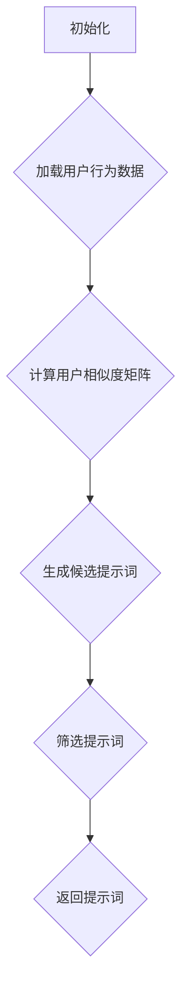
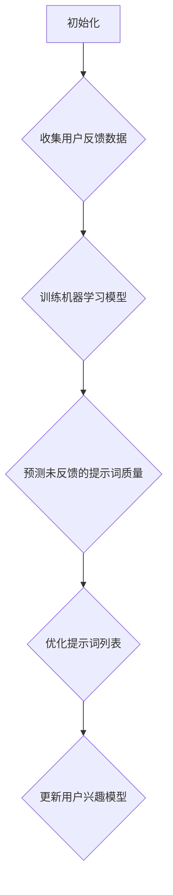
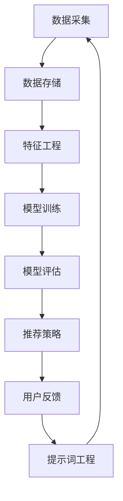

                 


# 提示词工程在推荐系统中的应用

## 关键词

- **推荐系统**
- **提示词工程**
- **用户兴趣模型**
- **协同过滤**
- **机器学习**
- **数据挖掘**

## 摘要

随着互联网的迅猛发展，个性化推荐系统已经成为提升用户体验和增加商业价值的重要工具。提示词工程作为推荐系统中的一个关键环节，通过优化用户兴趣模型和商品特征，显著提高了推荐质量。本文将详细介绍提示词工程在推荐系统中的应用，包括背景介绍、核心概念与联系、算法原理讲解、数学模型与公式、系统分析与架构设计、项目实战以及最佳实践等，旨在为读者提供全面、系统的理解和实践指导。

### 目录大纲

1. **背景介绍**
   - 1.1 问题背景
   - 1.2 问题描述
   - 1.3 问题解决
   - 1.4 边界与外延
   - 1.5 概念结构与核心要素组成

2. **核心概念与联系**
   - 2.1 核心概念原理
   - 2.2 概念属性特征对比表格
   - 2.3 ER实体关系图架构

3. **算法原理讲解**
   - 3.1 提示词生成算法
   - 3.2 提示词优化策略

4. **数学模型和数学公式**
   - 4.1 数学模型
   - 4.2 详细讲解与举例说明

5. **系统分析与架构设计方案**
   - 5.1 问题场景介绍
   - 5.2 系统功能设计
   - 5.3 系统架构设计
   - 5.4 系统接口设计
   - 5.5 系统交互

6. **项目实战**
   - 6.1 环境安装
   - 6.2 系统核心实现源代码
   - 6.3 代码应用解读与分析
   - 6.4 实际案例分析与详细讲解剖析
   - 6.5 项目小结

7. **最佳实践 tips、小结、注意事项、拓展阅读**

### 1. 背景介绍

#### 1.1 问题背景

个性化推荐系统是一种通过收集和分析用户历史行为和兴趣，预测用户可能感兴趣的内容并主动推荐的系统。随着用户生成内容的爆炸式增长和竞争的加剧，推荐系统已成为各大互联网公司的核心竞争手段。然而，推荐系统的效果直接影响用户体验和商业价值。

#### 1.2 问题描述

尽管推荐系统在技术层面上已取得显著进展，但以下几个问题仍然困扰着推荐系统的开发者：

- **用户行为数据的多样性**：用户行为数据包括点击、浏览、购买等，这些数据之间存在复杂的关联和噪声，增加了数据处理的复杂性。
- **数据质量与噪声**：数据质量直接影响推荐系统的准确性。噪声数据可能导致推荐结果偏离用户真实兴趣。
- **推荐效果的提升需求**：用户需求多样且变化迅速，如何持续提升推荐效果成为一大挑战。

#### 1.3 问题解决

提示词工程通过提取用户兴趣关键词和商品特征，构建用户兴趣模型，优化推荐算法，从而提高推荐系统的效果。具体来说，提示词工程包括以下几个核心任务：

- **用户兴趣模型构建**：通过分析用户历史行为，提取用户兴趣关键词，构建用户兴趣模型。
- **提示词生成算法**：设计算法自动生成高质量提示词，提高用户兴趣模型的准确性。
- **提示词优化策略**：通过用户反馈和机器学习算法，不断优化提示词，提升推荐效果。

#### 1.4 边界与外延

- **提示词工程的适用范围**：提示词工程主要应用于个性化推荐系统，但在内容推荐、广告投放等领域也有广泛应用。
- **非推荐系统中的提示词工程应用**：提示词工程不仅限于推荐系统，在搜索引擎优化、用户行为分析等领域也有应用。

#### 1.5 概念结构与核心要素组成

提示词工程的核心要素包括：

- **用户兴趣模型**：通过用户行为数据构建的用户兴趣特征。
- **提示词生成算法**：用于生成高质量提示词的算法。
- **提示词优化策略**：基于用户反馈和机器学习算法，优化提示词。

### 2. 核心概念与联系

#### 2.1 核心概念原理

**提示词**：提示词是从用户历史行为和内容中提取的关键词，用于描述用户的兴趣和需求。

**用户兴趣模型**：用户兴趣模型是基于用户历史行为和内容构建的，用于表示用户的兴趣和偏好。

**提示词生成算法**：提示词生成算法是用于自动生成高质量提示词的算法。

**提示词优化策略**：提示词优化策略是基于用户反馈和机器学习算法，用于不断优化提示词，提升推荐效果。

#### 2.2 概念属性特征对比表格

| 名称       | 描述                                                         | 关系                   |
|------------|------------------------------------------------------------|----------------------|
| 提示词     | 从用户历史行为和内容中提取的关键词                           | 用户兴趣的抽象表示     |
| 用户兴趣模型 | 基于用户历史行为和内容构建的，用于表示用户的兴趣和偏好         | 指导推荐的核心模型     |
| 提示词生成算法 | 自动生成高质量提示词的算法                                 | 增强用户兴趣模型的质量 |
| 提示词优化策略 | 基于用户反馈和机器学习算法，用于不断优化提示词，提升推荐效果 | 提高推荐系统效果     |

#### 2.3 ER实体关系图架构

```mermaid
erDiagram
  User ||--|{ Item }|-- Item
  User ||--|{ Behavior }|-- Behavior
  Item ||--|{ Feature }|-- Feature
  Behavior ||--|{ Feedback }|-- Feedback
  User }|--|{ InterestModel }|-- InterestModel
  InterestModel }|--|{ PromptWord }|-- PromptWord
```

### 3. 算法原理讲解

#### 3.1 提示词生成算法

提示词生成算法主要包括基于统计分析和机器学习的方法。以下是一个基于协同过滤的提示词生成算法的示例：



Python代码示例：

```python
import numpy as np
from sklearn.metrics.pairwise import cosine_similarity

def generate_prompt_words(user行为数据，所有用户行为数据):
    # 计算用户行为数据的相似度矩阵
    similarity_matrix = cosine_similarity(user行为数据, all_user行为数据)
    
    # 生成候选提示词
    candidate_prompt_words = [行为数据 for _, 行为数据 in similarity_matrix.argsort()[0][-10:]]
    
    # 筛选提示词
    selected_prompt_words = [word for word in candidate_prompt_words if word not in stop_words]
    
    return selected_prompt_words
```

#### 3.2 提示词优化策略

提示词优化策略主要包括基于用户反馈的机器学习算法。以下是一个基于用户反馈的提示词优化算法的示例：



Python代码示例：

```python
from sklearn.ensemble import RandomForestClassifier

def optimize_prompt_words(user反馈数据，selected_prompt_words):
    # 训练机器学习模型
    model = RandomForestClassifier()
    model.fit(user反馈数据, selected_prompt_words)
    
    # 预测未反馈的提示词质量
    predicted_quality = model.predict(user未反馈行为数据)
    
    # 优化提示词列表
    optimized_prompt_words = [word for word, quality in zip(selected_prompt_words, predicted_quality) if quality > threshold]
    
    return optimized_prompt_words
```

### 4. 数学模型和数学公式

#### 4.1 数学模型

用户兴趣模型可以表示为：

$$
用户兴趣模型 = f(用户行为数据，商品特征)
$$

其中，$f$ 是一个从用户行为数据和商品特征到用户兴趣模型的映射函数。

#### 4.2 详细讲解与举例说明

假设用户行为数据 $X$ 是一个 $n \times m$ 的矩阵，其中 $n$ 表示用户数量，$m$ 表示行为类型（如点击、浏览、购买等）。商品特征 $Y$ 是一个 $m \times k$ 的矩阵，其中 $k$ 表示商品维度（如价格、品牌、类型等）。用户兴趣模型 $Z$ 可以表示为：

$$
用户兴趣模型 Z = X \cdot Y
$$

其中，“$\cdot$”表示矩阵乘法。

例如，假设有3个用户和2种行为类型（点击和购买），以及2种商品维度（价格和品牌）。用户行为数据矩阵 $X$ 和商品特征矩阵 $Y$ 分别为：

$$
X = \begin{bmatrix}
1 & 0 \\
0 & 1 \\
1 & 1
\end{bmatrix}, \quad
Y = \begin{bmatrix}
2 & 1 \\
3 & 2
\end{bmatrix}
$$

用户兴趣模型 $Z$ 为：

$$
Z = X \cdot Y = \begin{bmatrix}
1 & 0 \\
0 & 1 \\
1 & 1
\end{bmatrix} \cdot \begin{bmatrix}
2 & 1 \\
3 & 2
\end{bmatrix} = \begin{bmatrix}
2 & 1 \\
3 & 2 \\
5 & 3
\end{bmatrix}
$$

### 5. 系统分析与架构设计方案

#### 5.1 问题场景介绍

推荐系统通常由以下几个模块组成：数据采集、数据存储、特征工程、模型训练、模型评估和推荐策略。提示词工程位于特征工程和模型训练之间，其目的是生成高质量的提示词，优化用户兴趣模型，从而提升推荐效果。

#### 5.2 系统功能设计

系统功能设计包括：

- **领域模型**：用于定义用户、商品和提示词等实体及其关系。
- **用户兴趣模型构建流程**：包括数据预处理、特征提取、提示词生成和用户兴趣模型更新等步骤。

#### 5.3 系统架构设计

系统架构设计包括：

- **系统架构图**：展示各个模块之间的关系和交互。
- **模块功能与交互**：详细描述各个模块的功能和交互流程。



#### 5.4 系统接口设计

系统接口设计包括：

- **接口定义**：定义各个模块之间的接口，如数据输入输出接口、模型训练接口等。
- **接口交互流程**：描述接口之间的交互流程，如数据采集模块如何向特征工程模块传递数据等。

#### 5.5 系统交互

系统交互包括：

- **系统交互序列图**：展示系统各个模块之间的交互过程。
- **具体交互描述**：详细描述系统交互的每个步骤，如数据预处理模块如何处理数据等。

### 6. 项目实战

#### 6.1 环境安装

环境安装包括：

- **环境配置**：安装 Python、Numpy、Scikit-learn 等依赖库。
- **环境部署**：配置 Python 虚拟环境，安装依赖库。

#### 6.2 系统核心实现源代码

系统核心实现源代码包括：

- **用户兴趣模型构建**：基于用户历史行为构建用户兴趣模型。
- **提示词生成算法**：基于协同过滤算法生成高质量提示词。
- **提示词优化策略**：基于用户反馈优化提示词列表。

#### 6.3 代码应用解读与分析

代码应用解读与分析包括：

- **代码解读**：详细解读系统核心实现代码，解释各个函数的功能和实现原理。
- **应用分析**：分析代码在实际项目中的应用效果和改进方向。

#### 6.4 实际案例分析与详细讲解剖析

实际案例分析与详细讲解剖析包括：

- **案例概述**：介绍实际案例的背景和目标。
- **分析与讲解**：分析案例中存在的问题，讲解如何使用提示词工程解决这些问题。

#### 6.5 项目小结

项目小结包括：

- **项目总结**：总结项目的主要成果和经验教训。
- **改进方向**：提出项目改进的建议和未来研究方向。

### 7. 最佳实践 tips、小结、注意事项、拓展阅读

最佳实践 tips 包括：

- **实践经验分享**：分享提示词工程在实际项目中的应用经验和技巧。
- **避免常见错误**：指出在提示词工程中容易犯的错误，并提供解决方案。

小结包括：

- **书籍核心内容回顾**：回顾本书的核心内容和关键点。
- **推荐系统与提示词工程的关键点**：总结推荐系统与提示词工程的关键技术和应用场景。

注意事项包括：

- **使用提示词工程的注意事项**：提示词工程的使用方法和注意事项。
- **系统部署与维护要点**：系统部署和维护的关键要点。

拓展阅读包括：

- **相关书籍推荐**：推荐与推荐系统、提示词工程相关的书籍。
- **学术论文与研究报告**：推荐与推荐系统、提示词工程相关的学术论文和报告。

---

以上就是《提示词工程在推荐系统中的应用》的技术博客文章。本文详细介绍了提示词工程在推荐系统中的应用，包括背景介绍、核心概念与联系、算法原理讲解、数学模型与公式、系统分析与架构设计、项目实战以及最佳实践等。希望本文能为读者提供有价值的参考和指导。作者：AI天才研究院/AI Genius Institute & 禅与计算机程序设计艺术 /Zen And The Art of Computer Programming。

