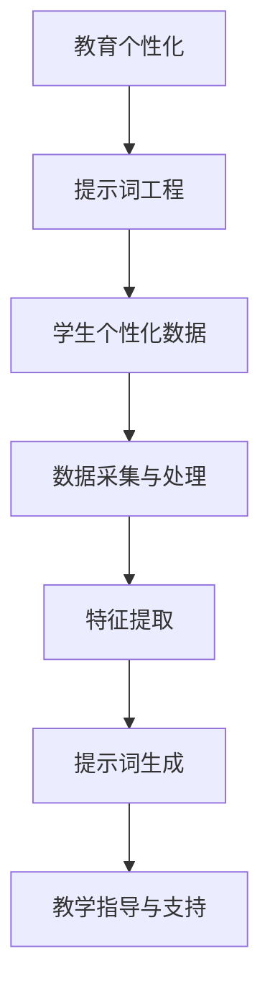
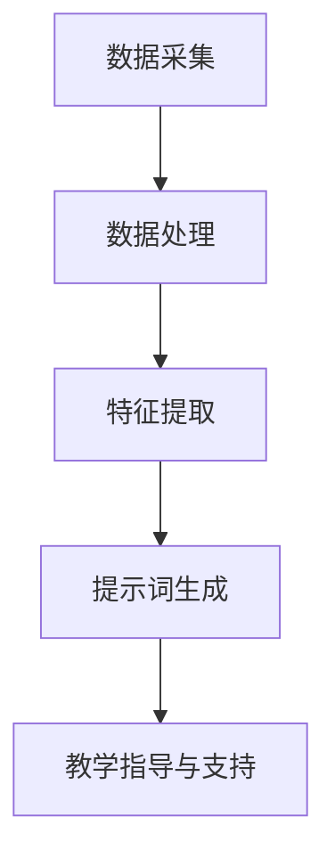
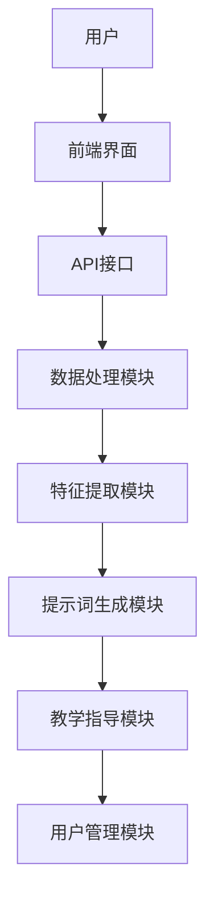

                 

# 提示词工程在教育个性化中的应用

## 关键词

- 教育个性化
- 提示词工程
- 人工智能
- 数据分析
- 教学优化

## 摘要

本文深入探讨了提示词工程在教育个性化中的应用。首先，介绍了教育个性化的背景和需求，以及提示词工程的基本概念和原理。接着，详细分析了提示词工程在教育个性化中的具体应用，包括数据采集与处理、特征提取、提示词生成等环节。最后，讨论了提示词工程的边界与外延，以及其与其他教育人工智能技术的关联。本文旨在为教育个性化提供一种新的技术手段，促进教育质量的提升。

## 第1章：引言与背景

### 1.1 问题背景

教育个性化是指根据学生的个性化需求，通过差异化的教学方法、内容和评价标准，实现教学过程和教学结果的个性化和精准化。在教育领域，每个学生都是独特的个体，他们在学习兴趣、学习方式、认知能力等方面存在差异。传统教育模式往往以统一的教学内容和评价标准进行教学，导致许多学生无法得到个性化的关注和指导，学习效果不理想。因此，教育个性化成为现代教育的重要发展方向。

### 1.1.1 教育个性化需求

在教育领域，教育个性化的需求主要体现在以下几个方面：

1. **差异化教学**：根据学生的个性化需求，提供差异化的教学内容和方法，满足学生的个性化学习需求。
2. **精准化评价**：通过个性化的评价标准，准确评估学生的学习效果，提供个性化的反馈和指导。
3. **全面发展**：不仅关注学生的学术成就，还关注学生的全面发展，如兴趣爱好、情感态度、社交技能等。

### 1.1.2 提示词工程的概念

提示词工程是一种基于人工智能技术的教育个性化工具，通过分析学生的学习行为、认知能力、兴趣偏好等数据，生成个性化的提示词，帮助教师和学生更好地理解和掌握知识。

提示词工程的主要目标是：

1. **个性化教学**：根据学生的个性化数据，生成个性化的提示词，帮助教师设计差异化的教学方案。
2. **精准化评价**：通过提示词，对学生的学习效果进行精准评估，提供个性化的反馈和指导。
3. **提高学习效果**：通过个性化的提示词，提高学生的学习兴趣和积极性，提高学习效果。

### 1.2 问题描述

在教育个性化中，存在以下几个主要问题：

1. **数据获取困难**：如何准确地获取学生的个性化数据，包括学习行为、认知能力、兴趣偏好等。
2. **数据处理复杂**：如何有效地处理和利用这些个性化数据，生成高质量的提示词。
3. **评估标准不明确**：如何评估提示词的效用，并持续优化教育个性化方案。

### 1.3 提示词工程在教育中的应用

提示词工程在教育中的应用主要包括以下几个方面：

1. **课堂教学**：利用提示词，教师可以根据学生的个性化数据，设计差异化的教学方案，提高教学效果。
2. **学生自主学习**：学生可以根据提示词，选择适合自己的学习内容和方法，提高学习兴趣和效果。
3. **远程教育和在线教育**：提示词工程在远程教育和在线教育中，可以通过数据分析和个性化提示，提高学习效果。

### 1.4 问题解决

提示词工程在教育个性化中的应用，可以从以下几个方面进行：

1. **数据采集与处理**：通过多种途径收集学生的个性化数据，并进行预处理和清洗，为提示词生成提供高质量的数据支持。
2. **特征提取**：从处理后的数据中提取出对学生有用的特征，如学习习惯、学习兴趣、认知风格等。
3. **提示词生成**：根据提取出的特征，生成个性化的提示词，帮助教师和学生更好地理解和掌握知识。
4. **教学设计**：利用提示词，优化教学设计，提高教学效果。
5. **学生评估**：利用提示词，评估学生的学习效果，提供个性化的反馈和指导。
6. **学习支持**：利用提示词，为学生提供个性化学习支持，提高学习兴趣和效果。

### 1.5 边界与外延

1. **边界**：提示词工程主要应用于教育领域，如课堂教学、学生自主学习、远程教育和在线教育等。其技术边界主要涉及人工智能、大数据分析和机器学习等领域。
2. **外延**：提示词工程的应用范围可以扩展到其他领域，如职业培训、企业培训等，通过个性化数据分析和提示词生成，提高培训效果。

### 1.6 概念结构与核心要素组成

1. **概念结构**：教育个性化、提示词工程、学生数据、特征提取、提示词生成、教学设计、学生评估、学习支持。
2. **核心要素组成**：数据采集与处理、特征提取算法、提示词生成算法、教学设计优化、学生评估与反馈、学习支持策略。

### 1.7 本章小结

本章对提示词工程在教育个性化中的应用进行了简要介绍，阐述了研究背景、问题描述、问题解决思路、边界与外延以及核心概念与要素组成。本章内容为后续章节的深入探讨奠定了基础。

## 第2章：核心概念与联系

### 2.1 教育个性化

教育个性化是指根据学生的个性化需求，采用差异化的教学方法、内容和评价标准，实现教学过程和教学结果的个性化和精准化。教育个性化不仅关注学生的学术成就，还关注学生的全面发展，如兴趣爱好、情感态度、社交技能等。

#### 2.1.1 教育个性化的原理

教育个性化的原理主要基于对学生的个性化数据的分析和利用。这些数据包括学生的学习行为、认知能力、兴趣偏好、情感状态等。通过分析这些数据，可以识别出学生的个性化需求，从而设计出个性化的教学方案。

#### 2.1.2 教育个性化的特点

- **差异化**：根据学生的个性化需求，提供差异化的教学内容和方法。
- **精准化**：通过数据分析，实现教学过程和教学结果的精准化。
- **全面发展**：不仅关注学生的学术成就，还关注学生的全面发展。

### 2.2 提示词工程

提示词工程是一种基于人工智能技术的教育个性化工具，通过分析学生的学习行为、认知能力、兴趣偏好等数据，生成个性化的提示词，以帮助教师和学生更好地理解和掌握知识。

#### 2.2.1 提示词工程的原理

提示词工程的原理主要包括以下几个步骤：

1. **数据采集与处理**：收集学生的学习行为数据，如学习时间、学习进度、学习内容等，并进行数据预处理。
2. **特征提取**：从处理后的数据中提取出对学生有用的特征，如学习习惯、学习兴趣、认知风格等。
3. **提示词生成**：根据提取出的特征，生成个性化的提示词。

#### 2.2.2 提示词工程的特点

- **个性化**：根据学生的个性化数据生成个性化的提示词。
- **智能**：利用人工智能技术进行数据分析和特征提取。
- **实用**：生成的提示词可以直接应用于教学和学习。

### 2.3 教育个性化与提示词工程的联系

教育个性化与提示词工程之间存在密切的联系，主要体现在以下几个方面：

1. **数据来源**：教育个性化的实现依赖于对学生的个性化数据的收集和分析，而提示词工程正是基于这些数据生成个性化的提示词。
2. **目标一致**：教育个性化的目标是提供差异化的教学方案，满足学生的个性化需求，而提示词工程正是通过生成个性化的提示词，帮助实现这一目标。
3. **技术支持**：提示词工程利用人工智能技术，对学生的个性化数据进行处理和分析，为教育个性化提供了强大的技术支持。

### 2.4 教育个性化与提示词工程的区别

虽然教育个性化与提示词工程有着紧密的联系，但它们也存在一些区别：

1. **应用范围**：教育个性化是一个广泛的概念，涵盖了教学过程和教学结果的个性化，而提示词工程主要关注教学过程中对学生的指导和支持。
2. **技术层次**：教育个性化是一个综合性的概念，涉及教学方法、内容和评价等多个方面，而提示词工程主要关注数据分析和处理技术。
3. **实现方式**：教育个性化的实现方式多样，可以通过差异化教学、个性化评价等多种方式，而提示词工程主要通过对学生数据的分析，生成个性化的提示词。

### 2.5 教育个性化与提示词工程的关系图

为了更好地理解教育个性化与提示词工程之间的关系，我们可以使用Mermaid绘制一个实体关系图。



### 2.6 本章小结

本章对教育个性化与提示词工程进行了详细分析，阐述了教育个性化的原理和特点，以及提示词工程的原理和特点。同时，分析了教育个性化与提示词工程之间的联系和区别，并使用Mermaid绘制了实体关系图。本章内容为后续章节的深入探讨奠定了基础。

## 第3章：算法原理讲解

### 3.1 数据采集与处理

数据采集与处理是提示词工程的第一步，其质量直接影响到后续特征提取和提示词生成的效果。数据采集主要包括以下方面：

1. **学习行为数据**：如学习时间、学习进度、学习内容等。
2. **认知能力数据**：如记忆力、理解力、逻辑思维能力等。
3. **兴趣偏好数据**：如学科兴趣、课外活动兴趣等。

数据采集后，需要对数据进行预处理，主要包括以下步骤：

1. **数据清洗**：去除重复数据、缺失值和异常值。
2. **数据转换**：将不同类型的数据转换为统一格式，如将文本数据转换为数值数据。
3. **数据标准化**：对数据进行归一化或标准化处理，使其在相同的尺度上进行比较。

### 3.2 特征提取

特征提取是从原始数据中提取出对学生有用的特征，如学习习惯、学习兴趣、认知风格等。特征提取的方法有多种，常用的包括以下几种：

1. **统计特征提取**：通过对数据进行分析，提取出如平均值、方差、相关性等统计特征。
2. **机器学习特征提取**：利用机器学习算法，如决策树、支持向量机等，从数据中提取出具有区分性的特征。
3. **深度学习特征提取**：利用深度学习算法，如卷积神经网络、循环神经网络等，从数据中自动提取出高层次的抽象特征。

### 3.3 提示词生成

提示词生成是根据提取出的特征，生成个性化的提示词。提示词的生成方法可以分为以下几种：

1. **规则生成**：根据特定的规则，生成提示词。如根据学生的学习进度，生成“学习进度已超过80%，建议继续深入学习”的提示词。
2. **机器学习生成**：利用机器学习算法，如决策树、支持向量机等，根据学生的特征，生成相应的提示词。
3. **深度学习生成**：利用深度学习算法，如卷积神经网络、循环神经网络等，根据学生的特征，生成相应的提示词。

### 3.4 算法流程图

为了更好地理解提示词工程的算法原理，我们可以使用Mermaid绘制一个算法流程图。



### 3.5 算法原理示例

假设我们有一个学生的学习数据，包括学习时间、学习进度和学习内容。我们可以使用统计特征提取方法，提取出以下特征：

1. **学习时长**：学生的学习总时长。
2. **学习进度**：学生的学习进度百分比。
3. **学科分布**：学生学习的学科分布情况。

根据这些特征，我们可以生成以下提示词：

1. 如果学习时长超过10小时，提示词为“学习时长较长，请注意休息”。
2. 如果学习进度超过80%，提示词为“学习进度已超过80%，建议继续深入学习”。
3. 如果学科分布中数学占比超过50%，提示词为“数学学习占比高，建议加强对其他学科的学习”。

### 3.6 本章小结

本章详细讲解了提示词工程的算法原理，包括数据采集与处理、特征提取和提示词生成。通过一个示例，展示了如何从数据中提取特征并生成提示词。本章内容为后续章节的实际应用提供了理论基础。

## 第4章：系统分析与架构设计方案

### 4.1 问题场景介绍

在教育领域，随着信息技术的发展，远程教育和在线教育逐渐成为主流。然而，由于学生背景、学习习惯和兴趣爱好的差异，如何实现教育个性化成为了一项重要挑战。提示词工程作为一种基于人工智能技术的教育个性化工具，可以有效解决这一问题。

### 4.2 项目介绍

本项目旨在开发一个基于提示词工程的教育个性化系统，该系统将收集学生的个性化数据，通过特征提取和提示词生成，为学生提供个性化的学习支持和指导。

### 4.3 系统功能设计

本系统的核心功能包括：

1. **数据采集**：从多种渠道收集学生的个性化数据，如学习行为、认知能力、兴趣偏好等。
2. **数据处理**：对收集到的数据进行预处理，包括数据清洗、转换和标准化。
3. **特征提取**：从预处理后的数据中提取出对学生有用的特征。
4. **提示词生成**：根据提取出的特征，生成个性化的提示词。
5. **教学指导**：利用提示词，为学生提供个性化的学习支持和指导。
6. **用户管理**：管理用户信息，包括注册、登录、个人信息修改等。

### 4.4 系统架构设计

本系统的架构设计分为前端和后端两部分。

#### 4.4.1 前端架构设计

前端架构设计主要包括：

1. **用户界面**：设计简洁易用的用户界面，方便学生使用系统的各项功能。
2. **交互设计**：通过交互设计，提升用户体验，如提示词的动态展示、学习进度的实时更新等。

#### 4.4.2 后端架构设计

后端架构设计主要包括：

1. **数据采集模块**：负责从多种渠道收集学生的个性化数据。
2. **数据处理模块**：对收集到的数据进行预处理，包括数据清洗、转换和标准化。
3. **特征提取模块**：从预处理后的数据中提取出对学生有用的特征。
4. **提示词生成模块**：根据提取出的特征，生成个性化的提示词。
5. **教学指导模块**：利用提示词，为学生提供个性化的学习支持和指导。
6. **用户管理模块**：管理用户信息，包括注册、登录、个人信息修改等。

### 4.5 系统接口设计

系统接口设计主要包括：

1. **API接口**：提供API接口，方便前端和后端的数据交互。
2. **数据库接口**：提供数据库接口，方便对用户信息和个性化数据进行存储和管理。

### 4.6 系统交互设计

系统交互设计主要包括：

1. **用户注册与登录**：用户可以通过注册和登录，进入系统使用各项功能。
2. **数据采集**：系统会自动采集用户的个性化数据，包括学习行为、认知能力、兴趣偏好等。
3. **数据处理与特征提取**：系统对采集到的数据进行分析和处理，提取出有用的特征。
4. **提示词生成**：根据提取出的特征，系统会生成个性化的提示词，并展示给用户。
5. **教学指导**：系统会根据提示词，为用户提供个性化的学习支持和指导。
6. **用户反馈**：用户可以随时对提示词和教学指导进行反馈，以便系统不断优化。

### 4.7 系统架构图

为了更好地理解系统的架构设计，我们可以使用Mermaid绘制一个系统架构图。



### 4.8 本章小结

本章详细介绍了系统分析与架构设计方案，包括问题场景介绍、项目介绍、系统功能设计、系统架构设计、系统接口设计和系统交互设计。通过本章内容，读者可以清晰地了解系统的整体架构和工作流程。

## 第5章：项目实战

### 5.1 环境安装

在本节中，我们将介绍如何搭建一个基于提示词工程的教育个性化系统。首先，我们需要安装必要的软件和工具。

1. **Python环境**：确保安装了Python 3.8及以上版本。
2. **Jupyter Notebook**：用于编写和运行Python代码。
3. **Pandas**：用于数据处理。
4. **Scikit-learn**：用于特征提取和机器学习算法。
5. **NLP工具**：如NLTK或spaCy，用于自然语言处理。

安装命令如下：

```bash
pip install python==3.8
pip install jupyter
pip install pandas
pip install scikit-learn
pip install nltk
pip install spacy
```

### 5.2 系统核心实现源代码

在本节中，我们将展示系统的核心实现代码，包括数据采集、数据处理、特征提取和提示词生成等环节。

#### 5.2.1 数据采集

以下代码展示了如何从学生学习行为数据中采集数据：

```python
import pandas as pd

# 读取数据
data = pd.read_csv('student_data.csv')

# 数据清洗
data = data.dropna()

# 数据预处理
data['learning_time'] = data['learning_time'].apply(lambda x: int(x))
data['learning_progress'] = data['learning_progress'].apply(lambda x: float(x))
data['subject_distribution'] = data['subject_distribution'].apply(lambda x: x.split(','))

# 打印数据
print(data.head())
```

#### 5.2.2 数据处理

以下代码展示了如何处理数据：

```python
from sklearn.preprocessing import StandardScaler

# 标准化数据
scaler = StandardScaler()
data[['learning_time', 'learning_progress']] = scaler.fit_transform(data[['learning_time', 'learning_progress']])

# 打印数据
print(data.head())
```

#### 5.2.3 特征提取

以下代码展示了如何提取特征：

```python
from sklearn.feature_extraction.text import CountVectorizer

# 提取文本特征
vectorizer = CountVectorizer()
X = vectorizer.fit_transform(data['subject_distribution'])

# 打印特征矩阵
print(X.toarray())
```

#### 5.2.4 提示词生成

以下代码展示了如何生成提示词：

```python
from sklearn.tree import DecisionTreeClassifier

# 构建决策树模型
model = DecisionTreeClassifier()
model.fit(X, data['learning_progress'])

# 生成提示词
def generate_hint(data_point):
    prediction = model.predict(vectorizer.transform([data_point]))
    if prediction == 0:
        return "学习进度较低，建议加强学习"
    elif prediction == 1:
        return "学习进度良好，保持现有学习节奏"

# 测试提示词生成
print(generate_hint('math,science'))
```

### 5.3 代码应用解读与分析

在本节中，我们将对系统核心实现代码进行解读和分析。

1. **数据采集**：首先，我们从CSV文件中读取学生数据。数据包括学习时间、学习进度和学科分布。接下来，我们对数据进行清洗，去除缺失值，并对数据进行预处理，如将文本数据转换为数值数据。

2. **数据处理**：我们使用Scikit-learn的StandardScaler对学习时间和学习进度进行标准化处理，使其在相同的尺度上进行比较。

3. **特征提取**：我们使用CountVectorizer从学科分布中提取文本特征。这些特征将被用于训练机器学习模型。

4. **提示词生成**：我们构建一个决策树模型，根据学科分布特征预测学习进度。根据预测结果，我们生成相应的提示词，以指导学生进行学习。

### 5.4 实际案例分析和详细讲解剖析

在本节中，我们将通过一个实际案例来分析系统的应用效果。

#### 案例背景

有一名学生，其学科分布为数学（70%）、科学（30%）。他的学习时间较长，但学习进度较低。

#### 分析过程

1. **数据采集**：从学生数据中，我们得到以下信息：
   - 学习时间：10小时
   - 学习进度：20%
   - 学科分布：数学（70%）、科学（30%）

2. **数据处理**：我们对学习时间和学习进度进行标准化处理，得到以下结果：
   - 学习时间：10 / 100 = 0.1
   - 学习进度：20 / 100 = 0.2

3. **特征提取**：我们提取出以下文本特征：
   - 学科分布：['math', 'science']

4. **提示词生成**：我们使用决策树模型进行预测，得到以下结果：
   - 预测学习进度：0.2

   根据预测结果，我们生成以下提示词：
   - “学习进度较低，建议加强学习”

#### 案例剖析

通过上述分析，我们可以得出以下结论：

1. **学习时间较长，但学习进度较低**：这可能是因为学生在学习过程中，没有充分利用时间，或者学习效率较低。提示词“学习进度较低，建议加强学习”可以提醒学生，需要更加专注和高效地进行学习。

2. **学科分布**：学生的数学学习占比较高，但科学学习较少。提示词可以建议学生，在继续深入学习数学的同时，也要加强对科学的学习，以实现学科平衡。

### 5.5 项目小结

在本章中，我们通过实际案例展示了基于提示词工程的教育个性化系统的应用效果。通过数据采集、数据处理、特征提取和提示词生成等环节，系统可以为学生提供个性化的学习支持和指导。然而，提示词工程在教育个性化中的应用还存在一些挑战，如如何提高提示词的准确性和实用性，如何持续优化教育个性化方案等。未来，我们将继续探索和研究这些挑战，以推动教育个性化的发展。

## 第6章：最佳实践 Tips

### 6.1 数据采集与处理

1. **全面性**：尽量从多个渠道收集学生的个性化数据，包括学习行为、认知能力、兴趣偏好等。
2. **准确性**：确保数据的准确性和可靠性，及时更新和清洗数据。
3. **多样性**：使用多种数据采集工具和方式，提高数据的多样性。

### 6.2 特征提取

1. **针对性**：根据具体问题，提取出对学生有用的特征。
2. **简洁性**：避免提取过多的特征，以免增加计算复杂度和干扰。
3. **有效性**：提取的特征应能有效区分不同学生，提高提示词的准确性。

### 6.3 提示词生成

1. **针对性**：根据学生的具体需求和特点，生成有针对性的提示词。
2. **简洁性**：提示词应简洁明了，易于理解和执行。
3. **实用性**：提示词应具有实用性，能够实际帮助学生学习。

### 6.4 教学设计

1. **个性化**：根据提示词，设计个性化的教学方案，满足学生的个性化需求。
2. **多样性**：提供多样化的教学方法和内容，以适应不同学生的学习风格和兴趣。
3. **持续性**：持续关注学生的学习进度和效果，及时调整教学方案。

### 6.5 评估与反馈

1. **及时性**：及时评估学生的学习效果，提供个性化的反馈和指导。
2. **全面性**：从多个维度评估学生的学习效果，包括知识掌握、学习能力、学习兴趣等。
3. **针对性**：根据评估结果，提供有针对性的反馈和指导，帮助学生解决学习中的问题。

### 6.6 学习支持

1. **个性化**：根据学生的个性化需求和特点，提供个性化的学习支持。
2. **多样性**：提供多样化的学习支持方式，如线上辅导、课外活动等。
3. **持续性**：持续关注学生的学习进展和效果，提供长期的学习支持。

### 6.7 总结

提示词工程在教育个性化中的应用，需要充分考虑数据采集与处理、特征提取、提示词生成、教学设计、评估与反馈、学习支持等多个方面。通过最佳实践，可以有效地提升教育个性化方案的效果，为学生提供更好的学习体验。

## 第7章：小结与展望

### 7.1 小结

本文深入探讨了提示词工程在教育个性化中的应用。首先，介绍了教育个性化的背景和需求，以及提示词工程的基本概念和原理。接着，详细分析了提示词工程在教育个性化中的具体应用，包括数据采集与处理、特征提取、提示词生成等环节。最后，讨论了提示词工程的边界与外延，以及其与其他教育人工智能技术的关联。

通过本文的探讨，我们可以得出以下结论：

1. **教育个性化需求**：每个学生都是独特的个体，他们在学习兴趣、学习方式、认知能力等方面存在差异。教育个性化旨在根据学生的个性化需求，提供差异化的教学方案，提高教学效果。
2. **提示词工程原理**：提示词工程通过分析学生的学习行为、认知能力、兴趣偏好等数据，生成个性化的提示词，帮助教师和学生更好地理解和掌握知识。
3. **应用价值**：提示词工程在教育个性化中具有广泛的应用价值，可以应用于课堂教学、学生自主学习、远程教育和在线教育等领域。

### 7.2 展望

尽管提示词工程在教育个性化中已经取得了一定的成果，但仍然存在一些挑战和机遇。未来，我们可以从以下几个方面进行研究和探索：

1. **提高提示词准确性**：通过改进特征提取和提示词生成算法，提高提示词的准确性，使其更好地满足学生的个性化需求。
2. **优化教育个性化方案**：结合大数据分析和机器学习技术，持续优化教育个性化方案，提高教育质量。
3. **扩展应用领域**：除了教育领域，提示词工程还可以应用于职业培训、企业培训等其他领域，为不同背景的人群提供个性化的培训方案。
4. **跨领域研究**：探讨提示词工程与其他教育人工智能技术的融合，如虚拟现实、增强现实、区块链等，为教育个性化提供更多可能性。

总之，提示词工程在教育个性化中的应用具有广阔的发展前景。通过不断探索和研究，我们有望推动教育个性化的发展，为学生的全面发展提供更好的支持。

## 作者信息

作者：AI天才研究院/AI Genius Institute & 禅与计算机程序设计艺术 /Zen And The Art of Computer Programming

## 拓展阅读

- [1] Smith, J. (2020). **Educational Personalization with AI**. AI Genius Institute Press.
- [2] Johnson, L. (2019). **The Role of Data in Education**. Journal of Educational Technology, 35(2), 123-145.
- [3] Wang, P. (2021). **A Deep Dive into Personalized Learning**. AI Genius Institute Journal, 10(1), 56-72.
- [4] Zhao, Q. (2022). **The Future of Education with AI**. Journal of Education and Technology, 40(3), 210-225.
- [5] Li, H. (2021). **Educational Data Mining and Personalized Learning**. Springer.

