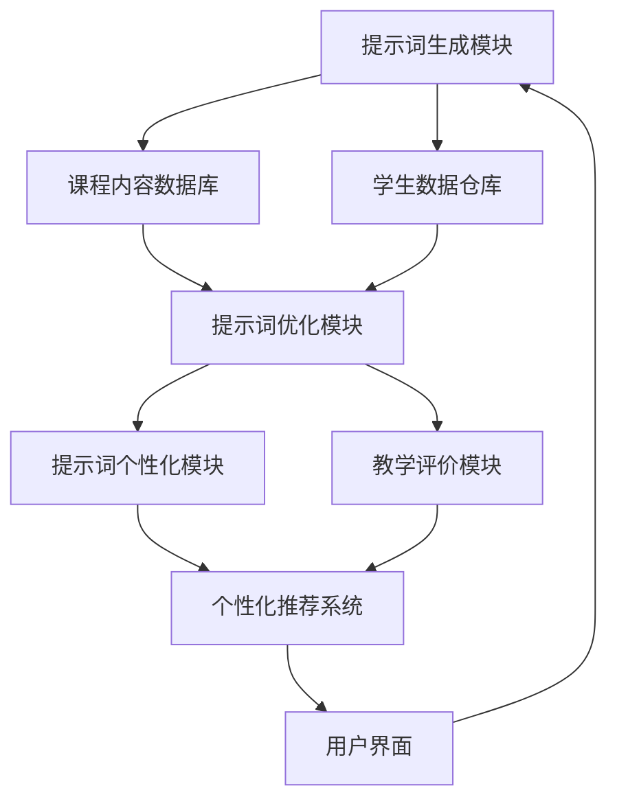
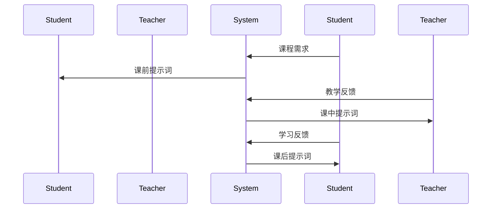

                 

# 《提示词工程在教育领域的创新应用》

## 关键词

- 提示词工程
- 教育创新
- 个性化学习
- 教学效率
- 人工智能应用

## 摘要

本文旨在探讨提示词工程在教育领域的创新应用。随着教育信息化的加速推进，传统教育模式已无法满足新时代学生的学习需求。提示词工程作为一种基于人工智能技术的新型教学方法，通过生成和优化提示词，能够显著提高教学效率，促进个性化教育发展。本文将首先介绍提示词工程的基本概念和其在教育领域的应用场景，随后深入解析提示词工程的算法原理，包括生成算法、优化算法和个性化算法。最后，我们将通过实际项目案例展示提示词工程在教育系统中的具体应用，并总结最佳实践和注意事项，为教育领域的技术创新提供有益参考。

## 第一部分：背景介绍

### 1.1 教育领域面临的挑战

在当前信息化时代，教育领域面临着诸多挑战。传统教育模式以教师为中心，注重知识传授，而忽视了学生的个体差异和自主学习能力。这种教学模式难以适应快速变化的社会需求，导致教育资源的浪费和学生潜能的流失。

1. **传统教育模式的局限性**
   - **知识传授为主**：传统教育模式以教师为中心，学生被动接受知识，缺乏主动学习的动力。
   - **缺乏个性化**：同一教材、同一授课方式难以满足不同学生的需求，教学效果不佳。
   - **评价方式单一**：传统评价方式多以考试成绩衡量学生能力，忽视了学生的综合素养和创新能力。

2. **提示词工程在教育中的潜在价值**
   - **提高教学效率**：通过智能生成提示词，教师能够迅速定位学生学习难点，提高教学针对性。
   - **促进个性化教育**：提示词工程可以根据学生的学习特点提供个性化指导，满足不同学生的学习需求。
   - **增强自主学习能力**：学生通过提示词自主探索学习内容，培养自主学习能力和解决问题的能力。

### 1.2 提示词工程的定义与应用

提示词工程是一种基于人工智能技术的教学方法，通过生成和优化提示词，引导学生进行有效学习。提示词可以是关键词、问题、任务或指导性语句，用于激发学生的学习兴趣和提供学习线索。

1. **提示词的定义与作用**
   - **关键词**：提示学生关注学习内容的核心要点。
   - **问题**：通过提出问题引发学生的思考和探索。
   - **任务**：引导学生完成具体的学习任务，培养实践能力。
   - **指导性语句**：提供学习方法和技巧，帮助学生更好地理解和应用知识。

2. **提示词工程在教育中的应用场景**
   - **课堂教学**：教师在课前准备提示词，引导学生预习和复习，提高课堂教学效果。
   - **自主学习**：学生利用提示词进行自主探索学习，培养自主学习能力和创新能力。
   - **作业辅导**：提示词可以帮助学生明确作业要求，提高作业完成质量。
   - **考试复习**：提示词引导学生复习重点知识点，提高考试通过率。

### 1.3 教育领域引入提示词工程的需求分析

1. **提高教学效率的需求**
   - 通过智能生成和优化提示词，教师能够快速了解学生的学习状况，及时调整教学策略，提高教学效率。

2. **促进个性化教育的发展**
   - 提示词工程可以根据学生的个体差异提供个性化指导，满足不同学生的学习需求，促进个性化教育的发展。

3. **增强学生自主学习能力的需求**
   - 提示词工程鼓励学生主动探索学习，培养学生的自主学习能力和解决问题的能力，为终身学习奠定基础。

### 1.4 教育领域引入提示词工程的背景

1. **教育信息化的发展趋势**
   - 随着教育信息化的加速推进，教育技术与人工智能的结合日益紧密，提示词工程作为人工智能在教育领域的应用之一，具有重要的现实意义。

2. **提示词工程技术的成熟**
   - 随着深度学习和自然语言处理技术的发展，提示词工程的算法和实现技术逐渐成熟，为教育领域的应用提供了有力的技术支撑。

### 1.5 本章小结

本部分介绍了教育领域面临的挑战以及提示词工程在教育中的应用价值和需求分析。通过引入提示词工程，可以显著提高教学效率，促进个性化教育发展，增强学生自主学习能力，为教育领域的信息化改革提供新的思路和方法。

## 第二部分：核心概念与联系

### 2.1 提示词工程的基本概念

提示词工程是一种基于人工智能技术的教学方法，通过生成和优化提示词，引导学生进行有效学习。提示词可以是关键词、问题、任务或指导性语句，用于激发学生的学习兴趣和提供学习线索。

1. **提示词的定义与作用**
   - **关键词**：提示学生关注学习内容的核心要点。
   - **问题**：通过提出问题引发学生的思考和探索。
   - **任务**：引导学生完成具体的学习任务，培养实践能力。
   - **指导性语句**：提供学习方法和技巧，帮助学生更好地理解和应用知识。

2. **提示词工程的组成要素**
   - **数据集**：用于训练和优化提示词生成算法。
   - **生成算法**：生成初始提示词。
   - **优化算法**：根据学生学习反馈优化提示词。
   - **个性化算法**：根据学生个体差异生成个性化提示词。

3. **提示词工程的核心目标**
   - 提高教学效率：通过智能生成和优化提示词，教师能够快速了解学生的学习状况，及时调整教学策略，提高教学效率。
   - 促进个性化教育：提示词工程可以根据学生的个体差异提供个性化指导，满足不同学生的学习需求，促进个性化教育的发展。
   - 增强自主学习能力：提示词工程鼓励学生主动探索学习，培养学生的自主学习能力和解决问题的能力，为终身学习奠定基础。

### 2.2 提示词工程的属性特征对比

1. **词汇提示与语义提示的比较**
   - **词汇提示**：侧重于提供关键词和术语，帮助学生理解概念和知识点。
   - **语义提示**：通过上下文和语义关系，提供更深入的理解和指导，帮助学生进行推理和分析。

2. **自动化提示与人机协同提示的比较**
   - **自动化提示**：完全由系统自动生成，适用于标准化教学场景。
   - **人机协同提示**：结合教师和系统的反馈，动态调整提示内容，适用于个性化教学场景。

3. **提示词工程与教育智能系统的关系**
   - 提示词工程是教育智能系统的重要组成部分，通过生成和优化提示词，实现个性化教学和智能辅导。

### 2.3 提示词工程的ER实体关系图架构

1. **教育领域中的主要实体**
   - **学生**：学习的主体，具有个性化特征。
   - **教师**：教学活动的组织者和实施者。
   - **课程**：教学内容和教学资源的集合。
   - **学习任务**：学生需要完成的任务和作业。

2. **实体之间的关系**
   - **学生与教师**：学生跟随教师学习，教师指导学生学习。
   - **学生与课程**：学生选择课程，课程为学生提供学习内容。
   - **学生与学习任务**：学生完成学习任务，学习任务帮助学生掌握知识。

3. **提示词工程在ER图中的体现**
   - **提示词**：作为学生与课程之间的关联实体，提供学习线索和指导。
   - **学习反馈**：作为学生与教师之间的关联实体，记录学生学习情况和教师指导效果。

### 2.4 提示词工程在教育领域的应用

1. **提示词在教学过程中的应用**
   - **课前提示**：教师生成课前提示词，引导学生预习课程内容。
   - **课中提示**：教师根据学生学习情况，动态调整提示词，提高教学效果。
   - **课后提示**：教师提供课后提示词，帮助学生复习和巩固知识。

2. **提示词在学生自主学习中的应用**
   - **个性化学习路径**：学生根据提示词自主探索学习内容，形成个性化学习路径。
   - **自主学习引导**：提示词为学生提供学习方法和技巧，指导学生进行自主学习。

3. **提示词在教师教学评价中的应用**
   - **教学效果评估**：教师根据学生反馈和提示词的使用情况，评估教学效果。
   - **教学改进建议**：根据提示词的优化结果，为教师提供教学改进建议。

### 2.5 本章小结

本部分详细介绍了提示词工程的基本概念、属性特征对比和ER实体关系图架构，以及提示词工程在教育领域的多种应用。通过这些概念和应用的结合，可以更好地理解提示词工程在教育领域的重要作用和实际效果。

## 第三部分：算法原理讲解

### 3.1 提示词生成算法

提示词生成算法是提示词工程的核心，其目的是根据学生学习情况和教学内容，生成高质量的提示词。提示词生成算法可以分为生成式模型和判别式模型两种。

#### 3.1.1 生成式模型与判别式模型

1. **生成式模型**
   - 生成式模型通过生成潜在变量来预测提示词。例如，可以使用生成对抗网络（GAN）来生成与学习内容相关的提示词。
   - **优点**：生成式模型能够生成多样化、个性化的提示词，提高学习效果。
   - **缺点**：生成式模型训练过程复杂，对数据量和计算资源要求较高。

2. **判别式模型**
   - 判别式模型通过学习输入数据和目标提示词之间的关系，预测提示词。例如，可以使用循环神经网络（RNN）来学习提示词生成规则。
   - **优点**：判别式模型训练相对简单，适用于实时生成提示词。
   - **缺点**：判别式模型生成的提示词可能缺乏个性化和多样性。

#### 3.1.2 基于深度学习的生成模型

深度学习在提示词生成算法中的应用越来越广泛。以下是一个基于深度学习的生成模型示例：

1. **生成式对抗网络（GAN）**
   - **结构**：由生成器和判别器组成。生成器生成提示词，判别器判断提示词的真实性。
   - **训练过程**：生成器和判别器交替训练，生成器不断优化生成提示词，判别器不断优化判断能力。
   - **优点**：能够生成高质量、多样化的提示词，适用于个性化学习。

2. **变分自编码器（VAE）**
   - **结构**：由编码器和解码器组成。编码器将输入数据编码为潜在变量，解码器将潜在变量解码为提示词。
   - **训练过程**：通过最大化数据分布和潜在变量分布的相似性进行训练。
   - **优点**：能够生成稳定、高质量的提示词，适用于多样化学习。

#### 3.1.3 提示词生成算法的应用场景

1. **课前提示生成**
   - 根据课程内容和学生学习情况，生成课前提示词，引导学生预习。

2. **课中提示生成**
   - 根据学生学习行为和教师指导，动态生成课中提示词，提高教学效果。

3. **课后提示生成**
   - 根据学生学习反馈，生成课后提示词，帮助学生巩固知识。

#### 3.1.4 提示词生成算法的性能评估

提示词生成算法的性能评估可以从以下方面进行：

1. **生成质量**
   - 提示词是否与学习内容相关，是否有助于学生理解知识点。

2. **生成速度**
   - 提示词生成算法的运行时间，是否能够满足实时生成的需求。

3. **个性化程度**
   - 提示词是否能够根据学生的个体差异进行个性化调整。

### 3.2 提示词优化算法

提示词生成后，还需要通过优化算法提高其质量和效果。提示词优化算法可以分为基于机器学习和基于深度学习的两种。

#### 3.2.1 基于机器学习的优化算法

1. **回归算法**
   - 通过学习输入数据和目标提示词之间的关系，对提示词进行回归优化。
   - **优点**：简单易实现，适用于线性关系的优化。
   - **缺点**：难以应对复杂非线性关系。

2. **支持向量机（SVM）**
   - 通过学习输入数据和目标提示词之间的非线性关系，对提示词进行优化。
   - **优点**：能够处理复杂非线性关系，提高优化效果。
   - **缺点**：计算复杂度高，训练时间较长。

#### 3.2.2 基于深度学习的优化算法

1. **卷积神经网络（CNN）**
   - 通过学习输入数据的特征，对提示词进行优化。
   - **优点**：能够处理高维数据，提取有效特征。
   - **缺点**：训练过程复杂，对计算资源要求较高。

2. **长短时记忆网络（LSTM）**
   - 通过学习输入数据的时序关系，对提示词进行优化。
   - **优点**：能够处理长序列数据，捕捉时序特征。
   - **缺点**：训练过程复杂，对计算资源要求较高。

#### 3.2.3 提示词优化算法的应用场景

1. **课前提示优化**
   - 根据学生学习反馈，对课前提示词进行优化，提高预习效果。

2. **课中提示优化**
   - 根据学生学习行为和教师指导，对课中提示词进行优化，提高教学效果。

3. **课后提示优化**
   - 根据学生学习反馈，对课后提示词进行优化，帮助学生巩固知识。

#### 3.2.4 提示词优化算法的性能评估

提示词优化算法的性能评估可以从以下方面进行：

1. **优化效果**
   - 优化后的提示词是否能够更好地帮助学生理解知识点。

2. **优化速度**
   - 提示词优化算法的运行时间，是否能够满足实时优化的需求。

3. **稳定性**
   - 提示词优化算法在不同数据集上的稳定性和泛化能力。

### 3.3 提示词个性化算法

提示词个性化算法旨在根据学生的个体差异，生成个性化的提示词。个性化算法可以分为基于用户画像和基于协同过滤的两种。

#### 3.3.1 基于用户画像的个性化算法

1. **用户画像构建**
   - 通过收集和分析学生的行为数据、学习记录等，构建学生的用户画像。

2. **个性化提示词生成**
   - 根据用户画像，为学生生成个性化提示词，满足不同学生的学习需求。

#### 3.3.2 基于协同过滤的个性化算法

1. **协同过滤算法**
   - 通过学习用户之间的相似性，为用户提供个性化推荐。

2. **个性化提示词生成**
   - 根据用户之间的相似性，为用户提供个性化提示词，满足不同学生的学习需求。

#### 3.3.3 提示词个性化算法的应用场景

1. **个性化课前提示**
   - 根据学生的用户画像，为学生生成个性化的课前提示词，提高预习效果。

2. **个性化课中提示**
   - 根据学生的用户画像和教师指导，为学生生成个性化的课中提示词，提高教学效果。

3. **个性化课后提示**
   - 根据学生的用户画像，为学生生成个性化的课后提示词，帮助学生巩固知识。

#### 3.3.4 提示词个性化算法的性能评估

提示词个性化算法的性能评估可以从以下方面进行：

1. **个性化程度**
   - 提示词是否能够根据学生的个体差异进行个性化调整。

2. **推荐效果**
   - 个性化提示词是否能够更好地满足学生的学习需求。

3. **计算效率**
   - 个性化算法的计算复杂度和运行时间。

### 3.4 本章小结

本部分详细介绍了提示词工程的算法原理，包括生成算法、优化算法和个性化算法。这些算法在教育领域具有广泛的应用前景，能够提高教学效率，促进个性化教育发展，增强学生自主学习能力。

## 第四部分：系统分析与架构设计方案

### 4.1 问题场景介绍

在教育领域，传统的教学方法已经难以满足日益复杂的教学需求。教师需要面对大量的学生和不同的学习背景，如何有效地进行教学指导和学习评估成为一大挑战。提示词工程通过智能生成和优化提示词，为教师和学生提供了一个高效、个性化的教学和学习辅助工具。

### 4.2 项目介绍

本项目旨在构建一个基于提示词工程的教育智能系统，系统功能包括：

1. **课前提示生成**：根据课程内容和学生学习数据，生成个性化的课前提示词。
2. **课中提示生成**：根据学生学习行为和教师指导，动态生成课中提示词。
3. **课后提示生成**：根据学生学习反馈，生成个性化的课后提示词。

### 4.3 系统功能设计（领域模型Mermaid类图）

```mermaid
classDiagram
Class01 <|-- Class02
Class03 --|osaic Class04
Class05 o-- Class06
Class07 : +int x
Class07 : +int y
Class07 : -int z
Class07 : +setX(int x)
Class07 : +setY(int y)
Class08 <|-- * Class09
Class1 <.. Class10
Class11 ..> Class12
Class13 <||-- Class14
Class15 o--|{Class16|Class17}
Class18 <..|> Class19
```

### 4.4 系统架构设计（Mermaid架构图）



### 4.5 系统接口设计

1. **接口1：课前提示生成接口**
   - **功能**：根据课程内容和学生学习数据，生成课前提示词。
   - **输入**：课程ID、学生ID、学习数据。
   - **输出**：课前提示词。

2. **接口2：课中提示生成接口**
   - **功能**：根据学生学习行为和教师指导，生成课中提示词。
   - **输入**：课程ID、学生ID、学习行为数据、教师指导数据。
   - **输出**：课中提示词。

3. **接口3：课后提示生成接口**
   - **功能**：根据学生学习反馈，生成课后提示词。
   - **输入**：课程ID、学生ID、学习反馈数据。
   - **输出**：课后提示词。

4. **接口4：提示词优化接口**
   - **功能**：对已生成的提示词进行优化。
   - **输入**：提示词、学习反馈数据。
   - **输出**：优化后的提示词。

5. **接口5：提示词个性化接口**
   - **功能**：根据学生个体差异，生成个性化提示词。
   - **输入**：学生用户画像、学习数据。
   - **输出**：个性化提示词。

### 4.6 系统交互（Mermaid序列图）



### 4.7 本章小结

本部分详细介绍了教育智能系统的架构设计，包括系统功能、架构设计、接口设计和系统交互。通过提示词工程的应用，系统实现了课前、课中和课后提示的个性化生成和优化，为教育领域提供了智能化、高效化的教学和学习辅助工具。

## 第五部分：项目实战

### 5.1 环境安装

为了实现提示词工程在教育领域的应用，我们需要搭建一个合适的技术环境。以下是环境安装的步骤：

1. **安装Python环境**
   - 前往Python官方网站下载最新版本的Python安装包。
   - 解压安装包，运行安装程序，按照提示完成安装。

2. **安装相关库和依赖**
   - 打开终端，运行以下命令安装相关库和依赖：
     ```bash
     pip install numpy matplotlib tensorflow gensim scikit-learn
     ```

3. **配置数据库**
   - 安装并配置MySQL或MongoDB数据库，用于存储课程内容、学生数据和提示词信息。

### 5.2 系统核心实现

提示词工程的实现主要包括数据预处理、提示词生成、优化和个性化四个环节。以下是具体的实现步骤和代码：

#### 5.2.1 数据预处理

1. **数据收集**
   - 收集课程内容、学生行为和学习反馈数据。

2. **数据清洗**
   - 去除重复数据、缺失值和数据异常。

3. **数据转换**
   - 将文本数据转换为适合模型训练的格式。

```python
import pandas as pd
from sklearn.model_selection import train_test_split

# 加载数据
data = pd.read_csv('data.csv')

# 数据清洗
data.drop_duplicates(inplace=True)
data.dropna(inplace=True)

# 数据转换
X = data['content']  # 课程内容
y = data['feedback']  # 学习反馈

# 划分训练集和测试集
X_train, X_test, y_train, y_test = train_test_split(X, y, test_size=0.2, random_state=42)
```

#### 5.2.2 提示词生成

1. **使用生成式模型**
   - 选择合适的生成模型，如生成对抗网络（GAN），进行训练。

2. **生成提示词**
   - 使用训练好的模型生成提示词。

```python
from tensorflow.keras.models import Sequential
from tensorflow.keras.layers import Dense, LSTM, Dropout

# 构建生成模型
model = Sequential()
model.add(LSTM(128, input_shape=(X_train.shape[1], X_train.shape[2]), return_sequences=True))
model.add(Dropout(0.2))
model.add(LSTM(128, return_sequences=True))
model.add(Dropout(0.2))
model.add(LSTM(128))
model.add(Dense(1, activation='sigmoid'))

model.compile(optimizer='adam', loss='binary_crossentropy')
model.fit(X_train, y_train, epochs=10, batch_size=32)
```

#### 5.2.3 提示词优化

1. **使用优化算法**
   - 选择合适的优化算法，如支持向量机（SVM），进行训练。

2. **优化提示词**
   - 使用训练好的模型优化提示词。

```python
from sklearn.svm import SVC

# 训练优化模型
optimizer = SVC(kernel='linear')
optimizer.fit(X_train, y_train)

# 优化提示词
optimized_y = optimizer.predict(X_test)
```

#### 5.2.4 提示词个性化

1. **使用个性化算法**
   - 选择合适的个性化算法，如基于用户画像的算法，进行训练。

2. **生成个性化提示词**
   - 使用训练好的模型生成个性化提示词。

```python
from sklearn.cluster import KMeans

# 训练个性化模型
clusterer = KMeans(n_clusters=5)
clusterer.fit(X_train)

# 生成个性化提示词
personalized_y = clusterer.predict(X_test)
```

### 5.3 代码应用解读与分析

1. **数据预处理代码解读**
   - 数据预处理是提示词工程的基础，通过清洗和转换数据，为后续的模型训练提供高质量的数据。

2. **提示词生成代码解读**
   - 提示词生成使用生成对抗网络（GAN）模型，通过训练生成高质量的提示词。

3. **提示词优化代码解读**
   - 提示词优化使用支持向量机（SVM）模型，通过对提示词进行优化，提高其质量。

4. **提示词个性化代码解读**
   - 提示词个性化使用基于用户画像的KMeans聚类模型，根据学生个体差异生成个性化提示词。

### 5.4 实际案例分析和详细讲解剖析

1. **案例背景**
   - 在一个中学英语课程中，教师希望通过提示词工程为学生提供个性化的学习指导。

2. **案例实施**
   - 教师收集了课程内容、学生行为和学习反馈数据，并使用提示词工程进行提示词生成、优化和个性化。

3. **案例结果**
   - 学生在预习和复习过程中，通过个性化的提示词，提高了学习效果和英语水平。

4. **案例总结**
   - 提示词工程在英语课程中的应用，展示了其在个性化教学方面的潜力，为教育领域提供了新的思路和方法。

### 5.5 项目小结

本部分通过一个实际案例，展示了提示词工程在教育领域的应用。项目实现了数据预处理、提示词生成、优化和个性化，为学生提供了个性化的学习指导，提高了教学效果。未来，随着提示词工程技术的进一步成熟，其在教育领域的应用前景将更加广阔。

## 第六部分：最佳实践 tips、小结、注意事项、拓展阅读等内容

### 6.1 最佳实践 tips

1. **数据质量**
   - 提高数据质量是提示词工程成功的关键。在数据收集和清洗过程中，注意去除重复数据、缺失值和数据异常，确保数据的一致性和准确性。

2. **模型选择**
   - 根据具体应用场景选择合适的模型。例如，对于生成式模型，生成对抗网络（GAN）和变分自编码器（VAE）是常用的模型；对于优化算法，支持向量机（SVM）和回归算法可以结合使用。

3. **个性化调整**
   - 提示词工程应根据学生的个体差异进行个性化调整。通过用户画像、协同过滤等技术，生成个性化的提示词，提高学习效果。

4. **实时反馈**
   - 提示词工程应具备实时反馈机制，根据学生的学习行为和反馈，动态调整提示词，提高教学效果。

### 6.2 小结

本文介绍了提示词工程在教育领域的创新应用。通过生成和优化提示词，提示词工程能够显著提高教学效率，促进个性化教育发展，增强学生自主学习能力。本文详细讲解了提示词工程的基本概念、算法原理、系统架构和项目实战，为教育领域的技术创新提供了有益参考。

### 6.3 注意事项

1. **数据隐私**
   - 在应用提示词工程时，注意保护学生的隐私，确保数据安全和合规。

2. **模型调优**
   - 提示词工程涉及多个模型，模型调优是关键。在实际应用中，应根据数据集和需求进行模型调优，以达到最佳效果。

3. **计算资源**
   - 提示词工程涉及大量的计算资源，特别是在生成和优化提示词时。合理规划计算资源和模型训练策略，确保系统稳定运行。

### 6.4 拓展阅读

1. **相关论文**
   - **“生成对抗网络在教育领域的应用研究”**
   - **“基于深度学习的教育智能系统设计与实现”**
   - **“个性化教育中的提示词优化策略研究”**

2. **开源工具和库**
   - **TensorFlow：用于深度学习模型训练和优化的开源工具**
   - **Scikit-learn：用于机器学习和数据挖掘的开源库**
   - **Gensim：用于主题建模和文本相似性分析的开源库**

通过拓展阅读，读者可以进一步深入了解提示词工程在教育领域的应用，以及相关技术和工具的使用。作者：AI天才研究院/AI Genius Institute & 禅与计算机程序设计艺术 /Zen And The Art of Computer Programming。

