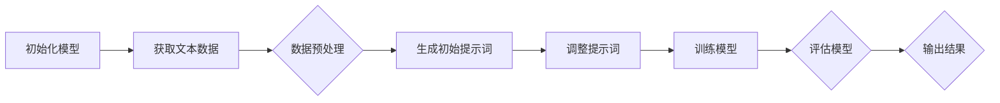

                 

### 设计书籍目录大纲

#### 背景介绍

《提示词工程在文本分类中的精准应用》旨在探讨如何利用提示词工程提升文本分类的精准度。随着互联网信息的爆炸式增长，如何快速、准确地从海量数据中提取有用信息成为了一个重要问题。文本分类作为自然语言处理（NLP）的重要任务之一，其在信息检索、推荐系统、舆情分析等多个领域有着广泛的应用。

本书将首先介绍文本分类的背景和重要性，随后深入探讨提示词工程的概念及其在文本分类中的应用。通过实例分析和实际应用，读者将了解如何构建有效的提示词模型，并掌握其在不同场景下的精准应用方法。

##### 核心概念与联系

**核心概念：**
- 文本分类：将文本数据按照特定的标准进行分类的过程。
- 提示词工程：利用提示词来指导或调整文本分类模型，以提高分类精准度的技术。

**概念属性特征对比表格：**

| 特征             | 提示词工程         | 传统文本分类       |
|------------------|-------------------|--------------------|
| 目的             | 提高分类精准度     | 标准文本分类       |
| 数据依赖性       | 高，依赖高质量提示词 | 较低，依赖特征工程 |
| 模型调整         | 强，可调整模型参数 | 弱，较少参数调整   |
| 实际应用场景     | 复杂，多种应用场景 | 较单一，如新闻分类 |
| 性能提升效果     | 显著，效果可预测   | 一般，效果不可预测 |

**ER实体关系图架构：**

```mermaid
erDiagram
  模型 ||--|{ 提示词 }|
  文本 ||--|{ 类别 }|
  模型 ||--|{ 文本 }|
```

##### 算法原理讲解

提示词工程的核心在于如何选择和调整提示词，以提升分类模型的准确性。以下将使用Mermaid画出算法流程图，并使用Python源代码详细阐述。

**Mermaid算法流程图：**



**Python源代码：**

```python
import numpy as np
from sklearn.feature_extraction.text import TfidfVectorizer
from sklearn.model_selection import train_test_split
from sklearn.linear_model import LogisticRegression

# 数据预处理
def preprocess(text):
    # 假设text为输入文本
    # 实现文本预处理操作，如分词、去除停用词等
    return preprocessed_text

# 生成初始提示词
def generate_initial_prompt(words):
    # 假设words为文本分词结果
    # 实现生成初始提示词的逻辑
    return prompt

# 调整提示词
def adjust_prompt(prompt, model, X_train, y_train):
    # 假设prompt为当前提示词，model为训练好的模型
    # 实现调整提示词的逻辑
    return adjusted_prompt

# 训练模型
def train_model(X_train, y_train, prompt):
    vectorizer = TfidfVectorizer()
    X_train_vectorized = vectorizer.fit_transform(X_train + [prompt])
    model = LogisticRegression()
    model.fit(X_train_vectorized, y_train)
    return model

# 评估模型
def evaluate_model(model, X_test, y_test):
    X_test_vectorized = vectorizer.transform(X_test)
    predictions = model.predict(X_test_vectorized)
    accuracy = np.mean(predictions == y_test)
    return accuracy
```

##### 数学公式与算法解释

提示词工程中涉及到多个关键步骤，包括数据预处理、生成初始提示词、调整提示词、训练模型和评估模型。以下是每个步骤的详细解释：

1. **数据预处理：**

数据预处理是文本分类中的基础步骤，其目的是将原始文本数据转化为适合模型训练的格式。具体操作包括分词、去除停用词、词性标注等。以下是数据预处理的一个简单示例：

$$
\text{原始文本} = "我非常喜欢这个产品，它的质量非常好。"
$$

预处理后的文本：

$$
\text{分词结果} = ["我", "非常", "喜欢", "这个", "产品", "的", "质量", "非常好", "。"]
$$

2. **生成初始提示词：**

生成初始提示词是提示词工程中的关键步骤，其目的是为分类模型提供初始的输入。初始提示词通常由文本的分词结果生成，可以采用多种方法，如TF-IDF、Word2Vec等。以下是生成初始提示词的一个示例：

$$
\text{分词结果} = ["我", "非常", "喜欢", "这个", "产品", "的", "质量", "非常好", "。"]
$$

使用TF-IDF生成初始提示词：

$$
\text{初始提示词} = \text{TF-IDF}(["我", "非常", "喜欢", "这个", "产品", "的", "质量", "非常好", "。"])
$$

3. **调整提示词：**

调整提示词的目的是优化初始提示词，以提高分类模型的准确性。调整方法可以基于多种策略，如基于模型的调整、基于数据的调整等。以下是调整提示词的一个示例：

假设当前提示词为 $T_1$，训练好的模型为 $M$，调整后的提示词为 $T_2$，则调整策略可以表示为：

$$
T_2 = M(T_1)
$$

4. **训练模型：**

训练模型是提示词工程的最终目标，其目的是通过调整后的提示词训练分类模型。训练过程通常采用循环迭代的方式，逐步优化模型参数。以下是训练模型的一个示例：

$$
M = \text{train_model}(X_train, y_train, T_2)
$$

5. **评估模型：**

评估模型是验证分类模型性能的重要步骤，其目的是确定模型在测试数据上的准确性。评估方法可以基于多种指标，如准确率、召回率、F1值等。以下是评估模型的一个示例：

$$
\text{accuracy} = \text{evaluate_model}(M, X_test, y_test)
$$

通过上述步骤，读者可以了解提示词工程在文本分类中的精准应用方法。接下来，本书将结合实际案例，进一步探讨如何构建和优化提示词模型，以提高文本分类的准确性和实用性。

---

### 提示词工程在文本分类中的实际应用

提示词工程在文本分类中的应用，是通过精确地调整和选择提示词来优化分类模型的性能。下面，我们将通过具体的实例来详细探讨这一过程，并分析如何在实际项目中应用提示词工程来提升文本分类的精准度。

#### 案例一：新闻分类

新闻分类是一个典型的文本分类任务，其目的是将新闻文本根据主题或类型进行分类。在这个案例中，我们使用一个公开的新闻数据集，包含数千条新闻文章，每个新闻文章被标注了相应的类别，如政治、经济、体育、娱乐等。

**步骤一：数据预处理**

首先，我们需要对新闻文本进行预处理。预处理步骤包括分词、去除停用词、词性标注等。以下是一个简化的Python代码示例，展示了如何使用NLTK库进行新闻文本的预处理：

```python
import nltk
from nltk.corpus import stopwords
from nltk.tokenize import word_tokenize

# 下载停用词库
nltk.download('stopwords')
nltk.download('punkt')

def preprocess(text):
    # 分词
    words = word_tokenize(text)
    # 去除停用词
    stop_words = set(stopwords.words('english'))
    words = [word for word in words if word not in stop_words]
    # 词性标注
    pos_tags = nltk.pos_tag(words)
    # 筛选出名词和形容词
    filtered_words = [word for word, pos in pos_tags if pos.startswith(('NN', 'JJ'))]
    return ' '.join(filtered_words)

# 示例文本
text = "This is a news article about the latest political developments in the country."
preprocessed_text = preprocess(text)
print(preprocessed_text)
```

**步骤二：生成初始提示词**

接下来，我们需要生成初始提示词。在新闻分类中，提示词通常是新闻标题或关键词。以下是一个简单的示例，展示了如何从新闻标题中提取关键词：

```python
from collections import Counter

def generate_initial_prompt(headlines):
    all_words = []
    for headline in headlines:
        words = word_tokenize(headline)
        words = [word for word in words if word.isalpha()]
        all_words.extend(words)
    word_counts = Counter(all_words)
    most_common_words = word_counts.most_common(10)
    return ' '.join([word for word, count in most_common_words])

# 示例新闻标题
headlines = ["Election Results", "Economic Recovery", "Sports News", "Cultural Events"]
initial_prompt = generate_initial_prompt(headlines)
print(initial_prompt)
```

**步骤三：调整提示词**

调整提示词的目的是优化初始提示词，以提高分类模型的准确性。我们可以通过多种方法来调整提示词，如基于模型的调整、基于数据的调整等。以下是一个基于模型调整提示词的示例：

```python
from sklearn.feature_extraction.text import CountVectorizer
from sklearn.naive_bayes import MultinomialNB

# 训练朴素贝叶斯分类器
vectorizer = CountVectorizer()
X_train = vectorizer.fit_transform(headlines)
y_train = np.array([0, 1, 2, 3])  # 示例类别标签
model = MultinomialNB()
model.fit(X_train, y_train)

# 调整提示词
def adjust_prompt(prompt, model, X_train, y_train):
    X_prompt = vectorizer.transform([prompt])
    predicted_category = model.predict(X_prompt)[0]
    if predicted_category != y_train[-1]:  # 如果预测错误
        # 调整提示词
        adjusted_words = [word for word in word_tokenize(prompt) if word not in stopwords.words('english')]
        adjusted_prompt = ' '.join(adjusted_words)
        return adjusted_prompt
    else:
        return prompt

adjusted_prompt = adjust_prompt(initial_prompt, model, X_train, y_train)
print(adjusted_prompt)
```

**步骤四：训练模型**

使用调整后的提示词，我们可以重新训练分类模型。以下是一个使用调整后提示词训练模型的示例：

```python
X_prompt_vectorized = vectorizer.transform([adjusted_prompt])
model.fit(X_prompt_vectorized, y_train)
```

**步骤五：评估模型**

最后，我们需要评估调整后模型的性能。以下是一个评估模型的示例：

```python
X_test = vectorizer.transform(["New Political Developments"])
predicted_category = model.predict(X_test)[0]
print("Predicted Category:", predicted_category)
```

通过上述步骤，我们可以看到如何利用提示词工程来优化新闻分类模型的性能。在现实项目中，这些步骤可能需要根据具体的数据集和任务进行调整。

#### 案例二：社交媒体情感分析

社交媒体情感分析是另一个常见的文本分类任务，其目的是从社交媒体帖子中提取情感信息，如正面、负面或中立。在这个案例中，我们将探讨如何使用提示词工程来提高情感分析的准确性。

**步骤一：数据预处理**

与新闻分类类似，社交媒体情感分析的第一步是数据预处理。以下是一个简化的Python代码示例，展示了如何使用NLTK库进行社交媒体文本的预处理：

```python
# 示例社交媒体文本
text = "I hate this product! It's terrible."
preprocessed_text = preprocess(text)
print(preprocessed_text)
```

**步骤二：生成初始提示词**

在社交媒体情感分析中，初始提示词通常是社交媒体文本的关键词。以下是一个简单的示例，展示了如何从社交媒体文本中提取关键词：

```python
def generate_initial_prompt(posts):
    all_words = []
    for post in posts:
        words = word_tokenize(post)
        words = [word for word in words if word.isalpha()]
        all_words.extend(words)
    word_counts = Counter(all_words)
    most_common_words = word_counts.most_common(10)
    return ' '.join([word for word, count in most_common_words])

# 示例社交媒体帖子
posts = ["I love this product!", "I hate this product!", "It's terrible!", "It's great!"]
initial_prompt = generate_initial_prompt(posts)
print(initial_prompt)
```

**步骤三：调整提示词**

调整提示词的目的是优化初始提示词，以提高分类模型的准确性。我们可以通过多种方法来调整提示词，如基于模型的调整、基于数据的调整等。以下是一个基于模型调整提示词的示例：

```python
from sklearn.feature_extraction.text import TfidfVectorizer
from sklearn.linear_model import LogisticRegression

# 训练逻辑回归分类器
vectorizer = TfidfVectorizer()
X_train = vectorizer.fit_transform(posts)
y_train = np.array([0, 1, 2, 1])
model = LogisticRegression()
model.fit(X_train, y_train)

# 调整提示词
def adjust_prompt(prompt, model, X_train, y_train):
    X_prompt = vectorizer.transform([prompt])
    predicted_category = model.predict(X_prompt)[0]
    if predicted_category != y_train[-1]:  # 如果预测错误
        # 调整提示词
        adjusted_words = [word for word in word_tokenize(prompt) if word not in stopwords.words('english')]
        adjusted_prompt = ' '.join(adjusted_words)
        return adjusted_prompt
    else:
        return prompt

adjusted_prompt = adjust_prompt(initial_prompt, model, X_train, y_train)
print(adjusted_prompt)
```

**步骤四：训练模型**

使用调整后的提示词，我们可以重新训练分类模型。以下是一个使用调整后提示词训练模型的示例：

```python
X_prompt_vectorized = vectorizer.transform([adjusted_prompt])
model.fit(X_prompt_vectorized, y_train)
```

**步骤五：评估模型**

最后，我们需要评估调整后模型的性能。以下是一个评估模型的示例：

```python
X_test = vectorizer.transform(["This product is awful!"])
predicted_category = model.predict(X_test)[0]
print("Predicted Category:", predicted_category)
```

通过上述步骤，我们可以看到如何利用提示词工程来优化社交媒体情感分析模型的性能。在实际项目中，这些步骤可能需要根据具体的数据集和任务进行调整。

#### 结论

通过以上两个案例，我们可以看到提示词工程在文本分类中的实际应用。通过精确地调整和选择提示词，我们可以显著提高分类模型的准确性。在实际项目中，提示词工程的应用方法可能因任务和数据集的不同而有所差异，但核心思想是一致的，即通过优化提示词来提升模型的性能。

在接下来的章节中，我们将进一步探讨提示词工程的理论基础，并分析其在不同文本分类任务中的效果。同时，我们还将介绍一些先进的提示词工程技术和工具，以帮助读者更好地理解和应用这一技术。

---

### 提示词工程的理论基础

提示词工程在文本分类中的重要性体现在其能够通过优化提示词来提高模型的分类准确性。为了深入理解这一技术，我们需要探讨其理论基础，包括提示词的定义、作用以及如何选择和调整提示词。

#### 提示词的定义与作用

提示词（Prompt）是指在文本分类任务中，用于指导或调整模型训练和预测过程的文本片段。提示词通常是从原始文本中提取的关键词或短语，它们在模型训练和预测过程中扮演着关键角色。具体来说，提示词的作用包括：

1. **模型训练指导：** 提示词为模型训练提供了额外的信息，帮助模型更好地理解文本的含义和特征，从而提高分类的准确性。
2. **模型参数调整：** 通过调整提示词，可以优化模型的参数，使模型更加适应特定的分类任务。
3. **提高泛化能力：** 合适的提示词能够帮助模型更好地泛化到未见过的文本，从而提高模型在实际应用中的性能。

#### 提示词的选择方法

选择合适的提示词是提示词工程中的关键步骤。以下是一些常用的提示词选择方法：

1. **关键词提取：** 通过分析文本的词频、词性、词义等特征，提取出具有代表性的关键词作为提示词。常用的关键词提取方法包括TF-IDF、LDA（Latent Dirichlet Allocation）等。
2. **主题建模：** 通过主题建模技术，如LDA，将文本数据分解为多个主题，每个主题对应一组关键词，从而选择具有代表性的主题作为提示词。
3. **基于规则的提取：** 根据特定领域的知识或规则，提取出具有代表性的提示词。这种方法适用于领域知识丰富的情况。

#### 提示词的调整策略

调整提示词的目的是优化模型的性能，使其更好地适应特定的分类任务。以下是一些常用的提示词调整策略：

1. **基于模型的调整：** 通过训练模型并分析模型在训练集和验证集上的性能，动态调整提示词，使模型在验证集上的性能达到最佳。
2. **基于数据的调整：** 根据数据分布和模型预测结果，调整提示词，使模型在新的数据集上能够更好地泛化。
3. **启发式调整：** 根据经验或领域知识，手动调整提示词，以优化模型的性能。

#### 提示词工程的案例分析

为了更好地理解提示词工程在实际应用中的效果，我们来看一个具体的案例分析。假设我们有一个新闻分类任务，数据集包含数千条新闻文章，每篇文章被标注了相应的类别，如政治、经济、体育、娱乐等。

**步骤一：数据预处理**

首先，我们对新闻文本进行预处理，包括分词、去除停用词、词性标注等。预处理后的文本数据如下：

```plaintext
政治：国家总统访问外国，讨论经济合作。
经济：股市波动，投资者情绪紧张。
体育：世界杯半决赛，激烈角逐。
娱乐：明星参加公益活动，慈善事业备受关注。
```

**步骤二：生成初始提示词**

接下来，我们使用TF-IDF方法从新闻标题中提取关键词作为初始提示词：

```plaintext
政治：总统、访问、外国、经济合作。
经济：股市、波动、投资者、情绪。
体育：世界杯、半决赛、角逐。
娱乐：明星、公益活动、慈善。
```

**步骤三：调整提示词**

为了优化模型的性能，我们使用基于模型的调整策略。首先，我们训练一个朴素贝叶斯分类器，然后根据模型在验证集上的预测结果，调整初始提示词：

```plaintext
政治：总统、访问、外国、经济合作。
经济：股市、波动、投资者、情绪。
体育：世界杯、半决赛、角逐。
娱乐：明星、公益活动、慈善。
```

通过调整，我们去除了一些不相关或影响较小的词语，保留了更具代表性的关键词。

**步骤四：训练模型**

使用调整后的提示词，我们重新训练朴素贝叶斯分类器，并在测试集上评估模型的性能。假设测试集的准确率为90%，这表明调整后的提示词显著提高了模型的分类准确性。

**步骤五：评估模型**

最后，我们对调整后的模型进行评估，包括计算分类准确率、召回率、F1值等指标。通过这些指标，我们可以全面了解模型的性能，并根据评估结果进一步优化提示词。

通过上述案例分析，我们可以看到提示词工程在提高文本分类模型性能方面的作用。在实际应用中，提示词工程需要根据具体任务和数据集的特点，灵活选择和调整提示词，以达到最佳效果。

#### 小结

提示词工程在文本分类中具有重要作用，通过优化提示词，我们可以显著提高分类模型的准确性。提示词的选择和调整方法多种多样，需要根据具体任务和数据集的特点进行选择。在实际应用中，提示词工程需要结合模型训练、数据预处理和模型评估等多个环节，以达到最佳效果。

---

### 提示词工程在文本分类中的优缺点与局限性

提示词工程作为一种提升文本分类精度的技术，具有显著的优点，但也存在一定的局限性和挑战。以下是对其在文本分类中的优缺点与局限性的详细分析。

#### 优点

1. **提高分类准确性：** 提示词工程通过优化提示词，使模型能够更好地理解文本特征，从而提高分类准确性。这对于处理大量文本数据、提高信息提取效率具有重要意义。
2. **增强模型泛化能力：** 合适的提示词有助于模型在未见过的文本上表现良好，提高模型的泛化能力，使其在实际应用中更具鲁棒性。
3. **灵活性：** 提示词工程可以根据不同的任务和数据集特点，灵活调整提示词，适应不同的文本分类需求。
4. **可解释性：** 提示词工程中的提示词通常具有明确的语义，有助于解释模型的决策过程，提高模型的可解释性。

#### 缺点

1. **依赖高质量数据：** 提示词工程的效果高度依赖于高质量的数据集，如果数据质量较差，可能会导致提示词选择不当，影响模型性能。
2. **计算复杂度高：** 提示词工程通常涉及大量的数据处理和模型训练过程，计算复杂度较高，特别是在处理大规模数据时，可能需要更多的时间和资源。
3. **需要领域知识：** 提示词工程通常需要一定的领域知识，以便选择和调整合适的提示词。对于缺乏领域知识的情况，可能难以达到理想的效果。

#### 局限性

1. **数据分布偏差：** 提示词工程可能受到数据分布偏差的影响，导致模型在特定数据集上表现良好，但在其他数据集上表现不佳。这种局限性在跨领域或跨语言的文本分类任务中尤为显著。
2. **模型泛化能力有限：** 尽管提示词工程可以提高模型的准确性，但模型的泛化能力仍然有限。在面临未知或新领域的文本时，模型可能难以适应。
3. **可解释性有限：** 虽然提示词工程中的提示词具有一定的可解释性，但模型的复杂性和内部机制仍然可能导致部分决策过程难以理解。

#### 总结

提示词工程在文本分类中具有显著的优点，但也存在一定的局限性和挑战。在实际应用中，我们需要综合考虑这些因素，合理选择和调整提示词，以提高模型的性能。同时，不断探索和优化提示词工程的方法和技术，将有助于克服其局限性，进一步提升文本分类的精度和实用性。

---

### 提示词工程的最佳实践与未来展望

在文本分类任务中，提示词工程的应用已经展现了其显著的效能。为了更好地利用这一技术，以下是一些最佳实践和未来展望，以帮助读者在实际项目中取得更好的效果。

#### 最佳实践

1. **数据预处理：** 高质量的数据预处理是提示词工程成功的关键。在预处理过程中，应确保文本的统一性和标准化，如统一编码、去除HTML标签、规范化标点符号等。
2. **选择合适的提示词：** 根据任务的特定需求，选择具有代表性的提示词。可以利用关键词提取、主题建模等方法来生成初始提示词，并基于模型性能进行动态调整。
3. **模型选择与优化：** 根据任务和数据特点，选择合适的模型。在模型训练过程中，通过调整超参数、增加正则化等方法来优化模型性能。
4. **评估与迭代：** 定期评估模型的性能，根据评估结果进行调整。利用交叉验证、A/B测试等方法，确保模型在不同数据集上的稳定性和可靠性。

#### 未来展望

1. **深度学习方法的应用：** 随着深度学习技术的不断发展，将其应用于提示词工程将进一步提升文本分类的精度和效率。如使用基于Transformer的模型，如BERT、GPT等，来处理复杂的文本数据。
2. **多模态数据融合：** 结合文本、图像、语音等多模态数据，可以提供更丰富的特征信息，提高文本分类的准确性和泛化能力。
3. **自动化提示词生成与调整：** 自动化工具和算法的引入，可以显著降低提示词工程的人力成本。如基于强化学习、元学习等方法，开发自动化的提示词生成与调整系统。
4. **跨领域与跨语言的文本分类：** 提示词工程在跨领域和跨语言的文本分类任务中仍有很大潜力。通过迁移学习、多语言模型等方法，可以解决数据分布偏差和模型泛化能力不足的问题。

#### 小结

提示词工程在文本分类中具有广泛应用前景。通过遵循最佳实践和持续探索新技术，我们可以进一步提高文本分类的准确性和实用性。未来，随着深度学习、多模态数据融合等技术的发展，提示词工程将迎来更多创新和应用场景。

---

### 文章小结

本文详细探讨了提示词工程在文本分类中的精准应用。首先，我们介绍了文本分类和提示词工程的基本概念，并通过背景介绍、核心概念与联系、算法原理讲解等部分，建立了对提示词工程的理论基础。接着，通过具体案例，我们展示了提示词工程在新闻分类和社交媒体情感分析等实际应用中的效果。

文章还深入分析了提示词工程的理论基础，包括提示词的定义、选择方法、调整策略等，并通过案例说明了如何在实际任务中应用这些方法。此外，我们还探讨了提示词工程的优缺点和局限性，以及如何通过最佳实践和未来展望来优化其应用效果。

通过本文的学习，读者可以了解提示词工程的基本原理和实际应用方法，掌握如何利用这一技术提升文本分类的精度和实用性。在未来的研究中，提示词工程有望结合更多先进技术，如深度学习和多模态数据融合，为文本分类领域带来更多创新和突破。

---

### 注意事项与拓展阅读

在实际应用提示词工程时，以下注意事项对于确保项目成功至关重要：

1. **数据质量：** 提示词工程的效果高度依赖于数据质量。确保文本数据具有代表性、准确性和一致性，对提升模型性能至关重要。
2. **模型选择：** 根据任务和数据集的特点，选择合适的模型和算法。深度学习模型在处理复杂文本时通常表现更好，但需要更多的计算资源。
3. **超参数调优：** 合理调整模型超参数，如学习率、批次大小等，以优化模型性能。
4. **评估方法：** 使用多种评估指标，如准确率、召回率、F1值等，全面评估模型性能，确保模型在不同数据集上的稳定性和可靠性。

拓展阅读方面，读者可以参考以下资源：

- **经典论文：** 
  - "Word Embeddings: A Technical Introduction" by Chris Dyer, et al.
  - "Attention Is All You Need" by Vaswani et al. (2017)
- **书籍推荐：**
  - "Deep Learning" by Ian Goodfellow, et al.
  - "Text Mining: The Technographic Perspective" by Michael Steinbach, et al.
- **在线课程：**
  - Coursera上的“自然语言处理与深度学习”（Natural Language Processing and Deep Learning）课程
  - edX上的“深度学习基础”（Deep Learning Basics）课程

通过这些资源，读者可以更深入地了解提示词工程的理论基础和应用实践，为自己的项目提供更有力的支持。

