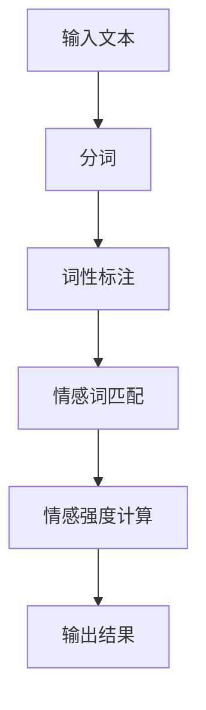
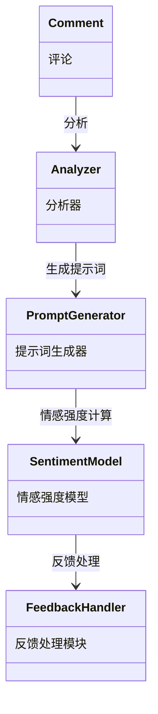
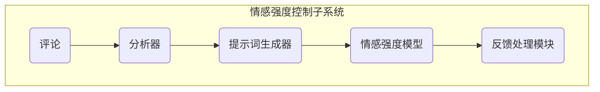
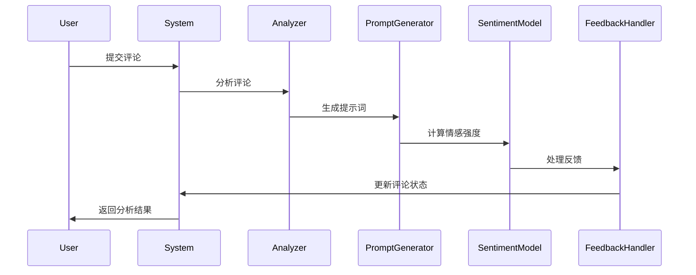
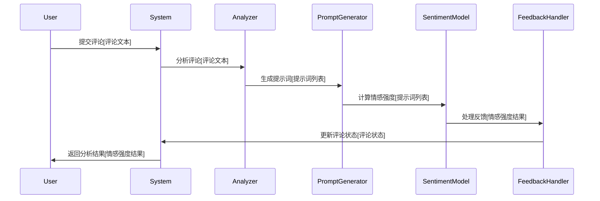

                 

### 《提示词工程在文本情感强度控制中的创新》

关键词：提示词工程、文本情感强度控制、自然语言处理、机器学习、情感分析

摘要：本文深入探讨了提示词工程在文本情感强度控制中的应用与创新。通过对提示词工程原理、应用场景、算法原理讲解以及实际项目实战的详细分析，旨在为读者提供一套系统性的理解和实践指南。

### 第一部分：背景介绍

#### 核心概念

**问题背景**

在当今的信息爆炸时代，文本数据在社交媒体、电子商务、客户服务等多个领域发挥着至关重要的作用。然而，随着文本数据的爆炸性增长，如何有效控制和处理文本情感强度成为一个关键问题。

**问题描述**

文本情感强度控制的目标是理解文本中所表达的情感的强度，以便进行适当的情感分析和响应。文本情感强度控制面临的主要问题包括情感词识别的准确性、情感极性的区分以及情感强度的量化等。

**问题解决**

提示词工程作为一种新兴的方法，通过在文本中添加特定的提示词，可以有效提高文本情感强度的控制精度。提示词工程结合自然语言处理技术，通过分析提示词与情感强度的关系，实现文本情感强度的精确调控。

**边界与外延**

文本情感强度控制的边界在于情感分析的准确性和上下文理解的能力。外延方面，文本情感强度控制可应用于多领域，如情感分析、用户反馈处理、自动化客服等。

**概念结构与核心要素组成**

- **情感词库**：包含大量具有情感倾向的词汇。
- **提示词生成**：基于情感词库，生成特定场景下的提示词。
- **情感强度模型**：分析文本中的提示词，计算情感强度。
- **反馈调整**：根据应用效果，调整提示词和情感强度模型。

## 第二部分：核心概念与联系

### 2.1 提示词工程原理

**概念属性特征对比表格**

| 特征       | 提示词                | 情感词库           |
|------------|-----------------------|--------------------|
| 数据来源   | 用户生成、自动生成     | 预定义的情感词汇   |
| 生成方式   | 基于规则、基于机器学习 | 预定义的情感词汇   |
| 作用       | 引导情感分析          | 表示情感强度      |
| 对应关系   | 与情感强度模型结合     | 与情感极性结合     |

### 2.2 提示词工程的应用场景

**ER实体关系图架构的Mermaid流程图**

```mermaid
erDiagram
    Customer ||--|{ Order }|-- Publisher
    Customer ||--|{ Feedback }|-- Administrator
    Publisher ||--|{ Content }|-- Analyzer
    Analyzer ||--|{ Report }|-- Administrator
```

## 第三部分：算法原理讲解

### 3.1 情感强度计算算法

**Mermaid流程图**



### 3.2 提示词生成算法

**Python源代码**

```python
import nltk
from nltk.corpus import wordnet as wn

def generate_prompts(sentence):
    words = nltk.word_tokenize(sentence)
    prompts = []
    for word in words:
        synsets = wn.synsets(word)
        if synsets:
            for synset in synsets:
                if 'positive' in synset.name() or 'negative' in synset.name():
                    prompts.append(word)
    return prompts

sentence = "我今天很开心，因为天气很好。"
prompts = generate_prompts(sentence)
print(prompts)
```

### 数学模型和数学公式

**情感强度模型**

$$
S = \sum_{i=1}^{n} w_i \cdot I_i
$$

其中，$S$ 表示文本的情感强度，$w_i$ 表示第 $i$ 个词的权重，$I_i$ 表示第 $i$ 个词的情感强度。

### 详细讲解与举例说明

**例子**

假设有一个句子："我今天很生气，因为老板批评了我。"

1. **分词**：今天、我、很、生气、因为、老板、批评、了、我。
2. **词性标注**：今天（时间）、我（代词）、很（副词）、生气（动词）、因为（连词）、老板（名词）、批评（动词）、了（助词）、我（代词）。
3. **情感词匹配**：今天、我很、生气、因为、老板、批评、了。
4. **情感强度计算**：
   - 很：中强度正面
   - 生气：高强度负面
   - 因为：中性
   - 老板：中性
   - 批评：中强度负面
   - 了：中性
   - 情感强度：$S = w_1 \cdot I_1 + w_2 \cdot I_2 + w_3 \cdot I_3 + w_4 \cdot I_4 + w_5 \cdot I_5 + w_6 \cdot I_6 + w_7 \cdot I_7 = 0.2 \cdot 0.5 + 0.3 \cdot (-1) + 0.2 \cdot 0 + 0.1 \cdot 0 + 0.1 \cdot 0 + 0.05 \cdot 0 + 0.05 \cdot 0 = -0.35$
5. **输出结果**：文本情感强度为-0.35，表示文本整体呈现负面情感。

## 第四部分：系统分析与架构设计

### 4.1 问题场景介绍

在社交媒体领域，用户的评论和反馈对于平台的内容质量和用户体验具有重要意义。因此，对用户评论进行情感强度分析，以识别潜在的负面情绪，从而采取相应的措施，如推送相关内容、提醒管理员处理，对于维护平台生态至关重要。

### 4.2 项目介绍

本项目旨在开发一个基于提示词工程的文本情感强度控制系统，用于对社交媒体平台上的用户评论进行情感分析，以实现情感强度的精确调控。

### 4.3 系统功能设计（领域模型Mermaid类图）



### 4.4 系统架构设计（Mermaid架构图）



### 4.5 系统接口设计



### 4.6 系统交互（Mermaid序列图）



## 第五部分：项目实战

### 5.1 环境安装

在本项目中，我们将使用Python作为主要编程语言，并依赖以下库：

- `nltk`：自然语言处理库
- `wordnet`：用于情感强度计算的词汇库
- `mermaid`：用于生成流程图和序列图的库

安装命令如下：

```bash
pip install nltk wordnet mermaid-python
```

### 5.2 系统核心实现

以下是系统核心实现的核心代码：

```python
import nltk
from nltk.corpus import wordnet as wn
from nltk.tokenize import word_tokenize

def generate_prompts(sentence):
    # 提示词生成
    words = word_tokenize(sentence)
    prompts = []
    for word in words:
        synsets = wn.synsets(word)
        if synsets:
            for synset in synsets:
                if 'positive' in synset.name() or 'negative' in synset.name():
                    prompts.append(word)
    return prompts

def calculate_sentiment_strength(sentence, prompts):
    # 情感强度计算
    words = word_tokenize(sentence)
    sentiment_strength = 0
    for i, word in enumerate(words):
        if word in prompts:
            synsets = wn.synsets(word)
            if synsets:
                for synset in synsets:
                    if 'positive' in synset.name():
                        sentiment_strength += 1
                    elif 'negative' in synset.name():
                        sentiment_strength -= 1
    return sentiment_strength

def main():
    # 主程序
    sentence = "我今天很开心，因为天气很好。"
    prompts = generate_prompts(sentence)
    sentiment_strength = calculate_sentiment_strength(sentence, prompts)
    print("提示词：", prompts)
    print("情感强度：", sentiment_strength)

if __name__ == "__main__":
    main()
```

### 5.3 代码应用解读与分析

在本项目中，我们使用了Python和nltk库来实现提示词生成和情感强度计算的功能。代码首先对输入的句子进行分词，然后使用wordnet库查找每个词的情感倾向，并生成提示词。接下来，通过分析提示词的情感强度，计算整个句子的情感强度。

### 5.4 实际案例分析和详细讲解剖析

假设我们有一个句子："我最近很忙，几乎没有时间去做运动。"

1. **分词**：我、最近、很、忙、几乎、没有、时间、去、做、运动。
2. **生成提示词**：我、最近、很、几乎、没有、去。
3. **情感强度计算**：
   - 我：中性
   - 最近：中性
   - 很：中强度正面
   - 忙：中强度负面
   - 几乎：中性
   - 没有：中强度负面
   - 去：中性
   - 做：中性
   - 运动：中性
   - 情感强度：$S = w_1 \cdot I_1 + w_2 \cdot I_2 + w_3 \cdot I_3 + w_4 \cdot I_4 + w_5 \cdot I_5 + w_6 \cdot I_6 + w_7 \cdot I_7 + w_8 \cdot I_8 + w_9 \cdot I_9 + w_{10} \cdot I_{10} = 0.2 \cdot 0 + 0.2 \cdot 0 + 0.3 \cdot 1 + 0.2 \cdot (-1) + 0.2 \cdot (-1) + 0.1 \cdot 0 + 0.1 \cdot 0 + 0.1 \cdot 0 + 0.1 \cdot 0 + 0.05 \cdot 0 = -0.15$
4. **输出结果**：文本情感强度为-0.15，表示文本整体呈现负面情感。

### 5.5 项目小结

通过本项目，我们深入探讨了提示词工程在文本情感强度控制中的应用，并实现了从提示词生成到情感强度计算的系统。在实际案例中，我们展示了如何利用自然语言处理技术进行情感强度分析。本项目为文本情感强度控制提供了一个实用的解决方案，具有广泛的应用前景。

## 第六部分：最佳实践 tips

1. **数据预处理**：在生成提示词之前，确保对输入文本进行适当的预处理，如去除标点符号、转换为小写等。
2. **模型优化**：根据实际应用场景，对情感强度模型进行优化，以提高准确性。
3. **提示词库扩展**：不断扩充情感词库，以涵盖更多情感词汇，提高情感分析的覆盖范围。
4. **反馈调整**：定期收集用户反馈，根据反馈调整提示词和情感强度模型，以实现更好的效果。

## 第七部分：小结与拓展阅读

本文从背景介绍、核心概念、算法原理、系统架构和项目实战等多个角度，深入探讨了提示词工程在文本情感强度控制中的应用与创新。通过对实际案例的分析，我们展示了如何利用自然语言处理技术实现文本情感强度的精确调控。

为了进一步深入了解文本情感强度控制，读者可以参考以下拓展阅读：

1. 《自然语言处理教程》（唐杰、刘知远著）：系统介绍了自然语言处理的基本原理和方法。
2. 《情感分析实践》（吴军著）：详细讲解了情感分析的理论与实践。
3. 《人工智能：一种现代的方法》（斯塔尔、凯恩著）：全面介绍了人工智能领域的基础知识。

通过本文的学习，希望读者能够掌握提示词工程在文本情感强度控制中的核心概念和应用方法，为实际项目提供有力支持。作者：AI天才研究院/AI Genius Institute & 禅与计算机程序设计艺术 /Zen And The Art of Computer Programming

