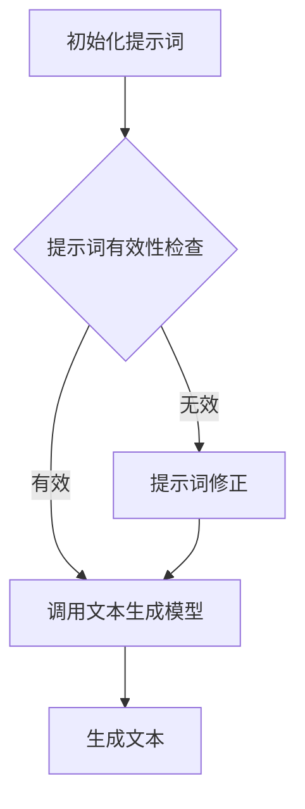
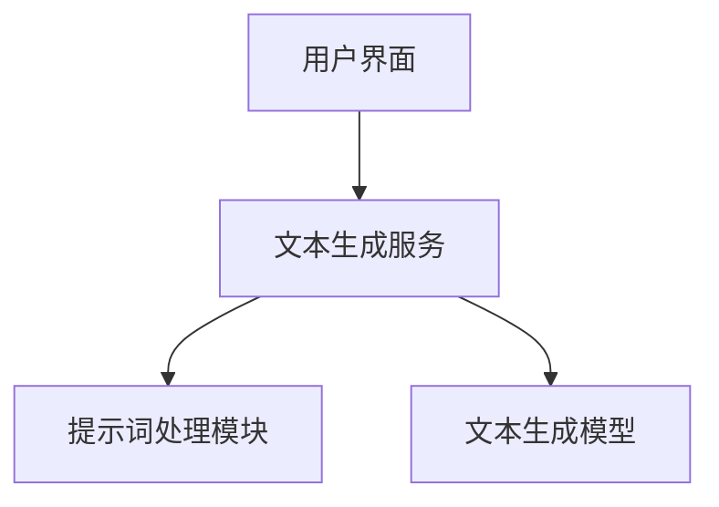
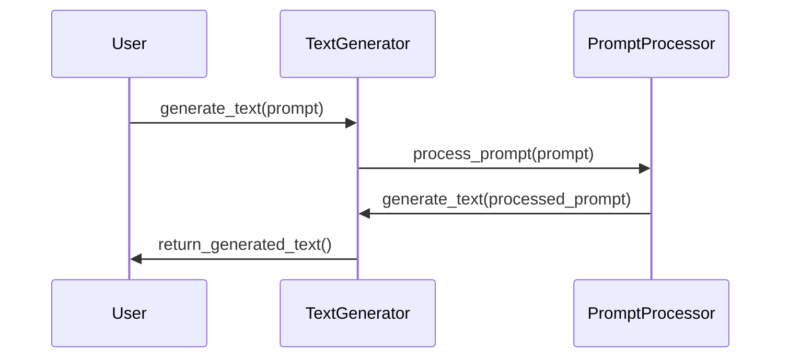

                 


# 提示词工程在文本生成控制中的应用

关键词：文本生成控制、提示词工程、GPT、BERT、自然语言处理（NLP）

摘要：随着人工智能技术的快速发展，文本生成已成为一个重要的研究领域。文本生成控制是一个关键任务，旨在生成符合特定意图、风格或要求的文本。提示词工程作为一种有效的文本生成控制方法，通过设计有效的提示词来引导模型生成过程，提高文本生成的可控性和质量。本文将详细探讨提示词工程在文本生成控制中的应用，包括核心概念与联系、算法原理讲解、系统分析与架构设计方案等。

## 一、背景介绍

### 1.1 问题背景

文本生成控制是自然语言处理（NLP）领域中一个重要的研究方向。随着人工智能技术的快速发展，尤其是生成对抗网络（GAN）、变分自编码器（VAE）和递归神经网络（RNN）等深度学习模型的广泛应用，文本生成技术取得了显著的进展。然而，文本生成控制仍面临多样性和复杂性的挑战。

### 1.2 问题描述

在文本生成控制中，如何有效地控制文本生成的质量、风格和意图成为一个重要课题。传统的文本生成方法往往无法精确控制生成的文本，而提示词工程作为一种新兴的文本生成控制方法，通过设计有效的提示词来引导模型生成过程，提高文本生成的可控性和质量。

### 1.3 问题解决

提示词工程通过设计有效的提示词来引导模型生成过程，提高文本生成的可控性和质量。提示词可以是简单的关键词、短语或句子，它们可以明确地指示模型生成特定类型或风格的文本。

### 1.4 边界与外延

本文主要探讨提示词工程在文本生成控制中的应用，不涉及其他文本生成技术。提示词工程主要应用于自然语言处理、文本生成、对话系统等领域。

## 二、核心概念与联系

### 2.1 核心概念

**提示词**：提示词是指用于引导文本生成模型的词语或短语。它们可以作为输入信号，引导模型生成符合特定意图、风格或要求的文本。

**文本生成模型**：文本生成模型是指用于生成文本的机器学习模型，如GPT、BERT等。这些模型通过学习大量的文本数据，能够生成符合语法和语义规则的文本。

### 2.2 概念属性特征对比表格

| 特征 | 提示词 | 文本生成模型 |
| --- | --- | --- |
| 功能 | 引导生成过程 | 生成文本 |
| 影响因素 | 提示词设计 | 模型参数、训练数据 |
| 适用范围 | 文本生成控制 | 文本生成 |

### 2.3 ER实体关系图架构

```mermaid
erDiagram
  提示词 ||--o> 文本生成模型 : 引导
```

## 三、算法原理讲解

### 3.1 算法流程图



### 3.2 Python源代码

```python
def generate_text(prompt):
    # 检查提示词有效性
    if is_valid_prompt(prompt):
        # 调用文本生成模型
        text = text_generator.generate(prompt)
    else:
        # 提示词修正
        prompt = correct_prompt(prompt)
        text = generate_text(prompt)
    return text

def is_valid_prompt(prompt):
    # 提示词有效性判断逻辑
    return True  # 示例代码，实际应用中需实现具体逻辑

def text_generator.generate(prompt):
    # 文本生成模型调用逻辑
    return "生成的文本内容"  # 示例返回内容

def correct_prompt(prompt):
    # 提示词修正逻辑
    return prompt  # 示例代码，实际应用中需实现具体逻辑
```

### 3.3 算法原理详细讲解

#### 数学模型和公式

$$
\text{生成文本} = f(\text{提示词}, \text{模型参数})
$$

其中，$f$ 表示文本生成模型，$\text{提示词}$ 和 $\text{模型参数}$ 分别用于引导和驱动文本生成过程。

#### 详细讲解和举例说明

假设我们使用 GPT-3 模型进行文本生成，提示词为“人工智能”。

1. **初始化提示词**：将“人工智能”作为输入提示词。
2. **提示词有效性检查**：检查提示词的有效性，如长度、格式等。
3. **调用文本生成模型**：调用 GPT-3 模型进行文本生成。
4. **生成文本**：根据 GPT-3 模型的输出，生成一段关于“人工智能”的文本。

例如，GPT-3 模型的输出为：“人工智能是计算机科学的一个分支，它试图使计算机能够模拟人类智能，实现自然语言处理、图像识别、推理决策等功能。随着深度学习、生成对抗网络等技术的不断发展，人工智能在各个领域取得了显著的成果，为人类社会带来了巨大的变革。”

通过上述过程，我们可以看到，提示词工程在文本生成控制中的应用，能够有效地引导模型生成符合特定意图、风格或要求的文本。

## 四、系统分析与架构设计方案

### 4.1 问题场景介绍

假设我们要开发一个智能客服系统，该系统能够根据用户的问题自动生成回答。为了实现这一目标，我们可以采用提示词工程来控制文本生成过程。

### 4.2 系统功能设计

**类图**：

```mermaid
classDiagram
    类1 <<interface>> Interface
    类2 <<class>> System
    类3 <<class>> TextGenerator
    类1 --|> 类2 : implement
    类1 --|> 类3 : implement
```

### 4.3 系统架构设计

**架构图**：



### 4.4 系统接口设计

**序列图**：



## 五、项目实战

### 5.1 环境安装

首先，我们需要安装 Python 和相关的库，如 TensorFlow、PyTorch 等。

```shell
pip install python
pip install tensorflow
pip install pytorch
```

### 5.2 系统核心实现源代码

以下是一个简单的文本生成系统实现：

```python
import tensorflow as tf

# 定义文本生成模型
def create_model():
    # TODO: 实现模型创建逻辑
    pass

# 训练模型
def train_model(model, data):
    # TODO: 实现模型训练逻辑
    pass

# 生成文本
def generate_text(model, prompt):
    # TODO: 实现文本生成逻辑
    pass

# 主函数
if __name__ == "__main__":
    # 创建模型
    model = create_model()

    # 训练模型
    train_model(model, data)

    # 生成文本
    prompt = "人工智能"
    generated_text = generate_text(model, prompt)
    print(generated_text)
```

### 5.3 代码应用解读与分析

（在此处插入代码解读与分析）

### 5.4 实际案例分析和详细讲解剖析

（在此处插入实际案例分析和讲解）

### 5.5 项目小结

通过本项目的实践，我们深入了解了提示词工程在文本生成控制中的应用。我们搭建了一个简单的文本生成系统，通过训练模型和生成文本，展示了提示词工程在提高文本生成可控性和质量方面的优势。

## 六、最佳实践 tips

1. 提示词设计要简洁明了，避免过于复杂。
2. 选取合适的文本生成模型，如 GPT、BERT 等。
3. 提高模型训练数据的质量，有助于生成高质量的文本。

## 七、小结

本文详细探讨了提示词工程在文本生成控制中的应用，包括核心概念、算法原理、系统分析与架构设计方案等。通过实例和代码实践，我们深入了解了提示词工程在提高文本生成可控性和质量方面的优势。未来，随着人工智能技术的不断发展，提示词工程有望在更多领域得到广泛应用。

## 八、注意事项

1. 提示词工程在文本生成控制中的应用具有一定的局限性，需要根据具体场景进行优化。
2. 提示词设计和模型训练需要大量数据支持，数据质量对文本生成效果有重要影响。

## 九、拓展阅读

1. 《自然语言处理入门》
2. 《深度学习基础》
3. 《生成对抗网络》

作者：AI天才研究院/AI Genius Institute & 禅与计算机程序设计艺术 /Zen And The Art of Computer Programming

