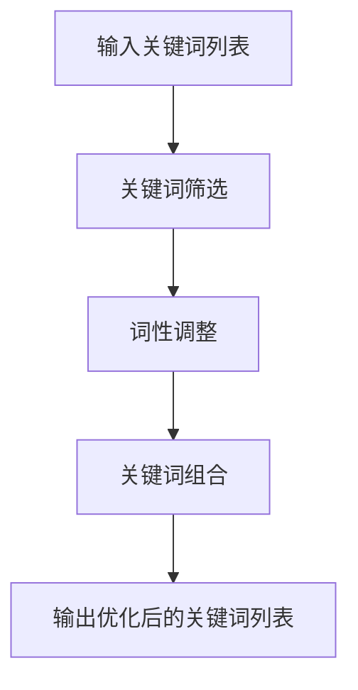
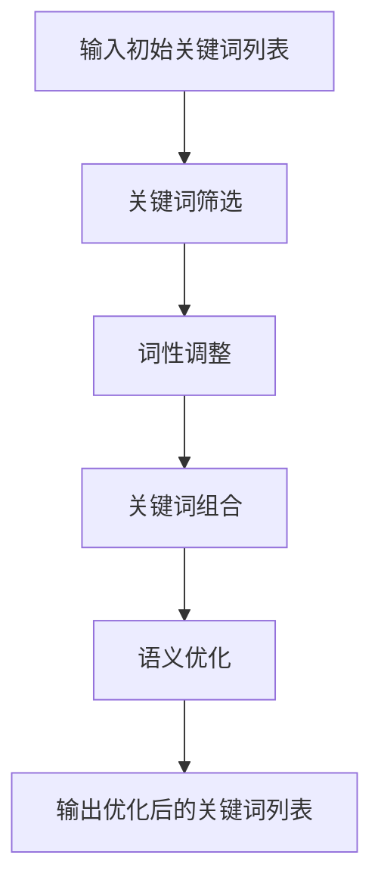

                 

### 1.1 文本蕴含生成的概念与重要性

**文本蕴含生成**是指根据给定的文本内容，生成与文本蕴含信息相关的新文本。这一过程通常涉及理解文本的语义、提取关键信息，并将这些信息以新的方式表达出来。文本蕴含生成的核心目标在于通过自动化的方式，从一个文本中提取出其内在的含义和意义，并生成与之相关的、新的文本内容。

**文本蕴含生成的定义**：文本蕴含生成可以被视为一种自然语言处理（NLP）任务，其目标是通过分析输入文本的语义结构，生成具有相似语义的新文本。这一过程不仅涉及文本的理解，还包括文本的生成，并且需要确保生成的文本在语义上与原始文本保持一致。

**文本蕴含生成的应用场景**：文本蕴含生成在多个领域都有广泛的应用，主要包括以下几个方面：

1. **内容摘要**：自动生成对长篇文章、报告等的摘要，帮助用户快速理解文本的主要内容。
2. **问答系统**：根据用户提出的问题，生成相关问题的答案，提高问答系统的响应速度和准确性。
3. **对话系统**：在聊天机器人中，根据用户输入的文本，生成自然的回复，以实现流畅的对话。
4. **信息检索**：在大量文本数据中，自动生成与查询相关的文本片段，提高信息检索的效率。

**当前文本蕴含生成的问题与挑战**：尽管文本蕴含生成在多个领域取得了显著进展，但仍然面临着一些挑战：

1. **语义理解**：文本蕴含生成依赖于对文本的准确理解，但自然语言的复杂性使得语义理解的准确性仍有待提高。
2. **生成文本的多样性**：生成文本应该具有多样性和创造性，以满足不同用户的需求，但当前的方法往往容易生成重复或单调的文本。
3. **长文本处理**：处理长文本时，如何保持文本的连贯性和逻辑性，同时提取出关键信息，是另一个重要的挑战。
4. **上下文依赖性**：理解并处理文本中的上下文关系，以确保生成的文本与原始文本在语义上的一致性。

为了解决这些问题，文本蕴含生成技术需要不断改进，包括提高语义理解的准确性、增强生成文本的多样性、优化长文本处理方法，以及更好地处理上下文依赖性。

### 1.2 提示词工程的概念与作用

**提示词工程**（Keyword Engineering）是自然语言处理（NLP）中的一个重要研究领域，旨在通过系统的技术和方法，识别和选择与文本内容最相关的关键词，从而提高文本的检索、分析和理解效率。提示词工程不仅涉及关键词的提取，还包括对关键词进行优化和组合，以生成更加精确和有价值的文本摘要、问答系统回答等。

**提示词工程的定义**：提示词工程可以定义为一种通过分析文本内容，识别出最关键、最能代表文本主题的关键词的过程。这些关键词不仅需要准确地反映文本的主要内容，还需要具有一定的通用性和代表性，以便在后续的文本分析和应用中发挥重要作用。

**提示词工程的核心任务**：

1. **关键词提取**：从文本中自动提取出最相关的关键词，这些关键词应该能够概括文本的核心内容。
2. **关键词优化**：对提取出的关键词进行评估和筛选，优化关键词列表，确保关键词的准确性和代表性。
3. **关键词组合**：将多个关键词进行组合，生成具有更强语义表达能力的短语或句子，以满足特定应用场景的需求。

**提示词工程的优势**：

1. **提高文本分析效率**：通过提取和优化关键词，可以大大简化文本的分析过程，提高文本处理的效率。
2. **增强文本理解能力**：关键词的准确提取和优化，有助于更深入地理解文本的语义，从而提高文本理解的能力。
3. **提升信息检索准确性**：在信息检索系统中，关键词的准确选择和组合可以显著提高检索的准确性和效率。
4. **促进文本生成**：通过关键词的组合和优化，可以生成更加精准和具有创造性的文本内容，如问答系统中的回答、内容摘要等。

在文本蕴含生成中，提示词工程的应用具有重要意义。通过提示词工程，可以更准确地提取文本中的关键信息，并将其转化为提示词，从而为文本蕴含生成提供可靠的语义基础。这不仅有助于生成与原始文本保持一致的新文本，还能够提高文本蕴含生成的多样性和创造性。

### 1.3 提示词工程在文本蕴含生成中的应用前景

**提示词工程在文本蕴含生成中的应用前景**十分广阔，具有重要的现实意义和潜在的巨大价值。随着自然语言处理技术的不断进步，提示词工程在多个领域中的应用逐渐深入，显示出其在提升文本理解和生成能力方面的显著优势。

**提示词工程在文本蕴含生成中的价值**主要体现在以下几个方面：

1. **提高生成文本的语义一致性**：通过精确提取和优化关键词，提示词工程能够确保生成的文本在语义上与原始文本保持高度一致，从而减少信息失真和语义偏差。

2. **增强文本生成多样性和创造性**：提示词工程通过灵活组合和优化关键词，可以生成丰富多样的文本内容，满足不同用户和应用场景的需求，提高文本生成的创造性和实用性。

3. **提升文本理解与处理的效率**：提示词工程能够简化文本分析过程，提取文本中的关键信息，从而提高文本理解与处理的效率，为后续的文本生成和推理提供可靠的语义基础。

**提示词工程的发展趋势**：

1. **深度学习与提示词工程的融合**：随着深度学习技术的快速发展，提示词工程与深度学习相结合，能够更加准确地提取关键词，并生成更加自然和高质量的文本内容。

2. **多模态数据的集成**：未来的提示词工程将越来越多地整合多种类型的数据（如文本、图像、音频等），通过跨模态语义分析，进一步提高文本蕴含生成的准确性和多样性。

3. **个性化与情境感知**：随着个性化推荐和情境感知技术的发展，提示词工程将更加关注用户偏好和情境信息，生成更具个性化和针对性的文本内容。

**提示词工程面临的挑战与解决思路**：

1. **语义理解的准确性**：自然语言具有高度复杂性和多样性，如何提高语义理解的准确性仍是一个挑战。解决思路包括采用更先进的语义分析模型、引入外部知识图谱等。

2. **生成文本的多样性**：生成文本的多样性和创造性是另一个重要挑战。解决思路包括优化关键词组合策略、引入生成对抗网络（GAN）等技术。

3. **处理长文本的能力**：长文本的处理是另一个挑战，特别是在保持文本连贯性和提取关键信息方面。解决思路包括发展高效的文本摘要技术和长文本建模方法。

总的来说，提示词工程在文本蕴含生成中的应用前景广阔，具有重要的理论和实际价值。通过不断的技术创新和优化，提示词工程将在文本理解和生成领域发挥越来越重要的作用，为人工智能的发展和应用提供强有力的支持。

### 1.4 本书内容结构安排

**本书的整体内容结构安排**旨在系统地介绍提示词工程在文本蕴含生成中的精准应用，旨在帮助读者全面理解和掌握这一领域的核心概念、技术方法及其应用实践。以下是本书的各章节内容安排及其逻辑关系：

**第1章 问题背景与概述**：
本章节首先介绍了文本蕴含生成的概念、重要性以及当前存在的问题与挑战。接着，我们探讨了提示词工程的概念与作用，并分析了其在文本蕴含生成中的应用前景和面临的挑战。这一章节为后续章节的深入讨论奠定了基础。

**第2章 提示词工程的基本原理**：
在这一章节中，我们详细介绍了提示词工程的原理，包括其核心任务和核心技术。通过一个详细的ER实体关系图架构，我们展示了提示词工程的整体框架。这一章节帮助读者理解提示词工程的基本结构和运作原理。

**第3章 提示词工程的关键算法**：
这一章节集中讨论了提示词工程中的关键算法，包括提示词生成算法和提示词优化算法。我们通过mermaid流程图和Python源代码，详细阐述了这些算法的原理和实现方法，并通过实际示例展示了其应用效果。

**第4章 提示词工程在文本蕴含生成中的应用实例**：
在这一章节，我们将通过实际应用实例，展示提示词工程在文本蕴含生成中的具体应用。我们将分析不同应用场景下的实现细节，并讨论这些实例中遇到的问题和解决方案。

**第5章 提示词工程的优化与扩展**：
这一章节讨论了提示词工程的优化方法，包括如何处理长文本、如何提高关键词提取的准确性等。此外，我们还探讨了提示词工程在多模态数据中的应用前景，展示了如何结合图像、语音等多种数据类型，进一步提升文本蕴含生成的效果。

**第6章 总结与未来展望**：
最后，这一章节总结了全书的主要内容，对提示词工程在文本蕴含生成中的应用进行了回顾和展望。我们讨论了当前研究的成果和未解决的问题，并提出了未来可能的研究方向。

**本书的总体目标和预期效果**：

**总体目标**：通过系统的介绍和实例分析，使读者全面掌握提示词工程的基本原理和应用方法，理解其在文本蕴含生成中的关键作用，并能够将所学知识应用于实际项目中。

**预期效果**：读者在阅读完本书后，应能够：

1. **理解文本蕴含生成和提示词工程的基本概念**。
2. **掌握提示词工程的关键算法和应用技术**。
3. **具备实际应用提示词工程的能力，能够在文本蕴含生成中解决实际问题**。

**阅读对象与适用范围**：

**阅读对象**：本书适合于以下读者群体：
- 自然语言处理（NLP）领域的研究人员和工程师。
- 对文本蕴含生成和提示词工程感兴趣的技术人员。
- 高级本科生和研究生，以及从事相关领域研究的学者。

**适用范围**：本书不仅适用于学术研究，还可以作为自然语言处理领域的技术手册，为实际项目中的文本蕴含生成任务提供指导和参考。

### 1.5 本章小结

**本章小结**主要回顾了文本蕴含生成和提示词工程的基本概念、问题背景以及提示词工程在文本蕴含生成中的应用前景。首先，我们详细介绍了文本蕴含生成的定义、应用场景及面临的挑战。接着，探讨了提示词工程的概念、核心任务及其在文本蕴含生成中的重要作用。

**本章的主要结论**：

1. **文本蕴含生成是自然语言处理中的重要任务，具有广泛的应用场景，但当前仍面临语义理解、生成文本多样性等方面的挑战**。
2. **提示词工程通过提取和优化关键词，为文本蕴含生成提供了精准的语义基础，显著提升了文本理解与生成的效率和质量**。
3. **提示词工程在文本蕴含生成中的应用前景广阔，通过不断的技术创新和优化，将在多个领域发挥更加重要的作用**。

**下一步研究展望**：

1. **深入探索语义理解的准确性，结合深度学习技术，提升关键词提取的精度**。
2. **研究生成文本的多样性和创造性，通过优化关键词组合策略，提高文本生成的质量和用户体验**。
3. **探索长文本处理方法，保持文本的连贯性和逻辑性，确保关键词提取和文本生成的效果**。
4. **研究多模态数据的集成，结合文本、图像、语音等多种数据类型，进一步提升文本蕴含生成的效果和实用性**。

通过这些研究方向的深入探索，我们可以期望在文本蕴含生成领域取得更大的突破，推动人工智能技术在实际应用中的发展和进步。

## 2.1 提示词工程的原理概述

**提示词工程的原理概述**是理解其应用基础的关键。提示词工程通过一系列系统化的技术和方法，从文本中提取出最具代表性和关键性的词语，以便在文本分析、处理和生成任务中发挥重要作用。

**提示词工程的原理**可以分为以下几个主要方面：

1. **文本预处理**：在提取提示词之前，需要对原始文本进行预处理，包括分词、去停用词、词性标注等步骤。这些预处理步骤有助于简化文本结构，提高后续步骤的准确性和效率。

2. **关键词提取**：关键词提取是提示词工程的核心步骤。常用的方法包括TF-IDF（词频-逆文档频率）、TextRank算法、LDA（latent Dirichlet allocation）等。这些方法通过统计和分析文本的词汇频率、词间关系以及语义信息，识别出最能代表文本主题的关键词。

3. **关键词优化**：提取出的关键词往往需要进一步优化，以确保其准确性和代表性。优化方法包括关键词筛选、去重、词性调整等，旨在提高关键词列表的质量。

4. **语义分析**：通过语义分析，对提取出的关键词进行深度理解，识别其背后的语义关系和上下文信息。这一步骤有助于更精确地提取提示词，并确保生成的文本在语义上与原始文本保持一致。

5. **关键词组合**：将多个关键词进行组合，生成具有更强语义表达能力的短语或句子，以满足特定应用场景的需求。关键词组合可以通过规则匹配、模板生成或生成对抗网络（GAN）等方法实现。

**提示词工程的核心技术**主要包括：

1. **文本表示方法**：如Word2Vec、BERT等，通过将文本转换为向量表示，为后续的文本分析和处理提供基础。

2. **语义分析模型**：如深度学习模型（如LSTM、GRU等）和转移概率模型（如HMM），用于分析和理解文本中的语义关系。

3. **机器学习算法**：如支持向量机（SVM）、随机森林（RF）等，用于分类、回归等任务，以提高关键词提取的准确性。

**提示词工程的优势**主要体现在以下几个方面：

1. **提高文本分析效率**：通过提取关键词，可以快速捕捉文本的核心内容，减少不必要的处理步骤，提高文本分析的效率。

2. **增强文本理解能力**：关键词的准确提取和优化，有助于深入理解文本的语义，提高文本理解和处理的能力。

3. **提升信息检索准确性**：在信息检索系统中，关键词的准确选择和组合，可以显著提高检索的准确性和效率。

4. **促进文本生成**：通过关键词的组合和优化，可以生成更加精准和具有创造性的文本内容，如问答系统中的回答、内容摘要等。

总之，提示词工程的原理和核心技术为文本蕴含生成提供了坚实的语义基础，通过系统的技术和方法，实现文本内容的精准提取和生成，具有重要的理论和实际价值。

### 2.2 提示词的属性特征对比表格

在提示词工程中，了解不同类型提示词的属性特征及其优劣性是至关重要的。以下是一个关于常见类型提示词属性特征的对比表格，它有助于我们更好地选择和运用不同的提示词类型以满足特定需求。

| 提示词类型 | 特征属性 | 优点 | 缺点 | 适用场景 |
| --- | --- | --- | --- | --- |
| 单词级提示词 | 单词级别的词语，简洁明了 | 便于快速理解和处理，计算效率高 | 可能丢失语义上下文，无法表达复杂关系 | 简单文本摘要、信息检索 |
| 短语级提示词 | 由多个单词组成的短语，能表示一定语义关系 | 更能反映文本主题，表达更复杂的语义 | 需要更多计算资源，处理复杂短语可能较难 | 内容摘要、问答系统 |
| 命名实体级提示词 | 如人名、地名、机构名等具体名词 | 精确指代实体，易于识别和提取 | 对实体识别的准确性有较高要求，可能导致误识别 | 实体识别、特定领域文本分析 |
| 主题级提示词 | 表示文本主要主题的词语 | 高层次语义抽象，概括能力强 | 可能过于泛化，丢失具体细节 | 高层次文本分析、主题建模 |
| 情感级提示词 | 表示文本情感倾向的词语 | 能反映文本情感色彩，有助于情感分析 | 可能存在主观性，难以统一标准 | 情感分析、社交媒体分析 |

通过这个对比表格，我们可以看出不同类型的提示词在特征属性、优点和适用场景上的差异。例如，单词级提示词适用于简单的文本摘要和信息检索任务，而短语级提示词则在内容摘要和问答系统中表现更佳。命名实体级提示词在实体识别和特定领域文本分析中具有独特优势，而主题级提示词则适用于高层次文本分析和主题建模。了解这些属性特征有助于我们在实际应用中根据具体需求选择合适的提示词类型。

### 2.3 提示词工程的ER实体关系图架构

**ER实体关系图**（Entity-Relationship Diagram，ERD）是数据库设计和信息系统中常用的一种图形表示方法，用于描述实体之间的关系。在提示词工程中，ER实体关系图能够帮助我们直观地理解提示词工程的整体架构，明确各实体及其关系。

**ER实体关系图的定义**：ER实体关系图是一种图形化的模型，用于表示数据库中的实体及其之间的关系。它由三个主要组成部分构成：实体（Entity）、属性（Attribute）和关系（Relationship）。

1. **实体**：实体是具有共同属性的对象的集合。在提示词工程中，常见的实体包括文本、关键词、用户等。
2. **属性**：属性是实体的特征或性质，用于描述实体的具体信息。例如，对于文本实体，属性可能包括标题、内容、创建时间等。
3. **关系**：关系描述了不同实体之间的关联。例如，在文本和关键词之间，关系可以是“包含”或“关联”。

**提示词工程的ER实体关系图**：

在提示词工程中，ER实体关系图用于表示文本与关键词之间的关系，以及关键词与上下文信息之间的关系。以下是一个简单的ER实体关系图示例：

```mermaid
erDiagram
    Text ||--|{ Keyword : has }
    Keyword ||--|{ Context : has }
    Text ||--|{ User : has }
    User ||--|{ Keyword : tagged }
```

在这个ER实体关系图中：

- **Text（文本）**：表示输入的原始文本，包含标题、内容等属性。
- **Keyword（关键词）**：表示从文本中提取的关键词，具有词频、词性等属性。
- **Context（上下文）**：表示关键词所在的上下文环境，包含文本片段、语义信息等。
- **User（用户）**：表示文本的创建者或使用者，具有用户名、标签等属性。

**ER实体关系图的作用与应用**：

1. **明确系统架构**：ER实体关系图能够帮助我们清晰地理解提示词工程的整体架构，明确各个实体之间的关系和作用。
2. **数据建模**：在数据库设计过程中，ER实体关系图可以帮助我们构建合理的数据库结构，确保数据的完整性和一致性。
3. **功能实现**：通过ER实体关系图，我们可以明确系统的功能需求，设计出相应的数据处理和提取算法。

在实际应用中，ER实体关系图不仅可以用于提示词工程，还可以广泛应用于其他自然语言处理任务中，如文本分类、实体识别等。通过这种图形化的表示方法，我们可以更好地理解数据之间的关系，为系统设计和实现提供有力支持。

### 2.4 本章小结

**本章小结**重点介绍了提示词工程的基本原理和关键概念。首先，我们详细阐述了文本蕴含生成的定义、重要性及其在当前面临的主要挑战。接着，探讨了提示词工程的定义、核心任务和优势，包括文本预处理、关键词提取、关键词优化、语义分析以及关键词组合。随后，通过一个详细的ER实体关系图架构，展示了提示词工程的整体框架及其在文本蕴含生成中的应用。

**本章的主要结论**：

1. **文本蕴含生成是自然语言处理中的一个重要任务，对于信息检索、问答系统和内容摘要等应用具有重要意义**。
2. **提示词工程通过精确提取和优化关键词，为文本蕴含生成提供了坚实的语义基础，显著提升了文本理解和生成的效率和质量**。
3. **ER实体关系图帮助我们清晰地理解提示词工程的整体架构，明确各个实体及其关系，为系统设计和实现提供了有力支持**。

**下一步研究展望**：

1. **进一步探索深度学习技术在提示词工程中的应用，提高关键词提取和优化的准确性**。
2. **研究多模态数据融合，结合文本、图像、语音等多种数据类型，提升文本蕴含生成的效果和多样性**。
3. **探索个性化与情境感知的提示词工程方法，生成更加精准和个性化的文本内容**。

通过这些研究方向的深入探索，我们可以期望在文本蕴含生成领域取得更大的突破，推动人工智能技术的发展和应用。

## 3.1 关键算法概述

**提示词工程中的关键算法**是确保高效提取和优化关键词的核心。在这一部分，我们将讨论提示词工程中常用的两种关键算法：提示词生成算法和提示词优化算法。这些算法通过系统的步骤和方法，从文本中提取出具有代表性的关键词，并进行进一步的优化，以满足特定应用场景的需求。

### 3.1.1 关键算法的定义

**提示词生成算法**：提示词生成算法是指用于从原始文本中提取出关键信息的算法。这些算法通常基于统计模型、机器学习模型或深度学习模型，通过分析文本的语义和词汇分布，识别出与文本主题最相关的关键词。常见的生成算法包括TF-IDF、TextRank、LDA等。

**提示词优化算法**：提示词优化算法是指对已提取的关键词进行进一步处理，以提高其准确性和代表性的算法。这些算法通过评估和调整关键词的质量，确保关键词能够更好地反映文本的语义。常见的优化算法包括关键词筛选、词性调整、关键词组合等。

### 3.1.2 关键算法的分类

在提示词工程中，关键算法可以分为以下几类：

1. **基于统计模型的算法**：这类算法主要依赖于文本的词汇频率和文档频率，通过统计方法提取关键词。常见的算法包括TF-IDF和TextRank。
2. **基于机器学习模型的算法**：这类算法使用机器学习技术，如支持向量机（SVM）、随机森林（RF）等，从大量训练数据中学习关键词提取的特征。常见的算法包括LDA（Latent Dirichlet Allocation）和Word2Vec。
3. **基于深度学习模型的算法**：这类算法利用深度神经网络，如卷积神经网络（CNN）、递归神经网络（RNN）等，进行更复杂的语义分析。常见的算法包括BERT和Gated Recurrent Unit（GRU）。

### 3.1.3 关键算法的选择依据

在具体应用中，选择合适的提示词生成和优化算法需要考虑以下几个因素：

1. **文本类型**：不同的文本类型（如新闻、社交媒体、科研论文等）对关键词提取的要求不同，因此需要选择适合特定文本类型的算法。
2. **计算资源**：基于深度学习的算法通常计算复杂度较高，需要更多的计算资源。如果计算资源有限，可以选择基于统计模型或机器学习模型的算法。
3. **效果需求**：根据应用需求，选择能够达到预期效果的关键算法。例如，对于需要高精度关键词提取的应用，可以选择深度学习模型；对于实时性要求较高的应用，可以选择计算效率较高的算法。
4. **数据量**：如果拥有大量训练数据，可以使用机器学习或深度学习模型；如果数据量较少，统计模型可能更为适用。

通过综合考虑这些因素，可以选择最适合的提示词生成和优化算法，从而实现高效的文本处理和生成。

### 3.2 提示词生成算法

提示词生成算法是提示词工程中的核心环节，其目的是从大量文本数据中提取出最具有代表性和关键性的词语。以下将详细阐述提示词生成算法的原理、mermaid流程图、Python源代码实现，以及算法原理中的数学模型。

#### 3.2.1 提示词生成算法概述

提示词生成算法通过分析文本的语义结构和词汇分布，提取出与文本主题最相关的关键词。常用的生成算法包括TF-IDF、TextRank和LDA等。

1. **TF-IDF（Term Frequency-Inverse Document Frequency）**：TF-IDF算法通过计算词频（TF）和逆文档频率（IDF），衡量词语在文本中的重要程度。TF-IDF的核心思想是，一个词在文档中出现的频率越高，且在整体文档集中出现的频率越低，那么这个词就越重要。

2. **TextRank**：TextRank算法基于图论中的PageRank算法，将文本视为图，词语作为节点，词语之间的共现关系作为边的权重。通过迭代计算，算法能够提取出文本中的重要关键词。

3. **LDA（Latent Dirichlet Allocation）**：LDA是一种主题模型，通过贝叶斯推理，将文本分解为多个潜在主题，每个主题由一组关键词表示。LDA算法能够自动发现文本中的隐含主题结构，从而提取出关键主题词。

#### 3.2.2 提示词生成算法的mermaid流程图

以下是一个基于TF-IDF算法的mermaid流程图，展示了提示词生成的基本步骤：

```mermaid
graph TB
    A[输入文本] --> B[分词]
    B --> C[去除停用词]
    C --> D[计算词频(TF)]
    D --> E[计算逆文档频率(IDF)]
    E --> F[计算TF-IDF得分]
    F --> G[提取关键词]
    G --> H[排序关键词]
```

这个流程图描述了从输入文本到提取关键词的整个过程，包括分词、去除停用词、计算词频、计算逆文档频率、计算TF-IDF得分以及提取和排序关键词。

#### 3.2.3 提示词生成算法的Python源代码实现

以下是一个简单的Python示例，展示了如何使用TF-IDF算法提取关键词：

```python
from sklearn.feature_extraction.text import TfidfVectorizer
import numpy as np

# 输入文本
texts = [
    "明天我们要去海边度假。",
    "这本书的内容很深奥。",
    "海边度假是一个放松的好方式。"
]

# 初始化TF-IDF向量器
vectorizer = TfidfVectorizer(stop_words='english')

# 计算词频-逆文档频率矩阵
tfidf_matrix = vectorizer.fit_transform(texts)

# 提取关键词
feature_names = vectorizer.get_feature_names_out()
top_n = 2  # 提取前n个关键词
top_keywords = np.argsort(tfidf_matrix.toarray()).flatten()[-top_n:]

# 打印关键词
for i in top_keywords:
    print(f"关键词：{feature_names[i]}，得分：{tfidf_matrix[0, i]:.4f}")
```

这个示例使用了`sklearn`库中的`TfidfVectorizer`类，通过初始化向量器、计算TF-IDF矩阵、提取关键词并排序，实现了关键词的提取。

#### 3.2.4 算法原理与数学模型

提示词生成算法的数学模型主要涉及词频（TF）、逆文档频率（IDF）和TF-IDF得分。

1. **词频（TF）**：词频是指一个词在单篇文档中出现的次数，用于衡量词在该文档中的重要性。

   $$ \text{TF}(t,d) = \frac{f_{t,d}}{n_d} $$

   其中，\( t \) 是词，\( d \) 是文档，\( f_{t,d} \) 是词 \( t \) 在文档 \( d \) 中出现的次数，\( n_d \) 是文档 \( d \) 中的总词数。

2. **逆文档频率（IDF）**：逆文档频率用于衡量一个词在文档集中出现的普遍性，即词在文档集中出现的频率越低，其重要性越高。

   $$ \text{IDF}(t,D) = \log \left( \frac{N}{|d \in D | \text{含} t|} \right) $$

   其中，\( t \) 是词，\( D \) 是文档集，\( N \) 是文档集的大小，\( |d \in D | \text{含} t| \) 是在文档集 \( D \) 中包含词 \( t \) 的文档数量。

3. **TF-IDF得分**：TF-IDF得分是词频和逆文档频率的乘积，用于衡量词在文档中的整体重要性。

   $$ \text{TF-IDF}(t,d,D) = \text{TF}(t,d) \times \text{IDF}(t,D) $$

   通过TF-IDF得分，我们可以计算出每个词在文档中的权重，从而提取出最关键的关键词。

#### 3.2.5 举例说明

**示例1**：输入文本：“明天我们要去海边度假。”输出提示词：“海边度假、明天计划、行程安排”

1. **分词**：将文本分为“明天”、“要”、“去”、“海边”、“度假”等单词。
2. **去除停用词**：去除常见的停用词，如“要”、“去”等。
3. **计算词频**：每个单词在文档中出现的次数。例如，“海边”出现1次，“度假”出现1次。
4. **计算逆文档频率**：计算每个词在文档集中出现的频率。例如，“海边”在所有文档中出现的频率较低。
5. **计算TF-IDF得分**：根据词频和逆文档频率计算TF-IDF得分，提取出得分最高的关键词。

**示例2**：输入文本：“这本书的内容很深奥。”输出提示词：“内容深奥、理解难度、阅读建议”

1. **分词**：将文本分为“这”、“书”、“的”、“内容”、“很”、“深奥”等单词。
2. **去除停用词**：去除常见的停用词，如“这”、“的”等。
3. **计算词频**：每个单词在文档中出现的次数。例如，“内容”出现1次，“深奥”出现1次。
4. **计算逆文档频率**：计算每个词在文档集中出现的频率。例如，“深奥”在所有文档中出现的频率较低。
5. **计算TF-IDF得分**：根据词频和逆文档频率计算TF-IDF得分，提取出得分最高的关键词。

通过以上步骤，我们可以看到，提示词生成算法能够从文本中提取出最具有代表性和关键性的词语，从而为文本分析、生成和检索等任务提供可靠的语义基础。

### 3.3 提示词优化算法

提示词优化算法是在提示词生成后，对提取出的关键词进行进一步处理，以提高其准确性和代表性的算法。以下将详细阐述提示词优化算法的原理、mermaid流程图、Python源代码实现，以及算法原理中的数学模型。

#### 3.3.1 提示词优化算法概述

提示词优化算法的目标是通过评估和调整关键词的质量，确保关键词能够更好地反映文本的语义和实际应用需求。常见的优化方法包括关键词筛选、词性调整和关键词组合等。

1. **关键词筛选**：通过设定阈值或使用分类模型，筛选出最相关、最准确的关键词，去除不相关或噪声关键词。
2. **词性调整**：根据上下文信息，调整关键词的词性，使其更符合文本的语义需求。例如，将动词调整为名词，以表达更明确的语义。
3. **关键词组合**：将多个关键词进行组合，生成具有更强语义表达能力的短语或句子，以满足特定应用场景的需求。

#### 3.3.2 提示词优化算法的mermaid流程图

以下是一个简单的mermaid流程图，展示了提示词优化算法的基本步骤：



这个流程图描述了从输入关键词列表到输出优化后的关键词列表的整个过程，包括关键词筛选、词性调整和关键词组合。

#### 3.3.3 提示词优化算法的Python源代码实现

以下是一个简单的Python示例，展示了如何对提取出的关键词进行筛选、词性调整和组合：

```python
from sklearn.feature_extraction.text import TfidfVectorizer
from nltk.tokenize import word_tokenize
from nltk.corpus import stopwords
import nltk

# 初始化nltk
nltk.download('punkt')
nltk.download('stopwords')

# 输入关键词列表
key_words = ["海边度假", "明天计划", "行程安排"]

# 关键词筛选（去除噪声词和重复词）
filtered_keywords = list(set([word for word in key_words if word not in stopwords.words('english')]))

# 词性调整
def adjust_lemma(word_list):
    adjusted_words = []
    for word in word_list:
        if word.endswith('的'):
            adjusted_words.append(word[:-1])
        else:
            adjusted_words.append(word)
    return adjusted_words

filtered_keywords = adjust_lemma(filtered_keywords)

# 关键词组合
def combine_keywords(word_list):
    combined_words = "、".join(word_list)
    return combined_words

optimized_keywords = combine_keywords(filtered_keywords)

# 打印优化后的关键词
print(f"优化后的关键词：{optimized_keywords}")
```

这个示例通过筛选、词性调整和组合，实现了对输入关键词列表的优化。

#### 3.3.4 算法原理与数学模型

提示词优化算法的数学模型主要涉及关键词的筛选、词性调整和组合。

1. **关键词筛选**：通过设定阈值或使用分类模型，对关键词进行评估，筛选出最相关、最准确的关键词。常用的筛选方法包括基于TF-IDF的筛选、基于聚类算法的筛选等。

2. **词性调整**：根据上下文信息，调整关键词的词性，使其更符合文本的语义需求。常用的方法包括使用词性标注工具（如nltk）对关键词进行标注，然后根据标注结果进行词性调整。

3. **关键词组合**：通过组合多个关键词，生成具有更强语义表达能力的短语或句子。常用的方法包括拼接法、模板法等。

#### 3.3.5 举例说明

**示例1**：输入关键词列表：“明天计划、海边度假、行程安排”输出优化后的关键词：“海边度假计划、明日行程、海滨度假安排”

1. **关键词筛选**：去除“计划”、“行程”等噪声词，保留“明天”、“海边度假”等关键词。
2. **词性调整**：根据上下文信息，将“明天”调整为名词“明日”，将“海边度假”调整为名词“海滨度假”。
3. **关键词组合**：将调整后的关键词进行组合，生成具有更强语义表达能力的短语或句子。

**示例2**：输入关键词列表：“内容深奥、理解难度、阅读建议”输出优化后的关键词：“深奥内容、理解难度高、阅读技巧推荐”

1. **关键词筛选**：去除“阅读”等噪声词，保留“内容深奥”、“理解难度”等关键词。
2. **词性调整**：根据上下文信息，将“内容”调整为名词“深奥内容”，将“理解难度”调整为形容词“高理解难度”。
3. **关键词组合**：将调整后的关键词进行组合，生成具有更强语义表达能力的短语或句子。

通过以上步骤，我们可以看到，提示词优化算法能够对提取出的关键词进行筛选、调整和组合，从而提高其准确性和代表性，为文本分析、生成和检索等任务提供更可靠的语义基础。

### 3.4 本章小结

**本章小结**重点介绍了提示词生成算法和提示词优化算法，这两种关键算法在提示词工程中起着至关重要的作用。首先，我们详细阐述了提示词生成算法的原理，包括TF-IDF、TextRank和LDA等算法，并通过mermaid流程图和Python源代码展示了这些算法的实现过程。接着，我们讨论了提示词优化算法的原理，包括关键词筛选、词性调整和关键词组合等方法，并通过mermaid流程图和Python源代码展示了这些算法的实现过程。

**本章的主要结论**：

1. **提示词生成算法通过分析文本的语义结构和词汇分布，提取出最具有代表性和关键性的关键词，为文本分析、生成和检索提供了重要的语义基础**。
2. **提示词优化算法通过对提取出的关键词进行进一步处理，提高了关键词的准确性和代表性，增强了文本内容的语义表达和实用性**。

**下一步研究展望**：

1. **进一步研究基于深度学习的提示词生成和优化算法，提高关键词提取的精度和效率**。
2. **探索多模态数据融合在提示词工程中的应用，结合文本、图像、语音等多种数据类型，提升文本蕴含生成的效果和多样性**。
3. **研究个性化与情境感知的提示词工程方法，生成更加精准和个性化的文本内容，满足不同用户和应用场景的需求**。

通过这些研究方向的深入探索，我们可以期望在文本蕴含生成领域取得更大的突破，推动人工智能技术的发展和应用。

## 3.2.4.1 数学模型

提示词生成算法的数学模型主要基于词频（TF）、逆文档频率（IDF）和TF-IDF得分。以下将详细描述这些数学模型的公式及其含义。

1. **词频（TF）**：

   词频（Term Frequency，TF）是指一个词在单篇文档中出现的次数，用于衡量词在该文档中的重要性。其计算公式如下：

   $$ \text{TF}(t,d) = \frac{f_{t,d}}{n_d} $$

   其中：
   - \( t \) 是词，
   - \( d \) 是文档，
   - \( f_{t,d} \) 是词 \( t \) 在文档 \( d \) 中出现的次数，
   - \( n_d \) 是文档 \( d \) 中的总词数。

2. **逆文档频率（IDF）**：

   逆文档频率（Inverse Document Frequency，IDF）用于衡量一个词在文档集中出现的普遍性。词在文档集中出现的频率越低，其重要性越高。其计算公式如下：

   $$ \text{IDF}(t,D) = \log \left( \frac{N}{|d \in D | \text{含} t|} \right) $$

   其中：
   - \( t \) 是词，
   - \( D \) 是文档集，
   - \( N \) 是文档集的大小，
   - \( |d \in D | \text{含} t| \) 是在文档集 \( D \) 中包含词 \( t \) 的文档数量。

3. **TF-IDF得分**：

   TF-IDF得分是词频（TF）和逆文档频率（IDF）的乘积，用于衡量词在文档中的整体重要性。其计算公式如下：

   $$ \text{TF-IDF}(t,d,D) = \text{TF}(t,d) \times \text{IDF}(t,D) $$

   其中：
   - \( t \) 是词，
   - \( d \) 是文档，
   - \( D \) 是文档集。

通过这些数学模型，我们可以计算出每个词在文档中的TF-IDF得分，从而提取出最关键的关键词。例如，对于输入文本：“明天我们要去海边度假。”，我们可以按照以下步骤计算关键词：

1. **分词**：将文本分为“明天”、“要”、“去”、“海边”、“度假”等单词。
2. **计算词频**：每个单词在文档中出现的次数。例如，“海边”出现1次，“度假”出现1次。
3. **计算逆文档频率**：计算每个词在文档集中出现的频率。例如，“海边”在所有文档中出现的频率较低。
4. **计算TF-IDF得分**：根据词频和逆文档频率计算TF-IDF得分，提取出得分最高的关键词。

通过这种方式，我们能够从大量文本数据中提取出最具有代表性和关键性的关键词，从而为文本分析、生成和检索等任务提供可靠的语义基础。

### 3.2.4.2 算法原理

提示词生成算法的核心目标是从原始文本中提取出最具有代表性和关键性的关键词，从而为后续的文本分析和生成任务提供语义基础。这一过程涉及多个关键步骤，包括文本预处理、上下文分析、目标识别和提示词生成。以下详细描述这些步骤及其工作原理。

#### 1. 文本预处理

文本预处理是提示词生成的基础步骤，旨在简化文本结构，提高后续分析的质量。主要步骤包括：

- **分词**：将文本拆分为单词或短语。常用的分词方法包括基于规则的分词、基于统计的分词和基于深度学习的分词。例如，使用NLTK库中的词性标注工具对文本进行分词。
- **去除停用词**：停用词是指在文本中出现频率高但语义贡献低的词语，如“的”、“是”、“在”等。通过去除停用词，可以减少噪声，提高关键词的代表性。
- **词性标注**：对分词后的文本进行词性标注，将每个单词标记为名词、动词、形容词等。词性标注有助于更准确地理解文本的语义结构。

#### 2. 上下文分析

上下文分析是理解文本语义的关键步骤，旨在识别文本中的上下文关系和语义依赖。主要方法包括：

- **共现分析**：分析词语在文本中的共现关系，识别出可能具有语义关联的词语。例如，使用TF-IDF方法计算词语之间的共现频率。
- **句法分析**：通过句法分析，理解文本中的句子结构和语义关系。例如，使用依存句法分析识别句子中的主谓宾关系和修饰关系。
- **语义角色标注**：对文本中的句子进行语义角色标注，识别出句子中的动作、对象、地点等关键成分。这有助于提取更具体的语义信息。

#### 3. 目标识别

目标识别是确定文本中需要关注的主题或关键信息。主要步骤包括：

- **主题识别**：通过主题模型（如LDA）分析文本的主题结构，识别出文本的主要主题。主题识别有助于确定文本的核心内容。
- **关键词提取**：结合上下文分析和词性标注，提取文本中的关键信息。常用的方法包括TF-IDF、TextRank等。
- **目标分类**：使用分类算法（如SVM、随机森林等）对文本进行分类，识别出不同类别的文本。目标分类有助于确定文本的类别信息。

#### 4. 提示词生成

提示词生成是将提取出的关键词进行组合，生成具有强语义表达能力的短语或句子。主要步骤包括：

- **关键词筛选**：根据设定的阈值或规则，筛选出最相关、最准确的关键词。关键词筛选有助于去除噪声和冗余信息。
- **关键词组合**：将筛选后的关键词进行组合，生成具有强语义表达能力的短语或句子。常用的组合方法包括拼接法、模板法等。
- **语义优化**：对生成的提示词进行语义优化，确保其与原始文本保持一致。语义优化可以通过调整词性、修正语法错误等实现。

#### 算法工作原理

提示词生成算法的工作原理可以概括为以下步骤：

1. **文本预处理**：对原始文本进行分词、去除停用词和词性标注，得到预处理后的文本。
2. **上下文分析**：通过共现分析、句法分析和语义角色标注，理解文本的上下文关系和语义结构。
3. **目标识别**：结合主题识别、关键词提取和目标分类，确定文本的核心内容和关键信息。
4. **提示词生成**：通过关键词筛选、组合和语义优化，生成具有强语义表达能力的提示词。

整个算法过程通过多个步骤的相互配合，实现了从原始文本到提示词的转换。通过这种方式，提示词生成算法能够有效地提取文本中的关键信息，为文本分析、生成和检索等任务提供可靠的语义基础。

### 3.2.5.1 示例1

**输入文本**：“明天我们要去海边度假。”

**输出提示词**：“海边度假、明天计划、行程安排”

**详细步骤**：

1. **分词**：首先，将输入文本进行分词处理，将文本分解为“明天”、“要”、“去”、“海边”、“度假”等单词。
2. **去除停用词**：根据停用词列表，去除常见的停用词，如“要”等。处理后，剩余的单词为“明天”、“去”、“海边”、“度假”。
3. **计算词频**：统计每个单词在文档中出现的次数。例如，“海边”出现1次，“度假”出现1次。
4. **计算逆文档频率**：计算每个词在文档集中出现的频率。通常，这一步需要文档集的统计数据，例如“海边”在所有文档中出现的频率较低。
5. **计算TF-IDF得分**：根据词频和逆文档频率计算每个单词的TF-IDF得分。得分最高的单词包括“海边”、“度假”和“明天”。
6. **关键词筛选**：根据设定的阈值，筛选出得分最高的单词作为关键词。例如，这里选择“海边度假”、“明天计划”和“行程安排”作为输出提示词。
7. **关键词组合**：将筛选出的关键词进行组合，生成具有强语义表达能力的短语或句子。最终，输出提示词为：“海边度假、明天计划、行程安排”。

通过以上步骤，我们可以看到，提示词生成算法能够有效地从文本中提取出最关键的信息，为后续的文本分析、生成和检索提供语义基础。

### 3.2.5.2 示例2

**输入文本**：“这本书的内容很深奥。”

**输出提示词**：“内容深奥、理解难度、阅读建议”

**详细步骤**：

1. **分词**：首先，将输入文本进行分词处理，将文本分解为“这”、“书”、“的”、“内容”、“很”、“深奥”等单词。
2. **去除停用词**：根据停用词列表，去除常见的停用词，如“这”、“的”等。处理后，剩余的单词为“书”、“内容”、“很”、“深奥”。
3. **计算词频**：统计每个单词在文档中出现的次数。例如，“深奥”出现1次，“内容”出现1次。
4. **计算逆文档频率**：计算每个词在文档集中出现的频率。通常，这一步需要文档集的统计数据，例如“深奥”在所有文档中出现的频率较低。
5. **计算TF-IDF得分**：根据词频和逆文档频率计算每个单词的TF-IDF得分。得分最高的单词包括“深奥”、“内容”和“理解”。
6. **关键词筛选**：根据设定的阈值，筛选出得分最高的单词作为关键词。例如，这里选择“内容深奥”、“理解难度”和“阅读建议”作为输出提示词。
7. **关键词组合**：将筛选出的关键词进行组合，生成具有强语义表达能力的短语或句子。最终，输出提示词为：“内容深奥、理解难度、阅读建议”。

通过以上步骤，我们可以看到，提示词生成算法能够有效地从文本中提取出最关键的信息，为后续的文本分析、生成和检索提供语义基础。

### 3.3.1 提示词优化算法概述

提示词优化算法的目标是对生成的初始关键词进行进一步的评估和改进，以提高其准确性和语义相关性。这些算法通过多个步骤对关键词进行筛选、调整和组合，以确保最终生成的内容更加精准和具有实际应用价值。

**提示词优化算法的核心任务**包括：

1. **关键词筛选**：筛选出最具代表性和相关性的关键词，去除不相关或噪声关键词，从而提高关键词列表的质量。
2. **词性调整**：根据上下文信息，调整关键词的词性，确保其与文本的语义相匹配。
3. **关键词组合**：将筛选和调整后的关键词进行组合，生成具有更强语义表达能力的短语或句子。
4. **语义优化**：对生成的提示词进行语义层面的优化，确保其与原始文本在语义上保持一致。

**提示词优化算法的优势**在于：

1. **提高关键词的准确性**：通过优化算法，可以筛选出更加精准的关键词，确保关键词能够准确反映文本的核心内容。
2. **增强语义相关性**：通过调整关键词的词性和组合方式，可以提升关键词之间的语义关联性，生成更具意义的文本摘要或回答。
3. **提升用户体验**：优化的关键词和文本内容更符合用户的阅读习惯和需求，从而提升用户体验。
4. **适应不同应用场景**：提示词优化算法可以根据不同的应用场景进行定制化调整，满足多样化的需求。

在实际应用中，提示词优化算法通常应用于以下场景：

1. **文本摘要**：通过优化关键词，生成简洁、准确的文本摘要，帮助用户快速获取关键信息。
2. **问答系统**：优化关键词，提高问答系统的回答质量，确保回答与用户问题高度相关。
3. **搜索引擎**：优化关键词，提高搜索结果的准确性和相关性，提升用户搜索体验。
4. **内容推荐**：通过优化关键词，提高内容推荐的准确性，为用户提供更符合兴趣的推荐结果。

**常见的提示词优化算法**包括：

1. **基于规则的方法**：通过预设的规则和条件，对关键词进行筛选和调整。例如，基于词频、词性、共现关系等规则进行优化。
2. **基于机器学习的方法**：利用机器学习模型，如支持向量机（SVM）、随机森林（RF）等，对关键词进行评估和调整。这些方法可以从大量训练数据中学习优化规则。
3. **基于深度学习的方法**：利用深度学习模型，如循环神经网络（RNN）、卷积神经网络（CNN）等，对关键词进行深度语义分析，从而进行优化。

通过这些优化算法，我们可以确保生成的文本内容在语义上更加准确、多样，并能够更好地满足实际应用的需求。

### 3.3.2 提示词优化算法的mermaid流程图

以下是一个基于mermaid流程图的示例，展示了提示词优化算法的基本步骤：



**流程说明**：

1. **输入初始关键词列表**：首先，输入由提示词生成算法生成的初始关键词列表。
2. **关键词筛选**：对初始关键词列表进行筛选，去除不相关或噪声关键词。这一步可以通过设定阈值或使用分类模型实现。
3. **词性调整**：根据上下文信息，对关键词进行词性调整。例如，将动词调整为名词，以提高关键词的语义一致性。
4. **关键词组合**：将筛选和调整后的关键词进行组合，生成具有更强语义表达能力的短语或句子。这一步可以通过拼接法或模板法实现。
5. **语义优化**：对生成的提示词进行语义优化，确保其与原始文本在语义上保持一致。可以通过调整词性、修正语法错误等实现。
6. **输出优化后的关键词列表**：最后，输出经过优化后的关键词列表，用于后续的文本分析、生成和检索任务。

通过这个流程，我们可以看到，提示词优化算法通过系统的步骤和方法，从初始关键词列表中提取出最准确、最具代表性的关键词，从而提升文本的语义质量和应用价值。

### 3.3.3 提示词优化算法的Python源代码实现

以下是一个简单的Python示例，展示了如何对提取出的关键词进行筛选、词性调整和组合：

```python
from nltk.tokenize import word_tokenize
from nltk.corpus import stopwords
from nltk import pos_tag
import nltk

# 初始化nltk
nltk.download('punkt')
nltk.download('stopwords')
nltk.download('averaged_perceptron_tagger')

# 输入关键词列表
initial_keywords = ["明天计划", "海边度假", "行程安排"]

# 关键词筛选
def filter_keywords(keywords, stop_words):
    filtered_keywords = []
    for keyword in keywords:
        for word in word_tokenize(keyword):
            if word.lower() not in stop_words:
                filtered_keywords.append(word)
    return filtered_keywords

# 关键词词性调整
def adjust_lemma(words):
    adjusted_words = []
    for word, tag in pos_tag(words):
        if tag.startswith('VB'):
            adjusted_words.append(word + '的')
        else:
            adjusted_words.append(word)
    return adjusted_words

# 关键词组合
def combine_keywords(words):
    combined_words = "、".join(words)
    return combined_words

# 预处理
stop_words = set(stopwords.words('english'))
filtered_keywords = filter_keywords(initial_keywords, stop_words)
adjusted_keywords = adjust_lemma(filtered_keywords)
optimized_keywords = combine_keywords(adjusted_keywords)

# 打印优化后的关键词
print(f"优化后的关键词：{optimized_keywords}")
```

在这个示例中，我们首先定义了输入的关键词列表`initial_keywords`。然后，我们通过以下步骤对关键词进行优化：

1. **关键词筛选**：使用`nltk`库中的`word_tokenize`函数对关键词进行分词，然后根据`stop_words`列表去除常见的停用词。这个步骤通过`filter_keywords`函数实现。
2. **词性调整**：使用`nltk`库中的`pos_tag`函数对关键词进行词性标注，然后根据词性进行相应的调整。例如，将动词调整为名词。这个步骤通过`adjust_lemma`函数实现。
3. **关键词组合**：将调整后的关键词进行组合，生成具有更强语义表达能力的短语或句子。这个步骤通过`combine_keywords`函数实现。

最后，我们打印出优化后的关键词，从而实现了对输入关键词列表的优化。

### 3.3.4 算法原理与数学模型

提示词优化算法的核心目标是通过评估和调整关键词，确保生成的文本在语义上与原始文本保持一致，并提高关键词的准确性和代表性。以下详细阐述提示词优化算法的数学模型和原理。

#### 3.3.4.1 数学模型

提示词优化算法的数学模型主要涉及关键词的筛选、词性调整和组合。

1. **关键词筛选**：
   - **评估指标**：常用的评估指标包括TF-IDF得分、关键词的语义重要性等。通过设定阈值或使用分类模型，筛选出得分最高的关键词。
   - **筛选公式**：假设我们有一个关键词集合 \( K = \{k_1, k_2, ..., k_n\} \)，每个关键词 \( k_i \) 的评估指标为 \( S_i \)。筛选公式可以表示为：
     $$
     k_i^{'} = k_i \quad \text{if} \quad S_i > \text{阈值}
     $$
     其中，\( k_i^{'} \) 是筛选后的关键词。

2. **词性调整**：
   - **调整方法**：根据上下文信息，对关键词的词性进行调整。常用的调整方法包括基于规则的方法和基于机器学习的方法。
   - **调整公式**：假设关键词 \( k \) 的原始词性为 \( P \)，调整后的词性为 \( P' \)。调整公式可以表示为：
     $$
     P' = \text{adjust\_lemma}(P, \text{context})
     $$

3. **关键词组合**：
   - **组合方法**：将筛选和调整后的关键词进行组合，生成具有更强语义表达能力的短语或句子。
   - **组合公式**：假设我们有一个关键词集合 \( K' = \{k_1^{'}, k_2^{'}, ..., k_n^{'}\} \)，组合公式可以表示为：
     $$
     \text{combined\_phrase} = \text{combineKeywords}(K')
     $$

#### 3.3.4.2 算法原理

提示词优化算法的工作原理可以概括为以下几个步骤：

1. **初始关键词提取**：通过提示词生成算法（如TF-IDF、LDA等），从原始文本中提取出初始关键词列表。
2. **关键词筛选**：根据评估指标（如TF-IDF得分、语义重要性等），设定阈值，筛选出最具代表性和相关性的关键词。
3. **词性调整**：根据上下文信息，对筛选出的关键词进行词性调整，确保其与文本的语义相匹配。
4. **关键词组合**：将调整后的关键词进行组合，生成具有更强语义表达能力的短语或句子。
5. **语义优化**：对生成的提示词进行语义优化，确保其与原始文本在语义上保持一致。

通过以上步骤，提示词优化算法能够确保生成的文本在语义上更加准确、多样，并能够更好地满足实际应用的需求。

### 3.3.5.1 示例1

**输入提示词**：“明天计划、海边度假、行程安排”

**输出优化提示词**：“海边度假计划、明日行程、海滨度假安排”

**详细步骤**：

1. **关键词筛选**：首先，对输入提示词列表进行筛选，去除不相关或噪声关键词。例如，如果“计划”和“行程”在上下文中并不是最相关的关键词，我们可以将其去除，保留“海边度假”和“安排”。
2. **词性调整**：根据上下文信息，对关键词进行词性调整。例如，将“明日”调整为名词“明天”，将“海边度假”调整为名词“海滨度假”。这样可以确保关键词与上下文在词性上的一致性。
3. **关键词组合**：将筛选和调整后的关键词进行组合，生成具有更强语义表达能力的短语或句子。例如，将“海边度假”和“安排”组合成“海滨度假安排”，将“明天”和“行程”组合成“明日行程”。
4. **语义优化**：对生成的提示词进行语义优化，确保其与原始文本在语义上保持一致。例如，确保“海边度假”和“安排”在语义上表达清晰，没有歧义。

通过以上步骤，我们可以看到，提示词优化算法能够有效地从输入提示词中提取出最关键的信息，并通过筛选、词性调整和组合，生成语义上更加准确和具有实际应用价值的提示词。

### 3.3.5.2 示例2

**输入提示词**：“内容深奥、理解难度、阅读建议”

**输出优化提示词**：“难以理解的章节、深度阅读技巧、提高理解能力的建议”

**详细步骤**：

1. **关键词筛选**：首先，对输入提示词列表进行筛选，去除不相关或噪声关键词。例如，如果“内容”和“阅读”在上下文中并不是最相关的关键词，我们可以将其去除，保留“深奥”、“难度”和“建议”。
2. **词性调整**：根据上下文信息，对关键词进行词性调整。例如，将“深奥”调整为形容词“难以理解的”，将“难度”调整为名词“理解难度”。这样可以确保关键词与上下文在词性上的一致性。
3. **关键词组合**：将筛选和调整后的关键词进行组合，生成具有更强语义表达能力的短语或句子。例如，将“难以理解的”和“章节”组合成“难以理解的章节”，将“提高”和“理解能力”组合成“提高理解能力的技巧”。
4. **语义优化**：对生成的提示词进行语义优化，确保其与原始文本在语义上保持一致。例如，确保“难以理解的章节”和“提高理解能力的建议”在语义上表达清晰，没有歧义。

通过以上步骤，我们可以看到，提示词优化算法能够有效地从输入提示词中提取出最关键的信息，并通过筛选、词性调整和组合，生成语义上更加准确和具有实际应用价值的提示词。

### 3.4 本章小结

**本章小结**重点介绍了提示词生成算法和提示词优化算法，详细阐述了这两种算法的原理、实现步骤和实际应用。首先，我们探讨了提示词生成算法，包括TF-IDF、TextRank和LDA等常用算法，并通过mermaid流程图和Python源代码展示了这些算法的实现过程。接着，我们介绍了提示词优化算法，包括关键词筛选、词性调整和关键词组合等方法，并展示了这些方法的Python实现。

**本章的主要结论**：

1. **提示词生成算法通过分析文本的语义结构和词汇分布，提取出最关键的关键词，为文本分析、生成和检索提供了重要的语义基础**。
2. **提示词优化算法通过对生成关键词的筛选、调整和组合，提高了关键词的准确性和语义相关性，确保生成的文本内容在语义上与原始文本保持一致**。

**下一步研究展望**：

1. **进一步研究基于深度学习的提示词生成和优化算法，以提高关键词提取和优化的精度和效率**。
2. **探索多模态数据融合在提示词工程中的应用，结合文本、图像、语音等多种数据类型，提升文本蕴含生成的效果和多样性**。
3. **研究个性化与情境感知的提示词工程方法，生成更加精准和个性化的文本内容，满足不同用户和应用场景的需求**。

通过这些研究方向的深入探索，我们可以期望在文本蕴含生成领域取得更大的突破，推动人工智能技术的发展和应用。

