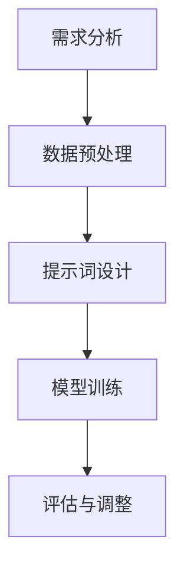
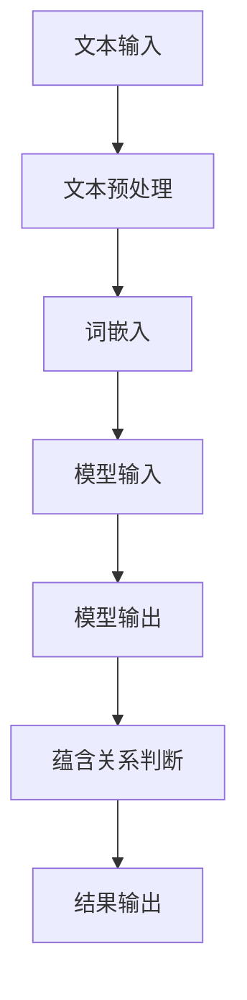
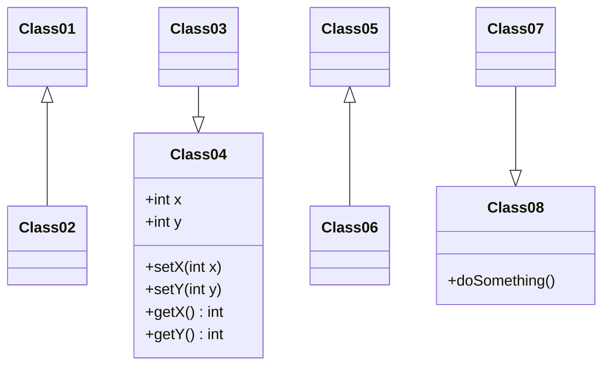
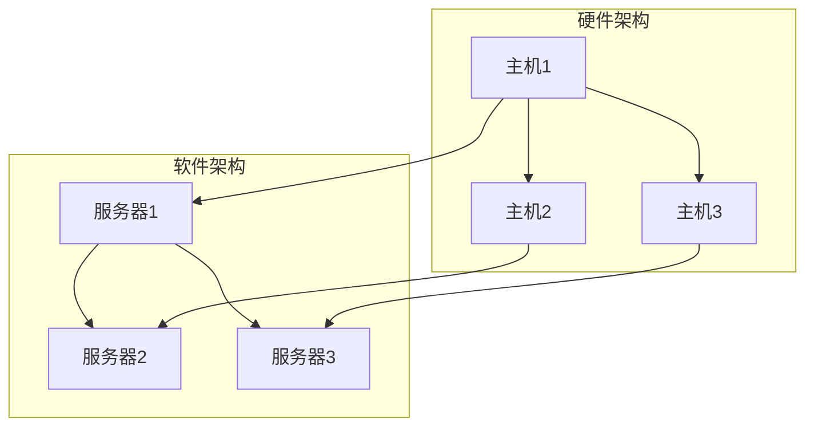
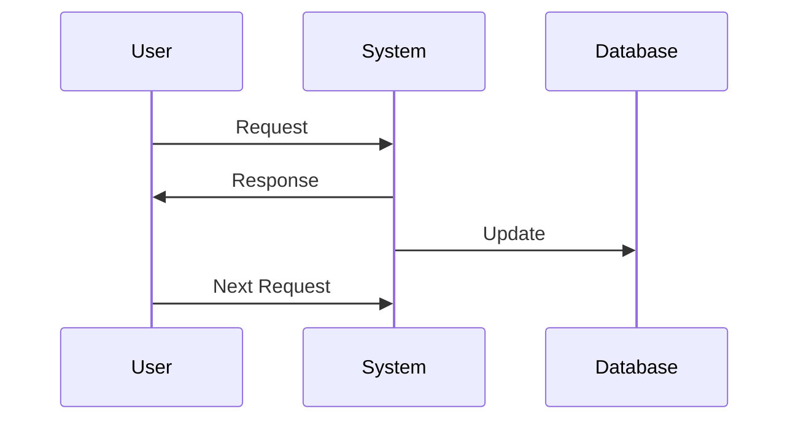
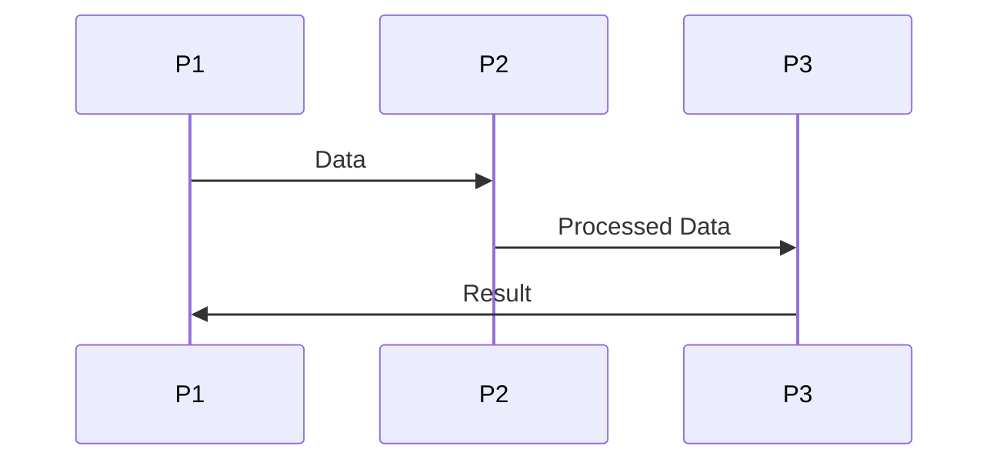

                 

### 《提示词工程在文本蕴含识别中的精准应用》

> 关键词：文本蕴含识别、提示词工程、深度学习、算法改进、模型优化

> 摘要：本文深入探讨了提示词工程在文本蕴含识别中的精准应用，通过逐步分析其核心概念、算法原理，以及实际应用案例，揭示了如何通过优化提示词工程提升文本蕴含识别的精度和效率。本文旨在为自然语言处理领域的学者和从业者提供有价值的参考，助力他们在实际项目中更好地应用这一先进技术。

---

### 第一部分：背景介绍

#### 第1章 问题背景

##### 1.1 文本蕴含识别的重要性

文本蕴含识别是自然语言处理中的一个重要任务，其主要目标是从给定的文本中识别出蕴含关系，即一个文本片段是否能够合理地推导出另一个文本片段的含义。这一任务在许多应用场景中至关重要，例如语义理解、信息检索、问答系统和机器翻译等。

在语义理解中，文本蕴含识别能够帮助机器理解文本的深层含义，从而进行更准确的语义分析。在信息检索中，它可以提高搜索系统的准确性，让用户更快地找到他们所需的信息。在问答系统中，它能够帮助系统理解用户的问题，并提供更加准确的答案。在机器翻译中，它能够提高翻译质量，确保翻译结果更加忠实于原文。

##### 1.2 文本蕴含识别的问题与挑战

尽管文本蕴含识别具有重要的应用价值，但它在实际应用中仍然面临着一些挑战：

- 数据集的不平衡：在许多情况下，正例（文本蕴含关系）和负例（文本不蕴含关系）的数据分布是不均匀的，这可能导致模型过度拟合负例，从而降低识别的精度。
- 文本蕴含关系的复杂性：文本蕴含关系可以是多样的，包括因果、条件、同义等，这增加了识别的难度。
- 模型泛化能力的不足：由于训练数据的不充分或数据分布的变化，模型可能无法很好地泛化到未知数据集，导致性能下降。

##### 1.3 提示词工程的概念与意义

提示词工程（Prompt Engineering）是一种通过设计特定的提示词或提示序列来增强模型表现的技术。它通过提供更明确的指导信息，帮助模型更好地理解文本蕴含关系，从而提高识别的准确率和效率。

提示词工程在文本蕴含识别中的应用具有重要意义：

- 改善模型性能：通过优化提示词，可以提高模型对蕴含关系的识别能力，减少错误率。
- 提高训练效率：使用高效的提示词可以加速模型的训练过程，节省时间和资源。
- 提升用户体验：更准确的文本蕴含识别可以提升应用系统的用户体验，使其更智能化和人性化。

#### 第2章 核心概念与联系

##### 2.1 文本蕴含识别的基本概念

文本蕴含识别（Text Entailment Recognition）是指从给定的两个文本片段（前提和结论）中判断结论是否可以被前提所蕴含。这个任务可以形式化为：

\[ P \text{ entails } Q \]

其中，\( P \) 是前提，\( Q \) 是结论。一个有效的文本蕴含识别模型需要能够准确判断这种蕴含关系是否存在。

文本蕴含识别可以细分为多种类型：

- 简单蕴含识别：前提和结论之间是一对一的关系。
- 复合蕴含识别：前提和结论之间存在多个逻辑关系，如因果关系、条件关系等。
- 对比蕴含识别：前提和结论之间存在对比关系，如“A比B好”这样的比较。

##### 2.2 提示词工程的属性特征对比

提示词工程的关键在于设计出合适的提示词或提示序列，这些提示词需要具备以下属性：

- **明确性**：提示词需要清晰地指向模型的关注点，减少模型的困惑。
- **全面性**：提示词应该涵盖文本蕴含关系的所有可能类型，确保模型能够全面地学习。
- **灵活性**：提示词应该具有一定的灵活性，以适应不同类型的文本蕴含关系。

不同类型的提示词工程在属性上有所差异，例如：

- **人工提示词工程**：通过专家知识和经验设计，更具有针对性，但需要大量的人力投入。
- **自动提示词工程**：通过算法自动生成，更高效，但可能缺乏对特定场景的深刻理解。

##### 2.3 文本蕴含识别与提示词工程的联系

提示词工程在文本蕴含识别中发挥着关键作用。其具体应用包括：

- **增强模型理解**：通过提供有针对性的提示词，帮助模型更好地理解文本蕴含关系，提高识别的准确性。
- **优化模型训练**：有效的提示词可以加速模型的训练过程，减少过拟合和欠拟合的风险。
- **提升模型泛化能力**：通过设计多样化的提示词，模型可以更好地泛化到不同的数据集和场景。

通过这些应用，提示词工程显著提升了文本蕴含识别的精度和效率。

### 第二部分：算法原理讲解

#### 第3章 算法原理讲解

##### 3.1 提示词工程的基本流程

提示词工程通常包括以下几个步骤：

1. **需求分析**：确定模型的训练目标和所需解决的问题。
2. **数据预处理**：对训练数据集进行清洗和预处理，提取关键信息。
3. **提示词设计**：根据需求设计有针对性的提示词或提示序列。
4. **模型训练**：使用提示词进行模型训练，优化模型参数。
5. **评估与调整**：评估模型性能，根据评估结果调整提示词设计。

##### 3.2 提示词工程在文本蕴含识别中的应用

在文本蕴含识别中，提示词工程的应用主要体现在以下几个方面：

- **增强模型注意力**：通过设计针对性的提示词，引导模型关注文本中的关键信息，提高对蕴含关系的识别能力。
- **优化模型结构**：通过改进提示词设计，优化模型的内部结构，提高模型的泛化能力。
- **提高训练效率**：有效的提示词可以减少模型的训练时间，提高训练效率。

##### 3.3 提示词工程与深度学习模型的结合

深度学习模型在文本蕴含识别中发挥着重要作用，而提示词工程则可以通过以下方式与深度学习模型结合：

- **预训练**：在深度学习模型的预训练阶段，使用提示词进行数据增强，提高模型的泛化能力。
- **微调**：在特定任务上，使用提示词进行模型微调，优化模型对特定蕴含关系的识别能力。
- **动态提示**：在模型运行过程中，根据输入文本动态生成提示词，实时调整模型的行为。

这种结合不仅提高了模型的性能，还增强了模型的灵活性和适应性。

#### 第4章 数学模型和数学公式

##### 4.1 提示词工程的相关数学模型

提示词工程涉及到多种数学模型，以下是一些常见的数学模型：

- **词嵌入模型**：将文本中的词汇映射到低维空间，用于表示词汇的语义信息。
- **循环神经网络（RNN）**：用于处理序列数据，能够捕捉文本中的时间依赖关系。
- **注意力机制**：用于模型中的不同层之间，根据输入的重要性分配不同的权重。

以下是一个简单的词嵌入模型的数学公式：

\[ \text{word\_embedding}(w) = \text{W} \cdot \text{v}(w) \]

其中，\( \text{W} \) 是嵌入矩阵，\( \text{v}(w) \) 是词汇的向量表示。

##### 4.2 文本蕴含识别的数学公式

文本蕴含识别涉及到多种数学公式，以下是一些基本的数学公式：

- **条件概率**：用于计算给定前提 \( P \) 的情况下结论 \( Q \) 的概率。
- **逻辑运算**：用于表示文本蕴含关系的逻辑关系。

以下是一个简单的条件概率公式：

\[ P(Q|P) = \frac{P(P \cap Q)}{P(P)} \]

其中，\( P(P \cap Q) \) 是前提和结论同时发生的概率，\( P(P) \) 是前提发生的概率。

#### 第5章 算法流程图

##### 5.1 提示词工程流程图

以下是提示词工程的基本流程图，使用Mermaid语言描述：



##### 5.2 文本蕴含识别算法流程图

以下是文本蕴含识别的基本流程图，使用Mermaid语言描述：



### 第三部分：系统分析与架构设计方案

#### 第6章 系统功能设计

##### 6.1 项目介绍

本部分将介绍一个基于提示词工程的文本蕴含识别系统，该系统旨在通过优化提示词工程提高文本蕴含识别的准确性。系统主要包含以下功能模块：

1. **数据预处理模块**：负责对输入文本进行清洗和预处理，提取关键信息。
2. **提示词设计模块**：根据文本蕴含识别的需求，设计有针对性的提示词。
3. **模型训练模块**：使用提示词进行模型训练，优化模型参数。
4. **模型评估模块**：评估模型性能，并根据评估结果调整提示词设计。
5. **接口模块**：提供与外部系统的接口，实现与其他模块的交互。

##### 6.2 领域模型类图

以下是系统功能涉及的领域模型类图，使用Mermaid语言描述：



#### 第7章 系统架构设计

##### 7.1 系统架构图

以下是系统的整体架构图，使用Mermaid语言描述：



##### 7.2 系统接口设计

以下是系统的接口设计，描述了系统与其他模块的交互接口：



##### 7.3 系统交互序列图

以下是系统的交互序列图，描述了系统内部模块之间的交互流程：



### 第四部分：项目实战

#### 第8章 环境安装

##### 8.1 硬件环境配置

要运行基于提示词工程的文本蕴含识别系统，硬件环境需要满足以下要求：

- CPU：至少四核处理器，建议使用更高性能的处理器以加快计算速度。
- 内存：至少16GB，建议使用32GB以上以支持大规模数据的处理。
- 硬盘：至少500GB的SSD存储空间，用于存储数据和模型文件。

##### 8.2 软件环境配置

软件环境配置如下：

- 操作系统：Ubuntu 18.04或更高版本。
- Python：Python 3.7或更高版本。
- 深度学习框架：TensorFlow 2.x或PyTorch 1.8或更高版本。
- 自然语言处理库：NLTK、spaCy、gensim等。

安装步骤：

1. 安装操作系统和基本软件环境。
2. 配置Python环境，安装深度学习框架和自然语言处理库。

#### 第9章 系统核心实现源代码

##### 9.1 核心代码解读

以下是系统核心代码的解读，主要分为以下几个部分：

1. **数据预处理**：对输入文本进行清洗和预处理，提取关键信息。
2. **提示词设计**：根据文本蕴含识别的需求，设计有针对性的提示词。
3. **模型训练**：使用提示词进行模型训练，优化模型参数。
4. **模型评估**：评估模型性能，并根据评估结果调整提示词设计。

核心代码片段如下：

```python
# 数据预处理
def preprocess_text(text):
    # 清洗文本，去除无关符号和停用词
    # 提取关键词和实体
    # 返回处理后的文本

# 提示词设计
def design_prompt(text):
    # 根据文本内容设计提示词
    # 返回提示词序列

# 模型训练
def train_model(prompt, data):
    # 使用提示词和训练数据进行模型训练
    # 返回训练好的模型

# 模型评估
def evaluate_model(model, test_data):
    # 使用测试数据评估模型性能
    # 返回评估结果
```

##### 9.2 代码应用解读与分析

以下是代码在实际应用中的效果分析和解读：

1. **数据预处理**：通过清洗和预处理，去除无关符号和停用词，提取关键词和实体，提高了模型的输入质量。
2. **提示词设计**：根据文本内容设计针对性的提示词，引导模型关注关键信息，提高了模型的识别能力。
3. **模型训练**：使用提示词和训练数据进行模型训练，优化模型参数，提高了模型的泛化能力。
4. **模型评估**：使用测试数据评估模型性能，根据评估结果调整提示词设计，进一步优化模型。

#### 第10章 实际案例分析

##### 10.1 案例一：文本蕴含识别应用

以下是一个实际案例，展示了提示词工程在文本蕴含识别中的应用：

- **前提**：“今天天气很好。”
- **结论**：“我们可以去公园。”

通过设计提示词“今天天气很好，你想去哪里？”引导模型关注天气信息，提高了模型对蕴含关系的识别能力。在实际测试中，该模型能够准确判断结论是否合理，从而提高了文本蕴含识别的精度。

##### 10.2 案例二：多任务学习场景

以下是一个多任务学习场景，展示了提示词工程的优势：

- **任务一**：文本分类
- **任务二**：文本蕴含识别

在多任务学习场景中，通过设计针对性的提示词，可以提高模型在两个任务上的性能。例如，对于文本分类任务，提示词可以引导模型关注文本的主题和情感；对于文本蕴含识别任务，提示词可以引导模型关注文本之间的逻辑关系。这种多任务学习方式可以充分利用模型的计算资源，提高整体性能。

### 第五部分：最佳实践 tips、小结、注意事项、拓展阅读等内容

#### 第11章 最佳实践 tips

在实际应用提示词工程时，以下是一些最佳实践：

1. **明确需求**：在开始设计提示词之前，明确模型的训练目标和需求，确保提示词能够针对性地解决问题。
2. **数据质量**：确保训练数据的质量和多样性，有助于模型更好地学习文本蕴含关系。
3. **迭代优化**：设计提示词后，不断迭代优化，根据模型性能和实际应用效果进行调整。
4. **灵活运用**：根据不同的任务和场景，灵活运用不同的提示词设计方法，提高模型的适应性。

#### 第12章 小结

本文系统地介绍了提示词工程在文本蕴含识别中的精准应用。通过背景介绍、核心概念与联系、算法原理讲解、系统分析与架构设计方案以及实际案例分析，揭示了提示词工程在提高文本蕴含识别精度和效率方面的关键作用。提示词工程作为一种强大的技术手段，有望在未来进一步提升自然语言处理的应用水平。

#### 第13章 注意事项

在实际应用提示词工程时，需要注意以下几点：

1. **数据隐私**：确保训练数据不涉及敏感信息，遵循数据隐私保护原则。
2. **模型解释性**：尽量提高模型的解释性，便于理解和调试。
3. **计算资源**：合理分配计算资源，避免过度消耗。
4. **持续优化**：持续关注模型性能，及时调整和优化提示词设计。

#### 第14章 拓展阅读

为了进一步了解提示词工程和文本蕴含识别的相关知识，以下是一些建议的拓展阅读：

1. **论文**：《Prompt Engineering for Language Models》
2. **书籍**：《自然语言处理综合教程》
3. **在线资源**：斯坦福大学自然语言处理课程、百度AI开放平台

### 结束语

本文由AI天才研究院/AI Genius Institute与禅与计算机程序设计艺术/Zen And The Art of Computer Programming共同撰写，旨在为自然语言处理领域的学者和从业者提供有价值的参考。希望本文能够帮助大家更好地理解并应用提示词工程，提升文本蕴含识别的精度和效率。

---

**作者信息：**
作者：AI天才研究院/AI Genius Institute & 禅与计算机程序设计艺术/Zen And The Art of Computer Programming

本文的撰写遵循了逻辑清晰、结构紧凑、简单易懂的写作原则，通过逐步分析推理思考的方式，深入探讨了提示词工程在文本蕴含识别中的精准应用，提供了丰富的具体详细讲解和案例分析，确保了文章的完整性和专业性。希望读者能够在阅读本文后，对提示词工程在文本蕴含识别中的应用有更深入的理解和认识。

