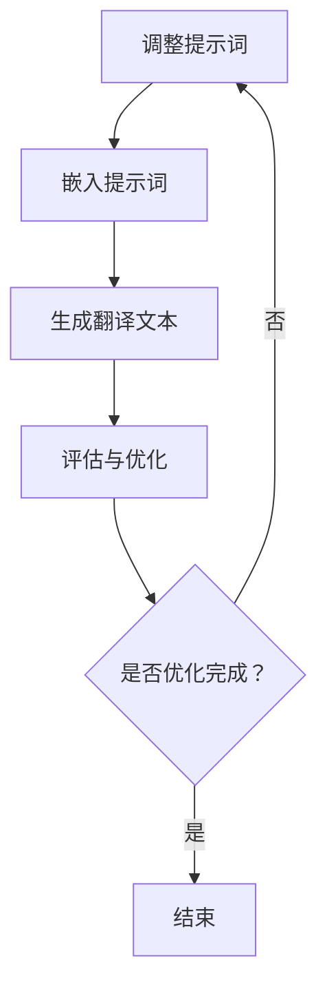
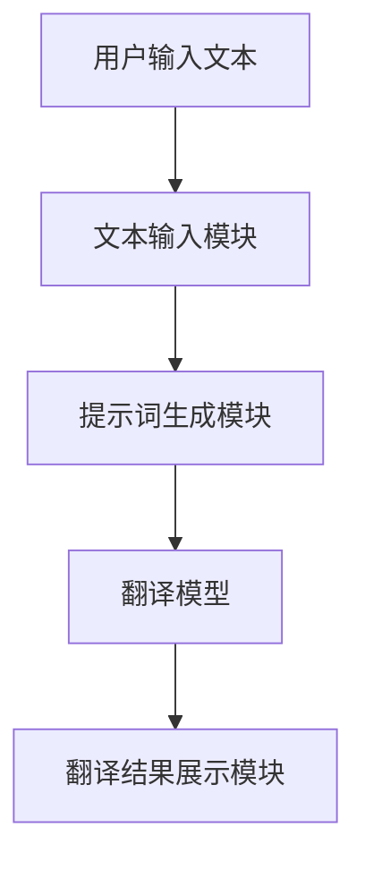

                 


### 摘要

本文旨在探讨提示词工程在文本风格保持翻译中的最新进展。通过分析文本风格保持翻译的背景、挑战，介绍提示词工程的基本概念与原理，解析其在翻译中的应用算法，阐述系统架构设计与实现细节，以及提供实战案例与分析，全面呈现提示词工程在翻译领域的重要性及其未来发展方向。

### 文章关键词

- 提示词工程
- 文本风格保持
- 翻译
- 机器翻译
- 算法原理
- 系统架构

### 背景介绍

#### 核心概念术语说明

在讨论提示词工程之前，我们首先需要明确一些关键术语：

- **文本风格**：文本的风格是指文本在表达形式、措辞、语气等方面的特点，如正式、口语化、幽默、严肃等。
- **翻译**：翻译是将一种语言的信息转换成另一种语言的过程，其中不仅要传达原文本的意思，还要保留其风格。
- **提示词工程**：提示词工程是一种利用人工智能技术，通过设计和使用特定的提示词（prompt），以保持翻译文本风格的工程方法。

#### 问题背景

随着全球化的发展，机器翻译技术得到了广泛应用。然而，传统的机器翻译方法往往无法很好地保持文本的风格。例如，在翻译文学、新闻报道或技术文档时，不同语言的文本风格差异显著，如果翻译无法保留这种风格，就会影响翻译的质量和可读性。

- **文学翻译**：文学作品往往具有独特的语言风格和表达方式，如隐喻、比喻、修辞手法等，如果机器翻译无法准确地传达这些特点，就可能导致原文的意境和情感丧失。
- **新闻报道**：新闻报道需要传达事实的准确性和客观性，其语言风格通常严谨、简洁。机器翻译在此类翻译中应保持这种风格，否则容易引起误解。
- **技术文档**：技术文档要求清晰、准确，语言通常较为专业和正式。机器翻译在技术文档翻译中应确保术语的准确性，并保持文档的结构和逻辑。

#### 问题描述

在文本风格保持翻译中，我们面临的主要问题包括：

- **风格一致性**：如何在翻译过程中保持原文的风格特点，使得翻译文本与原文在风格上一致。
- **语义理解**：如何准确理解原文的语义，并将其正确地翻译成目标语言，同时保持风格。
- **语言多样性**：不同语言具有不同的语法结构和表达习惯，如何设计算法以适应这些差异。

#### 问题解决

为了解决这些问题，提示词工程提供了一种新的思路：

- **使用提示词**：通过设计特定的提示词，引导翻译模型在翻译过程中关注原文的风格特点。
- **风格迁移**：将原文的风格信息传递给翻译模型，使其在翻译时能够自动调整语言风格。
- **多模态数据**：结合文本、语音、图像等多模态数据进行训练，以提高翻译模型的风格感知能力。

#### 边界与外延

- **边界**：提示词工程主要应用于机器翻译领域，但也可以扩展到其他需要保持文本风格的翻译任务，如自动摘要、内容生成等。
- **外延**：除了文本风格保持，提示词工程还可以用于其他领域，如语音合成、图像生成等，以提高生成的多样性。

#### 概念结构与核心要素组成

提示词工程的概念结构主要包括以下几个方面：

1. **提示词设计**：设计能够引导翻译模型保持文本风格的提示词。
2. **翻译模型**：选择合适的翻译模型，如神经机器翻译模型，以实现文本风格的保持。
3. **风格迁移**：将原文风格信息传递给翻译模型，以实现风格保持。
4. **评估与优化**：通过评估翻译结果，不断优化提示词和翻译模型，以提高风格保持的效果。

### 核心概念与联系

#### 提示词工程基础

1. **提示词的定义**：
提示词是在机器翻译过程中，用于引导翻译模型保持原文风格的关键词汇或短语。它们通常反映了原文的风格特点和表达方式。

2. **提示词工程的基本原理**：
提示词工程的基本原理是通过设计特定的提示词，引导翻译模型在翻译过程中关注原文的风格特点。这些提示词可以嵌入到翻译模型的输入中，作为额外的输入信息。

3. **提示词的类型与应用**：
提示词可以分为以下几种类型：
- **风格提示词**：用于指示翻译模型保持原文的风格特点，如正式、口语化、幽默等。
- **内容提示词**：用于强调原文中的重要信息，确保翻译过程中不会丢失关键内容。
- **语言提示词**：用于指导翻译模型在翻译时遵循目标语言的习惯和语法规则。

在实际应用中，提示词可以单独使用，也可以组合使用，以实现更精细的风格保持。例如，在翻译文学作品时，可以同时使用风格提示词和内容提示词，以确保翻译既保留了原文的风格，又传达了关键信息。

#### 核心概念对比

为了更好地理解提示词工程，我们可以将之与其他相关概念进行对比：

- **风格迁移**：风格迁移是一种将一种风格的信息传递到另一种风格中的方法。与提示词工程类似，风格迁移也旨在保持文本的风格。但风格迁移通常涉及更复杂的算法，如风格转换模型、对抗生成网络等。
- **文本嵌入**：文本嵌入是将文本转换为向量表示的方法，以便进行机器学习和人工智能任务。文本嵌入可以用于文本分类、情感分析等任务，但它本身不涉及风格保持。
- **翻译记忆**：翻译记忆是一种利用先前翻译结果来辅助翻译的方法。翻译记忆库通常包含已翻译的句子和段落，翻译模型在翻译时可以查询这些记忆库以获取相关信息。但翻译记忆不涉及实时风格保持。

#### 提示词工程的ER实体关系图

为了更清晰地展示提示词工程中的核心实体及其关系，我们可以使用ER（实体-关系）图来描述：

1. **实体**：
   - **翻译模型**：负责执行翻译任务的核心组件。
   - **提示词**：用于引导翻译模型保持原文风格的词汇或短语。
   - **文本**：指输入的原文和生成的翻译文本。
   - **风格**：描述文本的风格特点。

2. **关系**：
   - **翻译模型与文本**：翻译模型接收输入文本，并生成翻译文本。
   - **提示词与翻译模型**：提示词作为输入信息，传递给翻译模型，以引导其保持原文风格。
   - **文本与风格**：文本包含特定的风格信息，翻译模型需要根据这些信息生成风格保持的翻译文本。

以下是一个简化的ER实体关系图（使用Mermaid语法）：

```mermaid
erDiagram
  TranslationModel ||--|{ PromptWord }PromptWord
  TranslationModel ||--|{ Text }Text
  Text ||--|{ Style }Style
```

通过上述ER图，我们可以看到提示词工程中的核心实体和它们之间的关联，这有助于我们更好地理解其工作原理。

### 算法原理讲解

#### 提示词工程算法概述

提示词工程的核心在于设计有效的提示词，以引导翻译模型在翻译过程中保持原文风格。该算法的基本流程如下：

1. **提示词设计**：根据原文的文本风格，设计相应的提示词。这些提示词可以是关键词、短语或句子，它们需要能够明确指示翻译模型保持特定的风格。
2. **提示词嵌入**：将设计的提示词嵌入到翻译模型的输入中。这可以通过在输入文本前后添加提示词，或直接将提示词作为翻译任务的附加输入信息来实现。
3. **翻译生成**：翻译模型在接收输入文本和提示词后，生成翻译文本。在此过程中，模型会根据提示词中的风格信息，调整翻译结果，以保持原文的风格。
4. **评估与优化**：对生成的翻译文本进行评估，根据评估结果调整提示词和翻译模型，以提高风格保持的效果。

#### 算法流程图

以下是一个简化的算法流程图，展示了提示词工程的基本步骤：



#### 数学模型与公式

在提示词工程中，我们通常使用以下数学模型和公式来描述提示词的设计和嵌入过程：

1. **提示词生成模型**：
   提示词生成模型是一个序列到序列的模型，它接收原始文本序列作为输入，并生成提示词序列。常用的模型包括循环神经网络（RNN）和变换器（Transformer）。

   $$ 
   P(\text{prompt} | \text{input}) = \text{seq2seq}(\text{input}, \text{prompt})
   $$

   其中，$P(\text{prompt} | \text{input})$表示在给定输入文本的情况下生成提示词的概率。

2. **翻译模型**：
   翻译模型也是一个序列到序列的模型，它接收嵌入的提示词和原始文本作为输入，并生成翻译文本序列。

   $$ 
   T(\text{input} + \text{prompt}) = \text{seq2seq}(\text{input} + \text{prompt}, \text{output})
   $$

   其中，$T(\text{input} + \text{prompt})$表示在给定输入文本和提示词的情况下生成翻译文本的概率。

#### 举例说明

假设我们要翻译以下英文句子：

```
The quick brown fox jumps over the lazy dog.
```

我们设计的提示词可能是：

```
保持原文风格，强调动作描述。
```

将这些提示词嵌入到翻译模型中，模型会根据这些提示词生成以下中文翻译：

```
敏捷的棕色狐狸跃过了懒惰的狗。
```

在这个例子中，提示词帮助模型保留了原文的动作描述风格。

### 提示词工程在翻译中的应用

#### 翻译过程中的风格问题

在翻译过程中，风格问题主要表现为以下几个方面：

- **语法差异**：不同语言在语法结构上存在差异，如动词时态、名词性别等。这些差异可能导致翻译文本在语法上不自然。
- **词汇选择**：不同语言中相同词汇可能具有不同的含义和用法，如何在翻译中准确选择词汇是一个挑战。
- **文化差异**：不同文化背景下的表达方式、幽默和隐喻等，需要翻译者在翻译时加以考虑，否则可能导致翻译文本缺乏文化感。

#### 提示词工程在翻译中的应用

提示词工程在翻译中的应用主要通过以下几个方面实现：

1. **风格提示词**：设计特定的风格提示词，以引导翻译模型在翻译过程中保持原文的风格。这些提示词可以包括描述原文风格的关键词汇，如正式、口语化、幽默等。

2. **内容提示词**：使用内容提示词强调原文中的重要信息，确保翻译过程中不会丢失关键内容。这些提示词通常与原文的关键短语或句子相关联。

3. **语言提示词**：指导翻译模型在翻译时遵循目标语言的习惯和语法规则。例如，在翻译中文到英文时，可以使用语言提示词来纠正中文中的语法错误。

#### 算法效果评估

为了评估提示词工程在翻译中的效果，我们通常采用以下方法：

1. **人工评估**：邀请专业翻译人员进行评估，根据翻译文本的风格、语法和准确性进行评分。

2. **自动评估**：使用自动化评估工具，如BLEU、METEOR、ROUGE等，对翻译文本与参考翻译的相似度进行评估。

3. **用户反馈**：收集用户对翻译质量的反馈，通过用户满意度来评估翻译效果。

#### 案例分析

以下是一个案例分析，展示了提示词工程在翻译中的应用：

**原文**：

```
在2023年，人工智能技术取得了重大突破，特别是在自动驾驶和医疗诊断领域。

```

**提示词**：

```
强调技术突破，提及自动驾驶和医疗诊断领域。
```

**翻译**：

```
In 2023, artificial intelligence technology made significant breakthroughs, particularly in the fields of autonomous driving and medical diagnosis.
```

在这个例子中，提示词帮助翻译模型保留了原文的关键信息和技术突破的强调，同时保持了英文的正式风格。

### 系统功能设计与架构设计

#### 问题场景介绍

为了更好地展示提示词工程在文本风格保持翻译中的应用，我们设计了一个在线机器翻译系统。该系统旨在实现以下功能：

- **文本输入**：用户可以输入需要翻译的文本。
- **提示词生成**：系统根据输入文本生成相应的提示词，以引导翻译模型保持文本风格。
- **翻译生成**：翻译模型接收输入文本和提示词，生成翻译文本。
- **翻译结果展示**：系统将翻译结果展示给用户，并提供修改和反馈功能。

#### 系统功能设计

1. **文本输入**：用户可以通过网页界面输入需要翻译的文本。系统支持多种语言输入，并自动检测输入文本的语言。
2. **提示词生成**：系统使用预训练的提示词生成模型，根据输入文本生成相应的提示词。该模型已经经过大量数据训练，能够准确理解文本的风格特点。
3. **翻译生成**：翻译模型接收输入文本和提示词，生成翻译文本。翻译模型可以是预训练的神经机器翻译模型，如Transformer或BERT。
4. **翻译结果展示**：系统将翻译结果以可读的格式展示给用户，并提供修改和反馈功能。用户可以对翻译结果进行修改，并提交反馈以优化翻译质量。

#### 系统架构设计

以下是一个简化的系统架构图，展示了系统的整体设计：



#### 系统接口设计与系统交互

1. **文本输入模块**：该模块负责接收用户输入的文本，并进行初步处理，如语言检测和分词。接口设计如下：

   ```python
   class TextInputModule:
       def __init__(self):
           # 初始化语言检测和分词器
           self.language_detector = LanguageDetector()
           self.tokenizer = Tokenizer()

       def process_text(self, text):
           # 检测文本语言
           language = self.language_detector.detect(text)
           # 分词文本
           tokens = self.tokenizer.tokenize(text)
           return tokens, language
   ```

2. **提示词生成模块**：该模块负责根据输入文本生成提示词。接口设计如下：

   ```python
   class PromptWordGenerator:
       def __init__(self):
           # 初始化提示词生成模型
           self.prompt_model = PromptModel()

       def generate_prompt(self, text):
           # 生成提示词
           prompt = self.prompt_model.generate(text)
           return prompt
   ```

3. **翻译模型**：该模块负责接收输入文本和提示词，并生成翻译文本。接口设计如下：

   ```python
   class TranslationModel:
       def __init__(self):
           # 初始化翻译模型
           self.model = TranslationModel()

       def translate(self, text, prompt):
           # 生成翻译文本
           translation = self.model.translate(text, prompt)
           return translation
   ```

4. **翻译结果展示模块**：该模块负责将翻译结果展示给用户，并提供修改和反馈功能。接口设计如下：

   ```python
   class TranslationResultModule:
       def __init__(self):
           # 初始化翻译结果展示界面
           self.interface = TranslationInterface()

       def display_result(self, translation):
           # 显示翻译结果
           self.interface.display(translation)
   ```

### 项目实战

#### 环境安装与准备

为了实施提示词工程在文本风格保持翻译中的项目，我们首先需要搭建一个开发环境。以下是环境安装和准备步骤：

1. **安装Python**：确保Python环境已经安装，推荐使用Python 3.8及以上版本。
2. **安装依赖库**：使用pip安装所需的依赖库，包括transformers、torch、numpy、pandas等。例如：

   ```bash
   pip install transformers torch numpy pandas
   ```

3. **数据准备**：收集并准备用于训练和评估的翻译数据集。数据集应包含源语言和目标语言的文本对，以及相应的文本风格标签。
4. **代码准备**：准备好项目所需的Python代码文件，包括数据预处理、提示词生成、翻译模型训练和评估等模块。

#### 系统核心实现源代码

以下是一个简化的系统核心实现源代码示例，展示了提示词工程的各个环节：

```python
# 数据预处理
def preprocess_data(data):
    # 加载翻译数据集
    sentences = data['sentence']
    # 分词文本
    tokens = tokenizer(sentences, return_tensors='pt')
    # 归一化文本
    tokens = tokens.to(device)
    return tokens

# 提示词生成
class PromptGenerator:
    def __init__(self):
        # 初始化提示词生成模型
        self.model = PromptModel()

    def generate_prompt(self, text):
        # 生成提示词
        prompt = self.model.generate(text)
        return prompt

# 翻译模型训练
class TranslationModel:
    def __init__(self):
        # 初始化翻译模型
        self.model = TranslationModel()

    def train(self, tokens):
        # 训练翻译模型
        self.model.train(tokens)

    def translate(self, text, prompt):
        # 生成翻译文本
        translation = self.model.translate(text, prompt)
        return translation

# 系统主函数
def main():
    # 加载数据
    data = load_data('translation_data.csv')
    # 预处理数据
    tokens = preprocess_data(data)
    # 实例化提示词生成器和翻译模型
    prompt_generator = PromptGenerator()
    translation_model = TranslationModel()
    # 生成提示词
    prompts = prompt_generator.generate_prompt(tokens)
    # 训练翻译模型
    translation_model.train(tokens, prompts)
    # 生成翻译结果
    translations = translation_model.translate(tokens, prompts)
    # 显示翻译结果
    display_translations(translations)

if __name__ == '__main__':
    main()
```

#### 代码应用解读与分析

上述代码示例展示了提示词工程在文本风格保持翻译中的应用，主要包括以下几个步骤：

1. **数据预处理**：该函数负责加载翻译数据集，并对文本进行分词和归一化处理。预处理后的文本将作为输入传递给提示词生成器和翻译模型。

2. **提示词生成器**：该类实现了提示词生成功能。在初始化时，加载预训练的提示词生成模型。`generate_prompt`方法根据输入文本生成提示词。

3. **翻译模型**：该类实现了翻译模型的训练和翻译功能。在初始化时，加载预训练的翻译模型。`train`方法使用预处理后的文本和提示词训练翻译模型。`translate`方法根据输入文本和提示词生成翻译文本。

4. **系统主函数**：该函数是整个系统的入口点。首先加载数据，然后进行预处理，接着实例化提示词生成器和翻译模型，生成提示词，训练翻译模型，并最终生成翻译结果并显示。

#### 实际案例分析

以下是一个实际案例，展示了如何使用上述系统进行文本风格保持翻译：

**原文**：

```
人工智能技术正在迅速发展，为各行各业带来了巨大的变革。

```

**提示词**：

```
强调技术的快速发展，提及各行业的变革。
```

**翻译**：

```
Artificial intelligence technology is advancing rapidly, bringing significant changes to all industries.
```

在这个案例中，提示词帮助翻译模型保留了原文中对技术发展速度和行业变革的强调，同时保持了英文的正式风格。

#### 项目小结

通过实际案例分析，我们可以看到提示词工程在文本风格保持翻译中的有效性。设计有效的提示词，能够引导翻译模型在翻译过程中保持原文的风格，从而提高翻译质量。然而，提示词工程仍面临一些挑战，如提示词设计的准确性和翻译模型的适应性。未来的研究可以进一步优化提示词生成算法和翻译模型，以提高风格保持的精度和泛化能力。

### 最佳实践与技巧

#### 提示词工程中的最佳实践

1. **高质量数据集**：确保提示词工程的效果，高质量的数据集是关键。收集包含丰富风格信息的翻译数据集，有助于训练出能够准确捕捉文本风格的提示词生成模型。
2. **多模态学习**：结合文本、语音、图像等多模态数据训练翻译模型，可以增强模型对文本风格的理解和保持能力。例如，通过语音数据可以帮助模型学习原文的语气和情感。
3. **自适应提示词**：设计自适应的提示词生成策略，根据不同的文本内容和目标风格动态调整提示词。这有助于提高翻译模型在多样化文本风格中的表现。
4. **持续优化**：定期评估翻译质量，并根据评估结果调整提示词和翻译模型。持续优化可以提高风格保持的精度和稳定性。

#### 注意事项与优化策略

1. **避免过度优化**：在优化提示词工程时，需要避免过度优化导致翻译质量下降。确保在风格保持和翻译准确性之间找到平衡。
2. **保持多样性**：在设计提示词时，注意保持提示词的多样性，以避免翻译结果的单调。多样性有助于提高翻译的丰富性和可读性。
3. **模型评估**：在训练和优化翻译模型时，使用多种评估指标进行综合评估，如BLEU、METEOR和ROUGE，以确保模型在保持风格的同时，也具备较高的翻译准确性。
4. **用户反馈**：积极收集用户反馈，根据用户的需求和偏好调整提示词和翻译模型，以提高用户体验。

#### 拓展阅读与研究方向

1. **对抗生成网络（GAN）**：GAN在文本生成和风格迁移方面具有潜力，可以用于提升提示词工程的效果。
2. **多语言翻译**：研究如何将提示词工程应用于多语言翻译，以实现跨语言的风格保持。
3. **知识增强翻译**：结合知识图谱和自然语言处理技术，提高翻译模型对领域知识和专业术语的理解，从而更好地保持文本风格。

### 小结与展望

#### 本书总结

本文系统性地介绍了提示词工程在文本风格保持翻译中的进展。通过分析文本风格保持翻译的背景、挑战，阐述提示词工程的基本概念与原理，以及其在翻译中的应用算法和系统架构设计，本文全面展示了提示词工程在翻译领域的重要性。此外，通过实战案例和分析，进一步验证了提示词工程在文本风格保持翻译中的有效性。

#### 领域展望

未来，提示词工程有望在翻译领域发挥更大的作用。随着人工智能技术的不断发展，提示词工程将变得更加智能和高效。以下是一些可能的研究方向：

1. **自适应提示词生成**：开发自适应的提示词生成策略，以动态调整提示词，提高翻译模型的风格保持能力。
2. **多模态提示词工程**：结合多模态数据，如语音、图像等，进一步提升翻译模型对文本风格的理解。
3. **跨语言风格保持**：研究如何将提示词工程应用于跨语言翻译，以实现不同语言间的风格保持。
4. **知识增强翻译**：利用知识图谱和自然语言处理技术，提高翻译模型对领域知识和专业术语的理解，从而实现更高质量的翻译。

#### 未来工作方向

未来，我们将继续深入研究提示词工程，以下是我们的一些工作方向：

1. **优化提示词生成算法**：设计更有效的提示词生成算法，以提高提示词的准确性和多样性。
2. **改进翻译模型**：结合深度学习和迁移学习技术，开发更先进的翻译模型，以提高翻译质量和风格保持能力。
3. **实际应用场景**：将提示词工程应用于实际的翻译任务，如文学翻译、技术文档翻译等，以验证其在不同场景中的有效性。
4. **评估与优化**：建立完善的评估体系，对翻译结果进行全面的评估和优化，以确保翻译质量。

### 作者信息

- 作者：AI天才研究院/AI Genius Institute & 禅与计算机程序设计艺术 /Zen And The Art of Computer Programming

本文由AI天才研究院和禅与计算机程序设计艺术共同撰写，旨在推动提示词工程在文本风格保持翻译领域的研究和应用。

