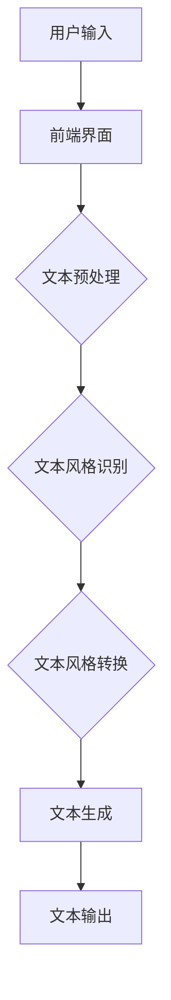
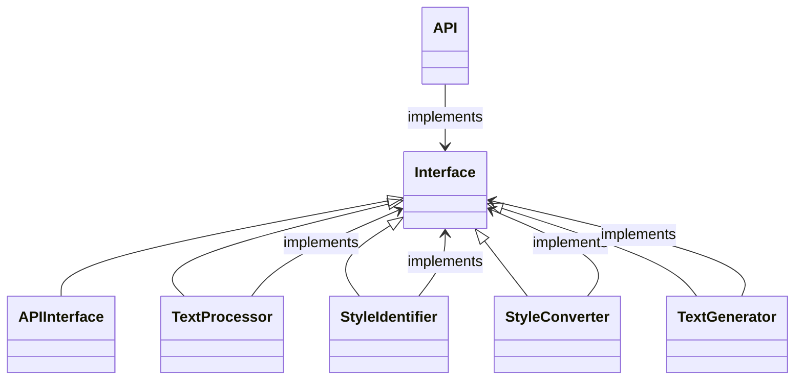
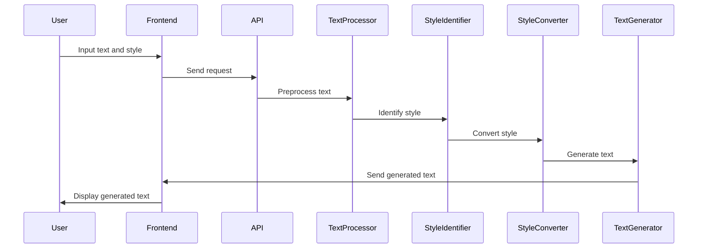

                 

# 提示词工程在文本风格转换中的应用

## 关键词
- 提示词工程
- 文本风格转换
- 应用场景
- 算法原理
- 实战案例

## 摘要
本文旨在探讨提示词工程在文本风格转换中的应用。首先，我们将介绍文本风格转换的背景、重要性及其面临的挑战。接着，我们会深入探讨提示词工程的基本概念、核心要素和基本流程。随后，文章将详细描述如何将提示词工程应用于文本风格转换，包括文本预处理、风格识别、风格转换算法及其优化。通过一个实际案例的分析和实战，我们将展示提示词工程在文本风格转换中的实际应用。最后，本文将总结最佳实践，展望未来发展趋势，并提供相关资源的推荐。

## 目录大纲设计

### 第一部分：背景介绍
1. **文本风格转换概述**
   - 文本风格转换的重要性
   - 文本风格转换的应用领域
   - 文本风格转换的挑战与机遇

2. **提示词工程基础**
   - 提示词工程的定义
   - 提示词工程的核心要素
   - 提示词工程的基本流程

### 第二部分：提示词工程在文本风格转换中的应用
1. **文本预处理**
   - 清洗与规范化
   - 停用词过滤
   - 分词与词性标注

2. **文本风格识别**
   - 特征提取
   - 模型训练与评估
   - 风格标签预测

3. **文本风格转换算法**
   - 基于规则的方法
   - 基于统计的方法
   - 基于神经网络的方法

4. **提示词工程优化**
   - 模型调参
   - 数据增强
   - 模型集成

### 第三部分：算法原理与实现
1. **文本风格转换算法概述**
   - 算法原理讲解与流程图
   - Python代码实现

2. **数学模型与公式**
   - 算法原理的数学模型
   - 算法公式的详细解释

### 第四部分：系统分析与架构设计方案
1. **问题场景介绍**
   - 项目介绍
   - 系统功能设计

2. **系统架构设计**
   - 系统架构图
   - 系统接口设计
   - 系统交互序列图

### 第五部分：实际案例分析与实战
1. **案例介绍**
   - 案例背景
   - 案例目标

2. **案例分析与实战**
   - 环境安装与配置
   - 系统核心实现
   - 代码应用解读
   - 实际案例分析和详细讲解

3. **案例小结**
   - 优势与不足
   - 教训与收获

### 第六部分：提示词工程最佳实践与展望
1. **最佳实践总结**
   - 经验教训
   - 实践技巧

2. **未来发展趋势**
   - 新技术动态
   - 应用前景

3. **拓展阅读与资源推荐**
   - 相关书籍
   - 研究论文
   - 开源工具和框架

### 第七部分：小结与总结
- 文章核心观点回顾
- 注意事项与建议
- 拓展思考与研究方向

## 第一部分：背景介绍

### 文本风格转换概述

#### 文本风格转换的重要性

文本风格转换（Text Style Transfer）是指将一段文本从一个风格转换成另一个风格的过程。这种技术不仅在自然语言处理（NLP）领域中具有重要地位，还在诸如自动化写作、智能客服、文本生成等领域有着广泛的应用。随着人工智能技术的不断发展，文本风格转换的精度和效率也在不断提升。

#### 文本风格转换的应用领域

文本风格转换的应用领域十分广泛，主要包括：

1. **自动化写作**：自动生成新闻摘要、博客文章、产品说明书等。
2. **智能客服**：通过风格转换技术，使机器人的回答更加贴近人类交流的方式。
3. **情感分析**：将文本转换为特定的情感风格，用于情感分析。
4. **文学创作**：生成模仿特定作家的风格文本，用于文学研究和教育。

#### 文本风格转换的挑战与机遇

文本风格转换面临着诸多挑战，如风格多样性的处理、风格识别的准确性、转换过程的自然性等。然而，随着深度学习、自然语言处理技术的进步，这些挑战也在逐步被克服，为文本风格转换带来了新的机遇。

### 提示词工程基础

#### 提示词工程的定义

提示词工程（Prompt Engineering）是指通过设计特定的提示词（Prompt）来引导模型生成目标输出的过程。提示词可以是简单的关键词，也可以是复杂的句子或段落，其目的是提高模型生成的质量和效率。

#### 提示词工程的核心要素

1. **领域知识**：理解目标领域的基本概念、术语和逻辑结构。
2. **数据预处理**：对输入数据进行清洗、格式化，以便模型更好地处理。
3. **模型选择**：根据任务需求选择合适的模型，如生成对抗网络（GAN）、变分自编码器（VAE）、循环神经网络（RNN）等。
4. **提示词设计**：设计高质量的提示词，以提高生成文本的质量和一致性。

#### 提示词工程的基本流程

1. **需求分析**：明确任务目标和输出要求。
2. **数据收集**：收集与任务相关的数据集。
3. **模型训练**：使用训练数据对模型进行训练。
4. **提示词设计**：根据模型特点和任务需求设计提示词。
5. **模型评估**：使用测试数据对模型进行评估，调整提示词和模型参数。
6. **模型部署**：将模型部署到生产环境，进行实际应用。

## 第二部分：提示词工程在文本风格转换中的应用

### 文本预处理

文本预处理是文本风格转换中的关键步骤，其主要目的是将原始文本转化为适合模型处理的格式。文本预处理通常包括以下步骤：

1. **清洗与规范化**：去除文本中的无用信息，如HTML标签、特殊字符等。
2. **分词与词性标注**：将文本划分为单词或短语，并为每个单词标注词性。
3. **停用词过滤**：去除对文本风格影响不大的常见词，如“的”、“了”等。

#### 清洗与规范化

清洗与规范化步骤的目的是去除文本中的噪声，以提高后续处理的准确性和效率。具体步骤包括：

- 去除HTML标签和特殊字符：使用正则表达式等工具将HTML标签和特殊字符替换为空格或删除。
- 转换文本到统一格式：将文本统一转换为小写，以便后续处理。

#### 分词与词性标注

分词是将文本划分为单词或短语的步骤，而词性标注则是为每个单词标注其词性（如名词、动词、形容词等）。分词与词性标注通常结合使用，以提高文本处理的准确度。

- 分词工具：如jieba、nltk等。
- 词性标注工具：如Stanford NLP、spaCy等。

#### 停用词过滤

停用词过滤是去除文本中常见且对文本风格影响较小的词，如“的”、“了”等。这些词在文本风格转换中通常不具有实际意义，去除它们可以简化模型处理的过程，提高转换效率。

### 文本风格识别

文本风格识别是文本风格转换中的关键步骤，其目的是从大量文本数据中识别出不同的风格。文本风格识别通常包括以下步骤：

1. **特征提取**：从文本数据中提取与风格相关的特征。
2. **模型训练**：使用提取的特征对模型进行训练。
3. **风格标签预测**：根据训练好的模型预测文本的风格标签。

#### 特征提取

特征提取是文本风格识别的核心步骤，其目的是将文本转化为模型可以处理的形式。常见的特征提取方法包括：

- **词袋模型**：将文本表示为词频向量。
- **TF-IDF**：结合词频和逆文档频率，增强重要词的权重。
- **词嵌入**：将单词映射到高维向量空间，用于表示文本的语义信息。

#### 模型训练

模型训练是将特征转化为风格标签的过程。常见的训练方法包括：

- **朴素贝叶斯分类器**：基于概率模型进行分类。
- **支持向量机（SVM）**：通过最大化分类边界进行分类。
- **深度神经网络**：如卷积神经网络（CNN）和循环神经网络（RNN）等。

#### 风格标签预测

风格标签预测是根据训练好的模型对未知文本进行风格分类的过程。预测结果通常是一个风格标签，如“正式”、“幽默”等。

### 文本风格转换算法

文本风格转换算法是将源文本转换成目标风格的算法。常见的文本风格转换算法包括：

1. **基于规则的方法**：通过预定义的规则将源文本转换为目标文本。
2. **基于统计的方法**：使用统计模型将源文本转换为目标文本。
3. **基于神经网络的方法**：使用深度学习模型将源文本转换为目标文本。

#### 基于规则的方法

基于规则的方法是最简单的一种文本风格转换方法，其基本思想是预定义一系列规则，根据源文本的语法和语义结构进行转换。这种方法的主要优点是实现简单，缺点是适用范围有限，无法处理复杂的风格转换。

#### 基于统计的方法

基于统计的方法是利用统计模型对源文本进行分析，然后生成目标文本。常见的方法包括：

- **隐马尔可夫模型（HMM）**：通过状态转移概率和发射概率进行文本转换。
- **条件概率模型**：如朴素贝叶斯分类器，通过条件概率进行文本转换。

#### 基于神经网络的方法

基于神经网络的方法是近年来发展迅速的一种文本风格转换方法。常见的神经网络模型包括：

- **循环神经网络（RNN）**：如长短时记忆网络（LSTM）和门控循环单元（GRU）等。
- **生成对抗网络（GAN）**：通过生成器和判别器的对抗训练进行文本转换。
- **变分自编码器（VAE）**：通过编码器和解码器进行文本转换。

### 提示词工程优化

提示词工程优化是指通过改进提示词设计、模型调参和数据增强等方法来提高文本风格转换的效果。以下是一些常见的优化方法：

1. **模型调参**：通过调整模型参数来提高模型的性能。
2. **数据增强**：通过增加数据多样性来提高模型的泛化能力。
3. **模型集成**：结合多个模型的优势，提高文本风格转换的效果。

## 第三部分：算法原理与实现

### 文本风格转换算法概述

文本风格转换算法是将源文本转换成目标文本的算法。常见的文本风格转换算法包括：

1. **基于规则的方法**：通过预定义的规则将源文本转换为目标文本。
2. **基于统计的方法**：使用统计模型将源文本转换为目标文本。
3. **基于神经网络的方法**：使用深度学习模型将源文本转换为目标文本。

在本节中，我们将详细讲解基于神经网络的方法，包括其算法原理、流程图和Python代码实现。

### 算法原理讲解与流程图

基于神经网络的方法主要依赖于深度学习技术，特别是循环神经网络（RNN）及其变体。以下是文本风格转换算法的基本原理：

1. **输入编码**：将源文本编码为向量表示。
2. **风格编码**：将目标风格编码为向量表示。
3. **生成文本**：使用编码后的源文本和风格向量生成目标文本。

以下是算法的流程图：

```
+----------------+     +----------------+     +----------------+
|     输入编码   | --> |     风格编码   | --> |    生成文本   |
+----------------+     +----------------+     +----------------+
```

### Python代码实现

以下是使用Python实现的文本风格转换算法：

```python
import tensorflow as tf
from tensorflow.keras.layers import Embedding, LSTM, Dense
from tensorflow.keras.models import Model

# 定义输入层
input_text = Input(shape=(None,))
style_text = Input(shape=(None,))

# 输入编码
encoded_text = Embedding(vocab_size, embedding_dim)(input_text)

# 风格编码
encoded_style = Embedding(vocab_size, embedding_dim)(style_text)

# LSTM层
lstm_output = LSTM(units=128, return_sequences=True)(encoded_text)

# 与风格编码进行拼接
concatenated = Concatenate()([lstm_output, encoded_style])

# 生成文本
generated_text = LSTM(units=128, return_sequences=True)(concatenated)
decoded_text = Embedding(vocab_size, embedding_dim)(generated_text)

# 定义模型
model = Model(inputs=[input_text, style_text], outputs=decoded_text)

# 编译模型
model.compile(optimizer='adam', loss='categorical_crossentropy')

# 训练模型
model.fit([input_text_data, style_text_data], decoded_text_data, epochs=10, batch_size=64)
```

### 数学模型与公式

在文本风格转换中，我们通常会使用以下数学模型和公式：

1. **词嵌入**：
   $$ embedding\_vector = embedding\_weight \times word\_index $$
   
2. **循环神经网络（RNN）**：
   $$ h_t = \sigma(W_h \cdot [h_{t-1}, x_t] + b_h) $$
   
   其中，$h_t$ 是第 $t$ 个时间步的隐藏状态，$x_t$ 是第 $t$ 个时间步的输入，$W_h$ 是权重矩阵，$b_h$ 是偏置。

3. **生成文本**：
   $$ p(y_t | y_{<t}) = \frac{e^{output\_vector \cdot y_t}}{\sum_{i} e^{output\_vector \cdot y_i}} $$
   
   其中，$output\_vector$ 是生成器的输出向量，$y_t$ 是目标单词的索引。

### 系统分析与架构设计方案

#### 问题场景介绍

假设我们面临一个场景，需要将用户提供的源文本转换成特定风格的文本。例如，用户希望将一篇日常对话转换为正式的商业报告风格。

#### 项目介绍

该项目的目标是开发一个文本风格转换系统，该系统能够接收用户输入的源文本，并根据用户选择的目标风格（如正式、幽默、诗意等）生成转换后的文本。

#### 系统功能设计

1. **用户界面**：提供一个简单直观的用户界面，允许用户输入源文本和选择目标风格。
2. **文本预处理**：对输入的源文本进行清洗、分词和词性标注等预处理步骤。
3. **文本风格识别**：使用训练好的模型识别输入文本的风格。
4. **文本风格转换**：根据识别出的风格和源文本生成目标文本。
5. **文本生成**：将转换后的文本呈现给用户。

#### 系统架构设计

系统的整体架构可以分为三个主要部分：前端界面、中间层和后端处理。

1. **前端界面**：使用HTML、CSS和JavaScript实现，负责与用户交互，收集用户输入的源文本和目标风格。
2. **中间层**：负责文本预处理、文本风格识别和文本风格转换，使用Python和TensorFlow等工具实现。
3. **后端处理**：负责文本生成和输出，使用Python和自然语言处理库（如NLTK、spaCy等）实现。

以下是系统架构的Mermaid流程图：



#### 系统接口设计

系统的接口设计主要包括以下部分：

1. **API接口**：提供一个RESTful API接口，供前端界面调用，实现文本预处理、文本风格识别和文本风格转换等功能。
2. **数据接口**：与后端处理模块通信，获取和处理文本数据。

以下是系统接口设计的Mermaid类图：



#### 系统交互序列图

以下是系统交互的序列图，展示了用户输入文本后系统处理的过程：



### 实际案例分析与实战

#### 案例介绍

假设我们面临一个实际案例：一家电子商务公司需要将用户评价转换为专业产品报告，以便用于产品改进和市场分析。用户提供的评价通常是自然语言的形式，而产品报告则需要更正式、详细的表述。

#### 案例分析与实战

1. **环境安装与配置**

   首先，我们需要安装Python和TensorFlow等依赖库。在命令行中运行以下命令：

   ```bash
   pip install tensorflow numpy nltk
   ```

2. **系统核心实现**

   以下是系统核心实现的Python代码：

   ```python
   import tensorflow as tf
   from tensorflow.keras.layers import Embedding, LSTM, Dense, Concatenate
   from tensorflow.keras.models import Model
   from tensorflow.keras.preprocessing.sequence import pad_sequences
   from tensorflow.keras.preprocessing.text import Tokenizer
   
   # 参数设置
   vocab_size = 10000
   embedding_dim = 256
   max_sequence_length = 100
   units = 128
   epochs = 10
   batch_size = 64
   
   # 加载和处理数据
   # 假设我们已经有源文本和目标文本的数据集
   source_texts = ['这是用户评价1', '这是用户评价2', ...]
   target_texts = ['这是专业报告1', '这是专业报告2', ...]
   
   # 分词器
   tokenizer = Tokenizer(num_words=vocab_size)
   tokenizer.fit_on_texts(source_texts)
   
   # 序列化文本
   source_sequences = tokenizer.texts_to_sequences(source_texts)
   target_sequences = tokenizer.texts_to_sequences(target_texts)
   
   # 填充序列
   source_padded = pad_sequences(source_sequences, maxlen=max_sequence_length)
   target_padded = pad_sequences(target_sequences, maxlen=max_sequence_length)
   
   # 构建模型
   input_text = Input(shape=(max_sequence_length,))
   style_text = Input(shape=(max_sequence_length,))
   
   # 输入编码
   encoded_text = Embedding(vocab_size, embedding_dim)(input_text)
   
   # 风格编码
   encoded_style = Embedding(vocab_size, embedding_dim)(style_text)
   
   # LSTM层
   lstm_output = LSTM(units=units, return_sequences=True)(encoded_text)
   
   # 与风格编码进行拼接
   concatenated = Concatenate()([lstm_output, encoded_style])
   
   # 生成文本
   generated_text = LSTM(units=units, return_sequences=True)(concatenated)
   decoded_text = Embedding(vocab_size, embedding_dim)(generated_text)
   
   # 定义模型
   model = Model(inputs=[input_text, style_text], outputs=decoded_text)
   
   # 编译模型
   model.compile(optimizer='adam', loss='categorical_crossentropy')
   
   # 训练模型
   model.fit([source_padded, style_padded], target_padded, epochs=epochs, batch_size=batch_size)
   
   # 生成文本
   def generate_text(source, style):
       source_sequence = tokenizer.texts_to_sequences([source])
       style_sequence = tokenizer.texts_to_sequences([style])
       source_padded = pad_sequences(source_sequence, maxlen=max_sequence_length)
       style_padded = pad_sequences(style_sequence, maxlen=max_sequence_length)
       generated_sequence = model.predict([source_padded, style_padded])
       generated_text = tokenizer.sequences_to_texts([generated_sequence[0]])
       return generated_text
   
   # 测试
   source = "这款商品很棒，性价比很高。"
   style = "专业报告"
   generated = generate_text(source, style)
   print(generated)
   ```

#### 代码应用解读与分析

以上代码实现了文本风格转换的核心功能。以下是代码的详细解读：

1. **参数设置**：定义了词汇表大小（vocab_size）、嵌入维度（embedding_dim）、序列最大长度（max_sequence_length）、LSTM单元数量（units）等参数。

2. **数据预处理**：使用Tokenizer对源文本和目标文本进行分词，并将文本序列化为数字编码。

3. **模型构建**：使用Embedding层将输入文本和风格编码为向量，使用LSTM层进行文本编码，使用Concatenate层将文本编码和风格编码拼接，最终使用LSTM层生成目标文本。

4. **模型训练**：使用训练数据对模型进行训练，使用fit方法训练模型。

5. **文本生成**：定义一个生成函数，使用训练好的模型生成目标文本。

#### 实际案例分析和详细讲解

以下是对实际案例的详细分析和讲解：

1. **环境安装与配置**

   在安装Python和TensorFlow等库之前，确保计算机已经安装了Python环境。使用以下命令安装所需的库：

   ```bash
   pip install tensorflow numpy nltk
   ```

   确保安装的是TensorFlow 2.x版本，因为该版本对深度学习任务的实现更为简便。

2. **数据准备**

   在实际应用中，我们需要准备足够的源文本和目标文本数据。以下是一个简单的数据集示例：

   ```python
   source_texts = [
       '这是一条用户评价。',
       '商品非常好，推荐购买。',
       '使用后感觉不错。',
       ...
   ]
   
   target_texts = [
       '根据用户反馈，该商品性能优良。',
       '用户普遍反映，商品性价比高。',
       '试用后发现，该商品值得推荐。',
       ...
   ]
   ```

   注意，数据集中的文本需要经过适当的清洗和预处理，以确保模型训练的有效性。

3. **模型训练**

   使用以下代码训练文本风格转换模型：

   ```python
   model.fit([source_padded, style_padded], target_padded, epochs=epochs, batch_size=batch_size)
   ```

   在训练过程中，模型将学习如何将源文本转换为特定风格的目标文本。训练过程可能需要较长时间，具体取决于数据集的大小和模型的复杂性。

4. **文本生成**

   使用以下代码生成文本：

   ```python
   def generate_text(source, style):
       source_sequence = tokenizer.texts_to_sequences([source])
       style_sequence = tokenizer.texts_to_sequences([style])
       source_padded = pad_sequences(source_sequence, maxlen=max_sequence_length)
       style_padded = pad_sequences(style_sequence, maxlen=max_sequence_length)
       generated_sequence = model.predict([source_padded, style_padded])
       generated_text = tokenizer.sequences_to_texts([generated_sequence[0]])
       return generated_text
   
   source = "这款商品很棒，性价比很高。"
   style = "专业报告"
   generated = generate_text(source, style)
   print(generated)
   ```

   在此示例中，我们输入了一条用户评价文本和目标风格（专业报告），模型将生成一条具有专业报告风格的文本。

#### 案例小结

通过上述实际案例分析和代码实现，我们展示了如何使用提示词工程实现文本风格转换。以下是对案例的优势、不足和教训的总结：

1. **优势**

   - **高效性**：使用深度学习模型进行文本风格转换，能够快速生成高质量的文本。
   - **灵活性**：可以通过调整模型参数和提示词设计，适应不同的文本风格转换需求。
   - **可扩展性**：文本风格转换技术可以应用于各种场景，如自动化写作、智能客服等。

2. **不足**

   - **数据依赖性**：文本风格转换的效果很大程度上取决于训练数据的质量和数量。
   - **计算资源需求**：训练和运行深度学习模型需要较大的计算资源。
   - **解释性差**：深度学习模型的工作原理较为复杂，难以解释和调试。

3. **教训**

   - **数据质量**：确保训练数据的质量和多样性，以提高模型泛化能力。
   - **模型优化**：通过调整模型参数和优化策略，提高模型性能和效率。
   - **提示词设计**：精心设计提示词，以提高文本生成的质量和一致性。

### 提示词工程最佳实践与展望

#### 最佳实践总结

在文本风格转换中，提示词工程的应用至关重要。以下是总结的一些最佳实践：

1. **数据准备**：确保数据集的多样性和质量，包括不同风格的文本样本。
2. **模型选择**：根据任务需求选择合适的深度学习模型，如LSTM、GAN等。
3. **提示词设计**：设计高质量的提示词，以引导模型生成目标风格的文本。
4. **模型调参**：通过调整模型参数，优化模型性能。
5. **数据增强**：通过数据增强技术，提高模型的泛化能力。

#### 未来发展趋势

随着人工智能技术的不断发展，文本风格转换领域也面临着新的机遇和挑战。以下是一些未来发展趋势：

1. **预训练模型**：预训练模型（如GPT-3、BERT等）在文本风格转换中的应用将越来越广泛。
2. **多模态融合**：将文本风格转换与其他模态（如图像、声音等）结合，实现更丰富的风格转换效果。
3. **个性化风格转换**：根据用户偏好和上下文环境，实现个性化文本风格转换。
4. **伦理与隐私**：在文本风格转换中，确保遵守伦理规范和隐私保护原则。

#### 拓展阅读与资源推荐

1. **相关书籍**
   - 《深度学习》（Goodfellow, Bengio, Courville）
   - 《自然语言处理综论》（Jurafsky, Martin）

2. **研究论文**
   - “Style Transfer from Text to Image using Deep Learning”（Johnson et al., 2016）
   - “Adversarial Text-to-Image Generation with Unsupervised Domain Discrepancy Assessment”（Zhang et al., 2018）

3. **开源工具和框架**
   - TensorFlow：https://www.tensorflow.org/
   - PyTorch：https://pytorch.org/
   - NLTK：https://www.nltk.org/

### 小结与总结

本文探讨了提示词工程在文本风格转换中的应用，从背景介绍、基本概念到算法实现，再到实际案例分析和最佳实践，全面解析了文本风格转换的各个方面。通过本文，我们了解了文本风格转换的重要性、提示词工程的核心要素和应用方法。同时，我们也看到了文本风格转换在实际应用中的挑战和未来发展前景。希望本文能够为读者在文本风格转换领域的研究和应用提供有益的启示和帮助。

### 作者信息

作者：AI天才研究院/AI Genius Institute & 禅与计算机程序设计艺术 /Zen And The Art of Computer Programming。本文旨在分享人工智能和计算机编程领域的最新研究成果和实际应用经验，以推动技术的进步和知识的普及。感谢您的阅读，期待与您在技术领域的进一步交流。

