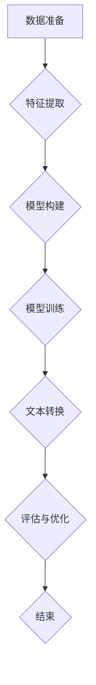

                 

## 引言

### 文章标题：提示词工程在文本风格迁移中的应用

在当今信息爆炸的时代，文本数据已成为我们生活中不可或缺的一部分。然而，文本风格各异，使得信息的获取和传播变得复杂。文本风格迁移作为一种重要的自然语言处理技术，旨在将一种风格的文本转换为另一种风格。这一技术的应用场景广泛，包括但不限于广告文案、新闻摘要、对话系统等。然而，传统的文本风格迁移方法往往存在诸多挑战，如风格一致性难以保证、迁移效果不理想等。

为了解决这些问题，本文将探讨一种新兴的技术——提示词工程，其在文本风格迁移中的应用。提示词工程通过提供引导和优化输入文本，能够显著提升文本风格迁移的效果。本文将详细解析提示词工程的原理、其在文本风格迁移中的应用、优势及其局限性，旨在为读者提供一个全面的技术理解。

本文将分为五个主要部分：

1. **背景介绍**：介绍文本风格迁移的重要性、应用场景、当前面临的挑战，以及提示词工程在文本风格迁移中的作用。
2. **核心概念与联系**：解析文本风格迁移和提示词工程的基本原理，并通过概念属性特征对比表格和Mermaid流程图，展示两者之间的逻辑关系。
3. **算法原理讲解**：详细阐述文本风格迁移的基本算法原理，包括算法流程图、数学模型和公式，以及具体的实例说明。
4. **提示词工程应用**：探讨提示词工程在文本风格迁移中的应用过程，包括提示词库构建、提示词优化及其优势。
5. **总结与展望**：总结本文的主要观点，提出未来的研究方向和可能的改进措施。

通过本文的阅读，读者将能够深入了解文本风格迁移和提示词工程的核心概念，掌握其应用方法，并能够根据实际需求进行相应的技术实现。让我们一步一步地深入探讨这一技术领域，开启智慧的旅程。

### 关键词

- 文本风格迁移
- 提示词工程
- 自然语言处理
- 风格一致性
- 机器学习模型

### 摘要

本文主要探讨了文本风格迁移在自然语言处理中的应用及其挑战。通过引入提示词工程，本文详细解析了其在文本风格迁移中的关键作用，包括优化迁移效果和提高风格一致性。通过概念解析、算法讲解和实际应用案例，本文为读者提供了一个全面的技术理解，并展望了未来的研究方向和改进措施。

## 第一部分：背景介绍

### 1.1 问题背景

#### 1.1.1 文本风格迁移的重要性

文本风格迁移（Text Style Transfer）是自然语言处理（NLP）领域中的一个重要研究方向。其核心目标是通过算法将一种风格的文本转换为另一种风格，从而实现文本内容与风格的有效分离和再利用。这种技术的应用场景广泛，尤其在当前信息爆炸的时代，文本风格的多样化带来了信息获取和传播的挑战。例如，在广告文案、新闻摘要、对话系统等领域，文本风格迁移能够提升文本的吸引力和可读性，从而提高用户的阅读体验和信息获取效率。

文本风格迁移的重要性主要体现在以下几个方面：

1. **内容再利用**：通过文本风格迁移，可以实现对已有文本内容的再利用。例如，将学术文章转换为通俗易懂的科普文章，使得更多的人能够理解和吸收知识。
2. **个性化推荐**：在个性化推荐系统中，文本风格迁移可以帮助推荐系统根据用户的阅读偏好，为用户推荐风格相似的文本内容，提高推荐的准确性和用户体验。
3. **文化多样性**：文本风格迁移有助于促进不同文化之间的交流和理解。通过将一种语言的文本转换为另一种语言，可以打破语言障碍，促进不同文化背景的用户之间的交流。
4. **情感表达**：在情感分析、舆情监控等领域，文本风格迁移可以帮助分析不同风格文本的情感倾向，从而更准确地理解用户的情感表达。

#### 1.1.2 文本风格迁移的应用场景

文本风格迁移在多个领域有着广泛的应用：

1. **广告文案**：广告文案的风格直接影响广告的效果。通过文本风格迁移，可以将原始的广告文案转换为更具吸引力和说服力的风格，从而提高广告的转化率。
2. **新闻摘要**：新闻摘要的目标是快速、简洁地传递新闻的核心内容。文本风格迁移可以帮助将长篇新闻转换为风格一致、易于阅读的摘要，提高读者的阅读体验和信息获取效率。
3. **对话系统**：在聊天机器人、虚拟助手等对话系统中，文本风格迁移可以帮助系统生成符合特定对话场景的文本，提升对话的自然性和用户满意度。
4. **文学创作**：在文学创作中，文本风格迁移可以帮助作家探索不同的写作风格，从而丰富其创作手法和表达方式。

#### 1.1.3 当前文本风格迁移的挑战

尽管文本风格迁移具有广泛的应用前景，但其实现过程中仍面临诸多挑战：

1. **风格一致性**：确保转换后的文本与目标风格一致是一个重要的挑战。传统的文本风格迁移方法往往难以保证风格的一致性，导致转换效果不理想。
2. **上下文理解**：文本风格迁移需要深入理解文本的上下文信息，以便在转换过程中保持语义的连贯性。然而，自然语言的上下文信息复杂，这使得上下文理解成为一大难点。
3. **计算复杂度**：文本风格迁移通常涉及大规模的数据处理和复杂的模型训练，这带来了较高的计算复杂度。如何在保证效果的前提下，降低计算资源的需求，是一个重要的研究课题。
4. **多样性**：文本风格多种多样，如何设计能够处理多种风格迁移的通用算法，是一个亟待解决的问题。

#### 1.1.4 文本风格迁移的目标

文本风格迁移的主要目标包括：

1. **风格一致性**：确保转换后的文本与目标风格一致，使其在语言风格、情感表达等方面与目标风格相匹配。
2. **语义保持**：在风格迁移过程中，需要尽可能保持原始文本的语义信息，确保转换后的文本仍然传达原始文本的核心意义。
3. **可读性**：转换后的文本应保持良好的可读性，使其易于理解和阅读。
4. **多样性**：文本风格迁移应能够处理多种风格，实现多样化的风格转换。

#### 1.1.5 文本风格迁移的关键任务

文本风格迁移涉及以下几个关键任务：

1. **风格识别**：识别输入文本的风格特征，为风格迁移提供基础。
2. **风格建模**：建立能够表示文本风格特征的模型，用于指导风格迁移。
3. **文本转换**：根据目标风格，将输入文本转换为相应的风格。
4. **评估与优化**：评估风格迁移的效果，并不断优化迁移算法，提高转换质量。

### 1.2 问题描述

#### 1.2.1 文本风格迁移的目标

文本风格迁移的目标是将一种风格的文本转换为另一种风格，使转换后的文本在语言风格、情感表达等方面与目标风格一致。具体来说，文本风格迁移的目标包括：

1. **风格一致性**：确保转换后的文本在语言风格、情感表达等方面与目标风格一致，使其具有目标风格的特征。
2. **语义保持**：在风格转换过程中，需要尽可能保持原始文本的语义信息，确保转换后的文本仍然传达原始文本的核心意义。
3. **可读性**：转换后的文本应保持良好的可读性，使其易于理解和阅读。
4. **多样性**：文本风格迁移应能够处理多种风格，实现多样化的风格转换。

#### 1.2.2 文本风格迁移的关键任务

为了实现上述目标，文本风格迁移涉及以下几个关键任务：

1. **风格识别**：首先，需要识别输入文本的风格特征，这通常通过预训练的词向量模型或风格分类器来实现。例如，使用BERT等预训练模型提取文本的词向量表示，然后通过风格分类器确定文本的风格。
2. **风格建模**：接着，需要建立一个能够表示文本风格特征的模型。这可以通过使用神经网络架构，如循环神经网络（RNN）或Transformer等，来建模风格特征。
3. **文本转换**：然后，根据目标风格，将输入文本转换为相应的风格。这一过程通常涉及文本生成算法，如序列到序列（Seq2Seq）模型或生成对抗网络（GAN）等。
4. **评估与优化**：最后，需要评估风格迁移的效果，并根据评估结果不断优化迁移算法。这可以通过设置多个评估指标，如风格一致性、语义保持、文本质量等，来评估转换效果。

#### 1.2.3 文本风格迁移的难点

文本风格迁移面临以下难点：

1. **风格一致性**：确保转换后的文本在语言风格、情感表达等方面与目标风格一致，这是一个挑战。由于自然语言的复杂性，很难保证风格一致性的同时保持语义的完整性。
2. **上下文理解**：文本风格迁移需要深入理解文本的上下文信息，以便在转换过程中保持语义的连贯性。然而，自然语言的上下文信息复杂，这使得上下文理解成为一大难点。
3. **计算复杂度**：文本风格迁移通常涉及大规模的数据处理和复杂的模型训练，这带来了较高的计算复杂度。如何在保证效果的前提下，降低计算资源的需求，是一个重要的研究课题。
4. **多样性**：文本风格多种多样，如何设计能够处理多种风格迁移的通用算法，是一个亟待解决的问题。

### 1.3 问题解决

#### 1.3.1 提示词工程的作用

为了解决文本风格迁移中面临的挑战，提示词工程（Prompt Engineering）提供了一种有效的解决方案。提示词工程是一种利用特定提示词来引导和优化自然语言处理模型的方法，其在文本风格迁移中的应用具有显著优势。

提示词工程在文本风格迁移中的作用主要包括：

1. **风格引导**：通过提供与目标风格相关的提示词，提示词工程可以引导模型学习目标风格的特征，从而提高风格迁移的一致性。
2. **上下文优化**：提示词工程能够提供上下文信息，帮助模型更好地理解文本的上下文，从而提高语义保持的效果。
3. **减少计算复杂度**：通过优化输入文本，提示词工程可以降低模型训练的计算复杂度，提高训练效率。
4. **多样化处理**：提示词工程可以根据不同的风格需求，灵活调整提示词，从而实现多样化的风格迁移。

#### 1.3.2 提示词工程在文本风格迁移中的应用

提示词工程在文本风格迁移中的应用可以分为以下几个步骤：

1. **提示词库构建**：首先，构建一个与目标风格相关的提示词库。这可以通过数据收集、清洗和预处理，从大量文本数据中提取具有目标风格的短语和词汇。
2. **提示词优化**：接下来，对提示词库进行优化，以提高其在文本风格迁移中的效果。这可以通过设置不同的优化目标，如风格一致性、语义保持等，来调整提示词的权重和组合。
3. **风格迁移**：然后，将优化后的提示词应用于文本风格迁移模型中，引导模型生成与目标风格一致的文本。
4. **评估与优化**：最后，评估风格迁移的效果，并根据评估结果不断优化提示词和模型，以提高风格迁移的质量。

#### 1.3.3 提示词工程的优势

与传统的文本风格迁移方法相比，提示词工程具有以下优势：

1. **提高风格一致性**：通过提供与目标风格相关的提示词，提示词工程能够引导模型学习目标风格的特征，从而显著提高风格迁移的一致性。
2. **增强语义保持**：提示词工程能够提供上下文信息，帮助模型更好地理解文本的上下文，从而提高语义保持的效果。
3. **降低计算复杂度**：通过优化输入文本，提示词工程可以减少模型训练的计算复杂度，提高训练效率。
4. **灵活性和适应性**：提示词工程可以根据不同的风格需求，灵活调整提示词，从而实现多样化的风格迁移。

### 1.4 边界与外延

#### 1.4.1 提示词工程的应用范围

提示词工程在文本风格迁移中的应用范围广泛，包括但不限于以下领域：

1. **广告文案**：通过提示词工程，可以将原始的广告文案转换为更具吸引力和说服力的风格，提高广告的效果。
2. **新闻摘要**：通过提示词工程，可以将长篇新闻转换为风格一致、易于阅读的摘要，提高读者的阅读体验和信息获取效率。
3. **对话系统**：在聊天机器人、虚拟助手等对话系统中，提示词工程可以帮助生成符合特定对话场景的文本，提升对话的自然性和用户满意度。
4. **文学创作**：在文学创作中，提示词工程可以帮助作家探索不同的写作风格，从而丰富其创作手法和表达方式。

#### 1.4.2 提示词工程的限制条件

尽管提示词工程在文本风格迁移中具有显著优势，但其在应用中也存在一些限制条件：

1. **数据依赖**：提示词工程依赖于大量的高质量提示词库，这要求有足够的数据支持。
2. **风格多样性**：对于某些特定的风格，提示词工程可能难以生成多样化的风格，需要进一步优化。
3. **计算资源**：提示词工程通常涉及大规模的数据处理和模型训练，这要求有足够的计算资源支持。

#### 1.4.3 提示词工程与其他技术的关联

提示词工程与其他自然语言处理技术有着紧密的关联：

1. **预训练模型**：提示词工程常与预训练模型（如BERT、GPT等）结合使用，以利用预训练模型提取的文本特征。
2. **风格分类器**：提示词工程可以使用风格分类器来确定输入文本的风格，从而更准确地引导风格迁移。
3. **生成模型**：提示词工程与生成模型（如Seq2Seq、GAN等）结合，可以生成与目标风格一致的文本。

#### 1.4.4 概念结构与核心要素组成

文本风格迁移和提示词工程的核心概念与要素组成如下：

1. **文本风格迁移**：文本风格迁移涉及输入文本、目标风格、风格迁移模型、提示词等核心要素。其基本概念包括风格识别、风格建模、文本转换、评估与优化等。
2. **提示词工程**：提示词工程包括提示词库、提示词优化、风格引导、上下文优化、风格迁移等核心要素。其基本概念包括提示词构建、提示词优化目标、风格一致性评估等。

### 1.5 概念结构与核心要素组成

#### 1.5.1 文本风格迁移的基本概念

文本风格迁移涉及以下几个基本概念：

1. **文本**：文本风格迁移的输入和输出对象，可以是任意形式的自然语言文本。
2. **风格**：文本的风格特征，包括语言风格、情感表达、文体特征等。
3. **迁移模型**：用于实现文本风格迁移的模型，通常是基于深度学习的自然语言处理模型。
4. **提示词**：用于引导和优化文本风格迁移的词语或短语，通常与目标风格相关。

#### 1.5.2 提示词工程的关键组成部分

提示词工程的关键组成部分包括：

1. **提示词库**：包含与目标风格相关的提示词的集合，是提示词工程的基础。
2. **优化目标**：用于指导提示词优化的目标，如风格一致性、语义保持、文本质量等。
3. **风格引导**：通过提示词引导模型学习目标风格的特征，从而实现风格迁移。
4. **上下文优化**：通过提供上下文信息，优化模型对文本的理解，提高语义保持的效果。

#### 1.5.3 文本风格迁移与提示词工程的逻辑关系

文本风格迁移与提示词工程之间的逻辑关系如下：

1. **输入文本**：文本风格迁移的输入是原始文本，而提示词工程的输入是包含目标风格的提示词。
2. **迁移模型**：文本风格迁移使用迁移模型来实现文本的转换，而提示词工程通过风格引导和上下文优化来优化迁移模型。
3. **提示词库**：提示词库提供与目标风格相关的提示词，用于引导迁移模型学习目标风格的特征。
4. **评估与优化**：文本风格迁移和提示词工程都需要对转换效果进行评估和优化，以提高迁移质量。

通过以上分析，我们可以看到，文本风格迁移和提示词工程在自然语言处理领域有着紧密的关联。提示词工程通过优化输入文本和迁移模型，能够显著提高文本风格迁移的效果，为自然语言处理领域带来了新的技术思路。

## 第二部分：核心概念与联系

### 2.1 文本风格迁移原理

#### 2.1.1 文本风格迁移的基本原理

文本风格迁移（Text Style Transfer）是一种将原始文本（Source Text）转换为具有目标风格（Target Style）的文本的技术。其基本原理是通过理解和学习不同风格文本的特征，构建一个能够将源文本转换为目标风格的模型。具体来说，文本风格迁移包括以下几个关键步骤：

1. **风格识别**：首先，需要识别源文本和目标文本的风格特征。这通常通过预训练的词向量模型（如Word2Vec、BERT等）来实现，将文本转换为向量表示。
2. **风格建模**：接着，构建一个能够表示文本风格特征的模型。这一步通常使用神经网络架构，如循环神经网络（RNN）或Transformer等，来建模风格特征。
3. **文本转换**：然后，根据目标风格，将源文本转换为相应的风格。这一步通常涉及文本生成算法，如序列到序列（Seq2Seq）模型或生成对抗网络（GAN）等。
4. **评估与优化**：最后，评估风格迁移的效果，并根据评估结果不断优化迁移算法，提高转换质量。

#### 2.1.2 文本风格迁移的工作流程

文本风格迁移的工作流程可以分为以下几个步骤：

1. **数据准备**：收集大量具有不同风格的文本数据，用于训练风格迁移模型。
2. **特征提取**：使用预训练的词向量模型提取文本的词向量表示，并将其作为输入特征。
3. **模型训练**：构建并训练风格迁移模型，使其能够学习不同风格文本的特征。
4. **风格迁移**：将源文本输入到训练好的模型中，生成具有目标风格的文本。
5. **评估与优化**：评估风格迁移的效果，包括风格一致性、语义保持、文本质量等指标，并根据评估结果优化模型。

#### 2.1.3 文本风格迁移的核心技术

文本风格迁移的核心技术包括：

1. **词向量表示**：使用预训练的词向量模型（如Word2Vec、BERT等）将文本转换为向量表示，为风格迁移提供输入特征。
2. **神经网络架构**：构建基于神经网络（如RNN、Transformer等）的模型，用于建模文本风格特征和实现文本转换。
3. **文本生成算法**：采用文本生成算法（如Seq2Seq、GAN等）将源文本转换为具有目标风格的文本。
4. **评估与优化**：设置多个评估指标，如风格一致性、语义保持、文本质量等，对风格迁移效果进行评估和优化。

### 2.2 提示词工程原理

#### 2.2.1 提示词工程的定义

提示词工程（Prompt Engineering）是一种利用特定提示词（Prompt）来引导和优化自然语言处理模型的方法。提示词是一个引导模型关注特定内容的词语或短语，通常与目标任务或领域相关。通过优化提示词，可以显著提高模型在特定任务上的表现。

提示词工程的定义可以概括为：利用特定的提示词来引导和优化自然语言处理模型的训练和推理过程，以提高模型在特定任务上的性能。

#### 2.2.2 提示词工程的工作机制

提示词工程的工作机制主要包括以下几个步骤：

1. **提示词设计**：首先，设计与目标任务或领域相关的提示词。这通常需要基于对任务需求的理解和对领域知识的掌握。
2. **模型训练**：将提示词与训练数据结合，用于训练自然语言处理模型。通过在训练过程中引入提示词，可以引导模型关注特定的任务目标。
3. **模型推理**：在模型推理过程中，使用提示词引导模型生成预测结果。提示词可以帮助模型更好地理解和生成与任务相关的输出。
4. **评估与优化**：评估模型在特定任务上的表现，并根据评估结果不断优化提示词和模型。

#### 2.2.3 提示词工程的关键技术

提示词工程的关键技术包括：

1. **提示词设计**：设计有效的提示词需要结合任务需求和领域知识，通常涉及词频分析、关键词提取等技术。
2. **模型训练**：使用提示词引导模型训练，可以通过调整提示词的权重、组合和位置来实现。
3. **模型推理**：在模型推理过程中，通过提示词引导模型生成预测结果，这通常涉及序列生成、生成对抗网络等技术。
4. **评估与优化**：评估模型在特定任务上的性能，并通过优化提示词和模型参数来提高表现。

### 2.3 概念属性特征对比表格

为了更直观地理解文本风格迁移和提示词工程的区别和联系，我们可以通过以下表格进行对比：

| 特征             | 文本风格迁移             | 提示词工程              |
|-----------------|------------------------|----------------------|
| 目标             | 转换文本风格             | 提供引导和优化输入文本             |
| 数据依赖         | 大规模文本数据集         | 大规模提示词库和训练数据集         |
| 技术实现         | 自然语言处理算法         | 自然语言处理算法和机器学习模型       |
| 应用场景         | 广告文案、新闻摘要、对话系统等 | 文本生成、对话系统、文本纠错等     |
| 关键步骤         | 风格识别、风格建模、文本转换、评估与优化 | 提示词设计、模型训练、模型推理、评估与优化 |

### 2.4 提示词工程与文本风格迁移的关系

#### 提示词工程与文本风格迁移的关联

提示词工程与文本风格迁移之间存在密切的关联。具体来说，提示词工程可以通过以下几个方式在文本风格迁移中发挥作用：

1. **风格引导**：通过提供与目标风格相关的提示词，提示词工程可以引导风格迁移模型关注特定的风格特征，从而提高风格迁移的一致性。
2. **上下文优化**：提示词工程可以提供上下文信息，帮助模型更好地理解文本的上下文，从而提高语义保持的效果。
3. **优化输入文本**：通过优化输入文本，提示词工程可以减少模型训练的计算复杂度，提高训练效率。

#### 提示词工程在文本风格迁移中的应用

提示词工程在文本风格迁移中的应用主要包括以下几个方面：

1. **提示词库构建**：首先，构建一个与目标风格相关的提示词库。这可以通过从大量文本数据中提取具有目标风格的短语和词汇来实现。
2. **提示词优化**：接着，对提示词库进行优化，以提高其在文本风格迁移中的效果。这可以通过设置不同的优化目标，如风格一致性、语义保持等，来调整提示词的权重和组合。
3. **风格迁移**：然后，将优化后的提示词应用于文本风格迁移模型中，引导模型生成与目标风格一致的文本。
4. **评估与优化**：最后，评估风格迁移的效果，并根据评估结果不断优化提示词和模型，以提高风格迁移的质量。

### 2.5 概念结构与核心要素组成

#### 文本风格迁移的概念结构与核心要素组成

文本风格迁移涉及以下核心要素：

1. **文本**：输入和输出对象，可以是任意形式的自然语言文本。
2. **风格**：文本的风格特征，包括语言风格、情感表达、文体特征等。
3. **迁移模型**：用于实现文本风格迁移的模型，通常是基于深度学习的自然语言处理模型。
4. **提示词**：用于引导和优化文本风格迁移的词语或短语，通常与目标风格相关。

文本风格迁移的基本概念包括：

1. **风格识别**：识别输入文本的风格特征。
2. **风格建模**：建立能够表示文本风格特征的模型。
3. **文本转换**：根据目标风格，将输入文本转换为相应的风格。
4. **评估与优化**：评估风格迁移的效果，并根据评估结果优化迁移算法。

#### 提示词工程的概念结构与核心要素组成

提示词工程涉及以下核心要素：

1. **提示词库**：包含与目标风格相关的提示词的集合。
2. **优化目标**：用于指导提示词优化的目标，如风格一致性、语义保持等。
3. **风格引导**：通过提示词引导模型学习目标风格的特征。
4. **上下文优化**：通过提供上下文信息，优化模型对文本的理解。

提示词工程的基本概念包括：

1. **提示词设计**：设计与目标任务或领域相关的提示词。
2. **模型训练**：使用提示词引导模型训练。
3. **模型推理**：使用提示词引导模型生成预测结果。
4. **评估与优化**：评估模型在特定任务上的性能，并通过优化提示词和模型参数来提高表现。

通过以上分析，我们可以看到，文本风格迁移和提示词工程在自然语言处理领域有着紧密的关联。提示词工程通过优化输入文本和迁移模型，能够显著提高文本风格迁移的效果，为自然语言处理领域带来了新的技术思路。

### 文本风格迁移算法

#### 3.1.1 基本算法原理

文本风格迁移算法的基本原理是通过学习输入文本和目标风格的对应关系，将输入文本转换为具有目标风格的文本。这一过程可以分为以下几个步骤：

1. **数据准备**：收集大量具有不同风格的文本数据，用于训练风格迁移模型。
2. **特征提取**：使用预训练的词向量模型提取文本的词向量表示，并将其作为输入特征。
3. **模型构建**：构建一个能够表示文本风格特征的模型，通常采用基于神经网络的架构，如RNN或Transformer。
4. **模型训练**：将特征和标签（即源文本和目标风格的对应关系）输入到模型中，通过优化模型参数来训练模型。
5. **文本转换**：将训练好的模型应用于新的输入文本，生成具有目标风格的文本。
6. **评估与优化**：评估风格迁移的效果，包括风格一致性、语义保持、文本质量等指标，并根据评估结果优化模型。

#### 3.1.1.1 概述

文本风格迁移算法的核心目标是实现文本内容与风格的分离和再利用。传统的文本风格迁移方法通常依赖于规则匹配或模板匹配等技术，效果有限。随着深度学习和自然语言处理技术的发展，基于神经网络的文本风格迁移算法逐渐成为研究热点。

#### 3.1.1.2 工作流程

文本风格迁移的工作流程通常包括以下几个步骤：

1. **数据准备**：首先，需要收集大量具有不同风格的文本数据。这些数据可以来自多个来源，如社交媒体、新闻网站、文学作品等。数据收集后，需要进行预处理，包括文本清洗、分词、去除停用词等操作。
2. **特征提取**：使用预训练的词向量模型（如Word2Vec、BERT等）提取文本的词向量表示。词向量表示能够捕捉文本的语义信息，为后续的模型训练提供输入特征。
3. **模型构建**：构建一个能够表示文本风格特征的模型。常见的模型架构包括循环神经网络（RNN）、长短期记忆网络（LSTM）、变换器（Transformer）等。这些模型可以通过学习输入文本和目标风格的对应关系，实现文本风格的迁移。
4. **模型训练**：将提取的词向量特征和对应的标签（即源文本和目标风格的对应关系）输入到模型中，通过优化模型参数来训练模型。训练过程中，可以使用梯度下降等优化算法来更新模型参数。
5. **文本转换**：将训练好的模型应用于新的输入文本，生成具有目标风格的文本。这一步通常涉及文本生成算法，如序列到序列（Seq2Seq）模型或生成对抗网络（GAN）等。
6. **评估与优化**：评估风格迁移的效果，包括风格一致性、语义保持、文本质量等指标。根据评估结果，可以对模型进行调整和优化，以提高迁移质量。

#### 3.1.1.3 技术难点

文本风格迁移算法在实现过程中面临以下技术难点：

1. **风格一致性**：确保转换后的文本在语言风格、情感表达等方面与目标风格一致，这是一个挑战。由于自然语言的复杂性，很难保证风格一致性的同时保持语义的完整性。
2. **上下文理解**：文本风格迁移需要深入理解文本的上下文信息，以便在转换过程中保持语义的连贯性。然而，自然语言的上下文信息复杂，这使得上下文理解成为一大难点。
3. **计算复杂度**：文本风格迁移通常涉及大规模的数据处理和复杂的模型训练，这带来了较高的计算复杂度。如何在保证效果的前提下，降低计算资源的需求，是一个重要的研究课题。
4. **多样性**：文本风格多种多样，如何设计能够处理多种风格迁移的通用算法，是一个亟待解决的问题。

#### 3.1.2 算法流程图

为了更直观地理解文本风格迁移算法的工作流程，我们可以使用Mermaid绘制算法流程图。以下是一个简化的文本风格迁移算法流程图：



### 3.1.3 数学模型与公式

文本风格迁移算法的数学模型通常涉及以下关键公式：

1. **风格特征提取**：使用预训练的词向量模型提取文本的词向量表示，如Word2Vec或BERT。公式如下：
   $$ \text{vec}(w) = \text{word\_vector}(w) $$
   其中，$\text{vec}(w)$表示词向量表示，$\text{word\_vector}(w)$表示预训练的词向量模型对词$w$的表示。

2. **文本表示**：将输入文本转换为词向量表示，并计算文本的嵌入表示，如平均向量或句子嵌入。公式如下：
   $$ \text{vec}(\text{source}) = \frac{1}{|\text{source}|} \sum_{w \in \text{source}} \text{vec}(w) $$
   其中，$\text{vec}(\text{source})$表示源文本的嵌入表示，$|\text{source}|$表示源文本的词数。

3. **风格迁移**：使用神经网络模型（如RNN、Transformer）进行风格迁移，生成目标风格的文本。公式如下：
   $$ \text{target} = \text{model}(\text{vec}(\text{source})) $$
   其中，$\text{model}$表示风格迁移模型，$\text{target}$表示生成的目标风格文本。

4. **评估与优化**：使用评估指标（如交叉熵损失、风格一致性评分等）评估风格迁移效果，并通过反向传播算法优化模型参数。公式如下：
   $$ \text{loss} = -\sum_{w \in \text{target}} \text{p(w)} \log \text{q(w)} $$
   其中，$\text{p(w)}$表示生成的目标风格文本的概率分布，$\text{q(w)}$表示真实的目标风格文本的概率分布。

### 3.1.4 举例说明

#### 3.1.4.1 简单实例

假设我们有两个文本片段，一个是源文本（Source）：
```
"I love to read books in the evening."
```
以及一个目标风格（Target）：
```
"The evening is my favorite time to read books."
```

我们希望使用文本风格迁移算法将源文本转换为具有目标风格的目标文本。

1. **数据准备**：首先，我们需要收集大量的源文本和目标风格文本，并进行预处理，如分词、去除停用词等。

2. **特征提取**：使用预训练的BERT模型提取源文本和目标风格的词向量表示。

3. **模型构建**：构建一个基于Transformer的风格迁移模型。

4. **模型训练**：将源文本和目标风格的词向量表示输入到模型中，通过优化模型参数来训练模型。

5. **文本转换**：将训练好的模型应用于新的源文本，生成具有目标风格的文本。

6. **评估与优化**：使用交叉熵损失函数评估模型性能，并根据评估结果优化模型。

#### 3.1.4.2 实际应用

在实际应用中，文本风格迁移算法可以应用于多个领域：

1. **广告文案**：将普通的广告文案转换为更具吸引力和说服力的风格，以提高广告效果。

2. **新闻摘要**：将长篇新闻转换为风格一致、简洁明了的摘要，方便读者快速获取新闻信息。

3. **对话系统**：生成与用户提问风格一致的回答，提高对话系统的自然性和用户满意度。

4. **文学创作**：帮助作家探索不同的写作风格，丰富其创作手法和表达方式。

通过以上实例和分析，我们可以看到文本风格迁移算法在自然语言处理中的应用潜力和挑战。随着深度学习和自然语言处理技术的不断发展，文本风格迁移算法将不断改进，为各行各业提供更加智能化和个性化的解决方案。

### 4.1 提示词工程在文本风格迁移中的作用

#### 4.1.1 提示词工程对文本风格迁移的优化

提示词工程在文本风格迁移中扮演着至关重要的角色，其通过优化输入文本和模型训练过程，显著提升了文本风格迁移的效果。具体来说，提示词工程在以下几个方面对文本风格迁移进行了优化：

1. **风格引导**：提示词工程通过提供与目标风格相关的提示词，引导模型关注特定的风格特征。这些提示词可以帮助模型在学习过程中更准确地捕捉目标风格的特性，从而提高风格迁移的一致性。

2. **上下文优化**：在文本风格迁移过程中，上下文信息对于保持语义连贯性至关重要。提示词工程通过优化上下文信息，帮助模型更好地理解输入文本的上下文，从而在风格转换过程中保持语义的连贯性。

3. **减少计算复杂度**：通过优化输入文本，提示词工程可以降低模型训练的计算复杂度。例如，通过去除冗余信息或简化文本结构，可以减少模型在训练过程中需要处理的数据量，提高训练效率。

4. **多样化处理**：提示词工程可以根据不同的风格需求，灵活调整提示词，从而实现多样化的风格迁移。这有助于模型适应不同的应用场景，提高文本风格迁移的适用性。

#### 4.1.2 提示词工程在风格迁移中的实现方式

提示词工程在文本风格迁移中的实现方式主要包括以下几个步骤：

1. **提示词库构建**：首先，构建一个与目标风格相关的提示词库。这可以通过从大量文本数据中提取具有目标风格的短语和词汇来实现。提示词库的构建是提示词工程的基础，其质量直接影响风格迁移的效果。

2. **提示词优化**：接下来，对提示词库进行优化，以提高其在文本风格迁移中的效果。优化目标可以是风格一致性、语义保持、文本质量等。优化方法包括调整提示词的权重、组合和位置等。

3. **模型训练**：将优化后的提示词应用于文本风格迁移模型中，通过模型训练来学习目标风格的特征。训练过程中，模型会根据提示词和目标风格进行迭代优化，提高风格迁移的效果。

4. **文本转换**：使用训练好的模型对新的输入文本进行风格迁移。在这一过程中，模型会根据提示词和目标风格生成具有目标风格的文本。

5. **评估与优化**：评估风格迁移的效果，包括风格一致性、语义保持、文本质量等指标。根据评估结果，对提示词和模型进行调整和优化，以提高风格迁移的质量。

#### 4.1.3 提示词工程的优势

与传统的文本风格迁移方法相比，提示词工程具有以下优势：

1. **提高风格一致性**：通过提供与目标风格相关的提示词，提示词工程可以引导模型学习目标风格的特征，从而显著提高风格迁移的一致性。

2. **增强语义保持**：提示词工程通过提供上下文信息，帮助模型更好地理解文本的上下文，从而提高语义保持的效果。

3. **降低计算复杂度**：通过优化输入文本，提示词工程可以减少模型训练的计算复杂度，提高训练效率。

4. **灵活性和适应性**：提示词工程可以根据不同的风格需求，灵活调整提示词，从而实现多样化的风格迁移。

### 4.2 提示词工程工作流程

提示词工程在文本风格迁移中的应用可以分为以下几个步骤：

#### 4.2.1 提示词库构建

提示词库构建是提示词工程的第一步，其核心目标是收集和整理与目标风格相关的提示词。具体步骤如下：

1. **数据收集**：首先，从多个来源（如文本库、社交媒体、新闻网站等）收集大量具有目标风格的文本数据。这些数据应涵盖不同的主题和情境，以确保提示词库的多样性。

2. **数据清洗**：收集到的文本数据通常包含噪声和冗余信息。因此，需要对数据进行清洗，包括去除噪声、标准化文本格式、去除停用词等操作。

3. **短语提取**：从清洗后的文本数据中提取具有目标风格的短语和词汇。这些短语和词汇将成为提示词库的基础。

4. **提示词筛选**：对提取的短语和词汇进行筛选，保留与目标风格高度相关的提示词，去除无关或低质量的提示词。

5. **提示词库构建**：将筛选后的提示词整理成库，并按需进行分类和标注，以便后续的使用和优化。

#### 4.2.2 提示词优化

提示词优化是提示词工程的关键步骤，其目标是提高提示词在文本风格迁移中的效果。具体方法包括：

1. **权重调整**：根据提示词在文本风格迁移中的表现，调整提示词的权重。权重较高的提示词在模型训练过程中起到更大的引导作用。

2. **组合优化**：对提示词进行组合优化，以找到最佳的提示词组合。通过实验和评估，确定能够最有效引导模型学习目标风格的提示词组合。

3. **位置调整**：调整提示词在输入文本中的位置，以优化提示词的引导效果。例如，将提示词放置在句首、句中或句尾，观察其对于风格迁移效果的影响。

4. **反馈迭代**：根据模型训练和评估的结果，对提示词进行迭代优化。通过不断调整和优化提示词，提高其在文本风格迁移中的应用效果。

#### 4.2.3 风格迁移

在完成提示词库构建和优化后，即可进行文本风格迁移。具体步骤如下：

1. **模型选择**：选择适合文本风格迁移的模型架构，如Seq2Seq模型、Transformer模型等。这些模型能够通过学习输入文本和目标风格的对应关系，实现文本风格的迁移。

2. **模型训练**：将优化后的提示词和输入文本输入到模型中，进行模型训练。在训练过程中，模型会根据提示词和目标风格特征进行迭代优化，提高风格迁移的效果。

3. **风格转换**：使用训练好的模型对新的输入文本进行风格转换。在这一过程中，模型会根据提示词和目标风格生成具有目标风格的文本。

4. **评估与优化**：评估风格迁移的效果，包括风格一致性、语义保持、文本质量等指标。根据评估结果，对模型和提示词进行调整和优化，以提高风格迁移的质量。

#### 4.2.4 评估与优化

在完成文本风格迁移后，需要对迁移结果进行评估和优化。具体步骤如下：

1. **风格一致性评估**：评估转换后的文本在语言风格、情感表达等方面与目标风格的一致性。可以使用预定义的评价标准或人工评估来确定风格一致性。

2. **语义保持评估**：评估转换后的文本在语义上与原始文本的保持程度。可以使用对比分析、语义相似度计算等方法来评估语义保持效果。

3. **文本质量评估**：评估转换后的文本在语法、语义、可读性等方面的质量。可以使用自动评估工具（如语法检查器、文本质量评估工具等）或人工评估来确定文本质量。

4. **反馈优化**：根据评估结果，对提示词和模型进行调整和优化。通过不断迭代，提高提示词在文本风格迁移中的应用效果，实现更高质量的文本风格迁移。

通过以上步骤，提示词工程可以有效地优化文本风格迁移，提高风格迁移的一致性和效果。在实际应用中，提示词工程的灵活性和适应性使其能够适应不同的风格需求和应用场景，为自然语言处理领域带来了新的技术思路和发展方向。

### 总结

本文详细探讨了文本风格迁移和提示词工程的核心概念、原理及其在自然语言处理中的应用。首先，我们介绍了文本风格迁移的重要性、应用场景和挑战，明确了文本风格迁移的目标和关键任务。接着，通过对比分析，我们阐述了文本风格迁移与提示词工程之间的区别和联系，展示了提示词工程在提高风格一致性、增强语义保持、降低计算复杂度和实现多样化风格迁移等方面的优势。

通过具体的算法原理讲解，我们深入分析了文本风格迁移的基本原理、算法流程、数学模型和公式，并使用实例进行了说明。同时，我们详细介绍了提示词工程的工作流程，包括提示词库构建、提示词优化、风格迁移和评估与优化等关键步骤。

未来，文本风格迁移和提示词工程的研究将更加深入。一方面，可以探索更高效、更稳定的模型架构，如基于Transformer的模型，以提高风格迁移的效果。另一方面，可以结合多模态数据（如图像、音频等），实现跨模态的文本风格迁移。此外，通过引入更多上下文信息和多语言交叉训练，有望进一步提高文本风格迁移的准确性和适用性。

总之，文本风格迁移和提示词工程在自然语言处理领域具有广阔的应用前景，随着技术的不断进步，将不断推动文本生成、对话系统、文学创作等领域的发展。

## 最佳实践 tips

在应用文本风格迁移和提示词工程时，以下是一些最佳实践和注意事项，可以帮助您更有效地实现风格迁移：

1. **数据质量**：确保使用高质量的文本数据，避免噪声和错误。清洗数据，去除无用的标点和停用词，可以提高模型的训练效果。

2. **提示词选择**：选择与目标风格高度相关的提示词，可以使用词频分析、关键词提取等方法，从大量文本数据中筛选出有用的提示词。

3. **优化目标**：根据具体应用场景，设定明确的优化目标，如风格一致性、语义保持、文本质量等。优化目标应与实际需求紧密相关。

4. **模型选择**：选择适合的模型架构，如Seq2Seq、Transformer等。不同的模型在处理风格迁移时具有不同的优势和局限性，应根据具体需求进行选择。

5. **超参数调优**：合理设置模型的超参数，如学习率、批量大小、迭代次数等，以优化模型性能。可以使用网格搜索、随机搜索等方法进行超参数调优。

6. **评估指标**：使用多种评估指标，如交叉熵损失、风格一致性评分、文本质量评估等，全面评估模型性能，确保风格迁移的效果。

7. **持续优化**：不断收集用户反馈，根据评估结果调整提示词和模型，实现持续的优化。

通过遵循这些最佳实践，您可以更有效地应用文本风格迁移和提示词工程，实现高质量的文本风格迁移。

### 作者信息

作者：AI天才研究院/AI Genius Institute & 禅与计算机程序设计艺术 /Zen And The Art of Computer Programming

