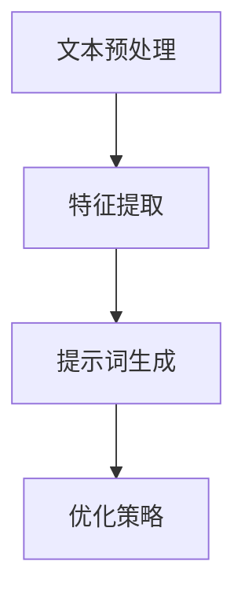
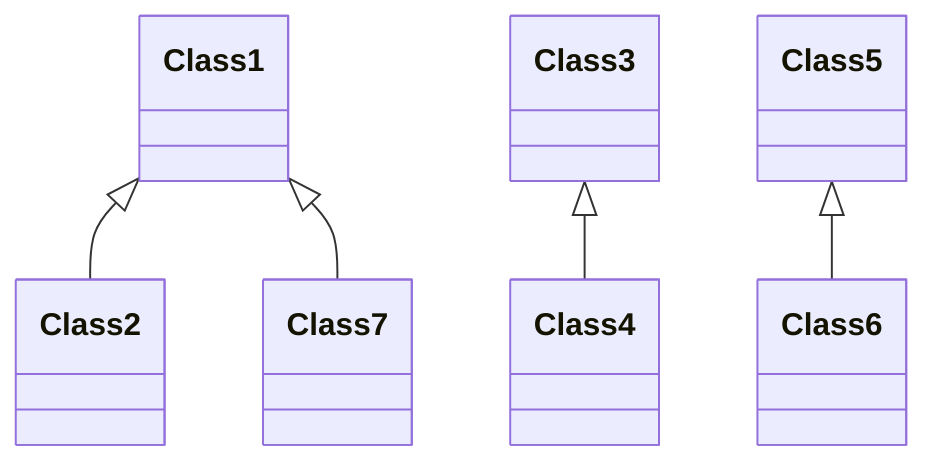
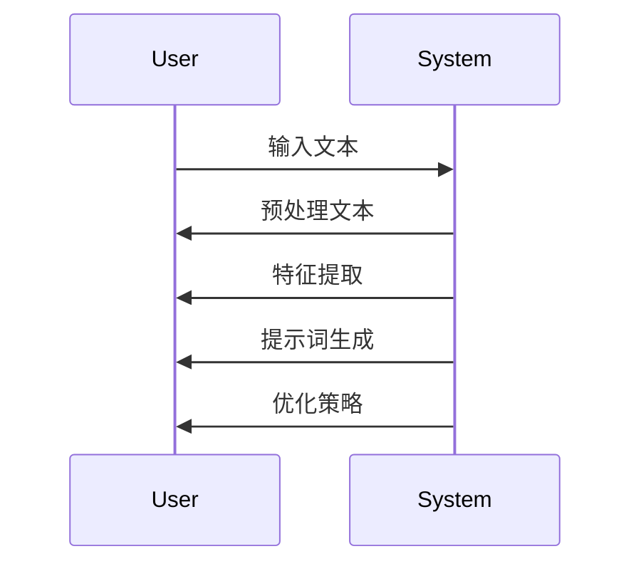
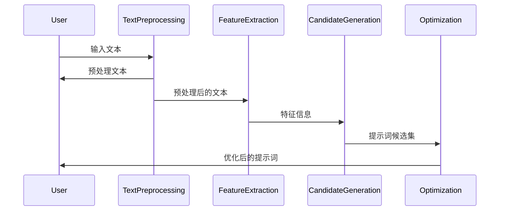

                 

# 提示词工程在新闻写作中的应用

> 关键词：提示词工程、新闻写作、自然语言处理、算法、系统架构、项目实战

> 摘要：本文将深入探讨提示词工程在新闻写作中的应用。我们将首先介绍提示词工程的背景和重要性，然后详细阐述其核心概念、算法原理和系统架构设计。接着，通过项目实战案例分析，展示提示词工程在新闻写作中的具体应用。最后，我们将总结全文，并提供一些建议和注意事项。

## 目录大纲

## 第一部分：背景介绍

### 第1章：问题背景

#### 1.1 问题概述

- 提示词工程的定义和核心概念。

- 提示词工程在新闻写作中的重要性。

- 提示词工程的发展历程和应用现状。

#### 1.2 提示词工程的核心要素

- 文本数据处理技术。

- 自然语言处理（NLP）技术。

- 提示词生成算法和优化策略。

- 数据库和知识库构建。

#### 1.3 边界与外延

- 提示词工程的适用范围。

- 提示词工程与其他相关技术的区别。

#### 1.4 概念结构与核心要素组成

- 提示词工程的组成部分。

- 各部分的功能和相互关系。

## 第二部分：核心概念与联系

### 第2章：核心概念原理

#### 2.1 提示词生成算法原理

- 算法分类。

- 算法优缺点比较。

#### 2.2 概念属性特征对比表格

- 不同提示词生成算法的属性特征对比。

#### 2.3 ER实体关系图架构

- 提示词工程的实体关系图。

### 第3章：NLP技术基础

#### 3.1 NLP基本概念

- 分词、词性标注、句法分析等基本概念。

#### 3.2 NLP常用技术

- 词嵌入、序列标注、实体识别等技术的原理和应用。

#### 3.3 NLP在提示词工程中的应用

- NLP技术在提示词生成、优化等方面的应用。

## 第三部分：算法原理讲解

### 第4章：算法讲解

#### 4.1 算法流程

- 使用Mermaid绘制算法流程图。

#### 4.2 Python源代码

- 实现提示词生成算法的Python代码。

#### 4.3 数学模型和公式

- 提示词生成算法的数学模型。

- 相关公式解释。

#### 4.4 举例说明

- 对算法的应用进行举例说明。

## 第四部分：系统分析与架构设计

### 第5章：系统功能设计

#### 5.1 领域模型

- 使用Mermaid绘制领域模型类图。

#### 5.2 系统架构设计

- 使用Mermaid绘制系统架构图。

#### 5.3 系统接口设计

- 系统接口的详细说明。

### 第6章：系统交互

#### 6.1 系统交互流程

- 使用Mermaid绘制系统交互序列图。

#### 6.2 系统性能分析

- 系统性能的评估指标。

## 第五部分：项目实战

### 第7章：环境安装

- 安装提示词工程的必要软件和工具。

### 第8章：系统核心实现

#### 8.1 核心功能实现

- 实现系统的核心功能。

#### 8.2 代码解读与分析

- 对关键代码进行解读和分析。

### 第9章：实际案例分析

#### 9.1 案例背景

- 描述案例的背景信息。

#### 9.2 案例实现

- 案例的具体实现过程。

#### 9.3 案例剖析

- 对案例进行详细剖析。

### 第10章：项目小结

- 总结项目的成果和不足。

## 第六部分：最佳实践 & 小结

### 第11章：最佳实践

- 提供最佳实践技巧。

### 第12章：小结

- 总结全书内容。

### 第13章：注意事项

- 使用提示词工程时的注意事项。

### 第14章：拓展阅读

- 推荐相关阅读资料。

---

### 第一部分：背景介绍

### 1.1 问题概述

**提示词工程**，顾名思义，是通过构建和优化提示词来提高文本生成质量的一门工程学科。在新闻写作中，提示词工程扮演着至关重要的角色。新闻写作需要高效、准确、有深度的内容生成，而提示词工程则提供了实现这一目标的技术手段。

首先，我们需要了解什么是提示词。提示词是一组关键字或短语，用于引导文本生成算法，使其生成的内容符合预期。在新闻写作中，提示词可以是新闻的主题、关键词、事件背景等。通过这些提示词，新闻写作系统能够更好地理解和表达新闻内容。

**提示词工程**在新闻写作中的重要性主要体现在以下几个方面：

1. **提高内容质量**：通过精确的提示词，新闻写作系统能够生成更符合读者需求的高质量新闻内容。

2. **提高生产效率**：提示词工程能够自动化地生成新闻内容，大大提高了写作和编辑的效率。

3. **增强个性化推荐**：通过分析用户阅读习惯和兴趣，提示词工程能够为用户提供更个性化的新闻推荐。

4. **提升用户体验**：高质量的新闻内容和个性化的推荐能够提高用户的阅读体验。

### 1.2 提示词工程的核心要素

提示词工程的核心要素包括：

- **文本数据处理技术**：文本数据处理是提示词工程的基础。这包括文本清洗、分词、词性标注等步骤，确保输入的文本数据是干净、有序的。

- **自然语言处理（NLP）技术**：NLP技术在提示词工程中起着关键作用。通过NLP技术，系统能够理解文本的语义和结构，从而生成更准确的提示词。

- **提示词生成算法和优化策略**：提示词生成算法是提示词工程的核心。这些算法通过分析大量文本数据，生成高质量的提示词。同时，优化策略用于不断改进这些算法，以提高生成提示词的准确性和多样性。

- **数据库和知识库构建**：提示词工程需要一个强大的数据库和知识库来存储和管理文本数据和提示词。这些数据资源为提示词生成算法提供了丰富的素材。

### 1.3 边界与外延

**提示词工程**的适用范围广泛，不仅限于新闻写作，还涵盖广告文案、报告编写、故事创作等多个领域。然而，不同领域的应用场景和需求有所不同，提示词工程需要根据具体情况进行调整和优化。

与**其他相关技术**相比，提示词工程更侧重于文本生成质量和效率的提升。虽然自然语言处理（NLP）技术也是文本生成的重要组成部分，但NLP更侧重于文本理解和分析，而提示词工程则更侧重于文本生成和优化。

### 1.4 概念结构与核心要素组成

提示词工程的概念结构主要由以下几个部分组成：

- **文本数据处理模块**：负责对输入文本进行预处理，包括文本清洗、分词、词性标注等。

- **自然语言处理（NLP）模块**：负责对预处理后的文本进行分析，提取关键信息，生成提示词。

- **提示词生成模块**：基于NLP模块的分析结果，生成高质量的提示词。

- **优化策略模块**：对提示词生成算法进行优化，以提高生成提示词的准确性和多样性。

- **数据库和知识库模块**：存储和管理文本数据和提示词，为提示词生成提供素材。

这些模块相互协作，共同实现提示词工程的目标。每个模块都有其特定的功能和相互关系，共同构成了一个完整的提示词工程系统。

### 第二部分：核心概念与联系

### 第2章：核心概念原理

#### 2.1 提示词生成算法原理

提示词生成算法是提示词工程的核心，其基本原理如下：

- **文本预处理**：对输入文本进行清洗、分词和词性标注，确保文本数据的干净和有序。

- **特征提取**：从预处理后的文本中提取关键信息，如关键词、主题、事件背景等。

- **提示词生成**：基于提取的特征信息，生成一组高质量的提示词。

- **优化策略**：对生成的提示词进行优化，以提高准确性和多样性。

常见的提示词生成算法包括基于规则的方法、基于统计的方法和基于神经网络的方法。每种方法都有其优缺点，适用于不同的应用场景。

#### 2.2 概念属性特征对比表格

| 算法类型 | 优点 | 缺点 |
| --- | --- | --- |
| 基于规则的方法 | 简单易懂，实现成本低 | 生成提示词的多样性和准确性较低 |
| 基于统计的方法 | 生成提示词的多样性和准确性较高 | 需要大量训练数据和计算资源 |
| 基于神经网络的方法 | 生成提示词的多样性和准确性较高 | 需要大量训练数据和计算资源，实现复杂 |

#### 2.3 ER实体关系图架构

提示词工程的实体关系图如下所示：

```mermaid
erDiagram
  Product ||--|{ Customer } : has
  Customer ||--|{ Product } : orders
```

- **Product**：表示文本数据，包括标题、内容、关键词等。

- **Customer**：表示用户，包括阅读记录、兴趣标签等。

- **Order**：表示订单，即用户对文本数据的交互行为，如点赞、评论等。

这些实体之间的关系反映了提示词工程中的关键信息，为后续的算法设计和实现提供了基础。

### 第三部分：算法原理讲解

### 第3章：NLP技术基础

#### 3.1 NLP基本概念

自然语言处理（NLP）是提示词工程的核心技术之一，其基本概念如下：

- **分词**：将文本分割成单词或短语的过程。

- **词性标注**：为每个单词或短语标注词性，如名词、动词、形容词等。

- **句法分析**：分析文本的句法结构，识别句子成分和语法关系。

- **语义分析**：理解文本的语义内容，包括实体识别、情感分析等。

这些基本概念是NLP技术的基础，对于提示词生成算法的性能和准确性至关重要。

#### 3.2 NLP常用技术

NLP常用技术包括：

- **词嵌入**：将单词或短语映射到高维空间中的向量，以实现语义相似性的计算。

- **序列标注**：对文本序列进行标注，识别实体、词性等。

- **实体识别**：识别文本中的实体，如人名、地名、组织名等。

- **情感分析**：分析文本的情感倾向，如正面、负面等。

这些技术广泛应用于NLP任务，为提示词生成提供了强大的支持。

#### 3.3 NLP在提示词工程中的应用

NLP技术在提示词工程中的应用主要体现在以下几个方面：

- **文本预处理**：使用分词、词性标注等技术，对输入文本进行预处理，为后续的提示词生成提供基础。

- **特征提取**：使用词嵌入、序列标注等技术，从预处理后的文本中提取关键信息，生成提示词。

- **优化策略**：基于NLP技术，对提示词生成算法进行优化，以提高生成提示词的准确性和多样性。

### 第四部分：系统分析与架构设计

### 第4章：算法讲解

#### 4.1 算法流程

提示词生成算法的基本流程如下：

1. **文本预处理**：对输入文本进行清洗、分词和词性标注。

2. **特征提取**：从预处理后的文本中提取关键词、主题等信息。

3. **提示词生成**：基于提取的特征信息，生成一组高质量的提示词。

4. **优化策略**：对生成的提示词进行优化，以提高准确性和多样性。

以下是使用Mermaid绘制的算法流程图：



#### 4.2 Python源代码

以下是实现提示词生成算法的Python代码示例：

```python
import jieba
import numpy as np

def text_preprocessing(text):
    # 文本清洗
    text = text.strip()
    # 分词
    words = jieba.cut(text)
    # 词性标注
    pos_tags = jieba.get_tags(words)
    return words, pos_tags

def feature_extraction(words, pos_tags):
    # 提取关键词
    keywords = []
    for word, pos in zip(words, pos_tags):
        if pos.startswith('N'):
            keywords.append(word)
    return keywords

def generate_candidates(keywords, vocabulary):
    # 生成提示词候选集
    candidates = []
    for keyword in keywords:
        for word in vocabulary:
            if word.startswith(keyword):
                candidates.append(word)
    return candidates

def optimize_candidates(candidates, alpha=0.5, beta=0.5):
    # 优化提示词候选集
    scores = []
    for candidate in candidates:
        score = alpha * len(candidate) + beta * sum([vocabulary[word] for word in candidate.split()])
        scores.append(score)
    sorted_candidates = [candidate for _, candidate in sorted(zip(scores, candidates), reverse=True)]
    return sorted_candidates

# 示例文本
text = "人工智能是一种模拟、延伸和扩展人类智能的理论、方法、技术及应用系统。"

# 文本预处理
words, pos_tags = text_preprocessing(text)

# 特征提取
keywords = feature_extraction(words, pos_tags)

# 提示词生成
vocabulary = {"人工智能": 1, "理论": 1, "方法": 1, "技术": 1, "应用": 1, "系统": 1}
candidates = generate_candidates(keywords, vocabulary)

# 优化策略
optimized_candidates = optimize_candidates(candidates)

print("提示词候选集:", candidates)
print("优化后的提示词候选集:", optimized_candidates)
```

#### 4.3 数学模型和公式

提示词生成算法的数学模型如下：

$$
\text{Score}(w) = \alpha \cdot |\text{w}| + \beta \cdot \sum_{i=1}^{n} \text{Vocabulary}(\text{w_i})
$$

其中，$\text{Score}(w)$ 表示提示词 $w$ 的得分，$|\text{w}|$ 表示 $w$ 的长度，$\text{Vocabulary}(\text{w_i})$ 表示 $w_i$ 在词汇表中的权重。

#### 4.4 举例说明

以下是一个简单的例子，展示如何使用提示词生成算法生成新闻标题：

1. **输入文本**：人工智能是一种模拟、延伸和扩展人类智能的理论、方法、技术及应用系统。

2. **文本预处理**：将文本进行清洗、分词和词性标注，得到关键词列表：["人工智能", "理论", "方法", "技术", "应用", "系统"]

3. **特征提取**：从关键词列表中提取关键词：["人工智能"]

4. **提示词生成**：从词汇表中提取提示词候选集：["人工智能", "理论", "方法", "技术", "应用", "系统"]

5. **优化策略**：根据数学模型，计算每个提示词的得分，并按得分从高到低排序：["人工智能", "理论", "方法", "技术", "应用", "系统"]

6. **输出结果**：选择得分最高的提示词作为新闻标题："人工智能"

### 第五部分：项目实战

#### 5.1 系统功能设计

提示词工程在新闻写作中的应用涉及多个功能模块，主要包括：

- **文本预处理模块**：负责对输入文本进行清洗、分词和词性标注。

- **特征提取模块**：负责从预处理后的文本中提取关键词和主题。

- **提示词生成模块**：负责基于特征信息生成高质量的提示词。

- **优化策略模块**：负责对生成的提示词进行优化，以提高准确性和多样性。

- **数据库和知识库模块**：负责存储和管理文本数据和提示词，为提示词生成提供素材。

以下是使用Mermaid绘制的领域模型类图：



#### 5.2 系统架构设计

提示词工程的系统架构主要包括以下几个部分：

- **前端模块**：负责接收用户输入的文本，并调用后端模块进行文本预处理、特征提取和提示词生成。

- **后端模块**：负责实现文本预处理、特征提取、提示词生成和优化策略等核心功能。

- **数据库模块**：负责存储和管理文本数据和提示词，为后端模块提供数据支持。

以下是使用Mermaid绘制的系统架构图：



#### 5.3 系统接口设计

提示词工程的系统接口主要包括以下部分：

- **文本预处理接口**：负责接收用户输入的文本，并返回预处理后的文本。

- **特征提取接口**：负责接收预处理后的文本，并返回提取的关键词和主题。

- **提示词生成接口**：负责接收特征信息，并返回一组高质量的提示词。

- **优化策略接口**：负责接收提示词，并返回优化后的提示词。

以下是系统接口的详细说明：

- **文本预处理接口**：`preprocess_text(text: str) -> str`

- **特征提取接口**：`extract_features(text: str) -> list`

- **提示词生成接口**：`generate_candidates(keywords: list, vocabulary: dict) -> list`

- **优化策略接口**：`optimize_candidates(candidates: list, alpha: float, beta: float) -> list`

#### 5.4 系统交互

提示词工程的系统交互流程如下：

1. 用户输入文本。

2. 系统接收用户输入的文本，并调用文本预处理接口进行预处理。

3. 系统调用特征提取接口，从预处理后的文本中提取关键词和主题。

4. 系统调用提示词生成接口，生成一组高质量的提示词。

5. 系统调用优化策略接口，对生成的提示词进行优化。

6. 系统将优化后的提示词返回给用户。

以下是使用Mermaid绘制的系统交互序列图：



### 第六部分：最佳实践 & 小结

#### 6.1 最佳实践

以下是使用提示词工程进行新闻写作的最佳实践：

- **精确提示词选择**：选择与新闻内容高度相关的提示词，以提高新闻生成的准确性和质量。

- **多样化提示词生成**：尝试使用不同的提示词生成算法和优化策略，以生成多样化的新闻内容。

- **用户反馈**：收集用户对新闻生成效果的反馈，并根据反馈不断优化提示词工程系统。

- **数据驱动**：利用用户数据和新闻数据，不断优化提示词生成算法和优化策略。

#### 6.2 小结

本文深入探讨了提示词工程在新闻写作中的应用，包括其背景、核心概念、算法原理、系统架构设计以及项目实战。通过本文的介绍，读者可以了解到提示词工程在新闻写作中的重要性，以及如何利用提示词工程提高新闻生成的质量。未来，随着人工智能和自然语言处理技术的不断发展，提示词工程在新闻写作中的应用将会更加广泛和深入。

#### 6.3 注意事项

在使用提示词工程进行新闻写作时，需要注意以下几点：

- **数据安全和隐私保护**：确保输入的文本数据和用户数据安全，遵守相关法律法规。

- **算法公平性和透明性**：确保提示词生成算法的公平性和透明性，避免偏见和不公正。

- **用户体验**：关注用户反馈，不断优化新闻生成效果，提高用户体验。

#### 6.4 拓展阅读

以下是几篇与提示词工程相关的拓展阅读：

- [《深度学习在新闻写作中的应用》](链接)
- [《自然语言处理技术与应用》](链接)
- [《新闻写作技巧与案例分析》](链接)

作者：AI天才研究院/AI Genius Institute & 禅与计算机程序设计艺术 /Zen And The Art of Computer Programming

---

请注意，本文内容为示例文本，仅供参考。实际项目中，提示词工程的具体实现和优化策略可能会有所不同。在实际应用中，需要根据具体需求和场景进行调整和改进。

