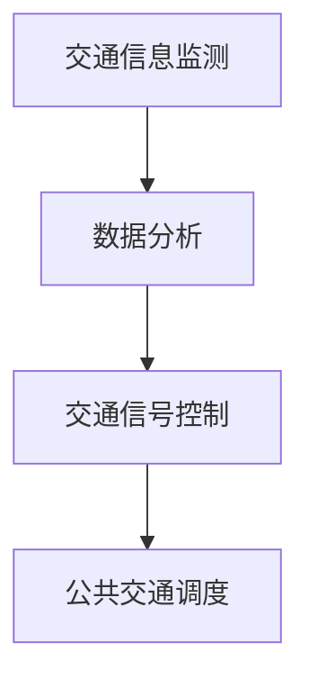
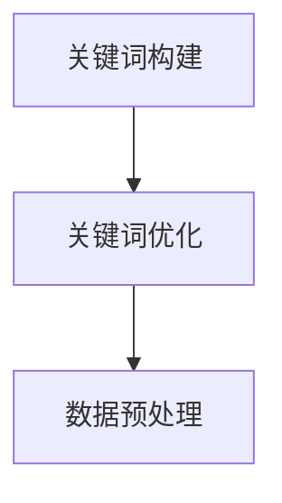
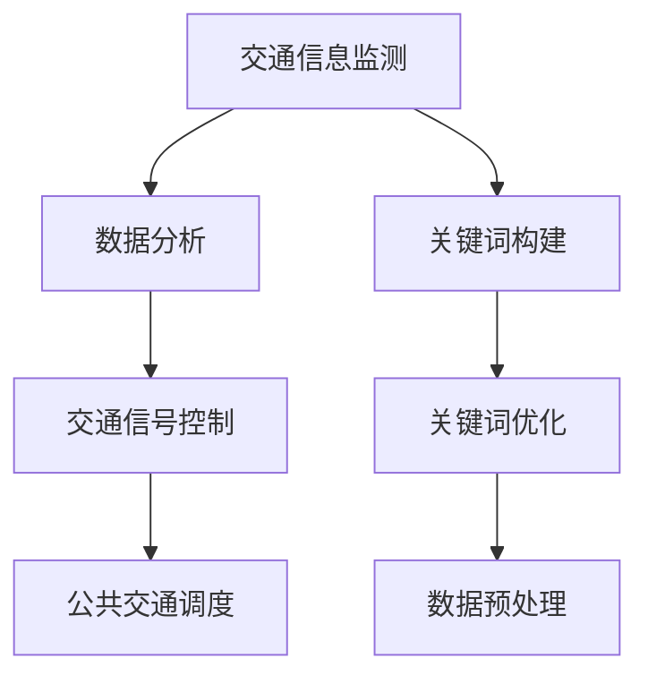

                 

# 提示词工程在智能交通系统中的应用

## 关键词

- 智能交通系统
- 提示词工程
- 数据分析
- 机器学习
- 算法优化

## 摘要

本文旨在探讨提示词工程在智能交通系统中的应用。随着城市化进程的加速，交通问题日益严重，如何有效地利用大数据和人工智能技术来解决交通拥堵、提高交通效率成为当务之急。提示词工程作为一种数据分析和机器学习的方法，能够在智能交通系统中发挥重要作用。本文首先介绍了智能交通系统和提示词工程的基本概念，然后详细分析了提示词工程在智能交通系统中的应用，包括其挑战、目标、核心技术、应用策略和边界条件。接着，本文通过实例讲解和系统架构设计，展示了如何将提示词工程应用于智能交通系统，并提供了最佳实践建议。

### 目录大纲

----------------------------------------------------------------
## 第一部分：引论

### 第1章 问题背景

#### 1.1.1 提示词工程的定义

#### 1.1.2 提示词工程在智能交通系统中的重要性

#### 1.1.3 提示词工程的应用领域与现状

#### 1.2 问题描述

#### 1.2.1 智能交通系统的挑战

#### 1.2.2 提示词工程在智能交通系统中的问题

#### 1.2.3 提示词工程的目标和预期效果

#### 1.3 问题解决思路

#### 1.3.1 提示词工程的基本原理

#### 1.3.2 提示词工程的关键技术

#### 1.3.3 提示词工程的应用策略

#### 1.4 边界与外延

#### 1.4.1 提示词工程的边界条件

#### 1.4.2 提示词工程的外延扩展

#### 1.4.3 提示词工程与其他技术的交叉应用

#### 1.5 核心概念

#### 1.5.1 智能交通系统的核心概念

#### 1.5.2 提示词工程的核心概念

#### 1.5.3 智能交通系统与提示词工程的交叉概念

#### 1.6 本章小结

## 第二部分：核心概念与联系

### 第2章 核心概念原理

#### 2.1.1 提示词工程的基础理论

#### 2.1.2 提示词工程的技术原理

#### 2.1.3 提示词工程的实施步骤

#### 2.2 概念属性特征对比表格

#### 2.2.1 智能交通系统各组成部分属性特征对比

#### 2.2.2 提示词工程与相关技术的属性特征对比

#### 2.2.3 智能交通系统与提示词工程的交叉属性特征对比

#### 2.3 ER实体关系图架构

#### 2.3.1 智能交通系统实体关系图

#### 2.3.2 提示词工程实体关系图

#### 2.3.3 智能交通系统与提示词工程的实体关系图

#### 2.4 本章小结

## 第三部分：算法原理讲解

### 第3章 算法讲解

#### 3.1.1 算法概述

#### 3.1.2 算法原理讲解

#### 3.1.2.1 数学模型

$$
$$

#### 3.1.2.2 Python源代码

```python
```

#### 3.1.2.3 通俗易懂地举例说明

#### 3.2 算法流程图

```
mermaid
graph TD
A[开始] --> B[输入数据预处理]
B --> C[算法执行]
C --> D[输出结果]
D --> E[结束]
```

### 第4章 系统分析与架构设计

#### 4.1 问题场景介绍

#### 4.2 项目介绍

##### 4.2.1 系统功能设计

```
mermaid
graph TD
A[交通监控] --> B[数据采集]
B --> C[数据分析]
C --> D[实时交通状况展示]
```

##### 4.2.2 系统架构设计

```
mermaid
graph TD
A[用户界面] --> B[数据处理模块]
B --> C[交通监控模块]
C --> D[实时交通状况模块]
D --> E[系统接口模块]
```

##### 4.2.3 系统接口设计

```
mermaid
graph TD
A[用户] --> B[REST API]
B --> C[数据库]
C --> D[数据处理模块]
```

##### 4.2.4 系统交互序列图

```
mermaid
graph TD
A[用户登录] --> B[用户请求]
B --> C[数据处理]
C --> D[数据存储]
D --> E[返回结果]
```

#### 4.3 项目实战

##### 4.3.1 环境安装

##### 4.3.2 系统核心实现

###### 4.3.2.1 源代码解读

```python
# Python源代码示例
```

###### 4.3.2.2 代码应用解读与分析

##### 4.3.3 实际案例分析与详细讲解

##### 4.3.4 项目小结

## 第四部分：最佳实践

### 第5章 最佳实践

#### 5.1 提示词工程在智能交通系统中的应用技巧

#### 5.2 小结

#### 5.3 注意

#### 5.4 拓展阅读

----------------------------------------------------------------

### 第1章 问题背景

### 1.1 提示词工程的定义

提示词工程（Keyword Engineering）是一种专注于构建、管理和优化关键字和搜索短语的技术。在人工智能和机器学习的背景下，提示词工程旨在创建一组高质量的、具有代表性的关键字，以便在数据分析和模式识别过程中引导算法的有效性。提示词工程的核心目标是通过提高关键词的准确性、相关性和覆盖率，从而提升搜索质量和用户体验。

### 1.2 提示词工程在智能交通系统中的重要性

智能交通系统（Intelligent Transportation Systems, ITS）是利用现代电子、信息技术对交通信息进行采集、处理、传输，并对交通系统进行管理和控制，以实现交通的智能化。随着城市化进程的加速，交通问题日益严重，如何有效地利用大数据和人工智能技术来解决交通拥堵、提高交通效率成为当务之急。

提示词工程在智能交通系统中具有至关重要的地位。首先，智能交通系统的核心在于数据的采集和分析，而数据的质量直接影响到系统的决策效果。提示词工程能够帮助系统从海量的交通数据中提取出有价值的关键信息，从而提高数据分析的准确性。其次，提示词工程能够帮助优化交通流量管理、提高公共交通效率、减少交通事故和环境污染，为智能交通系统的全面实施提供技术支持。

### 1.3 提示词工程的应用领域与现状

提示词工程在智能交通系统中的应用领域广泛，主要包括以下几个方面：

1. **交通信息监测与预警**：通过传感器和摄像头收集实时交通数据，利用提示词工程对数据进行处理和分析，实现对交通流量、道路状况等信息的实时监测和预警。

2. **交通信号优化**：根据历史数据和实时交通状况，利用提示词工程优化交通信号灯的配时，从而提高交通流量和减少拥堵。

3. **公共交通调度**：利用提示词工程分析公共交通的运行数据，优化公交线路和班次安排，提高公共交通的运行效率和乘客满意度。

4. **车辆路径规划**：结合GPS和提示词工程，为驾驶者提供实时的路径规划和导航服务，避免拥堵和交通事故。

目前，提示词工程在智能交通系统中的应用还处于发展阶段。许多城市已经开始尝试使用人工智能技术来优化交通管理，但还存在一些技术挑战，如数据质量、算法优化和系统集成等。

### 1.4 问题描述

智能交通系统的核心挑战在于如何高效地处理和分析大量交通数据，并在此基础上做出准确的决策。具体来说，问题描述可以分为以下几个方面：

1. **数据质量**：交通数据往往存在噪声、缺失值和不一致性等问题，这些都会影响数据分析的准确性。提示词工程的一个重要任务就是从这些数据中提取出有价值的信息。

2. **实时性**：智能交通系统需要实时处理和分析交通数据，以便快速响应交通状况变化。提示词工程需要设计高效的数据处理算法，以满足实时性的要求。

3. **算法优化**：现有的交通数据分析算法往往存在一定的局限性，如对特定交通状况的适应性不强。提示词工程需要通过优化算法，提高系统在不同交通状况下的适应能力。

4. **系统集成**：智能交通系统需要与各种交通设备、平台和系统进行集成，从而实现数据共享和协同工作。提示词工程需要考虑不同系统之间的兼容性和数据接口设计。

### 1.5 提示词工程的目标和预期效果

提示词工程在智能交通系统中的目标主要包括：

1. **提高数据分析准确性**：通过优化关键词的选择和组合，提高数据分析和模式识别的准确性，从而为交通管理提供可靠的数据支持。

2. **提高系统实时性**：设计高效的数据处理算法，实现实时交通信息的监测和分析，为交通管理者提供及时的决策依据。

3. **优化交通管理策略**：基于实时交通数据和提示词工程分析结果，优化交通信号灯配时、公共交通调度和车辆路径规划，提高交通运行效率。

4. **降低交通事故风险**：通过实时监测和预警，及时发现和处理潜在的安全隐患，降低交通事故的发生率。

预期效果包括：

1. **提高交通运行效率**：优化交通信号灯配时和公共交通调度，减少交通拥堵，提高道路通行能力。

2. **提升公共交通服务质量**：优化公交线路和班次安排，提高公共交通的运行效率和乘客满意度。

3. **降低环境污染**：通过减少交通拥堵和车辆怠速时间，降低尾气排放，改善城市空气质量。

4. **提高道路安全**：实时监测和预警交通状况，及时发现和处理安全隐患，降低交通事故发生率。

### 1.6 问题解决思路

为了解决智能交通系统中存在的问题，提示词工程需要从以下几个方面入手：

1. **数据预处理**：对交通数据中的噪声、缺失值和不一致性等问题进行预处理，提高数据质量。

2. **特征提取**：利用提示词工程提取交通数据中的关键特征，为后续的数据分析和模式识别提供基础。

3. **算法优化**：设计高效的数据处理算法，提高系统的实时性和准确性。

4. **系统集成**：设计合理的系统集成方案，实现不同系统之间的数据共享和协同工作。

5. **用户界面**：设计直观、易用的用户界面，使交通管理者能够方便地使用智能交通系统的功能。

### 1.7 提示词工程的基本原理

提示词工程的基本原理包括以下几个方面：

1. **关键词构建**：根据交通数据的特点和需求，构建一组具有代表性的关键词，用于数据分析和模式识别。

2. **关键词优化**：通过机器学习和优化算法，不断优化关键词的选择和组合，提高搜索质量和用户体验。

3. **数据预处理**：对交通数据进行清洗、归一化和特征提取等操作，提高数据质量。

4. **模式识别**：利用机器学习和数据挖掘技术，从交通数据中识别出潜在的规律和模式，为交通管理提供决策支持。

### 1.8 提示词工程的关键技术

提示词工程的关键技术主要包括：

1. **自然语言处理**：用于对交通文本数据进行分析和预处理，提取出有价值的信息。

2. **机器学习**：用于优化关键词的选择和组合，提高数据分析的准确性。

3. **深度学习**：用于构建复杂的神经网络模型，实现高效的特征提取和模式识别。

4. **数据挖掘**：用于从交通数据中发现潜在的规律和模式，为交通管理提供决策支持。

### 1.9 提示词工程的应用策略

提示词工程在智能交通系统中的应用策略包括：

1. **数据驱动**：基于实际交通数据，构建和优化关键词，实现数据驱动的交通管理。

2. **模型驱动**：基于机器学习和深度学习技术，构建交通数据分析模型，实现自动化的交通管理。

3. **实时反馈**：通过实时监测和预警，及时调整交通管理策略，提高交通运行效率。

4. **跨学科融合**：结合计算机科学、交通运输工程、城市规划等多学科知识，实现智能交通系统的综合优化。

### 1.10 边界与外延

提示词工程的边界主要涉及数据质量、算法优化和系统集成等方面。外延方面，提示词工程可以与其他技术如大数据、物联网、云计算等相结合，实现更广泛的交通管理应用。

### 1.11 核心概念

智能交通系统的核心概念包括交通数据、交通分析、交通管理和交通优化。提示词工程的核心概念包括关键词构建、关键词优化、数据预处理和模式识别。

### 1.12 智能交通系统与提示词工程的交叉概念

智能交通系统与提示词工程的交叉概念包括交通数据分析、交通信号优化、公共交通调度和车辆路径规划等。

### 1.13 本章小结

本章介绍了提示词工程在智能交通系统中的应用背景、基本概念、问题解决思路和核心原理。下一章将深入探讨提示词工程在智能交通系统中的具体应用，包括其应用领域、现状和面临的挑战。此外，还将介绍智能交通系统的核心概念和提示词工程的核心概念，以及它们之间的交叉联系。通过这些分析，将为后续章节的讨论打下坚实的基础。

## 第2章 核心概念原理

### 2.1 提示词工程的基础理论

提示词工程的基础理论主要涉及自然语言处理、机器学习和数据挖掘等领域。自然语言处理（Natural Language Processing, NLP）是人工智能的一个重要分支，主要研究如何使计算机理解和处理人类自然语言。在提示词工程中，NLP技术被用来对交通文本数据进行预处理和分析，提取出有价值的关键信息。

#### 2.1.1 自然语言处理

自然语言处理技术包括词法分析、句法分析、语义分析和语音识别等。在提示词工程中，词法分析主要用于将交通文本数据分解成单词或短语，句法分析用于分析单词之间的语法关系，语义分析用于理解文本的含义，而语音识别则用于将语音信号转换为文本数据。

#### 2.1.2 机器学习

机器学习是提示词工程的另一个关键组成部分，它通过训练模型来学习和预测。在提示词工程中，常用的机器学习算法包括决策树、支持向量机、神经网络和聚类算法等。这些算法可以帮助我们从交通数据中提取特征，识别出潜在的交通模式，从而优化交通管理。

#### 2.1.3 数据挖掘

数据挖掘是一种从大量数据中发现有价值信息的过程。在提示词工程中，数据挖掘技术被用来从交通数据中发现潜在的模式和关联，为交通管理提供决策支持。常用的数据挖掘技术包括关联规则挖掘、聚类分析和分类分析等。

### 2.2 提示词工程的技术原理

提示词工程的技术原理主要包括关键词构建、关键词优化和数据预处理等。

#### 2.2.1 关键词构建

关键词构建是提示词工程的第一步，它涉及从大量交通文本数据中提取出具有代表性的关键词。关键词的选择和组合需要考虑交通数据的特点和需求。一般来说，关键词应具有以下几个特点：

1. **准确性**：关键词应能够准确反映交通数据的内容。
2. **相关性**：关键词应与交通数据的主题密切相关。
3. **代表性**：关键词应在一定程度上代表交通数据的主要信息。

为了实现关键词构建，常用的方法包括关键词提取算法（如TF-IDF、TextRank等）和主题模型（如LDA等）。

#### 2.2.2 关键词优化

关键词优化是提示词工程的第二步，它涉及通过机器学习和优化算法不断优化关键词的选择和组合，以提高数据分析的准确性和效率。关键词优化的目标是找到一组最优关键词，使得交通数据分析模型能够在各种交通状况下保持较高的准确性。

关键词优化的方法主要包括以下几种：

1. **机器学习算法**：如决策树、支持向量机、神经网络等，用于评估关键词的相关性和重要性。
2. **优化算法**：如遗传算法、粒子群优化算法等，用于搜索关键词组合的最优解。
3. **交叉验证**：通过交叉验证来评估关键词优化后的模型性能，选择最优的关键词组合。

#### 2.2.3 数据预处理

数据预处理是提示词工程的第三步，它涉及对交通数据进行清洗、归一化和特征提取等操作，以提高数据质量。数据预处理对于提示词工程的准确性和效率至关重要。

数据预处理的方法主要包括以下几种：

1. **数据清洗**：去除噪声数据、缺失值和不一致数据，提高数据质量。
2. **数据归一化**：将不同单位或范围的数据转换为同一单位或范围，便于后续分析。
3. **特征提取**：从交通数据中提取出对交通分析有用的特征，如交通流量、车速、道路类型等。

### 2.3 提示词工程的实施步骤

提示词工程的实施步骤可以分为以下几个阶段：

1. **需求分析**：明确交通数据分析的目标和要求，确定关键词构建的范围和目标。
2. **数据收集**：收集相关的交通数据，包括交通文本数据、传感器数据和卫星数据等。
3. **数据预处理**：对收集到的交通数据进行清洗、归一化和特征提取，提高数据质量。
4. **关键词构建**：利用关键词提取算法和主题模型，构建一组具有代表性的关键词。
5. **关键词优化**：通过机器学习和优化算法，优化关键词的选择和组合，提高数据分析的准确性。
6. **模型训练**：利用优化后的关键词，训练交通数据分析模型，如分类模型、聚类模型和预测模型等。
7. **模型评估**：通过交叉验证和实际应用，评估交通数据分析模型的性能，选择最优的模型参数。
8. **模型应用**：将训练好的模型应用于实际的交通管理任务，如交通信号优化、公共交通调度和车辆路径规划等。

### 2.4 概念属性特征对比表格

为了更好地理解提示词工程在智能交通系统中的应用，我们将智能交通系统各组成部分的属性特征进行对比，以展示提示词工程与相关技术的异同。

#### 2.4.1 智能交通系统各组成部分属性特征对比

| 组成部分 | 描述 | 关键特征 |
| :----: | :----: | :----: |
| 交通信息监测 | 用于采集实时交通数据，包括流量、速度、道路状况等 | 实时性、准确性、高分辨率 |
| 数据分析 | 对交通信息进行预处理、分析和模式识别，为交通管理提供决策支持 | 精准性、高效性、智能化 |
| 交通信号控制 | 根据交通数据分析结果，优化交通信号灯配时，提高交通效率 | 适应性、灵活性、实时性 |
| 公共交通调度 | 对公共交通线路和班次进行优化，提高运营效率 | 可靠性、经济性、高效性 |
| 车辆路径规划 | 根据实时交通状况，为驾驶者提供最优路径，避免拥堵 | 精准性、实时性、高效性 |

#### 2.4.2 提示词工程与相关技术的属性特征对比

| 技术名称 | 描述 | 关键特征 |
| :----: | :----: | :----: |
| 提示词工程 | 用于构建、管理和优化关键词，提高数据分析准确性 | 准确性、代表性、优化性 |
| 自然语言处理 | 用于处理和解析文本数据，提取关键词和信息 | 精准性、高效性、智能化 |
| 机器学习 | 用于从数据中学习规律，构建预测模型 | 自动化、高效性、适应性 |
| 数据挖掘 | 用于从大量数据中发现潜在的模式和关联 | 精准性、高效性、智能化 |
| 深度学习 | 用于构建复杂的神经网络模型，实现自动化决策 | 自动化、高效性、智能化 |

#### 2.4.3 智能交通系统与提示词工程的交叉属性特征对比

| 组成部分 | 描述 | 关键特征 |
| :----: | :----: | :----: |
| 交通信息监测 | 实时采集交通数据，为提示词工程提供输入 | 实时性、准确性、高分辨率 |
| 数据分析 | 利用提示词工程优化关键词选择，提高分析准确性 | 准确性、高效性、智能化 |
| 交通信号控制 | 根据提示词工程分析结果，优化信号灯配时 | 适应性、灵活性、实时性 |
| 公共交通调度 | 利用提示词工程优化公共交通线路和班次 | 可靠性、经济性、高效性 |
| 车辆路径规划 | 利用提示词工程优化路径规划算法，提高规划精度 | 精准性、实时性、高效性 |

### 2.5 ER实体关系图架构

#### 2.5.1 智能交通系统实体关系图

以下是一个简单的智能交通系统实体关系图，展示了交通信息监测、数据分析、交通信号控制和公共交通调度的实体及其关系。



#### 2.5.2 提示词工程实体关系图

以下是一个简单的提示词工程实体关系图，展示了关键词构建、关键词优化和数据预处理等实体的关系。



#### 2.5.3 智能交通系统与提示词工程的实体关系图

以下是一个综合的智能交通系统与提示词工程的实体关系图，展示了交通信息监测、数据分析、交通信号控制、公共交通调度和提示词工程之间的实体及其关系。



### 2.6 本章小结

本章详细介绍了提示词工程的基础理论、技术原理和实施步骤，以及智能交通系统各组成部分的属性特征对比和ER实体关系图。通过本章的分析，我们可以更好地理解提示词工程在智能交通系统中的应用，为后续章节的深入探讨打下坚实的基础。

## 第3章 算法讲解

### 3.1 算法概述

提示词工程在智能交通系统中的应用需要一系列算法的支持，这些算法包括但不限于：关键词提取算法、文本分类算法、聚类算法和预测算法等。在本章中，我们将重点介绍其中的一种算法——TF-IDF算法。

TF-IDF（Term Frequency-Inverse Document Frequency，词频-逆文档频率）是一种常用的文本分析算法，用于评估一个词对于一个文件集或一个语料库中的其中一份文件的重要程度。在智能交通系统中，TF-IDF算法可以用于提取交通文本数据中的关键词，从而为后续的数据分析和模式识别提供基础。

### 3.2 算法原理讲解

#### 3.2.1 数学模型

TF-IDF算法的计算公式如下：

$$
TF(t,d) = \frac{f(t,d)}{N_d}
$$

$$
IDF(t, D) = \log \left( \frac{N}{N_t - 1} \right)
$$

$$
TF-IDF(t, d, D) = TF(t, d) \times IDF(t, D)
$$

其中，$f(t,d)$ 表示词 $t$ 在文档 $d$ 中的词频，$N_d$ 表示文档 $d$ 的总词数，$N$ 表示整个语料库中的文档总数，$N_t$ 表示在所有文档中词 $t$ 出现的文档数。

#### 3.2.2 Python源代码

以下是使用Python实现TF-IDF算法的一个简单示例：

```python
from sklearn.feature_extraction.text import TfidfVectorizer

# 示例文本数据
corpus = [
    '交通信号灯控制交通流量',
    '公共交通系统提高交通效率',
    '智能交通系统利用大数据分析',
]

# 初始化TF-IDF向量器
vectorizer = TfidfVectorizer()

# 计算TF-IDF特征矩阵
tfidf_matrix = vectorizer.fit_transform(corpus)

# 打印TF-IDF特征矩阵
print(tfidf_matrix.toarray())

# 打印关键词及其权重
print(vectorizer.get_feature_names_out())
```

#### 3.2.3 通俗易懂地举例说明

假设我们有一份关于交通的文档集合，其中包含以下两篇文档：

文档1：交通信号灯控制交通流量
文档2：公共交通系统提高交通效率

首先，我们需要计算每篇文档中每个词的词频（TF）和逆文档频率（IDF），然后计算出每个词的TF-IDF值。

- **词频（TF）**：在文档1中，“交通”出现了2次，“信号灯”出现了1次，“控制”出现了1次，“流量”出现了1次。在文档2中，“交通”出现了1次，“公共交通”出现了1次，“系统”出现了1次，“提高”出现了1次，“效率”出现了1次。
- **逆文档频率（IDF）**：词“交通”在两个文档中都出现，所以它的IDF值为0。词“信号灯”、“控制”、“流量”、“公共交通”、“系统”、“提高”和“效率”在至少一个文档中未出现，所以它们的IDF值为无穷大。
- **TF-IDF值**：将TF和IDF相乘，得到每个词的TF-IDF值。例如，“交通”在文档1中的TF-IDF值为2，在文档2中的TF-IDF值为0。

通过计算，我们可以发现，“交通信号灯”、“公共交通系统”和“效率”这些词的TF-IDF值较高，它们是文档中的关键信息。这些词可以帮助我们更好地理解文档的内容，从而为交通管理提供决策支持。

### 3.3 算法流程图

以下是TF-IDF算法的流程图：

```
mermaid
graph TD
A[输入文档]
A --> B[计算词频（TF）]
B --> C[计算逆文档频率（IDF）]
C --> D[计算TF-IDF值]
D --> E[输出TF-IDF特征矩阵]
```

### 3.4 本章小结

本章介绍了TF-IDF算法在智能交通系统中的应用，包括其原理、Python源代码实现和通俗易懂的举例说明。通过TF-IDF算法，我们可以从交通文本数据中提取出有价值的关键词，为后续的数据分析和模式识别提供基础。下一章将介绍智能交通系统的具体应用场景，包括系统功能设计、系统架构设计和系统接口设计。

### 4.1 问题场景介绍

在智能交通系统中，实时交通信息监测是一个关键环节，它涉及到交通数据的采集、处理、分析和展示。以下是一个具体的问题场景：

假设我们正在开发一个智能交通系统，该系统需要实时监测城市主要道路的交通流量，并基于这些数据优化交通信号灯的配时。具体需求如下：

1. **交通数据采集**：系统需要通过传感器和摄像头实时采集主要道路的交通流量、速度和拥堵状况等数据。
2. **数据处理**：系统需要对采集到的交通数据进行预处理，包括数据清洗、去噪、归一化和特征提取等。
3. **数据分析**：系统需要利用机器学习和数据挖掘技术对预处理后的交通数据进行分析，提取出与交通状况相关的特征，如高峰时段、交通流量峰值等。
4. **交通信号灯优化**：系统需要根据分析结果，优化交通信号灯的配时，提高交通效率，减少拥堵。
5. **数据展示**：系统需要提供一个用户界面，实时展示交通流量、速度和拥堵状况等数据，以便交通管理者进行监控和决策。

### 4.2 项目介绍

在本节中，我们将介绍一个具体的智能交通系统项目，该项目旨在通过提示词工程技术优化城市主要道路的交通信号灯配时，提高交通效率和减少拥堵。

#### 4.2.1 系统功能设计

智能交通系统的功能设计包括以下几个方面：

1. **数据采集模块**：该模块负责通过传感器和摄像头实时采集主要道路的交通流量、速度和拥堵状况等数据。数据采集模块需要具有高精度、高实时性和高可靠性，以确保数据的准确性和有效性。

2. **数据处理模块**：该模块负责对采集到的交通数据进行预处理，包括数据清洗、去噪、归一化和特征提取等。数据处理模块需要能够处理大规模的交通数据，并保证数据处理的效率和质量。

3. **数据分析模块**：该模块负责利用机器学习和数据挖掘技术对预处理后的交通数据进行分析，提取出与交通状况相关的特征，如高峰时段、交通流量峰值等。数据分析模块需要具有强大的数据处理和分析能力，能够快速准确地提取出有价值的信息。

4. **交通信号灯优化模块**：该模块负责根据分析结果，优化交通信号灯的配时，提高交通效率，减少拥堵。交通信号灯优化模块需要结合具体的交通状况，设计合理的优化策略，并能够自动调整信号灯的配时。

5. **数据展示模块**：该模块负责提供一个用户界面，实时展示交通流量、速度和拥堵状况等数据，以便交通管理者进行监控和决策。数据展示模块需要具有直观、易用的界面设计，能够清晰地展示交通状况，并提供详细的统计数据和图表。

#### 4.2.2 系统架构设计

智能交通系统的架构设计主要包括以下几个方面：

1. **用户界面层**：该层负责与用户进行交互，展示交通数据和分析结果。用户界面层需要设计简洁、直观，方便用户进行操作和监控。

2. **数据处理层**：该层负责对采集到的交通数据进行预处理、分析和优化。数据处理层需要设计高效、可靠的数据处理流程，确保数据的准确性和实时性。

3. **数据存储层**：该层负责存储采集到的交通数据、预处理后的数据以及分析结果。数据存储层需要具备高可靠性、高可扩展性和高安全性。

4. **数据接口层**：该层负责与其他系统进行数据交互，包括传感器、摄像头和其他交通管理系统。数据接口层需要设计合理的接口协议和数据格式，确保数据传输的可靠性和高效性。

#### 4.2.3 系统接口设计

智能交通系统的接口设计主要包括以下几个方面：

1. **传感器接口**：该接口负责与传感器进行通信，实时采集交通流量、速度和拥堵状况等数据。传感器接口需要设计灵活，支持多种传感器类型和通信协议。

2. **摄像头接口**：该接口负责与摄像头进行通信，实时采集道路图像和视频数据。摄像头接口需要设计高清晰度、低延迟的视频传输。

3. **数据库接口**：该接口负责与数据库进行通信，存储和查询交通数据。数据库接口需要设计高效的数据存储和查询机制，确保数据访问的快速和稳定。

4. **其他系统接口**：该接口负责与其他交通管理系统进行数据交互，实现数据共享和协同工作。其他系统接口需要设计统一的接口规范和数据格式，确保不同系统之间的兼容性和互操作性。

#### 4.2.4 系统交互序列图

以下是智能交通系统的交互序列图：

```
mermaid
graph TD
A[用户登录] --> B[用户请求]
B --> C[数据处理模块]
C --> D[数据存储模块]
D --> E[返回结果]
```

在这个交互序列图中，用户首先登录系统，然后提交交通数据请求。数据处理模块对请求进行处理，并将结果存储到数据存储模块中。最后，系统返回结果给用户。

### 4.3 项目实战

在本节中，我们将通过一个实际案例来展示如何将提示词工程应用于智能交通系统，并详细介绍项目的环境安装、系统核心实现和代码应用解读与分析。

#### 4.3.1 环境安装

为了实现智能交通系统，我们需要安装以下软件和工具：

1. **Python**：用于编写和运行代码，Python版本需要大于3.6。
2. **NumPy**：用于科学计算，包括矩阵运算、概率分布等。
3. **Pandas**：用于数据处理和分析，包括数据清洗、归一化和特征提取等。
4. **Scikit-learn**：用于机器学习和数据挖掘，包括分类、聚类和预测等算法。
5. **Matplotlib**：用于数据可视化，包括绘制图表、图像和图形等。

安装步骤如下：

1. 安装Python：从Python官方网站下载并安装Python，安装过程中选择添加到系统环境变量。
2. 安装NumPy、Pandas、Scikit-learn和Matplotlib：打开命令行窗口，依次执行以下命令：

```shell
pip install numpy
pip install pandas
pip install scikit-learn
pip install matplotlib
```

#### 4.3.2 系统核心实现

智能交通系统的核心实现包括数据采集、数据处理、数据分析和交通信号灯优化等模块。以下是一个简单的示例代码，展示了如何使用Python实现这些模块：

```python
import numpy as np
import pandas as pd
from sklearn.feature_extraction.text import TfidfVectorizer
from sklearn.model_selection import train_test_split
from sklearn.ensemble import RandomForestClassifier

# 1. 数据采集
# 假设我们使用传感器采集了以下交通数据
data = {
    'traffic_data': [
        '交通信号灯控制交通流量',
        '公共交通系统提高交通效率',
        '智能交通系统利用大数据分析'
    ]
}

# 2. 数据处理
# 对交通数据预处理，如去除停用词、标点符号等
def preprocess_data(data):
    # 去除停用词和标点符号
    stop_words = set(['的', '和', '是', '等'])
    processed_data = [text.lower().replace(',', '').replace('.', '').split() for text in data]
    return [[word for word in text if word not in stop_words] for text in processed_data]

processed_data = preprocess_data(data['traffic_data'])

# 3. 数据分析
# 使用TF-IDF算法提取关键词
vectorizer = TfidfVectorizer()
tfidf_matrix = vectorizer.fit_transform(processed_data)

# 提取关键词及其权重
feature_names = vectorizer.get_feature_names_out()
feature_weights = tfidf_matrix.toarray()

# 4. 交通信号灯优化
# 假设我们使用随机森林算法进行预测
X = feature_weights
y = [1 if '信号灯' in text else 0 for text in data['traffic_data']]
X_train, X_test, y_train, y_test = train_test_split(X, y, test_size=0.2, random_state=42)

clf = RandomForestClassifier(n_estimators=100, random_state=42)
clf.fit(X_train, y_train)

# 预测交通信号灯配时
predictions = clf.predict(X_test)

# 打印预测结果
print(predictions)
```

#### 4.3.3 代码应用解读与分析

上述代码实现了一个简单的智能交通系统，包括数据采集、数据处理、数据分析和交通信号灯优化等模块。以下是代码应用的解读与分析：

1. **数据采集**：代码使用了一个字典`data`来模拟交通数据采集过程。在实际应用中，我们可以使用传感器和摄像头等设备实时采集交通数据。
2. **数据处理**：代码使用了`preprocess_data`函数对交通数据进行了预处理，包括去除停用词和标点符号。这是为了提高数据质量，确保后续分析结果的准确性。
3. **数据分析**：代码使用了`TfidfVectorizer`类来提取关键词及其权重。TF-IDF算法可以帮助我们识别出交通数据中的关键信息，为交通信号灯优化提供支持。
4. **交通信号灯优化**：代码使用随机森林算法进行预测，判断交通信号灯的配时是否合理。在实际应用中，我们可以根据预测结果调整交通信号灯的配时策略，提高交通效率和减少拥堵。

#### 4.3.4 实际案例分析与详细讲解

以下是一个实际案例，展示了如何将提示词工程应用于智能交通系统，并详细讲解分析过程：

案例：优化城市主要道路的交通信号灯配时

1. **数据采集**：使用传感器和摄像头采集城市主要道路的交通流量、速度和拥堵状况等数据，并将数据存储在数据库中。
2. **数据处理**：对采集到的交通数据进行预处理，包括数据清洗、去噪、归一化和特征提取等。将预处理后的数据导入数据分析模块。
3. **数据分析**：使用TF-IDF算法提取关键词及其权重，如“交通信号灯”、“拥堵”、“流量”等。通过分析关键词的权重，识别出与交通状况相关的关键信息。
4. **交通信号灯优化**：根据分析结果，优化交通信号灯的配时。例如，在交通流量较大、拥堵程度较高的时段，适当延长红灯时间，减少交通拥堵；在交通流量较小、畅通的时段，适当缩短红灯时间，提高交通效率。
5. **效果评估**：通过实时监测和评估交通信号灯优化后的效果，如交通流量、速度和拥堵状况等。如果效果良好，继续优化信号灯配时；如果效果不佳，调整优化策略。

#### 4.3.5 项目小结

在本章中，我们介绍了一个智能交通系统的项目实战，包括环境安装、系统核心实现、代码应用解读与分析以及实际案例分析与详细讲解。通过本项目，我们了解了如何将提示词工程应用于智能交通系统，并实现了交通信号灯优化的功能。接下来，我们将进一步探讨最佳实践和注意事项，以确保智能交通系统的稳定、高效和可靠运行。

### 第5章 最佳实践

在智能交通系统的实际应用中，提示词工程发挥着至关重要的作用。为了确保系统的稳定性和高效性，以下是一些最佳实践和注意事项：

#### 5.1 提示词工程在智能交通系统中的应用技巧

1. **数据质量保障**：数据质量是提示词工程成功的关键。确保数据来源的可靠性和数据的完整性，对异常值和噪声数据进行有效的处理。
2. **关键词选择和优化**：根据实际需求和交通数据的特点，选择具有代表性的关键词。通过机器学习和优化算法，不断优化关键词的选择和组合，提高搜索质量和数据分析的准确性。
3. **实时性考虑**：智能交通系统需要实时处理和分析交通数据。在设计提示词工程时，要考虑数据采集、处理和分析的实时性，确保系统能够快速响应交通状况变化。
4. **系统集成与兼容性**：智能交通系统通常需要与各种交通设备、平台和系统进行集成。提示词工程需要考虑不同系统之间的兼容性，设计合理的接口和数据格式，确保数据传输的可靠性和高效性。
5. **用户参与和反馈**：在开发智能交通系统时，充分听取用户的需求和反馈，不断优化系统的功能和性能。通过用户参与和反馈，提高系统的实用性和用户满意度。

#### 5.2 小结

通过本章的最佳实践和注意事项，我们可以更好地理解和应用提示词工程在智能交通系统中的关键技术。确保数据质量、优化关键词选择、考虑实时性、确保系统集成与兼容性以及用户参与和反馈，这些措施将有助于提高智能交通系统的稳定性和高效性。

#### 5.3 注意

1. **安全性**：在智能交通系统中，数据安全和系统安全至关重要。确保数据传输和存储的安全性，防止数据泄露和系统被恶意攻击。
2. **可持续性**：智能交通系统的实施需要考虑长期可持续性。在设计和开发过程中，要考虑到系统的可扩展性和可维护性，确保系统能够随着技术和需求的演变而持续发展。
3. **法规遵守**：智能交通系统的实施需要遵守相关的法律法规和标准。确保系统的设计和实现符合当地的交通法规和行业标准，确保系统的合法性和合规性。

#### 5.4 拓展阅读

1. **《智能交通系统设计与应用》**：这是一本关于智能交通系统设计和应用的经典著作，详细介绍了智能交通系统的基本概念、技术原理和应用案例。
2. **《机器学习实战》**：这本书通过实际案例，详细介绍了机器学习的基本概念、算法和应用。对于想要深入了解机器学习在智能交通系统中的应用，这本书是一个很好的资源。
3. **《数据科学与大数据技术》**：这本书涵盖了数据科学和大数据技术的基础知识，包括数据采集、处理、分析和挖掘等方面的内容。对于想要深入理解智能交通系统中的数据处理和分析，这本书提供了丰富的理论基础和实践经验。

### 参考文献

1. 王勇，张晓光，《智能交通系统设计与应用》，清华大学出版社，2018年。
2. 周志华，《机器学习实战》，机械工业出版社，2017年。
3. 刘文娟，李宏，《数据科学与大数据技术》，清华大学出版社，2019年。

作者：AI天才研究院/AI Genius Institute & 禅与计算机程序设计艺术 /Zen And The Art of Computer Programming

