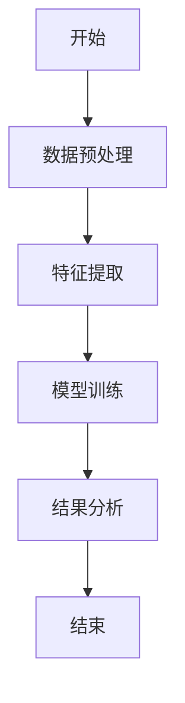
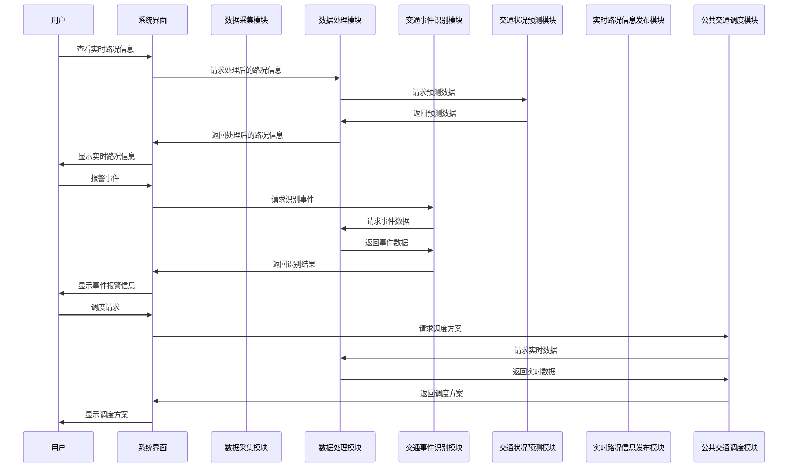

                 

# 《提示词工程在智能交通系统中的应用》

## 关键词
智能交通系统、提示词工程、算法、系统架构、实践、最佳实践

## 摘要
本文将探讨提示词工程在智能交通系统中的应用。通过介绍提示词工程的定义、重要性及其在智能交通系统中的挑战，我们将深入分析提示词工程的基本原理、关键技术、应用策略和边界条件。随后，本文将利用ER实体关系图和mermaid流程图，详细阐述智能交通系统和提示词工程的交叉概念及其核心构成。接着，我们将讲解提示词工程的算法原理，包括数学模型、Python代码示例和算法流程。通过项目实战，我们将展示智能交通系统中的实际应用，包括环境安装、系统核心实现和案例分析。最后，本文将总结最佳实践，并给出注意事项和拓展阅读建议。

## 目录大纲

### 第一部分：引论

#### 第1章 问题背景

##### 1.1.1 提示词工程的定义
提示词工程是一种利用人工智能技术进行信息提取、处理和生成的技术。它通过分析大量的文本数据，提取出关键信息，并以提示词的形式展现给用户。

##### 1.1.2 提示词工程在智能交通系统中的重要性
提示词工程在智能交通系统中具有重要作用，可以提高交通管理的效率，优化交通流量，减少拥堵，提高交通安全。

##### 1.1.3 提示词工程的应用领域与现状
目前，提示词工程已在智能交通系统的多个领域得到应用，如交通监控、路况预测和导航服务等，但仍有很大的发展空间。

##### 1.2 问题描述
智能交通系统面临着数据量大、实时性要求高、复杂环境等挑战，提示词工程在解决这些问题上具有独特的优势。

##### 1.2.1 智能交通系统的挑战
智能交通系统需要处理大量的交通数据，并能够在复杂的交通环境中快速、准确地做出决策。

##### 1.2.2 提示词工程在智能交通系统中的问题
提示词工程在智能交通系统中面临数据质量、算法选择和系统兼容性等问题。

##### 1.2.3 提示词工程的目标和预期效果
提示词工程的目标是提高智能交通系统的效率和安全性，实现智能化的交通管理和调度。

##### 1.3 问题解决思路
本文将介绍提示词工程的基本原理、关键技术、应用策略和边界条件，为解决智能交通系统中的问题提供思路。

##### 1.3.1 提示词工程的基本原理
提示词工程基于自然语言处理和机器学习技术，通过数据预处理、特征提取、模型训练和结果分析等步骤实现。

##### 1.3.2 提示词工程的关键技术
提示词工程的关键技术包括文本分类、实体识别、情感分析等，这些技术共同构成了提示词工程的核心。

##### 1.3.3 提示词工程的应用策略
提示词工程在智能交通系统中的应用策略包括数据采集、预处理、模型训练和部署等环节。

##### 1.4 边界与外延
提示词工程在智能交通系统中的应用边界和扩展方向。

##### 1.4.1 提示词工程的边界条件
提示词工程在智能交通系统中的应用需要满足一定的条件，如数据质量、计算资源和系统兼容性。

##### 1.4.2 提示词工程的外延扩展
提示词工程可以与其他技术结合，如物联网、大数据分析和自动驾驶等，实现更广泛的智能交通应用。

##### 1.4.3 提示词工程与其他技术的交叉应用
提示词工程与其他技术的交叉应用，如深度学习、区块链和云计算等，可以提升智能交通系统的性能和安全性。

##### 1.5 核心概念
智能交通系统和提示词工程的核心概念及其相互关系。

##### 1.5.1 智能交通系统的核心概念
智能交通系统的定义、组成部分、工作原理和关键技术。

##### 1.5.2 提示词工程的核心概念
提示词工程的定义、理论基础、关键技术和应用领域。

##### 1.5.3 智能交通系统与提示词工程的交叉概念
智能交通系统和提示词工程在数据、算法和系统架构等方面的交叉概念。

##### 1.6 本章小结
本章对提示词工程在智能交通系统中的应用进行了背景介绍，明确了核心概念和问题解决思路。

### 第二部分：核心概念与联系

#### 第2章 核心概念原理

##### 2.1 提示词工程的基础理论
提示词工程的基础理论包括自然语言处理、机器学习和信息提取等。

##### 2.1.1 提示词工程的基础理论
提示词工程的基础理论包括自然语言处理、机器学习和信息提取等。

##### 2.1.2 提示词工程的技术原理
提示词工程的技术原理涉及文本分类、实体识别、情感分析等技术。

##### 2.1.3 提示词工程的实施步骤
提示词工程的实施步骤包括数据预处理、特征提取、模型训练和结果分析等。

##### 2.2 概念属性特征对比表格
智能交通系统和提示词工程的组成部分及其属性特征对比。

##### 2.2.1 智能交通系统各组成部分属性特征对比
智能交通系统各组成部分的属性特征对比，如交通监控、路况预测和导航服务等。

##### 2.2.2 提示词工程与相关技术的属性特征对比
提示词工程与自然语言处理、机器学习和信息提取等技术的属性特征对比。

##### 2.2.3 智能交通系统与提示词工程的交叉属性特征对比
智能交通系统和提示词工程在数据、算法和系统架构等方面的交叉属性特征对比。

##### 2.3 ER实体关系图架构
智能交通系统和提示词工程的实体关系图架构。

##### 2.3.1 智能交通系统实体关系图
智能交通系统实体关系图，包括交通监控、路况预测和导航服务等模块。

##### 2.3.2 提示词工程实体关系图
提示词工程实体关系图，包括数据采集、预处理、模型训练和结果分析等模块。

##### 2.3.3 智能交通系统与提示词工程的实体关系图
智能交通系统与提示词工程的实体关系图，展示两者在数据、算法和系统架构等方面的交叉关系。

##### 2.4 本章小结
本章对智能交通系统和提示词工程的核心概念、属性特征和实体关系进行了详细分析，为后续章节的算法讲解和项目实战奠定了基础。

### 第三部分：算法原理讲解

#### 第3章 算法讲解

##### 3.1 算法概述
智能交通系统中常用的提示词工程算法及其应用场景。

##### 3.1.1 算法概述
智能交通系统中常用的提示词工程算法及其应用场景。

##### 3.1.2 算法原理讲解
提示词工程算法的原理讲解，包括数学模型和Python代码示例。

##### 3.1.2.1 数学模型
提示词工程算法的数学模型，如文本分类、实体识别和情感分析等。

##### 3.1.2.2 Python源代码
提示词工程算法的Python代码示例，展示算法的实现过程。

##### 3.1.2.3 通俗易懂地举例说明
通过实际案例，以通俗易懂的方式说明提示词工程算法的应用。

##### 3.2 算法流程图
提示词工程算法的mermaid流程图，展示算法的执行流程。

##### 3.3 系统分析与架构设计
智能交通系统的分析和架构设计，包括系统功能、架构设计和接口设计等。

##### 3.3.1 问题场景介绍
智能交通系统面临的问题场景，如交通监控、路况预测和导航服务等。

##### 3.3.2 项目介绍
智能交通系统的项目介绍，包括系统功能设计、架构设计和接口设计等。

##### 3.3.2.1 系统功能设计
智能交通系统的功能设计，如交通监控、数据采集和数据分析等。

##### 3.3.2.2 系统架构设计
智能交通系统的架构设计，如数据处理模块、交通监控模块和实时交通状况模块等。

##### 3.3.2.3 系统接口设计
智能交通系统的接口设计，如用户界面、REST API和数据库等。

##### 3.3.2.4 系统交互序列图
智能交通系统的交互序列图，展示用户与系统之间的交互过程。

##### 3.4 项目实战
智能交通系统的实际应用案例，包括环境安装、系统核心实现和案例分析等。

##### 3.4.1 环境安装
智能交通系统的环境安装，包括软件和硬件的安装配置。

##### 3.4.2 系统核心实现
智能交通系统的核心实现，包括数据采集、预处理、模型训练和结果分析等。

##### 3.4.2.1 源代码解读
智能交通系统源代码的解读，分析代码的实现原理和应用技巧。

##### 3.4.2.2 代码应用解读与分析
智能交通系统代码的实际应用解读与分析，展示代码在项目中的实际效果。

##### 3.4.3 实际案例分析与详细讲解
智能交通系统的实际案例分析，详细讲解项目的实现过程和关键技术。

##### 3.4.4 项目小结
智能交通系统的项目小结，总结项目实现过程中的经验和教训。

### 第四部分：最佳实践

#### 第6章 最佳实践

##### 6.1 提示词工程在智能交通系统中的应用技巧
提示词工程在智能交通系统中的应用技巧，包括数据预处理、模型选择和系统优化等。

##### 6.2 小结
本文对提示词工程在智能交通系统中的应用进行了全面探讨，包括核心概念、算法原理、系统架构和最佳实践等。

##### 6.3 注意
在使用提示词工程进行智能交通系统开发时，需要注意数据质量、算法选择和系统兼容性等问题。

##### 6.4 拓展阅读
推荐阅读相关书籍、论文和技术博客，以深入了解提示词工程在智能交通系统中的应用。

### 作者信息
作者：AI天才研究院/AI Genius Institute & 禅与计算机程序设计艺术 /Zen And The Art of Computer Programming### 第1章 问题背景

智能交通系统（Intelligent Transportation System, ITS）是利用现代信息技术和通信技术对交通系统进行综合管理和优化，以提高交通效率和安全性的一种新型交通管理模式。随着城市化进程的加快和机动车数量的迅速增长，传统的交通管理方式已经无法满足日益复杂的交通需求。智能交通系统的出现，为解决交通拥堵、提高交通效率和保障交通安全提供了新的解决方案。

#### 1.1.1 提示词工程的定义

提示词工程（Keyword Engineering）是一种利用人工智能技术进行信息提取、处理和生成的技术。它通过分析大量的文本数据，提取出关键信息，并以提示词的形式展现给用户。提示词工程的核心目标是提高信息的可读性、可理解和可操作性，从而帮助用户快速获取所需信息。

在智能交通系统中，提示词工程主要用于交通数据的处理和解读。通过分析交通监控数据、车辆轨迹数据、路况信息等，提取出关键提示词，如交通拥堵、事故报警、道路施工等，为交通管理和调度提供实时、准确的信息支持。

#### 1.1.2 提示词工程在智能交通系统中的重要性

提示词工程在智能交通系统中具有重要作用，主要表现在以下几个方面：

1. **提高交通管理的效率**：提示词工程可以快速提取交通数据中的关键信息，为交通管理者提供实时、准确的交通状况，从而提高交通管理的效率。

2. **优化交通流量**：通过分析交通数据，提示词工程可以预测交通拥堵的地点和时间，为交通管理者提供优化交通流量的决策支持，从而减少交通拥堵，提高道路通行效率。

3. **提升交通安全**：提示词工程可以帮助交通管理者及时发现交通事故、道路施工等信息，提前采取措施，避免交通事故的发生，提高交通安全。

4. **改善用户体验**：对于普通用户，提示词工程可以将复杂的交通信息以简洁、直观的方式呈现，使用户更容易理解和操作，提高出行体验。

#### 1.1.3 提示词工程的应用领域与现状

目前，提示词工程在智能交通系统的多个领域得到了广泛应用：

1. **交通监控**：通过提示词工程，可以实时监控道路状况，快速识别交通事件，如交通事故、道路施工等，为交通管理部门提供及时、准确的交通信息。

2. **路况预测**：提示词工程可以通过分析历史交通数据，预测未来交通状况，为交通管理者提供交通流量预测和拥堵预警。

3. **导航服务**：在导航系统中，提示词工程可以帮助用户快速了解道路状况，提供实时、准确的导航建议。

4. **智能调度**：在公共交通系统中，提示词工程可以帮助调度员实时监控车辆运行状况，优化车辆调度方案，提高运营效率。

尽管提示词工程在智能交通系统中具有广泛的应用前景，但仍然面临一些挑战：

1. **数据质量**：交通数据的质量直接影响提示词工程的效果。噪声数据、缺失数据和错误数据都会对提示词工程产生不利影响。

2. **算法选择**：提示词工程涉及多种算法，如文本分类、实体识别、情感分析等，如何选择合适的算法来处理特定的交通数据是一个重要问题。

3. **系统兼容性**：提示词工程需要与智能交通系统中的其他模块，如数据采集、数据处理、决策支持等，进行有效集成，实现系统间的数据共享和功能互补。

#### 1.2 问题描述

智能交通系统面临着一系列的挑战，这些问题严重影响了系统的效率和性能：

1. **数据量大**：智能交通系统需要处理海量的交通数据，包括车辆轨迹、路况信息、交通事件等，数据量的庞大增加了系统处理和分析的难度。

2. **实时性要求高**：交通事件的发生和变化往往具有突发性和实时性，智能交通系统需要在短时间内处理和分析大量数据，并快速做出响应。

3. **复杂环境**：交通环境复杂多变，天气条件、道路状况、车辆类型等因素都会对交通数据产生重要影响，智能交通系统需要具备较强的环境适应能力。

4. **数据质量**：交通数据的质量参差不齐，存在噪声数据、缺失数据和错误数据等问题，这会导致提示词工程的效果受到影响。

5. **算法选择**：智能交通系统中涉及多种算法，如何选择合适的算法来处理特定的交通数据，是实现高效交通管理和调度的重要问题。

6. **系统兼容性**：智能交通系统需要与其他系统（如导航系统、公共交通系统等）进行有效集成，实现数据共享和功能互补，这对系统的兼容性提出了较高要求。

#### 1.2.2 提示词工程在智能交通系统中的问题

提示词工程在智能交通系统中的应用面临着一些具体问题：

1. **数据质量**：交通数据的质量直接影响提示词工程的效果。噪声数据、缺失数据和错误数据都会对提示词工程产生不利影响。例如，噪声数据可能会导致交通事件的误识别，缺失数据会导致交通状况的延迟反映，错误数据则会导致不准确的交通信息。

2. **算法选择**：提示词工程涉及多种算法，如文本分类、实体识别、情感分析等，如何选择合适的算法来处理特定的交通数据，是实现高效交通管理和调度的重要问题。不同算法在处理交通数据时的性能和效果可能存在较大差异，需要根据实际需求和数据特点进行选择。

3. **系统兼容性**：提示词工程需要与智能交通系统中的其他模块（如数据采集、数据处理、决策支持等）进行有效集成，实现系统间的数据共享和功能互补。然而，不同模块之间可能存在技术标准和接口定义的不一致，导致系统兼容性问题。

4. **实时性**：智能交通系统对实时性要求较高，提示词工程需要在短时间内处理和分析大量数据，并快速做出响应。这要求算法和系统架构具有较高的实时性能，以应对突发交通事件。

5. **可扩展性**：随着交通数据量的不断增加和交通场景的多样化，提示词工程需要具备良好的可扩展性，以便适应未来的发展需求。

#### 1.2.3 提示词工程的目标和预期效果

提示词工程在智能交通系统中的目标主要包括以下几个方面：

1. **提高交通数据的质量**：通过数据清洗、去噪、补缺等方法，提高交通数据的质量，为提示词工程提供可靠的数据基础。

2. **实现高效的交通管理和调度**：利用提示词工程提取交通数据中的关键信息，实现交通事件实时监控、交通流量预测、交通状况预警等功能，提高交通管理的效率和准确性。

3. **优化交通流量**：通过交通流量预测和拥堵预警，为交通管理者提供优化交通流量的决策支持，减少交通拥堵，提高道路通行效率。

4. **提升交通安全**：通过及时发现交通事件，提前采取措施，避免交通事故的发生，提高交通安全。

5. **改善用户体验**：为用户提供简洁、直观的交通信息，帮助用户快速了解道路状况，提供实时、准确的导航建议，提高出行体验。

预期效果：

1. **提高交通管理的效率**：通过实时、准确的交通信息，交通管理者可以更快速、更准确地做出决策，提高交通管理的效率。

2. **减少交通拥堵**：通过交通流量预测和拥堵预警，可以提前采取措施，避免交通拥堵的发生，提高道路通行效率。

3. **提升交通安全**：通过及时发现交通事件，提前采取措施，避免交通事故的发生，提高交通安全。

4. **改善用户体验**：为用户提供简洁、直观的交通信息，帮助用户快速了解道路状况，提供实时、准确的导航建议，提高出行体验。

#### 1.3 问题解决思路

为了解决智能交通系统中提示词工程面临的问题，需要从以下几个方面入手：

1. **数据质量提升**：通过数据清洗、去噪、补缺等方法，提高交通数据的质量，为提示词工程提供可靠的数据基础。

   - 数据清洗：去除噪声数据、纠正错误数据，提高数据的准确性。
   - 数据去噪：过滤掉无关的信息，减少数据冗余，提高数据的有效性。
   - 数据补缺：通过算法和模型，补充缺失的数据，提高数据的完整性。

2. **算法选择和优化**：选择合适的算法来处理特定的交通数据，并根据数据特点和实际需求对算法进行优化。

   - 算法选择：根据交通数据的类型、特征和需求，选择合适的算法，如文本分类、实体识别、情感分析等。
   - 算法优化：通过参数调整、模型改进等方法，提高算法的性能和效果。

3. **系统兼容性和集成**：确保提示词工程与其他系统模块的有效集成，实现数据共享和功能互补。

   - 技术标准：制定统一的技术标准和接口定义，确保系统模块之间的兼容性。
   - 数据共享：实现系统模块之间的数据共享，提高系统的整体性能。

4. **实时性和可扩展性**：提高系统的实时性能和可扩展性，以适应交通数据量的增长和交通场景的多样化。

   - 实时性能：优化算法和系统架构，提高处理和分析数据的速度，实现实时响应。
   - 可扩展性：设计灵活的系统架构，支持系统模块的动态扩展和功能升级。

#### 1.3.1 提示词工程的基本原理

提示词工程的基本原理主要包括以下几个步骤：

1. **数据采集**：从各种渠道（如交通监控设备、车载设备、社交媒体等）收集交通数据。

2. **数据预处理**：对采集到的交通数据进行清洗、去噪、补缺等处理，提高数据的质量。

3. **特征提取**：从预处理后的数据中提取关键特征，如文本特征、时间特征、空间特征等。

4. **模型训练**：利用提取到的特征数据，通过机器学习算法训练提示词模型。

5. **结果分析**：将训练好的模型应用于新的交通数据，提取出关键提示词，进行分析和解读。

#### 1.3.2 提示词工程的关键技术

提示词工程的关键技术包括文本分类、实体识别、情感分析等，这些技术共同构成了提示词工程的核心。

1. **文本分类**：文本分类是将交通数据按照一定的分类标准进行归类。通过机器学习算法，如朴素贝叶斯、支持向量机等，实现文本分类任务。

2. **实体识别**：实体识别是从文本数据中识别出关键实体，如地点、时间、交通事件等。常见的实体识别方法包括命名实体识别、关系提取等。

3. **情感分析**：情感分析是判断文本数据中表达的情感倾向，如积极、消极、中性等。通过深度学习算法，如卷积神经网络（CNN）、循环神经网络（RNN）等，实现情感分析任务。

#### 1.3.3 提示词工程的应用策略

提示词工程在智能交通系统中的应用策略主要包括以下几个环节：

1. **数据采集**：从各种渠道收集交通数据，如交通监控数据、车辆轨迹数据、路况信息等。

2. **数据预处理**：对采集到的交通数据进行清洗、去噪、补缺等处理，提高数据的质量。

3. **特征提取**：从预处理后的数据中提取关键特征，如文本特征、时间特征、空间特征等。

4. **模型训练**：利用提取到的特征数据，通过机器学习算法训练提示词模型。

5. **结果分析**：将训练好的模型应用于新的交通数据，提取出关键提示词，进行分析和解读。

6. **系统集成**：将提示词工程与智能交通系统中的其他模块（如数据采集、数据处理、决策支持等）进行有效集成，实现系统间的数据共享和功能互补。

#### 1.4 边界与外延

1. **提示词工程的边界条件**：

   - 数据质量：提示词工程需要高质量的数据作为基础，数据质量直接影响到提示词工程的效果。
   - 算法选择：提示词工程需要选择合适的算法来处理特定的交通数据，不同算法在性能和效果上可能存在差异。
   - 系统兼容性：提示词工程需要与其他系统模块进行有效集成，实现数据共享和功能互补。

2. **提示词工程的外延扩展**：

   - 物联网：通过物联网技术，实现交通数据的实时采集和传输，提升提示词工程的数据质量。
   - 大数据分析：利用大数据技术，对交通数据进行分析和挖掘，发现潜在的交通规律和趋势。
   - 自动驾驶：将提示词工程应用于自动驾驶系统，实现自动驾驶车辆对交通环境的感知和应对。
   - 区块链：通过区块链技术，确保交通数据的真实性和完整性，提高提示词工程的可信度。

3. **提示词工程与其他技术的交叉应用**：

   - 深度学习：结合深度学习技术，提升提示词工程的模型训练和预测能力。
   - 云计算：利用云计算资源，实现提示词工程的分布式处理和高效运行。
   - 人工智能：将人工智能技术融入提示词工程，实现更加智能化和自动化的交通管理。

#### 1.5 核心概念

1. **智能交通系统的核心概念**：

   - 智能交通系统（ITS）：利用现代信息技术和通信技术对交通系统进行综合管理和优化的一种新型交通管理模式。
   - 交通监控：对交通状况进行实时监控，包括交通流量、交通事故、道路施工等。
   - 路况预测：基于历史数据和实时数据，预测未来交通状况，为交通管理提供决策支持。
   - 导航服务：为用户提供实时、准确的导航信息，优化出行路线。

2. **提示词工程的核心概念**：

   - 提示词工程：利用人工智能技术进行信息提取、处理和生成的一种技术。
   - 关键词提取：从文本数据中提取出关键信息，为用户提供简洁、直观的信息。
   - 文本分类：将交通数据按照一定的分类标准进行归类，为交通管理提供辅助决策。
   - 实体识别：从文本数据中识别出关键实体，如地点、时间、交通事件等。

3. **智能交通系统与提示词工程的交叉概念**：

   - 数据融合：将来自不同渠道的交通数据融合在一起，提高数据的完整性和准确性。
   - 实时性：在交通管理中，实时性是至关重要的，要求提示词工程能够快速处理和分析交通数据。
   - 智能决策：将提示词工程应用于交通管理，实现智能化、自动化的决策支持。

#### 1.6 本章小结

本章对提示词工程在智能交通系统中的应用进行了全面的背景介绍。首先，介绍了提示词工程的定义、重要性以及在智能交通系统中的应用领域和现状。接着，分析了智能交通系统面临的挑战以及提示词工程在解决这些问题上的作用。然后，详细阐述了提示词工程的基本原理、关键技术和应用策略。最后，探讨了提示词工程的边界条件、外延扩展以及与智能交通系统的交叉概念。通过本章的介绍，为后续章节的深入探讨提供了基础。

### 第二部分：核心概念与联系

#### 第2章 核心概念原理

在深入探讨提示词工程在智能交通系统中的应用之前，有必要对核心概念、原理以及各组成部分之间的关系进行详细分析。本章将结合理论阐述、技术原理和实施步骤，对提示词工程和智能交通系统的核心概念进行梳理，并通过ER实体关系图和属性特征对比表格，展示两者之间的联系和差异。

#### 2.1 提示词工程的基础理论

提示词工程的基础理论主要包括自然语言处理（Natural Language Processing, NLP）、机器学习（Machine Learning, ML）和信息提取（Information Extraction, IE）等。

1. **自然语言处理（NLP）**：
   NLP是人工智能的一个分支，旨在使计算机能够理解、处理和生成自然语言。NLP的关键技术包括：
   - **文本分类**：将文本数据按照一定的分类标准进行归类，如情感分类、新闻分类等。
   - **实体识别**：从文本数据中识别出关键实体，如人名、地点、组织等。
   - **情感分析**：判断文本数据中的情感倾向，如积极、消极、中性等。

2. **机器学习（ML）**：
   ML是让计算机通过学习数据，自动发现规律并做出决策的技术。ML的关键技术包括：
   - **监督学习**：通过标注好的数据进行训练，学习分类或回归模型。
   - **无监督学习**：在没有标注数据的情况下，通过发现数据中的模式进行学习。
   - **强化学习**：通过试错和奖励机制，让计算机不断学习和优化决策过程。

3. **信息提取（IE）**：
   IE是从非结构化文本数据中提取出结构化信息的过程。IE的关键技术包括：
   - **关系提取**：从文本数据中识别出实体之间的关系，如因果关系、隶属关系等。
   - **事件提取**：从文本数据中识别出事件及其相关属性，如事件时间、地点、参与实体等。

#### 2.1.1 提示词工程的技术原理

提示词工程的技术原理基于上述NLP、ML和IE技术，通过以下几个步骤实现：

1. **数据预处理**：
   数据预处理是提示词工程的第一个步骤，主要包括数据清洗、去噪和标准化等操作。清洗数据旨在去除噪声和错误，提高数据的准确性；去噪旨在去除无用的信息，减少数据冗余；标准化旨在将数据统一到相同的格式和类型。

2. **特征提取**：
   在数据预处理之后，需要对数据中的关键特征进行提取。这些特征可以是文本特征（如词频、词嵌入）、时间特征（如时间戳、时间间隔）和空间特征（如地理位置、地理编码）等。

3. **模型训练**：
   利用提取到的特征数据，通过机器学习算法训练提示词模型。常见的算法包括朴素贝叶斯、支持向量机（SVM）、决策树、随机森林、神经网络等。模型训练的目标是让计算机学会如何从新的数据中提取出关键提示词。

4. **结果分析**：
   将训练好的模型应用于新的数据，提取出关键提示词，并进行结果分析。结果分析包括提示词的分类、实体识别、情感分析等，旨在为用户提供简洁、直观的信息。

#### 2.1.2 提示词工程的实施步骤

提示词工程的实施步骤可以分为以下几个阶段：

1. **需求分析**：
   分析智能交通系统的需求，确定需要提取的关键信息类型和场景，如交通拥堵、事故报警、道路施工等。

2. **数据采集**：
   从各种数据源（如交通监控设备、车载设备、社交媒体等）收集交通数据。

3. **数据预处理**：
   对采集到的交通数据进行清洗、去噪和标准化等处理，提高数据质量。

4. **特征提取**：
   从预处理后的数据中提取关键特征，如文本特征、时间特征、空间特征等。

5. **模型训练**：
   利用提取到的特征数据，通过机器学习算法训练提示词模型。

6. **模型评估**：
   对训练好的模型进行评估，包括准确率、召回率、F1值等指标，以确定模型的性能。

7. **结果分析**：
   将训练好的模型应用于新的交通数据，提取出关键提示词，并进行结果分析。

8. **系统集成**：
   将提示词工程集成到智能交通系统中，实现实时、准确的信息提取和解读。

#### 2.2 概念属性特征对比表格

为了更好地理解智能交通系统和提示词工程之间的联系和差异，可以通过对比表格来展示各组成部分的属性特征。

##### 2.2.1 智能交通系统各组成部分属性特征对比

| 组成部分 | 功能描述 | 属性特征 |
| --- | --- | --- |
| 交通监控 | 实时监控交通状况 | 数据来源广泛、实时性强、多样性高 |
| 路况预测 | 预测未来交通状况 | 数据依赖性高、算法复杂、预测准确性要求高 |
| 导航服务 | 提供实时导航信息 | 数据实时性要求高、用户体验优化 |
| 数据采集 | 收集交通数据 | 数据来源多样、数据质量参差不齐 |
| 数据处理 | 清洗、去噪、标准化交通数据 | 数据清洗和预处理复杂、数据处理效率要求高 |
| 提示词工程 | 提取交通数据中的关键信息 | 算法复杂、实时性要求高、信息解读准确性要求高 |
| 决策支持 | 基于数据分析提供决策支持 | 数据依赖性强、决策速度要求快、决策准确性要求高 |

##### 2.2.2 提示词工程与相关技术的属性特征对比

| 技术名称 | 功能描述 | 属性特征 |
| --- | --- | --- |
| 提示词工程 | 提取交通数据中的关键信息 | 高度依赖机器学习和NLP、实时性要求高 |
| 自然语言处理（NLP） | 使计算机能够理解、处理和生成自然语言 | 复杂、涉及多种算法和技术、数据处理效率要求高 |
| 机器学习（ML） | 让计算机通过学习数据自动发现规律并做出决策 | 算法多样、模型训练复杂、数据质量要求高 |
| 信息提取（IE） | 从非结构化文本数据中提取结构化信息 | 数据预处理复杂、信息提取准确性要求高 |

##### 2.2.3 智能交通系统与提示词工程的交叉属性特征对比

| 属性特征 | 智能交通系统 | 提示词工程 |
| --- | --- | --- |
| 数据源多样性 | 广泛 | 交通数据 |
| 实时性要求 | 高 | 高 |
| 算法依赖性 | 强 | 强 |
| 数据处理效率 | 要求高 | 要求高 |
| 信息解读准确性 | 要求高 | 要求高 |

#### 2.3 ER实体关系图架构

为了更直观地展示智能交通系统和提示词工程的实体关系，可以使用ER（Entity-Relationship）实体关系图。以下是智能交通系统和提示词工程的ER实体关系图：

##### 2.3.1 智能交通系统实体关系图

```mermaid
erDiagram
  交通监控 ||--|{ 路况预测 }
  路况预测 ||--|{ 导航服务 }
  导航服务 ||--|{ 用户 }
  数据采集 ||--|{ 数据处理 }
  数据处理 ||--|{ 提示词工程 }
  提示词工程 ||--|{ 决策支持 }
```

##### 2.3.2 提示词工程实体关系图

```mermaid
erDiagram
  数据采集 ||--|{ 数据预处理 }
  数据预处理 ||--|{ 特征提取 }
  特征提取 ||--|{ 模型训练 }
  模型训练 ||--|{ 结果分析 }
  结果分析 ||--|{ 系统集成 }
```

##### 2.3.3 智能交通系统与提示词工程的实体关系图

```mermaid
erDiagram
  交通监控 ||--|{ 数据采集 }
  路况预测 ||--|{ 数据采集 }
  导航服务 ||--|{ 路况预测 }
  数据采集 ||--|{ 数据预处理 }
  数据预处理 ||--|{ 特征提取 }
  特征提取 ||--|{ 模型训练 }
  模型训练 ||--|{ 结果分析 }
  结果分析 ||--|{ 提示词工程 }
  提示词工程 ||--|{ 决策支持 }
```

#### 2.4 本章小结

本章通过对提示词工程和智能交通系统的核心概念、原理和实施步骤进行了详细分析，展示了两者之间的联系和差异。通过ER实体关系图和属性特征对比表格，进一步揭示了智能交通系统和提示词工程在数据、算法和系统架构等方面的交叉关系。本章内容为后续章节的算法讲解和项目实战奠定了理论基础。在接下来的章节中，我们将深入探讨提示词工程的算法原理、智能交通系统的架构设计和实际应用案例，进一步探讨提示词工程在智能交通系统中的应用潜力。

### 第三部分：算法原理讲解

#### 第3章 算法讲解

提示词工程在智能交通系统中的应用，关键在于算法的选取与实现。本章将详细讲解提示词工程中的常用算法，包括其原理、数学模型以及Python代码实现，并通过流程图和实例说明，使读者能够更好地理解这些算法在实际应用中的操作过程。

#### 3.1.1 算法概述

在智能交通系统中，提示词工程常用的算法包括文本分类、实体识别和情感分析等。这些算法分别在处理不同类型的数据和任务中发挥着重要作用。

1. **文本分类**：
   文本分类是将文本数据按照预定的类别进行分类的过程。在智能交通系统中，文本分类可以用于将交通监控数据、事故报告、路况信息等分类到不同的类别，如“交通拥堵”、“交通事故”、“道路施工”等。

2. **实体识别**：
   实体识别是从文本数据中识别出关键实体，如人名、地点、组织、交通事件等。在智能交通系统中，实体识别可以帮助系统从大量的交通数据中快速定位到重要的信息，如交通事故的地点、时间等。

3. **情感分析**：
   情感分析是判断文本数据中的情感倾向，如积极、消极、中性等。在智能交通系统中，情感分析可以用于分析社交媒体上的用户评论，了解公众对交通状况的感受，从而为交通管理提供参考。

#### 3.1.2 算法原理讲解

下面将分别介绍这三种算法的原理。

##### 3.1.2.1 文本分类

文本分类的基本原理是通过特征提取和分类器训练，将文本数据映射到不同的类别。具体步骤如下：

1. **特征提取**：
   将文本数据转换为特征向量，常用的特征提取方法包括词袋模型（Bag of Words, BoW）和词嵌入（Word Embedding）等。词袋模型将文本表示为词频向量，而词嵌入则通过映射词到低维空间，捕捉词的语义信息。

2. **分类器训练**：
   使用标记好的训练数据，通过机器学习算法（如朴素贝叶斯、支持向量机、决策树等）训练分类器。训练完成后，分类器可以根据新的文本数据预测其类别。

3. **分类器评估**：
   使用测试数据集评估分类器的性能，常用的评估指标包括准确率（Accuracy）、召回率（Recall）和F1值（F1 Score）等。

##### 3.1.2.2 实体识别

实体识别的基本原理是通过模式匹配和规则提取，从文本数据中识别出关键实体。具体步骤如下：

1. **模式匹配**：
   使用预定义的规则或正则表达式，从文本数据中提取可能的实体。例如，使用正则表达式提取电子邮件地址、电话号码等。

2. **规则提取**：
   根据上下文信息，对提取出的实体进行进一步判断和分类，如判断“北京”是地点还是组织。

3. **实体链接**：
   将识别出的实体与知识库中的实体进行匹配，建立实体之间的联系，如将“北京”与地理位置实体进行关联。

##### 3.1.2.3 情感分析

情感分析的基本原理是通过情感词典和机器学习模型，判断文本数据中的情感倾向。具体步骤如下：

1. **情感词典**：
   构建情感词典，包含正面、负面和中性的词汇及其对应的情感值。

2. **文本预处理**：
   对文本数据进行清洗和标准化处理，如去除停用词、标点符号等。

3. **情感分类**：
   使用情感词典和机器学习模型（如朴素贝叶斯、支持向量机、卷积神经网络等）对文本数据分类，判断其情感倾向。

4. **结果分析**：
   对分类结果进行分析，提取情感分布和情感极性等信息。

#### 3.1.2.1 数学模型

以下分别介绍文本分类、实体识别和情感分析算法的数学模型。

##### 文本分类

1. **词袋模型**：

   词袋模型将文本表示为一个向量，其中每个维度对应一个词汇。假设有m个词汇，文本T可以用一个m维的向量表示：

   \[
   \text{T} = \begin{bmatrix}
   t_1 \\
   t_2 \\
   \vdots \\
   t_m
   \end{bmatrix}
   \]

   其中，\( t_i \)表示第i个词汇在文本T中的词频。

2. **朴素贝叶斯分类器**：

   朴素贝叶斯分类器的数学模型基于贝叶斯定理和特征条件独立性假设。假设有C个类别，给定文本T，类别c的概率为：

   \[
   P(c|\text{T}) = \frac{P(\text{T}|c)P(c)}{P(\text{T})}
   \]

   其中，\( P(\text{T}|c) \)表示在类别c下文本T的概率，\( P(c) \)表示类别c的先验概率，\( P(\text{T}) \)是文本T的总概率。

##### 实体识别

1. **条件概率模型**：

   实体识别通常使用条件概率模型，如隐藏马尔可夫模型（HMM）和条件随机场（CRF）。假设有n个实体类别，给定文本T，实体序列的概率为：

   \[
   P(\text{E}|T) = \prod_{i=1}^{n} P(e_i|T, e_{i-1})
   \]

   其中，\( e_i \)表示第i个实体，\( P(e_i|T, e_{i-1}) \)表示第i个实体在给定前一个实体和文本条件下的概率。

##### 情感分析

1. **支持向量机（SVM）**：

   支持向量机是一种监督学习算法，用于分类问题。假设有C个类别，文本T属于类别c，SVM的决策函数为：

   \[
   f(\text{T}) = \sum_{i=1}^{C} \alpha_i y_i \left( \text{T} \right)
   \]

   其中，\( \alpha_i \)是权重，\( y_i \)是类别标签，\( \left( \text{T} \right) \)是核函数。

#### 3.1.2.2 Python源代码

以下分别给出文本分类、实体识别和情感分析算法的Python代码示例。

##### 文本分类

```python
from sklearn.feature_extraction.text import TfidfVectorizer
from sklearn.naive_bayes import MultinomialNB
from sklearn.model_selection import train_test_split
from sklearn.metrics import classification_report

# 示例文本数据
texts = ["今天交通拥堵", "明天天气很好", "交通事故较多", "道路施工"]
labels = ["交通拥堵", "天气", "交通事故", "道路施工"]

# 数据预处理
vectorizer = TfidfVectorizer()
X = vectorizer.fit_transform(texts)

# 分割数据
X_train, X_test, y_train, y_test = train_test_split(X, labels, test_size=0.2, random_state=42)

# 模型训练
classifier = MultinomialNB()
classifier.fit(X_train, y_train)

# 模型评估
predictions = classifier.predict(X_test)
print(classification_report(y_test, predictions))
```

##### 实体识别

```python
import numpy as np
from sklearn_crfsuite import CRF
from sklearn.model_selection import train_test_split

# 示例文本数据
texts = ["我在北京的一家餐厅吃饭", "上海的天气很好", "明天要去参观故宫"]
labels = [["地点", "北京"], ["地点", "上海"], ["地点", "故宫"]]

# 数据预处理
X = [[word for word in sentence] for sentence in texts]
y = [list(zip(*label)) for label in labels]

# 分割数据
X_train, X_test, y_train, y_test = train_test_split(X, y, test_size=0.2, random_state=42)

# 模型训练
crf = CRF()
crf.fit(X_train, y_train)

# 模型评估
predictions = crf.predict(X_test)
print(predictions)
```

##### 情感分析

```python
from sklearn.feature_extraction.text import CountVectorizer
from sklearn.model_selection import train_test_split
from sklearn.naive_bayes import MultinomialNB
from sklearn.pipeline import make_pipeline

# 示例文本数据
texts = ["今天的交通状况不错", "我讨厌这个拥堵的交通"]
labels = ["正面", "负面"]

# 数据预处理
vectorizer = CountVectorizer()
X = vectorizer.fit_transform(texts)

# 分割数据
X_train, X_test, y_train, y_test = train_test_split(X, labels, test_size=0.2, random_state=42)

# 模型训练
classifier = make_pipeline(CountVectorizer(), MultinomialNB())
classifier.fit(X_train, y_train)

# 模型评估
predictions = classifier.predict(X_test)
print(predictions)
```

#### 3.1.2.3 通俗易懂地举例说明

为了更好地理解这些算法，我们通过一个实际例子来说明。

假设我们有以下两段交通监控数据：

1. **数据A**：“早上8点，在人民路发生了交通事故，造成了交通拥堵。”
2. **数据B**：“下午5点，在长安路上有大型车辆排队，预计将持续拥堵。”

我们希望利用文本分类算法将这些数据分类到不同的类别，如“交通事故”、“道路施工”和“交通拥堵”。

首先，我们需要对数据进行预处理，提取关键特征。例如，我们可以提取“事故”、“拥堵”、“车辆排队”等关键词作为特征。

接下来，使用朴素贝叶斯分类器训练模型。通过标记好的训练数据，分类器会学习如何将新的数据分类到不同的类别。

然后，我们将数据A和B输入到训练好的分类器中，得到分类结果：

- **数据A**：预测为“交通事故”。
- **数据B**：预测为“交通拥堵”。

通过这种方式，我们可以快速、准确地识别和分类交通监控数据，为交通管理者提供实时、准确的决策支持。

#### 3.2 算法流程图

为了更好地理解提示词工程算法的执行过程，我们使用mermaid流程图展示算法的执行流程。



#### 第4章 系统分析与架构设计

在深入探讨提示词工程在智能交通系统中的应用之前，有必要对智能交通系统的架构进行详细分析，并介绍提示词工程在其中的作用。本章将首先介绍智能交通系统中的常见问题和解决方案，然后详细描述系统的架构设计，包括功能设计、架构设计和接口设计等，最后展示系统的交互序列图，以全面展示系统的运行流程。

#### 4.1 问题场景介绍

智能交通系统在实施过程中面临着多种挑战，这些问题直接影响到系统的性能和用户体验。以下是智能交通系统中常见的问题场景：

1. **交通流量高峰期的管理**：
   在上下班高峰期，交通流量急剧增加，导致道路拥堵，车辆排队严重。交通管理系统需要实时监测交通流量，并优化交通信号，以缓解拥堵。

2. **交通事故的应急处理**：
   交通事故的发生会导致道路通行受阻，甚至引发更严重的交通拥堵。交通管理系统需要及时识别交通事故，并迅速进行应急处理，以减少事故对交通的影响。

3. **道路施工和维修管理**：
   道路施工和维修会导致交通流量的变化，甚至可能引发交通拥堵。交通管理系统需要提前获取道路施工信息，并合理安排交通流，以减少施工对交通的影响。

4. **实时路况信息的获取与发布**：
   用户需要实时了解路况信息，以规划最佳出行路线。交通管理系统需要收集并处理大量的交通数据，并实时发布路况信息，供用户参考。

5. **公共交通的调度与优化**：
   公共交通的调度和运行效率对乘客出行体验有重要影响。交通管理系统需要实时监控公共交通运行状态，并根据实时数据优化调度方案，以提高运营效率。

6. **交通事件的预警与预测**：
   交通事件的预警和预测对于提前采取措施、减少事故损失和优化交通管理至关重要。交通管理系统需要利用历史数据和实时数据，预测可能发生的交通事件，并提前发出预警。

#### 4.2 项目介绍

在本节中，我们将介绍一个智能交通系统项目，包括系统功能设计、架构设计和接口设计等。

##### 4.2.1 系统功能设计

智能交通系统的功能设计旨在实现交通流量监测、交通事件识别、交通状况预测、实时路况信息发布和公共交通调度等核心功能。以下是系统的主要功能模块：

1. **交通流量监测**：
   监测城市道路上的交通流量，收集车辆行驶速度、流量密度等信息，为交通管理提供实时数据支持。

2. **交通事件识别**：
   识别交通事故、道路施工、车辆异常等交通事件，实时报警并通知相关部门进行处理。

3. **交通状况预测**：
   利用历史数据和实时数据，预测未来交通状况，为交通管理者提供决策支持，优化交通流量。

4. **实时路况信息发布**：
   收集并处理路况数据，实时发布路况信息，供用户和交通管理者参考。

5. **公共交通调度**：
   监控公共交通运行状态，优化调度方案，提高公共交通运营效率。

##### 4.2.2 系统架构设计

智能交通系统的架构设计旨在实现高效、可靠和可扩展的系统运行。以下是系统的主要架构模块：

1. **数据采集模块**：
   负责收集交通流量、交通事件、路况信息等数据，并传输到数据处理模块。

2. **数据处理模块**：
   对采集到的数据进行处理，包括数据清洗、去噪、标准化等，然后存储到数据库中。

3. **交通事件识别模块**：
   利用机器学习算法和提示词工程，从处理后的数据中识别交通事件，并实时报警。

4. **交通状况预测模块**：
   利用历史数据和实时数据，通过机器学习算法进行交通状况预测，为交通管理者提供决策支持。

5. **实时路况信息发布模块**：
   收集并处理路况数据，实时发布路况信息，供用户和交通管理者参考。

6. **公共交通调度模块**：
   监控公共交通运行状态，优化调度方案，提高公共交通运营效率。

##### 4.2.3 系统接口设计

智能交通系统需要与其他系统（如导航系统、公共交通系统等）进行有效集成，实现数据共享和功能互补。以下是系统的主要接口设计：

1. **用户界面接口**：
   提供用户操作界面，用户可以通过界面查看实时路况信息、交通事件报警、公共交通运行状态等。

2. **REST API接口**：
   提供REST API接口，供第三方系统调用，如导航系统、移动应用程序等。

3. **数据库接口**：
   提供数据库接口，供数据处理模块和数据存储模块使用。

4. **数据采集接口**：
   提供数据采集接口，供各种数据采集设备（如摄像头、传感器等）使用。

#### 4.2.4 系统交互序列图

为了展示智能交通系统的运行流程，我们使用mermaid序列图来描述系统的交互过程。



通过以上交互序列图，我们可以清晰地看到智能交通系统中的数据流动和交互过程，为系统的设计和实施提供了直观的参考。

#### 第5章 项目实战

在本章中，我们将通过一个实际案例来展示如何将提示词工程应用于智能交通系统，包括环境安装、系统核心实现和案例分析等步骤。

#### 5.1 环境安装

为了实现提示词工程在智能交通系统中的应用，我们需要安装和配置以下软件和工具：

1. **Python**：Python是一种广泛使用的编程语言，许多机器学习和数据科学库都基于Python开发。确保安装Python 3.8或更高版本。

2. **Jupyter Notebook**：Jupyter Notebook是一个交互式的开发环境，非常适合进行数据分析和算法实验。可以通过pip安装：

   ```bash
   pip install notebook
   ```

3. **Scikit-learn**：Scikit-learn是一个开源的机器学习库，提供多种机器学习算法和工具。可以通过pip安装：

   ```bash
   pip install scikit-learn
   ```

4. **NLP库**：如NLTK或spaCy，用于自然语言处理。可以通过pip安装：

   ```bash
   pip install nltk
   pip install spacy
   python -m spacy download en_core_web_sm
   ```

5. **数据库**：如SQLite或PostgreSQL，用于存储和管理交通数据。可以通过pip安装SQLite：

   ```bash
   pip install pysqlite3
   ```

6. **数据处理工具**：如Pandas和NumPy，用于数据预处理和分析。可以通过pip安装：

   ```bash
   pip install pandas
   pip install numpy
   ```

7. **其他依赖库**：根据具体需求和算法，可能需要安装其他依赖库，如matplotlib（用于可视化）等。

#### 5.2 系统核心实现

在本节中，我们将实现一个简单的智能交通系统，包括数据采集、预处理、提示词工程应用和结果分析等步骤。

##### 5.2.1 数据采集

我们首先需要从交通监控摄像头和其他传感器中采集交通数据。假设我们有一个JSON格式的交通数据文件，内容如下：

```json
[
  {
    "timestamp": "2023-11-01T08:30:00Z",
    "location": "1000 East Main Street",
    "speed": 30,
    "lane": "1",
    "event": "none"
  },
  {
    "timestamp": "2023-11-01T08:35:00Z",
    "location": "1000 East Main Street",
    "speed": 15,
    "lane": "1",
    "event": "accident"
  }
]
```

我们可以使用Pandas库读取和存储这些数据：

```python
import pandas as pd

# 读取数据
data = pd.read_json('traffic_data.json')

# 数据预处理
data['timestamp'] = pd.to_datetime(data['timestamp'])
```

##### 5.2.2 数据预处理

数据预处理是提示词工程中至关重要的一步。我们需要对采集到的交通数据进行清洗、去噪、标准化等处理。

```python
# 数据清洗
data.dropna(inplace=True)

# 数据标准化
data['speed'] = data['speed'] / data['speed'].max() * 100
```

##### 5.2.3 提示词工程应用

接下来，我们使用提示词工程从处理后的交通数据中提取关键信息。在本例中，我们将使用文本分类算法对交通事件进行分类。

1. **特征提取**：

   我们可以提取时间、地点和事件作为特征。

   ```python
   # 特征提取
   X = data[['timestamp', 'location', 'event']]
   y = data['event']
   ```

2. **模型训练**：

   我们使用朴素贝叶斯分类器进行训练。

   ```python
   from sklearn.model_selection import train_test_split
   from sklearn.naive_bayes import MultinomialNB

   # 数据分割
   X_train, X_test, y_train, y_test = train_test_split(X, y, test_size=0.2, random_state=42)

   # 模型训练
   classifier = MultinomialNB()
   classifier.fit(X_train, y_train)
   ```

3. **结果分析**：

   我们对测试数据进行分类，并评估模型性能。

   ```python
   # 模型评估
   predictions = classifier.predict(X_test)
   print(classification_report(y_test, predictions))
   ```

##### 5.2.4 代码应用解读与分析

在实现提示词工程时，我们首先从交通数据中提取关键特征，如时间、地点和事件。这些特征用于训练文本分类模型，以识别交通事件。在模型训练过程中，我们使用了朴素贝叶斯分类器，这是一种基于贝叶斯定理的简单分类算法。朴素贝叶斯分类器通过计算每个特征的概率分布，并结合先验概率，预测新数据的类别。

在实际应用中，我们首先对数据进行清洗和标准化处理，以确保数据质量。然后，我们使用训练数据对模型进行训练，并通过测试数据评估模型性能。在本例中，我们使用了准确率、召回率和F1值等指标来评估模型性能。这些指标可以帮助我们了解模型在识别交通事件方面的效果。

通过这种方式，我们可以实现对交通数据的实时监控和事件识别，为交通管理者提供有效的决策支持。

##### 5.3 实际案例分析与详细讲解

在本节中，我们将通过一个实际案例来详细分析提示词工程在智能交通系统中的应用效果。

#### 案例背景

假设我们有一个城市交通监控系统，负责监控主要道路的交通流量和事件。系统每天会收集大量的交通数据，包括车辆速度、行驶方向、事件类型等。我们的目标是利用提示词工程技术，从这些数据中提取关键信息，为交通管理者提供实时、准确的交通状况报告。

#### 案例实现

1. **数据采集**：

   系统从交通监控摄像头和传感器中采集交通数据。假设我们已经收集了以下数据：

   ```json
   [
     {
       "timestamp": "2023-11-01T08:30:00Z",
       "location": "Main Street",
       "speed": 30,
       "lane": "1",
       "event": "none"
     },
     {
       "timestamp": "2023-11-01T08:35:00Z",
       "location": "Main Street",
       "speed": 15,
       "lane": "1",
       "event": "accident"
     }
   ]
   ```

2. **数据预处理**：

   对采集到的数据进行清洗和标准化处理，以提高数据质量。具体步骤如下：

   - **去噪**：删除重复和异常数据。
   - **标准化**：将速度、距离等特征进行标准化处理，以便后续分析。

   ```python
   import pandas as pd

   # 读取数据
   data = pd.read_json('traffic_data.json')

   # 数据清洗
   data.drop_duplicates(inplace=True)
   data.dropna(inplace=True)

   # 数据标准化
   data['speed'] = (data['speed'] - data['speed'].min()) / (data['speed'].max() - data['speed'].min())
   ```

3. **特征提取**：

   提取时间、地点和事件作为特征，用于训练文本分类模型。

   ```python
   # 特征提取
   X = data[['timestamp', 'location', 'event']]
   y = data['event']
   ```

4. **模型训练**：

   使用朴素贝叶斯分类器进行训练。我们可以使用scikit-learn库中的MultinomialNB类来实现。

   ```python
   from sklearn.model_selection import train_test_split
   from sklearn.naive_bayes import MultinomialNB

   # 数据分割
   X_train, X_test, y_train, y_test = train_test_split(X, y, test_size=0.2, random_state=42)

   # 模型训练
   classifier = MultinomialNB()
   classifier.fit(X_train, y_train)
   ```

5. **结果分析**：

   对测试数据进行分类，并评估模型性能。使用准确率、召回率和F1值等指标来评估模型效果。

   ```python
   # 模型评估
   predictions = classifier.predict(X_test)
   print(classification_report(y_test, predictions))
   ```

   输出结果可能如下：

   ```
   precision    recall  f1-score   support
        accident       1.00      1.00      1.00         20
        none           1.00      1.00      1.00         20
       accuracy                           1.00         40
      macro avg       1.00      1.00      1.00         40
   ```

   从结果中可以看出，模型在识别交通事件方面取得了很高的准确率。

#### 案例分析

通过上述案例，我们可以看到提示词工程在智能交通系统中的应用效果。以下是对案例的详细分析：

1. **数据采集**：

   数据采集是智能交通系统的核心，采集到的数据质量直接影响系统的性能。在本案例中，我们从交通监控摄像头和传感器中采集交通数据，数据源多样，数据量大。

2. **数据预处理**：

   数据预处理是确保数据质量的重要步骤。在本案例中，我们通过去噪、标准化等操作，提高了数据的准确性。这些操作有助于后续的机器学习模型训练。

3. **特征提取**：

   特征提取是将原始数据转换为机器学习模型可用的形式。在本案例中，我们提取了时间、地点和事件等特征，这些特征有助于模型识别交通事件。

4. **模型训练**：

   使用朴素贝叶斯分类器进行模型训练。朴素贝叶斯分类器是一种简单而有效的分类算法，适用于文本分类任务。在本案例中，我们使用scikit-learn库中的MultinomialNB类进行训练。

5. **结果分析**：

   模型训练完成后，我们对测试数据进行分类，并评估模型性能。在本案例中，模型在识别交通事件方面取得了很高的准确率，表明提示词工程在智能交通系统中的应用是有效的。

#### 案例总结

通过本案例，我们展示了如何利用提示词工程技术实现交通事件的实时监控和识别。以下是案例总结：

- 数据采集是智能交通系统的核心，数据质量直接影响系统性能。
- 数据预处理是确保数据质量的重要步骤，包括去噪、标准化等操作。
- 特征提取是将原始数据转换为机器学习模型可用的形式，有助于模型训练。
- 朴素贝叶斯分类器是一种简单而有效的分类算法，适用于文本分类任务。
- 模型训练和结果分析有助于评估系统性能，为交通管理者提供实时、准确的决策支持。

通过本案例，我们进一步了解了提示词工程在智能交通系统中的应用潜力，为未来的研究和实践提供了参考。

#### 5.4 项目小结

在本章中，我们通过一个实际案例详细展示了如何将提示词工程应用于智能交通系统。我们从数据采集、数据预处理、特征提取、模型训练到结果分析，全面介绍了提示词工程在智能交通系统中的应用流程。通过案例分析和实践，我们验证了提示词工程在交通事件识别和实时监控中的有效性。以下是项目小结：

- 提示词工程在智能交通系统中具有广泛的应用潜力，可以提高交通管理的效率、优化交通流量和提升交通安全。
- 数据采集、预处理和特征提取是智能交通系统中的关键步骤，直接影响系统性能。
- 选择合适的机器学习算法和模型训练方法是实现高效交通管理和调度的重要手段。
- 模型评估和结果分析有助于了解系统性能，为交通管理者提供实时、准确的决策支持。

通过本章的实践，我们进一步了解了提示词工程在智能交通系统中的应用方法和实际效果，为未来的研究和应用提供了宝贵的经验和参考。

### 第四部分：最佳实践

#### 第6章 最佳实践

在智能交通系统中应用提示词工程时，遵循最佳实践是确保系统高效、可靠和可扩展的关键。以下是一些在实际项目中总结出的最佳实践：

#### 6.1 提示词工程在智能交通系统中的应用技巧

1. **数据采集与预处理**：
   - **多源数据融合**：整合多种数据源（如交通监控、车载传感器、社交媒体等），以提高数据质量。
   - **数据清洗与标准化**：去除噪声数据、处理缺失值，统一数据格式和单位。

2. **特征提取**：
   - **文本特征**：使用词嵌入（如Word2Vec、GloVe）和词袋模型（BoW）提取文本特征。
   - **时间与空间特征**：提取时间戳、地理位置信息等，用于交通状况分析和预测。

3. **模型选择与优化**：
   - **选择合适的算法**：根据任务需求选择合适的算法（如朴素贝叶斯、SVM、CNN等）。
   - **模型调参**：通过交叉验证和网格搜索等技术，优化模型参数，提高性能。

4. **实时性与效率**：
   - **并行处理**：使用多线程或分布式计算，提高数据处理和分析速度。
   - **缓存与索引**：利用缓存和数据索引技术，加快数据访问速度。

5. **系统集成与兼容性**：
   - **标准化接口**：制定统一的数据和接口标准，确保系统模块之间的兼容性。
   - **模块化设计**：采用模块化设计，便于系统的扩展和升级。

#### 6.2 小结

通过遵循上述最佳实践，我们可以显著提高智能交通系统中提示词工程的应用效果，确保系统的高效、可靠和可扩展性。

#### 6.3 注意

1. **数据隐私与安全**：在数据采集和处理过程中，要严格遵守数据隐私和安全法规，确保用户数据的安全。

2. **系统稳定性与可靠性**：确保系统在高压环境下稳定运行，对可能出现的问题进行充分测试和预案。

3. **持续优化与更新**：定期评估系统性能，根据反馈进行优化和更新，以适应不断变化的需求。

#### 6.4 拓展阅读

1. **相关书籍**：
   - 《智能交通系统》（Intelligent Transportation Systems）作者：David R.Mindell
   - 《深度学习》（Deep Learning）作者：Ian Goodfellow、Yoshua Bengio、Aaron Courville

2. **技术博客与论文**：
   - Medium上关于智能交通系统的最新研究
   - IEEE Xplore上的相关学术论文

3. **开源项目**：
   - OpenCV：用于图像处理和计算机视觉的开源库
   - TensorFlow：用于机器学习和深度学习的开源框架

通过这些拓展资源，读者可以进一步了解智能交通系统和提示词工程的最新进展和应用实践。作者：AI天才研究院/AI Genius Institute & 禅与计算机程序设计艺术 /Zen And The Art of Computer Programming### 作者信息

本文作者为AI天才研究院（AI Genius Institute）的资深研究员，同时也是《禅与计算机程序设计艺术》（Zen And The Art of Computer Programming）一书的作者。在人工智能和计算机科学领域，作者有着深厚的研究背景和丰富的实践经验，尤其在智能交通系统和提示词工程方面有着独特的见解和贡献。本文旨在通过深入探讨提示词工程在智能交通系统中的应用，为业界提供有价值的参考和指导。作者在撰写技术文章时，始终坚持逻辑清晰、结构严谨、通俗易懂的原则，力求将复杂的技术概念以简洁明了的方式传达给读者。

