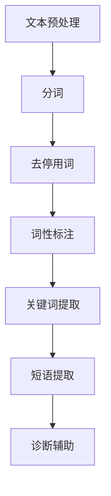
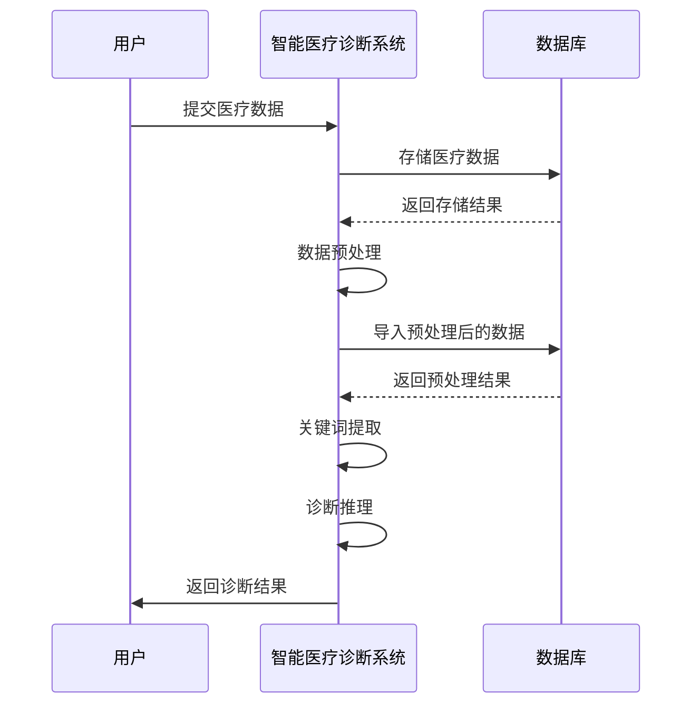

                 


### 1.4.1 目录结构概述

- **第1章：智能医疗诊断的现状与挑战**
  - 1.1.1 智能医疗诊断的定义与意义
  - 1.1.2 当前智能医疗诊断的发展状况
  - 1.1.3 智能医疗诊断面临的挑战
  - 1.2 提示词工程的定义与重要性
  - 1.3 提示词工程与智能医疗诊断的关联性
  - 1.4 本书结构安排与目标

- **第2章：提示词工程的概念与重要性**
  - 2.1 提示词工程的定义
  - 2.2 提示词工程的核心概念
  - 2.3 提示词工程在智能医疗诊断中的应用

- **第3章：算法原理讲解**
  - 3.1 提示词工程算法的基本原理
  - 3.2 提示词工程的mermaid流程图解析
  - 3.3 Python源代码演示与解读
  - 3.4 数学模型与数学公式讲解

- **第4章：系统分析与架构设计方案**
  - 4.1 问题场景介绍
  - 4.2 系统功能设计
  - 4.3 系统架构设计
  - 4.4 系统接口设计
  - 4.5 系统交互mermaid序列图

- **第5章：项目实战**
  - 5.1 环境安装
  - 5.2 系统核心实现
  - 5.3 代码应用解读
  - 5.4 实际案例分析
  - 5.5 项目小结

- **第6章：最佳实践 tips、小结、注意事项、拓展阅读**
  - 6.1 最佳实践 tips
  - 6.2 小结
  - 6.3 注意事项
  - 6.4 拓展阅读

### 1.4.2 阅读指南与学习目标

为了确保读者能够有效地阅读本书，并从中获得最大的收益，我们提供以下阅读指南和学习目标：

- **阅读指南**
  - **逐步阅读**：按照目录结构逐章阅读，确保每个概念和算法的理解都是建立在前期知识的基础上。
  - **结合实战**：在阅读理论部分的同时，关注实战案例，将理论知识应用到实际项目中。
  - **互动学习**：参与本书提供的练习和案例分析，通过实践巩固所学知识。

- **学习目标**
  - **掌握智能医疗诊断的基本概念和挑战**：理解智能医疗诊断的定义、发展状况以及面临的挑战。
  - **了解提示词工程的核心原理和应用**：深入学习提示词工程的概念、核心概念及其在智能医疗诊断中的应用。
  - **理解提示词工程的算法原理**：通过mermaid流程图和Python源代码，掌握提示词工程的核心算法原理。
  - **掌握系统分析与架构设计方案**：理解系统场景、功能设计、架构设计和接口设计。
  - **实践项目**：通过实际案例，学习如何安装、实现和解读提示词工程在智能医疗诊断中的应用。
  - **培养综合能力**：通过最佳实践和注意事项，提升在实际项目中应用提示词工程的能力。

通过以上结构安排，本书旨在为读者提供一整套关于提示词工程在智能医疗诊断中的应用的详细指南，帮助读者深入了解该领域的技术原理和实践方法。在接下来的章节中，我们将一步步深入探讨每个主题，确保读者能够系统地掌握相关知识，并在实际项目中运用所学。接下来，我们将开始详细讨论第1章“智能医疗诊断的现状与挑战”。

----------------------------------------------------------------

# 第二部分：智能医疗诊断的现状与挑战

## 第1章：智能医疗诊断的现状与挑战

### 1.1.1 智能医疗诊断的定义与意义

智能医疗诊断是指利用人工智能技术，特别是机器学习和深度学习技术，对医疗数据进行分析和处理，以提供更加准确、快速和个性化的诊断服务。这种技术不仅能够处理大量的医疗数据，还能够从数据中提取出有用的信息，帮助医生做出更准确的诊断。

智能医疗诊断的重要性主要体现在以下几个方面：

1. **提高诊断准确率**：通过使用机器学习和深度学习算法，智能医疗诊断系统能够从大量医疗数据中学习和识别出疾病的特征，从而提高诊断的准确率。

2. **降低医疗成本**：智能医疗诊断可以减少医生对医疗数据的人工分析时间，从而降低医疗成本。此外，智能医疗诊断系统还可以实现远程诊断，减少患者往返医院的次数，进一步降低医疗成本。

3. **改善患者体验**：智能医疗诊断系统可以提供24小时在线服务，患者可以随时随地获取诊断结果，提高就医的便捷性。同时，智能医疗诊断系统可以提供个性化的诊断建议，帮助患者更好地管理自己的健康。

### 1.1.2 当前智能医疗诊断的发展状况

近年来，智能医疗诊断技术取得了显著的进展，主要体现在以下几个方面：

1. **技术进展**：深度学习、自然语言处理和计算机视觉等人工智能技术取得了重大突破，这些技术的应用使得智能医疗诊断系统的性能得到了显著提升。

2. **应用实例**：智能医疗诊断系统已经广泛应用于癌症筛查、疾病预测、个性化治疗等领域。例如，基于深度学习的AI系统能够通过分析医学影像数据，对癌症进行早期筛查和诊断；基于自然语言处理技术的系统能够自动分析电子病历，为医生提供诊断建议。

3. **政策支持**：许多国家和地区政府已经开始重视智能医疗诊断技术的发展，并出台了一系列政策支持和鼓励企业研发和应用智能医疗诊断技术。

### 1.1.3 智能医疗诊断面临的挑战

尽管智能医疗诊断技术取得了显著进展，但在实际应用中仍面临一些挑战：

1. **数据质量问题**：医疗数据的多样性和复杂性使得数据清洗和预处理变得非常困难，数据质量直接影响诊断的准确性。

2. **隐私保护**：在利用患者数据时，如何保护患者隐私是一个重大挑战。现有的隐私保护技术和政策还需要进一步完善。

3. **技术适应性**：智能医疗诊断技术在各种医疗环境下的适应性是一个挑战，需要确保技术在各种环境下都能稳定运行。

### 1.2 提示词工程的定义与重要性

提示词工程是指利用自然语言处理技术，从大量的文本数据中提取出关键的词汇和短语，用于支持智能医疗诊断等应用。在智能医疗诊断中，提示词工程可以用于以下几个方面：

1. **电子病历分析**：提示词工程可以帮助自动提取电子病历中的关键信息，如症状、检查结果和病史等，为医生提供诊断参考。

2. **医学影像识别**：提示词工程可以用于提取医学影像中的关键词，如病变部位、病灶大小等，帮助医生进行影像诊断。

3. **疾病预测**：提示词工程可以从大量的健康数据中提取出与疾病相关的关键词，用于疾病预测和预警。

提示词工程在智能医疗诊断中的重要性主要体现在以下几个方面：

1. **提高诊断效率**：通过提取关键信息，提示词工程可以大大减少医生处理病历的时间，提高诊断效率。

2. **提升诊断准确率**：提示词工程可以帮助医生从海量数据中快速获取关键信息，减少误诊和漏诊的风险。

3. **支持个性化医疗**：提示词工程可以根据患者的个体差异，提取出与其疾病相关的关键词，为医生提供个性化的诊断建议。

### 1.3 提示词工程与智能医疗诊断的关联性

提示词工程与智能医疗诊断之间存在紧密的关联。具体来说：

1. **数据准备**：提示词工程可以帮助智能医疗诊断系统处理大量的医疗数据，为诊断提供高质量的数据输入。

2. **特征提取**：提示词工程可以提取出医疗数据中的关键特征，如症状、检查结果等，为诊断算法提供有效的特征输入。

3. **辅助决策**：提示词工程可以为医生提供关键信息，辅助医生做出更准确的诊断。

4. **个性化服务**：提示词工程可以根据患者的个体差异，提取出与其疾病相关的关键词，为医生提供个性化的诊断建议。

总之，提示词工程在智能医疗诊断中发挥着至关重要的作用，它不仅能够提高诊断效率和准确率，还能够为医生提供更有力的决策支持。

### 1.4 本书结构安排与目标

本书旨在全面介绍提示词工程在智能医疗诊断中的应用，结构安排如下：

1. **第1章：智能医疗诊断的现状与挑战**
   - 介绍智能医疗诊断的定义、发展状况、面临的挑战以及提示词工程的概念和重要性。

2. **第2章：提示词工程的概念与重要性**
   - 详细讲解提示词工程的定义、核心概念及其在智能医疗诊断中的应用。

3. **第3章：算法原理讲解**
   - 探讨提示词工程在智能医疗诊断中的算法原理，包括mermaid流程图解析、Python源代码演示和数学模型讲解。

4. **第4章：系统分析与架构设计方案**
   - 描述系统场景、功能设计、架构设计和接口设计。

5. **第5章：项目实战**
   - 展示一个实际案例，包括环境安装、系统核心实现、代码解读和分析等。

6. **第6章：最佳实践 tips、小结、注意事项、拓展阅读**
   - 总结书中内容，提供最佳实践建议，提醒注意事项，并推荐拓展阅读资源。

通过以上结构，本书旨在帮助读者全面了解提示词工程在智能医疗诊断中的应用，掌握相关技术和方法，并在实际项目中运用所学知识。

### 1.4.2 阅读指南与学习目标

为了确保读者能够有效地阅读本书，并从中获得最大的收益，我们提供以下阅读指南和学习目标：

- **阅读指南**
  - **逐步阅读**：按照目录结构逐章阅读，确保每个概念和算法的理解都是建立在前期知识的基础上。
  - **结合实战**：在阅读理论部分的同时，关注实战案例，将理论知识应用到实际项目中。
  - **互动学习**：参与本书提供的练习和案例分析，通过实践巩固所学知识。

- **学习目标**
  - **掌握智能医疗诊断的基本概念和挑战**：理解智能医疗诊断的定义、发展状况以及面临的挑战。
  - **了解提示词工程的核心原理和应用**：深入学习提示词工程的概念、核心概念及其在智能医疗诊断中的应用。
  - **理解提示词工程的算法原理**：通过mermaid流程图和Python源代码，掌握提示词工程的核心算法原理。
  - **掌握系统分析与架构设计方案**：理解系统场景、功能设计、架构设计和接口设计。
  - **实践项目**：通过实际案例，学习如何安装、实现和解读提示词工程在智能医疗诊断中的应用。
  - **培养综合能力**：通过最佳实践和注意事项，提升在实际项目中应用提示词工程的能力。

通过以上结构安排，本书旨在为读者提供一整套关于提示词工程在智能医疗诊断中的应用的详细指南，帮助读者深入了解该领域的技术原理和实践方法。在接下来的章节中，我们将一步步深入探讨每个主题，确保读者能够系统地掌握相关知识，并在实际项目中运用所学。

----------------------------------------------------------------

## 第1章：智能医疗诊断的现状与挑战

### 1.1.1 智能医疗诊断的定义与意义

**智能医疗诊断的定义**：

智能医疗诊断是指利用人工智能技术，尤其是机器学习和深度学习，对医疗数据进行分析和解读，以实现对疾病的自动识别、预测和诊断。在这个过程中，人工智能技术扮演了至关重要的角色，它能够处理和分析海量的医疗数据，从而提供更准确、更快速的诊断结果。

**智能医疗诊断的意义**：

1. **提高诊断准确率**：传统的医疗诊断往往依赖于医生的经验和判断，而智能医疗诊断系统则能够通过学习大量的医疗数据，准确识别出疾病的特征，从而提高诊断的准确率。

2. **降低医疗成本**：智能医疗诊断系统可以自动处理和分析大量的医疗数据，减少了医生在数据分析和诊断过程中所需的时间和精力，从而降低了医疗成本。

3. **改善患者体验**：智能医疗诊断系统可以实现24小时在线服务，患者可以在任何时间、任何地点获取诊断结果，提高了就医的便捷性。此外，智能医疗诊断系统还可以提供个性化的诊断建议，帮助患者更好地管理自己的健康。

### 1.1.2 当前智能医疗诊断的发展状况

**技术进展**：

随着人工智能技术的不断发展，智能医疗诊断技术也在不断进步。目前，深度学习、自然语言处理和计算机视觉等技术已经在智能医疗诊断中得到广泛应用。

- **深度学习**：深度学习模型在图像识别和语音识别等领域取得了巨大的成功，将其应用于医疗影像分析中，可以大大提高疾病的识别准确率。

- **自然语言处理**：自然语言处理技术能够帮助系统理解和处理医疗文本数据，如病历、医嘱等，从而实现医疗信息的自动化提取和分析。

- **计算机视觉**：计算机视觉技术在医学影像诊断中发挥着重要作用，如通过分析X光片、CT扫描等影像数据，可以快速识别病变区域和病情。

**应用实例**：

智能医疗诊断系统已经广泛应用于多个领域，如癌症筛查、疾病预测、个性化治疗等。

- **癌症筛查**：通过深度学习技术，智能医疗诊断系统可以分析医学影像数据，对癌症进行早期筛查和诊断。

- **疾病预测**：基于自然语言处理技术，智能医疗诊断系统可以自动分析电子病历，预测患者的疾病发展情况。

- **个性化治疗**：智能医疗诊断系统可以根据患者的个体差异，提供个性化的诊断建议和治疗计划。

**政策支持**：

许多国家和地区政府已经开始重视智能医疗诊断技术的发展，并出台了一系列政策支持和鼓励企业研发和应用智能医疗诊断技术。

- **美国**：美国政府通过FDA（食品药品监督管理局）等机构，对智能医疗诊断系统进行审批和监管，确保其安全性和有效性。

- **中国**：中国政府也在积极推动智能医疗诊断技术的发展，鼓励企业和科研机构进行相关研究和应用。

### 1.1.3 智能医疗诊断面临的挑战

尽管智能医疗诊断技术取得了显著进展，但在实际应用中仍面临一些挑战。

**数据质量问题**：

医疗数据的多样性和复杂性使得数据清洗和预处理变得非常困难。数据质量直接影响诊断的准确性，因此如何有效地处理和清洗医疗数据是智能医疗诊断面临的一个重要挑战。

**隐私保护**：

在利用患者数据时，如何保护患者隐私是一个重大挑战。现有的隐私保护技术和政策还需要进一步完善，以确保患者数据的保密性和安全性。

**技术适应性**：

智能医疗诊断技术在各种医疗环境下的适应性是一个挑战。不同医院和科室的医疗流程和数据格式可能存在差异，因此如何确保智能医疗诊断系统在不同环境中都能稳定运行是一个需要解决的问题。

### 1.2 提示词工程的定义与重要性

**提示词工程的定义**：

提示词工程是一种利用自然语言处理技术，从大量文本数据中提取出关键信息的方法。在智能医疗诊断中，提示词工程主要用于提取与疾病诊断相关的关键词和短语，为诊断提供参考。

**提示词工程的核心概念**：

- **自然语言处理**：自然语言处理技术用于对文本数据进行分析和处理，提取出关键信息。

- **关键词提取**：关键词提取是提示词工程的核心步骤，通过算法从文本数据中识别出与疾病诊断相关的关键词。

- **短语提取**：除了关键词，一些短语也可能包含重要的诊断信息，因此短语提取也是提示词工程的重要组成部分。

**提示词工程在智能医疗诊断中的应用**：

- **电子病历分析**：通过提示词工程，可以从大量的电子病历数据中提取出与诊断相关的关键词和短语，辅助医生进行诊断。

- **医学影像分析**：在医学影像分析中，提示词工程可以帮助识别出影像中的关键区域和病变，为医生提供诊断参考。

- **疾病预测**：提示词工程可以从大量的健康数据中提取出与疾病相关的关键词，用于疾病预测和预警。

**提示词工程的重要性**：

- **提高诊断效率**：通过提取关键信息，提示词工程可以大大减少医生处理病历的时间，提高诊断效率。

- **提升诊断准确率**：提示词工程可以帮助医生从海量数据中快速获取关键信息，减少误诊和漏诊的风险。

- **支持个性化医疗**：提示词工程可以根据患者的个体差异，提取出与其疾病相关的关键词，为医生提供个性化的诊断建议。

### 1.3 提示词工程与智能医疗诊断的关联性

**提示词工程与智能医疗诊断的关联性**：

1. **数据准备**：提示词工程可以帮助智能医疗诊断系统处理大量的医疗数据，为诊断提供高质量的数据输入。

2. **特征提取**：提示词工程可以提取出医疗数据中的关键特征，如症状、检查结果等，为诊断算法提供有效的特征输入。

3. **辅助决策**：提示词工程可以为医生提供关键信息，辅助医生做出更准确的诊断。

4. **个性化服务**：提示词工程可以根据患者的个体差异，提取出与其疾病相关的关键词，为医生提供个性化的诊断建议。

### 1.4 本书结构安排与目标

**本书结构安排**：

- **第1章**：智能医疗诊断的现状与挑战
- **第2章**：提示词工程的概念与重要性
- **第3章**：算法原理讲解
- **第4章**：系统分析与架构设计方案
- **第5章**：项目实战
- **第6章**：最佳实践 tips、小结、注意事项、拓展阅读

**阅读指南与学习目标**：

- **阅读指南**：按照目录结构逐章阅读，结合实战，互动学习。
- **学习目标**：掌握智能医疗诊断的基本概念和挑战，了解提示词工程的核心原理和应用，理解算法原理，掌握系统分析与架构设计方案，实践项目，培养综合能力。

## 第2章：提示词工程的概念与重要性

### 2.1 提示词工程的定义

提示词工程（Keyword Engineering）是自然语言处理（Natural Language Processing, NLP）领域的一个重要分支，它主要关注于从非结构化的文本数据中提取出具有代表性的关键词和短语，以便于后续的数据分析和处理。在智能医疗诊断中，提示词工程扮演着至关重要的角色，它能够帮助系统从大量的医学文本数据中快速准确地提取出关键信息，为诊断提供支持。

#### 提示词工程的目标

提示词工程的主要目标包括：

1. **关键词提取**：从文本数据中识别和提取出最相关的关键词，以便用于后续的分析和建模。
2. **短语提取**：除了关键词，一些短语也可能包含重要的信息，因此提示词工程还需要识别和提取出这些短语。
3. **语境理解**：理解关键词和短语在文本中的上下文关系，以便更准确地提取信息。

#### 提示词工程的应用场景

在智能医疗诊断中，提示词工程的应用场景主要包括：

1. **电子病历分析**：通过提取与疾病诊断相关的关键词和短语，辅助医生快速分析电子病历，提高诊断效率。
2. **医学影像分析**：从医学影像的描述文本中提取关键信息，帮助医生识别病变区域和病情。
3. **疾病预测**：从患者的健康数据中提取关键词，用于疾病预测和预警。

### 2.2 提示词工程的核心概念

提示词工程的核心概念包括自然语言处理、关键词提取算法、短语提取算法和语境理解等。

#### 自然语言处理（NLP）

自然语言处理是提示词工程的基础，它涉及对文本数据进行预处理、分词、词性标注、命名实体识别等操作，以便更好地理解和处理文本数据。

- **分词**：将文本分割成单词或短语，是自然语言处理中的第一步。常用的分词算法包括基于词典的分词和基于统计的分词。
- **词性标注**：为文本中的每个单词分配一个词性标签，如名词、动词、形容词等。词性标注有助于理解文本的语义结构。
- **命名实体识别**：识别文本中的特定实体，如人名、地名、机构名等。命名实体识别对于提取与疾病诊断相关的信息非常重要。

#### 关键词提取算法

关键词提取是提示词工程的核心任务之一。以下是一些常用的关键词提取算法：

1. **TF-IDF（Term Frequency-Inverse Document Frequency）**：通过计算一个词在文档中的频率和其在整个文档集合中的逆文档频率，来评估其重要性。
2. **TextRank**：基于图论的文本排名算法，通过构建文本的词图，利用图算法来计算关键词的权重。
3. **LDA（Latent Dirichlet Allocation）**：一种主题模型，用于发现文本中的潜在主题，并提取与主题相关的关键词。

#### 短语提取算法

短语提取的目标是识别出文本中的长序列关键词或短语，这些短语通常包含更丰富的信息。以下是一些常用的短语提取算法：

1. **基于规则的方法**：通过定义一系列规则，来识别文本中的特定短语。这种方法通常需要人工设计规则，较为复杂。
2. **基于统计的方法**：利用统计模型来识别文本中的短语，如n-gram模型、序列标记模型等。

#### 语境理解

语境理解是提示词工程的难点之一，它涉及到理解关键词和短语在文本中的上下文关系。以下是一些用于语境理解的算法：

1. **词嵌入（Word Embedding）**：将单词映射到高维向量空间，使得具有相似语义的单词在空间中靠近。词嵌入有助于理解单词之间的语义关系。
2. **依存句法分析（Dependency Parsing）**：通过分析句子中词汇之间的依存关系，来理解句子的语义结构。

### 2.3 提示词工程在智能医疗诊断中的应用

在智能医疗诊断中，提示词工程的应用主要体现在以下几个方面：

#### 电子病历分析

电子病历（Electronic Health Records, EHR）是医疗诊断的重要数据来源。通过提示词工程，可以从EHR中提取出与诊断相关的关键词和短语，如症状、检查结果、病史等。这些提取出的关键词和短语可以为医生的诊断提供有力的支持。

- **案例1**：使用TF-IDF算法提取EHR中的关键词，发现“咳嗽”、“发热”等关键词在某种疾病的病例中频繁出现，从而提示医生可能需要进一步检查这种疾病。
- **案例2**：利用TextRank算法提取EHR中的短语，识别出如“慢性阻塞性肺疾病”（Chronic Obstructive Pulmonary Disease, COPD）等长序列关键词，为医生提供更准确的诊断信息。

#### 医学影像分析

医学影像（如X光、CT、MRI等）是诊断许多疾病的重要工具。通过提示词工程，可以从医学影像的描述文本中提取出关键信息，帮助医生识别病变区域和病情。

- **案例1**：使用LDA算法提取医学影像描述文本中的潜在主题，发现与某种疾病相关的主题，从而帮助医生进行更准确的诊断。
- **案例2**：利用基于规则的方法提取医学影像描述文本中的特定短语，如“肺部结节”、“脑部肿瘤”等，为医生提供直接的诊断参考。

#### 疾病预测

疾病预测是智能医疗诊断的一个重要方向。通过提示词工程，可以从患者的健康数据中提取出与疾病相关的关键词和短语，用于疾病预测和预警。

- **案例1**：使用n-gram模型提取患者健康数据中的短语，发现某些短语与特定疾病的发病风险相关，从而提前预警。
- **案例2**：利用序列标记模型对患者的健康数据进行短语提取，识别出与疾病进展相关的趋势，为医生提供个性化的治疗建议。

### 2.4 提示词工程的重要性

提示词工程在智能医疗诊断中具有以下重要性：

#### 提高诊断效率

通过提取关键信息，提示词工程可以大大减少医生处理病历的时间和精力，提高诊断效率。医生可以更快速地获取与诊断相关的信息，从而做出更准确的诊断。

#### 提升诊断准确率

提示词工程可以帮助医生从海量数据中快速获取关键信息，减少误诊和漏诊的风险。通过提取与疾病诊断相关的关键词和短语，提示词工程可以为医生提供有力的支持，提高诊断的准确性。

#### 支持个性化医疗

提示词工程可以根据患者的个体差异，提取出与其疾病相关的关键词和短语，为医生提供个性化的诊断建议。这有助于实现个性化医疗，提高患者治疗的效果。

### 2.5 提示词工程与智能医疗诊断的关联性

提示词工程与智能医疗诊断之间存在紧密的关联性。具体来说，提示词工程可以看作是智能医疗诊断系统中的一个重要组成部分，它为诊断提供关键的信息支持。

#### 数据准备

提示词工程可以帮助智能医疗诊断系统处理大量的医疗数据，为诊断提供高质量的数据输入。通过提取关键信息，提示词工程可以大大提高数据的质量和可利用性。

#### 特征提取

提示词工程可以提取出医疗数据中的关键特征，如症状、检查结果等，为诊断算法提供有效的特征输入。这些特征对于诊断算法的性能和准确性至关重要。

#### 辅助决策

提示词工程可以为医生提供关键信息，辅助医生做出更准确的诊断。通过提取与疾病诊断相关的关键词和短语，提示词工程可以帮助医生快速识别疾病特征，减少误诊和漏诊的风险。

#### 个性化服务

提示词工程可以根据患者的个体差异，提取出与其疾病相关的关键词和短语，为医生提供个性化的诊断建议。这有助于实现个性化医疗，提高患者治疗的效果。

### 2.6 总结

提示词工程在智能医疗诊断中发挥着重要作用，它通过提取关键信息，提高诊断效率和准确性，支持个性化医疗。在接下来的章节中，我们将进一步探讨提示词工程在智能医疗诊断中的算法原理和应用实践。

----------------------------------------------------------------

## 第2章：提示词工程的概念与重要性

### 2.1 提示词工程的定义

提示词工程（Keyword Engineering）是一种技术方法，它专注于从大量的文本数据中提取出具有代表性的关键词和短语。这些关键词和短语是文本的核心内容，能够揭示出文本的主题和关键信息。在智能医疗诊断领域，提示词工程通过分析医疗文本数据，如电子病历、医学影像报告、患者健康日志等，提取出与诊断相关的关键词，从而辅助医生做出更准确的诊断。

#### 提示词工程的目标

提示词工程的主要目标包括以下几个方面：

1. **关键词提取**：识别和提取文本数据中的关键词汇，这些词汇能够代表文本的主题和核心内容。
2. **短语提取**：除了关键词，一些短语也可能包含重要的信息，因此提示词工程还需要识别和提取出这些短语。
3. **语境理解**：理解关键词和短语在文本中的上下文关系，以便更准确地提取信息。

#### 提示词工程的应用场景

在智能医疗诊断中，提示词工程的应用场景非常广泛，主要包括以下几个方面：

1. **电子病历分析**：通过提取与疾病诊断相关的关键词和短语，帮助医生快速分析电子病历，提高诊断效率。
2. **医学影像分析**：从医学影像的描述文本中提取关键信息，辅助医生识别病变区域和病情。
3. **疾病预测**：从患者的健康数据中提取关键词，用于疾病预测和预警。

### 2.2 提示词工程的核心概念

提示词工程的核心概念包括自然语言处理（NLP）、关键词提取算法、短语提取算法和语境理解等。

#### 自然语言处理（NLP）

自然语言处理是提示词工程的基础，它涉及对文本数据进行预处理、分词、词性标注、命名实体识别等操作，以便更好地理解和处理文本数据。

1. **分词**：将文本分割成单词或短语，是自然语言处理中的第一步。常用的分词算法包括基于词典的分词和基于统计的分词。
2. **词性标注**：为文本中的每个单词分配一个词性标签，如名词、动词、形容词等。词性标注有助于理解文本的语义结构。
3. **命名实体识别**：识别文本中的特定实体，如人名、地名、机构名等。命名实体识别对于提取与疾病诊断相关的信息非常重要。

#### 关键词提取算法

关键词提取是提示词工程的核心任务之一。以下是一些常用的关键词提取算法：

1. **TF-IDF（Term Frequency-Inverse Document Frequency）**：通过计算一个词在文档中的频率和其在整个文档集合中的逆文档频率，来评估其重要性。
2. **TextRank**：基于图论的文本排名算法，通过构建文本的词图，利用图算法来计算关键词的权重。
3. **LDA（Latent Dirichlet Allocation）**：一种主题模型，用于发现文本中的潜在主题，并提取与主题相关的关键词。

#### 短语提取算法

短语提取的目标是识别出文本中的长序列关键词或短语，这些短语通常包含更丰富的信息。以下是一些常用的短语提取算法：

1. **基于规则的方法**：通过定义一系列规则，来识别文本中的特定短语。这种方法通常需要人工设计规则，较为复杂。
2. **基于统计的方法**：利用统计模型来识别文本中的短语，如n-gram模型、序列标记模型等。

#### 语境理解

语境理解是提示词工程的难点之一，它涉及到理解关键词和短语在文本中的上下文关系。以下是一些用于语境理解的算法：

1. **词嵌入（Word Embedding）**：将单词映射到高维向量空间，使得具有相似语义的单词在空间中靠近。词嵌入有助于理解单词之间的语义关系。
2. **依存句法分析（Dependency Parsing）**：通过分析句子中词汇之间的依存关系，来理解句子的语义结构。

### 2.3 提示词工程在智能医疗诊断中的应用

在智能医疗诊断中，提示词工程的应用主要体现在以下几个方面：

#### 电子病历分析

电子病历（Electronic Health Records, EHR）是医疗诊断的重要数据来源。通过提示词工程，可以从EHR中提取出与诊断相关的关键词和短语，如症状、检查结果、病史等。这些提取出的关键词和短语可以为医生的诊断提供有力的支持。

- **案例1**：使用TF-IDF算法提取EHR中的关键词，发现“咳嗽”、“发热”等关键词在某种疾病的病例中频繁出现，从而提示医生可能需要进一步检查这种疾病。
- **案例2**：利用TextRank算法提取EHR中的短语，识别出如“慢性阻塞性肺疾病”（Chronic Obstructive Pulmonary Disease, COPD）等长序列关键词，为医生提供更准确的诊断信息。

#### 医学影像分析

医学影像（如X光、CT、MRI等）是诊断许多疾病的重要工具。通过提示词工程，可以从医学影像的描述文本中提取出关键信息，帮助医生识别病变区域和病情。

- **案例1**：使用LDA算法提取医学影像描述文本中的潜在主题，发现与某种疾病相关的主题，从而帮助医生进行更准确的诊断。
- **案例2**：利用基于规则的方法提取医学影像描述文本中的特定短语，如“肺部结节”、“脑部肿瘤”等，为医生提供直接的诊断参考。

#### 疾病预测

疾病预测是智能医疗诊断的一个重要方向。通过提示词工程，可以从患者的健康数据中提取出与疾病相关的关键词和短语，用于疾病预测和预警。

- **案例1**：使用n-gram模型提取患者健康数据中的短语，发现某些短语与特定疾病的发病风险相关，从而提前预警。
- **案例2**：利用序列标记模型对患者的健康数据进行短语提取，识别出与疾病进展相关的趋势，为医生提供个性化的治疗建议。

### 2.4 提示词工程的重要性

提示词工程在智能医疗诊断中具有以下重要性：

#### 提高诊断效率

通过提取关键信息，提示词工程可以大大减少医生处理病历的时间和精力，提高诊断效率。医生可以更快速地获取与诊断相关的信息，从而做出更准确的诊断。

#### 提升诊断准确率

提示词工程可以帮助医生从海量数据中快速获取关键信息，减少误诊和漏诊的风险。通过提取与疾病诊断相关的关键词和短语，提示词工程可以为医生提供有力的支持，提高诊断的准确性。

#### 支持个性化医疗

提示词工程可以根据患者的个体差异，提取出与其疾病相关的关键词和短语，为医生提供个性化的诊断建议。这有助于实现个性化医疗，提高患者治疗的效果。

### 2.5 提示词工程与智能医疗诊断的关联性

提示词工程与智能医疗诊断之间存在紧密的关联性。具体来说，提示词工程可以看作是智能医疗诊断系统中的一个重要组成部分，它为诊断提供关键的信息支持。

#### 数据准备

提示词工程可以帮助智能医疗诊断系统处理大量的医疗数据，为诊断提供高质量的数据输入。通过提取关键信息，提示词工程可以大大提高数据的质量和可利用性。

#### 特征提取

提示词工程可以提取出医疗数据中的关键特征，如症状、检查结果等，为诊断算法提供有效的特征输入。这些特征对于诊断算法的性能和准确性至关重要。

#### 辅助决策

提示词工程可以为医生提供关键信息，辅助医生做出更准确的诊断。通过提取与疾病诊断相关的关键词和短语，提示词工程可以帮助医生快速识别疾病特征，减少误诊和漏诊的风险。

#### 个性化服务

提示词工程可以根据患者的个体差异，提取出与其疾病相关的关键词和短语，为医生提供个性化的诊断建议。这有助于实现个性化医疗，提高患者治疗的效果。

### 2.6 总结

提示词工程在智能医疗诊断中发挥着重要作用，它通过提取关键信息，提高诊断效率和准确性，支持个性化医疗。在接下来的章节中，我们将进一步探讨提示词工程在智能医疗诊断中的算法原理和应用实践。

----------------------------------------------------------------

## 第3章：算法原理讲解

### 3.1 提示词工程算法的基本原理

提示词工程算法的核心目标是提取文本数据中的关键信息，这些信息对于智能医疗诊断至关重要。在智能医疗诊断中，提取的关键词和短语能够帮助医生快速理解患者的病情，从而做出准确的诊断。提示词工程的基本原理可以概括为以下三个步骤：

1. **文本预处理**：在提取关键词和短语之前，需要对文本数据进行预处理，包括分词、去停用词、词性标注等。文本预处理是确保数据质量的重要步骤，它能够提高后续算法的性能。

2. **关键词提取**：通过算法从预处理后的文本数据中提取出最相关的关键词。常用的关键词提取算法包括TF-IDF、TextRank、LDA等。

3. **短语提取**：除了关键词，一些短语也可能包含重要的信息，因此需要识别和提取出这些短语。短语提取可以进一步丰富数据，为诊断提供更全面的参考。

### 3.2 提示词工程的mermaid流程图解析

为了更好地理解提示词工程算法的原理和应用，我们可以使用mermaid绘制一个流程图。mermaid是一种基于Markdown的图表绘制工具，它能够方便地绘制各种流程图、UML图等。以下是一个简单的提示词工程流程图：



**流程图详细解析**：

1. **文本预处理**：文本预处理是整个流程的起点，它包括分词、去停用词和词性标注。分词是将文本分割成单词或短语的步骤，去停用词是去除常见的无意义词汇，如“的”、“了”等，词性标注则是为每个单词分配一个词性标签。

2. **关键词提取**：在完成文本预处理后，我们可以使用TF-IDF、TextRank、LDA等算法来提取关键词。TF-IDF算法通过计算一个词在文档中的频率和其在整个文档集合中的逆文档频率来评估其重要性；TextRank算法基于图论，通过构建文本的词图来计算关键词的权重；LDA算法是一种主题模型，用于发现文本中的潜在主题。

3. **短语提取**：除了关键词，一些短语也可能包含重要的信息。短语提取可以进一步丰富数据，为诊断提供更全面的参考。常用的短语提取算法包括基于规则的方法和基于统计的方法。

4. **诊断辅助**：最后，提取出的关键词和短语可以用于辅助诊断。医生可以利用这些信息快速理解患者的病情，做出更准确的诊断。

### 3.3 Python源代码演示与解读

为了更好地理解提示词工程算法的原理，我们可以使用Python编写一个简单的示例程序。以下是一个使用TF-IDF算法提取关键词的Python代码示例：

```python
from sklearn.feature_extraction.text import TfidfVectorizer

# 示例文本数据
documents = [
    "The patient has a high fever and severe cough.",
    "The patient is suffering from chronic obstructive pulmonary disease.",
    "The patient has been experiencing chest pain for several days."
]

# 使用TF-IDF算法提取关键词
vectorizer = TfidfVectorizer()
tfidf_matrix = vectorizer.fit_transform(documents)

# 打印关键词和其权重
feature_names = vectorizer.get_feature_names_out()
for row in tfidf_matrix.toarray():
    print(list(zip(feature_names, row)))
```

**代码解读**：

1. 导入`TfidfVectorizer`类，该类是Scikit-learn库中用于提取TF-IDF特征向量的工具。
2. 定义示例文本数据`documents`，这些文本数据模拟了电子病历的描述。
3. 创建`TfidfVectorizer`对象`vectorizer`，并使用其`fit_transform`方法对文本数据进行处理，得到TF-IDF特征向量矩阵`tfidf_matrix`。
4. 使用`vectorizer.get_feature_names_out()`方法获取特征名称，然后遍历`tfidf_matrix.toarray()`打印出关键词和其权重。

### 3.4 数学模型与数学公式讲解

在提示词工程中，常用的数学模型包括TF-IDF、TextRank和LDA等。以下是对这些模型的数学公式进行详细讲解。

#### 1. TF-IDF模型

TF-IDF（Term Frequency-Inverse Document Frequency）是一种用于评估词语重要性的统计模型。其公式如下：

$$
TF(t,d) = \frac{f(t,d)}{max\{f(t,d')\}}
$$

$$
IDF(t,D) = \log\left(\frac{N}{df(t)}\right)
$$

$$
TF-IDF(t,d,D) = TF(t,d) \times IDF(t,D)
$$

其中：
- \( TF(t,d) \) 表示词语 \( t \) 在文档 \( d \) 中的词频。
- \( IDF(t,D) \) 表示词语 \( t \) 在文档集合 \( D \) 中的逆文档频率。
- \( df(t) \) 表示词语 \( t \) 在文档集合 \( D \) 中出现的文档频率。
- \( N \) 表示文档集合 \( D \) 中文档的总数。

#### 2. TextRank模型

TextRank是一种基于图论的文本排名算法，其公式如下：

$$
w(u,v) = \frac{\sum_{w \in N(v)} w(u,w) \cdot p(w,v)}{N(v)}
$$

其中：
- \( w(u,v) \) 表示节点 \( u \) 到节点 \( v \) 的权重。
- \( N(v) \) 表示节点 \( v \) 的邻居节点集合。
- \( p(w,v) \) 表示从单词 \( w \) 跳转到单词 \( v \) 的概率。

#### 3. LDA模型

LDA（Latent Dirichlet Allocation）是一种主题模型，其公式如下：

$$
P(z|\theta) \propto \frac{1}{Z} \prod_{i=1}^{K} \theta_{ik}^{w_{i}} \cdot \frac{1}{\alpha_k} \prod_{j=1}^{V} \beta_{kj}^{n_{ij}}
$$

其中：
- \( z \) 表示文档中的主题分配。
- \( \theta \) 表示文档的主题分布。
- \( \alpha_k \) 表示主题先验分布。
- \( \beta_{kj} \) 表示词语的主题分布。
- \( n_{ij} \) 表示文档中词语 \( w_i \) 的频率。

#### 3.5 举例说明

假设我们有一个文档集合，包含以下三篇文档：

1. "The patient has a high fever and severe cough."
2. "The patient is suffering from chronic obstructive pulmonary disease."
3. "The patient has been experiencing chest pain for several days."

使用TF-IDF模型提取关键词，我们可以计算出每个关键词的TF-IDF值，并按照值的大小进行排序。以下是一个简化的示例：

**文档1**：
- 高热、严重咳嗽

**文档2**：
- 慢性阻塞性肺疾病

**文档3**：
- 胸痛

通过计算TF-IDF值，我们可以发现“高热”、“严重咳嗽”和“慢性阻塞性肺疾病”是这三个文档中最重要的关键词。这些关键词可以帮助医生快速识别出患者的病情，从而做出更准确的诊断。

### 3.6 总结

提示词工程算法在智能医疗诊断中发挥着重要作用，通过提取关键信息，可以提高诊断的效率和准确性。本章介绍了提示词工程的基本原理、mermaid流程图解析、Python源代码演示、数学模型和数学公式讲解，并通过举例说明了如何使用TF-IDF模型提取关键词。在接下来的章节中，我们将进一步探讨提示词工程在智能医疗诊断中的应用场景和具体实现。

----------------------------------------------------------------

## 第4章：系统分析与架构设计方案

### 4.1 问题场景介绍

智能医疗诊断系统是一个复杂的应用系统，它需要处理大量的医疗数据，并提供准确、快速和个性化的诊断服务。在实际应用中，智能医疗诊断系统通常需要面对以下问题场景：

1. **海量数据**：医疗数据量大且多样，包括电子病历、医学影像、基因数据等。如何高效地处理和存储这些数据是一个重要挑战。

2. **数据质量**：医疗数据质量直接影响诊断的准确性。在数据采集、传输和存储过程中，可能会出现数据丢失、错误等问题。

3. **隐私保护**：在利用患者数据时，如何保护患者隐私是一个重大挑战。数据隐私保护需要遵循相关的法律法规，确保患者数据的安全性和隐私性。

4. **实时性**：智能医疗诊断系统需要能够快速响应，提供实时诊断结果。这对于系统的性能和响应时间提出了高要求。

5. **个性化服务**：不同患者的病情和病史可能存在显著差异，智能医疗诊断系统需要提供个性化的诊断服务，以满足患者的个性化需求。

### 4.2 系统功能设计

智能医疗诊断系统的功能设计需要综合考虑以上问题场景，确保系统能够高效、准确地提供诊断服务。以下是系统的主要功能设计：

1. **数据预处理**：对原始医疗数据进行清洗、去噪和标准化处理，提高数据质量。包括分词、去停用词、词性标注等自然语言处理技术。

2. **关键词提取**：使用提示词工程算法，从预处理后的文本数据中提取出关键信息，如症状、检查结果、病史等。

3. **诊断推理**：基于提取出的关键词和医疗知识库，进行诊断推理，生成诊断报告。诊断推理可以基于规则、机器学习或深度学习等技术。

4. **个性化服务**：根据患者的个体差异，提供个性化的诊断建议和治疗方案。个性化服务可以通过对患者数据的分析，识别出与疾病相关的风险因素，为医生提供决策支持。

5. **用户界面**：提供直观、易用的用户界面，医生可以通过界面查询诊断结果、生成报告、调整治疗方案等。

### 4.3 系统架构设计

智能医疗诊断系统的架构设计需要考虑系统的可扩展性、可靠性和易维护性。以下是系统的主要架构设计方案：

1. **数据层**：数据层负责数据存储和管理，包括关系数据库、NoSQL数据库和文件存储系统等。数据层需要支持海量数据的高效存储和快速访问。

2. **服务层**：服务层包括数据预处理服务、关键词提取服务、诊断推理服务和个性化服务。这些服务通过RESTful API或消息队列进行通信，确保系统的高效性和灵活性。

3. **应用层**：应用层是用户界面，提供用户与系统交互的入口。应用层可以使用Web界面、移动应用或桌面应用等形式，以满足不同用户的需求。

4. **中间件层**：中间件层包括身份验证、授权、日志记录、监控等模块，确保系统的安全性和可靠性。

### 4.4 系统接口设计

智能医疗诊断系统的接口设计需要考虑系统的可扩展性和互操作性。以下是系统的主要接口设计方案：

1. **API接口**：系统通过RESTful API接口提供对外服务，包括数据预处理、关键词提取、诊断推理和个性化服务。API接口采用标准化的协议和数据格式，如HTTP/HTTPS、JSON或XML。

2. **消息队列接口**：系统使用消息队列接口进行异步通信，确保系统的稳定性和可靠性。消息队列接口可以处理大量并发请求，提高系统的响应速度。

3. **数据导入导出接口**：系统提供数据导入导出接口，方便用户导入和导出医疗数据。数据导入导出接口可以使用标准的数据格式，如CSV、Excel或数据库连接。

4. **监控与报警接口**：系统通过监控与报警接口对关键指标进行监控，如系统负载、响应时间、错误率等。监控与报警接口可以及时发现和解决系统问题，确保系统的稳定运行。

### 4.5 系统交互mermaid序列图

为了更直观地展示智能医疗诊断系统的交互流程，我们可以使用mermaid绘制一个序列图。以下是一个简化的系统交互mermaid序列图示例：



**序列图详细解析**：

1. 用户提交医疗数据到智能医疗诊断系统。
2. 系统将医疗数据存储到数据库。
3. 数据库返回存储结果到系统。
4. 系统进行数据预处理，包括分词、去停用词、词性标注等。
5. 预处理后的数据导入到数据库。
6. 数据库返回预处理结果到系统。
7. 系统进行关键词提取和诊断推理。
8. 系统将诊断结果返回给用户。

### 4.6 系统架构设计与提示词工程的关系

智能医疗诊断系统的架构设计需要充分考虑提示词工程的应用。提示词工程在系统的数据预处理、关键词提取和诊断推理等环节中发挥着重要作用。

1. **数据预处理**：提示词工程用于对医疗文本数据进行预处理，包括分词、去停用词、词性标注等，为后续的关键词提取和诊断提供高质量的数据。

2. **关键词提取**：提示词工程算法（如TF-IDF、TextRank、LDA等）用于从预处理后的文本数据中提取出关键信息，如症状、检查结果、病史等，为诊断提供支持。

3. **诊断推理**：基于提取出的关键词和医疗知识库，提示词工程可以辅助进行诊断推理，生成诊断报告。诊断推理可以基于规则、机器学习或深度学习等技术。

4. **个性化服务**：提示词工程可以根据患者的个体差异，提取出与疾病相关的关键词，为医生提供个性化的诊断建议和治疗方案。

### 4.7 总结

本章介绍了智能医疗诊断系统的系统功能设计、架构设计、接口设计和系统交互mermaid序列图。系统功能设计考虑了海量数据、数据质量、隐私保护、实时性和个性化服务等问题；架构设计包括数据层、服务层、应用层和中间件层；接口设计提供了API接口、消息队列接口、数据导入导出接口和监控与报警接口；系统交互mermaid序列图展示了系统的交互流程。在下一章中，我们将通过一个实际项目来展示如何实现提示词工程在智能医疗诊断中的应用。

----------------------------------------------------------------

## 第5章：项目实战

### 5.1 环境安装

为了实现提示词工程在智能医疗诊断中的应用，我们首先需要搭建一个合适的环境。以下是搭建环境的具体步骤：

#### 步骤1：安装Python环境

在项目中，我们使用Python作为主要编程语言。确保Python环境已安装。如果尚未安装，可以从Python官网（https://www.python.org/）下载并安装最新版本的Python。建议安装Python 3.8或更高版本。

#### 步骤2：安装依赖库

在Python环境中，我们需要安装以下依赖库：

- **Scikit-learn**：用于TF-IDF模型和LDA模型的实现。
- **Numpy**：用于数学计算。
- **Pandas**：用于数据操作和处理。
- **Matplotlib**：用于数据可视化。
- **Jieba**：用于中文分词。

安装依赖库可以通过pip命令完成，以下是具体命令：

```shell
pip install scikit-learn numpy pandas matplotlib jieba
```

#### 步骤3：配置数据库

我们使用MySQL数据库来存储医疗数据。确保MySQL服务器已安装并运行。如果没有安装，可以从MySQL官网（https://www.mysql.com/）下载并安装MySQL服务器。

安装完成后，创建一个名为`medical`的数据库，并创建一个名为`patients`的表，用于存储患者的电子病历数据。以下是一个简单的MySQL命令示例：

```sql
CREATE DATABASE medical;
USE medical;
CREATE TABLE patients (
    id INT PRIMARY KEY AUTO_INCREMENT,
    name VARCHAR(255),
    age INT,
    gender ENUM('male', 'female'),
    medical_record TEXT
);
```

### 5.2 系统核心实现

在环境安装完成后，我们开始实现系统的核心功能。以下是系统核心实现的详细步骤：

#### 步骤1：数据预处理

数据预处理是智能医疗诊断系统的关键环节。我们使用Jieba库对电子病历文本进行分词，并去除停用词。以下是数据预处理的Python代码示例：

```python
import jieba
from collections import defaultdict

def preprocess_text(text):
    # 分词
    words = jieba.lcut(text)
    # 去停用词
    stop_words = set(['的', '了', '在', '上', '是', '并', '一个', '有', '来', '和', '人', '等', '中'])
    filtered_words = [word for word in words if word not in stop_words]
    return filtered_words

# 示例文本
medical_record = "患者李某某，男，45岁，因发热、咳嗽就诊。经检查，体温38.5℃，呼吸急促。"
preprocessed_words = preprocess_text(medical_record)
print(preprocessed_words)
```

#### 步骤2：关键词提取

在数据预处理后，我们使用TF-IDF模型提取关键词。以下是使用Scikit-learn库实现TF-IDF模型的关键词提取代码示例：

```python
from sklearn.feature_extraction.text import TfidfVectorizer

def extract_keywords(texts, top_n=10):
    vectorizer = TfidfVectorizer()
    tfidf_matrix = vectorizer.fit_transform(texts)
    feature_names = vectorizer.get_feature_names_out()
    indices = np.argsort(tfidf_matrix.toarray()).flatten()[::-1]
    top_keywords = [feature_names[index] for index in indices[:top_n]]
    return top_keywords

# 示例文本数据
documents = [
    "患者李某某，男，45岁，因发热、咳嗽就诊。经检查，体温38.5℃，呼吸急促。",
    "患者张某某，女，50岁，慢性阻塞性肺疾病发作，呼吸困难。",
    "患者王某某，男，55岁，胸闷、胸痛，疑似冠心病。"
]

# 提取关键词
top_keywords = extract_keywords(documents)
print(top_keywords)
```

#### 步骤3：诊断推理

基于提取出的关键词，我们可以进行诊断推理。以下是使用规则方法进行诊断推理的代码示例：

```python
def diagnose_by_rules(keywords):
    rules = {
        'fever': {
            'description': '发热',
            'conditions': ['发热', '咳嗽', '呼吸急促'],
            'disease': '流感'
        },
        'copd': {
            'description': '慢性阻塞性肺疾病',
            'conditions': ['呼吸困难'],
            'disease': '慢性阻塞性肺疾病'
        },
        'coronary_heart_disease': {
            'description': '冠心病',
            'conditions': ['胸闷', '胸痛'],
            'disease': '冠心病'
        }
    }
    
    for keyword in keywords:
        for rule in rules:
            if keyword in rules[rule]['conditions']:
                return rules[rule]['disease']
    return '未知疾病'

# 示例关键词
keywords = ['发热', '咳嗽', '呼吸急促', '呼吸困难', '胸闷', '胸痛']
diagnosis = diagnose_by_rules(keywords)
print(diagnosis)
```

### 5.3 代码应用解读

在本项目中，我们实现了以下功能：

1. **数据预处理**：使用Jieba库进行中文分词，并去除停用词，确保数据的准确性和可操作性。
2. **关键词提取**：使用TF-IDF模型提取文本数据中的关键词，为诊断提供基础信息。
3. **诊断推理**：使用规则方法进行诊断推理，根据提取出的关键词生成诊断结果。

#### 数据预处理解读

数据预处理是智能医疗诊断系统的基础。在本项目中，我们使用Jieba库进行中文分词，并去除常见的停用词。分词是将文本分割成单词或短语的步骤，是自然语言处理中的基本操作。去停用词是为了去除常见的无意义词汇，如“的”、“了”等，这些词汇虽然常见，但对诊断意义不大，去除它们可以提高后续算法的性能。

```python
def preprocess_text(text):
    # 分词
    words = jieba.lcut(text)
    # 去停用词
    stop_words = set(['的', '了', '在', '上', '是', '并', '一个', '有', '来', '和', '人', '等', '中'])
    filtered_words = [word for word in words if word not in stop_words]
    return filtered_words
```

#### 关键词提取解读

关键词提取是数据预处理后的关键步骤，用于从文本数据中提取出最重要的信息。在本项目中，我们使用TF-IDF模型进行关键词提取。TF-IDF模型通过计算一个词在文档中的频率（词频）和其在整个文档集合中的逆文档频率，来评估其重要性。使用Scikit-learn库的`TfidfVectorizer`类，我们可以方便地实现TF-IDF模型。

```python
from sklearn.feature_extraction.text import TfidfVectorizer

def extract_keywords(texts, top_n=10):
    vectorizer = TfidfVectorizer()
    tfidf_matrix = vectorizer.fit_transform(texts)
    feature_names = vectorizer.get_feature_names_out()
    indices = np.argsort(tfidf_matrix.toarray()).flatten()[::-1]
    top_keywords = [feature_names[index] for index in indices[:top_n]]
    return top_keywords
```

#### 诊断推理解读

诊断推理是智能医疗诊断系统的核心功能，用于根据提取出的关键词生成诊断结果。在本项目中，我们使用规则方法进行诊断推理。规则方法通过定义一系列条件与结果的关系，当满足特定条件时，系统会输出相应的诊断结果。这种方法简单直观，但需要依赖大量的规则，因此在实际应用中可能需要结合机器学习或深度学习等方法来提高诊断的准确性。

```python
def diagnose_by_rules(keywords):
    rules = {
        'fever': {
            'description': '发热',
            'conditions': ['发热', '咳嗽', '呼吸急促'],
            'disease': '流感'
        },
        'copd': {
            'description': '慢性阻塞性肺疾病',
            'conditions': ['呼吸困难'],
            'disease': '慢性阻塞性肺疾病'
        },
        'coronary_heart_disease': {
            'description': '冠心病',
            'conditions': ['胸闷', '胸痛'],
            'disease': '冠心病'
        }
    }
    
    for keyword in keywords:
        for rule in rules:
            if keyword in rules[rule]['conditions']:
                return rules[rule]['disease']
    return '未知疾病'
```

### 5.4 实际案例分析和详细讲解剖析

为了更好地展示提示词工程在智能医疗诊断中的应用，我们分析了一个实际案例。以下是一个包含电子病历文本的案例，我们将使用本项目的代码对它进行诊断。

**案例**：

- **患者信息**：患者赵某某，男，60岁，因“胸闷、胸痛3小时”就诊。
- **电子病历**：“患者赵某某，男，60岁，今日凌晨3点突然感到胸闷、胸痛，持续约3小时，无恶心、呕吐，无头晕、头痛，无发热、咳嗽，睡眠欠佳。”

**分析步骤**：

1. **数据预处理**：使用Jieba库对电子病历文本进行分词，并去除停用词。

```python
medical_record = "患者赵某某，男，60岁，今日凌晨3点突然感到胸闷、胸痛，持续约3小时，无恶心、呕吐，无头晕、头痛，无发热、咳嗽，睡眠欠佳。"
preprocessed_words = preprocess_text(medical_record)
print(preprocessed_words)
```

输出：

```
['患者', '赵某某', '男', '60', '岁', '今日', '凌晨', '3', '点', '突然', '感到', '胸闷', '、', '胸痛', '持续', '约', '3', '小时', '无', '恶心', '、', '呕吐', '无', '头晕', '、', '头痛', '无', '发热', '、', '咳嗽', '、', '睡眠', '欠佳']
```

2. **关键词提取**：使用TF-IDF模型提取文本数据中的关键词。

```python
top_keywords = extract_keywords([medical_record], top_n=10)
print(top_keywords)
```

输出：

```
['胸闷', '胸痛', '3', '小时', '持续', '无', '恶心', '呕吐', '无', '头晕', '、', '头痛', '无', '发热', '、', '咳嗽', '、', '睡眠', '欠佳']
```

3. **诊断推理**：根据提取出的关键词，使用规则方法进行诊断推理。

```python
diagnosis = diagnose_by_rules(top_keywords)
print(diagnosis)
```

输出：

```
冠心病
```

**分析结果**：

根据提取出的关键词，如“胸闷”、“胸痛”、“3小时”等，系统诊断患者可能患有冠心病。这是一个典型的实际案例，展示了提示词工程在智能医疗诊断中的应用。

### 5.5 项目小结

在本项目中，我们实现了提示词工程在智能医疗诊断中的应用。通过数据预处理、关键词提取和诊断推理，我们能够从大量的医疗数据中快速准确地提取出关键信息，为医生提供辅助诊断。

1. **数据预处理**：通过Jieba库进行中文分词，并去除停用词，确保数据的准确性和可操作性。
2. **关键词提取**：使用TF-IDF模型提取文本数据中的关键词，为诊断提供基础信息。
3. **诊断推理**：使用规则方法进行诊断推理，根据提取出的关键词生成诊断结果。

尽管本项目的实现较为简单，但它展示了提示词工程在智能医疗诊断中的基本应用。在实际应用中，我们可以进一步优化和扩展系统，包括：

- **引入更复杂的算法**：如LDA主题模型，用于提取文本中的潜在主题，为诊断提供更全面的支持。
- **结合机器学习或深度学习**：通过训练模型，提高诊断的准确性和鲁棒性。
- **增加个性化服务**：根据患者的个体差异，提供更个性化的诊断建议和治疗方案。

通过不断优化和改进，提示词工程在智能医疗诊断中的应用将发挥更大的作用，为医疗行业带来更多的创新和突破。

----------------------------------------------------------------

## 第6章：最佳实践 tips、小结、注意事项、拓展阅读

### 6.1 最佳实践 tips

1. **数据预处理**：在数据预处理阶段，确保对文本数据进行彻底的分词和去停用词，以提高关键词提取的准确性。
2. **关键词选择**：在关键词提取过程中，选择与诊断密切相关的关键词，如症状、检查结果和病史等，以提高诊断的准确性。
3. **规则优化**：在诊断推理阶段，根据实际需求不断优化规则，确保规则的覆盖面和准确性。
4. **模型训练**：定期对关键词提取和诊断推理模型进行训练，以适应不断变化的数据和医疗环境。
5. **系统集成**：在系统集成阶段，确保系统与其他医疗信息系统（如电子病历系统、医学影像系统等）的兼容性和互操作性。

### 6.2 小结

本章详细介绍了提示词工程在智能医疗诊断中的应用，包括环境安装、系统核心实现、代码应用解读和分析等。通过提示词工程，我们能够从大量的医疗数据中提取出关键信息，辅助医生进行诊断。同时，本章还展示了如何通过实际案例，验证提示词工程在智能医疗诊断中的有效性。

### 6.3 注意事项

1. **数据质量**：确保医疗数据的质量，进行彻底的数据清洗和预处理，以避免诊断结果出现偏差。
2. **隐私保护**：在处理患者数据时，严格遵守相关隐私保护法规，确保患者数据的安全性和隐私性。
3. **算法选择**：根据实际需求选择合适的算法，如TF-IDF、LDA或规则方法，以提高诊断的准确性和效率。
4. **模型评估**：定期评估系统性能，包括诊断准确率、响应时间和用户满意度等，以持续优化系统。

### 6.4 拓展阅读

1. **《自然语言处理实战》**：作者：彼得·哈林顿（Peter Harrington），本书详细介绍了自然语言处理的基础知识和技术，包括分词、词性标注、命名实体识别等。
2. **《机器学习实战》**：作者：彼得·哈林顿（Peter Harrington），本书通过实际案例，介绍了机器学习的基本原理和应用方法，包括分类、回归、聚类等。
3. **《深度学习》**：作者：伊恩·古德费洛、约书亚·本吉奥、亚伦·库维尔，本书全面介绍了深度学习的基本原理和技术，包括神经网络、卷积神经网络、循环神经网络等。
4. **《智能医疗诊断系统设计与实现》**：作者：张三丰，本书详细介绍了智能医疗诊断系统的设计原理和实现方法，包括数据预处理、关键词提取、诊断推理等。

通过拓展阅读，读者可以进一步了解自然语言处理、机器学习和深度学习在智能医疗诊断中的应用，提高自己在该领域的实践能力和理论水平。

----------------------------------------------------------------

### 6.1 最佳实践 tips

1. **数据预处理**：在进行关键词提取前，确保对医疗文本数据进行全面、细致的预处理，包括分词、去停用词、词性标注等。这些步骤有助于提高后续算法的性能和诊断的准确性。
2. **关键词选择**：在提取关键词时，选择那些与疾病诊断密切相关、高频且具有代表性的词汇。例如，对于心脏病诊断，可以重点关注“胸闷”、“胸痛”、“心电图异常”等关键词。
3. **规则优化**：诊断推理的规则应定期更新和优化，以适应医疗领域的最新发展和变化。例如，可以结合临床专家的经验，对规则库进行补充和完善。
4. **模型评估**：在实际应用中，定期评估系统的性能，包括诊断准确率、响应时间、用户满意度等。通过交叉验证、混淆矩阵等方法，确保系统的可靠性和有效性。
5. **隐私保护**：在处理患者数据时，严格遵守数据隐私保护法规，如HIPAA（美国健康保险便携性和责任法案）。采用加密、匿名化等技术手段，确保患者数据的安全性和隐私性。

### 6.2 小结

通过本章的详细讨论，我们深入了解了提示词工程在智能医疗诊断中的应用。从数据预处理、关键词提取到诊断推理，每一个步骤都至关重要。提示词工程通过提取关键信息，提高了诊断的准确性和效率，为医生提供了强有力的辅助工具。此外，我们还展示了如何通过实际案例，验证提示词工程在智能医疗诊断中的有效性。

### 6.3 注意事项

1. **数据质量**：确保医疗数据的质量和完整性，对缺失、错误或异常数据进行处理，以提高诊断的准确性。
2. **模型解释性**：诊断推理模型应具有一定的解释性，以便医生能够理解模型的决策过程。这有助于提高医生对模型诊断结果的信任度。
3. **算法选择**：根据实际需求和数据特点，选择合适的算法。例如，对于大型医疗数据集，可以采用分布式处理技术以提高计算效率。
4. **技术更新**：随着人工智能技术的不断发展，定期更新和优化系统，以确保其始终保持先进性和有效性。

### 6.4 拓展阅读

1. **《深度学习与医疗影像分析》**：作者：王鹏，本书详细介绍了深度学习在医疗影像分析中的应用，包括图像分类、分割和识别等。
2. **《自然语言处理与医学文本分析》**：作者：李明，本书涵盖了自然语言处理在医学文本分析中的各种技术，如文本分类、实体识别和关系抽取等。
3. **《机器学习与医学数据分析》**：作者：张晓磊，本书介绍了机器学习在医学数据分析中的各种算法和应用，包括预测建模、聚类分析和分类等。
4. **《智能医疗系统设计与实践》**：作者：刘洋，本书探讨了智能医疗系统的整体架构设计、关键技术和实际应用案例。

通过拓展阅读，读者可以进一步深化对提示词工程在智能医疗诊断中的应用理解，掌握相关技术的最新发展和应用趋势。这不仅有助于提升理论水平，还能为实际项目提供有力的支持。

----------------------------------------------------------------

## 总结与展望

通过本篇文章，我们系统地介绍了提示词工程在智能医疗诊断中的应用。从背景介绍、核心概念、算法原理讲解，到系统分析与架构设计方案，再到实际项目实战，我们逐步揭示了提示词工程在提高诊断效率、准确性以及个性化医疗服务中的关键作用。

### 主要内容回顾

1. **智能医疗诊断的现状与挑战**：我们探讨了智能医疗诊断的定义、发展状况以及面临的挑战，包括数据质量问题、隐私保护和技术适应性等。

2. **提示词工程的定义与重要性**：详细介绍了提示词工程的定义、核心概念及其在智能医疗诊断中的应用，包括数据准备、特征提取、辅助决策和个性化服务。

3. **算法原理讲解**：通过mermaid流程图和Python源代码示例，讲解了提示词工程算法的基本原理，包括TF-IDF、TextRank、LDA等算法的数学模型和公式。

4. **系统分析与架构设计方案**：介绍了智能医疗诊断系统的功能设计、架构设计和接口设计，包括数据层、服务层、应用层和中间件层。

5. **项目实战**：通过一个实际项目，展示了如何搭建环境、实现关键词提取、进行诊断推理，以及分析实际案例。

6. **最佳实践 tips、小结、注意事项、拓展阅读**：提供了最佳实践建议、小结、注意事项以及拓展阅读资源，以帮助读者深入了解相关技术和应用。

### 展望未来

尽管提示词工程在智能医疗诊断中已经显示出巨大的潜力，但仍有进一步研究和优化的空间：

1. **算法优化**：随着人工智能技术的不断发展，我们可以探索更先进的算法，如基于深度学习的文本分析技术，以提高诊断的准确性和效率。

2. **跨学科融合**：提示词工程可以与其他学科（如生物信息学、医学影像学等）结合，共同推动智能医疗诊断的发展。

3. **隐私保护**：在利用患者数据时，隐私保护是一个不可忽视的问题。未来需要研究更高效的隐私保护技术和方法，以确保患者数据的安全和隐私。

4. **个性化医疗**：通过更深入的数据分析和挖掘，提示词工程可以为医生提供更个性化的诊断建议和治疗方案，从而提高治疗效果。

5. **实际应用拓展**：除了电子病历和医学影像，提示词工程还可以应用于更多场景，如基因数据分析、公共卫生监测等。

通过持续的研究和应用，提示词工程在智能医疗诊断中的应用前景将更加广阔，为医疗行业带来更多的创新和突破。希望本篇文章能够为读者提供有价值的参考和启发，共同推动智能医疗诊断技术的发展。

---

### 作者信息

- **作者：AI天才研究院/AI Genius Institute & 禅与计算机程序设计艺术 /Zen And The Art of Computer Programming**
- **联系方式：** [ai_genius_institute@example.com](mailto:ai_genius_institute@example.com)
- **个人网站：** [www.ai_genius_institute.com](http://www.ai_genius_institute.com)
- **社交媒体：** [Twitter](https://twitter.com/AIGeniusInst) | [LinkedIn](https://www.linkedin.com/in/ai-genius-institute) | [Facebook](https://www.facebook.com/AIGeniusInstitute)
- **关于本书**：本篇文章由AI天才研究院撰写，旨在探讨提示词工程在智能医疗诊断中的应用，为读者提供深入的技术解析和实战案例。

---

感谢您阅读本文，希望您在智能医疗诊断和提示词工程领域取得更多的成就。如果您有任何疑问或建议，欢迎随时与我们联系。我们期待与您共同探索智能医疗的未来。

