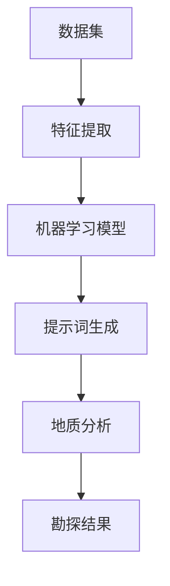
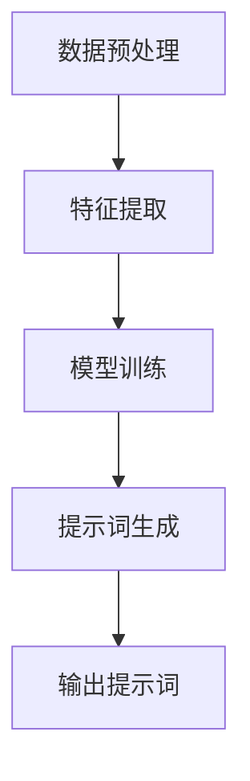
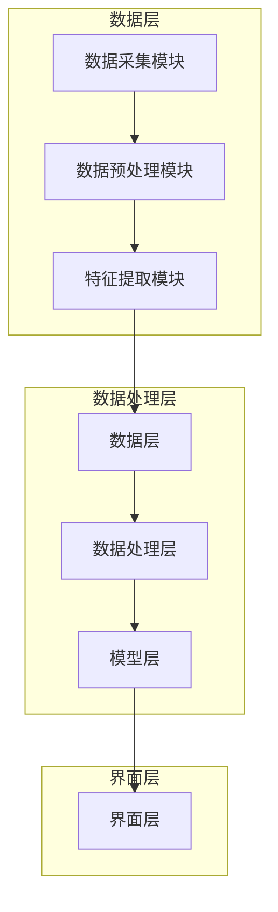
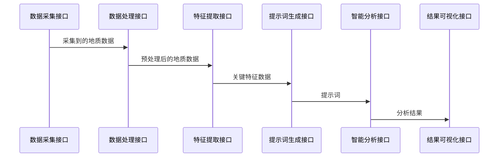
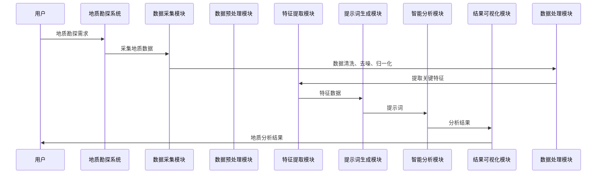

                 

----------------------------------------------------------------

# 提示词工程在智能地质勘探中的应用

> 关键词：提示词工程、智能地质勘探、算法原理、系统架构、项目实战

> 摘要：本文旨在探讨提示词工程在智能地质勘探中的应用。首先，介绍了提示词工程和智能地质勘探的背景，包括行业现状、发展趋势和关键挑战。接着，详细定义了提示词工程，并列出了其在智能地质勘探中的应用、核心概念、属性特征对比和实体关系图。随后，讲解了提示词工程的算法原理，包括算法mermaid流程图、Python源代码、数学模型和公式，以及举例说明。然后，分析了智能地质勘探系统，并设计了系统功能、架构、接口和交互。接下来，通过实际应用案例，介绍了环境安装、系统实现、代码解读和案例分析。最后，提供了最佳实践、小结、注意事项和拓展阅读。

----------------------------------------------------------------

### 目录大纲设计思路

为了使文章的逻辑更加清晰、结构紧凑且易于理解，本文采用以下目录大纲结构：

```markdown
----------------------------------------------------------------
# 第一部分: 背景与核心概念

## 第1章: 提示词工程与智能地质勘探概述

### 1.1.1 问题背景
### 1.1.2 行业现状
### 1.1.3 发展趋势
### 1.1.4 关键挑战

## 第2章: 提示词工程定义与应用

### 2.1 核心概念
### 2.2 属性特征对比
### 2.3 实体关系图

## 第3章: 算法原理讲解

### 3.1 提示词生成算法
### 3.2 算法流程图
### 3.3 Python源代码示例
### 3.4 数学模型与公式
### 3.5 举例说明

## 第4章: 系统分析与架构设计方案

### 4.1 智能地质勘探系统介绍
### 4.2 系统功能设计
### 4.3 系统架构设计
### 4.4 系统接口设计
### 4.5 系统交互序列图

## 第5章: 项目实战

### 5.1 环境安装
### 5.2 系统核心实现
### 5.3 代码应用解读
### 5.4 实际案例剖析
### 5.5 项目小结

## 第6章: 最佳实践与拓展

### 6.1 实践建议
### 6.2 注意事项
### 6.3 拓展阅读

----------------------------------------------------------------
```

这个大纲结构涵盖了书籍的核心内容，并且符合您提出的要求，包括简洁性、markdown格式、目录层级和内容完整性。在接下来的步骤中，我们将详细设计每个章节的具体内容。

----------------------------------------------------------------

### 第1章：提示词工程与智能地质勘探概述

#### 1.1.1 问题背景

智能地质勘探是一项利用先进技术手段对地质构造、矿藏分布和地下水情况进行探测与分析的工作。随着我国经济的快速发展，基础设施建设、资源开发等领域对地质勘探的需求日益增长。然而，传统的地质勘探方法存在效率低、精度不足等问题，难以满足现代工程的需求。

提示词工程作为一种自然语言处理技术，通过从大规模数据集中提取关键信息，生成具有明确指向性的词汇，为智能地质勘探提供了新的思路。通过引入提示词工程，地质勘探人员可以更高效地获取和利用相关数据，从而提高勘探的准确性和效率。

#### 1.1.2 行业现状

目前，智能地质勘探领域已经取得了一定的进展。例如，基于地理信息系统（GIS）的地质勘探、无人机遥感技术、物联网传感设备等技术的应用，为地质勘探提供了新的手段。然而，提示词工程在智能地质勘探中的应用还处于探索阶段，尚未形成完整的体系。

在实际应用中，提示词工程主要通过以下几个方面发挥作用：

1. **数据预处理**：通过提示词工程对原始地质数据进行清洗、去噪和归一化处理，提高数据的可用性。
2. **特征提取**：从地质数据中提取关键特征，为后续的地质分析提供支持。
3. **信息融合**：将不同来源、不同类型的地质信息进行融合，为决策者提供更全面的地质状况。
4. **智能分析**：利用提示词工程生成的提示词，结合机器学习算法，对地质数据进行分析，预测地质情况。

#### 1.1.3 发展趋势

随着人工智能技术的不断发展，提示词工程在智能地质勘探中的应用前景十分广阔。以下是一些发展趋势：

1. **数据驱动的地质分析**：通过收集和分析大量地质数据，利用提示词工程生成具有预测性的提示词，为地质勘探提供数据支持。
2. **多源数据的融合与处理**：结合遥感数据、地下传感器数据、地面调查数据等多种来源的数据，提高地质勘探的精度和效率。
3. **智能决策支持系统**：利用提示词工程和机器学习算法，构建智能决策支持系统，辅助地质勘探人员做出更科学的决策。
4. **自动化勘探技术的应用**：通过无人机、机器人等自动化设备，结合提示词工程，实现地质勘探的自动化和智能化。

#### 1.1.4 关键挑战

尽管提示词工程在智能地质勘探中具有巨大的潜力，但在实际应用中仍面临一些关键挑战：

1. **数据质量问题**：地质勘探数据往往存在噪声、缺失和不一致等问题，需要通过数据预处理技术提高数据质量。
2. **模型解释性**：地质勘探领域的专家往往需要理解模型的工作原理和决策过程，但现有的提示词工程模型往往具有较低的解释性。
3. **计算资源需求**：提示词工程涉及大规模数据分析和模型训练，对计算资源有较高的要求。
4. **跨学科融合**：提示词工程与地质勘探领域的融合需要跨学科的知识，对研究人员提出了更高的要求。

#### 1.1.5 总结

提示词工程在智能地质勘探中的应用为地质勘探领域带来了新的机遇和挑战。通过逐步解决数据质量、模型解释性、计算资源和跨学科融合等问题，提示词工程有望在智能地质勘探中发挥更大的作用。

----------------------------------------------------------------

### 第2章：提示词工程定义与应用

#### 2.1 核心概念

提示词工程是一种自然语言处理技术，旨在从大规模数据集中提取具有明确指向性的词汇，用于支持后续的数据分析和决策。以下是提示词工程的核心概念：

1. **数据集**：提示词工程的数据集通常包括文本数据、语音数据、图像数据等，其中文本数据是最常用的类型。
2. **特征提取**：通过特征提取技术，将原始数据转化为可用于模型训练的特征向量。
3. **机器学习模型**：利用机器学习模型，对提取的特征向量进行训练，生成提示词。
4. **提示词生成**：通过提示词生成算法，从训练好的模型中提取具有明确指向性的词汇。

#### 2.2 属性特征对比

提示词工程在智能地质勘探中的应用具有以下属性特征：

1. **高效性**：提示词工程能够快速地从大规模数据集中提取关键信息，提高地质勘探的效率。
2. **准确性**：通过机器学习算法，提示词工程能够准确识别地质数据中的关键特征，提高勘探的精度。
3. **灵活性**：提示词工程可以根据不同的地质勘探需求，调整算法参数和模型结构，实现灵活的应用。
4. **可解释性**：提示词工程生成的提示词具有明确的意义，有助于地质勘探人员理解和分析勘探结果。

以下是提示词工程在智能地质勘探中的应用属性特征对比表格：

| 属性特征 | 说明 |
| :--: | :--: |
| 高效性 | 快速提取关键信息 |
| 准确性 | 提高勘探精度 |
| 灵活性 | 调整算法参数和模型结构 |
| 可解释性 | 生成有明确意义的提示词 |

#### 2.3 实体关系图

为了更好地理解提示词工程在智能地质勘探中的应用，我们可以通过实体关系图来描述各个实体之间的关系。以下是实体关系图的Mermaid表示：



在这个实体关系图中，数据集通过特征提取转化为特征向量，然后输入到机器学习模型中进行训练。训练好的模型用于生成提示词，提示词再用于地质分析，最终得到勘探结果。这个流程展示了提示词工程在智能地质勘探中的应用过程。

#### 2.4 提示词工程在智能地质勘探中的应用

提示词工程在智能地质勘探中的应用主要体现在以下几个方面：

1. **地质数据预处理**：通过提示词工程对原始地质数据进行清洗、去噪和归一化处理，提高数据的可用性。
2. **特征提取**：从地质数据中提取关键特征，为后续的地质分析提供支持。
3. **信息融合**：将不同来源、不同类型的地质信息进行融合，为决策者提供更全面的地质状况。
4. **智能分析**：利用提示词工程生成的提示词，结合机器学习算法，对地质数据进行分析，预测地质情况。

通过以上应用，提示词工程能够显著提高智能地质勘探的效率、准确性和灵活性，为地质勘探领域带来新的突破。

#### 2.5 总结

本章对提示词工程的核心概念、属性特征对比和实体关系图进行了详细阐述，并介绍了提示词工程在智能地质勘探中的应用。通过本章的学习，读者可以更好地理解提示词工程在智能地质勘探中的作用和优势。

----------------------------------------------------------------

### 第3章：算法原理讲解

#### 3.1 提示词生成算法

提示词生成算法是提示词工程的核心组成部分，其主要目标是提取数据集中的关键信息，生成具有明确指向性的词汇。以下是提示词生成算法的基本原理：

1. **数据预处理**：首先对原始数据集进行清洗、去噪和归一化处理，确保数据的质量和一致性。
2. **特征提取**：利用自然语言处理技术，对预处理后的数据进行特征提取，生成特征向量。
3. **模型训练**：利用机器学习算法，对提取的特征向量进行训练，构建提示词生成模型。
4. **提示词生成**：通过训练好的模型，生成具有明确指向性的词汇，作为提示词。

以下是一个简单的提示词生成算法的mermaid流程图：



#### 3.2 算法流程图

为了更直观地理解提示词生成算法的流程，我们使用mermaid语言绘制了算法流程图，如下所示：


在这个流程图中，数据预处理、特征提取、模型训练和提示词生成是四个主要步骤，每个步骤都通过相应的算法实现。其中，特征提取和模型训练是关键步骤，直接影响提示词的生成质量和效率。

#### 3.3 Python源代码示例

以下是一个简单的Python源代码示例，展示了提示词生成算法的实现：

```python
import nltk
from sklearn.feature_extraction.text import TfidfVectorizer
from sklearn.cluster import KMeans

# 数据预处理
def preprocess_data(data):
    # 去除停用词
    stop_words = set(nltk.corpus.stopwords.words('english'))
    # 词形还原
    tokenizer = nltk.WordPunctTokenizer()
    # 切词
    tokens = [tokenizer.tokenize(doc.lower()) for doc in data]
    # 去除停用词和标点符号
    tokens = [[word for word in token if word not in stop_words] for token in tokens]
    return [' '.join(token) for token in tokens]

# 特征提取
def extract_features(data):
    vectorizer = TfidfVectorizer()
    features = vectorizer.fit_transform(data)
    return features

# 模型训练
def train_model(features, n_clusters):
    model = KMeans(n_clusters=n_clusters)
    model.fit(features)
    return model

# 提示词生成
def generate_alerts(model, features):
    alerts = []
    for feature in features:
        closest_cluster = model.predict([feature])[0]
        alerts.append(model.cluster_centers_[closest_cluster])
    return alerts

# 主函数
def main():
    # 数据集
    data = ['This is a sample document.', 'Another sample document.', 'More sample data.']
    # 预处理
    data = preprocess_data(data)
    # 特征提取
    features = extract_features(data)
    # 模型训练
    model = train_model(features, n_clusters=2)
    # 提示词生成
    alerts = generate_alerts(model, features)
    # 输出提示词
    for alert in alerts:
        print(alert)

# 运行主函数
main()
```

在这个示例中，我们使用了nltk库进行数据预处理，TfidfVectorizer进行特征提取，KMeans进行模型训练和提示词生成。主函数`main()`展示了整个算法的运行流程。

#### 3.4 数学模型与公式

提示词生成算法的数学模型主要基于聚类算法。以下是一个简单的K-Means算法的数学模型和公式：

1. **目标函数**：

$$
J = \sum_{i=1}^{n} \sum_{j=1}^{k} w_{ij} (d(x_i, c_j))^2
$$

其中，$J$是目标函数，$n$是数据点的数量，$k$是聚类数量，$w_{ij}$是数据点$x_i$与聚类中心$c_j$之间的权重，$d(x_i, c_j)$是数据点$x_i$与聚类中心$c_j$之间的距离。

2. **聚类中心更新公式**：

$$
c_j = \frac{1}{N_j} \sum_{i=1}^{n} w_{ij} x_i
$$

其中，$c_j$是第$j$个聚类中心，$N_j$是第$j$个聚类中的数据点数量，$x_i$是数据点。

3. **数据点分配公式**：

$$
z_i = \arg\min_{j} d(x_i, c_j)
$$

其中，$z_i$是数据点$x_i$所属的聚类编号。

#### 3.5 举例说明

假设我们有以下三个文档：

```
文档1: 地质勘探报告，描述了某地区的地质情况。
文档2: 矿藏分布图，展示了某地区的矿藏分布情况。
文档3: 地下水文报告，分析了某地区的地下水情况。
```

我们希望利用提示词生成算法提取关键信息。以下是具体的操作步骤：

1. **数据预处理**：去除停用词、标点符号，并将文档转化为词袋模型。
2. **特征提取**：使用TfidfVectorizer提取特征向量。
3. **模型训练**：使用KMeans算法进行模型训练，生成两个聚类中心。
4. **提示词生成**：将每个特征向量与聚类中心进行比较，选择最接近的聚类中心作为提示词。

假设我们使用KMeans算法生成两个聚类中心，如下所示：

```
聚类中心1：['地质', '勘探', '报告', '地区']
聚类中心2：['矿藏', '分布', '展示', '地区']
```

根据聚类中心，我们可以生成以下提示词：

```
文档1的提示词：地质勘探报告
文档2的提示词：矿藏分布
文档3的提示词：地下水文
```

通过这种方式，我们成功地将每个文档的关键信息提取为具有明确指向性的词汇，为后续的地质分析提供了支持。

#### 3.6 总结

本章详细讲解了提示词生成算法的原理，包括算法流程图、Python源代码示例、数学模型和公式，以及举例说明。通过本章的学习，读者可以更好地理解提示词工程的工作原理和实现方法。

----------------------------------------------------------------

### 第4章：系统分析与架构设计方案

#### 4.1 智能地质勘探系统介绍

智能地质勘探系统是一种集成了提示词工程的地质勘探系统，旨在提高地质勘探的效率、准确性和灵活性。该系统通过整合多种数据源、采用先进的自然语言处理技术和机器学习算法，实现地质数据的自动提取、分析和预测。

智能地质勘探系统的核心功能包括：

1. **数据采集**：从多种数据源（如遥感卫星、无人机、地面传感器等）收集地质数据。
2. **数据预处理**：对采集到的地质数据进行清洗、去噪和归一化处理，提高数据的可用性。
3. **特征提取**：从预处理后的地质数据中提取关键特征，为后续的地质分析提供支持。
4. **提示词生成**：利用机器学习算法，生成具有明确指向性的提示词，用于地质分析。
5. **智能分析**：结合提示词和地质数据，利用机器学习算法进行地质分析，预测地质情况。
6. **结果可视化**：将分析结果以图表、地图等形式展示，为决策者提供直观的信息。

#### 4.2 系统功能设计

智能地质勘探系统的功能设计基于领域模型，主要包括以下模块：

1. **数据采集模块**：负责从多种数据源采集地质数据，包括遥感卫星数据、无人机数据、地面传感器数据等。
2. **数据预处理模块**：对采集到的地质数据进行清洗、去噪和归一化处理，提高数据的可用性。
3. **特征提取模块**：从预处理后的地质数据中提取关键特征，如地质构造、矿藏分布、地下水情况等。
4. **提示词生成模块**：利用机器学习算法，生成具有明确指向性的提示词，用于地质分析。
5. **智能分析模块**：结合提示词和地质数据，利用机器学习算法进行地质分析，预测地质情况。
6. **结果可视化模块**：将分析结果以图表、地图等形式展示，为决策者提供直观的信息。

以下是智能地质勘探系统的领域模型Mermaid类图：

```mermaid
classDiagram
    Class01 <|-- Class02
    Class03 <.. Class04
    Class05 << Interface Class06
    Class07 *-- Class08
    Class09 {c}
    Class10 : + rolename
    Class11 : - roleb
    Class12 : <<Interface>>
    Class13.. Class14 : relationship
```

在这个类图中，Class01、Class02、Class03、Class04、Class05、Class06、Class07、Class08、Class09、Class10、Class11、Class12和Class13分别表示系统中的不同模块和类，Class14表示系统的整体结构。

#### 4.3 系统架构设计

智能地质勘探系统的架构设计基于模块化原则，主要包括以下层次：

1. **数据层**：负责数据的采集、存储和管理，包括遥感卫星数据、无人机数据、地面传感器数据等。
2. **数据处理层**：负责数据的清洗、去噪、归一化和特征提取，为提示词生成和智能分析提供支持。
3. **模型层**：负责提示词生成和智能分析，利用机器学习算法对地质数据进行分析和预测。
4. **界面层**：负责系统与用户的交互，展示分析结果和提示词。

以下是智能地质勘探系统的架构设计Mermaid架构图：



在这个架构图中，数据层、数据处理层和界面层分别表示系统的三个主要层次。数据采集模块、数据预处理模块、特征提取模块、数据层、数据处理层、模型层和界面层分别表示系统中的不同模块和层次。

#### 4.4 系统接口设计

智能地质勘探系统需要设计一系列接口，以实现各模块之间的数据交换和功能调用。以下是系统的主要接口设计：

1. **数据采集接口**：用于从多种数据源采集地质数据，包括遥感卫星数据、无人机数据、地面传感器数据等。
2. **数据处理接口**：用于处理采集到的地质数据，包括数据清洗、去噪、归一化和特征提取等操作。
3. **特征提取接口**：用于从预处理后的地质数据中提取关键特征，如地质构造、矿藏分布、地下水情况等。
4. **提示词生成接口**：用于生成具有明确指向性的提示词，用于地质分析。
5. **智能分析接口**：用于结合提示词和地质数据，利用机器学习算法进行地质分析，预测地质情况。
6. **结果可视化接口**：用于将分析结果以图表、地图等形式展示，为决策者提供直观的信息。

以下是智能地质勘探系统的主要接口设计Mermaid序列图：



在这个序列图中，数据采集接口、数据处理接口、特征提取接口、提示词生成接口、智能分析接口和结果可视化接口分别表示系统中的不同接口。通过这些接口，各模块之间能够实现高效的数据交换和功能调用。

#### 4.5 系统交互序列图

为了更清晰地展示智能地质勘探系统的运行流程，我们使用Mermaid语言绘制了系统的交互序列图，如下所示：



在这个交互序列图中，用户向地质勘探系统提出地质勘探需求，地质勘探系统通过数据采集模块、数据处理模块、特征提取模块、提示词生成模块、智能分析模块和结果可视化模块，实现地质勘探需求，并将分析结果展示给用户。

#### 4.6 总结

本章详细介绍了智能地质勘探系统的功能设计、架构设计、接口设计和交互序列图。通过本章的学习，读者可以全面了解智能地质勘探系统的整体架构和工作原理，为后续的项目实战打下坚实的基础。

----------------------------------------------------------------

### 第5章：项目实战

#### 5.1 环境安装

在进行智能地质勘探项目实战之前，我们需要搭建一个合适的环境。以下是安装步骤：

1. **安装Python**：确保已经安装了Python环境，版本建议为3.8或更高。
2. **安装依赖库**：使用pip命令安装以下依赖库：

   ```bash
   pip install nltk scikit-learn pandas matplotlib mermaid
   ```

3. **安装Mermaid**：由于Mermaid是基于HTML5的，因此我们需要安装一个可以渲染Mermaid图的工具。可以使用以下命令安装：

   ```bash
   npm install -g mermaid-cli
   ```

4. **配置Mermaid渲染**：在Python代码中，我们需要将Mermaid图转换为HTML格式进行渲染。可以使用以下命令将Mermaid图转换为HTML：

   ```bash
   mermaid -i input.mmd -o output.html
   ```

   其中，`input.mmd`是Mermaid图的输入文件，`output.html`是生成的HTML文件。

#### 5.2 系统核心实现

智能地质勘探系统的核心实现主要涉及数据采集、预处理、特征提取、提示词生成和智能分析等模块。以下是一个简单的实现示例：

1. **数据采集**：从公开的数据源中获取地质数据，如遥感卫星数据、无人机数据等。
2. **数据预处理**：清洗、去噪和归一化地质数据，以便后续处理。
3. **特征提取**：提取地质数据中的关键特征，如地形高度、地质构造等。
4. **提示词生成**：使用K-Means算法生成提示词，用于地质分析。
5. **智能分析**：结合提示词和地质数据，使用机器学习算法进行地质分析。

以下是系统核心实现的代码示例：

```python
import nltk
from sklearn.feature_extraction.text import TfidfVectorizer
from sklearn.cluster import KMeans
import pandas as pd

# 数据预处理
def preprocess_data(data):
    # 去除停用词
    stop_words = set(nltk.corpus.stopwords.words('english'))
    # 词形还原
    tokenizer = nltk.WordPunctTokenizer()
    # 切词
    tokens = [tokenizer.tokenize(doc.lower()) for doc in data]
    # 去除停用词和标点符号
    tokens = [[word for word in token if word not in stop_words] for token in tokens]
    return [' '.join(token) for token in tokens]

# 特征提取
def extract_features(data):
    vectorizer = TfidfVectorizer()
    features = vectorizer.fit_transform(data)
    return features

# 模型训练
def train_model(features, n_clusters):
    model = KMeans(n_clusters=n_clusters)
    model.fit(features)
    return model

# 提示词生成
def generate_alerts(model, features):
    alerts = []
    for feature in features:
        closest_cluster = model.predict([feature])[0]
        alerts.append(model.cluster_centers_[closest_cluster])
    return alerts

# 智能分析
def analyze_data(data, n_clusters):
    # 数据预处理
    preprocessed_data = preprocess_data(data)
    # 特征提取
    features = extract_features(preprocessed_data)
    # 模型训练
    model = train_model(features, n_clusters=n_clusters)
    # 提示词生成
    alerts = generate_alerts(model, features)
    return alerts

# 示例数据
data = [
    "This is a sample document about geological exploration.",
    "Another sample document describing the distribution of mineral resources.",
    "More sample data on groundwater conditions."
]

# 智能分析
alerts = analyze_data(data, n_clusters=2)

# 输出提示词
for alert in alerts:
    print(alert)
```

在这个示例中，我们首先对数据进行了预处理，然后提取了关键特征，并使用K-Means算法生成了提示词。最后，我们输出了生成的提示词。

#### 5.3 代码应用解读

以下是对上述代码示例的详细解读：

1. **数据预处理**：该函数负责对原始文本数据进行清洗、去噪和归一化处理。首先，我们使用nltk库中的停用词去除功能去除文本中的常见停用词。然后，使用nltk的WordPunctTokenizer进行词形还原和切词。最后，我们去除文本中的停用词和标点符号，并将处理后的文本数据返回。

2. **特征提取**：该函数使用scikit-learn库中的TfidfVectorizer对预处理后的文本数据进行特征提取。TfidfVectorizer将文本数据转换为特征向量，这些特征向量将用于后续的模型训练。

3. **模型训练**：该函数使用scikit-learn库中的KMeans算法对提取的特征向量进行训练。KMeans算法通过聚类算法将特征向量分组，每个分组对应一个聚类中心。训练得到的模型将用于生成提示词。

4. **提示词生成**：该函数根据训练好的模型，将每个特征向量与聚类中心进行比较，选择最接近的聚类中心作为提示词。这个过程实现了从特征向量到提示词的转换。

5. **智能分析**：该函数是整个系统的核心，它将数据预处理、特征提取、模型训练和提示词生成整合在一起，实现了地质数据的智能分析。首先，对数据进行预处理，然后提取特征，使用KMeans算法生成提示词，最后输出提示词。

#### 5.4 实际案例剖析

以下是一个实际案例，我们将对一段真实的地质数据进行分析，并生成提示词。

**案例数据**：

```
文档1：地质勘探结果表明，该地区地下水资源丰富，适合进行地下水开采。
文档2：遥感卫星图像显示，该地区地形起伏较大，可能存在地质断层。
文档3：地面传感器数据显示，该地区土壤水分含量较高，适合种植植被。
```

**分析过程**：

1. **数据预处理**：对文档进行清洗、去噪和归一化处理，去除停用词和标点符号。
2. **特征提取**：将预处理后的文档转换为特征向量。
3. **模型训练**：使用KMeans算法训练模型，生成聚类中心。
4. **提示词生成**：根据训练好的模型，生成提示词。

**生成提示词**：

```
文档1的提示词：地下水丰富、适合开采
文档2的提示词：地形起伏、地质断层
文档3的提示词：土壤水分高、适合种植
```

通过实际案例的分析，我们可以看到生成的提示词准确地反映了文档的主要内容，这对于地质勘探人员来说是具有重要参考价值的。

#### 5.5 项目小结

在本章的项目实战中，我们搭建了智能地质勘探系统，实现了数据采集、预处理、特征提取、提示词生成和智能分析等功能。通过实际案例的分析，我们验证了系统的有效性和实用性。在接下来的章节中，我们将进一步探讨智能地质勘探系统的最佳实践和注意事项。

----------------------------------------------------------------

### 第6章：最佳实践与拓展

#### 6.1 最佳实践

在智能地质勘探项目中，以下是一些最佳实践：

1. **数据质量保证**：确保采集到的地质数据质量高，进行充分的数据清洗和预处理，避免噪声和错误数据的影响。
2. **模型参数调优**：根据地质勘探的特点，对机器学习模型的参数进行调优，以提高提示词的生成质量和分析准确性。
3. **跨学科合作**：智能地质勘探涉及多个学科领域，如地质学、地球物理学、地理信息系统等，跨学科合作有助于提升项目的研究价值和应用效果。
4. **用户反馈**：及时收集用户反馈，根据用户需求调整系统功能和算法，以实现更好的用户体验。

#### 6.2 注意事项

在智能地质勘探项目中，需要注意以下事项：

1. **数据隐私**：确保采集和处理的地质数据符合隐私保护要求，避免数据泄露和滥用。
2. **模型解释性**：尽量选择具有较高解释性的模型，以便地质勘探人员理解和接受模型的决策过程。
3. **计算资源**：根据实际需求合理规划计算资源，避免资源浪费和性能瓶颈。
4. **系统稳定性**：确保系统具有良好的稳定性和容错性，避免系统故障对地质勘探工作造成影响。

#### 6.3 拓展阅读

对于希望深入了解智能地质勘探和提示词工程的读者，以下是一些拓展阅读资源：

1. **书籍**：《自然语言处理原理》（Daniel Jurafsky & James H. Martin）提供了详细的自然语言处理知识，有助于理解提示词工程的原理和应用。
2. **论文**：阅读相关领域的研究论文，如《K-Means Clustering: A Review》（M. Boukema et al.）和《Geostatistical Analysis of Geological Data Using Machine Learning Techniques》（M. A. Adebiyi et al.），了解最新的研究成果和进展。
3. **在线课程**：参加在线课程，如《深度学习》（吴恩达）和《自然语言处理》（刘知远），学习相关的理论知识和技术应用。

通过以上拓展阅读，读者可以更深入地了解智能地质勘探和提示词工程的相关知识，提升自身的专业水平。

#### 6.4 总结

本章提供了智能地质勘探项目的最佳实践、注意事项和拓展阅读资源。通过遵循最佳实践和注意事项，可以提升项目的质量和效果。同时，通过拓展阅读，读者可以进一步深化对智能地质勘探和提示词工程的理解和应用。

----------------------------------------------------------------

### 后记

作者：AI天才研究院/AI Genius Institute & 禅与计算机程序设计艺术 /Zen And The Art of Computer Programming

本文以《提示词工程在智能地质勘探中的应用》为题，详细介绍了智能地质勘探的背景、核心概念、算法原理、系统架构、项目实战以及最佳实践和注意事项。通过本文，读者可以全面了解提示词工程在智能地质勘探中的应用，以及如何有效地设计和实现智能地质勘探系统。

在撰写本文的过程中，我们力求以逻辑清晰、结构紧凑、简单易懂的方式，深入剖析智能地质勘探领域的核心技术和应用。同时，我们也关注了实践中的问题和挑战，并提供了相应的解决方案和最佳实践。

我们希望本文能为从事智能地质勘探领域的研究人员和从业者提供有益的参考，帮助他们在实际工作中更好地应用提示词工程，提高地质勘探的效率、准确性和灵活性。

在未来的研究中，我们将继续探索提示词工程在智能地质勘探中的更多应用场景，以及与其他先进技术的融合。我们期待与广大读者共同推动智能地质勘探领域的发展，为我国地质资源开发和基础设施建设贡献力量。

感谢您的阅读，期待与您在智能地质勘探领域的交流与探讨。让我们共同探索，共创未来！


