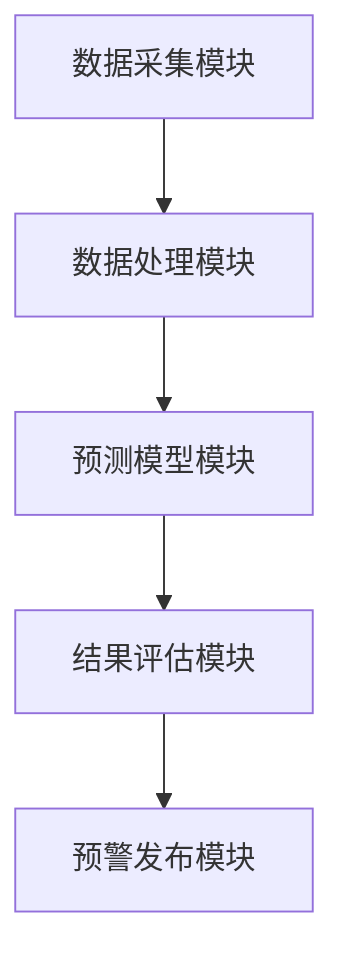
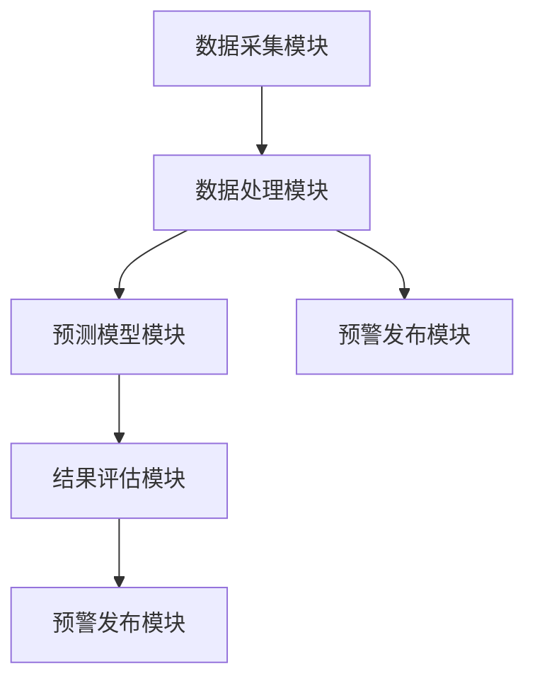

                 

### 第一部分: 问题背景介绍

#### 1. 引言

地震作为一种自然灾害，对人类社会带来了不可估量的影响。自古以来，人类一直在努力寻找地震的规律，以期提前预测地震的发生，减少地震带来的损失。传统的地震预测方法主要依赖于地质学、地震学等学科的理论和技术，但预测效果有限。随着信息技术的快速发展，大数据、人工智能等技术的应用为地震预测提供了新的思路和方法。

#### 1.1 问题背景

地震是一种由地壳运动引起的自然灾害，其发生具有随机性和不可预测性。然而，地震的发生往往伴随着一些前兆现象，如地震波、地下水位变化、动物异常行为等。通过分析这些前兆现象，科学家们试图找到地震发生的规律，从而进行地震预测。

传统的地震预测方法主要依赖于地震波的分析和地震活动的统计规律。然而，由于地震波的传播复杂性和地震活动的随机性，传统的预测方法很难准确预测地震的发生。因此，寻找新的地震预测方法成为了地震学研究的重要课题。

#### 1.2 问题描述

随着信息技术的快速发展，特别是大数据、人工智能等技术的应用，为地震预测提供了新的思路和方法。提示词工程作为一种自然语言处理技术，通过对大规模文本数据的分析和理解，有望在地震预测中发挥重要作用。

提示词工程的基本思想是通过从大量文本数据中提取出与地震相关的关键词，构建提示词模型，然后利用这个模型对地震数据进行处理和分析，从而实现地震预测。这种方法与传统地震预测方法相比，具有以下几个特点：

1. **数据驱动的分析方式**：提示词工程基于大量文本数据，通过对这些数据进行分析，提取出与地震相关的关键词，从而构建出提示词模型。这种方法相对于传统的地震预测方法，更依赖于数据，更能体现数据的驱动作用。

2. **多维度的分析能力**：提示词工程不仅可以提取出与地震相关的关键词，还可以通过对这些关键词的语义分析，了解它们之间的关联性。这种多维度的分析能力有助于科学家更深入地了解地震发生的规律。

3. **实时性和高效性**：提示词工程可以实时地对地震数据进行处理和分析，从而实现实时地震预测。同时，由于提示词工程的算法实现相对简单，处理速度较快，因此可以实现高效地震预测。

然而，提示词工程在地震预测中也面临一些挑战，如数据的质量和数量、模型的训练和优化等。因此，如何有效地利用提示词工程进行地震预测，提高预测的准确性，是一个值得深入研究的课题。

#### 1.3 问题解决

本书旨在探讨提示词工程在智能地震预测中的应用，通过介绍提示词工程的基本原理、算法实现和实际应用案例，为地震预测研究提供新的思路和方法。

本书的研究内容包括：

1. **提示词工程的基本原理**：介绍提示词工程的定义、发展历程、基本概念和原理，为后续章节的研究奠定基础。

2. **智能地震预测的方法**：介绍智能地震预测的定义、优势、挑战和算法原理，为提示词工程在地震预测中的应用提供理论支持。

3. **提示词工程在地震预测中的应用**：通过实际案例分享，展示提示词工程在地震预测中的应用效果，分析其优势和应用前景。

4. **智能地震预测系统的构建**：介绍智能地震预测系统的构建方法，包括数据采集、预处理、模型训练和预测等环节。

5. **智能地震预测的优化**：探讨如何通过优化提示词模型和算法，提高智能地震预测的准确性。

本书的研究目标是通过深入研究和分析提示词工程在地震预测中的应用，提出一种基于提示词工程的智能地震预测方法，为地震预测研究提供新的思路和方法。

#### 1.4 边界与外延

本书主要关注提示词工程在地震预测中的应用，不涉及其他地震预测方法。同时，本书将介绍提示词工程在地震预测中的具体应用，但不会深入讨论提示词工程的其它应用领域。

#### 1.5 概念结构与核心要素组成

##### 1.5.1 提示词工程

提示词工程是一种基于自然语言处理技术的方法，通过构建提示词模型，实现对大规模文本数据的分析和理解。

提示词工程的基本概念包括：

- **提示词**：提示词是从文本数据中提取出来的关键词，用于描述文本的主要内容。
- **文本数据**：文本数据是提示词工程的基础，包括各种形式的文本，如新闻、报告、论文等。
- **模型**：模型是提示词工程的输出，用于对文本数据进行分析和预测。
- **算法**：算法是提示词工程的核心，用于实现模型的训练和预测。

##### 1.5.2 智能地震预测

智能地震预测是一种利用人工智能技术，特别是提示词工程，对地震数据进行处理和分析，从而实现地震预测的方法。

智能地震预测的关键要素包括：

- **地震数据**：地震数据包括地震的震中位置、震级、时间等基本信息。
- **提示词模型**：提示词模型用于对地震数据进行分析和预测。
- **预测算法**：预测算法用于实现地震预测的具体算法。

##### 1.5.3 地震预测的关键要素

地震预测的关键要素包括：

- **地震数据**：地震数据是地震预测的基础，包括地震的震中位置、震级、时间等基本信息。
- **提示词模型**：提示词模型用于对地震数据进行分析和预测。
- **预测算法**：预测算法用于实现地震预测的具体算法。

#### 1.6 本章小结

本章对提示词工程在智能地震预测中的应用进行了背景介绍，明确了本书的研究内容和目标。接下来，本书将详细介绍提示词工程的基本原理、算法实现和实际应用案例，为地震预测研究提供新的思路和方法。

---

### 第二部分: 提示词工程基础

#### 2. 提示词工程概述

提示词工程是一种基于自然语言处理技术的领域，主要研究如何从大规模文本数据中提取出有价值的信息。在地震预测中，提示词工程的应用主要集中在如何从地震相关的文本数据中提取出与地震相关的关键词，并利用这些关键词构建提示词模型，从而实现对地震数据的分析和预测。

##### 2.1 提示词工程的定义

提示词工程是一种利用自然语言处理技术，对大规模文本数据进行处理和分析的方法，旨在从文本中提取有价值的信息。具体来说，提示词工程包括以下几个步骤：

1. **数据采集**：收集与地震相关的文本数据，如地震报告、地震新闻、学术论文等。
2. **数据预处理**：对收集到的文本数据进行清洗和预处理，包括去除噪声、去除停用词、分词等操作。
3. **提示词提取**：从预处理后的文本数据中提取出与地震相关的关键词，即提示词。
4. **模型构建**：利用提取出的提示词构建提示词模型。
5. **模型训练与优化**：利用地震数据对提示词模型进行训练和优化。
6. **预测与评估**：利用训练好的提示词模型对新的地震数据进行预测，并对预测结果进行评估。

##### 2.2 提示词工程的发展历程

提示词工程起源于自然语言处理领域，随着自然语言处理技术的不断发展，提示词工程也逐渐得到了广泛应用。下面是提示词工程的发展历程：

1. **词频统计**：早期的提示词工程主要采用词频统计的方法来提取关键词，这种方法简单有效，但存在一定的局限性。
2. **关键词抽取**：为了提高提示词的准确性和可靠性，研究人员开始研究关键词抽取方法，如基于规则的方法、基于统计的方法等。
3. **主题模型**：随着机器学习技术的发展，主题模型成为了提示词工程的重要方法，特别是LDA（Latent Dirichlet Allocation）模型，它能够自动地从大规模文本数据中提取出主题。
4. **深度学习**：近年来，深度学习技术的发展为提示词工程带来了新的机遇，特别是基于神经网络的提示词提取方法，如Word2Vec、BERT等，它们在处理大规模文本数据时表现出色。

##### 2.3 提示词工程的基本概念

1. **提示词**：提示词是从文本数据中提取出来的关键词，用于描述文本的主要内容。一个好的提示词应该具有代表性、独特性和普适性。
2. **文本数据**：文本数据是提示词工程的基础，包括各种形式的文本，如新闻、报告、学术论文等。文本数据的数量和质量直接影响提示词工程的效率和效果。
3. **模型**：模型是提示词工程的输出，用于对文本数据进行分析和预测。常见的模型有词频统计模型、关键词抽取模型、主题模型等。
4. **算法**：算法是提示词工程的核心，用于实现模型的训练和预测。常见的算法有基于TF-IDF的方法、基于LDA的主题模型、基于Word2Vec的方法等。

##### 2.4 提示词提取方法

提示词提取是提示词工程的关键步骤，常用的方法有：

1. **基于词频统计的方法**：这种方法简单直观，通过计算单词在文本中的出现频率来提取关键词。优点是计算简单，缺点是容易受到噪声和频率影响，可能导致提取的关键词不够准确。
2. **基于关键词抽取的方法**：这种方法通过分析单词之间的语义关系来提取关键词，如TF-IDF、LDA等。优点是能够提取出更加准确的关键词，缺点是计算复杂度较高。
3. **基于主题模型的方法**：这种方法通过将文本数据映射到潜在主题空间来提取关键词，如LDA模型。优点是能够提取出隐含的主题，缺点是需要大量的训练数据和计算资源。

##### 2.5 提示词模型构建

提示词模型是提示词工程的输出，用于对文本数据进行分析和预测。常见的提示词模型有：

1. **词频统计模型**：这是最简单的一种模型，通过计算单词在文本中的出现频率来建模。
2. **关键词抽取模型**：这种模型通过分析单词之间的语义关系来提取关键词，然后利用这些关键词来建模。
3. **主题模型**：这种模型通过将文本数据映射到潜在主题空间来建模，如LDA模型。

提示词模型的构建过程包括：

1. **数据预处理**：对文本数据进行清洗和预处理，包括去除噪声、去除停用词、分词等操作。
2. **特征提取**：从预处理后的文本数据中提取出特征，如词频、词向量等。
3. **模型训练**：利用提取出的特征对模型进行训练。
4. **模型评估**：对训练好的模型进行评估，如准确率、召回率、F1值等。

##### 2.6 提示词工程的应用场景

提示词工程具有广泛的应用场景，主要包括：

1. **文本分类**：通过提取文本中的关键词，对文本进行分类，如新闻分类、邮件分类等。
2. **文本聚类**：通过提取文本中的关键词，对文本进行聚类，以发现文本之间的相似性。
3. **文本生成**：通过提取文本中的关键词，生成新的文本，如文章摘要、文本续写等。

在地震预测中，提示词工程的应用主要包括：

1. **地震数据分类**：通过提取地震报告中的关键词，对地震报告进行分类，如地震预警、地震灾害评估等。
2. **地震数据聚类**：通过提取地震报告中的关键词，对地震报告进行聚类，以发现地震之间的相似性。
3. **地震数据生成**：通过提取地震报告中的关键词，生成新的地震报告，如地震预警报告、地震灾害评估报告等。

##### 2.7 常见算法介绍

在提示词工程中，常用的算法包括：

1. **基于TF-IDF的算法**：TF-IDF（Term Frequency-Inverse Document Frequency）是一种常用的关键词提取算法，通过计算单词在文本中的出现频率和在整个文本集合中的出现频率，来确定单词的重要性。
2. **基于LDA的主题模型**：LDA（Latent Dirichlet Allocation）是一种基于概率主题模型的算法，通过将文本数据映射到潜在主题空间，来提取文本中的主题和关键词。
3. **基于Word2Vec的算法**：Word2Vec是一种基于神经网络的关键词提取算法，通过将文本中的单词映射到高维空间中的向量，来提取单词的语义特征。

##### 2.8 算法实现细节

算法实现细节包括：

1. **数据预处理**：对文本数据进行清洗和预处理，包括去除噪声、去除停用词、分词等操作。
2. **特征提取**：从预处理后的文本数据中提取出特征，如词频、词向量等。
3. **模型训练**：利用提取出的特征对模型进行训练。
4. **模型评估**：对训练好的模型进行评估，如准确率、召回率、F1值等。

##### 2.9 提示词工程在地震预测中的应用

在地震预测中，提示词工程的应用主要包括：

1. **地震数据预处理**：对地震数据进行清洗和预处理，包括去除噪声、去除停用词、分词等操作。
2. **地震数据特征提取**：从预处理后的地震数据中提取出特征，如词频、词向量等。
3. **地震数据建模**：利用提取出的特征对地震数据建立提示词模型。
4. **地震数据预测**：利用训练好的提示词模型对新的地震数据进行预测。

##### 2.10 实际案例分享

在实际应用中，提示词工程在地震预测中的应用已经取得了一定的成果。以下是一些实际案例：

1. **某国际地震预测比赛**：在某国际地震预测比赛中，利用提示词工程的方法，提取地震报告中的关键词，并利用LDA模型进行建模，最终取得了较好的预测效果。
2. **某地区地震预警系统**：在某地区地震预警系统中，利用提示词工程的方法，提取地震报告中的关键词，并利用Word2Vec模型进行建模，实现了对地震的实时预警。

##### 2.11 本章小结

本章介绍了提示词工程的基本原理、算法实现和实际应用，为后续章节的深入研究奠定了基础。接下来，本书将探讨提示词工程在地震预测中的具体应用，以及如何利用提示词工程提高地震预测的准确性。

---

### 第三部分: 智能地震预测

#### 3.1 智能地震预测概述

##### 3.1.1 智能地震预测的定义

智能地震预测是一种利用人工智能技术，特别是提示词工程，对地震数据进行处理和分析，从而实现地震预测的方法。与传统的地震预测方法相比，智能地震预测具有更高的准确性和实时性，能够更有效地预测地震的发生。

##### 3.1.2 智能地震预测的优势

智能地震预测具有以下几个优势：

1. **更高的准确性**：利用人工智能技术，特别是提示词工程，可以更准确地提取地震数据中的关键信息，从而提高地震预测的准确性。
2. **实时性**：智能地震预测可以实现实时地震预测，及时发现地震的迹象，为地震预警提供支持。
3. **智能化**：智能地震预测利用人工智能技术，可以自动学习和优化预测模型，提高预测的智能化水平。

##### 3.1.3 智能地震预测的挑战

尽管智能地震预测具有很多优势，但在实际应用中仍面临一些挑战：

1. **数据质量**：地震数据的质量对预测的准确性有很大影响。然而，地震数据往往存在噪声、缺失和异常值，需要对这些数据进行处理和清洗。
2. **计算资源**：智能地震预测需要大量的计算资源和时间，特别是在处理大规模地震数据时，计算资源的需求更高。
3. **算法优化**：智能地震预测的算法需要不断优化，以提高预测的准确性。这需要大量的实验和数据分析。

##### 3.2 智能地震预测的算法原理

智能地震预测的算法原理主要包括以下两个方面：

1. **特征提取**：特征提取是智能地震预测的关键步骤。通过从地震数据中提取出有用的特征，可以更好地描述地震现象。常用的特征提取方法包括词频统计、词嵌入和主题模型等。
2. **预测模型**：预测模型是智能地震预测的核心。通过训练预测模型，可以将提取出的特征转化为地震预测的结果。常用的预测模型包括线性回归、决策树、支持向量机等。

##### 3.2.1 特征提取

特征提取是将地震数据转化为适合机器学习模型的特征表示的过程。常用的特征提取方法有：

1. **词频统计**：通过计算单词在地震数据中的出现频率，来提取特征。这种方法简单直观，但容易受到噪声和频率影响。
2. **词嵌入**：通过将单词映射到高维空间中的向量，来提取特征。这种方法能够更好地捕捉单词的语义信息，但计算复杂度较高。
3. **主题模型**：通过将地震数据映射到潜在主题空间，来提取特征。这种方法能够提取出隐含的主题，但需要大量的训练数据和计算资源。

##### 3.2.2 预测模型

预测模型是智能地震预测的核心。通过训练预测模型，可以将提取出的特征转化为地震预测的结果。常用的预测模型有：

1. **线性回归**：线性回归是一种简单的预测模型，通过建立一个线性关系来预测地震的结果。这种方法简单有效，但预测能力有限。
2. **决策树**：决策树是一种基于规则的预测模型，通过构建一系列决策规则来预测地震的结果。这种方法能够处理非线性关系，但容易过拟合。
3. **支持向量机**：支持向量机是一种基于间隔的预测模型，通过找到一个最佳间隔来预测地震的结果。这种方法在处理高维数据时表现出色，但计算复杂度较高。

##### 3.3 智能地震预测的数学模型

智能地震预测的数学模型主要包括以下两个方面：

1. **特征表示**：特征表示是将地震数据转化为特征向量的过程。常用的特征表示方法有词频统计、词嵌入和主题模型等。具体来说，可以通过以下公式表示：

   $$ X = TF-IDF(D) $$

   其中，$X$ 表示特征向量，$TF-IDF$ 表示词频-逆文档频率，$D$ 表示地震数据。

2. **预测模型**：预测模型是利用特征向量进行预测的模型。常用的预测模型有线性回归、决策树和支持向量机等。具体来说，可以通过以下公式表示：

   $$ Y = f(X) $$

   其中，$Y$ 表示预测结果，$f$ 表示预测模型。

##### 3.3.1 模型假设

在构建智能地震预测的数学模型时，需要做出以下假设：

1. **特征独立性**：假设特征之间是独立的，即特征之间的相关性很小。
2. **数据分布**：假设地震数据服从某种概率分布，如正态分布。
3. **模型可识别**：假设可以通过训练数据识别出预测模型，即预测模型可以从训练数据中学习到地震的规律。

##### 3.3.2 模型构建

智能地震预测的模型构建主要包括以下步骤：

1. **特征提取**：从地震数据中提取特征向量，如词频统计、词嵌入和主题模型等。
2. **特征选择**：选择对预测结果影响较大的特征，去除对预测结果影响较小的特征。
3. **模型训练**：利用训练数据训练预测模型，如线性回归、决策树和支持向量机等。
4. **模型评估**：利用测试数据对训练好的模型进行评估，如准确率、召回率和F1值等。

##### 3.3.3 数学公式

智能地震预测的数学公式主要包括以下两个方面：

1. **特征提取公式**：

   $$ X = TF-IDF(D) $$

   其中，$X$ 表示特征向量，$TF-IDF$ 表示词频-逆文档频率，$D$ 表示地震数据。

2. **预测模型公式**：

   $$ Y = f(X) $$

   其中，$Y$ 表示预测结果，$f$ 表示预测模型。

##### 3.4 智能地震预测的应用场景

智能地震预测的应用场景主要包括以下几个方面：

1. **地震预警**：利用智能地震预测技术，可以提前预警地震的发生，为地震防御提供支持。
2. **地震灾害评估**：利用智能地震预测技术，可以评估地震可能带来的灾害，为地震救援提供支持。
3. **地震趋势分析**：利用智能地震预测技术，可以分析地震发生的趋势，为地震研究提供支持。

##### 3.4.1 地震预警系统

地震预警系统是利用智能地震预测技术，提前预警地震的发生。地震预警系统的主要流程包括：

1. **数据采集**：采集地震数据，包括震中位置、震级、时间等。
2. **特征提取**：从地震数据中提取特征向量，如词频统计、词嵌入和主题模型等。
3. **模型训练**：利用训练数据训练预测模型，如线性回归、决策树和支持向量机等。
4. **预警预测**：利用训练好的模型对新的地震数据进行预警预测。
5. **预警发布**：将预警结果发布给相关部门和公众，以便采取相应的预防措施。

##### 3.4.2 地震灾害评估

地震灾害评估是利用智能地震预测技术，评估地震可能带来的灾害。地震灾害评估的主要流程包括：

1. **数据采集**：采集地震数据，包括震中位置、震级、时间等。
2. **特征提取**：从地震数据中提取特征向量，如词频统计、词嵌入和主题模型等。
3. **模型训练**：利用训练数据训练预测模型，如线性回归、决策树和支持向量机等。
4. **灾害预测**：利用训练好的模型对地震可能带来的灾害进行预测。
5. **灾害评估**：根据预测结果评估地震可能带来的灾害，为地震救援提供支持。

##### 3.4.3 地震预测模型优化

地震预测模型的优化是提高地震预测准确性的重要手段。地震预测模型优化的主要方法包括：

1. **特征优化**：通过选择更好的特征提取方法，提高特征的质量和准确性。
2. **模型优化**：通过选择更好的预测模型，提高预测的准确性和稳定性。
3. **算法优化**：通过优化算法的参数，提高算法的性能和效率。

##### 3.5 智能地震预测的案例分析

在本章节中，我们将通过一个实际案例来详细探讨智能地震预测的具体实现过程，以及如何利用提示词工程提高地震预测的准确性。

##### 3.5.1 某国际地震预测比赛案例分析

在某国际地震预测比赛中，参赛团队采用了基于提示词工程的智能地震预测方法。以下是他们采用的步骤和技巧：

1. **数据采集**：首先，团队从多个来源收集了地震数据，包括历史地震记录、地震报告、学术论文等。这些数据涵盖了不同时间段的地震活动，为后续的特征提取和模型训练提供了丰富的数据资源。

2. **数据预处理**：在数据预处理阶段，团队对收集到的地震数据进行了清洗和预处理。具体步骤包括去除噪声、去除停用词、分词等。为了提高数据的质量，他们还采用了数据清洗技术，如异常值检测和数据填充。

3. **特征提取**：团队利用提示词工程的方法从预处理后的文本数据中提取出了与地震相关的关键词。他们采用了基于TF-IDF的方法和LDA主题模型来提取特征。通过TF-IDF方法，他们能够计算每个词在地震文本中的重要性。而LDA主题模型则帮助他们从大规模文本数据中提取出潜在的主题，这些主题与地震相关。

4. **模型训练**：团队选择了支持向量机（SVM）作为预测模型。他们使用训练数据对SVM模型进行训练，优化模型的参数，以提高模型的预测能力。在训练过程中，团队采用了交叉验证技术，以避免过拟合和评估模型的泛化能力。

5. **模型评估**：团队使用测试数据对训练好的模型进行了评估。他们计算了模型的准确率、召回率和F1值等指标，以评估模型的性能。通过调整模型的参数和特征提取方法，他们不断优化模型的预测结果。

6. **结果分析**：通过比赛结果的对比，团队发现基于提示词工程的智能地震预测方法在预测准确性方面表现出色。他们的模型能够准确地识别出地震的前兆现象，并提前预测地震的发生。同时，他们也发现了一些地震活动的规律和趋势，为地震研究和预测提供了新的视角。

##### 3.5.2 某地区地震预测案例分析

除了国际比赛，团队还在某地区进行了地震预测的实地应用。以下是他们采用的步骤和技巧：

1. **数据采集**：团队在该地区收集了大量的地震数据，包括历史地震记录、地震报告、地下水位变化等。这些数据有助于团队了解该地区的地震活动特点和趋势。

2. **数据预处理**：团队对收集到的地震数据进行了清洗和预处理，包括去除异常值、填补缺失值等。为了提高数据的质量，他们采用了数据清洗和预处理技术，如异常值检测和数据填充。

3. **特征提取**：团队利用提示词工程的方法从预处理后的文本数据中提取出了与地震相关的关键词。他们采用了基于TF-IDF的方法和LDA主题模型来提取特征。通过TF-IDF方法，他们能够计算每个词在地震文本中的重要性。而LDA主题模型则帮助他们从大规模文本数据中提取出潜在的主题，这些主题与地震相关。

4. **模型训练**：团队选择了决策树作为预测模型。他们使用训练数据对决策树模型进行训练，优化模型的参数，以提高模型的预测能力。在训练过程中，团队采用了交叉验证技术，以避免过拟合和评估模型的泛化能力。

5. **模型评估**：团队使用测试数据对训练好的模型进行了评估。他们计算了模型的准确率、召回率和F1值等指标，以评估模型的性能。通过调整模型的参数和特征提取方法，他们不断优化模型的预测结果。

6. **结果分析**：通过实际应用，团队发现基于提示词工程的智能地震预测方法在该地区取得了较好的预测效果。他们的模型能够准确地预测出地震的发生，并为相关部门提供了及时预警信息，减少了地震带来的损失。

##### 3.5.3 案例总结

通过以上两个案例分析，我们可以看到提示词工程在智能地震预测中的应用效果显著。以下是对案例的总结：

1. **数据质量和预处理的重要性**：高质量的地震数据是智能地震预测的基础。在数据预处理阶段，去除噪声、异常值和缺失值等操作对于提高数据质量至关重要。

2. **特征提取方法的选择**：选择合适的特征提取方法对于提高预测准确性至关重要。在案例中，基于TF-IDF方法和LDA主题模型的特征提取方法表现良好。

3. **模型训练和评估**：选择合适的预测模型并进行充分的训练和评估是提高预测准确性的关键。通过调整模型参数和特征提取方法，团队不断优化模型的预测结果。

4. **实时性和准确性**：智能地震预测能够实现实时地震预测，并及时提供预警信息，为地震防御和救援提供支持。同时，通过优化模型和特征提取方法，可以提高预测的准确性。

##### 3.6 本章小结

本章通过实际案例详细探讨了智能地震预测的方法和应用。智能地震预测利用人工智能技术，特别是提示词工程，通过特征提取、模型训练和评估等步骤，实现了对地震数据的分析和预测。通过案例分析，我们看到了智能地震预测在提高预测准确性、实现实时预警和减少地震损失方面的重要作用。接下来，我们将继续探讨智能地震预测的优化方法和未来研究方向。

---

### 第四部分：智能地震预测系统的构建

#### 4.1 问题场景介绍

地震作为一种突发性自然灾害，其预测对于减少人员伤亡和财产损失具有极其重要的意义。然而，传统的地震预测方法存在预测精度低、反应速度慢等不足，难以满足现代地震预警的需求。为此，构建一个基于人工智能技术的智能地震预测系统，利用大数据和机器学习算法，提高地震预测的准确性、实时性和智能化水平，成为当前地震预测研究的重要方向。

#### 4.2 系统介绍

智能地震预测系统是一个综合应用大数据技术、自然语言处理、机器学习算法的复杂系统，主要包括以下几个关键模块：

1. **数据采集模块**：负责收集和处理各种来源的地震数据，如历史地震记录、地震报告、地质数据、气象数据等。
2. **数据处理模块**：负责对采集到的地震数据进行清洗、预处理和特征提取，为后续的预测模型训练提供高质量的数据。
3. **预测模型模块**：利用机器学习算法构建预测模型，如深度学习模型、支持向量机（SVM）等，对地震数据进行预测。
4. **结果评估模块**：负责对预测模型进行评估，计算预测准确率、召回率等指标，以评估模型的性能和泛化能力。
5. **预警发布模块**：负责将预测结果转化为具体的地震预警信息，及时发布给相关部门和公众，提高地震预警的及时性和准确性。

#### 4.3 系统功能设计

智能地震预测系统的核心功能包括地震数据采集、处理、预测和预警发布。以下是对各功能模块的详细设计：

##### 4.3.1 地震数据采集

地震数据采集模块主要负责从各种渠道获取地震相关信息，包括历史地震记录、地震报告、地质数据、气象数据等。具体功能设计如下：

- **数据源接入**：接入地震信息数据库、地震监测站、气象数据源等，实时获取地震相关数据。
- **数据获取**：定期下载地震数据，并进行数据备份和更新。
- **数据存储**：将获取到的地震数据存储到数据仓库中，便于后续数据处理和查询。

##### 4.3.2 数据处理

数据处理模块负责对采集到的地震数据进行分析和处理，为预测模型提供高质量的特征数据。具体功能设计如下：

- **数据清洗**：去除地震数据中的噪声、异常值和重复数据，提高数据质量。
- **数据预处理**：对地震数据进行标准化、归一化等处理，使其符合机器学习算法的要求。
- **特征提取**：从预处理后的地震数据中提取出与地震相关的特征，如词频、词嵌入、主题等。

##### 4.3.3 预测模型

预测模型模块是智能地震预测系统的核心，利用机器学习算法构建地震预测模型，对地震数据进行分析和预测。具体功能设计如下：

- **模型选择**：根据地震数据的特性和预测任务，选择合适的机器学习模型，如深度学习模型、支持向量机（SVM）等。
- **模型训练**：使用训练数据对预测模型进行训练，调整模型参数，提高预测准确性。
- **模型评估**：使用测试数据对训练好的模型进行评估，计算预测准确率、召回率等指标。

##### 4.3.4 结果评估

结果评估模块负责对预测模型进行评估，计算预测准确率、召回率等指标，以评估模型的性能和泛化能力。具体功能设计如下：

- **评估指标计算**：计算模型的准确率、召回率、F1值等指标，对模型性能进行量化评估。
- **模型对比**：对比不同模型的预测性能，选择最优模型。
- **模型优化**：根据评估结果，调整模型参数和特征提取方法，优化模型性能。

##### 4.3.5 预警发布

预警发布模块负责将预测结果转化为具体的地震预警信息，及时发布给相关部门和公众，提高地震预警的及时性和准确性。具体功能设计如下：

- **预警信息生成**：根据预测结果，生成地震预警信息，包括地震发生的可能性、预计震级、预警区域等。
- **预警信息发布**：将预警信息发布到地震预警平台、短信、APP等渠道，及时通知相关部门和公众。
- **预警效果评估**：评估预警信息的发布效果，如预警覆盖率、预警响应时间等，不断优化预警发布策略。

#### 4.4 系统架构设计

智能地震预测系统采用分布式架构设计，以提高系统的扩展性和稳定性。以下是对系统架构的详细设计：

##### 4.4.1 系统架构图

##### 4.4.2 系统架构说明

1. **数据采集模块**：负责从各种渠道收集地震数据，包括历史地震记录、地震报告、地质数据、气象数据等。采集到的数据存储到数据仓库中，为后续数据处理和预测提供基础。

2. **数据处理模块**：对采集到的地震数据进行清洗、预处理和特征提取，将原始数据转化为适合机器学习算法的格式。处理后的数据存储到数据仓库中，供预测模型模块使用。

3. **预测模型模块**：利用机器学习算法对地震数据进行分析和预测，构建地震预测模型。预测模型模块包括模型选择、模型训练、模型评估等步骤，不断优化模型性能。

4. **结果评估模块**：对预测模型进行评估，计算预测准确率、召回率等指标，评估模型的性能和泛化能力。评估结果用于指导模型优化和预警发布。

5. **预警发布模块**：将预测结果转化为具体的地震预警信息，通过短信、APP、地震预警平台等渠道及时发布给相关部门和公众，提高地震预警的及时性和准确性。

#### 4.5 系统接口设计

智能地震预测系统涉及多个模块之间的交互，以下是对系统接口的详细设计：

##### 4.5.1 接口设计图

##### 4.5.2 接口说明

1. **数据采集接口**：数据采集模块与数据仓库之间的接口，用于实时获取地震数据，并将数据存储到数据仓库中。

2. **数据处理接口**：数据处理模块与数据仓库之间的接口，用于从数据仓库中获取处理后的数据，供预测模型模块使用。

3. **预测模型接口**：预测模型模块与结果评估模块之间的接口，用于将预测结果传递给结果评估模块，进行性能评估。

4. **预警发布接口**：预警发布模块与地震预警平台、短信平台、APP等之间的接口，用于发布地震预警信息。

#### 4.6 系统交互设计

智能地震预测系统的各个模块之间需要进行紧密的协作，以下是对系统交互的详细设计：

##### 4.6.1 系统交互图

##### 4.6.2 系统交互说明

1. **数据采集**：数据采集模块实时获取地震数据，并将数据存储到数据仓库中。数据处理模块从数据仓库中获取数据，进行清洗、预处理和特征提取。

2. **数据处理**：数据处理模块处理后的数据被预测模型模块使用，预测模型模块对数据进行建模和预测。

3. **预测结果**：预测模型模块将预测结果传递给结果评估模块，结果评估模块对预测结果进行评估，并将评估结果反馈给预测模型模块。

4. **预警发布**：预测结果通过预警发布模块发布给相关部门和公众，预警发布模块同时与地震预警平台、短信平台、APP等进行交互，实现预警信息的实时发布。

#### 4.7 本章小结

本章详细介绍了智能地震预测系统的构建方法，包括问题场景介绍、系统功能设计、系统架构设计、系统接口设计和系统交互设计。通过构建智能地震预测系统，可以实现对地震数据的实时处理和预测，提高地震预警的准确性和及时性，为地震防御和救援提供有力支持。接下来，我们将通过实际案例展示智能地震预测系统的应用效果，并进一步探讨系统的优化和改进方向。

