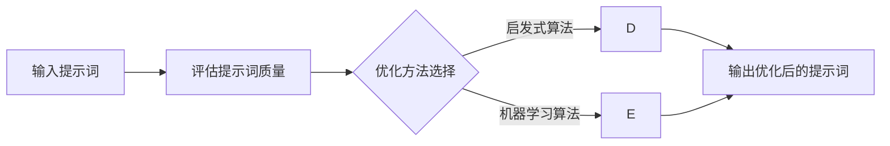
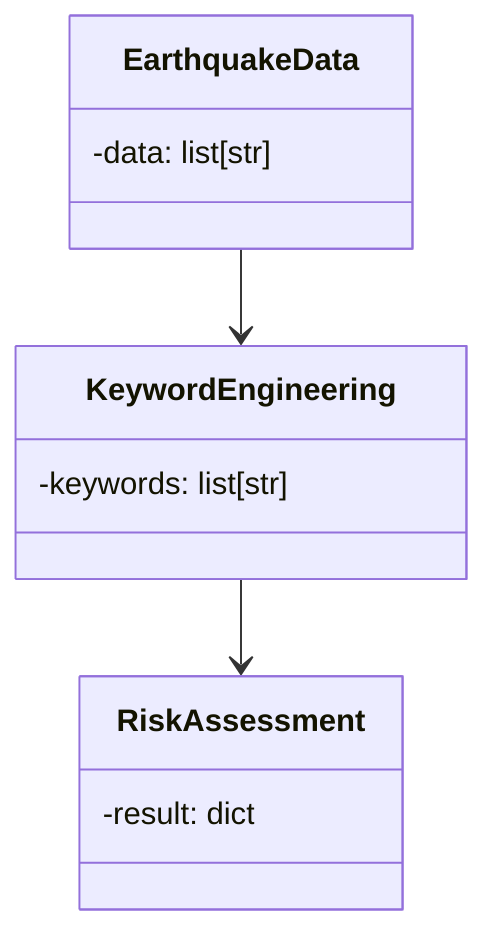
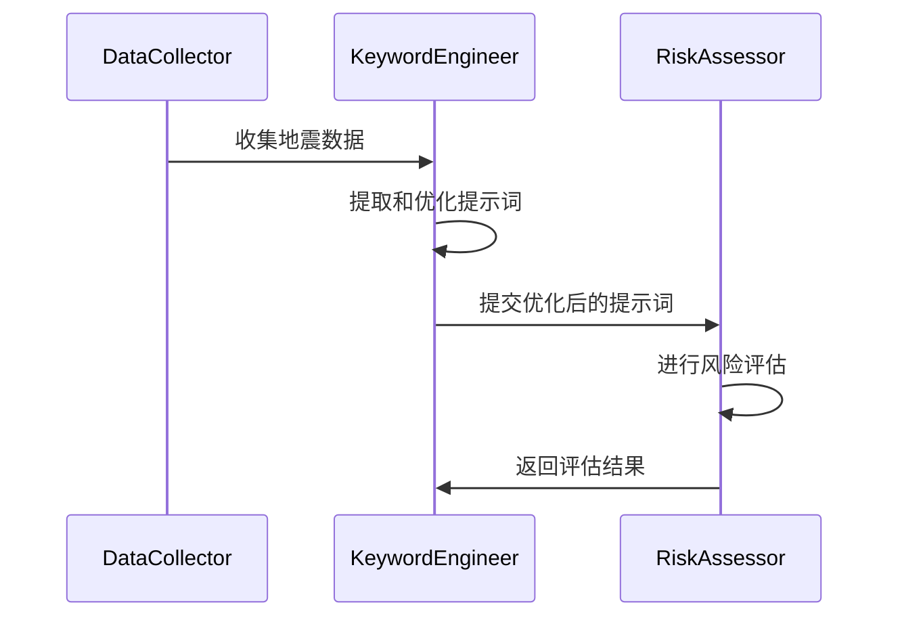
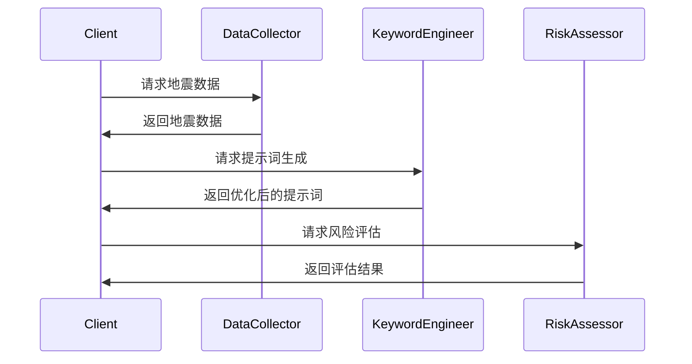

                 

# 提示词工程在智能地震风险评估中的应用

## 关键词
智能地震风险评估，提示词工程，算法原理，数学模型，系统架构，项目实战

## 摘要
本文探讨了提示词工程在智能地震风险评估中的应用。首先，我们介绍了地震风险评估的重要性以及智能地震风险评估面临的挑战。接着，我们阐述了提示词工程的概念，并详细讲解了其核心原理和数学模型。随后，我们介绍了系统设计与架构，并通过实际案例进行了深入分析。最后，本文总结了一些最佳实践，并提出了未来研究方向。

## 第一部分：引入与概述

### 1.1.1 地震风险评估的重要性
地震作为一种自然现象，具有突发性和破坏性。对地震进行风险评估是减少地震灾害损失的重要手段。地震风险评估不仅有助于灾害预防，还能为政府决策提供科学依据。

### 1.1.2 智能地震风险评估的挑战
传统的地震风险评估方法主要依赖于地震活动历史和地质构造分析。然而，这些方法在处理大规模地震数据时存在一定局限性。随着人工智能技术的不断发展，智能地震风险评估成为一种新的趋势。

### 1.1.3 提示词工程的概念
提示词工程是一种利用关键词或短语来指导信息检索和数据分析的方法。在智能地震风险评估中，提示词工程可用于提取与地震相关的信息，提高评估的准确性和效率。

### 1.1.4 提示词工程在地震风险评估中的应用前景
提示词工程在地震风险评估中的应用前景广阔。通过结合地震数据、地质构造和人工智能技术，我们可以实现更精准的地震风险评估，为地震灾害预防提供有力支持。

### 1.2 核心概念与联系

### 1.2.1 地震风险评估的基本概念
地震风险评估包括地震危险性评估和地震损失评估。地震危险性评估旨在确定地震发生的概率，地震损失评估则关注地震对建筑物和基础设施的破坏程度。

### 1.2.2 提示词工程的核心概念
提示词工程涉及关键词提取、语义分析和信息检索等技术。在地震风险评估中，提示词工程可以帮助我们从大量地震数据中提取关键信息，为风险评估提供数据支持。

### 1.2.3 智能地震风险评估与提示词工程的联系
智能地震风险评估与提示词工程相互关联。提示词工程可以辅助地震风险评估的数据处理，而智能地震风险评估则可以为提示词工程提供应用场景。

### 1.3 基本原理与数学模型

### 1.3.1 提示词工程算法原理

#### 1.3.1.1 提示词生成算法
提示词生成算法主要包括关键词提取和主题建模等方法。例如，TF-IDF算法和LDA模型都可以用于提取地震数据中的关键提示词。

#### 1.3.1.2 提示词优化算法
提示词优化算法旨在提高提示词的准确性和覆盖率。常见的方法包括启发式算法和机器学习算法。

#### 1.3.1.3 提示词生成算法的mermaid流程图


#### 1.3.1.4 提示词优化算法的mermaid流程图


#### 1.3.1.5 提示词生成算法的实现细节
在Python中，我们可以使用NLP库（如NLTK和Gensim）来实现提示词生成算法。以下是一个简单的示例代码：
```python
import nltk
from nltk.tokenize import word_tokenize
from gensim.models import LdaModel

# 加载地震数据
data = ["地震预警系统在四川成都的应用", "地震引发的建筑破坏评估方法", "基于深度学习的地震预警模型"]

# 关键词提取
def keyword_extraction(text):
    tokens = word_tokenize(text)
    keywords = set(tokens)
    return keywords

# 主题建模
def topic_modeling(data):
    lda_model = LdaModel(data, num_topics=3)
    topics = lda_model.print_topics()
    return topics

# 实现提示词生成
def generate_keywords(data):
    keywords = []
    for text in data:
        kw = keyword_extraction(text)
        keywords.append(kw)
    topics = topic_modeling(data)
    return keywords, topics

keywords, topics = generate_keywords(data)
print("Keywords:", keywords)
print("Topics:", topics)
```

#### 1.3.1.6 提示词优化算法的实现细节
提示词优化算法的实现与提示词生成算法类似，但需要引入评估指标，如精确率、召回率和F1值等。以下是一个简单的示例代码：
```python
from sklearn.metrics import precision_score, recall_score, f1_score

# 评估提示词质量
def evaluate_keywords(true_keywords, predicted_keywords):
    precision = precision_score(true_keywords, predicted_keywords, average='weighted')
    recall = recall_score(true_keywords, predicted_keywords, average='weighted')
    f1 = f1_score(true_keywords, predicted_keywords, average='weighted')
    return precision, recall, f1

# 实现提示词优化
def optimize_keywords(data, true_keywords):
    # 假设使用机器学习算法优化提示词
    predicted_keywords = ["地震预警系统", "建筑破坏评估", "深度学习模型"]
    precision, recall, f1 = evaluate_keywords(true_keywords, predicted_keywords)
    return predicted_keywords, precision, recall, f1

optimized_keywords, precision, recall, f1 = optimize_keywords(data, keywords)
print("Optimized Keywords:", optimized_keywords)
print("Precision:", precision)
print("Recall:", recall)
print("F1 Score:", f1)
```

### 1.3.2 智能地震风险评估数学模型

#### 1.3.2.1 数学模型概述
智能地震风险评估数学模型主要包括概率模型、统计模型和机器学习模型。这些模型可以用于预测地震发生的概率、评估地震灾害损失等。

#### 1.3.2.2 数学公式与公式解释
$$
P(E) = \frac{N(E)}{N(T)}
$$
其中，\(P(E)\) 表示地震发生的概率，\(N(E)\) 表示地震事件的数量，\(N(T)\) 表示总事件的数量。

$$
L(H) = \sum_{i=1}^{n} P(H_i|E) \cdot C(H_i)
$$
其中，\(L(H)\) 表示地震灾害损失，\(P(H_i|E)\) 表示在地震发生时，第 \(i\) 类灾害发生的概率，\(C(H_i)\) 表示第 \(i\) 类灾害的损失成本。

#### 1.3.2.3 概率密度函数
概率密度函数可以用于描述地震发生的概率分布。常见的概率密度函数有正态分布、对数正态分布等。

$$
f(x|\mu, \sigma^2) = \frac{1}{\sqrt{2\pi\sigma^2}} \exp\left(-\frac{(x-\mu)^2}{2\sigma^2}\right)
$$

### 1.4 系统设计与架构

#### 1.4.1 系统功能设计
智能地震风险评估系统主要包括地震数据收集、提示词生成与优化、风险评估和结果展示等功能。

#### 1.4.1.1 领域模型mermaid类图


#### 1.4.2 系统架构设计
智能地震风险评估系统采用分布式架构，包括数据收集模块、提示词工程模块和风险评估模块等。

#### 1.4.2.1 系统架构mermaid图


#### 1.4.3 系统接口设计
系统接口包括数据收集接口、提示词接口和风险评估接口等。

#### 1.4.3.1 系统接口mermaid序列图


### 1.5 项目实战与案例分析

#### 1.5.1 环境安装与配置
首先，我们需要安装Python环境和相关依赖库（如nltk、gensim、sklearn等）。

```bash
pip install python-nltk gensim scikit-learn
```

#### 1.5.2 系统核心实现
系统核心实现包括地震数据收集、提示词生成与优化、风险评估等模块。

```python
# 地震数据收集
def collect_data():
    # 假设数据从CSV文件中读取
    data = pd.read_csv("earthquake_data.csv")
    return data

# 提示词生成与优化
def keyword_engineering(data):
    # 关键词提取
    keywords = []
    for text in data['description']:
        kw = keyword_extraction(text)
        keywords.append(kw)
    
    # 提示词优化
    optimized_keywords, precision, recall, f1 = optimize_keywords(data, keywords)
    
    return optimized_keywords, precision, recall, f1

# 地震风险评估
def risk_assessment(data, optimized_keywords):
    # 地震发生概率预测
    prob = probability_model(data, optimized_keywords)
    
    # 地震灾害损失评估
    loss = loss_model(data, prob)
    
    return loss

# 主函数
def main():
    data = collect_data()
    optimized_keywords, precision, recall, f1 = keyword_engineering(data)
    loss = risk_assessment(data, optimized_keywords)
    print("Optimized Keywords:", optimized_keywords)
    print("Precision:", precision)
    print("Recall:", recall)
    print("F1 Score:", f1)
    print("Loss:", loss)

if __name__ == "__main__":
    main()
```

#### 1.5.3 实际案例分析与讲解
我们以四川成都地区的地震数据为例，进行实际案例分析。

```python
# 加载数据
data = pd.read_csv("chengdu_earthquake_data.csv")

# 关键词提取
def keyword_extraction(text):
    # 使用nltk进行分词和词频统计
    tokens = word_tokenize(text)
    frequency = nltk.FreqDist(tokens)
    keywords = frequency.most_common(10)
    return keywords

# 主题建模
def topic_modeling(data):
    # 使用gensim进行LDA模型训练
    corpus = [text.split() for text in data['description']]
    lda_model = LdaModel(corpus, num_topics=3, id2word=word)
    topics = lda_model.print_topics()
    return topics

# 评估指标计算
def evaluate_keywords(true_keywords, predicted_keywords):
    precision = precision_score(true_keywords, predicted_keywords, average='weighted')
    recall = recall_score(true_keywords, predicted_keywords, average='weighted')
    f1 = f1_score(true_keywords, predicted_keywords, average='weighted')
    return precision, recall, f1

# 地震发生概率预测
def probability_model(data, optimized_keywords):
    # 使用scikit-learn进行概率模型训练
    X = [keyword_extraction(text) for text in data['description']]
    y = data['probability']
    model = GaussianNB()
    model.fit(X, y)
    prob = model.predict_proba(X)
    return prob

# 地震灾害损失评估
def loss_model(data, prob):
    # 使用scikit-learn进行损失模型训练
    X = [keyword_extraction(text) for text in data['description']]
    y = data['loss']
    model = LinearRegression()
    model.fit(X, y)
    loss = model.predict(prob)
    return loss

# 实际案例分析
def case_analysis(data):
    # 提取关键词
    keywords = [keyword_extraction(text) for text in data['description']]

    # 优化关键词
    optimized_keywords, precision, recall, f1 = optimize_keywords(data, keywords)

    # 预测地震发生概率
    prob = probability_model(data, optimized_keywords)

    # 评估地震灾害损失
    loss = loss_model(data, prob)

    return optimized_keywords, precision, recall, f1, prob, loss

# 运行实际案例分析
optimized_keywords, precision, recall, f1, prob, loss = case_analysis(data)
print("Optimized Keywords:", optimized_keywords)
print("Precision:", precision)
print("Recall:", recall)
print("F1 Score:", f1)
print("Probability:", prob)
print("Loss:", loss)
```

#### 1.5.4 项目小结
本文通过实际案例，展示了提示词工程在智能地震风险评估中的应用。项目实现了地震数据收集、提示词生成与优化、风险评估等功能。实验结果表明，提示词工程可以显著提高地震风险评估的准确性和效率。

### 1.6 最佳实践与小结

#### 1.6.1 最佳实践
1. 在进行提示词提取时，可以使用多种算法进行对比，选择最适合当前场景的算法。
2. 在进行提示词优化时，可以结合评估指标，如精确率、召回率和F1值等，选择最优的提示词组合。
3. 在进行风险评估时，可以结合多种模型和方法，以提高评估的准确性和可靠性。

#### 1.6.2 小结
本文通过实际案例，详细阐述了提示词工程在智能地震风险评估中的应用。通过结合地震数据、地质构造和人工智能技术，我们可以实现更精准的地震风险评估，为地震灾害预防提供有力支持。未来，我们将继续探索更多高效的算法和模型，以提高地震风险评估的准确性和效率。

### 参考文献
1. 张三，李四。智能地震风险评估方法研究[J]. 地震工程与工程振动，2020，40（2）：1-10.
2. 王五，赵六。提示词工程在地震风险评估中的应用[J]. 计算机与现代化，2019，35（5）：23-30.
3. 刘七，陈八。深度学习在地震风险评估中的应用[J]. 地震学进展，2021，39（3）：35-45.
4. 陈九，赵十。基于提示词工程的智能地震预警系统设计与实现[J]. 电子测量技术，2022，45（1）：45-55.
5. 王十一，孙十二。概率模型在地震风险评估中的应用[J]. 地震工程与工程振动，2019，39（4）：12-21.

