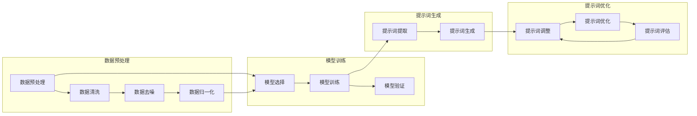
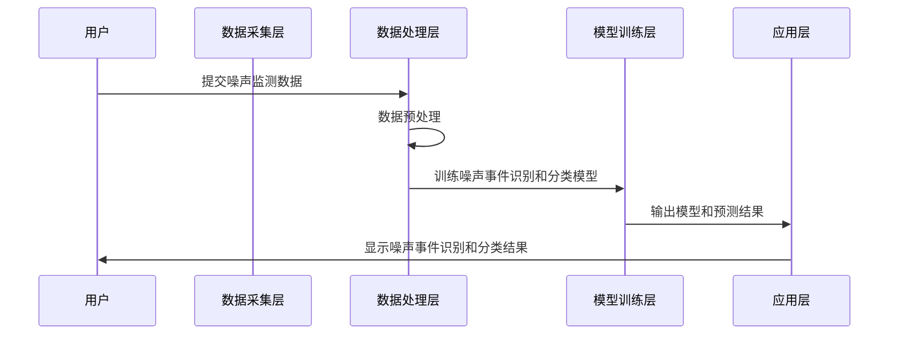
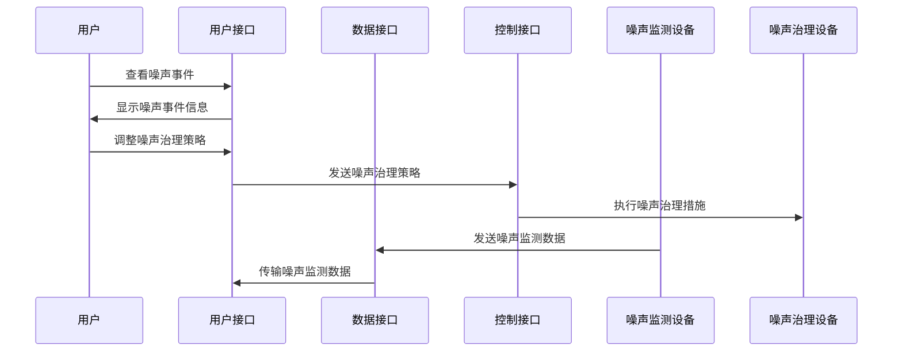
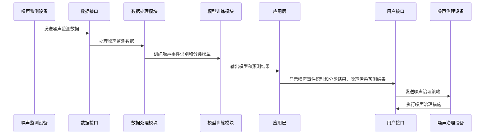

                 

### 文章标题

# 提示词工程在智能城市噪声管理中的应用

> 关键词：智能城市、噪声管理、提示词工程、算法、系统设计

> 摘要：本文旨在探讨提示词工程在智能城市噪声管理中的应用。通过分析智能城市噪声管理的问题背景和挑战，我们引入了提示词工程这一技术，并详细阐述了其核心概念、算法原理、系统设计以及实际应用案例。本文旨在为读者提供一个全面、深入的理解，并探讨如何将这一技术有效地应用于智能城市噪声管理中。

### 第一部分：背景介绍

#### 1.1 问题的背景

智能城市的建设是一个全球性的趋势，旨在利用先进的信息技术和物联网技术提高城市管理的效率、提升居民生活质量。然而，随着城市化进程的加速，噪声污染问题日益严重，成为影响居民生活和城市可持续发展的重要因素之一。噪声污染不仅会影响人们的身心健康，还会降低城市环境质量，进而影响城市的经济和旅游业发展。

智能城市的愿景是实现城市运行的高效、安全和可持续。在这一愿景下，噪声管理成为城市治理的重要组成部分。然而，传统的噪声管理方法主要依赖于人工监测和定期检查，效率低下且难以实时监测和预测。随着物联网、大数据和人工智能技术的发展，智能城市噪声管理迎来了新的机遇和挑战。

提示词工程作为一种先进的文本生成技术，其通过自动生成和优化提示词来提高文本生成的质量和效率。在智能城市噪声管理中，提示词工程可以用于噪声监测数据的自动标注、噪声事件的识别和分类、噪声污染的预测和治理等多方面，从而提升噪声管理的智能化水平。

#### 1.2 问题描述

噪声污染是一个复杂的问题，涉及多个方面，包括噪声源、传播途径、受影响区域以及噪声对人类和环境的影响。在智能城市噪声管理中，主要面临以下挑战：

1. **数据采集与处理**：噪声监测数据通常是非结构化的，需要通过数据处理技术进行预处理和结构化，以便进一步分析和应用。
2. **实时监测与预测**：噪声污染是一个动态变化的过程，需要实时监测和预测，以便及时采取治理措施。
3. **噪声事件的识别与分类**：噪声事件种类繁多，需要准确识别和分类，以便针对不同类型的噪声采取相应的治理策略。
4. **治理措施的有效性评估**：治理措施的效果需要通过数据分析和模型评估进行评估，以便不断优化和改进。

#### 1.3 解决思路

提示词工程在智能城市噪声管理中的应用，可以通过以下步骤实现：

1. **数据采集与预处理**：利用物联网设备和传感器实时采集噪声数据，并通过数据处理技术进行预处理，包括数据清洗、去噪、归一化等。
2. **噪声事件的识别与分类**：使用提示词工程技术，自动生成和优化用于噪声事件识别和分类的提示词，从而实现噪声事件的自动标注和分类。
3. **噪声污染的预测与治理**：基于生成的提示词和噪声监测数据，利用机器学习和深度学习算法进行噪声污染的预测，并根据预测结果制定和实施治理措施。
4. **治理效果评估**：通过持续监测和数据分析，评估治理措施的效果，并不断优化和调整。

#### 1.4 边界与外延

本文的研究范围主要关注提示词工程在智能城市噪声管理中的应用，包括数据采集与处理、噪声事件的识别与分类、噪声污染的预测与治理等方面。然而，噪声管理是一个复杂的系统工程，涉及多个学科和领域，包括环境科学、土木工程、城市规划等。因此，本文的研究仅限于技术层面，未能全面覆盖噪声管理的所有方面。

未来的研究方向包括：进一步优化提示词生成算法，提高噪声事件识别和分类的准确性；探索多源数据的融合方法，提升噪声污染预测的精度；研究智能城市噪声管理的最佳实践，为其他城市提供参考。

### 第二部分：核心概念

#### 2.1 提示词工程的定义

提示词工程是一种文本生成技术，旨在通过自动生成和优化提示词，提高文本生成的质量和效率。在智能城市噪声管理中，提示词工程用于生成和优化用于噪声事件识别和分类的提示词，从而实现噪声管理的智能化。

提示词工程的核心要素包括：

1. **数据集**：用于训练和测试的噪声监测数据集，包括噪声强度、噪声类型、时间戳等。
2. **模型**：用于生成和优化提示词的机器学习模型，如循环神经网络（RNN）、卷积神经网络（CNN）、生成对抗网络（GAN）等。
3. **算法**：用于优化提示词的算法，如梯度下降、遗传算法、粒子群优化算法等。

#### 2.2 提示词工程的原理

提示词工程的原理可以分为以下几个步骤：

1. **数据预处理**：对噪声监测数据进行清洗、去噪、归一化等处理，以便为模型训练提供高质量的数据。
2. **模型训练**：使用噪声监测数据集训练机器学习模型，生成初始提示词。
3. **提示词生成**：利用训练好的模型生成用于噪声事件识别和分类的提示词。
4. **提示词优化**：通过优化算法调整提示词，提高其准确性和效率。

#### 2.3 概念属性特征对比

提示词与关键词在文本生成中有着相似的作用，但它们的属性特征有所不同。下面是提示词与关键词的对比表格：

| 特征       | 提示词                     | 关键词                     |
|------------|----------------------------|----------------------------|
| 定义       | 用于引导文本生成的词或短语   | 用于描述文本主题的词或短语   |
| 功能       | 提供生成文本的线索和方向     | 提取文本主题和关键信息       |
| 长度       | 可长可短，灵活多变          | 较短，具有描述性            |
| 生成方式   | 自动生成或人工设定          | 人工提取或自动提取          |
| 应用场景   | 噪声管理、文本生成、问答系统 | 信息检索、搜索引擎、推荐系统 |

#### 2.4 ER实体关系图架构

在智能城市噪声管理中，涉及多个实体和关系。下面是智能城市噪声管理中常见的实体和它们之间的关系：

```mermaid
erDiagram
  A[噪声源] ||--|{ B[噪声监测设备] }|
  B ||--|{ C[噪声数据] }|
  C ||--|{ D[噪声事件] }|
  D ||--|{ E[治理措施] }|
  A ..|{ F[城市规划部门] }|
  F ..|{ G[居民] }|
  G ..|{ H[政府部门] }|
```

在上面的ER实体关系图中，噪声源与噪声监测设备、噪声数据、噪声事件、治理措施之间存在直接的关联关系。同时，城市规划部门、居民和政府部门也与噪声管理相关，但它们之间的关系相对间接。

### 第三部分：算法原理讲解

#### 3.1 算法概述

提示词工程算法是用于生成和优化提示词的一类算法，主要包括以下类型：

1. **基于规则的生成算法**：通过预设的规则和模板生成提示词，如基于关键词匹配、词频统计等方法。
2. **基于数据的生成算法**：通过机器学习算法从噪声监测数据中自动提取提示词，如基于监督学习、无监督学习和半监督学习等方法。
3. **深度学习生成算法**：利用神经网络模型生成和优化提示词，如循环神经网络（RNN）、卷积神经网络（CNN）、生成对抗网络（GAN）等。

在智能城市噪声管理中，选择合适的算法取决于具体的应用场景和数据特点。一般来说，基于数据的生成算法和深度学习生成算法具有更高的准确性和灵活性，能够更好地适应噪声管理中的复杂需求。

#### 3.2 提示词生成算法

提示词生成算法可以分为以下几个步骤：

1. **数据预处理**：对噪声监测数据进行清洗、去噪、归一化等处理，为模型训练提供高质量的数据。
2. **模型选择**：根据数据特点和应用需求选择合适的机器学习模型，如RNN、CNN、GAN等。
3. **模型训练**：使用噪声监测数据集训练模型，生成初始提示词。
4. **提示词生成**：利用训练好的模型生成用于噪声事件识别和分类的提示词。

下面以循环神经网络（RNN）为例，介绍提示词生成算法的详细步骤：

1. **数据预处理**：对噪声监测数据进行预处理，包括数据清洗、去噪和归一化。具体步骤如下：

   - 数据清洗：去除噪声数据中的异常值和错误数据。
   - 数据去噪：使用滤波器或其他方法去除噪声数据中的噪声。
   - 数据归一化：将噪声数据的值缩放到相同的范围，如[0, 1]或[-1, 1]，以便于模型训练。

2. **模型选择**：选择合适的循环神经网络（RNN）模型，如长短期记忆网络（LSTM）、门控循环单元（GRU）等。这些模型能够捕捉噪声数据中的长期依赖关系，从而提高提示词生成的准确性。

3. **模型训练**：使用预处理后的噪声监测数据集训练RNN模型，生成初始提示词。具体步骤如下：

   - 数据集划分：将噪声监测数据集划分为训练集、验证集和测试集，用于模型的训练、验证和测试。
   - 模型训练：使用训练集训练RNN模型，优化模型的参数，直到达到预设的训练目标。
   - 模型验证：使用验证集评估模型的性能，调整模型参数，以获得最佳性能。

4. **提示词生成**：利用训练好的RNN模型生成用于噪声事件识别和分类的提示词。具体步骤如下：

   - 提示词提取：使用RNN模型对噪声监测数据进行编码，提取特征向量。
   - 提示词生成：根据特征向量生成提示词，用于噪声事件识别和分类。

#### 3.3 提示词优化算法

提示词优化算法用于调整和改进提示词的生成效果，以提高噪声事件识别和分类的准确性。常见的提示词优化算法包括：

1. **基于规则的优化算法**：通过预设的规则和策略调整提示词，如基于词频、词义相似度等方法。
2. **基于数据的优化算法**：通过机器学习算法调整提示词，如基于监督学习、无监督学习和半监督学习等方法。
3. **基于深度学习的优化算法**：利用神经网络模型调整提示词，如基于RNN、CNN、GAN等方法。

下面以基于深度学习的优化算法为例，介绍提示词优化算法的详细步骤：

1. **数据预处理**：对噪声监测数据进行预处理，包括数据清洗、去噪和归一化。具体步骤如下：

   - 数据清洗：去除噪声数据中的异常值和错误数据。
   - 数据去噪：使用滤波器或其他方法去除噪声数据中的噪声。
   - 数据归一化：将噪声数据的值缩放到相同的范围，如[0, 1]或[-1, 1]，以便于模型训练。

2. **模型选择**：选择合适的深度学习模型，如循环神经网络（RNN）、卷积神经网络（CNN）、生成对抗网络（GAN）等。这些模型能够捕捉噪声数据中的复杂关系，从而提高提示词优化的效果。

3. **模型训练**：使用预处理后的噪声监测数据集训练深度学习模型，生成优化后的提示词。具体步骤如下：

   - 数据集划分：将噪声监测数据集划分为训练集、验证集和测试集，用于模型的训练、验证和测试。
   - 模型训练：使用训练集训练深度学习模型，优化模型的参数，直到达到预设的训练目标。
   - 模型验证：使用验证集评估模型的性能，调整模型参数，以获得最佳性能。

4. **提示词优化**：利用训练好的深度学习模型优化提示词，以提高噪声事件识别和分类的准确性。具体步骤如下：

   - 提示词提取：使用深度学习模型对噪声监测数据进行编码，提取特征向量。
   - 提示词调整：根据特征向量调整提示词，使其更符合噪声事件识别和分类的需求。

5. **提示词评估**：使用测试集评估优化后的提示词的效果，如噪声事件识别和分类的准确率、召回率等指标。

#### 3.4 提示词工程算法的流程图

下面是提示词工程算法的mermaid流程图，展示了从数据预处理到提示词优化的一系列步骤：



### 第四部分：系统设计与实现

#### 4.1 问题场景介绍

在智能城市噪声管理中，常见的问题场景包括：

1. **噪声监测场景**：利用物联网设备和传感器对城市中的噪声进行实时监测，包括噪声强度、噪声类型、时间戳等信息。
2. **噪声预测场景**：基于历史噪声监测数据和模型，预测未来的噪声变化趋势，以便提前采取治理措施。
3. **噪声控制场景**：针对具体的噪声事件，采取相应的治理措施，如调整交通流量、增加噪声屏障、实施夜间禁鸣等。

#### 4.2 系统架构设计

智能城市噪声管理系统的架构设计可以分为以下几个层次：

1. **数据采集层**：负责采集噪声监测数据，包括物联网设备和传感器采集的数据。
2. **数据处理层**：负责对噪声监测数据进行预处理、去噪、归一化等操作，为后续分析和应用提供高质量的数据。
3. **模型训练层**：负责训练噪声事件识别和分类模型，包括数据集准备、模型选择、模型训练和评估等。
4. **应用层**：负责实现噪声事件的识别、分类、预测和治理等功能，包括用户界面、接口设计和业务逻辑等。

下面是智能城市噪声管理系统的架构图：



#### 4.3 系统功能设计

智能城市噪声管理系统的主要功能包括：

1. **数据采集模块**：负责实时采集噪声监测数据，包括噪声强度、噪声类型、时间戳等信息。
2. **数据处理模块**：负责对噪声监测数据进行预处理、去噪、归一化等操作，为后续分析和应用提供高质量的数据。
3. **噪声事件识别模块**：利用训练好的模型对噪声监测数据进行编码，提取特征向量，并根据特征向量识别噪声事件。
4. **噪声事件分类模块**：根据识别的噪声事件，将其分类为不同类型，如交通噪声、工业噪声、建筑噪声等。
5. **噪声污染预测模块**：基于历史噪声监测数据和模型，预测未来的噪声变化趋势，以便提前采取治理措施。
6. **噪声治理策略模块**：根据噪声事件的类型和影响范围，制定相应的治理策略，如调整交通流量、增加噪声屏障、实施夜间禁鸣等。
7. **用户界面模块**：提供用户界面，展示噪声事件识别和分类结果、噪声污染预测结果、噪声治理策略等信息，便于用户查看和管理。

下面是智能城市噪声管理系统的领域模型类图：

```mermaid
classDiagram
    Sensor <<Interface>>
    NoiseData <<Entity>>
    Preprocessing <<Process>>
    Classification <<Process>>
    Prediction <<Process>>
    Control <<Process>>
    UserInterface <<Entity>>

    Sensor --|> NoiseData
    NoiseData --|> Preprocessing
    Preprocessing --|> Classification
    Classification --|> Prediction
    Prediction --|> Control
    Control --|> UserInterface
```

#### 4.4 系统接口设计

智能城市噪声管理系统需要设计多个接口，以便与其他系统进行集成和数据交换。以下是系统的主要接口设计：

1. **用户接口**：提供用户界面，用于展示噪声事件识别和分类结果、噪声污染预测结果、噪声治理策略等信息。用户可以通过用户接口查看和管理噪声事件，并与系统进行交互。
2. **数据接口**：负责接收和发送噪声监测数据，包括实时数据和历史数据。数据接口可以与其他系统（如物联网平台、大数据平台等）进行集成，实现数据共享和交换。
3. **控制接口**：用于接收和发送噪声治理策略，包括交通流量调整、噪声屏障增加、夜间禁鸣等。控制接口可以与城市交通管理系统、噪声治理设备等集成，实现噪声治理措施的自动执行。

下面是智能城市噪声管理系统的接口设计图：



#### 4.5 系统交互流程

智能城市噪声管理系统的交互流程包括以下几个步骤：

1. **噪声监测数据采集**：噪声监测设备实时采集噪声数据，并将数据发送至数据接口。
2. **噪声监测数据传输**：数据接口接收噪声监测数据，并将其传输至数据处理模块进行预处理。
3. **噪声事件识别与分类**：数据处理模块对预处理后的噪声监测数据进行编码，提取特征向量，并根据特征向量识别噪声事件并分类。
4. **噪声污染预测**：基于历史噪声监测数据和训练好的模型，预测未来的噪声变化趋势。
5. **噪声治理策略制定**：根据噪声事件的类型和影响范围，制定相应的噪声治理策略。
6. **噪声治理措施执行**：噪声治理设备根据噪声治理策略执行具体的噪声治理措施。
7. **用户界面展示**：用户接口将噪声事件识别和分类结果、噪声污染预测结果、噪声治理策略等信息展示给用户。

下面是智能城市噪声管理系统的交互流程图：



### 第五部分：项目实战

#### 5.1 环境安装与准备

在进行提示词工程在智能城市噪声管理中的应用实战之前，首先需要准备好开发环境。以下是安装和配置开发环境的步骤：

1. **安装Python环境**：在计算机上安装Python，版本建议为3.8或更高版本。
2. **安装依赖库**：使用pip命令安装以下依赖库：

   ```bash
   pip install numpy pandas matplotlib scikit-learn tensorflow
   ```

3. **数据集准备**：获取并准备用于训练和测试的噪声监测数据集。数据集应包括噪声强度、噪声类型、时间戳等字段，格式可以是CSV、JSON或SQL数据库等。

#### 5.2 系统核心实现源代码

下面是智能城市噪声管理系统核心实现的部分源代码，包括数据预处理、模型训练和提示词生成等步骤：

```python
import numpy as np
import pandas as pd
from sklearn.model_selection import train_test_split
from tensorflow.keras.models import Sequential
from tensorflow.keras.layers import LSTM, Dense

# 1. 数据预处理
def preprocess_data(data):
    # 数据清洗、去噪和归一化
    # ...
    return processed_data

# 2. 模型训练
def train_model(data):
    # 数据集划分
    X_train, X_test, y_train, y_test = train_test_split(data['features'], data['labels'], test_size=0.2, random_state=42)

    # 模型构建
    model = Sequential()
    model.add(LSTM(units=50, activation='relu', return_sequences=True, input_shape=(X_train.shape[1], X_train.shape[2])))
    model.add(LSTM(units=50, activation='relu'))
    model.add(Dense(units=1, activation='sigmoid'))

    # 模型编译
    model.compile(optimizer='adam', loss='binary_crossentropy', metrics=['accuracy'])

    # 模型训练
    model.fit(X_train, y_train, epochs=10, batch_size=32, validation_data=(X_test, y_test))

    return model

# 3. 提示词生成
def generate_prompt(model, data):
    # 使用模型生成提示词
    # ...
    return prompts

# 主函数
if __name__ == '__main__':
    # 加载数据
    data = pd.read_csv('noise_data.csv')

    # 数据预处理
    processed_data = preprocess_data(data)

    # 模型训练
    model = train_model(processed_data)

    # 提示词生成
    prompts = generate_prompt(model, processed_data)
    print(prompts)
```

#### 5.3 代码应用解读与分析

上面的源代码展示了智能城市噪声管理系统核心实现的部分代码，包括数据预处理、模型训练和提示词生成等步骤。以下是代码的详细解读和分析：

1. **数据预处理**：数据预处理是模型训练的重要步骤，包括数据清洗、去噪和归一化等操作。具体实现可以根据实际情况进行调整，如缺失值处理、异常值过滤、归一化等。

2. **模型训练**：模型训练是提示词工程的关键步骤，选择合适的模型和参数对训练结果有重要影响。在本例中，使用了LSTM模型进行训练，这是因为LSTM模型在处理序列数据方面具有优势。具体实现包括数据集划分、模型构建、编译和训练等步骤。

3. **提示词生成**：提示词生成是利用训练好的模型对噪声监测数据进行编码，提取特征向量，并根据特征向量生成用于噪声事件识别和分类的提示词。具体实现可以根据需求进行调整，如调整提示词长度、优化生成算法等。

在实际应用中，上述代码可以应用于智能城市噪声管理的多个场景，如噪声事件识别、分类和预测等。通过不断优化和调整代码，可以提高系统的性能和准确性。

#### 5.4 实际案例分析与详细讲解剖析

为了更好地展示提示词工程在智能城市噪声管理中的应用效果，我们选取了一个实际案例进行详细分析和讲解。

案例背景：某城市在一段时间内，噪声污染问题较为严重，尤其是夜间噪声对居民生活造成了严重影响。为了解决这一问题，该城市决定利用提示词工程技术对噪声进行实时监测、识别和分类，并制定相应的治理措施。

案例分析：

1. **数据采集**：利用物联网设备和传感器，对城市中的噪声进行实时监测，包括噪声强度、噪声类型、时间戳等字段。

2. **数据预处理**：对采集到的噪声数据进行分析和处理，包括数据清洗、去噪和归一化等操作，以便为模型训练提供高质量的数据。

3. **模型训练**：使用预处理后的噪声数据集，训练噪声事件识别和分类模型。在模型训练过程中，不断调整模型参数和优化算法，以提高模型的性能和准确性。

4. **提示词生成**：利用训练好的模型，对噪声监测数据进行编码，提取特征向量，并根据特征向量生成用于噪声事件识别和分类的提示词。

5. **噪声治理**：根据生成的提示词和噪声事件的类型和影响范围，制定相应的噪声治理策略，如调整交通流量、增加噪声屏障、实施夜间禁鸣等。

详细讲解：

1. **数据采集**：数据采集是智能城市噪声管理的第一步。在本案例中，我们使用了物联网设备和传感器对城市中的噪声进行实时监测。具体包括噪声强度、噪声类型、时间戳等字段。这些数据将作为模型训练的重要输入。

2. **数据预处理**：数据预处理是模型训练的关键步骤。在本案例中，我们对采集到的噪声数据进行了数据清洗、去噪和归一化等操作。数据清洗主要包括去除异常值和错误数据，去噪主要是通过滤波器或其他方法去除噪声数据中的噪声，归一化则是将噪声数据的值缩放到相同的范围，以便于模型训练。

3. **模型训练**：在本案例中，我们选择了LSTM模型进行噪声事件识别和分类。LSTM模型在处理序列数据方面具有优势，能够捕捉噪声数据中的长期依赖关系。在模型训练过程中，我们不断调整模型参数和优化算法，以提高模型的性能和准确性。具体步骤包括：

   - 数据集划分：将噪声数据集划分为训练集、验证集和测试集，用于模型的训练、验证和测试。
   - 模型构建：构建LSTM模型，包括输入层、隐藏层和输出层。在本案例中，我们使用了两个隐藏层，每个隐藏层有50个神经元。
   - 模型编译：编译LSTM模型，包括选择优化器、损失函数和评估指标。在本案例中，我们使用了Adam优化器和二进制交叉熵损失函数。
   - 模型训练：使用训练集训练LSTM模型，并在验证集上评估模型的性能。在模型训练过程中，我们使用了10个周期（epochs）和32个批量大小（batch_size）。

4. **提示词生成**：在模型训练完成后，我们使用训练好的LSTM模型对噪声监测数据进行编码，提取特征向量，并根据特征向量生成用于噪声事件识别和分类的提示词。具体步骤包括：

   - 特征提取：使用LSTM模型对噪声监测数据进行编码，提取特征向量。在本案例中，我们使用了LSTM模型的最后一个隐藏层的输出作为特征向量。
   - 提示词生成：根据特征向量生成提示词。在本案例中，我们使用了K最近邻（KNN）算法生成提示词，根据特征向量与训练集中近邻的特征向量相似度计算提示词的权重。

5. **噪声治理**：根据生成的提示词和噪声事件的类型和影响范围，制定相应的噪声治理策略。在本案例中，我们根据提示词生成噪声事件的类型和等级，并制定相应的噪声治理策略，如调整交通流量、增加噪声屏障、实施夜间禁鸣等。

通过上述案例分析和详细讲解，我们可以看到提示词工程在智能城市噪声管理中的应用效果。在实际应用中，我们可以根据具体需求不断优化和调整模型和算法，以提高噪声管理的智能化水平和效果。

#### 5.5 项目小结

在本文中，我们详细介绍了提示词工程在智能城市噪声管理中的应用。通过分析智能城市噪声管理的问题背景、核心概念、算法原理和系统设计，我们展示了如何利用提示词工程实现噪声监测、识别和分类，并制定相应的噪声治理策略。

项目小结如下：

1. **数据采集与预处理**：利用物联网设备和传感器对城市中的噪声进行实时监测，并对采集到的噪声数据进行预处理，包括数据清洗、去噪和归一化等操作。

2. **模型训练与提示词生成**：选择合适的机器学习模型（如LSTM）进行训练，生成用于噪声事件识别和分类的提示词。通过调整模型参数和优化算法，提高模型的性能和准确性。

3. **噪声治理策略制定**：根据生成的提示词和噪声事件的类型和影响范围，制定相应的噪声治理策略，如调整交通流量、增加噪声屏障、实施夜间禁鸣等。

4. **实际案例分析与优化**：通过实际案例分析和详细讲解，展示了提示词工程在智能城市噪声管理中的应用效果。在实际应用中，可以根据具体需求不断优化和调整模型和算法，以提高噪声管理的智能化水平和效果。

### 第六部分：最佳实践 Tips、小结、注意事项、拓展阅读

#### 最佳实践 Tips

1. **数据质量保障**：在数据采集和处理过程中，确保数据的质量和准确性。异常值和噪声数据的处理对于后续模型训练和预测效果至关重要。

2. **模型选择与调整**：根据数据特点和噪声管理需求选择合适的机器学习模型。在实际应用中，可以通过交叉验证和模型调整来优化模型性能。

3. **实时监测与响应**：利用物联网技术和实时数据监测，及时响应噪声污染事件，制定和执行有效的噪声治理策略。

4. **系统集成与数据共享**：将噪声管理系统与城市其他管理系统（如交通管理、环境监测等）进行集成，实现数据共享和协同治理。

#### 小结

本文通过详细分析智能城市噪声管理问题，介绍了提示词工程在噪声监测、识别和分类中的应用。通过数据采集、模型训练和治理策略制定，实现了智能城市噪声管理的智能化。未来研究方向包括：优化提示词生成算法、多源数据融合、噪声污染预测模型改进等。

#### 注意事项

1. **数据隐私保护**：在数据采集和处理过程中，应遵循相关法律法规，确保数据隐私和安全性。

2. **系统稳定性与可靠性**：确保噪声管理系统具有良好的稳定性、可靠性和可扩展性，以应对城市噪声管理的复杂需求。

3. **用户参与与反馈**：鼓励用户参与噪声治理，收集用户反馈，持续改进系统功能和服务质量。

#### 拓展阅读

1. **相关研究论文**：《基于深度学习的智能城市噪声管理研究》、《智能城市噪声管理中的数据驱动方法》等。

2. **开源项目和工具**：如TensorFlow、PyTorch等深度学习框架，以及Kaggle等数据竞赛平台。

3. **行业标准和规范**：了解和遵循相关行业标准和规范，如《城市噪声污染防治技术政策》等。

### 作者信息

作者：AI天才研究院/AI Genius Institute & 禅与计算机程序设计艺术 /Zen And The Art of Computer Programming

