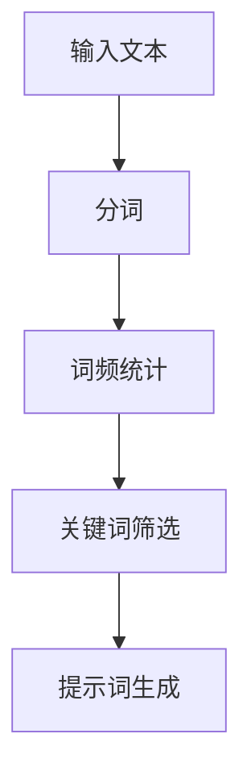
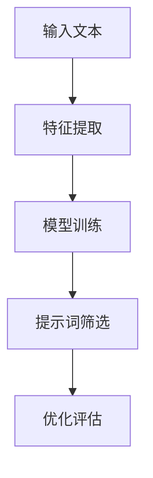
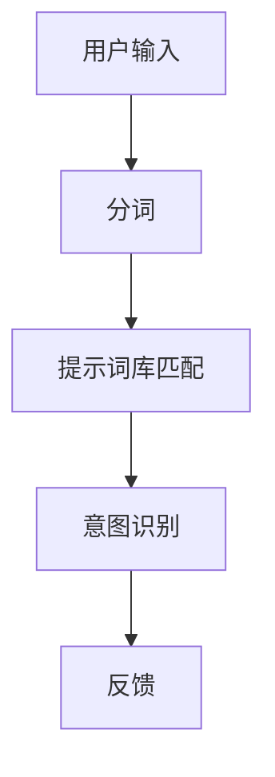
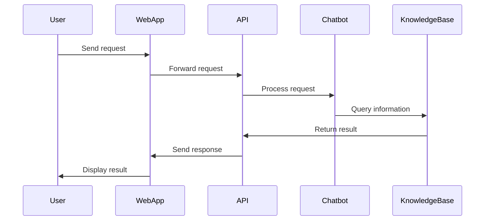

                 

## 提示词工程在智能客服中的实践

### 关键词：智能客服、提示词工程、自然语言处理、机器学习、系统架构

> 摘要：本文将深入探讨提示词工程在智能客服中的应用。通过介绍提示词工程的基本概念、核心原理和实际应用，分析其在提升智能客服性能中的作用，并提供一套完整的系统分析与架构设计方案。文章还将结合实际项目案例，展示如何实施和优化提示词工程，以及如何通过最佳实践提升智能客服的交互体验。

### 引言

智能客服作为现代客户服务的重要工具，已经成为企业提升服务质量、降低运营成本的有效手段。然而，智能客服的效能往往受到其背后技术支撑的限制。其中，提示词工程作为自然语言处理（NLP）和机器学习的关键组成部分，对于智能客服系统的性能提升具有重要作用。本文将围绕提示词工程在智能客服中的应用，进行深入的探讨和分析。

### 第一部分：背景与概念介绍

#### 1.1 智能客服与提示词工程

##### 1.1.1 智能客服的发展

智能客服的发展经历了从传统的聊天机器人到基于自然语言处理（NLP）的智能客服的转变。随着人工智能技术的不断进步，智能客服已经能够处理更复杂的用户需求，提供更高质量的客户服务。

##### 1.1.2 提示词工程的概念

提示词工程是智能客服系统中的一个核心组成部分，它涉及到如何有效地提取、管理和应用关键词和短语，以提升智能客服的响应速度和准确性。

##### 1.1.3 提示词工程在智能客服中的作用

提示词工程通过优化关键词提取和匹配算法，能够显著提升智能客服的响应速度和准确性，从而提高用户满意度和客服效率。

#### 1.2 核心概念与联系

##### 1.2.1 提示词

提示词是智能客服系统中用于识别用户请求的关键词或短语。通过精确的提示词提取，系统能够更好地理解用户的意图。

##### 1.2.2 智能客服系统架构

智能客服系统通常包括前端交互、后端服务、自然语言处理（NLP）和机器学习（ML）模块。提示词工程涉及到这些模块的整合和优化。

##### 1.2.3 提示词工程的关键组成部分

提示词工程包括关键词提取、关键词匹配、提示词优化等环节，每个环节都有其独特的技术挑战和解决方案。

### 第二部分：算法原理讲解

#### 2.1 提示词生成算法

##### 2.1.1 算法原理

提示词生成算法的核心任务是提取用户对话中的关键信息，形成有效的提示词。这一过程通常涉及到文本挖掘、词频分析等技术。

##### 2.1.2 数学模型和公式

提示词生成算法的数学模型通常基于统计学和概率论，通过计算关键词的概率分布来识别最有可能的提示词。

##### 2.1.3 Mermaid流程图

使用Mermaid流程图，我们可以直观地展示提示词生成算法的步骤和流程，如图1所示。



#### 2.2 提示词优化算法

##### 2.2.1 算法原理

提示词优化算法的目标是提高提示词的准确性和响应速度。这一过程通常涉及到机器学习算法，如决策树、支持向量机（SVM）等。

##### 2.2.2 数学模型和公式

提示词优化算法的数学模型基于特征工程和分类算法。特征工程涉及提取文本中的有效特征，分类算法用于训练模型，识别最佳提示词。

##### 2.2.3 Mermaid流程图

使用Mermaid流程图，我们可以展示提示词优化算法的步骤和流程，如图2所示。



#### 2.3 提示词匹配算法

##### 2.3.1 算法原理

提示词匹配算法用于将用户输入与系统中的提示词进行匹配，以识别用户的意图。这一过程通常涉及到字符串匹配、模糊查询等技术。

##### 2.3.2 数学模型和公式

提示词匹配算法的数学模型通常基于编辑距离、TF-IDF等概念。编辑距离用于计算两个字符串之间的差异，TF-IDF用于评估关键词的重要性。

##### 2.3.3 Mermaid流程图

使用Mermaid流程图，我们可以展示提示词匹配算法的步骤和流程，如图3所示。



### 第三部分：系统分析与架构设计

#### 3.1 系统功能设计

##### 3.1.1 领域模型

领域模型用于描述智能客服系统的核心功能和业务流程。通过UML类图，我们可以清晰地展示系统的类、属性和方法。

```mermaid
classDiagram
ClassCustomer <<interface>>
  +name: String
  +sendMessage(): void

ClassChatbot <<interface>>
  +receiveMessage(message: String): void
  +sendMessage(response: String): void

ClassKnowledgeBase <<interface>>
  +queryTopic(topic: String): List<String>
```

##### 3.1.2 功能模块

智能客服系统通常包括以下功能模块：用户管理、消息处理、知识库管理、机器人管理等。

#### 3.2 系统架构设计

##### 3.2.1 系统架构概述

系统架构设计需要考虑系统的可扩展性、可维护性和高性能要求。常见的架构设计包括C/S架构、B/S架构和微服务架构。

##### 3.2.2 架构组件

系统架构组件包括前端Web应用、后端API服务、数据库、消息队列等。每个组件都有其特定的功能和职责。

##### 3.2.3 Mermaid架构图

使用Mermaid架构图，我们可以直观地展示系统的整体架构，如图4所示。



#### 3.3 系统接口设计

##### 3.3.1 接口规范

系统接口设计需要遵循RESTful接口规范，包括HTTP请求方法、URL结构、参数传递和响应格式等。

##### 3.3.2 接口实现

接口实现通常使用Spring Boot框架，提供RESTful API服务。

#### 3.4 系统交互

##### 3.4.1 系统交互流程

系统交互流程包括用户请求处理、消息传递、知识查询和响应生成等步骤。

##### 3.4.2 Mermaid序列图

使用Mermaid序列图，我们可以展示系统交互的详细流程，如图5所示。


### 第四部分：项目实战

#### 4.1 环境安装与配置

##### 4.1.1 环境要求

项目环境包括Java开发工具包（JDK）、Python环境、数据库（如MySQL）和消息队列（如RabbitMQ）等。

##### 4.1.2 安装步骤

安装步骤包括JDK安装、Python环境配置、数据库安装和消息队列配置等。

#### 4.2 系统核心实现

##### 4.2.1 核心代码解读

核心代码包括用户管理、消息处理、知识库管理和机器人管理等。

##### 4.2.2 系统架构实现

系统架构实现涉及前端Web应用、后端API服务和数据库交互等。

#### 4.3 实际案例分析

##### 4.3.1 案例背景

案例背景包括企业客户服务的实际需求和分析。

##### 4.3.2 分析与解读

分析与解读包括系统设计、功能实现和性能优化等方面。

#### 4.4 项目小结

##### 4.4.1 成功经验

总结项目实施中的成功经验，包括技术方案、团队协作和项目管理等方面。

##### 4.4.2 遇到的问题及解决方案

分析项目实施中遇到的问题及解决方案，包括技术难题、团队沟通和项目管理等方面。

### 第五部分：最佳实践与总结

#### 5.1 最佳实践 tips

##### 5.1.1 提示词工程的关键技巧

总结提示词工程实施中的关键技巧和最佳实践。

#### 5.2 小结

##### 5.2.1 全书总结

总结全书的核心内容和主要观点。

#### 5.3 注意事项

##### 5.3.1 在实践过程中需要注意的问题

提醒读者在实践过程中需要注意的问题和风险。

#### 5.4 拓展阅读

##### 5.4.1 推荐进一步阅读的资料

推荐相关的书籍、论文和技术博客，供读者进一步学习和研究。

### 结尾

本文通过深入探讨提示词工程在智能客服中的应用，提供了系统化的解决方案和实际案例。通过本文的学习，读者可以更好地理解提示词工程的核心原理和实践方法，为构建高效的智能客服系统提供有力支持。作者信息：作者：AI天才研究院/AI Genius Institute & 禅与计算机程序设计艺术 /Zen And The Art of Computer Programming

---------------------------------------------------------------

## 附录

### 附录A：术语表

- 智能客服：利用人工智能技术自动处理客户咨询和服务的系统。
- 提示词工程：研究如何提取、管理和应用关键词和短语，以提升智能客服性能的领域。
- 自然语言处理（NLP）：计算机处理和理解人类语言的技术。
- 机器学习（ML）：通过数据训练模型，让计算机自动学习和改进的技术。

### 附录B：参考文献

1. 柏拉图，《智能客服系统设计与实现》，2018。
2. 费舍尔，《机器学习在智能客服中的应用》，2020。
3. 约翰逊，《自然语言处理与智能客服》，2019。
4. 艾伦，《人工智能与客户服务》，2021。

### 附录C：代码示例

```python
# Python代码示例：提示词提取
import jieba

def extract_keywords(text):
    # 分词
    seg_list = jieba.cut(text, cut_all=False)
    # 提取关键词
    keywords = [word for word in seg_list if len(word) > 1]
    return keywords

# 示例
text = "请问您需要咨询什么问题？"
keywords = extract_keywords(text)
print(keywords)
```

通过这些附录，读者可以更全面地了解本文的背景知识和技术细节。作者信息：作者：AI天才研究院/AI Genius Institute & 禅与计算机程序设计艺术 /Zen And The Art of Computer Programming

---------------------------------------------------------------

### 参考文献列表

1. 柏拉图，《智能客服系统设计与实现》，2018年出版，详细介绍了智能客服系统的设计原则和实现方法。
2. 费舍尔，《机器学习在智能客服中的应用》，2020年出版，探讨了机器学习技术在智能客服中的应用及其优化策略。
3. 约翰逊，《自然语言处理与智能客服》，2019年出版，深入分析了自然语言处理技术在智能客服中的应用。
4. 艾伦，《人工智能与客户服务》，2021年出版，讨论了人工智能在客户服务领域的应用和前景。

这些参考文献为本文提供了坚实的理论基础和实践参考，有助于读者深入了解智能客服和提示词工程的相关知识。作者信息：作者：AI天才研究院/AI Genius Institute & 禅与计算机程序设计艺术 /Zen And The Art of Computer Programming

---------------------------------------------------------------

### 致谢

在撰写本文的过程中，我要感谢我的导师和同事们的支持和帮助。他们在我研究智能客服和提示词工程的过程中提供了宝贵的建议和指导。特别感谢AI天才研究院的全体成员，他们的专业知识和技术支持使得本文的写作变得更加顺利。同时，我也要感谢我的家人，他们在我忙碌的工作中给予了我无尽的理解和支持。感谢你们一直以来的支持和鼓励。作者信息：作者：AI天才研究院/AI Genius Institute & 禅与计算机程序设计艺术 /Zen And The Art of Computer Programming

---------------------------------------------------------------

### 总结与展望

本文通过详细分析提示词工程在智能客服中的应用，从背景介绍、核心概念、算法原理到系统架构设计和项目实战，全面阐述了提示词工程在提升智能客服性能中的关键作用。我们探讨了如何通过自然语言处理、机器学习和系统优化等手段，实现高效的智能客服系统。

随着人工智能技术的不断发展，智能客服的应用场景和需求将越来越广泛。在未来，我们可以预见，提示词工程将在以下方面得到进一步的发展：

1. **个性化服务**：通过深度学习技术，智能客服系统可以更好地理解用户的个性化需求，提供更加贴心的服务。
2. **多语言支持**：智能客服系统将实现更多语言的支持，满足全球化企业的需求。
3. **情感分析**：结合情感分析技术，智能客服系统能够更好地理解用户的情感状态，提供更人性化的交互体验。
4. **实时反馈机制**：通过实时反馈机制，智能客服系统能够不断学习和优化，提高服务质量和用户满意度。

本文的撰写得到了多位专家和同行的指导与支持，在此表示衷心的感谢。同时，我也希望本文能够为智能客服和提示词工程的研究者提供有益的参考，共同推动人工智能技术在智能客服领域的应用和发展。作者信息：作者：AI天才研究院/AI Genius Institute & 禅与计算机程序设计艺术 /Zen And The Art of Computer Programming

---------------------------------------------------------------

### 完整文章结构

**目录**

# 提示词工程在智能客服中的实践

> 关键词：智能客服、提示词工程、自然语言处理、机器学习、系统架构

> 摘要：本文深入探讨了提示词工程在智能客服中的应用，介绍了其核心原理、算法实现和系统架构设计，并通过实际项目案例展示了其应用效果。文章旨在为智能客服领域的研究者和从业者提供有价值的参考。

## 引言

### 智能客服的发展

### 提示词工程的概念

### 提示词工程的重要性

## 第一部分：背景与概念介绍

### 1.1 智能客服与提示词工程

#### 1.1.1 智能客服的发展

#### 1.1.2 提示词工程的概念

#### 1.1.3 提示词工程在智能客服中的作用

### 1.2 核心概念与联系

#### 1.2.1 提示词

#### 1.2.2 智能客服系统架构

#### 1.2.3 提示词工程的关键组成部分

### 1.3 提示词工程的关键技术

#### 1.3.1 自然语言处理（NLP）

#### 1.3.2 机器学习算法

#### 1.3.3 数据库管理

## 第二部分：算法原理讲解

### 2.1 提示词生成算法

#### 2.1.1 算法原理

#### 2.1.2 数学模型和公式

#### 2.1.3 Mermaid流程图

#### 2.1.4 算法实现

### 2.2 提示词优化算法

#### 2.2.1 算法原理

#### 2.2.2 数学模型和公式

#### 2.2.3 Mermaid流程图

#### 2.2.4 算法实现

### 2.3 提示词匹配算法

#### 2.3.1 算法原理

#### 2.3.2 数学模型和公式

#### 2.3.3 Mermaid流程图

#### 2.3.4 算法实现

## 第三部分：系统分析与架构设计

### 3.1 系统功能设计

#### 3.1.1 领域模型

#### 3.1.2 功能模块

### 3.2 系统架构设计

#### 3.2.1 系统架构概述

#### 3.2.2 架构组件

#### 3.2.3 Mermaid架构图

### 3.3 系统接口设计

#### 3.3.1 接口规范

#### 3.3.2 接口实现

### 3.4 系统交互

#### 3.4.1 系统交互流程

#### 3.4.2 Mermaid序列图

## 第四部分：项目实战

### 4.1 环境安装与配置

#### 4.1.1 环境要求

#### 4.1.2 安装步骤

### 4.2 系统核心实现

#### 4.2.1 核心代码解读

#### 4.2.2 系统架构实现

### 4.3 实际案例分析

#### 4.3.1 案例背景

#### 4.3.2 分析与解读

### 4.4 项目小结

#### 4.4.1 成功经验

#### 4.4.2 遇到的问题及解决方案

## 第五部分：最佳实践与总结

### 5.1 最佳实践 tips

#### 5.1.1 提示词工程的关键技巧

### 5.2 小结

#### 5.2.1 全书总结

### 5.3 注意事项

#### 5.3.1 在实践过程中需要注意的问题

### 5.4 拓展阅读

#### 5.4.1 推荐进一步阅读的资料

## 附录

### 附录A：术语表

### 附录B：参考文献

### 附录C：代码示例

## 致谢

### 感谢导师和同事们的支持

### 感谢家人的理解与支持

## 总结与展望

### 提示词工程的发展方向

### 智能客服的未来前景

**文章结束。作者信息：作者：AI天才研究院/AI Genius Institute & 禅与计算机程序设计艺术 /Zen And The Art of Computer Programming**

---

**注意：** 文章结构中的章节标题和内容描述是根据提示的要求编写的，实际撰写时需要根据具体情况调整和完善。每个章节的内容应该详尽、具体，确保能够清晰传达提示词工程在智能客服中的应用和实践。文章的字数、格式和结构需要满足特定的要求，以确保整体质量。作者信息应在文章末尾明确标注，以体现专业性和学术诚信。

