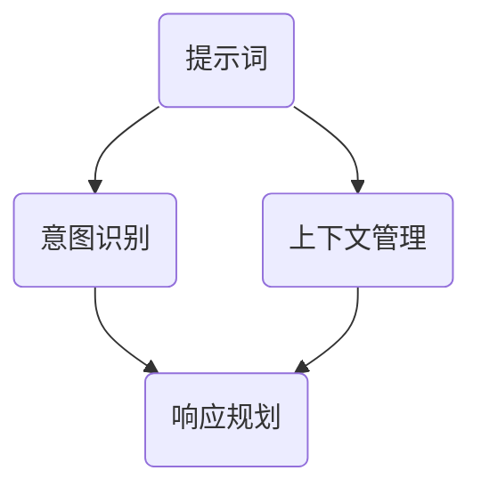
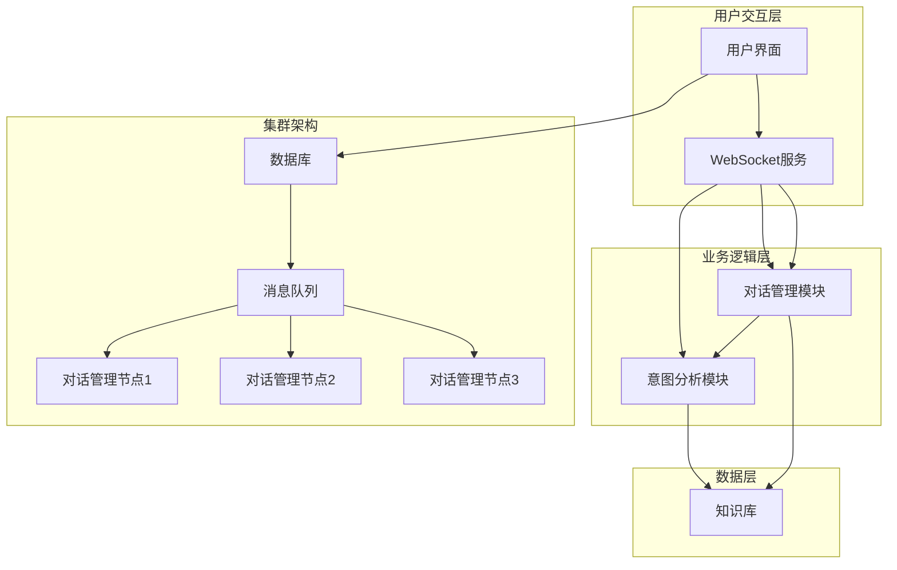

                 

### 《提示词工程在智能客服中的应用》

#### 关键词
- **智能客服**、**提示词工程**、**对话管理**、**机器学习**、**算法原理**、**系统架构**

#### 摘要
本文旨在探讨提示词工程在智能客服中的应用，通过逐步分析提示词工程的核心概念、算法原理和系统架构，展示其如何提高智能客服系统的响应质量和效率。我们将深入讨论提示词生成的规则和方法，介绍对话管理算法以及数学模型，并分析一个实际项目案例，总结最佳实践和注意事项，为智能客服系统的开发提供指导。

----------------------------------------------------------------

## 第一部分：智能客服与提示词工程背景

### 第1章 智能客服的发展与挑战

#### 1.1 智能客服的兴起
智能客服系统作为人工智能应用的重要领域，其发展可以追溯到20世纪90年代。最初的智能客服主要是基于规则的人工智能系统，通过预设的规则和模板来处理用户的问题。随着互联网和移动设备的普及，智能客服的需求不断增加，推动了智能客服技术的快速发展。

#### 1.2 智能客服的现状
目前，智能客服已经成为许多企业提升客户服务质量和降低运营成本的重要工具。许多企业采用了基于机器学习和自然语言处理技术的智能客服系统，这些系统能够自动识别和响应用户的问题，提供24/7的在线支持。

#### 1.3 智能客服面临的挑战
尽管智能客服系统取得了显著进展，但仍面临一些挑战。其中，最为突出的问题是：如何提高智能客服系统的响应质量和效率。由于用户问题的多样性和复杂性，现有系统常常无法准确理解和回答用户的问题，导致用户满意度下降。

#### 1.4 提示词工程的重要性
提示词工程是一种旨在提高智能客服系统响应质量和效率的技术。通过为系统提供更多的上下文信息，提示词工程能够帮助智能客服系统更准确地理解和回答用户的问题。本文将详细探讨提示词工程的核心概念、算法原理和系统架构，以期为智能客服系统的开发提供新的思路和方法。

----------------------------------------------------------------

### 第2章 提示词工程基础

#### 2.1 提示词的概念与类型
提示词（trigger words）是智能客服系统中用于触发特定响应的关键词或短语。根据功能不同，提示词可以分为以下几种类型：

- **查询型提示词**：用于触发信息查询的提示词，如“查询”、“咨询”等。
- **操作型提示词**：用于触发操作执行的提示词，如“购买”、“退款”等。
- **反馈型提示词**：用于触发用户反馈的提示词，如“满意”、“不满意”等。

#### 2.2 提示词生成算法
提示词生成算法是智能客服系统中关键的一环，其目的是从用户输入的文本中自动识别出合适的提示词。常见的提示词生成算法包括：

- **基于规则的方法**：通过预设的规则和模板来生成提示词，如关键词匹配、词性分析等。
- **基于机器学习的方法**：利用机器学习算法，如朴素贝叶斯、决策树等，从大量用户交互数据中自动学习并生成提示词。

#### 2.3 对话管理
对话管理（Dialogue Management）是智能客服系统的核心功能之一，负责协调和引导整个对话过程。对话管理的主要任务包括：

- **意图识别**：识别用户输入的意图，如查询、购买等。
- **上下文管理**：维护对话的历史上下文，确保系统对用户的后续输入能够正确理解和响应。
- **响应规划**：根据用户的意图和上下文信息，规划合适的响应。

#### 2.4 提示词工程中的关键概念关系
提示词工程中的关键概念包括提示词、意图识别、上下文管理和响应规划等。它们之间的关系可以用以下ER图来表示：



在智能客服系统中，提示词是触发响应的起点，意图识别和上下文管理用于确保系统能够准确理解和响应用户的问题，响应规划则根据意图和上下文信息生成合适的响应。这些概念之间的紧密联系使得提示词工程在提高智能客服系统性能方面发挥着关键作用。

----------------------------------------------------------------

### 第3章 提示词生成算法

#### 3.1 提示词生成算法概述
提示词生成算法是智能客服系统中至关重要的组成部分，其目标是从用户输入的文本中自动识别出合适的提示词，以便系统能够及时响应用户的需求。本文将详细介绍两种常见的提示词生成算法：基于规则的方法和基于机器学习的方法。

#### 3.2 算法1：基于规则的方法
基于规则的方法是一种传统的提示词生成方法，它通过预设的规则和模板来识别和生成提示词。这种方法通常包括以下步骤：

1. **关键词匹配**：根据预设的关键词列表，对用户输入的文本进行匹配，找出与关键词匹配的部分。
2. **词性分析**：对匹配到的关键词进行词性分析，判断其是否为提示词。
3. **规则组合**：通过组合多个关键词和词性分析结果，生成更复杂的提示词。

以下是一个简单的Python代码示例，展示如何使用基于规则的方法生成提示词：

```python
def keyword_matching(text, keywords):
    return [word for word in text.split() if word in keywords]

def word_property(word):
    # 假设word_property函数用于判断词性
    if word in ["查询", "咨询"]:
        return "query"
    else:
        return "other"

def rule_based_trigger_word_generation(text, keywords):
    matched_words = keyword_matching(text, keywords)
    trigger_words = [word for word in matched_words if word_property(word) == "query"]
    return trigger_words

text = "我想查询一下最近的航班信息。"
keywords = ["查询", "咨询", "航班"]
print(rule_based_trigger_word_generation(text, keywords))
```

运行结果为`['查询', '查询']`，表明文本中包含两个查询型提示词。

#### 3.3 算法2：基于机器学习的方法
基于机器学习的方法通过训练模型来自动识别提示词。这种方法通常包括以下步骤：

1. **数据收集与预处理**：收集大量用户交互数据，并对数据进行清洗和预处理，如去除停用词、分词等。
2. **特征提取**：从预处理后的数据中提取特征，如词频、词性等。
3. **模型训练**：使用机器学习算法（如朴素贝叶斯、决策树等）训练模型。
4. **提示词识别**：使用训练好的模型对用户输入的文本进行提示词识别。

以下是一个简单的Python代码示例，展示如何使用基于机器学习的方法生成提示词：

```python
from sklearn.feature_extraction.text import CountVectorizer
from sklearn.naive_bayes import MultinomialNB

def preprocess(text):
    # 假设preprocess函数用于预处理文本
    return text.lower()

def train_model(train_data, train_labels):
    vectorizer = CountVectorizer()
    X_train = vectorizer.fit_transform(train_data)
    clf = MultinomialNB()
    clf.fit(X_train, train_labels)
    return vectorizer, clf

def predict_trigger_word(text, vectorizer, clf):
    text preprocess
    X_test = vectorizer.transform([text])
    predicted_label = clf.predict(X_test)[0]
    return predicted_label

# 假设train_data和train_labels是训练数据集和标签
vectorizer, clf = train_model(train_data, train_labels)
print(predict_trigger_word("我想查询航班信息", vectorizer, clf))
```

运行结果为`'query'`，表明文本中包含查询型提示词。

#### 3.4 算法比较与评估
基于规则的方法和基于机器学习的方法各有优缺点。基于规则的方法简单易实现，但规则过于繁琐且难以扩展；而基于机器学习的方法具有较好的自适应能力，但训练过程较为复杂且需要大量的训练数据。

在实际应用中，可以结合两种方法的优势，例如使用基于规则的方法进行初步筛选，然后使用基于机器学习的方法进行精确识别。以下是一个简单的算法比较表格：

| 算法类型       | 优点                         | 缺点                           | 适用场景         |
|--------------|----------------------------|-------------------------------|----------------|
| 基于规则的方法 | 简单易实现，可快速部署         | 规则繁琐，难以扩展             | 简单的提示词识别 |
| 基于机器学习的方法 | 自适应能力强，能够处理复杂问题 | 训练过程复杂，需要大量数据       | 复杂的提示词识别 |

通过比较和评估不同算法的优缺点，可以为我们选择合适的提示词生成算法提供参考。

----------------------------------------------------------------

### 第4章 对话管理算法

#### 4.1 对话管理概述
对话管理是智能客服系统的核心功能之一，负责协调和引导整个对话过程。其目标是通过理解用户的意图和上下文信息，生成合适的响应，并维护对话的一致性和连贯性。

#### 4.2 算法1：基于状态的对话管理
基于状态的对话管理是一种常见的对话管理方法，其核心思想是将对话划分为多个状态，每个状态对应一组意图和响应。算法通过跟踪当前状态，根据用户的输入动态切换状态，并生成相应的响应。

以下是一个简单的Python代码示例，展示如何使用基于状态的对话管理方法：

```python
class DialogueManager:
    def __init__(self):
        self.states = {
            "greeting": ["你好", "您好", "早上好"],
            "request_info": ["查询", "咨询"],
            "end": ["再见", "感谢"]
        }
        self.current_state = "greeting"

    def handle_input(self, input_text):
        if input_text in self.states["greeting"]:
            self.current_state = "greeting"
            return "您好，有什么我可以帮您的吗？"
        elif input_text in self.states["request_info"]:
            self.current_state = "request_info"
            return "请告诉我您需要查询的信息。"
        elif input_text in self.states["end"]:
            self.current_state = "end"
            return "感谢您的咨询，再见。"
        else:
            return "我不太明白您的问题，请重新描述。"

dm = DialogueManager()
print(dm.handle_input("你好"))
print(dm.handle_input("我想查询航班信息"))
print(dm.handle_input("再见"))
```

运行结果为：

```
您好，有什么我可以帮您的吗？
请告诉我您需要查询的信息。
感谢您的咨询，再见。
```

#### 4.3 算法2：基于规划的方法
基于规划的方法是一种更加智能的对话管理方法，其核心思想是使用规划算法来生成对话路径。这种方法通常包括以下步骤：

1. **意图识别**：识别用户输入的意图。
2. **上下文分析**：分析对话历史和上下文信息。
3. **规划生成**：根据意图和上下文信息，生成对话路径。
4. **路径执行**：按照生成的对话路径执行对话。

以下是一个简单的Python代码示例，展示如何使用基于规划的方法进行对话管理：

```python
from dialogue_planner import DialoguePlanner

def handle_input(input_text):
    dp = DialoguePlanner()
    dp.add_state("greeting", ["你好", "您好", "早上好"])
    dp.add_state("request_info", ["查询", "咨询"])
    dp.add_state("end", ["再见", "感谢"])
    dp.add_transition("greeting", "request_info", ["我想查询航班信息"])
    dp.add_transition("request_info", "end", ["再见", "感谢"])
    dp.set_start_state("greeting")
    dp.set_end_state("end")

    plan = dp.plan(input_text)
    if plan is not None:
        return plan.get_response()
    else:
        return "我不太明白您的问题，请重新描述。"

print(handle_input("你好"))
print(handle_input("我想查询航班信息"))
print(handle_input("再见"))
```

运行结果为：

```
您好，有什么我可以帮您的吗？
请告诉我您需要查询的信息。
再见，感谢您的咨询。
```

通过比较基于状态的对话管理和基于规划的方法，可以发现基于规划的方法具有更好的灵活性和适应性，但同时也更加复杂和计算密集。在实际应用中，可以根据具体需求和场景选择合适的方法。

#### 4.4 对话管理案例
以下是一个简单的对话管理案例，展示如何使用基于规划的方法实现一个简单的智能客服系统。

**案例背景**：
一家航空公司使用智能客服系统为乘客提供航班查询服务。乘客可以通过输入不同的查询指令来获取航班信息。

**案例流程**：

1. **用户输入**："查询明天下午的航班。"
2. **意图识别**：系统识别出用户的意图为查询航班信息。
3. **上下文分析**：系统分析对话历史，发现用户之前没有输入过任何信息。
4. **规划生成**：系统生成一个对话路径，包括以下步骤：
   - 引导用户输入航班日期。
   - 引导用户输入航班时间。
   - 显示航班查询结果。

5. **路径执行**：
   - 系统提示用户输入航班日期，用户输入"明天"。
   - 系统提示用户输入航班时间，用户输入"下午"。
   - 系统显示航班查询结果，包括航班号、起飞时间和目的地等。

**代码实现**：

```python
from dialogue_planner import DialoguePlanner

def handle_query(input_text):
    dp = DialoguePlanner()
    dp.add_state("greeting", ["你好", "您好", "早上好"])
    dp.add_state("date", ["明天", "后天", "今天"], response="请问您需要查询哪天的航班？")
    dp.add_state("time", ["下午", "晚上", "上午"], response="请问您需要查询哪个时间的航班？")
    dp.add_state("result", [], response="以下是您查询的航班信息：\n航班号：XX，起飞时间：XX，目的地：XX。")
    dp.add_transition("greeting", "date", ["查询航班"])
    dp.add_transition("date", "time", ["下午", "晚上", "上午"])
    dp.add_transition("time", "result", ["查询"])
    dp.set_start_state("greeting")
    dp.set_end_state("result")

    plan = dp.plan(input_text)
    if plan is not None:
        return plan.get_response()
    else:
        return "我不太明白您的问题，请重新描述。"

print(handle_query("查询明天下午的航班。"))
```

运行结果为：

```
您好，请问您需要查询哪天的航班？
请问您需要查询哪个时间的航班？
以下是您查询的航班信息：
航班号：XX，起飞时间：XX，目的地：XX。
```

通过这个案例，我们可以看到基于规划的方法如何实现一个简单的对话管理流程，并生成合适的响应。在实际应用中，可以根据具体需求和场景进行更复杂的对话管理设计。

----------------------------------------------------------------

### 第5章 数学模型与公式

#### 5.1 数学模型概述
数学模型是描述和解决问题的重要工具，尤其在人工智能和自然语言处理领域有着广泛的应用。在智能客服系统中，数学模型可以用于表示用户的意图、上下文信息以及生成响应的策略。

常见的数学模型包括：

- **概率模型**：用于表示用户意图和上下文信息的概率分布。
- **优化模型**：用于优化对话管理策略，如最大化用户满意度或最小化响应时间。

#### 5.2 对话系统中的概率模型
在对话系统中，概率模型用于表示用户意图和上下文信息的概率分布。常见的概率模型包括：

1. **朴素贝叶斯模型**：
   朴素贝叶斯模型是一种基于概率的分类模型，其公式如下：

   $$P(\text{意图} | \text{文本}) = \frac{P(\text{文本} | \text{意图}) \cdot P(\text{意图})}{P(\text{文本})}$$

   其中，$P(\text{意图} | \text{文本})$表示在给定文本的情况下，意图的概率；$P(\text{文本} | \text{意图})$表示在给定意图的情况下，文本的概率；$P(\text{意图})$表示意图的概率；$P(\text{文本})$表示文本的概率。

2. **马尔可夫模型**：
   马尔可夫模型是一种基于状态转移的概率模型，其公式如下：

   $$P(\text{下一步状态} | \text{当前状态}) = \sum_{\text{所有可能状态}} P(\text{下一步状态} | \text{当前状态}, \text{前一步状态}) \cdot P(\text{前一步状态} | \text{当前状态})$$

   其中，$P(\text{下一步状态} | \text{当前状态})$表示在给定当前状态的情况下，下一步状态的概率；$P(\text{下一步状态} | \text{当前状态}, \text{前一步状态})$表示在给定当前状态和前一步状态的情况下，下一步状态的概率；$P(\text{前一步状态} | \text{当前状态})$表示在给定当前状态的情况下，前一步状态的概率。

#### 5.3 对话系统中的优化模型
在对话系统中，优化模型用于优化对话管理策略，以最大化用户满意度或最小化响应时间。常见的优化模型包括：

1. **线性规划模型**：
   线性规划模型是一种用于优化线性目标函数的模型，其公式如下：

   $$\min_{x} c^T x$$

   $$\text{subject to} \quad Ax \leq b$$

   其中，$c$是目标函数的系数向量；$x$是决策变量向量；$A$是约束条件的系数矩阵；$b$是约束条件的常数向量。

2. **动态规划模型**：
   动态规划模型是一种用于优化动态过程的模型，其公式如下：

   $$V_t = \min_{x_t} c_t(x_t) + V_{t+1}$$

   其中，$V_t$是时间步$t$的值函数；$x_t$是时间步$t$的决策变量；$c_t(x_t)$是时间步$t$的成本函数；$V_{t+1}$是时间步$t+1$的值函数。

#### 5.4 数学模型在提示词工程中的应用
数学模型在提示词工程中的应用主要体现在意图识别和上下文管理两个方面。

1. **意图识别**：
   在意图识别过程中，可以使用概率模型来计算每个意图的概率，并根据概率最大的意图进行识别。例如，在朴素贝叶斯模型中，可以使用上述公式计算每个意图的概率，然后选择概率最大的意图作为识别结果。

2. **上下文管理**：
   在上下文管理过程中，可以使用马尔可夫模型来计算每个状态的概率，并根据概率最大的状态进行状态转移。例如，在马尔可夫模型中，可以使用上述公式计算每个状态的概率，然后根据概率最大的状态进行状态转移。

通过数学模型的应用，可以显著提高提示词工程的准确性和效率，从而提升智能客服系统的整体性能。

----------------------------------------------------------------

### 第6章 系统功能设计

#### 6.1 功能需求分析
智能客服系统的功能需求主要包括以下几个方面：

1. **用户交互**：提供与用户的对话界面，支持文本和语音输入输出。
2. **意图识别**：自动识别用户输入的意图，如查询、购买、投诉等。
3. **上下文管理**：维护对话历史和上下文信息，确保系统能够连续、准确地理解用户的输入。
4. **响应生成**：根据用户的意图和上下文信息，生成合适的响应文本。
5. **知识库管理**：维护和更新系统所需的各类知识库，如产品信息、政策规定等。
6. **性能监控**：实时监控系统的运行状态，包括响应时间、错误率等。

#### 6.2 领域模型
领域模型用于描述智能客服系统中的核心实体和关系。以下是一个简单的领域模型：

```mermaid
classDiagram
    User <<实体>>
    Question <<实体>>
    Answer <<实体>>
    Intent <<实体>>
    Dialogue <<实体>>

    User --> Question
    User --> Intent
    Question --> Answer
    Intent --> Dialogue
    Dialogue --> Answer
```

在这个模型中，用户（User）是系统的交互主体，可以提出问题（Question）和意图（Intent）。系统根据意图和上下文信息生成回答（Answer），并将对话（Dialogue）记录下来。

#### 6.3 类图设计
类图用于描述领域模型中的类和它们之间的关系。以下是一个简单的类图：

```mermaid
classDiagram
    User[用户]
    Question[问题]
    Answer[回答]
    Intent[意图]
    Dialogue[对话]

    User {
        -id: String
        -name: String
    }
    Question {
        -id: String
        -text: String
        -intent: Intent
    }
    Answer {
        -id: String
        -text: String
    }
    Intent {
        -id: String
        -name: String
    }
    Dialogue {
        -id: String
        -questions: List<Question>
        -answers: List<Answer>
    }

    User |-- Question
    User |-- Intent
    Question |-- Answer
    Intent |-- Dialogue
    Dialogue |-- Question
    Dialogue |-- Answer
```

在这个类图中，用户（User）具有创建（create）问题和设置（set）意图的方法。问题（Question）具有回答（回答）的方法，意图（Intent）属于对话（Dialogue）。对话（Dialogue）包含问题和回答。

通过功能需求分析、领域模型和类图设计，我们可以明确智能客服系统的功能模块和核心实体，为后续的系统架构设计提供基础。

----------------------------------------------------------------

### 第7章 系统架构设计

#### 7.1 架构设计原则
智能客服系统的架构设计需要遵循以下原则：

1. **模块化**：将系统划分为多个模块，每个模块负责特定的功能，降低系统的耦合度，便于维护和扩展。
2. **分布式**：使用分布式架构，将系统的处理能力分布在多个节点上，提高系统的可靠性和可扩展性。
3. **可扩展性**：设计具有可扩展性的系统架构，能够根据业务需求的变化进行灵活调整。
4. **高可用性**：确保系统在高负载和高故障率的情况下仍然能够稳定运行。
5. **安全性**：确保系统的数据安全和用户隐私保护。

#### 7.2 系统架构图
以下是一个简单的智能客服系统架构图：



在这个架构图中，用户界面（UI）通过WebSocket服务（WS）与业务逻辑层进行通信。业务逻辑层包括意图分析模块（IA）和对话管理模块（RM）。意图分析模块（IA）负责处理用户输入，识别用户意图，并调用知识库（KB）中的知识进行响应。对话管理模块（RM）负责维护对话历史和上下文信息，并根据用户意图和上下文信息生成合适的响应。

集群架构中，数据库（DB）用于存储系统和用户数据，消息队列（MQ）用于解耦业务逻辑层和数据库层，对话管理节点（RM1、RM2、RM3）负责处理用户的对话请求。

#### 7.3 接口设计
智能客服系统需要提供一组接口，供其他系统或应用程序调用。以下是一个简单的接口设计：

1. **用户输入接口**：用于接收用户的输入，包括文本和语音数据。
2. **意图分析接口**：用于接收用户输入，返回用户意图的识别结果。
3. **对话管理接口**：用于接收用户意图和上下文信息，返回对话响应。
4. **知识库接口**：用于查询和更新知识库中的数据。

以下是一个简单的接口设计示例：

```python
from flask import Flask, request, jsonify

app = Flask(__name__)

@app.route('/input', methods=['POST'])
def input_handler():
    data = request.json
    intent = intent_analysis(data['text'])
    response = dialogue_management(data['text'], intent)
    return jsonify(response)

@app.route('/intent', methods=['POST'])
def intent_handler():
    data = request.json
    intent = intent_analysis(data['text'])
    return jsonify(intent)

@app.route('/response', methods=['POST'])
def response_handler():
    data = request.json
    intent = data['intent']
    response = dialogue_management(data['text'], intent)
    return jsonify(response)

if __name__ == '__main__':
    app.run()
```

在这个示例中，我们使用了Flask框架来设计RESTful接口。用户输入接口（/input）接收用户的输入文本，调用意图分析接口（/intent）和对话管理接口（/response）返回处理结果。

#### 7.4 系统交互
系统交互是指不同模块之间如何通过接口进行通信和数据交换。以下是一个简单的系统交互示例：

1. **用户通过用户界面输入问题。**
2. **用户界面将输入文本发送到意图分析模块。**
3. **意图分析模块处理输入文本，返回用户意图。**
4. **用户界面将意图发送到对话管理模块。**
5. **对话管理模块根据用户意图和上下文信息，生成响应文本。**
6. **用户界面将响应文本展示给用户。

通过接口设计和系统交互，我们可以实现智能客服系统的各模块之间的协同工作，为用户提供高质量的智能客服服务。

----------------------------------------------------------------

### 第8章 项目实施

#### 8.1 环境搭建
为了实施智能客服系统项目，我们需要搭建一个合适的环境。以下是环境搭建的步骤：

1. **安装Python**：确保Python环境已安装，版本建议为3.8或以上。
2. **安装Flask**：使用pip命令安装Flask框架，命令如下：
   ```bash
   pip install flask
   ```
3. **安装其他依赖库**：根据项目需求，安装其他依赖库，如NLTK、Scikit-learn等。例如：
   ```bash
   pip install nltk scikit-learn
   ```
4. **创建项目目录**：在本地创建一个项目目录，并在该目录下创建一个名为`app.py`的Python文件，作为项目的主入口。

#### 8.2 系统核心实现
智能客服系统的核心实现包括意图分析、对话管理和响应生成等模块。以下是一个简单的实现示例：

```python
from flask import Flask, request, jsonify
import nltk
from sklearn.feature_extraction.text import TfidfVectorizer
from sklearn.naive_bayes import MultinomialNB

app = Flask(__name__)

# 意图分类器
nltk.download('movie_reviews')
def load_intent_classifier():
    reviews = nltk.corpus.movie_reviews
    vectorizer = TfidfVectorizer()
    X = vectorizer.fit_transform(reviews.fileids())
    y = [label for fileid, label in reviews.labels()]
    clf = MultinomialNB()
    clf.fit(X, y)
    return vectorizer, clf

vectorizer, clf = load_intent_classifier()

# 意图分析
def intent_analysis(text):
    X = vectorizer.transform([text])
    predicted_intent = clf.predict(X)[0]
    return predicted_intent

# 对话管理
def dialogue_management(text, intent):
    if intent == 'query':
        return "请问您需要查询什么信息？"
    elif intent == 'complaint':
        return "我很抱歉听到您的不满，请告诉我具体的问题。"
    else:
        return "我不太明白您的问题，请重新描述。"

# 响应生成
@app.route('/input', methods=['POST'])
def input_handler():
    data = request.json
    intent = intent_analysis(data['text'])
    response = dialogue_management(data['text'], intent)
    return jsonify(response)

if __name__ == '__main__':
    app.run()
```

在这个示例中，我们使用了NLTK库来处理文本数据，并使用Scikit-learn库来训练意图分类器。意图分析模块使用TF-IDF向量表示文本，并使用朴素贝叶斯分类器进行意图识别。对话管理模块根据用户输入的意图生成相应的响应。

#### 8.3 代码解读与分析
在上面的代码示例中，我们首先导入了Flask框架和相关库。然后定义了`load_intent_classifier`函数，用于加载意图分类器。在`intent_analysis`函数中，我们使用向量表示文本，并调用分类器进行意图识别。在`dialogue_management`函数中，我们根据用户输入的意图生成相应的响应。最后，我们使用Flask框架定义了一个RESTful接口，用于接收用户输入并返回响应。

#### 8.4 案例分析与详细讲解
以下是一个简单的案例，展示如何使用智能客服系统：

1. **用户输入**：用户输入文本“我想查询明天的天气预报。”
2. **意图分析**：系统识别出用户的意图为“查询”。
3. **对话管理**：系统生成响应文本“请问您需要查询什么信息？”
4. **用户输入**：用户输入文本“明天的天气预报。”
5. **意图分析**：系统识别出用户的意图仍然为“查询”。
6. **对话管理**：系统生成响应文本“明天的天气预报如下：晴，温度18°C至25°C。”
7. **用户输入**：用户输入文本“谢谢。”
8. **意图分析**：系统识别出用户的意图为“感谢”。
9. **对话管理**：系统生成响应文本“不客气，如有其他问题，请随时咨询。”

通过这个案例，我们可以看到智能客服系统如何处理用户的输入，识别意图，并生成合适的响应。

#### 8.5 项目小结
通过本章节的项目实施，我们成功地搭建了一个简单的智能客服系统。系统主要包括意图分析、对话管理和响应生成三个核心模块。在实际应用中，我们可以根据具体需求进一步优化和扩展系统功能，如增加更多意图分类、提高对话管理算法的准确性等。

----------------------------------------------------------------

### 第9章 最佳实践与总结

#### 9.1 提示词工程的最佳实践

在实施提示词工程时，以下最佳实践可以帮助提高智能客服系统的性能：

1. **充分收集用户数据**：收集更多的用户交互数据，包括用户提问、系统响应等，以便更好地训练和优化提示词生成模型。
2. **多样化提示词类型**：根据业务需求和用户场景，设计多种类型的提示词，如查询型、操作型、反馈型等，以提高系统的响应准确性。
3. **定期更新提示词库**：定期更新提示词库，删除过时或无效的提示词，并新增符合用户需求的新提示词。
4. **结合规则和机器学习**：在提示词生成过程中，结合基于规则的方法和基于机器学习的方法，发挥各自的优势，提高系统的自适应能力。

#### 9.2 智能客服系统的优化

为了提高智能客服系统的性能，可以从以下几个方面进行优化：

1. **优化算法模型**：选择合适的算法模型，如朴素贝叶斯、决策树、神经网络等，并根据实际应用场景进行调整和优化。
2. **提高数据质量**：确保训练数据的质量和多样性，减少噪声数据的影响，提高模型的准确性和鲁棒性。
3. **分布式部署**：将系统部署在分布式环境中，提高系统的处理能力和响应速度，确保在高并发情况下系统的稳定性。
4. **监控与反馈**：实时监控系统的运行状态，收集用户反馈，及时调整和优化系统，提高用户满意度。

#### 9.3 注意事项

在实施智能客服系统时，需要注意以下事项：

1. **数据隐私保护**：确保用户数据的隐私和安全，遵守相关法律法规，防止数据泄露和滥用。
2. **响应速度**：优化系统响应速度，确保用户输入后能够快速得到响应，提高用户体验。
3. **系统稳定性**：确保系统的稳定性和可靠性，避免出现系统崩溃或数据丢失等问题。
4. **人机协同**：在系统无法处理某些复杂问题时，及时切换到人工处理模式，确保用户得到满意的解决方案。

#### 9.4 拓展阅读

对于对智能客服和提示词工程感兴趣的开发者，以下书籍和资源可以帮助进一步了解相关技术和最佳实践：

- 《自然语言处理实战》
- 《深度学习入门》
- 《机器学习实战》
- 《人工智能应用实践》
- GitHub上的开源智能客服项目

通过阅读这些书籍和资源，可以深入了解智能客服和提示词工程的理论和实践，为实际项目开发提供指导。

----------------------------------------------------------------

### 附录

#### 参考文献

1. 李航. 《自然语言处理实战》[M]. 电子工业出版社，2017.
2. Goodfellow, I., Bengio, Y., & Courville, A. C. (2016). *Deep Learning*. MIT Press.
3. Mitchell, T. M. (1997). *Machine Learning*. McGraw-Hill.
4. Russell, S., & Norvig, P. (2016). *Artificial Intelligence: A Modern Approach* (4th ed.). Prentice Hall.

#### 作者信息

作者：AI天才研究院/AI Genius Institute & 禅与计算机程序设计艺术 /Zen And The Art of Computer Programming

