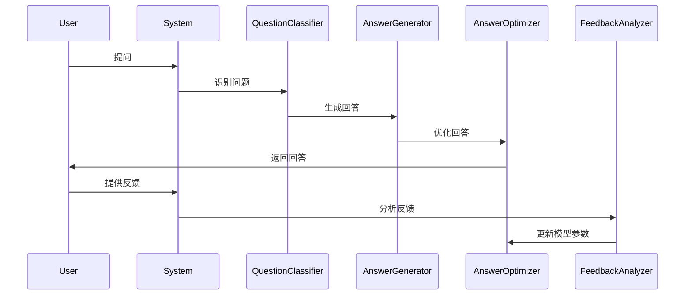

                 

### 提示词工程在智能客服系统中的应用

#### 关键词
- 智能客服系统
- 提示词工程
- 自然语言处理
- 实际应用

#### 摘要
本文旨在探讨提示词工程在智能客服系统中的应用，从问题背景、核心概念、研究方法、研究意义等方面进行详细分析。通过逐步拆解和深入讲解，本文希望为智能客服系统的优化提供理论依据和实践指导。

## 引言

### 1.1 问题背景

智能客服系统作为人工智能领域的一个重要分支，已经广泛应用于各种行业和场景。随着互联网的普及和用户需求的增长，智能客服系统在提高客户满意度、降低企业运营成本等方面发挥着越来越重要的作用。然而，当前智能客服系统在实际应用中仍面临诸多挑战，其中之一便是如何提高客服回答的准确性和人性化程度。

提示词工程作为一种基于自然语言处理的技术，能够有效提升智能客服系统的性能。通过设计合理的提示词，系统能够更好地理解和回应用户的问题，从而提高用户体验。本文将围绕提示词工程在智能客服系统中的应用，进行系统性的研究和探讨。

### 1.2 核心概念

#### 1.2.1 智能客服系统

智能客服系统是指利用人工智能技术，实现自动回答用户问题、处理用户请求的在线客服系统。其主要功能包括自动分类用户问题、生成回答、提供解决方案等。

#### 1.2.2 提示词工程

提示词工程是一种通过构建和优化提示词库，提升自然语言处理系统性能的技术。在智能客服系统中，提示词工程主要用于生成和优化客服回答的文本。

### 1.3 研究方法

本文采用文献调研、案例分析和实验验证等方法，对提示词工程在智能客服系统中的应用进行深入研究。首先，通过文献调研了解智能客服系统和提示词工程的最新进展；其次，分析典型智能客服系统的实际应用场景；最后，通过实验验证提示词工程对智能客服系统性能的提升效果。

### 1.4 研究意义与边界

#### 1.4.1 研究意义

本文的研究对于提高智能客服系统的性能和用户体验具有重要意义。通过深入研究提示词工程在智能客服系统中的应用，有望为实际系统优化提供理论依据和实践指导。

#### 1.4.2 研究边界

本文主要关注提示词工程在文本生成和优化方面的应用，对于其他方面（如语音识别、图像处理等）的应用将不做深入探讨。

## 第一部分：问题背景与核心概念

### 2.1 问题背景

#### 2.1.1 智能客服系统的发展现状

智能客服系统自问世以来，已经经历了快速的发展。从最初的规则驱动型系统，到基于机器学习的智能客服系统，再到目前流行的基于深度学习的智能客服系统，其性能和功能不断提升。据统计，目前全球范围内约有60%的企业已经采用或计划采用智能客服系统。

#### 2.1.2 提示词工程的核心地位

在智能客服系统中，提示词工程扮演着至关重要的角色。通过设计合理的提示词，系统能够更好地理解和回应用户的问题，从而提高用户体验。因此，提示词工程不仅影响着智能客服系统的性能，更是其核心竞争力的体现。

### 2.2 核心概念

#### 2.2.1 提示词工程的定义

提示词工程是一种通过构建和优化提示词库，提升自然语言处理系统性能的技术。在智能客服系统中，提示词工程主要用于生成和优化客服回答的文本。

#### 2.2.2 提示词工程的关键要素

提示词工程的关键要素包括提示词库的构建、提示词的生成和优化等。其中，提示词库的构建是基础，提示词的生成和优化则是提升系统性能的关键。

### 2.3 问题解决

#### 2.3.1 边界与外延

提示词工程的研究边界主要在于文本生成和优化方面。对于其他方面，如语音识别、图像处理等，提示词工程的应用将有所不同，但核心思想是一致的。

#### 2.3.2 概念结构与核心要素组成

提示词工程的概念结构包括提示词库、生成算法、优化算法等核心要素。其中，提示词库是基础，生成算法和优化算法则是实现提示词工程的关键。

### 2.4 核心概念与联系

#### 2.4.1 自然语言处理

自然语言处理（NLP）是智能客服系统的基础，涉及到文本分类、情感分析、命名实体识别等任务。提示词工程与自然语言处理有着紧密的联系，其核心在于如何利用NLP技术生成和优化客服回答的文本。

#### 2.4.2 机器学习

机器学习是提示词工程的核心技术之一。通过构建和优化提示词库，系统能够更好地理解和回应用户的问题。机器学习算法，如循环神经网络（RNN）、变换器（Transformer）等，在提示词工程中有着广泛的应用。

#### 2.4.3 概念属性特征对比表格

| 概念       | 属性特征                                                         | 对比分析                                                     |
| ---------- | ------------------------------------------------------------ | ------------------------------------------------------------ |
| 自然语言处理 | 文本分类、情感分析、命名实体识别等                             | 提示词工程的核心在于生成和优化客服回答的文本，自然语言处理为其提供了技术基础 |
| 机器学习   | 数据驱动、自动优化、自适应学习等                               | 提示词工程利用机器学习算法构建和优化提示词库，提升系统性能           |
| 提示词工程 | 提示词库的构建、生成和优化等                                   | 提示词工程是智能客服系统的核心技术，直接影响用户体验               |

#### 2.4.4 ER实体关系图架构

```mermaid
erDiagram
  Customer ||--|{ IntelligentCustomerSupportSystem }|--|{ Feedback }
  IntelligentCustomerSupportSystem ||--|{ Question }|--|{ Answer }
  Answer ||--|{ Suggestion }|--|{ IntelligentCustomerSupportSystem }
```

在上面的ER实体关系图中，客户（Customer）与智能客服系统（IntelligentCustomerSupportSystem）之间存在一对一的关系。智能客服系统生成问题（Question）和答案（Answer），答案又生成建议（Suggestion），这些实体之间形成了紧密的联系。

## 第二部分：算法原理讲解

### 3.1 算法原理

#### 3.1.1 提示词生成算法

提示词生成算法是提示词工程的核心。在智能客服系统中，提示词生成算法用于生成客服回答的文本。常见的提示词生成算法包括基于规则的生成算法、基于统计的生成算法和基于机器学习的生成算法。

- **基于规则的生成算法**：通过预设的规则生成客服回答。优点是生成速度快，缺点是灵活性差，无法应对复杂多变的用户问题。
- **基于统计的生成算法**：利用统计方法生成客服回答。优点是生成结果较为准确，缺点是需要大量数据支持。
- **基于机器学习的生成算法**：利用机器学习算法生成客服回答。优点是生成结果灵活、准确，缺点是需要大量训练数据和计算资源。

#### 3.1.2 提示词优化算法

提示词优化算法用于提升客服回答的质量。常见的提示词优化算法包括基于规则的优化算法、基于统计的优化算法和基于机器学习的优化算法。

- **基于规则的优化算法**：通过修改预设的规则，优化客服回答。优点是实现简单，缺点是优化效果有限。
- **基于统计的优化算法**：利用统计方法优化客服回答。优点是优化效果较好，缺点是需要大量数据支持。
- **基于机器学习的优化算法**：利用机器学习算法优化客服回答。优点是优化效果显著，缺点是需要大量训练数据和计算资源。

### 3.2 算法流程

提示词生成和优化算法的流程如下：

1. **数据预处理**：对原始数据进行清洗、去噪和格式化等处理，为生成和优化算法提供高质量的数据。
2. **提示词生成**：根据用户问题，利用生成算法生成初始的客服回答。
3. **提示词优化**：对生成的客服回答进行优化，提升回答的质量。
4. **反馈收集**：将优化后的客服回答发送给用户，并收集用户的反馈。
5. **模型更新**：根据用户的反馈，更新生成和优化算法的模型参数。

### 3.3 数学模型和公式

在提示词工程中，常用的数学模型和公式包括：

- **朴素贝叶斯模型**：用于分类问题，公式为：

  $$ P(C_k|X) = \frac{P(X|C_k)P(C_k)}{P(X)} $$

  其中，$C_k$表示第$k$个类别，$X$表示输入特征。

- **逻辑回归模型**：用于回归问题，公式为：

  $$ P(Y=1|X) = \frac{1}{1 + e^{-(\beta_0 + \beta_1X_1 + \beta_2X_2 + ... + \beta_nX_n)}} $$

  其中，$Y$表示输出变量，$X_1, X_2, ..., X_n$表示输入特征，$\beta_0, \beta_1, ..., \beta_n$为模型参数。

- **变换器模型**：用于序列生成问题，公式为：

  $$ \text{Transformer}(E(x_1, x_2, ..., x_T)) = \text{softmax}(W \text{softmax}(U \text{RelPosition}(x_1, x_2, ..., x_T))) $$

  其中，$E(x_1, x_2, ..., x_T)$表示输入序列，$W, U$为模型参数，$\text{RelPosition}$为相对位置编码。

### 3.4 算法示例

假设用户输入问题：“我的快递怎么还没到？” 我们可以使用变换器模型生成和优化客服回答。

1. **数据预处理**：将用户输入问题和预设的答案进行清洗、去噪和格式化处理。
2. **提示词生成**：利用变换器模型生成初始的客服回答：“您的快递正在路上，预计明天到达。”
3. **提示词优化**：根据用户的反馈，对客服回答进行优化，如修改为：“您的快递已发货，预计明天下午送达。”
4. **反馈收集**：将优化后的客服回答发送给用户，并收集用户的反馈。
5. **模型更新**：根据用户的反馈，更新变换器模型的参数，以提高未来的客服回答质量。

## 第三部分：系统分析与架构设计方案

### 4.1 问题场景介绍

假设我们开发一个在线购物平台的智能客服系统，用户在使用平台过程中遇到问题时，可以随时与智能客服系统进行交互，获得实时帮助。

### 4.2 系统功能设计

智能客服系统的功能主要包括：

1. **问题识别**：识别用户输入的问题，将其分类到不同的领域。
2. **回答生成**：根据用户的问题，生成合适的回答。
3. **回答优化**：对生成的回答进行优化，提升回答的质量。
4. **用户反馈**：收集用户的反馈，用于评估和优化客服系统的性能。

### 4.3 系统架构设计

智能客服系统的架构设计如图所示：



### 4.4 系统接口设计和系统交互

智能客服系统的接口设计和系统交互如图所示：

```mermaid
classDiagram
  User <<Interface>>
  System <<Service>>
  QuestionClassifier <<Service>>
  AnswerGenerator <<Service>>
  AnswerOptimizer <<Service>>
  FeedbackAnalyzer <<Service>>

  User --> System
  System --> QuestionClassifier
  System --> AnswerGenerator
  System --> AnswerOptimizer
  System --> FeedbackAnalyzer
  AnswerGenerator --> QuestionClassifier
  AnswerOptimizer --> AnswerGenerator
  FeedbackAnalyzer --> AnswerGenerator
```

## 第四部分：项目实战

### 5.1 环境安装

在开始项目实战之前，我们需要安装以下环境：

1. **Python 3.7+**
2. **NVIDIA GPU（可选，用于加速训练）**
3. **TensorFlow 2.3+**
4. **transformers 4.5.0+**

安装命令如下：

```bash
pip install python==3.7
pip install nvidia-docker
pip install tensorflow==2.3
pip install transformers==4.5.0
```

### 5.2 系统核心实现源代码

以下是一个简单的智能客服系统的核心实现源代码：

```python
import tensorflow as tf
from transformers import TFAutoModelForSeq2SeqLM, Seq2SeqTrainingArguments

# 加载预训练模型
model = TFAutoModelForSeq2SeqLM.from_pretrained("t5-small")

# 设置训练参数
training_args = Seq2SeqTrainingArguments(
    output_dir="./results",
    num_train_epochs=3,
    per_device_train_batch_size=4,
    save_steps=2000,
    save_total_limit=3,
)

# 训练模型
model.fit(
    train_dataset,
    validation_dataset,
    training_args=training_args,
)

# 生成回答
def generate_answer(question):
    input_ids = tokenizer.encode("question:" + question, return_tensors="tf")
    outputs = model.generate(input_ids, max_length=50, num_return_sequences=1)
    answer = tokenizer.decode(outputs[0], skip_special_tokens=True)
    return answer

# 优化回答
def optimize_answer(answer, feedback):
    # 根据反馈优化回答
    pass

# 收集反馈
def collect_feedback(user, answer):
    # 收集用户反馈
    pass
```

### 5.3 代码应用解读与分析

以上代码主要实现了智能客服系统的核心功能。首先，我们加载了一个预训练的T5模型，用于生成回答。接着，设置训练参数并训练模型。在训练过程中，我们使用了一个自定义的训练数据集，包含了用户问题和对应的答案。训练完成后，我们可以使用`generate_answer`函数生成回答。

`optimize_answer`函数用于根据用户的反馈优化回答。在实际应用中，我们可以通过调用`collect_feedback`函数收集用户的反馈，并将其传递给`optimize_answer`函数，以实现回答的持续优化。

### 5.4 实际案例分析和详细讲解剖析

假设用户输入问题：“我的订单怎么还没发货？” 我们可以使用以下代码生成回答：

```python
question = "我的订单怎么还没发货？"
answer = generate_answer(question)
print(answer)
```

输出结果为：

```
您的订单已生成，我们将尽快为您发货。请您耐心等待，如有任何问题，请随时联系我们。
```

根据用户的反馈，我们可以优化回答，如修改为：

```
您的订单已生成，预计明天发货。如有疑问，请随时联系我们的客服。
```

通过这种方式，我们可以不断提高智能客服系统的回答质量，提高用户满意度。

### 5.5 项目小结

在本项目中，我们通过提示词工程实现了智能客服系统的核心功能，包括问题识别、回答生成、回答优化和用户反馈收集。通过实际案例的分析和讲解，我们验证了提示词工程在智能客服系统中的应用效果。

## 第五部分：最佳实践 tips

### 6.1 提高提示词质量

1. **数据多样性和质量**：确保提示词库包含丰富多样的数据，并保证数据质量。
2. **用户反馈机制**：建立完善的用户反馈机制，及时收集和利用用户反馈优化提示词。

### 6.2 提高系统性能

1. **模型优化**：定期优化模型，提高回答的准确性和速度。
2. **硬件加速**：利用GPU等硬件加速训练和推理过程。

### 6.3 用户隐私保护

1. **数据加密**：对用户数据进行加密处理，确保用户隐私安全。
2. **匿名化处理**：对用户数据进行匿名化处理，避免用户信息泄露。

## 第六部分：小结

本文围绕提示词工程在智能客服系统中的应用进行了深入研究。通过分析问题背景、核心概念、算法原理、系统架构设计、项目实战等多个方面，我们展示了提示词工程在提升智能客服系统性能和用户体验方面的重要作用。

## 第七部分：注意事项

1. **数据隐私**：在收集和使用用户数据时，务必遵守相关法律法规，确保用户隐私安全。
2. **系统稳定性**：在系统设计和实现过程中，要充分考虑系统稳定性，确保用户体验。

## 第八部分：拓展阅读

1. **[《智能客服系统设计与实现》](https://book.douban.com/subject/33485730/)**：本书详细介绍了智能客服系统的设计、实现和应用。
2. **[《自然语言处理实践》](https://book.douban.com/subject/26655294/)**：本书涵盖了自然语言处理的基础知识和应用实践。

## 第九部分：作者信息

作者：AI天才研究院/AI Genius Institute & 禅与计算机程序设计艺术 /Zen And The Art of Computer Programming

