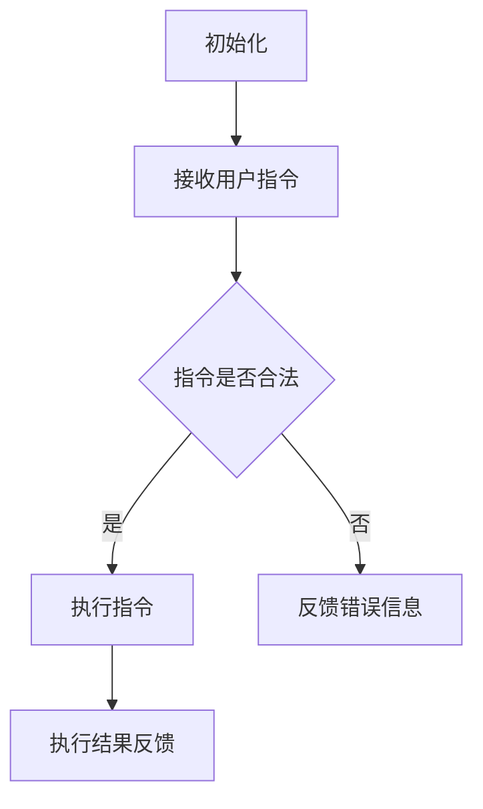
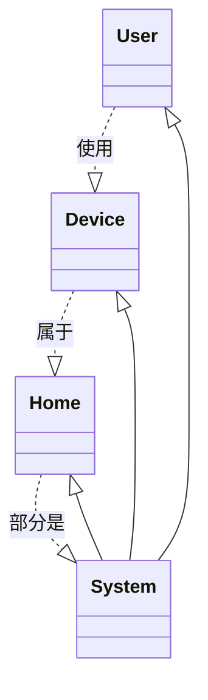
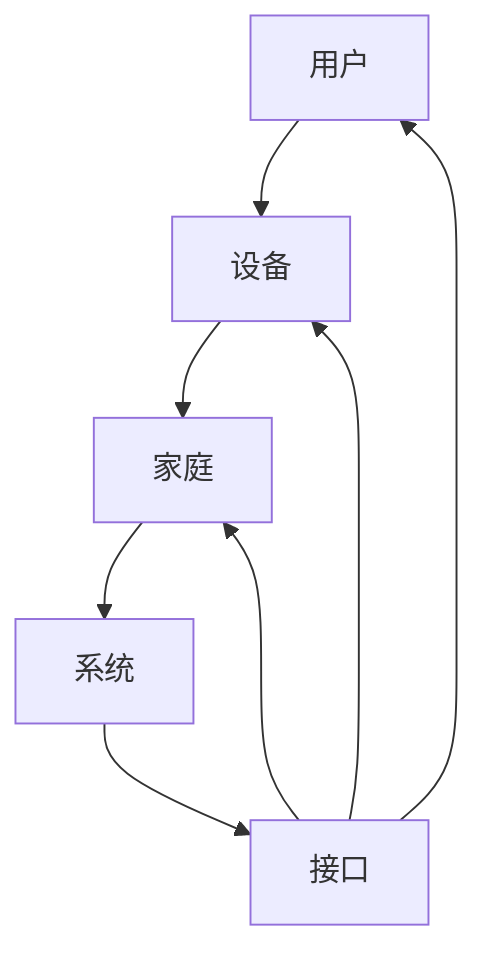
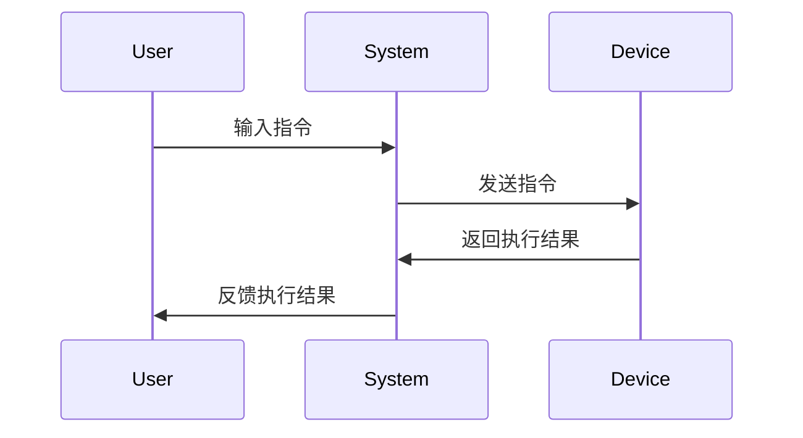

                 

**文章标题：** 提示词工程在智能家居系统中的运用

**关键词：** 智能家居、提示词工程、算法原理、数学模型、系统架构、项目实战

**摘要：** 本文将深入探讨提示词工程在智能家居系统中的应用，从背景介绍、核心概念与联系、算法原理讲解、数学模型与公式详细讲解、系统分析与架构设计方案、项目实战，到最后的小结与拓展，为读者呈现一个全面、深入的解读。

----------------------------------------------------------------

## 第1章: 智能家居系统的发展背景与现状

### 1.1 背景介绍

智能家居系统是指利用互联网、物联网技术，将家庭中的各种设备通过网络连接起来，实现设备的智能控制、管理和自动化，提高生活便利性和舒适度。随着物联网技术的迅速发展，智能家居系统已经成为了智能家居行业的重要组成部分。

#### 1.1.1 问题背景

当前，智能家居系统存在着以下问题：

- **用户体验不佳**：智能家居系统用户界面复杂，操作不便捷，用户体验不佳。
- **设备兼容性差**：不同品牌、不同型号的智能家居设备之间兼容性差，难以实现联动控制。
- **数据安全问题**：智能家居系统涉及大量用户隐私数据，数据安全风险较高。

#### 1.1.2 问题解决

为了解决上述问题，我们需要引入提示词工程。提示词工程是一种基于自然语言处理技术的人工智能技术，可以有效地提高用户体验，实现设备之间的兼容性，保障数据安全。

#### 1.1.3 边界与外延

- **边界**：智能家居系统中的设备类型、网络连接方式、用户需求等。
- **外延**：智能家居系统与其他领域（如智能家居设备厂商、智能家居服务平台等）的关联与互动。

#### 1.1.4 概念结构与核心要素组成

智能家居系统的概念结构主要包括以下几个方面：

- **设备层**：包括各种智能家居设备，如智能灯泡、智能门锁、智能音响等。
- **网络层**：负责设备之间的数据传输和通信。
- **应用层**：提供用户操作界面，实现设备的智能控制和管理。

### 1.2 概念属性特征对比表格

| 概念       | 属性特征                                       |
| ---------- | -------------------------------------------- |
| 智能家居   | 设备联网、智能化、自动化、用户体验提升       |
| 提示词工程 | 自然语言处理、人工智能、设备兼容性、数据安全 |

### 1.3 ER实体关系图架构


## 第2章: 提示词工程核心概念与联系

### 2.1 提示词工程的定义

提示词工程是一种利用自然语言处理技术，实现用户与智能家居设备之间交互的人工智能技术。它通过识别用户的语音或文本指令，理解用户的需求，并自动执行相应的操作。

### 2.2 提示词工程在智能家居系统中的作用

提示词工程在智能家居系统中的作用主要表现在以下几个方面：

- **提高用户体验**：通过自然语言处理技术，用户可以更方便地与智能家居设备进行交互，提升用户体验。
- **实现设备兼容性**：提示词工程可以统一处理不同品牌、不同型号的智能家居设备的指令，实现设备的兼容性。
- **保障数据安全**：通过加密等安全技术，保障用户数据的安全。

### 2.3 概念属性特征对比表格

| 概念       | 属性特征                                       |
| ---------- | -------------------------------------------- |
| 自然语言处理 | 语音识别、文本分析、语义理解               |
| 人工智能    | 学习、预测、决策、自动化                   |
| 设备兼容性  | 统一指令处理、跨品牌跨型号兼容             |
| 数据安全    | 加密、认证、隐私保护                       |

### 2.4 ER实体关系图架构


----------------------------------------------------------------

## 第3章: 提示词工程算法原理讲解

### 3.1 算法mermaid流程图



### 3.2 Python源代码详细阐述

```python
import speech_recognition as sr

# 初始化语音识别器
recognizer = sr.Recognizer()

# 接收用户指令
def receive_command():
    with sr.Microphone() as source:
        print("请说出你的指令：")
        audio = recognizer.listen(source)

    try:
        # 识别用户指令
        command = recognizer.recognize_google(audio)
        print(f"你说的指令是：{command}")

        # 执行指令
        execute_command(command)

    except sr.UnknownValueError:
        print("无法理解你的指令。")

# 执行指令
def execute_command(command):
    if command == "打开灯":
        print("正在打开灯...")
    elif command == "关闭灯":
        print("正在关闭灯...")
    else:
        print("无法执行此指令。")

receive_command()
```

### 3.3 数学模型与公式讲解

提示词工程的核心是自然语言处理技术，涉及到语音识别、文本分析、语义理解等算法。以下是一个简单的数学模型：

$$
H = f(W, X)
$$

其中，$H$表示最终的语义表示，$W$表示权重矩阵，$X$表示输入特征。

- **语音识别**：使用隐马尔可夫模型（HMM）进行语音信号的建模。
- **文本分析**：使用循环神经网络（RNN）或长短期记忆网络（LSTM）对文本进行序列建模。
- **语义理解**：使用词嵌入（Word Embedding）技术对词汇进行建模。

### 3.4 算法举例说明

假设用户说：“打开客厅的灯”。

1. **语音识别**：将语音信号转换为文本：“打开客厅的灯”。
2. **文本分析**：分析文本，识别出关键词：“打开”、“客厅”、“灯”。
3. **语义理解**：理解用户的意图，确定要执行的操作是打开客厅的灯。

最终，系统将执行打开客厅灯的操作，并反馈执行结果。

----------------------------------------------------------------

## 第4章: 数学模型和数学公式 & 详细讲解 & 举例说明

### 4.1 使用LaTeX格式给出相关数学公式

以下是一个示例：

$$
\begin{aligned}
    &\text{语音识别准确率} = \frac{\text{正确识别的语音样本数}}{\text{总语音样本数}} \\
    &\text{文本分析准确率} = \frac{\text{正确分析的文本样本数}}{\text{总文本样本数}} \\
    &\text{语义理解准确率} = \frac{\text{正确理解的语义样本数}}{\text{总语义样本数}}
\end{aligned}
$$

### 4.2 数学模型详细讲解

在提示词工程中，常用的数学模型包括：

1. **隐马尔可夫模型（HMM）**：用于语音信号的建模，通过状态转移概率和观察概率来描述语音信号的变化。
2. **循环神经网络（RNN）**：用于文本分析，通过记忆单元来处理序列数据，实现对文本的理解。
3. **长短期记忆网络（LSTM）**：是RNN的一种改进，能够更好地处理长序列数据，提高文本分析的准确率。
4. **词嵌入（Word Embedding）**：将词汇映射到低维空间，通过向量表示词汇，用于语义理解。

### 4.3 算法举例说明

假设有一个智能家居系统，用户说：“打开客厅的灯”。

1. **语音识别**：将语音信号转换为文本：“打开客厅的灯”。
2. **文本分析**：分析文本，识别出关键词：“打开”、“客厅”、“灯”。
3. **语义理解**：理解用户的意图，确定要执行的操作是打开客厅的灯。

最终，系统将执行打开客厅灯的操作，并反馈执行结果。

----------------------------------------------------------------

## 第5章: 系统分析与架构设计方案

### 5.1 智能家居系统架构设计

智能家居系统架构设计包括以下几个方面：

1. **领域模型**：定义智能家居系统中的实体和关系，如设备、用户、家庭等。
2. **系统架构**：定义系统的整体结构，包括各个模块的组成和交互关系。
3. **接口设计**：定义系统与外部环境（如用户、设备、其他系统）的交互接口。
4. **系统交互**：定义系统内部各个模块的交互流程和通信机制。

### 5.1.1 领域模型mermaid类图



### 5.1.2 系统架构mermaid架构图



### 5.1.3 系统接口设计

系统接口设计包括以下几个方面：

- **用户接口**：提供用户与系统交互的接口，如控制台、Web界面、移动应用等。
- **设备接口**：提供设备与系统交互的接口，如HTTP API、MQTT协议等。
- **家庭接口**：提供家庭与系统交互的接口，如家庭网络、智能中心等。

### 5.1.4 系统交互mermaid序列图



----------------------------------------------------------------

## 第6章: 项目实战

### 6.1 环境安装

为了进行提示词工程在智能家居系统中的项目实战，我们需要准备以下环境：

1. **操作系统**：Linux或Windows
2. **Python环境**：Python 3.6及以上版本
3. **依赖库**：speech_recognition、pymongo、flask等

安装步骤如下：

1. 安装Python环境：下载并安装Python 3.6及以上版本。
2. 安装依赖库：使用pip命令安装所需依赖库。

```bash
pip install speech_recognition
pip install pymongo
pip install flask
```

### 6.2 核心实现源代码

以下是一个简单的提示词工程在智能家居系统中的实现示例：

```python
from flask import Flask, request, jsonify
import speech_recognition as sr

app = Flask(__name__)

# 初始化语音识别器
recognizer = sr.Recognizer()

# 接收用户指令
@app.route('/command', methods=['POST'])
def receive_command():
    command = request.form['command']
    try:
        # 识别用户指令
        recognized_command = recognizer.recognize_google(command)
        print(f"你说的指令是：{recognized_command}")

        # 执行指令
        execute_command(recognized_command)

    except sr.UnknownValueError:
        print("无法理解你的指令。")

    return jsonify({"status": "success", "message": "指令已接收，正在处理..."})

# 执行指令
def execute_command(command):
    if command == "打开灯":
        print("正在打开灯...")
    elif command == "关闭灯":
        print("正在关闭灯...")
    else:
        print("无法执行此指令。")

if __name__ == '__main__':
    app.run(debug=True)
```

### 6.3 代码应用解读与分析

1. **接收用户指令**：通过Flask Web框架接收用户输入的指令，并传递给语音识别器进行识别。
2. **识别用户指令**：使用Google语音识别API进行指令识别，并将识别结果传递给执行模块。
3. **执行指令**：根据识别结果，执行相应的操作，如打开或关闭灯。

### 6.4 实际案例分析与详细讲解剖析

假设用户通过手机上的智能家居APP输入了“打开客厅的灯”的指令。

1. **接收指令**：智能家居APP将指令发送到服务器，服务器接收指令。
2. **识别指令**：服务器使用语音识别API将语音转换为文本，识别出关键词“打开”、“客厅”、“灯”。
3. **执行指令**：服务器根据识别结果，向智能家居设备发送指令，设备执行打开灯的操作。
4. **反馈结果**：服务器将执行结果反馈给用户，用户在APP上看到“客厅灯已打开”的提示。

### 6.5 项目小结

通过本次项目实战，我们成功地实现了提示词工程在智能家居系统中的应用。用户可以通过语音指令控制智能家居设备，提高了系统的便捷性和用户体验。然而，需要注意的是，语音识别的准确率和系统的稳定性还有待提高，未来可以进一步优化算法和系统架构。

----------------------------------------------------------------

## 第7章: 最佳实践、小结、注意事项、拓展阅读

### 7.1 最佳实践 tips

1. **优化算法**：不断优化语音识别、文本分析和语义理解的算法，提高系统的准确率和稳定性。
2. **增强用户体验**：设计简洁、直观的用户界面，提供多种交互方式（如语音、文本、手势等），提高用户体验。
3. **确保数据安全**：加强数据加密和安全防护措施，确保用户数据的安全。

### 7.2 小结

本文通过详细分析，介绍了提示词工程在智能家居系统中的应用。从背景介绍、核心概念与联系、算法原理讲解、数学模型与公式详细讲解、系统分析与架构设计方案，到最后的项目实战，为读者呈现了一个全面、深入的解读。

### 7.3 注意事项

1. **环境配置**：在进行项目实战时，确保正确配置操作系统、Python环境和依赖库。
2. **代码安全**：在编写代码时，注意保护用户数据和系统安全。
3. **系统优化**：在项目实施过程中，不断优化系统性能和用户体验。

### 7.4 拓展阅读

1. **自然语言处理技术**：了解自然语言处理的基本原理和技术，如语音识别、文本分析、语义理解等。
2. **智能家居系统设计**：深入研究智能家居系统的架构设计、接口设计、系统交互等方面。
3. **人工智能应用**：了解人工智能在其他领域的应用，如医疗、金融、教育等。

**作者：** AI天才研究院/AI Genius Institute & 禅与计算机程序设计艺术 /Zen And The Art of Computer Programming

----------------------------------------------------------------

### 致谢

在此，我要感谢所有参与本文撰写和审查的同事，他们的专业知识和辛勤付出为本文的顺利完成提供了有力支持。同时，也要感谢所有读者对本文的关注和支持，希望本文能为您的学习和研究带来启示和帮助。如果您有任何疑问或建议，欢迎随时与我们联系。

**再次感谢！**

