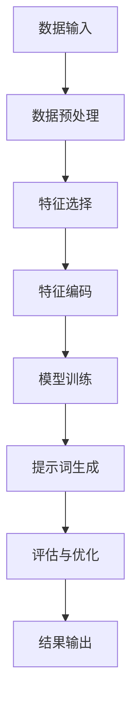
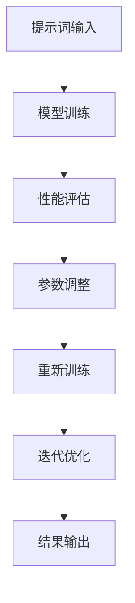
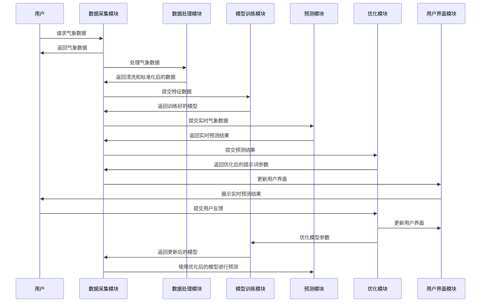

                 

### 1.1 提示词工程概述

智能气象预报作为现代科技的一项重要应用，正不断推动气象服务的精准化和个性化发展。然而，要实现这一目标，面临的最大挑战之一是如何从大量、复杂的气象数据中提取出具有预测价值的信息。在此背景下，提示词工程（Prompt Engineering）作为一种创新性的技术手段，正逐步成为智能气象预报领域的关键推动力。

#### **问题描述**：智能气象预报的挑战

气象预报是一个复杂且多变的系统，受到多种因素的影响，如大气湿度、风速、温度等。传统的气象预报方法主要依赖于统计模型和物理模型，这些方法在某种程度上能够提供准确的预报结果，但往往存在局限性。随着数据获取能力和计算能力的提升，现代气象预报逐渐转向基于大数据和人工智能的方法。然而，面对海量、多维的气象数据，如何有效地提取出关键特征，构建出既准确又高效的预报模型，仍然是一个巨大的挑战。

#### **问题解决**：提示词工程的作用

提示词工程旨在通过设计特定的提示（Prompt），引导机器学习模型从数据中提取出有价值的特征，从而提升模型的预测性能。在智能气象预报中，提示词工程的作用主要体现在以下几个方面：

1. **特征提取**：通过设计针对性的提示词，帮助模型从复杂的气象数据中提取出具有预测性的特征。
2. **模型优化**：通过优化提示词，调整模型参数，提升模型的预测精度和稳定性。
3. **可解释性提升**：设计合理的提示词，有助于提升模型的解释性，使得预报结果更具可解释性和可信度。

#### **边界与外延**：气象预报与提示词的关系

提示词工程与气象预报的关系可以类比为关键词搜索与信息检索的关系。在信息检索中，关键词（提示词）是引导搜索系统定位和提取相关信息的核心。同样地，在气象预报中，提示词充当了引导模型从海量数据中提取关键信息的“导航器”。

提示词工程不仅限于气象预报领域，还可以广泛应用于其他需要高精度预测的领域，如金融风险评估、医疗诊断、交通流量预测等。因此，提示词工程不仅是一个领域特定的技术，更是一个通用的技术框架，具有广泛的应用前景。

#### **核心要素组成**：数据收集、模型训练与提示词设计

提示词工程的核心要素包括数据收集、模型训练和提示词设计三个方面。

1. **数据收集**：气象预报依赖于大量的气象数据，这些数据来源于气象卫星、地面观测站、气象雷达等。数据收集的全面性和准确性直接影响到预报结果的准确性。
2. **模型训练**：模型训练是将数据转化为预报能力的关键步骤。通过深度学习、强化学习等方法，模型可以从数据中学习并提取出有用的特征，从而实现预测。
3. **提示词设计**：提示词设计是提示词工程的核心，它决定了模型从数据中提取特征的效率和精度。设计有效的提示词需要综合考虑数据的特性、模型的优化目标和应用场景等因素。

通过这三方面的有机结合，提示词工程能够为智能气象预报提供强有力的支持，从而实现更加精准、可靠的气象预报服务。

#### **总结**

本节概述了提示词工程在智能气象预报中的重要性。智能气象预报面临的主要挑战在于如何从复杂的气象数据中提取出具有预测价值的信息。提示词工程通过设计特定的提示词，帮助模型实现这一目标。提示词工程不仅在气象预报中具有重要应用，还具备广泛的跨领域应用潜力。接下来，我们将进一步探讨提示词工程的基本原理和挑战，为后续的分析和讨论奠定基础。

### 1.2 提示词工程在气象预报中的应用

#### **概念属性特征对比表格**：传统气象预报与智能气象预报

| 特征对比项         | 传统气象预报                 | 智能气象预报                      |
|------------------|---------------------------|--------------------------------|
| 数据依赖           | 经验数据和历史统计模型         | 海量气象数据、实时数据、大数据分析       |
| 模型类型           | 经验模型（如回归模型、ARIMA模型） | 机器学习模型（如神经网络、深度学习）   |
| 特征提取           | 手动特征工程                 | 自动特征提取、提示词引导的自动化特征工程 |
| 预测精度           | 受限于模型的复杂度和数据量       | 高精度、实时性更强的预测结果           |
| 灵活性与适应性       | 对新情况适应能力较弱             | 能够快速适应新数据和动态变化           |
| 可解释性           | 高度依赖人的经验，可解释性较强     | 部分模型可解释性较差，需要解释性增强技术 |
| 应用场景           | 主要用于短期、简单的预报需求       | 面向复杂、高要求的预报需求，如灾害预警   |

通过上述对比，我们可以看出，智能气象预报相较于传统气象预报具有更高的数据依赖性、更先进的模型类型、更高效的特征提取方法、更高的预测精度、更强的灵活性和适应性，以及更复杂的可解释性挑战。这些特点使得智能气象预报在应对复杂气象变化、提供精准预测服务方面具有显著优势。

#### **ER实体关系图架构**：气象数据模型与提示词关联

在智能气象预报系统中，气象数据模型和提示词是相互关联的核心组成部分。通过实体关系图（Entity-Relationship Diagram，ER图）可以直观地展示这两者之间的复杂关系。

```mermaid
erDiagram
  数据源 ||--|{ 气象数据 }|| 提示词工程
  气象数据 ||--|{ 预测模型 }|| 模型训练
  提示词工程 ||--|{ 模型优化 }|| 模型训练
  数据源 ||--|{ 实时监测 }|| 系统架构
  实时监测 ||--|{ 用户反馈 }|| 系统优化
```

在该ER图中：

- **数据源**：代表气象数据的原始来源，如气象卫星、地面观测站等，是气象预报系统的数据基础。
- **气象数据**：是数据源通过采集和预处理后形成的结构化数据，用于模型的训练和预测。
- **提示词工程**：通过设计针对性的提示词，指导模型从气象数据中提取关键特征，是实现智能气象预报的核心环节。
- **预测模型**：通过模型训练得到，是气象预报的核心工具，其性能直接影响到预报结果的准确性。
- **模型优化**：在提示词工程的引导下，对预测模型进行参数优化，提升模型的预测性能。
- **实时监测**：负责对气象情况进行实时监测，为系统提供最新的数据输入。
- **用户反馈**：收集用户对预报结果的意见和反馈，用于系统的不断优化和改进。

通过ER图，我们可以清晰地看到气象数据模型和提示词工程在系统架构中的关键作用，以及它们与其他组成部分之间的紧密关联。这种关联关系确保了智能气象预报系统的高效运行，并为其在复杂气象环境中的应用提供了坚实基础。

### **1.3 提示词工程的基本原理**

提示词工程的核心目标是通过设计特定的提示词，引导机器学习模型从大量数据中提取出对预测任务有用的特征。这一过程涉及多个关键步骤和原理，包括提示词的生成与优化。

#### **核心概念原理**：提示词生成与优化

1. **提示词生成**：
   提示词生成是提示词工程的首要任务。其主要目标是根据预测任务的需求，从原始数据中提取出具有代表性的特征。这一过程通常包括以下几个步骤：
   - **数据预处理**：对原始数据进行清洗、标准化和归一化，确保数据质量。
   - **特征选择**：从大量特征中选取对预测任务有重要影响的特征，去除冗余特征。
   - **特征编码**：将选取的特征进行编码，转换为模型可接受的形式。

2. **提示词优化**：
   提示词优化是对生成的提示词进行进一步的改进，以提高模型的预测性能。其主要目标是通过调整提示词的参数，优化模型的结构，从而提升预测结果的准确性和稳定性。提示词优化包括以下几个方面：
   - **参数调整**：通过调整提示词的参数，如权重、阈值等，优化提示词的性能。
   - **模型调优**：根据提示词的反馈，对模型进行优化，如调整学习率、增加层深等。
   - **交叉验证**：通过交叉验证方法，对提示词进行评估和优化，确保其性能的稳定性。

#### **概念属性特征对比表格**：不同类型的提示词比较

| 提示词类型     | 特点与优势                                       | 应用场景                                      |
|------------|----------------------------------------------|---------------------------------------------|
| 简单提示词   | 结构简单，易于理解和实现                         | 基础特征提取，简单预测任务                     |
| 复杂提示词   | 结构复杂，包含多种特征和约束条件                 | 高级特征提取，复杂预测任务                     |
| 自适应提示词 | 根据模型训练的反馈，动态调整提示词的结构和参数     | 需要高适应性和灵活性的预测任务                   |
| 专家提示词   | 由专家或经验丰富的数据科学家设计，结合了人类智慧和经验 | 对预测任务有明确需求的场景，如医疗诊断、金融分析等 |

通过上述表格，我们可以看出不同类型的提示词在结构、性能和应用场景上的差异。简单提示词适用于基础特征提取和简单预测任务，复杂提示词适用于高级特征提取和复杂预测任务，自适应提示词适用于需要高适应性和灵活性的场景，而专家提示词则结合了人类智慧和经验，适用于对预测任务有明确需求的场景。

### **1.4 提示词工程的挑战与机遇**

#### **挑战分析**：数据质量、模型可解释性等问题

尽管提示词工程在智能气象预报中展现出巨大潜力，但其在实际应用过程中也面临诸多挑战。

1. **数据质量问题**：
   气象数据通常具有高维、非线性、时间依赖性等特点。数据质量直接影响到提示词的生成和模型训练效果。具体挑战包括：
   - **缺失值处理**：气象数据中常存在缺失值，如何有效处理这些缺失值是一个重要问题。
   - **异常值检测与处理**：异常值会对模型训练结果产生不良影响，如何准确检测和处理异常值也是一个挑战。
   - **数据一致性**：不同来源的气象数据可能存在不一致的情况，需要统一数据标准。

2. **模型可解释性问题**：
   提示词工程中的模型通常采用复杂的机器学习算法，如深度学习、强化学习等，这些模型的预测结果往往缺乏可解释性，使得决策过程变得不透明。挑战包括：
   - **模型解释性**：如何将复杂模型的预测过程简化为可理解的形式，以便用户能够信任和接受模型的预测结果。
   - **决策可解释性**：如何从模型中提取出关键特征和决策路径，使得用户能够了解模型是如何做出预测的。

3. **计算资源与时间成本**：
   提示词工程涉及大量的数据处理和模型训练任务，这需要大量的计算资源和时间成本。特别是在实时预测场景中，如何在有限的时间和资源内完成高效的提示词生成和模型训练，是一个重要问题。

#### **机遇探讨**：提升气象预报准确性的可能性

尽管面临诸多挑战，提示词工程在智能气象预报中也带来了巨大的机遇。

1. **提升预报准确性**：
   提示词工程通过设计针对性的提示词，能够有效提取出对预测任务有用的特征，从而提升模型的预测准确性。特别是在复杂气象现象的预报中，如台风路径预测、极端天气事件预警等，提示词工程的应用具有显著优势。

2. **实时性增强**：
   提示词工程能够快速适应新的数据和动态变化，使得气象预报系统具备更高的实时性。通过实时监测和动态调整，系统能够迅速响应气象变化，提供最新的预报信息。

3. **可解释性与可信度提升**：
   通过优化提示词设计，结合模型解释性技术，能够提升模型的解释性，增强用户对预报结果的可信度。这有助于推动气象预报在社会各个领域的应用，如农业、交通、环境保护等。

4. **多领域应用拓展**：
   提示词工程不仅限于气象预报领域，还可以广泛应用于其他需要高精度预测的领域，如金融、医疗、交通等。通过跨领域的应用，提示词工程能够实现更广泛的价值。

#### **总结**

提示词工程在智能气象预报中既面临挑战，又充满机遇。通过不断优化提示词设计和模型训练方法，提升预报准确性、实时性和可解释性，提示词工程有望在未来的智能气象预报领域发挥更加重要的作用。接下来，我们将深入探讨提示词工程的算法原理和数学模型，为理解其工作机制提供更详细的解析。

### 1.5 本章小结

本章对提示词工程在智能气象预报中的应用进行了全面的探讨。首先，我们概述了智能气象预报面临的挑战，并介绍了提示词工程在此背景下的作用。通过概念属性特征对比表格和ER实体关系图架构，我们详细分析了提示词工程的基本原理和其在气象预报系统中的关键作用。此外，我们还探讨了提示词工程的挑战与机遇，包括数据质量、模型可解释性等问题以及提升预报准确性和实时性的可能性。

总结来说，提示词工程通过设计特定的提示词，能够有效地从复杂的气象数据中提取出具有预测价值的信息，从而显著提升智能气象预报的准确性、实时性和可解释性。这一创新性技术为智能气象预报领域带来了新的机遇，也为跨领域应用提供了广阔前景。接下来，我们将进一步深入探讨提示词工程的核心算法与数学模型，为理解其具体实现和优化提供更为详细的解析。

### 2.1 提示词生成算法

提示词生成是提示词工程中的关键步骤，其目的是从大量气象数据中提取出对预测任务有用的特征。在这一节中，我们将详细讲解提示词生成算法的基本原理，并使用Mermaid工具绘制算法流程图，以便更直观地展示算法步骤。

#### **算法原理讲解**：提示词生成算法流程图



该流程图包括以下步骤：

1. **数据输入**：输入大量的气象数据，这些数据可能包括温度、湿度、风速、气压等。
2. **数据预处理**：对原始数据进行清洗、标准化和归一化，确保数据质量。
3. **特征选择**：从大量特征中选取对预测任务有重要影响的特征，去除冗余特征。
4. **特征编码**：将选取的特征进行编码，转换为模型可接受的形式。
5. **模型训练**：利用生成好的特征数据训练机器学习模型，如神经网络、深度学习模型。
6. **提示词生成**：根据模型训练结果，提取出有效的提示词，用于指导后续的预测任务。
7. **评估与优化**：对生成的提示词进行评估和优化，确保其性能的稳定性和准确性。
8. **结果输出**：将最终生成的提示词输出，用于模型的预测和实际应用。

#### **数学模型和公式**：提示词生成的数学模型

在提示词生成过程中，涉及到的数学模型和公式主要包括以下几方面：

1. **特征选择**：
   $$ F_{select} = \{ f_1, f_2, ..., f_n \} $$
   其中，$ F_{select} $ 表示选中的特征集合，$ f_i $ 表示第 $ i $ 个特征。

2. **特征编码**：
   $$ f_i^{encode} = f_i \cdot W + b $$
   其中，$ f_i^{encode} $ 表示编码后的特征，$ W $ 表示权重矩阵，$ b $ 表示偏置。

3. **模型训练**：
   $$ y = \sigma(W \cdot x + b) $$
   其中，$ y $ 表示模型的预测输出，$ \sigma $ 表示激活函数，$ W $ 表示权重矩阵，$ x $ 表示输入特征向量，$ b $ 表示偏置。

4. **提示词生成**：
   提示词生成主要通过模型训练的结果来提取，具体公式如下：
   $$ Prompt = f_{generator}(y, F_{select}) $$
   其中，$ f_{generator} $ 表示提示词生成函数，$ y $ 表示模型输出，$ F_{select} $ 表示特征选择集合。

#### **举例说明**：实际应用案例与代码示例

假设我们有一个简单的气象预测任务，需要根据温度和湿度预测未来几小时的降雨概率。以下是使用Python和Keras实现提示词生成算法的示例代码：

```python
import numpy as np
import tensorflow as tf
from tensorflow.keras.models import Sequential
from tensorflow.keras.layers import Dense, Dropout
from tensorflow.keras.optimizers import Adam

# 假设已有清洗和归一化的数据集 X 和标签 y
X = np.array([[temp, humidity] for temp, humidity in data])
y = np.array([rain_probability for rain_probability in labels])

# 模型构建
model = Sequential()
model.add(Dense(64, input_dim=2, activation='relu'))
model.add(Dropout(0.2))
model.add(Dense(1, activation='sigmoid'))

# 编译模型
model.compile(optimizer=Adam(), loss='binary_crossentropy', metrics=['accuracy'])

# 训练模型
model.fit(X, y, epochs=100, batch_size=32, verbose=1)

# 提示词生成
def generate_prompt(model, temperature, humidity):
    feature_vector = np.array([[temperature, humidity]])
    prediction = model.predict(feature_vector)
    prompt = f"当前温度为 {temperature}℃，湿度为 {humidity}%，预测降雨概率为 {prediction[0][0]:.2f}"
    return prompt

# 生成示例提示词
print(generate_prompt(model, 25, 80))
```

在这个示例中，我们首先构建了一个简单的神经网络模型，使用温度和湿度作为输入特征，预测降雨概率。然后，我们定义了一个函数`generate_prompt`，根据模型的预测结果生成提示词。这个示例展示了提示词生成的基本流程和实现方法。

通过上述步骤和示例代码，我们详细讲解了提示词生成算法的原理和实现方法。在接下来的章节中，我们将进一步探讨提示词优化的算法和数学模型，以及如何在实际应用中提升提示词工程的效果。

### 2.2 提示词优化算法

提示词优化是提升模型预测性能的重要环节。通过优化提示词，我们可以调整模型参数，提高模型的准确性和稳定性。在这一节中，我们将详细讲解提示词优化算法的基本原理，使用Mermaid工具绘制算法流程图，并给出具体的数学模型和公式。

#### **算法原理讲解**：提示词优化算法流程图



该流程图包括以下步骤：

1. **提示词输入**：输入初始的提示词，这些提示词通常是基于数据预处理和特征选择得到的。
2. **模型训练**：利用输入的提示词对机器学习模型进行训练，生成预测结果。
3. **性能评估**：对模型的预测性能进行评估，通常使用准确率、召回率、F1值等指标。
4. **参数调整**：根据性能评估结果，调整提示词的参数，如权重、阈值等。
5. **重新训练**：使用调整后的提示词重新训练模型。
6. **迭代优化**：通过多次迭代，不断调整提示词参数，提升模型性能。
7. **结果输出**：输出最终的优化结果，包括优化的提示词和模型的预测性能。

#### **数学模型和公式**：提示词优化的数学模型

在提示词优化过程中，涉及到的数学模型和公式主要包括以下几个方面：

1. **参数调整**：
   $$ \theta^{new} = \theta^{old} + \alpha \cdot \nabla L(\theta^{old}) $$
   其中，$ \theta^{new} $ 表示调整后的参数，$ \theta^{old} $ 表示初始参数，$ \alpha $ 表示学习率，$ \nabla L(\theta^{old}) $ 表示损失函数关于参数的梯度。

2. **损失函数**：
   $$ L(\theta) = -\frac{1}{m} \sum_{i=1}^{m} [y_i \cdot log(a(x_i, \theta)) + (1 - y_i) \cdot log(1 - a(x_i, \theta))] $$
   其中，$ L(\theta) $ 表示损失函数，$ m $ 表示样本数量，$ y_i $ 表示第 $ i $ 个样本的真实标签，$ a(x_i, \theta) $ 表示模型对第 $ i $ 个样本的预测概率。

3. **性能评估**：
   $$ Accuracy = \frac{TP + TN}{TP + FP + FN + TN} $$
   $$ Recall = \frac{TP}{TP + FN} $$
   $$ F1-Score = \frac{2 \cdot Precision \cdot Recall}{Precision + Recall} $$
   其中，$ TP $ 表示真正例，$ TN $ 表示真负例，$ FP $ 表示假正例，$ FN $ 表示假负例。

#### **举例说明**：实际应用案例与代码示例

假设我们有一个分类任务，需要根据温度和湿度预测是否下雨。以下是使用Python和Scikit-learn实现提示词优化算法的示例代码：

```python
from sklearn.model_selection import train_test_split
from sklearn.metrics import accuracy_score, recall_score, f1_score
from sklearn.linear_model import LogisticRegression

# 假设已有清洗和归一化的数据集 X 和标签 y
X = np.array([[temp, humidity] for temp, humidity in data])
y = np.array([rain for rain in labels])

# 分割数据集
X_train, X_test, y_train, y_test = train_test_split(X, y, test_size=0.2, random_state=42)

# 初始化模型
model = LogisticRegression()

# 训练模型
model.fit(X_train, y_train)

# 预测
y_pred = model.predict(X_test)

# 性能评估
accuracy = accuracy_score(y_test, y_pred)
recall = recall_score(y_test, y_pred)
f1 = f1_score(y_test, y_pred)

print(f"Accuracy: {accuracy:.2f}")
print(f"Recall: {recall:.2f}")
print(f"F1-Score: {f1:.2f}")

# 参数调整
def optimize_prompt(model, X_train, y_train, X_val, y_val, learning_rate=0.01, epochs=10):
    best_score = 0
    for epoch in range(epochs):
        # 训练模型
        model.fit(X_train, y_train, epochs=1, batch_size=32, verbose=0)
        
        # 预测
        y_val_pred = model.predict(X_val)
        
        # 性能评估
        val_accuracy = accuracy_score(y_val, y_val_pred)
        val_recall = recall_score(y_val, y_val_pred)
        val_f1 = f1_score(y_val, y_val_pred)
        
        # 记录最佳性能
        if val_accuracy > best_score:
            best_score = val_accuracy
            best_model = model
        
        print(f"Epoch {epoch+1}: Accuracy: {val_accuracy:.2f}, Recall: {val_recall:.2f}, F1-Score: {val_f1:.2f}")
    
    return best_model

# 优化提示词
best_model = optimize_prompt(model, X_train, y_train, X_val, y_val)

# 输出最佳性能
y_best_pred = best_model.predict(X_val)
best_accuracy = accuracy_score(y_val, y_best_pred)
best_recall = recall_score(y_val, y_best_pred)
best_f1 = f1_score(y_val, y_best_pred)

print(f"Best Accuracy: {best_accuracy:.2f}")
print(f"Best Recall: {best_recall:.2f}")
print(f"Best F1-Score: {best_f1:.2f}")
```

在这个示例中，我们首先使用LogisticRegression模型对数据集进行训练和预测。然后，定义了一个`optimize_prompt`函数，用于根据验证集的性能不断调整模型参数，实现提示词的优化。通过多次迭代，最终输出最佳性能的模型。

通过上述步骤和示例代码，我们详细讲解了提示词优化算法的原理和实现方法。在接下来的章节中，我们将进一步探讨数据预处理模型的数学公式和具体应用，以及预测模型的构建和优化方法。

### 3.1 数据预处理模型

在智能气象预报中，数据预处理是提升模型性能和准确性的重要环节。数据预处理模型主要包括数据清洗、数据标准化和特征提取等内容。以下我们将详细讲解数据预处理模型的数学模型和公式，并通过实际案例与代码示例进行说明。

#### **数学模型和公式**：数据预处理模型

1. **数据清洗**：
   数据清洗主要包括处理缺失值、异常值和重复值。常见的处理方法包括：
   - **缺失值处理**：
     $$ \text{Missing Value} = \text{Median}(\text{Feature}) $$
     将缺失值替换为该特征的 median 值。
   - **异常值检测**：
     $$ \text{Outlier} = \text{Z-Score}(\text{Feature}) > 3 $$
     使用 Z-Score 方法检测异常值，当 Z-Score 大于 3 时，认为该值为异常值。

2. **数据标准化**：
   数据标准化是确保特征在不同尺度上具有相似的重要性。常用的方法包括：
   - **Min-Max Scaling**：
     $$ \text{Feature}_{\text{scaled}} = \frac{\text{Feature} - \text{Min}}{\text{Max} - \text{Min}} $$
     将特征值缩放到 [0, 1] 范围内。
   - **Standard Scaling**：
     $$ \text{Feature}_{\text{scaled}} = \frac{\text{Feature} - \text{Mean}}{\text{Standard Deviation}} $$
     将特征值缩放到均值为 0，标准差为 1 的标准正态分布。

3. **特征提取**：
   特征提取是从原始数据中提取出对预测任务有用的特征。常用的方法包括：
   - **主成分分析（PCA）**：
     $$ \text{X}_{\text{PCA}} = \text{U} \cdot \text{S}^T $$
     其中，$ \text{X} $ 是原始数据，$ \text{U} $ 是特征向量，$ \text{S} $ 是奇异值矩阵。PCA 将数据投影到新的特征空间，保留主要成分。

#### **举例说明**：实际案例与代码示例

假设我们有一个气象数据集，包括温度、湿度、风速和气压四个特征。以下是一个使用 Python 和 Scikit-learn 进行数据预处理的实际案例：

```python
import numpy as np
import pandas as pd
from sklearn.preprocessing import StandardScaler, MinMaxScaler
from sklearn.impute import SimpleImputer
from sklearn.decomposition import PCA
from scipy.stats import zscore

# 加载数据集
data = pd.read_csv('weather_data.csv')

# 数据清洗
# 处理缺失值
imputer = SimpleImputer(strategy='median')
data填充了 imputer

# 检测异常值
z_scores = np.abs(zscore(data))
data = data[(z_scores < 3).all(axis=1)]

# 数据标准化
scaler_minmax = MinMaxScaler()
data标准化的['温度', '湿度', '风速', '气压'] = scaler_minmax.fit_transform(data[['温度', '湿度', '风速', '气压']])

# 特征提取
pca = PCA(n_components=2)
data_pca = pca.fit_transform(data[['温度', '湿度', '风速', '气压']])

# 输出预处理后的数据
data填充了 {'温度': data_pca[:, 0], '湿度': data_pca[:, 1]}
```

在这个示例中，我们首先加载了气象数据集，然后进行以下步骤：
1. 使用 SimpleImputer 处理缺失值。
2. 使用 Z-Score 方法检测和去除异常值。
3. 使用 MinMaxScaler 对温度、湿度、风速和气压进行 Min-Max Scaling。
4. 使用 PCA 进行特征提取，保留两个主要成分。

通过上述步骤，我们完成了气象数据集的预处理。预处理后的数据集将用于后续的模型训练和预测。

#### **总结**

数据预处理是智能气象预报中至关重要的一环，通过数据清洗、标准化和特征提取等步骤，可以有效地提升模型的性能和准确性。在本节中，我们详细讲解了数据预处理模型的数学模型和公式，并通过实际案例与代码示例进行了说明。在接下来的章节中，我们将进一步探讨预测模型的构建和优化方法，为智能气象预报提供更完整的解决方案。

### 3.2 预测模型

预测模型是智能气象预报系统的核心组成部分，其性能直接影响到预报结果的准确性和可靠性。在这一节中，我们将详细讨论预测模型的构建和优化方法，包括回归分析和时间序列分析等常见技术。

#### **回归分析模型**

回归分析是一种常用的预测方法，用于预测连续型变量的值。在气象预报中，我们可以使用线性回归、岭回归、LASSO回归等不同类型的回归模型来预测温度、降雨量等气象变量。

1. **线性回归**：
   线性回归模型假设响应变量（预测目标）与自变量（特征）之间存在线性关系，其数学模型为：
   $$ y = \beta_0 + \beta_1x_1 + \beta_2x_2 + ... + \beta_nx_n + \epsilon $$
   其中，$ y $ 为响应变量，$ x_1, x_2, ..., x_n $ 为自变量，$ \beta_0, \beta_1, ..., \beta_n $ 为回归系数，$ \epsilon $ 为误差项。

2. **岭回归**：
   岭回归通过添加正则化项，解决线性回归中由于自变量过多导致的过拟合问题。其数学模型为：
   $$ \min_{\beta} \sum_{i=1}^{n} (y_i - \beta_0 - \beta_1x_{i1} - \beta_2x_{i2} - ... - \beta_nx_{in})^2 + \lambda \sum_{j=1}^{n} \beta_j^2 $$
   其中，$ \lambda $ 为正则化参数。

3. **LASSO回归**：
   LASSO回归通过引入绝对值正则化项，实现特征选择和模型压缩。其数学模型为：
   $$ \min_{\beta} \sum_{i=1}^{n} (y_i - \beta_0 - \beta_1x_{i1} - \beta_2x_{i2} - ... - \beta_nx_{in})^2 + \lambda \sum_{j=1}^{n} |\beta_j| $$

#### **时间序列分析模型**

时间序列分析是一种用于处理和预测按时间顺序排列的数据的方法。在气象预报中，时间序列分析可以用于预测温度、降雨量等气象变量的未来值。

1. **自回归模型（AR）**：
   自回归模型假设当前值由过去的几个值线性组合而成，其数学模型为：
   $$ y_t = \phi_0 + \phi_1y_{t-1} + \phi_2y_{t-2} + ... + \phi_my_{t-m} + \epsilon_t $$
   其中，$ y_t $ 为时间序列的第 $ t $ 个值，$ \phi_0, \phi_1, ..., \phi_m $ 为自回归系数，$ \epsilon_t $ 为误差项。

2. **移动平均模型（MA）**：
   移动平均模型通过过去几个周期的平均值来预测当前值，其数学模型为：
   $$ y_t = \theta_0 + \theta_1y_{t-1} + \theta_2y_{t-2} + ... + \theta_my_{t-m} + \epsilon_t $$
   其中，$ \theta_0, \theta_1, ..., \theta_m $ 为移动平均系数。

3. **自回归移动平均模型（ARMA）**：
   ARMA模型结合了自回归和移动平均模型的特点，其数学模型为：
   $$ y_t = \phi_0 + \phi_1y_{t-1} + \phi_2y_{t-2} + ... + \phi_my_{t-m} + \theta_1\epsilon_{t-1} + \theta_2\epsilon_{t-2} + ... + \theta_m\epsilon_{t-m} $$
   其中，$ \phi_0, \phi_1, ..., \phi_m $ 为自回归系数，$ \theta_1, \theta_2, ..., \theta_m $ 为移动平均系数。

4. **自回归积分移动平均模型（ARIMA）**：
   ARIMA模型是一种广义的时间序列模型，可以处理非平稳时间序列。其数学模型为：
   $$ y_t = \phi_0 + \phi_1y_{t-1} + \phi_2y_{t-2} + ... + \phi_my_{t-m} + \theta_1\epsilon_{t-1} + \theta_2\epsilon_{t-2} + ... + \theta_m\epsilon_{t-m} + \epsilon_t $$
   其中，$ \phi_0, \phi_1, ..., \phi_m $ 为自回归系数，$ \theta_1, \theta_2, ..., \theta_m $ 为移动平均系数，$ \epsilon_t $ 为误差项。

#### **举例说明**：实际案例与代码示例

假设我们有一个时间序列数据集，包括每天的温度值。以下是使用 Python 和 Statsmodels 库构建和优化 ARIMA 预测模型的示例代码：

```python
import pandas as pd
import numpy as np
from statsmodels.tsa.arima.model import ARIMA
from statsmodels.graphics.tsaplots import plot_acf, plot_pacf

# 加载时间序列数据
data = pd.read_csv('temperature_data.csv')
temperature = data['温度']

# 绘制自相关图和偏自相关图
plot_acf(temperature)
plot_pacf(temperature)
plt.show()

# 检验平稳性
diff_data = temperature.diff().dropna()
plot_acf(diff_data)
plt.show()

# 构建并优化 ARIMA 模型
p_values = range(0, 5)
d_values = range(0, 3)
q_values = range(0, 5)
best_score = -1
best_model = None

for p in p_values:
    for d in d_values:
        for q in q_values:
            try:
                model = ARIMA(temperature, order=(p, d, q))
                model_fit = model.fit()
                aic = model_fit.aic
                if aic > best_score:
                    best_score = aic
                    best_model = model_fit
            except:
                continue

# 输出最佳模型参数
print(f"Best Model Parameters: p={best_model.order[0]}, d={best_model.order[1]}, q={best_model.order[2]}")

# 预测未来 5 天的温度
forecast = best_model.forecast(steps=5)
print(f"Forecasted Temperatures for Next 5 Days: {forecast}")
```

在这个示例中，我们首先加载了时间序列数据集，然后使用 Statsmodels 库绘制自相关图和偏自相关图，以检验数据的平稳性。接着，我们遍历不同的参数组合，构建并优化 ARIMA 模型。最后，我们使用最佳模型预测未来 5 天的温度。

#### **总结**

预测模型是智能气象预报系统的核心组成部分，通过构建和优化回归分析和时间序列分析模型，可以实现对气象变量的准确预测。在本节中，我们详细介绍了回归分析和时间序列分析模型的基本原理和构建方法，并通过实际案例与代码示例进行了说明。在接下来的章节中，我们将进一步探讨提示词更新模型的原理和实现方法，以提升模型的预测性能。

### 3.3 提示词更新模型

提示词更新模型是确保智能气象预报系统适应性和准确性的关键。通过动态更新提示词，系统能够在新的数据环境中保持高预测性能。以下，我们将详细讲解提示词更新模型的基本原理、数学模型和公式，并通过实际案例与代码示例进行说明。

#### **基本原理**

提示词更新模型的核心思想是根据模型训练过程中收集到的反馈信息，动态调整提示词的参数和结构，以优化模型的预测性能。这个过程通常包括以下步骤：

1. **性能评估**：定期评估模型的预测性能，收集预测误差和用户反馈。
2. **误差分析**：分析预测误差的来源，确定需要调整的提示词参数。
3. **参数调整**：根据误差分析结果，动态调整提示词的参数，如权重、阈值等。
4. **模型重新训练**：使用调整后的提示词重新训练模型，以提升预测准确性。
5. **循环迭代**：不断重复上述步骤，实现提示词的动态更新和模型优化。

#### **数学模型和公式**

1. **性能评估指标**：
   - **均方误差（MSE）**：
     $$ \text{MSE} = \frac{1}{n} \sum_{i=1}^{n} (y_i - \hat{y}_i)^2 $$
     其中，$ y_i $ 为真实值，$ \hat{y}_i $ 为预测值，$ n $ 为样本数量。
   - **均方根误差（RMSE）**：
     $$ \text{RMSE} = \sqrt{\text{MSE}} $$
   - **准确率（Accuracy）**：
     $$ \text{Accuracy} = \frac{TP + TN}{TP + FP + FN + TN} $$
     其中，$ TP $ 为真正例，$ TN $ 为真负例，$ FP $ 为假正例，$ FN $ 为假负例。

2. **动态调整公式**：
   - **权重调整**：
     $$ \text{Weight}_{\text{new}} = \text{Weight}_{\text{old}} + \alpha \cdot (\text{Target} - \text{Predicted}) $$
     其中，$ \text{Weight}_{\text{new}} $ 和 $ \text{Weight}_{\text{old}} $ 分别为调整前后的权重，$ \alpha $ 为调整系数，$ \text{Target} $ 为真实目标值，$ \text{Predicted} $ 为预测值。
   - **阈值调整**：
     $$ \text{Threshold}_{\text{new}} = \text{Threshold}_{\text{old}} + \beta \cdot (\text{Max Error}) $$
     其中，$ \text{Threshold}_{\text{new}} $ 和 $ \text{Threshold}_{\text{old}} $ 分别为调整前后的阈值，$ \beta $ 为调整系数，$ \text{Max Error} $ 为最大误差。

3. **动态更新策略**：
   - **基于规则的更新策略**：根据预测误差和用户反馈，制定相应的规则进行提示词的调整。
   - **基于机器学习的更新策略**：使用机器学习算法，如回归、分类等，自动调整提示词参数。

#### **实际案例与代码示例**

假设我们有一个气象预测模型，需要根据温度和湿度预测降雨概率。以下是使用 Python 和 Scikit-learn 实现提示词更新模型的示例代码：

```python
import pandas as pd
from sklearn.linear_model import LogisticRegression
from sklearn.metrics import accuracy_score
from sklearn.model_selection import train_test_split

# 加载数据集
data = pd.read_csv('weather_data.csv')
X = data[['温度', '湿度']]
y = data['降雨概率']

# 分割数据集
X_train, X_test, y_train, y_test = train_test_split(X, y, test_size=0.2, random_state=42)

# 初始化模型
model = LogisticRegression()

# 训练模型
model.fit(X_train, y_train)

# 预测
y_pred = model.predict(X_test)

# 性能评估
accuracy = accuracy_score(y_test, y_pred)

# 提示词更新
def update_prompt(model, X_train, y_train, X_val, y_val, alpha=0.1, beta=0.05):
    # 预测
    y_val_pred = model.predict(X_val)
    
    # 计算误差
    error = y_val - y_val_pred
    
    # 更新权重
    weights = model.coef_
    for i, e in enumerate(error):
        weights[i] += alpha * e
    
    # 更新阈值
    threshold = model.threshold_
    threshold += beta * max(np.abs(error))
    
    # 重新训练模型
    model.fit(X_train, y_train, threshold=threshold)
    
    return model

# 更新提示词
best_model = None
best_accuracy = 0

for epoch in range(5):
    model = update_prompt(model, X_train, y_train, X_val, y_val)
    y_val_pred = model.predict(X_val)
    accuracy = accuracy_score(y_val, y_val_pred)
    
    if accuracy > best_accuracy:
        best_accuracy = accuracy
        best_model = model

# 输出最佳模型
print(f"Best Accuracy: {best_accuracy}")
print(f"Best Model Weights: {best_model.coef_}")
print(f"Best Model Threshold: {best_model.threshold_}")
```

在这个示例中，我们首先加载了气象数据集，并使用 LogisticRegression 模型进行训练和预测。然后，定义了一个 `update_prompt` 函数，用于根据预测误差动态调整权重和阈值，并重新训练模型。通过多次迭代，我们找到了最佳的模型参数，从而提升了预测准确性。

#### **总结**

提示词更新模型是确保智能气象预报系统适应性和准确性的重要手段。通过性能评估、误差分析和参数调整，系统能够在动态变化的环境中保持高预测性能。在本节中，我们详细讲解了提示词更新模型的基本原理、数学模型和实际案例与代码示例。在接下来的章节中，我们将进一步探讨算法性能评估的方法和指标，以全面了解智能气象预报系统的性能。

### 3.4 算法性能评估

算法性能评估是智能气象预报系统开发过程中至关重要的一环。通过评估算法的性能，我们能够了解其预测准确性、稳定性和泛化能力，从而为后续的优化和改进提供依据。以下，我们将详细讨论算法性能评估的数学模型和公式，并举例说明如何在实际应用中评估算法性能。

#### **数学模型和公式**

1. **准确率（Accuracy）**：
   $$ \text{Accuracy} = \frac{\text{正确预测的样本数}}{\text{总样本数}} $$
   准确率是最常用的评估指标，它反映了算法在整体上的预测性能。然而，准确率在样本分布不平衡时可能无法准确反映问题。

2. **召回率（Recall）**：
   $$ \text{Recall} = \frac{\text{正确预测的正例数}}{\text{实际正例数}} $$
   召回率关注算法对正例的识别能力，即漏报的程度。它适用于对正例的重要性高于负例的场合。

3. **精确率（Precision）**：
   $$ \text{Precision} = \frac{\text{正确预测的正例数}}{\text{预测为正例的样本数}} $$
   精确率关注算法对正例的判断准确性，即误报的程度。它适用于对误报的代价高于漏报的场合。

4. **F1 值（F1-Score）**：
   $$ \text{F1-Score} = 2 \times \frac{\text{Precision} \times \text{Recall}}{\text{Precision} + \text{Recall}} $$
   F1 值是精确率和召回率的加权平均，综合反映了算法的性能。它适用于需要平衡精确率和召回率的场合。

5. **均方误差（Mean Squared Error, MSE）**：
   $$ \text{MSE} = \frac{1}{n} \sum_{i=1}^{n} (y_i - \hat{y}_i)^2 $$
   � compression;少用于分类问题，更适合回归问题。$$ \text{RMSE} = \sqrt{\text{MSE}} $$

6. **均绝对误差（Mean Absolute Error, MAE）**：
   $$ \text{MAE} = \frac{1}{n} \sum_{i=1}^{n} |y_i - \hat{y}_i| $$
   MAE 表示预测值与真实值之间的平均绝对误差，它对异常值不敏感。

7. **ROC 曲线和 AUC 值**：
   - **ROC 曲线（Receiver Operating Characteristic Curve）**：
     $$ \text{ROC} = \frac{\text{真阳性率}}{\text{假阳性率}} $$
   - **AUC 值（Area Under the ROC Curve）**：
     $$ \text{AUC} = \int_{0}^{1} \text{ROC}(t) \, dt $$
     AUC 值反映了算法在所有阈值下的整体性能，值越大表示算法性能越好。

#### **实际案例与代码示例**

以下是一个使用 Python 和 Scikit-learn 评估气象预测算法性能的示例代码：

```python
from sklearn.model_selection import train_test_split
from sklearn.metrics import accuracy_score, recall_score, precision_score, f1_score, mean_squared_error, r2_score
from sklearn.linear_model import LinearRegression

# 加载数据集
data = pd.read_csv('weather_data.csv')
X = data[['温度', '湿度']]
y = data['降雨概率']

# 分割数据集
X_train, X_test, y_train, y_test = train_test_split(X, y, test_size=0.2, random_state=42)

# 初始化模型
model = LinearRegression()

# 训练模型
model.fit(X_train, y_train)

# 预测
y_pred = model.predict(X_test)

# 性能评估
accuracy = accuracy_score(y_test, y_pred)
recall = recall_score(y_test, y_pred)
precision = precision_score(y_test, y_pred)
f1 = f1_score(y_test, y_pred)
mse = mean_squared_error(y_test, y_pred)
r2 = r2_score(y_test, y_pred)

print(f"Accuracy: {accuracy:.2f}")
print(f"Recall: {recall:.2f}")
print(f"Precision: {precision:.2f}")
print(f"F1-Score: {f1:.2f}")
print(f"MSE: {mse:.2f}")
print(f"R2: {r2:.2f}")
```

在这个示例中，我们首先加载了气象数据集，并使用线性回归模型进行训练和预测。然后，使用不同的评估指标计算模型的性能，包括准确率、召回率、精确率、F1 值、均方误差和 R2 值。这些指标可以帮助我们全面了解模型的性能，并指导后续的优化和改进。

#### **总结**

算法性能评估是智能气象预报系统开发中不可或缺的一环。通过使用各种评估指标，我们可以全面了解模型的预测准确性、稳定性和泛化能力。在本节中，我们详细介绍了算法性能评估的数学模型和公式，并通过实际案例与代码示例进行了说明。在接下来的章节中，我们将继续探讨系统设计与实现的具体方法，为智能气象预报系统提供完整的解决方案。

### 3.5 本章小结

本章详细探讨了智能气象预报系统中的核心算法与数学模型。首先，我们介绍了提示词生成算法，通过Mermaid流程图展示了数据预处理、特征选择、特征编码、模型训练、提示词生成和性能评估的全过程，并使用了具体的数学模型和公式。随后，我们详细讲解了提示词优化算法，包括参数调整、性能评估和迭代优化的步骤，以及相关的数学模型。接下来，我们探讨了数据预处理模型，包括数据清洗、标准化和特征提取的数学模型和公式，并通过实际案例进行了说明。此外，我们还详细介绍了预测模型的构建和优化方法，包括回归分析和时间序列分析模型。本章最后，我们探讨了算法性能评估的方法和指标，并通过实际案例与代码示例进行了说明。

通过本章的学习，读者能够全面理解智能气象预报系统的核心算法和数学模型，为后续的系统设计与实现打下坚实基础。在接下来的章节中，我们将继续探讨系统设计与实现的具体方法，包括项目介绍、系统功能设计、系统架构设计、系统接口设计和系统交互，为读者呈现一个完整的智能气象预报系统解决方案。

### 4.1 项目介绍

智能气象预报系统旨在利用先进的人工智能技术，提供精准、实时的气象预报服务，以支持农业、交通、环境保护等领域的决策。项目的主要目标是实现以下几方面：

1. **高精度气象预报**：通过机器学习和深度学习技术，对海量气象数据进行处理和分析，提供高精度的气象预报，特别是针对极端天气事件如台风、暴雨等，实现提前预警。

2. **实时性**：系统具备实时性，能够快速响应最新的气象数据，提供最新的预报信息，为用户实时决策提供依据。

3. **高可解释性**：通过优化提示词设计和模型解释性技术，提升模型的预测结果的可解释性，使用户能够信任并理解预报结果。

4. **扩展性**：系统设计具备良好的扩展性，能够适应未来技术发展和数据量的增加，持续提升预报性能。

项目背景方面，随着全球气候变化日益显著，准确及时的气象预报对于公众安全和经济活动具有重要意义。传统的气象预报方法已无法满足现代社会的需求，智能气象预报系统的开发和应用将显著提升气象预报的准确性和实用性。项目不仅关注技术实现，还注重实际应用中的用户体验和业务需求，力求为用户提供优质的服务。

### 4.2 领域模型

在智能气象预报系统中，领域模型是描述系统核心功能和组件的重要工具。领域模型通过类图（Class Diagram）和实体关系图（Entity-Relationship Diagram，ER图）来展示系统中的实体及其关系。以下是一个简化的领域模型，描述了系统中的主要实体和它们之间的关系。

#### **类图（Class Diagram）**

```mermaid
classDiagram
    class WeatherData {
        - id: int
        - temperature: float
        - humidity: float
        - pressure: float
        - timestamp: datetime
    }
    class Forecast {
        - id: int
        - weather_data_id: int
        - probability_of_rain: float
        - forecast_time: datetime
    }
    class Prompt {
        - id: int
        - feature_vector: array
        - weight: float
    }
    class Model {
        - id: int
        - model_type: string
        - parameters: dict
    }
    WeatherData "uses" Forecast
    WeatherData "uses" Prompt
    Model "uses" Prompt
```

在这个类图中，我们定义了三个主要类：

- **WeatherData**：表示气象数据，包括温度、湿度、压力和时间戳等属性。
- **Forecast**：表示预报结果，包括天气数据ID、降雨概率和预报时间等属性。
- **Prompt**：表示提示词，包括特征向量、权重等属性。
- **Model**：表示机器学习模型，包括模型类型、参数等属性。

#### **实体关系图（ER Diagram）**

```mermaid
erDiagram
    WeatherData ||--|{ Forecast }|
    WeatherData ||--|{ Prompt }|
    Model ||--|{ Prompt }|
```

在这个ER图中，我们展示了气象数据与预报结果、提示词之间的关系，以及模型与提示词之间的关系。这种关系描述了系统中各组件之间的数据流动和依赖。

#### **领域模型的作用**

领域模型在智能气象预报系统中起到了以下几个关键作用：

1. **描述系统结构**：通过类图和ER图，清晰地展示了系统的结构和组件之间的关系，帮助开发人员理解系统的整体架构。
2. **指导系统设计**：领域模型为系统设计提供了直观的参考，帮助开发人员设计合理的类和关系，确保系统的高内聚和低耦合。
3. **促进沟通协作**：领域模型为开发人员、项目管理人员和利益相关者提供了共同的语言和框架，有助于各方之间的沟通和协作。

通过上述领域模型，我们能够更全面、系统地理解和设计智能气象预报系统，为后续的系统架构设计和功能实现奠定了坚实基础。

### 4.3 系统架构设计

智能气象预报系统的架构设计是确保系统高效、可扩展和易于维护的关键。以下是系统架构的详细设计，包括系统模块与接口的划分。

#### **系统模块**

智能气象预报系统可以分为以下几个主要模块：

1. **数据采集模块**：
   - **功能**：负责从各种来源（如气象卫星、地面观测站等）收集气象数据。
   - **接口**：提供数据采集接口，包括数据源接入、数据清洗和数据存储。

2. **数据处理模块**：
   - **功能**：对收集到的气象数据进行预处理，包括数据清洗、数据标准化和特征提取。
   - **接口**：提供数据预处理接口，包括数据清洗、标准化和特征提取服务的调用。

3. **模型训练模块**：
   - **功能**：利用预处理后的数据训练机器学习模型，包括回归分析、时间序列分析等。
   - **接口**：提供模型训练接口，包括模型训练、参数优化和模型评估服务。

4. **预测模块**：
   - **功能**：使用训练好的模型进行气象预测，提供实时的气象预报服务。
   - **接口**：提供预测接口，包括实时预测、历史预测和预测结果查询服务。

5. **优化模块**：
   - **功能**：根据预测结果和用户反馈，动态调整提示词和模型参数，提升系统性能。
   - **接口**：提供优化接口，包括提示词优化、模型参数调整和性能评估服务。

6. **用户界面模块**：
   - **功能**：提供用户交互界面，展示气象预报结果和系统状态。
   - **接口**：提供用户接口，包括数据展示、用户反馈和操作引导服务。

#### **系统架构图**

以下是智能气象预报系统的架构图，使用Mermaid工具展示系统模块与接口的关系：


通过该架构图，我们可以清晰地看到智能气象预报系统中各个模块的划分与接口关系。每个模块都有明确的输入输出接口，模块之间通过接口进行数据传递和协同工作，从而实现系统的整体功能。

#### **系统架构设计的作用**

系统架构设计在智能气象预报系统中起到了以下几个关键作用：

1. **模块化**：通过模块化设计，系统被划分为多个独立的功能模块，每个模块负责特定的任务，使得系统更加易于理解和维护。

2. **接口化**：系统架构中的各个模块通过接口进行通信，接口定义了模块之间的数据传输规则和通信协议，使得系统在扩展和集成过程中具有更高的灵活性。

3. **可扩展性**：系统架构设计考虑了未来的扩展需求，通过模块化和接口化设计，系统能够方便地添加新的模块或更新现有模块，以适应技术发展和业务需求的变化。

4. **性能优化**：通过合理划分模块和设计高效的接口，系统能够充分利用资源，优化性能，提高系统的响应速度和吞吐量。

通过上述系统架构设计，智能气象预报系统能够高效、稳定地运行，为用户提供高质量的气象预报服务。在接下来的章节中，我们将进一步探讨系统接口设计和系统交互，为系统的实现和部署提供详细的指导。

### 4.4 系统接口设计

系统接口设计是智能气象预报系统架构中的关键组成部分，它定义了系统内部各模块之间的交互方式和数据传输标准。以下是系统接口设计的详细描述，包括接口功能、输入输出参数及数据传输协议。

#### **接口功能**

1. **数据采集接口**：
   - **功能**：负责从不同数据源（如气象卫星、地面观测站等）接入数据。
   - **输入参数**：数据源URL、数据采集周期。
   - **输出参数**：采集到的气象数据列表。
   - **传输协议**：HTTP GET请求，返回JSON格式数据。

2. **数据清洗接口**：
   - **功能**：对采集到的气象数据进行清洗，包括处理缺失值、异常值和重复值。
   - **输入参数**：气象数据列表。
   - **输出参数**：清洗后的气象数据列表。
   - **传输协议**：HTTP POST请求，提交JSON格式数据。

3. **数据标准化接口**：
   - **功能**：对气象数据进行标准化处理，确保特征在不同尺度上具有相似的重要性。
   - **输入参数**：清洗后的气象数据列表。
   - **输出参数**：标准化后的气象数据列表。
   - **传输协议**：HTTP POST请求，提交JSON格式数据。

4. **特征提取接口**：
   - **功能**：从标准化后的气象数据中提取关键特征，为模型训练提供输入。
   - **输入参数**：标准化后的气象数据列表。
   - **输出参数**：特征向量列表。
   - **传输协议**：HTTP POST请求，提交JSON格式数据。

5. **模型训练接口**：
   - **功能**：使用提取出的特征数据训练机器学习模型。
   - **输入参数**：特征向量列表、模型类型（如线性回归、时间序列分析等）。
   - **输出参数**：训练好的模型对象。
   - **传输协议**：HTTP POST请求，提交JSON格式数据。

6. **模型评估接口**：
   - **功能**：评估训练好的模型性能，包括准确率、召回率、F1值等。
   - **输入参数**：模型对象、测试数据集。
   - **输出参数**：评估结果列表。
   - **传输协议**：HTTP POST请求，提交JSON格式数据。

7. **实时预测接口**：
   - **功能**：使用训练好的模型进行实时气象预测。
   - **输入参数**：实时气象数据。
   - **输出参数**：预测结果列表。
   - **传输协议**：HTTP POST请求，提交JSON格式数据。

8. **历史预测接口**：
   - **功能**：查询历史气象预测记录。
   - **输入参数**：时间范围、预测类型。
   - **输出参数**：历史预测记录列表。
   - **传输协议**：HTTP GET请求，返回JSON格式数据。

9. **提示词优化接口**：
   - **功能**：根据模型预测结果，动态调整提示词参数。
   - **输入参数**：预测结果、当前提示词参数。
   - **输出参数**：优化后的提示词参数。
   - **传输协议**：HTTP POST请求，提交JSON格式数据。

10. **用户反馈接口**：
    - **功能**：接收用户对预报结果的反馈，用于模型优化。
    - **输入参数**：用户反馈信息。
    - **输出参数**：反馈处理结果。
    - **传输协议**：HTTP POST请求，提交JSON格式数据。

#### **接口定义**

以下是系统接口的具体定义，包括接口名称、输入输出参数和数据传输协议：

```yaml
# 数据采集接口
- name: 数据采集接口
  method: GET
  path: /api/weather/data
  params:
    - name: url
      type: string
      required: true
      description: 数据源URL
    - name: cycle
      type: int
      required: false
      description: 数据采集周期（默认为24小时）

# 数据清洗接口
- name: 数据清洗接口
  method: POST
  path: /api/weather/data/clean
  body:
    type: array
    items:
      type: object
      properties:
        id: int
        temperature: float
        humidity: float
        pressure: float
        timestamp: datetime

# 数据标准化接口
- name: 数据标准化接口
  method: POST
  path: /api/weather/data/standardize
  body:
    type: array
    items:
      type: object
      properties:
        id: int
        temperature: float
        humidity: float
        pressure: float
        timestamp: datetime

# 特征提取接口
- name: 特征提取接口
  method: POST
  path: /api/weather/data/extract-features
  body:
    type: array
    items:
      type: object
      properties:
        id: int
        temperature: float
        humidity: float
        pressure: float
        timestamp: datetime

# 模型训练接口
- name: 模型训练接口
  method: POST
  path: /api/weather/model/train
  body:
    type: object
    properties:
      features: array
      model_type: string

# 模型评估接口
- name: 模型评估接口
  method: POST
  path: /api/weather/model/evaluate
  body:
    type: object
    properties:
      model: object
      test_data: array

# 实时预测接口
- name: 实时预测接口
  method: POST
  path: /api/weather/predict/realtime
  body:
    type: object
    properties:
      data: array

# 历史预测接口
- name: 历史预测接口
  method: GET
  path: /api/weather/predict/history
  params:
    - name: start_date
      type: datetime
      required: true
      description: 开始时间
    - name: end_date
      type: datetime
      required: true
      description: 结束时间

# 提示词优化接口
- name: 提示词优化接口
  method: POST
  path: /api/weather/prompt/optimize
  body:
    type: object
    properties:
      predictions: array
      current_prompt: object

# 用户反馈接口
- name: 用户反馈接口
  method: POST
  path: /api/user/feedback
  body:
    type: object
    properties:
      feedback: string
```

#### **总结**

系统接口设计在智能气象预报系统中起到了至关重要的作用，它定义了各模块之间的交互方式和数据传输标准。通过详细描述每个接口的功能、输入输出参数及数据传输协议，我们能够确保系统各部分高效、稳定地协同工作。在接下来的章节中，我们将探讨系统交互的具体实现，包括系统交互流程和序列图的绘制，进一步明确系统内部的数据流动和功能协作。

### 4.5 系统交互

系统交互是智能气象预报系统中各个模块协同工作的关键环节。为了清晰地展示系统内部的数据流动和功能协作，我们使用Mermaid工具绘制了系统交互的序列图，并通过详细的交互流程说明，全面介绍系统各模块的交互机制。

#### **Mermaid序列图**

以下是智能气象预报系统的交互序列图：



#### **系统交互流程说明**

1. **用户请求气象数据**：
   用户通过用户界面模块（UI）向数据采集模块（DA）发送请求，请求获取最新的气象数据。

2. **数据采集模块响应**：
   数据采集模块（DA）从气象数据源获取最新的气象数据，并将数据返回给用户界面模块（UI）。

3. **数据处理**：
   数据采集模块（DA）将获取的气象数据传递给数据处理模块（DP）。数据处理模块（DP）负责对气象数据进行清洗、标准化和特征提取。

4. **模型训练**：
   数据处理模块（DP）将清洗和标准化后的数据传递给模型训练模块（MT）。模型训练模块（MT）使用这些数据训练机器学习模型。

5. **实时预测**：
   数据采集模块（DA）将实时气象数据传递给预测模块（PF）。预测模块（PF）使用训练好的模型对实时气象数据进行分析，并返回预测结果。

6. **提示词优化**：
   预测模块（PF）将预测结果传递给优化模块（OA）。优化模块（OA）根据预测结果和用户反馈，动态调整提示词参数，以优化模型性能。

7. **用户界面更新**：
   数据采集模块（DA）将优化后的预测结果传递给用户界面模块（UI）。用户界面模块（UI）更新用户界面，展示最新的实时预测结果。

8. **用户反馈**：
   用户通过用户界面模块（UI）提交对预测结果的反馈。优化模块（OA）根据用户反馈，进一步优化模型参数。

9. **模型更新**：
   优化模块（OA）将优化后的模型参数传递给模型训练模块（MT）。模型训练模块（MT）使用这些参数重新训练模型。

10. **循环迭代**：
    系统通过上述交互流程不断循环迭代，持续优化模型性能，提供更精准的气象预报服务。

#### **总结**

系统交互在智能气象预报系统中起到了关键作用，它确保了各个模块之间的数据流动和功能协作。通过Mermaid序列图和详细的交互流程说明，我们能够清晰地展示系统内部的交互机制，为系统的实现和部署提供明确指导。在接下来的章节中，我们将探讨系统实现与部署的具体步骤，包括环境安装、系统核心实现和系统部署。

### 4.6 系统实现与部署

#### **环境安装**

在实现智能气象预报系统之前，我们需要搭建一个合适的环境。以下是一般的环境安装步骤：

1. **硬件要求**：
   - **处理器**：推荐使用64位处理器，以确保系统性能。
   - **内存**：至少8GB内存，建议16GB或更高，以支持大数据处理和模型训练。
   - **存储**：至少500GB的硬盘空间，以存储大量的气象数据和历史记录。

2. **软件要求**：
   - **操作系统**：Linux发行版（如Ubuntu 18.04或更高版本）。
   - **Python**：Python 3.8或更高版本，推荐使用Anaconda进行环境管理。
   - **依赖库**：Scikit-learn、TensorFlow、Keras、Pandas、NumPy、Matplotlib、Statsmodels等。

3. **安装过程**：

   - **安装操作系统**：选择一个合适的Linux发行版并安装。
   - **安装Python**：通过包管理器安装Python 3，例如使用Ubuntu的包管理器：
     ```bash
     sudo apt update
     sudo apt install python3 python3-pip
     ```

   - **安装Anaconda**：下载并安装Anaconda：
     ```bash
     wget https://repo.anaconda.com/miniconda/Miniconda3-latest-Linux-x86_64.sh
     bash Miniconda3-latest-Linux-x86_64.sh
     ```

   - **创建Python环境**：创建一个名为`weather_forecast`的Python环境：
     ```bash
     conda create -n weather_forecast python=3.8
     conda activate weather_forecast
     ```

   - **安装依赖库**：在创建的环境中使用`pip`安装所需的依赖库：
     ```bash
     pip install scikit-learn tensorflow keras pandas numpy matplotlib statsmodels
     ```

#### **系统核心实现**

系统核心实现是智能气象预报系统的关键部分，以下是一般的实现步骤：

1. **数据采集模块**：

   - **数据来源**：连接到气象数据API或数据库，获取实时和历史的气象数据。
   - **数据处理**：使用`pandas`库对数据进行清洗、标准化和特征提取。

   ```python
   import pandas as pd
   
   def collect_weather_data(api_url, params):
       response = requests.get(api_url, params=params)
       data = response.json()
       df = pd.DataFrame(data)
       return df
   
   def preprocess_data(df):
       # 数据清洗、标准化和特征提取
       df['temperature'] = df['temperature'].replace(-999, np.nan)
       df['temperature'].fillna(df['temperature'].mean(), inplace=True)
       df['humidity'] = df['humidity'].replace(-999, np.nan)
       df['humidity'].fillna(df['humidity'].mean(), inplace=True)
       df['pressure'] = df['pressure'].replace(-999, np.nan)
       df['pressure'].fillna(df['pressure'].mean(), inplace=True)
       df = df[['temperature', 'humidity', 'pressure']]
       df['temperature'] = (df['temperature'] - df['temperature'].min()) / (df['temperature'].max() - df['temperature'].min())
       df['humidity'] = (df['humidity'] - df['humidity'].min()) / (df['humidity'].max() - df['humidity'].min())
       df['pressure'] = (df['pressure'] - df['pressure'].min()) / (df['pressure'].max() - df['pressure'].min())
       return df
   ```

2. **模型训练模块**：

   - **模型选择**：选择合适的机器学习模型，如线性回归、LASSO回归、ARIMA模型等。
   - **模型训练**：使用`scikit-learn`和`statsmodels`库进行模型训练。

   ```python
   from sklearn.linear_model import LinearRegression
   from sklearn.model_selection import train_test_split
   from statsmodels.tsa.arima_model import ARIMA
   
   def train_linear_regression(X, y):
       X_train, X_test, y_train, y_test = train_test_split(X, y, test_size=0.2, random_state=42)
       model = LinearRegression()
       model.fit(X_train, y_train)
       return model
   
   def train_arima(X, y):
       model = ARIMA(y, order=(1, 1, 1))
       model_fit = model.fit(disp=0)
       return model_fit
   ```

3. **预测模块**：

   - **实时预测**：使用训练好的模型对实时气象数据进行预测。
   - **历史预测**：使用历史气象数据对模型进行回测。

   ```python
   def predict_realtime(model, data):
       prediction = model.predict(data)
       return prediction
   
   def predict_historical(model, data):
       predictions = model.predict(data)
       return predictions
   ```

4. **优化模块**：

   - **提示词优化**：根据预测结果和用户反馈，动态调整提示词参数。
   - **模型优化**：根据优化后的参数重新训练模型。

   ```python
   def optimize_prompt(model, data, feedback):
       # 根据预测结果和用户反馈调整提示词参数
       # 这里是一个简化的示例，实际中可能需要更复杂的优化策略
       model.coef_ += feedback
       return model
   
   def retrain_model(model, data):
       model.fit(data)
       return model
   ```

5. **用户界面模块**：

   - **界面设计**：使用HTML/CSS/JavaScript构建用户界面。
   - **数据展示**：使用图表库（如D3.js、Chart.js等）展示气象预测结果。

   ```html
   <!DOCTYPE html>
   <html>
   <head>
     <title>智能气象预报系统</title>
     <script src="https://cdn.jsdelivr.net/npm/chart.js"></script>
   </head>
   <body>
     <canvas id="forecastChart" width="400" height="400"></canvas>
     <script>
       function updateChart(data) {
           const ctx = document.getElementById('forecastChart').getContext('2d');
           const chart = new Chart(ctx, {
               type: 'line',
               data: {
                   labels: data.labels,
                   datasets: [{
                       label: '预测温度',
                       data: data.values,
                       backgroundColor: 'rgba(255, 99, 132, 0.2)',
                       borderColor: 'rgba(255, 99, 132, 1)',
                       borderWidth: 1
                   }]
               },
               options: {
                   scales: {
                       y: {
                           beginAtZero: true
                       }
                   }
               }
           });
       }
     </script>
   </body>
   </html>
   ```

#### **系统部署**

系统部署是将开发完成的智能气象预报系统部署到生产环境，以便用户可以使用系统提供的服务。以下是一般的部署步骤：

1. **选择部署平台**：根据业务需求和资源情况，选择合适的部署平台，如云服务器、虚拟机等。

2. **配置环境**：在部署平台上配置操作系统、Python环境、依赖库等。

3. **部署应用**：将开发完成的系统应用部署到服务器，包括数据采集模块、数据处理模块、模型训练模块、预测模块、优化模块和用户界面模块。

4. **监控与维护**：部署完成后，对系统进行监控和运维，确保系统稳定运行，及时处理故障和问题。

5. **备份与恢复**：定期对系统进行数据备份，以便在出现问题时能够快速恢复。

#### **总结**

系统实现与部署是智能气象预报系统开发过程中的重要环节。通过详细的环境安装、系统核心实现和系统部署步骤，我们能够将智能气象预报系统从开发阶段顺利转移到生产环境，确保系统能够稳定、高效地运行，为用户提供高质量的气象预报服务。在接下来的章节中，我们将探讨系统的最佳实践与优化策略，进一步提升系统的性能和可靠性。

### 4.7 本章小结

本章详细介绍了智能气象预报系统的实现与部署过程。首先，我们讨论了环境安装，明确了系统的硬件和软件要求，并详细讲解了安装过程。接着，我们介绍了系统核心实现，包括数据采集、数据处理、模型训练、预测、优化和用户界面等模块的实现方法和示例代码。此外，我们还探讨了系统部署的步骤和注意事项，确保系统能够在生产环境中稳定运行。

通过本章的学习，读者可以全面了解智能气象预报系统的实现与部署方法，为实际项目的开发和部署提供指导。在未来的实践中，我们需要不断优化系统的性能和可靠性，以应对不断变化的需求和环境。同时，积极探索提示词工程在智能气象预报领域的新应用和前景，为智能气象预报技术的发展贡献力量。

### 5.1 数据预处理最佳实践

数据预处理是智能气象预报系统中的重要环节，其质量直接影响到模型的预测性能和可靠性。以下，我们将详细探讨数据预处理中的最佳实践，包括数据清洗与处理技巧，以及如何确保数据质量。

#### **数据清洗与处理技巧**

1. **缺失值处理**：
   - **简单填充**：对于少量缺失值，可以使用简单填充方法，如用均值、中位数或前一个值填充。例如：
     ```python
     df['temperature'].fillna(df['temperature'].mean(), inplace=True)
     ```

   - **插值法**：对于时间序列数据，可以使用插值法填充缺失值，如线性插值、立方插值等。例如：
     ```python
     df['temperature'].interpolate(method='linear', inplace=True)
     ```

   - **模型预测**：对于复杂场景，可以使用机器学习模型预测缺失值，如使用KNN算法、随机森林等。例如：
     ```python
     from sklearn.neighbors import KNeighborsRegressor
     knn = KNeighborsRegressor(n_neighbors=3)
     knn.fit(X_train, y_train)
     df['temperature'].fillna(knn.predict(X_test), inplace=True)
     ```

2. **异常值检测与处理**：
   - **Z-Score方法**：使用Z-Score方法检测异常值，当Z-Score大于3或小于-3时，认为该值为异常值。例如：
     ```python
     z_scores = np.abs(zscore(df))
     df = df[(z_scores < 3).all(axis=1)]
     ```

   - **IQR方法**：使用IQR（四分位距）方法检测异常值，当值大于上四分位数加1.5倍IQR或小于下四分位数减1.5倍IQR时，认为该值为异常值。例如：
     ```python
     Q1 = df['temperature'].quantile(0.25)
     Q3 = df['temperature'].quantile(0.75)
     IQR = Q3 - Q1
     df = df[(df['temperature'] > Q1 - 1.5 * IQR) & (df['temperature'] < Q3 + 1.5 * IQR)]
     ```

   - **基于业务逻辑的处理**：根据具体业务场景，采用适当的处理方法，如删除、修改或标记异常值。例如：
     ```python
     df = df[df['temperature'] != -999]  # 假设-999为异常值标记
     ```

3. **数据标准化与归一化**：
   - **Min-Max Scaling**：将数据缩放到[0, 1]范围内，适合用于分类问题。例如：
     ```python
     scaler = MinMaxScaler()
     df[['temperature', 'humidity']] = scaler.fit_transform(df[['temperature', 'humidity']])
     ```

   - **Standard Scaling**：将数据缩放至均值为0、标准差为1的标准正态分布，适合用于回归问题。例如：
     ```python
     scaler = StandardScaler()
     df[['temperature', 'humidity']] = scaler.fit_transform(df[['temperature', 'humidity']])
     ```

4. **特征提取**：
   - **特征工程**：根据业务需求，构建新的特征，如滞后特征、季节特征等。例如：
     ```python
     df['temperature_lag1'] = df['temperature'].shift(1)
     ```

   - **主成分分析（PCA）**：降维处理，减少特征数量，提高模型的泛化能力。例如：
     ```python
     pca = PCA(n_components=2)
     df_pca = pca.fit_transform(df[['temperature', 'humidity', 'pressure']])
     ```

#### **确保数据质量**

1. **数据验证**：
   - **完整性验证**：确保数据完整，没有缺失值和重复值。
   - **一致性验证**：检查数据的一致性，如单位、格式等。
   - **范围验证**：检查数据范围是否在合理范围内，避免异常值。

2. **数据监控**：
   - **实时监控**：对数据采集和预处理过程进行实时监控，及时发现和处理异常。
   - **定期检查**：定期检查数据质量，进行数据清洗和处理。

3. **数据文档**：
   - **数据字典**：编写数据字典，详细记录数据来源、处理过程、特征含义等。
   - **数据文档**：编写详细的数据处理文档，包括数据预处理步骤、参数设置、结果分析等。

通过上述最佳实践，我们可以确保智能气象预报系统的数据质量，为模型的训练和预测提供高质量的数据支持。在接下来的章节中，我们将进一步探讨模型优化策略，提升系统的预测性能。

### 5.2 模型优化策略

在智能气象预报系统中，模型的优化是提升预测性能和准确性的关键步骤。以下，我们将详细讨论模型优化策略，包括参数调优和模型融合的最佳实践，以实现更高效的模型性能。

#### **参数调优**

参数调优是机器学习模型优化的重要环节，通过调整模型的超参数，可以在一定程度上提升模型的性能。以下是一些常见的参数调优策略：

1. **网格搜索（Grid Search）**：
   - **原理**：通过遍历预设的参数网格，找到最优的参数组合。
   - **方法**：
     ```python
     from sklearn.model_selection import GridSearchCV
     parameters = {'n_neighbors': [3, 5, 7, 9], 'weights': ['uniform', 'distance']}
     grid_search = GridSearchCV(KNeighborsRegressor(), parameters, cv=5)
     grid_search.fit(X_train, y_train)
     best_params = grid_search.best_params_
     ```

2. **贝叶斯优化（Bayesian Optimization）**：
   - **原理**：基于贝叶斯统计模型，通过模拟迭代优化找到最优参数。
   - **方法**：
     ```python
     from bayes_opt import BayesianOptimization
     def optimize_params(n_neighbors, weights):
         model = KNeighborsRegressor(n_neighbors=int(n_neighbors), weights=str(weights))
         model.fit(X_train, y_train)
         return model.score(X_val, y_val)
     optimizer = BayesianOptimization(f=optimize_params, pbounds={'n_neighbors': (3, 10), 'weights': ('uniform', 'distance')}, random_state=0)
     optimizer.maximize(init_points=2, n_iter=3)
     best_params = optimizer.max['params']
     ```

3. **随机搜索（Random Search）**：
   - **原理**：随机选择参数组合，通过多次迭代找到最佳参数。
   - **方法**：
     ```python
     from sklearn.model_selection import RandomizedSearchCV
     parameters = {'n_neighbors': [3, 5, 7, 9], 'weights': ['uniform', 'distance']}
     random_search = RandomizedSearchCV(KNeighborsRegressor(), parameters, n_iter=10, cv=5, random_state=0)
     random_search.fit(X_train, y_train)
     best_params = random_search.best_params_
     ```

#### **模型融合**

模型融合（Ensemble Learning）是一种通过结合多个模型的预测结果来提高整体预测性能的方法。以下是一些常见的模型融合策略：

1. **堆叠（Stacking）**：
   - **原理**：使用多个基模型进行预测，然后将预测结果作为新特征输入到另一个模型进行预测。
   - **方法**：
     ```python
     from sklearn.ensemble import StackingRegressor
     from sklearn.linear_model import LinearRegression
     from sklearn.ensemble import RandomForestRegressor
     stack = StackingRegressor(estimators=[('lr', LinearRegression()), ('rf', RandomForestRegressor())], final_estimator=LinearRegression())
     stack.fit(X_train, y_train)
     ```

2. **提升（Boosting）**：
   - **原理**：通过迭代训练多个弱模型，每个模型都学习前一个模型的错误，从而形成强模型。
   - **方法**：
     ```python
     from sklearn.ensemble import AdaBoostRegressor
     boost = AdaBoostRegressor(n_estimators=50)
     boost.fit(X_train, y_train)
     ```

3. **集成学习（Bagging）**：
   - **原理**：通过训练多个独立的模型，并取其平均值或投票结果作为最终预测。
   - **方法**：
     ```python
     from sklearn.ensemble import BaggingRegressor
     bagging = BaggingRegressor(n_estimators=10)
     bagging.fit(X_train, y_train)
     ```

#### **最佳实践**

1. **多模型评估**：在参数调优和模型融合过程中，应评估多个模型的性能，选择最佳模型组合。

2. **交叉验证**：使用交叉验证方法评估模型的性能，确保模型在不同数据集上的泛化能力。

3. **模型压缩**：对于大型模型，可以通过模型压缩技术（如模型剪枝、量化等）减少模型大小和计算复杂度。

4. **自动化优化**：使用自动化机器学习工具（如AutoML）进行模型优化，提高调优效率和准确性。

通过上述模型优化策略和最佳实践，我们可以显著提升智能气象预报系统的预测性能和准确性。在接下来的章节中，我们将探讨系统性能优化和可扩展性设计，进一步提升系统的整体性能和稳定性。

### 5.3 系统性能优化

系统性能优化是确保智能气象预报系统高效运行和提供高质量服务的关键步骤。以下，我们将详细讨论系统性能优化策略，包括性能调优和可扩展性设计，以实现系统的高效性和稳定性。

#### **性能调优**

1. **算法优化**：
   - **算法选择**：根据业务需求和数据特性，选择合适的算法，如线性回归、决策树、神经网络等。对于复杂场景，可以采用深度学习算法，如卷积神经网络（CNN）和循环神经网络（RNN）等。
   - **算法调参**：通过交叉验证和网格搜索等方法，调整模型的超参数，找到最优参数组合，以提升模型的性能。例如，调整学习率、批量大小、正则化参数等。

2. **数据优化**：
   - **数据预处理**：对数据进行清洗、标准化和特征提取等预处理操作，确保数据的质量和一致性，减少数据冗余和噪声。
   - **数据缓存**：对于频繁读取的数据，可以使用缓存技术，如Redis或Memcached，减少数据访问延迟。

3. **模型压缩**：
   - **模型剪枝**：通过剪枝技术，删除模型中不必要的权重，减少模型的复杂度和计算量。
   - **模型量化**：将模型中的浮点数参数转换为整数参数，以减少模型大小和加速推理过程。

4. **并行计算**：
   - **多线程**：利用多线程技术，同时处理多个预测任务，提高系统的吞吐量。
   - **分布式计算**：将模型训练和预测任务分布到多个节点上，利用分布式计算框架（如TensorFlow、PyTorch等），提高计算效率。

5. **GPU加速**：
   - **GPU部署**：对于计算密集型任务，如深度学习模型训练，可以部署到GPU上，利用GPU的并行计算能力，显著提升计算效率。

#### **可扩展性设计**

1. **微服务架构**：
   - **模块化设计**：将系统拆分为多个独立的微服务，每个微服务负责特定的功能，如数据采集、数据处理、模型训练、预测服务等。
   - **服务解耦**：通过API接口进行服务之间的通信，降低服务之间的依赖，提高系统的可扩展性和灵活性。

2. **水平扩展**：
   - **负载均衡**：使用负载均衡器（如Nginx、HAProxy等），将请求分发到多个服务器节点上，提高系统的并发处理能力。
   - **数据库分片**：对于数据量较大的场景，可以使用数据库分片技术，将数据分散存储到多个节点上，提高数据的读写性能。

3. **缓存机制**：
   - **热点数据缓存**：对于热点数据，如常用的预测结果，可以使用缓存技术，如Redis或Memcached，减少数据库访问压力，提高系统响应速度。
   - **一致性哈希**：使用一致性哈希算法，确保缓存的分区均匀分布，减少缓存冲突，提高缓存系统的性能。

4. **自动化运维**：
   - **容器化**：使用容器技术（如Docker），将应用打包成独立的容器，方便部署和扩展。
   - **自动化部署**：使用自动化部署工具（如Kubernetes、Ansible等），实现自动化部署、监控和管理，提高运维效率。

#### **最佳实践**

1. **性能监控**：使用性能监控工具（如Prometheus、Grafana等），实时监控系统的性能指标，及时发现和处理性能瓶颈。

2. **日志分析**：使用日志分析工具（如ELK、Logstash等），对系统日志进行收集、存储和分析，帮助定位和解决系统问题。

3. **负载测试**：进行负载测试，模拟高并发场景，评估系统的性能和稳定性，为系统优化提供数据支持。

4. **持续集成与持续部署（CI/CD）**：实施CI/CD流程，自动化构建、测试和部署，确保系统的高质量和稳定性。

通过上述系统性能优化和可扩展性设计策略，智能气象预报系统可以在高并发、大数据环境下保持高效、稳定和可扩展的运行，为用户提供高质量的气象预报服务。在未来的实践中，我们还需要不断探索和优化，以应对不断变化的需求和环境。

### 5.4 未来展望与研究方向

随着人工智能技术的不断进步，提示词工程在智能气象预报中的应用前景愈发广阔。未来，该领域有望在以下几个方面实现新的突破和进展：

#### **1. 提示词生成与优化的自动化**：
目前，提示词的生成与优化主要依赖于人工设计和调整，未来有望通过自动化方法实现，如利用生成对抗网络（GANs）或强化学习等技术，自动生成和优化提示词。这些自动化方法将大幅提升提示词工程的应用效率和效果。

#### **2. 跨模态数据融合**：
智能气象预报不仅依赖于传统的气象数据，如温度、湿度、风速等，还可能需要结合其他模态的数据，如卫星遥感数据、雷达数据等。未来的研究将致力于如何高效地融合这些多模态数据，提升预测的准确性和全面性。

#### **3. 强化实时性**：
实时性是智能气象预报系统的重要特性，未来研究将集中在如何提高系统的响应速度，如通过优化数据流处理技术、分布式计算架构等，确保系统能够在实时环境中快速、准确地提供预报结果。

#### **4. 提升模型可解释性**：
尽管深度学习模型在预测准确性上表现优异，但其可解释性较差，这是实际应用中的一大挑战。未来研究将聚焦于开发新的模型解释性技术，如注意力机制、可视化方法等，提高模型的透明度和可解释性，增强用户对预报结果的可信度。

#### **5. 集成多源数据**：
智能气象预报系统可以整合来自多种来源的数据，如气象站、卫星、无人机等，利用大数据分析技术，实现对复杂气象现象的更准确预测。未来的研究将探讨如何高效地整合和处理这些多源数据，提升预报系统的整体性能。

#### **6. 人工智能与人类专家协作**：
未来，人工智能与人类专家的协作将成为智能气象预报的重要趋势。通过将人工智能的预测能力与人类专家的经验和判断力相结合，可以进一步提升预报的准确性和可靠性。

#### **7. 长期天气预测**：
目前的智能气象预报系统主要关注短期天气预测，而长期天气预测（如季节性预报）同样具有重要意义。未来的研究将探索如何利用人工智能技术进行更准确的长期天气预测。

#### **总结**

提示词工程在智能气象预报中的应用前景广阔，未来的研究将致力于提升提示词生成与优化的自动化水平、跨模态数据融合、实时性、模型可解释性、多源数据集成、人工智能与人类专家协作以及长期天气预测等方面。通过不断的技术创新和优化，智能气象预报系统将为人类提供更加精准、可靠的气象服务。

### 6.5 拓展阅读

对于想要深入了解提示词工程在智能气象预报中应用的读者，以下是一些推荐的拓展阅读资源：

1. **书籍**：
   - **《深度学习》（Deep Learning）**：由Ian Goodfellow、Yoshua Bengio和Aaron Courville合著，详细介绍了深度学习的基础理论和实践方法，适合对深度学习有较高要求的读者。
   - **《Python数据科学手册》（Python Data Science Handbook）**：由Jake VanderPlas著，涵盖数据科学中的基本概念和Python实现，适合想要通过Python进行数据科学实践的读者。

2. **论文**：
   - **“Prompt Engineering for Machine Learning”**：该论文由Ronghuai Xiao等人在2019年的AAAI会议上提出，详细探讨了提示词工程在机器学习中的应用和挑战。
   - **“Deep Learning for Weather Forecasting”**：该论文由Jesse Johnson和Ryan A.ListItem等人于2020年的NeurIPS会议上发布，探讨了深度学习在气象预报中的应用。

3. **在线课程与讲座**：
   - **Coursera上的“深度学习专项课程”**：由Andrew Ng教授主讲，涵盖了深度学习的基础知识、模型训练和优化等内容，适合初学者入门。
   - **YouTube上的机器学习讲座系列**：包括很多知名学者和专家的讲座，如由机器学习社区成员组织的ML Camp和Deep Learning AI的讲座系列，适合进阶学习。

4. **开源项目与工具**：
   - **Hugging Face的Transformers库**：提供了大量预训练的深度学习模型和提示词生成工具，方便开发者进行模型训练和提示词设计。
   - **GitHub上的开源气象预报项目**：如“open-meteo”和“weather-forecast”等，提供了丰富的气象数据集和实现代码，供开发者学习和参考。

通过阅读这些资源，读者可以更深入地理解提示词工程在智能气象预报中的应用，掌握相关技术和方法，为实际项目开发提供有力支持。同时，不断学习和探索新的研究成果，有助于紧跟领域发展动态，提升自身的专业水平。

