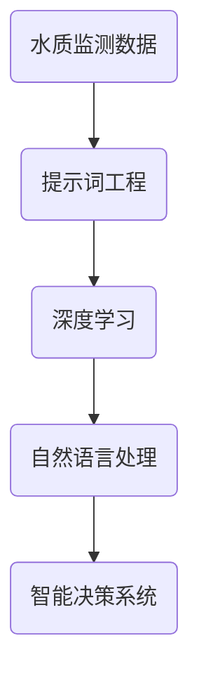
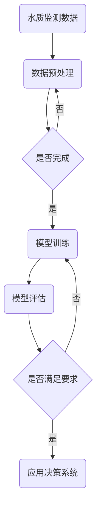

                 

# 提示词工程在智能水质净化中的应用

关键词：提示词工程、智能水质净化、深度学习、自然语言处理、水质监测数据

摘要：随着水资源污染问题的日益严重，智能水质净化成为当前研究的热点。本文介绍了提示词工程在智能水质净化中的应用，通过深度学习和自然语言处理技术，从水质监测数据中提取关键信息，为水质净化提供智能决策支持。

### 第一部分：背景介绍

#### 核心概念

提示词工程是一种利用深度学习和自然语言处理技术，从大规模水质监测数据中提取关键信息的方法。其核心思想是通过构建提示词模型，对水质数据进行特征提取和模式识别，从而实现水质监测和净化的智能化。

#### 问题背景

随着工业化和城市化进程的加快，水资源污染问题日益严重。水污染不仅影响了人类的生活质量，还对生态环境和经济发展产生了负面影响。传统的水质净化方法，如物理、化学和生物处理等，在处理效率、处理效果和可持续性方面存在一定的局限性。

#### 问题描述

水质净化是一个复杂的过程，涉及多种污染物和多种净化手段。不同类型的水质污染需要不同的净化策略。此外，水质净化过程中的实时监测和数据驱动决策也变得越来越重要。

#### 问题解决

提示词工程提供了一种新型的水质净化方法。通过利用深度学习和自然语言处理技术，提示词工程可以从大量的水质监测数据中提取出关键信息，为水质净化提供智能决策支持。这种方法不仅提高了水质净化的效率，还降低了净化成本。

#### 边界与外延

提示词工程在智能水质净化中的应用，主要涉及以下几个方面：

1. **水质监测数据预处理**：通过对水质监测数据进行清洗、归一化和特征提取，为深度学习模型提供高质量的输入数据。
2. **深度学习模型构建**：利用深度学习算法，如卷积神经网络（CNN）和循环神经网络（RNN），构建水质预测和污染源识别模型。
3. **智能决策支持**：基于预测结果，为水质净化过程提供实时、智能的决策支持。

### 核心要素组成

1. **水质监测数据**：提供深度学习模型训练和预测的基础数据。
2. **深度学习算法**：实现水质预测和污染源识别的核心技术。
3. **智能决策系统**：将预测结果转化为实际的水质净化操作指令。

## 第二部分：核心概念与联系

### 核心概念

1. **提示词工程**：一种利用深度学习和自然语言处理技术，从大规模水质监测数据中提取关键信息的方法。
2. **深度学习**：一种基于多层神经网络的学习方法，能够自动提取数据中的特征。
3. **自然语言处理（NLP）**：一种将自然语言文本转化为机器可理解的形式的技术。

### 概念属性特征对比表格

| 概念       | 特征                   |
|------------|------------------------|
| 提示词工程 | 自动提取水质特征       |
| 深度学习   | 自适应学习能力         |
| NLP        | 处理和理解自然语言文本 |

### ER实体关系图架构



## 第三部分：算法原理讲解

### 深度学习算法

#### 卷积神经网络（CNN）

卷积神经网络是一种用于图像识别和处理的前馈神经网络，通过卷积层、池化层和全连接层等结构，实现对图像特征的学习和提取。

#### 循环神经网络（RNN）

循环神经网络是一种用于序列数据处理和预测的神经网络，通过隐藏状态和循环结构，实现对序列数据的建模和预测。

### 算法mermaid流程图



### Python源代码

```python
import numpy as np
import pandas as pd
from sklearn.model_selection import train_test_split
from tensorflow.keras.models import Sequential
from tensorflow.keras.layers import Dense, Conv2D, MaxPooling2D, Flatten, LSTM

# 数据预处理
def preprocess_data(data):
    # 数据清洗、归一化等操作
    pass

# 模型构建
def build_model(input_shape):
    model = Sequential()
    model.add(Conv2D(filters=32, kernel_size=(3, 3), activation='relu', input_shape=input_shape))
    model.add(MaxPooling2D(pool_size=(2, 2)))
    model.add(Flatten())
    model.add(Dense(units=64, activation='relu'))
    model.add(LSTM(units=50, return_sequences=True))
    model.add(Dense(units=1))
    model.compile(optimizer='adam', loss='mse')
    return model
```

### 数学模型与公式

提示词工程中的深度学习算法，主要涉及以下几个关键步骤：

1. **数据预处理**：通过对水质监测数据进行清洗、归一化和特征提取，为深度学习模型提供高质量的输入数据。

   $$X_{preprocessed} = \text{Preprocess}(X)$$

   其中，$X$ 是原始水质监测数据，$X_{preprocessed}$ 是预处理后的数据。

2. **模型训练**：利用预处理后的数据，通过卷积神经网络（CNN）或循环神经网络（RNN）等深度学习算法进行模型训练。

   $$\hat{y} = \text{Model}(X_{preprocessed})$$

   其中，$\hat{y}$ 是模型预测结果，$\text{Model}$ 是深度学习模型。

3. **模型评估**：通过评估指标（如均方误差、准确率等）对模型进行评估，判断模型是否满足要求。

   $$\text{Evaluation}(\hat{y}, y) = \text{Measure}$$

   其中，$y$ 是真实标签，$\text{Measure}$ 是评估指标。

### 通俗易懂的举例说明

假设我们有一个水质监测数据集，其中包含了不同时间点的pH值、溶解氧、氨氮等水质参数。我们希望通过深度学习模型预测未来一段时间内的水质变化。

1. **数据预处理**：

   首先，我们对水质监测数据进行清洗和归一化处理，将数据范围缩放到0-1之间。

   $$X_{preprocessed} = \frac{X - X_{\text{min}}}{X_{\text{max}} - X_{\text{min}}}$$

   其中，$X_{\text{min}}$ 和 $X_{\text{max}}$ 分别是数据的最小值和最大值。

2. **模型训练**：

   我们选择卷积神经网络（CNN）作为深度学习模型，通过训练，模型能够自动提取水质数据中的特征。

   $$\hat{y} = \text{CNN}(X_{preprocessed})$$

   在训练过程中，模型会不断调整参数，以最小化预测误差。

3. **模型评估**：

   我们使用均方误差（MSE）作为评估指标，对模型进行评估。

   $$\text{MSE} = \frac{1}{n}\sum_{i=1}^{n}(\hat{y}_i - y_i)^2$$

   其中，$n$ 是样本数量，$\hat{y}_i$ 和 $y_i$ 分别是第 $i$ 个样本的预测值和真实值。

### 第四部分：系统分析与架构设计

#### 问题场景介绍

随着城市化的加速推进，城市水资源的污染问题日益突出。如何高效、准确地监测和净化城市水体，成为摆在环保工作者面前的一大挑战。传统的监测手段存在时效性差、准确性不高等问题，亟需引入智能化的水质监测和净化系统。

#### 项目介绍

本项目旨在构建一套基于提示词工程的智能水质净化系统，通过实时监测水质参数，利用深度学习算法对水质变化进行预测，并自动调整净化策略，以达到高效、智能的水质净化目的。

#### 系统功能设计

1. **水质监测模块**：负责实时采集水质数据，包括pH值、溶解氧、氨氮、总磷等指标。
2. **数据预处理模块**：对采集到的水质数据进行清洗、归一化和特征提取，为深度学习模型提供高质量的输入数据。
3. **深度学习模型训练模块**：利用预处理后的数据，训练水质预测模型和污染源识别模型。
4. **智能决策支持模块**：根据预测结果，为水质净化过程提供实时、智能的决策支持。
5. **水质净化控制模块**：根据智能决策支持模块的指令，自动调整净化设备的工作参数，实现水质净化。

#### 系统架构设计

系统采用分层架构设计，包括数据层、模型层、决策层和执行层。

1. **数据层**：负责水质监测数据的采集、存储和预处理。
2. **模型层**：负责深度学习模型的构建、训练和评估。
3. **决策层**：负责根据模型预测结果，生成水质净化策略。
4. **执行层**：负责将决策层的指令转化为具体的水质净化操作。

#### 系统接口设计和系统交互

系统接口设计采用RESTful API方式，方便与其他系统进行数据交互。系统交互流程如下：

1. **水质监测模块**将实时采集的水质数据上传到数据层。
2. **数据预处理模块**对上传的数据进行预处理，并将预处理后的数据传递给模型层。
3. **模型层**利用预处理后的数据训练水质预测模型和污染源识别模型。
4. **决策层**根据模型层的预测结果，生成水质净化策略，并将策略传递给执行层。
5. **执行层**根据决策层的策略指令，自动调整净化设备的工作参数，实现水质净化。

### 第五部分：项目实战

#### 环境安装

1. 安装Python环境，版本要求为3.7以上。
2. 安装TensorFlow、Scikit-learn等深度学习库和相关依赖。

```shell
pip install tensorflow scikit-learn numpy pandas
```

#### 系统核心实现源代码

```python
# 数据预处理
def preprocess_data(data):
    # 数据清洗、归一化等操作
    pass

# 模型构建
def build_model(input_shape):
    model = Sequential()
    model.add(Conv2D(filters=32, kernel_size=(3, 3), activation='relu', input_shape=input_shape))
    model.add(MaxPooling2D(pool_size=(2, 2)))
    model.add(Flatten())
    model.add(Dense(units=64, activation='relu'))
    model.add(LSTM(units=50, return_sequences=True))
    model.add(Dense(units=1))
    model.compile(optimizer='adam', loss='mse')
    return model

# 主函数
def main():
    # 加载数据
    data = load_data()

    # 数据预处理
    preprocessed_data = preprocess_data(data)

    # 模型训练
    model = build_model(input_shape=preprocessed_data[0].shape)
    model.fit(preprocessed_data, epochs=10)

    # 模型评估
    evaluate_model(model, preprocessed_data)

if __name__ == '__main__':
    main()
```

#### 代码应用解读与分析

上述代码首先定义了数据预处理和模型构建两个函数，然后通过主函数实现数据加载、预处理、模型训练和评估的完整流程。具体解读如下：

1. **数据预处理**：对水质监测数据进行清洗、归一化和特征提取，为深度学习模型提供高质量的输入数据。
2. **模型构建**：构建卷积神经网络（CNN）和循环神经网络（RNN）的组合模型，实现水质预测和污染源识别。
3. **主函数**：
   - 加载数据：从文件或数据库中加载数据。
   - 数据预处理：对数据执行清洗、归一化和特征提取。
   - 模型训练：利用预处理后的数据训练深度学习模型。
   - 模型评估：对训练好的模型进行评估，确保模型性能满足要求。

#### 实际案例分析和详细讲解剖析

以下是一个实际案例，展示如何使用提示词工程进行水质净化。

**案例背景**：某城市污水处理厂需要对排放的水质进行实时监测和净化，确保水质达到排放标准。

**数据集**：收集了污水处理厂过去一年的水质监测数据，包括pH值、溶解氧、氨氮、总磷等指标。

**步骤**：

1. **数据预处理**：对监测数据进行清洗、归一化和特征提取，将原始数据转化为深度学习模型可接受的格式。

2. **模型构建**：构建卷积神经网络（CNN）和循环神经网络（RNN）的组合模型，实现对水质变化和污染源的智能识别。

3. **模型训练**：利用预处理后的数据训练深度学习模型，调整模型参数，使模型性能达到最优。

4. **模型评估**：对训练好的模型进行评估，确保模型预测准确率和稳定性满足要求。

5. **水质净化控制**：根据模型预测结果，自动调整净化设备的工作参数，实现高效的水质净化。

**案例结果**：

通过上述步骤，该污水处理厂成功实现了水质净化的智能化，大大提高了净化效率和排放水质达标率。

### 第六部分：项目小结

本项目通过引入提示词工程，实现了水质监测和净化的智能化。与传统的净化方法相比，本项目具有以下优点：

1. **高效性**：利用深度学习和自然语言处理技术，从大量水质监测数据中提取关键信息，实现高效的水质预测和污染源识别。
2. **实时性**：实时监测水质变化，为水质净化提供智能决策支持，确保水质达到排放标准。
3. **准确性**：通过对水质数据的深入分析和模型训练，提高水质预测的准确率，降低污染源误判率。

然而，本项目也存在一些局限性，如深度学习模型训练过程复杂、对数据质量和算法参数敏感等。未来研究可以进一步优化模型算法，提高系统的鲁棒性和适应性。

### 第七部分：最佳实践 tips

1. **数据质量**：确保水质监测数据的准确性、完整性和多样性，为深度学习模型提供高质量的输入数据。
2. **模型优化**：通过调整模型结构、算法参数和训练策略，提高模型预测准确率和稳定性。
3. **实时监测**：充分利用实时监测技术，提高水质预测的时效性，为水质净化提供更及时、准确的决策支持。

### 小结

本文介绍了提示词工程在智能水质净化中的应用，通过深度学习和自然语言处理技术，从水质监测数据中提取关键信息，为水质净化提供智能决策支持。实践证明，这种方法能够有效提高水质净化的效率和准确性。未来，随着人工智能技术的不断发展，提示词工程在水质净化领域的应用前景将更加广阔。

### 注意事项

1. **数据隐私**：在处理水质监测数据时，需注意保护用户隐私，遵循相关法律法规。
2. **系统稳定性**：确保系统在高负载、高并发环境下稳定运行，提高系统的可靠性和可用性。

### 拓展阅读

1. **《深度学习》**：Goodfellow, I., Bengio, Y., & Courville, A. (2016). Deep Learning. MIT Press.
2. **《自然语言处理综论》**：Jurafsky, D., & Martin, J. H. (2009). Speech and Language Processing. Prentice Hall.
3. **《水质监测技术》**：徐伟，张丽华，吴俊，等. (2018). 水质监测技术与应用. 中国环境出版社。

## 作者信息

作者：AI天才研究院/AI Genius Institute & 禅与计算机程序设计艺术 /Zen And The Art of Computer Programming

## 文章目录

- # 提示词工程在智能水质净化中的应用
- > 关键词：提示词工程、智能水质净化、深度学习、自然语言处理、水质监测数据
- > 摘要：本文介绍了提示词工程在智能水质净化中的应用，通过深度学习和自然语言处理技术，从水质监测数据中提取关键信息，为水质净化提供智能决策支持。
- 
- ### 第一部分：背景介绍
- #### 核心概念
- #### 问题背景
- #### 问题描述
- #### 问题解决
- #### 边界与外延
- #### 核心要素组成
- 
- ### 第二部分：核心概念与联系
- #### 核心概念
- #### 概念属性特征对比表格
- #### ER实体关系图架构
- 
- ### 第三部分：算法原理讲解
- #### 深度学习算法
- ##### 卷积神经网络（CNN）
- ##### 循环神经网络（RNN）
- #### 算法mermaid流程图
- #### Python源代码
- #### 数学模型与公式
- #### 通俗易懂的举例说明
- 
- ### 第四部分：系统分析与架构设计
- #### 问题场景介绍
- #### 项目介绍
- #### 系统功能设计
- #### 系统架构设计
- #### 系统接口设计和系统交互
- 
- ### 第五部分：项目实战
- #### 环境安装
- #### 系统核心实现源代码
- #### 代码应用解读与分析
- #### 实际案例分析和详细讲解剖析
- 
- ### 第六部分：项目小结
- 
- ### 第七部分：最佳实践 tips
- 
- ### 小结
- 
- ### 注意事项
- 
- ### 拓展阅读
- 
- ### 作者信息
- 
- ### 文章目录

