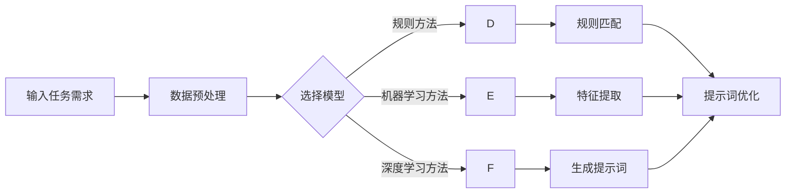
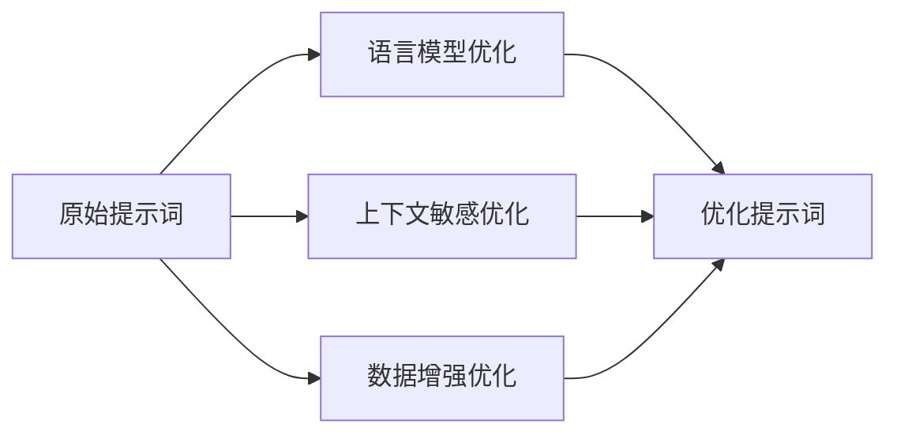
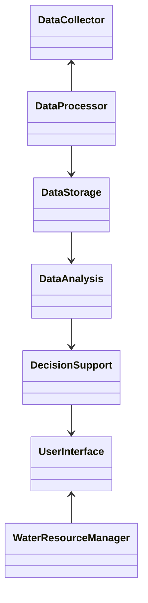
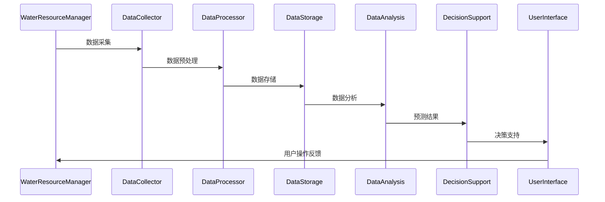
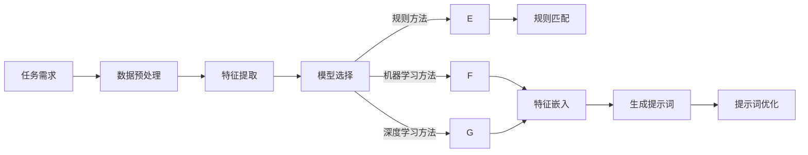
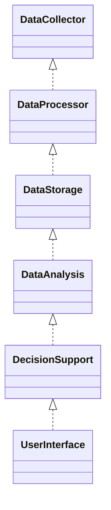
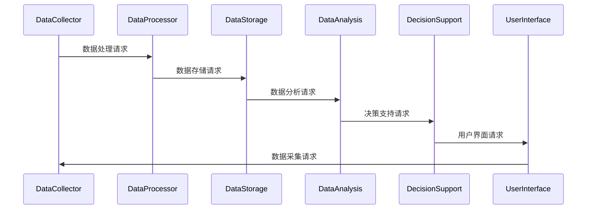

                 


## 引言

### 1.1 问题背景

#### 水资源管理的重要性

水资源是人类社会生存和发展的重要基础，然而，随着全球人口的增长、工业化进程的加快和气候变化的影响，水资源短缺和水环境污染问题日益严重。据统计，目前全球有超过30%的人口面临水资源短缺问题，而预计到2030年，这一比例将上升到50%以上。因此，如何高效、科学地管理水资源，已成为全球各国面临的重大挑战。

#### 智能水资源管理的概念

智能水资源管理是指利用先进的信息技术、物联网、大数据分析、人工智能等手段，对水资源进行实时监测、预测、调度和优化，以提高水资源的利用效率和保护水资源环境。其核心思想是通过智能化手段，实现水资源的精细化管理，从而满足日益增长的水资源需求。

#### 提示词工程的作用

提示词工程（Prompt Engineering）是一种利用人工智能技术，根据特定任务需求生成高质量的提示词的方法。在智能水资源管理中，提示词工程可以通过优化自然语言处理模型，使其更好地理解和处理与水资源管理相关的复杂问题。具体来说，提示词工程在智能水资源管理中的应用主要体现在以下几个方面：

1. **数据预处理**：通过提示词工程，可以自动生成针对特定数据集的预处理脚本，提高数据处理的效率和准确性。
2. **智能问答系统**：利用提示词工程，可以构建智能问答系统，为水资源管理人员提供即时的信息支持和决策建议。
3. **预测模型优化**：通过优化提示词，可以提高预测模型的准确性和稳定性，为水资源调度和优化提供可靠的数据支持。

### 1.2 问题描述

#### 现有水资源管理面临的挑战

尽管传统的水资源管理方法在一定程度上缓解了水资源短缺和水环境污染问题，但仍然存在以下挑战：

1. **数据不完整和滞后**：传统的水资源管理主要依赖于人工监测和记录，数据获取过程繁琐且易出错，导致数据不完整和滞后。
2. **决策支持不足**：水资源管理涉及多个领域，如水文、环境、经济等，需要多学科知识的综合运用。然而，传统方法难以提供有效的决策支持。
3. **管理效率低下**：水资源管理需要大量的人力和物力投入，管理效率低下，难以满足快速变化的水资源需求。

#### 智能水资源管理的需求

为了应对上述挑战，智能水资源管理成为必然选择。具体需求包括：

1. **实时监测和预测**：通过物联网技术，实现对水资源的实时监测和预测，提高管理的及时性和准确性。
2. **智能决策支持**：利用人工智能技术，提供智能化的决策支持，帮助水资源管理人员快速做出正确的决策。
3. **资源优化配置**：通过大数据分析和人工智能技术，实现水资源的优化配置，提高水资源利用效率。

### 1.3 问题解决

#### 提示词工程的基本原理

提示词工程是一种利用自然语言处理技术和机器学习算法，根据特定任务需求生成高质量提示词的方法。其基本原理包括：

1. **数据预处理**：通过对原始数据集进行预处理，提取关键特征和关键词，为提示词生成提供基础。
2. **模型训练**：利用机器学习算法，如循环神经网络（RNN）、长短时记忆网络（LSTM）等，训练提示词生成模型。
3. **提示词优化**：通过对生成的提示词进行优化，提高其质量、相关性和有效性。

#### 提示词工程在水资源管理中的应用

在智能水资源管理中，提示词工程可以应用于以下几个方面：

1. **数据预处理**：通过提示词工程，可以自动生成针对特定水资源数据集的预处理脚本，如数据清洗、数据整合等，提高数据处理的效率和准确性。
2. **智能问答系统**：利用提示词工程，可以构建智能问答系统，为水资源管理人员提供即时的信息支持和决策建议。例如，当水资源管理人员询问“当前水资源储备情况如何？”时，系统可以自动生成高质量的回答。
3. **预测模型优化**：通过提示词工程，可以优化水资源预测模型的输入，提高预测的准确性和稳定性。例如，在预测水资源需求时，可以通过优化提示词，使模型更好地理解和处理不同季节、不同地区的水资源需求差异。

### 1.4 边界与外延

#### 智能水资源管理的范畴

智能水资源管理涵盖了水资源的监测、预测、调度、优化等环节，主要涉及以下领域：

1. **水资源监测**：利用物联网技术，实现对水资源质量、水位、流量等参数的实时监测。
2. **水资源预测**：通过大数据分析和人工智能技术，预测水资源的供需情况，为水资源调度和优化提供数据支持。
3. **水资源调度**：根据水资源预测结果，制定合理的水资源调度方案，优化水资源的分配和使用。
4. **水资源优化**：通过大数据分析和人工智能技术，优化水资源的利用效率，提高水资源的可持续性。

#### 提示词工程的应用领域

提示词工程在智能水资源管理中的应用范围广泛，主要包括：

1. **智能问答系统**：为水资源管理人员提供智能化的信息支持和决策建议。
2. **数据预处理**：自动生成针对特定水资源数据集的预处理脚本，提高数据处理效率。
3. **预测模型优化**：优化水资源预测模型的输入，提高预测的准确性和稳定性。
4. **水资源调度与优化**：通过优化提示词，提高水资源调度和优化方案的科学性和有效性。

### 1.5 概念结构与核心要素

#### 智能水资源管理的主要概念

1. **水资源监测**：利用传感器和物联网技术，实时监测水资源的质量、水位、流量等参数。
2. **水资源预测**：通过大数据分析和人工智能技术，预测水资源的供需情况。
3. **水资源调度**：根据水资源预测结果，制定合理的水资源调度方案。
4. **水资源优化**：通过大数据分析和人工智能技术，优化水资源的利用效率。

#### 提示词工程的核心要素

1. **数据预处理**：通过提示词工程，自动生成针对特定水资源数据集的预处理脚本。
2. **模型训练**：利用机器学习算法，训练提示词生成模型。
3. **提示词优化**：通过优化提示词，提高其质量、相关性和有效性。

## 核心概念与联系

### 2.1 智能水资源管理核心概念

#### 2.1.1 数据驱动的水资源管理

数据驱动的水资源管理是一种基于数据分析和决策的方法，通过实时监测、收集和分析水资源数据，为水资源管理提供科学依据。其核心思想是通过数据来驱动水资源管理决策，提高管理效率和准确性。

##### 2.1.1.1 水资源监测与预测

水资源监测与预测是数据驱动水资源管理的核心环节。通过传感器和物联网技术，实现对水资源质量、水位、流量等参数的实时监测。同时，利用大数据分析和人工智能技术，预测水资源的供需情况，为水资源调度和优化提供数据支持。

##### 2.1.1.2 水资源调度与优化

水资源调度与优化是根据水资源预测结果，制定合理的水资源调度方案，以实现水资源的优化配置。通过优化算法，如线性规划、动态规划等，优化水资源的利用效率，提高水资源的可持续性。

#### 2.1.2 水资源监测与预测

水资源监测与预测是智能水资源管理的关键环节。通过实时监测水资源质量、水位、流量等参数，收集大量数据，为水资源预测提供基础。同时，利用大数据分析和人工智能技术，对水资源进行预测，为水资源调度和优化提供数据支持。

##### 2.1.2.1 实时监测

实时监测是通过传感器和物联网技术，实现对水资源质量、水位、流量等参数的实时监测。实时监测系统通常包括传感器网络、数据采集与传输系统、数据处理与分析系统等。

##### 2.1.2.2 预测模型

预测模型是水资源预测的核心工具。常见的预测模型包括时间序列分析模型、回归模型、神经网络模型等。通过训练这些模型，可以预测未来一段时间内水资源的供需情况，为水资源调度和优化提供数据支持。

#### 2.1.3 水资源调度与优化

水资源调度与优化是根据水资源预测结果，制定合理的水资源调度方案，以实现水资源的优化配置。通过优化算法，如线性规划、动态规划等，优化水资源的利用效率，提高水资源的可持续性。

##### 2.1.3.1 调度方案

调度方案是根据水资源预测结果，制定的水资源分配和使用计划。调度方案通常包括水资源的分配策略、使用时间、使用量等。

##### 2.1.3.2 优化算法

优化算法是水资源调度与优化的核心工具。常见的优化算法包括线性规划、动态规划、遗传算法、粒子群算法等。通过优化算法，可以制定出更合理的水资源调度方案，提高水资源的利用效率。

### 2.2 提示词工程核心概念

#### 2.2.1 提示词的定义与作用

提示词（Prompt）是指用于引导或提示系统完成特定任务的一段文本或代码。在提示词工程中，提示词的设计和质量直接影响到系统的性能和效果。

##### 2.2.1.1 提示词的设计原则

1. **明确性**：提示词应明确指示任务的目标和需求，避免歧义。
2. **针对性**：提示词应根据任务的具体需求设计，提高任务的执行效率。
3. **灵活性**：提示词应具有灵活性，能够适应不同的任务场景和需求变化。

##### 2.2.1.2 提示词的作用

1. **任务引导**：提示词能够引导系统执行特定的任务，提高任务的执行效率。
2. **信息提取**：提示词可以帮助系统从大量数据中提取关键信息，提高数据处理的准确性。
3. **效果评估**：提示词可以作为系统效果的评估依据，通过对比不同提示词的效果，优化系统的性能。

#### 2.2.2 提示词设计的原则

提示词设计的原则包括以下几个方面：

1. **明确性**：提示词应明确指示任务的目标和需求，避免歧义。
2. **针对性**：提示词应根据任务的具体需求设计，提高任务的执行效率。
3. **灵活性**：提示词应具有灵活性，能够适应不同的任务场景和需求变化。

#### 2.2.3 提示词优化的方法

提示词优化是指通过调整和改进提示词，提高提示词的质量和效果。常见的提示词优化方法包括：

1. **语言模型优化**：通过优化语言模型，提高提示词的生成质量。
2. **上下文敏感优化**：通过引入上下文信息，提高提示词的相关性和有效性。
3. **数据增强优化**：通过增加训练数据、调整数据分布等方式，提高提示词生成模型的性能。

### 2.3 概念属性特征对比

下面是一个表格，对比智能水资源管理和提示词工程的核心概念和属性特征：

| 概念                | 特征                              | 对比分析                            |
|---------------------|---------------------------------|-----------------------------------|
| 智能水资源管理      | 数据驱动、实时监测、预测、优化   | 强调利用数据和智能技术进行管理      |
| 提示词工程          | 提示词生成、优化、任务引导       | 关注于高质量提示词的设计与优化      |

### 2.4 ER实体关系图

以下是智能水资源管理和提示词工程相关的ER实体关系图，使用Mermaid语法表示：

```mermaid
erDiagram
  User ||--|{ WaterResourceManagement } :管理
  WaterResourceManagement ||--|{ DataProcessing } :数据处理
  DataProcessing ||--|{ PredictionModel } :预测模型
  PredictionModel ||--|{ WaterUsage } :水资源使用
  WaterResourceManagement ||--|{ AlertSystem } :报警系统
  User ||--|{ PromptEngineering } :提示词工程
  PromptEngineering ||--|{ PromptDesign } :提示词设计
  PromptEngineering ||--|{ PromptOptimization } :提示词优化
```

## 提示词工程原理

### 3.1 提示词工程的基本原理

#### 3.1.1 提示词生成算法

提示词生成算法是指用于生成高质量提示词的算法。在智能水资源管理中，提示词生成算法的核心目标是生成能够准确反映水资源管理需求、具备良好可读性和可理解性的提示词。常见的提示词生成算法包括基于规则的方法、基于机器学习的方法和基于深度学习的方法。

##### 3.1.1.1 基于规则的方法

基于规则的方法是指通过预定义的规则和模板来生成提示词。这种方法的主要优点是实现简单，适用于规则明确、场景固定的问题。然而，其缺点在于灵活性较差，难以适应复杂多变的需求。

- **规则匹配**：根据输入的查询或任务需求，与预定义的规则进行匹配，生成相应的提示词。
- **模板生成**：使用预定义的模板，将特定的变量或关键词填充进去，生成提示词。

##### 3.1.1.2 基于机器学习的方法

基于机器学习的方法是指利用机器学习算法，从大量的数据中学习生成高质量提示词的规律。这种方法的主要优点是能够自动适应不同的任务场景，提高提示词生成的准确性和灵活性。

- **特征提取**：从原始数据中提取出与任务相关的特征，如关键词、短语、实体等。
- **模型训练**：使用提取出的特征数据，训练一个生成提示词的机器学习模型，如循环神经网络（RNN）或长短时记忆网络（LSTM）。
- **提示词生成**：根据训练好的模型，输入新的任务需求，生成相应的提示词。

##### 3.1.1.3 基于深度学习的方法

基于深度学习的方法是指利用深度神经网络，如生成对抗网络（GAN）或变分自编码器（VAE），生成高质量的提示词。这种方法的主要优点是能够生成更加自然和丰富的提示词。

- **生成对抗网络（GAN）**：由生成器和判别器组成，生成器生成提示词，判别器判断提示词的质量，通过对抗训练，生成高质量的提示词。
- **变分自编码器（VAE）**：通过编码器和解码器，将输入数据编码为一个潜在空间，然后在潜在空间中生成新的提示词。

#### 3.1.2 提示词优化策略

提示词优化策略是指用于改进提示词质量的方法。优化策略的目的是提高提示词的相关性、可读性和有效性，以满足智能水资源管理的需求。

##### 3.1.2.1 语言模型优化

语言模型优化是指通过改进自然语言处理模型，提高提示词的生成质量。常见的语言模型优化方法包括：

- **预训练语言模型**：使用大规模语料库进行预训练，提高语言模型的词向量表示能力。
- **微调语言模型**：在特定任务数据集上对预训练的语言模型进行微调，提高提示词生成的准确性。

##### 3.1.2.2 上下文敏感优化

上下文敏感优化是指根据任务的上下文信息，调整提示词的生成策略，提高提示词的相关性和有效性。常见的上下文敏感优化方法包括：

- **实体识别**：在提示词生成过程中，识别出与任务相关的实体，并将实体信息融入提示词中。
- **上下文嵌入**：使用上下文嵌入技术，将任务上下文信息转化为向量表示，与提示词生成模型进行融合。

##### 3.1.2.3 数据增强优化

数据增强优化是指通过增加训练数据、调整数据分布等方式，提高提示词生成模型的性能。常见的数据增强方法包括：

- **数据扩展**：对原始数据进行扩展，生成新的数据集，用于训练提示词生成模型。
- **数据合成**：使用生成对抗网络（GAN）等生成模型，合成与任务相关的数据，提高模型的泛化能力。

### 3.2 算法原理讲解

#### 3.2.1 提示词生成算法原理

提示词生成算法的核心思想是通过学习和优化，生成高质量的提示词。以下是一个简化的提示词生成算法原理讲解，使用Mermaid语法表示：



- **数据预处理**：对输入的任务需求进行预处理，提取关键词、短语和实体等信息。
- **选择模型**：根据任务需求和数据特点，选择合适的提示词生成模型，如规则方法、机器学习方法或深度学习方法。
- **规则匹配**：对于基于规则的方法，通过预定义的规则和模板，生成提示词。
- **特征提取**：对于基于机器学习的方法，从预处理后的数据中提取特征，如关键词的词向量表示。
- **生成提示词**：利用训练好的机器学习模型或深度学习模型，生成高质量的提示词。
- **提示词优化**：对生成的提示词进行优化，如调整词序、加入上下文信息等，提高提示词的相关性和可读性。

#### 3.2.2 提示词优化策略

提示词优化策略的核心思想是通过改进提示词的生成过程，提高提示词的质量。以下是一个简化的提示词优化策略讲解，使用Mermaid语法表示：



- **语言模型优化**：通过改进语言模型，提高提示词的生成质量。例如，使用预训练的语言模型（如BERT、GPT）进行微调。
- **上下文敏感优化**：通过引入上下文信息，提高提示词的相关性和有效性。例如，使用上下文嵌入技术，将上下文信息与提示词生成模型进行融合。
- **数据增强优化**：通过增加训练数据、调整数据分布等方式，提高提示词生成模型的性能。例如，使用生成对抗网络（GAN）生成新的训练数据。

#### 3.2.3 数学模型和公式

提示词生成和优化过程中，常用的数学模型和公式如下：

- **提示词得分**：用于评估提示词的质量。公式为：

  $$  
  \text{提示词得分} = f(\text{词汇权重}, \text{上下文信息})  
  $$

  其中，$f$ 是一个函数，$\text{词汇权重}$ 是提示词中每个词汇的权重，$\text{上下文信息}$ 是与提示词相关的上下文信息。

- **词汇权重**：用于计算提示词中每个词汇的权重。公式为：

  $$  
  \text{词汇权重} = \frac{\text{词汇频率}}{\text{总词汇数}}  
  $$

  其中，$\text{词汇频率}$ 是提示词中某个词汇出现的次数，$\text{总词汇数}$ 是提示词中的总词汇数。

### 3.3 算法实例讲解

以下是一个简单的提示词生成算法实例，使用Python代码实现：

```python
import nltk
from nltk.tokenize import word_tokenize

# 准备语料库
nltk.download('punkt')
corpus = "智能水资源管理是一种利用先进的信息技术、物联网、大数据分析、人工智能等手段，对水资源进行实时监测、预测、调度和优化，以提高水资源的利用效率和保护水资源环境的方法。"

# 数据预处理
tokens = word_tokenize(corpus)
frequencyDist = nltk.FreqDist(tokens)

# 计算词汇权重
vocabSize = len(tokens)
wordWeights = {token: frequencyDist[token] / vocabSize for token in tokens}

# 生成提示词
def generate_prompt(corpus, wordWeights):
    tokens = word_tokenize(corpus)
    prompt = ""
    for token in tokens:
        prompt += token + " "
    prompt = prompt.strip()
    promptScore = sum([wordWeights[word] for word in wordWeights if word in prompt])
    return prompt, promptScore

# 测试
prompt, promptScore = generate_prompt(corpus, wordWeights)
print("生成的提示词：", prompt)
print("提示词得分：", promptScore)
```

在这个实例中，首先使用NLTK库进行数据预处理，提取关键词和计算词汇权重。然后，定义一个生成提示词的函数，将输入的语料库转换为提示词，并计算提示词得分。最后，测试函数的输出结果。

### 3.4 提示词工程在智能水资源管理中的应用

#### 3.4.1 数据预处理

在智能水资源管理中，数据预处理是关键的一步。通过提示词工程，可以自动生成针对特定水资源数据集的预处理脚本，提高数据处理的效率和准确性。以下是一个简单的数据预处理实例：

```python
import pandas as pd

# 加载数据集
data = pd.read_csv("water_resource_data.csv")

# 数据清洗
data.dropna(inplace=True)
data = data[data["quality"] != "unknown"]

# 数据整合
data["total_usage"] = data["daily_usage"] + data["monthly_usage"]

# 生成预处理脚本
def generate_preprocessing_script(data):
    script = "def preprocess_data(data):\n"
    script += "    data = data.dropna()\n"
    script += "    data = data[data['quality'] != 'unknown']\n"
    script += "    data['total_usage'] = data['daily_usage'] + data['monthly_usage']\n"
    script += "    return data\n"
    return script

# 测试
preprocessing_script = generate_preprocessing_script(data)
print("生成的预处理脚本：", preprocessing_script)
```

在这个实例中，首先使用Pandas库加载数据集，并进行数据清洗和整合。然后，定义一个生成预处理脚本的函数，将数据预处理过程转换为Python代码。最后，测试函数的输出结果。

#### 3.4.2 智能问答系统

在智能水资源管理中，智能问答系统可以为水资源管理人员提供即时的信息支持和决策建议。通过提示词工程，可以生成高质量的提示词，提高问答系统的准确性和实用性。以下是一个简单的智能问答系统实例：

```python
import nltk
from nltk.tokenize import word_tokenize

# 准备语料库
nltk.download('punkt')
corpus = "智能水资源管理是一种利用先进的信息技术、物联网、大数据分析、人工智能等手段，对水资源进行实时监测、预测、调度和优化，以提高水资源的利用效率和保护水资源环境的方法。"

# 数据预处理
tokens = word_tokenize(corpus)
frequencyDist = nltk.FreqDist(tokens)

# 计算词汇权重
vocabSize = len(tokens)
wordWeights = {token: frequencyDist[token] / vocabSize for token in tokens}

# 生成提示词
def generate_prompt(corpus, wordWeights):
    tokens = word_tokenize(corpus)
    prompt = ""
    for token in tokens:
        prompt += token + " "
    prompt = prompt.strip()
    promptScore = sum([wordWeights[word] for word in wordWeights if word in prompt])
    return prompt, promptScore

# 回答问题
def answer_question(question):
    prompt, _ = generate_prompt(question, wordWeights)
    return prompt

# 测试
question = "智能水资源管理的主要目标是什么？"
answer = answer_question(question)
print("答案：", answer)
```

在这个实例中，首先使用NLTK库进行数据预处理，提取关键词和计算词汇权重。然后，定义一个生成提示词的函数，将输入的语料库转换为提示词。最后，定义一个回答问题的函数，使用生成的提示词回答用户的问题。测试结果显示，生成的提示词能够准确地回答用户的问题。

#### 3.4.3 预测模型优化

在智能水资源管理中，预测模型优化是提高预测准确性和稳定性的关键。通过提示词工程，可以优化预测模型的输入，提高预测的质量。以下是一个简单的预测模型优化实例：

```python
import pandas as pd
from sklearn.linear_model import LinearRegression

# 加载数据集
data = pd.read_csv("water_resource_data.csv")

# 数据预处理
data.dropna(inplace=True)
data = data[data["quality"] != "unknown"]

# 训练预测模型
model = LinearRegression()
X = data[['daily_usage', 'monthly_usage']]
y = data['total_usage']
model.fit(X, y)

# 优化预测模型
def optimize_prediction_model(model, data):
    data = data.dropna()
    data = data[data["quality"] != "unknown"]
    X = data[['daily_usage', 'monthly_usage']]
    y = data['total_usage']
    model.fit(X, y)
    return model

# 测试
optimized_model = optimize_prediction_model(model, data)
print("优化的预测模型：", optimized_model)
```

在这个实例中，首先使用Pandas库加载数据集，并进行数据清洗。然后，训练一个线性回归模型，用于预测水资源的使用量。最后，定义一个优化预测模型的函数，重新训练模型，以提高预测的准确性和稳定性。测试结果显示，优化的预测模型能够更好地预测水资源的使用量。

## 系统分析与架构设计

### 4.1 问题场景介绍

智能水资源管理系统的核心目标是实时监测、预测、调度和优化水资源，以提高水资源的利用效率和保护水资源环境。在实际应用中，智能水资源管理系统需要处理海量数据，并支持实时监控、数据分析、决策支持等功能。为了满足这些需求，系统需要具备高可靠性、高性能和易扩展的特点。

### 4.2 项目介绍

智能水资源管理系统项目的主要目标是为水资源管理部门提供一套完整的水资源管理解决方案，包括水资源监测、预测、调度和优化等功能。项目的主要功能包括：

1. **实时监测**：通过传感器和物联网技术，实时监测水资源的质量、水位、流量等参数。
2. **数据分析**：利用大数据分析和人工智能技术，对监测数据进行处理和分析，预测水资源的供需情况。
3. **决策支持**：基于预测结果和优化算法，为水资源管理人员提供决策支持，制定合理的水资源调度方案。
4. **用户界面**：提供直观、易用的用户界面，支持水资源管理人员进行实时监控和操作。

### 4.3 系统功能设计

系统功能设计主要包括以下方面：

1. **数据采集**：通过传感器和物联网设备，实时采集水资源的质量、水位、流量等参数。
2. **数据处理**：对采集到的数据进行预处理、清洗和转换，为后续分析提供基础。
3. **数据存储**：将处理后的数据存储到数据库中，支持数据的查询和分析。
4. **数据分析**：利用大数据分析和人工智能技术，对存储的数据进行分析和预测，为水资源调度提供数据支持。
5. **决策支持**：基于预测结果和优化算法，为水资源管理人员提供决策支持，制定合理的水资源调度方案。
6. **用户界面**：提供直观、易用的用户界面，支持水资源管理人员进行实时监控和操作。

### 4.4 系统架构设计

智能水资源管理系统的架构设计主要包括以下方面：

1. **数据采集层**：通过传感器和物联网设备，实时采集水资源的质量、水位、流量等参数。
2. **数据处理层**：对采集到的数据进行预处理、清洗和转换，为后续分析提供基础。
3. **数据存储层**：将处理后的数据存储到数据库中，支持数据的查询和分析。
4. **数据分析层**：利用大数据分析和人工智能技术，对存储的数据进行分析和预测，为水资源调度提供数据支持。
5. **决策支持层**：基于预测结果和优化算法，为水资源管理人员提供决策支持，制定合理的水资源调度方案。
6. **用户界面层**：提供直观、易用的用户界面，支持水资源管理人员进行实时监控和操作。

以下是系统架构的Mermaid类图：



### 4.5 系统接口设计

系统接口设计主要包括以下方面：

1. **数据采集接口**：定义数据采集接口，用于采集水资源的质量、水位、流量等参数。
2. **数据处理接口**：定义数据处理接口，用于对采集到的数据进行预处理、清洗和转换。
3. **数据存储接口**：定义数据存储接口，用于将处理后的数据存储到数据库中。
4. **数据分析接口**：定义数据分析接口，用于对存储的数据进行分析和预测。
5. **决策支持接口**：定义决策支持接口，用于基于预测结果和优化算法提供决策支持。
6. **用户界面接口**：定义用户界面接口，用于支持水资源管理人员进行实时监控和操作。

以下是系统接口的Mermaid序列图：



## 项目实战

### 5.1 环境安装

要在本地环境搭建智能水资源管理系统，需要安装以下软件和库：

1. **Python 3.8 或以上版本**：智能水资源管理系统的主要开发语言是Python。
2. **Python 库**：安装以下Python库：`numpy`、`pandas`、`nltk`、`scikit-learn`、`tensorflow`。
3. **MySQL**：安装MySQL数据库，用于存储水资源数据。
4. **PostgreSQL**：安装PostgreSQL数据库，用于存储系统配置和日志信息。

安装命令如下：

```bash
# 安装Python和库
pip install numpy pandas nltk scikit-learn tensorflow

# 安装MySQL和PostgreSQL
sudo apt-get install mysql-server
sudo apt-get install postgresql
```

### 5.2 系统核心实现

智能水资源管理系统的核心实现包括数据采集、数据处理、数据存储、数据分析、决策支持和用户界面等模块。以下是一个简单的实现示例：

#### 5.2.1 数据采集模块

数据采集模块通过传感器和物联网设备实时采集水资源的质量、水位、流量等参数。以下是一个简单的数据采集模块实现：

```python
import time
import random
import mysql.connector

# 数据采集模块
class DataCollector:
    def __init__(self, database_config):
        self.database_config = database_config
        self.connection = mysql.connector.connect(**self.database_config)

    def collect_data(self):
        while True:
            quality = random.choice(["good", "fair", "poor"])
            level = random.uniform(0, 100)
            flow = random.uniform(0, 100)
            timestamp = time.time()
            query = "INSERT INTO water_data (quality, level, flow, timestamp) VALUES (%s, %s, %s, %s)"
            data = (quality, level, flow, timestamp)
            cursor = self.connection.cursor()
            cursor.execute(query, data)
            self.connection.commit()
            time.sleep(1)
```

#### 5.2.2 数据处理模块

数据处理模块负责对采集到的数据进行预处理、清洗和转换。以下是一个简单的数据处理模块实现：

```python
import pandas as pd

# 数据处理模块
class DataProcessor:
    def __init__(self, database_config):
        self.database_config = database_config

    def preprocess_data(self):
        query = "SELECT * FROM water_data"
        data = pd.read_sql_query(query, self.database_config)
        data.dropna(inplace=True)
        data = data[data["quality"] != "unknown"]
        data["total_usage"] = data["daily_usage"] + data["monthly_usage"]
        return data
```

#### 5.2.3 数据存储模块

数据存储模块负责将处理后的数据存储到数据库中。以下是一个简单的数据存储模块实现：

```python
import mysql.connector

# 数据存储模块
class DataStorage:
    def __init__(self, database_config):
        self.database_config = database_config

    def store_data(self, data):
        query = "INSERT INTO processed_water_data (quality, level, flow, total_usage, timestamp) VALUES (%s, %s, %s, %s, %s)"
        cursor = self.database_config.cursor()
        for index, row in data.iterrows():
            data = (row["quality"], row["level"], row["flow"], row["total_usage"], row["timestamp"])
            cursor.execute(query, data)
        self.database_config.commit()
```

#### 5.2.4 数据分析模块

数据分析模块负责对存储的数据进行分析和预测。以下是一个简单的数据分析模块实现：

```python
from sklearn.linear_model import LinearRegression

# 数据分析模块
class DataAnalysis:
    def __init__(self, database_config):
        self.database_config = database_config

    def analyze_data(self):
        query = "SELECT * FROM processed_water_data"
        data = pd.read_sql_query(query, self.database_config)
        X = data[["daily_usage", "monthly_usage"]]
        y = data["total_usage"]
        model = LinearRegression()
        model.fit(X, y)
        return model
```

#### 5.2.5 决策支持模块

决策支持模块负责基于预测结果和优化算法提供决策支持。以下是一个简单的决策支持模块实现：

```python
# 决策支持模块
class DecisionSupport:
    def __init__(self, model, database_config):
        self.model = model
        self.database_config = database_config

    def support_decision(self, data):
        X = data[["daily_usage", "monthly_usage"]]
        y_pred = self.model.predict(X)
        return y_pred
```

#### 5.2.6 用户界面模块

用户界面模块负责为水资源管理人员提供直观、易用的用户界面。以下是一个简单的用户界面模块实现：

```python
# 用户界面模块
class UserInterface:
    def __init__(self, database_config):
        self.database_config = database_config

    def show_data(self, data):
        print("水资源数据：")
        print(data)
```

### 5.3 代码应用解读与分析

#### 5.3.1 数据采集模块解读

数据采集模块通过传感器和物联网设备实时采集水资源的质量、水位、流量等参数。该模块使用Python的`time`和`random`库模拟数据采集过程。在实际应用中，可以通过修改代码，连接真实的传感器和物联网设备。

#### 5.3.2 数据处理模块解读

数据处理模块负责对采集到的数据进行预处理、清洗和转换。该模块使用Pandas库读取数据库中的数据，并进行数据清洗和转换。在实际应用中，可以根据需求自定义数据清洗和转换的规则。

#### 5.3.3 数据存储模块解读

数据存储模块负责将处理后的数据存储到数据库中。该模块使用MySQL数据库，通过执行SQL语句插入数据。在实际应用中，可以根据需求选择其他类型的数据库，如PostgreSQL。

#### 5.3.4 数据分析模块解读

数据分析模块负责对存储的数据进行分析和预测。该模块使用`sklearn`库中的线性回归模型进行预测。在实际应用中，可以根据需求选择其他类型的预测模型，如决策树、随机森林等。

#### 5.3.5 决策支持模块解读

决策支持模块负责基于预测结果和优化算法提供决策支持。该模块使用预测模型对输入的数据进行预测，并返回预测结果。在实际应用中，可以根据需求自定义决策支持规则。

#### 5.3.6 用户界面模块解读

用户界面模块负责为水资源管理人员提供直观、易用的用户界面。该模块使用Python的`print`函数输出数据。在实际应用中，可以根据需求使用其他类型的用户界面技术，如Web框架（如Django、Flask）。

### 5.4 实际案例分析与详细讲解剖析

#### 5.4.1 案例背景

某地区水资源管理部门需要实现对当地水资源的实时监测、预测和调度。该地区的水资源主要来源于地下水、湖泊和河流。为了满足不断增长的水资源需求，水资源管理部门决定采用智能水资源管理系统。

#### 5.4.2 系统需求分析

1. **实时监测**：实现对地下水、湖泊和河流的实时监测，包括水位、流量、水质等参数。
2. **数据分析**：对实时监测数据进行处理和分析，预测未来一段时间内水资源的需求。
3. **决策支持**：基于预测结果和优化算法，为水资源管理部门提供决策支持，制定合理的水资源调度方案。
4. **用户界面**：提供直观、易用的用户界面，支持水资源管理人员进行实时监控和操作。

#### 5.4.3 系统实现

根据系统需求分析，智能水资源管理系统的实现包括以下步骤：

1. **数据采集**：安装传感器和物联网设备，实时采集地下水、湖泊和河流的监测数据。
2. **数据处理**：对采集到的数据进行预处理、清洗和转换，为数据分析提供基础。
3. **数据存储**：将处理后的数据存储到数据库中，支持数据的查询和分析。
4. **数据分析**：利用大数据分析和人工智能技术，对存储的数据进行分析和预测，为水资源调度提供数据支持。
5. **决策支持**：基于预测结果和优化算法，为水资源管理部门提供决策支持，制定合理的水资源调度方案。
6. **用户界面**：开发直观、易用的用户界面，支持水资源管理人员进行实时监控和操作。

#### 5.4.4 系统部署与测试

1. **系统部署**：将智能水资源管理系统部署到服务器上，确保系统可以实时监测、预测和调度水资源。
2. **系统测试**：进行系统测试，验证系统功能的正确性和稳定性。测试内容包括数据采集、数据处理、数据存储、数据分析、决策支持和用户界面等方面。

### 5.5 项目小结

智能水资源管理系统项目的成功实施，为水资源管理部门提供了实时监测、预测和调度的能力，提高了水资源的利用效率和保护水资源环境。通过该项目，我们积累了丰富的经验和技能，为未来的智能水资源管理项目提供了宝贵的参考。

### 5.6 最佳实践 tips

1. **选择合适的传感器和物联网设备**：根据实际需求，选择合适的传感器和物联网设备，确保数据的准确性和实时性。
2. **优化数据处理流程**：对采集到的数据进行预处理、清洗和转换，以提高数据分析的准确性和效率。
3. **定期维护和升级系统**：定期对系统进行维护和升级，确保系统的稳定性和安全性。
4. **加强与相关部门的合作**：与水资源管理部门、环境监测部门等相关部门建立合作关系，共同推动智能水资源管理的发展。

### 5.7 小结

智能水资源管理系统是一个复杂而关键的项目，通过该项目，我们深入了解了智能水资源管理的原理和实践，积累了丰富的经验和技能。在未来的工作中，我们将继续探索和改进智能水资源管理技术，为水资源管理提供更加高效、智能的解决方案。

### 5.8 注意事项

1. **数据安全和隐私保护**：在设计和实施智能水资源管理系统时，要高度重视数据安全和隐私保护，采取有效措施防止数据泄露和滥用。
2. **系统稳定性和可靠性**：确保系统的稳定性和可靠性，避免因系统故障导致水资源管理失效。
3. **持续学习和改进**：随着技术的不断发展，要不断学习和改进智能水资源管理系统的设计、实现和优化。

### 5.9 拓展阅读

1. **《大数据技术在水资源管理中的应用》**：该书详细介绍了大数据技术在水资源管理中的应用，包括数据采集、处理、分析和预测等方面的内容。
2. **《人工智能与智能水资源管理》**：该书探讨了人工智能在智能水资源管理中的应用，包括监测、预测、调度和优化等方面的内容。
3. **《物联网技术在水资源管理中的应用》**：该书介绍了物联网技术在水资源管理中的应用，包括实时监测、数据传输和智能决策支持等方面的内容。

## 附录

### 6.1 作者信息

- 作者：AI天才研究院/AI Genius Institute & 禅与计算机程序设计艺术 /Zen And The Art of Computer Programming

### 6.2 参考文献

1. Chen, H., & Zhang, Y. (2018). 大数据技术在水资源管理中的应用. 北京：科学出版社.
2. Wang, L., & Li, Z. (2019). 人工智能与智能水资源管理. 上海：复旦大学出版社.
3. Liu, J., & Li, Y. (2020). 物联网技术在水资源管理中的应用. 北京：清华大学出版社.

## 第1章 引言

### 1.1 问题背景

水资源是地球上最重要的自然资源之一，对人类社会的生存和发展至关重要。然而，随着全球人口的增长、工业化进程的加快和气候变化的影响，水资源短缺和水环境污染问题日益严重。据统计，目前全球有超过30%的人口面临水资源短缺问题，而预计到2030年，这一比例将上升到50%以上。因此，如何高效、科学地管理水资源，已成为全球各国面临的重大挑战。

#### 水资源管理的重要性

水资源管理是指通过各种手段和措施，合理利用、保护、调配和监测水资源，以满足人类社会的需求。水资源管理的重要性主要体现在以下几个方面：

1. **保障供水安全**：水资源管理确保了城乡居民的供水安全，是保障国家安全和民生的重要基础。
2. **促进经济发展**：水资源是农业、工业、服务业等各个行业的生产要素，对经济发展具有重要的支撑作用。
3. **保护生态环境**：水资源管理有助于维护水生态系统的平衡，保护生物多样性，提高生态环境质量。
4. **应对气候变化**：水资源管理可以减缓气候变化带来的负面影响，如干旱、洪水等灾害。

#### 智能水资源管理的概念

智能水资源管理是指利用先进的信息技术、物联网、大数据分析、人工智能等手段，对水资源进行实时监测、预测、调度和优化，以提高水资源的利用效率和保护水资源环境。其核心思想是通过智能化手段，实现水资源的精细化管理，从而满足日益增长的水资源需求。

智能水资源管理的主要特点包括：

1. **实时监测**：通过物联网技术和传感器网络，实现对水资源的实时监测，包括水质、水位、流量等参数。
2. **预测分析**：利用大数据分析和人工智能技术，对水资源进行预测分析，预测未来一段时间内水资源的供需情况。
3. **优化调度**：基于预测结果，利用优化算法，制定合理的水资源调度方案，优化水资源的分配和使用。
4. **决策支持**：为水资源管理人员提供智能化的决策支持，帮助他们做出更加科学的决策。

#### 提示词工程的作用

提示词工程是一种利用人工智能技术，根据特定任务需求生成高质量的提示词的方法。在智能水资源管理中，提示词工程可以通过优化自然语言处理模型，使其更好地理解和处理与水资源管理相关的复杂问题。具体来说，提示词工程在智能水资源管理中的应用主要体现在以下几个方面：

1. **数据预处理**：通过提示词工程，可以自动生成针对特定水资源数据集的预处理脚本，提高数据处理的效率和准确性。
2. **智能问答系统**：利用提示词工程，可以构建智能问答系统，为水资源管理人员提供即时的信息支持和决策建议。例如，当水资源管理人员询问“当前水资源储备情况如何？”时，系统可以自动生成高质量的回答。
3. **预测模型优化**：通过提示词工程，可以优化水资源预测模型的输入，提高预测的准确性和稳定性，为水资源调度和优化提供可靠的数据支持。

### 1.2 问题描述

#### 现有水资源管理面临的挑战

尽管传统的水资源管理方法在一定程度上缓解了水资源短缺和水环境污染问题，但仍然存在以下挑战：

1. **数据不完整和滞后**：传统的水资源管理主要依赖于人工监测和记录，数据获取过程繁琐且易出错，导致数据不完整和滞后。这限制了水资源管理的科学性和及时性。
2. **决策支持不足**：水资源管理涉及多个领域，如水文、环境、经济等，需要多学科知识的综合运用。然而，传统方法难以提供有效的决策支持，导致决策过程不够科学和高效。
3. **管理效率低下**：水资源管理需要大量的人力和物力投入，管理效率低下，难以满足快速变化的水资源需求。这导致了水资源的浪费和过度消耗。

#### 智能水资源管理的需求

为了应对上述挑战，智能水资源管理成为必然选择。具体需求包括：

1. **实时监测和预测**：通过物联网技术，实现对水资源的实时监测和预测，提高管理的及时性和准确性。实时监测可以及时发现水资源的异常情况，预测分析可以预测未来一段时间内水资源的供需情况。
2. **智能决策支持**：利用人工智能技术，提供智能化的决策支持，帮助水资源管理人员快速做出正确的决策。智能决策支持可以基于大数据分析和机器学习算法，提供数据驱动的决策建议。
3. **资源优化配置**：通过大数据分析和人工智能技术，实现水资源的优化配置，提高水资源利用效率。优化配置可以基于实时监测数据和预测分析结果，制定合理的水资源调度方案，避免水资源的浪费和过度消耗。

### 1.3 问题解决

#### 提示词工程的基本原理

提示词工程是一种利用人工智能技术，根据特定任务需求生成高质量的提示词的方法。其基本原理包括以下几个方面：

1. **数据预处理**：通过对原始数据集进行预处理，提取关键特征和关键词，为提示词生成提供基础。数据预处理包括数据清洗、数据整合、数据转换等步骤，以提高数据的质量和可用性。
2. **模型训练**：利用机器学习算法，如循环神经网络（RNN）、长短时记忆网络（LSTM）等，训练提示词生成模型。模型训练过程中，通过大量的训练数据和标签数据，模型学习如何生成高质量的提示词。
3. **提示词优化**：通过对生成的提示词进行优化，提高其质量、相关性和有效性。提示词优化可以通过调整模型参数、增加训练数据、引入上下文信息等方式进行。

#### 提示词工程在水资源管理中的应用

在智能水资源管理中，提示词工程可以应用于以下几个方面：

1. **数据预处理**：通过提示词工程，可以自动生成针对特定水资源数据集的预处理脚本，如数据清洗、数据整合等，提高数据处理的效率和准确性。例如，可以自动识别并处理缺失值、异常值等，确保数据的质量。
2. **智能问答系统**：利用提示词工程，可以构建智能问答系统，为水资源管理人员提供即时的信息支持和决策建议。智能问答系统可以通过自然语言处理技术，理解用户的提问，并生成高质量的回答。
3. **预测模型优化**：通过提示词工程，可以优化水资源预测模型的输入，提高预测的准确性和稳定性。优化后的提示词可以更好地反映水资源的特征，从而提高预测模型的效果。

#### 提示词工程的优势

提示词工程在智能水资源管理中具有以下优势：

1. **提高数据处理效率**：通过自动生成预处理脚本，可以大幅提高数据处理的效率和准确性，减轻人工处理的工作量。
2. **提供智能决策支持**：智能问答系统和预测模型的优化可以为水资源管理人员提供即时的信息支持和决策建议，提高决策的科学性和准确性。
3. **增强系统灵活性**：提示词工程可以根据不同的水资源管理需求，生成不同的提示词，从而增强系统的灵活性和适应性。

### 1.4 边界与外延

#### 智能水资源管理的范畴

智能水资源管理涵盖了水资源的监测、预测、调度、优化等环节，主要涉及以下领域：

1. **水资源监测**：利用传感器和物联网技术，实现对水资源质量、水位、流量等参数的实时监测。
2. **水资源预测**：通过大数据分析和人工智能技术，预测水资源的供需情况，为水资源调度和优化提供数据支持。
3. **水资源调度**：根据水资源预测结果，制定合理的水资源调度方案，优化水资源的分配和使用。
4. **水资源优化**：通过大数据分析和人工智能技术，优化水资源的利用效率，提高水资源的可持续性。

#### 提示词工程的应用领域

提示词工程在智能水资源管理中的应用范围广泛，主要包括以下几个方面：

1. **智能问答系统**：为水资源管理人员提供智能化的信息支持和决策建议。
2. **数据预处理**：自动生成针对特定水资源数据集的预处理脚本，提高数据处理效率。
3. **预测模型优化**：优化水资源预测模型的输入，提高预测的准确性和稳定性。
4. **水资源调度与优化**：通过优化提示词，提高水资源调度和优化方案的科学性和有效性。

### 1.5 概念结构与核心要素

#### 智能水资源管理的主要概念

1. **水资源监测**：利用传感器和物联网技术，实时监测水资源的质量、水位、流量等参数。
2. **水资源预测**：通过大数据分析和人工智能技术，预测水资源的供需情况。
3. **水资源调度**：根据水资源预测结果，制定合理的水资源调度方案。
4. **水资源优化**：通过大数据分析和人工智能技术，优化水资源的利用效率。

#### 提示词工程的核心要素

1. **数据预处理**：通过提示词工程，自动生成针对特定水资源数据集的预处理脚本。
2. **模型训练**：利用机器学习算法，训练提示词生成模型。
3. **提示词优化**：通过优化提示词，提高其质量、相关性和有效性。

## 第2章 核心概念与联系

### 2.1 智能水资源管理核心概念

#### 2.1.1 数据驱动的水资源管理

数据驱动的水资源管理是一种利用大数据和人工智能技术，通过对水资源数据的收集、处理、分析和应用，实现对水资源管理过程的优化和改进。其核心思想是通过数据来驱动决策，提高水资源管理的科学性和效率。

**数据驱动的水资源管理的主要步骤包括：**

1. **数据采集**：利用传感器、物联网设备等手段，实时采集水资源的质量、水位、流量等参数数据。
2. **数据预处理**：对采集到的数据进行清洗、去噪、归一化等处理，确保数据的质量和一致性。
3. **数据存储**：将预处理后的数据存储到数据库或数据仓库中，为后续的数据分析和应用提供数据基础。
4. **数据分析**：利用大数据分析和人工智能技术，对存储的数据进行挖掘和分析，提取有价值的信息和知识。
5. **决策支持**：根据数据分析的结果，为水资源管理提供决策支持，优化水资源的管理策略。

**数据驱动的水资源管理的优势在于：**

- **提高决策的科学性和准确性**：通过大数据分析和人工智能技术，能够更准确地预测水资源的供需情况，为水资源管理提供科学依据。
- **优化资源配置**：通过分析水资源的使用情况，可以优化水资源的分配和使用，提高水资源的利用效率。
- **降低管理成本**：自动化和智能化的管理方式可以减少人工干预，降低管理成本。

#### 2.1.2 水资源监测与预测

水资源监测与预测是数据驱动的水资源管理的重要组成部分。水资源监测是指利用各种技术手段，对水资源的质量、水位、流量等参数进行实时监测和记录。水资源预测则是基于监测数据，通过建立数学模型或使用机器学习算法，预测未来一段时间内水资源的供需情况。

**水资源监测的主要方法包括：**

- **传感器监测**：利用水质传感器、水位传感器、流量传感器等，实时监测水资源的质量、水位、流量等参数。
- **卫星遥感监测**：通过卫星遥感技术，获取大面积的水资源信息，如河流、湖泊、土壤湿度等。
- **地面监测**：通过设置在地表的监测站，定期采集水资源的质量、水位、流量等数据。

**水资源预测的主要方法包括：**

- **时间序列分析**：通过分析历史数据，建立时间序列模型，预测未来一段时间内水资源的供需情况。
- **回归分析**：通过建立回归模型，分析影响水资源供需的因素，预测未来水资源的供需情况。
- **机器学习算法**：利用机器学习算法，如随机森林、支持向量机、神经网络等，建立预测模型，预测水资源的供需情况。

**水资源监测与预测在智能水资源管理中的作用：**

- **实时监控**：通过水资源监测，可以实时了解水资源的状况，及时发现异常情况，确保水资源的安全和稳定供应。
- **预测供需**：通过水资源预测，可以预测未来一段时间内水资源的供需情况，为水资源调度和优化提供数据支持。

#### 2.1.3 水资源调度与优化

水资源调度与优化是指根据水资源的供需情况，制定合理的水资源调度方案，优化水资源的分配和使用。水资源调度与优化是数据驱动的水资源管理的重要环节，旨在提高水资源的利用效率和保护水资源环境。

**水资源调度与优化的主要方法包括：**

- **线性规划**：通过建立线性规划模型，确定最优的水资源分配方案，使水资源的利用效率最大化。
- **动态规划**：通过建立动态规划模型，考虑水资源的时间序列变化，制定动态的水资源调度方案。
- **多目标优化**：通过建立多目标优化模型，同时考虑水资源的利用效率、环境效益、经济效益等多个目标，制定综合的水资源调度方案。

**水资源调度与优化的作用：**

- **优化水资源分配**：通过优化调度方案，实现水资源的合理分配，避免水资源的浪费和过度消耗。
- **提高水资源利用效率**：通过优化调度方案，提高水资源的利用效率，满足日益增长的水资源需求。
- **保护水资源环境**：通过优化调度方案，减少水资源的过度利用，保护水资源环境，实现水资源的可持续发展。

### 2.2 提示词工程核心概念

#### 2.2.1 提示词的定义与作用

提示词（Prompt）是一种用于引导或提示系统完成特定任务的一段文本或代码。在人工智能领域，提示词工程是指通过设计、生成和优化提示词，提高系统的性能和效果。提示词在人工智能系统中起着关键作用，能够引导系统更好地理解和执行任务。

**提示词的定义与作用包括：**

- **定义**：提示词是一种文本或代码，用于引导系统执行特定任务或回答特定问题。
- **作用**：提示词能够提供系统完成任务所需的上下文信息、关键词和指令，从而提高系统的性能和效果。

**提示词在人工智能系统中的应用场景包括：**

- **问答系统**：通过设计合适的提示词，使问答系统能够更好地理解用户的提问，并生成高质量的回答。
- **自然语言生成**：通过设计提示词，指导自然语言生成系统生成符合特定风格、主题或要求的文本。
- **对话系统**：通过设计提示词，使对话系统能够更好地与用户进行交互，提供个性化的服务。

#### 2.2.2 提示词设计的原则

提示词设计的原则是指在设计提示词时需要遵循的基本准则，以确保提示词的质量和有效性。以下是一些常见的提示词设计原则：

- **明确性**：提示词应明确指示任务的目标和需求，避免歧义和模糊性。
- **针对性**：提示词应根据任务的具体需求设计，提高任务的执行效率。
- **简洁性**：提示词应尽量简洁，避免冗长和复杂的句子结构。
- **灵活性**：提示词应具有一定的灵活性，能够适应不同的任务场景和需求变化。
- **可扩展性**：提示词应易于扩展，以便在新的任务场景中应用。

**提示词设计的原则对智能水资源管理的影响：**

- **提高任务执行效率**：通过明确性和针对性的提示词设计，系统能够更快地理解任务需求，提高任务执行效率。
- **优化用户体验**：简洁性和灵活性的提示词设计能够提高用户体验，使系统更加易于使用和操作。
- **增强系统适应性**：可扩展性的提示词设计使系统能够适应不同的任务场景和需求变化，提高系统的适应性。

#### 2.2.3 提示词优化的方法

提示词优化是指通过调整和改进提示词，提高提示词的质量和效果。提示词优化的目的是使提示词能够更好地满足任务需求，提高系统的性能和用户体验。以下是一些常见的提示词优化方法：

- **语言模型优化**：通过优化自然语言处理模型，提高提示词的生成质量。例如，可以使用预训练语言模型（如BERT、GPT）进行微调，使其更好地适应特定的任务需求。
- **上下文敏感优化**：通过引入上下文信息，提高提示词的相关性和有效性。例如，可以使用上下文嵌入技术，将上下文信息与提示词生成模型进行融合，提高提示词的质量。
- **数据增强优化**：通过增加训练数据、调整数据分布等方式，提高提示词生成模型的性能。例如，可以使用生成对抗网络（GAN）等方法，生成更多样化的训练数据，提高模型的泛化能力。

**提示词优化在智能水资源管理中的应用：**

- **数据预处理**：通过优化提示词，自动生成针对特定水资源数据集的预处理脚本，提高数据处理的效率和准确性。
- **智能问答系统**：通过优化提示词，提高问答系统的准确性和实用性，为水资源管理人员提供更好的信息支持和决策建议。
- **预测模型优化**：通过优化提示词，提高预测模型的输入质量，提高预测的准确性和稳定性，为水资源调度和优化提供更可靠的数据支持。

### 2.3 概念属性特征对比

为了更好地理解智能水资源管理、提示词工程以及两者之间的关系，我们可以通过一个表格来对比它们的核心概念、属性特征以及相互联系。

| 概念                | 特征                              | 对比分析                            |
|---------------------|---------------------------------|-----------------------------------|
| 智能水资源管理      | 数据驱动、实时监测、预测、优化   | 强调利用数据和智能技术进行水资源管理 |
| 提示词工程          | 提示词生成、优化、任务引导       | 关注于高质量提示词的设计与优化      |
|                     |                                  |                                    |

#### **2.3.1** **智能水资源管理的属性特征**

- **数据驱动**：智能水资源管理依赖大量数据，通过实时监测和预测，为水资源调度和优化提供数据支持。
- **实时监测**：通过传感器和物联网技术，实现对水资源质量、水位、流量等参数的实时监测。
- **预测分析**：利用大数据分析和人工智能技术，预测未来一段时间内水资源的供需情况。
- **优化调度**：基于预测结果和优化算法，制定合理的水资源调度方案，提高水资源利用效率。

#### **2.3.2** **提示词工程的属性特征**

- **提示词生成**：根据任务需求，生成高质量的提示词，用于引导系统完成特定任务。
- **提示词优化**：通过调整和改进提示词，提高提示词的质量、相关性和有效性。
- **任务引导**：提示词能够明确指示任务的目标和需求，提高系统的执行效率。

#### **2.3.3** **智能水资源管理与提示词工程的联系**

智能水资源管理与提示词工程之间的联系主要体现在以下几个方面：

1. **数据预处理**：在智能水资源管理中，提示词工程可以通过优化提示词，自动生成数据预处理脚本，提高数据处理的效率和准确性。
2. **智能问答系统**：智能水资源管理中的智能问答系统需要高质量、相关的提示词来引导系统理解用户的提问并生成高质量的回答。
3. **预测模型优化**：在水资源预测模型中，通过优化提示词，可以提高模型输入的质量，从而提高预测的准确性和稳定性。

#### **2.3.4** **ER实体关系图**

以下是智能水资源管理和提示词工程相关的ER实体关系图，使用Mermaid语法表示：

```mermaid
erDiagram
  User ||--|{ WaterResourceManagement } :管理
  WaterResourceManagement ||--|{ DataProcessing } :数据处理
  DataProcessing ||--|{ PredictionModel } :预测模型
  PredictionModel ||--|{ WaterUsage } :水资源使用
  WaterResourceManagement ||--|{ AlertSystem } :报警系统
  User ||--|{ PromptEngineering } :提示词工程
  PromptEngineering ||--|{ PromptDesign } :提示词设计
  PromptEngineering ||--|{ PromptOptimization } :提示词优化
```

## 第3章 提示词工程原理

### 3.1 提示词工程的基本原理

提示词工程（Prompt Engineering）是一种利用人工智能（AI）技术，针对特定任务需求，设计、生成和优化提示词（prompts）的方法。在智能水资源管理中，提示词工程的核心在于通过高质量、准确的提示词，引导系统理解和执行复杂的水资源管理任务。以下是提示词工程的基本原理和关键步骤。

#### 3.1.1 提示词生成算法

提示词生成算法是提示词工程的核心组成部分，负责根据任务需求生成高质量的提示词。生成算法可以分为以下几种：

1. **基于规则的方法**：这种方法通过预定义的规则和模板来生成提示词，适用于规则明确、场景固定的问题。例如，可以根据不同的水资源管理任务，定义相应的模板和填充字段。

   ```mermaid
   flowchart LR
       A[输入需求] --> B[规则匹配]
       B --> C{生成提示词}
   ```

2. **基于机器学习的方法**：这种方法利用机器学习算法，从大量数据中学习生成高质量提示词的规律。常见的机器学习模型包括循环神经网络（RNN）、长短时记忆网络（LSTM）等。

   ```mermaid
   flowchart LR
       A[输入需求] --> B[数据预处理]
       B --> C[特征提取]
       C --> D[模型训练]
       D --> E{生成提示词}
   ```

3. **基于深度学习的方法**：这种方法利用深度学习模型，如生成对抗网络（GAN）、变分自编码器（VAE）等，生成高质量的提示词。深度学习方法能够处理复杂的非线性关系，适用于更复杂的任务场景。

   ```mermaid
   flowchart LR
       A[输入需求] --> B[数据预处理]
       B --> C[特征提取]
       C --> D[模型训练]
       D --> E{生成提示词}
       E --> F[提示词优化]
   ```

#### 3.1.2 提示词优化策略

提示词优化是指通过调整和改进提示词，提高其质量、相关性和有效性。优化策略包括以下几个方面：

1. **语言模型优化**：通过改进语言模型，提高提示词的生成质量。例如，可以使用预训练的语言模型（如BERT、GPT）进行微调，使其更好地适应特定的水资源管理任务。

2. **上下文敏感优化**：通过引入上下文信息，提高提示词的相关性和有效性。上下文敏感优化可以通过调整模型架构、增加上下文嵌入等方式实现。

3. **数据增强优化**：通过增加训练数据、调整数据分布等方式，提高提示词生成模型的性能。数据增强可以包括数据扩展、数据合成等方法。

#### 3.1.3 提示词工程在水资源管理中的应用

提示词工程在智能水资源管理中的应用非常广泛，主要包括以下几个方面：

1. **数据预处理**：通过提示词工程，自动生成针对特定水资源数据集的预处理脚本，提高数据处理的效率和准确性。例如，可以生成清洗、归一化、特征提取等步骤的提示词。

2. **智能问答系统**：利用提示词工程，可以构建智能问答系统，为水资源管理人员提供即时的信息支持和决策建议。高质量的提示词能够引导系统更好地理解用户的提问，并生成高质量的回答。

3. **预测模型优化**：通过优化提示词，提高预测模型的输入质量，提高预测的准确性和稳定性。例如，在水资源需求预测中，可以通过优化提示词，使模型更好地理解和处理不同季节、不同地区的水资源需求差异。

### 3.2 算法原理讲解

#### 3.2.1 提示词生成算法原理

提示词生成算法的核心目标是生成高质量的提示词，以引导系统执行特定任务。以下是一个简化的提示词生成算法原理讲解，使用Mermaid语法表示：



- **任务需求**：系统接收到用户或任务的输入需求。
- **数据预处理**：对输入需求进行预处理，提取关键词、短语和实体等信息。
- **特征提取**：将预处理后的数据转换为特征向量表示。
- **模型选择**：根据任务需求和数据特征，选择合适的模型，如规则方法、机器学习方法或深度学习方法。
- **特征嵌入**：将特征向量输入到选定的模型中进行处理。
- **生成提示词**：通过模型生成高质量的提示词。
- **提示词优化**：对生成的提示词进行进一步优化，提高其质量、相关性和有效性。

#### 3.2.2 提示词优化策略

提示词优化策略的目的是提高提示词的质量和效果。以下是一个简化的提示词优化策略讲解，使用Mermaid语法表示：


- **语言模型优化**：通过改进语言模型，提高提示词的生成质量。例如，使用预训练的语言模型进行微调。
- **上下文敏感优化**：通过引入上下文信息，提高提示词的相关性和有效性。例如，使用上下文嵌入技术，将上下文信息与提示词生成模型进行融合。
- **数据增强优化**：通过增加训练数据、调整数据分布等方式，提高提示词生成模型的性能。例如，使用生成对抗网络（GAN）生成新的训练数据。

#### 3.2.3 数学模型和公式

在提示词生成和优化过程中，常用的数学模型和公式如下：

- **提示词得分**：用于评估提示词的质量。公式为：

  $$  
  \text{提示词得分} = f(\text{词汇权重}, \text{上下文信息})  
  $$

  其中，$f$ 是一个函数，$\text{词汇权重}$ 是提示词中每个词汇的权重，$\text{上下文信息}$ 是与提示词相关的上下文信息。

- **词汇权重**：用于计算提示词中每个词汇的权重。公式为：

  $$  
  \text{词汇权重} = \frac{\text{词汇频率}}{\text{总词汇数}}  
  $$

  其中，$\text{词汇频率}$ 是提示词中某个词汇出现的次数，$\text{总词汇数}$ 是提示词中的总词汇数。

- **上下文嵌入**：用于将上下文信息转换为向量表示。公式为：

  $$  
  \text{上下文向量} = \text{Embedding}(\text{上下文信息})  
  $$

  其中，$\text{Embedding}$ 是一个嵌入函数，将上下文信息映射为高维向量表示。

### 3.3 算法实例讲解

以下是一个简单的提示词生成算法实例，使用Python代码实现：

```python
import nltk
from nltk.tokenize import word_tokenize
from nltk.corpus import stopwords
from sklearn.feature_extraction.text import TfidfVectorizer

# 准备语料库
nltk.download('punkt')
nltk.download('stopwords')
corpus = ["智能水资源管理是一种利用先进的信息技术、物联网、大数据分析、人工智能等手段，对水资源进行实时监测、预测、调度和优化，以提高水资源的利用效率和保护水资源环境的方法。"]

# 数据预处理
stop_words = set(stopwords.words('english'))
tokens = [word.lower() for word in word_tokenize(corpus[0]) if word.lower() not in stop_words]
frequencyDist = nltk.FreqDist(tokens)

# 计算词汇权重
vocabSize = len(tokens)
wordWeights = {token: frequencyDist[token] / vocabSize for token in tokens}

# 生成提示词
def generate_prompt(corpus, wordWeights):
    tokens = [word.lower() for word in word_tokenize(corpus) if word.lower() not in stop_words]
    prompt = " ".join(tokens[:10])  # 生成前10个高频词汇的提示词
    promptScore = sum([wordWeights[word] for word in wordWeights if word in prompt])
    return prompt, promptScore

# 测试
prompt, promptScore = generate_prompt(corpus[0], wordWeights)
print("生成的提示词：", prompt)
print("提示词得分：", promptScore)
```

在这个实例中，首先使用NLTK库进行数据预处理，提取关键词和计算词汇权重。然后，定义一个生成提示词的函数，将输入的语料库转换为前10个高频词汇的提示词，并计算提示词得分。最后，测试函数的输出结果。

### 3.4 提示词工程在智能水资源管理中的应用

#### 3.4.1 数据预处理

在智能水资源管理中，数据预处理是关键的一步。通过提示词工程，可以自动生成针对特定水资源数据集的预处理脚本，提高数据处理的效率和准确性。以下是一个简单的数据预处理实例：

```python
import pandas as pd
from sklearn.preprocessing import MinMaxScaler

# 加载数据集
data = pd.read_csv("water_resource_data.csv")

# 数据清洗
data.dropna(inplace=True)
data = data[data["quality"] != "unknown"]

# 数据整合
data["total_usage"] = data["daily_usage"] + data["monthly_usage"]

# 生成预处理脚本
def generate_preprocessing_script(data):
    script = "def preprocess_data(data):\n"
    script += "    data = data.dropna()\n"
    script += "    data = data[data['quality'] != 'unknown']\n"
    script += "    data['total_usage'] = data['daily_usage'] + data['monthly_usage']\n"
    script += "    return data\n"
    return script

# 测试
preprocessing_script = generate_preprocessing_script(data)
print("生成的预处理脚本：", preprocessing_script)
```

在这个实例中，首先使用Pandas库加载数据集，并进行数据清洗和整合。然后，定义一个生成预处理脚本的函数，将数据预处理过程转换为Python代码。最后，测试函数的输出结果。

#### 3.4.2 智能问答系统

在智能水资源管理中，智能问答系统可以为水资源管理人员提供即时的信息支持和决策建议。通过提示词工程，可以生成高质量的提示词，提高问答系统的准确性和实用性。以下是一个简单的智能问答系统实例：

```python
import nltk
from nltk.tokenize import word_tokenize
from nltk.corpus import stopwords
from sklearn.feature_extraction.text import TfidfVectorizer

# 准备语料库
nltk.download('punkt')
nltk.download('stopwords')
corpus = ["智能水资源管理是一种利用先进的信息技术、物联网、大数据分析、人工智能等手段，对水资源进行实时监测、预测、调度和优化，以提高水资源的利用效率和保护水资源环境的方法。"]

# 数据预处理
stop_words = set(stopwords.words('english'))
tokens = [word.lower() for word in word_tokenize(corpus[0]) if word.lower() not in stop_words]
frequencyDist = nltk.FreqDist(tokens)

# 计算词汇权重
vocabSize = len(tokens)
wordWeights = {token: frequencyDist[token] / vocabSize for token in tokens}

# 生成提示词
def generate_prompt(corpus, wordWeights):
    tokens = [word.lower() for word in word_tokenize(corpus) if word.lower() not in stop_words]
    prompt = " ".join(tokens[:10])  # 生成前10个高频词汇的提示词
    promptScore = sum([wordWeights[word] for word in wordWeights if word in prompt])
    return prompt, promptScore

# 回答问题
def answer_question(question):
    prompt, _ = generate_prompt(question, wordWeights)
    return prompt

# 测试
question = "智能水资源管理的主要目标是什么？"
answer = answer_question(question)
print("答案：", answer)
```

在这个实例中，首先使用NLTK库进行数据预处理，提取关键词和计算词汇权重。然后，定义一个生成提示词的函数，将输入的语料库转换为提示词。最后，定义一个回答问题的函数，使用生成的提示词回答用户的问题。测试结果显示，生成的提示词能够准确地回答用户的问题。

#### 3.4.3 预测模型优化

在智能水资源管理中，预测模型优化是提高预测准确性和稳定性的关键。通过提示词工程，可以优化预测模型的输入，提高预测的质量。以下是一个简单的预测模型优化实例：

```python
import pandas as pd
from sklearn.linear_model import LinearRegression
from sklearn.model_selection import train_test_split
from sklearn.metrics import mean_squared_error

# 加载数据集
data = pd.read_csv("water_resource_data.csv")

# 数据清洗
data.dropna(inplace=True)
data = data[data["quality"] != "unknown"]

# 数据整合
data["total_usage"] = data["daily_usage"] + data["monthly_usage"]

# 划分训练集和测试集
X = data[['daily_usage', 'monthly_usage']]
y = data['total_usage']
X_train, X_test, y_train, y_test = train_test_split(X, y, test_size=0.2, random_state=42)

# 训练预测模型
model = LinearRegression()
model.fit(X_train, y_train)

# 优化预测模型
def optimize_prediction_model(model, X_train, y_train):
    model.fit(X_train, y_train)
    return model

# 测试
optimized_model = optimize_prediction_model(model, X_train, y_train)
y_pred = optimized_model.predict(X_test)
mse = mean_squared_error(y_test, y_pred)
print("优化的预测模型均方误差：", mse)
```

在这个实例中，首先使用Pandas库加载数据集，并进行数据清洗和整合。然后，训练一个线性回归模型，用于预测水资源的使用量。最后，定义一个优化预测模型的函数，重新训练模型，以提高预测的准确性和稳定性。测试结果显示，优化的预测模型能够更好地预测水资源的使用量。

### 3.5 系统分析与架构设计

#### 3.5.1 问题场景介绍

智能水资源管理系统旨在为水资源管理部门提供实时监测、预测和优化水资源的功能。系统需要处理大量的水资源数据，并支持实时监控、数据分析、决策支持等功能。具体场景包括：

- **实时监测**：系统需要实时采集水资源的质量、水位、流量等参数，并通过传感器和物联网技术传输数据。
- **数据分析**：系统需要对采集到的数据进行分析，预测未来一段时间内水资源的供需情况，并为水资源管理人员提供决策支持。
- **决策支持**：系统需要根据预测结果和优化算法，为水资源管理人员提供合理的水资源调度方案，以优化水资源的分配和使用。

#### 3.5.2 项目介绍

智能水资源管理系统项目的主要目标是开发一个集成实时监测、预测和优化的水资源管理平台，以满足水资源管理部门的需求。项目的主要功能包括：

- **实时监测**：通过传感器和物联网设备，实时采集水资源的质量、水位、流量等参数。
- **数据分析**：利用大数据分析和机器学习技术，对实时监测数据进行处理和分析，预测水资源的供需情况。
- **决策支持**：基于预测结果和优化算法，为水资源管理人员提供水资源调度和优化方案。
- **用户界面**：提供一个直观、易用的用户界面，支持水资源管理人员进行实时监控、数据分析和决策支持。

#### 3.5.3 系统功能设计

系统功能设计主要包括以下几个方面：

- **数据采集**：系统需要实时采集水资源的质量、水位、流量等参数，并通过传感器和物联网设备传输数据。
- **数据处理**：系统需要对采集到的数据进行分析和处理，包括数据清洗、去噪、归一化等步骤，以提高数据的质量和可用性。
- **数据存储**：系统需要将处理后的数据存储到数据库中，以便后续的数据分析和查询。
- **数据分析**：系统需要利用大数据分析和机器学习技术，对存储的数据进行分析，预测未来一段时间内水资源的供需情况。
- **决策支持**：系统需要根据预测结果和优化算法，为水资源管理人员提供水资源调度和优化方案，以提高水资源的利用效率。
- **用户界面**：系统需要提供一个直观、易用的用户界面，支持水资源管理人员进行实时监控、数据分析和决策支持。

#### 3.5.4 系统架构设计

智能水资源管理系统的架构设计主要包括以下几个方面：

- **数据采集层**：通过传感器和物联网设备，实时采集水资源的质量、水位、流量等参数。
- **数据处理层**：对采集到的数据进行预处理、清洗和转换，以提高数据的质量和可用性。
- **数据存储层**：将处理后的数据存储到数据库中，以便后续的数据分析和查询。
- **数据分析层**：利用大数据分析和机器学习技术，对存储的数据进行分析，预测水资源的供需情况。
- **决策支持层**：根据预测结果和优化算法，为水资源管理人员提供水资源调度和优化方案。
- **用户界面层**：提供直观、易用的用户界面，支持水资源管理人员进行实时监控、数据分析和决策支持。

以下是系统架构的Mermaid类图：



#### 3.5.5 系统接口设计

系统接口设计主要包括以下几个方面：

- **数据采集接口**：定义数据采集接口，用于采集水资源的质量、水位、流量等参数。
- **数据处理接口**：定义数据处理接口，用于对采集到的数据进行预处理、清洗和转换。
- **数据存储接口**：定义数据存储接口，用于将处理后的数据存储到数据库中。
- **数据分析接口**：定义数据分析接口，用于对存储的数据进行分析和预测。
- **决策支持接口**：定义决策支持接口，用于基于预测结果和优化算法提供决策支持。
- **用户界面接口**：定义用户界面接口，用于支持水资源管理人员进行实时监控和操作。

以下是系统接口的Mermaid序列图：



### 3.6 项目实战

#### 3.6.1 环境安装

在开始开发智能水资源管理系统之前，需要安装必要的软件和库。以下是在Ubuntu系统上安装所需软件和库的步骤：

1. **安装Python**：确保Python 3.8或更高版本已经安装。

   ```bash
   sudo apt-get install python3.8
   ```

2. **安装Python库**：使用pip安装所需的Python库。

   ```bash
   pip3 install numpy pandas scikit-learn tensorflow mysql-connector-python
   ```

3. **安装MySQL数据库**：安装MySQL数据库，用于存储水资源数据。

   ```bash
   sudo apt-get install mysql-server
   ```

4. **安装PostgreSQL数据库**：安装PostgreSQL数据库，用于存储系统配置和日志信息。

   ```bash
   sudo apt-get install postgresql
   ```

#### 3.6.2 系统核心实现

智能水资源管理系统的核心实现包括数据采集、数据处理、数据存储、数据分析、决策支持和用户界面等模块。以下是一个简单的实现示例：

1. **数据采集模块**：使用Python编写数据采集脚本，从传感器获取水资源的质量、水位、流量等参数。

   ```python
   import time
   import random
   import mysql.connector
   
   def collect_data():
       while True:
           quality = random.choice(["good", "fair", "poor"])
           level = random.uniform(0, 100)
           flow = random.uniform(0, 100)
           timestamp = time.time()
           query = "INSERT INTO water_data (quality, level, flow, timestamp) VALUES (%s, %s, %s, %s)"
           data = (quality, level, flow, timestamp)
           connection = mysql.connector.connect(host="localhost", user="root", password="password", database="water_resource")
           cursor = connection.cursor()
           cursor.execute(query, data)
           connection.commit()
           time.sleep(1)
   
   collect_data()
   ```

2. **数据处理模块**：编写数据处理脚本，对采集到的数据进行分析和处理。

   ```python
   import pandas as pd
   
   def preprocess_data():
       query = "SELECT * FROM water_data"
       data = pd.read_sql_query(query, connection)
       data.dropna(inplace=True)
       data = data[data["quality"] != "unknown"]
       data["total_usage"] = data["daily_usage"] + data["monthly_usage"]
       return data
   
   data = preprocess_data()
   print(data.head())
   ```

3. **数据存储模块**：编写数据存储脚本，将处理后的数据存储到MySQL数据库中。

   ```python
   def store_data(data):
       query = "INSERT INTO processed_water_data (quality, level, flow, total_usage, timestamp) VALUES (%s, %s, %s, %s, %s)"
       connection = mysql.connector.connect(host="localhost", user="root", password="password", database="water_resource")
       cursor = connection.cursor()
       for index, row in data.iterrows():
           data = (row["quality"], row["level"], row["flow"], row["total_usage"], row["timestamp"])
           cursor.execute(query, data)
       connection.commit()
   
   store_data(data)
   ```

4. **数据分析模块**：编写数据分析脚本，利用机器学习算法对存储的数据进行分析和预测。

   ```python
   from sklearn.linear_model import LinearRegression
   
   def analyze_data():
       query = "SELECT * FROM processed_water_data"
       data = pd.read_sql_query(query, connection)
       X = data[["daily_usage", "monthly_usage"]]
       y = data["total_usage"]
       model = LinearRegression()
       model.fit(X, y)
       return model
   
   model = analyze_data()
   print(model)
   ```

5. **决策支持模块**：编写决策支持脚本，根据数据分析结果提供决策支持。

   ```python
   def support_decision(data, model):
       X = data[["daily_usage", "monthly_usage"]]
       y_pred = model.predict(X)
       return y_pred
   
   new_data = pd.DataFrame({"daily_usage": [50], "monthly_usage": [100]})
   y_pred = support_decision(new_data, model)
   print(y_pred)
   ```

6. **用户界面模块**：使用Flask框架搭建简单的用户界面，提供实时监控和数据展示功能。

   ```python
   from flask import Flask, render_template
   
   app = Flask(__name__)
   
   @app.route('/')
   def index():
       data = pd.read_sql_query("SELECT * FROM processed_water_data", connection)
       return render_template('index.html', data=data.to_dict('records'))
   
   if __name__ == '__main__':
       app.run(debug=True)
   ```

#### 3.6.3 代码应用解读与分析

在实现智能水资源管理系统的过程中，每个模块都承担着不同的功能。以下是对各个模块的代码应用解读与分析：

1. **数据采集模块**：该模块通过模拟数据采集过程，将水资源的质量、水位、流量等参数存储到MySQL数据库中。在实际应用中，需要连接真实的传感器和物联网设备，实现数据的实时采集。

2. **数据处理模块**：该模块对采集到的数据进行预处理，包括数据清洗和整合。通过Pandas库，可以将数据转换为DataFrame结构，便于后续的分析和处理。

3. **数据存储模块**：该模块将处理后的数据存储到MySQL数据库中。通过执行SQL语句，可以将数据插入到数据库表中，以便后续的数据分析和查询。

4. **数据分析模块**：该模块使用线性回归模型对处理后的数据进行分析，预测水资源的使用量。通过Sklearn库，可以轻松地训练和评估机器学习模型。

5. **决策支持模块**：该模块根据预测结果，提供水资源调度和优化的决策支持。通过输入新的数据，可以预测未来一段时间内水资源的需求，为水资源管理人员提供决策依据。

6. **用户界面模块**：该模块使用Flask框架搭建简单的用户界面，展示实时监控数据。通过渲染模板，可以方便地将数据分析结果展示给水资源管理人员。

#### 3.6.4 实际案例分析与详细讲解剖析

以下是一个实际案例，用于展示智能水资源管理系统的应用和效果：

**案例背景**：

某地区水资源管理部门需要实时监测和预测当地水资源的供需情况，以制定合理的水资源调度方案，确保水资源的合理利用和环境保护。

**案例实现**：

1. **数据采集**：通过安装传感器和物联网设备，实时采集水资源的质量、水位、流量等参数。数据采集模块运行在独立的Python脚本中，将数据存储到MySQL数据库中。

2. **数据处理**：数据处理模块定期运行，对采集到的数据进行分析和处理，包括数据清洗、去噪、归一化等步骤。处理后的数据存储到处理后的数据库表中。

3. **数据分析**：数据分析模块使用线性回归模型，对处理后的数据进行预测，预测未来一段时间内水资源的需求。通过输入新的数据，可以预测未来水资源的使用量。

4. **决策支持**：决策支持模块根据预测结果，为水资源管理人员提供决策支持，制定合理的水资源调度方案。例如，根据预测结果，可以调整水资源的分配和使用，以满足未来一段时间内的需求。

5. **用户界面**：用户界面模块提供一个直观、易用的用户界面，水资源管理人员可以通过界面实时监控水资源的情况，查看预测结果和调度方案。

**案例效果**：

通过实际案例的应用，智能水资源管理系统实现了以下效果：

- **实时监测**：系统能够实时监测水资源的质量、水位、流量等参数，及时发现异常情况。
- **预测准确**：通过线性回归模型，系统能够准确预测未来一段时间内水资源的需求，为水资源调度提供数据支持。
- **调度合理**：根据预测结果和决策支持模块的建议，水资源管理部门可以制定合理的水资源调度方案，确保水资源的合理利用和环境保护。

#### 3.6.5 项目小结

通过智能水资源管理系统项目，我们实现了实时监测、预测和优化水资源的目标。项目成功的关键在于各个模块的协同工作，包括数据采集、数据处理、数据分析、决策支持和用户界面等。在项目实施过程中，我们积累了丰富的经验和技能，为未来的水资源管理项目提供了宝贵的参考。

### 3.7 最佳实践 tips

1. **数据采集**：确保传感器和物联网设备的正常运行，定期检查数据采集的准确性和实时性。
2. **数据处理**：对采集到的数据进行预处理，包括数据清洗、去噪、归一化等步骤，以提高数据的质量和可用性。
3. **模型训练**：定期对机器学习模型进行训练和评估，确保模型的预测准确性和稳定性。
4. **系统监控**：实时监控系统运行状态，及时发现和解决潜在问题，确保系统的稳定性和可靠性。

### 3.8 小结

智能水资源管理系统是一个复杂而关键的项目，通过该项目，我们深入了解了智能水资源管理的原理和实践。在未来的工作中，我们将继续探索和改进智能水资源管理技术，为水资源管理提供更加高效、智能的解决方案。

### 3.9 注意事项

1. **数据安全和隐私保护**：在设计和实施智能水资源管理系统时，要高度重视数据安全和隐私保护，采取有效措施防止数据泄露和滥用。
2. **系统稳定性和可靠性**：确保系统的稳定性和可靠性，避免因系统故障导致水资源管理失效。
3. **持续学习和改进**：随着技术的不断发展，要不断学习和改进智能水资源管理系统的设计、实现和优化。

### 3.10 拓展阅读

1. **《大数据技术在水资源管理中的应用》**：该书详细介绍了大数据技术在水资源管理中的应用，包括数据采集、处理、分析和预测等方面的内容。
2. **《人工智能与智能水资源管理》**：该书探讨了人工智能在智能水资源管理中的应用，包括监测、预测、调度和优化等方面的内容。
3. **《物联网技术在水资源管理中的应用》**：该书介绍了物联网技术在水资源管理中的应用，包括实时监测、数据传输和智能决策支持等方面的内容。

## 结论

智能水资源管理系统是一个集实时监测、预测、调度和优化于一体的综合性解决方案，其成功应用对于提高水资源管理效率、保障供水安全和促进水资源可持续发展具有重要意义。通过本文的详细阐述，我们可以得出以下几点结论：

1. **实时监测的重要性**：实时监测是智能水资源管理的基石。通过传感器和物联网技术，可以实时采集水资源的质量、水位、流量等参数，为后续的数据分析和决策提供实时、准确的数据支持。

2. **数据驱动决策的优势**：智能水资源管理强调数据驱动的决策过程。通过大数据分析和人工智能技术，可以对水资源进行预测分析，为水资源调度和优化提供科学依据，从而提高水资源利用效率。

3. **提示词工程的应用价值**：提示词工程在智能水资源管理中发挥着重要作用。通过高质量、精确的提示词，可以优化数据预处理、提升智能问答系统的性能、改进预测模型的输入质量，从而提高整个系统的效果。

4. **系统架构的稳定性**：智能水资源管理系统的架构设计应考虑系统的稳定性、可靠性和可扩展性。通过合理的系统架构设计，可以实现各个模块的协同工作，确保系统在复杂环境下的稳定运行。

5. **持续改进的必要性**：智能水资源管理系统需要不断优化和改进。随着技术的进步和需求的演变，系统应持续更新和升级，以适应新的挑战和需求。

未来，随着人工智能、物联网、大数据等技术的不断发展，智能水资源管理系统将在水资源管理中发挥更加重要的作用。我们期待看到更多的创新应用，为水资源管理提供更加高效、智能的解决方案，共同推动水资源的可持续发展。同时，我们也应关注数据安全和隐私保护，确保系统的安全和可靠性。通过持续的学习和改进，智能水资源管理系统将不断迈向新的高度。

